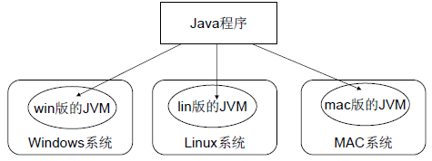
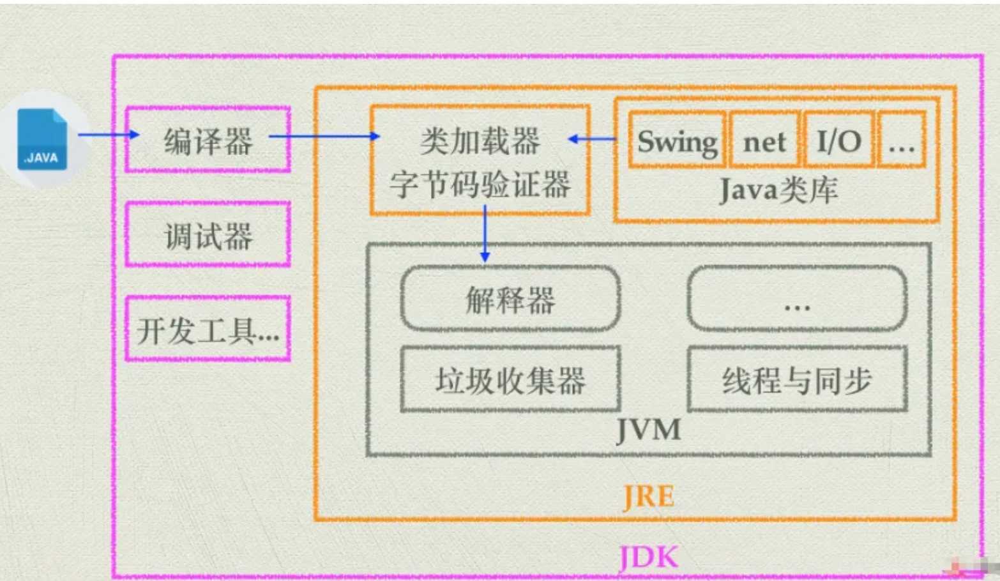
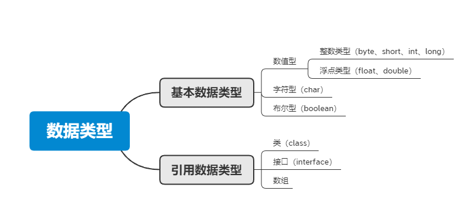
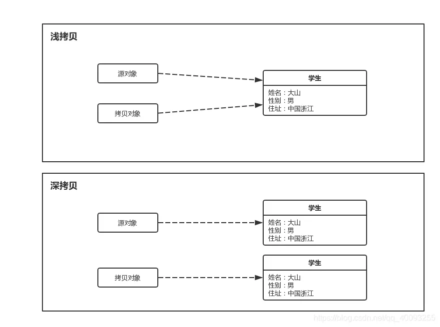

# Java与Go基础面试题
## Java基础知识

### 概念

#### 说一下Java的特点

主要三个方面也就是平台无关性、面向对象和自动内存管理。

- **平台无关性**：Java编译器将开发者源代码编译成字节码（bytecode），该字节码可以在任何安装了Java虚拟机（JVM）的系统上运行，所以Java语言是跨平台的。
- **面向对象**：Java是严格的面向对象编程语言，几乎一切都是对象。面向对象编程（OOP）特性使得代码更易于维护和重用，包括类（class）、对象（object）、继承（inheritance）、多态（polymorphism）、抽象（abstraction）和封装（encapsulation）。
- **内存管理**：Java有自己的垃圾回收机制，不需要开发者手动管理内存，自动管理内存和回收不再使用的对象。但是同样需要注意内存泄漏和其他内存相关的问题。


#### Java为什么是跨平台的？

开发者编写的Java源码由Java编译器（javac）编译后会生成一种 .class 文件，称为字节码文件。**Java虚拟机就是负责将字节码文件翻译成特定平台下的机器码然后运行，所以字节码可以在Java虚拟机（JVM）的上运行，每一种操作系统都有相对应的JVM**，实现了”一次编译，到处运行“的目的，所以说Java语言是跨平台的。

**需要注意的是跨平台的是Java程序，不是JVM。JVM是用C/C++开发的，不能跨平台，不同平台下需要安装不同版本的JVM。**




#### JVM、JDK、JRE三者关系？



它们之间的关系如下：

* JDK是Java开发工具包，是开发Java程序所需的工具集合。**它包含了JVM、编译器（javac）、调试器（jdb）等开发工具，以及一系列的类库（如Java标准库和开发工具库）**。JDK提供了开发、编译、调试和运行Java程序所需的全部工具和环境。
* JRE是Java运行时环境，它包含了JVM和一组Java类库，是Java程序运行所需的最小环境。JRE不包含开发工具，只提供Java程序运行环境。

- JVM是Java虚拟机，是Java程序运行的环境。负责将Java字节码（由Java编译器生成）解释或编译成机器码和内存管理、垃圾回收、安全性等功能，基础上执行程序。同时每一种操作系统都有相对应的JVM，使得Java程序具备跨平台性。


可以简单理解为

* JDK = JRE + 开发工具（javac、jdb等）

* JRE = JVM + 核心类库


#### 为什么Java解释和编译都有？

为了**平衡启动速度和长期运行性能**，所以Java同时采用**解释执行**和**编译执行**（JIT即时编译）的混合模式

##### **1. 编译过程：源码到字节码**

Java的编译第一体现在Java源代码（`.java`文件）通过**编译器（javac）编译为字节码（.class文件）**。字节码是平台无关的中间代码，可视为JVM的“机器语言”。**此时尚未生成机器码**，字节码仍需依赖JVM执行。


##### **2. 解释执行：逐行翻译字节码**

JVM启动时，默认通过**解释器（Interpreter）**逐行解释字节码并执行。所以默认情况下，自解码文件是被解释执行的，方法的优点在于无需等待编译，快速启动，适合短生命周期程序（如命令行工具）。

但逐行解释效率较低，如果再次执行字节码文件还需要重新解释，长时运行的性能较差。


##### **3. JIT编译：运行时优化热点代码**

**JIT（Just-In-Time Compiler）**是 Java虚拟机内部的一个在程序，主要负责：

1. **监控代码执行**：JVM记录每个方法的调用次数。
2. **识别热点代码**：当某个方法调用次数超过阈值（如10,000次），JIT将其标记为“热点代码”。
3. **编译为机器码**：JIT将热点代码对应的字节码**直接编译为本地机器码**（不生成文件，缓存在内存中）。
4. **替换执行方式**：后续调用直接执行编译后的机器码，跳过解释步骤。


#### jvm是什么

JVM是 java 虚拟机，主要工作是将编译器（javac）编译后字节码指令翻译为映射到本地的CPU指令集和OS的系统调用（即机器指令）。

JVM屏蔽了与操作系统平台相关的信息，使得Java程序只需要生成在Java虚拟机上运行的目标代码（字节码），就可在多种平台上不加修改的运行，这也是Java能够“**一次编译，到处运行的**”原因。


#### Python和Java区别是什么？

- Java是一种已编译的编程语言，Java编译器将源代码编译为字节码，而字节码则由Java虚拟机执行
- python是一种解释语言，翻译时会在执行程序的同时进行翻译。


### 数据类型

#### 八种基本的数据类型

Java支持数据类型分为两类： 基本数据类型和引用数据类型。

基本数据类型共有8种，可以分为三类：

- 数值型：整数类型（byte、short、int、long）和浮点类型（float、double）
- 字符型：char
- 布尔型：boolean



8种基本数据类型的默认值、位数、取值范围，如下表所示：

| **数据类型** | **默认值** | **位数** | **取值范围**                         | **说明**                           |
| ------------ | ---------- | -------- | ------------------------------------ | ---------------------------------- |
| **byte**     | 0          | 8位      | -2⁷ 到 2⁷-1                          | 有符号整数，适用于节省内存的场景。 |
| **short**    | 0          | 16位     | -2¹⁵ 到 2¹⁵-1                        | 有符号整数，比int节省内存。        |
| **int**      | 0          | 32位     | -2³¹ 到 2³¹-1                        | 最常用的整数类型。                 |
| **long**     | 0L         | 64位     | -2⁶³ 到 2⁶³-1 (-9.22E18 到 9.22E18)  | 大范围整数，需加`L`后缀。          |
| **float**    | 0.0f       | 32位     | ±1.4E-45 到 ±3.4028235E38            | 单精度浮点数，需加`f`后缀。        |
| **double**   | 0.0d       | 64位     | ±4.9E-324 到 ±1.7976931348623157E308 | 双精度浮点数，默认浮点类型。       |
| **char**     | '\u0000'   | 16位     | 0 到 2¹⁶-1                           | 表示单个字符，使用单引号。         |
| **boolean**  | false      | 1位      | true 或 false                        | 布尔类型，表示逻辑值。             |

Float和Double的最小值和最大值都是以科学记数法的形式输出的，结尾的“E+数字”表示E之前的数字要乘以10的多少次方。比如3.14E3就是3.14×1000=3140，3.14E-3就是3.14/1000=0.00314。

注意一下几点：

- java八种基本数据类型的字节数:1字节(byte、boolean)、 2字节(short、char)、4字节(int、float)、8字节(long、double)
- 整数的默认类型为int（声明Long型在末尾加上l或者L）。浮点数的默认类型为double（如果需要声明一个常量为float型，则必须要在末尾加上f或F）
- 八种基本数据类型的包装类，除了char的是Character、int类型的是Integer，其他都是首字母大写
- char类型是无符号的，不能为负，所以是0开始的


#### 为什么在有些场景下用bigDecimal 不用double ？

因为double会出现精度丢失的问题，double执行的是二进制浮点运算，二进制在有限位数下不能准确的表示一个小数，就像十进制不能准确的表示1/3(1/3=0.3333...)。

二进制决定了java中的double数据类型表示小数的时候只能够表示能够用1/(2^n)的和的任意组合，如像0.1这种不能表示成为1/(2^n)的和的形式的小数java中的double数据类型不能精确表示。

举一个现实例子，在进行商品价格计算的时候，用户手中有0.06元，但无法购买一个0.05元和一个0.01元的商品。因为用double数据类型表示的0.05和0.01的总和为0.060000000000000005。

尤其是当电商网站的并发量上去的时候可能会导致无法下单，或者对账出现问题。比如：

```java
System.out.println(0.05 + 0.01);
System.out.println(1.0 - 0.42);
System.out.println(4.015 * 100);
System.out.println(123.3 / 100);

输出：
0.060000000000000005
0.5800000000000001
401.49999999999994
1.2329999999999999
```

而 Decimal 是精确计算 , 所以一般牵扯到金钱的计算 , 都使用 Decimal。使用`BigDecimal`可以确保精确的十进制数值计算，避免了使用`double`可能出现的舍入误差。需要注意的是，在创建`BigDecimal`对象时，应该使用字符串作为参数，而不是直接使用浮点数值，以避免浮点数精度丢失。

```java
import java.math.BigDecimal;

public class BigDecimalExample {
    public static void main(String[] args) {
        BigDecimal num1 = new BigDecimal("0.1");
        BigDecimal num2 = new BigDecimal("0.2");

        BigDecimal sum = num1.add(num2);
        BigDecimal product = num1.multiply(num2);

        System.out.println("Sum: " + sum);
        System.out.println("Product: " + product);
    }
}

//输出
Sum: 0.3
Product: 0.02
```


#### 装箱和拆箱是什么？自动装箱发生在什么时候？

装箱（Boxing）和拆箱（Unboxing）是将基本数据类型（int等）和对应的包装类（Integer）之间进行转换的过程。

```text
Integer i = 10;  //装箱
int n = i;   //拆箱
```


自动装箱主要发生在两种情况，一种是赋值时，另一种是在方法调用的时候。

##### 1. 赋值时自动装箱

赋值时自动装箱是最常见的一种情况，在Java 1.5以前还需要手动地进行转换才行，而现在所有的转换都是由编译器来完成。

```java
//自动装箱之前的装箱
Integer iObject = Integer.valueOf(3);
//自动装箱之前的拆箱
Int iPrimitive = iObject.intValue()

//在java5自动完成装箱拆箱
Integer iObject = 3; //autobxing - primitive to wrapper conversion
int iPrimitive = iObject; //unboxing - object to primitive conversion
```


##### 2. 方法调用时或集合使用

当在方法调用时或者放入某个集合，同样可以传入原始数据值，同样编译器会进行自动转换对象类。

比如这个show方法接受Integer对象作为参数，当调用`show(3)`时，会将int值转换成对应的Integer对象，这就是所谓的自动装箱，show方法返回Integer对象，而`int result = show(3);`中result为int类型，所以这时候发生自动拆箱操作，将show方法的返回的Integer对象转换成int值。

```java
public static Integer show(Integer iParam){
   System.out.println("autoboxing example - method invocation i: " + iParam);
   return iParam;
}

//autoboxing and unboxing in method invocation
show(3); //autoboxing
int result = show(3); //unboxing because return type of method is Integer
```


自动装箱也有一些缺点，其中最主要是开发者使用不当造成许多冗余包装类对象，影响程序的性能。比如下面这个例子，

下面的代码`sum+=i`可以看成`sum = sum + i`，但是`+`这个操作符不适用于Integer对象，首先sum进行自动拆箱操作，进行数值相加操作，最后发生自动装箱操作转换成Integer对象。

```java
Integer sum = 0; for(int i=1000; i<5000; i++){   sum+=i; } 
```

其内部变化如下

```java
int result = sum.intValue() + i; Integer sum = new Integer(result); 
```

由于声明的sum为Integer类型，在上面的循环中会创建将近4000个无用的Integer对象，在这样庞大的循环中，会降低程序的性能并且加重了垃圾回收的工作量。


#### 为什么要有Integer等包装类？

Integer对应是int类型的包装类，就是把int类型包装成Object对象，对象封装有如下好处。


##### 1.提供了很多使用方法

Integer作为int的包装类，提供了丰富的实用方法，极大地增强了基本数据类型的功能。

包含多种方法，如类型转换方法

- `intValue()`：将Integer对象转换为int基本类型
- `doubleValue()`：转换为double类型
- `longValue()`：转换为long类型
- `toString()`：将Integer转换为字符串表示

静态常用方法

- `Integer.parseInt(String)`：将字符串转换为int
- `Integer.valueOf(String)`：将字符串转换为Integer对象
- `Integer.max(int a, int b)`：返回两个int值中的最大值
- `Integer.min(int a, int b)`：返回两个int值中的最小值
- `Integer.compare(int x, int y)`：**比较两个int值（lamda表达式中自定义比较器常用）**

进制转换方法

- `Integer.toBinaryString(int i)`：转换为二进制字符串
- `Integer.toHexString(int i)`：转换为十六进制字符串
- `Integer.toOctalString(int i)`：转换为八进制字符串

位运算相关方法

- `Integer.bitCount(int i)`：统计二进制中1的个数
- `Integer.highestOneBit(int i)`：返回最高位的1的位置


##### 2. 泛型和集合中的应用

Java 的泛型是 **类型擦除（Type Erasure）** 机制的，泛型信息在 **编译后** 会被擦除，而基本类型无法用 `Object` 表示。

所以在 **Java 泛型** 机制下，**泛型参数** 不能是基本数据类型（如 `int`、`double`、`char` 等），只能使用引用类型。


例如，假设有一个列表，需求是想要将其元素排序，并将排序结果存储在一个新的列表中。显然可以使用Collections.sort()方法。但Collections是集合的工具类只能接受对象，所以要转化为Integer。

```java
List<Integer> list = new ArrayList<>();
list.add(3);  // 自动装箱 int -> Integer
list.add(1);
list.add(2);
Collections.sort(list);
System.out.println(list);  // 输出：[1, 2, 3]
```


**Java 集合框架（如 ArrayList、HashMap）只能存储对象，而不能存储基本数据类型**。因为 **集合存储的是对象的引用**，而 `int`、`double` 这些基本类型 **不是对象**，所以必须使用它们的 **包装类**（如 `Integer`）。

**在存入集合时，Java 会自动将 int 转换为 Integer（自动装箱）**，在取出时会自动拆箱。

```java
List<Integer> list = new ArrayList<>();
list.add(3);  // 自动装箱 int -> Integer
list.add(1);
list.add(2);

// 计算所有元素的总和
int sum = list.stream().mapToInt(Integer::intValue).sum(); // 自动拆箱 Integer -> int
System.out.println(sum);  // 输出：6
```


##### 3. **兼容面向对象设计**

简单就是包装类可参与多态、反射等面向对象特性，好像没啥好说的。


**Q：什么叫类型擦除（Type Erasure） 机制？**

A：**类型擦除（Type Erasure）** 是 Java 泛型的一种实现机制。因为泛型后面的版本引入的。它的作用是 **在编译时** 将泛型类型 **转换为原始类型**（即删除所有泛型信息），从而实现 **兼容旧版本的代码**（即不使用泛型的老版本代码），使得 Java 泛型能够与原始 Java 类型兼容。

举个例子来说，在编译后，`Box<T>` 会被擦除为 `Box` 类，类型参数 `T` 会被替换成 `Object`，因此最终的字节码中，实际上存在的是一个 **无类型的 Box 类**，并且 `T` 被视为 `Object` 类型。

```java
// 泛型类
public class Box<T> {
    private T value;
    public void setValue(T value) {
        this.value = value;
    }
    public T getValue() {
        return value;
    }
}
```

如果创建了 `Box<Integer>` 和 `Box<String>`：

```java
Box<Integer> intBox = new Box<>();
Box<String> strBox = new Box<>();
```

通过反射等机制查看编译后的字节码时，无法知道 `Box` 是基于 `Integer` 还是 `String`，因为泛型信息已经消失。

至于安全问题，在编译时会对泛型类型进行检查，若出现类型不匹配的情况直接会报错。


#### Integer相比int有什么优点？

int是Java中的原始数据类型，而Integer是int的包装类。

Integer和 int 的区别：

- 基本类型和引用类型：首先，int是一种基本数据类型，而Integer是一种引用类型。基本数据类型是Java中最基本的数据类型，它们是预定义的，不需要实例化就可以使用。而引用类型则需要通过实例化对象来使用。这意味着，使用int来存储一个整数时，不需要任何额外的内存分配，而使用Integer时，必须为对象分配内存。在性能方面，基本数据类型的操作通常比相应的引用类型快。
- 自动装箱和拆箱：其次，Integer作为int的包装类，它可以实现自动装箱和拆箱。自动装箱是指将基本类型转化为相应的包装类类型，而自动拆箱则是将包装类类型转化为相应的基本类型。这使得Java程序员更加方便地进行数据类型转换。例如，当我们需要将int类型的值赋给Integer变量时，Java可以自动地将int类型转换为Integer类型。同样地，当我们需要将Integer类型的值赋给int变量时，Java可以自动地将Integer类型转换为int类型。
- 空指针异常：另外，int变量可以直接赋值为0，而Integer变量必须通过实例化对象来赋值。如果对一个未经初始化的Integer变量进行操作，就会出现空指针异常。这是因为它被赋予了null值，而null值是无法进行自动拆箱的。

| **比较维度**    | **int（基本数据类型）**         | **Integer（包装类）**                             |
| ----------- | ----------------------- | -------------------------------------------- |
| **数据类型**    | 基本数据类型（primitive type）  | 引用类型（reference type）                         |
| **存储方式**    | 直接存储数值在栈内存中             | 存储在堆内存中，指向对象的引用在栈上                           |
| **内存占用**    | 只占用 4 个字节               | 需要额外的对象头信息，占用更多内存                            |
| **性能**      | 操作速度更快（直接存储数值）          | 由于涉及对象操作，性能相对较慢                              |
| **自动装箱/拆箱** | 不支持                     | 支持自动装箱（int → Integer）和拆箱（Integer → int）      |
| **默认值**     | 默认值为 `0`                | 默认值为 `null`，可能导致 `NullPointerException`      |
| **适用场景**    | 适用于高性能计算、基本运算等          | 适用于需要对象存储（如集合 `List<Integer>`）或 `null` 赋值的情况 |
| **与泛型兼容性**  | 不能直接用于泛型                | 可以作为泛型参数，如 `List<Integer>`                   |
| **比较方式**    | 直接比较数值 (`==`、`<`、`>` 等) | 需要使用 `equals()` 进行值比较，`==` 比较时可能出错（因引用不同）    |


#### 为什么有了Integer的还要保留int类型？

包装类是引用类型，对象的引用和对象本身是分开存储的，而对于基本类型数据，变量对应的内存块直接存储数据本身。

因此，基本类型数据在读写效率方面，要比包装类高效。除此之外，在64位JVM上，在开启引用压缩的情况下，一个Integer对象占用16个字节的内存空间，而一个int类型数据只占用4字节的内存空间，前者对空间的占用是后者的4倍。

也就是说，不管是读写效率，还是存储效率，基本类型都比包装类高效。


#### 说一下 integer的缓存？

为了提升性能，Java的Integer类内部实现了一个静态缓存池，用于常用整数-128至127内的整数值对应的Integer对象。

当通过Integer.valueOf(int)方法创建一个在这个范围内的整数对象时，并不会每次都生成新的对象实例，而是复用缓存中的现有对象，会直接从内存中取出，不需要新建一个对象。


### 面向对象

#### 怎么理解面向对象？简单说说封装继承多态

面向对象是一种编程范式，它**将现实世界中的事物抽象为对象**，对象具有属性（称为字段或属性）和行为（称为方法）。面向对象编程的设计思想是以对象为中心，通过对象之间的交互来完成程序的功能，具有灵活性和可扩展性，通过封装和继承可以更好地应对需求变化。

Java面向对象的三大特性包括：**封装、继承、多态**：

- **封装**：封装是指将对象的属性（数据）和行为（方法）结合在一起，对外隐藏对象的内部细节，仅通过对象提供的接口与外界交互。封装的目的是增强安全性和简化编程，使得对象更加独立。
- **继承**：继承是一种可以使得子类自动共享父类数据结构和方法的机制。它是代码复用的重要手段，通过继承可以建立类与类之间的层次关系，使得结构更加清晰。
- **多态**：多态是指允许不同类的对象对同一消息作出响应。即同一个接口，使用不同的实例而执行不同操作。多态性可以分为编译时多态（重载）和运行时多态（重写）。它使得程序具有良好的灵活性和扩展性。


#### 重载与重写有什么区别？

- 重载（Overloading）指的是在同一个类中，可以有多个同名方法，它们具有不同的参数列表（参数类型、参数个数或参数顺序不同），编译器根据调用时的参数类型来决定调用哪个方法。
- 重写（Overriding）指的是子类可以重新定义父类中的方法，方法名、参数列表和返回类型必须与父类中的方法一致，通过@override注解来明确表示这是对父类方法的重写。

重载是指在同一个类中定义多个同名方法，而重写是指子类重新定义父类中的方法。


#### 抽象类和普通类区别？

- 实例化：普通类可以直接实例化对象，而抽象类不能被实例化，只能被继承。
- 方法实现：普通类中的方法可以有具体的实现，而抽象类中的方法可以有实现也可以没有实现。
- 继承：一个类可以继承一个普通类，而且可以继承多个接口；而一个类只能继承一个抽象类，但可以同时实现多个接口。
- 实现限制：普通类可以被其他类继承和使用，而抽象类一般用于作为基类，被其他类继承和扩展使用。


#### Java抽象类和接口的区别是什么？

**两者的特点：**

- 抽象类用于描述类的共同特性和行为，可以有成员变量、构造方法和具体方法。适用于有明显继承关系的场景。
- 接口用于定义行为规范，可以多实现，只能有常量和抽象方法（Java 8 以后可以有默认方法和静态方法）。适用于定义类的能力或功能。

**两者的区别：**

- 实现方式：实现接口的关键字为implements，继承抽象类的关键字为extends。一个类可以实现多个接口，但一个类只能继承一个抽象类。所以，使用接口可以间接地实现多重继承。
- 方法方式：接口只有定义，不能有方法的实现，java 1.8中可以定义default方法体，而抽象类可以有定义与实现，方法可在抽象类中实现。
- 访问修饰符：接口成员变量默认为public static final，必须赋初值，不能被修改；其所有的成员方法都是public、abstract的。抽象类中成员变量默认default，可在子类中被重新定义，也可被重新赋值；抽象方法被abstract修饰，不能被private、static、synchronized和native等修饰，必须以分号结尾，不带花括号。
- 变量：抽象类可以包含实例变量和静态变量，而接口只能包含常量（即静态常量）。


#### 抽象类能加final修饰吗？

**不能**，Java中的抽象类是用来被继承的，而final修饰符用于禁止类被继承或方法被重写，因此，抽象类和final修饰符是互斥的，不能同时使用。


#### 接口里面可以定义哪些方法？

##### 1. **抽象方法**

抽象方法是接口的核心部分，所有实现接口的类都必须实现这些方法。抽象方法默认是 public 和 abstract，这些修饰符可以省略。

```java
public interface Animal {
    void makeSound();
}
```


##### 2. **默认方法**

默认方法是在 Java 8 中引入的，允许接口提供具体实现。实现类可以选择重写默认方法。

```java
public interface Animal {
    void makeSound();
    
    default void sleep() {
        System.out.println("Sleeping...");
    }
}
```


##### 3. **静态方法**

静态方法也是在 Java 8 中引入的，它们属于接口本身，可以通过接口名直接调用，而不需要实现类的对象。

```java
public interface Animal {
    void makeSound();
    
    static void staticMethod() {
        System.out.println("Static method in interface");
    }
}
```


##### 4. **私有方法**

私有方法是在 Java 9 中引入的，用于在接口中为默认方法或其他私有方法提供辅助功能。这些方法不能被实现类访问，只能在接口内部使用。

```java
public interface Animal {
    void makeSound();
    
    default void sleep() {
        System.out.println("Sleeping...");
        logSleep();
    }
    
    private void logSleep() {
        System.out.println("Logging sleep");
    }
}
public interface Animal {
    void makeSound();
}
```


#### 抽象类可以被实例化吗？

在Java中，抽象类本身不能被实例化。但通过继承抽象类并实现所有抽象方法的子类是可以被实例化的。


#### 接口可以包含构造函数吗？

在接口中，不可以有构造方法,在接口里写入构造方法时，编译器提示：Interfaces cannot have constructors，因为接口不会有自己的实例的，所以不需要有构造函数。

为什么呢？构造函数就是初始化class的属性或者方法，在new的一瞬间自动调用，那么问题来了Java的接口，都不能new 那么要构造函数干嘛呢？根本就没法调用


#### 非静态内部类和静态内部类的区别？

区别包括：

- 非静态内部类依赖于外部类的实例，而静态内部类不依赖于外部类的实例。
- 非静态内部类可以访问外部类的实例变量和方法，而静态内部类只能访问外部类的静态成员。
- 非静态内部类不能定义静态成员，而静态内部类可以定义静态成员。
- 非静态内部类在外部类实例化后才能实例化，而静态内部类可以独立实例化。
- 非静态内部类可以访问外部类的私有成员，而静态内部类不能直接访问外部类的私有成员，需要通过实例化外部类来访问。


#### 非静态内部类可以直接访问外部方法，编译器是怎么做到的？

非静态内部类可以直接访问外部方法是因为编译器在生成字节码时会为非静态内部类维护一个指向外部类实例的引用。

这个引用使得非静态内部类能够访问外部类的实例变量和方法。编译器会在生成非静态内部类的构造方法时，将外部类实例作为参数传入，并在内部类的实例化过程中建立外部类实例与内部类实例之间的联系，从而实现直接访问外部方法的功能。


#### 有一个父类和子类，都有静态的成员变量、静态构造方法和静态方法，在我new一个子类对象的时候，加载顺序是怎么样的？

当你实例化一个子类对象时，静态成员变量、静态构造方法和静态方法的加载顺序遵循以下步骤：

- 在创建子类对象之前，首先会加载父类的静态成员变量和静态代码块（构造方法无法被 `static` 修饰，因此这里是静态代码块）。这个加载是在类首次被加载时进行的，且只会发生一次。
- 接下来，加载子类的静态成员变量和静态代码块。这一过程也只发生一次，即当首次使用子类的相关代码时。
- 之后，执行实例化子类对象的过程。这时会呼叫父类构造方法，然后是子类的构造方法。

具体加载顺序可以简要总结为：

- **父类静态成员变量、静态代码块**（如果有）
- **子类静态成员变量、静态代码块**（如果有）
- **父类构造方法**（实例化对象时）
- **子类构造方法**（实例化对象时）

示例代码

```java
class Parent {
    static {
        System.out.println("Parent static block");
    }
    static int parentStaticVar = 10;

    Parent() {
        System.out.println("Parent constructor");
    }
}

class Child extends Parent {
    static {
        System.out.println("Child static block");
    }
    static int childStaticVar = 20;

    Child() {
        System.out.println("Child constructor");
    }
}

public class Main {
    public static void main(String[] args) {
        Child c = new Child();
    }
}
```

输出结果

```java
Parent static block
Child static block
Parent constructor
Child constructor
```

从输出可以看出，在创建 `Child` 类型对象时，首先执行父类的静态块，然后是子类的静态块，最后才是父类和子类的构造函数。这清晰地展示了加载的顺序。


### 深拷贝和浅拷贝

#### 深拷贝和浅拷贝的区别？



- 浅拷贝是指只复制对象本身和其内部的值类型字段，但不会复制对象内部的引用类型字段。换句话说，浅拷贝只是创建一个新的对象，然后将原对象的字段值复制到新对象中，但如果原对象内部有引用类型的字段，只是将引用复制到新对象中，两个对象指向的是同一个引用对象。
- 深拷贝是指在复制对象的同时，将对象内部的所有引用类型字段的内容也复制一份，而不是共享引用。换句话说，深拷贝会递归复制对象内部所有引用类型的字段，生成一个全新的对象以及其内部的所有对象。


#### 实现深拷贝的三种方法是什么？

在 Java 中，实现对象深拷贝的方法有以下几种主要方式：


##### 1. 实现 Cloneable 接口并重写 clone() 方法

这种方法要求对象及其所有引用类型字段都实现 Cloneable 接口，并且重写 clone() 方法。在 clone() 方法中，通过递归克隆引用类型字段来实现深拷贝。

```java
class MyClass implements Cloneable {
    private String field1;
    private NestedClass nestedObject;

    @Override
    protected Object clone() throws CloneNotSupportedException {
        MyClass cloned = (MyClass) super.clone();
        cloned.nestedObject = (NestedClass) nestedObject.clone(); // 深拷贝内部的引用对象
        return cloned;
    }
}

class NestedClass implements Cloneable {
    private int nestedField;

    @Override
    protected Object clone() throws CloneNotSupportedException {
        return super.clone();
    }
}
```


##### 2. 使用序列化和反序列化

通过将对象序列化为字节流，再从字节流反序列化为对象来实现深拷贝。要求对象及其所有引用类型字段都实现 Serializable 接口。

```java
import java.io.*;

class MyClass implements Serializable {
    private String field1;
    private NestedClass nestedObject;

    public MyClass deepCopy() {
        try {
            ByteArrayOutputStream bos = new ByteArrayOutputStream();
            ObjectOutputStream oos = new ObjectOutputStream(bos);
            oos.writeObject(this);
            oos.flush();
            oos.close();

            ByteArrayInputStream bis = new ByteArrayInputStream(bos.toByteArray());
            ObjectInputStream ois = new ObjectInputStream(bis);
            return (MyClass) ois.readObject();
        } catch (IOException | ClassNotFoundException e) {
            e.printStackTrace();
            return null;
        }
    }
}

class NestedClass implements Serializable {
    private int nestedField;
}
```


##### 3. 手动递归复制

针对特定对象结构，手动递归复制对象及其引用类型字段。适用于对象结构复杂度不高的情况。

```java
class MyClass {
    private String field1;
    private NestedClass nestedObject;

    public MyClass deepCopy() {
        MyClass copy = new MyClass();
        copy.setField1(this.field1);
        copy.setNestedObject(this.nestedObject.deepCopy());
        return copy;
    }
}

class NestedClass {
    private int nestedField;

    public NestedClass deepCopy() {
        NestedClass copy = new NestedClass();
        copy.setNestedField(this.nestedField);
        return copy;
    }
}
```


### String

#### String类底层如何实现？

**底层数据类型：**

- 在JDK1.8之前，底层使用的是char类型的数组：`private final char value[]`
- 在JDK1.9以后，底层是byte类型的数组：`private final byte[] value`

**String类能被继承吗？**

不能被继承，因为String类有final修饰符，而final修饰的类是不能被继承的。Java中对String类的定义：`public final class String implements ...`

**String是不可变的，如何实现？**

- 保存字符串的数组被final修饰且为私有的，并且String类没有提供/暴露修改这个字符串的方法
- String类被final修饰导致其不能被继承，进而避免了子类破坏String不可变

**String存储有长度限制吗？**

有，编译期和运行期不一样。

- **编译期**：需要用CONSTANT_Utf8_info结构用于表示字符串常量的值，而这个结构是有长度限制，它的限制是65535
- **运行期**：String的length参数是int类型的，那么也就是说，String定义的时候，最大支持的长度就是int的最大范围值。根据Integer类的定义java.lang.Integer#MAX_VALUE的最大值是2³¹-1

#### 为什么要把String设计成不可变的？

主要是从缓存(内存、性能)、安全性、线程安全等角度出发的。

##### 1. 缓存

字符串是使用最广泛的数据结构。大量的字符串的创建是非常耗费资源的，所以，Java提供了对字符串的缓存功能，可以大大的节省堆空间。

JVM中专门开辟了一部分空间来存储Java字符串，那就是字符串池。通过字符串池，两个内容相同的字符串变量，可以指向字符串池中同一个字符串对象，从而节省了内存资源，性能上也更为高效。

```java
String s = "abcd";
String s2 = s;
```

对于这个例子，s和s2都表示"abcd"，所以他们会指向字符串池中的同一个字符串对象。

但是，之所以可以这么做，主要是因为字符串的不变性。试想一下，如果字符串是可变的，我们一旦修改了s的内容，那必然导致s2的内容也被动的改变了，这显然不是我们想看到的。

##### 2. 安全性

字符串在Java应用程序中广泛用于存储敏感信息，如用户名、密码、连接url、网络连接等。JVM类加载器在加载类的时也广泛地使用它。因此，保护String类对于提升整个应用程序的安全性至关重要。

当我们在程序中传递一个字符串的时候，如果这个字符串的内容是不可变的，那么我们就可以相信这个字符串中的内容。但是，如果是可变的，那么这个字符串内容就可能随时都被修改。那么这个字符串内容就完全不可信了。这样整个系统就没有安全性可言了。

##### 3. 线程安全

不可变会自动使字符串成为线程安全的，因为当从多个线程访问它们时，它们不会被更改。

因此，一般来说，不可变对象可以在同时运行的多个线程之间共享。它们也是线程安全的，因为如果线程更改了值，那么将在字符串池中创建一个新的字符串，而不是修改相同的值。因此，字符串对于多线程来说是安全的。

#### 字符串常量池是什么？

Java中，字符串是不可变的，这就意味着一旦创建了一个字符串对象，它的值就不能被修改。为了提高性能和减少内存占用，Java使用了字符串常量池的概念。

字符串常量池是堆内存中的一个区域，所有在程序中定义的字符串都存储在这里。当程序中创建字符串常量时，这些字符串常量会被存储在字符串常量池中。如果后续的代码中创建了相同内容的字符串常量，Java不会再创建新的对象，而是直接引用已经存在的字符串常量。这就意味着多个引用可以指向相同的字符串。

```java
String s1 = "Hello";
String s2 = "Hello";
String s3 = new String("Hello").intern(); // 使用了intern()方法，指向了相同的字符串常量
System.out.println(s1 == s2); // true，引用相同的字符串常量
System.out.println(s1 == s3); // true，引用相同的字符串常量
```

#### String/StringBuffer/StringBuilder的区别？

三者的区别主要集中在不可变性、线程安全和性能方面：

##### 1. String（不可变，线程安全）

- String是不可变的，一旦创建了字符串对象，其值就不能被修改。对字符串的任何修改都会创建一个新的字符串对象。
- String是线程安全的，因为它的不可变性使得多个线程可以同时访问同一个字符串对象而不会发生竞争条件。
- 由于不可变性，对字符串的修改操作（例如连接、截取）可能会导致创建新的字符串对象，影响性能。

##### 2. StringBuffer（可变、线程安全）

- StringBuffer是可变的，它允许在同一对象上执行修改操作，而不创建新的对象。
- StringBuffer是线程安全的，它的方法是同步的，可以安全地在多个线程中使用。
- 由于可变性，StringBuffer适用于在多线程环境中进行字符串操作，但在单线程环境中，相比StringBuilder，可能会有一些性能开销。

##### 3. StringBuilder（可变、非线程安全）

- StringBuilder也是可变的，类似于StringBuffer。
- StringBuilder是非线程安全的，它的方法没有同步，因此在多线程环境中使用时需要注意同步问题。
- 由于可变性，StringBuilder适用于在单线程环境中进行字符串操作，且通常比StringBuffer性能更好，因为它不需要同步。

**综合来说**，String适用于不经常修改的情况，而StringBuffer和StringBuilder适用于需要频繁修改字符串的情况，具体选择取决于是否需要线程安全以及性能的考虑。

### 异常

#### Error和Exception的区别？

##### Error（错误）

- **系统级严重问题**：通常由JVM或底层系统资源不足引发，如内存溢出（OutOfMemoryError）、栈溢出（StackOverflowError）等。
- **无法通过代码恢复**：不能指望程序来处理这样的问题，程序通常只能终止运行，一般不建议捕获处理。

##### Exception（异常）

- **程序级可处理问题**：由程序逻辑或外部输入导致，如文件不存在（FileNotFoundException）、空指针异常（NullPointerException）等，是由于程序设计的不完善而出现的问题。
- **可通过代码捕获和处理**：使用try-catch或throws抛出进行控制。

#### 异常的分类和区别？

Java中的异常分为两大类：受检异常(或叫编译时异常)和非受检异常(或叫运行时异常)。

##### 1. 受检异常(或叫编译时异常)

通常指那些需要在代码中显式处理的异常。这些异常在编译时即可被发现，可以通过捕获或声明抛出来处理。

**常见的例如：**

- IOException：表示输入/输出操作时发生的异常。
- SQLException：表示与数据库相关的异常。
- ClassNotFoundException：表示找不到类文件的异常。
- InterruptedException：表示线程阻塞时被打断的异常。

##### 2. 非受检异常(或叫运行时异常)

在程序运行时期间发生的异常，继承自RuntimeException。在编写代码的时候，不需要显式的捕获，但是如果不捕获，在运行期如果发生异常就会中断程序的执行。这种异常一般可以理解为是代码原因导致的。比如发生空指针、数组越界等。所以，只要代码写的没问题，这些异常都是可以避免的。也就不需要我们显示的进行处理。

**常见的例如：**

- NullPointerException：表示尝试访问空引用时发生的异常。
- ArrayIndexOutOfBoundsException：表示数组下标越界的异常。
- ClassCastException：表示尝试类型转换时出错的异常。
- OutOfMemoryError：表示内存不足的异常。

#### throw与throws的核心区别？

在Java中，throw和throws是两个与异常处理相关的关键字，但它们的用途和用法完全不同：

##### 1. throw关键字

- **作用**：在方法内部主动抛出一个异常对象
- **语法**：`throw new 异常类("错误信息");`
- **使用场景**：当程序检测到某种错误条件时，主动创建并抛出异常
- **关键点**：
    - throw后面必须跟一个异常对象（如new Exception()）
    - 执行throw语句后，方法立即终止，后续代码不会执行
    - 可以抛出受检异常或非受检异常，但抛出受检异常时必须在方法签名中用throws声明

##### 2. throws关键字

- **作用**：在方法签名中声明该方法可能抛出的异常
- **语法**：`返回类型 方法名(参数列表) throws 异常类1, 异常类2... { ... }`
- **使用场景**：当方法内部可能抛出受检异常，但不打算在当前方法处理时
- **关键点**：
    - throws后面可以跟多个异常类，用逗号分隔
    - 调用声明了受检异常的方法时，必须用try-catch捕获或继续用throws声明
    - 非受检异常（如RuntimeException）无需在throws中声明

#### finally中的代码一定会被执行吗？

正常运行的情况下，finally中的代码是一定会执行的。但是，如果遇到以下异常情况，那么finally中的代码就不会继续执行了：

##### 1. System.exit()方法

程序在try块中遇到System.exit()方法，会立即终止程序的执行，这时finally块中的代码不会被执行，例如以下代码：

```java
public class FinallyExample {
    public static void main(String[] args) {
        try {
            System.out.println("执行 try 代码.");
            System.exit(0);
        } finally {
            System.out.println("执行 finally 代码.");
        }
    }
}
```

##### 2. Runtime.getRuntime().halt()方法

在try块中遇到Runtime.getRuntime().halt()代码，强制终止正在运行的JVM。与System.exit()方法不同，此方法不会触发JVM关闭序列。因此，当我们调用halt方法时，都不会执行关闭钩子或终结器。实现代码如下：

```java
public class FinallyExample {
    public static void main(String[] args) {
        try {
            System.out.println("执行 try 代码.");
            Runtime.getRuntime().halt(0);
        } finally {
            System.out.println("执行 finally 代码.");
        }
    }
}
```

##### 3. 其他异常情况

- 程序在try块中遇到死循环或者发生死锁等情况时，程序可能无法正常跳出try块，此时finally块中的代码也不会被执行。
- 掉电问题，程序还没有执行到finally就掉电了（停电了），那finally中的代码自然也不会执行。
- JVM异常崩溃问题导致程序不能继续执行，那么finally的代码也不会执行。

### IO

#### AIO、BIO、NIO的区别？

##### 1. BIO (Blocking I/O)

BIO就是传统的java.io包，它是基于流模型实现的，交互的方式是同步、阻塞方式，也就是说在读入输入流或者输出流时，在读写动作完成之前，线程会一直阻塞在那里，它们之间的调用是可靠的线性顺序。

- **优点**：代码比较简单、直观
- **缺点**：IO的效率和扩展性很低，容易成为应用性能瓶颈

##### 2. NIO (Non-Blocking I/O)

NIO是Java 1.4引入的java.nio包，提供了Channel、Selector、Buffer等新的抽象，可以构建多路复用的、同步、非阻塞IO程序，同时提供了更接近操作系统底层高性能的数据操作方式。

##### 3. AIO (Asynchronous I/O)

AIO是Java 1.7之后引入的包，是NIO的升级版本，提供了异步、非阻塞的IO操作方式，所以人们叫它AIO（Asynchronous IO）。异步IO是基于事件和回调机制实现的，也就是应用操作之后会直接返回，不会堵塞在那里，当后台处理完成，操作系统会通知相应的线程进行后续的操作。

#### 同步与异步的区别？

**同步**就是一个任务的完成需要依赖另外一个任务时，只有等待被依赖的任务完成后，依赖的任务才能算完成，这是一种可靠的任务序列。要么成功都成功，失败都失败，两个任务的状态可以保持一致。

**异步**是不需要等待被依赖的任务完成，只是通知被依赖的任务要完成什么工作，依赖的任务也立即执行，只要自己完成了整个任务就算完成了。至于被依赖的任务最终是否真正完成，依赖它的任务无法确定，所以它是不可靠的任务序列。

**我们可以用打电话和发短信来很好的比喻同步与异步操作。**

#### 阻塞与非阻塞的区别？

阻塞与非阻塞主要是从CPU的消耗上来说的。

**阻塞**就是CPU停下来等待一个慢的操作完成，CPU才接着完成其它的事。

**非阻塞**就是在这个慢的操作在执行时，CPU去干其它别的事，等这个慢的操作完成时，CPU再接着完成后续的操作。

虽然表面上看非阻塞的方式可以明显的提高CPU的利用率，但是也带了另外一种后果就是系统的线程切换增加。增加的CPU使用时间能不能补偿系统的切换成本需要好好评估。

**同步不一定阻塞，异步也不一定非阻塞。没有必然关系。**


## 新特性


## Golang核心基础知识
### 协程(goroutine)


### Go的channel


### Go的context上下文管理