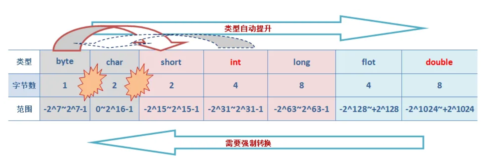

# Java基础面试题

### 概念

#### 说一下Java的特点

主要三个方面也就是平台无关性、面向对象和自动内存管理。

- **平台无关性**：Java编译器将开发者源代码编译成字节码（bytecode），该字节码可以在任何安装了Java虚拟机（JVM）的系统上运行，所以Java语言是跨平台的。
- **面向对象**：Java是严格的面向对象编程语言，几乎一切都是对象。面向对象编程（OOP）特性使得代码更易于维护和重用，包括类（class）、对象（object）、继承（inheritance）、多态（polymorphism）、抽象（abstraction）和封装（encapsulation）。
- **内存管理**：Java有自己的垃圾回收机制，不需要开发者手动管理内存，自动管理内存和回收不再使用的对象。但是同样需要注意内存泄漏和其他内存相关的问题。


#### Java为什么是跨平台的？

开发者编写的Java源码由Java编译器（javac）编译后会生成一种 .class 文件，称为字节码文件。Java虚拟机就是负责将字节码文件翻译成特定平台下的机器码然后运行，所以字节码可以在Java虚拟机（JVM）的上运行，每一种操作系统都有相对应的JVM，实现了”一次编译，到处运行“的目的，所以说Java语言是跨平台的。

**需要注意的是跨平台的是Java程序，不是JVM。JVM是用C/C++开发的，不能跨平台，不同平台下需要安装不同版本的JVM。**


#### JVM、JDK、JRE三者关系？


它们之间的关系如下：

* JDK是Java开发工具包，是开发Java程序所需的工具集合。**它包含了JVM、编译器（javac）、调试器（jdb）等开发工具，以及一系列的类库（如Java标准库和开发工具库）**。JDK提供了开发、编译、调试和运行Java程序所需的全部工具和环境。
* JRE是Java运行时环境，它包含了JVM和一组Java类库，是Java程序运行所需的最小环境。JRE不包含开发工具，只提供Java程序运行环境。

- JVM是Java虚拟机，是Java程序运行的环境。负责将Java字节码（由Java编译器生成）解释或编译成机器码和内存管理、垃圾回收、安全性等功能，基础上执行程序。同时每一种操作系统都有相对应的JVM，使得Java程序具备跨平台性。


可以简单理解为

* JDK = JRE + 开发工具（javac、jdb等）

* JRE = JVM + 核心类库


#### 为什么Java解释和编译都有？

为了**平衡启动速度和长期运行性能**，所以Java同时采用**解释执行**和**编译执行**（JIT即时编译）的混合模式

##### **1. 编译过程：源码到字节码**

Java的编译第一体现在Java源代码（`.java`文件）通过**编译器（javac）编译为字节码（.class文件）**。字节码是平台无关的中间代码，可视为JVM的“机器语言”。**此时尚未生成机器码**，字节码仍需依赖JVM执行。


##### **2. 解释执行：逐行翻译字节码**

JVM启动时，默认通过**解释器（Interpreter）**逐行解释字节码并执行。所以默认情况下，自解码文件是被解释执行的，方法的优点在于无需等待编译，快速启动，适合短生命周期程序（如命令行工具）。

但逐行解释效率较低，如果再次执行字节码文件还需要重新解释，长时运行的性能较差。


##### **3. JIT编译：运行时优化热点代码**

**JIT（Just-In-Time Compiler）**是 Java虚拟机内部的一个在程序，主要负责：

1. **监控代码执行**：JVM记录每个方法的调用次数。
2. **识别热点代码**：当某个方法调用次数超过阈值（如10,000次），JIT将其标记为“热点代码”。
3. **编译为机器码**：JIT将热点代码对应的字节码**直接编译为本地机器码**（不生成文件，缓存在内存中）。
4. **替换执行方式**：后续调用直接执行编译后的机器码，跳过解释步骤。


#### jvm是什么

JVM是 java 虚拟机，主要工作是将编译器（javac）编译后字节码指令翻译为映射到本地的CPU指令集和OS的系统调用（即机器指令）。

JVM屏蔽了与操作系统平台相关的信息，使得Java程序只需要生成在Java虚拟机上运行的目标代码（字节码），就可在多种平台上不加修改的运行，这也是Java能够“**一次编译，到处运行的**”原因。


#### **编译型语言和解释型语言的区别？**

编译型语言和解释型语言的区别在于：

- 编译型语言：在程序执行之前，整个源代码会被编译成机器码或者字节码，生成可执行文件。执行时直接运行编译后的代码，速度快，但跨平台性较差。
- 解释型语言：在程序执行时，逐行解释执行源代码，不生成独立的可执行文件。通常由解释器动态解释并执行代码，跨平台性好，但执行速度相对较慢。
- 典型的编译型语言如C、C++，典型的解释型语言如Python、JavaScript。

| **特性**       | **编译型语言**                                 | **解释型语言**                                       |
| -------------- | ---------------------------------------------- | ---------------------------------------------------- |
| **编译过程**   | 源代码在运行前被**完全编译**为机器码或字节码。 | 源代码在运行时由解释器**逐行解释执行**。             |
| **可执行文件** | 生成独立的可执行文件（如.exe、.out）。         | 不生成独立的可执行文件，直接运行源代码。             |
| **执行速度**   | **快**，直接运行编译后的机器码。               | **较慢**，逐行解释执行。                             |
| **跨平台性**   | **较差**，编译后的机器码依赖于特定平台。       | **较好**，解释器可在不同平台上运行同一份源代码。     |
| **调试便捷性** | 调试较复杂，需重新编译。                       | 调试方便，修改代码后可直接运行。                     |
| **典型语言**   | C、C++、Go、Rust                               | Python、JavaScript、Ruby、PHP                        |
| **内存占用**   | 运行时内存占用较低，编译过程占用较多内存。     | 运行时内存占用较高，解释器需加载源代码和运行时环境。 |
| **适用场景**   | 高性能、系统级开发（如操作系统、游戏引擎）。   | 快速开发、脚本编写、Web开发。                        |


#### Python和Java区别是什么？

- Java是一种已编译的编程语言，Java编译器将源代码编译为字节码，而字节码则由Java虚拟机执行
- python是一种解释语言，翻译时会在执行程序的同时进行翻译。


### 数据类型

#### 八种基本的数据类型

Java支持数据类型分为两类： 基本数据类型和引用数据类型。

基本数据类型共有8种，可以分为三类：

- 数值型：整数类型（byte、short、int、long）和浮点类型（float、double）
- 字符型：char
- 布尔型：boolean


8种基本数据类型的默认值、位数、取值范围，如下表所示：

| **数据类型** | **默认值** | **位数** | **取值范围**                         | **说明**                           |
| ------------ | ---------- | -------- | ------------------------------------ | ---------------------------------- |
| **byte**     | 0          | 8位      | -2⁷ 到 2⁷-1                          | 有符号整数，适用于节省内存的场景。 |
| **short**    | 0          | 16位     | -2¹⁵ 到 2¹⁵-1                        | 有符号整数，比int节省内存。        |
| **int**      | 0          | 32位     | -2³¹ 到 2³¹-1                        | 最常用的整数类型。                 |
| **long**     | 0L         | 64位     | -2⁶³ 到 2⁶³-1 (-9.22E18 到 9.22E18)  | 大范围整数，需加`L`后缀。          |
| **float**    | 0.0f       | 32位     | ±1.4E-45 到 ±3.4028235E38            | 单精度浮点数，需加`f`后缀。        |
| **double**   | 0.0d       | 64位     | ±4.9E-324 到 ±1.7976931348623157E308 | 双精度浮点数，默认浮点类型。       |
| **char**     | '\u0000'   | 16位     | 0 到 2¹⁶-1                           | 表示单个字符，使用单引号。         |
| **boolean**  | false      | 1位      | true 或 false                        | 布尔类型，表示逻辑值。             |

Float和Double的最小值和最大值都是以科学记数法的形式输出的，结尾的“E+数字”表示E之前的数字要乘以10的多少次方。比如3.14E3就是3.14×1000=3140，3.14E-3就是3.14/1000=0.00314。

注意一下几点：

- java八种基本数据类型的字节数:1字节(byte、boolean)、 2字节(short、char)、4字节(int、float)、8字节(long、double)
- 整数的默认类型为int（声明Long型在末尾加上l或者L）。浮点数的默认类型为double（如果需要声明一个常量为float型，则必须要在末尾加上f或F）
- 八种基本数据类型的包装类，除了char的是Character、int类型的是Integer，其他都是首字母大写
- char类型是无符号的，不能为负，所以是0开始的


#### long和int可以互转吗 ？

可以的，Java中的`long`和`int`可以相互转换。

**但由于`long`类型的范围比`int`类型大，因此将`int`转换为`long`是安全的，而将`long`转换为`int`可能会导致数据丢失或溢出。**

将`int`转换为`long`可以通过直接赋值或自动类型提升来实现。例如：

```java
int intValue = 10;
long longValue = intValue; // 自动转换，安全的
```


将`long`转换为`int`**需要使用强制类型转换**，但需要注意潜在的数据丢失或溢出问题。



例如：

```java
long longValue = 100L;
int intValue = (int) longValue; // 强制类型转换，可能会有数据丢失或溢出
```

在将`long`转换为`int`时，**如果`longValue`的值超出了`int`类型的范围，转换结果将是截断后的低位部分。**因此，在进行转换之前，建议先检查`longValue`的值是否在`int`类型的范围内，以避免数据丢失或溢出的问题。


#### 数据类型转换方式你知道哪些？

##### 1. 自动类型提升（隐式转换）

当目标类型的范围大于源类型时，Java会自动将源类型转换为目标类型，不需要显式的类型转换。

规则：`byte → short → int → long → float → double`

```java
short s = 100;
int i = s;  // 自动提升为int
```

在发生运算的时候也会自动类型提升，而且**所有整数类型（byte、short、char）除了long外在计算时都会自动转换为 int**，然后再进行后续计算。


##### 2. 强制类型转换（显式转换）

当目标类型的范围小于源类型时，需要使用强制类型转换将源类型转换为目标类型。这可能导致数据丢失或溢出。例如，将`long`转换为`int`、将`double`转换为`int`等。语法为：目标类型 变量名 = (目标类型) 源类型。

```java
double d = 3.14;
int i = (int) d;  // i=3（精度丢失）
```


##### 3.字符串转换

Java提供了将字符串表示的数据转换为其他类型数据的方法。例如，将字符串转换为整型`int`，可以使用`Integer.parseInt()`方法；将字符串转换为浮点型`double`，可以使用`Double.parseDouble()`方法等。

字符串 → 数值：

```java
int i = Integer.parseInt("123");
double d = Double.parseDouble("3.14");
```

数值 → 字符串：

```java
String s1 = Integer.toString(123);
String s2 = String.valueOf(3.14);
```


##### 4.数值之间的转换

Java提供了一些数值类型之间的转换方法，如将整型转换为字符型、将字符型转换为整型等。这些转换方式可以通过类型的包装类来实现，例如`Character`类、`Integer`类等提供了相应的转换方法。

```java
Integer iObj = 100;          // 自动装箱（Java 5+）
int i = iObj;                // 自动拆箱
Character cObj = 'A';        // 装箱
char c = cObj;               // 拆箱
```


#### 类型互转会出现什么问题吗？

列举4个比较常用的类型转换问题。

| **问题类型**             | **发生场景**                                                 | **示例代码**                         | **解决方案**                                                 |
| ------------------------ | ------------------------------------------------------------ | ------------------------------------ | ------------------------------------------------------------ |
| **数据截断（溢出）**     | **大范围类型转换为小范围类型**（`long → int`）时，可能丢失高位数据 | `long l = 300L; int i = (int) l;`    | **检查范围** (`if (l > Integer.MAX_VALUE) {...}`) 再转换     |
| **精度丢失**             | **浮点数转换为整数** 时，小数部分直接被截断                  | `double d = 3.14; int i = (int) d;`  | 使用 `Math.round(d)` **四舍五入**                            |
| **NullPointerException** | **包装类（如 Integer）为 null 时，进行自动拆箱**             | `Integer i = null; int j = i;`       | **避免 null 赋值**，或者使用 `Optional.ofNullable(i).orElse(0)` |
| **类型不匹配**           | **字符串无法直接转换为 int**，需要正确的解析方法             | `String s = "abc"; int i = (int) s;` | 使用 `Integer.parseInt(s)`（前提是 `s` 需为有效的数字）      |


#### 为什么在有些场景下用bigDecimal 不用double ？

因为double会出现精度丢失的问题，double执行的是二进制浮点运算，二进制在有限位数下不能准确的表示一个小数，就像十进制不能准确的表示1/3(1/3=0.3333...)。

二进制决定了java中的double数据类型表示小数的时候只能够表示能够用1/(2^n)的和的任意组合，如像0.1这种不能表示成为1/(2^n)的和的形式的小数java中的double数据类型不能精确表示。

举一个现实例子，在进行商品价格计算的时候，用户手中有0.06元，但无法购买一个0.05元和一个0.01元的商品。因为用double数据类型表示的0.05和0.01的总和为0.060000000000000005。

尤其是当电商网站的并发量上去的时候可能会导致无法下单，或者对账出现问题。比如：

```java
System.out.println(0.05 + 0.01);
System.out.println(1.0 - 0.42);
System.out.println(4.015 * 100);
System.out.println(123.3 / 100);

输出：
0.060000000000000005
0.5800000000000001
401.49999999999994
1.2329999999999999
```

而 Decimal 是精确计算 , 所以一般牵扯到金钱的计算 , 都使用 Decimal。使用`BigDecimal`可以确保精确的十进制数值计算，避免了使用`double`可能出现的舍入误差。需要注意的是，在创建`BigDecimal`对象时，应该使用字符串作为参数，而不是直接使用浮点数值，以避免浮点数精度丢失。

```java
import java.math.BigDecimal;

public class BigDecimalExample {
    public static void main(String[] args) {
        BigDecimal num1 = new BigDecimal("0.1");
        BigDecimal num2 = new BigDecimal("0.2");

        BigDecimal sum = num1.add(num2);
        BigDecimal product = num1.multiply(num2);

        System.out.println("Sum: " + sum);
        System.out.println("Product: " + product);
    }
}

//输出
Sum: 0.3
Product: 0.02
```


#### 装箱和拆箱是什么？自动装箱发生在什么时候？

装箱（Boxing）和拆箱（Unboxing）是将基本数据类型（int等）和对应的包装类（Integer）之间进行转换的过程。

```text
Integer i = 10;  //装箱
int n = i;   //拆箱
```


自动装箱主要发生在两种情况，一种是赋值时，另一种是在方法调用的时候。

##### 1. 赋值时自动装箱

赋值时自动装箱是最常见的一种情况，在Java 1.5以前还需要手动地进行转换才行，而现在所有的转换都是由编译器来完成。

```java
//自动装箱之前的装箱
Integer iObject = Integer.valueOf(3);
//自动装箱之前的拆箱
Int iPrimitive = iObject.intValue()

//在java5自动完成装箱拆箱
Integer iObject = 3; //autobxing - primitive to wrapper conversion
int iPrimitive = iObject; //unboxing - object to primitive conversion
```


##### 2. 方法调用时或集合使用

当在方法调用时或者放入某个集合，同样可以传入原始数据值，同样编译器会进行自动转换对象类。

比如这个show方法接受Integer对象作为参数，当调用`show(3)`时，会将int值转换成对应的Integer对象，这就是所谓的自动装箱，show方法返回Integer对象，而`int result = show(3);`中result为int类型，所以这时候发生自动拆箱操作，将show方法的返回的Integer对象转换成int值。

```java
public static Integer show(Integer iParam){
   System.out.println("autoboxing example - method invocation i: " + iParam);
   return iParam;
}

//autoboxing and unboxing in method invocation
show(3); //autoboxing
int result = show(3); //unboxing because return type of method is Integer
```


自动装箱也有一些缺点，其中最主要是开发者使用不当造成许多冗余包装类对象，影响程序的性能。比如下面这个例子，

下面的代码`sum+=i`可以看成`sum = sum + i`，但是`+`这个操作符不适用于Integer对象，首先sum进行自动拆箱操作，进行数值相加操作，最后发生自动装箱操作转换成Integer对象。

```java
Integer sum = 0; for(int i=1000; i<5000; i++){   sum+=i; } 
```

其内部变化如下

```java
int result = sum.intValue() + i; Integer sum = new Integer(result); 
```

由于声明的sum为Integer类型，在上面的循环中会创建将近4000个无用的Integer对象，在这样庞大的循环中，会降低程序的性能并且加重了垃圾回收的工作量。


#### 为什么要有Integer等包装类？

Integer对应是int类型的包装类，就是把int类型包装成Object对象，对象封装有如下好处。


##### 1.提供了很多使用方法

Integer作为int的包装类，提供了丰富的实用方法，极大地增强了基本数据类型的功能。

包含多种方法，如类型转换方法

- `intValue()`：将Integer对象转换为int基本类型
- `doubleValue()`：转换为double类型
- `longValue()`：转换为long类型
- `toString()`：将Integer转换为字符串表示

静态常用方法

- `Integer.parseInt(String)`：将字符串转换为int
- `Integer.valueOf(String)`：将字符串转换为Integer对象
- `Integer.max(int a, int b)`：返回两个int值中的最大值
- `Integer.min(int a, int b)`：返回两个int值中的最小值
- `Integer.compare(int x, int y)`：**比较两个int值（lamda表达式中自定义比较器常用）**

进制转换方法

- `Integer.toBinaryString(int i)`：转换为二进制字符串
- `Integer.toHexString(int i)`：转换为十六进制字符串
- `Integer.toOctalString(int i)`：转换为八进制字符串

位运算相关方法

- `Integer.bitCount(int i)`：统计二进制中1的个数
- `Integer.highestOneBit(int i)`：返回最高位的1的位置


##### 2. 泛型和集合中的应用

Java 的泛型是 **类型擦除（Type Erasure）** 机制的，泛型信息在 **编译后** 会被擦除，而基本类型无法用 `Object` 表示。

所以在 **Java 泛型** 机制下，**泛型参数** 不能是基本数据类型（如 `int`、`double`、`char` 等），只能使用引用类型。


例如，假设有一个列表，需求是想要将其元素排序，并将排序结果存储在一个新的列表中。显然可以使用Collections.sort()方法。但Collections是集合的工具类只能接受对象，所以要转化为Integer。

```java
List<Integer> list = new ArrayList<>();
list.add(3);  // 自动装箱 int -> Integer
list.add(1);
list.add(2);
Collections.sort(list);
System.out.println(list);  // 输出：[1, 2, 3]
```


**Java 集合框架（如 ArrayList、HashMap）只能存储对象，而不能存储基本数据类型**。因为 **集合存储的是对象的引用**，而 `int`、`double` 这些基本类型 **不是对象**，所以必须使用它们的 **包装类**（如 `Integer`）。

**在存入集合时，Java 会自动将 int 转换为 Integer（自动装箱）**，在取出时会自动拆箱。

```java
List<Integer> list = new ArrayList<>();
list.add(3);  // 自动装箱 int -> Integer
list.add(1);
list.add(2);

// 计算所有元素的总和
int sum = list.stream().mapToInt(Integer::intValue).sum(); // 自动拆箱 Integer -> int
System.out.println(sum);  // 输出：6
```


##### 3. **兼容面向对象设计**

简单就是包装类可参与多态、反射等面向对象特性，好像没啥好说的。


**Q：什么叫类型擦除（Type Erasure） 机制？**

A：**类型擦除（Type Erasure）** 是 Java 泛型的一种实现机制。因为泛型后面的版本引入的。它的作用是 **在编译时** 将泛型类型 **转换为原始类型**（即删除所有泛型信息），从而实现 **兼容旧版本的代码**（即不使用泛型的老版本代码），使得 Java 泛型能够与原始 Java 类型兼容。

举个例子来说，在编译后，`Box<T>` 会被擦除为 `Box` 类，类型参数 `T` 会被替换成 `Object`，因此最终的字节码中，实际上存在的是一个 **无类型的 Box 类**，并且 `T` 被视为 `Object` 类型。

```java
// 泛型类
public class Box<T> {
    private T value;
    public void setValue(T value) {
        this.value = value;
    }
    public T getValue() {
        return value;
    }
}
```

如果创建了 `Box<Integer>` 和 `Box<String>`：

```java
Box<Integer> intBox = new Box<>();
Box<String> strBox = new Box<>();
```

通过反射等机制查看编译后的字节码时，无法知道 `Box` 是基于 `Integer` 还是 `String`，因为泛型信息已经消失。

至于安全问题，在编译时会对泛型类型进行检查，若出现类型不匹配的情况直接会报错。


#### Integer相比int有什么优点？

int是Java中的原始数据类型，而Integer是int的包装类。

Integer和 int 的区别：

- 基本类型和引用类型：首先，int是一种基本数据类型，而Integer是一种引用类型。基本数据类型是Java中最基本的数据类型，它们是预定义的，不需要实例化就可以使用。而引用类型则需要通过实例化对象来使用。这意味着，使用int来存储一个整数时，不需要任何额外的内存分配，而使用Integer时，必须为对象分配内存。在性能方面，基本数据类型的操作通常比相应的引用类型快。
- 自动装箱和拆箱：其次，Integer作为int的包装类，它可以实现自动装箱和拆箱。自动装箱是指将基本类型转化为相应的包装类类型，而自动拆箱则是将包装类类型转化为相应的基本类型。这使得Java程序员更加方便地进行数据类型转换。例如，当我们需要将int类型的值赋给Integer变量时，Java可以自动地将int类型转换为Integer类型。同样地，当我们需要将Integer类型的值赋给int变量时，Java可以自动地将Integer类型转换为int类型。
- 空指针异常：另外，int变量可以直接赋值为0，而Integer变量必须通过实例化对象来赋值。如果对一个未经初始化的Integer变量进行操作，就会出现空指针异常。这是因为它被赋予了null值，而null值是无法进行自动拆箱的。

| **比较维度**      | **int（基本数据类型）**          | **Integer（包装类）**                                        |
| ----------------- | -------------------------------- | ------------------------------------------------------------ |
| **数据类型**      | 基本数据类型（primitive type）   | 引用类型（reference type）                                   |
| **存储方式**      | 直接存储数值在栈内存中           | 存储在堆内存中，指向对象的引用在栈上                         |
| **内存占用**      | 只占用 4 个字节                  | 需要额外的对象头信息，占用更多内存                           |
| **性能**          | 操作速度更快（直接存储数值）     | 由于涉及对象操作，性能相对较慢                               |
| **自动装箱/拆箱** | 不支持                           | 支持自动装箱（int → Integer）和拆箱（Integer → int）         |
| **默认值**        | 默认值为 `0`                     | 默认值为 `null`，可能导致 `NullPointerException`             |
| **适用场景**      | 适用于高性能计算、基本运算等     | 适用于需要对象存储（如集合 `List<Integer>`）或 `null` 赋值的情况 |
| **与泛型兼容性**  | 不能直接用于泛型                 | 可以作为泛型参数，如 `List<Integer>`                         |
| **比较方式**      | 直接比较数值 (`==`、`<`、`>` 等) | 需要使用 `equals()` 进行值比较，`==` 比较时可能出错（因引用不同） |


#### 为什么有了Integer的还要保留int类型？

包装类是引用类型，对象的引用和对象本身是分开存储的，而对于基本类型数据，变量对应的内存块直接存储数据本身。

因此，基本类型数据在读写效率方面，要比包装类高效。除此之外，在64位JVM上，在开启引用压缩的情况下，一个Integer对象占用16个字节的内存空间，而一个int类型数据只占用4字节的内存空间，前者对空间的占用是后者的4倍。

也就是说，不管是读写效率，还是存储效率，基本类型都比包装类高效。


#### 说一下 integer的缓存？

为了提升性能，Java的Integer类内部实现了一个静态缓存池，用于常用整数-128至127内的整数值对应的Integer对象。

当通过Integer.valueOf(int)方法创建一个在这个范围内的整数对象时，并不会每次都生成新的对象实例，而是复用缓存中的现有对象，会直接从内存中取出，不需要新建一个对象。


### 面向对象

#### 怎么理解面向对象？简单说说封装继承多态

面向对象是一种编程范式，它**将现实世界中的事物抽象为对象**，对象具有属性（称为字段或属性）和行为（称为方法）。面向对象编程的设计思想是以对象为中心，通过对象之间的交互来完成程序的功能，具有灵活性和可扩展性，通过封装和继承可以更好地应对需求变化。

Java面向对象的三大特性包括：**封装、继承、多态**：

- **封装**：封装是指将对象的属性（数据）和行为（方法）结合在一起，对外隐藏对象的内部细节，仅通过对象提供的接口与外界交互。封装的目的是增强安全性和简化编程，使得对象更加独立。
- **继承**：继承是一种可以使得子类自动共享父类数据结构和方法的机制。它是代码复用的重要手段，通过继承可以建立类与类之间的层次关系，使得结构更加清晰。
- **多态**：多态是指允许不同类的对象对同一消息作出响应。即同一个接口，使用不同的实例而执行不同操作。多态性可以分为编译时多态（重载）和运行时多态（重写）。它使得程序具有良好的灵活性和扩展性。


#### 多态体现在哪几个方面？

多态在面向对象编程中可以体现在以下几个方面：

- 方法重载：
  - 方法重载是指同一类中可以有多个同名方法，它们具有不同的参数列表（参数类型、数量或顺序不同）。虽然方法名相同，但根据传入的参数不同，编译器会在编译时确定调用哪个方法。
  - 示例：对于一个 `add` 方法，可以定义为 `add(int a, int b)` 和 `add(double a, double b)`。
- 方法重写：
  - 方法重写是指子类能够提供对父类中同名方法的具体实现。在运行时，JVM会根据对象的实际类型确定调用哪个版本的方法。这是实现多态的主要方式。
  - 示例：在一个动物类中，定义一个 `sound` 方法，子类 `Dog` 可以重写该方法以实现 `bark`，而 `Cat` 可以实现 `meow`。
- 接口与实现：
  - 多态也体现在接口的使用上，多个类可以实现同一个接口，并且用接口类型的引用来调用这些类的方法。这使得程序在面对不同具体实现时保持一贯的调用方式。
  - 示例：多个类（如 `Dog`, `Cat`）都实现了一个 `Animal` 接口，当用 `Animal` 类型的引用来调用 `makeSound` 方法时，会触发对应的实现。
- 向上转型和向下转型：
  - 在Java中，可以使用父类类型的引用指向子类对象，这是向上转型。通过这种方式，可以在运行时期采用不同的子类实现。
  - 向下转型是将父类引用转回其子类类型，但在执行前需要确认引用实际指向的对象类型以避免 `ClassCastException`。


#### 多态解决了什么问题？

多态是指子类可以替换父类，在实际的代码运行过程中，调用子类的方法实现。多态这种特性也需要编程语言提供特殊的语法机制来实现，比如继承、接口类。

多态可以提高代码的扩展性和复用性，是很多设计模式、设计原则、编程技巧的代码实现基础。比如策略模式、基于接口而非实现编程、依赖倒置原则、里式替换原则、利用多态去掉冗长的 if-else 语句等等。


#### 面向对象的设计原则你知道有哪些吗

面向对象编程中的六大原则：

- **单一职责原则（SRP）**：一个类应该只有一个引起它变化的原因，即一个类应该只负责一项职责。例子：考虑一个员工类，它应该只负责管理员工信息，而不应负责其他无关工作。
- **开放封闭原则（OCP）**：软件实体应该对扩展开放，对修改封闭。例子：通过制定接口来实现这一原则，比如定义一个图形类，然后让不同类型的图形继承这个类，而不需要修改图形类本身。
- **里氏替换原则（LSP）**：子类对象应该能够替换掉所有父类对象。例子：一个正方形是一个矩形，但如果修改一个矩形的高度和宽度时，正方形的行为应该如何改变就是一个违反里氏替换原则的例子。
- **接口隔离原则（ISP）**：客户端不应该依赖那些它不需要的接口，即接口应该小而专。例子：通过接口抽象层来实现底层和高层模块之间的解耦，比如使用依赖注入。
- **依赖倒置原则（DIP）**：高层模块不应该依赖低层模块，二者都应该依赖于抽象；抽象不应该依赖于细节，细节应该依赖于抽象。例子：如果一个公司类包含部门类，应该考虑使用合成/聚合关系，而不是将公司类继承自部门类。
- **最少知识原则 (Law of Demeter)**：一个对象应当对其他对象有最少的了解，只与其直接的朋友交互。


#### 重载与重写有什么区别？

- 重载（Overloading）指的是在同一个类中，可以有多个同名方法，它们具有不同的参数列表（参数类型、参数个数或参数顺序不同），编译器根据调用时的参数类型来决定调用哪个方法。
- 重写（Overriding）指的是子类可以重新定义父类中的方法，方法名、参数列表和返回类型必须与父类中的方法一致，通过@override注解来明确表示这是对父类方法的重写。

重载是指在同一个类中定义多个同名方法，而重写是指子类重新定义父类中的方法。


#### 抽象类和普通类区别？

- 实例化：普通类可以直接实例化对象，而抽象类不能被实例化，只能被继承。
- 方法实现：普通类中的方法可以有具体的实现，而抽象类中的方法可以有实现也可以没有实现。
- 继承：一个类可以继承一个普通类，而且可以继承多个接口；而一个类只能继承一个抽象类，但可以同时实现多个接口。
- 实现限制：普通类可以被其他类继承和使用，而抽象类一般用于作为基类，被其他类继承和扩展使用。


#### Java抽象类和接口的区别是什么？

**两者的特点：**

- 抽象类用于描述类的共同特性和行为，可以有成员变量、构造方法和具体方法。适用于有明显继承关系的场景。
- 接口用于定义行为规范，可以多实现，只能有常量和抽象方法（Java 8 以后可以有默认方法和静态方法）。适用于定义类的能力或功能。

**两者的区别：**

- 实现方式：实现接口的关键字为implements，继承抽象类的关键字为extends。一个类可以实现多个接口，但一个类只能继承一个抽象类。所以，使用接口可以间接地实现多重继承。
- 方法方式：接口只有定义，不能有方法的实现，java 1.8中可以定义default方法体，而抽象类可以有定义与实现，方法可在抽象类中实现。
- 访问修饰符：接口成员变量默认为public static final，必须赋初值，不能被修改；其所有的成员方法都是public、abstract的。抽象类中成员变量默认default，可在子类中被重新定义，也可被重新赋值；抽象方法被abstract修饰，不能被private、static、synchronized和native等修饰，必须以分号结尾，不带花括号。
- 变量：抽象类可以包含实例变量和静态变量，而接口只能包含常量（即静态常量）。


#### 抽象类能加final修饰吗？

**不能**，Java中的抽象类是用来被继承的，而final修饰符用于禁止类被继承或方法被重写，因此，抽象类和final修饰符是互斥的，不能同时使用。


#### 接口里面可以定义哪些方法？

##### 1. **抽象方法**

抽象方法是接口的核心部分，所有实现接口的类都必须实现这些方法。抽象方法默认是 public 和 abstract，这些修饰符可以省略。

```java
public interface Animal {
    void makeSound();
}
```


##### 2. **默认方法**

默认方法是在 Java 8 中引入的，允许接口提供具体实现。实现类可以选择重写默认方法。

```java
public interface Animal {
    void makeSound();
    
    default void sleep() {
        System.out.println("Sleeping...");
    }
}
```


##### 3. **静态方法**

静态方法也是在 Java 8 中引入的，它们属于接口本身，可以通过接口名直接调用，而不需要实现类的对象。

```java
public interface Animal {
    void makeSound();
    
    static void staticMethod() {
        System.out.println("Static method in interface");
    }
}
```


##### 4. **私有方法**

私有方法是在 Java 9 中引入的，用于在接口中为默认方法或其他私有方法提供辅助功能。这些方法不能被实现类访问，只能在接口内部使用。

```java
public interface Animal {
    void makeSound();
    
    default void sleep() {
        System.out.println("Sleeping...");
        logSleep();
    }
    
    private void logSleep() {
        System.out.println("Logging sleep");
    }
}
public interface Animal {
    void makeSound();
}
```


#### 抽象类可以被实例化吗？

在Java中，抽象类本身不能被实例化。

这意味着不能使用`new`关键字直接创建一个抽象类的对象。抽象类的存在主要是为了被继承，它通常包含一个或多个抽象方法（由`abstract`关键字修饰且无方法体的方法），这些方法需要在子类中被实现。

抽象类可以有构造器，这些构造器在子类实例化时会被调用，以便进行必要的初始化工作。然而，这个过程并不是直接实例化抽象类，而是创建了子类的实例，间接地使用了抽象类的构造器。

例如：

```java
public abstract class AbstractClass {
    public AbstractClass() {
        // 构造器代码
    }
    
    public abstract void abstractMethod();
}

public class ConcreteClass extends AbstractClass {
    public ConcreteClass() {
        super(); // 调用抽象类的构造器
    }
    
    @Override
    public void abstractMethod() {
        // 实现抽象方法
    }
}

// 下面的代码可以运行
ConcreteClass obj = new ConcreteClass();
```

在这个例子中，`ConcreteClass`继承了`AbstractClass`并实现了抽象方法`abstractMethod()`。当我们创建`ConcreteClass`的实例时，`AbstractClass`的构造器被调用，但这并不意味着`AbstractClass`被实例化；实际上，我们创建的是`ConcreteClass`的一个对象。

简而言之，抽象类不能直接实例化，但通过继承抽象类并实现所有抽象方法的子类是可以被实例化的。


#### 接口可以包含构造函数吗？

在接口中，不可以有构造方法,在接口里写入构造方法时，编译器提示：Interfaces cannot have constructors，因为接口不会有自己的实例的，所以不需要有构造函数。

为什么呢？构造函数就是初始化class的属性或者方法，在new的一瞬间自动调用，那么问题来了Java的接口，都不能new 那么要构造函数干嘛呢？根本就没法调用


#### 解释Java中的静态变量和静态方法

在Java中，静态变量和静态方法是与类本身关联的，而不是与类的实例（对象）关联。它们在内存中只存在一份，可以被类的所有实例共享。

##### 1. 静态变量

静态变量（也称为类变量）是在类中使用`static`关键字声明的变量。它们属于类而不是任何具体的对象。主要的特点：

- **共享性**：所有该类的实例共享同一个静态变量。如果一个实例修改了静态变量的值，其他实例也会看到这个更改。
- **初始化**：静态变量在类被加载时初始化，只会对其进行一次分配内存。
- **访问方式**：静态变量可以直接通过类名访问，也可以通过实例访问，但推荐使用类名。

示例：

```java
public class MyClass {
    static int staticVar = 0; // 静态变量

    public MyClass() {
        staticVar++; // 每创建一个对象，静态变量自增
    }
    
    public static void printStaticVar() {
        System.out.println("Static Var: " + staticVar);
    }
}

// 使用示例
MyClass obj1 = new MyClass();
MyClass obj2 = new MyClass();
MyClass.printStaticVar(); // 输出 Static Var: 2
```


##### 2. 静态方法

静态方法是在类中使用`static`关键字声明的方法。类似于静态变量，静态方法也属于类，而不是任何具体的对象。主要的特点：

- **无实例依赖**：静态方法可以在没有创建类实例的情况下调用。对于静态方法来说，不能直接访问非静态的成员变量或方法，因为静态方法没有上下文的实例。
- **访问静态成员**：静态方法可以直接调用其他静态变量和静态方法，但不能直接访问非静态成员。
- **多态性**：静态方法不支持重写（Override），但可以被隐藏（Hide）。

```java
public class MyClass {
    static int count = 0;

    // 静态方法
    public static void incrementCount() {
        count++;
    }

    public static void displayCount() {
        System.out.println("Count: " + count);
    }
}

// 使用示例
MyClass.incrementCount(); // 调用静态方法
MyClass.displayCount();   // 输出 Count: 1
```


两者的使用场景有一定区别

- **静态变量**：常用于需要在所有对象间共享的数据，如计数器、常量等。
- **静态方法**：常用于助手方法（utility methods）、获取类级别的信息或者是没有依赖于实例的数据处理。


#### 非静态内部类和静态内部类的区别？

区别包括：

- 非静态内部类依赖于外部类的实例，而静态内部类不依赖于外部类的实例。
- 非静态内部类可以访问外部类的实例变量和方法，而静态内部类只能访问外部类的静态成员。
- 非静态内部类不能定义静态成员，而静态内部类可以定义静态成员。
- 非静态内部类在外部类实例化后才能实例化，而静态内部类可以独立实例化。
- 非静态内部类可以访问外部类的私有成员，而静态内部类不能直接访问外部类的私有成员，需要通过实例化外部类来访问。


#### 非静态内部类可以直接访问外部方法，编译器是怎么做到的？

非静态内部类可以直接访问外部方法是因为编译器在生成字节码时会为非静态内部类维护一个指向外部类实例的引用。

这个引用使得非静态内部类能够访问外部类的实例变量和方法。编译器会在生成非静态内部类的构造方法时，将外部类实例作为参数传入，并在内部类的实例化过程中建立外部类实例与内部类实例之间的联系，从而实现直接访问外部方法的功能。


#### 有一个父类和子类，都有静态的成员变量、静态构造方法和静态方法，在我new一个子类对象的时候，加载顺序是怎么样的？

当你实例化一个子类对象时，静态成员变量、静态构造方法和静态方法的加载顺序遵循以下步骤：

- 在创建子类对象之前，首先会加载父类的静态成员变量和静态代码块（构造方法无法被 `static` 修饰，因此这里是静态代码块）。这个加载是在类首次被加载时进行的，且只会发生一次。
- 接下来，加载子类的静态成员变量和静态代码块。这一过程也只发生一次，即当首次使用子类的相关代码时。
- 之后，执行实例化子类对象的过程。这时会呼叫父类构造方法，然后是子类的构造方法。

具体加载顺序可以简要总结为：

- **父类静态成员变量、静态代码块**（如果有）
- **子类静态成员变量、静态代码块**（如果有）
- **父类构造方法**（实例化对象时）
- **子类构造方法**（实例化对象时）

示例代码

```java
class Parent {
    static {
        System.out.println("Parent static block");
    }
    static int parentStaticVar = 10;

    Parent() {
        System.out.println("Parent constructor");
    }
}

class Child extends Parent {
    static {
        System.out.println("Child static block");
    }
    static int childStaticVar = 20;

    Child() {
        System.out.println("Child constructor");
    }
}

public class Main {
    public static void main(String[] args) {
        Child c = new Child();
    }
}
```

输出结果

```java
Parent static block
Child static block
Parent constructor
Child constructor
```

从输出可以看出，在创建 `Child` 类型对象时，首先执行父类的静态块，然后是子类的静态块，最后才是父类和子类的构造函数。这清晰地展示了加载的顺序。


### 深拷贝和浅拷贝

#### 深拷贝和浅拷贝的区别？


- 浅拷贝是指只复制对象本身和其内部的值类型字段，但不会复制对象内部的引用类型字段。换句话说，浅拷贝只是创建一个新的对象，然后将原对象的字段值复制到新对象中，但如果原对象内部有引用类型的字段，只是将引用复制到新对象中，两个对象指向的是同一个引用对象。
- 深拷贝是指在复制对象的同时，将对象内部的所有引用类型字段的内容也复制一份，而不是共享引用。换句话说，深拷贝会递归复制对象内部所有引用类型的字段，生成一个全新的对象以及其内部的所有对象。


#### 实现深拷贝的三种方法是什么？

在 Java 中，实现对象深拷贝的方法有以下几种主要方式：


##### 1. 实现 Cloneable 接口并重写 clone() 方法

这种方法要求对象及其所有引用类型字段都实现 Cloneable 接口，并且重写 clone() 方法。在 clone() 方法中，通过递归克隆引用类型字段来实现深拷贝。

```java
class MyClass implements Cloneable {
    private String field1;
    private NestedClass nestedObject;

    @Override
    protected Object clone() throws CloneNotSupportedException {
        MyClass cloned = (MyClass) super.clone();
        cloned.nestedObject = (NestedClass) nestedObject.clone(); // 深拷贝内部的引用对象
        return cloned;
    }
}

class NestedClass implements Cloneable {
    private int nestedField;

    @Override
    protected Object clone() throws CloneNotSupportedException {
        return super.clone();
    }
}
```


##### 2. 使用序列化和反序列化

通过将对象序列化为字节流，再从字节流反序列化为对象来实现深拷贝。要求对象及其所有引用类型字段都实现 Serializable 接口。

```java
import java.io.*;

class MyClass implements Serializable {
    private String field1;
    private NestedClass nestedObject;

    public MyClass deepCopy() {
        try {
            ByteArrayOutputStream bos = new ByteArrayOutputStream();
            ObjectOutputStream oos = new ObjectOutputStream(bos);
            oos.writeObject(this);
            oos.flush();
            oos.close();

            ByteArrayInputStream bis = new ByteArrayInputStream(bos.toByteArray());
            ObjectInputStream ois = new ObjectInputStream(bis);
            return (MyClass) ois.readObject();
        } catch (IOException | ClassNotFoundException e) {
            e.printStackTrace();
            return null;
        }
    }
}

class NestedClass implements Serializable {
    private int nestedField;
}
```


##### 3. 手动递归复制

针对特定对象结构，手动递归复制对象及其引用类型字段。适用于对象结构复杂度不高的情况。

```java
class MyClass {
    private String field1;
    private NestedClass nestedObject;

    public MyClass deepCopy() {
        MyClass copy = new MyClass();
        copy.setField1(this.field1);
        copy.setNestedObject(this.nestedObject.deepCopy());
        return copy;
    }
}

class NestedClass {
    private int nestedField;

    public NestedClass deepCopy() {
        NestedClass copy = new NestedClass();
        copy.setNestedField(this.nestedField);
        return copy;
    }
}
```


