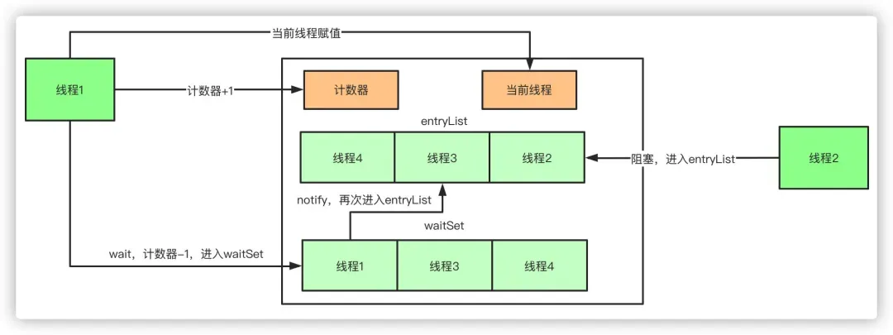

# Java并发编程面试题

### JMM内存模型

#### **JMM（Java Memory Model）是什么？***

**JMM**是Java内存模型（Java Memory Model）的简称，它定义了Java程序中的多线程如何与内存交互，特别是在不同线程之间如何共享数据。

JMM的核心目的是确保在并发环境中多线程操作共享变量时的**可见性**、**原子性**和**有序性**。JMM规定了变量在内存中的读写规则，线程如何与主内存交互，如何保证线程间的数据一致性。


### 多线程

#### 什么是线程和进程？（JavaGuide）

**进程是程序的一次执行过程，是系统运行程序的基本单位**，因此进程相比程序是动态的。系统运行一个程序即是一个进程从创建，运行到消亡的过程。


java中线程与进程相似是动态的，一个进程在其执行的过程中可以产生多个线程，所以线程是一个比进程更小的执行单位。与进程不同的是同类的多个线程共享进程的**堆**、**方法区**（本地内存区域的元空间）和直接内存资源，但每个线程有自己的**程序计数器**、**虚拟机栈**和**本地方法栈**。


#### ⭐️java里面的线程和操作系统的线程一样吗？

JDK 1.2 之前，Java 线程是一种用户级线程（用户线程），也就是说 JVM 自己来管控多线程的切换和运行，而不依赖于操作系统在内核中只有一个线程与jvm进程对应，属于是一对多的线程模型。但由于用户级线程和内内核级线程比起来在使用时有一些限制（比如用户级线程不能直接使用操作系统提供的功能如异步 I/O、只能在一个内核线程上运行无法利用多核）。


所以在jdk1.2之后，java线程创建本质上是调用os系统调用来创建线程（JVM会通过操作系统的线程API（如Linux的`pthread_create`或Windows的`CreateThread`）来创建一个底层的操作系统线程），和操作系统线程是一对一的线程模型。


**Q：什么是线程模型？**

**A：**即考研时学过的一对一、一对多和多对多线程模型。

**1. 一对一线程模型**

这种情况下，每一个用户线程对应一个内核线程，而内核线程的调度由操作系统内核负责，当发生线程上下文切换时，需要切换到内核态来保存当前线程的上下文（如寄存器、程序计数器、栈指针等），然后再恢复新线程的上下文。

所以在开销方面由于涉及用户态与内核态的切换，开销会稍高，但**仍然低于进程上下文切换，因为线程共享进程的内存空间，不需要切换内存映射等。**


**2. 一对多线程模型**

这种情况下，一个进程内部的多个用户线程对应一个内核线程，而用户线程的调度完全由用户空间的线程库（如 POSIX 线程库或语言运行时库）负责，线程切换在用户态完成，不涉及进入内核，因此切换开销非常小。

所以用户线程的上下文切换只需保存和恢复用户空间的上下文（如寄存器和程序计数器等），无需切换到内核态，效率极高。


**3. 混合线程模型**

某些操作系统（如 Solaris）支持混合模型，使用映射关系用户线程映射到内核线程，调度同时涉及用户态和内核态。

在这种情况下，是否需要进行用户态和内核态转换，取决于具体的调度方式一个内核线程映射了多少个用户线程。

- 如果线程调度在同一个内核线程映射的另外一个用户线程上，切换无需进入内核。
- 如果是线程调度映射了不同的内核线程的用户线程需要切换为内核态。

这种情况下，性能很均衡，但实现起来较为复杂。

现在主流的操作系统都是采用**主流操作系统（Windows、Linux、macOS）基本都采用 1:1 线程模型**，因为多核CPU和英特尔和AMD的超线程技术在硬件上减少了1:1降低了线程切换的代价。


#### 什么是线程上下文切换？

 Java原生支持多线程并发执行，每个Java线程都会被分配Cpu时间片来执行，从一个线程切换到另一个线程的时候，就会需要线程之间的上下文切换。

主要是线程要保存在执行过程中自己的运行条件和状态（也称上下文），比如上文所说到过的程序计数器，栈信息等。**上下文切换**需要保存当前线程的上下文，留待线程下次占用 CPU 的时候恢复现场。并加载下一个将要占用 CPU 的线程上下文。

当出现如下情况的时候，线程会从占用 CPU 状态中退出：

- 主动让出 CPU，比如调用了 `sleep()`, `wait()` 等。
- 时间片用完，因为操作系统要防止一个线程或者进程长时间占用 CPU 导致其他线程或者进程饿死。
- 调用了阻塞类型的系统中断，比如请求 IO，线程被阻塞。
- 被终止或结束运行

上下文切换是现代操作系统的基本功能，因其每次需要保存信息恢复信息，这将会占用 CPU，内存等系统资源进行处理以及内核态和用户态之间的转变，也就意味着效率会有一定损耗，如果频繁切换就会造成整体效率低下。


#### 使用java多线程开发要注意哪些问题？*

**需要注意线程安全的问题，即不要出现数据竞争造成的数据混乱的问题。**

而Java线程安全体现在三个方面：

**原子性：**即需对资源提供互斥访问，确保同时只用一个线程对资源访问，在Java中使用synchronized和atomlic这两个关键字来确保原子性。

**可见性：**一个线程对资源（主内存）的修改是对于其他线程及时可见的。在Java中使用synchronized和volatile这两个关键字来确保原子性。

**有序性：**指的是一个线程能观察到其他线程的指令执行顺序，一般的编译器和CPU为了优化会对指令重排序，所以观察结果会杂乱无章，在Java中使用happen-before原则来实现有序性。


**Q：happens-before 原则是什么？**

A： happens-before 原则是为了程序员和编译器、处理器之间的平衡。

程序员追求的是易于理解和编程的强内存一致性模型，遵守既定规则编码即可。编译器和处理器追求的是较少约束的弱内存一致性模型，让它们尽己所能地去优化性能，让性能最大化。happens-before 原则的设计思想其实非常简单：

- 为了对编译器和处理器的约束尽可能少，只要不改变程序的执行结果（单线程程序和正确执行的多线程程序），编译器和处理器怎么进行重排序优化都行。
- 对于会改变程序执行结果的重排序，JMM 要求编译器和处理器必须禁止这种重排序。

**抽象来说它更想表达的意义是前一个操作的结果对于后一个操作是可见的，无论这两个操作是否在同一个线程里。** **volatile** 关键字通过内存屏障确保可见性是实现该原则的一种方式。


####  保证数据的一致性有哪些方案呢？

- **事务管理**：使用数据库事务来确保一组数据库操作要么全部成功提交，要么全部失败回滚。通过ACID（原子性、一致性、隔离性、持久性）属性，数据库事务可以保证数据的一致性。
- **锁机制**：使用锁来实现对共享资源的互斥访问。在 Java 中，可以使用 synchronized 关键字、ReentrantLock 或其他锁机制来控制并发访问，从而避免并发操作导致数据不一致。
- **版本控制**：通过乐观锁的方式，在更新数据时记录数据的版本信息，从而避免同时对同一数据进行修改，进而保证数据的一致性。


#### ⭐️java线程的创建方式有哪些?

##### 1. 继承Thead类

```java
class MyThread extends Thread {
    @Override
    public void run() {
        // 线程执行的代码
    }
}

public static void main(String[] args) {
    MyThread t = new MyThread();
    t.start();
}
```

这是最简单也最直接的一种方式，通过继承Thread类，并重写run方法来创建执行自定义任务的线程，在main方法即可使用。

其优点在于编写简单，且若要调用当前线程直接使用this可不用Thread.currentThread ()方法来获得当前线程，但缺点在于已经继承了Thread类不能继承其他父类。


##### 2. 实现Runnable接口

```java
class MyRunnable implements Runnable {
    @Override
    public void run() {
        // 线程执行的代码
    }
}

public static void main(String[] args) {
    Thread t = new Thread(new MyRunnable());
    t.start();
}
```

实现Runnable接口和继承Thead类利弊相反，其优点在于线程类只是实现了Runable接口，还可以继承其他的类。另一方面实现Runnable接口可以多个线程共享同一个实现对象，所以非常适合多个相同线程来处理同一份资源的情况，较好地体现了面向对象的思想。

缺点在于编程稍微复杂，如果需要访问当前线程，必须使用Thread.currentThread()方法。


##### 3. 实现Callable接口与FutureTask

```java
class MyCallable implements Callable<Integer> {
    @Override
    public Integer call() throws Exception {
        // 线程执行的代码，这里返回一个整型结果
        return 1;
    }
}

public static void main(String[] args) {
    MyCallable task = new MyCallable();
    FutureTask<Integer> futureTask = new FutureTask<>(task);
    Thread t = new Thread(futureTask);
    t.start();

    try {
        Integer result = futureTask.get();  // 获取线程执行结果
        System.out.println("Result: " + result);
    } catch (InterruptedException | ExecutionException e) {
        e.printStackTrace();
    }
}
```

`java.util.concurrent.Callable`接口类似于`Runnable`，但`Callable`的`call()`方法（类似于上述两种的run方法）可以有返回值并且可以抛出异常。

其编程相对于Runable接口更为复杂：要执行Callable任务，首先需将它包装进一个FutureTask

这是因为Thread类的构造器只接受Runnable参数，而FutureTask实现了Runnable接口。

同样若需要访问当前线程，必须调用Thread.currentThread()方法。

但优点在于与实现Runnable接口相似，还可以继承其他类，非常适合多线程处理同一份资源的情形。


##### 4. 使用线程池（Executor框架）

```java
class Task implements Runnable {
    @Override
    public void run() {
        // 线程执行的代码
    }
}

public static void main(String[] args) {
    ExecutorService executor = Executors.newFixedThreadPool(10);  // 创建固定大小的线程池
    for (int i = 0; i < 100; i++) {
        executor.submit(new Task());  // 提交任务到线程池执行
    }
    executor.shutdown();  // 关闭线程池
}
```

线程池是一种更高效的线程管理方式（背两个优点）

1. 通过如核心线程数的合理设置，避免了频繁创建和销毁线程的开销，显著提高了程序的性能。而且对于需要快速响应的并发请求，线程池可以迅速提供线程来处理任务，减少等待时间，最大化CPU利用率和系统吞吐量。

2. 并且通过合理设置参数，线程池能够有效控制运行的线程数量，防止因创建过多线程导致的系统资源耗尽（如内存溢出）。

**但与之同时，线程池增加了程序的复杂度，当涉及线程池参数调整和故障排查时诊断和修复可能较为复杂。如错误的配置可能导致死锁、资源耗尽等问题。**

在后面的线程池章节，会详细展开说明。


#### 怎么启动线程？

如下所示启动线程的通过Thread类的**start()**。

```java
//创建两个线程，用start启动线程
MyThread myThread1 = new MyThread();  
MyThread myThread2 = new MyThread();  
myThread1.start();  
myThread2.start();  
```


#### 如何停止一个线程的运行?

主要有这些方法：

**异常法停止**：线程调用interrupt()方法后，在线程的run方法中判断当前对象的interrupted()状态，如果是中断状态则抛出异常，达到中断线程的效果。

**在沉睡中停止**：先将线程sleep进入WAITING或TIMED_WAITING状态，然后调用interrupt标记中断状态，interrupt会将阻塞状态的线程中断。会抛出中断异常，达到停止线程的效果

**stop()暴力停止**：线程调用stop()方法会被暴力停止，方法已弃用，该方法会有不好的后果：强制让线程停止有可能使一些请理性的工作得不到完成。

**使用return停止线程**：调用interrupt标记为中断状态后，在run方法中判断当前线程状态，如果为中断状态则return，能达到停止线程的效果。


#### 调用 interrupt 是如何让线程抛出异常的?

每个线程都一个与之关联的布尔属性来表示其中断状态，中断状态的初始值为false，当一个线程被其它线程调用`Thread.interrupt()`方法中断时，会根据实际情况做出响应。

如果该线程正在执行低级别的可中断方法（如`Thread.sleep()`、`Thread.join()`或`Object.wait()`），则会解除阻塞并**抛出InterruptedException异常**。

否则`Thread.interrupt()`仅设置线程的中断状态，若该被中断的线程中的run方法中定义了相关处理策略后，根据预先定义好的策略检测中断状态来决定是否要停止当前正在执行的任务。


#### ⭐️Java线程的状态有哪些？


源自《Java并发编程艺术》 java.lang.Thread.State枚举类中定义了六种线程的状态，可以调用线程Thread中的getState()方法**获取当前线程的状态**。

| 线程状态      | 解释                                                         |
| ------------- | ------------------------------------------------------------ |
| NEW           | 尚未启动的线程状态，即线程创建，**还未调用start方法**        |
| RUNNABLE      | **就绪状态**（调用start，等待调度）+**正在运行**             |
| BLOCKED       | **等待监视器锁**时，陷入阻塞状态                             |
| WAITING       | 等待状态的线程正在**等待**另一线程执行特定的操作（如notify） |
| TIMED_WAITING | 具有**指定等待时间**的等待状态                               |
| TERMINATED    | 线程在执行完了 `run()`方法之后将会进入到 **TERMINATED（终止）** 状态。 |


#### blocked和waiting有啥区别

线程进入**blocked状态**一般是线程尝试获取监视锁（对象锁）而获取失败的状态（失败是因为锁被其他线程持有），这通常发生在尝试进入synchronized块或方法时，如果锁已被占用，则线程将被阻塞直到锁可用。

**若原先持有锁的线程释放了锁，**线程将有机会重新尝试获取锁。**如果锁此时未被其他线程获取，那么线程可以从BLOCKED状态变为RUNNABLE状态。**


而线程进入**WAITING状态**是因为它正在等待另一个线程执行某些操作，**一般为主动调用**Object.wait()方法、或LockSupport.park()方法会使被调用线程进入**WAITING状态**，在**WAITING状态**下，线程将不会消耗CPU资源，并且不会参与锁的竞争，且会释放持有的锁。

**WAITING状态需要被显式唤醒才能解除状态。**例如，如果线程调用了Object.wait()，那么它必须等待另一个线程调用同一对象上的Object.notify()或Object.notifyAll()方法才能被唤醒。


BLOCKED 状态不会释放已经持有的锁，而 WAITING 会释放锁，BLOCKED 只需要锁被释放就可以重新竞争，WAITING 需要被显式唤醒。


#### Thread.sleep() 方法和 Object.wait() 方法对比（JavaGuide）

**共同点**：两者都可以暂停线程的执行。

**区别**：

- **sleep() 方法没有释放锁，而 wait() 方法释放了锁** 。
- `wait()` 通常被用于线程间交互/通信，`sleep()`通常被用于暂停执行。
- `wait()` 方法被调用后，线程不会自动苏醒，需要别的线程调用同一个对象上的 `notify()`或者 `notifyAll()` 方法。`sleep()`方法执行完成后，线程会自动苏醒，或者也可以使用 `wait(long timeout)` 超时后线程会自动苏醒。
- `sleep()` 是 `Thread` 类的静态本地方法，`wait()` 则是 `Object` 类的本地方法。为什么这样设计呢？下一个问题就会聊到。


#### 为什么 wait() 方法不定义在 Thread 中？（JavaGuide）

在 Java 中，**锁是绑定到对象**（`Object`）的，而不是线程。每个对象有一个监视器锁。

`wait()` 的核心操作是**释放当前线程持有的对象锁**，并让线程进入等待状态。这一行为必须作用于具体的对象（因为锁属于对象）。

若将 `wait()` 定义在 `Thread` 类中，会导致逻辑混乱：线程需要操作其他对象的锁，而非自身。

类似的问题：**为什么 sleep() 方法定义在 Thread 中？**

`sleep()` 仅影响当前线程的执行时间，**不涉及锁操作**，因此作为 `Thread` 的静态方法更合理。


**Q：synchronize的关键字好像是不是也会通过object.wait()来释放对象的监视器锁，进入synchronize关键字的wait()队列对吗？**

**A：**`sychronized` 是 Java 中用于实现**互斥锁（Mutex Lock）**的关键字并没有通过object.wait()来释放锁。通过 JVM 的底层机制管理所和线程状态。

- 当一个线程进入 `synchronized` 代码块时，它会尝试获取对象的**监视器锁（Monitor Lock）**。
- 如果锁已被其他线程持有，当前线程会进入 `BLOCKED` 状态，直到锁被释放。
- 当线程退出 `synchronized` 代码块时，**会自动释放锁。通过object.wait()释放**

`wait()` 是 `Object` 类的方法，**会且只会**释放**调用它的那个对象的锁**，并进入 `WAITING` 状态，直到其他线程调用 `notify()` 或 `notifyAll()` 唤醒它。

- `wait()` 必须在 `synchronized` 代码块中调用，因为线程必须先持有锁才能释放锁。
- 调用 `wait()` 后，线程会进入对象的**等待队列（Wait Set）**，直到被唤醒。

`wait()` 、搭配`notify()` 和 `notifyAll()`类似于专门为synchronize的关键字实现的条件变量，是Java线程通信的一种方式，基于对象的监视器实现。

**注：条件变量是一种同步机制，允许线程在某些条件不满足时暂停执行，并在条件满足时被唤醒。**Java 还提供了显式的条件变量机制，通过 `java.util.concurrent.locks.Condition` 接口实现。显式条件变量与显式锁（如 `ReentrantLock`）结合使用，提供了更灵活的线程通信方式。


#### 可以直接调用 Thread 类的 run 方法吗？（JavaGuide）

new 一个 `Thread`，线程进入了新建状态。调用 `start()`方法，会启动一个线程并使线程进入了就绪状态，当分配到时间片后就会变为运行的。 

**而且`start()` 会执行线程的相应准备工作（系统调用创建内核级线程并分配资源），然后自动执行 `run()` 方法的内容，这是真正的多线程工作。** 

但是，如果直接执行 `run()` 方法，会把 `run()` 方法当成一个 main 线程下的普通方法去执行，并不会在某个线程中执行它，所以这并不是多线程工作。

**总结：调用 start() 方法方可启动线程并使线程进入就绪状态，直接执行 run() 方法的话不会以多线程的方式执行。**


#### ⭐️wait 状态下的线程如何进行恢复到 running 状态?

1. 等待的线程**被其他线程对象唤醒**，`notify()`和`notifyAll()`。

2. 如果线程主动调用`LockSupport.park()`方法，会进入**Waiting状态**。这是线程**主动**进入等待的方式，与没有获取到锁（进入Blocked状态）是不同的。解锁时，可以通过执行`LockSupport.unpark(Thread)`方法，给出许可证，**解除等待状态**。


#### notify 和 notifyAll 的区别?

这两个方法的相同点在于，同样是唤醒一个在**WAITING状态**的线程，同样最多只能唤醒一个在**WAITING状态**的线程，同样不能控制唤醒哪个线程。

notify在于随机唤醒一个线程进入**锁池**（EntryList），若被唤醒的进程没有调用notify那么其他进程永远不会被唤醒，直到等待超时或者被中断。

notifyAll会唤醒所有线程进入**锁池**（EntryList），但只有一个线程能够进入，这个线程执行完后，其他线程又会有一个幸运儿脱颖而出得到锁。


##### 1. 为什么被唤醒的线程会进入锁池（EntryList）？

被唤醒的线程是否直接进入 `Runnable` 状态，实际上取决于它是否需要重新获得锁

当线程调用了 `wait()` 时，它会释放当前对象的锁，并进入 **Waiting 状态**。

如果随后另一个线程调用了 `notify()` 或 `notifyAll()`，等待线程会被唤醒。

**被唤醒的线程需要重新尝试获取对象的锁**。而如果该锁当前仍被其他线程持有，那么它会进入锁池（`EntryList`）——也称为 **阻塞队列**。

只有当锁释放后，这些线程才会被调度器从 `EntryList` 选中，进入 **Runnable 状态**。

所以**如果线程没有持有锁（即没有进入 synchronized 块或方法），而只是等待一个条件或被显式唤醒**，那么在被唤醒时，它确实会 **直接进入 Runnable 状态**，无需通过锁池（`EntryList`）等待。


**实际上 `wait()`和synchronize关键词都是基于对象的监视器锁，两个会搭配使用实现类似条件变量的功能，不使用synchronize关键词不会用`wait()`，`wait()`语义就是线程释放对象的监视器锁，变为 Waiting状态。**


##### 2. 不持有锁的情况下，notify 和 notifyAll 的区别?

在 **没有进入 synchronized 块** 的情况下（即线程没有持有锁），调用 `wait()` 或 `notify()` 的情况稍有不同，但本质上它们的区别仍然体现在 **唤醒线程的数量和行为上**。我们来逐一分析。

无锁时 notify() 的行为：notify() 唤醒一个线程，被唤醒的线程会尝试从 **Waiting 状态** 转变为 **Runnable 状态**，等待调度器来调度其执行。

无锁时 notifyAll() 的行为：notifyAll() 唤醒所有线程，当调用 `notifyAll()` 时，所有在 **Waiting 状态** 中的线程都会被唤醒。唤醒的线程也会进入 **Runnable 状态**，而且它们会被调度器公平地调度执行。


#### notify 选择哪个线程?

notify在源码的注释中说到notify选择唤醒的线程是任意的，但是依赖于具体实现的jvm。


JVM有很多实现，比较流行的就是hotspot，hotspot对notofy()的实现并不是我们以为的随机唤醒,，而是“先进先出”的顺序唤醒。


#### 并发与并行的区别（JavaGuide）

- **并发**：两个及两个以上的作业在同一 **时间段** 内执行，时间段内部交替执行。
- **并行**：两个及两个以上的作业在同一 **时刻** 执行。

最关键的点是：是否是 **同时** 执行。


#### 同步和异步的区别（JavaGuide）

- **同步**：发出一个调用之后，在没有得到结果之前，一直等待，等返回结果后才能继续执行。
- **异步**：调用在发出之后，不用等待返回结果，可以继续执行后续操作，而被调用者通过回调、Future、Promise等机制通知调用者结果。


#### ⭐️为什么要使用多线程?（JavaGuide）

先从总体上来说：

- **从计算机底层来说：** 线程可以比作是轻量级的进程，是程序执行的最小单位,线程间的切换和调度的成本远远小于进程。另外，多核 CPU 时代意味着多个线程可以同时运行，这减少了线程上下文切换的开销。
- **从当代互联网发展趋势来说：** 现在的系统动不动就要求百万级甚至千万级的并发量，而多线程并发编程正是开发高并发系统的基础，利用好多线程机制可以大大提高系统整体的并发能力以及性能。

再深入到计算机底层来探讨：

- **单核时代**：在单核时代多线程主要是为了提高单进程利用 CPU 和 IO 系统的效率。 假设只运行了一个 Java 进程的情况，当我们请求 IO 的时候，如果 Java 进程中只有一个线程，此线程被 IO 阻塞则整个进程被阻塞。CPU 和 IO 设备只有一个在运行，那么可以简单地说系统整体效率只有 50%。当使用多线程的时候，一个线程被 IO 阻塞，其他线程还可以继续使用 CPU。从而提高了 Java 进程利用系统资源的整体效率。
- **多核时代**: 多核时代多线程主要是为了提高进程利用多核 CPU 的能力。举个例子：假如我们要计算一个复杂的任务，我们只用一个线程的话，不论系统有几个 CPU 核心，都只会有一个 CPU 核心被利用到。而创建多个线程，这些线程可以被映射到底层多个 CPU 核心上执行，在任务中的多个线程没有资源竞争的情况下，任务执行的效率会有显著性的提高，约等于（单核时执行时间/CPU 核心数）。


#### ⭐️单核 CPU 支持 Java 多线程吗？（JavaGuide）

单核 CPU 是支持 Java 多线程的。操作系统通过时间片轮转的方式，将 CPU 的时间分配给不同的线程。所以尽管单核 CPU 一次只能执行一个任务，但通过快速在多个线程之间切换，可以让用户感觉多个任务是同时进行的。

 Java 线程调度方式。JVM 本身将线程的调度委托给操作系统。

操作系统主要通过两种线程调度方式来管理多线程的执行：

- **抢占式调度（Preemptive Scheduling）**：操作系统决定何时暂停当前正在运行的线程，并切换到另一个线程执行。这种切换通常是由系统时钟中断（时间片轮转）或其他高优先级事件（如 I/O 操作完成）触发的。这种方式存在上下文切换开销，但公平性和 CPU 资源利用率较好，不易阻塞。
- **协同式调度（Cooperative Scheduling）**：线程执行完毕后，主动通知系统切换到另一个线程。这种方式可以减少上下文切换带来的性能开销，但公平性较差，容易阻塞。

**现代操作系统使用的线程调度是抢占式的。操作系统通常会基于线程优先级和时间片来调度线程的执行，高优先级的线程通常获得 CPU 时间片的机会更多。**


#### ⭐️单核 CPU 上运行多个线程效率一定会高吗？（JavaGuide）*

单核 CPU 同时运行多个线程的效率是否会高，取决于线程的类型和任务的性质。一般来说，有两种类型的线程：

1. **CPU 密集型**：CPU 密集型的线程主要进行计算和逻辑处理，需要占用大量的 CPU 资源，而线程之间切换会占用资源。
2. **IO 密集型**：IO 密集型的线程主要进行输入输出操作，如读写文件、网络通信等， 线程需要等待 IO 设备的响应，通过多线程，可以让CPU在这个等待时间里去执行其他线程的任务。

对于单核 CPU 来说，如果任务是 CPU 密集型的，那么开很多线程会影响效率；如果任务是 IO 密集型的，那么适当的多开很多线程会提高效率。


#### 使用多线程可能带来什么问题?（JavaGuide）

并发编程的目的就是为了能提高程序的执行效率进而提高程序的运行速度，但是并发编程并不总是能提高程序运行速度的，而且并发编程可能会遇到很多问题，比如：内存泄漏、死锁、线程不安全等等。


#### 如何理解线程安全和不安全？（JavaGuide）

线程安全和不安全是在多线程环境下对于同一份数据的访问是否能够保证其正确性和一致性的描述。

- 线程安全指的是在多线程环境下，对于同一份数据，不管有多少个线程同时访问，都能保证这份数据的正确性和一致性。
- 线程不安全则表示在多线程环境下，对于同一份数据，多个线程同时访问时可能会导致数据混乱、错误或者丢失。


#### 什么是虚拟线程？（JavaGuide）*

简单理解就是Java自己实现和调度的用户级线程，多个虚拟线程，对应一个内核线程。现在一般把这个叫做协程，go里面也有。

上面提到了IO 密集型的线程主要进行输入输出操作，如读写文件、网络通信等， 线程需要等待 IO 设备的响应，通过多线程，可以让CPU在这个等待时间里去执行其他线程的任务。

而多个虚拟线程对应一个内核线程，正在执行的等待io，回操作自动阻塞，但JVM会将控制权交给其他虚拟线程，且是不会是内核态下的阻塞，以减少变态消耗更适用于IO 密集型。


### 并发安全

#### **成员变量和静态变量是否线程安全？**

如果多个线程访问同一个对象的成员变量，且没有适当的同步机制（如`volatile`、`synchronized`等），则**非线程安全**。

静态变量同样是对象共享的资源，在多个线程访问时没有同步机制的保护，也会出现线程安全问题。


#### **局部变量是否线程安全？**

**局部变量**（即方法内的变量）是线程安全的，因为每个线程都有自己的方法栈，局部变量存储在线程的栈上，彼此之间不会共享，因此不会产生线程安全问题。


#### **String为什么是线程安全的？**

`String`是不可变的（**immutable**）。一旦创建后，字符串的内容不能更改，因此多线程环境下多个线程访问同一个`String`对象不会造成数据竞争。由于不可变性，`String`天然是线程安全的。


#### **活锁现象指的是什么**？怎么解决？

活锁指的是线程或进程持续改变其状态，但无法取得实际进展的情况。与死锁不同，活锁中的线程并没有被阻塞，它们仍在积极执行，但由于互相干扰或让步，导致无法完成实际工作。

一个生活中的例子是：两个人在走廊相遇，双方同时向左闪避，发现还是会撞到，于是又同时向右闪避，如此反复，双方都在不断移动但无法通过走廊。

解决方法很简单，设置优先级比如ID小的优先，就像规定走廊相遇时，年龄大的人先通过。


#### 怎么保证多线程安全？

##### 1. synchronized关键字

通过synchronized关键字可以实现Java线程安全中的原子性，synchronized关键字可以同步**代码块和方法**，确保同一时刻只有一个线程能够访问这些代码。

是一种对象锁，通过锁定对象的监视器实现，锁定的是调用该方法或代码块的对象（实例或类对象）。

```java
public synchronized void someMethod() { /* ... */ }

public void anotherMethod() {
    synchronized (someObject) {
        /* ... */
    }
}
```


##### 2. volatile关键字

通过volatile关键字一般实现的是Java线程安全中的可见性，volatile关键字应用于变量，确保其他线程对于该变量观察得到的值是主存的最新值，而不是本地寄存器的副本。

```java
public volatile int sharedVariable;
```


##### 3. Lock接口和ReentrantLock类

ReentrantLock类实现了Lock接口，其提供了相比synchronized关键字更强大、更灵活的锁机制和锁管理，和更高的性能。

```java
private final ReentrantLock lock = new ReentrantLock();

public void someMethod() {
    lock.lock();
    try {
        /* ... */
    } finally {
        lock.unlock();
    }
}
```


##### 4. 原子类、并发集合和JUC工具类

Java中的JUC库（`java.util.concurrent`）提供了原子类，如`AtomicInteger`、`AtomicLong`等，这些原子类提供了原子操作，对这些变量进行操作可以不需要额外的同步机制。

```java
AtomicInteger counter = new AtomicInteger(0);

int newValue = counter.incrementAndGet();
```


使用Java中的JUC库（`java.util.concurrent`）提供线程安全集合，如`ConcurrentHashMap`、`ConcurrentLinkedQueue`等，这些集合内部已经实现了线程安全的逻辑。

使用Java中的JUC库（`java.util.concurrent`）包中的一些工具类可以用于控制线程间的同步和协作。例如：`Semaphore`和`CyclicBarrier`等。


##### 5. 线程局部变量

java中的TheadLocal类为每个线程提供了独立的遍地变量副本，这样的化每个线程都有值得变量副本，解除了竞争条件。

```java
ThreadLocal<Integer> threadLocalVar = new ThreadLocal<>();

threadLocalVar.set(10);
int value = threadLocalVar.get();
```


#### Java中有哪些常用的锁，在什么场景下使用？

##### 1. 内置锁（synchronized关键字）

**synchronized关键字是实现Java中内置锁的基础**，可以用于方法和代码块。当线程进入synchronized关键字所标识的代码块和方法时，其自动获取了关联对象的锁；当线程离开代码块和方法时锁会自动释放。当线程持有锁，但其他线程尝试获取锁时，会被阻塞。

synchronized关键字加锁有无锁、偏向锁、轻量级锁和重量级锁四个级别。现版本默认初始为偏向锁，后面会详细讲解，synchronized关键字锁升级过程。


##### 2. ReentrantLock

ReentrantLock实现了Lock接口，提供了比synchronized关键字更高级的功能，如锁等待、定时锁等待和公平锁等功能。需要显示的声明`lock()`和`unlock()`来获取锁和释放锁。公平锁和非公平锁区别可见后面会详细讲解。


##### 3. 读写锁

Java中的JUC库（`java.util.concurrent`）定义了一种锁，允许多个读取者同时访问共享资源，但只允许一个写入者。**当读时获取写锁失败，但可以获取读锁；但写时，无论获取读锁还是写锁都会失败。**

读写锁通常用于读取远多于写入的情况，以提高并发性。


##### 4. 乐观锁和悲观锁

悲观锁假设最坏的情况，会假设数据很可能被其他线程修改，于是通常在访问数据前就锁定资源，`synchronized`和`ReentrantLock`都是悲观锁的例子。

乐观锁通常不锁定资源，使用版本号或时间戳来实现，在更新数据时检查数据的状态是否已被其他线程修改（首先获取数据的版本号或时间戳作为预期，修改时通过对比预期的版本号或者时间戳来判断是否有修改过）。


##### 5. 自旋锁

自旋锁的特性在于在等待锁时会持续循环检查锁是否可用，而不是放弃CPU并阻塞。通常可以使用CAS来实现。

**若在锁等待时间很短的情况下会比synchronized关键字等阻塞锁有更好的性能，但过度自旋会浪费CPU资源。**


**Q：可中断锁和不可中断锁有什么区别？**

A：**可中断锁**：获取锁的过程中可以被中断，不需要一直等到获取锁之后 才能进行其他逻辑处理。`ReentrantLock` 就属于是可中断锁。

**不可中断锁**：一旦线程申请了锁，就只能等到拿到锁以后才能进行其他的逻辑处理。 `synchronized` 就属于是不可中断锁。


#### 怎么在实践中用锁的？

##### 1. 内置锁（synchronized关键字）

`synchronized`关键字可以用于方法或代码块，它是Java中最早的锁实现，使用起来非常简单。

synchronized关键字加锁和释放锁是自动实现的。当线程进入synchronized关键字所标识的代码块和方法时，其自动获取了关联对象的锁；当线程离开代码块和方法时锁会自动释放。

**示例：synchronized方法**

```java
public class Counter {
    private int count = 0;

    public synchronized void increment() {
        count++;
    }

    public synchronized int getCount() {
        return count;
    }
}
```

**示例：synchronized代码块**

```java
public class Counter {
    private Object lock = new Object();
    private int count = 0;

    public void increment() {
        synchronized (lock) {
            count++;
        }
    }
}
```


##### 2. 使用`Lock`接口

`Lock`接口提供了比`synchronized`更灵活的锁操作，包括尝试锁、可中断锁、定时锁等。`ReentrantLock`是`Lock`接口的一个实现。

而`ReentrantLock`接口需要显示的声明`lock()`和`unlock()`来获取锁和释放锁。

**示例：使用ReentrantLock**

```java
import java.util.concurrent.locks.Lock;
import java.util.concurrent.locks.ReentrantLock;

public class Counter {
    private Lock lock = new ReentrantLock();
    private int count = 0;

    public void increment() {
        lock.lock();
        try {
            count++;
        } finally {
            lock.unlock();
        }
    }
}
```


##### 3. 使用ReadWriteLock

`ReadWriteLock`接口提供了一种读写锁的实现，允许多个读操作同时进行，但写操作是独占的。

**示例：使用ReadWriteLock**

```java
import java.util.concurrent.locks.Lock;
import java.util.concurrent.locks.ReadWriteLock;
import java.util.concurrent.locks.ReentrantReadWriteLock;

public class Cache {
    private ReadWriteLock lock = new ReentrantReadWriteLock();
    private Lock readLock = lock.readLock();
    private Lock writeLock = lock.writeLock();
    private Object data;

    public Object readData() {
        readLock.lock();
        try {
            return data;
        } finally {
            readLock.unlock();
        }
    }

    public void writeData(Object newData) {
        writeLock.lock();
        try {
            data = newData;
        } finally {
            writeLock.unlock();
        }
    }
}
```

另一个典型案例即锻链接项目中的**通过Redisson分布式读写锁结合RocketMQ延迟消息队列**，解决短链接数据修改过程中的多表一致性问题。当修改涉及分片键时，通过写锁锁定修改流程，对短链接监控记录方法加读锁，若无法获取读锁则**启动延迟消息队列机制**，确保数据修改的原子性和业务连续性。


#### synchronized和reentrantlock及其应用场景？

##### 1. synchronized原理

synchronized是Java提供的原子性内置锁，当一个线程访问被 synchronized修饰的代码时，它会尝试获得该对象的监视器锁（monitor lock）。

- 对于实例方法：锁定的是当前对象的监视器（`this`）。
- 对于静态方法：锁定的是该类的 Class 对象（`Class.forName("ClassName")`）。
- 对于同步代码块：锁定的是指定的对象。

它的作用**主要就是实现原子性操作和解决共享变量的内存可见性问题。**

从内存语义来说，加锁的过程会清除工作内存中的共享变量，再从主内存读取，而释放锁的过程则是将工作内存中的共享变量写回主内存。

从代码语义上说**synchronized会在编译之后在同步的代码块前后加上monitorenter和monitorexit字节码指令**，其依赖操作系统底层互斥锁实现。而且由于Java中的线程和操作系统原生线程是一一对应的，**线程被阻塞时会从用户态切换到内核态，这种转换非常消耗性能。**


如果再深入到源码来说，synchronized实际上有两个队列waitSet和entryList。（了解即可）

1. 当多个线程进入同步代码块时，首先进入entryList（锁池）
2. 有一个线程获取到monitor锁后，就赋值给当前线程，并且计数器+1
3. 如果线程调用wait方法，将释放锁，当前线程置为null，计数器-1，同时进入waitSet等待被唤醒，调用notify或者notifyAll之后又会进入entryList竞争锁
4. 如果线程执行完毕，同样释放锁，计数器-1，当前线程置为null




##### 2. reentrantlock工作原理

ReentrantLock 的底层实现主要**依赖于 AbstractQueuedSynchronizer（AQS）这个抽象类。**AQS 是一个提供了基本同步机制的框架，**其中包括了队列、状态值等**。具体后面会详细讲解。

ReentrantLock 在 AQS 的基础上通过内部类 Sync 来实现具体的锁操作。不同的 Sync 子类实现了公平锁和非公平锁的不同逻辑：

**可中断性**： ReentrantLock 实现了可中断性，线程在等待锁的过程中，可以被其他线程中断而提前结束等待。在底层，ReentrantLock 使用了与 LockSupport.park() 和 LockSupport.unpark() 相关的机制来实现可中断性。

**设置超时时间**： ReentrantLock 支持在尝试获取锁时设置超时时间，即等待一定时间后如果还未获得锁，则放弃锁的获取。这是通过内部的 tryAcquireNanos 方法来实现的。

**公平锁和非公平锁**： 在直接创建 ReentrantLock 对象时，**默认情况下是非公平锁。**公平锁是按照线程等待的顺序来获取锁，而非公平锁则允许多个线程在不考虑它们申请锁的顺序同一时刻竞争锁。

公平锁可以通过在创建 ReentrantLock 时传入 true 来设置，例如：

```java
ReentrantLock fairLock = new ReentrantLock(true);
```

**多个条件变量**： ReentrantLock 支持多个条件变量，每个条件变量可以与一个 ReentrantLock 关联。这使得线程可以更灵活地进行等待和唤醒操作，而不仅仅是基于对象监视器的 wait() 和 notify()。**多个条件变量的实现依赖于 Condition 接口**，例如：

```java
ReentrantLock lock = new ReentrantLock();
Condition condition = lock.newCondition();
// 使用下面方法进行等待和唤醒
condition.await();
condition.signal();
```

**可重入性**： ReentrantLock 支持可重入性，即同一个线程可以多次获得同一把锁，而不会造成死锁。


##### 3.  应用场景的区别

若应用场景对锁功能要求不高可以使用synchronized，相反若有公平锁、锁中断、超时中断等功能则得用ReentrantLock。

synchronized关键字除了对代码块进行同步还可对方法进行同步，而ReentrantLock一般对代码块进行同步，但ReentrantLock支持更复杂的同步结构如与配套的`Condition`对象实现使用多个条件变量。

此外，synchronized关键字本质上是对象的监视锁，若对象状态与锁代码紧紧相关时，使用synchronized关键字会更好。而ReentrantLock在大多数情况等下可以提供比synchronized关键字更好的性格。选择哪种同步机制取决于具体的应用需求和性能考虑。


**Q：展开讲这个，多个条件变量的实现依赖于 Condition 接口？**

A：`Condition`是 JDK1.5 之后才有的，可以实现多路通知功能也就是在一个`Lock`对象中可以创建多个`Condition`实例（类似于对象监视器，提供了WaitSet队列而AQS队列作为EnteryList），**线程对象可以注册在指定的Condition中，从而可以有选择性的进行线程通知，在调度线程上更加灵活。 **

**在使用notify()/notifyAll()方法进行通知时，被通知的线程是由 JVM 选择的，用ReentrantLock类结合Condition实例可以实现“选择性通知”** ，这个功能非常重要，而且是 `Condition` 接口默认提供的。而`synchronized`关键字就相当于整个 `Lock` 对象中只有一个`Condition`实例，所有的线程都注册在它一个身上。如果执行`notifyAll()`方法的话就会通知所有处于等待状态的线程，这样会造成很大的效率问题。而`Condition`实例的`signalAll()`方法，只会唤醒注册在该`Condition`实例中的所有等待线程。


具体来说Condition对象是由Lock对象创建的，而每个Condition对象维护一个等待队列，但可以在一个Lock上创建多个不同的Condition。

核心方法主要有两个

- await()工作流程：释放当前持有的锁线程变为waiting状态，将当前线程加入到条件的等待队列，等被signal()唤醒后重新获取锁

- signal()工作流程：将等待队列中的第一个线程移动到AQS的同步队列，这个线程稍后会尝试重新获取锁。


#### synchronized和reentrantlock区别？

synchronized自动加锁和释放锁，reentrantlock需要显示的标识加锁和释放锁的语句。

synchronized基于jvm的监视器实现也是Java提供的原子性内置锁，而reentrantlock则基于java的AQS抽象类实现。

synchronized是非公平锁，reentrantlock既可以是公平锁也可以是非公平锁

synchronized不能响应中断，reentrantlock可以响应中断。

**synchronized关键字可用来修饰普通方法、静态方法和代码块，而 ReentrantLock 只能用在代码块上。**


#### 怎么理解可重入锁？

可重入锁即当前线程持有该锁的情况下，仍能再次获取该锁，而不会造成死锁或其他问题。

**synchronized和reentrantlock都是可重入锁。**


#### synchronized和reentrantlock支持重入吗？如何实现的?

##### 1. synchronized

synchronized是基于原子性的内置锁，当一个线程进入synchronized关键字修饰的代码块或方法时调用了被synchronized关键字修饰的其他方法即一个线程得到一个对象的监视锁后再次获取了该对象的监视锁是允许的。

synchronized关键字在底层是基于os互斥锁的，每一个可重入锁都有线程ID和锁状态（status）两个字段。

**当线程尝试获取锁时，首先会看锁状态（status）：**

若锁状态（status）为0，则使用CAS操作将线程ID替换为自己的线程ID

若锁状态（status）不为0，但线程ID是自己的线程ID，若是可重入锁则将锁状态（status）自增加一，进入同步代码执行，若是非重入锁，进入阻塞队列。

**当先线程释放锁时：**

若为可重入锁将锁状态（status）自减1，只有锁状态（status）为0才会完全释放锁

如果非可重入锁的，线程退出方法，直接就会释放该锁。


##### 2.reentrantlock

ReentrantLock实现可重入锁的机制是基于线程持有锁的计数器，本质上是基于AQS的state字段，后面会详细讲解。

当一个线程第一次获取锁时，计数器会加1，表示该线程持有了锁。在此之后，如果同一个线程再次获取锁，计数器会再次加1。每次线程成功获取锁时，都会将计数器加1。

当线程释放锁时，计数器会相应地减1。只有当计数器减到0时，锁才会完全释放，其他线程才有机会获取锁。

ReentrantLock通过这种计数器的方式，实现了可重入锁的机制。它允许同一个线程多次获取同一个锁，并且能够正确地处理锁的获取和释放，避免了死锁和其他并发问题。


#### syncronized锁升级的过程讲一下

锁有4个状态依次递进为：**无锁->偏向锁->轻量级锁->重量级锁**。

##### 1. 无锁：

java在当前版本是默认开启偏向锁的，但在开启偏向锁前有一段延迟此时是无锁状态。可通过JVM参数决定偏向锁延迟。

##### 2. 偏向锁：

偏向锁是在偏向锁开启后的锁状态。初始时，锁处于**匿名偏向状态**（Mark Word中线程ID为空）。当某个线程第一次获取偏向锁时，会将该线程的ID写入Mark Word，锁状态从匿名偏向状态变为**偏向锁状态**。下次想要竞争锁只需要拿线程ID跟MarkWord当中存储的线程ID进行比较，如果线程ID相同则直接获取锁（相当于锁偏向于这个线程），不需要进行CAS操作和将线程挂起的操作。相反若线程ID不同尝试通过CAS操作将对象的MarkWord的线程ID设置为自己的线程ID，会撤销偏向锁升级为轻量级锁。

##### 3. 轻量级锁：

轻量级锁状态下线程主要是通过CAS操作实现的。然后通过CAS操作将对象的MarkWord的线程ID设置为自己的线程ID。在线程出临界区的时候，也需要使用CAS尝试恢复Mark Word，如果使用CAS替换成功则同步成功，如果失败表示有其他线程在获取锁，那么就会升级为重量级锁。

##### 4. 重量级锁：

若有线程始终在CAS自旋操作失败，syncronized锁会进一步升级为重量级锁，在那之后，线程获取锁失败会被操作系统调度然后挂起，以节约CPU资源。


线程A进入 synchronized 开始抢锁，JVM 会判断当前是否是偏向锁的状态，如果是就会根据 Mark Word 中存储的线程 ID 来判断，当前线程A是否就是持有偏向锁的线程。如果是，则忽略 check，线程A直接执行临界区内的代码。

但如果 Mark Word 里的线程不是线程 A，就会通过自旋尝试获取锁，如果获取到了，就将 Mark Word 中的线程 ID 改为自己的；如果竞争失败，就会立马撤销偏向锁，膨胀为轻量级锁。

后续的竞争线程都会通过自旋来尝试获取锁，如果自旋成功那么锁的状态仍然是轻量级锁。然而如果竞争失败，锁会膨胀为重量级锁，后续等待的竞争的线程都会被阻塞。


**Q：当偏向锁被第一个线程获取之后，随后第1个线程退出代码快，然后第2个线程去获取偏向锁会触发偏向锁膨胀为轻量级锁吗？**

A：偏向锁会始终偏向第一个获取它的线程，直到某种事件触发偏向锁的撤销或重置。如果线程1退出同步代码块，偏向锁不会被释放或重置。Mark Word 中的线程 ID 不变。

**当后续线程尝试获取时：**

- 如果线程1再次进入同步代码块，它直接复用偏向锁，无需 CAS 或其他竞争。
- 如果线程2尝试获取锁，JVM 会发现线程2的 ID 与 Mark Word 中的线程 ID 不匹配，触发偏向锁撤销，锁状态升级为轻量级锁。


####  JVM对Synchornized的优化？

分为4个方面，

第一为锁膨胀，即4个状态依次递进为：**无锁->偏向锁->轻量级锁->重量级锁**，也叫锁升级。

第二为锁消除，即jvm如果检测不到某段代码被共享或竞争的可能性，jvm会自动消除锁来达到提高程序性能的目的。

第三为锁粗化，将多个连续的加锁和解锁操作转化为一个锁区域。


#### 介绍一下AQS

AQS全称为AbstractQueuedSynchronizer，是Java中的一个抽象类。 AQS是一个用于构建锁、同步器、协作工具类的工具类（框架）。

AQS最核心的就是三大部分：

1. 状态：state；

2. 控制线程抢锁和配合的FIFO队列（双向链表）；

3. 期望协作工具类去实现的获取/释放等重要方法（重写）。


**状态state**

**state的具体含义，会根据具体实现类的不同而不同**：比如在Semapore里，他表示剩余许可证的数量；在**ReentrantLock中，state用来表示“锁”的占有情况，包括可重入计数，当state的值为0的时候，标识该Lock不被任何线程所占有。**

state是volatile修饰的，并被并发修改，所以修改state的方法都需要保证线程安全，比如getState、setState以及compareAndSetState（CAS操作）操作来读取和更新这个状态。


**FIFO队列**

这个双向链表队列用来存放“等待的线程，AQS负责维护等待的线程队列，当多个线程争用同一把锁时，必须有排队机制将那些没能拿到锁的线程串在一起。当锁释放时，锁管理器就会挑选一个合适的线程来占有这个刚刚释放的锁。


**实现获取/释放等方法**

获取和释放锁的方法，是利用AQS的协作工具类里最重要的方法，是由协作类自己去实现的，并且含义各不相同；

获取方法：获取操作会依赖state变量，经常会阻塞（比如获取不到锁的时候）。在Semaphore中，获取就是acquire方法，作用是获取一个许可证；

释放方法：在Semaphore中，释放就是release方法，作用是释放一个许可证； 

需要每个实现类重写tryAcquire和tryRelease方法（**获取/释放操作**）。


**Q：协作工具类Sync来实现具体的加锁和释放锁过程，那ReentrantLock 如何实现线程的锁定？也是基于对象的监视器？**

A：全都是基于AQS实现，通过 `LockSupport.park()`莱阳县城变为waiting状态实现锁住一个线程。

线程当一个线程调用 `ReentrantLock.lock()` 时，具体流程如下：

**(1) 检查state状态的值**

当线程尝试获取锁时，首先会检查 `state` 的值，如果等于0，通过 **CAS 操作** 尝试将 `state` 从 `0` 修改为 `1`。

- 如果成功，表示获取锁成功，记录当前线程为锁的持有者，开始后续操作。
- 如果失败（`state != 0`），说明锁已被其他线程占用，进入下一步检查是否可重入。

如果一开始`state` 的值就不等于0，进入下一步检查是否可重入。

**(2) 检查是否可重入**

* 首先会调用 `Thread.currentThread()` 获取当前线程，然后与AQS中记录持有锁现成的字段 `exclusiveOwnerThread` 进行比较，判断是否为同一个线程。

- 如果当前线程已经是锁的持有者（重入），则 `state` 加 `1`（记录重入次数），直接返回，进行其他操作，否则进入下一步。

**(3) 加入等待队列**

* 为了优化性能，在线程准备入队前，会有一次机会再次尝试获取锁，因为可能在准备入队的短暂时间内锁已经被释放了。

- 将线程封装为 `Node` 节点，通过 CAS 操作插入到等待队列的尾部，**入队后如果是在队头区域也会有限次数的CAS尝试获取锁。**
- 然后调用 `LockSupport.park()` 挂起当前线程，进入等待状态WATIING（用户态的等待，不涉及内核态切换）。


多次尝试获取锁的设计是 AQS 性能优化的设计，目的是减少不必要的线程挂起和唤醒操作，因为这些操作相对耗费资源。只有在确认当前无法获取到锁的情况下，才会真正挂起线程，进入 WAITING 状态等待被唤醒。


**(4) 等待被唤醒**

当原先持有锁的线程调用 `ReentrantLock.unlock()` 时，

1. **减少 state 的值**：如果是重入锁，通过CAS`state` 减 `1`，若 `state = 0` 时完全释放锁，并清空 exclusiveOwnerThread 引用。
2. **唤醒后继线程**：
   - 从等待队列中找到第一个未取消的节点（`Node`）。
   - 调用 `LockSupport.unpark(node.thread)` 唤醒该线程。


####  悲观锁和乐观锁的区别？

悲观锁如其名字所言，认为并发进程运行总是会存在竞争问题。于是对共享资源加上独占独占锁，synchronized和reentrantlock是典型的悲观锁

而乐观锁相反，认为当前并发进程运行环境不总会发生竞争问题，通过CAS操作去修改内存的共享变量，如果失败则表示冲突，自选锁就是典型的乐观锁。


#### Java中想实现一个乐观锁，都有哪些方式？

##### 1. CAS操作

CAS 的全称是 **Compare And Swap（比较与交换）** ，用于实现乐观锁，被广泛应用于各大框架中。CAS 的思想很简单，就是用一个预期值和要更新的变量值进行比较，两值相等才会进行更新。

CAS 是一个原子操作，底层依赖于一条 CPU 的原子指令。

> **原子操作** 即最小不可拆分的操作，也就是说操作一旦开始，就不能被打断，直到操作完成。

CAS 涉及到三个操作数：

- **V**：要更新的变量值(Var)
- **E**：预期值(Expected)
- **N**：拟写入的新值(New)

当且仅当 V 的值等于 E 时，CAS 通过原子方式用新值 N 来更新 V 的值。如果不等，说明已经有其它线程更新了 V，则当前线程放弃更新。

**举一个简单的例子**：线程 A 要修改变量 i 的值为 6，i 原值为 1（V = 1，E=1，N=6，假设不存在 ABA 问题）。

1. i 与 1 进行比较，如果相等， 则说明没被其他线程修改，可以被设置为 6 。
2. i 与 1 进行比较，如果不相等，则说明被其他线程修改，当前线程放弃更新，CAS 操作失败。


##### 2. 版本号控制

通过线程修改一次资源迭代一次版本号，在修改前记录版本号为预期版本号，再修改后对比当前版本号与预期版本号是否一致，则更新成功，否则有其他线程修改过更新失败，更新成功后修改版本号。


##### 3.时间戳

与版本号控制类似修改一次资源更新时间戳，在修改前记录时间戳为预期时间戳，再修改后对比当前时间戳大于预期时间戳，则更新成功，否则有其他线程修改过更新失败，更新成功后更新时间戳。


#### Java 中 CAS 是如何实现的？（JavaGuide）*

在 Java 中，实现 CAS（Compare-And-Swap, 比较并交换）操作的一个关键类是`Unsafe`。

`Unsafe`类提供了`compareAndSwapObject`、`compareAndSwapInt`、`compareAndSwapLong`方法来实现的对`Object`、`int`、`long`类型的 CAS 操作：

```java
/**
 * 以原子方式更新对象字段的值。
 *
 * @param o        要操作的对象
 * @param offset   对象字段的内存偏移量
 * @param expected 期望的旧值
 * @param x        要设置的新值
 * @return 如果值被成功更新，则返回 true；否则返回 false
 */
boolean compareAndSwapObject(Object o, long offset, Object expected, Object x);

/**
 * 以原子方式更新 int 类型的对象字段的值。
 */
boolean compareAndSwapInt(Object o, long offset, int expected, int x);

/**
 * 以原子方式更新 long 类型的对象字段的值。
 */
boolean compareAndSwapLong(Object o, long offset, long expected, long x);
```

并且`Unsafe`类中的 CAS 方法是`native`方法。所以所以这些方法是用本地代码（通常是 C 或 C++）且内联汇编的形式实现的（通过 JNI 调用），而不是用 Java 实现的。这些方法直接调用底层的硬件指令来实现原子操作。因此，CAS 的具体实现与操作系统以及 CPU 密切相关。


#### 说一下Java并发编程中的原子类？*

`java.util.concurrent.atomic` 包提供了一些用于原子操作的类。这些类利用底层的原子指令，确保在多线程环境下的操作是线程安全的。


`AtomicInteger`是 Java 的原子类之一，主要用于对 `int` 类型的变量进行原子操作，它利用`Unsafe`类提供的低级别原子操作方法实现无锁的线程安全性。

下面，我们通过解读`AtomicInteger`的核心源码（JDK1.8），来说明 Java 如何使用`Unsafe`类的方法来实现原子操作。

`AtomicInteger`核心源码如下：

```java
// 获取 Unsafe 实例
private static final Unsafe unsafe = Unsafe.getUnsafe();
private static final long valueOffset;

static {
    try {
        // 获取“value”字段在AtomicInteger类中的内存偏移量
        valueOffset = unsafe.objectFieldOffset
            (AtomicInteger.class.getDeclaredField("value"));
    } catch (Exception ex) { throw new Error(ex); }
}
// 确保“value”字段的可见性
private volatile int value;

// 如果当前值等于预期值，则原子地将值设置为newValue
// 使用 Unsafe#compareAndSwapInt 方法进行CAS操作
public final boolean compareAndSet(int expect, int update) {
    return unsafe.compareAndSwapInt(this, valueOffset, expect, update);
}

// 原子地将当前值加 delta 并返回旧值
public final int getAndAdd(int delta) {
    return unsafe.getAndAddInt(this, valueOffset, delta);
}

// 原子地将当前值加 1 并返回加之前的值（旧值）
// 使用 Unsafe#getAndAddInt 方法进行CAS操作。
public final int getAndIncrement() {
    return unsafe.getAndAddInt(this, valueOffset, 1);
}

// 原子地将当前值减 1 并返回减之前的值（旧值）
public final int getAndDecrement() {
    return unsafe.getAndAddInt(this, valueOffset, -1);
}
```


其中`Unsafe.getAndAddInt`源码：

```java
// 原子地获取并增加整数值
public final int getAndAddInt(Object o, long offset, int delta) {
    int v;
    do {
        // 以 volatile 方式获取对象 o 在内存偏移量 offset 处的整数值
        v = getIntVolatile(o, offset);
    } while (!compareAndSwapInt(o, offset, v, v + delta));
    // 返回旧值
    return v;
}
```

可以看到，`getAndAddInt` 使用了 `do-while` 循环：在`compareAndSwapInt`操作失败时，会不断重试直到成功。也就是说，`getAndAddInt`方法会通过 `compareAndSwapInt` 方法来尝试更新 `value` 的值，如果更新失败（当前值在此期间被其他线程修改），它会重新获取当前值并再次尝试更新，直到操作成功。

由于 CAS 操作可能会因为并发冲突而失败，因此通常会与`while`循环搭配使用，在失败后不断重试，直到操作成功。这就是 **自旋锁机制** 。


**Q：`Unsafe`类是什么东西？**

A：`Unsafe`类位于`sun.misc`包下，是一个提供低级别、不安全操作的类。因为 `Unsafe` 类使 Java 语言拥有了类似 C 语言指针一样操作内存空间的能力，这无疑也增加了程序发生相关指针问题的风险。

所以由于其强大的功能和潜在的危险性，它通常用于 JVM 内部或一些需要极高性能和底层访问的库中，而不推荐普通开发者在应用程序中使用。


#### CAS 有什么缺点？该怎么解决

##### 1. ABA问题

即在线程使用CAS修改前共享资源是A，然后准备赋值的时候仍然是A，但是实际上有可能A的值被改成了B，然后又被改回了A，这个CAS更新的漏洞就叫做ABA。但ABA并不影响并发的最终结果。Java中有`AtomicStampedReference`来解决这个问题，他加入了预期标志和更新后标志两个字段，更新时不光检查值，还要检查当前的标志是否等于预期标志，全部相等的话才会更新。

或者简单办法就是版本号后的时间戳的实现方式比较版本的方式，来实现乐观锁。


##### 2. 循环开销时间大

长时间自旋会一直占用CPU，造成较大的性能开销


##### 3. 只能对单个变量进行原子操作

CAS只能对单个变量进行原子操作，当涉及到多个共享变量时，还得是使用锁synchronized或AtomicReference处理


#### 为什么不能所有的锁都用CAS？

和上面问题一样，把缺点回答即可


#### voliatle关键字有什么作用？*

主要为两方面的作用，阻止指令重排序和实现可见性（保证变量对所有线程的可见行）。它会保证对这个变量的写操作会立即刷新到主存中，而对这个变量的读操作会直接从主存中读取，从而确保了多线程环境下对该变量访问的可见性而不会受到各自线程工作内存（CPU缓存的副本）的影响。

阻止指令重排序通过插入特定的内存屏障实现，具体来说，`volatile` 会插入以下三种屏障：

**写-写（Write-Write）屏障**：在对volatile变量执行写操作之前，会插入一个写屏障。这确保了在该变量写操作之前的所有普通写操作都已完成，防止了这些写操作被移到volatile写操作之后。

**读-写（Read-Write）屏障**：在对volatile变量执行读操作之后，会插入一个读屏障。它确保了对volatile变量的读操作之后的所有普通读操作都不会被提前到volatile读之前执行，保证了读取到的数据是最新的。

**写-读（Write-Read）屏障**：这是最重要的一个屏障，它发生在volatile写之后和volatile读之前。这个屏障确保了volatile写操作之前的所有内存操作（包括写操作）都不会被重排序到volatile读之后，同时也确保了volatile读操作之后的所有内存操作（包括读操作）都不会被重排序到volatile写之前。


#### 指令重排序的原理是什么？

在执行程序时，为了提高性能，处理器和编译器常常会对指令进行重排序，但是重排序一般会遵循两个原则，

1. 在单线程情况下，指令重排序不能影响最终结果。
2. 有数据依赖关系的不允许重排序。

所以重排序不会对单线程有影响，只会破坏多线程的执行语义。

例子如下，A和C之间存在数据依赖关系，同时B和C之间也存在数据依赖关系。因此在最终执行的指令序列中，C不能被重排序到A和B的前面，如果C排到A和B的前面，那么程序的结果将会被改变。但A和B之间没有数据依赖关系，编译器和处理器可以重排序A和B之间的执行顺序。


#### volatile可以保证线程安全吗？

volatile只能保证并发环境下可见性不能保证原子性，因此不能完全保证线程安全。保证对变量的写操作会立即刷新到主存中，而对这个变量的读操作会直接从主存中读取，使得其他线程能够立即看到最新的值。从而避免了线程之间的数据不一致。

但是，volatile并不能解决多线程并发下的复合操作问题，比如i++这种操作（只能保证**每次读取和写入的值是最新的**，不能保证不出现同步间覆盖问题），如果多个线程同时对i进行自增操作，volatile不能保证线程安全。


#### volatile和sychronized比较？

Synchronized解决了多线程访问共享资源时可能出现的竞态条件和数据不一致的问题，通过排插他性锁的方式保证了线程安全的原子性，可见性，有序性。

Volatile解决了变量在多线程环境下的可见性和有序性问题，确保了变量的修改对其他线程是可见的。


#### 什么是公平锁和非公平锁？

**公平锁：** 指多个线程按照申请锁的顺序来获取锁，线程直接进入队列中排队，队列中的第一个线程才能获得锁。

**公平锁的优点在于各个线程按照先进先出的顺序执行，每个线程等待一段时间后，都有执行的机会，而它的缺点就在于整体执行速度更慢，吞吐量更小。**

**非公平锁：** 多个线程加锁时直接尝试获取锁，能抢到锁到直接占有锁，抢不到才会到等待队列的队尾等待。

**非公平锁的优势就在于整体执行速度更快，吞吐量更大，但同时也可能产生线程饥饿问题，也就是说如果一直有线程插队，那么在等待队列中的线程可能长时间得不到运行。**


#### 非公平锁吞吐量为什么比公平锁大？

**公平锁执行流程**：获取锁时，先将线程自己添加到等待队列的队尾并休眠，当某线程用完锁之后，会去唤醒等待队列中队首的线程尝试去获取锁，锁的使用顺序也就是队列中的先后顺序。但线程每次休眠和恢复都需要从用户态转换成内核态，而这个状态的转换会有一定的性能开销，所以公平锁的执行速度会比较慢。

**非公平锁执行流程**：当线程获取锁时，会先通过 CAS 尝试获取锁，如果获取成功就直接拥有锁，如果获取锁失败才会进入等待队列，等待下次尝试获取锁。

非公平锁获取锁不用遵循先到先得的规则，从而避免了线程休眠和恢复的操作，这样就加速了程序的执行效率。


#### Synchronized是公平锁吗？

Synchronized不是公平锁


#### ReentrantLock是怎么实现公平锁的？

**ReentrantLock** 基于 **AQS** 实现的，原先 **AQS** 有三大组成部分状态：state；控制线程抢锁和配合的FIFO队列（双向链表）；期望协作工具类去实现的获取/释放等重要方法（重写）。

在 **ReentrantLock** 的实现中FIFO队列即为等待的线程队列，**没获取到锁的线程会挂起在这个队列。**

**ReentrantLock** 在代码具体实现公平锁和非公平锁的区别为，在获取锁之前检查FIFO等待队列是否为空，**ReentrantLock** 的公平锁若检测到等待队列部位控，不会尝试获取锁直接挂起在等待队列，非公平锁相反，不会去检查FIFO等待队列，直接会去尝试用CAS操作获取锁，如果没有获取成功才会挂起在FIFO等待队列。


但有个特例需要我们注意，针对 tryLock() 方法，它不遵守设定的公平原则。

例如，当有线程执行 tryLock() 方法的时候，即使是公平锁设置情况下也不会去检查FIFO等待队列，直接会去尝试获取锁。

看 tryLock() 的源码可知：

```java
public boolean tryLock() {

    return sync.nonfairTryAcquire(1);

}
```

这里调用的就是 nonfairTryAcquire()，表明了是不公平的，和锁本身是否是公平锁无关。


#### Threadlocal作用，原理，具体里面存的key value是啥，会有什么问题，如何解决?

`ThreadLocal`是Java中用于解决线程安全问题的一种机制，它允许创建线程局部变量，即每个线程都有自己独立的变量副本，从而避免了线程间的资源共享和同步问题。


以上图为`ThreadLocal`的内存结构图，可以看出key是`ThreadLocal`本身，value是`ThreadLocal`的泛型对象值。

##### 1. ThreadLocal的原理

上图为`ThreadLocal`的内存结构图解读：

1. Thread1、Thread2 和 ThreadN 每个线程都有自己的 ThreadLocalMap,这是一种类似 HashMap 的数据结构,用来存储线程局部变量。
2. 在每个 ThreadLocalMap 内部,都有多个 "Entry" 对象,其中 key 是 ThreadLocal 实例本身,value 是与该 ThreadLocal 相关联的线程局部变量值。
3. 对于每个线程,都有多个 ThreadLocal 实例,每个实例都有自己的 key-value 对存储在 ThreadLocalMap 中。
4. ThreadLocalMap 是通过 ThreadLocal 实例来访问的,ThreadLocal 充当了线程与其线程局部变量之间的桥梁。

`ThreadLocal`的实现依赖于`Thread`类中的一个`ThreadLocalMap`字段，其存储了`ThreadLocal`变量本身和对应值的映射。每个线程都有自己的`ThreadLocalMap`实例，用于存储该线程所持有的所有`ThreadLocal`变量的值。

当创建一个`ThreadLocal`变量时，它实际上就是一个`ThreadLocal`对象的实例。每个`ThreadLocal`对象都可以存储任意类型的值，这个值对每个线程来说是独立的。

- 当调用`ThreadLocal`的`get()`方法时，`ThreadLocal`会检查当前线程的`ThreadLocalMap`中是否有与之关联的值。
- 如果有，返回该值；
- 如果没有，会调用`initialValue()`方法（如果重写了的话）来初始化该值，然后将其放入`ThreadLocalMap`中并返回。
- 当调用`set()`方法时，`ThreadLocal`会将给定的值与当前线程关联起来，即在当前线程的`ThreadLocalMap`中存储一个键值对，键是`ThreadLocal`对象自身，值是传入的值。
- 当调用`remove()`方法时，会从当前线程的`ThreadLocalMap`中移除与该`ThreadLocal`对象关联的条目。

##### 2. ThreadLocal的优势

ThreadLocal可以降低代码之间的耦合度，在一个线程多个方法而言，可以减少参数传递使得代码更加模块化。

ThreadLocal可以实现线程安全，为每个线程提供独立的变量副本，多个线程并发执行不会互相影响，造成同步问题。

由此引申出第三个优势减少系统的同步开销，因此相比传统的锁机制能提供更好的性能。


##### 3. ThreadLocal的不足

**ThreadLocal 的不足在于可能造成内存泄漏。每个线程维护一个 ThreadLocalMap，用于存储与 ThreadLocal 对象关联的值，其中ThreadLocalMap 的键是弱引用（`ThreadLocal` 对象本身，用弱引用存储。），值是强引用（`ThreadLocal` 存储的数据对象，用强引用存储。）。**

**因为 ThreadLocal 对象本身是弱引用存储，当不再有任何强引用（即用户代码中不再持有 `ThreadLocal` 的引用）指向他时，ThreadLocalMap键会被垃圾回收，但ThreadLocalMap 中的值（强引用）仍可能无法释放，导致内存泄漏，尤其是在线程池复用线程的场景下。**

因此，在使用 `ThreadLocal` 时需要注意：若未显式调用 `remove()` 方法移除 `ThreadLocal` 关联的条目，或在线程结束前未正确清理 `ThreadLocal` 变量，`ThreadLocalMap` 可能会持续持有对值的强引用，从而导致内存泄漏。


**关于强引用和弱引用的详见JVM面试题：引用类型有哪些？有什么区别？**


**Q：为什么 ThreadLocal 不存在可见性问题？他提供了每个局部的变量副本，所以该线程的修改对于其他线程是不可见的啊？**

`ThreadLocal` 的设计初衷就是**为每个线程提供独立的局部变量副本**，因此**线程间的变量修改本来就是不可见的**。每个线程通过`ThreadLocal`维护自己的变量副本。这些变量存储在当前线程的`ThreadLocalMap`中，而不是共享变量，因此天生是线程安全的，根本不存在线程间的竞争问题。

`ThreadLocal` 设计的场景初衷是为了**隔离线程间的变量状态**，因此它被广泛应用于以下场景：

1. **线程上下文传递**：
   在多层方法调用之间传递与线程相关的状态，比如事务管理器、数据库连接等。

   如在数据库操作中，一个事务会跨越多个方法调用，但这些方法可能在不同的模块或类中实现。通过 `ThreadLocal`，我们可以在同一个线程中传递事务对象，而无需通过方法参数显式地传递。

   ```java
   public class TransactionManager {
       private static final ThreadLocal<Transaction> transactionHolder = new ThreadLocal<>();
   
       public static void beginTransaction() {
           Transaction transaction = new Transaction();
           transactionHolder.set(transaction);
       }
   
       public static Transaction getTransaction() {
           return transactionHolder.get();
       }
   
       public static void endTransaction() {
           transactionHolder.remove();
       }
   }
   
   // 在方法调用链中使用：
   TransactionManager.beginTransaction();
   Transaction transaction = TransactionManager.getTransaction(); // 无需参数传递
   ```

2. **传递链路追踪信息**：
   ThreadLocal 主要用于在单个线程中传递和保存链路追踪信息，对于同一条处理请求，无论在哪个业务层都能获取到相同的请求标识，从而实现日志聚合和故障排查。保证在同一个线程中使用的请求 ID 不会受到其他线程的干扰。

   使用日志记录ThreadLocal对象关联的唯一请求 ID相关联的操作，在出现问题时，可以在日志中将同一请求的所有操作关联起来，便于快速定位问题和进行故障排查。

   ```java
   public class RequestIdGenerator {
       private static final ThreadLocal<String> requestIdHolder = new ThreadLocal<>();
   
       public static void setRequestId(String requestId) {
           requestIdHolder.set(requestId);
       }
   
       public static String getRequestId() {
           return requestIdHolder.get();
       }
   
       public static void clear() {
           requestIdHolder.remove();
       }
   }
   
   // 在每个请求开始时：
   RequestIdGenerator.setRequestId(UUID.randomUUID().toString());
   String requestId = RequestIdGenerator.getRequestId(); // 获取当前线程独有的请求 ID
   ```


**Q：一个ThreadLocal对象是不是在每个线程内只能对应一个绑定的值？**

A：是的，每一个线程内部的ThreadLocalMap原理类似于HashMap不允许重复，要有多个私有的变量需要创建多个ThreadLocal对象。而一个ThreadLocal对象在多个线程之间可以绑定不同的值。


#### 怎么将ThreadLocal的值传入线程池？

正解，用阿里巴巴开源的TransmitThreadLocal，可以跨线程传递，主要实现原理是 `ThreadLocal` 的值传递到线程池的任务中，可以通过以下步骤实现：

1. **捕获当前线程的 ThreadLocal 值**：在提交任务时，获取当前线程的 `ThreadLocal` 值。
2. **封装任务**：将任务包装成一个新的 `Runnable` 或 `Callable`，在任务执行前设置捕获的值到线程池线程的 `ThreadLocal` 中。
3. **清理状态**：任务执行完成后，清理线程池线程的 `ThreadLocal` 值，避免污染后续任务。

```java
import java.util.concurrent.ExecutorService;
import java.util.concurrent.Executors;

public class ThreadLocalDemo {
    // 定义 ThreadLocal 变量
    private static final ThreadLocal<String> contextHolder = new ThreadLocal<>();

    public static void main(String[] args) {
        ExecutorService executor = Executors.newFixedThreadPool(2);

        // 在主线程设置 ThreadLocal 值
        contextHolder.set("Main-Thread-Value");

        // 提交任务时传递当前上下文
        executor.execute(wrapTask(() -> {
            System.out.println("Task1: " + contextHolder.get());
        }, contextHolder.get()));

        // 修改主线程的 ThreadLocal 值
        contextHolder.set("Updated-Value");

        executor.execute(wrapTask(() -> {
            System.out.println("Task2: " + contextHolder.get());
        }, contextHolder.get()));

        executor.shutdown();
    }

    /**
     * 封装任务，传递 ThreadLocal 值
     * @param task 原始任务
     * @param contextValue 需要传递的上下文值
     * @return 包装后的任务
     */
    private static Runnable wrapTask(Runnable task, String contextValue) {
        return () -> {
            // 保存当前线程的原始值
            String originalValue = contextHolder.get();
            try {
                // 设置新值
                contextHolder.set(contextValue);
                // 执行原始任务
                task.run();
            } finally {
                // 恢复原始值（或清除）
                if (originalValue != null) {
                    contextHolder.set(originalValue);
                } else {
                    contextHolder.remove();
                }
            }
        };
    }
}
```


**Q：对比 `ThreadLocal`、`InheritableThreadLocal` 和 `TransmittableThreadLocal`？**

A：列个表简单看看就行。

| 特性             | `ThreadLocal`     | `InheritableThreadLocal`      | `TransmittableThreadLocal`                                   |
| ---------------- | ----------------- | ----------------------------- | ------------------------------------------------------------ |
| **数据传递范围** | 仅当前线程        | 父线程 → 子线程（创建时复制） | 父线程 → 接受父线程任务的线程（通过装饰器模式包装 `Runnable`/`Callable`，在任务执行前注入上下文，执行后清理。） |
| **线程池支持**   | ❌ 不支持          | ❌ 线程复用导致数据污染        | ✅ 完美支持线程池                                             |
| **内存泄漏风险** | 需手动 `remove()` | 需手动 `remove()`             | 自动清理任务执行后的上下文                                   |
| **使用复杂度**   | 简单              | 简单                          | 需引入依赖，包装线程池和任务                                 |
| **适用场景**     | 线程内独立数据    | 简单父子线程传递              | 高并发、线程池、异步任务等复杂场景                           |


###  线程池

#### 介绍一下线程池的工作原理

线程池是为了降低重复多次创建和销毁线程所带来的性能损耗而诞生地机制，线程池的工作原理如下图：


线程池重要概念有核心线程池，线程池的最大容量，还有等待任务的队列。

当提交一个任务时，如果核心线程没有满，就创建一个线程执行该任务，

如果满了，就是会加入等待队列，

如果等待队列满了，就会增加线程，

如果达到最大线程数量，就会按照一些丢弃的策略进行处理。


#### 线程池的参数有哪些？

核心线程数**corePoolSize**，指的是线程池中的保持活跃的最大线程数量。

最大线程数**maximumPoolSize**，线程池内最多同时存在的线程数量。

空闲线程存活时间**keepAliveTime**，当前线程数大于核心线程数**corePoolSize**时，并且某个线程的空闲时间超过了空闲线程存活时间**keepAliveTime**，那么这个线程就会被销毁。

空闲线程存活单位时间**unit**：就是空闲线程存活时间**keepAliveTime**时间的单位。

工作队列**workQueue**，当没有空闲的线程执行新任务时，该任务就会被放入工作队列中，等待执行。

线程工厂**threadFactory**，可以用来给线程取名字等等

拒绝策略**handler**，若线程池内线程数达到最大线程数**maximumPoolSize**且工作队列**workQueue**已满，这时有任务提交到线程池，就会使用拒绝策略**handler**来处理任务。


**Q：线程池的核心线程会被回收吗？**

A：`ThreadPoolExecutor` 默认不会回收核心线程，即使它们已经空闲了。这是为了减少创建线程的开销，因为核心线程通常是要长期保持活跃的。但是，如果线程池是被用于周期性使用的场景，且频率不高（周期之间有明显的空闲时间），可以考虑将 `allowCoreThreadTimeOut(boolean value)` 方法的参数设置为 `true`，这样就会回收空闲（时间间隔由 `keepAliveTime` 指定）的核心线程了。

```java
public void allowCoreThreadTimeOut(boolean value) {
    // 核心线程的 keepAliveTime 必须大于 0 才能启用超时机制
    if (value && keepAliveTime <= 0) {
        throw new IllegalArgumentException("Core threads must have nonzero keep alive times");
    }
    // 设置 allowCoreThreadTimeOut 的值
    if (value != allowCoreThreadTimeOut) {
        allowCoreThreadTimeOut = value;
        // 如果启用了超时机制，清理所有空闲的线程，包括核心线程
        if (value) {
            interruptIdleWorkers();
        }
    }
}
```


**Q：如何给线程池命名？**

**初始化线程池的时候需要显示命名（设置线程池名称前缀），有利于定位问题。**同时当线程池出现异常时，通过命名也有利于排查问题。

默认情况下创建的线程名字类似 pool-1-thread-n 这样的，没有业务含义，不利于我们定位问题。

给线程池里的线程命名通常有下面两种方式：

**1、利用 guava 的 ThreadFactoryBuilder：快速灵活适合大多数场景**

```java
import com.google.common.util.concurrent.ThreadFactoryBuilder;

ThreadFactory threadFactory = new ThreadFactoryBuilder()
                                .setNameFormat("MyThreadPool-%d")  // 设置线程名格式
                                .setDaemon(true)                   // 设置线程为守护线程
                                .build();

ExecutorService threadPool = new ThreadPoolExecutor(
    2, 4, 60, TimeUnit.SECONDS, 
    new LinkedBlockingQueue<Runnable>(), 
    threadFactory
);

```

如果线程池在运行时创建了 3 个线程，线程名将会是：

```text
MyThreadPool-1
MyThreadPool-2
MyThreadPool-3
```

线程池会根据 `setNameFormat` 的设置格式来命名线程，`%d` 会被替换为一个递增的数字。这样，每个线程的名称就可以更清楚地标识出来。


**2、自己实现 ThreadFactory：完全控制线程创建的过程，适合更复杂的需求**
如果不想使用外部库（比如 Guava），你也可以自己实现一个 `ThreadFactory` 来为线程命名。通过继承 `ThreadFactory` 接口并重写 `newThread` 方法，你可以控制线程的创建和命名。

```java
import java.util.concurrent.ThreadFactory;
import java.util.concurrent.atomic.AtomicInteger;

public final class NamingThreadFactory implements ThreadFactory {

    private final AtomicInteger threadNum = new AtomicInteger();
    private final String name;

    // 创建一个带名字的线程池生产工厂
    public NamingThreadFactory(String name) {
        this.name = name;
    }

    @Override
    public Thread newThread(Runnable r) {
        Thread t = new Thread(r);
        t.setName(name + " [#" + threadNum.incrementAndGet() + "]");  // 设置线程名称
        return t;
    }
}
```

```java
ThreadFactory threadFactory = new NamingThreadFactory("WorkerThread");

ExecutorService threadPool = new ThreadPoolExecutor(
    2, 4, 60, TimeUnit.SECONDS,
    new LinkedBlockingQueue<Runnable>(),
    threadFactory
);
```

如果线程池在运行时创建了 3 个线程，线程名将会是：

```text
WorkerThread [#1]
WorkerThread [#2]
WorkerThread [#3]
```

在这个例子中，线程名的格式是 `name + " [#" + threadNum.incrementAndGet() + "]"`，所以每个线程都会按照 `WorkerThread [#n]` 的格式命名，其中 `n` 是线程的编号。


#### 线程池工作队列满了有哪些拒接策略？

一般地，有四种常见的拒绝策略分别为 CallerRunsPolicy、AbortPolicy、DiscardPolicy、DiscardOldestPolicy

CallerRunsPolicy：使用线程池调用者所在的线程去执行被拒绝的任务，也就是调用`execute`方法（提交任务给线程池的方法）的线程中运行(`run`)被拒绝的任务，如果执行程序已关闭，则会丢弃该任务。因此这种策略会降低对于新任务提交速度，影响程序的整体性能。如果你的应用程序可以承受此延迟并且你要求任何一个任务请求都要被执行的话，你可以选择这个策略。

AbortPolicy：线程池直接拒绝，并抛出被线程池拒绝的异常。

DiscardPolicy：线程池沉默拒绝，且不会抛出异常。

DiscardOldestPolicy：线程池将丢弃最早的未处理的任务请求，去执行新提交的任务。


#### 线程池工作队列一般用的是什么队列？*

一般是现场安全的Queue,也就是JUC包下的队列，常见的有以下几种：

1. LinkedBlockingQueue（无界阻塞队列，但是可以通过构造方法指定容量），默认用于 ThreadPoolExecutor,如果不指定容量任务多时不会丢弃，而是无限增长（但受内存限制，可能导致 OOM）。
   - 适用于**任务量不确定**的情况，如处理后台任务。
2. **ArrayBlockingQueue（有界阻塞队列）**，必须需要指定**最大容量**，任务超过时线程池会触发拒绝策略。
   - 适用于**希望控制任务队列大小**，防止无限增长的情况。
3. SynchronousQueue（不存储任务的队列），任务必须直接交给工作线程，不能缓冲。若没有空闲线程可用，新任务会直接触发**线程创建**（如果线程数未达上限）。
   - 适用于**任务短、执行快**的高并发场景，如 `CachedThreadPool`。
4. **PriorityBlockingQueue（优先级队列）**，任务可以按照**优先级**进行排序，优先级高的任务先执行。
   - 适用于**需要优先处理某些关键任务**的场景，如定时任务调度。
5. **DelayQueue（延迟队列）**，任务按照**指定的延迟时间**执行。
   - 适用于**定时任务、缓存自动清理**等场景。


LinkedBlockingQueue和ArrayBlockingQueue底层锁，都用的是可重入锁，但是具体用锁方法有区别。

LinkedBlockingQueue**使用两个独立的 ReentrantLock（takeLock 和 putLock）分别控制出队和入队**，减少线程竞争，提高吞吐量。可以实现高吞吐量的生产者-消费者模型，例如日志处理、消息队列。

ArrayBlockingQueue底层**采用单个 ReentrantLock 控制整个队列**，入队和出队操作不能并行进行，可能会有锁竞争。适用于任务队列大小固定、需要严格限制任务量的情况，如线程池任务调度。


**Q：为什么不用concurrentLinkedQueue作为工作队列？**

A：主要它是 **非阻塞**、**无界** 的，可能导致 **OOM**。此外就是`ConcurrentLinkedQueue` 适用于多个线程同时**高并发读写**，但线程池的**工作队列主要是“生产者-消费者模型”**（任务提交者生产任务，工作线程消费任务）。而阻塞队列有更好的线程协调能力，提供阻塞 `take()` 方法，**保证任务有序取出，避免过度竞争**。


#### 有线程池参数设置的经验吗？

一般的说出三个核心的就行，核心线程数，最大线程数以及工作队列。

对于CPU密集性任务，核心线程数设置为CPU核心数+1。`+1` 的作用是 **应对线程上下文切换**（如系统 I/O、GC 等），可以稍微提高吞吐量。

对于I/O密集型任务，核心线程数设置为CPU核心数*2。I/O 任务（如 **数据库查询、文件读写、网络请求**）的 **CPU 计算占比小**，大部分时间线程都在 **等待 I/O 响应**，所以可以有更多线程来提高并发度。


对于cpu密集型任务最大线程数建议设置与核心线程数相同，而io密集型任务最大线程数最好设置为核心线程数的两倍。

对于空闲存活时间而言， Cpu密集型应该设置为0， IO密集型应该设置一分钟左右。

对于阻塞队列而言，cpu密集型应该使用无界队列（但是需要注意核心线程数，设计参数否则任务堆积可能会导致oom）， IO密集型应该使用有界队列。

cpu密集型确保任务不会被拒绝，对于一些必须处理的计算任务很重要。IO密集型任务处理时间变化大，受外部系统影响多，使用有界队列可以对系统施加背压

关于拒绝策略方面，线程池满了由调用线程来进行执行比较适合于cpu密集型任务因为不用创建其他线程。


Q：**如何判断是 CPU 密集任务还是 IO 密集任务？**

CPU 密集型简单理解就是利用 CPU 计算能力的任务比如你在内存中对大量数据进行排序。大量时间用于cpu计算，所以多线程上下文切换。

但凡涉及到网络读取，文件读取这类都是 IO 密集型，这类任务的特点是 CPU 计算耗费时间相比于等待 IO 操作完成的时间来说很少，大部分时间都花在了等待 IO 操作完成上。


#### 核心线程数设置为0可不可以？（似乎很重要）

可以，这表示线程池中的保持活跃的最大线程数量为0。当有任务提交时，线程池会创建线程来执行。执行结束后线程空闲时间要是超过空闲线程存活时间**keepAliveTime**，就会销毁。

这是因为具体来说在源码中，当核心线程数为 0 时，来了一个任务之后，会先将任务添加到任务队列，同时也会判断当前工作的线程数是否为 0，如果为 0，则会创建线程来执行线程池的任务。所以核心线程数设置为0后也不会出现等待工作队列**workQueue**满了后才会常见线程处理的情况。


#### 线程池种类有哪些？

ScheduledThreadPool：可以设置定时策略使得其可以定时和周期性的执行任务，比如每隔 10 秒钟执行一次任务。

FixedThreadPool：起最大特点是核心线程数**corePoolSize** 等于最大线程数**maximumPoolSize** ，其特点在于在初始阶段的线程数是线性增加的，达到核心线程数**corePoolSize**后数量一直不变。当处理任务数等于核心线程数**corePoolSize**后会加入工作队列**workQueue**中等待。其次FixedThreadPool的工作队列**workQueue**理论上是无界的。

CachedThreadPool：也称之为可缓存线程池，特点在于最大线程数**maximumPoolSize** 实际达到`Integer.MAX_VALUE` 在实际应用中可以理解为无限增长。也有工作队列**workQueue**，但这个队列叫做 SynchronousQueue，队列的容量为0，实际不存储任何任务，它只负责对任务进行中转和传递，所以效率比较高。

SingleThreadExecutor：只会有一个线程来执行任务，即核心线程数 **corePoolSize** 等于最大线程数**maximumPoolSize** 等于1。如果线程在执行任务抛出异常，线程池会重新创建线程来执行后续的任务。

这种线程池由于同一时间只有一个线程在执行，非常适合所有任务都按照被提交的顺序执行而上面其他线程池不能保障任务的执行顺序等于被提交的顺序。

SingleThreadScheduledExecutor：是ScheduledThreadPool特殊变种，但只有一个线程来执行任务。同样设置定时策略使得其可以定时和周期性的执行任务。


#### 线程池一般是怎么用的？

java中的 Executors 类定义了一些快捷的工具方法，来帮助我们快速创建线程池。但是可能因为资源耗尽导致 OOM 问题（最典型的就是通过Executors 类创建 FixedThreadPool 和 CachedThreadPool），经过实际的开发教训，还是应当手动 new ThreadPoolExecutor 来创建线程池。

原因第一是需要根据实际的项目生产场景，来配置7个线程池关键参数来确保线程池符合工作要求。第二应该为线程池取有意义的名称，当工作生产环境出现问题时，一般会抓去线程栈来分析问题。有意义的线程名称就会方便查找问题。


**Q：详细说说这一句？**

A：`FixedThreadPool` 和 `SingleThreadExecutor`:使用的是有界阻塞队列是 `LinkedBlockingQueue` ，其任务队列的最大长度为 `Integer.MAX_VALUE` ，可能堆积大量的请求，从而导致 OOM。

`CachedThreadPool`:使用的是同步队列 `SynchronousQueue`, 允许创建的线程数量为 `Integer.MAX_VALUE` ，如果任务数量过多且执行速度较慢，可能会创建大量的线程，从而导致 OOM。

`ScheduledThreadPool` 和 `SingleThreadScheduledExecutor` :使用的无界的延迟阻塞队列 `DelayedWorkQueue` ，任务队列最大长度为 `Integer.MAX_VALUE` ，可能堆积大量的请求，从而导致 OOM。


#### 线程池中shutdown ()，shutdownNow()这两个方法有什么作用？

两者的主要区别在于处理方式。

shutdown ()调用后，线程池状态变为SHUTDOWN，正在执行任务的任务会继续执行，空闲的任务会被中断，不能添加新任务到线程池中，否则会抛出异常，在所有任务执行完后线程池会关闭。

shutdownNow()调用后，线程池状态状态会变为STOP，会尝试中断所有任务，且不处理队列中等待的任务，但会返回未处理完任务的执行列表，且尝试中断是通过Thread.interrupt()实现，所以是否中断成功应该看线程是否响应中断。

故shutdown ()关闭更加平滑，会尽量执行已提交任务。但shutdownNow()强调强制中断，可能导致任务不完整。

所以在实际生产环境中一般用shutdown ()。


#### 提交给线程池中的任务可以被撤回吗？

可以，当向线程池提交任务时，会得到一个`Future`对象。这个`Future`对象提供了几种方法来管理任务的执行，包括取消任务。

具体是`Future`接口中的`cancel(boolean mayInterruptIfRunning)`方法。如果任务还没执行，无论方法中的参数如何都会取消任务，若任务已完成该方法会返回Fase，若任务正在执行中会尝试取消执行的任务。而方法中的布尔类型参数`mayInterruptIfRunning`指示是否允许中断正在执行的任务。

如果设置为`true`，则表示如果任务已经开始执行，那么允许中断任务；如果设置为`false`，任务已经开始执行则不会被中断。

Future类部分代码如下，

```java
public interface Future<V> {
    // 是否取消线程的执行
    boolean cancel(boolean mayInterruptIfRunning);
    // 线程是否被取消
    boolean isCancelled();
    //线程是否执行完毕
    boolean isDone();
      // 立即获得线程返回的结果
    V get() throws InterruptedException, ExecutionException;
      // 延时时间后再获得线程返回的结果
    V get(long timeout, TimeUnit unit)
        throws InterruptedException, ExecutionException, TimeoutException;
}
```

取消线程池中任务的方式，代码如下，通过 future 对象的 cancel(boolean) 函数来定向取消特定的任务。

```java
public static void main(String[] args) {
    ExecutorService service = Executors.newSingleThreadExecutor();
    Future<?> future = service.submit(new ThreadDemo());

    try {
        // 设置超时时间，避免任务无限期阻塞
        future.get(5, TimeUnit.SECONDS);
    } catch (InterruptedException | ExecutionException | TimeoutException e) {
        // 根据具体异常情况决定是否取消任务
        if (!future.isDone()) {
            future.cancel(true);  // 如果任务未完成，尝试取消
        }
        e.printStackTrace();
    } finally {
        service.shutdown();  // 关闭线程池
    }
}
```


**但注意，上面仅限于通过submit提交任务的情况，使用Excute方法提交任务就不能被撤回。**


#### ⭐️线程池中线程异常后，销毁还是复用？

直接说结论，需要分两种情况：

- **使用execute()提交任务**：当任务通过`execute()`提交到线程池并在执行过程中抛出异常时，如果这个异常没有在任务内被捕获，那么该异常会导致当前线程终止，并且异常会被打印到控制台或日志文件中。线程池会检测到这种线程终止，并创建一个新线程来替换它，从而保持配置的线程数不变。
- **使用submit()提交任务**：对于通过`submit()`提交的任务，如果在任务执行中发生异常，这个异常不会直接打印出来。相反，异常会被封装在由`submit()`返回的`Future`对象中。当调用`Future.get()`方法时，可以捕获到一个`ExecutionException`。在这种情况下，线程不会因为异常而终止，它会继续存在于线程池中，准备执行后续的任务。

简单来说：使用`execute()`时，未捕获异常导致线程终止，线程池创建新线程替代；使用`submit()`时，异常被封装在`Future`中，线程继续复用。

这种设计允许`submit()`提供更灵活的错误处理机制，因为它允许调用者决定如何处理异常，而`execute()`则适用于那些不需要关注执行结果的场景。


#### ⭐️如何动态修改线程池的参数？

主要对线程池的核心参数实现自定义可配置。这三个核心参数是：

- **corePoolSize :** 核心线程数线程数定义了最小可以同时运行的线程数量。
- **maximumPoolSize :** 当队列中存放的任务达到队列容量的时候，当前可以同时运行的线程数量变为最大线程数。
- **workQueue:** 当新任务来的时候会先判断当前运行的线程数量是否达到核心线程数，如果达到的话，新任务就会被存放在队列中。


java自提供的`ThreadPoolExecutor` 类了下面这些方法来修改重要参数。


格外需要注意的是`corePoolSize`， 程序运行期间的时候，我们调用 `setCorePoolSize()`这个方法的话，线程池会首先判断当前工作线程数是否大于`corePoolSize`，如果大于的话就会回收工作线程。

但没有动态指定队列长度的方法，美团的方式是自定义了一个叫做 `ResizableCapacityLinkedBlockIngQueue` 的队列（主要就是把`LinkedBlockingQueue`的 capacity 字段的 final 关键字修饰给去掉了，让它变为可变的）。


#### **上线后你会关注线程池的哪些指标？**

1. **运行时状态**
   - 核心线程数：当前活跃的核心线程数量
     - 异常表现：长期低于配置值 → 可能被过度回收；长期等于配置值且任务堆积 → 可考虑增加核心线程数
   - 活跃线程数：正在执行任务的线程数
     - 关注点：持续接近或等于最大线程数 → 线程池负载高，考虑扩容或优化任务逻辑
   - 队列大小：等待执行的任务数量
     - 关注点：队列长期满 → 任务处理慢，可增大队列或优化处理速度
2. **资源占用**
   - CPU 使用率：节点 CPU 占用情况
     - 高使用率但吞吐量低 → 可能为计算密集或锁竞争
     - 低使用率但队列堆积 → 可能 I/O 阻塞或线程数不足
   - 内存占用：线程池任务占用的堆内存或直接内存
     - 关注点：大对象或内存泄漏 → 可能引发 OOM
3. **异常情况**
   - 拒绝任务数：任务因队列满和线程数达上限被拒绝的次数
     - 处理策略：调整最大线程数、核心线程数或队列容量
   - 线程创建/销毁频率：单位时间线程的创建和销毁次数
     - 关注点：频繁创建销毁（线程池震荡）→ 临时线程存活时间短或任务突发高
   - 死锁检测：通过 `ThreadMXBean.findDeadlockedThreads()` 检测
     - 关注点：避免任务中嵌套同步锁或长时间占用共享资源


### Future

#### Future 类有什么用？

Future 可以将其看作是一种设计模式，核心思想是异步调用，主要用在多线程领域，并非 Java 语言独有。

当主线程要求去干某一耗时的任务时，可以将这个耗时任务交给一个子线程去执行，通过 `Future` 类来绑定这个子线程的执行结果，而不需要任务执行完成返回结果。等主线程的事情干完后，再通过 `Future` 类获取到耗时任务的执行结果，程序的执行效率就明显提高。

在 Java 中，`Future` 类只是一个泛型接口，位于 `java.util.concurrent` 包下，其中定义了 5 个方法，主要包括下面这 4 个功能：

- 取消任务；
- 判断任务是否被取消;
- 判断任务是否已经执行完成;
- 获取任务执行结果。

```java
// V 代表了Future执行的任务返回值的类型
public interface Future<V> {
    // 取消任务执行
    // 成功取消返回 true，否则返回 false
    boolean cancel(boolean mayInterruptIfRunning);
    // 判断任务是否被取消
    boolean isCancelled();
    // 判断任务是否已经执行完成
    boolean isDone();
    // 获取任务执行结果
    V get() throws InterruptedException, ExecutionException;
    // 指定时间内没有返回计算结果就抛出 TimeOutException 异常
    V get(long timeout, TimeUnit unit)

        throws InterruptedException, ExecutionException, TimeoutExceptio

}
```


#### Callable 和 Future 有什么关系？（了解即可）

`Callable` 是创建线程的一种方式，优势在于可以返回值和抛出异常，但是不能直接创建线程，而是通过封装进`FutureTask`实现创建线程。

`FutureTask` 不光实现了 `Future`接口，还实现了`Runnable` 接口，因此可以作为任务直接被线程执行。


我们可以通过 `FutureTask` 来理解 `Callable` 和 `Future` 之间的关系。

1. **FutureTask 包装 Callable**：
   - `FutureTask` 可以通过构造函数接收一个 `Callable` 对象，并将其封装起来。
   - 当线程执行 `FutureTask` 的 `run()` 方法时，实际上会调用 `Callable` 的 `call()` 方法，并将结果存储起来，可以用于返回。
   - 调用者可以通过 `FutureTask` 的 `get()` 方法获取 `Callable` 的执行结果。
2. **FutureTask 包装 Runnable**：
   - `FutureTask` 也可以通过构造函数接收一个 `Runnable` 对象，并将其适配为 `Callable` 对象（通过 `Executors.callable(runnable, result)`）。
   - 这种情况下，`Runnable` 的执行结果是一个默认值（`result` 参数），而 `Runnable` 本身不返回任何结果。
3. **FutureTask 实现 Future 接口**：
   - `FutureTask` 提供了 `Future` 接口的所有方法，如 `get()`、`cancel()`、`isDone()` 等，用于管理任务的执行状态和结果。
   - 调用者可以通过这些方法来查询任务是否完成、获取任务结果或取消任务。

也就是说Callable 和 Future没什么关系，但是这个问题帮你了解了`FutureTask`。


#### CompletableFuture 类有什么用？*

`Future` 在实际使用过程中存在一些局限性比如不支持异步任务的编排组合、**获取计算结果的 `get()` 方法为阻塞调用。**

Java 8 才被引入`CompletableFuture` 类可以解决`Future` 的这些缺陷。`CompletableFuture` 除了提供了更为好用和强大的 `Future` 特性之外，还提供了函数式编程、异步任务编排组合（可以将多个异步任务串联起来，组成一个完整的链式调用）等能力。

 `CompletableFuture` 类的定义，表明同时实现了 `Future` 和 `CompletionStage` 接口。

```java
public class CompletableFuture<T> implements Future<T>, CompletionStage<T> {
}
```


`CompletionStage` 接口描述了一个异步计算的阶段。很多计算可以分成多个阶段或步骤，此时可以通过它将所有步骤组合起来，形成异步计算的流水线。

`CompletionStage` 接口中的方法比较多，`CompletableFuture` 的函数式能力就是这个接口赋予的。从这个接口的方法参数，可以发现其大量使用了 Java8 引入的函数式编程。


举个代码例子来说，假设我们有两个异步任务：

1. 任务 A：获取用户信息。
2. 任务 B：根据用户信息获取订单信息。

我们希望通过 `CompletableFuture` 实现以下功能：

- 并行执行任务 A 和任务 B。
- 当任务 A 和任务 B 都完成时，将结果合并并输出。

```java
import java.util.concurrent.CompletableFuture;
import java.util.concurrent.ExecutionException;

public class CompletableFutureFunctionalExample {
    public static void main(String[] args) {
        // 模拟任务 A：获取用户信息
        CompletableFuture<String> userFuture = CompletableFuture.supplyAsync(() -> {
            try {
                Thread.sleep(2000); // 模拟耗时操作
            } catch (InterruptedException e) {
                e.printStackTrace();
            }
            return "用户信息: 张三"; // 返回用户信息
        });

        // 模拟任务 B：获取订单信息
        CompletableFuture<Integer> orderFuture = CompletableFuture.supplyAsync(() -> {
            try {
                Thread.sleep(1000); // 模拟耗时操作
            } catch (InterruptedException e) {
                e.printStackTrace();
            }
            return 12345; // 返回订单编号
        });

        // 当任务 A 和任务 B 都完成时，合并结果
        CompletableFuture<Void> combinedFuture = CompletableFuture.allOf(userFuture, orderFuture)
                .thenAcceptBoth(userFuture, orderFuture, (user, order) -> {
                    System.out.println("用户信息: " + user);
                    System.out.println("订单信息: 订单编号 " + order);
                });

        // 等待所有任务完成
        try {
            combinedFuture.get();
        } catch (InterruptedException | ExecutionException e) {
            e.printStackTrace();
        }
    }
}
```

这上面的例子中`CompletableFuture` 通过函数式接口（如 `Supplier`、`Function`、`Consumer` 等）实现了对异步任务的编排和组合。也大量使用链式调用和lamda表达式方式非常适合函数式编程，可以将多个异步任务串联起来，形成一个完整的异步计算流水线。


#### ⭐️一个任务需要依赖另外两个任务执行完之后再执行，怎么设计？

通过 `CompletableFuture` 的 `allOf()`这个静态方法来并行运行。具体看上面的那个例子，

并行执行任务 A 和任务 B，当任务 A 和任务 B 都完成时，将结果合并并输出作为最终操作。

运行上述代码后，输出结果可能如下（任务执行顺序可能不同，因为是异步执行）：

```text
用户信息: 张三
订单信息: 订单编号 12345
```


#### ⭐️使用 CompletableFuture，有一个任务失败，如何处理异常？

`CompletableFuture` 提供了多种方法来处理异步任务中的异常，确保异常不会丢失，并能以可控的方式进行处理。

* 使用 `CompletableFuture.allOf` 方法可以组合多个 `CompletableFuture`，并统一处理所有任务的异常，而不是让异常处理过于冗长或重复。

- 使用 `whenComplete` 方法可以在任务完成时触发回调函数，并正确地处理异常，而不是让异常被吞噬或丢失。

- 使用 `exceptionally` 方法可以处理异常并重新抛出，以便异常能够传播到后续阶段，而不是让异常被忽略或终止。

- 使用 `handle` 方法可以处理正常的返回结果和异常，并返回一个新的结果，而不是让异常影响正常的业务逻辑。

  

#### ⭐️在使用 CompletableFuture 的时候为什么要自定义线程池？

主要是因为`CompletableFuture` 默认使用JVM全局共享的 `ForkJoinPool.commonPool()` 作为执行器，意味着应用程序、多个库或框架（如 Spring、第三方库）通过 `CompletableFuture`回调，如果不指明线程池就会用`ForkJoinPool.commonPool()`来执行，虽然 `ForkJoinPool` 效率很高，但当同时提交大量任务时，可能会导致资源竞争和线程饥饿，进而影响系统性能。

为避免这些问题，建议为 `CompletableFuture` 提供自定义线程池，带来以下优势：

- 隔离性：为不同任务分配独立的线程池，避免全局线程池资源争夺。
- 资源控制：根据任务特性调整线程池大小和队列类型，优化性能表现。
- 异常处理：通过自定义 `ThreadFactory` 更好地处理线程中的异常情况。

```java
private ThreadPoolExecutor executor = new ThreadPoolExecutor(10, 10,
        0L, TimeUnit.MILLISECONDS,
        new LinkedBlockingQueue<Runnable>());

CompletableFuture.runAsync(() -> {
     //...
}, executor);
```


### 场景

#### 编写个java多线程程序来打印奇偶数

详见jeese的力扣刷题


#### CallerRunsPolicy 拒绝策略有什么风险？如何解决？

如果想要保证任何一个任务请求都要被执行的话，那选择 `CallerRunsPolicy` 拒绝策略更合适一些，但耗时的任务用了主线程执行，增加了时延，进而导致后续任务无法及时提交，严重的情况下很可能导致 OOM。

这里简单举一个例子，该线程池限定了最大线程数为 2，阻塞队列大小为 1(这意味着第 4 个任务就会走到拒绝策略)，`ThreadUtil`为 Hutool 提供的工具类：

```java
public class ThreadPoolTest {

    private static final Logger log = LoggerFactory.getLogger(ThreadPoolTest.class);

    public static void main(String[] args) {
        // 创建一个线程池，核心线程数为1，最大线程数为2
        // 当线程数大于核心线程数时，多余的空闲线程存活的最长时间为60秒，
        // 任务队列为容量为1的ArrayBlockingQueue，饱和策略为CallerRunsPolicy。
        ThreadPoolExecutor threadPoolExecutor = new ThreadPoolExecutor(1,
                2,
                60,
                TimeUnit.SECONDS,
                new ArrayBlockingQueue<>(1),
                new ThreadPoolExecutor.CallerRunsPolicy());

        // 提交第一个任务，由核心线程执行
        threadPoolExecutor.execute(() -> {
            log.info("核心线程执行第一个任务");
            ThreadUtil.sleep(1, TimeUnit.MINUTES);
        });

        // 提交第二个任务，由于核心线程被占用，任务将进入队列等待
        threadPoolExecutor.execute(() -> {
            log.info("非核心线程处理入队的第二个任务");
            ThreadUtil.sleep(1, TimeUnit.MINUTES);
        });

        // 提交第三个任务，由于核心线程被占用且队列已满，创建非核心线程处理
        threadPoolExecutor.execute(() -> {
            log.info("非核心线程处理第三个任务");
            ThreadUtil.sleep(1, TimeUnit.MINUTES);
        });

        // 提交第四个任务，由于核心线程和非核心线程都被占用，队列也满了，根据CallerRunsPolicy策略，任务将由提交任务的线程（即主线程）来执行
        threadPoolExecutor.execute(() -> {
            log.info("主线程处理第四个任务");
            ThreadUtil.sleep(2, TimeUnit.MINUTES);
        });

        // 提交第五个任务，主线程被第四个任务卡住，该任务必须等到主线程执行完才能提交
        threadPoolExecutor.execute(() -> {
            log.info("核心线程执行第五个任务");
        });

        // 关闭线程池
        threadPoolExecutor.shutdown();
    }
}
```

输出：

```java
18:19:48.203 INFO  [pool-1-thread-1] c.j.concurrent.ThreadPoolTest - 核心线程执行第一个任务
18:19:48.203 INFO  [pool-1-thread-2] c.j.concurrent.ThreadPoolTest - 非核心线程处理第三个任务
18:19:48.203 INFO  [main] c.j.concurrent.ThreadPoolTest - 主线程处理第四个任务
18:20:48.212 INFO  [pool-1-thread-2] c.j.concurrent.ThreadPoolTest - 非核心线程处理入队的第二个任务
18:21:48.219 INFO  [pool-1-thread-2] c.j.concurrent.ThreadPoolTest - 核心线程执行第五个任务
```

从输出结果可以看出，因为`CallerRunsPolicy`这个拒绝策略，增加了时延，进而导致后续任务无法及时提交，严重的情况下很可能导致 OOM。


##### 1. 通过合理设置参数的方式

关于修进方向，在内存允许的情况下，我们可以增加阻塞队列`BlockingQueue`的大小并调整堆内存以容纳更多的任务，确保任务能够被准确执行。还可以调整线程池的`maximumPoolSize` （最大线程数）参数，这样可以提高任务处理速度，避免累计在 `BlockingQueue`的任务过多导致内存用完。


##### 2. 如果服务器资源用完使用**任务持久化**

持久化方法有很多

1. 设计一张任务表将任务存储到 MySQL 数据库中。
2. Redis 缓存任务。
3. 将任务提交到消息队列中。

这里以方案一（持久化MySQL）为例，简单介绍一下实现逻辑：

1. 自定义线程池中拒绝策略，也就是实现`RejectedExecutionHandler`接口自定义拒绝策略，自定义拒绝策略负责将线程池暂时无法处理（此时阻塞队列已满）的任务入库（保存到 MySQL 中）。注意：线程池暂时无法处理的任务会先被放在阻塞队列中，阻塞队列满了才会触发拒绝策略。
2. 定义线程池中工作队列，也就是继承`BlockingQueue`实现一个混合式阻塞队列，该队列包含 JDK 自带的`ArrayBlockingQueue`。另外，该混合式阻塞队列需要修改取任务处理的逻辑，也就是重写`take()`方法，取任务时优先从数据库中读取最早的任务，数据库中无任务时再从 `ArrayBlockingQueue`中去取任务。


#### 如何设计一个动态线程池？

动态线程池的核心思想是**根据任务负载自动调整线程数**。Java 的 `ThreadPoolExecutor` 虽然支持基本动态调整，但需要扩展其能力，通过监控任务队列状态，动态修改核心参数（如核心线程数、最大线程数）。

首先要考虑定时检查任务队列长度、任务处理速度、系统负载等。

然后根据指标动态调整线程数。队列持续增长时，增加线程数，队列长时间空闲时，减少线程数。

另外避免频繁调整，设置阈值和缓冲机制。

```java
import java.util.concurrent.*;

public class DynamicThreadPool {
    // 定义线程池的最小核心线程数
    private static final int MIN_CORE = 2;
    // 定义线程池的最大核心线程数
    private static final int MAX_CORE = 10;
    // 定义队列长度的上限阈值，超过此值则增加线程数
    private static final int QUEUE_HIGH_THRESHOLD = 100;
    // 定义队列长度的下限阈值，低于此值则减少线程数
    private static final int QUEUE_LOW_THRESHOLD = 10;
    // 定义每次调整线程数的步长
    private static final int ADJUST_STEP = 2;

    public static void main(String[] args) {
        // 创建一个线程池，初始核心线程数为 MIN_CORE，最大线程数为 MAX_CORE
        // 任务队列使用 LinkedBlockingQueue，容量为 200
        ThreadPoolExecutor executor = new ThreadPoolExecutor(
                MIN_CORE,
                MAX_CORE,
                60L, TimeUnit.SECONDS,
                new LinkedBlockingQueue<>(200)
        );

        // 创建一个定时任务调度器，用于定期监控线程池状态
        ScheduledExecutorService scheduler = Executors.newScheduledThreadPool(1);
        // 每隔 5 秒执行一次监控任务
        scheduler.scheduleAtFixedRate(() -> {
            // 获取当前任务队列的长度
            int queueSize = executor.getQueue().size();
            // 获取当前核心线程数
            int corePoolSize = executor.getCorePoolSize();

            // 如果队列长度超过上限阈值，并且当前核心线程数小于最大线程数
            if (queueSize > QUEUE_HIGH_THRESHOLD && corePoolSize < MAX_CORE) {
                // 计算新的核心线程数，增加 ADJUST_STEP 个线程，但不能超过 MAX_CORE
                int newCore = Math.min(corePoolSize + ADJUST_STEP, MAX_CORE);
                // 设置新的核心线程数
                executor.setCorePoolSize(newCore);
                // 设置新的最大线程数
                executor.setMaximumPoolSize(newCore);
                System.out.println("Increased core threads to: " + newCore);
            }
            // 如果队列长度低于下限阈值，并且当前核心线程数大于最小线程数
            else if (queueSize < QUEUE_LOW_THRESHOLD && corePoolSize > MIN_CORE) {
                // 计算新的核心线程数，减少 ADJUST_STEP 个线程，但不能小于 MIN_CORE
                int newCore = Math.max(corePoolSize - ADJUST_STEP, MIN_CORE);
                // 设置新的核心线程数
                executor.setCorePoolSize(newCore);
                // 设置新的最大线程数
                executor.setMaximumPoolSize(newCore);
                System.out.println("Decreased core threads to: " + newCore);
            }
        }, 5, 5, TimeUnit.SECONDS); // 初始延迟 5 秒，之后每隔 5 秒执行一次

        // 提交任务示例
        for (int i = 0; i < 300; i++) {
            executor.execute(() -> {
                try {
                    // 模拟任务执行时间
                    Thread.sleep(1000);
                } catch (InterruptedException e) {
                    e.printStackTrace();
                }
            });
        }
    }
}
```


#### ⭐️如何设计一个能够根据任务的优先级来执行的线程池？

优先级线程池的核心是**使用优先队列存储任务**，确保高优先级任务先被处理。Java 的 `ThreadPoolExecutor` 配合 `PriorityBlockingQueue` 可实现此功能。

核心是使用线程安全的优先级队列 `PriorityBlockingQueue` 并指定比较器来实现根据任务优先级排序，确保高优先级任务先出队。

随后就是将 `Runnable` 封装为包含优先级的对象，即可完成。

```java
import java.util.Comparator;
import java.util.concurrent.*;

public class PriorityThreadPool {
    // 定义一个带优先级的任务类
    static class PriorityTask implements Runnable {
        private final Runnable task; // 实际的任务
        private final int priority; // 任务的优先级

        // 构造函数，传入任务和优先级
        public PriorityTask(Runnable task, int priority) {
            this.task = task;
            this.priority = priority;
        }

        // 获取任务的优先级
        public int getPriority() {
            return priority;
        }

        // 执行任务
        @Override
        public void run() {
            task.run();
        }
    }

    public static void main(String[] args) {
        // 定义一个比较器，用于比较任务的优先级
        Comparator<Runnable> comparator = Comparator.comparingInt(
                runnable -> ((PriorityTask) runnable).getPriority()
        );

        // 创建一个线程池，使用 PriorityBlockingQueue 作为任务队列
        ThreadPoolExecutor executor = new ThreadPoolExecutor(
                2, // 核心线程数
                4, // 最大线程数
                60, TimeUnit.SECONDS, // 线程空闲时间
                new PriorityBlockingQueue<>(11, comparator) // 优先队列，初始容量为 11
        );

        // 提交不同优先级的任务
        executor.execute(new PriorityTask(() -> System.out.println("High Priority Task"), 1));
        executor.execute(new PriorityTask(() -> System.out.println("Medium Priority Task"), 2));
        executor.execute(new PriorityTask(() -> System.out.println("Low Priority Task"), 3));

        // 关闭线程池
        executor.shutdown();
    }
}
```


