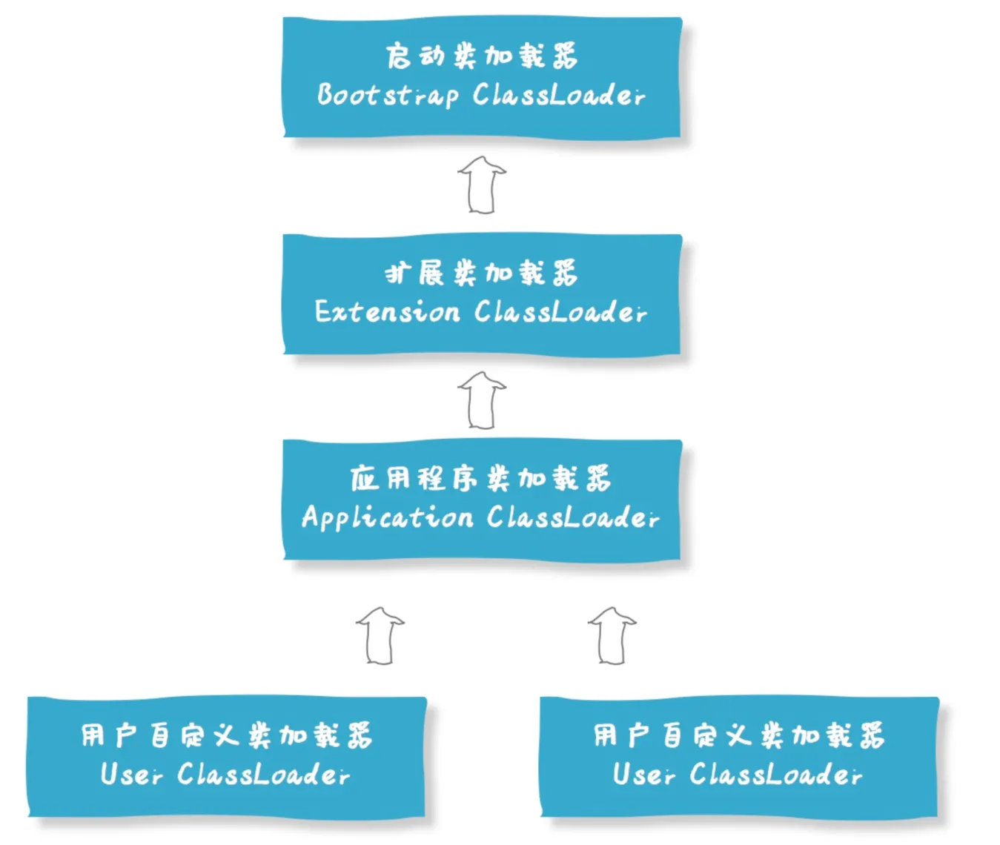

#  Java虚拟机面试题

### 内存模型

#### JVM的内存模型介绍一下

根据JVM8规范，JVM运行时内存共分为5个部分，**即虚拟机栈、堆、程序计数器、本地方法栈、元空间**。除此之外还有一部分内存叫**直接内存**，虽然属于操作系统的本地内存，但也可以供 JVM 直接操作使用。


**虚拟机栈**：每个java线程创建时都会创建一个私有的栈， 而栈里面存储的是栈帧的数据体。每个方法都会创建栈帧，栈帧里面存放了局部变量表（包括基本数据类型和引用），操作数栈，动态链接（指向运行时常量池的引用），和方法出口。栈的大小可以固定也可以动态扩展。

**本地方法栈**：与虚拟机栈类似，但本地方法栈存储的是native方法，JVM并没有规定本地方法栈中方法的语言，使用方法和数据结构。native方法一般为其他编程语言实现。

**程序计数器：**每个线程都有自己私有的程序计数器和**虚拟机栈**一样属于“线程私有”内存。其指出了线程正在运行的字节码指令地址，java线程并发运行环境下线程切换时必须记录**程序计数器**当前运行的值，方便后面切换回该线程时能正确运行。

**堆：**堆内存是JVM中**所有线程共享**的部分，在JVM启动时便以创建，所有的对象和数组都在堆上分配内存。堆内存分为新生代和老年代等部分。当线程申请堆内存不够时，便会出现OOM（OutOfMermoy）异常，但堆内存空间可以通过GC来回收。堆内存是JVM中最大管理最复杂的一个区域。其唯一的用途就是用来存放对象实例。

**元空间：**即为JVM方法区，其内存位于OS的本地内存（注意并不是下面的直接内存）所以空间是可以递增的，所有线程共享。

**直接内存**：直接内存并不是JVM运行时数据区的一部分，也不是JVM规范中定义的内存区域，是随着JDK1.4引入的NIO类一起加入JAVA中，NIO类引入了一种基于通道和缓冲区的I/O技术，以提高文件和网络IO的性能。这一区域通常与文件读写和网络通行有关，所有线程共享。


**Q： Jdk1.7和1.8有什么区别？**

主要是方法区的实现变了，方法区的职责仍然是存放类的元数据（不过它不再有固定的实现和内存限制）。

**JDK 1.8之前**，方法区通过**永久代（PermGen）**来实现存放在堆内存之中，永久代存放类信息、静态变量等。并且存在内存管理上的一些限制，如`OutOfMemoryError: PermGen space`。

**JDK 1.8及之后**，永久代被移除，取而代之的是**元空间（Metaspace）**。元空间不再使用堆内存，而是使用本地内存，解决了永久代内存管理上的一些问题，同时也对JVM的内存管理进行了优化。

天空间取代永久代主要是为了避免OOM异常。因为通常使用PermSize和MaxPermSize（永久代设置参数）设置永久代的大小就决定了永久代的上限，但是不是总能知道应该设置为多大合适, 如果使用默认值很容易遇到OOM错误。

当使用元空间时，可以加载多少类的元数据就不再由MaxPermSize控制，而由系统的实际可用空间来控制（也提供了两个参数允许我们限制元空间的使用，防止因为类加载过多导致系统内存耗尽，但如果不设置，那就自由增长的，而永久代则有固定的默认上限。）。

而且永久代（PermGen）存储了类的元数据、静态变量和常量池，这部分数据存放在JVM的堆内存区域中。然而，堆内存主要是用来存放对象实例的，因此将类的元数据与应用实例数据混合存储在一起，导致了内存管理上的不合理和复杂性。


**Q：虚拟机栈中的动态链接是什么？**

A：**动态链接**是栈帧的一部分，用于在方法调用时将符号引用转化为直接引用。方法调用时，动态链接会从运行时常量池中读取符号引用，对于静态方法可以直接在运行时常量池中找到直接引用，而对于对象的实例方法，JVM根据符号引用在方法区中的虚方法表中按照符号引用和方法参数组成的索引查找目标方法的实际内存地址（直接引用）供后续执行使用。


当下面这段代码执行时，

```java
public void printMessage() {
    String message = "Hello";  // 字符串常量的引用在运行时常量池
    System.out.println(message);  // println方法的符号引用在运行时常量池
}
```
动态链接会解析方法调用和字符串常量，将他们的符号引用转换为直接引用。

而常见的符号引用包括：

- 类和接口的全限定名
- 字段的名称和描述符
- 方法的名称和描述符
- 方法句柄和方法类型

所以动态链接是连接字节码和实际运行时数据的桥梁，而这些数据确实存储在元空间的运行时常量池中。


#### JVM内存模型里的堆和栈有什么区别？

JVM的栈以虚拟机栈为例，**栈是每个线程内部私有的**，随着线程的创建而创建，其用途方面在于**存放每个方法的栈帧**，当线程内调用了一个方法，就会创建该方法的栈帧，栈帧记录该方法的**局部变量表（包括基本数据类型和引用）**，**操作数栈和方法出口**等信息。**栈中的数据有明确的生命周期**，方法调用结束该方法的栈帧就会被销毁空间会被回收。相较于堆内存，**栈访问使用FILO（先进后出）的策略使得访问速度更快**。但**栈空间较小且固定由OS约定**，栈空间溢出往往是因为**递归层数过深或局部变量过大**导致。

与栈不同JVM的**堆内存对所有线程共享**，其用途方面在于**存放对象的实例（类的实例和数组）**，如使用**new**关键字创建对象时，对象的实例就会被分配到堆内存。**堆中的数据没有明确的生命周期**，靠**GC垃圾回收器**制定一定策略回收，相较于栈栈**堆内存访问速度较慢**，因为对象在堆内存释放和分配都需要更多时间，且由于还有GC垃圾回收器会进一步影响性能。**堆内存空间较大且可以动态扩展**，是由JVM管理。堆内存空间溢出往往是因为**创建了太多的大对象或未能及时回收**。

| 特征           | 栈（虚拟机栈）           | 堆                         |
| -------------- | ------------------------ | -------------------------- |
| **线程可见性** | 线程私有                 | 所有线程共享               |
| **存储内容**   | 方法栈帧、局部变量、引用 | 对象实例、数组             |
| **生命周期**   | 方法调用后立即回收       | 由GC管理，生命周期不确定   |
| **内存分配**   | 静态、大小有限           | 动态可扩展                 |
| **访问速度**   | 快（FILO策略）           | 相对较慢                   |
| **内存管理**   | OS管理                   | JVM管理                    |
| **溢出原因**   | 递归层数深、局部变量过大 | 创建过多大对象、未及时回收 |


#### 栈中存的到底是指针还是对象？

**JVM的栈主要存储线程的局部变量和方法调用的上下文。**而堆是用于存储所有类的实例和数组。

栈中的存储主要是基本数据类型和对象的引用，而不是对象本身。如`MyObject obj = new MyObject();`，这里的`obj`实际上是一个存储在栈上的引用指向堆内存中存储的对象实例，这个引用是一个固定大小的数据（例如在64位系统上是8字节），所以栈中存的是对象实例是实际存储位置指针。


#### 堆分为哪几部分呢？


堆内存空间是JVM中占空间最大、管理最复杂的一个区域，随着JVM的发展和不同垃圾回收器的实现。堆的具体划分可能会有所不同，但在逻辑上通常可以分为以下几个部分：

**新生代 (Young Generation)：**新生代分为Eden Space和Survivor Space。其中Eden Space存放绝大部分新创建的对象实例。Eden Space相对较小，当Eden Space空间满时，会触发一次针对Eden Space和Survivor Space进行Minor GC（新生代垃圾回收）。在**新生代**另一个区域Survivor Spaces中，通常分为两个相等大小的区域，称为S0（Survivor 0）和S1（Survivor 1），这两个区域一般同时只有一个区域有存活实例（即另一个保持空闲用作下次GC后的接收区）。在每次Minor GC后，会将Eden Space和Survivor Spaces（有实例的一部分）的存活移动到Survivor Spaces的另一部分。

**老年代 (Old Generation/Tenured Generation)：**当**新生代**的实例对象经过一次或几次Minor GC后仍然存活的话，会被移动到**老年代**。老年代中的对象生命周期较长，因此Major GC（也称为Full GC，涉及老年代的垃圾回收）发生的频率相对较低，且为了存储更多长期存活对象老故年代空间较大，故Major G执行时间通常比Minor GC长。 

**元空间 (Metaspace)：**在JAVA 8 后原来在JVM堆内存存储方法区的永久代被存储在OS本地内存的元空间所取代，故**元空间**在逻辑上属于堆，**元空间**主要存储类的元数据信息，如类的结构信息（类名、修饰符、继承、接口等）、方法信息（方法名、参数、返回类型等）、字段信息（字段名、字段类型、字段修饰符）和常量池信息（符号引用）。

**大对象区 (Large Object Space / Humongous Objects)：**在某些JVM采用特殊垃圾回收器（如G1），为大对象分配了专门的内存区域，大对象指的是需要大量连续内存空间的对象如大数组。这种对象会直接分配在大对象区 而不是新生代，防止内存碎片化问题。


#### 什么叫大对象？

在JVM中，大对象指的是需要大量连续内存空间的对象。

一般地，大对象占用大量连续内存空间，超过一定大小阈值的对象，通常大对象直接进入老年代。典型的大对象即为长数组或大字符串。

大对象容易造成内存碎片化，会直接进入老年代的同时还需要大块连续内存空间，所以因为分配内存困难可能导致频繁Full GC，影响系统性能。


#### 程序计数器的作用，为什么是私有的？*

程序计数器指出了线程正在运行的字节码指令地址，java线程并发运行环境下线程切换时必须记录**程序计数器**当前运行的值，方便后面切换回该线程时能正确运行。每个Java线程在多道并发程序环境下最后运行到字节码指令地址各不相同，所以每个JAVA线程多应该有自己的程序计数器。


**注：**需要注意三条可以补充。

* 程序计数器第2个功能是字节码解释器通过改变程序计数器来依次读取指令，从而实现代码的流程控制，如：顺序执行、选择、循环、异常处理。

* 而且程序计数器是唯一一个不会出现 `OutOfMemoryError` 的内存区域，它的生命周期随着线程的创建而创建，随着线程的结束而死亡。

* 而且本地方法栈的指令地址不由JVM程序计数器指出，本地方法一般是C和C++编写而成，而且由各自的编译器转化为机器指令，所以由**CPU中的程序计数器（PC，Program Counter）**来进行控制。


#### 方法区中的方法的执行过程？

当程序通过对象和类调用某个方法时，方法区中的方法的执行过程如下：

1. 解析方法调用：若该方法是第一次解析调用，JVM会将符号引用找到实际的内存地址。后续如果再次调用该方法，会跳过这一步。
2. 栈帧创建：在调用这个方法前，JVM首先在执行该方法的虚拟机栈创建栈帧，记录该方法的局部变量表（包括基本数据类型和引用），操作数栈和方法出口等信息。
3. 执行方法：在这一步根据方法的字节码指令执行，可能有局部变量的读写、操作数栈的控制、对象创建和方法调用等等。
4. 返回处理：执行方法结束后，会返回一个结果给调用者，随后会清理第二步是创建的栈帧以及恢复调用者的执行环境。


#### 方法区中还有哪些东西？*

当前方法区即**元空间**主要存储类的元数据信息，如：

类的结构信息：类名、修饰符、继承、接口

方法信息：方法名、参数、返回类型、方法字节码

字段信息：字段名、字段类型、字段修饰符

**运行时常量池信息：每个类都有自己的运行时常量池，存储该类在编译时生成的所有符号引用（类名、方法名、字段名等），并在类解析阶段将其中的部分符号引用解析为直接引用（如静态方法、私有方法的地址，以及静态字段、私有字段的内存地址）。**

接口或者类或者抽象方法的默认方法、静态方法、普通方法、抽象方法的签名信息的字节码。

虚方法表：存储可以被子类重写的方法的符号引用和对应的直接引用

类的加载器引用，指向加载该类的类加载器。


**Q：那实例变量的直接引用在哪？**

A：实例变量**属于对象实例**，对象存储在**堆（Heap）中**。但是可以被继承和重写的实例方法其实共享的是**同一个类中方法的字节码实现**，只是在执行时传入的对象实例或参数不同。


#### String保存在哪里呢？*

在 目前的JAVA版本，所有`String` 值保存在**堆内存**中的字符串常量池，而且字面量`String`对象也在堆中的字符串常量池。而一般new出来的`String` 对象是存储在堆内存之中，`String` 的不变特性使得字符串常量池值一般共享的，从而优化内存使用。

```java
String s1 = "abc";              // 常量池对象
String s2 = new String("abc");  // 堆中的新对象

System.out.println(s1 == s2);           // false（不同对象）
System.out.println(s1.equals(s2));      // true（内容相同）

// 通过反射验证字符数组是否共享：
Field valueField = String.class.getDeclaredField("value");
valueField.setAccessible(true);

char[] s1Value = (char[]) valueField.get(s1);
char[] s2Value = (char[]) valueField.get(s2);
System.out.println(s1Value == s2Value); // true（共享同一char[]）
```


####  String s = new String（“abc”）执行过程中分别对应哪些内存区域？

首先分析一下这行代码`String s = new String（“abc”）`分为三个部分，

**s：**是对象`new String（）`的引用，应存储在虚拟机栈的栈帧中

**new String（）：**通过`new`关键字创建的新对象所以应在堆内存中新分配的区域

**“abc”**：是一个字符串字面量，应在堆内存的字符串常量池中。


首先讲一些字面量概念，包含八种基本数据类型的数字型（如10、10.0、true）和 `String`以及一些固定的特殊值，也就是直接写在代码中的固定值。

对于String字面量在编译时JAVA便会在字节码文件记录字面量，在运行时加载到常量池中。对于数值、字符和布尔字面量是直接存储在栈内存或寄存器中。字面量作用在于在编译时和运行时由编译器和 JVM 进行高效处理，尤其是字符串字面量可节省性能（通过复用常量池中的对象减少资源消耗）和节省内存（通过共享字符串实例避免重复创建消耗存储）。


执行过程分析如下，

首先检查字符串常量池中是否存在字面量 `"abc"`。

如果不存在，创建一个常量池对象`"abc"`；

如果存在，直接使用已有的常量池对象`"abc"`。

执行**new String（）**创建一个新的 String 实例对象（位于堆中），并将新 `String` 对象的 `value` 字段（存储字符数据的 `char[]`）直接引用原字面量 `"abc"` 的字符数组（**非拷贝，直接复用**）。

将堆中新创建对象的引用赋值给变量 `s`（存储在栈帧中）。

```java
栈帧（s） → 堆内存（new String对象） → 堆内存（常量池中的"abc"）
                        │                   │
                        └───共享 char[] ────┘
```

故假设 `"abc"` 第一次出现会创建两个对象，假设 `"abc"` 已存在于常量池，只会创建一个对象。


Q：**为何 new 的对象不共享常量池？**
`new` 强制在堆中创建新对象，与常量池对象是不同实例，但底层字符数据共享。


####  引用类型有哪些？有什么区别？

##### 1. 强引用

一般的是最为常见的引用类型，直接通过赋值创建如下：

```java
A a = new A(); // a 是对 A 对象的强引用
```

只要有一个强引用指向堆内存空间中的某个对象，GC（垃圾回收器）都不会回收该对象。


##### 2. 软引用（Soft Reference）

软引用可以用SoftReference来描述，

```java
SoftReference<String> softRef = new SoftReference<>(new String("Soft Reference"));
```

指的是那些有用但是不是必须要的对象。系统在发生内存溢出前会对这类引用的对象进行回收。

软引用通常应用于缓存之类的场景，对一些占用比较大的对象（如图片资源）实行软引用，在内存不足时回收这些缓存对象。


##### 3. 弱引用（Weak Reference）

一般地，使用WeakReference类表示，

```java
WeakReference<String> weakRef = new WeakReference<>(new String("Weak Reference"));
```

弱引用的强度比软引用还低，只要发生GC弱引用相关联的对象都会被回收，无论内存是否充足。

弱引用一般用于某些数据的临时映射或防止内存泄露，如JAVA并发编程中的`ThreadLocalMap`的键，即`ThreadLocal` 对象本身，用弱引用存储。当即用户代码中不再持有 `ThreadLocal` 的引用（强引用）时，会被回收。


##### 4. 虚引用（Phantom Reference）

一般地，虚引用使用 `PhantomReference` 类表示，必须和 `ReferenceQueue` 一起使用。

```java
ReferenceQueue<String> queue = new ReferenceQueue<>();
PhantomReference<String> phantomRef = new PhantomReference<>(new String("Phantom Reference"), queue);
```

虚引用是最弱的引用，无法通过 `get()` 方法访问关联对象的实际内容，即使没有发生 GC，也无法阻止对象被回收。当关联对象被 GC 回收时，虚引用会被加入到关联的 `ReferenceQueue` 中，可以通过检测队列得知对象已被回收。

主要用途入下：

- **管理堆外内存：** 比如直接内存分配或清理。
- **监控对象生命周期：** 跟踪对象被回收的时间点，执行资源清理操作。


| 引用类型   | 回收时机     | 使用场景     | 创建方式                                | 特点               | 内存压力下表现         |
| ---------- | ------------ | ------------ | --------------------------------------- | ------------------ | ---------------------- |
| **强引用** | 从不回收     | 普通对象引用 | `A a = new A()`                         | 最普通、最强的引用 | 即使内存不足也不会回收 |
| **软引用** | 内存即将溢出 | 缓存场景     | `SoftReference<T>`                      | 有用但非必须的对象 | 内存紧张时优先回收     |
| **弱引用** | 每次GC时     | 临时映射     | `WeakReference<T>`                      | 生命周期更短       | 只要发生GC就会被回收   |
| **虚引用** | 对象回收时   | 资源清理     | `PhantomReference<T>`和`ReferenceQueue` | 无法获取对象内容   | 随时可能被回收         |


####  弱引用了解吗? 举例说明在哪里可以用?*

一般地，弱引用使用WeakReference类表示，

```
WeakReference<String> weakRef = new WeakReference<>(new String("Weak Reference"));
```

弱引用的强度比软引用还低，只要发生GC弱引用相关联的对象都会被回收，无论内存是否充足。

弱引用一般用于某些数据的临时映射，

如 `WeakHashMap`。

在 `WeakHashMap` 中，当键不再有强引用时，会在下一次 GC 后自动回收这个键。weakHashMap的键被回收之后，也会自动移除值。

```java
WeakHashMap<String, String> weakMap = new WeakHashMap<>();
String key = new String("key");
weakMap.put(key, "value");

System.out.println("Before GC: " + weakMap); // 输出：{key=value}

key = null; // 释放对键的强引用
System.gc(); // 触发垃圾回收
```


如JAVA并发编程中的`ThreadLocalMap`的键，即`ThreadLocal` 对象本身，用弱引用存储。当即用户代码中不再持有 `ThreadLocal` 的引用（强引用）时，会被回收。

或防止内存泄露，当一个对象不应该被长期引用时，使用弱引用可以防止该对象被意外地保留，从而避免潜在的内存泄露。


#### 内存泄漏和内存溢出的理解？

内存泄露是指堆内存空间中的对象不在使用但仍然被引用导致垃圾回收器无法回收该对象的内存，从而导致程序占用内存越来越多而系统可用内存越来越少的情况。


内存泄露原因一般为：

使用JAVA的静态集合（如`HashMap`或`ArrayList`）来存储对象，且未清理。

没有及时关闭资源，如事件监听，事件源对象就会被监听器持有引用，从而导致它无法被垃圾回收，造成内存泄漏。

线程，未停止的线程可能持续持有对象引用，导致垃圾回收器无法回收相应内存。


内存溢出是指JAVA虚拟机在申请内存时，无法分配足够的内存导致出现了OOM（`OutOfMemoryError`）错误。


内存溢出的常见原因有：

大量创建对象导致堆内存不足以存储新创建的对象。

递归层数过深导致栈空间溢出。

大型数据结构，长时间占有对象的引用导致程序内存积累（故内存泄露可以诱发内存溢出）。


**Q：关于第2点内存泄露的例子？**

A：下面的代码中，为按钮注册了一个 `ActionListener` 监听器。按钮被放在 `JFrame` 中显示。

```java
import javax.swing.*;
import java.awt.event.ActionEvent;
import java.awt.event.ActionListener;

public class EventListenerMemoryLeak {
    private JFrame frame;
    private JButton button;

    public EventListenerMemoryLeak() {
        frame = new JFrame("Memory Leak Example");
        button = new JButton("Click Me");

        // 添加事件监听器
        button.addActionListener(new ActionListener() {
            @Override
            public void actionPerformed(ActionEvent e) {
                System.out.println("Button clicked!");
            }
        });
        
        public void cleanup() {
        // 移除事件监听器
        button.removeActionListener(listener);
    }

        frame.add(button);
        frame.setSize(300, 200);
        frame.setDefaultCloseOperation(JFrame.EXIT_ON_CLOSE);
        frame.setVisible(true);
    }

    public static void main(String[] args) {
        // 创建对象并启动程序
        EventListenerMemoryLeak app = new EventListenerMemoryLeak();
        // 注意：没有调用 app.cleanup() 来移除事件监听器
    }
}
```

没有调用 `cleanup() ` 的方法来移除事件监听器，**即使按钮不再被显示或使用，按钮和 JFrame 对象会被事件监听器持有引用**，从而**阻止它们被垃圾回收**。


#### jvm 内存结构有哪几种内存溢出的情况？

##### 1. 堆内存溢出

堆内存溢出的异常信息为`OutOfMemoryError: Java heap space`，原因是当总共的对象实例占用空间超过了对的最大限制，发生溢出。

常见原因有：

创建了大对象，但堆中没有足够内存分配。

内存泄露，存在不在使用的对象仍被引用，垃圾回收器无法回收导致可用内存减少。

内存增长过快，这种请况在于虽然对象的生命周期较短，但是创建过多导致GC没来得及回收。

解决办法有：

分析代码，优化数据结构和对象生命周期管理。

使用工具来排查内存泄露

通过设置JVM参数来设置最大堆内存和初始堆内存。


##### 2. 栈内存溢出

栈内存溢出的异常信息为

`java.lang.StackOverflowError`（递归调用导致栈溢出）。

或`java.lang.OutOfMemoryError: unable to create new native thread`（线程栈创建失败）。

原因在于栈存储java主要线程调用的栈帧（局部变量表，操作数栈和方法出口等），当递归层数过深会导致栈空间被多层递归调用的栈帧打满，或线程数量过多没有新空间为新线程创建栈。

解决方法：

检查递归调用，确保有退出条件，不会无限递归。

通过设置JVM参数来设置最大栈空间。

优化多线程处理逻辑，限制线程创建数量。


##### 3. 元空间内存溢出*

元空间溢出的异常信息为`OutOfMemoryError: Metaspace`，存储类的元数据信息。当加载的类和运行时生成类过多时，元空间被耗尽便会发生溢出。

常见原因有：

通过动态代理、JSP编译的方式动态生成的类太多，这些类的元数据都积累在元空间以至于打满元空间内存。

第三方包过多，项目运行时通过依赖加载过多类，占用了元空间内存。

类加载器泄露，即用户使用了自定义的类加载器，但由于某些原因自定义类加载器对象没有被回收，但自定义类加载器对象持有类元数据的引用，导致元空间的元数据无法被回收。

解决方法：

通过设置JVM参数来设置元空间初始大小和最大大小。

检查类加载器是否泄露

优化代码减少动态生成类的数量。


##### 4. 直接内存溢出

直接内存溢出的异常信息为**OutOfMemoryError: Direct buffer memory**，直接内存是堆外内存，属于操作系统的本地内存，但可以有JVM管理用于操作系统的IO交互，尤其是在Java的NIO类分配直接内存为缓冲区使用时，但分配的内存总额超过`-XX:MaxDirectMemorySize` 限制时，会发生溢出。

常见原因有：
直接内存过多分配，NIO类分配使用`ByteBuffer.allocateDirect()`分配缓冲区超过限制。

直接内存未及时释放：未显式清理直接内存，导致直接内存泄漏。

解决方法有：

通过设置JVM参数来设置直接内存大小。

确保及时释放直接内存，调用 `ByteBuffer` 的 `cleaner()` 方法。

使用合适的内存池来管理直接内存分配。


#### 类加载器泄漏是个怎么回事？

类加载器泄露通常发生在应用程序**运行过程中**，常见的就是

在Tomcat等容器中，当重新部署WEB应用时（不是关闭再启动，是Idea那个重新部署按钮），理论上旧版本的类和类加载器应该被卸载，但如果存在引用没有释放，旧的类加载器就无法被垃圾回收，导致元空间持续增长。


造成这种现象，极端例子就是创建了一个不会终止的线程，并且该线程直接或间接引用了类加载器，那么类加载器就无法被回收。

```java
// 自定义类加载器
public class CustomClassLoader extends ClassLoader {
    // 加载类并创建实例
}

// 由CustomClassLoader加载的类
public class LeakedThreadStarter {
    public void startThread() {
        // 线程内部持有LeakedThreadStarter类的实例（由CustomClassLoader加载）
        new Thread(() -> {
            while (true) {
                try {
                    Thread.sleep(1000);
                } catch (InterruptedException e) {}
            }
        }).start();
    }
}

// 部署时：用CustomClassLoader加载LeakedThreadStarter并调用startThread()
// 重新部署时，旧线程未终止 → CustomClassLoader无法被回收
```

当Tomcat在热部署时，服务器会尝试停止应用中的加载Servlet/JSP相关的线程并清理资源卸载类。**但无法处理用户手动创建的线程**，若并持有对旧版本类加载器的引用。所以这个线程不会被关闭，在卸载的过程中，它还占有对自定义的类加载器的引用，所以这部分元空间就被泄露了。


#### 有具体的内存泄漏和内存溢出的例子么请举例及解决方案?

##### 1. 大量使用静态变量

使用静态变量关键字static修饰会造成内存泄露，在JAVA中静态属性属于某个类而不是对象，其生命周期随着类的加载和卸载，与类加载器的生命周期所一致，往往伴随应用的整个生命周期（除非加载器符合垃圾回收的条件）。

故若大量使用static关键字修饰的变量可能造成内存泄露。另一个典型的内存泄露场景是使用静态集合长期保存大量对象引用，这些对象即使不再需要，也会持续占用内存空间。这种情况下，垃圾回收器无法回收这些对象，导致内存资源无法有效释放，随着时间推移可能会消耗大量内存。

解决方法即尽量合理使用static关键字，在静态集合中尽量使用软引用或弱引用，若使用单例模式，尽量使用懒加载。


##### 2. 未关闭的资源

首先介绍下，资源的概念。

资源通常指的是程序运行时创建的外部链接或数据流，如数据库连接、文件流、网络连接和绘话对象。这些资源需要系统内存或文件描述符等等有限的资源。如果程序没有主动关闭这些资源，JVM会持续有对于这些资源的引用，防止其被垃圾回收，导致资源会持续的占用内存和资源池，导致资源泄露。


解决方法在于始终在Finally块进行关闭资源的操作，当然还要防止关闭资源本身出现异常。会导致资源未被正确释放。在JAVA7以后的版本使用 `try-with-resources`的方式。

**try-with-resources** 语法。即资源的声明和获取放在 `try` 语句中，编译器会自动处理资源的关闭，不需要手动调用 `close()`方法关闭。**优点在于** try-with-resources 自动关闭资源，即使发生异常，也会自动关闭 `PrintWriter`，简化了代码且减少了错误的可能性。


##### 3. 使用ThreadLocal

ThreadLocal 也会造成内存泄漏。每个线程维护一个 ThreadLocalMap，用于存储与 ThreadLocal 对象关联的值，其中ThreadLocalMap 的键是弱引用（`ThreadLocal` 对象本身，用弱引用存储），值是强引用（`ThreadLocal` 存储的数据对象，用强引用存储）。

因为 ThreadLocal 对象本身是弱引用存储，当不再有任何强引用（即用户代码中不再持有 `ThreadLocal` 的引用）指向他时，ThreadLocalMap键会被垃圾回收，但ThreadLocalMap 中的值（强引用）仍可能无法释放，导致内存泄漏，尤其是在线程池复用线程的场景下。

解决方法在于在finally块中显式调用 `remove()` 方法移除 `ThreadLocal` 的值，在线程结束前正确清理 `ThreadLocal` 变量，而不是通过设置为null的方式清除`ThreadLocal` 变量。


### 类初始化和类加载

#### 创建对象的过程？


当执行`new`关键字创建对象时，过程如下

##### 1. 类加载检查

JVM遇到`new`关键字时会首先检查该要创建的对象相关的类的符号引用，确保与该对象相关的类被加载、连接和初始化。若相关的类没有加载则必须进行加载，类加载过程在后续有详细说明。

##### 2. 分配内存

在类加载通过后，JVM需要为创建对象分配内存，内存分配在堆空间进行分配。在相应的类被加载后对象所需的内存大小便可以被确定。

分配内存看堆内存是否连续有两种相应的策略：

若堆内存连续（在使用标记整理算法时，空闲空间和已使用空间界限清晰），可以通过**指针碰撞法**，即使用一个指针作为分界点（初始时在堆中区域的起始位置），当前指针向后分配对象，每次分配后，指针就向后移动相应的大小。

若堆内存不连续（比如说标记清除算法），则通过维护一个空闲列表来找到合适的内存块。


另外堆内存因为是共享内存空间，分配时也要注意线程安全。

可以通过在分配时对堆内存空间加锁，或使用线程本地缓冲（TLAB），来为每个线程分配一小块堆内存用于独占分配，减少锁竞争。


##### 3. 初始化零值

经过内存分配后，成功分配的对象内存布局有三个部分。

对象头，包含类元数据的指针和一些辅助信息

实例数据，对象的成员变量。

对齐填充，为了提高堆内存访问对象的效率，一般有空白区域进行对整齐。


初始化零值即为，将新分配的内存清0，保证对象的实例字段在未显示赋值的情况下具有0值。初始化零值的范围一般只有上述提到的实例数据。


##### 4. 设置对象头

这一部由JVM来设置对象头，包括有**Mark Word**和**类型指针**等信息。

**Mark Word** 包含对象哈希码（如果对象调用了 `hashCode` 方法，虚拟机会在对象头中记录哈希码的值）、GC分代年龄（用于垃圾回收策略）、锁状态标志和偏向锁线程ID（用于线程同步）等重要字段。

**类型指针**有指向元空间中类对应的元数据的指针等。


##### 5. 执行构造方法（init 方法）

完成所有低级操作后，虚拟机会执行字节码文件的部分字段。如果字段有显式赋值（如 `int a = 5`），此时虚拟机会执行赋值操作。虚拟机也会调用构造方法以完成对象的初始化。


#### 对象的生命周期*

对象的生命周期一般有创建、使用、销毁三个周期。

**创建：**对象通过关键字new在堆内存中被实例化，对象的内存空间被分配，构造函数被调用完成初始化。

**使用：**对象在程序运行过程中被引用并执行相应的操作，可以通过引用访问对象的属性和方法。

**销毁：**当对象不再被引用时，垃圾回收器会在适当的时候检测并回收不再被引用的对象，释放对象占用的内存空间，完成对象的销毁过程。


#### 类加载器有哪些？



##### 1. 启动类加载器（Bootstrap Class Loader）

**启动类加载器**是最顶层的类加载器，使用C++实现，是JVM的一部分。加载范围包括`$JAVA_HOME/jre/lib/rt.jar`，负责加载Java核心类库如`java.lang.*`、`java.util.*`等。特点在于无法被Java代码直接引用。


##### 2. 扩展类加载器（Extension Class Loader）

**扩展类加载器**的父类是**启动类加载器**且由**启动类加载器**加载，使用Java语言实现，负责加载Java扩展目录(`$JAVA_HOME/jre/lib/ext)`下的jar包和类库（这些库通常用于 Java SE 扩展（比如一些数据库驱动、第三方库、图形库等））。


##### 3. 系统类加载器（System Class Loader）/ 应用程序类加载器（Application Class Loader）

系统类加载器也称为应用程序类加载器，其父类为**扩展类加载器**且由**扩展类加载器**加载。负责加载用户类路径`ClassPath`上的类，是平时编写的java程序默认使用的类加载器。特点在于可以通过`ClassLoader`类的`getSystemClassLoader()`方法获得。


##### 4. 自定义类加载器（Custom Class Loader）

开发者可通过特定需求自行实现**自定义类加载器**，来从网络、加密文件和数据库来加载类，自定义类加载器可提高应用的的灵活性和安全性，是Java动态性的一个重要体现。自定义类加载器的父类是**系统类加载器**且由其加载。


这些类加载器，通过**双亲委派模型**组织在一起，双亲委派模型的核心思想为当一个类加载器收到加载请求时，不会尝试自己先去加载，而是把加载请求传递给自己的父类加载器，这样的层层递进，每一个类加载请求都启动类加载器。只有在父类加载器此类加载器反馈无法处理这个请求（在自己的类加载范围没有找到），子类加载器才尝试自己去加载。


#### 双亲委派模型的作用？

第一是保证了类的唯一性，通过将类加载请求传递到父类甚至最终到启动类加载器，避免了底层加载器加载重复的类，保证了JAVA核心类库的唯一性，也防止了用户自定义类会覆盖Java核心内库的可能性。

第二是保证了系统的安全性，由于最终的加载请求都交由启动类加载器，而启动类加载器只会加载信任的目录下方，可以防止不可信类假冒Java核心类，可增强系统的安全性。

第三支持了隔离和层次划分，双亲委派模型不同类加载器服务与不同的类加载请求，启动类加载器加载JAVA核心类，扩展类加载器加载扩展框架，应用类加载器加载用户自定义类，这种层次型的划分有助于实现沙箱安全机制，各个类加载器指责清晰，便于维护和扩展。

最后是简化了加载流程，通过双亲委派模型类可以被正确的类加载器加载，减少了每个类加载器需要处理的数量，简化了类的加载过程。


#### 怎么打破双亲委派模型？

只有自定义类加载器在继承`ClassLoader`类时，重写其中的`loadClass`方法可以改变这种默认的双亲委派逻辑。达到先自己加载，找不到再委托父加载器"的逻辑。


#### 为什么TomCat要打破双亲委派模型？

Tomcat可以同时运行多个Web应用，每个应用可能使用不同版本的相同库（比如Spring、Hibernate等）。如果严格遵循双亲委派，所有应用将被迫使用同一版本的库，这会导致版本冲突。


也就是实现了Tomcat可以在不重启服务器的情况下重新加载或更新Web应用。只需要卸载类加载器及加载的类随后再进行装载，就可以一个应用被重新部署。


**Tomcat类加载器架构**

- **Bootstrap ClassLoader**：加载JVM核心类（如`java.*`）。
- **Extension ClassLoader**：加载`javax.*`等扩展类。
- **System ClassLoader**：加载`CLASSPATH`中的类。
- **Common ClassLoader**：加载Tomcat共享类（如`catalina.jar`）。
- **Webapp ClassLoader**：每个Web应用独立类加载器，加载`WEB-INF/classes`和`WEB-INF/lib`中的类。


#### 讲一下类加载过程？

类从被加载到虚拟机内存开始，到卸载出内存为止，它的整个生命周期包括以下 7 个阶段。


而类加载过程主要包括三个阶段，加载、链接和初始化。其中加载又包括验证、准备和解析。

##### 1. 加载

通过包名和类名组合而成的全限定名，找到该类被编译后的字节码文件二进制字节流，将二进制字节流所代表的类信息转化为元空间中的类的元数据信息，并在堆内存分配空间来创建该类的Class对象作为访问这些元数据的入口。


##### 2. 连接

- 验证：确保根据字节码文件加载的类的内容符合JVM的要求，不会危害JVM，包括文件格式校验、元数据验证、字节码验证、符号引用验证。

  1. **文件格式校验**：检查字节流是否符合`Class`文件的格式规范，例如版本号等。
  2. **元数据验证**：验证类的结构是否合法，如检查类是否继承了不允许被继承的类（如`final`类）。
  3. **字节码验证**：通过数据流分析和控制流分析，验证字节码指令是否合法，确保方法体逻辑不会破坏JVM的运行时结构。
  4. **符号引用验证**：确保解析阶段能够正确解析符号引用。

  

- 准备：为类的静态字段分配内存，并设置默认的初始值（即0、`false`、`null`）。

  注：如果静态字段被`final`修饰且是基本类型或字符串常量，并且在类中被直接赋值（如`public static final int X = 1;`），则其值会在编译时被写入到常量池中，因此在准备阶段不会分配内存，而是在编译时直接确定值。

- 解析：这个过程将元空间中该类的运行时常量池的符号引用转化为直接引用的过程，符号引用是以一组符号来描述引用的目标，直接引用是可以直接指向实际目标地址的指针，相对偏移量是一个能间接定位到目标的句柄。且直接引用与内存布局有关，如果存在直接引用， 目标必定已经存在于内存中。


##### 3. 初始化

初始化是整个类加载过程的最后一个阶段，初始化阶段简单来说就是执行类的构造器方法`<clinit>()`，构造器方法是由编译器自动实现的，用于为Class对象的静态变量赋值和执行静态代码块。


类加载是懒加载机制，即只有首次主动使用类时才会触发完整的类加载过程。

常见的主动使用场景包括：

- 创建类的实例（如`new MyClass()`）。
- 调用类的静态方法（如`MyClass.staticMethod()`）。
- 访问类的静态字段（如`MyClass.staticField = 0;`）。


**Q：创建class对象在堆内存中分配内存作为方法区中类的元数据的访问入口，有点笼统展开讲一下？**（仅作为加深记忆用）

A：在第1步加载过程中，一共有两步，

- 将类的字节码加载到内存，并在**方法区（元空间）**生成类的元数据（如字段、方法、父类信息、运行时常量池等）。
- 同时在**堆内存**中创建一个 `java.lang.Class` 对象，作为该类在 Java 层的反射入口。

`Class` **对象的作用主要有反射**，可以使 Java 程序通过反射（如 `obj.getClass()` 或 `Class.forName()`）访问类信息的入口。例如：

```java
Class<?> clazz = String.class;
Method method = clazz.getMethod("length");
```

`Class` 对象内部通过本地方法（Native）直接关联到方法区中的类元数据（如方法表、字段表等）。可以理解为：

- **方法区**：存储类的原始元数据（C++层面的数据结构）。
- **Class 对象**：Java 层对方法区元数据的封装，提供反射接口。


第二点，静态变量的值存储在堆的`Class` 对象中，但它们的元数据（如名称、类型、修饰符）存储在方法区。JVM通过这些元数据管理和访问静态变量。


第三点，每个 `Class` 对象唯一标识一个被加载的类，同一类由不同类加载器加载会产生不同的 `Class` 对象。


**Q：解析这个过程将元空间中该类的运行时常量池的符号引用转化为直接引用的过程？详细来说呢？**

A：这个过程其实是两个部分，第1部分对于静态变量和静态方法以及父类的私有变量和私有方法都是直接解析，然后将它们直接引用放入运行时常量池之中。

关于虚方法表，**虚方法表** 存储的是**所有可被重写的实例方法**，即**非 private、非 static、非 final** 的方法。

子类会继承父类的虚方法表结构，如果重写了父类的方法按相同索引位置覆盖对应重写的父类方法，子类特有的方法会添加到虚方法表的末尾。


#### 讲一下类在什么时候会卸载

一共同时达到三种条件JVM会卸载类，

第一是，该类中所有实例都被回收，也就是堆内存空间中不存在与该类相关联的对象。

第二是，该类的类加载器被卸载

第三是，这个类**没有任何直接或间接的引用，包括Class对象以及通过反射访问的方式**。


详细来说第三指的是，如果有任何其他对象（比如持有`Class`类型的对象）或静态方法引用了这个类或者如果程序通过反射（`Class.forName`）或者动态代理等方式访问了这个类，JVM会认为这个类在运行时仍然被使用，因此不会卸载。


### 垃圾回收

#### 什么是Java里的垃圾回收？如何触发垃圾回收？

垃圾回收（GC）是JVM自动管理内存的一种机制，负责回收不在被引用的对象内存。触发垃圾回收有多种机制，

当JVM检测到堆内存空间不足以为新的对象分配空间时，会触发自动垃圾回收。

开发者也可以通过手动请求的方式调用`System.gc()` 或 `Runtime.getRuntime().gc()`来提醒JVM进行内存回收，但不能保证线程立即执行。

在JVM设置参数中，调整`-Xmx`（最大堆大小）、`-Xms`（初始堆大小）来间接影响垃圾回收。

在一些垃圾回收器设计中实现了一些策略，通过监控堆内存使用量和对象数量达到某个阈值就会回收。


#### 判断垃圾的方法有哪些？

主流有两种方法，

##### 1. 引用计数法

通过给每个对象加上引用计数器，当对象被引用的计数器加1，当引用失效时计数器减1。当引用计数器为零时则可以回收。

缺点在于不能解决循环引用的问题，和对象之间相互引用，同时不被其他对象引用，就永远不能回收。


##### 2. 可达性分析算法


从一组被称为GC Root的对象出发，向下追溯他们引用的对象和这些对象引用的对象，若存在一个对象没有出现在所有的引用链之中，这说明该对象是不可达的，应该被回收。

可以作为GC Root对象有

* 虚拟机栈中的栈帧的局部变量表
* 元空间内静态属性引用的对象
* 本地方法栈中引用的对象
* 活跃的线程引用


#### 垃圾回收算法是什么，是为了解决了什么问题？

与传统的编程语言虚开发人员需要手动申请和释放内存（垃圾回收）不同，Java的JVM实现了自动垃圾回收机制，实现了自动垃圾回收。而垃圾回收算法是实现自动垃圾回收机制的重要方法，JVM首先通过引用计数或可达性分析识别需要回收的对象，然后使用具体的垃圾回收算法的策略（如标记-清除、复制、标记-整理）来实际释放这些对象占用的堆内存。


####  垃圾回收算法有哪些？

##### 1. 标记-清除算法

标记-清除算法分为“标记”和“清除”两个阶段，首先通过可达性分析，标记出所有需要回收的对象，然后统一回收所有被标记的对象。

该算法虽然简单粗暴，但是存在有两个缺陷，一个是效率问题，标记和清除的过程效率都不高，另一个方面，清除结束后会造成大量的碎片空间。有可能会造成在申请大块内存的时候因为没有足够的连续空间导致再次 GC。


##### 2. 复制算法

为了解决标记-清除算法的碎片空间的问题，出现了“复制算法”。

复制算法的原理是，将内存分成两块，每次申请内存时都使用其中的一块，当内存不够时，将这一块内存中所有存活的复制到另一块上。然后将然后再把已使用的内存整个清理掉。

复制算法虽然解决了空间碎片的问题，但也带来了新的问题：每次在申请内存时，都只能使用一半的内存空间。内存利用率严重不足。

堆内存中**新生代**另一个区域Survivor Spaces借鉴了这一方式。


##### 3. 标记-整理算法

复制算法在 GC 之后存活对象较少的情况下效率比较高，但如果存活对象比较多时，会执行较多的复制操作，效率就会下降。

而堆内存中老年代的对象在 GC 之后的存活率就比较高，所以就进一步提出了“标记-整理算法”。

**标记-整理算法**的“标记”过程与**标记-清除算法**的标记过程一致，但标记之后不会直接清理。而是将所有存活对象都移动到内存的一端。移动结束后直接清理掉剩余部分。


##### 4. 分代回收算法

分代收集是将内存划分成了新生代和老年代。分配的依据是对象的生存周期，或者说经历过的 GC 次数。

对象创建时，一般在新生代申请内存，当经历一次 GC 之后如果对还存活，那么对象的年龄 +1。

当年龄超过一定值（默认是 15，可以通过设置JVM参数 -XX:MaxTenuringThreshold 来设定）后，如果对象还存活，那么该对象会进入老年代。


#### 垃圾回收器有哪些？

##### 1. Serial

Serial是采用复制算法的新生代单线程处理器，标记和清理都是单线程追求，优点在于简单高效，比较适合单核 CPU和 Java客户端应用（如早期 Java GUI 程序）。


##### 2. ParNew

ParNew与Serial相同是采用复制算法的新生代垃圾回收器，但ParNew是Serial的多线程版本，在多核CPU环境下有比Serial更好的性能，特点在于一般默认配合 CMS 使用，适合服务器低停顿场景响应速度快。


##### 3. Parallel Scavenge

Parallel Scavenge与ParNew相同是采用复制算法的新生代并行处理器，但追求吞吐量优先。高吞吐量可以充分利用CPU，较适合适用于后台服务。


##### 4. Serial Old

Serial Old作用于老年代的使用标记整理算法的单线程垃圾回收器，特点类似于Serial，优点在于简单高效，作为 CMS 失败后（产生过多浮动垃圾）的后备方案。


##### 5. Parallel Old

Parallel Old是使用标记整理算法的老年代并行处理器，与Parallel Scavenge搭配使用一样追求吞吐量优先，更支持后台计算场景，而不支持交互。


##### 6. CMS

CMS(Concurrent Mark-Sweep)是采用标记清除算法的**老年代多线程并发**垃圾回收器。CMS以获取最短回收停顿时间（STW，后面有详细讲解）为目标，具有高并发和低停顿的特点，适合Web 服务、B/S 系统等对延迟敏感的场景。


##### 7. G1

G1与上述所有垃圾处理器都不相同，不仅作用于新生代也作用于老年代。故G1是在新生代内使用复制算法，在部分老年代使用复制算法（混合回收），而发生`full gc`时在全堆使用标记-整理算法的**并发并行垃圾回收器**。

| 垃圾收集器        | 类型                 | 作用域            | 使用算法         | 特点                           | 适用场景                   | STW 时间         |
| ----------------- | -------------------- | ----------------- | ---------------- | ------------------------------ | -------------------------- | ---------------- |
| Serial            | 串行                 | 新生代            | 复制算法         | 简单高效，单线程               | 单核 Client 模式           | 长（单线程 STW） |
| ParNew            | 并行                 | 新生代            | 复制算法         | 多线程优化响应速度             | 多核 Server + CMS 组合     | 较短（多线程）   |
| Parallel Scavenge | 并行                 | 新生代            | 复制算法         | 吞吐量优先                     | 后台计算                   | 可调节（偏长）   |
| Serial Old        | 串行                 | 老年代            | 标记-整理        | 单线程后备方案                 | Client 模式或 CMS 失败后备 | 长（单线程 STW） |
| Parallel Old      | 并行                 | 老年代            | 标记-整理        | 吞吐量优先                     | 与 Parallel Scavenge 组合  | 较短（多线程）   |
| CMS               | 并发（部分阶段并行） | 老年代            | 标记-清除        | 低延迟，但内存碎片和浮动垃圾   | 交互式应用（如 Web 服务）  | 极短（两次 STW） |
| G1                | 并发 + 并行          | 整堆（分 Region） | 复制 + 标记-整理 | 平衡吞吐量与延迟，避免内存碎片 | 大堆服务端应用             | 可控（目标设定） |


**Q：什么叫 Serial Old 一般是 CMS 失败后的后备方案，怎么会失败？**

A：CMS 垃圾回收器可能会因为内存碎片问题、浮动垃圾问题、CPU 资源不足等原因失败。当老年代的内存空间存放不下浮动垃圾时（垃圾回收还赶不上线程创建垃圾的速度）或因为碎片太多没有空间分配时，就会导致并发清理模式失败发生全带堆内存回收，此时 CMS 会退化为 Serial Old 来进行垃圾回收。

Serial和Serial Old是单线程的同时，在清理过程中会有全程STW，所以时延较长。


#### 标记清除算法的缺点是什么？

标记清除算法，缺点在于

1. 效率比较低，标记-清除过程的效率都不高（清除产生过多碎片需要额外的管理成本，如需要维护大量的空闲列表）；

2. 清除结束后会造成大量的碎片空间，在随后申请大块内存的时候因为没有足够的连续空间导致再次回收。


#### G1回收器的特色是什么？

G1最大特点在于**引入了分区的概念，弱化了分代的概念。**

具体来说G1回收器，将堆内存从原来的新生代和老年代资中又抽象出来了区的概念，每个区可以动态的承担多种角色，如比如作为新生代、老年代或大对象区域。G1可以根据垃圾回收的具体需求，动态的给这些区域来进行分配相应的角色，来提高内存效率。


基于以上分区的基础，G1清理垃圾时会优先选择性价比最高的区来清理，而不是对一次性清理整个堆，由此提高了效率。

且G1通过**并发和分阶段**的方式执行尽量降低停顿影响的情况下，提高了吞吐率。

G1通过并发执行标记、清理等操作，最大限度减少对应用线程的影响。

回收分阶段进行，例如：

1. **初始标记**（STW，暂停时间短）
2. **并发标记**（非STW，与应用线程并发执行）
3. **最终标记**（STW，暂停时间短）
4. **筛选清理**（STW，清理垃圾最多的Region，减少影响）


且G1支持**用户可控的暂停时间目标**，可以通过设置参数的形式来设置最大**最大暂停时间目标（STW）**，G1会自适应的根据这个目标动态调整回收范围和策略，尽量满足低延迟需求。


Q：那G1回收器没有分代的概念是吗？

A：G1垃圾回收器虽然在物理上没有严格的分代（年轻代、老年代）的概念，但在逻辑上仍然有分代的特性。G1将堆内存划分为多个大小相等的Region，这些Region可以根据需要动态地分配给年轻代或老年代。因此，G1在逻辑上仍然区分年轻代和老年代，只是这种区分是灵活的、动态的。

G1垃圾回收器的算法使用情况：

- **标记复制算法**：在年轻代回收（Young GC）中，G1使用标记复制算法。存活对象从Eden区或Survivor区复制到新的Region中，而垃圾对象则被丢弃，而混合回收（Mixed GC）会同时回收年轻代和部分老年代Region，主要还是使用标记-复制算法。
- **标记整理算法**：在全带回收（Full GC）中，为了减少内存碎片，G1在处理老年代Region时会使用标记整理算法，将存活对象整理到内存的一端。


#### 垃圾回收算法哪些阶段会stop the world?

**Stop The World（STW）的意思是在这个阶段，所有应用线程都会被暂停。**


这里举一下G1垃圾回收器标记复制算法的例子。

对于G1回收器复制算法可分为三个阶段：

##### 标记阶段，即从GC Roots集合开始，标记活跃对象

标记阶段又分为三个步骤，

* 初始标记阶段，是指从GC ROOTs开始出发，依次标记活跃对象，这个阶段是STW的但由于GC  ROOTs不多，所以耗时较少，**初始标记阶段的短暂停顿时间是G1和CMS垃圾回收器优化的重要目标。**
* 并发标记阶段，是指判断堆中每个对象在GC ROOTs应用链分析，是否可达，并标记存活对象，耗时比较长。但这个阶段应用线程和GC线程都会执行，所以不是STW的，不会影响性能。
* 再标记阶段，重新标记哪些在并发标记阶段应用线程改变的对象状态，这个阶段是STW的。

这个阶段，STW都是从GC ROOTs开始出发分析，使用的时间并没有很多，所以不怎么影响性能。

对于ParNew（CMS的默认年轻代）处理场景完全相同。


##### 清理阶段

对G1来说，清理阶段主要是清点出有存活对象的分区和没有存活对象的分区，该阶段不会清理垃圾对象，也不会执行存活对象的复制，该阶段是STW的（但对于CMS垃圾回收器，清理阶段是并发执行的，因此通常**不是STW**）。

对于ParNew（CMS的默认年轻代）没有这个阶段。


##### 复制阶段

G1选择垃圾比例高的 Region（基于“Garbage-First”策略），将存活对象复制到空闲 Region，清空原 Region。此阶段是G1标记-复制的核心，通过选择比例垃圾最高的区域回收，再保证吞吐量的同时降低时延。这个阶段是STW的。

对于这个STW过程来说把活跃对象复制到新的内存地址上，需要经过内存分配和成员变量复制两个过程，其中内存分配用时较少，但成员变量复制耗时较多，且随着对象的复杂程度所占用时长越来越多。时间取决于垃圾比例高 Region 数量和存活对象大小（通常 minor GC 较快，major GC 较慢）。

对于ParNew（CMS的默认年轻代）也同样，同样STW取决于新生代中存活对象大小。


**Q：那G1的标记整理算法是什么什么时候？**

当 G1 无法快速回收足够内存时（如并发标记失败） **Full GC**，此时使用**标记-整理算法**：就两个阶段，而且全程都是STW

**1. 标记阶段（Mark）**
遍历堆中所有存活对象并标记，类似常规流程的标记过程。**是STW**，全程暂停应用线程。

**2. 整理阶段（Compact）**
将所有存活对象向堆的一端移动，消除内存碎片，直接回收死亡对象空间。**是STW**，且暂停时间较长（需移动对象并更新引用）。


**Q：所以说标记整理算法，全程都需要STW所以Parallel Old吞吐率高，并不适合响应式服务的原因也是在此？**

A：是的，但多线程并行缩短了 STW 时间。

**STW 是必然的**：所有垃圾回收器在回收过程中都需要 STW，但设计目标不同做出相应的取舍。

* CMS/G1 优化低延迟STW
* Parallel 优化吞吐量STW不敏感。


#### minorGC、majorGC、fullGC的区别，什么场景触发full GC

根据其作用范围和触发条件的不同，可以将GC分为三种类型：Minor GC（也称为Young GC）、Major GC（有时也称为Old GC）、以及Full GC。以下是这三种GC的区别和触发场景：

##### 1. minorGC

minorGC的**作用范围**主要是新生代，包括包括Eden区和两个Survivor区（S0和S1）。

minorGC的**触发条件**主要是当新生代的Eden区空间不足时，将Eden区和Survivor区的存活对象其中一个转移到Survivor区之中。

minorGC的特点在于发生的特别频烦，因为新生代中对象存活周期较短，回复效率较高，暂停时间较短。


##### 2. majorGC

majorGC的**作用范围**在于主要针对老年代进行回收，**但不一定只回收老年代。**

majorGC的**触发条件**一般为当老年代空间不足，或JVM检测到新生代转移到老年代的速度过快。

majorGC的特点在于由于老年代对象存活周期较长，每次回收需更多的时间，所以majorGC时间较长。


##### 3. fullGC

fullGC的**作用范围**是整个堆空间，甚至是元空间。

fullGC的**触发条件**有三种情况，

1. 当新生代存活对象移动到老年代时，老年代空间无法满足。
2. 开发者在代码中显示请求直接调用`System.gc()`或`Runtime.getRuntime().gc()`方法时，JVM会尝试一次fullGC。
3. 当元空间空间不足时。

fullGC是最昂贵的操作，因为需要停止所有的工作线程（Stop The World），遍历整个堆内存来查找和回收不再使用的对象，因此应尽量减少Full GC的触发。

| 特征         | Minor GC                    | Major GC                               | Full GC                                                      |
| ------------ | --------------------------- | -------------------------------------- | ------------------------------------------------------------ |
| **作用范围** | 新生代（Eden + Survivor区） | 老年代（可能不只限于老年代）           | 整个堆空间和元空间                                           |
| **触发条件** | Eden区空间不足              | 老年代空间不足或新生代对象转移速度过快 | 1. 老年代空间不足<br>2. 显式调用gc()方法<br>3. 元空间空间不足 |
| **回收对象** | 主要是生命周期短的对象      | 生命周期较长的对象                     | 所有不再使用的对象                                           |
| **发生频率** | 非常频繁                    | 相对较少                               | 最少，且开销最大                                             |
| **暂停时间** | 短                          | 相对较长                               | 最长                                                         |
| **性能影响** | 轻微                        | 较大                                   | 非常大                                                       |


####  垃圾回收器 CMS 和 G1的区别？

##### 1. 使用的范围不一样

CMS收集器是老年代的收集器，可以配合新生代的Serial和ParNew收集器（默认）一起使用

G1收集器收集范围是老年代和新生代。不需要结合其他收集器使用


##### 2. STW的时间

CMS收集器追求最短停顿时间为目标。

G1收集器通过建立可预测的停顿时间模型可以建立垃圾回收的STW时间


##### 3. 垃圾碎片

CMS使用的是标记清除算法，所以造成的内存碎片很多

G1使用的是标记整理算法，所以没有内存碎片


##### 4.垃圾回收过程不一样

**CMS 收集器的垃圾回收过程**

1. 初始标记：
   - 这是一个 Stop The World 的阶段
   - 这个阶段会标记从 GC Roots 可达的对象
2. 并发标记：
   - 这个阶段是和应用程序并发执行的，无STW
   - 从 GC Roots 开始对堆中的存活对象进行可达性分析
3. 最终标记：
   - 这是一个 Stop The World 阶段
   - 处理并发标记期间漏标的对象（由于应用线程并发修改对象引用关系）。但时间较短（通常比初始标记稍长）
4. 并发清理：
   - 这是一个和应用程序并发执行的阶段，无STW
   - 清理堆中不再使用的垃圾对象


**G1 收集器的垃圾回收过程**

1. 初始标记：
   - 这个阶段会暂停所有用户线程
   - 标记从 GC Roots 直接可达的对象
2. 并发标记：
   - 这个阶段是和应用程序并发执行的
   - 从 GC Roots 开始对堆中的存活对象进行可达性分析
3. 最终标记：
   - 这是一个 Stop The World 阶段
   - 处理并发标记期间漏标的对象（由于应用线程并发修改对象引用关系）。
4. 筛选回收(Remarking)：
   - 这个阶段也需要暂停用户线程
   - 根据之前统计的信息, G1选择回收价值高的Region进行回收


可以看出G1和CMS的区别在于**第4个阶段**，CMS应用程序并发执行无STW时间。且G1在第4阶段是筛选回收。


##### 5. 浮动垃圾

在CMS的并发清理阶段，由于是和应用程序线程一起并发运行，应用程序创建新的对象时这些对象很可能会在GC线程没有在CPU执行时变成垃圾，而GC标记阶段也没有标记所以会变成浮动的垃圾，所以在清理过程中会同时产生浮动垃圾，只能等到下一次 GC 时处理， 所以CMS垃圾回收器必须要预留出一部分内存空间来存放浮动垃圾，如果在清理过程中预留给用户线程的内存不足，CMS会退化为Serial Old。


而G1由于最终标记和清理过程为STW过程，所以无浮动垃圾。


#### 什么情况下使用CMS，什么情况使用G1?*

**CMS：**

CMS的追求点在于较低的停顿时间，所以适合对停顿时间较为敏感的程序。

同时CMS专注于老年代的收集，新生代回收可自由组织。

但CMS容易造成内存碎片化，需要定期使用fullGC来压缩处理，适合对内存碎片不敏感的程序。


**G1**

G1适用于需要管理大内存堆的场景，**能够有效处理数GB**以上的堆内存。

G1通过紧凑整理来减少内存碎片，降低了碎片化对性能的影响，相对CMS适合对内存碎片不敏感的程序。

G1在提供较低停顿时间的同时，也保持了相对较高的吞吐量，提供的比较均衡的性能。


#### GC只会对堆进行GC吗？

JVM 的垃圾回收器不仅仅会对堆进行垃圾回收，它还会对元空间进行垃圾回收。JVM通过**类卸载**来触发元空间的垃圾回收。当某些类不再被使用时，JVM会卸载这些类及其相关的元数据，并回收元空间中的内存。这一过程与堆内存的垃圾回收类似，主要依赖于类的卸载和类加载器的回收。


### 场景

#### 如何分析JVM当前的内存占用情况？

可以使用jstat，这是jdk自带的工具，可以用于监控jvm各种运行时信息，比如可以从控制台输入以下指令

```bash
jstat -<option> <pid> [<interval> [<count>]]
```

`-option` ：用于指定输出的统计信息选项，如 `-gc` 表示显示垃圾收集信息。

`<pid>` ：Java 进程的 PID（Process ID）。

`<interval>` ：采样时间间隔，单位为毫秒。

`<count>` ：采样次数。

执行后可以得到堆内存各个区域的容量和使用量，以及方法区的容量和使用量。

指定时间内不同区域回收的次数和回收的总时间，以及发生Full GC次数和Full GC的总时间。

最后是总的垃圾回收时间。


第2种可以使用 `jmap` 工具分析 JVM 内存占用情况，`jmap` 命令用于生成堆转储文件（Heap Dump 文件），以便查看对象分配情况，但执行此命令会让虚拟机暂停工作 1-2 秒。比如可以从控制台输入以下指令

```
jmap -dump:<dump-options> <pid>
```

`-dump:<dump-options>`：生成堆转储文件用于离线分析，里面的选项可以挑选文件的存储位置等等。

`<pid>` ：Java 进程的 PID（Process ID）。

输入该命令后可以显示该Java程序下（以堆内存为例），堆内存的详细信息，包括堆的总容量、已使用容量、各代内存（如新生代、老年代等）的容量和使用情况等，从而帮助分析 JVM 当前的内存占用状况。


第1种适合实时监控 JVM 的内存动态变化，例如堆内存各区域的使用量、垃圾回收的频率和耗时等。而`jmap` 可以生成堆转储文件，查看不同区域内存的详细信息，一般用于离线分析，还可以结合其他工具来分析内存泄漏。


#### 出现OOM之后，你应该怎么排查？

##### 1. 查看日志明确区域

首先要查看日志，明确 OOM 的具体类型（堆、元空间、直接内存等），一共有4种OOM类型的错误

**最常见的是堆内存不足**`java.lang.OutOfMemoryError: Java heap space`

还有元空间内存不足`java.lang.OutOfMemoryError: Metaspace`

以及直接内存不足`java.lang.OutOfMemoryError: Direct buffer memory`

线程数过多每个线程有自己私有的栈，线程多了空间也会不足`java.lang.OutOfMemoryError: unable to create new native thread`


##### 2. 生成 Heap Dump 文件并进行分析

主要有两种方式生成，

在 JVM 启动参数中添加以下配置，使 OOM 时自动生成堆转储文件：

```bash
-XX:+HeapDumpOnOutOfMemoryError -XX:HeapDumpPath=/path/to/dump.hprof
```

若未提前配置，可通过jmap命令手动生成：

```java
jmap -dump:format=b,file=/path/to/dump.hprof <PID>
```


使用工具（如 **Eclipse MAT**、VisualVM、JProfiler）分析内存快照，

以MAT为例提供了好多功能来分析Heap Dump 文件显示内存情况，

比如查看 `Dominator Tree` 或 `Histogram`（直方图），找到占用内存最多的对象（即寻找**大对象**）。

通过 `Leak Suspects` 报告可以**检查内存泄漏**，分析对象引用链，确认是否有对象因代码逻辑错误无法被回收（如静态集合缓存未清理）。


某些场景下，对象数量异常增多可能是内存泄漏的迹象（如静态集合缓存未清理导致对象堆积）。在 **Histogram** 中，按 **Objects** 列（直方图中关联实例数量）排序，查看实例数量异常多的对象类型基本可以迅速判断OOM的原因。

总之就是 `Leak Suspects` 报告初步分析，再加上其他工具分析结合业务代码定位根源，修复问题之后，再通过像jmeter等压力测试工具验证修复结果。


**Q：介绍一下MAT的功能各个作用?**

A：直方图（`Histogram`）可以按对象类型统计内存占用情况，显示每个类的实例数量、对象占用内存和该对象引用的所有对象总内存占用。

`Dominator Tree` 可以显示对象之间的支配关系，帮助定位内存占用最大的对象及其引用链，同时还支持排序来找到占用最多的对象，还可以展开对象查看其引用链。

MAT 打开Heap Dump 文件后自动生成`Leak Suspects`即内存泄漏嫌疑报告，帮助快速定位潜在问题，报告会列出可能的内存泄漏点，并提供对象引用链。再结合业务代码，分析引用链中的对象是否合理（如静态集合缓存未清理）就可以确认是否是这部分真的是内存泄露。


#### 你有JVM调优经验吗？

JVM启动参数可以调，

* 堆内存的初始大小、堆内存的最大大小
* 年轻代的初始大小、年轻代的最大大小
* 年轻代与老年代之间的比例（默认是1：2）
* 年轻代中 Eden 区 与 Survivor 区的比例（默认是8：1 : 1）
* 元空间的初始大小、元空间的最大大小
* 更换垃圾收集器


默认情况下是不需要调优的，因为经过事实认证，官方提供的参数一般就是最好的，但以下选项的话也有可以考虑。


除了最直观感受堆内存大小影响之外，**不同区域的内存大小会影响我们程序实际运行的效果。**

* 如果它很小，那么 YoungGC 一定频繁发生。（因为它小，存不下东西，所以空间不够就要清理）
* 如果它很大，那么 YoungGC 一定耗时很久。（因为它大，垃圾多，收集耗时久）


Survivor 区的大小又有什么影响

* 如果它很小，（因为我们知道在YoungGC之后存活对象会被复制到Survivor区）会导致有些对象直接晋升到老年代，不该晋升的晋升了，最终导致的是FullGC
* 如果它很大，（因为我们知道在Survivor区是被一分为二的，有一半区域是始终不用的）会浪费掉一定内存


以及CMS垃圾收集器使用并发标记清除算法，优点是停顿时间短，但会产生内存碎片。长期运行后，碎片累积会导致分配失败，触发Full GC，使用单线程标记整理算法处理碎片，造成长时间停顿。

常见优化方法是在业务低峰期（如凌晨3-4点）通过定时任务触发System.gc()，主动进行内存整理，避免在高峰期突然发生Full GC。


此外G1垃圾回收器可以通过设置MaxGCPauseMillis 暂停时间目标参数，但要设置合理，因为设置较小，导致JVM自动调整降低年轻代的region（大小），频繁出现YoungGC对象年龄增加，然后频繁进入老年代。

过多对象过早晋升到老年代会增加老年代GC（Mixed GC或Full GC）的频率，  这种情况实际上可能会导致整体性能下降，因为虽然单次GC暂停时间减少了，但GC总频率和总暂停时间可能反而增加了。然后并发标记


#### 讲讲三色标记法？

一句话，可达性分析算法是思想，三色标记是具体实现。

三种颜色黑色代表已经被标记，同时它的引用对象也已经被标记。

灰色表示已经被标记，但他引用的对象还没被标记是白色的。

白色对象表示没有被标记。


具体来说步骤如下

1. 具体来说初次标记的话，也就是首先将GC roots标记为灰色。这一步是STW的，但是一般耗时不长。

2. 然后是并发标记将GC roots和其引用的对象标记为合理的颜色，当一个灰色对象，其引用的对象都被标记了灰色，那么它就变成黑色以此类推并发执行，所以对性能影响无所谓。


但是会引入一个比较严重的问题，那就是漏标问题，也就是有些对象引用关系发生变化，然后被错误的回收了。

一般这种情况要满足两种条件，第一就是灰色对象失去了这些白色对象的应用，同时已经标注的黑色对象持有了这些白色对象的应用，就会导致这些白色的对象没有被标注，然后被错误回收。

CMS采用的是增量方法解决，也就是并发标记过程中黑色对象增加引用时就记录下来。

G1用的是原始快照方法，也就是并发标记过程中灰色对象失去引用之后记录下来。


同时也会出现多标问题，也就是已经标记过的黑色对象在并发执行过程中已经没有引用了，也就是多标，这个处理不处理都行反正下次GC就会判断出来回收。


然后第3个部分也就是在标记阶段，这个阶段主要就是来处理漏标问题，去之前记录过的再去检查，这个阶段是STW的，正确处理完漏标问题。

至此标记就结束了。