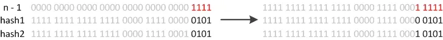
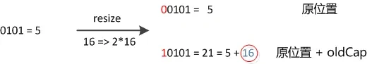

# Java集合面试题

### Java集合概念

#### 数组与集合区别，有哪些常用的集合？

数组和集合的主要有三大区别，

- 数组是固定长度的数据结构，一旦创建长度就无法改变，而集合是动态长度的数据结构，可以根据需要动态增加或减少元素。
- 数组可以包含基本数据类型和对象，而集合只能包含对象。
- 数组可以直接访问元素，而集合需要通过迭代器或其他方法访问元素。

常用的Java集合类有，

1. **ArrayList**：**实现了 `List` 接口。**特点在于基于动态数组实现，支持按索引访问，支持快速的随机访问操作，插入和删除元素时可能会有较大的开销（特别是涉及到中间元素时）。
2. **LinkedList**：**实现了 `List` 和 `Deque` 接口。**特点在于基于双向链表实现，支持快速的插入和删除操作，适用于频繁修改列表的场景。与 `ArrayList` 相比，随机访问效率较低。
3. **HashMap**：**实现了 `Map` 接口。**特点在于基于哈希表实现，存储键值对，通过哈希函数将键映射到桶中，快速查找、插入和删除。元素是无序的，键不允许重复。
4. **HashSet**：**实现了 `Set` 接口。**特点在于基于 `HashMap` 实现，集合中的元素是唯一的。元素的顺序是不可预测的（无序），适用于快速查找、不重复的集合场景。
5. **TreeMap**：**实现了 `Map` 接口。**特点在于基于红黑树实现，按照键的自然顺序或自定义的比较器进行排序，适合需要按顺序存储和遍历元素的场景。
6. **LinkedHashMap**：**实现了 `Map` 接口。**特点在于结合了哈希表和双向链表的特性，保证了键值对的插入顺序，或按照访问顺序。适用于需要按插入顺序或访问顺序遍历的场景。
7. **PriorityQueue**：**实现了 `Queue` 接口。**特点在于基于堆实现，元素按照优先级顺序排序。适用于需要频繁获取优先级最高（或最低）元素的场景。
8. **TreeSet**：**实现了 `Set` 接口。**特点在于基于 `TreeMap` 实现，元素按照自然顺序或自定义的比较器进行排序，元素是唯一的，适用于需要按顺序存储的集合。
9. **Vector**：**实现了 `List` 接口。**特点在于类似于 `ArrayList`，但是是线程安全的，通常用于需要线程安全的动态数组实现（但性能较差）。目前更推荐使用 `ArrayList` 和同步块来代替。
10. **CopyOnWriteArrayList** 和 **CopyOnWriteArraySet**：**实现了 `List` 和 `Set` 接口。**特点在于每次修改集合时，都会复制一份新的底层数组，适用于读多写少的场景，保证线程安全，但修改操作较为低效。


#### 说说Java中的集合？


Java 中的集合（Collections）是一个用于存储、操作对象的框架。它包含了许多接口和类，用来处理不同的数据存储需求。Java 集合类属于 `java.util` 包，通常分为三大类：**List**、**Set** 和 **Map**。

##### 1. **List** 接口

`List` 是一种有序的集合，允许存储重复的元素。元素的顺序由插入的顺序决定，可以通过索引访问元素。**实现`List` 接口的Java集合类特点有元素有顺序、允许重复元素和支持通过索引访问元素。**

`List` 接口的常用实现类有，

- **ArrayList**：基于动态数组实现，支持按索引访问，适合频繁的随机访问，但插入和删除元素的效率较低（尤其是涉及中间元素时）。
- **LinkedList**：基于双向链表实现，支持快速的插入和删除操作，适用于频繁修改元素的场景，但随机访问较慢。
- **Vector**：**线程安全的动态数组实现**，但由于同步开销较大，现代开发中较少使用。


##### 2. **Set** 接口

`Set` 是一种**不允许存储重复元素的集合**。它不保证元素的顺序（`HashSet`），但某些实现类（如 `TreeSet`）可以保证排序。**实现`set` 接口的Java集合类特点有元素无序（除非使用 `LinkedHashSet` 或 `TreeSet`）、不允许重复元素和支持元素的唯一性检查。**

`Set` 接口的常用实现类有，

- **HashSet**：基于哈希表实现，元素无序且不允许重复。适合用于需要检查唯一性的数据集合。
- **LinkedHashSet**：基于哈希表和链表实现，元素按插入顺序排列，且不允许重复。
- **TreeSet**：基于红黑树实现，元素按自然顺序或自定义的比较器排序，且不允许重复。


##### 3. **Map** 接口

`Map` 是一种用于存储键值对（key-value）的集合。每个键只能映射到一个值。`Map` 不继承 `Collection` 接口。**实现`set` 接口的Java集合类特点有键值对存储、键不可重复但值可以重复和通过键来快速访问对应的值。**

`Map` 接口的常用实现类有，

- **HashMap**：基于哈希表实现，允许存储 `null` 键和 `null` 值，元素无序。
- **LinkedHashMap**：基于哈希表和双向链表实现，保证元素的插入顺序或访问顺序。
- **TreeMap**：基于红黑树实现，键的顺序是自然顺序或按照自定义的比较器排序。
- **Hashtable**：线程安全的哈希表实现，已被 `HashMap` 取代，但仍有部分旧代码使用。


##### 4. **Queue** 接口

`Queue` 是一个先进先出（FIFO）的集合，用于存储等待处理的元素。常用于任务调度、线程池等场景。主要特点有元素按照先进先出的顺序处理，且常用于队列、任务调度等场景。

Queue 接口常用实现类有，

- **LinkedList**：既可以作为 `List` 也可以作为 `Queue` 使用，支持 FIFO 操作。
- **PriorityQueue**：基于堆实现，按照元素的自然顺序或自定义的比较器顺序排序。
- **ArrayDeque**：基于数组实现，双端队列，性能优于 `LinkedList`，不支持容量限制。


##### 5. **Deque** 接口

`Deque`（双端队列）是一个允许从队列两端插入和删除元素的集合。它继承自 `Queue` 接口。`Deque`允许从两端插入和删除元素且支持队列的双向操作。

Deque 接口常用实现类有，

- **LinkedList**：双向链表实现，支持从两端插入和删除元素。
- **ArrayDeque**：基于数组实现的双端队列，支持从两端插入和删除元素。


##### 6. **Specialized Collections**

Java 还提供了许多专用的集合类，它们在特定场景下具有特殊的功能或性能优化（如线程安全）：

- **CopyOnWriteArrayList** 和 **CopyOnWriteArraySet**：线程安全的集合实现，每次修改都会复制底层数组，适用于读多写少的场景。
- **ConcurrentHashMap**：线程安全的 `Map` 实现，支持并发操作。


#### Java中的线程安全的集合是什么？*

线程安全的问题，即不要出现数据竞争造成的数据混乱的问题。保证线程安全的一大方式就是使用使用Java提供的线程安全集合，如`ConcurrentHashMap`、`ConcurrentLinkedQueue`等，这些集合内部已经实现了线程安全的逻辑。Java中的JUC库（`java.util.concurrent`）包中的集合都是线程安全的，但 `java.util` 包中也会提供部分线程安全的类。


##### 1. java.util 包下的线程安全集合

在 `java.util` 包中的线程安全的类主要 2 个，其他都是非线程安全的。

- **Vector**
   线程安全的动态数组，其内部方法基本都经过 `synchronized` 修饰。如果不需要线程安全，并不建议选择，毕竟同步会带来额外的开销。`Vector` 内部使用对象数组保存数据，容量自动增加。当数组已满时，会创建新的数组，并拷贝原有数据。
- **Hashtable**
   线程安全的哈希表，`Hashtable` 的加锁方法是通过 `synchronized` 关键字加锁每个方法，这样会锁住整个 `Table` 对象，不支持 `null` 键和值。由于同步导致性能开销较大，现在已经很少推荐使用。若要保证线程安全的哈希表，推荐使用 `ConcurrentHashMap`。

| 集合类    | 数据结构 | 特点                     | 实现方式         | 适用场景   | 性能 |
| --------- | -------- | ------------------------ | ---------------- | ---------- | ---- |
| Vector    | 动态数组 | 可自动扩容，支持随机访问 | synchronized方法 | 不推荐使用 | 较差 |
| Hashtable | 哈希表   | 不支持null键值           | synchronized方法 | 不推荐使用 | 较差 |


##### 2. java.util.concurrent（JUC）包下的线程安全集合

**并发 Map**

- **ConcurrentHashMap**
   与 `Hashtable` 的主要区别在于加锁粒度的不同。在 **JDK 1.7** 中，`ConcurrentHashMap` 使用的是分段锁（`Segment` 锁），即将整个表分为多个段，每个段独立加锁。到了 **JDK 1.8**，取消了 `Segment`，直接对表内的元素加锁，从而减少了并发冲突的概率。`put` 操作如果 Key 对应的数组元素为 `null`，则通过 CAS（Compare and Swap）操作将其设置为当前值。如果 Key 对应的数组元素不为 `null`，则对该元素使用 `synchronized` 锁进行操作。如果链表长度超过阈值，链表会转换为红黑树，提高查找效率。
- **ConcurrentSkipListMap**
   基于跳表（SkipList）算法实现的线程安全有序 `Map`。跳表是一种能在对数预期时间内完成搜索、插入、删除等操作的数据结构，通过多个指向其他元素的跳跃链接实现高效查找。

| 集合类                | 数据结构           | 特点               | 实现方式         | 适用场景           | 性能 |
| --------------------- | ------------------ | ------------------ | ---------------- | ------------------ | ---- |
| ConcurrentHashMap     | 哈希表+链表+红黑树 | 支持高并发、分段锁 | CAS+synchronized | 高并发读写         | 极好 |
| ConcurrentSkipListMap | 跳表               | 有序Map            | CAS              | 需要排序的并发场景 | 好   |


**并发 Set**

- **ConcurrentSkipListSet**
   线程安全的有序集合，底层使用 `ConcurrentSkipListMap` 实现。
- **CopyOnWriteArraySet**
   线程安全的无序集合，底层使用动态数组（`CopyOnWriteArrayList`）实现，而不是哈希表。每次修改集合时，都会复制一个新数组，这使得它适用于读多写少的场景。

| 集合类                | 数据结构 | 特点     | 实现方式                  | 适用场景           | 性能           |
| --------------------- | -------- | -------- | ------------------------- | ------------------ | -------------- |
| CopyOnWriteArraySet   | 动态数组 | 写时复制 | 基于CopyOnWriteArrayList  | 读多写少           | 读极好，写较差 |
| ConcurrentSkipListSet | 跳表     | 有序Set  | 基于ConcurrentSkipListMap | 需要排序的并发场景 | 好             |


**并发 List**

- **CopyOnWriteArrayList**
   `ArrayList` 的线程安全变体，所有写操作通过对底层数组进行全新复制来实现，允许存储 `null` 元素。当写操作进行时，先拷贝原数组，然后在新数组上操作，最后将新数组替换旧数组，读操作则无需同步。

| 集合类               | 数据结构 | 特点     | 实现方式      | 适用场景 | 性能           |
| -------------------- | -------- | -------- | ------------- | -------- | -------------- |
| CopyOnWriteArrayList | 动态数组 | 写时复制 | ReentrantLock | 读多写少 | 读极好，写较差 |


**并发 Queue**

- **ConcurrentLinkedQueue**
   无锁的队列实现，适用于高并发场景。通过 CAS 操作实现高性能，通常在高并发情况下性能优于 `BlockingQueue`。
- **BlockingQueue**
   主要功能是简化多线程之间的数据共享。通过阻塞机制，生产者或消费者会在队列为空或满时等待。常用于生产者-消费者模式。

| 集合类                | 数据结构 | 特点         | 实现方式      | 适用场景          | 性能 |
| --------------------- | -------- | ------------ | ------------- | ----------------- | ---- |
| ConcurrentLinkedQueue | 链表     | 无界队列     | CAS           | 高并发场景        | 极好 |
| ArrayBlockingQueue    | 数组     | 有界队列     | ReentrantLock | 生产者-消费者模式 | 好   |
| LinkedBlockingQueue   | 链表     | 可选有界队列 | ReentrantLock | 生产者-消费者模式 | 好   |
| PriorityBlockingQueue | 堆       | 优先级队列   | ReentrantLock | 优先级排序场景    | 好   |
| DelayQueue            | 堆       | 延迟获取     | ReentrantLock | 延迟任务场景      | 好   |


**并发 Deque**

- **LinkedBlockingDeque**
   线程安全的双端队列，内部使用链表结构，每个节点都维护前驱节点和后驱节点。与 `LinkedBlockingQueue` 相似，不进行读写锁的分离，同一时间只能有一个线程对其进行操作。
- **ConcurrentLinkedDeque**
   基于链接节点的并发双端队列，适用于高并发场景，支持安全的并发插入、删除和访问操作。

| 集合类                | 数据结构 | 特点             | 实现方式      | 适用场景         | 性能 |
| --------------------- | -------- | ---------------- | ------------- | ---------------- | ---- |
| ConcurrentLinkedDeque | 双向链表 | 无界双端队列     | CAS           | 高并发场景       | 极好 |
| LinkedBlockingDeque   | 双向链表 | 可选有界双端队列 | ReentrantLock | 双端队列并发场景 | 好   |


#### Collections和Collection的区别

Collection是Java集合框架中的一个接口，它**是所有集合类的基础接口**。它定义了一组通用的操作和方法，如添加、删除、遍历等，用于操作和管理一组对象。Collection接口有许多实现类，如List、Set和Queue等。


而Collections（注意有一个s）是Java提供的一个工具类，位于`java.util`包中。包含许多对集合操作的静态方法，主要用于排序、查找、同步集合等操作。这些方法可以对实现了Collection接口的集合进行操作。


#### 集合遍历的方法有哪些？

集合的遍历方法有多种，不同的适用于不同的场景。

##### 1. 普通 `for` 循环

普通 `for` 循环是最基本的遍历方式，适用于 `List` 等集合，因为允许通过索引访问元素。你可以根据需要修改索引，选择遍历某一部分集合或反向遍历。

```java
List<String> list = new ArrayList<>();
list.add("A");
list.add("B");
list.add("C");

for (int i = 0; i < list.size(); i++) {
    String element = list.get(i);
    System.out.println(element);
}
```

- **优点**：直接使用索引，可以通过 `get(i)` 来访问每个元素，灵活性高。
- **缺点**：不适合修改集合元素，尤其是在遍历过程中进行删除操作时效率较低。


##### 2. 增强 `for` 循环（for-each 循环）

`for-each` 循环是 Java 5 引入的，简化了集合的遍历。它可以直接遍历 `List`、`Set` 等集合，且无需显式使用索引。

```java
List<String> list = new ArrayList<>();
list.add("A");
list.add("B");
list.add("C");

for (String element : list) {
    System.out.println(element);
}
```

- **优点**：语法简洁、易读，适合大多数场景。
- **缺点**：无法通过索引访问，无法修改元素（比如删除操作）。


##### 3. `Iterator` 迭代器

`Iterator` 是一种通用的遍历集合的方式，**适用于所有集合类型。**它特别适用于需要删除元素的场景，可以避免 `ConcurrentModificationException`。

```java
List<String> list = new ArrayList<>();
list.add("A");
list.add("B");
list.add("C");

Iterator<String> iterator = list.iterator();
while (iterator.hasNext()) {
    String element = iterator.next();
    System.out.println(element);
}
```

- **优点**：能够遍历 `List`、`Set` 等集合，并且支持删除元素。`Iterator` 在遍历过程中使用 `remove()` 方法删除元素不会抛出异常。
- **缺点**：语法较冗长，比增强 `for` 循环稍复杂。


##### 4. `ListIterator` 列表迭代器

`ListIterator` 是 `Iterator` 的一个扩展，**它专门用于 `List` 类型的集合**，支持双向遍历，并且可以在遍历时修改元素。

```java
List<String> list = new ArrayList<>();
list.add("A");
list.add("B");
list.add("C");

ListIterator<String> listIterator = list.listIterator();
while (listIterator.hasNext()) {
    String element = listIterator.next();
    System.out.println(element);
}
```

- **优点**：支持双向遍历，能够同时修改元素。
- **缺点**：仅限于 `List` 类型，其他集合不支持。


##### 5. 使用 `forEach` 方法（Java 8 引入）

`forEach` 是 Java 8 引入的一个方法，它可以用于所有实现了 `Iterable` 接口的集合。这个方法使得代码更加简洁，并且可以使用 Lambda 表达式来实现元素的操作。

```java
List<String> list = new ArrayList<>();
list.add("A");
list.add("B");
list.add("C");

list.forEach(element -> System.out.println(element));
```

- **优点**：简洁、易读，结合 Lambda 表达式可以写出很有表现力的代码。
- **缺点**：不适用于需要修改集合结构（如删除或添加元素）的场景。


##### 6. 使用 `Stream` API（Java 8 引入）

`Stream` API 提供了一种更加函数式的遍历方式，**允许对集合进行复杂的操作，比如过滤、映射、排序等。**它可以链式调用，让代码更加简洁且富有表现力。

```java
List<String> list = new ArrayList<>();
list.add("A");
list.add("B");
list.add("C");

list.stream().forEach(element -> System.out.println(element));
```

- **优点**：可以进行复杂的函数式操作，比如对元素进行过滤、转换和聚合等。
- **缺点**：性能可能不如传统的 `for` 循环，尤其在操作复杂时。


| 遍历方式     | 适用集合类型       | 优点                                                         | 缺点                                                         | 适用场景                                                 |
| ------------ | ------------------ | ------------------------------------------------------------ | ------------------------------------------------------------ | -------------------------------------------------------- |
| 普通for循环  | List               | - 可以通过索引访问<br>- 可以控制遍历方向和范围<br>- 灵活性高 | - 仅适用于List<br>- 代码较冗长<br>- 容易出现索引错误         | - 需要按索引访问元素<br>- 需要部分遍历<br>- 需要反向遍历 |
| 增强for循环  | List, Set，Queue等 | - 语法简洁<br>- 代码可读性好<br>- 不会出现索引错误           | - 无法获取索引<br>- 无法修改集合结构<br>- 无法同时遍历多个集合 | - 简单遍历场景<br>- 不需要修改集合<br>- 仅需要读取元素   |
| Iterator     | 所有Collection     | - 支持所有集合类型<br>- 可以安全删除元素<br>- 不会抛出ConcurrentModificationException | - 语法较复杂<br>- 只能单向遍历                               | - 需要在遍历时删除元素<br>- 需要遍历通用集合             |
| ListIterator | 仅List             | - 支持双向遍历<br>- 可以修改元素<br>- 可以添加元素           | - 仅适用于List<br>- 语法复杂                                 | - 需要双向遍历<br>- 需要在遍历时修改元素                 |
| forEach方法  | 所有Collection     | - 语法简洁<br>- 支持Lambda表达式<br>- 代码可读性好           | - 不能修改集合结构<br>- 不能跳出循环                         | - 简单遍历场景<br>- 需要函数式编程<br>- 结合Lambda使用   |
| Stream API   | 所有Collection     | - 支持函数式操作<br>- 支持并行处理<br>- 可以进行复杂操作     | - 性能开销较大<br>- 不适合简单遍历                           | - 复杂数据处理<br>- 需要链式操作<br>- 需要并行处理       |

选择合适的遍历方式来遍历JAVA集合取决于具体的需求。

如果只是简单地遍历集合，优先使用增强 `for` 循环或 `forEach` 方法，这两种方式简洁且易于理解。

当需要访问元素的索引时，使用普通 `for` 循环最为合适，因为它允许通过索引访问元素。如果在遍历过程中需要删除元素，`Iterator` 是最好的选择，它支持在遍历时安全地删除元素。

若需要双向遍历List集合，则应使用 `ListIterator`，它不仅支持双向遍历，还能在遍历过程中修改元素。对于需要进行复杂数据处理或函数式操作的场景，使用 `Stream API` 能够简洁地实现过滤、映射等操作。

如果对性能有较高要求，尤其是在大数据量的情况下，普通 `for` 循环因为避免了额外的函数调用开销，通常能提供更好的性能表现。

此外，在遍历时修改集合结构（除了通过Iterator/ListIterator的remove方法）可能会抛出ConcurrentModificationException异常。Stream API虽然强大，但在简单场景下可能会带来不必要的性能开销。并发修改时应考虑使用线程安全的集合类


**Q：ConcurrentModificationException异常是什么异常？**

A：`ConcurrentModificationException` 是 Java 中的一个运行时异常，通常在多线程环境下或在遍历集合时对集合进行结构修改（如添加或删除元素）时抛出。它属于 **java.util** 包中的异常类型。主要是为了防止并发修改集合时的潜在不一致问题。集合会维护一个 **modCount** 计数器，记录集合被修改的次数。如果在迭代时检测到这个计数器发生了变化，就会抛出 `ConcurrentModificationException`。


一般是使用 **Iterator** 或 **增强 for 循环** 遍历集合时，如果在遍历过程中，集合的结构（例如元素的增加、删除或更新操作）被修改了，且没有通过 `Iterator` 提供的 `remove` 或 `add` 方法进行修改，就会抛出 `ConcurrentModificationException` 异常。


### List

#### 讲一下java里面list的几种实现，几种实现有什么不同？*

`List`接口用于存储元素的有序集合。以下是Java中常见的`List`实现及其特点： 

* Vector 是 Java 早期提供的线程安全的动态数组历史遗留产物，如果不需要线程安全，并不建议选择。Vector 是应用动态数组实现，可以根据需要自动的增加容量，当数组已满时，扩容时创建新的数组增加一倍 1 倍空间，并拷贝原有数组数据。

- ArrayList 是应用动态数组实现，本身不是线程安全的，所以性能要好很多。与 Vector 近似，ArrayList 也是可以根据需要调整容量，不过相比vector有所区别在扩充容量时 ArrayList 则是增加 50%。但由于是通过速度实现，所以进行插入或删除时，性能较差，时间复杂度为 O(n)。
- LinkedList 是 Java 提供的双向链表，和 `ArrayList` 类似，`LinkedList` 也不是线程安全的。链表结构不需要像上面两种那样调整容量而且在中间部分插入删除性能较好，但是没有随机存取访问的平均时间复杂度为O(n)。
- Stack（继承自 `Vector`），`Stack` 是继承自 `Vector` 的类，基于栈的数据结构，所以也是线程安全的同时也继承了 `Vector` 的性能开销问题。提供了 `push()`、`pop()`、`peek()` 等栈操作，遵循后进先出（LIFO）的原则。

| 实现类         | 线程安全 | 随机访问效率 | 插入/删除效率 | 适用场景                              |
| -------------- | -------- | ------------ | ------------- | ------------------------------------- |
| **ArrayList**  | 否       | 高           | 中等          | 适合频繁随机访问，不适合频繁插入/删除 |
| **LinkedList** | 否       | 低           | 高            | 适合频繁插入/删除，尤其是在头部/中间  |
| **Vector**     | 是       | 高           | 中等          | 需要线程安全的场景，性能开销较大      |
| **Stack**      | 是       | 高           | 中等          | 用于栈操作（后进先出）                |


#### Arraylist和LinkedList的区别，哪个集合是线程安全的？

ArrayList 是应用动态数组实现，ArrayList 可以根据需要调整容量，在扩充容量时 ArrayList 增加 50%。但由于是通过速度实现，所以进行插入或删除时，性能较差，时间复杂度为 O(n)。

当需要频繁 **随机访问** 元素时，`ArrayList` 是首选。且不适合频繁的 **插入和删除**，特别是在中间位置。


LinkedList 是 Java 提供的双向链表，和 `ArrayList` 类似，`LinkedList` 也不是线程安全的。链表结构不需要像上面两种那样调整容量而且在中间部分插入删除性能较好，但是没有随机存取访问的平均时间复杂度为O(n)。

它的适用场景刚好相反，`LinkedList` 适用于需要频繁进行 **插入和删除** 操作的场景，尤其是在头部和中间位置。如果需要频繁 **随机访问**，则不推荐使用 `LinkedList`，因为它的访问性能较差。

Arraylist和LinkedList两个都不是线程安全的，如需线程安全可以考虑工具类和使用线程安全集合。

1. 使用Collections工具类转换：

   ```java
   List<E> synchronizedList = Collections.synchronizedList(new ArrayList<>());
   List<E> synchronizedList = Collections.synchronizedList(new LinkedList<>());
   ```

2. 使用JUC包中的CopyOnWriteArrayList（适合读多写少场景）：

   ```java
   List<E> copyOnWriteArrayList = new CopyOnWriteArrayList<>();
   ```


####  ArrayList线程安全吗？把ArrayList变成线程安全有哪些方法？

ArrayList 是应用动态数组实现的，不是线程安全的。如需线程安全可以考虑工具类和使用线程安全集合。

1. 使用Collections工具类转换：

   ```java
   List<E> synchronizedList = Collections.synchronizedList(new ArrayList<>());
   ```

2. 使用JUC包中的CopyOnWriteArrayList（适合读多写少场景）：

   ```java
   List<E> copyOnWriteArrayList = new CopyOnWriteArrayList<>();
   ```


#### 为什么ArrayList不是线程安全的，具体来说是哪里不安全？

因为在高并发添加数据下，ArrayList在添加元素时会暴露三个问题：

- 部分值为null（我们并没有add null进去）
- 索引越界异常
- size与我们add的数量不符


ArrayList的add 方法增加元素的代码如下：

```java
public boolean add(E e) {
        ensureCapacityInternal(size + 1);  // Increments modCount!!
        elementData[size++] = e;
        return true;
    }
```

`ensureCapacityInternal()`这个方法用来判断如果将的新元素加到列表中，存储数组elementData的大小是否满足，如果不满足就要对存储数组elementData进行扩容。

存储数组elementData添加元素可以分为三步：

- 判断数组需不需要扩容，如果需要的话，调用grow方法进行扩容；
- 将数组的size位置设置值（因为数组的下标是从0开始的）；
- 将当前集合的大小加1

而县城不安全的根本原因就在于`ArrayList` 的扩容操作和 `size++` 操作都没有加锁或使用其他同步机制。详细分析三种情况都是如何产生的：

- **部分值为null**

  当线程1走到了扩容那里发现当前size是9，而数组容量是10，所以不用扩容，这时候cpu让出执行权。

  线程2进来cpu执行使用ArrayList，发现size是9，而数组容量是10，所以不用扩容。

  这时候线程1继续执行，将数组下标索引为9的位置set值了，还没有来得及执行size++。

  这时候线程2也来执行了，又把数组下标索引为9的位置set了一遍，这时候两个先后进行size++，导致下标索引10的地方就为null了。

- **索引越界异常**

  线程1走到扩容那里发现当前size是9，数组容量是10不用扩容，cpu让出执行权。

  线程2进来cpu执行使用 ArrayList 也发现不用扩容，这时候数组的容量就是10，而线程2 set完之后size++返回。

  这时候线程1再进来size就是10，数组的大小只有10，而线程1要set下标索引为10的就会越界（数组的下标索引从0开始）

- **size与我们add的数量不符**

  这个基本上每次都会发生，因为size++本身就不是原子操作，可以分为三步：获取size的值、将size的递增加1 和将新的size值覆盖掉原来的。

  线程1和线程2拿到一样的size值加完了同时覆盖，就会导致一次没有加上，所以肯定不会与add的数量保持一致的；


#### ArrayList 和 LinkedList 的应用场景？

**ArrayList** 是应用动态数组实现，适合需要频繁随机访问和较少插入删除操作的场景（如查询、缓存、简单数据存储等）。

**LinkedList** 适合需要频繁插入和删除操作，特别是在数据量较大且内存占用使用不敏感的场景（因为除了存储数据，还要存储前后指针）（如队列、栈、任务调度等）。


#### ArrayList的扩容机制说一下

ArrayList在添加元素时，会判断当前元素个数是否已经达到了内部数组的容量上限，如果是就会触发扩容操作。ArrayList的扩容操作主要包括：

- 计算新的容量：一般情况下，新的容量会扩大为原容量的1.5倍，然后检查是否超过了Jvm启动时设置的最大容量限制。
- 创建新的数组：根据计算得到的新容量，创建一个新的更大的数组。
- 将元素复制：将原来数组中的元素逐个复制到新数组中。
- 更新引用：将ArrayList内部指向原数组的引用指向新数组。
- 完成扩容：扩容完成后，可以继续添加新元素。


ArrayList的扩容操作涉及到数组的复制和内存的重新分配，所以在频繁添加大量元素时，扩容操作可能会影响性能。为了减少扩容带来的性能损耗，可以在初始化ArrayList时预分配足够大的容量，避免频繁触发扩容操作。

**此外，之所以扩容是 1.5 倍，是因为 1.5 可以充分利用移位操作，减少浮点数或者运算时间和运算次数。**

```java
// 新容量计算
int newCapacity = oldCapacity + (oldCapacity >> 1);
```


#### 线程安全的 List， CopyonWriteArraylist是如何实现线程安全的？*

`CopyOnWriteArrayList` 是 Java 中一种线程安全的 `List` 实现。它基于操作系统中的 **复制写入**（Copy-on-Write）策略来实现线程安全。

其核心思想是每当对列表进行修改操作时（如添加、删除或更新元素），会创建该列表的一个副本，并在副本上进行修改，最终将副本替换掉原有的列表。在读操作时读的仍然是原来的列表，因为修改的是副本，不需要任何同步措施。


从源码层次上来看，CopyOnWriteArrayList底层通过一个数组保存数据，**使用volatile关键字修饰数组，保证当前线程对数组对象重新赋值后，其他线程可以及时感知到。**

```java
private transient volatile Object[] array;
```

在写操作时，加了一把互斥锁ReentrantLock以保证线程安全，并且每次写入都会新完全复制一个副本，在副本基础上修改。最后用新数组的地址替换掉老数组的地址就能得到最新的数据了。

```java
public boolean add(E e) {
    //获取锁
    final ReentrantLock lock = this.lock;
    //加锁
    lock.lock();
    try {
        //获取到当前List集合保存数据的数组
        Object[] elements = getArray();
        //获取该数组的长度（这是一个伏笔，同时len也是新数组的最后一个元素的索引值）
        int len = elements.length;
        //将当前数组拷贝一份的同时，让其长度加1
        Object[] newElements = Arrays.copyOf(elements, len + 1);
        //将加入的元素放在新数组最后一位，len不是旧数组长度吗，为什么现在用它当成新数组的最后一个元素的下标？建议自行画图推演，就很容易理解。
        newElements[len] = e;
        //替换引用，将数组的引用指向给新数组的地址
        setArray(newElements);
        return true;
    } finally {
        //释放锁
        lock.unlock();
    }
}
```

对于读操作，读是没有加锁的，所以读是一直都能读。

```java
public E get(int index) {
    return get(getArray(), index);
}
```

CopyonWriteArraylist优点在于

* **高效的并发读取**，特别适合读取远多于写入的场景。可以在多个线程间高效并发读取数据。
* **一致性**，写入操作和读取操作隔离，写不会影响正在进行的读取操作。因此，所有读取操作都能看到一致的数据状态。

但由于每次修改都会复制整个数组，所以**写操作开销较大**，而且每次写操作都会生成一个新的副本，所以内存开销较大，需要及时释放。


Q：**如果两个相同的读，第一个读操作：线程1发起一个读操作时，它访问的是原始的数组。第二个读操作：线程2发起另一个读操作时，如果恰好此时线程3执行了写操作（即替换了原数组），那么线程2读取到的是新副本。那么不会做成幻读现象吗？**

A：这个情况存在，虽然 `CopyOnWriteArrayList` 在并发读时避免了修改操作引发的竞争条件，但它并没有完全避免幻读的发生。由于不同线程可能在同一时间读取不同的副本，可能会导致两个读线程看到不同的数据，即幻读现象。 `CopyOnWriteArrayList` 提供了一致性，但是没有提供强一致性，如果对一致性要求较高（尤其是写操作频繁或需要避免幻读的场景），则可能需要考虑其他线程安全的集合类（例如 `ConcurrentHashMap` 或结合读写锁）。


### Map

#### HashMap实现原理介绍一下？

在 **JDK 1.8** 版本后， HashMap 数据结构是数组和链表红黑树构成。

具体来说HashMap通过哈希算法将**元素的键（Key）**映射到数组中的**槽位（Bucket）**。

如果多个键映射到同一个槽位，它们会以链表的形式存储在同一个**槽位**上。 因为链表的查询时间是O(n)，所以当一个链表的长度超过8的时候就会把链表转换**红黑树**，使用红黑树查找的时间复杂度O（log n），可以提高查询性能。


但是也有**可能存在删除操作**， 当一个槽内的红黑数元素小于6时，又会将红黑树转换回链表。


#### 了解的哈希冲突解决方法有哪些？

| **解决方法**              | **描述**                                                     | **优缺点**                                                   | **适用场景**                                     |
| ------------------------- | ------------------------------------------------------------ | ------------------------------------------------------------ | ------------------------------------------------ |
| **链表法**                | 使用链表（或其他数据结构）来存储哈希冲突的键值对，将冲突的元素链接到同一个**槽位（Bucket）**中。 | 优点：实现简单，扩展性强。缺点：查找性能可能降低（链表长度增加时）。 | 适用于哈希表元素数量不大或哈希函数较差时。       |
| **开放寻址法**            | 如果发生冲突，查找哈希表中的其他空槽来存储元素。常见的方法有线性探测、二次探测、双重散列等。 | 优点：内存使用紧凑，无需额外的内存空间；缺点：探测过程可能导致性能下降。 | 适用于内存占用较少、哈希表空间较小的场景。       |
| **再哈希法（Rehashing）** | 当发生冲突时，使用另一个哈希函数重新计算哈希值，直到找到空槽。 | 优点：解决了哈希冲突，但可能会增加计算开销。                 | 适用于冲突较少，但哈希表大小需要动态调整的场景。 |
| **哈希**槽位扩容          | 当哈希表冲突过多时，扩大哈希**槽位（Bucket）**的数量，并重新分配键值对。 | 优点：减少冲突，提高性能；缺点：需要重新分配并复制元素，开销较大。 | 适用于高冲突场景或动态增长的哈希表。             |


#### HashMap是线程安全的吗？*

hashmap不是线程安全的，hashmap在多线程会存在环形链表问题和数据覆盖问题。

##### 1. 环形链表问题

JDK 1.7 HashMap 采用数组 + 链表的数据结构而且还是用头插法，多线程背景下，如果两个线程几乎同时进行扩容操作，它们可能会在同**一个槽**中写入数据，导致 **链表指针的错误更新**，从而造成链表变成一个环形链表。导致程序运行时进入无限循环，导致系统卡死或内存泄漏。

```java
//假设Thread1 和 Thread2 同时扩容，组织一个槽的链表节点时，假设有A、B两个节点：
Thread1: A.next = B  // Thread1 认为 A 应该指向 B
Thread2: B.next = A  // Thread2 认为 B 应该指向 A
// 两个线程的交叉执行导致循环引用
```


##### 2. 数据覆盖问题

JDK 1.8 HashMap 采用数组 + 链表 + 红黑二叉树的数据结构，优化了 1.7 中数组扩容的方案，解决了 Entry 链死循环问题。但是多线程背景下，put 方法存在数据覆盖的问题。

假设线程 A 和线程 B 同时执行 `put` 操作，且它们对同一个桶进行操作，然后线程 B 就覆盖了线程 B 的值。

```java
map.put("key", "value1");  // 线程A
map.put("key", "value2");  // 线程B
```


##### 3. **可能出现的NPE(空指针异常)**

```java
HashMap<String, Object> map = new HashMap<>();

// Thread 1执行put操作，触发了扩容
Thread1: map.put("key1", "value1");  // 扩容，正在迁移数据

// Thread 2执行get操作
Thread2: map.get("key1");  // 可能抛出NPE
```

原因是在扩容过程中，如果一个线程正在进行数组迁移，而另一个线程此时来get数据，可能会遇到null的头结点，然后就会返回null。

在对这个返回的对象进行调用方法时，因为是null，导致NPE（`NullPointerException`）。


##### 4. **读取脏数据**

```java
HashMap<String, String> map = new HashMap<>();
// Thread1执行put，触发链表转红黑树
Thread1: 正在将链表转换为红黑树
Thread2: get("key") // 可能看到转换一半的数据结构
```

线程一修改了一个键值对，但是还没有修改完成处于到链表或红黑树结构的中间状态，线程二就执行get，由此读到了脏数据，或者只看到一半的数据结构，返回null。


##### 3. 保证线程安全的方法

- 多线程环境可以使用Collections.synchronizedMap同步加锁的方式，还可以使用HashTable，但是同步的方式显然性能不达标，而ConurrentHashMap更适合高并发场景使用。

  ```java
  Map<String, String> map = Collections.synchronizedMap(new HashMap<>());
  ```

- `ConcurrentHashMap` 是专为高并发设计的线程安全的 `Map`。它在 JDK 1.7 和 1.8 中的实现有所不同：

  * 在 JDK 1.7 `ConcurrentHashMap` 使用了 **分段锁**（Segment）来实现并发控制。每个段（Segment）是一个独立的哈希表，多个线程可以并发地操作不同的段，因此在多线程环境下，能够提高并发性能。
  * JDK 1.8 中抛弃了分段锁，改用 **CAS（Compare-And-Swap）** 操作 + **synchronized** 和 **红黑树** 来实现高效的并发控制。这种设计能够减少锁的粒度，允许更多的线程同时操作不同的桶，而且通过红黑树优化了链表过长带来的性能问题。

一般来说在高并发场景下使用 `Map`，**ConcurrentHashMap** 是推荐的选择。


#### hashmap的put过程介绍一下

HashMap HashMap的put()方法用于向HashMap中添加键值对。

当调用HashMap的put()方法时，按照以下步骤执行，

##### 1. 根据要添加的键的哈希码计算在数组中的位置（索引）

根据hashcode()方法，计算传入的键对象（key）的哈希码，然后得到要插入的哈希槽的位置。


##### 2. 检查该位置是否为空（即没有键值对存在）

如果为空，则直接在该位置创建一个新的 Entry对象<> 来存储键值对。

将要添加的键值对作为该Entry的键和值，并保存在数组的对应位置。将HashMap的修改次数（modCount）加1，以便在进行迭代时发现并发修改。


##### 3. 如果该位置已经存在其他键值对，检查该位置的第一个键值对的哈希码和键是否与要添加的键值对相同？

如果相同，则表示找到了相同的键，直接将新的值替换旧的值，完成更新操作。


##### 4. 如果第一个键值对的哈希码和键不相同，遍历链表或红黑树来查找是否有相同的键

**如果键值对集合是链表结构，**从链表的头部开始逐个比较键的哈希码和equals()方法，直到找到相同的键或达到链表末尾。

- 如果找到了相同的键，则使用新的值取代旧的值，即更新键对应的值。
- 如果没有找到相同的键，则将新的键值对添加到链表的头部。

**如果键值对集合是红黑树结构，**在红黑树中使用哈希码和equals()方法进行查找。在红黑树中逐个比较键，直到找到相同的键或达到红黑树末尾。

- 如果找到了相同的键，则使用新的值取代旧的值，即更新键对应的值。
- 如果没有找到相同的键，则将新的键值对添加到红黑树中。


##### 5. 检查链表长度是否达到阈值（默认为8）

如果链表长度超过阈值，且HashMap的数组长度大于等于64，则会将链表转换为红黑树，以提高查询效率。


##### 6. 检查负载因子是否超过阈值（默认为0.75）

如果键值对的数量（size）与数组的长度的比值大于阈值，则需要进行扩容操作。


##### 7. 扩容操作

创建一个新的两倍大小的数组。将旧数组中的键值对重新计算哈希码并分配到新数组中的位置。更新HashMap的数组引用和阈值参数。


##### 8. 完成添加操作

此外，HashMap是非线程安全的，如果在多线程环境下使用，需要采取额外的同步措施或使用线程安全的ConcurrentHashMap。


#### HashMap的put(key,val)和get(key)过程

put过程上面已经说了，把上面背下来就行。


get过程需要将K传给get，它调用hashCode计算hash从而得到哈希槽bucket位置，并进一步调用equals()方法确定哈希槽中第1个键值对的是不是相等的。如果发生碰撞的那么需要调用equals()方法进一步检查链表或红黑树的键值对直到找到相同的键或达到链表/红黑树末尾（返回 `null`）。


#### hashmap key可以为null吗？*

可以为 null，hashmap的hashcode() 方法中如果判断键为null会让哈希码等于0。

```java
static final int hash(Object key) {
    int h;
    // 当key等于null的时候，不走hashCode()方法
    return (key == null) ? 0 : (h = key.hashCode()) ^ (h >>> 16);
}
```

注：hashMap虽然支持key和value为null，但是null作为key只能有一个，null作为value可以有多个。因为hashMap中，如果key值一样，那么会覆盖相同key值的value为最新，所以key为null只能有一个。


#### HashMap一般用什么做Key？为啥String适合做Key呢？*

用 string 做 key，因为 String对象是不可变的，一旦创建就不能被修改，这确保了Key的稳定性。

如果Key是可变的，可能会导致hashCode和equals方法的不一致，进而影响HashMap的正确性。


#### 为什么HashMap要用红黑树而不是平衡二叉树？

因为平衡二叉树追求的是一种 **“完全平衡”** 状态，即任何结点的左右子树的高度差不会超过 1。要求实在是太严了，导致每次进行插入/删除节点的时候，几乎都会破坏平衡树的规则然后就需要一定开销，使之再次成为一颗符合要求的平衡树。

红黑树追求一种 **“弱平衡”** 状态，整个树最长路径不会超过最短路径的 2 倍。虽然牺牲了一部分查找的性能效率，但是大大减少了维持树平衡状态的成本。在插入、删除等操作，**不会像平衡树那样，频繁着破坏红黑树的规则，不需要频繁着调整**，所以选择红黑树。


#### 重写HashMap的equal和hashcode方法需要注意什么？

HashMap使用Key对象的 hashCode() 和 equals() 方法去决定key-value对的索引位置。且不管是写入 put() 和读取get() 操作， hashCode() 和 equals() 方法被用到。

如果这些方法没有被正确地实现，两个不同Key也许会产生相同的hashCode()和equals()输出，HashMap将会认为它们是相同的，然后覆盖它们，造成数据丢失。


不仅仅是HashMap所有不允许存储重复数据的集合类都使用hashCode()和equals()去查找重复，所以正确实现它们非常重要。

**equals()和hashCode()的实现应该遵循以下规则：**

- 如果o1.equals(o2)，那么o1.hashCode() == o2.hashCode()总是为true的。
- 如果o1.hashCode() == o2.hashCode()，并不意味着o1.equals(o2)会为true。


#### 重写HashMap的equal方法不当会出现什么问题？

HashMap使用Key对象的 hashCode() 和 equals() 方法去决定key-value对的索引位置。而且HashMap在比较元素时，会先通过hashCode进行比较，相同的情况下再通过equals进行比较。**所以 equals相等的两个对象，hashCode一定相等。hashCode相等的两个对象，equals不一定相等（比如散列冲突的情况）**


若hashCode() 和 equals() 方法没有被正确地实现，两个不同Key也许会产生相同的hashCode()和equals()输出，HashMap将会认为它们是相同的，然后覆盖它们，造成数据丢失。

或重写了equals方法，不重写hashCode方法时，可能会出现equals方法返回为true，而hashCode方法却返回false，这样的一个后果会导致在hashmap等类中存储多个一模一样的对象，与hashmap只能有唯一的key的规范不符合。


#### 列举HashMap在多线程下可能会出现的问题？*

##### 1. 环形链表问题**(JDK 1.7)** 

JDK 1.7 HashMap 采用数组 + 链表的数据结构，多线程背景下，如果两个线程几乎同时进行扩容操作，它们可能会在同**一个槽**中写入数据，导致 **链表指针的错误更新**，从而造成链表变成一个环形链表。导致程序运行时进入无限循环，导致系统卡死或内存泄漏。

```java
//假设Thread1 和 Thread2 同时扩容，组织一个槽的链表节点时，假设有A、B两个节点：
Thread1: A.next = B  // Thread1 认为 A 应该指向 B
Thread2: B.next = A  // Thread2 认为 B 应该指向 A
// 两个线程的交叉执行导致循环引用
```


##### 2. 数据覆盖问题

JDK 1.8 HashMap 采用数组 + 链表 + 红黑二叉树的数据结构，优化了 1.7 中数组扩容的方案，解决了 Entry 链死循环问题。但是多线程背景下，put 方法存在数据覆盖的问题。

假设线程 A 和线程 B 同时执行 `put` 操作，且它们对同一个桶进行操作，然后线程 B 就覆盖了线程 B 的值。

```java
// 初始状态：map为空
Thread1: 执行第一步：检查key="myKey"是否存在
Thread2: 执行第一步：检查key="myKey"是否存在
Thread1: 执行第二步：写入value1
Thread2: 执行第二步：写入value2  // 覆盖了value1
// 最终map中的值是value2，value1被丢失
```


##### 3. **可能出现的NPE(空指针异常)**

```java
HashMap<String, Object> map = new HashMap<>();

// Thread 1执行put操作，触发了扩容
Thread1: map.put("key1", "value1");  // 扩容，正在迁移数据

// Thread 2执行get操作，可能访问到正在迁移的null节点
Thread2: map.get("key1");  // 可能抛出NPE
```

原因是在扩容过程中，如果一个线程正在进行数组迁移，而另一个线程此时来get数据，在扩容的过程中，旧数组中的某些位置暂时会被置为 `null`，表示这些位置的数据正在被迁移到新的数组中。于是会遇到null的头结点，导致NPE（`NullPointerException`）。


##### 4. **读取脏数据**

```java
HashMap<String, String> map = new HashMap<>();
// Thread1执行put，触发链表转红黑树
Thread1: 正在将链表转换为红黑树
Thread2: get("key") // 可能看到转换一半的数据结构
```

`HashMap` 的修改操作（如扩容、链表转红黑树等）是分步骤执行的，而这些步骤之间没有保证数据结构的一致性。

线程一修改了一个键值对，但是还没有修改完成处于到链表或红黑树结构的中间状态，线程二就执行get，由此读到了脏数据，或者只看到一半的数据结构，返回null。


#### HashMap的扩容机制介绍一下

哈西表这个结构中影响到查找平均查找长度的只有负载因子，而Java的hashMap默认的负载因子是0.75，即如果hashmap中的元素个数超过了总容量75%，则会触发扩容，扩容分为两个步骤：

- **第1步**是对哈希表长度的扩展（2倍）
- **第2步**是将旧哈希表中的数据放到新的哈希表中。

Java的hashMap不需要重新计算哈希值，因为最终决定被分配到哪个哈希槽是键的哈希值对哈希槽的总数进行按位相与。如果扩展为两倍的话，哈希值的有效位高位会变多一位，所以扩容后的哈希表，元素的位置要么是在原位置，要么是在原位置再移动2次幂的位置。

如我们从16（哈希值的有效位为4）扩展为32（哈希值的有效位为5）时，具体的变化如下所示：



因此元素在重新计算hash之后，因为n变为2倍，那么n-1的mask范围在高位多1bit(红色)，因此新的index就会发生这样的变化：



所以扩充两倍的既省去了重新计算hash值的时间，而且由于新增的1bit是0还是1可以认为是随机的，因此resize的过程，均匀的把之前的冲突的节点分散到新的bucket（哈希槽）了。


#### HashMap的大小为什么是2的n次方大小呢？

**第1点是为了运算方便，**因为在 `HashMap` 中，键的哈希值通常是通过 `hashCode()` 方法得到的。为了找到该元素应该放入的桶的位置，`HashMap` 会将哈希值与数组的大小（通常是 2 的幂次方）进行取模操作：`index = hashCode & (capacity - 1)`。

如果是HashMap的大小对于 **2 的幂次方**，`capacity - 1` 这样的操作可以转化为快速的位与（`&`）运算。这比取模（`%`）运算更高效，因为位与操作直接利用了计算机处理器对二进制位的快速操作，尤其是当容量是 2 的幂次方时，取模操作转化更高效的一个简单的位运算。


**另一方面为扩容操作提供了简化**，使得Java的hashMap不需要重新计算哈希值，因为最终决定被分配到哪个哈希槽是键的哈希值对哈希槽的总数进行按位相与。如果扩展为两倍的话，哈希值的有效位高位会变多一位，所以扩容后的哈希表，元素的位置要么是在原位置，要么是在原位置再移动2次幂的位置。


#### 往hashmap存20个元素，会扩容几次？

Java的hashMap初始数组大小是16，当插入 20 个元素时，HashMap 的扩容过程如下：

**初始容量**：16

- 插入第 1 到第 12 个元素时，不需要扩容。
- 插入第 13 个元素时，达到负载因子限制，需要扩容。此时，HashMap 的容量从 16 扩容到 32。

**扩容后的容量**：32

- 插入第 14 到第 24 个元素时，不需要扩容。

因此，总共会进行一次扩容。


#### 说说hashmap的负载因子

HashMap 负载因子 loadFactor 的默认值是 0.75，当 HashMap 中的元素个数超过了容量的 75% 时，就会进行扩容。

默认负载因子为 0.75，是因为它提供了空间和时间复杂度之间的良好平衡。

负载因子太低会导致大量的空哈希槽浪费空间，负载因子太高会导致大量的碰撞，降低性能。0.75 的负载因子在这两个因素之间取得了良好的平衡。


#### Hashmap和Hashtable有什么不一样的？Hashmap一般怎么用？

Hashmap和Hashtable两者最大的区别就是Hashmap线程不安全而Hashtable线程安全。

| 特性                         | `HashMap`                                                    | `Hashtable`                                    |
| ---------------------------- | ------------------------------------------------------------ | ---------------------------------------------- |
| **线程安全性**               | 线程不安全，非同步                                           | 线程安全，方法大部分都使用 `synchronized` 修饰 |
| **性能**                     | 高效，适合单线程或外部同步                                   | 由于同步操作，效率较低                         |
| **Null 键/值**               | 允许一个 `null` 键，多个 `null` 值                           | 不允许 `null` 键或值                           |
| **默认初始容量&&扩容机制**   | 初始16，容量变为原来的2倍                                    | 初始11，容量变为原来的 2 倍 + 1                |
| **底层数据结构**             | 数组 + 链表 + 红黑树                                         | 数组 + 链表                                    |
| **扩容时会不会改变链表结构** | 如果链表长度超过阈值（8），且数组容量大于 64，转化为红黑树；否则扩容 | 扩容时直接增大数组，保持链表结构               |
| **常见用途**                 | 存储键值对，快速查找，适合非线程安全的场景                   | 存储键值对，线程安全的场景（已逐步淘汰）       |
| **目前使用情况**             | 推荐使用，适用于大多数情况                                   | 基本被淘汰，推荐使用 `ConcurrentHashMap`       |

**HashMap 主要用来存储键值对，并且不允许键重复，键对应的值可以是重复的。**可以通过 `put` 方法向其中加入元素，使用 `get` 方法获取某个键对应的值，也可以通过 `containsKey` 方法查看某个键是否存在。

在算法中，常用的还有 `getOrDefault(K key, V defaultValue)` 方法，该方法用于获取指定键的值，如果该键不存在则返回默认值。

另外，`entrySet()` 方法将 `Map` 转化为一个 `Set`，其中每个元素是一个 `Map.Entry<K, V>`，可以用来遍历 `HashMap` 中的所有键值对。


#### ConcurrentHashMap怎么实现的？

ConcurrentHashMap在不同版本的jdk中实现比较大，我们分开来讲

##### 1. JDK 1.7 `ConcurrentHashMap` 实现

在 JDK 1.7 中，`ConcurrentHashMap` 使用了**分段锁技术**来实现线程安全。JDK 1.7 `ConcurrentHashMap` 的底层结构由多个 `Segment` 数组组成，每个 `Segment` 充当一个小的独立哈希表，内部有自己的锁机制。在并发访问时，线程可以对不同的 `Segment` 锁进行加锁，而不需要锁住整个 `ConcurrentHashMap`。这提高了并发性，因为多个线程可以同时访问不同的 `Segment`。如下图所示，


- **Segment**：每个 `Segment` 代表了一个哈希表，**并且继承了 `ReentrantLock`，可以为每个 `Segment` 提供独立的锁。**
- **HashEntry**：`Segment` 内部是一个数组，数组的每个元素存储一个 `HashEntry`，该 `HashEntry` 是一个链表的节点，用于存储键值对。

这种设计使得 `ConcurrentHashMap` 在高并发场景下具有较好的性能，能够支持多个线程并行处理不同的段数据。

**但问题是当数据分布不均或每个 `Segment` 内部的数据过多时，链表查找的时间复杂度可能是 O(n)，即使是并发的，也会面临性能瓶颈。**


##### 2. JDK 1.8 `ConcurrentHashMap` 实现

在 JDK 1.8 中，`ConcurrentHashMap` 的实现做了一些优化，JDK 1.8 中不再使用分段锁（`Segment`）。更像是原先的HashMap，但每个哈希槽（即数组中的每个位置）使用 `synchronized` 或 CAS 操作+ volatile 关键字来保证线程安全。所以锁的粒度更小，可以减少锁竞争。


具体来说，当时用put添加一个元素时得到键的哈希值映射到的槽是否为空如果该位置为空，则通过 CAS 操作设置值。

如果发生碰撞或者CAS 操作设置失败，通过 `synchronized` 来保证只有一个线程能够对该槽位置的数据进行操作。这样能防止并发修改相同桶中的数据。

并且类似于线程不安全的HashMap，JDK 1.8 对于哈希冲突的处理进行了优化。当某个桶内的元素链表长度超过阈值（默认为 8）时，会将链表转换为红黑树，这样可以将查询复杂度从 O(n) 降低到 O(log n)，特别是在处理大量数据时，相比于 JDK 1.7 可以获得更好的性能表现。


**Q： JDK 1.7 `ConcurrentHashMap` 怎么定位到哪个 `Segment`的？**

A：通过**哈希值**来计算一个键应该映射到哪个 `Segment`。每个 `Segment` 对应一个 **哈希表**，它有自己的锁。要定位到具体的 `Segment`，需要根据键的哈希值计算出一个分段索引。

若 `ConcurrentHashMap` 有 `N` 个 `Segment`（`Segment` 数组的大小），则计算方法如下：

```java
int segmentIndex = (hash >>> segmentShift) & segmentMask;
```

其中`hash` 是键的哈希值（通过 `key.hashCode()` 计算得到）。`segmentShift` 是一个常量，表示分段的位移量，用来提取哈希值中的特定位。`segmentMask` 是一个掩码，用来限制哈希值的范围，使得计算的结果位于 `Segment` 数组的有效索引范围内。

一旦确定了是哪个 `Segment`，就要对这个`Segment`加锁，下一步就是定位到 **该 Segment 中的具体哈希槽**，即该 `Segment` 内部哈希表中的位置。**哈希槽** 的位置也是通过 **哈希值** 来计算的。

哈希值与 `Segment` 内部数组大小进行位运算来确定具体的槽位。

```java
int index = (hash & (table.length - 1));
```


#### 分段锁怎么加锁的？

在 JDK 1.7 `ConcurrentHashMap` 中，将整个数据结构分为多个 Segment，每个 Segment 都类似于一个小的 HashMap，每个 Segment 都有自己的锁，不同 Segment 之间的操作互不影响，从而提高并发性能。

在 ConcurrentHashMap 中，对于插入、更新、删除等操作，需要先定位到具体的 Segment，然后再在该 Segment 上加锁（ `Segment` 继承了 `ReentrantLock`），而不是像传统的 HashMap 一样对整个数据结构加锁。这样可以使得不同 Segment 之间的操作并行进行，提高了并发性能。


#### 分段锁是可重入的吗？

可重入锁即当前线程持有该锁的情况下，仍能再次获取该锁，而不会造成死锁或其他问题。

分段锁 `Segment` 继承了 `ReentrantLock`，`ReentrantLock`是典型的可重入锁，名字都叫Reentrant（重入）。

具体`ReentrantLock`怎么实现了可重入请看jeese的并发编程面试题。


#### 已经用了synchronized，为什么还要用CAS呢？

ConcurrentHashMap同时使用来保证线程安全主要是一种权衡的考虑，主要是根据锁竞争程度来判断的。

如在put方法中，如果计算出来的哈希槽没有存放元素，那么就可以直接使用CAS来进行设置值，这是因为在设置元素的时候，因为hash值经过了各种扰动后，造成hash碰撞的几率较低，那么我们可以预测使用较少的自旋来完成具体的hash落槽操作。

当发生了hash碰撞的时候说明容量不够用了或者已经有大量线程访问了，因此这时候使用synchronized来处理hash碰撞比CAS效率要高，因为发生了hash碰撞大概率来说是线程竞争比较强烈。


#### ConcurrentHashMap用了悲观锁还是乐观锁?

悲观锁和乐观锁都有用到。

如添加元素时计算哈希值，首先会判断对应的哈希槽是否为空：

- 如果为空则使用 volatile 加 **CAS （乐观锁）** 来设置该节点。
- 如果根据存储的元素计算结果不为空，则使用 **synchronized（悲观锁）** 锁住这个槽，然后遍历桶中的数据，并替换或新增节点到桶中，最后再判断是否需要转为红黑树，这样就能保证并发访问时的线程安全了。


#### HashTable 底层实现原理是什么？

`Hashtable` 是`java.util`  包的线程安全集合，它用于存储键值对（key-value）数据，和`vetor`数组类似，已经被淘汰了。底层的数据结构和线程不安全的 `HashMap` 类似，主要由 **数组** 和 **链表** 组成（历史遗留数据结构，当链表长度达到一定值时，不会转化为红黑树）。

HashTable是线程安全的，实现方式是**Hashtable的所有公共方法均采用synchronized关键字**，当一个线程访问同步方法就会锁住整个数据结构，此时另一个线程也访问的时候，就会陷入阻塞或者轮询的状态。

这会导致性能的严重下降，尤其是在多线程频繁访问的场景下，可能会造成不必要的性能瓶颈。

另外，由于同步的范围是整个方法，所以即使是多个线程访问不同的 `Hashtable` 元素，它们仍然会因为同步机制的限制而产生阻塞，这降低了并发性能。


#### HashTable线程安全是怎么实现的？

HashTable实现线程安全的方式是**Hashtable的所有公共方法均采用synchronized关键字**。

如Hashtable 的 put(K key, V value) 和 get(Object key) 方法的源码：

```java
public synchronized V put(K key, V value) {
// Make sure the value is not null
if (value == null) {
    throw new NullPointerException();
}
 // Makes sure the key is not already in the hashtable.
Entry<?,?> tab[] = table;
int hash = key.hashCode();
int index = (hash & 0x7FFFFFFF) % tab.length;
@SuppressWarnings("unchecked")
Entry<K,V> entry = (Entry<K,V>)tab[index];
for(; entry != null ; entry = entry.next) {
    if ((entry.hash == hash) && entry.key.equals(key)) {
        V old = entry.value;
        entry.value = value;
        return old;
    }
}
 addEntry(hash, key, value, index);
return null;
}

public synchronized V get(Object key) {
Entry<?,?> tab[] = table;
int hash = key.hashCode();
int index = (hash & 0x7FFFFFFF) % tab.length;
for (Entry<?,?> e = tab[index] ; e != null ; e = e.next) {
    if ((e.hash == hash) && e.key.equals(key)) {
        return (V)e.value;
    }
}
return null;
}
```

由于 `Hashtable` 的所有公共方法都被 `synchronized` 修饰，这样的设计会导致多个线程访问 `Hashtable` 时会发生阻塞。当一个线程在访问 `Hashtable` 时，其他线程必须等待，这会导致性能的严重下降，尤其是在多线程频繁访问的场景下，可能会造成不必要的性能瓶颈。

另外，由于同步的范围是整个方法，所以即使是多个线程访问不同的 `Hashtable` 元素，它们仍然会因为同步机制的限制而产生阻塞，这降低了并发性能。


#### hashtable 和concurrentHashMap有什么区别

最主要的区别是底层数据结构和实现同步的方式两大方面。

concurrentHashMap的底层数据结构方面在jdk7及之前是**分段的数组+链表**实现，jdk8之后采用的是**数组+链表/红黑树；**

concurrentHashMap在实现同步方面jdk7及之前采用分段锁，对整个数组进行了分段分割，每一把锁只锁一部分数据，多线程访问不同数据段里的数据，就不会存在锁竞争，提高了并发访问；jdk8以后，直接采用数组+链表/红黑树，并发控制使用CAS和synchronized操作，更加提高了速度。


HashTable采用的是**数组+链表**，数组是主体，链表是解决hash冲突存在的。

HashTable所有的方法都加了锁来保证线程安全，但是效率非常的低下，当一个线程访问同步方法，另一个线程也访问的时候，就会陷入阻塞或者轮询的状态。

除此之外，还有一些其他差别，如下表所示。

| 特性/类          | `Hashtable`                                          | `ConcurrentHashMap`                                          |
| ---------------- | ---------------------------------------------------- | ------------------------------------------------------------ |
| **底层数据结构** | 数组 + 链表                                          | JDK 7 及之前：数组 + 分段锁 + 链表 JDK 8 及以后：数组 + 链表/红黑树 |
| **同步机制**     | 整个类的所有公共方法都使用 `synchronized` 进行同步   | JDK 7 及之前：分段锁技术 JDK 8 及以后：CAS + `synchronized`  |
| **线程安全**     | 线程安全，使用 `synchronized` 保证每个方法的同步执行 | 线程安全，通过更细粒度的锁和原子操作（如 CAS）提高并发性能   |
| **性能**         | 性能较差，所有方法都使用同步，导致高并发时性能瓶颈   | 高并发环境下性能更好，减少了锁的粒度，避免了不必要的阻塞     |
| **扩容机制**     | 通过扩展数组和再哈希来进行扩容，扩容后性能会下降     | 使用 `ReentrantLock` 或原子操作进行锁定，扩容时性能较好      |
| **可伸缩性支持** | 支持性很差，扩容和线程安全性都比较简单，难以伸缩     | 支持可伸缩性，通过分段锁、CAS 操作、红黑树等机制提升伸缩性   |
| **使用场景**     | 适用于低并发或不要求高性能的环境，线程安全需求较低   | 适用于高并发场景，如 Web 应用、分布式缓存等高并发的环境      |


**Q：可伸缩性是什么意思？**

A：**伸缩性**（Scalability）指的是一个系统、网络、应用程序或数据库能够在需求增加时，通过扩展或优化资源来保持性能，或者能够适应不断增长的工作负载。

垂直伸缩指的是提升单个资源（如 CPU、内存、硬盘等）来提高系统的性能。水平伸缩是指通过增加更多的资源实例（如增加更多的服务器或节点）来扩展系统容量。

- **Hashtable**：不具备很好的伸缩性。它的扩容是通过重新计算哈希表中的所有元素并复制到新的数组，这会导致性能急剧下降，尤其在并发访问的情况下。由于 `Hashtable` 是通过全局加锁来保证线程安全，因此在多线程环境下的扩容操作可能导致锁竞争，从而影响性能。
- **ConcurrentHashMap**：设计时充分考虑了伸缩性，尤其是在 **水平伸缩** 上表现得很好。在 JDK 8 以后，`ConcurrentHashMap` 通过细粒度的锁、分段锁和 CAS 等机制来提高并发性，同时支持高效的扩容，能在多核服务器上进行并行扩展，减少性能瓶颈，适应大规模并发访问的需求。


#### 说一下HashMap和Hashtable、ConcurrentMap的区别*

这三者最核心的区别就是HashMap是不线程安全的，Hashtable、ConcurrentMap是线程安全的。且这两者最大区别是Hashtable、ConcurrentMap线程安全的锁粒度有差别。

| 特性                     | `HashMap`                                                    | `Hashtable`                                                  | `ConcurrentHashMap`                                          |
| ------------------------ | ------------------------------------------------------------ | ------------------------------------------------------------ | ------------------------------------------------------------ |
| **线程安全**             | 线程不安全                                                   | 线程安全                                                     | 线程安全                                                     |
| **锁机制**               | 无锁（线程不安全）                                           | 对所有公共方法使用 `synchronized` 锁定                       | 分段锁 + CAS 操作 + 锁的粒度更小，减少并发瓶颈               |
| **读操作**               | 无锁，可能发生并发问题                                       | 通过 `synchronized` 锁定整个方法                             | 读操作（get）不加锁。                                        |
| **写操作**               | 无锁，可能发生并发问题                                       | 通过 `synchronized` 锁定整个方法                             | 写操作锁定对应的 Segment（jdk1.7）</br>使用CAS优化乐观操作和使用synchronized锁住哈希槽且使用volatile保证可见性（jdk1.8） |
| **是否支持 null 键和值** | 允许 `null` 键和多个 `null` 值 （`null` 键只能有一个）       | 不允许 `null` 键和 `null` 值                                 | 不允许 `null` 键和值                                         |
| **性能**                 | 效率较高，但在并发环境可能造成死循环（JDK 7以前）            | 较低，因为所有方法都使用 `synchronized` 修饰                 | 高并发情况下性能较好，使用细粒度锁控制并发                   |
| **底层数据结构**         | 数组 + 链表（扩容时链表转红黑树）                            | 数组 + 链表                                                  | JDK 7 及之前：数组 + 分段锁 + 链表 JDK 8 及以后：数组 + 链表/红黑树 |
| **扩容策略**             | 默认初始容量为 16，扩容为原来的 2 倍 如果给定初始容量，扩容为 2 的幂次方大小 | 默认初始容量为 11，扩容为 2n + 1 给定初始容量直接采用给定大小 | JDK 7 及之前：通过分段锁实现扩容 JDK 8 及以后：扩容时优化性能，减少锁竞争 |
| **扩容触发条件**         | 当元素数量超过负载因子（默认 0.75）时触发扩容                | 超过容量时触发扩容（扩容比例为 2n + 1）                      | 当负载因子超过一定阈值时触发扩容，且扩容时性能优化           |
| **适用场景**             | 单线程或可以接受非线程安全场景                               | 适用于需要线程安全的单一锁场景                               | 高并发、多线程场景，特别是在读多写少的情况下                 |
| **历史和现状**           | Java 1.2 引入，广泛使用，仍然是 Java 中常用的哈希表实现      | Java 1.0 引入，但已经被淘汰，现多由 `ConcurrentHashMap` 替代 | Java 5 引入，经过多次优化，广泛应用于并发场景                |

主要是并发环境下的歧义问题所以，如果`get(key)`方法返回null，你无法判断是因为键不存在，还是因为键对应的值就是null。


### Set

#### Set集合有什么特点？如何实现key无重复的？

- **set集合特点**：Set集合中的元素是唯一的，不会出现重复的元素。
- **set实现原理**：Set集合通过内部的数据结构（如哈希表、红黑树等）来实现key的无重复。当向Set集合中插入元素时，会先根据元素的hashCode值来确定元素的存储位置，然后再通过equals方法来判断是否已经存在相同的元素，如果存在则不会再次插入，保证了元素的唯一性。


#### 有序的Set是什么？记录插入顺序的集合是什么？

- **有序的 Set 是TreeSet和LinkedHashSet**。TreeSet是基于红黑树实现，保证元素的自然顺序。LinkedHashSet是基于双重链表和哈希表的结合来实现元素的有序存储，保证元素添加的自然顺序
- **记录插入顺序的集合通常指的是LinkedHashSet**，它不仅保证元素的唯一性，还可以保持元素的插入顺序。当需要在Set集合中记录元素的插入顺序时，可以选择使用LinkedHashSet来实现。