# MySQL面试题

### SQL基础

#### NOSQL和SQL的区别，如何确定选择NOSQL和SQL数据库？*

SQL数据库指的是**关系型数据库** ，其主要代表有SQL Server，Oracle，MySQL（开源）等。SQL数据库**存储结构化数据**，逻辑上以二维表的形式组织，**每一列代表数据的一种属性，每一行代表一个数据实体。**

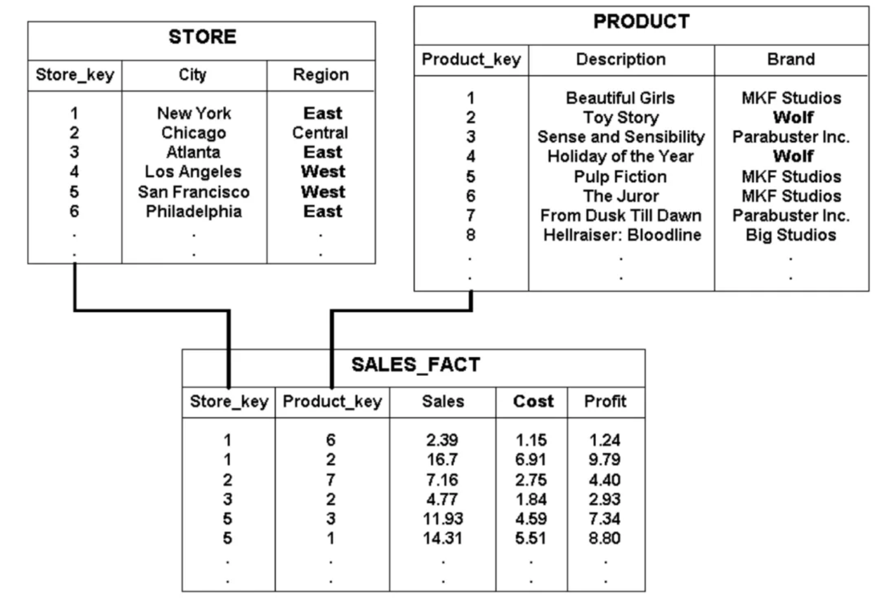

NoSQL指**非关系型数据库**，其主要代表：MongoDB，Redis。NoSQL 数据库逻辑上存储方式可以是JSON文档、哈希表或者其他方式，与**关系型数据库**不同。


而关于选择 SQL vs NoSQL，考虑以下因素。

##### 1. ACID（事物） vs BASE

关系型数据库支持事务的 ACID （即原子性，一致性，隔离性和持续性）。相对而言，NoSQL 采用更宽松的模型 BASE （ 即基本可用，软状态和最终一致性）。

从实用的角度出发，我们需要考虑对于面对的应用场景，事务的ACID 是否是必须的来选择。（如银行应用就必须保证 ACID，否则一笔钱可能被使用两次，应用关系型数据库；又比如社交软件不必保证 ACID，因为一条状态的更新对于所有用户读取先后时间有数秒不同并不影响使用，）

对于需要保证 ACID 的应用，我们可以优先考虑 SQL。反之则可以优先考虑 NoSQL。


##### 2. 扩展性对比

NoSQL数据之间无关系，这样就非常容易扩展，也无形之间，在架构的层面上带来了可扩展的能力（比如 redis 自带主从复制模式、哨兵模式、切片集群模式）

相反**关系型数据库的数据之间存在关联性**，水平扩展较难 ，需要解决跨服务器 JOIN，分布式事务等问题。


**Q：软状态是什么？**

A：软状态意味着系统数据并不是一直保持一致的，它可能随时间变化，直到最终达到一致性。


#### 数据库三大范式是什么？

**第一范式（1NF）要求数据库表的每一列都是不可分割的原子数据项。**

举例说明：

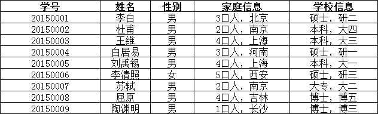

在上面的表中，“家庭信息”和“学校信息”列均不满足原子性的要求，故不满足第一范式，调整如下：

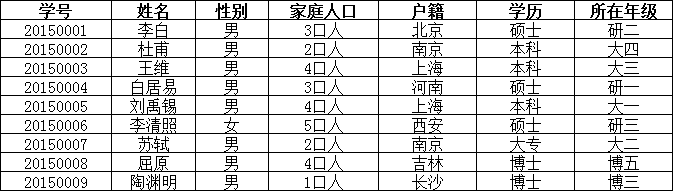


**第二范式（2NF）：在1NF的基础上，非主属性对主码不能为部分函数依赖**

大白话就是第二范式需要确保数据库表中的每一列都和主键相关，而不能只与主键的某一部分相关（主要针对联合主键而言）。

如下所示的情况中，同一个订单中可能包含不同的产品，因此主键必须是“订单号”和“产品号”联合组成，

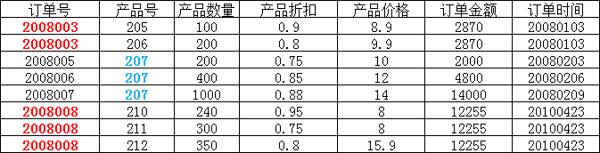

但可以发现，产品数量、产品折扣、产品价格与“订单号”和“产品号”都相关，但是订单金额和订单时间仅与“订单号”相关，与“产品号”无关，

这样就不满足第二范式的要求，调整如下，需分成两个表：

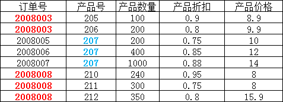

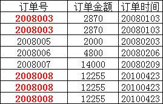


**第三范式（3NF）：在2NF基础上，任何非主属性应该直接依赖于主属性（在2NF基础上消除传递依赖）**

大意就是第三范式需要确保数据表中的每一列数据都和主键直接相关，而不能间接相关。

举例说明，如下表所有属性都完全依赖于学号，所以满足第二范式，但是“班主任性别”和“班主任年龄”直接依赖的是“班主任姓名”。

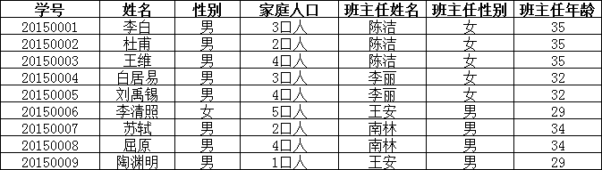

而不是主键“学号”，所以需做如下调整：

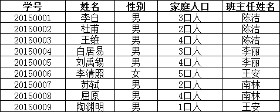


这样以来，就满足了第三范式的要求。


#### MySQL 的架构是怎么样的？*

MySQL采用了分层设计的架构。**这些层次之间通过清晰的接口进行交互，共同完成数据库的各项功能。每一层都专注于自己的职责**，MySQL采用分层架构，各层通过接口交互，实现高内聚低耦合。

MySQL 分层自顶向下依次为：

##### 1. **连接层**（Communication Layer）

连接层属于架构的最顶层，负责处理客户端连接（如TCP/IP、Socket连接）以及身份认证与权限验证

而且管理连接线程（线程池机制）**以及进行协议解析（如MySQL协议包解析）。**


连接层一句话就是负责网络通信与安全，客户端请求会先到达连接层。


##### 1. SQL层（Server Layer），跨存储引擎功能实现
**SQL层又称Server层负责处理所有用户输入的SQL语句。**主要包含几个部分。

当用户发送一条查询时，SQL层有三个部分，

第一是**SQL Interface**，接收SQL命令，返回结果。

第二是**解析器（Parser）**语法分析 → 生成抽象语法树（生成查询树）

第三是查询优化器（Query Optimizer），会分析查询结构并生成最优执行计划。**优化器是SQL查询性能的关键，它主要选择合适的索引、重写查询语句和确定执行计划如最佳的表连接顺序来提升查询效率（使用嵌套循环还是哈希连接等算法）。**

最后是**执行器（Executor）**，主要调用存储引擎接口执行物理操作。

其实还有一个SQL层的查询缓存组件，来缓存存储引擎中SQL查询的结果集，它的存在弊大于利，所以MySQL8.0移除了这个部分。


SQL层负责所有跨存储引擎的功能在此实现（如存储过程、触发器、视图）。


##### 3. 存储引擎层（Storage Engine Layer），插件式架构，支持引擎热插拔
存储引擎负责实际的数据存储和操作，如InnoDB和MyISAM等。

不同引擎具有不同特性，比如InnoDB支持**事务、外键、崩溃恢复和高并发行级锁支持**，而**MyISAM则专注于高速读取非事务型，表锁**。存储引擎管理着数据的存取、索引的维护，支持事务的引擎还要处理事务的提交和回滚。

这部分包括的关键模块有，

**表引擎（Table Handler）**，管理物理存储结构（如聚簇B+树索引）

**缓冲池（Buffer Pool）**，InnoDB的核心内存区域（数据页缓存）

**日志系统**，Redo Log（InnoDB）、Undo Log（InnoDB）

**事务系统**，实现ACID特性（仅事务型引擎）

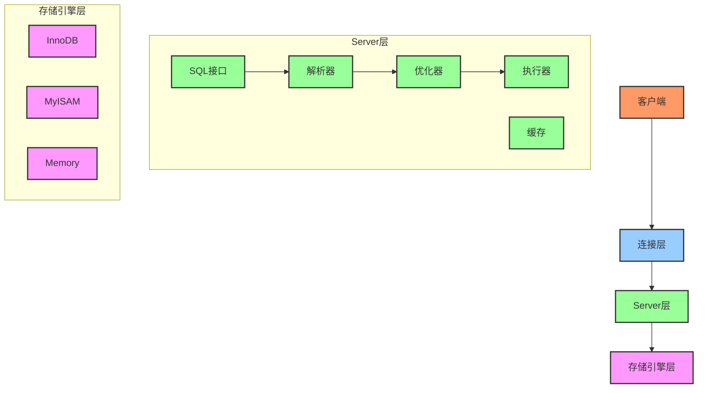
```mermaid
graph TD
    A[客户端] --> B[连接层]
    B --> C[Server层]
    C --> D[存储引擎层]
    
    subgraph Server层
        C1[SQL接口] --> C2[解析器]
        C2 --> C3[优化器]
        C3 --> C4[执行器]
        C5[缓存]
    end
    
    subgraph 存储引擎层
        D1[InnoDB]
        D2[MyISAM]
        D3[Memory]
    end
    
    classDef client fill:#f96,stroke:#333,stroke-width:2px
    classDef connect fill:#9cf,stroke:#333,stroke-width:2px
    classDef server fill:#9f9,stroke:#333,stroke-width:2px
    classDef storage fill:#f9f,stroke:#333,stroke-width:2px
    
    class A client
    class B connect
    class C,C1,C2,C3,C4,C5 server
    class D,D1,D2,D3 storage
```


**Q：查询缓存（Query Cache）和缓冲池（Buffer Pool）是一个东西吗？好像好像mysql8.0之后移除了？**

A：查询缓存（Query Cache）和缓冲池（Buffer Pool）是**两个完全不同的概念**。

查询缓存属于 SQL层原理是，当执行一条SELECT查询时，MySQL会计算查询的哈希值。如果查询缓存中存在该哈希值对应的结果集，则直接返回缓存结果，跳过解析、优化和执行过程。而且如果表数据发生任何修改（如INSERT、UPDATE、DELETE），与该表相关的所有查询缓存都会失效。

显而易见两个问题，大量内存占用经常会失效，因为查询数据这个东西不符合程序局部性原理经常不命中，太过于鸡肋。第2点一旦修改就失效了，还是有机制来删除缓存，增加了消耗，总体而言弊大于利。


缓冲池（Buffer Pool）属于存储引擎层（innoDB专属）的，缓存数据页和索引页来减少磁盘I/O，**是MySQL性能优化的核心，基本不可能被移除。**

缓冲池是InnoDB的核心内存区域，用于缓存从磁盘读取的数据页和索引页。当查询需要访问某一行数据时，InnoDB会先检查缓冲池中是否存在对应的数据页。如果存在（缓存命中），则直接返回数据；如果不存在（缓存未命中），则从磁盘读取数据页并加载到缓冲池中进行处理。

内存淘汰策略使用LRU（Least Recently Used）算法管理缓存页的淘汰。


#### MySQL 怎么连表查询？

数据库有以下几种联表查询类型：

* 内连接 (INNER JOIN)，连接结果得到的只有两个表中有匹配关系的行。
* 左外连接 (LEFT JOIN)，连接结果得到左表中的所有行和两个表中有匹配关系的行，右表未匹配到的属性列但会显示null。
* 右外连接 (RIGHT JOIN)，连接结果得到右表中的所有行和两个表中有匹配关系的行，左表未匹配到的属性列但会显示null。
* 全外连接 (FULL JOIN)，连接结果得到两个表中所有行，包括非匹配行，MySQL不支持这种。

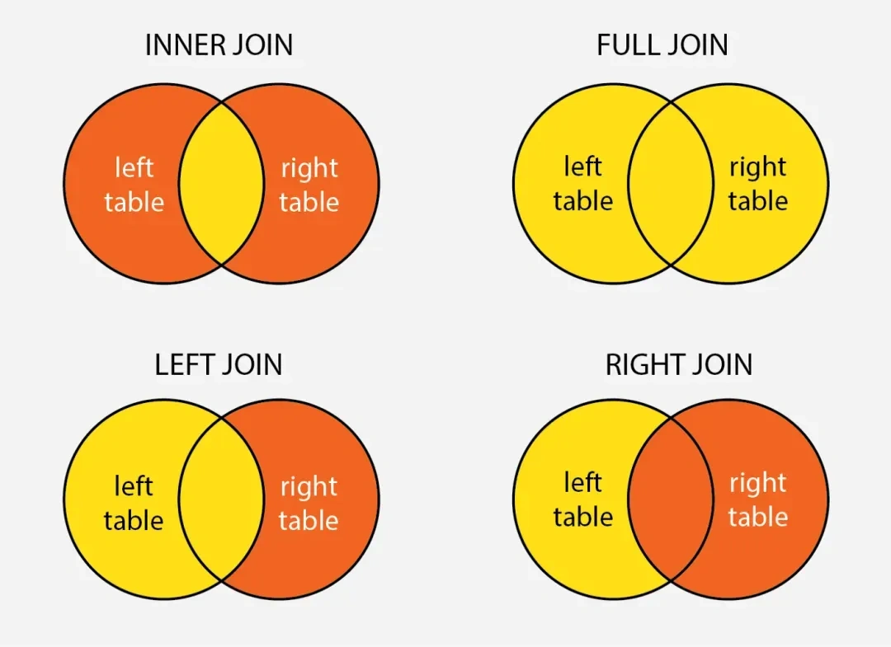


通过具体的数据表和结果来说明不同连接的区别。假设我们有以下两个表：

**员工表(employees)**
```
id  name    dept_id
1   张三     1
2   李四     2
3   王五     1
4   赵六     NULL
```

**部门表(departments)**

```
id  dept_name
1   技术部
2   市场部
3   财务部
```


##### 1. 内连接 (INNER JOIN)

内连接返回两个表中有匹配关系的行。**示例**:

```sql
SELECT employees.name, departments.name
FROM employees
INNER JOIN departments
ON employees.department_id = departments.id;
```

结果：

```
name    dept_name
张三     技术部
李四     市场部
王五     技术部
```

解释：只返回能匹配上的数据。赵六因为没有部门(dept_id 为 NULL)所以不会出现，财务部因为没有员工所以也不会出现。

这个查询返回每个员工及其所在的部门名称。


##### 2. 左外连接 (LEFT JOIN)

左外连接返回左表中的所有行，即使在右表中没有匹配的行。未匹配的右表列会包含NULL。

```sql
SELECT employees.name, departments.name
FROM employees
LEFT JOIN departments
ON employees.department_id = departments.id;
```

结果：

```
name    dept_name
张三     技术部
李四     市场部
王五     技术部
赵六     NULL
```

解释：返回左表(employees)的所有数据。赵六虽然没有部门，也会显示，但部门名是 NULL。

所以这个查询返回所有员工及其部门名称，包括那些没有分配部门的员工。


##### 3. 右外连接 (RIGHT JOIN)

右外连接返回右表中的所有行，即使左表中没有匹配的行。未匹配的左表列会包含NULL。

```sql
SELECT employees.name, departments.name
FROM employees
RIGHT JOIN departments
ON employees.department_id = departments.id;
```

结果：

```
name    dept_name
张三     技术部
王五     技术部
李四     市场部
NULL    财务部
```

解释：返回右表(departments)的所有数据。财务部虽然没有员工，也会显示，但员工名是 NULL。

所以这个查询返回所有部门及其员工，包括那些没有分配员工的部门。


##### 4. 全外连接 (FULL JOIN)

全外连接返回两个表中所有行，包括非匹配行，在MySQL中，FULL JOIN 需要使用 UNION 来实现，因为 MySQL 不直接支持 FULL JOIN。

```sql
SELECT employees.name, departments.name
FROM employees
LEFT JOIN departments
ON employees.department_id = departments.id

UNION

SELECT employees.name, departments.name
FROM employees
RIGHT JOIN departments
ON employees.department_id = departments.id;
```

结果：

```
name    dept_name
张三     技术部
李四     市场部
王五     技术部
赵六     NULL
NULL    财务部
```

解释：返回所有数据。包括没有部门的员工(赵六)和没有员工的部门(财务部)。

所以这个查询返回所有员工和所有部门，包括没有匹配行的记录。


#### MySQL如何避免重复插入数据？

##### 1. 使用UNIQUE约束

在表的相关列上添加UNIQUE约束，确保每个值在该列中唯一。例如：

```sql
CREATE TABLE users (
    id INT PRIMARY KEY AUTO_INCREMENT,
    email VARCHAR(255) UNIQUE,
    name VARCHAR(255)
);
```

**如果尝试插入重复的email，MySQL会返回错误。**


##### 2. 使用`INSERT ... ON DUPLICATE KEY UPDATE`

这种语句允许在插入记录时处理重复键或重复唯一键的情况。**如果插入的记录与现有记录冲突，可以选择更新现有记录：**

```sql
INSERT INTO users (email, name) 
VALUES ('example@example.com', 'John Doe')
ON DUPLICATE KEY UPDATE name = VALUES(name);
```


##### 3. 使用INSERT IGNORE

该语句会在插入记录时忽略那些因重复键而导致的插入错误。

```sql
INSERT IGNORE INTO users (email, name) 
VALUES ('example@example.com', 'John Doe');
```

如果email已经存在，这条插入语句将被忽略而不会返回错误。


**具体选择哪种方法取决于具体的需求：**

- 如果需要保证全局唯一性，使用UNIQUE约束是最佳做法。
- 如果需要插入和更新结合可以使用`ON DUPLICATE KEY UPDATE`。
- 对于快速忽略重复插入，`INSERT IGNORE`是合适的选择。


#### CHAR 和 VARCHAR有什么区别？*

- CHAR是**固定长度的字符串类型**，**定义时需要指定固定长度，存储时会在末尾补足空格。**CHAR适合存储长度固定的数据，如固定长度的代码、状态等，存储空间固定，对于短字符串效率较高，最大长度是255字符。
- VARCHAR是**可变长度的字符串类型**，定义时需要指定最大长度，**实际存储时根据实际长度占用存储空间。**VARCHAR适合存储长度可变的数据，如用户输入的文本、备注等，节约存储空间，VARCHAR 数据类型支持的最大长度是 **65535 字节**（包括额外的 1~2 字节用于存储长度信息）。


#### **UNION 和 UNION ALL 的区别**

- `UNION`：会对合并的结果 **去重**（默认 `DISTINCT`），性能较 `UNION ALL` 低，因为需要额外的去重计算。
- `UNION ALL`：直接合并多个 `SELECT` 结果，不去重，性能较好，适用于不需要去重的情况。


#### Text数据类型可以无限大吗？

MySQL 3 种text类型的最大长度如下：

- TEXT：65,535 bytes ~64kb
- MEDIUMTEXT：16,777,215 bytes ~16Mb
- LONGTEXT：4,294,967,295 bytes ~4Gb


#### 说一下外键约束

外键约束的作用是维护表与表之间的关系，确保数据的完整性和一致性。

举例来说，假设存在有两个表，一个是学生表，另一个是课程表，这两个表之间的关系为，**一个学生可以选修多门课程，而一门课程也可以被多个学生选修。**在这种情况下，我们可以在学生表中定义一个指向课程表的外键：

```sql
CREATE TABLE students (
  id INT PRIMARY KEY,
  name VARCHAR(50),
  course_id INT,
  FOREIGN KEY (course_id) REFERENCES courses(id)
);
```

`students`表中的`course_id`字段是一个外键，它指向`courses`表中的`id`字段。这个外键约束确保了每个学生所选的课程在`courses`表中都存在，从而维护了数据的完整性和一致性。

所以，如果没有定义外键约束，那么就有可能出现学生选了不存在的课程或者删除了一个课程而忘记从学生表中删除选修该课程的学生的情况，这会破坏数据的完整性和一致性。因此，使用外键约束可以帮助我们避免这些问题。


**Q：如果在数据库中有外键约束，删除一个学生已选的课程时会怎么样？**（了解即可，回答默认拒绝就行）

主要看设置外键时设置成什么状态，

如果外键约束中指定了 `ON DELETE RESTRICT`，当尝试删除 `courses` 表中的一条记录时，如果该记录在 `students` 表中有外键引用（即有学生选修该课程），删除操作会被拒绝，数据库会抛出一个错误，阻止删除操作。这确保了不允许删除任何正在被其他表引用的记录，**是默认的行为，如果没有显示指定。**

```sql
CREATE TABLE students (
  id INT PRIMARY KEY,
  name VARCHAR(50),
  course_id INT,
  FOREIGN KEY (course_id) REFERENCES courses(id) ON DELETE RESTRICT
);

```

`ON DELETE NO ACTION` 规则与 `ON DELETE RESTRICT` 类似，也会阻止删除操作。不同的是，`NO ACTION` 会等待外键约束检查再拒绝，而 `RESTRICT` 是立即拒绝删除。

如果外键约束中指定了 `ON DELETE CASCADE`，那么当删除 `courses` 表中的一条记录时，数据库会自动删除 `students` 表中所有与该课程关联的学生记录。也就是如果删除课程，所有选修该课程的学生记录都会被级联删除。

如果外键约束中指定了 `ON DELETE SET NULL`，当删除 `courses` 表中的一条记录时，`students` 表中所有指向被删除课程的外键值会被设置为 `NULL`。这意味着学生记录中的 `course_id` 会被清空，但学生记录本身不会被删除。


#### MySQL的关键字in和exist*

在MySQL中，`IN` 和 `EXISTS` 都是用来处理子查询的关键词，但它们在功能、性能和使用场景上有各自的特点和区别。

首先假设我们有两个表：

**订单表(orders)**

```bash
id  customer_id  amount
1   1            100
2   1            200
3   2            300
4   3            400
```

**客户表(customers)**

```bash
id  name    city
1   张三     北京
2   李四     上海
3   王五     广州
4   赵六     深圳
```


##### 1. IN关键字

使用IN的实例查找有订单的客户信息。

```sql
SELECT * FROM customers 
WHERE id IN (SELECT customer_id FROM orders);
```

结果：

```bash
id  name   city
1   张三    北京
2   李四    上海
3   王五    广州
```

使用`IN` 这个查询先执行子查询获取所有下过订单的客户ID(1,2,3)后，然后在客户表中查找所有下过订单的客户ID(1,2,3)的客户信息。

也就是说，`IN` 用于检查左边的表达式是否存在于右边的列表或子查询的结果集中。


##### 2. EXISTS关键字

**使用 EXISTS 的示例** 同样查找有订单的客户信息

```sql
SELECT * FROM customers c
WHERE EXISTS (
    SELECT 1 FROM orders o 
    WHERE o.customer_id = c.id
);
```

结果和上面相同：

```bash
id  name   city
1   张三    北京
2   李四    上海
3   王五    广州
```

这个查询会对customers表的每一行，检查orders表中是否存在对应的订单，如果找到第1条就返回第一结果，随后根据匹配条件查找剩下的。

也就是说`EXISTS`用于判断子查询是否至少能返回一行数据。它不关心子查询返回什么数据，只关心是否有结果。


##### 3. 区别与选择：

**第一点关于性能方面**，在很多情况下，`EXISTS` 的性能优于 `IN`，如当orders表很大时（比如有100万条记录）。IN 会先执行子查询，获取所有customer_id，可能产生大量临时数据，但EXISTS 则是对每个customers表的记录，查找是否存在对应订单，找到一条就停止。

**第二是使用场景方面**，

* 如果子查询结果集较小且不频繁变动，`IN` 可能更直观易懂。
* 当子查询涉及外部查询的每一行判断，并且子查询的效率较高时，`EXISTS` 更为合适。

**第三涉及到NULL值的处理**，`IN` 能够正确处理子查询中包含NULL值的情况，而`EXISTS` 不受子查询结果中NULL值的影响，因为NULL永远不等于任何值。


#### mysql中的一些基本函数，你知道哪些？

##### 1. 字符串函数

**CONCAT(str1, str2, ...)**：连接多个字符串，返回一个合并后的字符串。

```sql
SELECT CONCAT('Hello', ' ', 'World') AS Greeting;
```

**LENGTH(str)**：返回字符串的长度（字符数）。

```sql
SELECT LENGTH('Hello') AS StringLength;
```

**SUBSTRING(str, pos, len)**：从指定位置开始，截取指定长度的子字符串。

```sql
SELECT SUBSTRING('Hello World', 1, 5) AS SubStr;
```

**REPLACE(str, from_str, to_str)**：将字符串中的某部分替换为另一个字符串。

```sql
SELECT REPLACE('Hello World', 'World', 'MySQL') AS ReplacedStr;
```


##### 2. 数值函数

**ABS(num)**：返回数字的绝对值。

```sql
SELECT ABS(-10) AS AbsoluteValue;
```

**POWER(num, exponent)**：返回指定数字的指定幂次方。

```sql
SELECT POWER(2, 3) AS PowerValue;
```


##### 3. 日期和时间函数

**NOW()**：返回当前日期和时间。

```sql
SELECT NOW() AS CurrentDateTime;
```

**CURDATE()**：返回当前日期。

```sql
SELECT CURDATE() AS CurrentDate;
```


##### 4. 聚合函数

**COUNT(column)**：计算指定列中的非NULL值的个数。

```sql
SELECT COUNT(*) AS RowCount FROM my_table;
```

**SUM(column)**：计算指定列的总和。

```sql
SELECT SUM(price) AS TotalPrice FROM orders;
```

**AVG(column)**：计算指定列的平均值。

```sql
SELECT AVG(price) AS AveragePrice FROM orders;
```

**MAX(column)**：返回指定列的最大值。

```sql
SELECT MAX(price) AS MaxPrice FROM orders;
```

**MIN(column)**：返回指定列的最小值。

```sql
SELECT MIN(price) AS MinPrice FROM orders;
```


#### SQL查询语句的执行顺序是怎么样的？*


所有的查询语句都是从FROM开始执行，在执行过程中，每个步骤都会生成一个虚拟表，这个虚拟表将作为下一个执行步骤的输入，最后一个步骤产生的虚拟表即为输出结果。

1. **FROM**，首先从数据源表（或者视图、子查询等）中获取数据。
2. **ON**，连接条件（基本上与 `JOIN` 一起执行，但是一般先判断条件，然后进行链接）。
3. **JOIN**，进行连接操作（如果有的话），按连接条件将多个表的数据合并成一个结果集。
4. **WHERE**，过滤数据，排除不符合条件的记录。
5. **GROUP BY**，按指定的列进行分组。
6. **聚合函数**，（如 `COUNT`、`SUM`）计算
7. **HAVING**，对分组后的数据进行筛选。与 `WHERE` 类似，但 `HAVING` 是用于过滤分组数据，而 `WHERE` 是用于过滤原始数据。
8. **SELECT**，选择列，生成最终的结果集。
9. **DISTINCT**，移除重复的行。
10. **ORDER BY**，对结果进行排序。
11. **LIMIT**，限制返回的结果行数。

```text
(8) SELECT 
(9) DISTINCT <column>,
(6) AGG_FUNC <column> or <expression>, ...
(1) FROM <left_table> 
    (3) <join_type>JOIN<right_table>
    (2) ON<join_condition>
(4) WHERE <where_condition>
(5) GROUP BY <group_by_list>
(7) HAVING <having_condtion>
(10) ORDER BY <order_by_list>
(11) LIMIT <limit_number>;
```


#### sql题：给学生表、课程成绩表，求不存在01课程但存在02课程的学生的成绩

举一个具体的例子，学生表、课程成绩表如下，

**学生表(students)**

```
student_id    name
1             张三
2             李四
3             王五
4             赵六
```

**成绩表(scores)**
```
student_id    course_id    score
1             01           80
1             02           90
2             01           85
3             02           75
4             02           95
```

从上面的数据我们可以看到：
- 张三：选了01和02
- 李四：只选了01
- 王五：只选了02
- 赵六：只选了02

所以答案应该返回王五和赵六的成绩
```
name    score
王五     75
赵六     95
```

使用`IN`的方法：
```sql
SELECT 
    s.name,
    c.score
FROM students s 
JOIN scores c ON s.student_id = c.student_id
WHERE c.course_id = '02'  -- 选了02课程
AND s.student_id NOT IN (  -- 且不在选了01课程的学生列表中
    SELECT student_id 
    FROM scores 
    WHERE course_id = '01'
);
```

或者用EXISTS：
```sql
SELECT 
    s.name,
    c.score
FROM students s 
JOIN scores c ON s.student_id = c.student_id
WHERE c.course_id = '02'  -- 选了02课程
AND NOT EXISTS (  -- 且不存在该学生选修01课程的记录
    SELECT 1 
    FROM scores s2
    WHERE s2.course_id = '01' 
    AND s2.student_id = s.student_id
);
```


#### sql题：给定一个学生表 student_score（stu_id，subject_id，score），查询总分排名在5-10名的学生id及对应的总分

假设学生表(student_score)的数据是这样的：
```
stu_id    subject_id    score
1         语文          85
1         数学          90
1         英语          88
2         语文          78
2         数学          75
2         英语          80
3         语文          92
3         数学          95
3         英语          94
4         语文          65
4         数学          72
4         英语          68
...（更多学生的成绩）
```

这道题要求：
1. 先计算每个学生的总分（把所有科目分数加起来）
2. 按总分从高到低排序
3. 找出排名第5到第10名的学生

```sql
SELECT 
    stu_id,
    SUM(score) as total_score
FROM student_score
GROUP BY stu_id
ORDER BY total_score DESC
LIMIT 4, 6;  -- 从第5条记录开始（跳过4条），取6条记录
```

假设结果可能是这样：
```
stu_id    total_score
8         275    -- 第5名
12        273    -- 第6名
5         270    -- 第7名
15        268    -- 第8名
7         265    -- 第9名
10        263    -- 第10名
```

简单来说，思路是首先根据学号id来进行分组，后分组把成绩加起来得到总分，然后按总分排序，最后取出第5到第10名的记录即可。


### 存储引擎

#### 执行一条SQL请求的过程是什么？

如下图所示就是 MySQL 执行一条 SQL 查询语句的流程，也从图中可以看到 MySQL 内部架构里的各个功能模块。

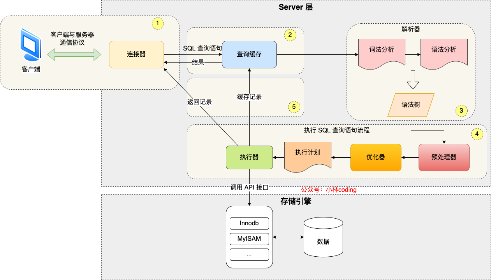

1. 首先经过连接器，即建立连接，管理连接、校验用户身份**（连接层）**；

2. 第二部为查询缓存（MySQL8.0跳过这部分）：查询语句如果命中查询缓存则直接返回，否则继续往下执行。MySQL 8.0 已删除该模块**（SQL层）**；

3. 解析器解析 SQL，通过解析器对 SQL 查询语句进行词法分析、语法分析，然后构建语法树，方便后续模块读取表名、字段、语句类型**（SQL层）**；

4. 执行器执行 SQL，但执行 SQL 共有三个阶段：

- 预处理阶段：检查表或字段是否存在；将 `select *` 中的 `*` 符号扩展为表上的所有列**（SQL层）**。
- 优化阶段：基于查询成本的考虑， 选择查询成本最小的执行计划**（SQL层）**；
- 执行阶段：根据执行计划调用存储引擎执行 SQL 查询语句，然后从存储引擎读取返回结果，返回给客户端**（存储引擎层）**；


#### 讲一讲mysql的引擎吧，你有什么了解？*

##### 1. InnoDB

InnoDB是MySQL的默认存储引擎，具有ACID事务支持、行级锁、外键约束、崩溃恢复等特性。它适用于高并发的读写操作，支持较好的数据完整性和并发控制。


##### 2. MyISAM

MyISAM是MySQL的另一种常见的存储引擎，具有较低的存储空间和内存消耗，**适用于大量读操作的场景。**

然而，**MyISAM不支持事务、行级锁（只支持表级锁）和外键约束**，因此在并发写入和数据完整性方面有一定的限制。

**MyISAM** 使用非聚簇索引，意味着索引和数据存储是分开的。索引存储的是 **键值和指向数据行的指针**，数据则按存储顺序存储。MyISAM 支持 **全文索引（Full-text Index）**，适用于文本数据的快速搜索，所以一般读取比InnoDB要快（但是在后续版本InnoDB也支持全文索引，只是不太常用而已）。


##### 3. Memory

Memory引擎将数据存储在内存中，默认使用 **哈希索引**，适用于对性能要求较高的读操作。但是在服务器重启或崩溃时数据会丢失。它不支持事务、行级锁和外键约束。


**Q：在纯读操作场景下，为啥MyISAM 相比InnoDB 更为高效？**

A：因为 **MyISAM** 是为高效的 **只读** 或 **低写** 场景设计的，整体的数据结构和索引结构更加简单，并且不需要处理像 **事务、行级锁、外键约束** 等复杂的机制。

而且第二就是支持全文索引，进行文本数据的模糊匹配、查询时，处理速度很快。这是 MyISAM 的一个独特优势，尤其在搜索、日志处理等场景下（但是在后续版本InnoDB也支持全文索引，只是不太常用而已）。


#### MySQL为什么InnoDB是默认引擎？

InnoDB引擎在**事务支持、并发性能、崩溃恢复**等方面具有优势，因此被MySQL选择为默认的存储引擎。

具体来说，InnoDB引擎提供了对事务的支持，即可以进行ACID（原子性、一致性、隔离性、持久性）属性的操作。Myisam存储引擎是不支持事务的。

此外InnoDB引擎采用了行级锁定的机制有**更好的并发性能**，而Myisam存储引擎只支持表锁，锁的粒度比较大。

最后InnoDB引引擎通过 redolog 日志实现了崩溃恢复，可以在数据库发生异常情况（如断电）时，通过日志文件进行恢复，保证数据的持久性和一致性。而其他引擎一般是不支持崩溃恢复的。


#### 说一下mysql的innodb与MyISAM的区别？

表述与上面优势类似，也可以加些不同的东西。

**两者对事务支持有区别，**即可以进行ACID（原子性、一致性、隔离性、持久性）属性的操作。Myisam存储引擎是不支持事务的。

**两者对锁粒度有区别，**采用了行级锁定的机制有**更好的并发性能**，而Myisam存储引擎只支持表锁，锁的粒度比较大。

**两者对崩溃恢复支持有区别，**InnoDB引引擎通过 redolog 日志实现了崩溃恢复，可以在数据库发生异常情况（如断电）时，通过日志文件进行恢复，保证数据的持久性和一致性。而其他引擎一般是不支持崩溃恢复的。

**两者的索引在物理结构有区别，**InnoDB 是聚簇索引，MyISAM 是非聚簇索引。聚簇索引的文件存放在主键索引的叶子节点上，因此 InnoDB 必须要有主键，通过主键索引效率很高。但是辅助索引需要两次查询，先查询到主键，然后再通过主键查询到数据。而 MyISAM 是非聚簇索引，数据文件是分离的，索引保存的是数据文件的指针。主键索引和辅助索引是独立的。

**两者的一些函数的执行效率有区别，**如对于count()函数，InnoDB 不保存表的具体行数，执行 select count(*) from table 时需要全表扫描。而MyISAM 用一个变量保存了整个表的行数，执行上述语句时只需要读出该变量即可，速度很快。


#### 数据管理里，数据文件大体分成哪几种数据文件？*

在MySQL 8.0以前，数据文件是按表存储的，假设名为 `my_test` 的database 里有一张名为 `t_order` 数据库表。那么，会有mysql下会有my_test 目录，其中共有三个文件。可以通过命令查询到三个文件，如下所示：

```bash
[root@xiaolin ~]#ls /var/lib/mysql/my_test
db.opt  
t_order.frm  
t_order.ibd
```

这三个文件分别代表着：

- db.opt，用来存储当前数据库的默认字符集和字符校验规则。
- t_order.frm ，t_order 的表结构等元数据会保存在这个文件。在 MySQL 中建立一张表都会生成一个.frm 文件，用来保存每个表的元数据信息的，主要包含表结构定义。
- t_order.ibd，t_order 的表数据会保存在这个文件。表数据既可以存在共享表空间文件（文件名：ibdata1）里，也可以存放在独占表空间文件（文件名：表名字.ibd）。这个行为是由参数 innodb_file_per_table 控制的，若设置了参数 innodb_file_per_table 为 1，则会将存储的数据、索引等信息单独存储在一个独占表空间，从 MySQL 5.6.6 版本开始，它的默认值就是 1 了，因此从这个版本之后， MySQL 中每一张表的数据都存放在一个独立的 .ibd 文件。

在MySQL 8.0之后，.frm文件已经被取消了因为元数据信息被整合到了InnoDB数据字典中，统一存储在系统表空间中。db.opt文件也在MySQL 8.0中被移除，这些设置现在也存储在数据字典中，所以对于MySQL 8.0及以后版本，只会看到.ibd文件。


### 索引

#### 索引是什么？有什么好处？

索引数据库中方便查询的数据结构，可以减少扫描的数据量，提高查询效率。

- 如果查询的时候，没有用到索引就会全表扫描，这时候查询的时间复杂度是O(n)。
- 如果用到了索引，那么查询的时候，可以基于二分查找算法，通过索引快速定位到目标数据，mysql 索引的数据结构一般是 b+树，其搜索复杂度为O(logN)。


#### 索引的优缺点？

索引的优点就是提高了查询速度。

还有一些特殊的索引比如唯一性索引为字段和多个字段提供了唯一性约束。

缺点有：

- 需要占用物理空间，数量越大，占用空间越大；
- 创建索引和维护索引要耗费时间，这种时间随着数据量的增加而增大；
- 维护索引耗费时间，因此会降低表的增删改的效率，随着数据量的增大对效率影响更大。

所以要根据具体情况来进行创建索引。


#### 索引字段是不是建的越多越好？

肯定不是，从两方面原因解答

- 索引本身也会占存储空间，所以建的的越多会占用越多的存储空间。
- 而且索引结构势B+树需要维持自身特性。在写入频繁的场景下，对于B+树的维护所付出的性能消耗也会越大。


#### 讲讲索引的分类是什么？*

MySQL可以按照四个角度来分类索引。

- 按「数据结构」分类：**B+tree索引、Hash索引、Full-text索引**。
- 按「物理存储」分类：**聚簇索引（主键索引）、二级索引（辅助索引）**。
- 按「字段特性」分类：**主键索引、唯一索引、普通索引、前缀索引**。
- 按「字段个数」分类：**单列索引、联合索引**。

接下来，按照这些角度来说说各类索引的特点。

##### 1. 按数据结构分类

从数据结构的角度来看，MySQL 常见索引有 B+Tree 索引、HASH 索引、Full-Text 索引。

且每一种存储引擎支持的索引类型不一定相同，具体如下表所示：

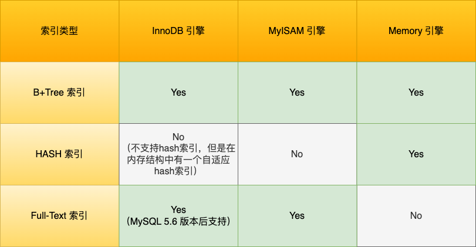

**InnoDB 是在 MySQL 5.5 之后成为默认的 MySQL 存储引擎**，B+Tree 索引类型也是 MySQL 存储引擎采用最多的索引类型。

且在创建表时，InnoDB 存储引擎会根据不同的场景选择不同的列作为**聚簇索引**：

- 如果有主键，默认会使用主键作为聚簇索引的索引键（key）；
- 如果没有主键，就选择第一个不包含 NULL 值的唯一列作为聚簇索引的索引键（key）；
- 在上面两个都没有的情况下，InnoDB 将自动生成一个隐式自增 id 列作为聚簇索引的索引键（key）；

其它索引都属于辅助索引（Secondary Index），也被称为二级索引或非聚簇索引。**创建的聚簇索引和二级索引默认使用的是 B+Tree 索引**。


回归正题，**B+Tree** 是一种 **平衡多路搜索树**，叶子节点存储数据，并且所有数据按照**顺序存储**，支持范围查询。特点在于**查询效率高**，适用于**范围查询和排序**，但对于**等值查询**比哈希索引稍慢。

**HASH 索引**基于哈希表，使用哈希函数计算键值位置，存储键值映射关系，不存储数据本身。特点在于**等值查询速度最快**，但**不支持范围查询和排序**，哈希冲突会影响性能。

**Full-Text（全文）索引**基于倒排索引（Inverted Index），将文本拆分为关键词，并建立关键词到行的映射。适用于**模糊搜索**，支持自然语言搜索，但不适用于常规的等值查询或范围查询。


##### 2. 按物理存储分类

从物理存储的角度来看，索引分为聚簇索引（主键索引）、二级索引（辅助索引）。

这两个区别在前面也提到了：

- 主键索引的 B+Tree 的叶子节点存放的是实际数据，所有完整的用户记录都存放在主键索引的 B+Tree 的叶子节点里；
- 二级索引的 B+Tree 的叶子节点存放的是主键值和索引值，而不是完整的实际数据。

在查询时使用了二级索引，如果查询的数据能够直接在二级索引里查询的话，这个过程就是覆盖索引。

但如果查询的数据不在二级索引里或二级索引不足以给出完整数据，就会先检索二级索引找到对应的叶子节点获取到主键值后，然后再检索主键索引查询到数据了，这个过程就是回表。


##### 3. 按字段特性分类

从字段特性的角度来看，索引分为主键索引、唯一索引、普通索引、前缀索引。

- **主键索引**

主键索引就是建立在主键字段上的索引，通常在创建表的时候一起创建，一张表最多只有一个主键索引，索引列的值不允许有空值。

在创建表时，创建主键索引的方式如下：

```sql
CREATE TABLE table_name  (
  ....
  PRIMARY KEY (index_column_1) USING BTREE
);
```

- **唯一索引**

唯一索引建立在 UNIQUE 字段上的索引，一张表可以有多个唯一索引，索引列的值必须唯一，但是允许有空值。

在创建表时，创建唯一索引的方式如下：

```sql
CREATE TABLE table_name  (
  ....
  UNIQUE KEY(index_column_1,index_column_2,...) 
);
```

建表后，如果要创建唯一索引，可以使用这面这条命令：

```sql
CREATE UNIQUE INDEX index_name
ON table_name(index_column_1,index_column_2,...);
```

- **普通索引**

普通索引就是建立在普通字段上的索引，既不要求字段为主键，也不要求字段为 UNIQUE。

在创建表时，创建普通索引的方式如下：

```sql
CREATE TABLE table_name  (
  ....
  INDEX(index_column_1,index_column_2,...) 
);
```

建表后，如果要创建普通索引，可以使用这面这条命令：

```sql
CREATE INDEX index_name
ON table_name(index_column_1,index_column_2,...);
```

- **前缀索引**

前缀索引是指对字符类型字段的前几个字符建立的索引，而不是在整个字段上建立的索引，前缀索引可以建立在字段类型为 char、 varchar、binary、varbinary 的列上。

使用前缀索引的目的是为了减少索引占用的存储空间，提升查询效率。

在创建表时，创建前缀索引的方式如下：

```sql
CREATE TABLE table_name(
    column_list,
    INDEX(column_name(length))
);
```

建表后，如果要创建前缀索引，可以使用这面这条命令：

```sql
CREATE INDEX index_name
ON table_name(column_name(length));
```


##### 4. 按字段个数分类

从字段个数的角度来看，索引分为单列索引、联合索引（复合索引）。

- 建立在单列上的索引称为单列索引，比如主键索引；
- 建立在多列上的索引称为联合索引；

通过将多个字段组合成一个索引，该索引就被称为联合索引。

如将存在商品表product， 将product_no 和 name 字段联合创建索引(product_no, name)：

```sql
CREATE INDEX index_product_no_name ON product(product_no, name);
```

联合索引(product_no, name) 的 B+Tree 示意图如下（注：图中叶子节点之间实际上应为双向链表）：

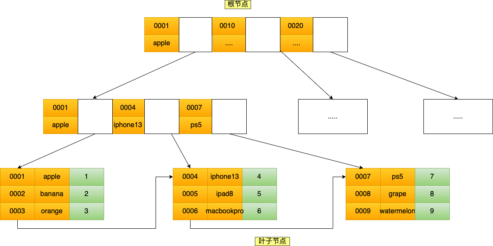

可以看到，联合索引的非叶子节点用两个字段的值作为 B+Tree 的 key 值。当在联合索引查询数据时，先按 product_no 字段比较，在 product_no 相同的情况下再按 name 字段比较。

所以联合索引查询的 B+Tree 是先按 product_no 进行排序，然后再 product_no 相同的情况再按 name 字段排序。

因此，在使用联合索引查询时，必须要**遵循最左匹配原则**才能使其生效。


**Q：倒排索引（Inverted Index）是什么？**

**传统索引（如 B+Tree）**：适用于**结构化数据**，通常是**按行存储**，索引基于主键或特定列，用于高效的**等值查询**或**范围查询**。

倒排索引（Inverted Index）是一种适用于全文搜索的索引结构，它的核心思想是将文档内容拆分成词条（Token），然后建立一个“词到文档”的映射关系，因此也被称为全文索引。

倒排索引通常由**两个核心部分**组成：

**单词词典（Dictionary）**，存储所有出现的**关键词（Token）**，类似于索引的“目录”。

**倒排列表（Posting List）**，记录**包含该关键词的文档 ID 列表**，以及关键词在文档中的**位置信息（可选）**。

假设有以下 3 篇文档：

- **Doc1**：I love MySQL
- **Doc2**：MySQL is a powerful database
- **Doc3**：I love database

构建倒排索引后：

| 关键词（Token） | 文档 ID（Posting List） |
| --------------- | ----------------------- |
| **I**           | Doc1, Doc3              |
| **love**        | Doc1, Doc3              |
| **MySQL**       | Doc1, Doc2              |
| **is**          | Doc2                    |
| **a**           | Doc2                    |
| **powerful**    | Doc2                    |
| **database**    | Doc2, Doc3              |

这样，当用户搜索 `"love"` 时，系统可以**直接查找倒排索引**，迅速得到 `Doc1, Doc3`，大大提高查询效率。

但是倒排索引的构建和维护成本都很高，需要**预处理文本**（分词、去重、计算权重）以及文本内容增删改时，需要更新索引，可能涉及**重建**或**合并**索引。


**Q：什么是联合索引的最左匹配原则？**

A：**最左匹配原则**，就是按照最左优先的方式进行索引的匹配。

这是因为联合索引在物理存储上实现的特性，最左边的索引列会全局有序，而其他部分是局部有序导致的。

比如，如果创建了一个 (a, b, c) 联合索引，如果查询条件是以下这几种，就可以匹配上联合索引：

- where a=1；
- where a=1 and b=2 and c=3；
- where a=1 and b=2；

需要注意的是，因为有查询优化器，所以 a 字段在 where 子句的顺序并不重要。

但是，如果查询条件是以下这几种，因为不符合最左匹配原则，所以就无法匹配上联合索引，联合索引就会失效:

- where b=2；
- where c=3；
- where b=2 and c=3；

上面这些查询条件之所以会失效，是因为(a, b, c) 联合索引，是先按 a 排序，在 a 相同的情况再按 b 排序，在 b 相同的情况再按 c 排序。所以，**b 和 c 是全局无序，局部相对有序的**，这样在没有遵循最左匹配原则的情况下，是无法利用到索引的。

联合索引有一些特殊情况，**并不是查询过程使用了联合索引查询，就代表联合索引中的所有字段都用到了联合索引进行索引查询**，也就是可能存在部分字段用到联合索引的 B+Tree，部分字段没有用到联合索引的 B+Tree 的情况。

这种特殊情况就发生在范围查询。联合索引的最左匹配原则会一直向右匹配直到遇到「范围查询」就会停止匹配。**也就是范围查询的字段可以用到联合索引，但是在范围查询字段的后面的字段无法用到联合索引**。


#### MySQL聚簇索引和非聚簇索引的区别是什么？

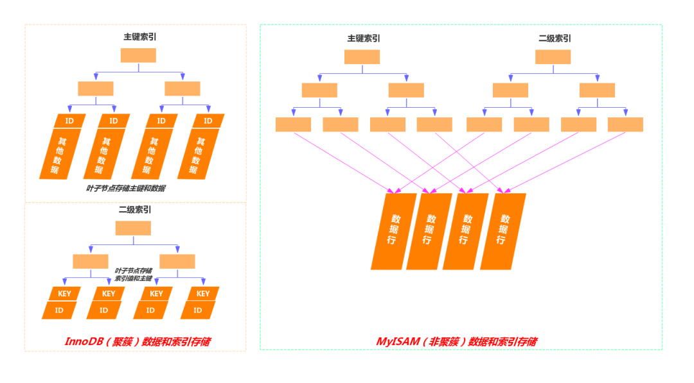

##### 1. 数据存储：

* 聚簇索引中，索引结构本身就是数据的物理存储结构。
* 非聚簇索引的叶子节点不包含完整的数据行，而是包含指向数据行的指针或主键值。数据行本身存储在聚簇索引中。

##### 2. 索引与数据关系：

* 聚簇索引中，索引结构本身就是数据的物理存储结构。可以直接从索引中获得数据行，而不需要额外的步骤去查找数据所在的位置。
* 而通过非聚簇索引查找数据时，如果索引包含需要查找的数据也可以直接从索引或者如果索引不包含，那么就要进行额外的回表操作。

##### 3. 唯一性：

* 聚簇索引通常是基于主键构建的完整数据存储的物理结构，因此每个表只能有一个聚簇索引。
* 一个表可以有多个非聚簇索引，因为它们不直接影响数据的物理存储位置。

##### 4. 效率：

* 聚簇索引通常对于范围查询和排序查询更有效率，因为它避免了额外的寻址开销。

* 非聚簇索引在使用覆盖索引进行查询时效率更高，因为它不需要读取完整的数据行。但是需要进行回表的操作，使用非聚簇索引效率比较低，因为需要进行额外的回表操作。


#### 如果聚簇索引的数据更新，它的存储要不要变化？

- 如果更新的数据是非键数据，也就是普通的用户记录，那么存储结构是不会发生变化
- 如果更新的数据是键会有两种情况
  * 若更新后的键值仍然在当前叶子节点范围内，B+ 树整体结构不会变化。
  * 更新后的键值超出了当前叶子节点的范围，需要将记录从当前叶子节点移除，并插入到新的叶子节点，这样可能引发 B+ 树的分裂或合并操作，从而影响整个 B+ 树的结构。


#### MySQL主键是聚簇索引吗？

InnoDB 在创建表时，会根据不同的场景选择不同的列作为聚簇索引：

- 如果有主键，默认会使用主键作为聚簇索引的索引键；
- 如果没有主键，就选择第一个不包含 NULL 值的唯一列作为聚簇索引的索引键；
- 在上面两个都没有的情况下，InnoDB 将自动生成一个隐式自增 id 列作为聚簇索引的索引键；

InnoDB将数据存储在B+树的结构中，其中主键索引的B+树就是所谓的聚簇索引。这意味着表中的数据行在物理上是按照主键的顺序排列的，聚簇索引的叶节点包含了实际的数据行。

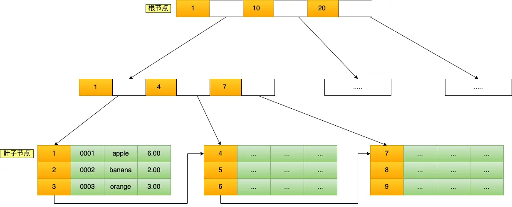


所以一张表只能有一个聚簇索引，为了实现非主键字段的快速搜索，就引出了二级索引（非聚簇索引/辅助索引），它也是利用了 B+ 树的数据结构，但是二级索引的叶子节点存放的是索引列值和主键值，不是完整的数据。


#### 了解过前缀索引吗？

前缀索引是指对字符串列的前几个字符建立索引，而不是整个列，优点是节省索引空间，提高索引效率，

在一些大字符串的字段作为索引时，使用前缀索引可以帮助我们减小索引项的大小。

**但需要注意考虑前缀长度的选择性，可以通过统计不同前缀长度的区分度来确定。**


#### 联合索引的实现原理？

通过将多个字段组合成一个索引，该索引就被称为联合索引。

如将存在商品表product， 将product_no 和 name 字段联合创建索引(product_no, name)：

```sql
CREATE INDEX index_product_no_name ON product(product_no, name);
```

联合索引(product_no, name) 的 B+Tree 示意图如下（注：图中叶子节点之间实际上应为双向链表）：


可以看到，联合索引的非叶子节点用两个字段的值作为 B+Tree 的 key 值。当在联合索引查询数据时，先按 product_no 字段比较，在 product_no 相同的情况下再按 name 字段比较。

所以联合索引查询的 B+Tree 是先按 product_no 进行排序，然后再 product_no 相同的情况再按 name 字段排序。

因此，在使用联合索引查询时，必须要**遵循最左匹配原则**才能使其生效。


**Q：什么是联合索引的最左匹配原则？**

A：**最左匹配原则**，就是按照最左优先的方式进行索引的匹配。

这是因为联合索引在物理存储上实现的特性，最左边的索引列会全局有序，而其他部分是局部有序导致的。

比如，如果创建了一个 (a, b, c) 联合索引，如果查询条件是以下这几种，就可以匹配上联合索引：

- where a=1；
- where a=1 and b=2 and c=3；
- where a=1 and b=2；

需要注意的是，因为有查询优化器，所以 a 字段在 where 子句的顺序并不重要。

但是，如果查询条件是以下这几种，因为不符合最左匹配原则，所以就无法匹配上联合索引，联合索引就会失效:

- where b=2；
- where c=3；
- where b=2 and c=3；

上面这些查询条件之所以会失效，是因为(a, b, c) 联合索引，是先按 a 排序，在 a 相同的情况再按 b 排序，在 b 相同的情况再按 c 排序。所以，**b 和 c 是全局无序，局部相对有序的**，这样在没有遵循最左匹配原则的情况下，是无法利用到索引的。

联合索引有一些特殊情况，**并不是查询过程使用了联合索引查询，就代表联合索引中的所有字段都用到了联合索引进行索引查询**，也就是可能存在部分字段用到联合索引的 B+Tree，部分字段没有用到联合索引的 B+Tree 的情况。


#### 创建联合索引时需要注意什么？*

**最主要注意的就是字段顺序**。因为越靠前的字段被用于索引过滤的概率越高，最左边的字段是全局有序的。

实际开发工作中**建立联合索引时，要把区分度大的字段排在前面，这样区分度大的字段越有可能被更多的 SQL 使用到**。

区分度的计算方式为：
$$
\frac{\text{count(DISTINCT sex)}}{\text{count(*)}}
$$
性别的区分度就很小，不适合建立索引或不适合排在联合索引列的靠前的位置，而 UUID 这类字段就比较适合做索引或排在联合索引列的靠前的位置。

索引的区分度很小，那么无论搜索哪个值都可能得到一半的数据。在这些情况下， MySQL 查询优化器某个值出现在表的数据行中的百分比（惯用的百分比界线是"30%"）很高的时候，它一般会忽略索引，进行全表扫描。相当于白白浪费了存储还没有使用。


**其次还有范围查询的字段应该放在最后**，因为范围条件后的索引列会失效而无法使用（因为最多匹配原则，右边的值是依靠与左边的值相等时排列的）。

如查询 `WHERE A = 1 AND B > 10 AND C = 3`，由于 `B` 是范围查询，`C` 列的索引会失效。


#### 联合索引ABC，现在有个执行语句是A = XXX and C < XXX，索引怎么走

根据最左匹配原则，A可以走联合索引，C不会走联合索引，但是C可以走索引下推


#### 联合索引(a,b,c) ，查询条件 where b > xxx and a = x 会生效吗

索引会生效，a 和 b 字段都能利用联合索引，符合联合索引最左匹配原则。


#### 联合索引 (a, b，c)，where条件是 a=2 and c = 1，能用到联合索引吗？

会用到联合索引，但是只有 a 才能走索引，c 无法走索引，因为不符合最左匹配原则。

虽然 c 无法走索引， 但是 c 字段在 5.6 版本之后，会有索引下推的优化，能减少回表查询的次数。


**Q：索引下推是什么？为解决什么问题？**

A：**索引下推**是 MySQL 从 **5.6** 版本引入的一种优化技术，主要用于优化查询中带有索引的条件过滤操作。它的目标是将一些过滤条件“下推”到存储引擎层处理，而不是在服务器层（SQL 层）处理

举个索引存储示例，联合索引 (a, b, c)。

| a    | b    | c    | 数据地址 |
| ---- | ---- | ---- | -------- |
| 1    | 2    | 3    | ptr1     |
| 2    | 1    | 1    | ptr2     |
| 2    | 2    | 1    | ptr3     |
| 2    | 3    | 4    | ptr4     |
| 3    | 1    | 1    | ptr5     |

在没有启用索引下推时：

1. 存储引擎通过索引定位到所有满足 `a=2` 的记录，即 `{(2, 1, 1), (2, 2, 1), (2, 3, 4)}`。
2. **存储引擎将所有这些记录返回给 SQL 层**。
3. SQL 层再逐条检查每条记录是否满足 `c=1` 的条件，最终丢弃不符合的记录 `{(2, 3, 4)}`，仅返回 `{(2, 1, 1), (2, 2, 1)}`。

这个问题在于InnoDB返回了所有 `a=2` 的记录，导致大量不必要的数据传输到 SQL 层。SQL 层需要额外的计算开销来检查 `c=1` 的条件。


在启用了索引下推的情况下：

1. 存储引擎仍然通过索引定位到 `a=2` 的记录范围 `{(2, 1, 1), (2, 2, 1), (2, 3, 4)}`。
2. 存储引擎在检索每条记录时，直接在存储引擎层检查`c=1`的条件：
   - 对 `(2, 1, 1)`，`c=1`，保留。
   - 对 `(2, 2, 1)`，`c=1`，保留。
   - 对 `(2, 3, 4)`，`c≠1`，丢弃。
3. **最终，存储引擎只返回满足条件的记录 {(2, 1, 1), (2, 2, 1)} 给 SQL 层**。

相较于没有启用索引下推，引擎层直接过滤了不满足 `c=1` 的记录，减少了数据传输量。SQL 层无需再对记录进行条件检查，降低了计算开销。


#### 什么字段适合当做主键？

- 字段具有唯一性，且不能为空的特性。
- 字段最好的是有递增的趋势的，如果字段的值是随机无序的，可能会引发页分裂的问题，造型性能影响。
- 不建议用业务数据作为主键，比如会员卡号、订单号、学生号之类的，因为无法预测未来会不会因为业务需要，而出现业务字段重复或者重用的情况。
- 通常情况下会用自增字段来做主键，对于单机系统来说是没问题的。但是在分布式情况下，集群中每台机器各自产生的数据需要合并，可能会出现主键重复的问题，需要考虑分布式 id 的方案了。


**Q：那问题来了，如何实现分布式系统环境下id唯一？**

A：可以采用雪花算法，是一种基于时间的分布式 ID生成算法

雪花算法为ID 由 64 位组成，分为以下部分：

- **1 位固定为 0**：保证生成的 ID 为正数。
- **41 位时间戳**：记录毫秒级时间，支持约 69 年（2^41 毫秒）。
- **10 位机器 ID**：支持 1024 台机器（如 5 位数据中心 ID + 5 位节点 ID）。
- **12 位序列号**：每毫秒内最多生成 4096 个 ID。

雪花算法优点在于**高性能**，完全由本地生成，无需依赖外部系统。**且基于时间有序**，适用于主键设计或按时间排序的场景。

**缺点**在于如果系统时间回调，可能导致 ID 冲突而且依赖机器 ID 的唯一性配置。

当然也可以使用UUID，但是查询效率比较差，下面有详细讲解。


#### 表中十个字段，你主键用自增ID还是UUID，为什么？

建议使用自增 id，因为 UUID 相对顺序的自增 id 来说是毫无规律可言的，这导致了新行的值不一定要比之前的主键的值要大，所以 innodb 几乎无法做到把新行插入到B+树索引的最后，总是需要为新行寻找新的合适的位置从而来分配新的空间。

而这个过程需要做很多额外的操作，数据的毫无顺序会导致数据分布散乱，将会导致以下的问题：

1. 写入的目标页很可能已经刷新到磁盘上并且从缓存上移除，或者还没有被加载到缓存中，innodb 在插入之前不得不先找到并从磁盘读取目标页到内存中，这将导致大量的随机 IO。
2. 因为写入是乱序的，innodb 不得不频繁的做页分裂操作，以便为新的行分配空间，页分裂导致移动大量的数据，影响性能。
3. 由于频繁的页分裂，页会变得稀疏并被不规则的填充，最终会导致数据会有碎片。

除此之外，uuid占用空间还更大通占用16个字节，由于页的大小是固定的，还会导致一个页上能存放的关键字数量更少，最终导致索引树的高度越大，发生的磁盘 IO 次数越多，性能越差。所以建议使用自增 id来作为主键。


#### 什么自增ID更快一些，UUID不快吗，它在B+树里面存储是有序的吗?

MySQL 中索引的数据结构是 B+Tree，这种数据结构的特点是索引树上的节点的数据是有序的。

所以UUID确实在B+树里面存储是有序的。正因如此使用自增 id更快，因为 UUID 相对顺序的自增 id 来说是毫无规律可言的，新生成的值不一定比之前的要大，总是需要为新行寻找当前分布下顺序的位置从而来分配新的空间。

而这个过程需要做很多额外的操作，数据的毫无顺序会导致数据分布散乱，将会导致以下的问题：

1. 写入的目标页很可能已经刷新到磁盘上并且从缓存上移除，或者还没有被加载到缓存中，innodb 在插入之前不得不先找到并从磁盘读取目标页到内存中，这将导致大量的随机 IO。
2. 因为写入是乱序的，innodb 不得不频繁的做页分裂操作，以便为新的行分配空间，页分裂导致移动大量的数据，影响性能。
3. 由于频繁的页分裂，页会变得稀疏并被不规则的填充，最终会导致数据会有碎片。

除此之外，uuid占用空间还更大通占用16个字节，由于页的大小是固定的，还会导致一个页上能存放的关键字数量更少，最终导致索引树的高度越大，发生的磁盘 IO 次数越多，性能越差。所以建议使用自增 id来作为主键。


#### 性别字段能加索引么？为啥？

不建议对于这种区分度比较小的进行建立索引。区分度的计算方式为：
$$
\frac{\text{count(DISTINCT sex)}}{\text{count(*)}}
$$
可以估算得出，因为男女性别差距不大的情况下，区分度基本上为0。

假设对100万条数据进行select * 操作（如果查询条件是 `WHERE sex = '男'`），就会进行50w次回表操作，性能甚至不如还不如直接查询。

既然走索引的查询的成本比全表扫描高，InnoDB引擎中的优化器如果它发现走索引的成本（索引扫描 + 回表）比全表扫描高，就会直接选择全表扫描。**而这时候建立的性别字段索引不仅没有启到加快查询的作用，反而还因为创建了索引占用了空间。**而且当索引的字段进行更新时，数据库需要同步更新索引，增加了写操作的成本。


**Q：什么时候像性别这种区分度低的字段，可能需要添加索引？**

A：什么时候性别字段可能需要索引：

- 如果性别经常和其他字段一起查询，可以考虑建立联合索引，且把性别字段放在联合索引的后面
- 如果确实经常需要统计不同性别的数量，且表数据量巨大，可以考虑建立索引


#### 什么情况下会回表查询

查询所需的所有数据在索引中不能够直接获取，没有获得的数据还要通过原来索引中获得的主键值去聚簇索引中查找这个过程就叫回表。


所以，在查询时使用了二级索引，如果查询的数据能在二级索引里查询的到，那么就不需要回表，这个过程就是覆盖索引。

**如果查询的数据不在二级索引里，就会先检索二级索引，找到对应的叶子节点，获取到主键值后，然后再检索主键索引，就能查询到数据了，这个过程就是回表**。


**Q：聚簇索引和二级索引的结构？**

A：从物理存储的角度来看，索引分为聚簇索引（主键索引）、二级索引（辅助索引）。

它们的主要区别如下：

- 主键索引的 B+Tree 的叶子节点存放的是实际数据，所有完整的用户记录都存放在主键索引的 B+Tree 的叶子节点里；
- 二级索引的 B+Tree 的叶子节点存放的是主键值和索引列值，而不是实际完整数据。


#### 什么是覆盖索引？

覆盖索引是指一个索引包含了查询所需的所有列，因此不需要通过获得的主键值再回到聚簇索引中查找数据。

换句话说，查询所需的所有数据都能从索引中直接获取，也不需要进行回表查询。

覆盖索引能够显著提高查询性能，因为减少了访问数据页的次数（单单一次访问普通索引块），从而减少了I/O操作。


#### 如果一个列即使单列索引，又是联合索引，单独查它的话先走哪个？

mysql 优化器会分析每个索引的查询成本，然后选择成本最低的方案来执行 sql。

比如如果单列索引是 a，联合索引是（a ，b），那么针对下面这个查询：

```sql
select a, b from table where a = ? and b =?
```

优化器会选择联合索引，因为查询成本更低能够覆盖索引，不需要回表。


#### 索引已经建好了，那我再插入一条数据，索引会有哪些变化？

插入新数据可能导致B+树结构的调整和索引信息的更新，以保持B+树的平衡性和正确性和确保数据的一致性和索引的有效性。

如果插入的数据时叶子节点已满，会触发叶子节点的分裂操作，以保持B+树的平衡性。


#### 如果有一个字段是status值为0或者1，适合建索引吗

不建议对于这种区分度比较小的进行建立索引。区分度的计算方式为：
$$
\frac{\text{count(DISTINCT sex)}}{\text{count(*)}}
$$
如果假设这个字段值表示的是男性和女性，可以估算得出，因为男女性别差距不大的情况下，区分度基本上为0。

假设对100万条数据进行select * 操作（如果查询条件是 `WHERE sex = '男'`），就会进行50w次回表操作，性能甚至不如还不如直接查询。

既然走索引的查询的成本比全表扫描高，InnoDB引擎中的优化器如果它发现走索引的成本（索引扫描 + 回表）比全表扫描高，就会直接选择全表扫描。**而这时候建立的性别字段索引不仅没有启到加快查询的作用，反而还因为创建了索引占用了空间。**而且当索引的字段进行更新时，数据库需要同步更新索引，增加了写操作的成本。


**Q：什么时候这种区分度低的字段，可能需要添加索引？**

A：什么时候该字段可能需要索引：

- 如果改字段经常和其他字段一起查询，可以考虑建立联合索引，且把区分度低的字段放在联合索引的后面
- 如果确实经常需要统计不同区分度低的字段的数量，且表数据量巨大，可以考虑建立索引


#### 怎么决定建立哪些索引?*

##### 1. 什么时候适用索引？

- 字段有唯一性限制的，比如商品编码；
- 经常用于 `WHERE` 查询条件的字段，这样能够提高整个表的查询速度，如果查询条件不是一个字段，可以建立联合索引。
- 经常用于 `GROUP BY` 和 `ORDER BY` 的字段，这样在查询的时候就不需要再去做一次排序了，因为我们都已经知道了建立索引之后在 B+Tree 中的记录都是排序好的。


##### 2. 什么时候不需要创建索引？

- `WHERE` 条件，`GROUP BY`，`ORDER BY` 里用不到的字段，索引的价值是快速定位，索引是会占用物理空间的。
- 字段中区分度极低，不需要创建索引，典型就是性别字段。前面说了很多。
- 表数据太少的时候，不需要创建索引，全表查询效率就很高；
- 经常更新的字段不用创建索引，比如不要对电商项目的用户余额建立索引，因为索引字段频繁修改会导致B+树维护开销降低性能。


#### 索引失效由哪些情况导致？*

有4种会发生索引失效的情况：

- 当我们使用左或者左右模糊匹配的时候，也就是 like %xx 或者 like %xx%这两种方式都会造成索引失效；
- 当我们在查询条件中对索引列使用函数、表达式运算或字符串和数字比较的时候（因为会把把字符串转为数字，然后再进行比较，而转换是通过 CAST 函数实现的），就会导致索引失效。
- 联合索引要能正确使用需要遵循最左匹配原则，也就是按照最左优先的方式进行索引的匹配，否则就会导致索引失效。
- 在 WHERE 子句中，如果在 OR 前的条件列是索引列，而在 OR 后的条件列不是索引列，那么索引会失效。


#### 索引优化详细讲讲*

索引优化可以从4个方面入手：

##### 1. 前缀索引优化

前缀索引是指对字符串列的前几个字符建立索引，而不是整个列，优点是节省索引空间，提高索引效率，

但需要注意考虑前缀长度的选择性，可以通过统计不同前缀长度的区分度来确定。


##### 2. 覆盖索引优化

覆盖索引是指一个索引包含了查询所需的所有列，因此不需要通过获得的主键值再回到聚簇索引中查找数据。覆盖索引能够显著提高查询性能，因为减少了访问数据页的次数（单单一次访问普通索引块），从而减少了I/O操作。


##### 3. 主键索引用自增ID

如果我们使用自增ID作为主键，由于b加树的叶子节点是按照键的大小顺序组织的，所以每次插入的新数据就会按顺序添加到当前索引节点的位置，直到当前页面写满，就会自动开辟一个新页面。即每次**插入一条新记录，都是追加操作直到写满存储块，不需要重新读取另一个存储块写入**，减少了IO消耗。

反之，如果使用随机id，则可能会造成页分裂的问题，频繁读取多个磁盘块加大IO消耗。


##### 4. 防止索引失效

即要防止上面讲过的4种失效情况，防止没有走索引，而是全表查询。

- 当我们使用左或者左右模糊匹配的时候，也就是 `like %xx` 或者 `like %xx%`这两种方式都会造成索引失效；
- 当我们在查询条件中对索引列做了计算、函数、类型转换操作，这些情况下都会造成索引失效；
- 联合索引要能正确使用需要遵循最左匹配原则，也就是按照最左优先的方式进行索引的匹配，否则就会导致索引失效。
- 在 WHERE 子句中，如果在 OR 前的条件列是索引列，而在 OR 后的条件列不是索引列，那么索引会失效。


### B+树——MySQL索引的具体实现方式

#### Mysql中的索引是怎么实现的 ？

MySQL InnoDB 引擎是用了B+树作为了索引的数据结构。

B+Tree 是一种多叉树，叶子节点才存放数据，非叶子节点只存放索引，而且每个节点里的数据是**按索引列大小顺序存放**的。

每一层父节点的索引值都会出现在下层子节点的索引值中，仅仅起到路由作用。因此在叶子节点中，包括了所有的索引值信息，并且每一个叶子节点都有两个指针，分别指向下一个叶子节点和上一个叶子节点，形成一个双向链表。如图所示（画图的人太懒没画双向，但现实中确实是双向链表）：


Q：当执行了查询语句`select * from product where id= 5;`，索引结构会怎么查询？

A：B+Tree 会自顶向下逐层进行查找：

- 将 5 与根节点的索引数据 (1，10，20) 比较，5 在 1 和 10 之间，所以根据 B+Tree的搜索逻辑，找到第二层的索引数据 (1，4，7)；
- 在第二层的索引数据 (1，4，7)中进行查找，因为 5 在 4 和 7 之间，所以找到第三层的索引数据（4，5，6）；
- 在叶子节点的索引数据（4，5，6）中进行查找，然后我们找到了索引值为 5 的行数据。

数据库的索引和数据都是存储在硬盘的，可以把读取一个节点当作一次磁盘 I/O 操作。那么上面的整个查询过程一共经历了 3 个节点，也就是进行了 3 次 I/O 操作。

在现实中B+Tree 存储千万级的数据只需要 3-4 层高度就可以满足，这意味着从千万级的表查询目标数据最多需要 3-4 次磁盘 I/O，所以**B+Tree 相比于 B 树和二叉树来说，最大的优势在于减少了io次数所以查询效率很高。**


#### 查询数据时，到了B+树的叶子节点，之后的查找数据是如何做？*

**B+树的叶子节点内部的记录按照「主键」顺序组成单向链表**（叶子节点间组成的是双向链表），单向链表的特点就是插入、删除非常方便，但是检索效率不高。

因此，叶子节点内部中有一个**页目录**，起到记录的索引作用。页目录与记录的关系如下图：

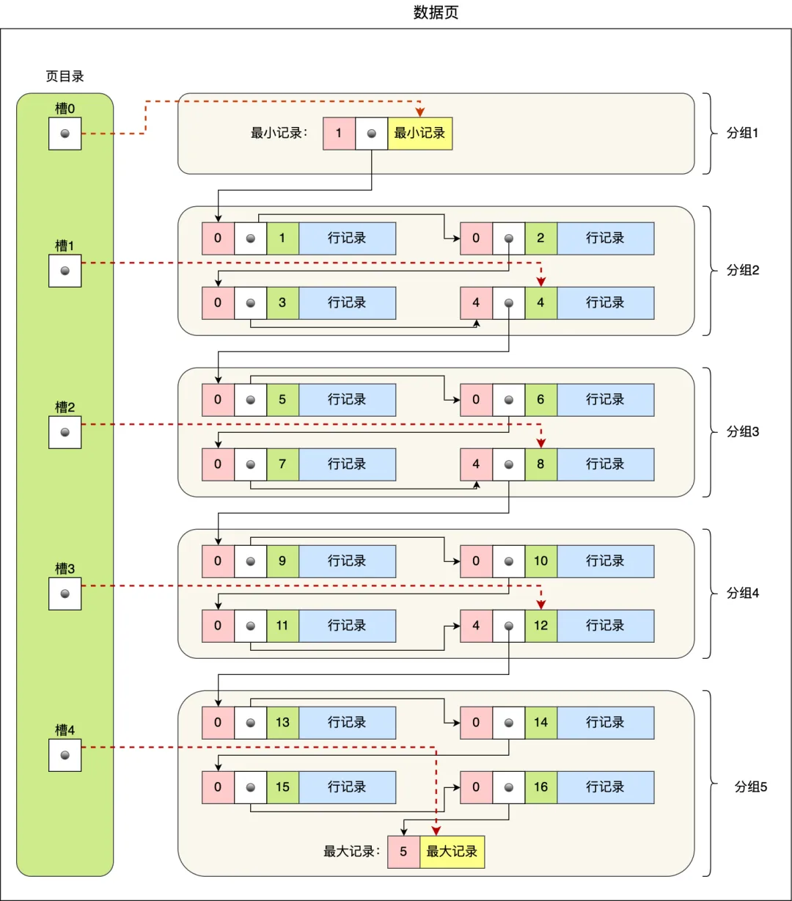

从上图可以看到，**页目录就是由多个槽组成的，槽相当于分组记录的索引**。

页目录将叶子节点内的记录划分为多个分组，每个分组有一个**槽**，槽记录了分组中最大主键的索引信息。

由此可以**通过槽查找记录时，可以使用二分法快速定位要查询的记录在哪个槽（哪个记录分组），定位到槽后，再遍历槽内的所有记录，找到对应的记录**，无需从最小记录开始遍历整个页中的记录链表。


以上面那张图举个例子，5 个槽的编号分别为 0，1，2，3，4，我想查找主键为 11 的用户记录：

- 先二分得出槽中间位是 (0+4)/2=2 ，2号槽里最大的记录为 8。因为 11 > 8，所以需要从 2 号槽后继续搜索记录；
- 再使用二分搜索出 2 号和 4 槽的中间位是 (2+4)/2= 3，3 号槽里最大的记录为 12。因为 11 < 12，所以主键为 11 的记录在 3 号槽里；
- 再从 3 号槽指向的主键值为 9 记录开始向下搜索 2 次，定位到主键为 11 的记录，取出该条记录的信息即为我们想要查找的内容。

所以说**叶目录类似于一个非叶子节点**，即本身不存储数据，但是存储了记录的索引，只不过它本身存储在叶子节点上的小型索引。


**Q：页目录是怎么创建的？**

A：过程如下：

1. 将所有的记录划分成几个组，这些记录包括最小记录和最大记录，但不包括标记为“已删除”的记录；
2. 每个记录组的最后一条记录就是组内最大的那条记录，并且最后一条记录的头信息中会存储该组一共有多少条记录，作为 n_owned 字段（上图中最后记录的头部粉红色字段）
3. 页目录用来存储每组最后一条记录的地址偏移量，这些地址偏移量会按照先后顺序存储起来，每组的地址偏移量也被称之为槽（slot），每个槽相当于指针指向了不同组的最后一个记录。


#### B+树的特性是什么？*

##### 1. **所有叶子节点都在同一层**

这是B+树的一个重要特性，确保了所有数据项的检索都具有相同的I/O延迟，提高了搜索效率。

每个叶子节点都包含指向相邻叶子节点的指针，形成一个链表，由于叶子节点之间的链接，**B+树非常适合进行范围查询和排序扫描。**


##### 2. **非叶子节点存储键值**

非叶子节点仅存储键值和指向子节点的指针，不包含数据记录。这些键值用于指导搜索路径，帮助快速定位到正确的叶子节点。并且，由于非叶子节点只存放键值，当数据量比较大时，相对于B树，B+树的层高更少，查找效率也就更高。


##### 3. **叶子节点存储数据记录**

与B树不同，B+树的叶子节点存储实际的数据记录或指向数据记录的指针。这意味着每次搜索都会到达叶子节点，才能找到所需数据。


##### 4. **自平衡**

B+树在插入、删除和更新操作后会自动重新平衡，确保树的高度保持相对稳定，从而保持良好的搜索性能。每个节点最多可以有M个子节点，最少可以有ceil(M/2)个子节点（除了根节点），这里的M是树的阶数。


#### 说说B+树和B树的区别

- 在B+树中，数据都存储在叶子节点上，而非叶子节点只存储索引信息而B树的非叶子节点既存储索引信息也存储部分数据。
- B+树的叶子节点使用链表相连，**便于范围查询和顺序访问**；B树的叶子节点没有链表连接。
- B+树的查找性能更稳定，每次查找都需要查找到叶子节点；而B树的查找可能会在非叶子节点找到数据，性能相对不稳定。而且由于非叶子节点不仅存索引，还存数据可能会导致树高过高，IO次数过多，性能较差。


#### B+树的好处是什么？*

MySQL 默认的存储引擎 InnoDB 采用的是 B+ 作为索引的数据结构，原因有：

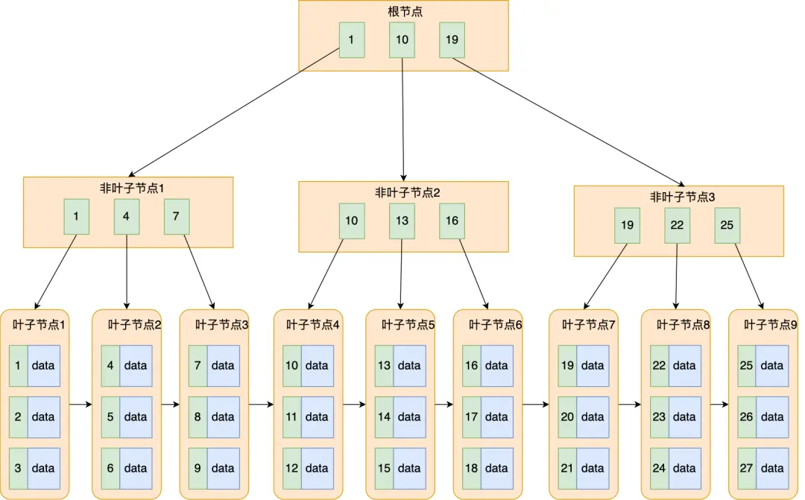

- B+ 树的非叶子节点不存放实际的记录数据，仅存放索引，因此数据量相同的情况下，相比存储即存索引又存记录的 B 树，B+树的非叶子节点可以存放更多的索引，因此 B+ 树可以比 B 树更「矮胖」，查询底层节点的磁盘 I/O次数会更少，性能更好。
- B+ 树有大量的冗余节点（所有非叶子节点都是冗余索引），但这些冗余索引让 B+ 树在更新、插入和删除的效率都更高，比如删除根节点的时候，不会像 B 树那样会发生复杂的树的变化；
- **B+ 树叶子节点之间用链表连接了起来，有利于范围查询**，而 B 树要实现范围查询，因此只能通过树的遍历来完成范围查询，这会涉及多个节点的磁盘 I/O 操作，范围查询效率不如 B+ 树。


#### B+树的叶子节点链表是单向还是双向？*

双向的，为了实现倒序遍历或者排序。

B+ 树点节点内容是数据页，数据页里存放了用户的记录以及各种信息，每个数据页默认大小是 16 KB。


#### MySQL为什么用B+树结构？和其他结构比的优点？

##### 1.**B+Tree vs B Tree**

B+Tree 只在叶子节点存储数据，而 B 树 的非叶子节点也要存储数据，所以 B+Tree 的单个节点的数据量更小，在相同的磁盘 I/O 次数下，就能查询更多的节点。

另外，B+Tree 叶子节点采用的是双链表连接，适合 MySQL 中常见的基于范围的顺序查找，而 B 树无法做到这一点。


##### 2.**B+Tree vs 二叉树：**

即使数据达到千万级别时，B+Tree 的高度依然维持在 3~4 层左右，也就是说一次数据查询操作只需要做 3~4 次的磁盘 I/O 操作就能查询到目标数据。

而二叉树的每个父节点的儿子节点个数只能是 2 个，意味着其搜索复杂度为 O(logN)，这已经比 B+Tree 高出不少，因此二叉树检索到目标数据所经历的磁盘 I/O 次数要更多。


##### 3. **B+Tree vs Hash**

Hash 在做等值查询的时候效率非常快，搜索复杂度为 O(1)。

但是 **Hash 表不适合做范围查询**，它更适合做等值的查询，这也是 B+Tree 索引要比 Hash 表索引有着更广泛的适用场景的原因。


#### 为什么 MySQL 不用 跳表？

跳表是一种随机化的有序数据结构，通过在链表基础上增加多级索引，提供O(logN)查找的性能。跳表每新增一层索引，存储空间增大，同时查找路径缩短。所以**跳表的随机性在IO环境下显著增加延迟**，性能也不均衡。因此，跳表更适合内存结构的检索，如用于Redis的Zset结构之中。

此外B+树的高度在3层时存储的数据可能已达千万级别，但对于跳表而言同样去维护千万的数据量那么所造成的跳表层数过高而导致的磁盘io次数增多，也就是使用B+树在存储同样的数据下磁盘io次数更少。


### 事务

#### 事务的特性是什么？如何实现的？

事务的特性即为ACID，即A原子性、C一致性、I隔离性、D持久性。

##### 1. **原子性（Atomicity）**

原子性指的是一个事务中的所有操作，要么全部完成，要么全部不完成，而且事务在执行过程中发生错误，会被回滚到事务开始前的状态。


##### 2. **一致性（Consistency）**

是指事务操作前和操作后，数据满足完整性约束，数据库保持一致性状态。

举个例子来理解，用户 A 和用户 B 在银行分别有 800 元和 600 元，总共 1400 元，用户 A 给用户 B 转账 200 元，分为两个步骤，从 A 的账户扣除 200 元和对 B 的账户增加 200 元。一致性就是要求上述步骤操作后，最后的结果是用户 A 还有 600 元，用户 B 有 800 元，总共 1400 元，而不会出现用户 A 扣除了 200 元，但用户 B 未增加的情况（该情况，用户 A 和 B 均为 600 元，总共 1200 元）。


##### 3.  **隔离性（Isolation）**

数据库允许多个并发事务同时对其数据进行读写和修改的能力。

隔离性可以防止多个事务并发执行时由于交叉执行而导致数据的不一致，因为多个事务同时使用相同的数据时，不会相互干扰，每个事务都有一个完整的数据空间，对其他并发事务是隔离的。

举例来说，消费者购买商品这个事务，是不影响其他消费者购买的。


##### 4. **持久性（Durability）**

事务处理结束后，对数据的修改就是永久的，即便系统故障也不会丢失。


其中**原子性（Atomicity）**由MySQL的 **undo log**（回滚日志） 来保证的；

其中**隔离性（Isolation）**由MySQL的 **MVCC（多版本并发控制） 或锁机制**来保证的；

其中**持久性（Durability）**由MySQL的 **redo log** （重做日志）来保证的；

其中**一致性（Consistency）**由上述三个特性保证来保证的；


#### mysql可能出现什么和并发相关问题？

MySQL 服务端支持并发所以允许多个客户端连接的，这意味着 MySQL 会出现同时处理多个事务的情况。

那么**在同时处理多个事务的时候，就可能出现脏读（dirty read）、不可重复读（non-repeatable read）、幻读（phantom read）的问题**。


##### 1. 脏读

脏读意味**如果一个事务「读到」了另一个「未提交事务修改过的数据」也就是读到了脏数据，即为「脏读」现象。**

假设有 A 和 B 这两个事务同时在处理，事务 A 先开始从数据库中读取小林的余额数据，然后再执行更新操作，如果此时事务 A 还没有提交事务，而此时正好事务 B 也从数据库中读取小林的余额数据，那么事务 B 读取到的余额数据是刚才事务 A 更新后的数据，即使没有提交事务。

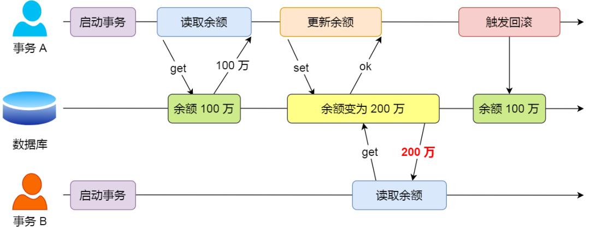

因为事务 A 是还没提交事务的，也就是它随时可能发生回滚操作，**如果在上面这种情况事务 A 发生了回滚，那么事务 B 刚才得到的数据就是过期的数据，这种现象就被称为脏读。**


##### 2. 不可重复读

**在一个事务内多次读取同一个数据，如果出现前后两次读到的数据不一样的情况，就意味着发生了「不可重复读」现象。**


假设有 A 和 B 这两个事务同时在处理，事务 A 先开始从数据库中读取小林的余额数据，然后继续执行代码逻辑处理，**在这过程中如果事务 B 更新了这条数据，并提交了事务，那么当事务 A 再次读取该数据时，就会发现前后两次读到的数据是不一致的，这种现象就被称为不可重复读。**

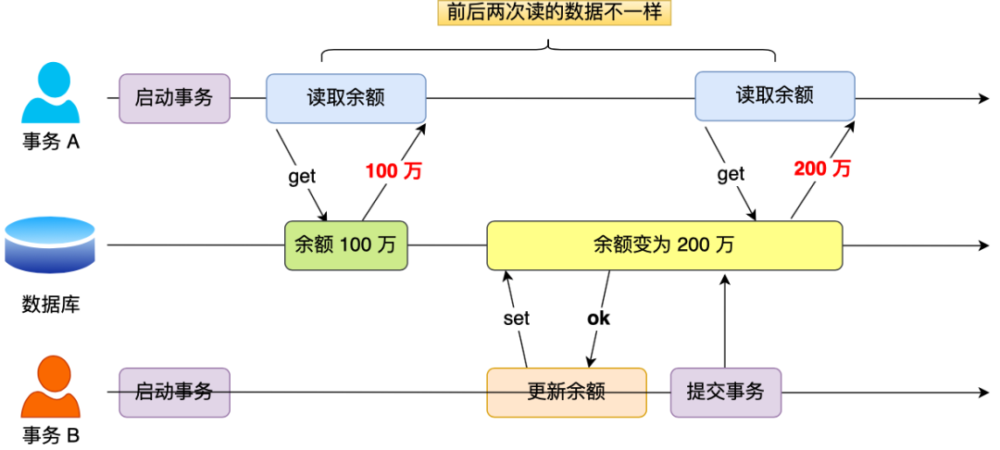


##### 3. 幻读

**在一个事务内多次查询某个符合查询条件的「记录数量」，如果出现前后两次查询到的记录数量不一样的情况，就意味着发生了「幻读」现象。**

举个栗子。

假设有 A 和 B 这两个事务同时在处理，事务 A 先开始从数据库查询账户余额大于 100 万的记录，发现共有 5 条，然后事务 B 也按相同的搜索条件也是查询出了 5 条记录。

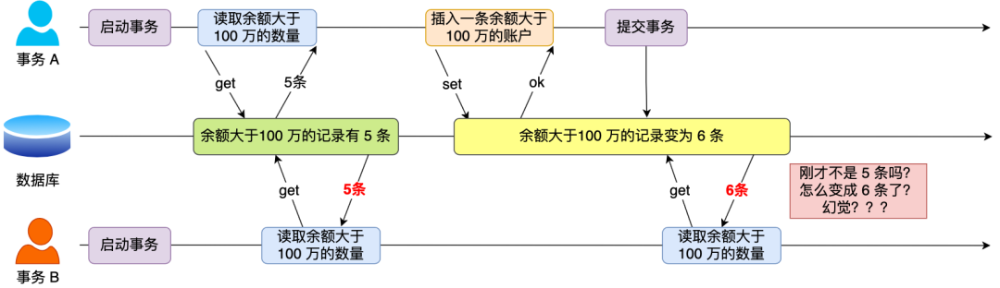

接下来，事务 A 插入了一条余额超过 100 万的账号，并提交了事务，此时数据库超过 100 万余额的账号个数就变为 6。

然后事务 B 再次查询账户余额大于 100 万的记录，此时查询到的记录数量有 6 条，**发现和前一次读到的记录数量不一样了，就感觉发生了幻觉一样，这种现象就被称为幻读。**


#### 哪些场景不适合脏读，举个例子？

脏读是指一个事务在读取到另一个事务未提交的数据时发生。脏读可能会导致不一致的数据被读取，并引起问题。以下是一些不适合脏读的场景：

- **银行系统**：在银行系统中，如果一个账户的余额正在被调整但尚未提交，另一个事务读取了这个临时的余额，可能会导致客户看到不正确的余额。
- **库存管理系统**：在一个库存管理系统中，如果一个商品的数量正在被更新但尚未提交，另一个事务读取了这个临时的数量，可能会导致库存管理错误。
- **在线订单系统**：在一个在线订单系统中，如果一个订单正在被修改但尚未提交，另一个事务读取了这个临时的订单状态，可能导致订单状态显示错误，客户收到不准确的信息。


#### mysql的是怎么解决并发问题的？*

##### 1. 锁机制

MySQL提供了多种锁机制来保证数据的一致性，包括行级锁、表级锁、页级锁等。通过锁机制，可以在读写操作时对数据进行加锁，确保同时只有一个操作能够访问或修改数据，各进程进行串行化执行保证了原子性。


##### 2. 事务隔离级别

Mysql提供了多种事务隔离级别，包括读未提交、读已提交、可重复读和串行化。通过**在SQL层设置合适的事务隔离级别**，可以在多个事务并发执行时，控制事务之间的隔离程度，以避免数据不一致的问题。


##### 3. MVCC（多版本并发控制）

Mysql使用MVCC来管理并发访问，它通过在数据库中保存不同版本的数据来实现不同事务之间的隔离。在读取数据时，Mysql会根据事务的隔离级别来选择合适的数据版本，从而保证数据的一致性。


#### 事务的隔离级别有哪些？

**事务隔离级别** 是 MySQL 在 SQL 层的全局配置，用于约束事务默认的读取和写入行为，其依赖存储引擎层的 MVCC 和锁机制实现具体功能。

MySQL提供了4种事务隔离级别，包括读未提交、读已提交、可重复读和串行化。

##### 1. **读未提交（read uncommitted）**

指一个事务还没提交时，它做的变更就能被其他事务看到。

因此在「读未提交」隔离级别下，可能发生脏读、不可重复读和幻读现象。


##### 2. **读提交（read committed）**

指一个事务提交之后，它做的变更才能被其他事务看到

因此在「读提交」隔离级别下，可能发生不可重复读和幻读现象，但是不可能发生脏读现象。


##### 3. **可重复读（repeatable read）**

可重复读指一个事务执行过程中看到的数据一致性，即同一事务多次读取的结果始终与事务开始时的快照数据一致，是 **MySQL InnoDB 引擎的默认隔离级别**。

在可重复读隔离级别下，通过 MVCC 机制避免了脏读和不可重复读现象。
然而，由于 MVCC 本身对范围查询无法防止幻读，可以通过显示的在查询语句后面加上 `FOR UPDATE` 通过引入 **Next-Key Lock** 锁，彻底解决了幻读问题。因此，InnoDB 在可重复读隔离级别下，不会发生脏读、不可重复读或幻读现象（取决于用户的事物逻辑实现）。


##### 4. **串行化（serializable）**

会对记录加上读写锁，在多个事务对这条记录进行读写操作时，如果发生了读写冲突的时候，后访问的事务必须等前一个事务执行完成，才能继续执行。

因此在「串行化」隔离级别下，不可能发生脏读、不可重复读和幻读现象。


#### mysql默认级别是什么？

MySQL的默认隔离级别是可重复读隔离级别。可重复读指一个事务执行过程中看到的数据，一直跟这个事务启动时看到的数据是一致的。


#### 介绍MVCC实现原理

MVCC手机发控制是基于undo log来进行实现的，允许多个事务同时读取同一行数据，而不会彼此阻塞，每个事务看到的数据版本按照预先定义的事务隔离级别规则读取到相应的版本。

对于「读提交」和「可重复读」隔离级别的事务来说，它们是通过 Read View 来实现的，Read View 可以理解成一个数据快照，记录了某一个时刻的瞬间数据，「读提交」和「可重复读」的区别在于创建 Read View 的时机不同。

- 「读提交」隔离级别是在「每个select语句执行前」都会重新生成一个 Read View；
- 「可重复读」隔离级别是执行第一条select时，生成一个 Read View，然后整个事务期间都在用这个 Read View。


##### 1. Read View工作详解

Read View 有四个重要的字段组成：

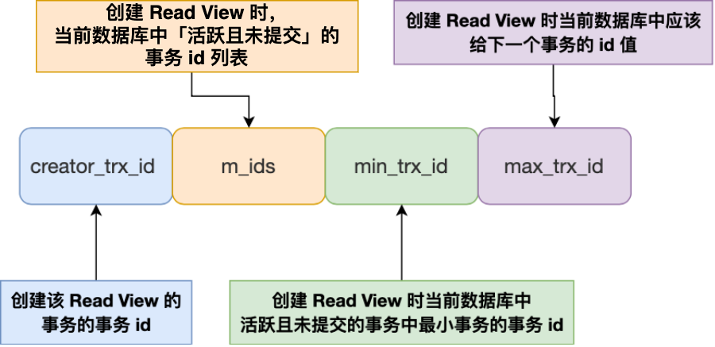

- m_ids ：指的是在创建 Read View 时，当前数据库中「活跃事务」的**事务 id 列表**，注意是一个列表，**“活跃事务”指的就是，启动了但还没提交的事务**。
- min_trx_id ：指的是在创建 Read View 时，当前数据库中「活跃事务」中事务 **id 最小的事务**，也就是 m_ids 的最小值。
- max_trx_id ：这个并不是 m_ids 的最大值，而是**创建 Read View 时当前数据库中应该给下一个事务的 id 值**，也就是全局事务中最大的事务 id 值 + 1；
- creator_trx_id ：指的是**创建该 Read View 的事务的事务 id**。


而对于使用 InnoDB 存储引擎的数据库表，它的聚簇索引记录中都包含下面两个隐藏列：

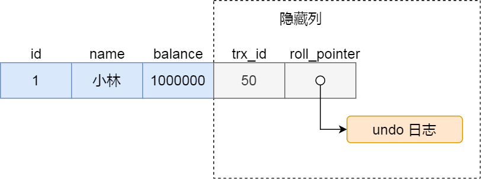

- trx_id，当一个事务对某条聚簇索引记录进行改动时，就会**把该事务的事务 id 记录在 trx_id 隐藏列里**；
- roll_pointer，每次对某条聚簇索引记录进行改动时，都会把旧版本的记录写入到 undo 日志中，然后**这个隐藏列是个指针，指向每一个旧版本记录**，于是就可以通过它找到修改前的记录。

在创建 Read View 后，我们可以将记录中的 trx_id 划分这三种情况：

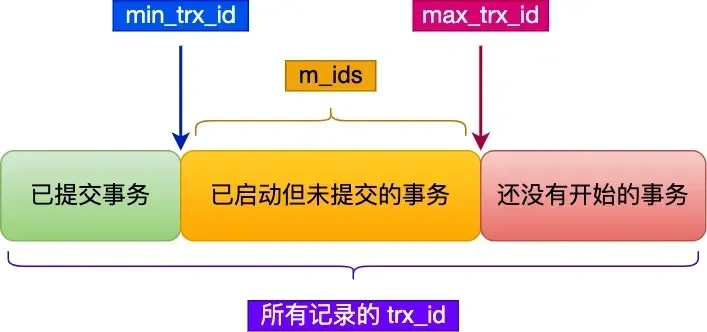


##### 2. Read View使用具体流程

一个事务去访问记录的时候，除了自己的更新记录总是可见之外，还有这几种情况：

- 如果记录的 trx_id 值小于 Read View 中的 min_trx_id 值，**表示这个版本的记录是在创建 Read View 前已经提交的事务生成的**，所以该版本的记录对当前事务**可见**。
- 如果记录的 trx_id 值大于等于 Read View 中的 max_trx_id 值，**表示这个版本的记录是在创建 Read View 后才启动的事务生成的**，所以该版本的记录对当前事务**不可见**。
- 如果记录的 trx_id 值在 Read View 的 min_trx_id 和 max_trx_id 之间，需要**判断 trx_id 是否在 m_ids 列表中**：
- 如果记录的 trx_id **在** m_ids 列表中，表示生成该版本记录的活跃事务依然活跃着（还没提交事务），所以该版本的记录对当前事务**不可见**。
- 如果记录的 trx_id **不在** m_ids列表中，表示生成该版本记录的活跃事务已经被提交，所以该版本的记录对当前事务**可见**。

**这种通过「版本链」来控制并发事务访问同一个记录时的行为就叫 MVCC（多版本并发控制）。**


#### 可重复读隔离级别下，A事务提交后的数据，在B事务能看见吗？

可重复读隔离级是由 MVCC（多版本并发控制）实现的。

实现的方式是事物在执行第一个查询语句后，会创建一个 Read View（读视图），**B后续的查询语句利用这个 Read View来查询没，A事物提交改变的记录都会记录trx_id而在B事务Read View中属于m_ids 列表，对B事务是不可见的，所以事务过程中每次查询的数据都是一样的**，即使中途有其他事务插入了新纪录，是查询不出来这条数据的。


#### 举个例子说MVCC的机制为什么无法避免幻读问题

通过MVCC实现的可重复读还是没有能完全解决幻读。以下表作为例子：

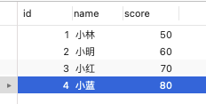

事务 A 执行查询 id = 5 的记录，此时表中是没有该记录的，所以查询不出来。

```sql
# 事务 A
mysql> begin;
Query OK, 0 rows affected (0.00 sec)

mysql> select * from t_stu where id = 5;
Empty set (0.01 sec)
```

然后事务 B 插入一条 id = 5 的记录，并且提交了事务。

```sql
# 事务 B
mysql> begin;
Query OK, 0 rows affected (0.00 sec)

mysql> insert into t_stu values(5, '小美', 18);
Query OK, 1 row affected (0.00 sec)

mysql> commit;
Query OK, 0 rows affected (0.00 sec)
```

此时假设一个极端场景，

**事务 A 更新 id = 5 这条记录（事务 A 看不到 id = 5 这条记录，但是他去更新了这条记录）**

**然后再次查询 id = 5 的记录，事务 A 就能看到事务 B 插入的纪录了。**

**可重复读级别的幻读就是发生在这种极端场景**。

```sql
# 事务 A
mysql> update t_stu set name = '小林coding' where id = 5;
Query OK, 1 row affected (0.01 sec)
Rows matched: 1  Changed: 1  Warnings: 0

mysql> select * from t_stu where id = 5;
+----+--------------+------+
| id | name         | age  |
+----+--------------+------+
|  5 | 小林coding   |   18 |
+----+--------------+------+
1 row in set (0.00 sec)
```

从MVCC角度理解如下：

1. 事务 A 第一次执行普通的 select 语句时生成了一个 ReadView
2. 事务 B 向表中新插入了一条 id = 5 的记录并提交，该新记录的 trx_id 隐藏列的值是事务 B，且在事物A的ReadView的m_ids 列表中，所以对事物A不可见。
3. 事务 A 对 id = 5 这条记录进行了更新操作，此时这条新记录的 trx_id 隐藏列的值就变成了事务 A 的事务 id，之后事务 A 再使用普通 select 语句去查询这条记录时就可以看到这条记录了，于是就发生了幻读。

因为这种特殊现象的存在，所以我们认为 **MySQL Innodb 中的 MVCC 并不能完全避免幻读现象**。


#### MVCC的机制无法解决当前读情况下的幻读，怎么办？*

**尽量在开启事务之后，马上执行 select ... for update 这类锁定读的语句**，因为它会对记录在存储引擎层次加 Next-Key Lock锁，从而避免其他事务插入一条新记录，就避免了幻读的问题。


**Q：Next-Key Lock是什么？**

A：**Next-Key Lock** 是 MySQL InnoDB 存储引擎中用来实现高隔离级别（如 **可重复读（Repeatable Read）** 和 **串行化（Serializable）**）的一种锁定机制。

**Next-Key Lock = Record Lock + Gap Lock**

- **Record Lock（记录锁）**：锁定的是具体的行记录。
- **Gap Lock（间隙锁）**：锁定的是两条记录之间的“间隙”（不包括记录本身）。

所以**Next-Key Lock** 锁定的范围是“某条记录 + 它前面的间隙”（即某个区间，且是左开右闭区间），即从上一条记录的末尾到当前记录的开头。其他事务不仅无法修改被锁定的数据也无法在这个范围内插入新数据。

举个例子了来说，设table1表中有记录 1,4,7,10。执行以下语句

```sql
SELECT * FROM table1 WHERE id > 4 FOR UPDATE;
```

会产生 Next-Key Lock，-- (4,7]、-- (7,10]-- (10,supremum]。而supremum是无穷大值

再比如那个例子，

```java
SELECT * FROM t_stu WHERE id = 5 FOR UPDATE;
```

当id=5的记录不存在时，InnoDB会在id=5可能插入的位置(间隙)上加锁，会锁住(4,supremum]这个间隙。


#### 串行化隔离级别是通过什么实现的？

是通过行级锁来实现的，序列化隔离级别下，普通的 select 查询是会对记录加 S 型的 next-key 锁（共享锁），其他事务就没没办法对这些已经加锁的记录进行增删改操作了，从而避免了脏读、不可重复读和幻读现象。


#### 一条update是不是原子性的？为什么？

是原子性，主要通过锁 + undolog 日志保证原子性的。此外，在持久化场景下还需要 REDO LOG 的配合。

1. 当在执行 update 的时候，会加行级别锁（如果是索引列，获取 Next-Key Lock），保证了一个事务更新一条记录的时候，不会被其他事务干扰。

2. 事务执行过程修改前，会生成 undolog，如果事务执行失败，就可以通过 undolog 日志进行回滚。

3. 修改后会生成`REDO LOG` 负责在崩溃时重做操作，确保持久性。


一条update事务的执行过程为，Begin -> 加锁 -> 写Undo -> 修改数据 -> 写Redo -> 提交事务 -> 释放锁。


#### 滥用事务，或者一个事务里有特别多sql的弊端？*

MySQL事务特性即当前事务资源在事务提交之后才会释放的，比如存储资源、锁。

如果一个事务特别多 sql，那么会带来这些问题：

- 如果一个事务特别多 sql，锁定的数据太多，容易造成大量的死锁和锁超时。
- 如果没有执行成功，那么就会回归，回滚记录不仅会占用大量存储空间，而且事务回滚时间长。在MySQL 中，实际上每条记录在更新的时候都会同时记录一条回滚操作，所以sql 越多，所需要保存的回滚数据就越多。
- 执行时间过长会延迟事务写入 Binlog，进一步导致主从复制延迟，并影响从库的数据一致性。
- 长时间占用数据库连接资源，降低系统的整体并发性能。


### 锁

#### 讲一下mysql里有哪些锁？*

在 MySQL 里，根据加锁的范围，可以分为**全局锁、表级锁和行锁**三类。

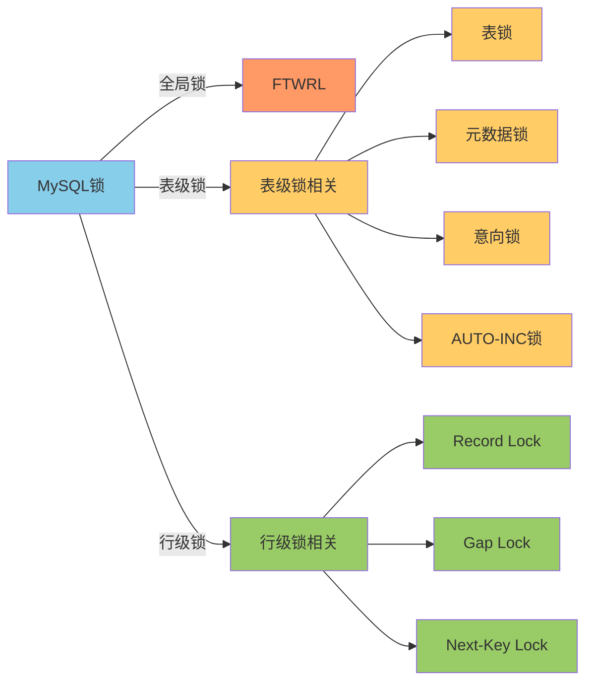
```mermaid
graph LR
    A["MySQL锁"] -->|全局锁| B["FTWRL"]
    A -->|表级锁| C["表级锁相关"]
    A -->|行级锁| D["行级锁相关"]
    
    C --> C1["表锁"]
    C --> C2["元数据锁"]
    C --> C3["意向锁"]
    C --> C4["AUTO-INC锁"]
    
    D --> D1["Record Lock"]
    D --> D2["Gap Lock"]
    D --> D3["Next-Key Lock"]

    style A fill:#87CEEB
    style B fill:#FF9966
    style C fill:#FFCC66
    style D fill:#99CC66
    style C1 fill:#FFCC66
    style C2 fill:#FFCC66
    style C3 fill:#FFCC66
    style C4 fill:#FFCC66
    style D1 fill:#99CC66
    style D2 fill:#99CC66
    style D3 fill:#99CC66
```

##### 1. **全局锁**

通过`flush tables with read lock` 语句会将整个数据库就处于只读状态了。

若此时其他线程执行增删改或者表结构修改都会阻塞。

全局锁主要应用于做**全库逻辑备份**，这样在备份数据库期间，不会因为数据或表结构的更新，而出现备份文件的数据与预期的不一样。


##### 2. **表级锁**

MySQL 里面表级别的锁有表锁、元数据锁和意向锁。

**通过lock tables 语句可以对表加表锁**，表锁除了会限制别的线程的读写外，也会限制本线程接下来的读写操作（加了共享型的也就是表读锁，只能读不能写，加了排他型的表写锁，既可以读又可以写）。

**当对数据库进行修改会对这个表加上 MDL元数据锁**，类似于读写锁，对一张表进行 CRUD 操作时，加的是 **MDL 读锁**；对一张表做结构变更操作的时候，加的是 **MDL 写锁**；MDL 是为了保证当用户对表执行 CRUD 操作时，防止其他线程对这个表结构做了变更。

**当执行插入、更新、删除操作，需要先对表加上「意向独占锁」**，然后对该记录加独占锁。**意向锁的目的是为了快速判断表里是否有记录被加锁**。


##### 3. **行级锁**

InnoDB 引擎是支持行级锁的，而 MyISAM 引擎并不支持行级锁。InnoDB 引擎支持行级锁有

- 记录锁（Record Lock），锁住的是一条记录。而且记录锁是有 S 锁和 X 锁之分的，满足读写互斥，写写互斥
- 间隙锁（Gap Lock），只存在于可重复读隔离级别，目的是为了解决可重复读隔离级别下幻读的现象。
- Next-Key Lock 称为临键锁，是 Record Lock + Gap Lock 的组合，锁定一个范围，并且锁定记录本身。


**Q：意向锁的作用是什么？**

A：意向锁是为了解决当一个事务要对某行加行级锁（共享锁或排他锁）时，能快速告知其他事务“我打算对这张表的某些行加锁”，从而使得当其他事务想要对整张表加锁时，可以先检查意向锁，避免不必要的冲突检测。分为两种，

- **意向共享锁（IS）**。表示事务打算对表中某些行加共享锁。
- **意向排他锁（IX）**，表示事务打算对表中某些行加排他锁（独占锁）。


**Q：是不是数据库的所有锁都分为读锁和写锁？**

大多数数据库锁（包括 MySQL）可以归类为 **读锁（共享锁，S锁）** 和 **写锁（排他锁，X锁）**。

但是比如说**Gap Lock（间隙锁）**是为了锁住索引间的空隙范围，防止写入，根本不存在读锁。

而全局锁`flush tables with read lock` 也不存在写锁对应除此之外，上面说的所有锁都有读锁和写锁两个版本。


#### 数据库的表锁和行锁有什么作用？

MySQL数据库有三种锁，全局锁、表级锁和行级锁。其中全局锁主要应用于做**全库逻辑备份**，这样在备份数据库期间，不会因为数据或表结构的更新，而出现备份文件的数据与预期的不一样。

而表锁和行锁的作用比较复杂，分开来讲：

##### 1. 表锁的作用

表锁可以用来控制整个表的并发访问来**达到整体控制的目的**，当一个事务获取了表锁时，其他事务无法对该表进行任何读写操作，从而确保数据的完整性和一致性。

但注意**表锁的粒度比较大**，在锁定表的情况下，可能会影响到整个表的其他操作，可能会引起锁竞争和性能问题。

所以表锁**适用于大批量操作**：表锁适合于需要大批量操作表中数据的场景，例如表的重建、大量数据的加载等。


注：MyISAM引擎只支持表锁，此外DDL（修改数据库结构操作）也会自动加表锁。


##### 2. 行锁的作用

**行锁可以精确控制对表中某行数据的访问相较于表锁是一种细粒度的控制**，使得其他事务可以同时访问表中的其他行数据，在并发量大的系统中能够提高并发性能。

因此行锁不会像表锁那样造成整个表的锁冲突，减少了锁竞争的可能性，提高了高并发环境下的效率。

所以行锁适合于需要频繁对表中单独行进行操作的场景，例如订单系统中的订单修改、删除等操作。


注：行锁还分为共享锁(S锁)和排他锁(X锁)，行锁可能会发生死锁问题，需要特别注意。


#### MySQL两个线程的update语句同时处理一条数据，会不会有阻塞？

使用update语句会对记录加Next-Key Lock 锁，所以第二个事务执行update语句时会被锁住陷入阻塞状态，只有等第1个事务执行完之后才能执行。


#### 两条update语句处理一张表的不同的主键范围的记录，一个<10，一个>15，会不会遇到阻塞？底层是为什么的？

两条 `UPDATE` 语句操作同一张表的不同主键范围（`id < 10` 和 `id > 15`），**通常不会发生阻塞**，因为它们的锁定范围（由 **Next-Key Lock** 决定，一般来说左开右闭）不重叠。

- 第一条 `UPDATE` 语句（`id < 10`）锁定的范围是 `(-∞, 10]`，包括记录行和间隙。
- 第二条 `UPDATE` 语句（`id > 15`）锁定的范围是 `(15, +∞]`，包括记录行和间隙。

所以两个范围完全不相交，因此不会有锁冲突，也不会发生阻塞。


#### 如果上述update语句WHERE后的字段范围不是主键或索引？还会阻塞吗？

如果2个范围查询的字段不是索引的话，那就代表 update 没有用到索引，这时候触发了全表扫描，全部索引都会加行级锁，这时候第二条 update 执行的时候，就会阻塞了。

因为如果 update 没有用到索引，在扫描过程中会对索引加锁，所以全表扫描的场景下，所有记录都会被加锁相当于锁住了全表。


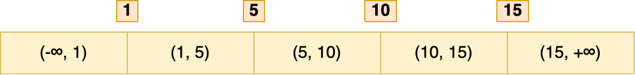


**Q：InnoDB的行锁原来是是基于索引的吗？**

A：是的，InnoDB 的行级锁是基于索引实现的，InnoDB 通过索引来定位行，从而对特定的行加锁。

* **基于主键或唯一索引的锁定**：

```sql
-- 假设id是主键
UPDATE users SET name = 'Tom' WHERE id = 1;
```

这种情况下，InnoDB 可以精确定位到具体的行，只锁定 id=1 这一行。

* **基于普通索引的锁定**：

```sql
-- 假设age有普通索引
UPDATE users SET name = 'Tom' WHERE age = 20;
```

InnoDB 会锁定所有 age=20 的行，以及索引间隙（防止幻读）。

* **没有使用任何索引的情况**：

```sql
-- 假设hobby没有索引
UPDATE users SET name = 'Tom' WHERE hobby = 'reading';
```

由于找不到索引，MySQL 必须扫描整个表，同时会锁定扫描到的所有记录，所以实际上变成了全表锁定，其他事务对该表的更新都会被阻塞。

所以在实际开发中，要尽量在 WHERE 条件中使用索引字段、避免使用无索引字段作为查询条件，必要时为常用查询条件建立合适的索引。


#### 讲讲MySQL的乐观锁？（美团莫名其妙的问题，把我问懵了）

很不幸的告诉你，MySQL没有直接提供乐观锁语法，但可以通过应用层实现

常见实现方式：

- 版本号机制：在表中添加version字段，每次更新增加版本号
- 时间戳：使用timestamp字段检测并发修改
- 条件更新：基于数据原值的条件更新（如WHERE price = 原价格）


#### MySQL的死锁解决？

准确的来说是InnoDB会定期运行一个后台线程来检测死锁，通过构建等待图（至于操作系统资源分配图）来寻找循环依赖，当事务试图获取锁但需要等待时，也会触发死锁检测。

然后InnoDB基于"事务权重"做决定终止一个事务，主要考虑以下因素:

- 已修改的行数(undo log量)：回滚代价较小的事务优先被选择
- 事务运行时间：通常会牺牲较新的事务
- 事务的优先级(如果有设置)


### 日志

#### 日志文件是分成了哪几种？*

##### 1. redo log 重做日志*

重做日志是 Innodb 存储引擎层生成的日志，实现了事务中的**持久性**，主要**用于掉电等故障恢复**；

重做日志采用WAL（Write-Ahead Logging）机制，数据修改时，先写入redo log buffer，随后通过fsync（一种系统调用用来刷盘）写入磁盘，所以当发生故障时，可通过redo log恢复数据。

重做日志由**InnoDB引擎**实现，且是物理日志，记录页面修改的物理操作，特点在于循环写入，空间固定。


##### 2. undo log 回滚日志

回滚日志是 Innodb 存储引擎层生成的日志，实现了事务中的**原子性**，主要**用于事务回滚和 MVCC**。

回滚日志记录数据修改前的状态，也就是存储了旧版本数据，支持事务回滚到某个特定版本。


##### 3. bin log 二进制日志*

二进制日志是 SQL 层生成的日志，主要**用于数据备份和主从复制**；

二进制日志记录格式有三种模式

* **STATEMENT：**记录SQL语句
* **ROW：**记录行数据变化和MIXED
* **混合模式：**自动选择

二进制日志由Server层实现，所以是所有存储引擎共用的，且是逻辑日志，记录数据库的逻辑变化，特点在于追加写入，永不覆盖。


##### 4. 其他日志

relay log 中继日志，用于主从复制场景下，slave（从服务器）通过io线程拷贝master（主服务器）的bin log后本地生成的日志

Slow Query Log 慢查询日志，用于记录执行时间过长的sql，需要设置超时阈值后手动开启

| **日志类型**       | **作用**                                   | **生成层**      | **特点**                                                     | **记录内容**           | **写入方式**         |
| ------------------ | ------------------------------------------ | --------------- | ------------------------------------------------------------ | ---------------------- | -------------------- |
| **Redo Log**       | 事务持久性，故障恢复                       | InnoDB 存储引擎 | 物理日志，记录页面的物理变更，空间固定，循环写入，遵循 WAL 机制 | 页级别的物理修改记录   | 循环写入，固定大小   |
| **Undo Log**       | 事务原子性，事务回滚，支持 MVCC            | InnoDB 存储引擎 | 逻辑日志，记录数据修改前的状态，用于生成旧版本数据           | 数据修改前的旧版本     | 随事务动态生成       |
| **Bin Log**        | 数据备份、主从复制                         | MySQL Server 层 | 逻辑日志，记录 SQL 或行数据的逻辑变化，追加写入，永不覆盖    | SQL 语句或行数据变化   | 追加写入，永不覆盖   |
| **Relay Log**      | 主从复制中，从库存储主库 binlog 的中间日志 | MySQL Server 层 | 主从复制专用，从库通过 I/O 线程从主库读取 binlog 后生成      | 主库 binlog 的本地副本 | 追加写入，随同步生成 |
| **Slow Query Log** | 记录执行时间超过阈值的 SQL，用于性能优化   | MySQL Server 层 | 慢查询日志，需手动开启，通过 `long_query_time` 设置时间阈值  | 超过阈值的慢查询 SQL   | 按配置记录           |


#### 讲一下binlog

binlog 是 MySQL 的 Server 层实现的日志，所有存储引擎都可以使用。

在MySQL 运行过程中在完成一条更新操作后，Server 层还会生成一条 binlog，等之后事务提交的时候，会将该事物执行过程中产生的所有 binlog 统一写入 binlog 文件。

binlog 是追加写的模式，写满一个文件，不会覆盖以前的日志，而是创建一个新的文件继续写，保存的是全量的日志，用于备份恢复、主从复制。

binlog 文件是记录了所有数据库表结构变更和表数据修改的日志，不会记录查询类的操作，比如 SELECT 和 SHOW 操作。

binlog 有 3 种格式类型，分别是 STATEMENT（默认格式）、ROW、 MIXED，区别如下：

- **STATEMENT：**每一条修改数据的 SQL 都会被记录到 binlog 中（相当于记录了逻辑操作，所以针对这种格式， binlog 可以称为逻辑日志），主从复制中 slave 端再根据 SQL 语句重现。但 STATEMENT 有动态函数的问题，用如 uuid 或 now 这类函数，在主库上执行与在从库执行会导致数据不一致；
- **ROW：**记录行数据最终被修改成什么样了（使用这种格式的日志，就不能称binlog为逻辑日志了），不会出现 STATEMENT 下动态函数的问题。但 ROW 的缺点是每行数据的变化结果都会被记录，比如执行批量 update 语句，更新多少行数据就会产生多少条记录，使 binlog 文件过大，而在 STATEMENT 格式下只会记录一个 update 语句而已；
- **MIXED：**包含了 STATEMENT 和 ROW 模式，它会根据不同的情况自动使用 ROW 模式和 STATEMENT 模式；

| **格式**      | **记录内容**                                     | **优点**                                               | **缺点**                                                     | **适用场景**                                   |
| ------------- | ------------------------------------------------ | ------------------------------------------------------ | ------------------------------------------------------------ | ---------------------------------------------- |
| **STATEMENT** | 每条修改数据的 SQL 语句                          | - 占用空间小 - Binlog 文件生成速度较快                 | - 动态函数（如 `UUID()`、`NOW()`）导致主从不一致 - 非确定性操作无法重现 | 多数情况下适用（如无动态函数或复杂操作）       |
| **ROW**       | 每行数据修改后的结果                             | - 不依赖 SQL 语句，可完全重现数据变更 - 无动态函数问题 | - 占用空间大，批量操作会记录大量行数据 - Binlog 文件生成速度较慢 | 数据同步要求高、对动态函数敏感的场景           |
| **MIXED**     | 根据具体操作在 **STATEMENT** 和 **ROW** 之间切换 | - 结合两者优点，自动适配最优格式                       | - 逻辑更复杂，无法完全避免极少数特殊场景导致主从不一致 - 日志大小和生成速度介于两者之间 | 动态场景下推荐，适用于需要灵活性的复杂应用场景 |


以上遵循mysql5.7版本，默认的样式格式是**STATEMENT**，然后mysql8.0默认就是推荐**ROW**来作为默认的选择，因为他对**ROW**进行了压缩，降低了主从同步的时延，然后更适合一致性的场景。


#### UndoLog日志的作用是什么？

undo log 是一种用于撤销回退的日志，**它保证了事务的 ACID 特性中的原子性**（Atomicity）。

Undo Log的主要作用有**事务回滚和MVCC实现**。

##### 1. 事务回滚

在事务没提交之前，MySQL 会先记录更新前的数据到 undo log 日志文件里面，当事务回滚时，可以利用 undo log 来进行回滚。如下图：

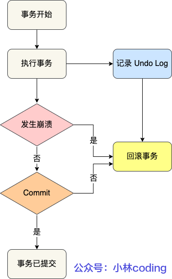

每当 InnoDB 引擎对一条记录进行操作（修改、删除、新增）时，要把回滚时需要的信息都记录到 undo log 里，回滚具体来说：

- 在**插入**一条记录时，要把这条记录的主键值记下来，**回滚时只需删除主键值对应的记录。**
- 在**删除**一条记录时，要把这条记录中的内容都记下来，**回滚时再把由这些内容组成的记录重新插入到表中；**
- 在**更新**一条记录时，要把被更新的列的旧值记下来，**回滚时把这些改变的列更新为旧值。**


##### 2. MVCC实现

Undo Log 在 **MVCC（多版本并发控制）** 中扮演了关键角色，是实现事务隔离级别的核心机制。

它通过保存旧版本数据，确保快照读（Snapshot Read）的实现。当事务修改数据时，InnoDB 会将被修改数据的旧版本记录到 Undo Log 中，而新的数据版本会存储在数据页中，并通过指针连接到 Undo Log，从而形成一个版本链。

在快照读时，事务根据自身的事务 ID，顺着版本链找到匹配的历史版本，从而实现一致性读取。这样就避免了读写冲突，提高了并发性能。

事务隔离级别（如读已提交和可重复读）通过快照机制依赖 Undo Log 构建不同的一致性视图，而旧版本数据的清理由后台线程负责，保证资源高效利用。

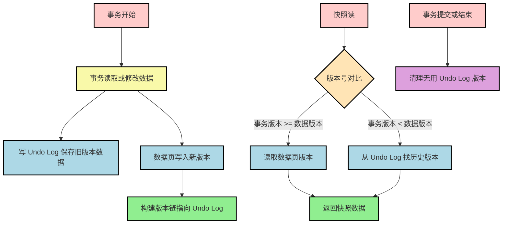
```mermaid
graph TD
    style A fill:#ffcccb,stroke:#000,stroke-width:2px
    style B fill:#f9f9a9,stroke:#000,stroke-width:2px
    style C fill:#add8e6,stroke:#000,stroke-width:2px
    style D fill:#add8e6,stroke:#000,stroke-width:2px
    style E fill:#90ee90,stroke:#000,stroke-width:2px
    style F fill:#ffcccb,stroke:#000,stroke-width:2px
    style G fill:#ffe4b5,stroke:#000,stroke-width:2px
    style H fill:#add8e6,stroke:#000,stroke-width:2px
    style I fill:#add8e6,stroke:#000,stroke-width:2px
    style J fill:#90ee90,stroke:#000,stroke-width:2px
    style K fill:#ffcccb,stroke:#000,stroke-width:2px
    style L fill:#dda0dd,stroke:#000,stroke-width:2px

    A[事务开始] --> B[事务读取或修改数据]
    B --> C[写 Undo Log 保存旧版本数据]
    B --> D[数据页写入新版本]
    D --> E[构建版本链指向 Undo Log]
    F[快照读] --> G{版本号对比}
    G -->|事务版本 >= 数据版本| H[读取数据页版本]
    G -->|事务版本 < 数据版本| I[从 Undo Log 找历史版本]
    H --> J[返回快照数据]
    I --> J
    K[事务提交或结束] --> L[清理无用 Undo Log 版本]
```


**Q：快照读是什么？和Read View有什么关系？**

A：**快照读（Snapshot Read）** 就是通过 **Read View** 提供的一致性读取机制。

**快照读** 是一种基于事务的历史视图读取方式，读取的不是数据的当前最新值，而是该事务**所能看到的版本数据**。

具体来说在执行查询时，InnoDB 会生成一个 **Read View**，而**Read View** 视图定义了**当前事务快照读**能看到的哪些版本数据。

快照读适用于非锁定的 SELECT 语句，它不会对记录加锁，是一种高性能的读操作，例如：

```sql
SELECT * FROM table WHERE ...;
```


与**快照读 相对应的有 当前读：**即直接读取最新版本数据，并对读取的行加锁。例如：

```sql
SELECT * FROM table WHERE ... FOR UPDATE;
SELECT * FROM table WHERE ... LOCK IN SHARE MODE;
```


#### 有了undolog为啥还需要redolog呢？请讲解一下redolog的工作方式和特性。

redo log 和 undo log 这两种日志是属于 InnoDB 存储引擎的日志，它们的区别在于：

- redo log 记录了此次事务「**完成后**」的数据状态，记录的是更新**之后**的值；
- undo log 记录了此次事务「**开始前**」的数据状态，记录的是更新**之前**的值；

事务提交之前发生了崩溃，重启后会通过 undo log 回滚事务，事务提交之后发生了崩溃，重启后会通过 redo log 恢复事务。


##### 1. redo log保证了持久性。

**undo log** 能保证事务的原子性， **redo log** 则通过 **WAL（Write-Ahead Logging）** 技术，确保数据的持久性，能够保证即使发生系统崩溃，已提交的事务依然不会丢失。

**WAL 技术是redo log的核心也是工作方式，指的是MySQL 的写操作内存数据页并不是立刻持久化到磁盘上，而是先写日志文件，然后在合适的时间异步的写到磁盘上**。过程如下图：

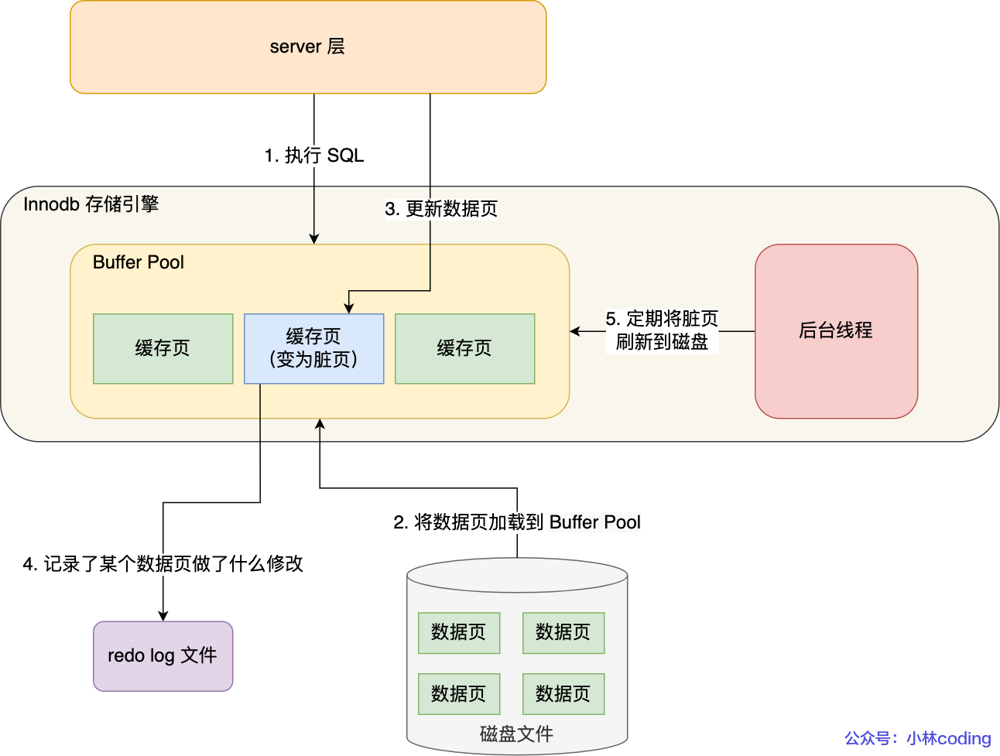

redo log 主要记录了某个数据页做了什么修改，比如**对 XXX 表空间中的 YYY 数据页 ZZZ 偏移量的地方做了AAA 更新**，所以每当执行一个事务就会产生一条或者多条物理日志。

所以在事务提交时，只要先将 redo log 持久化到磁盘即可，可以不需要等到将缓存在 Buffer Pool 里的脏页数据持久化到磁盘。所以当系统崩溃时，虽然脏页数据没有持久化，但是 redo log 已经持久化，随后 MySQL 重启，可以根据 redo log 的内容，将所有数据恢复到最新的状态。


##### 2. redo log 提高写入性能（从“随机写”到“顺序写”）

所以有了 redo log，再通过 WAL 技术，InnoDB 就可以保证即使数据库发生异常重启，之前已提交的记录都不会丢失，这个能力称为 **crash-safe**（崩溃恢复）。可以看出来， **redo log 保证了事务四大特性中的持久性**。

且写入 redo log 的方式使用了追加操作， 所以磁盘操作是**顺序写**，而写入内存脏页需要先找到写入位置，然后才写到磁盘，所以磁盘操作是**随机写**。

磁盘的「顺序写 」比「随机写」 高效的多，因此 redo log 写入磁盘的开销更小。针对「顺序写」为什么比「随机写」更快这个问题，可以比喻为你有一个本子，按照顺序一页一页写肯定比写一个字都要找到对应页写快得多。

可以说这是 WAL 技术的另外一个优点：**MySQL 的写操作从磁盘的「随机写」变成了「顺序写」**，提升语句的执行性能。


#### redo log怎么保证持久性的？

Redo log通过以下方式来保证持久性，

Write-ahead logging（WAL）即在在事务提交之前，将事务所做的修改操作记录到redo log中，然后再异步地将数据写入磁盘。这样即使在数据写入磁盘之前发生了宕机，系统可以通过redo log中的记录来恢复数据。

且redo log采用追加写入的方式，将redo日志记录追加到文件末尾，而不是随机写入。这样可以减少磁盘的随机I/O操作，提高写入性能。

最终MySQL会定期将内存中的数据刷新到磁盘，同时将**最新的LSN（Log Sequence Number）记录到磁盘中**，在恢复数据时，系统会根据LSN来确定从哪个位置开始应用redo log。


**Q：LSN（Log Sequence Number）是什么？**

A：每个事务的修改同时每次写入 redo log 时，都会为该操作生成一个唯一的 **LSN**。LSN 是一个递增的数值，表示日志的顺序。 MySQL 通过**LSN**就能跟踪日志记录的顺序。

MySQL 会在刷新内存数据到磁盘时，将当前的 **LSN** 同时写到磁盘上。这使得当系统重启后，可以通过检查 **LSN** 来查看从哪里执行redo log来恢复数据。

可以把LSN理解为给每个操作打上的时间戳，通过这个时间戳，MySQL就能准确地知道哪些操作需要重做，哪些操作已经安全地保存到了磁盘中。


#### 能不能只用binlog不用relo log？

不行，binlog是 server 层的逻辑日志，没办法记录哪些脏页还没有刷盘，redolog 是存储引擎层的物理日志，可以记录哪些脏页还没有刷盘，这样崩溃恢复的时候，就能恢复那些还没有被刷盘的脏页数据。


#### binlog 两阶段提交过程是怎么样的？

在 MySQL 的 InnoDB 存储引擎中，开启 binlog 的情况下，MySQL 会同时维护SQL层的逻辑日志 binlog 与 InnoDB存储引擎层 的物理日志 redo log，为了保证这两个日志的一致性，MySQL 使用了**内部 XA 事务**，内部 XA 事务由 binlog 作为协调者，存储引擎是参与者。

当客户端执行 commit 语句或者在自动提交的情况下，MySQL 内部开启一个 XA 事务，**分两阶段来完成 XA 事务的提交**，如下图：

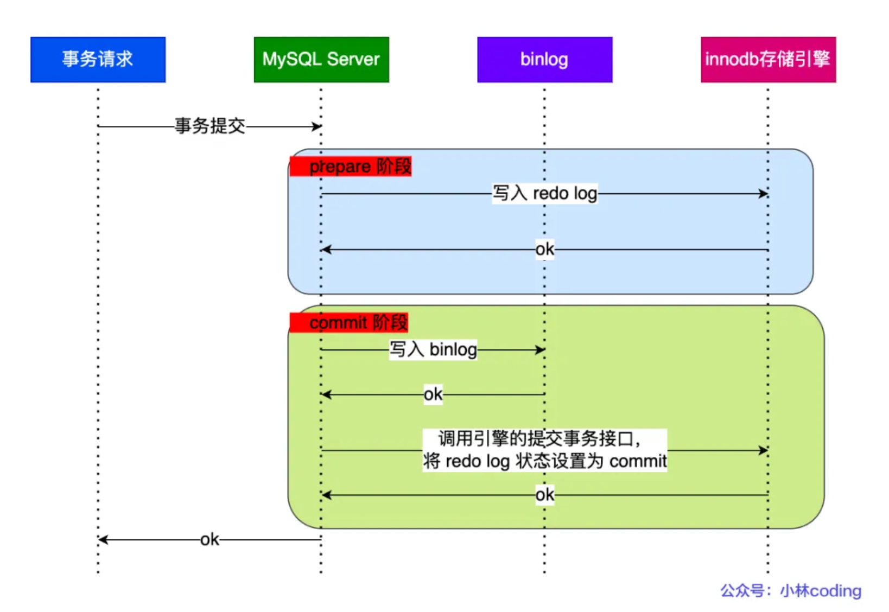

事务的提交过程有两个阶段，就是**将 redo log 的写入拆成了两个步骤：prepare 和 commit，中间再穿插写入binlog**，具体如下：

- **prepare 阶段**：将 XID（内部 XA 事务的 ID） 写入到 redo log，同时将 redo log 对应的事务状态设置为 prepare，然后将 redo log 持久化到磁盘；
- **commit 阶段**：把 XID 写入到 binlog，然后将 binlog 持久化到磁盘，接着调用引擎的提交事务接口将 redo log 状态设置为 commit，**此时该状态并不需要持久化到磁盘，只需要 write 到文件系统的 page cache 中就够了**，因为只要 binlog 写磁盘成功，一致性已完成被认为事务已经执行成功；

**两阶段提交是以 binlog 写成功为事务提交成功的标识**，因为 binlog 写成功了，就意味着能在 binlog 中查找到与 redo log 相同的 XID。


**Q：MySQL在不同情况崩溃，会有什么反应？**

A：两阶段提交的不同时刻，下图中有时刻 A（redo log已经持久化且为prepare 状态，bin log没持久化）和时刻 B（redo log已经持久化prepare 状态，bin log也已经持久化）都有可能发生崩溃：

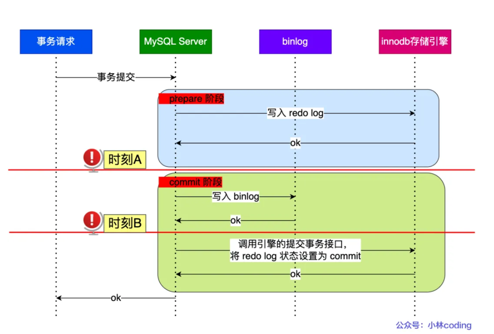

不管是时刻 A还是时刻 B 崩溃，**此时的 redo log 都处于 prepare 状态**。

在 MySQL 重启后会按顺序扫描 redo log 文件，碰到处于 prepare 状态的 redo log，就拿着 prepare 状态的redo log 中的 XID 去 binlog 查看是否存在此 XID：

- **如果 binlog 中没有当前内部 XA 事务的 XID，说明 redolog 完成刷盘，但是 binlog 还没有刷盘，则回滚事务**。对应时刻 A 崩溃恢复的情况。
- **如果 binlog 中有当前内部 XA 事务的 XID，说明 redolog 和 binlog 都已经完成了刷盘，则提交事务**。对应时刻 B 崩溃恢复的情况。

**对于处于 prepare 阶段的 redo log，即可以提交事务，也可以回滚事务，这取决于是否能在 binlog 中查找到与 redo log 相同的 XID。**


**Q：内部XA 事务是什么？有外部XA事务吗？**

A：**内部 XA 事务** 这是 MySQL 内部实现机制，用于协调 binlog 和 InnoDB 存储引擎的 redo log 之间的一致性。**内部 XA 事务**协调者是 binlog，参与者是存储引擎（如 InnoDB）。**内部 XA 事务**的目的是确保 binlog 和 redo log 的一致性，对用户透明，是 MySQL 内部的实现细节。

**外部 XA 事务** 这是一个分布式事务协议，用于跨多个异构系统的事务处理，他可以涉及多个不同的数据库系统（如 MySQL、Oracle、PostgreSQL 等），甚至也可以包括消息队列等其他资源。**外部 XA 事务**事务协调者是外部的，需要有由应用程序显式地使用 XA 命令来控制。

| 对比维度 | 内部 XA 事务           | 外部 XA 事务                     |
| -------- | ---------------------- | -------------------------------- |
| 作用范围 | MySQL 内部组件间的协调 | 跨系统的分布式事务协调           |
| 使用方式 | 自动进行，对用户透明   | 需要显式使用 XA 命令             |
| 参与方   | binlog 和存储引擎      | 可以是多个异构的数据库或其他资源 |
| 性能影响 | 性能开销相对较小       | 由于涉及多个系统，性能开销较大   |

外部 XA 事务在实际应用中使用较少，主要是因为外部 XA 事务性能开销大

而现代分布式系统更倾向于使用补偿事务等最终一致性方案，即先完成主要业务操作，如果出错，执行补偿操作来，撤销/修正之前的操作来最终达到数据一致。

如订单支付流程中，如果扣款失败可以补偿：恢复库存或补偿：取消订单。


#### update语句的具体执行过程是怎样的？*

以下面UPDATE更新语句为例：

```sql
UPDATE t_user SET name = 'xiaolin' WHERE id = 1; 
```

1. **SQL 层执行器** 负责具体执行，会调用存储引擎的接口，通过 **主键索引树** 搜索获取 `id = 1` 这一行记录：
   - 如果 `id=1` 这一行所在的数据页 **已经在 Buffer Pool 中**，则直接返回该行数据给执行器；
   - 如果记录 **不在 Buffer Pool**，则将数据页从磁盘 **加载到 Buffer Pool**，然后返回该行数据给执行器。
2. **执行器获取数据后，检查是否需要更新**：
   - **如果更新前后的值相同**，则不执行后续更新流程，SQL 执行结束（MySQL 会自动优化掉无效更新）；
   - **如果数据有变化**，则执行器将 **更新前的记录** 和 **更新后的记录** 作为参数传给 InnoDB 存储引擎，开始执行更新操作。
3. **开启事务，记录 Undo Log（回滚日志）**：
   - InnoDB 先写入 **Undo Log**，以便事务回滚时能够恢复原值（Undo Log 主要用于 MVCC 和事务回滚）。
   - `Undo Log` 先写入 **Buffer Pool 的 Undo 页**，后续会持久化到磁盘的 **系统表空间（ibdata 文件）**。
4. **更新数据并记录 Redo Log（预写日志，WAL 技术）**：
   - InnoDB 在 **Buffer Pool（内存）** 中修改数据，并 **标记该数据页为脏页（Dirty Page）**；
   - 同时，InnoDB 记录 **Redo Log**，以支持崩溃恢复（Crash Recovery）；
   - **Redo Log 此时处于 prepare 状态**，尚未提交事务；
   - **WAL（Write-Ahead Logging）技术**：此时**仅写日志，不立即将数据写入磁盘**，脏页会由后台线程异步刷盘。
5. **一条记录更新完毕，但事务未提交**。
6. **记录 Binlog（归档日志）**：
   - SQL 语句执行完成后，MySQL 记录该 `UPDATE` 语句的 **Binlog（逻辑日志）**；
   - `Binlog` 先存入 **Binlog Cache**，等待事务提交时再刷入磁盘。
7. 事务提交（为了方便说明，这里不说组提交的过程，只说两阶段提交）：
   - **prepare 阶段**：将 redo log 对应的事务状态设置为 prepare，然后将 redo log 刷新到硬盘（`fsync` 操作，确保崩溃恢复时数据一致）；
   - **commit 阶段**：将 binlog 刷新到磁盘，接着调用引擎的提交事务接口（`fsync` 操作，确保 Binlog 持久化），将 redo log 状态设置为 commit（将事务设置为 commit 状态后，刷入到磁盘 redo log 文件）；


**Q：为什么需要组提交？**

A：每次事务提交都需要刷盘（fsync），这是一个很重的操作，如果每个事务都单独刷盘，性能会很差，组提交可以将多个事务的刷盘操作合并成一个，大大提升性能。

分三个阶段：

1. Flush 阶段，多个事务的 binlog 内存会被收集到一起，处于这个阶段的事务会等待其他事务凑成一组。
2. Sync 阶段将收集的一组事务的 binlog 刷盘（fsync），第一个事物成为组长，负责执行 fsync其他事务，而其他事务（followers）等待，这个阶段只需要一次刷盘操作，提高了效率。

3. Commit 阶段，同样采用组提交方式，一次刷多个事务的 redo log完成后修改事务状态为 committed


### 性能调优

#### mysql的explain有什么作用？

explain 是查看 sql 的执行计划，主要用来分析 sql 语句的执行过程，比如有没有走索引，有没有外部排序，有没有索引覆盖等等。


对于sql 的执行计划，重要参数有：

- `possible_keys` 字段表示可能用到的索引；
- `key` 字段表示实际用的索引，如果这一项为 NULL，说明没有使用索引；
- `key_len` 表示索引的长度；
- `rows` 表示扫描的数据行数。
- `type` 表示数据扫描类型，我们需要重点看这个。
- `Extra` 表示额外操作，这个也重点。

如下图，就是一个没有使用索引，并且是一个全表扫描的查询语句。

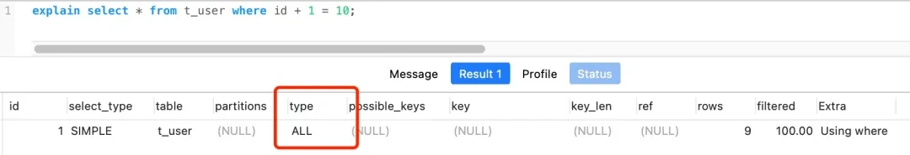


type 字段就是描述了找到所需数据时使用的扫描方式是什么，常见扫描类型的**执行效率从低到高的顺序为**：

- All（全表扫描）：all 是最坏的情况，因为采用了全表扫描的方式。
- index（全索引扫描）：index 和 all 差不多，只不过 index 对索引表进行全扫描，好处是不再需要对数据进行排序，但是开销依然很大。**所以，要尽量避免全表扫描和全索引扫描。**
- range（索引范围扫描）：range 表示采用了索引范围扫描，一般在 where 子句中使用 < 、>、in、between 等关键词，只检索给定范围的行，属于范围查找。**从这一级别开始，索引的作用会越来越明显，因此我们需要尽量让 SQL 查询可以使用到 range 这一级别及以上的 type 访问方式**。
- ref（非唯一索引扫描）：ref 类型表示采用了非唯一索引，或者是唯一索引的非唯一性前缀，返回数据返回可能是多条。这样即使使用索引快速查找到了第一条数据，但仍然不能停止，要进行目标值附近的小范围扫描。因为索引是有序的，即便有重复值，也是在一个非常小的范围内扫描。
- eq_ref（唯一索引扫描）：eq_ref 类型是使用主键或唯一索引时产生的访问方式，通常使用在多表联查中。（如对两张表进行联查，关联条件是两张表的 user_id 相等，且 user_id 是唯一索引，那么使用 EXPLAIN 进行执行计划查看的时候，type 就会显示 eq_ref）
- const（结果只有一条的主键或唯一索引扫描）：const 类型表示使用了主键或者唯一索引与常量值进行比较，比如 select name from product where id=1。虽然 const 类型和 eq_ref 都使用了主键或唯一索引，但这两个类型有所区别，**const 是与常量进行比较，查询效率会更快，而 eq_ref 通常用于多表联查中**。


extra 显示的结果也有性能的参考指标：

- Using filesort ：使用了文件排序， MySQL 无法通过索引完成ORDER BY排序时，就会使用额外的排序操作，要避免。优化方法：确保 `ORDER BY` 列在索引中，并尽量使用覆盖索引。
- Using temporary：使了用临时表保存中间结果，MySQL 在对查询结果排序或者分组时使用临时表，常见于分组查询 group by的列没有索引或排序 order by 和分组查询 group by的列不相同。效率低，要避免。优化方法：对常用分组/排序字段建立索引，若order by 和 group by的列不相同但是都有单独索引，可以考虑建立联合索引防止使用中间表，或者重构查询逻辑。
- Using index：使用了覆盖索引，所需数据只需在索引即可全部获得，效率不错。

- Using where，表示查询使用了索引过滤数据，但并未完全用索引覆盖，需要回表。优化方法：尽量改写查询逻辑，使用覆盖索引。


#### 给你张表，发现查询速度很慢，你有那些解决方案*

- **分析查询语句**：使用EXPLAIN命令分析SQL执行计划，找出慢查询的原因，比如是否使用了全表扫描，是否存在索引未被利用的情况等，并根据相应情况对索引进行适当修改。
- **创建或优化索引**：根据查询条件创建合适的索引，特别是经常用于WHERE子句的字段、Orderby 排序的字段、Join 连表查询的字典、 group by的字段，并且如果查询中经常涉及多个字段，考虑创建联合索引，使用联合索引要符合最左匹配原则，不然会索引失效
- **避免索引失效：**比如不要用左模糊匹配、函数计算、表达式计算等等。
- **查询优化**：避免使用SELECT *，只查询真正需要的列；使用覆盖索引，即索引包含所有查询的字段；联表查询最好要以小表驱动大表，并且被驱动表的字段要有索引，当然最好通过冗余字段的设计，避免联表查询。
- **分页优化：**针对 limit n,y 深分页的查询优化，可以把Limit查询转换成某个位置的查询：select * from tb_sku where id>20000 limit 10，该方案适用于主键自增的表，
- **分库分表**：如果单表的数据超过了千万级别，考虑是否需要将大表拆分为小表，减轻单个表的查询压力。也可以将字段多的表分解成多个表，有些字段使用频率高，有些低，数据量大时，会由于使用频率低的存在而变慢，可以考虑分开。
- **使用缓存技术**：引入缓存层，如Redis，存储热点数据和频繁查询的结果，但是要考虑缓存一致性的问题，对于读请求会选择旁路缓存策略，对于写请求会选择先更新 db，再删除缓存的策略，或者canal监听bin log。


**Q：分页优化具体是什么意思？**

A：使用 `LIMIT n, m` 时，MySQL 需要从第 0 条记录开始扫描 n + m 条数据，然后丢弃前 n 条，只返回后 m 条。显然效率很低。

而分页优化是指表有自增主键 `id`，可以将深分页的 `LIMIT` 查询改写为通过主键条件或索引过滤的形式。就是利用主键或索引的有序性，通过 `WHERE id > 某个值` 来定位查询起点，只扫描后续的行，加快查询速度。


#### 如果Explain用到的索引不正确的话，有什么办法干预吗？

可以使用 force index，强制走索引。

比如：

```css
EXPLAIN SELECT 
    productName, buyPrice
FROM
    products 
FORCE INDEX (idx_buyprice)
WHERE
    buyPrice BETWEEN 10 AND 80
ORDER BY buyPrice; 
```

输出：

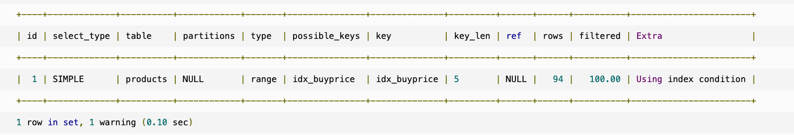


### 架构

#### MySQL主从复制了解吗？*

Mysql的主从复制中主要有三个线程：`master（binlog dump thread）、slave（I/O thread 、SQL thread）`，Master一条线程和Slave中的两条线程，主要工作就是这三个县城现在所有工作。

MySQL 的主从复制依赖于 binlog 日志，复制的过程就是将 binlog 中的数据从主库传输到从库的relay log 中继日志上。

这个过程一般是**异步**的，即主库上执行事务操作的线程不会等待复制 binlog 的线程同步完成。

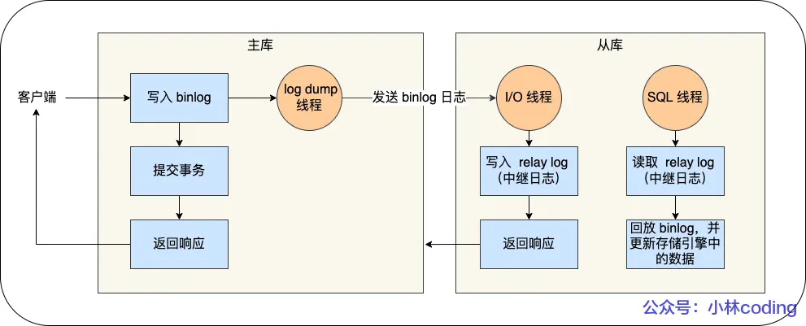

如上图所示MySQL 集群的主从复制过程梳理成 3 个阶段：

##### 1. **写入 Binlog**

主库写 binlog ，提交事务，并更新本地存储数据。

MySQL 主库在收到客户端提交事务的请求之后，更新存储引擎中的数据，会先写入 binlog日志，再提交事务,提交完成后，返回给客户端“操作成功”的响应。

`master（binlog dump thread）`主要负责Master库中有数据更新的时候，会按照`binlog`格式，将更新的事件类型写入到主库的`binlog`文件中。


##### 2. **同步 Binlog**

在这一步从库会创建一个专门的 I/O 线程即`I/O thread`线程，连接主库的 log dump 线程，来接收主库的 binlog 日志，再把 binlog 信息写入 relay log 的中继日志里，再返回给主库“复制成功”的响应。


##### 3. **回放 Binlog**

从库会创建一个用于回放 binlog 的线程即`SQL thread`，去读 relay log 中继日志，然后回放 binlog 更新存储引擎中的数据，最终实现主从的数据一致性。


当然，主从复制的过程有不同的策略方式进行数据的同步，主要包含以下几种：

1. **「同步策略」**：Master会等待所有的Slave都回应后才会提交，极强的一致性，这个主从的同步的性能会严重的影响。
2. **「半同步策略」**：Master至少会等待一个Slave回应后提交，平衡了性能和一致性。
3. **「异步策略」**：Master不用等待Slave回应就可以提交，主从数据可能存在延迟，从服务器可能因网络问题或自身故障而丢失部分数据。
4. **「延迟策略」**：从服务器（Slave）故意延迟一定时间才开始复制主服务器（Master）的数据。通过延迟复制，可以避免主服务器的误操作（如误删除或错误更新）立即传播到从服务器。如果发现问题，可以及时停止复制，减少损失。这个实时性也很差，主要用于需要防止误操作传播的场景。


在完成主从复制之后，再结合ShardingShere中间件就可以在写数据时只写主库，在读数据时只读从库。如此即使写请求会锁表或者锁记录，也不会影响读请求的执行。


#### mysql主从复制架构？*

##### 一主多从复制架构

在主库读取请求压力非常大的场景下，可以通过配置**一主多从复制架构**实现读写分离，把大量的对实时性要求不是特别高的读请求通过负载均衡分部到多个从库上(对于实时性要求很高的读请求可以让从主库去读)，降低主库的读取压力，如下图所示。

在主库出现异常宕机的情况下，可以把一个从库切换为主库继续提供服务。

> 在主从复制场景下会出现主从延迟，想想该怎么解决？

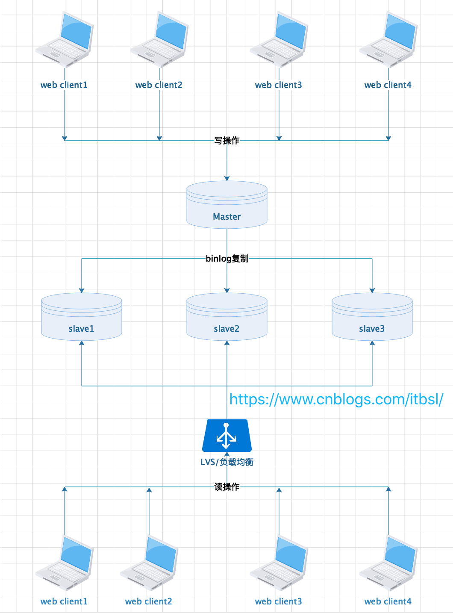


##### 多级复制架构

一主多从的架构能够解决大部分读请求压力特别大的的场景的需求，考虑到MySQL的复制需要主库发送BINLOG日志到从库的I/O线程，主库的I/O压力和网络压力会随着从库的增加而增长(每个从库都会在主库上有一个独立的BINLOG Dump线程来发送事件)，而**多级复制架构**解决了一主多从场景下的，主库额外的I/O和网络压力。MySQL的多级复制架构如下图所示。

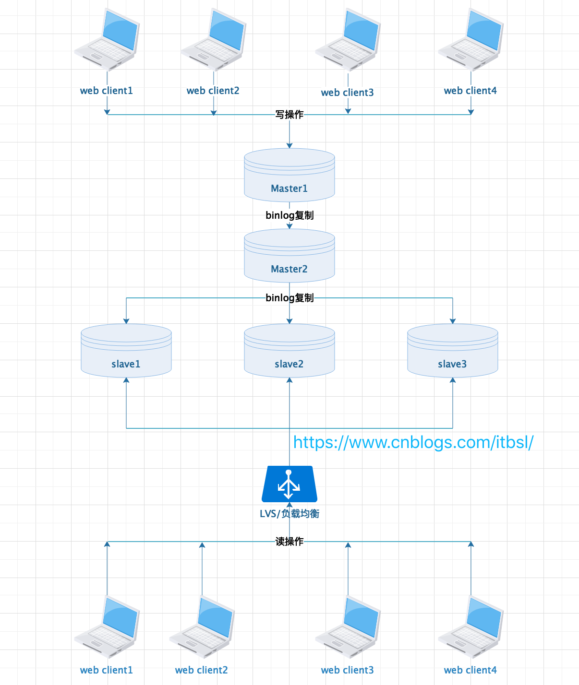

对比一主多从的架构，多级复制仅仅是在主库Master1复制到从库Slave1、Slave2、Slave3的中间增加了一个二级主库Master2，这样，主库Master1只需要给一个从库Master2发送BINLOG日志即可，减轻了主库Master1的压力。二级主库Master2再发送BINLOG日志给所有的从库Slave1、Slave2和Slave3的I/O线程。

多级复制解决了一主多从场景下，主库的I/O负载和网络压力，当然也有缺点：MySQL的传统复制是异步的，多级复制场景下主库的数据是经历两次复制才到达从库Slave1、Slave2、Slave3的，期间的延迟要比一主多从复制场景下只经历一次复制的还大。


**可以通过在二级主库Master2上选择表引擎为BLACKHOLE来降低多级复制的延迟。**顾名思义，BLACKHOLE引擎是一个“黑洞”引擎，写入BLACKHOLE表的数据并不会写会到磁盘上，BLACKHOLE表永远都是空表，INSERT、UPDATE、DELETE操作仅仅在BINLOG中记录事件。

```sql
CREATE TABLE `user` (
	`id` int NOT NULL AUTO_INCREMENT PRIMARY KEY,
	`name` varchar(255) NOT NULL DEFAULT '',
	`age` tinyint unsigned NOT NULL DEFAULT 0
)ENGINE=BLACKHOLE charset=utf8mb4;
INSERT INTO `user` (`name`,`age`) values("itbsl", "26");
SELECT * FROM `user`;
```

相当于二级主库只是一个协调节点，来将binlog分发到各个读的从节点。


**Q：主节点宕机怎么办？**

A：首先需要手动确认是否真的出现了故障，还是因为网络分区导致暂时不可用。

如果确定是故障，首先要手动关闭所有从节点拉取主节点二进制日志的线程。接着，需要判断从服务器执行的主服务器二进制日志中的当前位置以及主服务器的延迟秒数，选择回放进度最高且延迟较低的从节点作为新的主节点。

然后，将该从节点配置为新的主节点，并修改它的独占模式为读写模式。同时，修改剩余从节点的复制配置，指向新的主节点，重启其他从节点的复制进程，使其开始从新的主节点拉取日志。

此外，还需要手动配置分库分表中间件（如 ShardingSphere），将写操作指向新的主节点。


进一步追问有没有了解自动化方案，就说不了解，然后没有实际实践过但是你可以说按照你的思路用一些外部组件来进行，听说过的MGR插件和ZooKeeper等。实际上，MySQL也支持自动高可用方案，但需要使用插件。通过结合 MGR（插件）、ShardingSphere 和 ZooKeeper（外部协调组件），可以实现以下功能：

- MGR 自动检测主节点故障并进行切换
- 切换完成后，更新 ZooKeeper 中的主节点信息
- ShardingSphere 监听 ZooKeeper 的变更，并自动更新路由规则


#### 主从延迟都有什么处理方法？*

**强制走主库方案**：对于大事务或资源密集型操作，直接在主库上执行，避免从库的额外延迟。

**拆分大事务**：将大事务拆分为多个小事务执行，避免单个大事务导致的长时间延迟生成binlog，而且binlog占用体积还大，进一步加剧延迟。

**垂直增加：**提高性能，换固态硬盘。


#### **百万级数据如何快速导入数据库？**

先暂时关闭所有索引或者直接删除索引和临时禁用外键约束，等表导入之后再恢复或者重建。

使用MySQL的`LOAD DATA INFILE`插入（比INSERT语句快20-50倍）

```sql
LOAD DATA INFILE '/path/data.csv' INTO TABLE users
FIELDS TERMINATED BY ',' 
LINES TERMINATED BY '\n';
```


**Q：是不是也是可以用那个EasyExcel 读取？**

A：是的如果数据来源是 Excel → EasyExcel（流式读取）+ 批量 INSERT（**低内存占用**支持千万上亿条级别不爆内存，但速度一般相较于下面）。

如果是 CSV → LOAD DATA INFILE（最快，但仅支持 CSV，大量数据容易爆内存，但是可以手动分批处理）


#### 分表和分库是什么？有什么区别？

**分库**是一种水平扩展数据库的技术，将数据根据一定规则划分到多个独立的数据库中。分库主要是为了解决并发连接过多，单机 mysql扛不住的问题。每个数据库只负责存储部分数据，实现了数据的拆分和分布式存储。

而**分表**指的是将单个数据库中的表拆分成多个表，每个表只负责存储一部分数据。分表主要是为了解决单表数据量太大，导致查询性能下降的问题。且能够提高查询效率，减轻单个表的压力。


| **维度**     | **分库**                           | **分表**                                  |
| ------------ | ---------------------------------- | ----------------------------------------- |
| **存储位置** | 数据分布在不同的数据库实例中       | 数据分布在同一数据库实例中的多个表中      |
| **解决问题** | 减轻数据库实例整体压力             | 减轻单表查询和存储的压力                  |
| **扩展性**   | 可通过添加数据库实例扩展存储和性能 | 限于单个数据库实例的物理资源（CPU、内存） |
| **复杂性**   | 增加跨数据库的路由和事务管理复杂度 | 增加表的管理和查询路由逻辑                |


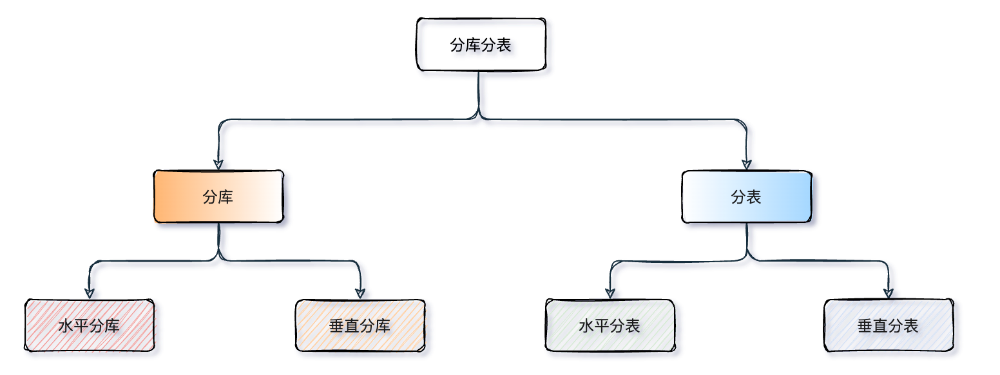

如上图所示，分库与分表可以从：垂直（纵向）和 水平（横向）两种纬度进行拆分。以经典的订单业务举例，看看如何拆分。

##### 1. 垂直分库分表

**垂直分库分表一般是按照业务和功能的维度进行拆分，**

**对垂直分库来说，**将不同业务数据分别放到不同的数据库中，**核心理念 专库专用。**按业务类型对数据分离，剥离为多个数据库，像订单、支付、会员、积分相关等表放在对应的订单库、支付库、会员库、积分库。

垂直分库优点在于把一个库的压力分摊到多个库，提升了一些数据库性能。

但存在跨库查询的问题，需要应用层协调（如分布式事务、数据汇总）。而且数据库实例数量增多，运维成本增加。


**对垂直分表来说，**一般是把业务宽表中比较独立的字段，或者不常用的字段拆分到单独的数据表中，是一种大表拆小表的模式。

垂直分表优点在于数据库它是以行为单位将数据加载到内存中，这样拆分以后核心表大多是访问频率较高的字段，而且字段长度也都较短，因而可以加载更多数据到内存中，减少磁盘IO，增加索引查询的命中率，进一步提升数据库性能。

但是可能需要额外的 JOIN 或多次查询组合数据，增加开发复杂度。


##### 2. 水平分库分表

水平分库分表一般是按照一定的规则进行拆分，

**对水平分库来说，**是把同一个表按一定规则拆分到不同的数据库中，每个库可以位于不同的服务器上，以此实现水平扩展。

水平分库实现分布式存储，突破单数据库容量和连接限制。

但这种方案数据的访问需要额外的路由工作，分片键设计不合理可能导致数据倾斜，事务管理也更加复杂，数据路由逻辑也需要应用层实现。因此系统的复杂度也被提升了。


**对水平分表来说**，在**同一个数据库内**，把一张大数据量的表按一定规则，切分成多个结构完全相同表，而每个表只存原表的一部分数据，因为每个表的扫描行数变小了，所以性能提高了。

水平分表尽管拆分了表，但子表都还是在同一个数据库实例中，只是解决了单一表数据量过大的问题，并没有将拆分后的表分散到不同的机器上，还在竞争同一个物理机的CPU、内存、网络IO等。同时与水平分库相同，需要额外的路由工作，分片键设计不合理可能导致数据倾斜。


一般地，使用分表即可满足提升性能的需求，如果出现单库性能（数据库连接数、据库 CPU、IO 等资源接近上限）和存储容量瓶颈的话，进一步可以进行分库处理。


| **类别**         | **方式**     | **优点**                                                     | **缺点**                                                     | **适用场景**                                                 |
| ---------------- | ------------ | ------------------------------------------------------------ | ------------------------------------------------------------ | ------------------------------------------------------------ |
| **垂直分库分表** | **垂直分库** | - 按业务拆分，减轻单库压力 - 数据库专库专用，逻辑清晰 - 可提升数据库性能 | - 产生跨库查询，增加应用层协调难度（如分布式事务、数据汇总） - 数据库实例数量增多，运维复杂度提升 | 适用于不同业务逻辑独立，且各模块数据规模较大，访问模式区分明显的场景 |
|                  | **垂直分表** | - 结构清晰，拆分宽表减少数据冗余 - 访问频繁的字段保持在核心表中，减少内存消耗 - 增加索引查询命中率，减少磁盘 I/O 提升性能 | - 需要额外的 JOIN 或多次查询组合数据 - 复杂查询增多，开发复杂度上升 | 适用于表中字段众多，部分字段独立性强，且访问频率不一致的大宽表 |
| **水平分库分表** | **水平分库** | - 打破单库容量和连接数限制 - 支持分布式存储和负载均衡 - 支持高并发和大数据量应用 | - 数据访问需要额外路由工作 - 分片键设计不合理易导致数据倾斜 - 分布式事务管理复杂 | 适用于单库性能接近瓶颈（如 CPU、I/O、存储）的场景，需将数据分布到多台机器 |
|                  | **水平分表** | - 将单表数据切分成多个小表，减小扫描范围 - 提升查询性能      | - 子表仍在同一个数据库实例中，未分散到不同物理机 - 需要额外路由工作，分片键设计不当可能导致数据倾斜 - 对表的分布式事务处理依赖数据库性能 | 适用于单表数据量过大，查询和写入性能下降的场景，且无需分布式存储支持 |


#### 分库分表有操作过么，如何实现的，抓取数据又是怎么个流程？

只用过分表实现主要下面4部，

1. 设计分片规则（如按分片键取模等）
2. 部署中间件并配置路由规则（就是第1部的分片规则）
3. 数据迁移（历史数据迁移到分片表中）
4. 应用层适配（修改SQL或使用中间件拦截转换）


**"抓取数据"**通常指从分库分表后的多个数据源获取和整合数据，

一般如果参数有分片键，中间件根据路由规则，向多个分片并行发送查询，然后收集各分片结果并合并（如排序、分页、聚合计算）。

否则就将所有分表进行逐行扫描。


#### 分库分表中间件数据源代理和jdbc的区别？

我觉得主要有三个方面。

1. **性能**：JDBC 方式性能更强，直接在应用层增强 JDBC 来做分库分表，不像数据源代理那样需要中间层拦截 SQL，再进行解析、路由和结果合并，多了一层网络交互，性能自然会差一些。
2. **配置复杂度**：JDBC 方式配置比较麻烦，需要在应用里配置分库分表规则，而数据源代理只要把数据源配置指向代理层就行，改动少，使用更简单。
3. **通用性**：数据源代理因为有独立的中间层，能支持多种语言和数据库客户端，通用性更强；而 JDBC 方式是 Java 特有的，只适用于 Java 应用。


#### Shading和mycat的区别*

Sharding 和 MyCat 相比，它的社区更大、更活跃。

而且针对 Java 提供了特殊的 Sharding-JDBC 版本，相比 MyCat 代理数据源，性能更高。

在分库分表功能方面，MyCat 主要支持水平分表和垂直分库，提供相对基础的分片策略，而 ShardingSphere 提供了更丰富的分片规则，包括哈希取模、**一致性哈希**等。


#### 分表（分片）算法有哪些？

哈希取模（Hash-Mod）

- **原理**：对分片键（如用户ID、订单ID）做哈希后取模，决定目标表/节点编号。
- **优点**：实现极其简单，数据分布较均匀，避免热点。
- **缺点**：扩容（节点增减）时通常需迁移大量数据，且难以支持范围查询。


范围分片（Range Sharding）

- **原理**：根据分片键的数值将数据划分到不同表。
- **优点**：范围查询性能好，易于按时间归档；扩容时可新增新区间表。 
- **缺点**：数据易倾斜（热点区间），不均匀访问可能导致某些分片压力过大。


一致性哈希（Consistent Hashing）

- **原理**：将分片节点和数据键映射到同一哈希环上，一个节点的变动只需迁移相邻区间的数据。数据项沿着哈希环顺时针方向被分配到遇到的第一个服务器节点，每个节点负责处理其逆时针方向的一段哈希环区间。
- **优点**：动态扩容/缩容时仅需迁移少量数据，分布更平滑；支持虚拟节点进一步均衡。 
- **缺点**：实现较复杂；仍可能出现小范围不均衡，需要调优虚拟节点数量。


