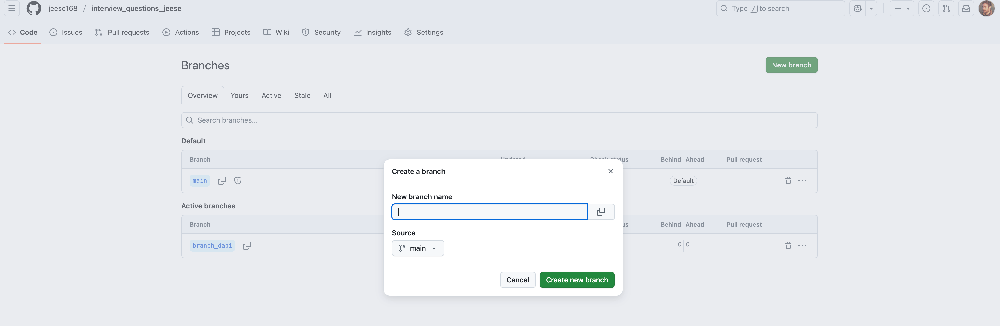

# interview_questions_jeese

[](https://github.com/jeese168/interview_questions_jeese)
[](https://github.com/jeese168/interview_questions_jeese)
[](https://obsidian.md/)

> 📚 jeese和研究生师弟用来准备面试的Java后端面试题集，适配Obsidian阅读。持续更新中...

## 📂 内容目录

### ☕ Java核心
- **Java基础面试题** - 基本语法、OOP、异常处理等
- **Java集合面试题** - ArrayList、HashMap、ConcurrentHashMap等深度解析
- **Java并发编程面试题** - 多线程、锁机制、并发容器
- **Java虚拟机面试题** - JVM内存模型、GC、类加载机制

待补充：
- [ ] 异常和Java IO
- [ ] Golang核心基础知识


### 💾 数据库与缓存
- **MySQL面试题** - 索引、事务、锁、优化
	- **深化中：** 分布式数据库 (NewSQL)
- **Redis面试题** - 数据结构、持久化、集群、缓存策略

待补充：
- [ ] 分布式数据库 (NewSQL)


### 🌐 计算机基础（更新中）
- **操作系统面试题** - 进程/线程、IO模型、内存管理、文件系统
	- 🔥 **重点**：持续深化中：IO相关内容（select/poll/epoll、BIO/NIO/AIO）
- **计算机网络面试题** - TCP/IP、HTTP/HTTPS、网络编程

待深入：
- [ ] 中断
- [ ] IO管理


### 🏗️ 架构与设计
- **微服务体系和分布式面试题** - 分布式系统、高并发、高可用
	- **深化中：** 分布式事务、云原生（Docker+k8s）、全链路监控（ELK+SkyWalking）、RPC远程过程调用（待补充）
- **场景和系统设计面试题** - **待重构**
- **Spring面试题** - IoC、AOP、SpringBoot

待补充：
- [x] 分布式事务
- [ ] 全链路监控：ELK+SkyWalking
- [ ] 系统设计
- [ ] 云原生（Docker+k8s）


待重写：
- [ ] 场景
- [ ] 安全设计


### 🤖 新兴技术
- **大型语言模型技术深度解析** - 大型语言模型基础算法、AI Agent 技术&协议、内容增强检索（RAG）、提示词工程和上下文工程
	- 提示词工程辅助理解项目：https://github.com/jeese168/PromptEngineeringJupyterTest

更新进度：
- [ ] 大型语言模型基础算法
- [ ] AI Agent 技术&协议
- [ ] 内容增强检索（RAG）
- [x] 提示词工程
- [x] 上下文工程


### 📝 实战经验
- **面筋记录** - 真实校招/社招面试经验分享

---

## 🚀 快速开始

### 在线阅读
直接在GitHub上浏览各个`.md`文件。

### 本地阅读（推荐）
1. **安装Obsidian**：[下载地址](https://obsidian.md/)
2. **Clone本仓库**：
```bash
   git clone https://github.com/jeese168/interview_questions_jeese.git
```
3. **用Obsidian打开**：Obsidian → Open folder as vault → 选择克隆的文件夹

## 👥 贡献者

- [@jeese168](https://github.com/jeese168) - 项目维护者
- [@Xixiangxiaopang](https://github.com/Xixiangxiaopang) - 协作贡献者（104的师弟）

**欢迎师弟和更多小伙伴加入！** 👇

---


## 协作工作流程

### 核心原则
每个人都有自己的长期分支，想改就改，想提交就提交。定期把主分支的更新合并到自己的分支，有重要修改时提Pull Request让jeees看看。

---

### 1. 首次设置（只需要做一次）

#### 1.1 接受GitHub协作邀请
查看GitHub通知或邮件，点击"Accept invitation"

#### 1.2 配置Git认证

**方式A：Personal Access Token（推荐）**
```bash
# 1. GitHub → Settings → Developer settings → Personal access tokens → Generate new token
# 2. 勾选 repo 权限
# 3. 复制token（只显示一次，保存好！）
# 4. Clone时用token作为密码
```

**方式B：SSH密钥**
```bash
ssh-keygen -t ed25519 -C "你的邮箱"
# 然后添加公钥到GitHub: Settings → SSH keys
```

#### 1.3 Clone仓库
```bash
git clone https://github.com/jeese168/interview_questions_jeese.git
cd interview_questions_jeese
```

#### 1.4 创建你的长期分支
```bash
# 起个有意义的名字，比如用你的名字或昵称
git checkout -b branch_xiaopang
# 或
git checkout -b branch_张三

# 推送到远程
git push origin branch_xiaopang
```

**也可以在GitHub网页上创建：**


---

### 2. 日常工作流程（想改就改）

#### Step 1: 确保在自己的分支上
```bash
# 查看当前分支
git branch

# 如果不在自己的分支，切换过去
git checkout branch_xiaopang
```

#### Step 2: 修改文件（随便改！）
```bash
# 用任何编辑器修改
vim xxx.md
# 或用Obsidian修改

# 可以改很多文件，积累一段时间再提交
```

#### Step 3: 提交更改（想提交就提交）
```bash
git add .
git commit -m "描述你改了什么"

# Commit信息例子：
# "修正ConcurrentHashMap的描述"
# "添加Redis笔记"
# "修了几个错别字"
# 笔记项目不需要太严格，清楚就行
```

#### Step 4: 推送到GitHub
```bash
git push origin branch_xiaopang

# 或者用Obsidian的Git插件自动提交
```

---

### 3. 定期同步jeess的更新（建议每周一次）

jeese会持续更新main分支，你需要定期把这些更新合并到自己的分支。
```bash
# 1. 确保在自己的分支
git checkout branch_xiaopang

# 2. 拉取最新的main分支
git fetch origin

# 3. 合并main分支到你的分支
git merge origin/main

# 4. 如果有冲突，下一步解决；没冲突就跳到Step 5
```

#### 3.1 解决冲突（如果有）

**在命令行看到冲突提示：**
```
CONFLICT (content): Merge conflict in xxx.md
Automatic merge failed; fix conflicts and then commit the result.
```

**用IDEA解决冲突（推荐）：**
```
1. 打开IDEA，会看到冲突文件标红
2. 右键冲突文件 → Git → Resolve Conflicts
3. 在弹出的界面中选择：
   - Accept Yours（保留你的修改）
   - Accept Theirs（使用jeese的版本）
   - Merge（手动合并，左边是你的，右边是jeese的）
1. 处理完所有冲突后点击 Apply
```


#### 3.2 提交合并结果
```bash
git add .
git commit -m "合并main分支的更新"
git push origin branch_xiaopang
```

---

### 4. 提交重要修改到主分支给jeese审阅

如果你做了比较重要的修改（比如补充了一大块内容、修正了重要错误），可以提PR合并到主分支。

**不着急的话，也可以积累一段时间统一提一次PR。**
#### 4.1 合并主分支前首先解冲突
```bash
# 1. 确保在自己的分支
git checkout branch_xiaopang

# 2. 拉取最新的main分支
git fetch origin

# 3. 合并main分支到你的分支
git merge origin/main

# 4. 如果有冲突，下一步解决；没冲突就跳到Step 5
```


**在命令行看到冲突提示：**
```
CONFLICT (content): Merge conflict in xxx.md
Automatic merge failed; fix conflicts and then commit the result.
```

**用IDEA解决冲突（推荐）：**
```
1. 打开IDEA，会看到冲突文件标红
2. 右键冲突文件 → Git → Resolve Conflicts
3. 在弹出的界面中选择：
   - Accept Yours（保留你的修改）
   - Accept Theirs（使用jeese的版本）
   - Merge（手动合并，左边是你的，右边是jeese的）
1. 处理完所有冲突后点击 Apply
```

**提交合并结果**
```bash
git add .
git commit -m "合并main分支的更新"
git push origin branch_xiaopang
```


#### 4.2 在GitHub网页上创建Pull Request
```
1. 进入仓库页面
2. 点击 "Pull requests"
3. 点击 "New pull request"
4. 设置：
   - base: main
   - compare: branch_xiaopang
5. 填写标题和描述（简单说明改了什么）
6. 点击 "Create pull request"
7. 等jeese有空review
```

#### 4.3 jeese审阅后
```
- 如果通过：jeese会合并，你的修改就进main分支了
- 如果需要修改：你在自己分支继续改，推送后PR会自动更新
```

---

### 5. PR合并后的清理（可选）

PR合并后，你的修改已经在main分支了，可以清理一下你的分支：
```bash
# 切换到main，拉取最新代码
git checkout main
git pull origin main

# 切回你的分支，合并main（让你的分支和main保持同步）
git checkout branch_xiaopang
git merge origin/main
git push origin branch_xiaopang

# 这样你的分支就是最新的了，可以继续改
```

---

## 常见问题

### Q1: 我可以直接改main分支吗？
**不行**，会被拒绝。main分支受保护，只有jeese能直接push。
```bash
git checkout main
git push origin main
# ❌ 错误：! [remote rejected] main -> main (protected by ruleset)
```

### Q2: 我改了很多东西，但还没想好是否提交给jeese怎么办？
**没关系！** 你可以一直在自己的分支上改，想提PR的时候再提。自己的分支想怎么折腾都行。

### Q3: 如果我很久没同步main分支，会有问题吗？
可能会有**很多冲突**。建议至少每周同步一次，避免积累太多差异。

### Q4: 我不小心在main分支上改了怎么办？
```bash
# 如果还没commit，把改动保存到自己的分支
git stash  # 暂存改动
git checkout branch_xiaopang  # 切换到自己的分支
git stash pop  # 恢复改动
# 然后正常commit和push

# 如果已经commit了但没push
git log  # 找到commit的hash
git checkout branch_xiaopang
git cherry-pick <commit-hash>  # 把这个commit搬到你的分支
git push origin branch_xiaopang
```

### Q5: Obsidian的Git插件怎么配置？
```
1. Obsidian → 设置 → 第三方插件 → 浏览 → 搜索 "Obsidian Git"
2. 安装并启用
3. 设置：
   - 自动拉取间隔：10分钟（可选）
   - 自动备份间隔：30分钟（可选）
   - 确保 "Pull updates on startup" 勾选
4. 使用：
   - Ctrl+P → 搜索 "Git: Commit all changes"
   - 或者让它自动提交
```

### Q6: 我想看jeese最近更新了什么？
```bash
# 查看main分支的提交历史
git log origin/main --oneline -10

# 或者在GitHub网页上看：
# 仓库主页 → Insights → Network（可以看到分支图）
```

---

## 分支说明

- **main分支**：jeese维护，保持最新和最准确的内容
- **branch_XXX**：你的个人分支，随便改，想提交就提交
- **其他人的分支**：如果有其他协作者，他们也有自己的分支

---

## 推荐工作习惯

1. **每次开始工作前**：同步一下main分支的更新（避免冲突堆积）
2. **随时提交**：改了点东西就commit，不用等积累很多
3. **定期push**：至少每天push一次，避免丢失本地改动
4. **重要修改提PR**：如果改了重要内容，提个PR让jeese确认
5. **不重要的小改动**：可以不提PR，积累一段时间统一提

---
