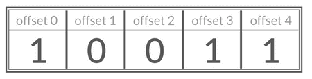
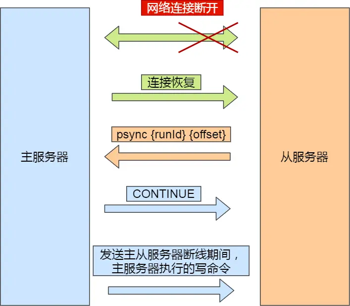
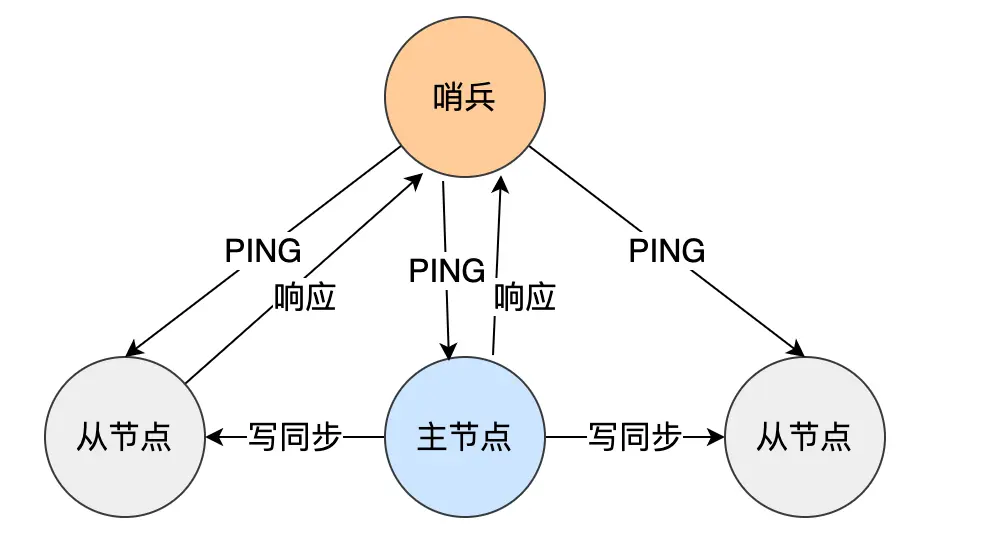
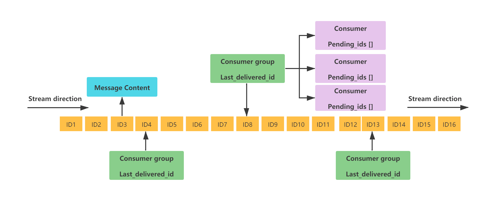
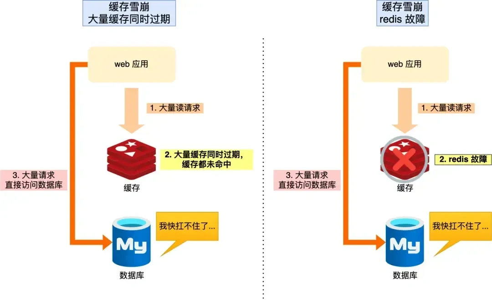

# Redis面试题

###  数据结构

#### 讲一下Redis的数据类型

Redis 提供了丰富的数据类型，在最初时有5大基本数据结构即String（字符串）、Hash（哈希）、List（列表）、Set（集合）、ZSet（有序集合）；在后序更新后又增加了BitMap（位图）、HyperLogLog、GEO、Stream几种数据类型。


##### 1. String

Redis中的String类型可以存储字符串和整数和浮点数，String类型的底层实现一般为Redis的底层数据结构**简单动态字符串(SDS)**，基于此结构可以实现对字符串的整个部分和一部分进行操作，也可以实现浮点数或整数的自增和自减操作。此外Redis中的String类型也是Redis中最基本的数据类型，其他类型都是基于字符串构建的。

常用操作有`SET key value`、`GET key`、`INCR/DECR 自增/自减`。

因此String类型可一般用于缓存和计数器和分布式锁。


##### 2. List*

Redis的List类型可以理解为是一种**有序的字符串集集合**，List类型的底层实现可以为：

1. **双向链表**（数据量大时使用）
2. **压缩列表**（数据量小时使用，节约内存空间。在新版本中被废弃，使用ListPack替代）

基于上述两种数据结构，可以实现List的**按索引访问**，或**对队头和队尾操作弹出或删除等等。**

常用操作有：

- `LPUSH key value` / `RPUSH key value`：从队头/尾插入元素。
- `LPOP key` / `RPOP key`：从队头/尾弹出元素。
- `LRANGE key start stop`：获取指定范围的元素。
- `LLEN key`：获取列表长度。

因此List可以被用于消息队列，但是基于List的消息队列有两个问题：1. 生产者需要自行实现全局唯一 ID；2. 不能以消费组形式消费数据。


##### 3. Set

Redis的Set类型可以理解为是一种**无序的字符串集集合**，且Set类型是唯一的，内部不可重复，Set类型的底层实现可以为：

1. **哈希表**（数据量大时使用，可以实现较快的删改查操作）
2. **整数列表IntSet**（数据量小时且存储为整数使用，节省内存）

基于上述两种数据结构，可以实现对Set类型的增删改查。

常用操作有：

- `SADD key value`：向集合添加元素。
- `SREM key value`：移除集合中的元素。
- `SMEMBERS key`：获取集合中所有元素。
- `SINTER key1 key2`：获取两个集合的交集。
- `SUNION key1 key2`：获取两个集合的并集。

因此Set类型可以用作数据去重（存储用户唯一ID）和关系聚合计算（共同求交集，推荐求并集等）。


##### 4. Hash 类型

Redis的Hash 类型是一种**键值对集合**，用于存储结构化数据。Hash类型的底层实现可以为

1. **哈希表**（当字段较多时使用，支持快速的插入和查找操作。）
2. **压缩列表**（当字段较少时，值较小时使用，节约内存空间。在新版本中被废弃，使用ListPack替代）

基于上述两种数据结构，可以实现对Hash 类型的增删查。

常用操作：

- `HSET key field value`：设置字段值。
- `HGET key field`：获取字段值。
- `HGETALL key`：获取所有字段和值。
- `HDEL key field`：删除字段。

因此Hash 类型一般用于存储结构化数据（对象），存储用户信息：如用户名、密码、邮箱等。很适合存储JAVA Bean。


**Q：Hash 类型与String 类型都能存储键值对，有什么区别？**

**A：最典型即为**

- **Hash 类型**：
  - 是一个键对应一个字典（键值对集合）。
  - 适合存储多个字段和对应的值，例如：`user:1001` → `{name: "Alice", age: "25", city: "NY"}`。
  - 字典中的字段和值也可以单独访问。
- **String 类型**：
  - 是一个简单的键值对结构，直接存储单一值。
  - 适合存储单一的数据内容，例如：`user:1001:name` → `"Alice"`。


##### 5. ZSet 类型*

ZSet 类型是一种存储**有序集合的数据类型**，特殊在于每个集合元素关联一个分数，按分数从小到大排序。ZSet 类型的底层实现可以为，

1. **跳表**（用于存储有序集合，支持范围的快速查找和排序操作）

2. **哈西表**（将集合与分数映射，便于快速查找）

基本操作有：

- `ZADD key score member`：添加元素及其分数。
- `ZRANGE key start stop [WITHSCORES]`：按顺序获取元素。
- `ZRANGEBYSCORE key min max`：根据分数范围获取元素。
- `ZREM key member`：移除元素。

因此ZSet 类型一般用于排行榜，或者延迟队列（用分数来存储时间戳按照分数取任务）


##### 6. Bitmap 类型

Redis后续更新的中的位图Bitmap 类型本质上是**字符串类型的扩展**，但可以对字符串进行位操作。Bitmap 类型底层实现与String类型相同都为**简单动态字符串(SDS)**，但以位（bit）为单位进行操作。

详细即为，**Bitmap将一个字符串视为一串连续的二进制位（bit）**，可以对这些二进制位进行操作，从而实现高效的状态存储和查询。每一位（bit）都可以用0或1表示不同的状态。

常用操作有：

- `SETBIT key offset value`：设置指定二进制位位置的值（0或1）。
- `GETBIT key offset`：获取指定二进制位位置的值。
- `BITCOUNT key`：统计位为1的数量。

**应用场景**有状态管理：记录用户在线/离线状态。

用户签到：记录用户每天是否签到。Bitmap直接将字符串的**每一位用作存储单元。**例如：

- 对于键`user:sign`，Bitmap可以表示一个用户的签到情况。
- 第1位（offset = 0）可以表示1月1日是否签到，第2位表示1月2日，以此类推。

如果有365位，可以用一个长度为46字节（365 / 8 ≈ 46）的字符串存储全年的签到信息。


##### 7. HyperLogLog

Redis中的**HyperLogLog**是一种**近似基数统计**的数据结构，适合大规模数据的去重统计。

底层主要通过概率算法实现（所以存在误差，但在0.81%以内），且使用固定内存（12kb）存储消息。

常见用法为

- `PFADD key element`：添加元素。
- `PFCOUNT key`：统计集合的基数。
- `PFMERGE destkey key1 key2`：合并多个HyperLogLog。

应用场景主要为网站UV计数或大数据去重计数。


**Q：基数统计什么意思？**

A：**基数统计**，简单来说，就是统计一个集合中**不同元素的数量**（也称为**去重后的元素个数**）。在数据库或者数据处理中，这类问题通常被称为**Distinct Count**问题。

比如：

- 给定一个集合 `{A, B, C, A, B}`，去重后的集合是 `{A, B, C}`，因此基数是 **3**。
- 如果集合是 `{1, 2, 3, 4, 5}`，所有元素都不同，基数是 **5**。


**Q：HyperLogLog具体是什么概率算法？（了解即可，加深记忆用的）**

A：主要通过两个特征值

1. **哈希函数**：将元素映射到一个固定长度的二进制数（模拟随机分布）。
   例如，用户 ID 映射后可能是 `1101 0110`、`0010 1101` 等。
2. **二进制前缀的长度**：统计这些二进制哈希值中连续前导 `0` 的最长长度，作为数据分布的特征。
   比如哈希值 `0001 1010` 和 `0010 1111`，最长前导 `0` 分别是 3 和 2。

HyperLogLog 通过找到哈希值中**二进制前导零的长度**，推测该集合的规模（因为更大的集合会让哈希值分布更随机，更可能出现更长的前导零）。

将哈希值分成多个桶，计算每个桶的前导零取平均值，结合算法中的修正计算，可以得到集合的近似基数。


##### 8. Geo 类型

Redis中的**Geo**类型用于存储地理位置信息，支持距离计算和范围查询。

但其实底层用ZSet 类型实现的，使用地理编码（Geohash）将坐标转换为分数。

常用操作有：

- `GEOADD key longitude latitude member`：添加地理位置。
- `GEODIST key member1 member2`：计算两点间的距离。
- `GEORADIUS key longitude latitude radius`：查询指定范围内的成员。

应用场景与地理数据使用有关，位置服务：如附近的人、商家查询。导航应用如计算距离。


##### 9. Stream 类型*

Redis的Stream 类型是一种实现支持时间序列的消息队列结构。

在底层Stream 类型更类似于日志的结构存储数据，**每条消息包含唯一的ID和字段值。**

通过这种结构，可实现基本消息队列功能。

常用操作有：

- `GEOADD key longitude latitude member`：添加地理位置。
- `GEODIST key member1 member2`：计算两点间的距离。
- `GEORADIUS key longitude latitude radius`：查询指定范围内的成员。

常用操作有：

- `XADD key ID field value`：添加消息。
- `XRANGE key start end`：获取范围内的消息。
- `XREAD key streams key ID`：阻塞读取新消息。

**应用场景**有实时日志如监控系统的事件记录

或消息队列用于分布式系统中的任务分发。

使用Stream 类型的消息队列相比于基于 List 类型实现的消息队列，有这两个特有的特性：自动生成全局唯一消息ID，支持以消费组形式消费数据。

| **数据类型**    | **特点**                                       | **常用操作（仅作了解）**             | **底层实现**                                     | **应用场景**                                          |
| --------------- | ---------------------------------------------- | ------------------------------------ | ------------------------------------------------ | ----------------------------------------------------- |
| **String**      | 存储字符串、整数、浮点数，最基础的数据类型。   | SET、GET、INCR、DECR                 | SDS（简单动态字符串）                            | 缓存、计数器、分布式锁。                              |
| **List**        | 有序字符串集合，支持按索引访问及队头队尾操作。 | LPUSH、RPUSH、LPOP、RPOP、LRANGE     | 双向链表（数据量大）、ListPack（数据量小）       | 消息队列（简单实现，但不支持消费组）。                |
| **Set**         | 无序字符串集合，元素唯一。                     | SADD、SREM、SMEMBERS、SINTER、SUNION | 哈希表（数据量大）、IntSet（整数集合，数据量小） | 数据去重、关系计算（交集、并集、差集）。              |
| **Hash**        | 键值对集合，适合存储结构化数据。               | HSET、HGET、HGETALL、HDEL            | 哈希表（字段多）、ListPack（字段少）             | 存储用户信息（如用户名、密码等），适合存储Java Bean。 |
| **ZSet**        | 有序集合，按分数排序。                         | ZADD、ZRANGE、ZRANGEBYSCORE、ZREM    | 跳表（有序访问）、哈希表（分数映射）             | 排行榜、延迟队列（分数表示时间戳）。                  |
| **Bitmap**      | 位操作扩展，基于位（bit）存储状态。            | SETBIT、GETBIT、BITCOUNT             | SDS（简单动态字符串）                            | 用户签到（按位存储每日状态）、在线状态。              |
| **HyperLogLog** | 近似基数统计，支持大规模数据去重。             | PFADD、PFCOUNT、PFMERGE              | 概率算法                                         | 网站UV统计、大数据去重。                              |
| **Geo**         | 存储地理位置，支持距离计算和范围查询。         | GEOADD、GEODIST、GEORADIUS           | ZSet（Geohash 编码为分数）                       | 位置服务（附近的人、商家查询）、导航（距离计算）。    |
| **Stream**      | 时间序列消息队列，支持唯一 ID 和消费组。       | XADD、XRANGE、XREAD                  | 类似日志结构                                     | 实时日志、监控系统事件记录、分布式任务分发。          |


**Q：使用 Bitmap 统计活跃用户怎么做？**

A：Bitmap 存储的是连续的二进制数字（0 和 1），通过 Bitmap, 只需要一个 bit 位来表示某个元素对应的值或者状态，key 就是对应元素本身 。我们知道 8 个 bit 可以组成一个 byte，所以 Bitmap 本身会极大的节省储存空间。

你可以将 Bitmap 看作是一个存储二进制数字（0 和 1）的数组，数组中每个元素的下标叫做 offset（偏移量）。



如果想要使用 Bitmap 统计活跃用户的话，可以使用日期（精确到天）作为 key，然后用户 ID 为 offset，如果当日活跃过就设置为 1。

初始化数据：

```bash
> SETBIT 20210308 1 1
(integer) 0
> SETBIT 20210308 2 1
(integer) 0
> SETBIT 20210309 1 1
(integer) 0
```

统计 20210308~20210309 总活跃用户数:

```bash
> BITOP and desk1 20210308 20210309
(integer) 1
> BITCOUNT desk1
(integer) 1
```

统计 20210308~20210309 在线活跃用户数:

```bash
> BITOP or desk2 20210308 20210309
(integer) 1
> BITCOUNT desk2
(integer) 2
```


**Q：使用 HyperLogLog 统计页面 UV 怎么做？**

A：使用 HyperLogLog 统计页面 UV 主要需要用到下面这两个命令：

- `PFADD key element1 element2 ...`：添加一个或多个元素到 HyperLogLog 中。
- `PFCOUNT key1 key2`：获取一个或者多个 HyperLogLog 的唯一计数。

1、将访问指定页面的每个用户 ID 添加到 `HyperLogLog` 中。

```bash
PFADD PAGE_1:UV USER1 USER2 ...... USERn
```

2、统计指定页面的 UV。

```bash
PFCOUNT PAGE_1:UV
```


#### ZSet用过吗？*

讲用过 zset ，并使用实现排行榜的功能。

如博文点赞排名，然后介绍怎么添加博文。

**相关的一些 Redis 命令: `ZRANGE` (从小到大排序)、 `ZREVRANGE` （从大到小排序）、`ZREVRANK` (指定元素排名)。**

如：

使用`ZADD`指令来实现发表了创建文章和点赞数对应记录，

```bash
# 使用ZADD指令创建文章记录
ZADD blog:likes 10 "article:1001"  # 文章1001初始点赞数10
ZADD blog:likes 5 "article:1002"   # 文章1002初始点赞数5
ZADD blog:likes 3 "article:1003"   # 文章1003初始点赞数3
```

实现`ZINCRBY`来增加相应博文被点赞之后分数自增

```bash
# 使用ZINCRBY增加文章点赞数
ZINCRBY blog:likes 2 "article:1001"  # 文章1001增加2个赞
ZINCRBY blog:likes 3 "article:1002"  # 文章1002增加3个赞
```

获取某篇文章的点赞数通过 `ZSCORE` 命令获得

```bash
# 使用ZSCORE获取特定文章的点赞数
ZSCORE blog:likes "article:1001"  # 获取文章1001的点赞数
```

通过`ZREVRANGE` 命令获取排名多少的文章（实际情况是按照上下标，下例为第一和第三也就是前三名）

```bash
# 使用ZREVRANGE获取点赞数最高的文章（降序）
ZREVRANGE blog:likes 0 2 WITHSCORES  # 获取前3名文章
```

通过`ZRANGEBYSCORE`来获取点赞数（分数）在给出范围之内的文章

```bash
# 使用ZRANGEBYSCORE获取点赞数在特定范围的文章
ZRANGEBYSCORE blog:likes 5 15 WITHSCORES  # 获取点赞数在5-15之间的文章
```


控制台示例环境

```bash
# 初始化文章
127.0.0.1:6379> ZADD blog:likes 10 "article:1001"
(integer) 1
127.0.0.1:6379> ZADD blog:likes 5 "article:1002"
(integer) 1
127.0.0.1:6379> ZADD blog:likes 3 "article:1003"
(integer) 1

# 增加点赞数
127.0.0.1:6379> ZINCRBY blog:likes 2 "article:1001"
"12"
127.0.0.1:6379> ZINCRBY blog:likes 3 "article:1002"
"8"

# 获取文章点赞数
127.0.0.1:6379> ZSCORE blog:likes "article:1001"
"12"

# 获取top 3文章
127.0.0.1:6379> ZREVRANGE blog:likes 0 2 WITHSCORES
1) "article:1001"
2) "12"
3) "article:1002"
4) "8"
5) "article:1003"
6) "3"

# 获取点赞数在5-15之间的文章
127.0.0.1:6379> ZRANGEBYSCORE blog:likes 5 15 WITHSCORES
1) "article:1002"
2) "8"
3) "article:1001"
4) "12"
```


#### Zset 底层是怎么实现的？

在早期的Redis版本，一般使用压缩列表作为初期的底层结构。

具体来说，当元素数量不超过128个，且当单个元素大小不超过64字节时，Zset的底层数据结构是压缩列表来节省内存。

但当任意一条件没有达到时，Redis会用跳表来代替该数据结构。


但在目前版本，`ListPack`完全代替了压缩列表`ZipList`，但是目前`Redis`并没有使用`ListPark`来实现`Zset`。

而是使用

1. **跳表**，用于存储有序集合，支持范围的快速查找和排序操作。

2. **哈西表**，将集合与分数映射，便于快速查找。


#### 跳表是怎么实现的？

链表在查找元素时，因为需要顺序一个个遍历，无法实现随机存取复杂度为O(N)，所以时间效率很低。

而Redis中的跳表是在链表演化而来的，进而实现了一种多层的有序链表。虽然这种改进的链表没有实现随机存取，但时间复杂度在O(logN)，能够快速响应数据请求。


一个基本跳表表结构如下图所示：


由两个部分组成：

##### 1. 跳表节点

跳表节点数据结构如下

```c
typedef struct zskiplistNode {
    //Zset 对象的元素值
    sds ele;
    //元素权重值
    double score;
    //后向指针
    struct zskiplistNode *backward;
  
    //节点的level数组，保存每层上的前向指针和跨度
    struct zskiplistLevel {
        struct zskiplistNode *forward;
        unsigned long span;
    } level[];
} zskiplistNode;
```

Zset 数据类型要同时保存「元素」和「元素的权重」，对应到跳表节点结构里就是 **sds 类型的 ele 变量**和 **double 类型的 score 变量**。同时每个跳表节点还有一个反向指针指向前一个节点，方便倒序查找。

此外跳表是一个带有层级关系的链表，也就是一个跳表节点有多层指针，每一个指针指向下一个或者下几个节点，实现这一特性就是靠跳表节点结构体中的**zskiplistLevel 结构体类型的 level 数组**。

level 数组每一个元素就代表一层指针，比如 leve[0] 就表示第一层，leve[1] 就表示第二层，span代表这个元素指针从该几点出发向前指向第几个跳表节点。

如下图指出了各个跳表节点level 数组的指针和跨度。


##### 2. 头节点

头节点是跳表的一个特殊的跳表节点，它本身不存储实际的数据（**sds 类型的 ele 变量**和 **double 类型的 score 变量**通常为空），仅作为跳表的起点。

头节点在跳表初始化时创建，并设置默认值，

高度固定，通常是跳表的最大层数（Redis 默认跳表的最大层数为 32）

每一层的指针都被初始化为NULL。

**头节点在跳表中，有以下重要功能，**

1. 管理跳表层级

- 头节点的 `forward` 指针数组连接了所有层的第一个节点，方便快速操作每一层。而且通过头节点可以快速确定跳表是否为空：`zsl->header->level[0].forward == NULL`。
- 当跳表层数增加或减少时，只需调整头节点的 `forward` 指针数组。

2. 辅助插入/删除操作

- 插入/删除节点时，从头节点开始逐层查找位置。
- 头节点的多层索引使得查找效率更高。


Redis的跳表定义如下

```c
typedef struct zskiplist {
    struct zskiplistNode *header, *tail; // 头节点和尾节点
    unsigned long length;               // 当前跳表长度
    int level;                          // 当前最大层数
} zskiplist;
```

在创建时会初始化头节点，将其设置为跳表的最大层数，每一层的指针都被初始化为NULL，直到使用`ZADD`指令插入时创建跳表节点。

Redis **跳表在创建节点的时候，随机生成每个节点的层数**，并没有严格维持相邻两层的节点数量比例为 2 : 1 的情况。

具体的做法是，**跳表在创建节点时候，会生成范围为[0-1]的一个随机数，如果这个随机数小于 0.25（相当于概率 25%），那么层数就增加 1 层，然后继续生成下一个随机数，直到随机数的结果大于 0.25 结束，最终确定该节点的层数**。相当于每增加一层的概率不超过 25%，层数越高，概率越低，**层高最大限制是 32。**


若第一次使用`ZADD`指令创建了一个层数`level`的跳表节点。

头节点的每一层 `forward` 指针（从 0 到 `level-1`）都指向新创建的节点。


#### 跳表是怎么设置层高的？

**跳表在创建节点时候，会生成范围为[0-1]的一个随机数，如果这个随机数小于 0.25（相当于概率 25%），那么层数就增加 1 层，然后继续生成下一个随机数，直到随机数的结果大于 0.25 结束，最终确定该节点的层数**。相当于每增加一层的概率不超过 25%，层数越高，概率越低，**层高最大限制是 32**。

基于以上算法的概率分布为，节点在层级上的分布满足：

- 第 1 层包含所有节点；
- 第 2 层包含约 25% 的节点；
- 第 3 层包含约 6.25% 的节点；
- 第 4 层包含约 1.5625% 的节点；以此类推。


#### Redis为什么使用跳表而不是用B+树?

主要从三个方面了来讲，

**从内存占用上来比较，跳表比B+树更灵活一些**。平衡树每个节点包含 2 个指针（分别指向左右子树），而跳表每个节点包含的指针数目由概率公式可知为`1/(1-p)`，而 `p=1/4`，那么每个节点包含 1.33 个指针，比平衡树更有优势。

**从算法实现难度上来比较，跳表比平衡树要简单得多**。平衡树的插入和删除操作可能引发子树的调整，逻辑复杂，而跳表的插入和删除只需要修改相邻节点的指针，操作简单又快速。

**从数据结构逻辑结构来看，跳表更适合内存存储**。B+树为了优化磁盘IO设计了特殊的节点结构，非叶子节点只存储索引，不存储实际数据，叶子节点才存储具体数据，这种设计主要是为了在磁盘和内存之间进行高效的数据交换。相比之下，**跳表的结构更加扁平**，每个节点直接包含数据，不需要经过多层索引节点就可以直接获取数据。更适合内存中的快速访问，**在纯内存环境下跳表具有更直接、更高效的数据访问路径。**


**Q：那为啥不用平衡树或者红黑树？**

A：平衡树的插入、删除和查询的时间复杂度和跳表一样都是 **O(log n)**。对于范围查询来说，平衡树也可以通过中序遍历的方式达到和跳表一样的效果。**但是它的每一次插入或者删除操作都需要保证整颗树左右节点的绝对平衡，只要不平衡就要通过旋转操作来保持平衡，这个过程比较耗时。**跳表诞生的初衷就是为了克服平衡树的一些缺点。跳表使用概率平衡而不是严格强制的平衡，因此，跳表中的插入和删除算法比平衡树的等效算法简单得多，速度也快得多。

红黑树 vs 跳表：相比较于红黑树来说，跳表的实现也更简单一些，不需要通过旋转和染色（红黑变换）来保证黑平衡。对于按照区间来查找数据这个操作。

跳表跳跃性的找到区间（不需要对比每个节点）起始位置后，可以直接沿链表遍历，不满足条件后直接返回。对于区间查找方面红黑树则需要完整的遍历整个结构，不断地在树结构中移动，比较耗时。

所以一般来说区间查找的情况下红黑树的效率没有跳表高（输在了找范围查找的起始节点上）。


#### 压缩列表(ziplist)是怎么实现的？*

压缩列表是 Redis 为了节约内存而开发的，它是**由连续内存块组成的顺序型数据结构**，有点类似于数组，其具体结构如下。


Redis中的压缩列表在表头和表尾一共**4个结构字段**。

分别为：

- **zlbytes**，记录整个压缩列表占用对内存字节数，在表头；
- **zltail**，记录压缩列表「尾部」节点距离起始地址由多少字节，也就是列表尾的偏移量，在表头；
- **zllen**，记录压缩列表包含的节点数量，在表头；
- **zlend**，标记压缩列表的结束点，**固定值 0xFF（十进制255）**，在表尾。

除了结构字段外，还有具体存储元素的元素体 **entry** ，每个 **entry** 结构如下图所示：


分别为：

* **prevlen**，即上一个**entry**的长度，主要目的是实现从后向前遍历
* **enconding**，指出该节点存储的「类型和长度」，主要为**整数和字符串**两种
* **data**，具体存储的数据，其存储的「类型和长度」都由**enconding**决定

压缩列表节省空间思想最具体的体现是，根据不同的数据类型确定**enconding**字段的值进而确定了具体存储的数据的大小，即根据不同数据类型来确定具体存储单元空间分配的大小，紧凑的存储。

但但是如果保存的元素数量增加了，或是元素变大了，会导致内存重新分配。

且由于每个 **entry** 结构记录了**prevlen**字段即即上一个**entry**的长度，会发生连锁更新的问题。当一个元素插入到压缩列表的中间时，可能需要更新后续所有元素的 `prevlen` 字段（即向后遍历并更新），会**直接影响到压缩列表的访问性能**。

因此，**压缩列表只会用于保存的节点数量不多的场景**，只要节点数量足够小，即使发生连锁更新，也是能接受的。


Q：**prevlen** 字段只记载了前一个的长度，插入一个元素之后，不应该是后续第一个元素就改变**prevlen** 字段就行了吗？为什么后续所有元素都要改变它的字段？（了解即可）

A：`prevlen` 是每个压缩列表节点中的字段，用于记录**上一个节点的长度**（以字节为单位）。`prevlen` 字段实现从尾部向头部的遍历（双向遍历能力）。但每个节点的 `prevlen` 是动态的，大小会根据需要调整：

- 如果上一个节点长度小于 254 字节，`prevlen` 用 **1 字节** 存储长度值。
- 如果上一个节点长度大于等于 254 字节，`prevlen` 会扩展为 **5 字节**（1 字节的标志位 + 4 字节的长度值）。

这种设计是为了节省内存空间：绝大部分节点的长度会小于 254 字节，因此 `prevlen` 一般只占用 1 字节。


当在压缩列表中插入一个新节点时，如果新节点导致其后一个节点的 `prevlen` 字段大小发生变化（例如，从 1 字节变为 5 字节，或反过来），这就会引发后续节点的 **连锁更新**。具体原因如下：

- 当直接后继节点的 `prevlen` 大小发生变化时，该节点本身的总长度也会变化（因为它包含了新的 `prevlen` 字段）。
- 这种变化会继续影响下一个节点，因为下一个节点的 `prevlen` 记录的是它的前一个节点的长度。
- 依次类推，后续所有节点的 `prevlen` 都可能受到影响。

这种情况发生的概率不高，**但理论上是存在的，这也是为什么压缩列表在元素较多时性能会下降。**


#### 介绍一下 Redis 中的 listpack

Redis 针对压缩列表在设计上的不足，新增设计了两种数据结构：quicklist 和 listpack。其设计目标即尽可能地保持压缩列表节省内存的优势，同时解决压缩列表的「连锁更新」的问题。

首先介绍一下quicklist，其是一个双向链表，其中每个链表节点（quicklistNode）指向一个 ziplist。通过控制 quicklistNode 指向的ziplist的大小或者元素个数，来减少连锁更新带来的性能影响（即相当于**其他一部分连锁更新，不影响整体**）。

但由于quicklist仍然是用ziplist存储，为了彻底解决连锁更新问题，于是设计了新的数据结构 listpack。


listpack 采用了ziplist 的很多优秀的设计，比如还是用一块连续的内存空间来紧凑地保存数据，listpack 节点也会采用不同的编码方式保存不同大小的数据。

其具体结构如下：


Redis中的listpack在表头和表尾一共**3个结构字段**（相比较压缩列表去掉了尾部偏移）。

分别为：

- **总字节数**，记录整个listpack占用对内存字节数，在表头；
- **总元素数量**，记录listpack包含的节点数量，在表头；
- **结尾标识**，标记listpack的结束点，**固定值 0xFF（十进制255）**，在表尾。

除了结构字段外，还有具体存储元素的元素体 **listpack entry** ，每个 **listpack entry** 结构如下图所示：


每个 **listpack entry** 内分别为：

- encoding，定义该元素的编码类型，会对不同长度的整数和字符串进行编码；
- data，实际存放的数据；
- len，encoding+data的总长度；

由于 **listpack entry** 将ziplist的 **entry** 的记录前一个的长度 **prevlen** 字段代替为只记录当前**listpack entry**的长度的 **len** 字段，完全解决了连锁更新问题。


**Q**：**prevlen**字段主要目的是实现从后向前遍历，只记录当前**listpack entry**的长度的 **len** 字段代替了**prevlen**字段，那 **listpack**还能实现从后向前遍历吗？（了解即可）

**A**：去除字段之后，**listpack 实际上并不直接支持反向遍历**，但Redis 采取了另外一种方式来解决这个问题。主要的做法是使用 **双向链表（quicklist）** 作为 `listpack` 的容器。

具体来说：

`quicklist` 可以通过双向链表的 `prev` 指针从后向前遍历 `quicklistNode`（每个节点指向一个 `listpack`）。

每个 `quicklistNode` 仍然保持了 `listpack` 的结构，但只记录了当前节点的长度 (`len`) 和数据。通过双向链表的 `prev` 指针，Redis 可以访问到前一个 `quicklistNode`。将原来完整的 **listpack**拆成了几份，这几份之间可以从后向前遍历，但是每一份**listpack **的内部的**listpack entry**间不能实现反向遍历。这样间接实现了类似的反向遍历功能。


#### 哈希表是怎么扩容的？*

答案是新建一个大的哈希表，将原来的元素复制过来，这一操作逻辑上与Java集合的HashMap相同，但**Redis 哈希表扩容存在特有细节**。


在Redis的Hash类型在正常服务请求阶段，插入的数据，都会写入到「哈希表 1」中。

随着数据逐步增多直到**插入的元素个数超过负载因子阈值时**，Redis会触发 rehash 操作，会创建一个新的更大的「哈希表 2」，具体来说有三个步骤如下：

- 给「哈希表 2」 分配比「哈希表 1」 大 2 倍的空间；
- 将「哈希表 1 」的数据迁移到「哈希表 2」 中；
- 迁移完成后，「哈希表 1 」的空间会被释放，并把「哈希表 2」 设置为「哈希表 1」，然后在「哈希表 2」 新创建一个空白的哈希表，为下次 rehash 操作做准备。


在与第二步将「哈希表 1 」的数据迁移到「哈希表 2」 中，Redis有独有细节。

##### 1. 重新计算元素的哈希值

Redis哈希表会重新计算元素的哈希值，将元素值其从旧的哈希表迁移到新的哈希表。

##### 2. 渐进式 rehash（渐进式重哈希）策略

Redis哈希表不会一次性地将「哈希表 1」的所有元素迁移到新的「哈希表 2」。**这样可以避免在扩容时造成的性能突变（比如突然的 CPU 高占用和 IO 阻塞）。**

渐进式 rehash 步骤如下：

- 给「哈希表 2」 分配空间；
- **在 rehash 进行期间，每次哈希表元素进行新增、删除、查找或者更新操作时，Redis 除了会执行对应的操作之外，还会顺序将「哈希表 1 」中索引位置上的所有 key-value 迁移到「哈希表 2」 上**；
- 随着处理客户端发起的哈希表操作请求数量越多，最终在某个时间点会把「哈希表 1 」的所有 key-value 迁移到「哈希表 2」，从而完成渐进式 rehash 操作。


**此外，如果服务器处于阻塞操作（如持久化的 RDB 保存或 AOF 重写等），Redis 会一次性完成整个 rehash。**


#### 哈希表扩容的时候，有读请求怎么查？

在Redis哈希表扩容时，即**进行渐进式 rehash 的过程中**有请求，哈希表元素的删除、查找、更新等操作都会在「哈希表 1」和「哈希表 2」这两个哈希表进行。比如，查找一个 key 的值的话，先会在「哈希表 1」 里面进行查找，如果没找到，就会继续到哈希表 2 里面进行找到。


#### String 是使用什么存储的?为什么不用 c 语言中的字符串?

String类型的底层实现一般为Redis的底层数据结构**简单动态字符串(SDS)**，基于此结构可以实现对字符串的整个部分和一部分进行操作，也可以实现浮点数或整数的自增和自减操作。

下图为**简单动态字符串(SDS)**的结构：


可以看出Redis 的 SDS 结构在原本字符数组`buf[]`之上，增加了三个元数据：`len、alloc、flags`，用来解决 C 语言字符串的缺陷。

##### 1. len使得可高效获取字符串长度 & 二进制安全

C 语言的字符串长度获取 strlen 函数，需要通过遍历的方式来统计字符串长度，时间复杂度是 O（N），且需要用 “\0” 字符来标识字符串结尾，若字符串中间出现结尾标识符还需要转义。

而**len，记录了字符串长度**。这样获取字符串长度的时候，只需要返回这个成员变量值就行，时间复杂度只需要 O（1），且由于用**len**记录了字符串长度所以不用担心字符串结尾标识问题，保证了二进制安全。


##### 2. alloc使得不会发生缓冲区溢出 & 动态扩容

C 语言的字符串标准库提供的字符串操作函数，大多数（比如 strcat 追加字符串函数）都是不安全的。

因为这些函数**把缓冲区大小是否满足操作需求的工作交由开发者来保证**，程序内部并不会判断缓冲区大小是否足够用，当发生了缓冲区溢出就有可能造成程序异常结束。


**而Redis 的 SDS 结构里引入了 alloc 和 len 成员变量**，这样 SDS API 通过 `alloc - len` 计算，可以算出剩余可用的空间大小，这样在对字符串做修改操作的时候，就可以由程序内部判断缓冲区大小是否足够用。

而且，**当判断出缓冲区大小不够用时，Redis 会自动将扩大 SDS 的空间大小**，以满足修改所需的大小。


##### 3. flags 实现紧凑存储。

**flags，用来表示不同类型的 SDS**。一共设计了 5 种类型，分别是 sdshdr5、sdshdr8、sdshdr16、sdshdr32 和 sdshdr64，根据不同数据类型来确定具体存储单元空间分配的大小，类似压缩列表实现了紧凑的存储。


##### 4. `buf[]`数组可储存多种数据

**buf[]，字符数组，用来保存实际数据**。不仅可以保存字符串，也可以保存整数和浮点数，甚至是二进制数据（bitMap）。这使得 String类型不仅是字符串存储的工具，还成为 Redis 多种功能（如计数器）的基础。


总结一句话，**简单动态字符串(SDS)**不仅解决了 C 字符串的诸多问题，还提高了字符串操作的效率和安全性。


#### 购物车信息用 String 还是 Hash 存储更好呢?

由于购物车中的商品频繁修改和变动，购物车信息建议使用 Hash 存储：

- 用户 id 为 key
- 商品 id 为 field，商品数量为 value


那用户购物车信息的维护具体应该怎么操作呢？

- 用户添加商品就是往 Hash 里面增加新的 field 与 value；
- 查询购物车信息就是遍历对应的 Hash；
- 更改商品数量直接修改对应的 value 值（直接 set 或者做运算皆可）；
- 删除商品就是删除 Hash 中对应的 field；
- 清空购物车直接删除对应的 key 即可。


#### String 还是 Hash 存储对象数据更好呢？

简单对比一下二者：

- **对象存储方式**：String 存储的是序列化后的对象数据，存放的是整个对象，操作简单直接。Hash 是对对象的每个字段单独存储，可以获取部分字段的信息，也可以修改或者添加部分字段，节省网络流量。如果对象中某些字段需要经常变动或者经常需要单独查询对象中的个别字段信息，Hash 就非常适合。
- **内存消耗**：Hash 通常比 String 更节省内存，特别是在字段较多且字段长度较短时。Redis 对小型 Hash 进行优化（如使用 listPack 存储），进一步降低内存占用。
- **复杂对象存储**：String 在处理多层嵌套或复杂结构的对象时更方便，因为无需处理每个字段的独立存储和操作。
- **性能**：String 的操作通常具有 O(1) 的时间复杂度，因为它存储的是整个对象，操作简单直接，整体读写的性能较好。Hash 由于需要处理多个字段的增删改查操作，在字段较多且经常变动的情况下，可能会带来额外的性能开销。

总结：

- 在绝大多数情况下，**String** 更适合存储对象数据，尤其是当对象结构简单且整体读写是主要操作时。
- 如果你需要频繁操作对象的部分字段或节省内存，**Hash** 可能是更好的选择。


#### 使用 Set 实现抽奖系统怎么做？*

如果想要使用 `Set` 实现一个简单的抽奖系统的话，直接使用下面这几个命令就可以了：

- `SADD key member1 member2 ...`：向指定集合添加一个或多个元素。
- `SPOP key count`：随机移除并获取指定集合中一个或多个元素，适合不允许重复中奖的场景。
- `SRANDMEMBER key count` : 随机获取指定集合中指定数量的元素，适合允许重复中奖的场景。


### 线程模型

#### Redis为什么快？

主要有四个原因，Redis全局基于内存操作、Redis使用单线程处理、使用高效的数据结构和使用I/O多路复用机制

* 即Redis 将大部分数据存储在内存中，内存访问速度远快于磁盘，几乎也不需要进行任何**同步IO操作**，这是 Redis 高性能的根本所在。

* Redis 采用单线程模型来处理命令请求，避免了**多线程之间的竞争和切换开销**，能够最大化利用单个CPU核的性能。

* Redis 内部使用跳表、哈希表、ListPack等高效的数据结构来存储数据，可以快速地执行各种常见的操作。

* Redis 使用I/O多路复用（如epoll）机制。一个线程可以同时监听和处理多个socket连接，避免了有socket连接时就创建线程开销以及阻塞和线程切换的上下文切换开销。


基于以上4个原因，官方使用基准测试得到，**单线程的 Redis 吞吐量可以达到 10W/每秒**：


**Q：那 Redis6.0 之前为什么不使用多线程？** 

A：主要Redis 的性能瓶颈不在 CPU ，主要在内存和网络；单线程编程容易并且更容易维护；

​      多线程就会存在死锁、线程上下文切换等问题，甚至会影响性能。


#### Redis哪些地方使用了多线程?

虽然前面提到Redis处理速度快的原因是单线程，这里的单线程指的是 **接收客户端请求`->` 解析客户端请求`->` 执行命令进行读写操作`->` 将响应返回给客户端**这一最核心的任务由单线程（主线程完成）。

但Redis程序并不是单线程的，在Redis后续版本更新中陆续增加了一些副线程（BIO）

##### 1. 关闭文件和持久化线程（后续废弃）

**Redis 在 2.6 版本**，会启动 2 个后台线程，来进行异步的关闭文件描述符、AOF 刷盘这两个任务（在后续版本舍弃，具体AOF和RDB刷盘和保存的线程和进程操作后续有详细讲解）；


##### 2. 释放内存线程（后续废弃）

**Redis 在 4.0 版本之后**，新增了一个新的后台线程，用来异步释放 Redis 内存，也就是 lazyfree 线程（大对象内存）。

在原本的Redis主线程也支持释放内存，新增这个后台线程之后，Redis又多了其他释放内存的命令。因此如果针对一个大key的释放内存，使用异步线程的释放命令对整体性能会有比较好的影响。


以上三个副线程都没有触及到Redis处理的核心操作，仅仅是因为处理关闭文件和持久化以及释放内存这三个操作可能会对**Redis**主线程阻塞，所以引入三个副线程来进行异步的处理这些问题。

**主线程和三个副线程的关系类似于生产者和消费者**，生产者（主线程）把耗时任务丢到任务队列中，消费者（BIO副线程）不停轮询这个队列，拿出任务就去执行对应的方法即可。


##### 3. 网络 I/O 多线程（默认关闭，配置项可开启）

**但在 Redis 6.0 版本之后，也采用了多个 I/O 线程来处理网络请求。因为随着网络硬件的性能提升，Redis 单线程的IO多路复用方式处理不过来那么多IO请求。**

**用书面语形容就是随着时代的发展，Redis性能瓶颈有时会出现在网络 I/O 的处理上**。

所以为了提高网络 I/O 的并行度，Redis 6.0 对于核心任务的接**收客户端网络 I/O请求采用多线程来处理**。**但是对于后续解析和执行命令以及返回给客户端响应，Redis 仍然默认使用单线程来处理**。

在Redis 6.0中也可开启多线程处理客户端读请求（默认关闭），就需要把 Redis.conf 配置文件中的 io-threads-do-reads 配置项设为 yes（如果不设置这项，只设置IO多线程个数，默认只会使用多线程进行 IO writes写入（也就是主线程会将响应的数据交给一个 I/O 副线程处理。副线程的任务是将这些数据写入到 **socket 缓冲区**，完成后操作系统的内核会将这些数据从缓冲区写入网卡并最终发送到客户端（后面优化了使用零拷贝技术详见操作系统篇））。

```c
//读请求也使用io多线程
io-threads-do-reads yes
```

同时， Redis.conf 配置文件中提供了 IO 多线程个数的配置项。

```c
io-threads 4 #设置1的话只会开启主线程，官网建议4核的机器建议设置为2或3个线程，8核的建议设置为6个线程
```

**一般的IO 多线程个数设置一定要小于服务器主机的核心数量**。


所以Redis 历史上一共出现过5种线程：

1. 主线程，**接收客户端请求`->` 解析客户端请求`->` 执行命令进行读写操作`->` 将响应返回给客户端**这一最核心的任务（当今版本默认启动时，只会启动这个）
2. 文件关闭线程，接收主线程请求，异步关闭文件（后续废弃）
3. 持久化线程，接收主线程请求，异步AOF刷盘持久化（后续废弃）
4. 释放内存线程，接收主线程请求，释放Redis数据内存（后续废弃）
5.  IO线程，配置项指定io线程数量可开启默认执行写操作请求也可以通过配置项来处理读操作请求（需要通过配置手动开启）


**Q： 为什么Redis.conf 配置文件中的 io-threads-do-reads 配置项设为 yes默认是网络复线程是处理写操作？**

A：因为 Redis 开发者认为读操作开启多线程帮助不大，所以默认不开启，但如果给程序员提供选项因为在特定环境下通过压测发现开启后有明显帮助，则可以开启。

我个人理解认为是在现代操作系统中，内核态和用户态的转换是针对单个线程的，而不是整个进程，以及多核心和超线程技术的加持使得线程的并发量更加明显。

基于上述基础，之所以写IO相比读IO来说作用更明显，因为读IO采用了IO多路复用不需要频繁阻塞主线程（在Linux下读操作是epoll实现的多路复用机制，可以一次性返回多个就绪的文件描述符（连接请求），所以大大减少了主线程的内核态和用户态之间的转换），而写IO操作要每次数据写入到 **socket 缓冲区**，完成后操作系统的内核会将这些数据从缓冲区写入网卡并最终发送到客户端，涉及到内核态和用户态操作系统层面的损耗，所以可能需要阻塞主线程，网络IO副线程代替主线程阻塞提高一定性能。


#### 为什么 Redis 使用 I/O 多路复用？

Redis 是单线程处理核心任务（命令解析、执行和数据处理）避免了**多线程之间的竞争和切换开销**，能够最大化利用单个CPU核的性能。
正因如此如果直接使用阻塞 I/O，当某个客户端的 I/O 操作未完成，Redis 就会被迫等待，导致无法处理其他客户端的请求，性能会大大降低。

```java
import java.io.*;
import java.net.*;

public class BlockingSocketServer {
    public static void main(String[] args) {
        // 创建阻塞式 ServerSocket 服务器
        try (ServerSocket serverSocket = new ServerSocket(6379)) {
            System.out.println("Server is listening on port 6379...");
            
            while (true) {
                // 阻塞直到有新连接
                Socket clientSocket = serverSocket.accept();
                System.out.println("New client connected: " + clientSocket.getInetAddress());
                
                // 创建输入输出流
                InputStream inputStream = clientSocket.getInputStream();
                BufferedReader reader = new BufferedReader(new InputStreamReader(inputStream));
                OutputStream outputStream = clientSocket.getOutputStream();
                PrintWriter writer = new PrintWriter(outputStream, true);
                
                // 阻塞直到数据到达
                String data = reader.readLine(); // 读取客户端发送的数据
                System.out.println("Received data: " + data);
                
                // 阻塞直到数据发送完成
                writer.println("OK"); // 发送响应 "OK"
                
                // 关闭连接
                clientSocket.close();
            }
        } catch (IOException e) {
            e.printStackTrace();
        }
    }
}
```

假设有多个客户端（客户端 A、B、C）发起请求：

- **客户端 A**：主线程调用 `accept()` 接受连接，并且在 `reader.readLine()` 时阻塞，直到 A 的数据完全收到，主线程才继续。
- **客户端 B**：此时客户端 B 也尝试连接，但是由于 A 的 `reader.readLine()` 操作还没有完成，主线程无法接受 B 的连接。
- **客户端 C**：同样，C 也需要等待，直到 A 的 `reader.readLine()` 和 `writer.println("OK")` 完成。


因此，Redis 使用 **I/O 多路复用技术** ，使得一个线程可以同时监听多个客户端的连接，避免阻塞，提升并发处理能力。


#### Redis 使用哪种 I/O 多路复用技术？

Redis 在不同操作系统上使用不同的 I/O 多路复用实现：

- **Linux**：`epoll`
- **macOS/BSD**：`kqueue`
- **Windows**：`select`

`epoll` 是 Redis 在 Linux 平台上最常用的实现，因为它性能高、效率好，能够高效地监听大量文件描述符的状态变化。


#### 什么是 I/O 多路复用？（OS的内容，引用在这里方便理解）

**多路**指的是多个网络连接客户端，**复用**指的是复用同一个线程(也就是单进程处理）。

I/O 多路复用其实是使用一个线程来检查多个 Socket 的就绪状态，在单个线程中通过记录跟踪每一个 socket（I/O流）的状态来管理处理多个 I/O 流。如下图是的 I/O 多路复用模型：


- 每个客户端和服务端之间的 Socket 连接会生成一个套接字描述符（Socket FD）。文件描述符是OS用来标识文件、网络 Socket 等资源的一个抽象句柄，Socket 描述符也是文件描述符的一种。
- **监听列表**：I/O 多路复用模块将多个文件描述符（即 Socket FD）注册到一个监听列表中。这个监听列表可以是一个队列，也可以是一个数组或其他数据结构，具体由操作系统和实现决定。
- **事件驱动**：I/O 多路复用模块会在后台循环地检查这些文件描述符的状态（如是否可读、可写、异常）。如果有文件描述符的状态发生变化（如某个客户端发送了数据），则将对应的事件通知给上层应用。
- 收到I/O 多路复用模块通知后文件事件处理器就会回调 FD 绑定的事件处理器进行处理相关命令操作。


#### Redis怎么实现的io多路复用？

Redis 使用 I/O 多路复用技术，让单线程能够高效地监听多个客户端的请求，避免阻塞。

Redis 主要通过 `epoll`（即上述提到的在 Linux 上的I/O 多路复用模块）来实现多路复用，它会将所有与Redis连接的客户端的 socket 文件描述符（FD）注册到 `epoll` 的监听列表中进行监听（该FD与Redis 主线程绑定注册在epoll中）。一旦某个 FD 有事件（如可读或可写），`epoll` 的文件事件处理器会通知 Redis 主线程（对应上个问题的事件处理器），Redis 主线程再去处理对应的请求。这样，Redis 在单线程的前提下，就能高效地处理多个客户端的连接，提高了网络通信的性能。


#### Redis的网络模型是怎样的？*

Redis 的网络模型基于 **Reactor 模式** 和 **I/O 多路复用技术**。Redis 使用单线程来处理核心的命令解析和执行，通过 `epoll`（Linux 平台）实现高效的 I/O 多路复用。I/O 多路复用可以同时监听多个客户端的 socket 连接，当某个连接有事件（如可读或可写）时，Redis 主线程会进行事件处理（如读取数据、解析命令、返回结果）。这种设计使 Redis 能够高效地处理大量并发连接，避免了多线程的复杂性，同时保证了数据的一致性和高性能。


Q：所以Redis 历史上一共出现过5种线程：是什么东西？（了解即可）

A：**网络模型** 是用于描述网络应用程序中 **数据通信流程** 和 **事件处理机制** 的设计方式。

| **模型**                          | **特点**                                                     | **Redis 选择的与不选择的原因**                         |
| --------------------------------- | ------------------------------------------------------------ | ------------------------------------------------------ |
| **I/O 多路复用（Redis网络模型）** | **使用一个线程监控多个连接，事件通知后再处理**               | **支持高并发，性能高，适合单线程模型，简单高效。**     |
| 阻塞 I/O                          | 直接阻塞线程，等待某个数据到来再进行处理                     | 效率低，无法同时处理大量客户端连接，不适合高并发场景。 |
| 非阻塞 I/O                        | 立即返回，但线程需要轮询数据状态，浪费 CPU 资源              | 轮询效率低，无法充分利用系统资源。                     |
| 信号驱动 I/O                      | 对每一个连接都注册信号，操作系统通过信号机制通知程序某个 I/O 操作已经完成。 | 复杂度高，使用较少，Redis 不需要如此复杂的机制。       |
| 异步 I/O                          | 完全非阻塞，I/O 操作由操作系统异步处理                       | 实现复杂，系统支持要求高，Redis 的性能已足够           |


**Q：Reactor 模式是什么？还有什么模式。**

网络通信框架除了网络模型（如阻塞 I/O、非阻塞 I/O、多路复用等），在处理 **事件驱动** 或 **I/O 操作** 的设计上，还涉及到 **设计模式** 的选择。设计模式决定了程序如何组织事件、回调，以及如何协调事件处理的效率。

**1.Reactor 模式（反应器模式）**

Reactor 模式是**事件驱动** 的方式，将 I/O 的监听与处理分离，事件触发时调用回调处理程序（handler）。**Reactor 本身不处理事件**，它只负责将事件分发给合适的处理器。

其工作流程为

1. 一个线程运行 **Reactor**，监听所有的 I/O 事件（如 socket 连接、读写事件）。
2. 当事件到来时，Reactor 将事件分发给对应的事件处理器（Handler）。
3. 事件处理器（Handler）执行具体的业务逻辑。

如下图所示：


Rector设计模式的优点在于，通过非阻塞 I/O 和 I/O 多路复用机制实现事件监听，减少线程消耗**一般有较高的性能**。且可以扩展不同的事件处理器，**灵活性较高。**


**2.Proactor 模式（促动器模式）**

与 Reactor 不同，Proactor 是 **异步 I/O 驱动的**，I/O 操作由操作系统完成，完成后通过回调函数通知应用程序处理结果。

该设计模式同样由三个部分组成，

* Initiator：发起 I/O 操作并注册回调。
* Completion Handler：处理完成的 I/O 事件。
* Async Operation Processor：操作系统的异步 I/O 模块。

所以Proactor 模式的工作流程为：

1. 应用程序请求 I/O 操作并注册回调函数，立即返回（非阻塞）。
2. 操作系统在后台完成 I/O 操作。
3. 操作系统完成 I/O 后，触发回调函数，应用程序处理结果。

Proactor 模式的优点在于，**最大化非阻塞性能**减少了应用对 I/O 的等待时间。**且开发简洁**，业务逻辑专注于结果处理。

| **特性**     | **Reactor 模式**                          | **Proactor 模式**                        |
| ------------ | ----------------------------------------- | ---------------------------------------- |
| **I/O 操作** | 应用程序主动发起和处理 I/O 操作           | I/O 操作由操作系统完成，应用程序处理结果 |
| **实现依赖** | 可使用常见的 I/O 多路复用（select/epoll） | 需要操作系统原生的异步 I/O 支持          |
| **复杂性**   | 编程复杂度较高                            | 编程复杂度较低                           |
| **典型应用** | Redis、Nginx、Netty                       | Windows IOCP、部分高性能数据库           |


而Redis 采用的是 **Reactor 模式** 而不是 **Proactor 模式**，主要原因是：

第一是Proactor 模式依赖操作系统原生的异步 I/O 支持，Linux 的 AIO 实现不成熟，**仅支持直接文件 I/O（磁盘）**，不支持网络 socket。因此使用 Proactor 模式实现困难。Windows 的 IOCP（完成端口）是真正的通用 AIO，但 Redis 是跨平台项目，支持在不同操作系统上的实现存在差异（如 Windows 的 IOCP、Linux 的 AIO 等）有额外的开发成本。而 Reactor 模式可以使用成熟的 I/O 多路复用机制（如 `epoll`、`select`），**具有更好的跨平台兼容性。**

第二是Reactor 模式允许应用程序更灵活地控制 I/O 操作的执行过程，引入 AIO 会增加复杂度如需处理回调、状态机，破坏单线程的直观性。内存操作的原子性可能受挑战（如事务的 `MULTI/EXEC`）。


甚至是持久化策略策略Redis 用的也是同步IO方式，也没有用AIO。Redis 作为一个高性能数据库，需要精确控制 **持久化的时机和频率**（如 `fsync` 策略）。Proactor 模式将 I/O 操作完全交由操作系统处理，可能**无法满足 Redis 对性能的精细控制需求。**


### 事务

#### 如何实现redis 原子性？

**redis 执行一条命令的时候是具备原子性的**，因为 redis 执行命令的时候是单线程来处理的，不存在多线程安全的问题。

如果要保证 2 条命令的原子性的话，可以考虑用 **lua 脚本**，将多个操作写到一个 Lua 脚本中，Redis 会把整个 Lua 脚本作为一个整体执行，在执行的过程中不会被其他命令打断，从而保证了 Lua 脚本中操作的原子性。

**lua 脚本**是redis实现原子性最好的方法，但保证成功情况下的原子性，出现任何错误整个脚本会停止执行（不会回滚），保持原子性。


#### 除了lua有没有什么也能保证redis的原子性？

redis 事务也可以保证多个操作的原子性。

如果 redis 事务正常执行，没有发生任何错误，那么使用 MULTI 和 EXEC 配合使用，就可以保证多个操作都完成，整个过程是：

1. 开始事务（`MULTI`）；
2. 命令入队(批量操作 Redis 的命令，先进先出（FIFO）的顺序执行)；
3. 执行事务(`EXEC`)。

```bash
> MULTI
OK
> SET PROJECT "JavaGuide"
QUEUED
> GET PROJECT
QUEUED
> EXEC
1) OK
2) "JavaGuide"
```

但是，如果事务执行发生错误了，就没办法保证原子性了。比如说 2 个操作，第一个操作执行成果了，但是第二个操作执行的时候，命令出错了，那事务并不会回滚，会跳过错误的命令继续执行执行，**Redis 中并没有提供回滚机制。**

所以redis事务只能保证成功的原子性，不能保证步骤失败之后回归到原来的样子。


### 日志（持久化）

#### Redis有哪2种持久化方式？分别的优缺点是什么？

因为Redis 的读写操作都是在内存中，所以 Redis 性能才会高，但是当 Redis 重启后，内存中的数据就会丢失，那为了保证内存中的数据不会丢失，Redis 实现了数据持久化的机制，这个机制会把数据存储到磁盘，这样在 Redis 重启就能够从磁盘中恢复原有的数据。

Redis 共有两种数据持久化的方式：

- **AOF 日志**：每执行一条写操作命令，就把该命令以追加的方式写入到一个文件里；
- **RDB 快照**：将某一时刻的内存数据，以二进制的方式写入磁盘；

**AOF优点**在于， 提供了更好的数据安全性，因为它支持每接收到一个写命令就会追加到文件末尾。即使Redis服务器宕机，也只会丢失最后一次写入前的数据。其次，AOF支持多种同步策略（如everysec、always、no等），可以根据需要调整数据安全性和性能之间的平衡。同时，AOF文件在Redis启动时可以通过重写机制优化，减少文件体积，加快恢复速度。并且，即使文件发生损坏，AOF还提供了redis-check-aof工具来修复损坏的文件。

**缺点**在于，因为记录了每一个写操作，所以AOF文件通常比RDB文件更大，消耗更多的磁盘空间。并且，频繁的磁盘IO操作（尤其是同步策略设置为always时）可能会对Redis的写入性能造成一定影响。而且，当当个文件体积过大时，AOF会进行重写操作，AOF如果没有开启AOF重写或者重写频率较低，恢复过程可能较慢，因为它需要重放所有的操作命令。


**RDB的优点在于**，RDB通过快照的形式保存某一时刻的数据状态，文件体积小，备份和恢复的速度非常快。并且，RDB是在主线程之外通过fork子进程来进行的，不会阻塞服务器处理命令请求，对Redis服务的性能影响较小。最后，由于是定期快照，RDB文件通常比AOF文件小得多。

**缺点在于**，RDB方式在两次快照之间，如果Redis服务器发生故障，这段时间的数据将会丢失。并且，如果在RDB创建快照到恢复期间有写操作，恢复后的数据可能与故障前的数据不完全一致。


| 持久化方式       | AOF（日志）                                                  | RDB（快照）                                                  |
| ---------------- | ------------------------------------------------------------ | ------------------------------------------------------------ |
| **定义**         | 记录每条写操作命令                                           | 保存某一时刻的数据状态快照                                   |
| **优点**         | 1. 数据安全性高，丢失数据minimal<br>2. 支持多种同步策略<br>3. 支持文件修复<br>4. 可以实时持久化 | 1. 文件体积小<br>2. 备份和恢复速度快<br>3. 对性能影响小<br>4. 适合冷备份 |
| **缺点**         | 1. 文件体积大<br>2. 性能开销较高<br>3. 恢复速度慢<br>4. 数据一致性略低 | 1. 可能丢失较多数据<br>2. 无法实时持久化<br>3. 数据一致性不如AOF<br>4. fork子进程有一定性能开销 |
| **适用场景**     | 对数据安全性要求高的场景                                     | 对性能要求较高、可以容忍部分数据丢失的场景                   |
| **恢复机制**     | 重放操作日志                                                 | 直接加载数据文件                                             |
| **默认同步频率** | everysec（每秒）                                             | 根据配置的时间间隔                                           |

在实践中，很多Redis用户会同时启用AOF和RDB。


#### AOF 日志是如何实现的？

Redis 在执行完一条写操作命令后，就会把该命令以追加的方式写入到一个文件里，然后 Redis 重启时，会读取该文件记录的命令，然后逐一执行命令的方式来进行数据恢复。


Redis 提供了 3 种写回硬盘的策略， 在 Redis.conf 配置文件中的 appendfsync 配置项可以有以下 3 种参数设置相应的写回硬盘的策略：

- **Always**，这个单词的意思是「总是」，所以它的意思是每次写操作命令执行完后，同步将 AOF 日志数据写回硬盘；
- **Everysec**，这个单词的意思是「每秒」，所以它的意思是每次写操作命令执行完后，先将命令写入到 AOF 文件的内核缓冲区，然后每隔一秒将缓冲区里的内容写回到硬盘；
- **No**，意味着不由 Redis 控制写回硬盘的时机，转交给操作系统控制写回的时机，也就是每次写操作命令执行完后，先将命令写入到 AOF 文件的内核缓冲区，再由操作系统决定何时将缓冲区内容写回硬盘。


| 写入策略 | 写入时机       | 优点                             | 缺点                                       |
| -------- | -------------- | -------------------------------- | ------------------------------------------ |
| Always   | 同步写入       | 可靠性高, 最大程度保证不丢失数据 | 每个写入命令都要同步写入磁盘, 性能影响较大 |
| Everysec | 每秒写入       | 兼顾性能和数据安全               | 偶尔会丢失1秒内的数据                      |
| No       | 由操作系统决定 | 性能最好                         | 可能会丢失大量数据                         |


#### RDB 快照是如何实现的呢？*

因为 AOF 日志记录的是操作命令，不是实际的数据，所以用 AOF 方法做故障恢复时，**需要全量把日志都执行一遍，Redis 的恢复操作必然会随着数据规模的增大而变缓慢**。为了解决这个问题，Redis 增加了 RDB 快照。

RDB 快照就是记录某一个瞬间的内存数据，记录的是实际数据。在 Redis 恢复数据时， RDB 恢复数据的效率会比 AOF 高些，因为直接将 RDB 文件读入内存就可以，不需要像 AOF 那样还需要额外执行操作命令的步骤才能恢复数据。

Redis 提供了两个命令来生成 RDB 文件，分别是 save 和 bgsave，他们的区别就在于是否在「主线程」里执行：

- 执行了 save 命令，就会在主线程生成 RDB 文件，由于和执行操作命令在同一个线程，所以如果写入 RDB 文件的时间太长，**会阻塞主线程**；
- `bgsave` 命令会 fork 一个**子进程**，由子进程负责生成 RDB 文件，主线程可以继续处理请求避免阻塞。子进程写入完成后，**主线程会通过 BIO 线程将临时文件重命名为最终的 RDB 文件**。


**Q：AOF刷盘都是交给副线程（BIO）吗？**

A：AOF 持久化是通过记录写操作命令来实现的。AOF 的刷盘策略（`appendfsync`）决定了数据何时写入磁盘：

**对于Always策略**

- **主线程执行**：每次写操作完成后，主线程会立即调用 `fsync` 将数据同步到磁盘。
- **问题**：每次写操作都会触发磁盘 I/O，性能开销较大。

**对于everysec策略**

- **主线程和 BIO 线程协作**：
  - 主线程将写操作命令写入 AOF 缓冲区。
  - 每隔一秒，BIO 线程会将 AOF 缓冲区中的数据写入磁盘（调用 `fsync`）。
- **优点**：在性能和数据安全性之间取得了平衡。

**对于no策略**

- **操作系统控制**：主线程将写操作命令写入 AOF 缓冲区，由操作系统决定何时将数据刷入磁盘。
- **问题**：数据安全性较低，可能会丢失较多数据。


#### **AOF 重写是什么**？

AOF 文件会随着写操作的增加而不断增大，Redis 提供了 AOF 重写机制来优化具体来讲就是来压缩 AOF 文件。

AOF 重写过程分为两个部分

- **子进程执行**：AOF 重写是通过 fork 一个子进程来完成的，子进程会读取当前内存中的数据，生成一个新的 AOF 文件。
- **主线程和 BIO 线程协作**：
  - 主线程会继续处理写操作，并将这些写操作记录到 AOF 重写缓冲区。
  - 子进程完成重写后，BIO 线程会将 AOF 重写缓冲区中的数据追加到新的 AOF 文件中。
  - 最后，BIO 线程会用新的 AOF 文件替换旧的 AOF 文件。


**AOF 重写和 RDB 快照非常相似，具体不同之处就是AOF重写是将内存数据转化为命令（可以通过命令重放恢复），而 RDB 快照是直接保存当前内存状态。**在设计上都采用了 **子进程处理持久化** 和 **主线程不阻塞** 的思路。


**Q：还有什么持久化优化策略？**

A：Redis 4.0 版本引入了 **混合持久化**（Hybrid Persistence）机制。

当启用混合持久化时，**Redis 在执行 AOF 重写操作时，会将当前内存数据的 RDB 快照以二进制格式写入到 AOF 文件的开头部分。**随后，新的写操作命令会以 AOF 格式追加到该文件的末尾。这种方式使得 AOF 文件同时包含了 RDB 快照和 AOF 日志。

由于 AOF 文件的开头部分是 RDB 快照，Redis 启动时可以直接加载该部分数据，避免了逐条执行 AOF 命令的过程，从而加快了启动速度。而且在发生故障时，混合持久化结合了 RDB 和 AOF 的优点，既能提供较快的恢复速度，又能减少数据丢失的风险。

但由于 AOF 文件中包含了 RDB 和 AOF 两种格式的数据，文件结构变得复杂，可能影响文件的可读性和管理。所以在之前的Redis版本并不支持。


**Q：也就是说AOF重写在不同的版本，有不同的机制是吗。在老版本是将内存数据转化为命令，新版本是开头转化为二进制格式的RDB，结尾又是写操作指令？**

A： Yes，indeed。

在 Redis 4.0 之前，AOF 重写的过程是： Redis 会遍历当前内存中的所有键值对，将每个键值对转换为相应的写操作命令，并写入到新的 AOF 文件中。接着重写完成后，新的 AOF 文件会替换掉旧的文件。

在 Redis 4.0 之后，AOF 重写的过程是：会将当前内存数据的 RDB 快照以二进制格式写入到 AOF 文件的开头部分。随后，新的写操作命令会以 AOF 格式追加到该文件的末尾。接着重写完成后，新的 AOF 文件会替换掉旧的文件。


### 缓存淘汰和过期删除

#### 过期删除策略和内存淘汰策略有什么区别？

内存淘汰策略是在内存满了的时候，redis 会触发内存淘汰策略，来淘汰一些不必要的内存资源，以腾出空间，来保存新的内容

过期键删除策略是将已过期的键值对进行删除，Redis 采用的删除策略是惰性删除+定期删除。


#### 介绍一下Redis 内存淘汰策略*

Redis 内存淘汰策略共有八种，这八种策略大体分为「不进行数据淘汰」、「进行过期数据淘汰」和「进行全局数据淘汰」三类策略。

##### 1. 不进行数据淘汰的策略：

**noeviction**（当前默认的内存淘汰策略） ：它表示当运行内存超过最大设置内存时，不淘汰任何数据，这时如果有新的数据写入，会报错通知禁止写入，不淘汰任何数据，但是如果没用数据写入的话，只是单纯的查询或者删除操作的话，还是可以正常工作。


##### 2. 进行过期数据淘汰：

**volatile-random**：随机淘汰设置了过期时间的任意键值；

**volatile-ttl**：优先淘汰更早过期的键值。

**volatile-lru**（Redis3.0 之前，默认的内存淘汰策略）：淘汰所有设置了过期时间的键值中，最久未使用的键值；

**volatile-lfu**（Redis 4.0 后新增的内存淘汰策略）：淘汰所有设置了过期时间的键值中，最少使用的键值；


##### 3.  进行全局数据淘汰

**allkeys-random**：随机淘汰任意键值;

**allkeys-lru**：淘汰整个键值中最久未使用的键值；

**allkeys-lfu**（Redis 4.0 后新增的内存淘汰策略）：淘汰整个键值中最少使用的键值。


#### 介绍一下Redis过期删除策略

**Redis 选择「惰性删除+定期删除」这两种策略配和使用**，以求在合理使用 CPU 时间和避免内存浪费之间取得平衡。

##### 1. 惰性删除

惰性删除意思是，只有Redis 在访问或者修改 key 时，会首先都会调用 expireIfNeeded 函数进行检查这个 key 是否过期：

- 如果过期，则删除该 key，可以选择主线程同步删除，也可以选择副线程（BIO）异步删除，根据 lazyfree_lazy_expire 参数配置决然后返回 null 客户端；
- 如果没有过期，不做任何处理，然后返回正常的键值对给客户端；


##### 2. 定期删除

**Redis 的定期删除是每隔一段时间「随机」从数据库中取出一定数量的 key 进行检查，并删除其中的过期key。**

Redis 的配置文件 redis.conf 中的检查频率单位为 hz 且它的默认值是 hz 10。**但每次检查数据库并不是遍历过期字典中的所有 key，而是从数据库中随机抽取一定数量的 key 进行过期检查。**

Redis 的定期删除源码中已经写死了定期删除中抽查的数量为20。

但删除策略有更多细节，

具体来说在每一轮删除中，首先redis会从全局Key中挑选出20个key，依次检查他们是否过期并统计过去的数量。

检查过程中发现过期的数量超过了总共检查的1/4，也就是超过5个key已经过期，会停止检查，重新再抽取20个key，重复上述的步骤。

只有当该次检查过期key小于或等于5个，才会自然结束，然后等待下一个周期的抽查。

而且Redis在源码中定义每一次检查过程不得超过 25ms，如果执行时间超过会直接结束本轮抽查。


#### Redis的缓存失效会不会立即删除？

不会，Redis 的过期删除策略是选择「**惰性删除+定期删除**」这两种策略配和使用。

惰性删除策略的做法是，**不主动删除过期键，每次从数据库访问 key 时，都检测 key 是否过期，如果过期则删除该 key。**

定期删除策略的做法是，**每隔一段时间「随机」从数据库中取出一定数量的 key 进行检查，并删除其中的过期key。**


#### 那为什么Redis不设置Key过期后立即删除的策略？*

在过期 key 比较多的情况下，删除过期 key 可能会占用相当一部分 CPU 时间，将 CPU 时间用于删除和当前任务无关的过期键上，会对服务器的响应时间和吞吐量造成影响。而且如果一旦key过期就得删除，还得有相关机制才能实现是一种得不偿失的行为，增加系统复杂度。另一种思路，把设置过期时间的 key 放到一个延迟队列里，到期之后就删除 key。这种方式可以保证每个过期 key 都能被删除，但维护延迟队列太麻烦，队列本身也要占用资源。


### 集群

#### Redis主从同步中的增量和完全同步怎么实现？

首先讲解一下Redis主服务器和从服务器怎么实现选择本次同步是采用完全同步还是增量同步。主要依赖于一个缓冲区**repl_backlog_buffer**和一个同步间传输的字段**replication offset**。

* ##### 缓冲区**repl_backlog_buffer**是一个「**环形**」缓冲区，存在于主服务器中。用于主从服务器断连后，从中找到差异的数据，且repl_backlog_buffer 缓行缓冲区的默认大小是 1M；

* 而**replication offset**用于标记上面那个缓冲区的同步进度，主从服务器都有各自的偏移量，主服务器使用 **master_repl_offset** 来记录自己「*写*」到的位置，从服务器使用 **slave_repl_offset** 来记录自己「*读*」到的位置（两个offset都是偏移量大小，可能会大于环形缓冲区的大小，需要再对环形缓冲区容量取余（%）得到指针）。

所以在主服务器进行命令传播时，不仅会将写命令发送给从服务器，还会将写命令写入到 repl_backlog_buffer 缓冲区里，所以这个缓冲区保存着主服务器最近一段时间的写命令。


当因为某种原因网络断开后，而从服务器在下段时间重新连上主服务器时，从服务器会通过 **psync 命令**将自己的**复制偏移量slave_repl_offset** 发送给主服务器，主服务器根据自己的 **master_repl_offset 和 slave_repl_offset 之间的差距**，然后来决定对从服务器执行哪种同步操作：

- 如果判断出从服务器要读取的数据还在 repl_backlog_buffer 缓冲区里，那么主服务器将采用**增量同步**的方式；
- 相反，如果判断出从服务器要读取的数据已经不存在 repl_backlog_buffer 缓冲区里，那么主服务器将采用**全量同步**的方式。


##### 1. 完全同步

完全同步除了上述过程中主服务器判断出从服务器要读取的数据已经不存在 repl_backlog_buffer 缓冲区里（数据差异太大），**还有以下两种情况。**

- **初次同步**：当一个从服务器（slave）首次连接到主服务器（master）时，会进行一次完全同步。
- **从服务器数据丢失**：如果从服务器数据由于某种原因（如断电）丢失，它会请求进行完全同步。


主从服务器间的第一次同步的过程可分为三个阶段：

- 第一阶段是建立链接、协商同步；
- 第二阶段是主服务器同步数据给从服务器；
- 第三阶段是主服务器发送新写操作命令给从服务器。


**实现过程**：

1. **从服务器发送SYNC命令**：从服务器向主服务器发送`SYNC`命令，请求开始同步。
2. **主服务器生成RDB快照**：接收到`SYNC`命令后，主服务器会保存当前数据集的状态到一个临时文件，这个过程称为RDB（Redis Database）快照。接着生成完之后，主服务器将生成的RDB文件发送给从服务器。**同时**，主服务器开始将后续接收的写命令记录到`repl_backlog_buffer`（复制缓冲区）。
3. **从服务器接收并应用RDB文件**：从服务器接收RDB文件后，会清空当前的数据集，并载入RDB文件中的数据。
4. **传输写命令**：一旦主服务器的RDB文件传输完成，主服务器将`repl_backlog_buffer`中**从生成RDB开始到此刻的所有写命令**发送给从服务器。从服务器会执行这些命令，以保证数据的一致性。


##### 2. 增量同步

当从服务器要读取的数据还在 repl_backlog_buffer 缓冲区里时，增量同步允许从服务器从断点处继续同步，而不是每次都进行完全同步。它基于`PSYNC`命令，**使用了运行ID（run ID）和复制偏移量（replication offset）的概念。**



如果主服务器判断 `master_repl_offset - slave_repl_offset` 的值**小于** `repl_backlog_buffer` 容量的大小，增量同步主要有三个步骤：

- 从服务器在恢复网络后，会发送 psync 命令给主服务器，此时的 psync 命令里的 offset 参数也就是从服务器上次同步的位置。
- 主服务器收到该命令后，然后用 CONTINUE 响应命令告诉从服务器接下来采用增量复制的方式同步数据；
- 然后主服务将主从服务器断线期间，所执行的写命令发送给从服务器，然后从服务器执行这些命令。

 

如果主服务器判断`master_repl_offset - slave_repl_offset` 的值**大于** `repl_backlog_buffer` 的大小说明从服务器需要的数据已经被覆盖，只能进行全量同步，步骤如下：

* 从服务器在恢复网络后，会发送 psync 命令给主服务器，此时的 psync 命令里的 offset 参数也就是从服务器上次同步的位置。
* 主服务器收到该命令后，然后返回 `-FULLRESYNC <run_id> <master_repl_offset>`。 响应命令告诉从服务器接下来采用全量复制的方式同步数据；
* **主服务器生成RDB快照**：接收到`SYNC`命令后，主服务器会保存当前数据集的状态到一个临时文件，这个过程称为RDB（Redis Database）快照。接着生成完之后，主服务器将生成的RDB文件发送给从服务器。**同时**，主服务器开始将后续接收的写命令记录到`repl_backlog_buffer`（复制缓冲区）。
* **从服务器接收并应用RDB文件**：从服务器接收RDB文件后，会清空当前的数据集，并载入RDB文件中的数据。
* **传输写命令**：一旦主服务器的RDB文件传输完成，主服务器将`repl_backlog_buffer`中**从生成RDB开始到此刻的所有写命令**发送给从服务器。从服务器会执行这些命令，以保证数据的一致性。


了解过两个过程之后可以看出，全量同步比增量同步的性能损耗要大很多。**为了避免在网络恢复时，主服务器频繁地使用全量同步的方式，我们应该调整下 repl_backlog_buffer 缓冲区大小，尽可能的大一些**，减少出现从服务器要读取的数据被覆盖的概率，从而使得主服务器采用增量同步的方式。


**Q：repl_backlog_buffer是不是就是Redis是写aof刷盘的那个缓冲区？**

`repl_backlog_buffer` 不是 Redis 写 AOF（Append-Only File）缓冲区，它是专门用于主从复制中的一个缓冲区，作用不同。

* **repl_backlog_buffer**：是 Redis 主从复制机制中的环形缓冲区，存在于主服务器中，用来保存主服务器最近一段时间的写命令（数据变更）。当从服务器重新连接到主服务器时，可以通过这个缓冲区来同步丢失的命令。该缓冲区的大小默认是 1MB，当从服务器的 `slave_repl_offset` 小于主服务器的 `master_repl_offset` 时，主服务器会通过这个缓冲区将增量数据传输给从服务器，进行增量同步。

* **AOF缓冲区**：AOF是Redis的一种持久化机制，它记录所有修改数据库状态的操作命令。当设置了AOF时，Redis会将这些命令追加到AOF文件中以便持久化数据。AOF的缓冲区用于暂存待写入AOF文件的命令，当Redis执行`BGREWRITEAOF`等操作时，会将这些命令刷到AOF文件中。这是为了保证数据在磁盘上的持久化，而不是用于主从同步。


**Q：run_id是什么？为什么主服务器判断需要进行全量同步的时候，还要附带上run_id？**

A：`run_id` 是 Redis 在主从复制中用于标识主服务器实例的一个唯一标识符。这个 `run_id` 会随着 Redis 实例的启动而生成，并且在整个实例生命周期内保持不变。

在主从复制中，run_id 的作用是：

1. 当从服务器第一次连接主服务器时，它会记住主服务器的 run_id。
2. 当从服务器尝试与主服务器进行增量同步 (PSYNC) 时，它会发送之前记录的主服务器 run_id 和复制偏移量。
3. 主服务器收到请求后会检查：
   - 如果从服务器发送的 run_id 与自己的 run_id 不匹配（说明主服务器可能已经重启过），主服务器会拒绝增量同步，要求进行全量同步 (FULLRESYNC)。
   - 如果 run_id 匹配但复制偏移量不在主服务器的复制积压缓冲区范围内，也会要求全量同步。


**之所以主服务器判断需要进行全量同步的时候，还要附带上run_id，主服务器判断需要全量同步有两种情况。**

第一是主服务器故障重启`run_id` 改变了，所以要发一个新的`run_id`这是必要的。

第二是正常情况，`run_id`相同主服务器和同服务器之间的数据同步差异过大，需要进行全量同步。

所以主服务器判断需要进行全量同步的时候，还要附带上`run_id`主要是趋于第1种异常情况的处理。


#### redis主从和集群可以保证数据一致性吗 ？

redis 主从和集群在CAP理论都属于AP模型，即在面临网络分区时选择保证可用性（A）和分区容忍性（P），而牺牲了强一致性（C）。这意味着在网络分区的情况下，Redis主从复制和集群可以继续提供服务并保持可用，但可能会出现部分节点之间的数据不一致。


**Q：CAP 理论是什么？AP模型又是什么？**

A：CAP 理论（也称为 Brewer 定理）意为，**在分布式系统中，不可能同时满足以下三点**：

- **C（Consistency，强一致性）**：所有节点上的数据在同一时刻完全一致，读到的数据是最新的数据。
- **A（Availability，可用性）**：每个请求都能获得响应，不管响应结果是否是最新的。
- **P（Partition Tolerance，分区容忍性）**：系统能够容忍网络分区，即部分节点之间的网络通信故障。

**CAP 理论的结论**：

- 在发生网络分区（P）的情况下，必须在**强一致性（C）** 和 **可用性（A）** 之间做出取舍。
- **Redis 选择了 AP 模型**也就是**牺牲强一致性，保证系统的可用性和分区容忍性。**


#### 哨兵机制原理是什么？

在 Redis 的主从架构中，由于主从模式是读写分离的，如果主节点（master）挂了，那么将没有主节点来服务客户端的写操作请求，也没有主节点给从节点（slave）进行数据同步了。


为了解决这个问题，Redis 在 2.8 版本以后提供的**哨兵（Sentinel）机制**，它的作用是实现**主从节点故障转移**。它会监测主节点是否存活，如果发现主节点挂了，它就会选举一个从节点切换为主节点，并且把新主节点的相关信息通知给从节点和客户端。

**哨兵其实是一个运行在特殊模式下的 Redis 进程，所以它也是一个节点，Redis集群中一般有多个节点**从“哨兵”这个名字也可以看得出来，它相当于是“观察者节点”，观察的对象是主从节点。

哨兵除了监控主从节点之外，还有更多功能。

哨兵节点主要负责三件事情：**监控、选主、通知**。


#### 哨兵机制的选主节点的算法介绍一下

当redis集群的主节点故障时，Sentinel集群将从剩余的从节点中选举一个新的主节点，有以下步骤：

##### 1. 故障节点主观下线



哨兵节点集群的每一个哨兵节点会定时对redis集群的所有节点发心跳包检测节点是否正常。如果一个节点在设置的时间内（down-after-milliseconds）没有回复哨兵节点的心跳包，则该redis节点被该Sentinel节点主观下线。


##### 2. 故障节点客观下线

经过上一步，节点被一个哨兵节点记为主观下线时，并不意味着该节点肯定故障了，还需要哨兵集群的其他哨兵节点共同判断为主观下线才行。

所以该哨兵节点会询问其他哨兵节点，如果哨兵集群中超过预定阈值的（源码中代号为quorum，一般为半数）数量的哨兵节点认为该redis节点主观下线，则该redis节点客观下线。


##### 3. Sentinel集群选举Leader


如果上一步中客观下线的redis节点是从节点或者是哨兵节点，则操作到此为止，没有后续的操作了；

如果上一步客观下线的redis节点为主节点，则开始故障转移，从节点中选举一个节点升级为主节点。

**但如果要选举一个节点为主节点，首先需要从哨兵集群中选举一个哨兵节点作为Leader。**

每一个哨兵节点都可以成为Leader，当一个哨兵节点确认redis集群的主节点主观下线后，会请求其他**哨兵**节点要求将自己选举为Leader。被请求的哨兵节点如果没有同意过其他哨兵节点的选举请求，则同意该请求(选举票数+1)，否则不同意。

一个**哨兵**节点获得的选举票数达到Leader最低票数为

quorum（客观下线条件中哨兵节点认可主观下线最低数量）和哨兵节点数/2+1的最大值


举个例子，假设哨兵节点有 3 个，quorum 设置为 2，那么任何一个想成为 Leader 的哨兵只要拿到 2 张赞成票，就可以选举成功了。如果没有满足条件，就需要重新进行选举。


##### 4. Sentinel Leader决定新主节点

当**哨兵**集群选举出**哨兵** Leader后，**会首先过滤故障的节点**，由**哨兵** Leader从redis从节点中选择一个redis节点作为主节点。

但会有3条过滤原则，任意一条满足后就会选出新的主节点并停止下一部分的检查。

1. **优先级最高**的从节点（`slave-priority` 值最小的，从节点配置中可设定）。
2. **复制偏移量最大**的从节点（即数据与原主节点最接近的节点）。
3. **runid 最小**的从节点（Redis 启动时生成的随机唯一标识符）。


随后，在Leader节点选定新主节点后。Leader节点会将新主节点的信息通知给其他节点，完成故障转移。而旧的从节点会重新配置为新的主节点的从节点。


#### Redis集群的模式了解吗？优缺点了解吗？*

当 Redis 缓存数据量大到一台服务器无法缓存时，就需要使用 **Redis 切片集群**（Redis Cluster ）方案，也就是将数据分布在不同的主服务器上，以此来降低系统对单主节点的依赖，从而提高 Redis 服务的读写性能。

一般的Redis 切片集群都有主从复制实现高可用，但会存在多个主节点（Master）。且 **哈希槽** 只会分配给主节点（Master）上。每个主节点可以有多个从节点（Slave）作为备份节点。与之前没采用集群模式相同，**主节点负责数据读写**，而**从节点复制主节点数据用于故障转移和读操作分担压力。**

**Redis 切片集群**采用哈希槽（Hash Slot）来处理数据和主节点之间的映射关系。**一个Redis切片集群必有 16384 个哈希槽**，每个键值对都会根据它的 key经过映射对应一个哈希槽，映射算法分为两大步：

- 根据键值对的 key，按照 CRC16 算法计算一个 16 bit 的值。
- 再用 16bit 值对 16384 取模，得到 0~16383 范围内的模数，每个模数代表一个相应编号的哈希槽。


而哈希槽具体映射到的 Redis 节点上有两种方案。

- **平均分配：** 在使用 `cluster create` 命令创建 Redis 集群时，Redis 会自动把所有哈希槽平均分布到集群节点上。比如集群中有 9 个节点，则每个节点上槽的个数为 16384/9 个。
- **手动分配：** 可以使用 `cluster meet` 命令手动建立节点间的连接，组成集群，再使用 `cluster addslots` 命令，指定每个节点上的哈希槽个数。


而Redis集群模式的优点在于

- **高可用性**：节点之间采用主从复制机制，节点故障不会影响集群运行。
- **高性能：**Redis集群采用分片技术将数据分片到多个节点，提升吞吐量，支持高并发。
- **扩展性好：**Redis集群的扩展性非常好，可以根据实际需求动态增加或减少节点。

缺点：

- **部署和维护较复杂：**Redis集群的部署和维护涉及分片、主从配置、故障处理导致维护成本高。
- **数据分片限制：**Redis集群的数据分片也限制了一些功能的实现，如**某些操作无法跨节点执行**（如修改两个不同节点上的 key，Redis 集群的架构不允许在一个原子操作中跨节点完成，对于一个有序集合来说尤为明显）。

如，有序集合（Sorted Set）的操作需要数据的原子性，但 Redis 无法跨节点维护这种原子性。以下命令在跨节点时会失败：

```bash
ZADD myzset 1 "item1"            # item1 在节点 A
ZADD myzset 2 "item2"            # item2 在节点 B
ZINTERSTORE out 2 myzset1 myzset2  # 跨节点的有序集合交集操作会失败
```

在 Redis 集群中，`ZINTERSTORE` 等集合操作需要所有输入的有序集合都位于同一个节点上。如果它们分布在不同的节点上，Redis 会返回 `CROSSSLOT` 错误，提示 “Keys in request don't hash to the same slot” 。


**Q：手动分配具体是如何操作？**

A：假设将问题缩化，切片集群只有有 2 个节点，只有4 个哈希槽（Slot 0～Slot 3）时。


可以通过命令手动分配哈希槽，比如节点 1（192.168.1.10）保存哈希槽 0 和 1，节点 2（192.168.1.11）保存哈希槽 2 和 3。

```c
redis-cli -h 192.168.1.10 –p 6379 cluster addslots 0,1
redis-cli -h 192.168.1.11 –p 6379 cluster addslots 2,3 
```

然后在集群运行的过程中，key1 和 key2 计算完 CRC16 值后，对哈希槽总个数 4 进行取模，再根据各自的模数结果，就可以由之前手动确立的规则被映射到哈希槽 1（对应节点1） 和 哈希槽 2（对应节点2）。

**在现实中使用手动分配哈希槽时，必须要把 16384 个槽都分配完，否则 Redis 集群无法正常工作。**


**Q：为什么一个Redis切片集群有 16384 个哈希槽？而不是其他数字？**

A：首先第1点是有利于二进制16384 是 2 的 14 次方（2^14 = 16384）。在计算机科学中，2 的幂次方数值在二进制系统中的处理非常高效。

第二而是16384 个哈希槽提供了足够的粒度用于数据分片。当集群需要扩展或进行节点故障转移时，可以方便地在节点之间迁移少量的哈希槽（例如，一次迁移几个或几十个），而不会对整个集群性能产生显著的影响。如果哈希槽数量过少，每个哈希槽包含的数据量会很大，迁移时对集群的影响也会相应增大，不利于扩展和维护。

第三是在集群节点间通信时，需要发送一个 **bitmap** 存储槽位信息在位图中每一个1 个比特（bit）可以表示是否占用该哈希槽。16384 个槽位对应的 bitmap 大小为：`16384 bits = 16384 / 8 = 2048 bytes = 2KB`。更大规模，比如说2的16次方65536虽然是 CRC16 的自然结果，但对应的 bitmap 大小为：`65536 bits = 65536 / 8 = 8192 bytes = 8KB`相比 2KB 的 16384 槽位，其大小增加了 4 倍。在节点之间频繁通信（心跳包）时会产生显著影响，增加额外消耗。


**Q： bitmap 又是个新概念，他又是干啥的？**

A：Redis 集群采用去中心化的架构，每个节点需要知道整个集群的哈希槽分配情况，以便正确地路由请求和执行数据操作。节点间通过 Gossip 协议定期交换信息（有点像计算机网络层的那个什么协议，每个路由器都向周边路由器交换路由表信息，理解到这个层次就行了，不用再深了）

这些信息包括：

- **节点自身的槽位信息**：每个节点会发送自己负责的哈希槽位图。
- **部分其他节点的槽位信息**：节点在通信时还会携带部分已知的其他节点的槽位信息，以帮助整个集群快速达成一致。

比如说，在节点加入或离开集群时，需要重新分配哈希槽，位图可以快速定位哪些槽位需要迁移。


### 场景

#### 为什么使用redis？

主要是因为 **Redis 具备「高性能」和「高并发」两种特性，同时还支持很多功能**。

对于高性能方面，因为Redis 缓存就是直接操作内存，不需要磁盘IO，所以性能相当高。

对于并发量方面，单台设备的 Redis 的 QPS（Query Per Second，每秒钟处理完请求的次数） 是 MySQL 的 10 倍，Redis 单机的 QPS 能轻松破 10w，而 MySQL 单机的 QPS 很难破 1w。

而且Redis 除了可以用作缓存之外，还可以用于分布式锁、限流、消息队列、延时队列等场景。


但注意Redis 和 MySQL 双写一致性的问题，MySQL 中的对应数据改变的之后，也需同步改变 Redis 缓存中相应的数据。


#### 为什么redis比mysql要快？

主要有四个原因，Redis全局基于内存操作、Redis使用单线程处理、使用高效的数据结构和使用I/O多路复用机制

- 即Redis 将大部分数据存储在内存中，内存访问速度远快于磁盘，几乎也不需要进行任何**同步IO操作**，这是 Redis 高性能的根本所在。
- Redis 采用单线程模型来处理命令请求，避免了**多线程之间的竞争和切换开销**，能够最大化利用单个CPU核的性能。
- Redis 内部使用跳表、哈希表、ListPack等高效的数据结构来存储数据，可以快速地执行各种常见的操作。
- Redis 使用I/O多路复用（如epoll）机制。一个线程可以同时监听和处理多个socket连接，避免了有socket连接时就创建线程开销以及阻塞和线程切换的上下文切换开销。


**Q：那对比一下redis和mysql？**

从几个方面去靠拢，比如说线程模型、使用的数据结构、IO模型以及适合的场景。

| **对比维度**   | **Redis**                                             | **MySQL**                                                    |
| -------------- | ----------------------------------------------------- | ------------------------------------------------------------ |
| **存储介质**   | 内存 (RAM)，数据存储在内存中                          | 磁盘，数据持久化存储在磁盘中                                 |
| **线程模型**   | 单线程（使用 I/O 多路复用，处理并发请求）             | 多线程（涉及锁竞争、上下文切换）                             |
| **数据结构**   | 高效的数据结构：哈希表、跳表、ListPack等              | 表结构，B+ 树索引为主                                        |
| **I/O 模型**   | 基于 **I/O 多路复用**，单线程处理所有请求，避免阻塞。 | 基于 **多线程** 和传统的阻塞 I/O，可能会出现上下文切换开销。 |
| **适合的场景** | 高并发、实时读写、缓存                                | 数据持久化存储、复杂查询、多表关联                           |


#### 本地缓存和Redis缓存的区别?

**本地缓存**是指将数据存储在本地内存中，利用内存的高速读写特性来加速数据访问和提高响应速度。

**本地缓存的优势在于：**

- **访问速度快：** 由于本地缓存存储在本地内存中，因此访问速度极快，能够满足频繁访问和即时响应的需求。
- **减轻网络压力：** 本地缓存无需网络通信，能够减少对远程服务器的访问次数，从而降低网络压力。

**本地缓存的不足：**

- **可扩展性有限：** 受到单机内存容量限制，本地缓存难以支持大规模的数据存储和访问。
- **数据共享性差：** 数据存储于本地内存，无法实现跨节点的数据共享，适合单机应用场景。


**Redis缓存** 是一种独立的内存缓存数据库，既可以作为**单机缓存**，也可以作为**分布式缓存**将数据存储在多个节点上，通过协同工作来提供高性能的数据访问服务。分布式缓存通常采用集群部署，通过多台服务器分担数据存储和访问压力。

**Redis的优势：**

- **可扩展性强：** Redis 支持分布式集群部署，可以动态扩展节点，满足大规模数据存储和访问需求。
- **数据共享能力：** Redis 的分布式部署允许多个应用节点共享缓存数据，适用于分布式系统。

**Redis的不足：**

- **访问速度相对较慢：** 相较于本地缓存，Redis 需要通过网络访问数据，因此延迟略高，但仍然非常快速。


总结就是本地缓存适用于单机环境，提供极高的访问速度和低延迟，但扩展性和共享性有限；而 Redis 适用于分布式环境，具备更强的可扩展性和数据共享能力，能够支持大规模数据存储和访问，但需要一定的网络开销。


#### 三种常用的缓存读写策略？（了解就行）

##### 1. Cache Aside Pattern（旁路缓存模式）

Cache Aside Pattern是最常用的缓存读写模式，特别适合读多写少的场景。

在这种模式下，应用程序同时维护缓存和数据库，但以数据库为准。

写操作时先更新数据库再删除缓存；读操作时先查缓存，缓存命中则直接返回，未命中则从数据库读取并写入缓存。

这种模式存在两个主要缺陷：首次请求数据一定不在缓存中，以及频繁写操作会导致缓存频繁被删除影响命中率。解决方案包括预热缓存以及根据一致性要求选择适当的更新策略。


##### 2. Read/Write Through Pattern（读写穿透模式）

**读写穿透模式中和上一种相反，缓存被视为主要数据存储，应用程序只与缓存交互，由缓存服务负责与数据库实时同步。**

写操作时，先查缓存，若存在则更新缓存并由缓存服务同步更新数据库；若不存在则直接更新数据库。读操作时，先查缓存，命中则返回，未命中则由缓存服务从数据库加载并写入缓存后返回。


这种模式减轻了应用程序的职责，但在实践中较少使用，部分原因是像Redis这样的分布式缓存通常不提供自动写入数据库的功能。


##### 3. Write Behind Pattern（异步缓存写入模式）

异步缓存写入模式与读写穿透模式类似，但关键区别在于数据库的更新方式，

异步缓存写入模式仅更新缓存，然后通过异步批量的方式更新数据库，而非同步更新。

这种模式显著提高了写性能，但对数据一致性带来了更大挑战，如缓存数据可能在同步到数据库前丢失。

虽然在日常开发中较少直接使用，但许多系统内部采用此策略，如消息队列的消息异步写入磁盘、MySQL的InnoDB Buffer Pool机制等。这种模式特别适合数据频繁变化但对一致性要求不高的场景，如浏览量、点赞量统计等。


#### 除了 Redis，你还知道其他分布式缓存方案吗？

如果面试中被问到这个问题的话，面试官主要想看看：

1. 你在选择 Redis 作为分布式缓存方案时，是否是经过严谨的调研和思考，还是只是因为 Redis 是当前的“热门”技术。
2. 你在分布式缓存方向的技术广度。

如果你了解其他方案，并且能解释为什么最终选择了 Redis（更进一步！），这会对你面试表现加分不少！

其他的分布式缓存方案，我所了解的一般就是Memcached 是分布式缓存最开始兴起的那会，比较常用的分布式缓存方案。

但相比较Redis而言，

在数据类型支持方面Memcached 只支持最简单的 k/v 数据类型，只能简简单单做个缓存。

在线程模型方面，Memcached 是多线程、非阻塞 IO 复用的网络模型，存在一定的竞争开销，而且非阻塞IO比较消耗系统资源；

在持久化方面，Memcached 没有相应的持久化机制，一旦主机发生重启数据全部会丢失。

在事务支持（原子执行）方面，Memcached没有像reddis事务或者lua脚本那样一次性原子执行一组操作的支持。

在内存数据清理方面，Memcached 只用了惰性删除，可能会造成冷数据持续的占用内存导致OOM。

在集群支持方面，Memcached 没有原生的集群模式，需要依靠客户端来实现往集群中分片写入数据。


#### 高并发场景，Redis单节点+MySQL单节点能有多大的并发量？

* 4 核心 8g 内存的配置，redis 可以支撑 5w 的 qps

- 4 核心 8g 内存的配置，mysql 只能支持 5000 左右的 qps


#### Redis有哪些应用?

##### 1. Redis可通过String类型实现计数器、缓存和分布式锁

Redis中的String类型可以存储字符串和整数和浮点数，String类型的底层实现一般为Redis的底层数据结构**简单动态字符串(SDS)**，基于此结构可以实现对字符串的整个部分和一部分进行操作，也可以实现浮点数或整数的自增和自减操作。此外Redis中的String类型也是Redis中最基本的数据类型，其他类型都是基于字符串构建的。

常用操作有`SET key value`、`GET key`、`INCR/DECR 自增/自减`。又因为Redis是单线程的所以这些命令都是原则的可以实现如计数器、缓存和分布式锁等等功能。

计数器：

```bash
# 初始化计数器
SET counter 0

# 增加计数
INCR counter        # 值加1
INCRBY counter 5    # 值加5

# 减少计数
DECR counter        # 值减1
DECRBY counter 3    # 值减3

# 获取当前计数
GET counter
```

缓存：

```bash
# 写入缓存
SET key value EX 3600    # 设置1小时过期时间EX单位是秒/PX单位是毫秒

# 读取缓存
GET cache_key

# 删除缓存
DEL cache_key

# 检查key是否存在
EXISTS cache_key
```

分布式锁：这个很重要，在下面会有专题。


##### 2. Redis可通过Stream类型和List实现消息队列

Redis 可以通过 **Stream** 类型和 **List** 类型实现消息队列功能。

**List**：利用 `LPUSH` 和 `RPOP` 或者 `BRPOP` 等命令实现生产者-消费者模型，但是不支持消费者组形式消费且不支持全局id唯一。

具体而言通过 `RPUSH/LPOP` 或者 `LPUSH/RPOP`即可实现简易版消息队列：

```bash
# 生产者生产消息
> RPUSH myList msg1 msg2
(integer) 2
> RPUSH myList msg3
(integer) 3
# 消费者消费消息
> LPOP myList
"msg1"
```

不过，通过 `RPUSH/LPOP` 或者 `LPUSH/RPOP`这样的方式存在性能问题，因为实际上**List**实现的消息对列消费者需要不断轮询去调用 `RPOP` 或 `LPOP` 来消费消息。**当 List 为空时，大部分的轮询的请求都是无效请求，这种方式大量浪费了系统资源。**

为了解决这个问题，Redis 还提供了 `BLPOP`、`BRPOP` 这种阻塞式读取的命令（带 B-Blocking 的都是阻塞式，为了防止死锁，支持添加超时参数）。

如果使用阻塞式消费，在 List 为空的情况下，Redis 服务端不会立刻返回结果，它会等待 List 中有新数据后再返回或者是等待最多一个超时时间后返回空（如果将超时时间设置为 0 时，即可无限等待，直到弹出消息）

```java
# 超时时间为 10s
# 如果有数据立刻返回，否则最多等待10秒
> BRPOP myList 10
null
```


**List 实现消息队列功能太简单最初只支持队列模型（1对1模式、没有广播机制消息且只能被消费一次），而且像消息确认机制等功能还需要开发者自己实现。**


**Redis 2.0 引入了发布订阅 (pub/sub) 模式，解决了 List 实现消息队列没有广播机制的问题。**这是Redis第2代的消息队列模型。

发布订阅模式 中引入了一个概念叫 **channel（频道）**，发布订阅机制的实现就是基于这个 channel 来做的。生产者（发布者）通过 `PUBLISH` 投递消息给指定 channel。消费者（订阅者）通过`SUBSCRIBE`订阅它关心的 channel。并且，订阅者可以订阅一个或者多个 channel。

引入了发布订阅模式后的**消息队列**既能单播又能广播，还支持 channel 的简单正则匹配。

不过，消息丢失（发布订阅模式消息队列和**List消息队列**和发布订阅模式消息队列，一旦弹出就会删除，不过发布订阅模型会将消息同时发布给多个消费者相同的副本。所以实现了一对单和一对多）、消息确认机制、消费者组形式消费数据和全局唯一消息ID仍然没有得到保障。


**Stream** 是 Redis 5.0 之后引入的高级数据类型，专门用于实现更复杂的消息队列场景（在发布订阅模型基础上又增加了功能，是Redis第3代简单消息队列），支持消息持久化、消息消费组等功能。解决了上述list实现的一些问题。**Stream**结构如下所示。




**仔细介绍一下Stream实现的消息队列，Stream 类型实现的消息队列具有以下核心特性：**

消息的持久化存储，Stream 中的消息会被持久化保存，即使 Redis 重启，消息也不会丢失。消息以追加的方式存储，每个消息都有一个唯一的 ID 标识。

消费组机制，Stream 提供了消费组(Consumer Group)的概念，支持消息的分组消费。同一条消息可以被不同的消费组消费，但在同一个消费组内只会被其中一个消费者消费。

消息确认机制 - 通过 XACK 命令实现消息的确认机制，确保消息被正确处理。未确认的消息会被记录在消费组的 pending 列表中，可以通过命令查看和处理。

控制命令示例如下

```bash
# 生产者发送消息
XADD mystream * name "John" age "25"   # 向流中添加消息，* 表示自动生成消息ID

# 创建消费组
XGROUP CREATE mystream mygroup $    # $ 表示从最新的消息开始消费

# 消费者读取消息
XREADGROUP GROUP mygroup consumer1 COUNT 1 STREAMS mystream >   # > 表示读取未被消费的消息

# 消费者确认消息
XACK mystream mygroup message-id    # 确认消息已经被处理
```

Stream 消息队列的具体应用场景，一方面是实时消息推送，比如实时的订单通知、用户动态更新等场景。另一方面是系统解耦，使用消息队列解耦系统间的直接依赖关系

但Stream消息队列在保证消息的顺序和可靠性上，通常没有专业的消息队列（kalfa、Rocketmq）那样强大和灵活，尤其是在高负载或复杂场景下。


##### 3. Redis通过Zset实现排行榜

Redis 可以通过 **ZSet**（有序集合）实现排行榜功能。

专因为ZSet 类型是一种存储**有序集合的数据类型**且基于跳表实现，跳表的特殊在于每个集合元素关联一个分数，按分数从小到大排序，并支持对元素分数的增减操作。

主要基于以下三个命令

`ZADD` 命令用于添加分数和元素：

```bash
ZADD leaderboard 89.5 user1    # 添加用户 user1，分数为 89.5
ZADD leaderboard 92.5 user2    # 添加用户 user2，分数为 92.5
ZADD leaderboard 74.5 user3    # 添加用户 user3，分数为 74.5
```

`ZREVRANGE` 命令用于获取排名区间：

```bash
# 获取分数最高的前三名，WITHSCORES 表示同时返回分数
ZREVRANGE leaderboard 0 2 WITHSCORES

# 获取某用户的排名
ZREVRANK leaderboard user1
```

`ZINCRBY` 命令用于分数更新：

```bash
# 给 user1 增加 5.5 分
ZINCRBY leaderboard 5.5 user1
```

Zset实现的排行榜更适合存储规模不太大（百万级别以内）的排行榜数据。如果数据量更大，建议考虑分区或者使用其他解决方案。


**Q：基于计数器实现的限流操作应该怎么做？**

A：基于计数器实现的限流操作结合Servlet过滤器即可实现对应用的限流，4种限流算法都能实现。

第1种是基于计数器实现固定时间窗口限流，需要使用 Lua 脚本来保证原子性。这种固定时间窗口限流的优点是实现简单，缺点是在窗口切换时可能出现突刺现象（持续性有大量请求或攻击窗口切换时很快达到限流条件，比如在秒级窗口内，60秒内有100个请求被允许，但在窗口切换时，如果第一个请求刚好到达，会立刻允许100个请求，这样就会出现流量突增）。

```lua
-- 固定时间窗口限流脚本
-- KEYS[1]: 限流key
-- ARGV[1]: 时间窗口大小(秒)
-- ARGV[2]: 最大请求数

local key = KEYS[1]
local window = tonumber(ARGV[1])
local limit = tonumber(ARGV[2])

-- 获取当前计数
local current = tonumber(redis.call('get', key) or "0")

if current >= limit then
    -- 超过限制
    return 0
else
    -- 没超过限制，计数加1
    redis.call("INCR", key)
    -- 设置过期时间
    redis.call("EXPIRE", key, window)
    return 1
end
```


另外也可以实现滑动窗口（使用到了ZSet）。通过滑动窗口（ZSet）来记录每次请求的时间戳，动态计算当前时间窗口内的请求次数。

```lua
-- 限流脚本：每60秒内限制访问10次
local key = KEYS[1]           -- 限流key
local limit = tonumber(ARGV[1])    -- 限流次数
local window = tonumber(ARGV[2])   -- 时间窗口(秒)

-- 获取当前时间戳
local now = redis.call('TIME')
local timestamp = now[1]

-- 移除时间窗口之前的数据
redis.call('ZREMRANGEBYSCORE', key, 0, timestamp - window)

-- 获取当前窗口的请求数
local count = redis.call('ZCARD', key)

-- 判断是否超出限制
if count >= limit then
    return 0
end

-- 记录本次请求
redis.call('ZADD', key, timestamp, timestamp .. '-' .. count)
-- 设置过期时间
redis.call('EXPIRE', key, window)

return 1
```

令牌桶算法的核心是以固定速率向桶中添加令牌，请求获取令牌成功后才能放行。以下是具体实现：

```lua

-- 令牌桶限流脚本
local key = KEYS[1]               -- 令牌桶的key
local tokens_key = key .. ":tokens"  -- 当前令牌数
local timestamp_key = key .. ":timestamp"  -- 上次添加令牌的时间戳

local capacity = tonumber(ARGV[1])     -- 令牌桶容量
local rate = tonumber(ARGV[2])         -- 令牌添加速率(每秒)
local requested = tonumber(ARGV[3])     -- 请求令牌数
local now = tonumber(ARGV[4])          -- 当前时间戳

-- 获取当前令牌数和上次更新时间
local last_tokens = tonumber(redis.call("get", tokens_key))
local last_refreshed = tonumber(redis.call("get", timestamp_key))

-- 如果是第一次，初始化令牌桶
if last_tokens == nil then
    last_tokens = capacity
    last_refreshed = now
end

-- 计算向桶中添加令牌的数量
local elapsed = now - last_refreshed 
local new_tokens = math.min(capacity, last_tokens + (elapsed * rate))

-- 如果令牌不足，返回0表示限流
if new_tokens < requested then
    -- 更新令牌数和时间戳
    redis.call("setex", tokens_key, 3600, new_tokens)
    redis.call("setex", timestamp_key, 3600, now)
    return 0
end

-- 令牌充足，更新令牌数和时间戳
redis.call("setex", tokens_key, 3600, new_tokens - requested)
redis.call("setex", timestamp_key, 3600, now)
return 1
```

漏桶算法的核心是固定速率处理请求，超过处理能力的请求会被缓存或丢弃。实现如下：

```lua
-- 漏桶限流脚本
local key = KEYS[1]               -- 漏桶的key
local water_key = key .. ":water"   -- 当前水量
local timestamp_key = key .. ":timestamp"  -- 上次漏水时间戳

local capacity = tonumber(ARGV[1])     -- 漏桶容量
local rate = tonumber(ARGV[2])         -- 漏水速率(每秒)
local water_add = tonumber(ARGV[3])     -- 本次请求水量
local now = tonumber(ARGV[4])          -- 当前时间戳

-- 获取当前水量和上次更新时间
local last_water = tonumber(redis.call("get", water_key))
local last_refreshed = tonumber(redis.call("get", timestamp_key))

-- 如果是第一次，初始化漏桶
if last_water == nil then
    last_water = 0
    last_refreshed = now
end

-- 计算漏掉的水量
local elapsed = now - last_refreshed
local water_leaked = math.min(last_water, elapsed * rate)
local curr_water = math.max(0, last_water - water_leaked)

-- 判断加入当前请求后是否超过容量
if curr_water + water_add > capacity then
    -- 更新水量和时间戳
    redis.call("setex", water_key, 3600, curr_water)
    redis.call("setex", timestamp_key, 3600, now)
    return 0
end

-- 未超过容量，更新水量和时间戳
redis.call("setex", water_key, 3600, curr_water + water_add)
redis.call("setex", timestamp_key, 3600, now)
return 1
```


#### Redis怎么实现延迟队列？*

基于 Redis 实现延时任务的功能无非就下面两种方案，Redis 过期事件监听，Redisson 内置的延时队列。

先讲一下两种分别怎么实现的，对比一下，然后说后者更优。

##### 1. Redis 过期事件监听实现延迟队列

这一点基于**Redis 2.0 引入的发布订阅 (pub/sub) 模式。**发布订阅模式中引入了一个概念叫 **channel（频道）**，发布订阅机制的实现就是基于这个 channel 来做的。生产者（发布者）通过 `PUBLISH` 投递消息给指定 channel。消费者（订阅者）通过`SUBSCRIBE`订阅它关心的 channel。并且，订阅者可以订阅一个或者多个 channel。


而Redis 中有很多默认的 channel，这些 channel 是由 Redis 本身向它们发送消息的，而不是我们自己编写的代码。其中，`__keyevent@0__:expired` 就是一个默认的 channel，负责监听 key 的过期事件。也就是说，当一个 key 过期之后，Redis 会发布一个 key 过期的事件到`__keyevent@<db>__:expired`这个 channel 中。

只需要监听这个过期 channel，就可以拿到过期的 key 的消息。所以Redis 过期事件监听实现延迟队列，延迟的方式是为这个事件设置一个预定的时间来等待过期，然后通过监听`__keyevent@0__:expired` 的channel，消费过期事件来实现延迟队列消费。


这种模式很简单，但是仍然有问题。

第一方面是Redis的删除策略导致的`__keyevent@0__:expired`的过期事件消息是在 Redis 服务器删除 key 时发布的，而不是一个 key 过期之后就会就会直接发布（惰性删除和随机删除），设置了过期时间也不是很顶用而是靠一个随机性。

还有Redis 的 pub/sub 模式中的消息并不支持持久化，如果没有消费者，那会直接丢弃消息。


##### 2. Redisson 延迟队列原理及优势。

Redisson 的延迟队列 RDelayedQueue 是基于 Redis 的 ZSet 来实现的。ZSet 是一个有序集合，其中的每个元素都可以设置一个分数，代表该元素的权重。Redisson 利用这一特性，将需要延迟执行的任务插入到 SortedSet 中，并给它们设置相应的过期时间作为分数。

Redisson 使用 `zrangebyscore` 命令扫描 SortedSet 中过期的元素，然后通过`lua`脚本一次性完成将这些过期元素从 SortedSet 中移除，并将它们加入到就绪消息列表中的的操作。就绪消息列表是一个阻塞队列（List 的 `BLPOP` 实现），有消息进入消费者就会就会解除阻塞，来消费（优势在于，避免对整个 ZSet 进行轮询，提高了执行效率）

相比于 Redis 过期事件监听实现延时任务功能，这种方式具备下面这些优势：

**第一是减少了丢消息的可能**，消息持久化在 Redis 中，即使没有活跃的消费者也不会丢失，只会等待消费者消费。

**第二是更高的精确度**，基于准确的分数来进行扫描延迟任务，比基于过期事件的方案有更高的时间精确度。

跟监听的方式相比，消息队列可以通过保障消息消费的可靠性、控制消息生产者和消费者的数量等手段来实现更高的吞吐量和更强的可靠性，实际项目中首选使用消息队列的延时消息这种方案。


#### Redis支持并发操作吗？

Redis 主线程是单线程的，所有命令都是原子性执行，通过队列串行执行命令，避免并发冲突

Redis **不支持并发执行命令**，但Redis 可通过结合lua脚本的形式支持多个操作的原子性。

Redis 支持 **高并发连接**，通过 I/O 多路复用处理多个客户端的请求，但命令执行是串行的。


#### Redis分布式锁的实现原理？什么场景下用到分布式锁？

**分布式锁是用于分布式环境下并发控制的一种机制，用于控制某个资源在同一时刻只能被一个应用所使用**。如下图所示：Redis 可以被多个客户端共享访问，且就是一个共享存储系统，可以用来保存分布式锁，而且 Redis 的读写性能高，可以应对高并发的锁操作场景。Redis 的 SET 命令有个 NX 参数可以实现「key不存在才插入」，所以可以用它来实现分布式锁：

- 如果 key 不存在，则显示插入成功，表示加锁成功，可以继续访问；
- 如果 key 存在，则会显示插入失败，表示加锁失败，需要被阻塞。

具体的代码细节来说对于加锁操作，需要满足三个条件。

- 使用 SET 命令带上 NX 选项来实现包括读取锁变量、检查锁变量值和设置锁变量值这三个操作的加锁原子操作。
- 在 SET 命令执行时加上 EX/PX 选项，设置其过期时间确保锁及时释放；
- 使用 SET 命令设置锁变量值时，每个客户端设置的值是一个唯一值，区分来自不同客户端的加锁操作；

满足这三个条件的分布式命令如下：

```bash
SET lock_key unique_value NX PX 10000
```

- `lock_key` 就是 key 键；
- `unique_value` 是客户端生成的唯一的标识，区分来自不同客户端的锁操作；
- NX 代表只在 lock_key 不存在时，才对 lock_key 进行设置操作；
- PX 10000 表示设置 lock_key 的过期时间为 10s，这是为了避免客户端发生异常而无法释放锁。


而解锁的过程就是将 lock_key 键删除（del lock_key），但要保证执行操作的客户端就是加锁的客户端。所以，解锁的时候，我们要先判断锁的 `unique_value` 是否为加锁客户端，是的话，才将 `lock_key` 键删除。

所以解锁有两个操作**1. 先判断客户端，2. 删除锁**，这时就需要 Lua 脚本来保证解锁的原子性，因为 Redis 在执行 Lua 脚本时保证了锁释放操作的原子性。

```lua
// 释放锁时，先比较 unique_value 是否相等，避免锁的误释放
if redis.call("get",KEYS[1]) == ARGV[1] then
  return redis.call("del",KEYS[1])
else
  return 0
end
```


**Q：Redission（ Java redis客户端）是怎么实现分布式锁的？**

A：与上述的基本实现不同，Redisson 使用 Redis 的哈希数据结构（`HSET`、`HGET` 等命令）来存储锁的信息，

字段值是线程ID，而存储的值是可存入计数。

所以**Redission的分布式锁**实现更高级的功能（如：可重入锁和自动延长时间）。

通过lua脚本实现的

```lua
// 加锁的 Lua 脚本
-- 检查锁是否存在
if (redis.call('exists', KEYS[1]) == 0) then
    -- 如果锁不存在，设置哈希值存储锁的标识和计数器，ARGV[2] 是唯一的锁标识
    redis.call('hset', KEYS[1], ARGV[2], 1)
    -- 设置锁的过期时间（毫秒），ARGV[1] 是过期时间
    redis.call('pexpire', KEYS[1], ARGV[1])
    -- 返回 nil，表示锁成功获取
    return nil
end

-- 如果锁已经存在，检查哈希中是否已经有对应的锁标识
if (redis.call('hexists', KEYS[1], ARGV[2]) == 1) then
    -- 如果锁标识已存在，说明当前客户端已经持有锁，增加计数器
    redis.call('hincrby', KEYS[1], ARGV[2], 1)
    -- 延长锁的过期时间
    redis.call('pexpire', KEYS[1], ARGV[1])
    -- 返回 nil，表示锁成功获取或续期
    return nil
end

-- 如果没有获取锁，返回锁的剩余过期时间
return redis.call('pttl', KEYS[1])

```

解锁也是通过Lua 脚本

```lua
-- 检查锁的唯一标识是否存在
if (redis.call('hexists', KEYS[1], ARGV[3]) == 0) then
    -- 如果不存在，表示该客户端没有持有锁，直接返回 nil
    return nil
end

-- 锁标识存在，减少计数器
local counter = redis.call('hincrby', KEYS[1], ARGV[3], -1)

-- 如果计数器大于 0，说明该客户端还有锁，更新过期时间
if (counter > 0) then
    redis.call('pexpire', KEYS[1], ARGV[2])
    return 0
else
    -- 如果计数器等于 0，删除锁并发送通知
    redis.call('del', KEYS[1])
    redis.call('publish', KEYS[2], ARGV[1])
    return 1
end

-- 如果没有匹配的锁标识，返回 nil
return nil
```

**另外Redission实现的分布式锁实现了自动续期机制，也就是看门狗机制，主要是Redission后台启动一个Java线程通过 Redis 的 `PEXPIRE` 命令定期刷新锁的过期时间，确保任务执行时不会因为过期而被意外释放。默认情况下，该续期操作每 10 秒执行一次。**


**Q：自动续期不怕发生死锁吗（指的是在分布式锁场景下。如果锁持有者崩溃了，但锁没有及时释放，那整个系统可能会被卡住）？**

A：看门狗线程是Java线程，仅在客户端（运行在 Java 虚拟机（JVM）上的应用程序，它通过 Redisson 客户端库与 Redis 服务器进行通信。）**正常运行时**才会续期。如果客户端崩溃（进程终止、网络断开等），看门狗线程也会停止，锁的过期时间不再被刷新，最终 Redis 会自动删除过期的锁，**不会导致永久死锁**。


**Q：上面的lua脚本好像只是返回这个值而已后面是不是，还是要通过Java代码进行阻塞线程？**

可以说是用redis的Steam消息队列实现，当线程通过Redisson 在获取锁失败时（返回锁的剩余时间），会利用 Redis 的 **发布/订阅（Pub/Sub）机制** 来实现锁的等待和通知。

具体来说，获取锁失败的线程会作为一个消费者订阅 Redis 频道（通常是 `redisson_lock__channel:{锁名称}`），等待锁释放的通知。

线程会进入异步等待状态，监听 Redis 频道的消息。注意**并不会操作系统级别的阻塞业务线程**，而是基于 Netty 的事件驱动模型（Redisson 内部使用 Netty 做底层通信，更底层其实是基于信号量），通过异步回调机制等待锁释放的通知。

当锁持有者释放锁时，会通过 Redis 的 `PUBLISH` 命令向频道发送通知。订阅该频道的客户端收到通知后，会重新尝试获取锁，或持有锁的异端崩溃，没有开门狗机制自动续期，等待自然释放。


#### Redis的大Key问题是什么？

Redis大Key问题指的是某个Key对应的Value值所占的内存空间比较大，导致Redis出现性能下降、内存不足、数据分布不均衡以及主从同步延迟等问题。
对于大Key没有固定的判别标准，通常认为：

- **字符串类型**的Key，其Value值占用空间大于 **1MB**，可以算作大Key。
- **集合类型**（如List、Set、Hash、ZSet等）的Key，如果其元素数量超过 **10,000 个**，也通常视为大Key。

需要注意的是，Redis大Key问题的定义和评判标准并非一成不变，而是需要根据Redis的实际使用场景和业务需求来综合评估。

比如在在 **高并发且低延迟** 的场景下，单个Key的大小即使只有 **10KB**，也可能被认为是大Key。而在在 **低并发、高容量** 的场景下，大Key的阈值可能放宽至 **100KB** 或更多。

因此，在设计和使用Redis时，必须根据具体的业务需求和性能指标，合理设定大Key的阈值，避免大Key问题带来的性能风险。


#### 大Key问题的缺点？

- **内存占用过高造成性能下降**。大Key占用过多的内存空间，第一会导致可用内存不足，从而触发内存淘汰策略。甚至可能导致内存耗尽，Redis实例崩溃，影响系统的稳定性。第二也会导致内存碎片增加，进而影响Redis的性能。
- **阻塞其他操作**。对于大Key的操作，如读取、写入、删除等，都会消耗更多的CPU时间和内存资源，影响系统的整体吞吐量的同时进一步影响了Redis的性能。如使用DEL命令删除一个大Key时，可能会导致Redis实例在一段时间内无法响应其他客户端请求，从而影响系统的响应时间和吞吐量。
- **网络拥塞导致客户端请求时延以及主从同步延迟。**客户端每次获取大key产生的网络流量较大，可能造成机器或局域网的带宽被打满（一个大key占用空间是1MB，每秒访问1000次，就有1000MB的流量）。而且当Redis实例配置了主从同步时，大Key可能导致主从同步延迟。由于大Key占用较多内存，同步过程中需要传输大量数据，这会导致主从之间的网络传输延迟增加，进而影响数据一致性。


#### **大Key是如何产生的？***

**从业务设计方面来讲的话可能是未合理拆分数据或者过度依赖Redis，**例如将用户的所有订单数据存储在一个Hash中，随着订单量增长，Key的Value会越来越大。以及将本应存储在数据库或文件系统中的大体积数据（如图片、长文本）直接存入Redis。还有就是集群环境下，某些业务场景导致数据集中到单个分片（如全局计数器、排行榜），形成大Key。

**从业务逻辑方面来讲的话可能是无清理机制，**例如一个List不断追加数据（如日志队列），但没有设置过期时间或定期清理。

**从其他方面的话可能是序列化方式不当，**使用低效的序列化工具（如Java默认序列化）导致Value体积膨胀，或直接将大对象序列化为字符串存储。


#### **大Key的解决方案?***

对于**业务设计层面的解决方案**来说可以使用，

**分片存储**，将大Key按规则拆分为多个子Key。
示例：`user_orders:{user_id}:{shard_id}`（按用户ID取模分片），每个子Hash存储部分订单。

**元数据+外链**，Redis仅存储文件元信息（如路径、哈希值），实际文件存至对象存储（如S3）或数据库。


对于**业务逻辑层面的解决方案**来说可以使用，

List实现的日志队列应该，添加集合元素的同时设置过期时间，使得Redis的惰性删除和定期删除有效。


对于**其他技术环节的解决方案**来说可以使用，**高效序列化协议**如使用Protobuf、Msgpack、JSON（开启压缩）替代Java原生序列化。


**此外Redis本身可以扫描大Key，借由这个逻辑可以实现监控与告警，原理是定期运行`redis-cli --bigkeys`扫描大Key。**


#### 什么是热key？

**热Key** 是指在分布式系统或缓存系统中，某个特定的键（Key）被访问的频率远远高于其他键的现象。这种现象会导致系统性能瓶颈、资源分配不均以及单点负载过高等问题。

**判断是否为热Key，通常依据该键的请求频率、带宽占用以及 CPU 资源消耗等指标。**

##### 1. 键的请求频率

若Redis中某个Key的每秒访问量占到了整个系统访问量的70% 以上。**则该 Key 的访问压力过大，可能导致服务器单点过载，系统响应延迟甚至崩溃。**


##### 2. 带宽占用

对一个包含大量成员且数据较大的 Key（如一个 1 MB 大小的 HASH 类型 Key）每秒发送大量 `HGETALL` 操作请求，消耗大量带宽。**那么带宽被热Key占用，影响系统中其他正常数据的传输。**


##### 3. CPU 资源消耗

如对一个包含大量成员的 Key（如 ZSET 类型包含数万个成员）频繁执行 `ZRANGE` 等复杂操作，请求量大导致 CPU 消耗异常集中。 **则CPU 资源被热点数据操作占用，降低系统整体性能，影响其他请求的处理。**


**Q：如何发现 热key？**

A：可以使用 Redis 自带的 --hotkeys 参数来查找。该参数能够返回所有 key 的被访问次数。使用该方案的前提条件是内存淘汰策略设置为 LFU 算法，不然就会报错。

或者使用`MONITOR` 命令是 Redis 提供的一种实时查看 Redis 的所有操作的方式（可以用于临时监控 Redis 实例的操作情况，包括读写、删除等操作），但是对Redis性能有非常大的影响，不建议在实际生产中使用。


##### Q：怎么解决热key？

A：使用redis的主从架构配置多个从节点，来进行负载均衡的读。

如果这个热key还是个大Key，那就应该拆分到不同的切片集群主节点上。


#### 如何保证 redis 和 mysql 数据缓存一致性问题？*

最简单的方法即为，当读 MySQL 数据库操作时如果 Redis 缓存未命中，则从 MySQL 中加载数据，再写入 Redis 缓存。对于写数据操作，先更新 MySQL 数据库，然后删除 Redis 对应的缓存。


在集群里讲到过**Redis 选择了 AP 模型**也就是**牺牲强一致性，保证系统的可用性和分区容忍性。**


但是上述操作中也可能**导致最终一致性不能保证**，例如删除缓存时出现异常没有删除成功，可能会造成重大损失。

在实际生产情况中，针对删除缓存异常的情况有两种解决方案？

##### 1. 通过消息队列来进行删除缓存重试策略

通过引入**消息队列**，将删除缓存中要操作的数据加入到消息队列，由消息队列的消费者来删除数据。

若消费者**删除缓存失败**，可以从消息队列中重新读取数据，然后再次删除缓存。且重试超过的一定次数，就需向业务层发送报错信息了。

若**删除缓存成功**，就要把数据从消息队列中移除，避免重复操作，否则就继续重试。

如下图所示：


这样确实能保证缓存的最终一致性，适合简单场景，但是可能会**造成业务代码入侵，增加系统耦合度。**


##### 2. Canal监视binlog+消息队列删除缓存

「**先更新数据库，再删缓存**」的策略的第一步是更新数据库，相应的在 binlog （mysql的三大日志之一，一般用于主从复制）中就会产生一条变更日志。

而 Canal 模拟 MySQL 主从复制的交互协议，把自己伪装成一个 MySQL 的从节点，向 MySQL 主节点发送 dump 请求，MySQL 收到请求后，就会开始推送 Binlog 给 Canal，Canal 解析 Binlog 字节流之后，转换便于读取的结构化数据使用。 Canal 的工作原理如下图所示：


Canal 解析 Binlog 字节流之后，将解析后的binlog日志采集发送到MQ队列里面，然后编写相应的Redis缓存删除消息者，根据binlog删除缓存，并且借助消息队列的重试和通过ACK机制确认处理这条更新binlog，保证数据缓存一致性。

这种方法更优雅、非侵入式，适合复杂场景或对一致性要求较高的业务，但引入第三方工具和运维成本。


以下是针对 **Redis 和 MySQL 数据缓存一致性问题** 两种解决方案的对比表格，方便记忆。

| **对比维度**       | **方案一：消息队列重试**                                     | **方案二：Canal 监控 Binlog + 消息队列**                     |
| ------------------ | ------------------------------------------------------------ | ------------------------------------------------------------ |
| **核心原理**       | 更新 MySQL 后，通过消息队列异步删除 Redis 缓存，失败后重试。 | 监听 MySQL Binlog 日志，通过 Canal 解析变更，发送到消息队列，删除 Redis 缓存。 |
| **代码侵入性**     | 业务代码需要引入删除缓存的逻辑，侵入性较高。                 | 非侵入式，业务代码无须关注删除缓存逻辑。                     |
| **数据一致性保证** | 最终一致性，但在极端情况下仍可能丢失数据（重试失败）。       | 更高的最终一致性，通过 Binlog 精确跟踪数据变更。             |
| **复杂度**         | 部署相对简单，引入消息队列即可。                             | 系统复杂度较高，需要引入 Canal 和消息队列。                  |
| **适用场景**       | 中小型业务，对一致性要求不极端苛刻的场景。                   | 复杂业务场景，对一致性要求高且更新频繁的场景。               |


**Q：什么叫业务代码入侵？**

A：业务代码入侵指的是需要在原有的业务逻辑中额外添加一些与业务无关的代码逻辑。

以第一种消息队列方案为例：
```java
public void updateUser(User user) {
    // 原本的业务逻辑
    userMapper.update(user);

    // 额外添加的消息队列相关代码
    MessageQueue.send("user_cache_delete", user.getId());
}
```

而第二种Canal方案：
```java
public void updateUser(User user) {
    // 业务代码完全不变
    userMapper.update(user);
}
```

第二种方案的优势在于：
1. 业务代码不需要关心缓存删除逻辑
2. 缓存一致性由Canal和消息队列完全解耦
3. 业务方法保持原有的纯粹性
4. 后续的缓存一致性策略可以独立于业务代码调整

所以第二种方案被称为"无侵入"，因为业务代码完全不需要为缓存一致性做额外处理。


#### 缓存雪崩、击穿、穿透是什么？怎么解决？

##### 1. 缓存雪崩

缓存雪崩指的是当**大量缓存数据在同一时间过期（失效）**时，如果此时有大量的用户请求，都无法在 Redis中处理，于是全部请求都直接访问数据库，从而导致数据库的压力骤增，严重的会造成数据库宕机，从而形成一系列连锁反应，造成整个系统崩溃。



从问题的源头出发，雪崩是指大量缓存数据在同一时期失效，那么**可以通过均匀设置过期时间的方式来缓解雪崩。**具体来说可以在对缓存数据设置过期时间时，**给这些数据的过期时间加上一个随机数**，这样就保证数据不会在同一时间过期。

**也可以比较暴力的方式也就是使用分布式锁**，来限制并发请求，防止大量线程同时访问数据库。


##### 2. 缓存击穿

**缓存击穿**指的是如果缓存中的**某个热点数据过期**了，此时大量的请求访问了该热点数据，就会直接访问数据库，数据库很容易就被高并发的请求冲垮。


解决缓存击穿有以下方法：

**从预防角度来说可以进行缓存预热**，提前将已经过期的热点数据写入缓存。

**或者热点对热点数据进行永不过期策略**，如对于热点数据设置较长的过期时间，来防止数据过期。

**同理可以使用分布式锁**，但需配合**双重检查机制**，只允许一个线程查询数据库并回填缓存，其余线程等待。


##### 3. 缓存穿透

**缓存穿透**指当用户访问的数据，**既不在缓存中，也不在数据库中**，导致请求在访问缓存时，发现缓存缺失，再去访问数据库时，发现数据库中也没有要访问的数据，同时没办法构建缓存数据。当有大量这样的请求到来时，数据库会压力骤增。


解决缓存穿透首先根据原理，不在数据库存在（必然不可能在缓存里），那么对于有布隆过滤器的判定存在的数据段，如短链接的完整短链接（full Shorturl），在短链接跳转之前，使用布隆过滤器快速判断数据是否存在，避免非必要的数据库查询。

但是同样得考虑场景，因为短链接可以被回收进回收站，而回收站的短链接是不能进行跳转，但存在于不能过滤器中布隆过滤器会失效，所以有必要加入分布式锁来减少被删除的短链接大量跳转请求，打满数据库连接。


最后为了防止二次伤害，对于查询结果不存在的数据（软删除策略，启用位设置为1，所以不可见），将空值（或默认值）写入缓存，在进入分布式锁前如果查到了空值缓存，立即返回，就是进入分布式锁之后也要进行判断是否再次进入控制缓存，也就是双重判定锁机制。


**Q：双重判定锁是为了什么？为什么进入锁前要查缓存和空值缓存进入锁之后又要查缓存和空值缓存？**

A：**进入锁前先查缓存是为了尽早发现缓存中已经有数据，避免不必要的锁操作。**如果缓存中已经存在数据（包括空值缓存），就可以直接返回，避免进入锁后再次重复查询。缓存空值的机制是防止查询数据库时频繁访问已知不存在的数据（如已删除的记录），从而减少无效查询。

**进入锁后再次查缓存和空值缓存是因为**在多线程环境中，可能会存在一个线程已经成功查询并回填缓存，而其他线程进入锁后也执行了查询并尝试回填缓存。为了防止多个线程同时查询并回填数据库的情况，进入锁后再次检查缓存是为了确保回填数据的一致性。此时，如果缓存已经被回填（无论是数据还是空值），其他线程就可以直接返回缓存，不再进行数据库查询，避免不必要的数据库负载。


#### 布隆过滤器原理介绍一下

**布隆过滤器** 是一种**概率型数据结构**，用于快速判断元素是否存在于一个集合中，**以牺牲一定的准确性**为代价，换取存储空间的极大节省和查询速度的提升。

而且布隆过滤器的特点是每个元素存储都是以位来存储，所以元素的占用空间非常小。

具体来说，布隆过滤器包含一个位数组和一组哈希函数。位数组的初始值全部置为 0。在插入一个元素时，将该元素经过多个哈希函数映射到位数组上的多个位置，并将这些位置的值置为 1。


而**在查询一个元素是否存在时，会将该元素经过多个哈希函数映射到位数组上的多个位置，如果所有位置的值都为 1，则认为元素存在；如果存在任一位置的值为 0，则认为元素不存在。**


所以布隆过滤器的优点在于它可以高效地判断一个元素是否属于一个大规模集合，且具有极低的存储空间要求。

**但由于布隆过滤器是一种概率型的数据结构所以存在一定的误判率。**主要因为是经过多层哈希，然后将对应的位数组位设置为1，在判断存在时如果所有的位为1就可能存在，但是如果任意存在一位为0，就一定不存在。所以布隆过滤器最常见的实际应用中常用于缓存场景下缓存穿透问题。

**而且不支持删除元素，**因为它是一种基于哈希的数据结构，删除元素会涉及到多个哈希函数之间的冲突问题，这样会导致删除一个元素可能会影响到其他元素的正确性。


**Q：实在要删布隆过滤器的东西怎么办？**

A：**在实际中是不支持删除元素的，在逻辑上可以通过加一层Set来实现。**具体来说对于已经彻底删除的元素，可以加入到一个 Set 集合中。如果判断在布隆过滤器中存在，需要再去判断是否在 Set 集合，如果存在就证明确实已经删了，可以用于后续的复用。


#### 如何设计秒杀场景处理高并发以及超卖现象？

##### 1. 在数据库层面解决

在查询商品库存时加排他锁（`FOR UPDATE`），如以下语句：

```sql
SELECT * FROM goods WHERE goods_id = ? FOR UPDATE;
```

使用 `FOR UPDATE` 后，给 `goods_id = ?` 的数据行上了**行锁**。其他线程可以读取数据，但如果也使用 `SELECT ... FOR UPDATE` 或尝试更新/删除这些数据行，会被阻塞，直到当前事务提交或回滚后，其他线程才有机会获取锁。

**或者**，在更新数据库减库存时，使用条件更新，直接限制库存数量：

```sql
UPDATE goods SET stock = stock - 1 WHERE goods_id = ? AND stock > 0;
```

这种方案的**优点**是非常简单，因为数据库本身的事务机制确保了原子性，避免了超卖问题。

但**缺点**很明显，因为压力给到了数据库层面，使用 `FOR UPDATE` 锁定行的方式，由于需要等待锁释放，在高并发下容易导致数据库连接耗尽。

而且性能较差，高并发下会因数据库成为瓶颈而引发性能问题。


##### 2. 利用分布式锁

通过 Redis 或其他分布式锁方案，同一时间只能有一个客户端拿到锁，其余客户端会陷入等待或重试，所有请求以串行化的方式执行业务逻辑。

这种方案的**优点**是保证同一时间只有一个线程操作库存来避免超卖问题，对于后端服务器和数据库很友好。

虽然可以通过 Redis 等快速存储系统实现锁的竞争，但依然存在请求等待的延迟，无法完全并发处理，比方说如果每秒有1万次请求，每个请求处理需要10ms，那么理论上只能处理100次/秒，这显然不够。


##### 3. 利用分布式锁 + 分段缓存

在分布式锁的基础上进行优化，使用多个分布式锁并行执行。

具体就是创造多个锁，合理按照请求信息进行分配锁。例如对用户 ID 取模，分配到不同的锁上：

```bash
lock_id = user_id % 5
```

这种方案的**优点**是缩小锁粒度，减少冲突，提升并发性能。

但设计复杂度增加，必需要考虑合理分片避免热点分布不均衡，否则并发性能和第2种没什么区别。


##### 4. 利用 Redis 的原子性操作 + 异步队列（架构层面解决秒杀系统问题）

这是一种综合优化策略，分为两步：

首先在系统启动时，将商品库存加载到 Redis 缓存中，当客户端发起秒杀请求时，先在 Redis 中执行库存的原子性扣减（如 `DECR` 操作）**进行预扣减。**如果缓存库存为 0，直接返回失败，不再访问数据库。

随后**异步处理库存扣减**，将成功的请求写入消息队列（如 Kafka、RocketMQ），由消费者异步更新数据库库存并生成订单。


Redis缓存加消息队列极大降低数据库压力的同时也利用异步队列提高系统吞吐量，支持高并发场景。

但可能出现数据不一致问题（如缓存和数据库未同步），需要通过补偿机制来解决。


**如果还问你说有什么架构层次的优化，可以讨论一下前端和微服务的东西，在前端增加验证码，在后端使用滑动窗口或者漏桶限流，或者直接用熔断的方式来降级处理返回友好提示。每个特点过程说一下，巴拉巴拉又可以讲几分钟。**


**Q：什么是补偿机制？**

A：补偿机制（Compensation Mechanism）是一种解决系统在分布式环境中出现的不一致或异常情况的策略。其核心思想是在出现错误或不一致时，采取反向操作或恢复操作来尽可能还原系统到一致的状态。

补偿策略在多个方面有不同的体现，

对于分布式事物层面，将长事务拆分为多个短事务（子事务），每个子事务都有一个对应的补偿操作。如果某个子事务失败，执行对应的补偿（反向操作）。如下单后扣了库存，但是支付失败了，那要进行撤销订单，增加库存。

对于消息队列层面，补偿操作就是失败后定期重新尝试以及放入死信队列。

对于上面这个秒杀系统的补偿机制的例子，用消息队列的重试机制，最大重试次数后进入死信队列，然后再定期处理死信队列来进行处理。

或者要编写个逻辑，由后台线程执行定期（如每5分钟）比对Redis缓存中的库存数据与数据库中的实际库存，两者不一致，更新Redis中的数据（以数据库为准）。


**Q：为什么对于数据库层面来说条件更新更好？**

A：直观对比，两次操作和一次操作的区别，类似于有没有索引下推。

SELECT ... FOR UPDATE 的实现

```sql
BEGIN;
SELECT stock FROM goods WHERE goods_id = ? FOR UPDATE;  -- 加锁并读取库存
IF stock > 0 THEN
    UPDATE goods SET stock = stock - 1 WHERE goods_id = ?;  -- 扣减库存
END IF;
COMMIT;
```

条件更新

```sql
BEGIN;
UPDATE goods SET stock = stock - 1 WHERE goods_id = ? AND stock > 0;  -- 直接扣减库存
COMMIT;
```

显然，条件更新`UPDATE` 的实现性能更高。