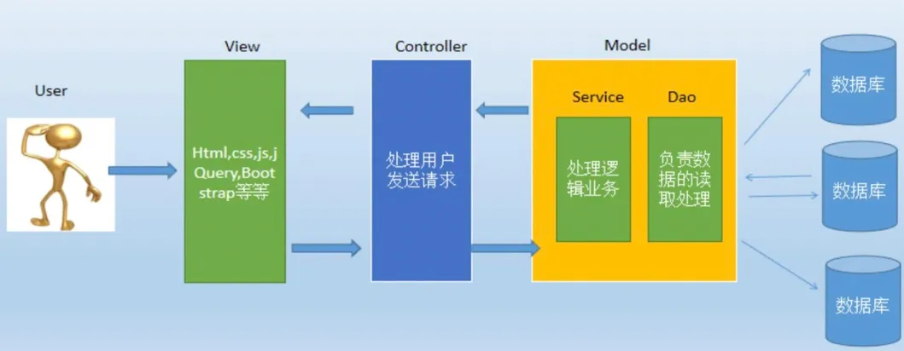

# Spring面试题

### Spring

#### 说一下你对 Spring 的理解？


我所理解的Spring框架核心特性包括4个方面：

- **IoC容器**：Spring通过控制反转帮助开发者实现了对象的创建和对象间的依赖关系管理。由此开发者只需要定义好Bean及其依赖关系，Spring容器负责实例化这些对象。
- **AOP**：面向切面编程，AOP开发者专注于核心业务逻辑开发，将事务管理、安全控制等周边业务逻辑模块化而开发者需要时复用即可，提高代码的可维护性和可重用性。
- **事务管理**：Spring提供了一致的事务管理接口，支持声明式和编程式事务。开发者可以轻松地进行事务管理，而无需关心具体的事务API。
- **MVC框架**：Spring MVC是建立在Java的标准Web技术(Servlet)之上，采用了模型-视图-控制器（MVC）架构。它支持灵活的URL到页面控制器的映射，以及多种视图技术（可以支持JOSN或者jsp页面还有其他试图技术）。

其中最常用的是IoC和AOP，Spring通过简化依赖管理和业务增强，显著提升了开发效率和代码质量。


**Q：声明式和编程式事务能简要介绍一下吗？**

声明式事务是指通过配置或注解的方式，**声明事务的行为**，不需要在代码中显式地编写事务管理的逻辑。Spring通过AOP（面向切面编程）来自动处理事务的开始、提交和回滚。开发者只需要在方法上标注相关注解或通过XML配置来声明事务规则。声明式事务特点是简洁易用，无需手动管理。

如下，`@Transactional`注解声明了事务管理，Spring会在执行`updateData()`时自动处理事务。

```java
@Transactional
public void updateData() {
    // 业务逻辑
}
```


编程式事务是指开发者**显式地编写代码来控制事务的开始、提交和回滚**。事务管理逻辑通过`TransactionManager`手动控制，开发者需要自己负责事务的开启、提交和回滚。特点是灵活控制同时与业务逻辑耦合没有采用面向切面编程（AOP）的思想。

如下，开发者手动控制事务的开始、提交和回滚。

```java
public void updateData() {
    PlatformTransactionManager transactionManager = ...;  // 获取事务管理器
    TransactionStatus status = transactionManager.getTransaction(new DefaultTransactionDefinition());
    try {
        // 执行业务逻辑
        transactionManager.commit(status);  // 提交事务
    } catch (Exception e) {
        transactionManager.rollback(status);  // 回滚事务
        throw e;
    }
}
```


#### Spring IoC和AOP 介绍一下

##### 1. IoC

IoC容器翻译过来就是控制反转容器。控制反转是一种创建和获取对象的技术思想，不通过像传统开发中使用new关键字创建对象，而是通过IoC容器来帮我们实例化对象，这种方式可以大大降低对象之间的耦合度。

基于此之外，Spring IoC还提供了Bean的生命周期管理。

依赖注入(DI)是实现这种IoC容器的一种方式，通过依赖注入，实现了多种注入方式构造器注入、setter注入、字段注入等。

同时Spring IoC提供了两种容器类型，BeanFactory(基础容器)和ApplicationContext(扩展容器)。


##### 2. AOP

AOP是面向切面编程，AOP开发者专注于核心业务逻辑开发，而Spring AOP将那些与业务无关，却为业务模块所共同调用的逻辑封装起来，以减少重复代码和降低耦合度。

Spring AOP 就是基于动态代理的有两种动态代理方式JDK动态代理和CGLIB动态代理

- 默认使用JDK动态代理，一般就是对接口进行代理。

- 当目标类没有实现接口时，Spring会使用进行代理

AOP主要用于自动实现日志记录、性能统计、安全控制、事务处理、异常处理等横切，由开发者通过XML文件或者注解来复用即可。


在 Spring 框架中，IOC 和 AOP 结合使用，可以更好地实现代码的模块化和分层管理。例如：

- 通过 IOC 容器管理对象的依赖关系，然后通过 AOP 将横切关注点统一切入到需要的业务逻辑中。
- 使用 IOC 容器管理 Service 层和 DAO 层的依赖关系，然后通过 AOP 在 Service 层实现事务管理、日志记录等横切功能，使得业务逻辑更加清晰和可维护。


**Q：讲讲MVC分层？**

A：自底向上，一共4层。

- **持久层**即dao层（mapper）层，主要是做数据持久层的工作，负责与数据库进行联络的一些任务都封装在此。

- **业务层**即Service层，这一层主要负责业务模块的逻辑应用设计。先设计接口然后再设计实类，然后再在Spring的配置文件中配置其实现的关联。

- **表现层**即Controller层（Handler层）负责具体的业务模块流程的控制。

- **视图层**即View层主要和控制层紧密结合，主要负责前台jsp页面的表示。


#### Spring的aop展开介绍一下

Java 是一门面向对象编程的语言，在面向对象编程 OOP 中最小的单元就是 Class 对象，关注的是对象之间的关系和交互。但是在面向切面编程 AOP 中最小的单元是 **切面**，关注的是**在多个对象之间共同复用的功能**（横切关注点）。

而Spring AOP是Spring框架中用于实现面向切面编程的重要模块。在Spring AOP面向切面编程的思想里面，把功能分为核心业务和周边功能两种。

- **核心业务**：登陆、注册、增、删、改、查、都叫核心业务
- **周边功能**：日志、事务管理这些次要的为周边业务

**在面向切面编程中，核心业务功能和周边功能是分别独立进行开发，两者不是耦合的，然后把切面功能和核心业务功能 "编织" 在一起。**

所以有了Spring AOP，开发者专注于核心业务逻辑开发，**将事务管理、安全控制等周边业务逻辑模块化而开发者需要时复用即可**，提高代码的可维护性和可重用性。

Spring AOP 是基于代理模式实现，有两种动态代理方式JDK动态代理和CGLIB动态代理。

- 默认使用JDK动态代理，一般就是对接口进行代理。

- 当目标类没有实现接口时，Spring会使用进行代理

AOP主要用于自动实现日志记录、性能统计、安全控制、事务处理、异常处理等横切，由开发者通过XML文件或者注解来复用即可。


在 AOP 中有以下几个概念：

- **AspectJ**：切面，只是一个概念，没有具体的接口或类与之对应，是 Join point，Advice 和 Pointcut 的一个统称。
- **Join point**：连接点，指程序执行过程中的一个点，例如方法调用、异常处理等。在 Spring AOP 中，仅支持方法级别的连接点。
- **Advice**：通知，即我们定义的一个切面中的横切逻辑，有“around”，“before”和“after”三种类型。在很多的 AOP 实现框架中，Advice 通常作为一个拦截器，也可以包含许多个拦截器作为一条链路围绕着 Join point 进行处理。
- **Pointcut**：切点，用于匹配连接点，一个 AspectJ 中包含哪些 Join point 需要由 Pointcut 进行筛选。
- **Introduction**：引介，让一个切面可以声明被通知的对象实现任何他们没有真正实现的额外的接口。例如可以让一个代理对象代理两个目标类。
- **Weaving**：织入，在有了连接点、切点、通知以及切面，如何将它们应用到程序中呢？没错，就是织入，在切点的引导下，将通知逻辑插入到目标方法上，使得我们的通知逻辑在方法调用时得以执行。
- **AOP proxy**：AOP 代理，指在 AOP 实现框架中实现切面协议的对象。在 Spring AOP 中有两种代理，分别是 JDK 动态代理和 CGLIB 动态代理。
- **Target object**：目标对象，就是被代理的对象。


#### IOC和AOP是通过什么机制来实现的?

##### 1. Spring IOC 实现机制

Spring IoC（控制反转）是通过**容器管理对象**及其**依赖关系**来实现的，主要依赖以下技术和机制：

- **反射**：Spring IOC容器利用Java的反射机制，运行时动态创建对象实例，并调用对象的方法。反射使Spring能够在不直接使用`new`关键字的情况下实例化类并设置属性，从而**解耦对象的创建和管理**。
- **依赖注入**：IOC的**核心概念是依赖注入**，即容器负责管理应用程序组件之间的依赖关系。Spring通过构造函数注入、属性注入或方法注入，将组件之间的依赖关系描述在配置文件中或使用注解。
- **设计模式 - 工厂模式**：Spring IoC容器本质上是一个工厂，负责创建和管理Bean，默认情况下，Spring IoC管理的Bean是**单例的**，即同一个Bean在整个容器中只会创建**一个实例**，然后在全局中使用这个实例。
- **容器实现**：Spring IOC容器是实现IOC的核心，通常使用BeanFactory或ApplicationContext来管理Bean。**BeanFactory是IOC容器的基本形式，提供基本的IOC功能（如依赖注入功能，延迟加载Bean）。**ApplicationContext是BeanFactory的扩展，并提供更多企业级功能（**事件发布、国际化、AOP支持**等，通常用扩展容器）。


##### 2. Spring AOP 实现机制

Spring AOP的**核心思想**是通过**动态代理**，在**运行时**为目标对象**添加额外的行为（如事务管理、日志记录）**，而无需修改原始代码。设计模式是代理模式，所以AOP增强Bean的情况下，Spring IOC会使用**代理模式**来管理对象的访问。

Spring AOP支持两种动态代理：

- **基于JDK的动态代理**：使用java.lang.reflect.Proxy类和java.lang.reflect.InvocationHandler接口实现。这种方式需要代理的类实现一个或多个接口。
- **基于CGLIB的动态代理**：当被代理的类没有实现接口时，Spring会使用CGLIB库生成一个被代理类的子类作为代理。CGLIB（Code Generation Library）是一个第三方代码生成库，通过继承方式实现代理。


#### 怎么理解SpringIoc？

**IoC（控制反转）** 是一种 **设计思想**，它的核心目标是**降低代码之间的耦合**，使对象的创建和管理由**容器**来负责，而不是由程序本身**手动创建对象**。


##### 1. **传统 Java SE 方式 vs. Spring IoC**

在传统的 Java SE 程序设计中，开发者直接在对象内部通过 new 的方式来创建对象，是程序主动创建依赖对象；


在 **Spring IoC 机制** 中，**对象的创建、依赖的注入以及销毁等生命周期管理都由Spring容器完成**，开发者只需要**声明**对象的依赖关系，Spring IoC 容器会自动管理。


##### 2. **IoC 的核心概念**

**所谓控制**就是对象的创建、初始化、销毁。

- 创建对象：原来是 new 一个，现在是由 Spring IoC容器创建并管理对象生命周期。
- 初始化对象：原来是对象自己通过构造器或者 setter 方法给依赖的对象赋值，现在是由 Spring 容器自动注入。
- 销毁对象：原来是直接给对象赋值 null 或做一些销毁操作，现在是 Spring 容器管理生命周期负责销毁对象。


**所谓反转**就是反转的控制权。

在**控制**里提到是由 Spring 来控制对象的生命周期，那么对象的控制就完全脱离了开发者的控制，控制权交给了 Spring 。这个反转是指：对象的控制者由开发者变成了Spring IoC ，即**Spring 通过 IoC 使对象的创建、依赖注入和销毁的过程由"手动管理"转变为"自动管理"。**


#### 依赖倒置，依赖注入，控制反转分别是什么？

控制反转中的**“控制”**指的是**开发者对程序执行流程的控制**，而**“反转”**指的是在没有使用框架之前，开发者自己控制整个程序的执行。在使用框架之后，整个程序的执行流程通过框架来控制。**流程的控制权从开发者“反转”给了框架。**

依赖注入是一种具体的编码技巧。我们不通过 new 的方式在类内部创建依赖类的对象，而是将依赖的类对象在外部创建好之后，通过构造函数、函数参数等方式传递（或注入）给类来使用，依赖注入是 Spring实现控制反转的具体实现方式。

依赖倒置是是面向对象设计原则之一，主要用来指导框架层面的设计。主要有两个内容第一是高层模块不依赖低层模块，它们共同依赖同一个抽象。第二是抽象不要依赖具体实现细节，具体实现细节依赖抽象。


**这三者之间的关系是：依赖倒置原则是设计原则，控制反转是实现这一原则的一种方式，而依赖注入是控制反转的具体实现技术。**


#### 如果让你设计一个SpringIoc，你觉得会从哪些方面考虑这个设计？*

Spring IoC的核心是将对象的创建和依赖关系的管理从开发者手中转移到 Spring 容器中。通过 IoC，开发者不需要手动通过 `new` 关键字创建对象，而是由 Spring 容器负责对象的生命周期管理和依赖注入。

Spring IoC 的实现基于工厂模式和依赖注入模式。Spring 容器本质上是一个高级的工厂（`BeanFactory`），它负责根据配置（XML、注解或 Java 配置类）创建和管理 Bean 的实例。依赖注入（Dependency Injection, DI）是 IoC 的具体实现方式，Spring 通过构造函数注入、Setter 注入或字段注入的方式，将依赖对象动态注入到目标对象中。具体来说可以在以下几个方面进行：

* Bean 的定义与注册：要支持多种配置方式（XML、注解、Java 配置类）。使用 `BeanDefinition` 存储 Bean 的元数据（如类名、作用域、依赖关系等）。

- Bean的生命周期管理：需要设计Bean的创建、初始化、销毁等生命周期管理机制，可以考虑使用工厂模式和单例模式来实现。
- Bean的作用域：需要支持多种Bean作用域，比如单例、原型、会话、请求等，可以考虑使用Map来存储不同作用域的Bean实例。
- Bean 的实例化和依赖注入：需要实现依赖注入的功能，包括属性注入、构造函数注入、方法注入等。可以考虑使用反射机制和XML配置文件来实现Bean 的实例化和依赖注入。也要考虑到处理循环依赖问题，可以使用三级缓存（提前暴露半成品对象）。
- AOP功能的支持：需要支持AOP功能，可以考虑使用动态代理机制和切面编程来实现。
- 异常处理：需要考虑异常处理机制，包括Bean创建异常、依赖注入异常等，可以考虑使用try-catch机制来处理异常。
- 配置文件加载：需要支持从不同的配置文件中加载Bean的相关信息，可以考虑使用XML、注解或者Java配置类来实现。


#### SpringAOP主要想解决什么问题？

**AOP 的核心目标是解决横切关注点（Cross-Cutting Concerns）的问题**。横切关注点是指那些分散在多个模块中、与核心业务逻辑无关但必须存在的功能（如日志、事务、权限校验）。这些功能如果直接嵌入在业务代码中，会导致代码重复、耦合度高、难以维护。**AOP 通过将这些横切关注点模块化，并将其与核心业务逻辑分离，从而实现代码的复用和解耦。**

- **核心业务**：登陆、注册、增、删、改、查、都叫核心业务
- **周边功能**：日志、事务管理这些次要的为周边业务

所以有了Spring AOP，开发者专注于核心业务逻辑开发，**将事务管理、安全控制等周边业务逻辑模块化而开发者需要时复用即可**，提高代码的可维护性和可重用性。

Spring AOP 是基于代理模式实现，有两种动态代理方式JDK动态代理和CGLIB动态代理。

- 默认使用JDK动态代理，一般就是对接口进行代理。
- 当目标类没有实现接口时，Spring会使用进行代理

AOP主要用于自动实现日志记录、性能统计、安全控制、事务处理、异常处理等横切，由开发者通过XML文件或者注解来复用即可。


**Q：举个例子理解一下？**

A：如打印日志。需要打印日志可能是许多对象的一个共性，这在企业级开发中十分常见，但是日志的打印并不反应这个对象的主要共性。而日志的打印又是一个具体的内容，它并不抽象，所以它的工作也不可以用接口来完成。而如果利用继承，打印日志的工作又横跨继承树下面的多个同级子节点，强行侵入到继承树内进行归纳会干扰这些强共性的区分。

这时候，我们就需要AOP了。AOP首先在一个Aspect（切面）里定义了一些Advice（增强），其中包含具体实现的代码，同时整理了切入点，切入点的粒度是方法。最后，我们将这些Advice织入到对象的方法上，形成了最后执行方法时面对的完整方法。


#### SpringAOP的原理了解吗？

Spring AOP的**核心思想**是通过**动态代理**，在**运行时**为目标对象**添加额外的行为（如事务管理、日志记录）**，而无需修改原始代码。设计模式是代理模式，所以AOP增强Bean的情况下，Spring IOC会使用**代理模式**来管理对象的访问。

Spring AOP支持两种动态代理方式：

##### 1. 基于JDK的动态代理 

基于JDK的动态代理使用java.lang.reflect.Proxy类和java.lang.reflect.InvocationHandler接口实现。这种方式需要代理的类实现一个或多个接口。

这种方式的特点在于代理对象与目标对象是兄弟关系（实现同一接口）。且JDK 动态代理是 Java 原生支持的，无需引入额外依赖。


##### 2. 基于CGLIB的动态代理

在使用基于CGLIB的动态代理时，若被代理的类没有实现接口，Spring会使用CGLIB库生成一个被代理类的子类作为代理。CGLIB（Code Generation Library）是一个第三方代码生成库，通过继承方式实现代理。

这种方式特点在于代理对象与目标对象是父子关系（继承关系）。且CGLIB 无法代理 `final` 类或 `final` 方法（因为需要继承）。但需要引入 `cglib` 依赖（Spring 核心包已包含）。


**传统 Spring 框架**，默认使用 **JDK 动态代理**。若未实现接口，则使用 CGLIB 代理。**但Spring Boot 2.0版本以后默认统一使用 CGLIB 代理，以简化配置并支持更多场景。**


**Q：CGLIB 代理相比JDK动态代理好在哪里？**

A：CGLIB 动态代理相比 JDK 动态代理的主要优点在于：

* **无需实现接口**，JDK 动态代理要求目标类必须实现接口，而 CGLIB 动态代理通过继承方式创建目标类的子类， CGLIB 在没有接口的类中更具灵活性。

* **支持代理类中的所有方法**，JDK 动态代理只能代理接口中定义的方法，而 CGLIB 可以代理目标类中的所有方法，甚至包括那些在接口中没有声明的方法。

* **性能相对较高**，JDK 动态代理通过反射机制调用目标方法，反射的开销较大；而 CGLIB 通过直接子类继承的方式，性能相对较好。


#### 动态代理是什么？

Java的动态代理是一种在运行时动态创建代理对象的机制，主要用于在不修改原始类的情况下对方法调用进行拦截和增强。Java动态代理主要分为两种类型。

##### 1. 基于JDK的动态代理 

基于JDK的动态代理使用java.lang.reflect.Proxy类和java.lang.reflect.InvocationHandler接口实现。这种方式需要代理的类实现一个或多个接口。

这种方式的特点在于代理对象与目标对象是兄弟关系（实现同一接口）。且JDK 动态代理是 Java 原生支持的，无需引入额外依赖。


##### 2. 基于CGLIB的动态代理

在使用基于CGLIB的动态代理时，若被代理的类没有实现接口，Spring会使用CGLIB库生成一个被代理类的子类作为代理。CGLIB（Code Generation Library）是一个第三方代码生成库，通过继承方式实现代理。

这种方式特点在于代理对象与目标对象是父子关系（继承关系）。且CGLIB 无法代理 `final` 类或 `final` 方法（因为需要继承）。但需要引入 `cglib` 依赖（Spring 核心包已包含）。


**Q：说一说两种代理方式的底层是基于什么的所以特性不相同？**

A：JDK动态代理生成的代理类继承`Proxy`类，因此目标类**必须实现接口**（Java单继承限制），底层通过反射机制调用目标方法。CGLIB通过`Enhancer`创建代理对象和`MethodInterceptor`接口实现方法拦截，依赖ASM库操作字节码来直接操作类的方法。

| **代理方式** | **JDK动态代理**                  | **CGLIB动态代理**                |
| ------------ | -------------------------------- | -------------------------------- |
| **实现方式** | 实现接口，继承`Proxy`类          | 继承目标类，重写方法             |
| **依赖**     | 目标类必须实现接口               | 无接口要求                       |
| **性能**     | 反射调用（JDK8+优化后接近CGLIB） | 直接调用（运行时高效，启动稍慢） |
| **限制**     | 无法代理无接口的类               | 无法代理`final`类/方法           |
| **底层工具** | Java原生反射机制                 | ASM字节码库                      |


#### 动态代理和静态代理的区别？*

代理是一种常用的设计模式，目的是：为其他对象提供一个代理以控制对某个对象的访问，将两个类的关系解耦。代理类和委托类都要实现相同的接口，因为代理真正调用的是委托类的方法。

区别：

- 静态代理：由程序员创建或者是由特定工具创建，在代码编译时就确定了被代理的类是一个静态代理。静态代理通常只代理一个类；
- 动态代理：在代码运行期间，运用反射机制动态创建生成。动态代理代理的是一个接口下的多个实现类。

| **特性**     | **静态代理**                           | **动态代理**                              |
| ------------ | -------------------------------------- | ----------------------------------------- |
| **实现时机** | 编译时手动编写代理类                   | 运行时动态生成代理类                      |
| **代码量**   | 每个被代理类需单独编写代理类，代码冗余 | 一个动态代理类可代理多个接口或类          |
| **灵活性**   | 修改代理逻辑需修改源码                 | 通过回调（如`InvocationHandler`）灵活扩展 |
| **适用场景** | 简单场景或代理固定类                   | 需统一处理多个类或复杂逻辑（如AOP）       |
| **依赖关系** | 代理类直接依赖具体实现类               | 代理类仅依赖接口或抽象                    |


**Q：举一个代理模式的例子？**

A：设**场景**为记录用户服务方法耗时。

静态代理定义接口

```java
public interface UserService {
    void addUser(String name);
}
```

静态代理实现类（委托类）

```java
public class UserServiceImpl implements UserService {
    @Override
    public void addUser(String name) {
        System.out.println("添加用户: " + name);
    }
}
```

静态代理类需手动编写代理，需实现相同接口：

```java
public class UserServiceStaticProxy implements UserService {
    private final UserService target;  // 委托对象

    public UserServiceStaticProxy(UserService target) {
        this.target = target;
    }

    @Override
    public void addUser(String name) {
        long start = System.currentTimeMillis();
        target.addUser(name);  // 调用委托类方法
        long end = System.currentTimeMillis();
        System.out.println("方法耗时: " + (end - start) + "ms");
    }
}
```

最后，使用静态代理

```java
public class Main {
    public static void main(String[] args) {
        UserService target = new UserServiceImpl();
        UserService proxy = new UserServiceStaticProxy(target);
        proxy.addUser("张三");  // 输出：添加用户: 张三 → 方法耗时: 1ms
    }
}
```

---

动态代理示例（基于JDK），首先实现InvocationHandler

```java
public class LogInvocationHandler implements InvocationHandler {
    private final Object target;  // 可代理任意对象

    public LogInvocationHandler(Object target) {
        this.target = target;
    }

    @Override
    public Object invoke(Object proxy, Method method, Object[] args) throws Throwable {
        long start = System.currentTimeMillis();
        Object result = method.invoke(target, args);  // 反射调用目标方法
        long end = System.currentTimeMillis();
        System.out.println("方法耗时: " + (end - start) + "ms");
        return result;
    }
}
```

接着使用动态代理

```java
public class Main {
    public static void main(String[] args) {
        UserService target = new UserServiceImpl();
        // 动态生成代理对象
        UserService proxy = (UserService) Proxy.newProxyInstance(
            target.getClass().getClassLoader(),
            target.getClass().getInterfaces(),
            new LogInvocationHandler(target)
        );
        proxy.addUser("李四");  // 输出：添加用户: 李四 → 方法耗时: 0ms
    }
}
```

直观而言**静态代理**属于简单直接，但代码冗余，适合代理固定类。**动态代理**则灵活高效，适合代理多个类或需要统一处理的场景（如日志、事务）。  动态代理通过**运行时生成代理类** + **反射/字节码增强**，实现了对原有逻辑的无侵入扩展。


#### AOP实现有哪些注解？

常用的注解包括：

- @Aspect：用于定义切面，标注在切面类上。
- @Pointcut：定义切点，标注在方法上，用于指定连接点。
- @Before：在方法执行之前执行通知。
- @After：在方法执行之后执行通知。
- @Around：在方法执行前后都执行通知。
- @AfterReturning：在方法执行后返回结果后执行通知。
- @AfterThrowing：在方法抛出异常后执行通知。
- @Advice：通用的通知类型，可以替代@Before、@After等。


#### Spring的事务什么情况下会失效？*

Spring Boot通过Spring框架的事务管理模块来支持事务操作。事务管理在Spring Boot中通常是通过 @Transactional 注解来实现的。事务可能会失效的一些常见情况包括:

1. **异常未被正确抛出**

   - **问题**：默认情况下，只有抛出 `RuntimeException` 或 `Error` 时事务才会回滚。如果事务方法中抛出了受检异常（如 `Exception` 的子类）且未通过 `@Transactional(rollbackFor = Exception.class)` 显式配置，事务不会回滚。
   - **修正**：若异常被 `try-catch` 捕获且未重新抛出，事务会正常提交（不会回滚），但这属于业务逻辑错误，而非事务失效。

2. **非 public 方法使用 @Transactional**

   - **问题**：Spring 基于代理（JDK 动态代理或 CGLIB）实现事务。若将 `@Transactional` 标注在非 `public` 方法上，代理无法拦截方法调用，导致事务未生效。
   - **补充**：CGLIB 代理可支持 `protected` 方法，但需显式配置（如 `@EnableAspectJAutoProxy(proxyTargetClass = true)`），但通常不推荐这样做。

3. **自调用问题（同一类内部方法调用）**

   - **问题**：在 Spring 中，事务管理是通过代理机制实现的。当你在一个类中调用另一个带有 `@Transactional` 注解的方法时，如果直接通过 `this` 调用（即内部调用），Spring 的代理机制无法拦截该方法，导致事务失效。

   - **示例**：Spring 的事务管理基于代理（JDK 动态代理或 CGLIB 代理）。当调用 `A()` 时，`A()` 是直接通过 `this` 调用 `B()`，而不是通过代理对象调用。因此，`B()` 的 `@Transactional` 注解不会被代理拦截，事务不会生效。

     ```java
     @Service
     public class UserService {
         public void A() {
             this.B(); // 直接调用，事务失效
         }
         @Transactional
         public void B() {
             // 数据库操作
         }
     }
     ```

   - **解决方案**：通过注入自身代理对象或拆分到不同类中调用。

     ```java
     @Service
     public class UserService {
         @Autowired
         private AnotherService anotherService;
     
         public void A() {
             anotherService.B(); // 通过另一个类的代理对象调用，事务生效
         }
     }
     
     @Service
     public class AnotherService {
         @Transactional
         public void B() {
             // 数据库操作
         }
     }
     ```

4. **事务传播行为配置不当**

   - **问题**：Spring 提供了多种事务传播行为（如 `REQUIRED`、`REQUIRES_NEW` 等），用于控制事务的边界和嵌套行为。如果传播行为配置不当，可能导致事务未按预期执行。若嵌套事务的传播行为未正确配置，可能导致事务未按预期隔离或提交。

   - **示例**：父事务 `A` 调用子事务 `B`。子事务 `B` 配置为 `REQUIRES_NEW`，表示无论父事务是否存在，`B` 都会启动一个新事务。如果 `B` 执行时抛出异常，但异常未被传播到父事务 `A`，则 `B` 会回滚，而 `A` 不会回滚。

     ```java
     @Service
     public class UserService {
         @Autowired
         private AnotherService anotherService;
     
         @Transactional
         public void A() {
             try {
                 anotherService.B(); // 子事务 B，配置为 REQUIRES_NEW
             } catch (Exception e) {
                 // 捕获异常，未传播到父事务
             }
             // 父事务 A 继续执行
         }
     }
     
     @Service
     public class AnotherService {
         @Transactional(propagation = Propagation.REQUIRES_NEW)
         public void B() {
             // 数据库操作
             throw new RuntimeException("B 抛出异常");
         }
     }
     ```

5. **多数据源未正确配置事务管理器**

   - **问题**：多数据源场景下，若未通过 `@Transactional(value = "txManager2")` 指定对应的事务管理器，事务可能绑定到默认数据源，导致操作失效。
   - **补充**：需为每个数据源配置独立的 `PlatformTransactionManager`。

6. **数据库引擎不支持事务**

   - **问题**：如 MySQL 的 MyISAM 引擎不支持事务，即使代码正确，事务也不会生效。

7. **未启用事务管理**

   - **问题**：Spring Boot 需依赖 `@EnableTransactionManagement`（默认自动配置）启用事务。若配置被覆盖或禁用，事务失效。

8. **@Transactional 注解作用在接口或抽象方法上**

   - **问题**：JDK 动态代理通过接口生成代理类，但 CGLIB 代理通过子类化实现。若使用 CGLIB 且 `@Transactional` 标注在接口方法上，可能导致事务未生效（取决于代理方式）。


**Q：讲一讲事务传播行为`REQUIRED`、`REQUIRES_NEW` 等？（扩展了解）**

A：事务传播行为是 Spring 事务管理中的一个核心概念，用于定义事务方法之间的交互方式。事务传播行为定义了当一个事务方法被另一个事务方法调用时，事务应该如何传播。Spring 提供了 7 种传播行为，常见的有三种：

- **REQUIRED（默认）**，即如果当前存在事务，则加入该事务；如果当前没有事务，则创建一个新事务。大多数业务方法都使用 `REQUIRED`，因为它能保证方法在事务中执行。
- **REQUIRES_NEW**，无论当前是否存在事务，都创建一个新事务。如果当前存在事务，则将当前事务挂起，直到新事务完成。适用于需要独立事务的方法，例如日志记录或异步任务。
- **NESTED**，如果当前存在事务，则在嵌套事务中执行；如果当前没有事务，则创建一个新事务。适用于需要部分回滚的场景，嵌套事务可以独立回滚而不影响外层事务。


当使用 `REQUIRES_NEW` 时，如果内层方法抛出异常但未被外层方法捕获，内层事务会回滚，而外层事务会继续执行。这可能导致数据不一致。

```java
导致数据不一致@Service
public class UserService {
    @Autowired
    private AnotherService anotherService;

    @Transactional
    public void outerMethod() {
        // 外层事务操作
        try {
            anotherService.innerMethod(); // 内层方法，配置为 REQUIRES_NEW
        } catch (Exception e) {
            // 捕获异常，外层事务继续执行
        }
        // 外层事务继续执行，导致数据不一致
    }
}

@Service
public class AnotherService {
    @Transactional(propagation = Propagation.REQUIRES_NEW)
    public void innerMethod() {
        // 内层事务操作
        throw new RuntimeException("内层方法抛出异常");
    }
}
```

要确保异常传播到外层事务，或在捕获异常后在`catch`块手动回滚外层事务。或使用 `@Transactional(rollbackFor = Exception.class)` 明确回滚规则。


但当使用 `REQUIRED` 时，如果内层方法抛出异常，外层事务会整体回滚。这可能导致外层事务的其他操作也被回滚，所以也需注意。如果希望外层事务继续执行，可以捕获异常并处理。如果希望内层方法独立回滚，可以使用 `REQUIRES_NEW`。

```java
@Service
public class UserService {
    @Autowired
    private AnotherService anotherService;

    @Transactional
    public void outerMethod() {
        // 外层事务操作
        anotherService.innerMethod(); // 内层方法，配置为 REQUIRED
        // 外层事务继续执行
    }
}

@Service
public class AnotherService {
    @Transactional(propagation = Propagation.REQUIRED)
    public void innerMethod() {
        // 内层事务操作
        throw new RuntimeException("内层方法抛出异常");
    }
}
```


`NESTED` 做了很好的隔离性，如果当前存在事务，则在嵌套事务中执行；如果当前没有事务，则创建一个新事务。嵌套事务可以独立回滚，而不影响外层事务。

和`REQUIRES_NEW`不同嵌套事务是外层事务的一部分，依赖于外层事务（`REQUIRES_NEW`是完全独立的新事务，与外层事务无关）。嵌套事务可以独立回滚，外层事务可以选择提交或回滚（`REQUIRED`必会回滚）。

```java
@Service
public class UserService {
    @Autowired
    private AnotherService anotherService;

    @Transactional
    public void outerMethod() {
        // 外层事务操作
        try {
            anotherService.innerMethod(); // 内层方法，配置为 NESTED
        } catch (Exception e) {
            // 捕获异常，外层事务继续执行
        }
        // 外层事务继续执行
    }
}

@Service
public class AnotherService {
    @Transactional(propagation = Propagation.NESTED)
    public void innerMethod() {
        // 内层事务操作
        throw new RuntimeException("内层方法抛出异常");
    }
}
```

| 传播行为         | 事务关系           | 回滚影响                     | 独立性       | 适用场景                   |
| ---------------- | ------------------ | ---------------------------- | ------------ | -------------------------- |
| **REQUIRED**     | 合并到同一事务     | 内层回滚导致外层完全回滚     | 无           | 原子性要求高的业务操作     |
| **REQUIRES_NEW** | 独立事务，外层挂起 | 内层回滚不影响外层           | 完全独立     | 独立子操作（如日志、异步） |
| **NESTED**       | 嵌套事务（保存点） | 内层回滚到保存点，外层可继续 | 依赖外层事务 | 部分回滚需求（如批量处理） |

- **REQUIRES_NEW 的问题**：内层事务回滚不会影响外层事务，可能导致数据不一致。
- **REQUIRED 的问题**：内层事务回滚会导致外层事务整体回滚。
- **NESTED 的优势**：适合复杂业务中需要部分回滚的精细控制，但需数据库支持。


#### Spring的事务，使用this调用是否生效？

不能生效。

因为Spring事务是通过代理对象来控制的，只有通过代理对象的方法调用才会应用事务管理的相关规则。当使用`this`直接调用时，是绕过了Spring的代理机制，因此不会应用事务设置。


#### 什么是反射？有哪些使用场景？

反射（Reflection）是Java语言的一种机制，本质上是**通过获取类的Class对象，动态访问和操作类的完整信息（如类名、方法、字段、构造器等），并能够直接操作类或对象的属性、方法，甚至修改私有成员**。使得Java程序可以在编译期不明确具体类的情况下，动态加载和运行代码。

反射具有以下特性：

1. **运行时类信息访问**：反射机制允许程序在运行时获取类的完整结构信息，包括类名、包名、父类、实现的接口、构造函数、方法和字段等。
2. **动态对象创建**：可以使用反射API动态地创建对象实例，即使在编译时不知道具体的类名。这是通过Class类的newInstance()方法或Constructor对象的newInstance()方法实现的。
3. **动态方法调用**：可以在运行时动态地调用对象的方法，包括私有方法。这通过Method类的invoke()方法实现，允许你传入对象实例和参数值来执行方法。
4. **访问和修改字段值**：反射还允许程序在运行时访问和修改对象的字段值，即使是私有的。这是通过Field类的get()和set()方法完成的。


反射机制在实际工程中促进**松耦合、高内聚**的设计，以及提供动态、灵活的编程能力。在spring框架中，很多地方都用到了反射。

##### 1. Spring框架的依赖注入（DI）和控制反转（IoC）

Spring 使用反射来实现其核心特性：依赖注入。

在Spring中，开发者可以通过XML配置文件或者基于注解的方式声明组件之间的依赖关系。当应用程序启动时，Spring容器会扫描这些配置或注解，然后利用反射来实例化Bean（即Java对象），并根据配置自动装配它们的依赖。

例如，当一个Service类需要依赖另一个DAO类时，开发者可以在Service类中使用@Autowired注解，而无需自己编写创建DAO实例的代码。Spring容器会在运行时解析这个注解，通过反射找到对应的DAO类，实例化它，并将其注入到Service类中。这样不仅降低了组件之间的耦合度，也极大地增强了代码的可维护性和可测试性。


##### 2. Spring AOP（面向切面编程）的实现

Spring AOP允许开发者定义切面（Aspect），这些切面可以横切关注点（如日志记录、事务管理），并将其插入到业务逻辑中，而不需要修改业务逻辑代码。

例如，为了给所有的服务层方法添加日志记录功能，可以定义一个切面，在这个切面中，Spring会使用JDK动态代理或CGLIB（如果目标类没有实现接口）来创建目标类的代理对象。这个代理对象在调用任何方法前或后，都会执行切面中定义的代码逻辑（如记录日志），而这一切都是在运行时通过反射来动态构建和执行的，无需硬编码到每个方法调用中。


#### spring三级缓存的数据结构是什么？

都是 Map类型的缓存，比如Map {k:name; v:bean}。

1. **一级缓存（Singleton Objects）**：这是一个Map类型的缓存，存储的是已经完全初始化好的bean，即完全准备好可以使用的bean实例。键是bean的名称，值是bean的实例。这个缓存在`DefaultSingletonBeanRegistry`类中的`singletonObjects`属性中。
2. **二级缓存（Early Singleton Objects）**：这同样是一个Map类型的缓存，存储的是早期的bean引用，即已经实例化但还未完全初始化的bean。这些bean已经被实例化，但是可能还没有进行属性注入等操作。这个缓存在`DefaultSingletonBeanRegistry`类中的`earlySingletonObjects`属性中。
3. **三级缓存（Singleton Factories）**：这也是一个Map类型的缓存，存储的是ObjectFactory对象，这个工厂对象可以生成早期的bean引用。当一个bean正在创建过程中，如果它被其他bean依赖，那么这个正在创建的bean就会通过这个ObjectFactory来创建一个早期引用，从而解决循环依赖的问题。这个缓存在`DefaultSingletonBeanRegistry`类中的`singletonFactories`属性中。

| **缓存名称**                          | **数据结构**        | **存储内容**                                      |
| ------------------------------------- | ------------------- | ------------------------------------------------- |
| **一级缓存**（singletonObjects）      | `ConcurrentHashMap` | 完全初始化好的单例Bean（成品对象）。              |
| **二级缓存**（earlySingletonObjects） | `HashMap`           | 已实例化但未初始化的Bean（半成品对象）。          |
| **三级缓存**（singletonFactories）    | `HashMap`           | Bean的`ObjectFactory`工厂（用于生成半成品对象）。 |


**Q：为什么需要三级缓存？**

A：**一级缓存**（singletonObjects）用来存储完全初始化好的单例Bean（成品对象）。但**三级缓存（singletonFactories）**可以存储`ObjectFactory`工厂，用于生成Bean的**早期引用（可能是代理对象）**。如若A被AOP代理，则通过`ObjectFactory`提前暴露代理对象，而非原始对象。

而**二级缓存（earlySingletonObjects）**作用在于当一个 Bean 正在创建过程中，其他依赖于它的 Bean 可能会请求该 Bean。此时，Spring 可以从二级缓存中获取该 Bean 的早期引用，从而避免再次执行三级缓存中的 `ObjectFactory.getObject()`，提高性能。

如果没有AOP代理，三级缓存可退化为二级缓存，因为在没有代理的情况下，Bean 的早期引用和最终的 Bean 实例是相同的，Spring 不需要通过 `ObjectFactory` 来延迟创建。但为了兼容AOP等扩展机制，Spring保留三级缓存设计。

**一句话就是，三级缓存的设计使得 Spring 在解决 单例模式 下的循环依赖时非常高效，同时也支持了 AOP 代理等高级功能。**

所以二级缓存的目的是：

1. 二级缓存的主要目的是**避免重复创建同一个Bean的代理对象**
2. 如果没有二级缓存，每次从三级缓存获取Bean都会调用`getObject()`，可能导致同一个Bean创建多个不同的代理实例
3. 有了二级缓存，一旦对象（原始的或代理的）被创建，就会被缓存，后续请求直接返回缓存的对象


#### **spring是如何解决循环依赖的？**（似乎很重要）

循环依赖指的是两个类中的属性相互依赖对方：例如 A 类中有 B 属性，B 类中有 A属性，从而形成了一个依赖闭环，如下图。


循环依赖问题在Spring中主要有三种情况：

- 第一种：通过构造方法进行依赖注入时产生的循环依赖问题（创建对象时需要先调用构造函数，导致无限递归所以没有解决）
- 第二种：多例（原型）模式下产生的循环依赖问题（原型Bean不会被缓存，每次都会创建新实例）
- 第三种：通过setter方法进行依赖注入且是在单例模式下产生的循环依赖问题。


只有【第三种方式】的循环依赖问题被 Spring 解决了，其他两种方式在遇到循环依赖问题时，Spring都会产生异常。

Spring 解决单例模式下的setter循环依赖问题的主要方式是通过三级缓存解决循环依赖。三级缓存指的是 Spring 在创建 Bean 的过程中，通过三个级别的缓存来缓存正在创建的 Bean，以及已经创建完成的 Bean 实例。A和B互相依赖。具体步骤如下：

1. 开始创建Bean A:

   - 实例化A（此时A的属性还未赋值）

   - 将A的创建工厂放入三级缓存（singletonFactories）：

     ```java
     singletonFactories.put("beanA", () -> getEarlyBeanReference("beanA", mbd, instanceA));
     ```

   - 这个工厂方法`getEarlyBeanReference`会检查Bean是否需要被AOP代理

2. 为A注入依赖B:

   - 发现A依赖B，所以开始创建B

3. 开始创建Bean B:

   - 实例化B（同样，B的属性还未赋值）
   - 将B的创建工厂放入三级缓存

4. 为B注入依赖A:

   - 发现B依赖A，但A正在创建中（循环依赖发生）
   - 尝试从一级缓存找A，找不到
   - 尝试从二级缓存找A，找不到
   - 从三级缓存找到A的工厂，调用`factory.getObject()`
   - 这时，如果A需要被AOP代理，`getEarlyBeanReference`会创建A的代理对象
   - 将得到的A（可能是原始对象，也可能是代理对象）放入二级缓存
   - 从三级缓存移除A的工厂

5. 完成B的创建:

   - B获得了A的引用（可能是代理）
   - B完成属性填充，初始化，放入一级缓存

6. 回到A的创建过程:

   - A获得了B的完整引用
   - A完成属性填充，初始化
   - 检查A是否已经被提前代理（在步骤4中）
   - 如果已被代理，使用那个代理对象作为最终对象
   - 将最终的A放入一级缓存

通过三级缓存的机制，Spring 能够在处理循环依赖时，确保及时暴露正在创建的 Bean 对象，并能够正确地注入已经初始化的 Bean 实例，从而解决循环依赖问题，保证应用程序的正常运行。


#### spring框架中都用到了哪些设计模式？

- **工厂设计模式** : Spring使用工厂模式通过 BeanFactory、ApplicationContext 创建 bean 对象。
- **代理设计模式** : Spring AOP 功能的实现。
- **单例设计模式** : Spring 中的 Bean 默认都是单例的。
- **模板方法模式** : Spring 中 jdbcTemplate、hibernateTemplate 等以 Template 结尾的对数据库操作的类，它们就使用到了模板模式。
- **包装器设计模式** : 我们的项目需要连接多个数据库，而且不同的客户在每次访问中根据需要会去访问不同的数据库。这种模式让我们可以根据客户的需求能够动态切换不同的数据源。
- **观察者模式:** Spring 事件驱动模型就是观察者模式很经典的一个应用。
- **适配器模式** :Spring AOP 的增强或通知(Advice)使用到了适配器模式、spring MVC 中也是用到了适配器模式适配Controller。


#### spring **常用注解有什么？（似乎很重要）**

##### 1. @Autowired 注解

@Autowired：主要用于自动装配bean。当Spring容器中存在与要注入的属性类型匹配的bean时，它会自动将bean注入到属性中。就跟我们new 对象一样。

用法很简单，如下示例代码：

```java
@Component
public class MyService {
}

@Component
public class MyController {

    @Autowired
    private MyService myService;

}
```

在上面的示例代码中，MyController类中的myService属性被@Autowired注解标记，Spring会自动将MyService类型的bean注入到myService属性中。


##### 2. @Component

这个注解用于标记一个类作为Spring的bean。当一个类被@Component注解标记时，Spring会将其实例化为一个bean，并将其添加到Spring容器中。在上面讲解@Autowired的时候也看到了，示例代码：

```java
@Component
public class MyComponent {
}
```

在上面的示例代码中，MyComponent类被@Component注解标记，Spring会将其实例化为一个bean，并将其添加到Spring容器中。


##### 3. @Configuration

@Configuration，注解用于标记一个类作为Spring的配置类。配置类可以包含@Bean注解的方法，用于定义和配置bean，作为全局配置。示例代码：

```java
@Configuration
public class MyConfiguration {

    @Bean
    public MyBean myBean() {
        return new MyBean();
    }

}
```


##### 4. @Bean

@Bean注解用于标记一个方法作为Spring的bean工厂方法。当一个方法被@Bean注解标记时，Spring会将该方法的返回值作为一个bean，并将其添加到Spring容器中，如果自定义配置，经常用到这个注解。

```java
@Configuration
public class MyConfiguration {

    @Bean
    public MyBean myBean() {
        return new MyBean();

    }

}
```


##### 4. @Service

@Service，这个注解用于标记一个类作为服务层的组件。它是@Component注解的特例，用于标记服务层的bean，一般标记在业务service的实现类。

```java
@Service
public class MyServiceImpl {

}
```


##### 5. @Repository

@Repository注解用于标记一个类作为数据访问层的组件。它也是@Component注解的特例，用于标记数据访问层的bean。这个注解很容易被忽略，导致数据库无法访问。

```java
@Repository
public class MyRepository {

}
```

在上面的示例代码中，MyRepository类被@Repository注解标记，Spring会将其实例化为一个bean，并将其添加到Spring容器中。


##### 6. @Controller

@Controller注解用于标记一个类作为控制层的组件。它也是@Component注解的特例，用于标记控制层的bean。这是MVC结构的另一个部分，加在控制层

```java
@Controller
public class MyController {

}
```

在上面的示例代码中，MyController类被@Controller注解标记，Spring会将其实例化为一个bean，并将其添加到Spring容器中。


#### Bean的生命周期说一下？


Bean 的生命周期是 Spring 框架中一个重要的概念，它描述了 Bean 从创建到销毁的完整过程。以下是 Bean 生命周期的详细stages：

1. **Bean 定义阶段**：最初始的阶段，Spring容器通过读取XML配置文件、注解或Java配置类来获取Bean的定义信息。
2. **Bean 实例化阶段**：Spring 使用反射机制创建 Bean 实例，调用无参构造方法创建对象
3. **依赖注入阶段**：通过 `@Autowired`、`setter` 方法或构造函数注入依赖，解析并注入相关的依赖对象
4. **Bean 初始化阶段**：执行 `@PostConstruct` 注解标注的方法或调用 `InitializingBean` 接口的 `afterPropertiesSet()` 方法或执行自定义的 `init-method`，这三种初始化方法可以共存，如果共存，按照先后顺序来进行执行。
5. **Bean 可用阶段**：Bean 完全初始化，可以被应用程序使用，处理业务逻辑。
6. **Bean 销毁阶段**：容器关闭时触发，执行 `@PreDestroy` 注解标注的方法或调用 `DisposableBean` 接口的 `destroy()` 方法或执行自定义的 `destroy-method`，这三种销毁方法可以共存，如果共存，按照先后顺序来进行执行。


这里举一个具体的示例：

```java
public class UserService implements InitializingBean, DisposableBean {
    @PostConstruct
    public void init1() {
        System.out.println("@PostConstruct 初始化");
    }

    @Override
    public void afterPropertiesSet() throws Exception {
        System.out.println("InitializingBean 初始化");
    }

    public void customInit() {
        System.out.println("自定义 init-method 初始化");
    }

    @PreDestroy
    public void destroy1() {
        System.out.println("@PreDestroy 销毁");
    }

    @Override
    public void destroy() throws Exception {
        System.out.println("DisposableBean 销毁");
    }

    public void customDestroy() {
        System.out.println("自定义 destroy-method 销毁");
    }
}
```

XML 配置：
```xml
<bean id="userService" 
      class="com.example.UserService"
      init-method="customInit"
      destroy-method="customDestroy"/>
```

注解配置，在类上添加注解：
```java
@Component
public class UserService {
    // 同上代码
}
```

初始化和销毁的执行顺序：
- 初始化：`@PostConstruct` → `afterPropertiesSet()` → `customInit()`
- 销毁：`@PreDestroy` → `destroy()` → `customDestroy()`


#### Bean是否单例？

Spring 中的 Bean 默认都是单例的。

就是说，每个Bean的实例只会被创建一次，并且会被存储在Spring容器的缓存中，以便在后续的请求中重复使用。这种单例模式可以提高应用程序的性能和内存效率。

但是，Spring也支持将Bean设置为多例模式，即每次请求都会创建一个新的Bean实例。要将Bean设置为多例模式，通过 `@Scope("prototype")` 注解或 XML 配置 `<bean scope="prototype">` 显式声明实现。

```java
@Component
@Scope("prototype")
public class MyPrototypeBean { /* 多例 */ }

// 测试代码
MyPrototypeBean bean1 = context.getBean(MyPrototypeBean.class);
MyPrototypeBean bean2 = context.getBean(MyPrototypeBean.class);
assert bean1 != bean2; // true
```


但需要注意的是，虽然Spring的默认行为是将Bean设置为单例模式，但在一些情况下，使用多例模式是更为合适的。例如在创建有状态的Bean时。因为如果Bean单例是有状态的，在使用时需要考虑线程安全性问题。


**Q：状态不可变的 Bean 或有状态 Bean 分别是什么东西，分别适合什么设计模式？**

A：**有状态的 Bean**需要根据线程安全要求选择作用域，而**状态不可变的 Bean 适合单例**。

- **状态不可变的 Bean**（如工具类、配置类）：天然线程安全，**适合单例**，无并发问题。
- **有状态的 Bean**（如用户会话信息、数据库连接）：若设计为单例，需通过同步机制（如锁、ThreadLocal）保证线程安全；若无法保证，应使用多例（`prototype`）或其他作用域（如 `request`、`session`）。


#### Bean的单例和非单例，生命周期是否一样？

不一样的，单例 Spring Bean 的生命周期完全由 IoC 容器控制。它的生命周期与IOC容器是一致的，即单例 Bean 在容器启动时创建（或首次请求时延迟创建），在容器关闭时销毁。


Spring 只帮我们管理单例模式 Bean 的完整生命周期。对于 `prototype` 的 Bean，Spring 在创建好交给使用者之后，则不会再管理后续的生命周期。在每次请求中多例模式Bean都会被创建，容器不会跟踪或销毁它们。

Prototype Bean 的销毁一般是由垃圾回收器（GC）负责。如果开发者需要手动清理资源，可以实现 `DisposableBean` 接口或配置 `destroy-method`，但需显式调用。


#### Spring bean的作用域有哪些？

Spring框架中的Bean作用域（Scope）定义了Bean的生命周期和可见性。不同的作用域影响着Spring容器如何管理这些Bean的实例，包括它们如何被创建、如何被销毁以及它们是否可以被多个用户共享。

Spring支持几种不同的作用域，以满足不同的应用场景需求。以下是一些主要的Bean作用域：

- **Singleton（单例）**：在整个应用程序中只存在一个 Bean 实例。默认作用域，Spring 容器中只会创建一个 Bean 实例，并在容器的整个生命周期中共享该实例。
- **Prototype（原型）**：每次请求时都会创建一个新的 Bean 实例。次从容器中获取该 Bean 时都会创建一个新实例，适用于状态非常瞬时的 Bean。
- **Request（请求）**：每个 HTTP 请求都会创建一个新的 Bean 实例。仅在 Spring Web 应用程序中有效，每个 HTTP 请求都会创建一个新的 Bean 实例，适用于 Web 应用中需求局部性的 Bean。
- **Session（会话）**：Session 范围内只会创建一个 Bean 实例。该 Bean 实例在用户会话范围内共享，仅在 Spring Web 应用程序中有效，适用于与用户会话相关的 Bean。
- **Application**：当前 ServletContext 中只存在一个 Bean 实例。仅在 Spring Web 应用程序中有效，该 Bean 实例在整个 ServletContext 范围内共享，适用于应用程序范围内共享的 Bean。
- **WebSocket（Web套接字）**：在 WebSocket 范围内只存在一个 Bean 实例。仅在支持 WebSocket 的应用程序中有效，该 Bean 实例在 WebSocket 会话范围内共享，适用于 WebSocket 会话范围内共享的 Bean。
- **Custom scopes（自定义作用域）**：Spring 允许开发者定义自定义的作用域，通过实现 Scope 接口来创建新的 Bean 作用域。

在Spring配置文件中，可以通过标签的scope属性来指定Bean的作用域。例如：

```xml
<bean id="myBean" class="com.example.MyBeanClass" scope="singleton"/>
```

在Spring Boot或基于Java的配置中，可以通过@Scope注解来指定Bean的作用域。例如：

```java
@Bean  
@Scope("prototype")  
public MyBeanClass myBean() {  
    return new MyBeanClass();  
}
```


#### Spring容器里存的是什么？

在Spring容器中，存储的**主要是Bean对象**。

Bean是Spring框架中的基本组件，用于表示应用程序中的各种对象。当应用程序启动时，Spring容器会根据配置文件或注解的方式创建和管理这些Bean对象。Spring容器会负责创建、初始化、注入依赖以及销毁Bean对象。


#### 在Spring中，在bean加载/销毁前后，如果想实现某些逻辑，可以怎么做？

在Spring框架中，如果你希望在Bean加载（即实例化、属性赋值、初始化等过程完成后）或销毁前后执行某些逻辑，你可以使用Spring的生命周期回调接口或注解。这些接口和注解允许你定义在Bean生命周期的关键点执行的代码。


##### 1. 使用init-method和destroy-method

在XML配置中，你可以通过init-method和destroy-method属性来指定Bean初始化后和销毁前需要调用的方法。

```xml
<bean id="myBean" class="com.example.MyBeanClass"  
      init-method="init" destroy-method="destroy"/>
```

然后，在你的Bean类中实现这些方法：

```java
public class MyBeanClass {  
  
    public void init() {  
        // 初始化逻辑  
    }  
  
    public void destroy() {  
        // 销毁逻辑  
    }  
}
```


##### 2. 实现InitializingBean和DisposableBean接口

你的Bean类可以实现org.springframework.beans.factory.InitializingBean和org.springframework.beans.factory.DisposableBean接口，并分别实现afterPropertiesSet和destroy方法。

```java
import org.springframework.beans.factory.DisposableBean;  
import org.springframework.beans.factory.InitializingBean;  
  
public class MyBeanClass implements InitializingBean, DisposableBean {  
  
    @Override  
    public void afterPropertiesSet() throws Exception {  
        // 初始化逻辑  
    }  
  
    @Override  
    public void destroy() throws Exception {  
        // 销毁逻辑  
    }  
}
```


##### 3. 使用@PostConstruct和@PreDestroy注解

```java
import javax.annotation.PostConstruct;  
import javax.annotation.PreDestroy;  
  
public class MyBeanClass {  
  
    @PostConstruct  
    public void init() {  
        // 初始化逻辑  
    }  
  
    @PreDestroy  
    public void destroy() {  
        // 销毁逻辑  
    }  
}
```


##### 4. 使用@Bean注解的initMethod和destroyMethod属性

在基于Java的配置中，也还可以在@Bean注解中指定initMethod和destroyMethod属性。第4种方式和前三种不同，将 Bean 的初始化和销毁逻辑定义在 Bean 类中，但通过 `@Bean` 注解的 `initMethod` 和 `destroyMethod` 属性来指定这些方法。这种方案主要是为了实现了**配置与实现分离**，适用于无法修改 Bean 类源代码的场景。

```java
@Configuration  
public class AppConfig {  
  
    @Bean(initMethod = "init", destroyMethod = "destroy")  
    public MyBeanClass myBean() {  
        return new MyBeanClass();  
    }  
}
```


#### 注解注入和xml注入最终得到了相同的效果，它们在底层是怎样做的？

##### 1. XML 注入

使用 XML 文件进行 Bean 注入时，Spring 在启动时会读取 XML 配置文件，以下是其底层步骤：

- **Bean 定义解析**：Spring 容器通过 `XmlBeanDefinitionReader` 类解析 XML 配置文件将 `<bean>` 标签转换为 `BeanDefinition`对象。即读取其中的 `<bean>` 标签以获取 Bean 的定义信息（Bean 的类名、作用域、构造函数参数、属性值）。

  ```xml
  <bean id="userService" class="com.example.UserService">
      <property name="userDao" ref="userDao"/>
  </bean>
  <bean id="userDao" class="com.example.UserDaoImpl"/>
  ```

- **注册 Bean 定义**：将解析后的 `BeanDefinition` 注册到 `BeanDefinitionRegistry`（如 `DefaultListableBeanFactory`）。包括 Bean 的类、作用域、依赖关系、初始化和销毁方法等。

- **实例化和依赖注入：**当应用程序请求某个 Bean 时，容器实例化该 Bean ，随后根据 `BeanDefinition` 中的配置，通过反射调用 setter 方法或构造函数注入依赖（依赖的 Bean（如 `userDao`）通过 `ref` 直接指定）。


##### 2. 注解注入

使用注解进行 Bean 注入时，Spring 的处理过程如下：

- **类路径扫描**：当 Spring 容器启动时，它首先会进行类路径扫描，查找带有特定注解（如 `@Component`、`@Service`、`@Repository` 和 `@Controller`）的类，生成`AnnotatedBeanDefinitionReader` 类来实时记录 Bean 的类名、作用域（`@Scope`）等信息。

  ```java
  @Service
  public class UserService {
      @Autowired
      private UserDao userDao;
  }
  ```

- **注册 Bean 定义**：将扫描到的 `BeanDefinition` 注册到 `BeanDefinitionRegistry`。

- **依赖注入**：与 XML 注入类似，Spring 在实例化 Bean 时，也会检查字段上是否有 `@Autowired`、`@Inject` 或 `@Resource` 注解。如果有，通过 `AutowiredAnnotationBeanPostProcessor` 根据类型或名称自动解析依赖（如 `userDao`）。


尽管使用的方式不同，但 XML 注入和注解注入在底层的实现机制是相似的，主要体现在以下几个方面：

1. **BeanDefinition**：无论是 XML 还是注解，最终都会生成 `BeanDefinition` 对象，并都注册在 `BeanDefinitionRegistry` 中。
2. **后处理器：**依赖注入最终通过 `BeanPostProcessor` 实现，细节方面有略微差异（不能认为XML和注解的后处理器不同，后处理器一般都是全局的）
   - 注解是依赖关系通过 `@Autowired` 等注解隐式定义。由 `AutowiredAnnotationBeanPostProcessor` 解析注解并注入依赖。
   - 对于 XML，依赖关系在 `BeanDefinition` 中显式记录（如 `PropertyValue`）。最终由 `InstantiationAwareBeanPostProcessor` 处理属性赋值。
3. **依赖查找**：在依赖注入时，Spring 容器会通过 `ApplicationContext` 中的 BeanFactory 方法来查找和注入依赖，无论是通过 XML 还是注解，都会调用类似的查找方法。


#### Spring给我们提供了很多扩展点，这些有了解吗？

Spring框架提供了许多扩展点，使得开发者可以根据需求定制和扩展Spring的功能。以下是一些常用的扩展点：

1. BeanFactoryPostProcessor：允许在Spring容器实例化bean之前修改bean的定义。常用于修改bean属性或改变bean的作用域。
2. BeanPostProcessor：可以在bean实例化、配置以及初始化之后对其进行额外处理。常用于代理bean、修改bean属性等。
3. PropertySource：`@PropertySource` 是 Spring 框架中的一个注解，用于指定外部配置文件的位置，让 Spring 能够从这些文件中加载属性值到 Spring 的 Environment 中，是不同的属性源，比如说属性文件`.properties`和`YAML 文件`。可以将数据库连接信息、API 密钥、应用程序配置等存储在外部文件中，而不是硬编码在代码中，提高了应用的可维护性和灵活性。
4. Spring MVC中的ControllerAdvice：用于全局处理控制器的异常、数据绑定和数据校验。
5. 自定义注解：创建自定义注解，用于实现特定功能或约定，如权限控制、日志记录等。


**Q：能否举个例子，讲一讲这些扩展点的实际应用？（扩展了解）**

A：可以通过一个 **用户权限验证模块** 的场景，将 Spring 的扩展点串联起来，演示它们如何协作实现功能。假设该需要实现以下需求：

1. **动态加载权限配置**：从外部文件读取允许的权限列表。
2. **自动代理权限服务**：在权限校验方法前后添加日志。
3. **全局异常处理**：统一处理权限校验失败的异常。
4. **自定义注解**：通过 `@CheckPermission` 注解标记需要校验权限的方法。
5. **自动配置**：实现 Spring Boot 的自动配置，简化模块集成。

**1. 动态加载权限配置（PropertySource）**

**目标**：从 `permissions.properties` 文件加载允许的权限列表。通过这种方式，权限配置可以动态加载，而不需要硬编码在代码中。

* **定义 PropertySource**

  ```java
  public class PermissionPropertySource extends PropertySource<Map<String, String>> {
  
      public PermissionPropertySource() {
          super("permissionSource", new HashMap<>());
          // 模拟从文件加载权限，将 allowed.permissions 的值设置为 "read,write,delete"。
          this.source.put("allowed.permissions", "read,write,delete");
      }
  
      @Override
      public Object getProperty(String name) {
          //getProperty 方法用于根据属性名获取对应的值。
          return source.get(name);
      }
  }
  ```

* **注册 PropertySource**

  ```java
  @Configuration
  public class PermissionConfig implements BeanFactoryPostProcessor {
  
      @Override
      public void postProcessBeanFactory(ConfigurableListableBeanFactory beanFactory) {
          // 将自定义 PropertySource 添加到环境
          ConfigurableEnvironment env = (ConfigurableEnvironment) beanFactory.getBean("environment");
          env.getPropertySources().addLast(new PermissionPropertySource());
      }
  }
  ```

**2. 动态修改 Bean 定义（BeanFactoryPostProcessor）**

**目标**：根据配置动态修改权限服务的 Bean 定义。在 `postProcessBeanFactory` 方法中，获取 `permissionService` 的 Bean 定义，并将其作用域设置为 `prototype`（每次请求都会创建一个新的实例）。

```java
public class PermissionBeanFactoryPostProcessor implements BeanFactoryPostProcessor {

    @Override
    public void postProcessBeanFactory(ConfigurableListableBeanFactory beanFactory) {
        BeanDefinition beanDef = beanFactory.getBeanDefinition("permissionService");
        // 动态设置权限服务的作用域为原型
        beanDef.setScope(ConfigurableBeanFactory.SCOPE_PROTOTYPE);
    }
}
```

**3. 条件化注册 Bean（ImportSelector）**

**目标**：根据环境变量决定是否启用权限模块。

* **定义条件注解**，这是一个自定义注解，用于标记是否启用权限模块。通过 `@Import` 注解引入了 `PermissionImportSelector` 类。

  ```java
  @Retention(RetentionPolicy.RUNTIME)
  @Target(ElementType.TYPE)
  @Import(PermissionImportSelector.class)
  public @interface EnablePermissionModule {
      String mode() default "strict";
  }
  ```

* **实现 ImportSelector**，这是一个 `ImportSelector` 的实现类，用于根据条件动态选择要加载的配置类。在 `selectImports` 方法中，根据 `EnablePermissionModule` 注解的 `mode` 属性，决定加载 `StrictPermissionConfig` 还是 `LoosePermissionConfig`。

  ```java
  public class PermissionImportSelector implements ImportSelector {
  
      @Override
      public String[] selectImports(AnnotationMetadata metadata) {
          // 根据注解属性决定导入的配置类
          AnnotationAttributes attributes = AnnotationAttributes.fromMap(
              metadata.getAnnotationAttributes(EnablePermissionModule.class.getName())
          );
          String mode = attributes.getString("mode");
          return "strict".equals(mode) 
              ? new String[] { StrictPermissionConfig.class.getName() } 
              : new String[] { LoosePermissionConfig.class.getName() };
      }
  }
  ```


**4. 代理权限服务（BeanPostProcessor）**

**目标**：为权限服务的方法添加日志。这是一个 `BeanPostProcessor` 的实现类，用于在 Bean 初始化后对其进行处理。在 `postProcessAfterInitialization` 方法中，检查 Bean 是否是 `PermissionService` 类型，如果是，则为其创建一个代理对象。代理对象会在方法执行前后打印日志。

```java
public class PermissionBeanPostProcessor implements BeanPostProcessor {

    @Override
    public Object postProcessAfterInitialization(Object bean, String beanName) {
        if (bean instanceof PermissionService) {
            // 创建代理对象，添加日志逻辑
            return Proxy.newProxyInstance(
                bean.getClass().getClassLoader(),
                bean.getClass().getInterfaces(),
                (proxy, method, args) -> {
                    System.out.println("权限校验开始: " + method.getName());
                    Object result = method.invoke(bean, args);
                    System.out.println("权限校验结束: " + method.getName());
                    return result;
                }
            );
        }
        return bean;
    }
}
```


**5. 自定义权限校验注解**

**目标**：通过注解标记需要校验权限的方法。

**CheckPermission 注解**：

- 这是一个自定义注解，用于标记需要权限校验的方法。
- 注解的 `value` 属性表示所需的权限。

```java
@Retention(RetentionPolicy.RUNTIME)
@Target(ElementType.METHOD)
public @interface CheckPermission {
    String value();
}
```


**6. 拦截请求并校验权限（HandlerInterceptor）**

**目标**：在 MVC 请求处理前校验权限。通过拦截器，可以在请求处理前统一进行权限校验。

**PermissionInterceptor 类**：

- 这是一个 Spring MVC 的拦截器，实现了 `HandlerInterceptor` 接口。
- 在 `preHandle` 方法中，检查目标方法是否被 `CheckPermission` 注解标记，如果是，则校验当前用户是否具有所需的权限。
- 如果权限不足，抛出 `PermissionDeniedException` 异常。

```java
public class PermissionInterceptor implements HandlerInterceptor {

    @Override
    public boolean preHandle(HttpServletRequest request, HttpServletResponse response, Object handler) {
        Method method = ((HandlerMethod) handler).getMethod();
        if (method.isAnnotationPresent(CheckPermission.class)) {
            String requiredPermission = method.getAnnotation(CheckPermission.class).value();
            // 模拟权限校验逻辑
            if (!hasPermission(request, requiredPermission)) {
                throw new PermissionDeniedException("权限不足: " + requiredPermission);
            }
        }
        return true;
    }

    private boolean hasPermission(HttpServletRequest request, String permission) {
        // 实际校验逻辑
        return true;
    }
}
```


**7. 全局异常处理（ControllerAdvice）**

**目标**：统一处理权限校验失败的异常。

**GlobalExceptionHandler 类**：

- 这是一个全局异常处理器，使用 `@ControllerAdvice` 注解标记。
- 在 `handlePermissionDenied` 方法中，捕获 `PermissionDeniedException` 异常，并返回一个 HTTP 403 响应。

```java
@ControllerAdvice
public class GlobalExceptionHandler {

    @ExceptionHandler(PermissionDeniedException.class)
    public ResponseEntity<String> handlePermissionDenied(PermissionDeniedException ex) {
        return ResponseEntity.status(HttpStatus.FORBIDDEN).body(ex.getMessage());
    }
}
```


**8. Spring Boot 自动配置**

**目标**：自动配置权限模块的组件。

* **定义自动配置类 PermissionAutoConfiguration 类**：

  - 这是一个 Spring Boot 的自动配置类，使用 `@Configuration` 注解标记。
  - 通过 `@ConditionalOnProperty` 注解，只有当 `permission.module.enabled` 属性为 `true` 时，才会启用该配置。
  - 在配置类中，注册了 `PermissionBeanPostProcessor` 和 `PermissionInterceptor` 两个 Bean。

  ```java
  @Configuration
  @ConditionalOnProperty(name = "permission.module.enabled", havingValue = "true")
  @EnablePermissionModule(mode = "strict")
  public class PermissionAutoConfiguration {
  
      @Bean
      public PermissionBeanPostProcessor permissionBeanPostProcessor() {
          return new PermissionBeanPostProcessor();
      }
  
      @Bean
      public PermissionInterceptor permissionInterceptor() {
          return new PermissionInterceptor();
      }
  }
  ```

* **注册自动配置**

  在 `META-INF/spring.factories` 文件中，将 `PermissionAutoConfiguration` 注册为自动配置类。

  ```properties
  org.springframework.boot.autoconfigure.EnableAutoConfiguration=com.example.PermissionAutoConfiguration
  ```

  

整个应用过程分为三步：

1. **启动应用**：
   - Spring Boot 自动加载 `PermissionAutoConfiguration`。
   - `@EnablePermissionModule` 触发 `PermissionImportSelector`，根据 `mode` 导入配置。
   - `BeanFactoryPostProcessor` 动态修改 Bean 定义。

2. **处理请求**：
   - `PermissionInterceptor` 拦截请求，检查 `@CheckPermission` 注解。
   - 调用 `PermissionService`（已被代理，添加日志）。

3. **异常处理**：
   - 若权限校验失败，抛出 `PermissionDeniedException`。
   - `GlobalExceptionHandler` 捕获异常并返回统一响应。

在这个例子中通过这个例子，Spring 扩展点的协作方式有：
- **BeanFactoryPostProcessor**：动态修改 Bean 定义。
- **BeanPostProcessor**：增强 Bean 功能（如 AOP 代理）。
- **ImportSelector**：条件化配置。
- **HandlerInterceptor** + **ControllerAdvice**：实现横切关注点（权限校验、异常处理）。
- **自定义注解**：声明式标记校验逻辑。
- **自动配置**：简化模块集成。

这些扩展点共同构建了一个灵活、可维护的权限验证模块。


#### MVC分层介绍一下

自底向上，一共4层。

- **持久层**即dao层（mapper）层，主要是做数据持久层的工作，负责与数据库进行联络的一些任务都封装在此。
- **业务层**即Service层，这一层主要负责业务模块的逻辑应用设计。先设计接口然后再设计实类，然后再在Spring的配置文件中配置其实现的关联。
- **表现层**即Controller层（Handler层）负责具体的业务模块流程的控制。
- **视图层**即View层主要和控制层紧密结合，主要负责前台jsp页面的表示。



流程步骤：

1. **用户通过View 页面向服务端提出请求，可以是表单请求、超链接请求、AJAX 请求等；**
2. **服务端 Controller 控制器接收到请求后对请求进行解析，找到相应的Model，对用户请求进行处理Model 处理；**
3. **将处理结果再交给 Controller（控制器其实只是起到了承上启下的作用）；**
4. **根据处理结果找到要作为向客户端发回的响应View 页面，页面经渲染后发送给客户端。**


#### 了解SpringMVC的处理流程吗？

一段话回答就是，Spring MVC的核心流程围绕**前端控制器`DispatcherServlet`**展开。当请求到达时，`DispatcherServlet`首先通过`HandlerMapping`找到匹配的处理器和拦截器链，然后通过`HandlerAdapter`执行具体的Controller方法，处理过程中会完成参数绑定、数据验证等操作。方法执行后，若返回视图信息，会由`ViewResolver`解析为具体视图并渲染；若返回数据（如REST接口），则直接通过消息转换器生成响应。整个过程还通过拦截器实现横切逻辑（如权限校验），并通过异常处理器统一管理错误。


分步骤来说，Spring MVC的工作流程如下：

1. **用户发起请求**
   请求首先到达**前端控制器DispatcherServlet**，它是整个流程的调度中心。
2. **映射处理器（HandlerMapping）**
   `DispatcherServlet`通过**`HandlerMapping`**根据请求URL找到匹配的**处理器（Handler）**及其关联的**拦截器（Interceptor）**，返回一个`HandlerExecutionChain`（处理器执行链）。
3. **适配器调用（HandlerAdapter）**
   `DispatcherServlet`通过**`HandlerAdapter`**执行处理器（如`@Controller`中的方法）。
   **核心操作**：参数解析（如`@RequestParam`）、数据绑定（如`@ModelAttribute`）、数据验证（如`@Valid`）、消息转换（如JSON到对象）等。
4. **处理器执行（Controller方法）**
   业务逻辑处理完成后，返回**`ModelAndView`**（在**RESTful场景**中直接返回数据，如`@ResponseBody`标注的方法）。
5. **视图解析（ViewResolver）**
   若返回`ModelAndView`，`DispatcherServlet`调用**`ViewResolver`**将逻辑视图名（如"home"）解析为具体的**`View`对象**（如JSP、Thymeleaf模板）。
6. **视图渲染**
   `DispatcherServlet`将`Model`中的数据填充到`View`中，生成最终响应内容（HTML/JSON等），返回给客户端。


**Q：解释一下拦截器（Interceptor）和RESTful场景？**

A：**拦截器（Interceptor）**拦截器本质上是**AOP（面向切面编程）**的一种实现方式，允许在请求生命周期的不同阶段执行额外逻辑。其在`HandlerExecutionChain`中，拦截器的`preHandle()`在Controller方法前执行，`postHandle()`在方法后、视图渲染前执行，`afterCompletion()`在请求完成后执行。

**拦截器（Interceptor）**与**Filter（过滤器）**存在区别：

- **拦截器依赖于 Spring MVC**，作用于**Controller 层**，可获取方法参数、返回值等。
- **过滤器属于 Servlet 规范**，在**请求进入 Spring MVC 之前**执行，一般用于全局请求处理，如编码转换、CORS 处理等。


**RESTful场景**指的是若使用`@ResponseBody`或`@RestController`，`HttpMessageConverter`会直接将返回值序列化为JSON/XML，跳过视图解析。适用于无页面渲染的 API 设计，通常与前端分离开发。


此外还有另外几个重要的概念异常处理和静态资源处理。

- **异常处理**：
  可通过`@ExceptionHandler`或`HandlerExceptionResolver`统一处理异常，自定义错误响应。
- **静态资源处理**：
  `DispatcherServlet`默认映射`/`，但可通过`<mvc:resources>`或配置`ResourceHandlerRegistry`放行静态资源。


#### Handlermapping 和 handleradapter有了解吗？

HandlerMapping负责根据请求URL找到对应的处理器（Controller方法），并生成包含拦截器的执行链。

而HandlerAdapter则负责适配不同类型的处理器，统一调用接口，处理参数绑定、数据转换等前置逻辑，最终执行Controller方法并封装结果。两者通过DispatcherServlet协同工作，使Spring MVC能够灵活支持多种处理器实现方式，体现了适配器模式的应用。


接下来会详细的讲，方便理解上面两个回答。

##### 1. **HandlerMapping（处理器映射器）**

处理器映射器的核心应用是根据**请求的URL、参数、HTTP方法**等信息，找到对应的处理器（`Controller`或`Handler`）来生成`HandlerExecutionChain`（包含处理器 + 拦截器链）。

处理器映射器支持多种匹配规则（如注解`@RequestMapping`、XML配置等），其有两种常见的实现类。

- **RequestMappingHandlerMapping**：处理基于`@Controller`和`@RequestMapping`的注解方法（主流方式）。
- **BeanNameUrlHandlerMapping**：通过Bean名称匹配URL（传统方式，已较少使用）。

其次可自定义`HandlerMapping`实现动态路由逻辑（如灰度发布），当多个`HandlerMapping`共存时，通过预设的`order`属性控制优先级。


##### 2. **HandlerAdapter（处理器适配器）**

处理器适配器的核心应用是**适配不同类型的处理器**，统一调用接口，屏蔽不同处理器的实现差异。主要负责执行处理器方法，处理参数绑定、数据转换和验证等前置逻辑，并将处理器返回结果封装为`ModelAndView`。

处理器适配器支持多种处理器类型，其有三种常见的实现类。

- **RequestMappingHandlerAdapter**：适配`@RequestMapping`注解方法（主流方式）。
- **HttpRequestHandlerAdapter**：适配`HttpRequestHandler`接口（如处理静态资源）。
- **SimpleControllerHandlerAdapter**：适配实现`Controller`接口的类（传统方式）。

此外，处理器适配器体现了**适配器模式**，解决接口不兼容问题，并支持自定义参数解析器（`HandlerMethodArgumentResolver`）和返回值处理器（`HandlerMethodReturnValueHandler`），具有良好的扩展性。


##### 3. HandlerMapping（处理器映射器）和HandlerAdapter（处理器适配器）的协同工作流程

1. **请求进入** → `DispatcherServlet`调用`HandlerMapping`。
2. **映射处理器** → `HandlerMapping`返回`HandlerExecutionChain`（含`Handler` + 拦截器链）。
3. **适配调用** → `DispatcherServlet`通过`HandlerAdapter`执行`Handler`。
   - **参数处理**：根据注解（如`@RequestParam`、`@RequestBody`）解析请求数据。
   - **业务执行** → 调用`Controller`方法，返回结果（`ModelAndView`或直接数据）。
4. **结果处理** → `HandlerAdapter`将结果封装后返回给`DispatcherServlet`。


**Q：为什么需要`HandlerAdapter`？**

A：由处理器映射器`HandlerMapping`返回处理拦截器链`HandlerExecutionChain`中的不同处理器（如基于注解的`@Controller`、传统的`Controller`接口、`HttpRequestHandler`）有不同的调用方式。`HandlerAdapter`通过**统一适配接口**，使`DispatcherServlet`无需关注具体处理器的实现细节，提高框架扩展性。


**Q：`@RequestMapping`方法是如何被调用的？**

A：首先`RequestMappingHandlerMapping`将URL映射到`@Controller`中的方法，若后续URL请求会找到匹配该方法。其次`RequestMappingHandlerAdapter`负责执行该方法：

- 使用`HandlerMethodArgumentResolver`解析方法参数（如将`@RequestBody`注解的参数绑定到对象，将查询参数、路径变量等绑定到对应的方法参数）。
- 通过`HandlerMethodReturnValueHandler`处理方法返回值（如将`@ResponseBody`注解的返回值转换为JSON或XML）。
- 在方法调用前后，还会进行参数校验、类型转换等一系列前置和后置处理。

这个过程体现了`HandlerAdapter`的核心价值：**屏蔽不同处理器的调用差异，提供统一的方法调用机制**。


### SpringBoot

#### 为什么使用springboot?

Spring Boot是基于Spring且是Spring的扩展，传统的Spring更适合需要高度定制化配置的大型项目。而Spring Boot适用于微服务架构和快速开发。

所以**Spring Boot不是取代Spring**，而是通过**简化配置、固化最佳实践**，让开发者更专注于业务逻辑。

1. **简化开发流程**
   - **传统Spring的痛点**：在传统Spring项目中，开发者需要手动配置大量XML或Java代码（如数据源、事务管理、MVC配置等），耗时且容易出错。
   - **Spring Boot的解决方案**：通过**约定优于配置**的理念，自动完成常见组件的初始化。例如：
     - 只需添加`spring-boot-starter-web`依赖，Spring Boot会自动配置Tomcat、Spring MVC、Jackson等。
     - 集成数据库时，只需配置`spring.datasource.url`等参数，无需手动定义`DataSource` Bean。
2. **开箱即用的Starter依赖**
   - **Starter的作用**：将某一功能（如Web开发、数据库访问、安全等）所需的所有依赖打包，避免手动管理版本兼容性。
     - 例如：`spring-boot-starter-data-jpa`包含JPA、Hibernate、数据库驱动等依赖。
   - **生态整合**：轻松集成主流技术（如Redis、Elasticsearch、Kafka），只需添加对应Starter，Spring Boot自动配置连接和客户端。
3. **内嵌服务器与独立运行能力**
   - **传统部署问题**：传统Spring应用需打包成WAR文件，部署到外部Tomcat等容器。
   - **Spring Boot的优势**：
     - 内嵌Tomcat/Jetty，直接打包为可执行JAR，通过`java -jar`命令运行。
     - 支持一键生成Docker镜像，符合云原生开发趋势。
4. **生产级特性（Actuator）**
   - 提供**健康检查、指标监控、日志管理**等端点（如`/actuator/health`），方便运维。
   - 集成Prometheus、Grafana等监控工具时，配置大幅简化。


#### SpringBoot比Spring好在哪里？

一句话回答就是通过Spring Boot**简化配置、固化最佳实践**，让开发者更专注于业务逻辑。Spring Boot并没有取代Spring，需要根据具体的场景来选择，如需要高度定制化配置的大型项目更适合传统的Spring。

对于简化开发者逻辑方面主要有以下优点。

1. **简化开发流程**
   - **传统Spring的痛点**：在传统Spring项目中，开发者需要手动配置大量XML或Java代码（如数据源、事务管理、MVC配置等），耗时且容易出错。
   - **Spring Boot的解决方案**：通过**约定优于配置**的理念，自动完成常见组件的初始化。例如：
     - 只需添加`spring-boot-starter-web`依赖，Spring Boot会自动配置Tomcat、Spring MVC、Jackson等。
     - 集成数据库时，只需配置`spring.datasource.url`等参数，无需手动定义`DataSource` Bean。
2. **开箱即用的Starter依赖**
   - **Starter的作用**：将某一功能（如Web开发、数据库访问、安全等）所需的所有依赖打包，避免手动管理版本兼容性。
     - 例如：`spring-boot-starter-data-jpa`包含JPA、Hibernate、数据库驱动等依赖。
   - **生态整合**：轻松集成主流技术（如Redis、Elasticsearch、Kafka），只需添加对应Starter，Spring Boot自动配置连接和客户端。
3. **内嵌服务器与独立运行能力**
   - **传统部署问题**：传统Spring应用需打包成WAR文件，部署到外部Tomcat等容器。
   - **Spring Boot的优势**：
     - 内嵌Tomcat/Jetty，直接打包为可执行JAR，通过`java -jar`命令运行。
     - 支持一键生成Docker镜像，符合云原生开发趋势。
4. **生产级特性（Actuator）**
   - 提供**健康检查、指标监控、日志管理**等端点（如`/actuator/health`），方便运维。
   - 集成Prometheus、Grafana等监控工具时，配置大幅简化。

| **对比维度**     | **传统Spring**                           | **Spring Boot**                                |
| ---------------- | ---------------------------------------- | ---------------------------------------------- |
| **配置方式**     | 需手动配置XML、Java Config，繁琐易出错。 | 自动配置（Auto-Configuration），按需覆盖配置。 |
| **依赖管理**     | 需手动管理依赖版本，易出现冲突。         | Starter依赖统一管理版本，避免冲突。            |
| **项目启动速度** | 需配置Servlet容器、部署WAR，启动较慢。   | 内嵌服务器，直接运行JAR，秒级启动。            |
| **微服务支持**   | 需额外整合Spring Cloud组件。             | 天然支持微服务，与Spring Cloud无缝集成。       |
| **开发效率**     | 适合需要深度定制化的大型企业级应用。     | 适合快速迭代、中小型项目或微服务架构。         |


#### SpringBoot用到哪些设计模式？

SpringBoot是基于Spring的，回答Spring的即可。

- **工厂设计模式** : Spring使用工厂模式通过 BeanFactory、ApplicationContext 创建 bean 对象。
- **代理设计模式** : Spring AOP 功能的实现。
- **单例设计模式** : Spring 中的 Bean 默认都是单例的。
- **模板方法模式** : Spring 中 jdbcTemplate、hibernateTemplate 等以 Template 结尾的对数据库操作的类，它们就使用到了模板模式。
- **装饰器设计模式** : 用于**动态增强 Bean 的功能**。现实例子就是如果项目需要连接多个数据库，而且不同的客户在每次访问中根据需要会去访问不同的数据库。这种模式让我们可以根据客户的需求能够动态切换不同的数据源bean。
- **观察者模式:** Spring 事件驱动模型就是观察者模式很经典的一个应用。
- **适配器模式**：**Spring MVC 使用 HandlerAdapter 适配不同类型的 Controller**（如 `@RequestMapping` 方法、Servlet 适配等）。**Spring AOP 中的 Advice 也使用适配器模式**，允许不同类型的通知（Before、After、Around）适配到统一的 AOP 机制。


#### 怎么理解SpringBoot中的约定大于配置?

Spring Boot的‘约定大于配置’通过预定义默认规则（即“约定”），让开发者**无需手动配置**大部分常见场景（如指定扫描路径，加载配置文件，连接数据库等固定场景），从而简化开发。例如，添加`spring-boot-starter-web`后，它会自动配置Tomcat和Spring MVC，开发者只需写Controller即可运行。默认扫描主类所在包的组件、通过Starter依赖管理通用配置，都体现了这一理念。这种设计减少了手动配置，提高了效率，适用于大多数标准化的开发需求（如Web服务、数据库访问）。 同时允许通过自定义Bean或配置文件覆盖默认行为，兼顾灵活性。


##### 1. **默认配置自动生效**
对于各种系统各种配置**传统Spring** 需要手动通过XML配置数据源、事务管理器、视图解析器等。  

而**Spring Boot** 在系统添加`spring-boot-starter-web`依赖后，Spring Boot自动完成以下配置：  

- 内嵌Tomcat服务器（默认端口`8080`）。  
- 自动注册`DispatcherServlet`（处理HTTP请求）。  
- 默认静态资源路径（`/static`, `/public`等）。  

若创建在开发一个RESTful API时，无需任何XML或Java配置即可运行，从项目初始化到接口上线，耗时从几小时缩短至几分钟。
```java
@RestController
public class DemoController {
    @GetMapping("/hello")
    public String hello() {
        return "Hello, Spring Boot!";
    }
}
```


##### 2. **项目结构约定**

**传统Spring**需要在配置文件中指定组件扫描路径，随后在需要时会根据手动配置的扫描路径来扫描。  

而**Spring Boot 约定**自动扫描`主类所在包及其子包`下的组件（如`@Component`, `@Service`）。  

比如主类位于`com.example.demo`包，则`com.example.demo.service`中的`@Service`会自动被扫描。  

若将组件放在`com.other`包中，需手动添加`@ComponentScan("com.other")`。


##### 3. **Starter依赖的默认行为**

**传统Spring**在启动前手动添加HikariCP、JDBC驱动、JPA等依赖并配置。  

```java
<!-- 要配置很多繁琐的信息 -->
<bean id="dataSource" class="DruidDataSource">
    <property name="url" value="jdbc:mysql://localhost:3306/mydb"/>
    <property name="username" value="root"/>
    <property name="password" value="123456"/>
</bean>
```

**Spring Boot**在添加`spring-boot-starter-data-jpa`后，自动完成以下行为：  

- 默认使用HikariCP作为连接池。  
- 自动配置JPA（如Hibernate作为实现）。  
- 只需在`application.properties`中配置数据库连接信息：
  ```properties
  spring.datasource.url=jdbc:mysql://localhost:3306/mydb
  spring.datasource.username=root
  spring.datasource.password=123456
  ```


##### 4. **配置文件的默认优先级**

**传统Spring**在需手动指定配置文件路径。  

**Spring Boot**对此文件配置的约定是**约定**自动加载`src/main/resources/application.properties`（或`application.yml`）。  

如修改服务器端口只需在`application.properties`中添加：
```properties
server.port=9090
```

无需在代码中显式设置端口。


**Q：HikariCP、JDBC驱动、JPA是什么？**

A：这三个主要是用来Java连接数据库

**HikariCP**是一个高性能的JDBC连接池库，专为快速、轻量级和高并发场景设计。

- **作用**：管理数据库连接，避免频繁创建和销毁连接的开销，提升应用性能。
- **Spring Boot默认行为**：当引入`spring-boot-starter-data-jpa`或`spring-boot-starter-jdbc`时，Spring Boot会自动配置HikariCP作为默认连接池。

**JDBC**（Java Database Connectivity）是Java用于连接和操作数据库的标准API。

- **作用**：通过JDBC驱动，Java应用可以与特定数据库（如MySQL、PostgreSQL）进行通信。
- **Spring Boot默认行为**：根据`spring.datasource.url`中的数据库类型（如`jdbc:mysql://`），Spring Boot会自动加载相应的JDBC驱动。

**JPA**（Java Persistence API）是Java EE的标准ORM（对象关系映射，将对象模型与关系型数据库中的数据进行映射）框架，用于将Java对象映射到数据库表。

- **作用**：简化数据库操作，开发者可以通过操作Java对象（实体类）来间接操作数据库。
- **Spring Boot默认行为**：当引入`spring-boot-starter-data-jpa`时，Spring Boot会自动配置HikariCP作为连接池，并默认使用Hibernate作为JPA实现。


**Q：上面提到的默认扫描主类所在包的组件中的主类是什么？**
A：主类是Spring Boot应用的**入口类**，包含`main`方法，并使用`@SpringBootApplication`注解标记。如下，

```java
@SpringBootApplication
public class MyApplication {
    public static void main(String[] args) {
        SpringApplication.run(MyApplication.class, args);
    }
}
```

Spring Boot会自动扫描**主类所在包及其子包**下的组件（如`@Component`、`@Service`、`@Controller`）。

- 主类位于`com.example.myapp`包 → 自动扫描`com.example.myapp.service`、`com.example.myapp.controller`等子包。
- 若组件放在`com.other`包中，需手动添加`@ComponentScan("com.other")`。


**Q：当需要打破Spring Boot但默认配置，应该怎么做？**

A：只需提供**显式配置**即可覆盖约定。  比如自定义数据源（替换默认的HikariCP）。

```java
// @Configuration：表示这是一个配置类，Spring Boot会扫描并加载其中的Bean定义
// 这个注解告诉Spring这是一个配置类，可以在这里定义Bean
@Configuration

public class DataSourceConfig {
    // @Bean：表示该方法返回的对象（`DataSource`）将被注册为Spring容器中的一个Bean
    // 使用@Bean注解可以将方法返回的对象交由Spring管理
   @Bean
   public DataSource customDataSource() {
       // DruidDataSourceBuilder.create().build()：使用Druid连接池的构建器创建并返回一个自定义的`DataSource`实例
       // 这里使用Druid连接池的构建器创建数据源，可以进一步配置连接池参数
       return DruidDataSourceBuilder.create().build();
   }
}
```

Spring Boot的自动配置遵循**条件化配置**原则。在这个例子中当检测到容器中已存在用户自定义的`DataSource` Bean时，Spring Boot会**跳过默认的HikariCP配置**，直接使用用户提供的Bean。


#### SpringBoot的项目结构是怎么样的？

一个正常的企业项目里一种通用的项目结构和代码层级划分的指导意见。按这《阿里巴巴Java开发手册》时本书上说的，一般分为如下几层：


- 开放接口层：可直接封装 Service 接口暴露成 RPC 接口；通过 Web 封装成 http 接口；网关控制层等。
- 终端显示层：各个端的模板渲染并执行显示的层。当前主要是 velocity 渲染，JS 渲染，JSP 渲染，移动端展示等。
- Web 层：主要是对访问控制进行转发，各类基本参数校验，或者不复用的业务简单处理等。
- Service 层：相对具体的业务逻辑服务层。
- Manager 层：通用业务处理层，它有如下特征
- 1）对第三方平台封装的层，预处理返回结果及转化异常信息，适配上层接口。
- 2）对 Service 层通用能力的下沉，如缓存方案、中间件通用处理。
- 3）与 DAO 层交互，对多个 DAO 的组合复用。
- DAO 层：数据访问层，与底层 MySQL、Oracle、Hbase、OceanBase 等进行数据交互。
- 第三方服务：包括其它部门 RPC 服务接口，基础平台，其它公司的 HTTP 接口，如淘宝开放平台、支付宝付款服务、高德地图服务等。
- 外部接口：外部（应用）数据存储服务提供的接口，多见于数据迁移场景中。

如果从一个用户访问一个网站的情况来看，对应着上面的项目代码结构来分析，可以贯穿整个代码分层：


对应代码目录的流转逻辑就是：


#### SpringBoot自动装配原理是什么？

自动装配的意思是Spring Boot根据项目依赖和配置，**自动加载并配置所需的组件**（如数据源、Web框架），无需手动编写XML或Java配置。

Spring Boot的自动装配是通过 `@EnableAutoConfiguration` 注解触发的。启动时，它会扫描所有依赖的 `META-INF/spring.factories` 文件，加载预定义的自动配置类（如 `DataSourceAutoConfiguration`）。这些配置类通过 `@ConditionalOnClass`、`@ConditionalOnMissingBean` 等条件注解判断是否生效。例如，当类路径存在 `DataSource` 类且用户未自定义数据源时，自动配置HikariCP连接池。用户可通过自定义Bean或配置文件覆盖默认行为。整个过程遵循“约定大于配置”，减少手动编码。


当一个项目的主类启动时，SpringBoot自动装配步骤如下：

##### 1. 触发自动装配
对于SpringBoot项目项目的主类（启动类）有`@SpringBootApplication` 注解，这个注解一个多个注解所组成的联合注解，其中 `@EnableAutoConfiguration`是完成自动装配最核心的注解在启动时激活自动配置。


##### 2. 加载自动配置类

而`@EnableAutoConfiguration`又包含

* `@AutoConfigurationPackage`，将项目src中main包下的所有组件注册到容器中，例如标注了Component注解的类等，不负责SpringBoot**自动加载并配置所需的组件**（如数据源、Web框架）Bean的注册。

- `@Import({AutoConfigurationImportSelector.class})`，是自动装配的核心，实现了 ImportSelector 接口会扫描所有依赖的 `META-INF/spring.factories` 文件（这个文件中包含了各种 Spring 配置和扩展的定义，由SpringBoot框架开发者维护和更新），加载其中定义的自动配置类（如 `DataSourceAutoConfiguration`）。

```properties
# spring-boot-autoconfigure包中的spring.factories示例
org.springframework.boot.autoconfigure.EnableAutoConfiguration=\
  org.springframework.boot.autoconfigure.web.servlet.WebMvcAutoConfiguration,\
  org.springframework.boot.autoconfigure.jdbc.DataSourceAutoConfiguration
```


##### 3. 条件化筛选

`@Import({AutoConfigurationImportSelector.class})`会根据条件注解判断配置是否生效，一般通过 `@ConditionalOnXxx` 注解判断，常用条件注解包括：

| 条件注解                    | 作用                                                         |
| --------------------------- | ------------------------------------------------------------ |
| `@ConditionalOnClass`       | 当类路径中存在指定类时生效（如存在 `DataSource` 类时配置数据库连接池）。 |
| `@ConditionalOnMissingBean` | 当容器中不存在指定Bean时生效（如用户未自定义 `DataSource` 时加载默认连接池）。 |
| `@ConditionalOnProperty`    | 当配置文件中存在指定属性时生效（如 `spring.datasource.url` 存在时配置数据源）。 |


##### 4. 注册Bean

对于经过上一步检查时生效的配置类（如`DataSourceAutoConfiguration`）中通过类中的@Bean`方法向容器注册Bean。


##### 5. 用户覆盖
但如果用户手动定义了Bean（如自定义 `DataSource`），Spring Boot会优先使用用户配置（`@ConditionalOnMissingBean` 失效）。

也可以通过 `application.properties` 或 `application.yml` 可以覆盖默认配置（如修改端口 `server.port=9090`）。


**Q：Starter依赖是什么？**

A：标准术语回答就是Starter是Spring Boot的模块化依赖，包含了一组相关的库和默认配置，专门用于某一特定功能或领域。通过引入一个Starter依赖，开发者无需关心内部具体的依赖细节，极大地简化了项目的配置和依赖管理。

上面说的文绉绉的，但可以理解为Starter依赖是Spring Boot提供的**预定义依赖包**，它整合了某一功能所需的**所有依赖和默认配置**，如数据库和Web开发等。使用Starter依赖可以简化Maven或Gradle的依赖管理，避免手动添加多个库（例如Tomcat、Spring MVC、JSON解析等）。

常用的Starter依赖包有

- `spring-boot-starter-web`：包含Web开发所需的Tomcat、Spring MVC、Jackson等。
- `spring-boot-starter-data-jpa`：包含JPA、Hibernate、数据源配置等。

**使用方式**：在`pom.xml`中添加Starter依赖，Spring Boot会自动加载相关配置。

```xml
<dependency>
    <groupId>org.springframework.boot</groupId>
    <artifactId>spring-boot-starter-web</artifactId>
</dependency>
```


**Q：上面提到的META-INF/spring.factories文件是什么东西？存放于哪个位置之中？**

A：`META-INF/spring.factories` 文件是由 **Spring Boot 框架的开发团队（Pivotal 团队）预先生成的**。在 Spring Boot 源码构建过程中，由框架开发者手动维护和更新

`META-INF/spring.factories`文件位于**Spring Boot内置的Jar包**中（例如`spring-boot-autoconfigure-xxx.jar`），而不是用户的项目中。这个文件的主要作用是定义Spring Boot自动配置类的全限定名，供`AutoConfigurationImportSelector`加载使用。


#### 说几个启动器（starter)？

不同的启动器集成了不同的内库，后面我将分用途来说明。

##### **1. Web 开发**

**spring-boot-starter-web**是最常用的web开发启动器，其核心功能包括快速构建 RESTful API 或 MVC 架构项目。

主要包含了Spring MVC + 内嵌 Tomcat + JSON 序列化库，默认使用 Tomcat，可替换为 Jetty/Undertow。


##### **2. 数据层**

**spring-boot-starter-data-jpa** 基于 JPA 规范整合了 Hibernate ORM 框架，提供对象关系映射能力。开发者通过定义实体类和继承 `JpaRepository` 接口，即可自动生成 CRUD 方法及复杂查询（如根据方法名解析 SQL）。

**spring-boot-starter-jdbc** 更轻量，适合需要直接控制 SQL 的场景，它默认集成 HikariCP 高性能连接池，**spring-boot-starter-jdbc** 仅提供基础 JDBC 操作。


**mybatis-spring-boot-starter** 这个启动器面向 MyBatis 用户，通过自动配置 `SqlSessionFactory` 和 Mapper 扫描，支持 XML 或注解方式灵活编写 SQL，尤其适合复杂 SQL 优化的场景。


##### **3. 缓存与中间件**

**spring-boot-starter-data-redis** 用于操作 Redis 缓存， 支持Jedis 和Lettuce 作为客户端。而且提供了一系列 `RedisTemplate`方法，手动操作 Redis 数据结构（如 String、Hash）也允许类似 JPA 的方式操作 Redis 数据。


**redisson-spring-boot-starter** 是基于 Netty 的 Redis 客户端 Redisson 的 Spring Boot 集成包，主要用于分布式场景下的中间件支持。它提供了如分布式锁（RLock）、延迟队列、分布式集合等高级功能，适合处理高并发和任务协调等复杂业务需求。常与 `RedisTemplate` 搭配使用，各自独立、互不冲突。


##### **4. 测试支持**

**spring-boot-starter-test** 提供单元测试和集成测试的支持。包含 JUnit、Mockito 以及 Spring Test 上下文。


#### 写过SpringBoot starter吗?

自定义 Starter 的关键是 **自动配置类 + 条件化加载**。首先定义 `@ConfigurationProperties` 绑定配置，然后通过 `@ConditionalOnXxx` 控制 Bean 的创建条件，最后在 `AutoConfiguration.imports` 中注册配置类。

开发自定义 Starter 的核心是 **条件化自动配置**。以问候服务 Starter 为例，应该有以下几点：  

1. 定义 `@ConfigurationProperties` 绑定配置；  
2. 编写自动配置类，通过 `@ConditionalOnXxx` 控制 Bean 的创建条件；  
3. 在 `AutoConfiguration.imports` 中注册配置类；  
4. 避免包含业务逻辑（如 Controller），只提供通用服务。  

这样用户只需添加依赖和配置，即可快速集成功能。

##### **1. 创建 Maven 项目**  
首先，需要创建一个新的Maven项目。在pom.xml中添加Spring Boot的starter parent和一些必要的依赖。

注意**依赖仅包含必要项**  ，不引入 `spring-boot-starter-web`，避免污染主应用。

```xml
<parent>
    <groupId>org.springframework.boot</groupId>
    <artifactId>spring-boot-starter-parent</artifactId>
    <version>3.2.0</version>
</parent>

<dependencies>
    <!-- 核心自动配置依赖 -->
    <dependency>
        <groupId>org.springframework.boot</groupId>
        <artifactId>spring-boot-autoconfigure</artifactId>
    </dependency>
    <!-- 配置元数据生成 -->
    <dependency>
        <groupId>org.springframework.boot</groupId>
        <artifactId>spring-boot-configuration-processor</artifactId>
        <optional>true</optional>
    </dependency>
</dependencies>
```


##### **2. 定义配置属性类**  

定义一个类**绑定配置文件**，并可以设置默认值和默认开关配置。

```java
@ConfigurationProperties(prefix = "greeting")
public class GreetingProperties {
    private String message = "Default Hello"; // 默认值
    private boolean enabled = true;           // 开关配置

    // Getter & Setter
}
```
同时用户可在 `application.yml` 中配置自定义的值来替换默认属性。

```yaml
greeting:
  message: "你好，世界！"
  enabled: true
```


##### **3. 实现核心服务**  

这一步才涉及到**服务接口与默认实现**，同时注意Starter 只提供通用服务，不包含 Controller。

```java
public interface GreetingService {
    String sayHello();
}

public class DefaultGreetingService implements GreetingService {
    private final String message;

    public DefaultGreetingService(String message) {
        this.message = message;
    }

    @Override
    public String sayHello() {
        return message;
    }
}
```


##### 4. 编写条件化配置

**条件化创建 Bean**，在自动配置类使用 `@ConditionalOnXxx` 注解确保灵活加载 ，通过构造器注入配置属性（避免 `@Autowired`）

```java
@Configuration
@EnableConfigurationProperties(GreetingProperties.class)
@ConditionalOnClass(GreetingService.class)     // 类路径存在 GreetingService 时生效
@ConditionalOnProperty(prefix = "greeting", name = "enabled", matchIfMissing = true)
public class GreetingAutoConfiguration {

    @Bean
    @ConditionalOnMissingBean  // 用户未自定义时生效
    public GreetingService greetingService(GreetingProperties properties) {
        return new DefaultGreetingService(properties.getMessage());
    }
}
```


##### **5. 注册自动配置类**  

这一步应配置 `META-INF/spring.factories`文件方便后续使用该starter来加载预定义的自动配置类。

但现在版本更推荐**在创建文件**`src/main/resources/META-INF/spring/org.springframework.boot.autoconfigure.AutoConfiguration.imports`  并在里面添加，

```java
com.example.starter.GreetingAutoConfiguration
```

**注**：Spring Boot 2.7+ 弃用 `spring.factories`，推荐此方式。


##### **6. 打包与使用**  

1. **发布到本地仓库**，即在控制台输入如下命令 

   ```bash
   mvn clean install
   ```

2. **主项目引入 Starter**：  

   ```xml
   <dependency>
       <groupId>com.example</groupId>
       <artifactId>greeting-spring-boot-starter</artifactId>
       <version>1.0.0</version>
   </dependency>
   ```

   然后在主项目中使用，如下例所示。
   ```java
   @RestController
   public class DemoController {
       private final GreetingService greetingService;
   
       public DemoController(GreetingService greetingService) {
           this.greetingService = greetingService;
       }
   
       @GetMapping("/hello")
       public String hello() {
           return greetingService.sayHello();
       }
   }
   ```


#### SpringBoot里面有哪些重要的注解？还有一个配置相关的注解是哪个？

Spring Boot 中一些常用的注解包括：

- **@SpringBootApplication**：用于标注主应用程序类，标识一个Spring Boot应用程序的入口点，同时启用自动配置和组件扫描。
- **@Controller**：标识控制器类，处理HTTP请求。
- **@RestController**：结合@Controller和@ResponseBody，返回RESTful风格的数据。
- **@Service**：标识服务类，通常用于标记业务逻辑层。
- **@Repository**：标识数据访问组件，通常用于标记数据访问层。
- **@Component**：通用的Spring组件注解，表示一个受Spring管理的组件。
- **@Autowired**：用于自动装配Spring Bean。
- **@Value**：用于注入配置属性值。
- **@RequestMapping**：用于映射HTTP请求路径到Controller的处理方法。
- **@GetMapping**、@PostMapping、@PutMapping、@DeleteMapping：简化@RequestMapping的GET、POST、PUT和DELETE请求。

另外，一个与配置相关的重要注解是：

- **@Configuration**：用于指定一个类为配置类，其中定义的bean会被Spring容器管理。通常与@Bean配合使用，@Bean用于声明一个Bean实例，由Spring容器进行管理。


#### springboot怎么开启事务？

在 Spring Boot 中开启事务非常简单，只需在服务层的方法上添加 `@Transactional` 注解即可。

例如，假设我们有一个 UserService 接口，其中有一个保存用户的方法 saveUser()：

```java
public interface UserService {
    void saveUser(User user);
}
```

我们希望在这个方法中开启事务，只需在该方法上添加 `@Transactional` 注解，如下所示：

```java
public class UserServiceImpl implements UserService {

    @Autowired
    private UserRepository userRepository;

    @Override
    @Transactional
    public void saveUser(User user) {
        userRepository.save(user);
    }
}
```

这样，当调用 saveUser() 方法时，Spring 就会自动为该方法开启一个事务。如果方法执行成功，事务会自动提交；如果方法执行失败，事务会自动回滚。


#### Springboot内嵌tomcat的原理是什么？*

首先是基于starter-web，这个starter的作用是提供一组预定义的依赖和默认配置，Spring Boot 通过 `spring-boot-starter-web` 这个 Starter 依赖，默认引入了 Tomcat 作为内嵌 Web 服务器。

Spring Boot 通过 `@SpringBootApplication` 注解启动，其中 `@EnableAutoConfiguration` 负责自动加载配置。它会扫描MATE-INF中的 `spring.factories` 文件，查找这个starer相关的自动配置类，其中必然包含tomcat工厂配置类。

所以，同时按照配置类中的注解，比如说@ConditionalOnClass来进行条件化注册进入IOC容器。

具体来说， Web starter中`TomcatServletWebServerFactory` 是 Spring Boot 提供的 `ServletWebServerFactory` 实现类，主要负责创建和配置 Tomcat 实例。它会初始化 Tomcat 服务器、设置监听端口、配置上下文路径，并注册 `Servlet`、`Filter` 和 `Listener`，使应用能够接受 HTTP 请求。


`ApplicationContext`会使用 Tomcat工厂创建并启动tomcat实例。然后用户请求时tomcat会分配线程去处理这个链接，然后将请求转发给前端控制器，后面的话那就是用户编写的MVC逻辑的事情了。


### Mybatis

#### 与传统的JDBC相比，MyBatis的优点？

首先介绍一下MyBatis，

MyBatis 是一个支持定制化 SQL、存储过程和高级映射的持久层框架，主要是通过将 SQL 语句与 Java 对象映射起来，简化了数据库操作。由此MyBatis 提供了一种更高效、灵活的方式来执行 SQL 查询并映射到 Java 对象。

MyBatis 允许开发者手动编写 SQL，但同时又不需要关注 JDBC 连接、事务管理等底层细节，极大地提高了开发效率。

MyBatis 的优点包括：

- 基于 SQL 语句编程，相当灵活，不会对应用程序或者数据库的现有设计造成任 何影响，SQL 写在 XML 里，解除 sql 与程序代码的耦合，便于统一管理；提供 XML 标签，支持编写动态 SQL 语句，并可重用。
- 与 JDBC 相比，减少了 50%以上的代码量，消除了 JDBC 大量冗余的代码，不 需要手动开关连接；
- 很好的与各种数据库兼容，因为 MyBatis 使用 JDBC 来连接数据库，所以只要 JDBC 支持的数据库 MyBatis 都支持。
- 能够与 Spring 很好的集成，开发效率高
- 提供映射标签，支持对象与数据库的**半自动化 ORM**关系映射（ORM即将对象模型与关系型数据库中的数据进行映射）；提供对象关系映射标签，支持对象关系组件维护。

| **特性**         | **MyBatis**                                              | **JDBC**                                  |
| ---------------- | -------------------------------------------------------- | ----------------------------------------- |
| **SQL 编写方式** | 使用 XML 配置文件或注解进行 SQL 编写                     | 在代码中手动编写 SQL 语句                 |
| **代码量**       | 减少 50% 以上                                            | 需要编写大量 JDBC 连接管理代码            |
| **数据库兼容性** | 支持所有 JDBC 支持的数据库                               | 需要针对每个数据库编写特定的连接代码      |
| **事务管理**     | 依赖 Spring 等框架可自动实现事务管理                     | 需要手动管理事务                          |
| **动态 SQL**     | 支持动态 SQL 生成（<if>, <choose> 等标签）               | 需要手动拼接 SQL，易出错且不够灵活        |
| **ORM 支持**     | **半自动化 ORM**，支持对象与数据库字段的映射（自动映射） | 没有 ORM 映射功能，需要手动处理映射关系   |
| **与框架集成**   | 与 Spring 集成顺畅，支持事务管理和 AOP                   | 集成较为麻烦，需要手动管理事务和连接池    |
| **学习曲线**     | 相对较低，配置简单易懂                                   | 学习成本较高，涉及 SQL 和 JDBC 的细节管理 |


**Q：半自动化 ORM是什么，为什么MyBatis 是半自动化 ORM**？

A：半自动化 ORM（对象关系映射）是介于手动 SQL 和全自动 ORM 之间的一种数据持久化方式。

**半自动 ORM**需要手动编写 SQL 语句，且提供 XML 或注解方式定义 SQL，然后手动将查询结果映射到 Java 对象，基于以上特点所以开发者对 SQL 有更精确的控制。

MyBatis 稍微有点不同因为可以将查询结果自动映射到 Java 对象中（但仅限于列名和属性名一致的情况，否则还是需要ResultMap在进行手动映射）。复杂关联（如一对多）需手动配置。

相比之下，**全自动化 ORM**（如 Hibernate）：

- 完全隐藏 SQL，开发者只需操作 Java 对象，ORM 框架会自动生成并执行 SQL。
- 支持更复杂的对象关系映射（如延迟加载、级联操作），但可能牺牲一定的灵活性和性能。

两者方式没有优劣之分，后者更适合快速开发简单的CRUD操作项目。


假设有两个表：**用户表（User）**来存储用户信息。**订单表（Order）**：存储用户的订单信息，一个用户可以有多个订单。

**表结构**如下

```sql
CREATE TABLE User (
    id INT PRIMARY KEY,
    name VARCHAR(50)
);

CREATE TABLE Order (
    id INT PRIMARY KEY,
    user_id INT,
    order_number VARCHAR(50),
    FOREIGN KEY (user_id) REFERENCES User(id)
);
```

**Java 实体类**

```java
// User.java
public class User {
    private int id;
    private String name;
    private List<Order> orders; // 一对多关系
    // getters and setters
}

// Order.java
public class Order {
    private int id;
    private String orderNumber;
    // getters and setters
}
```


在 MyBatis 中，我们需要手动编写 SQL 并配置结果映射。

**1. 编写 SQL**

在 XML 配置文件中，我们需要明确写出查询语句：
```xml
<select id="findUserWithOrders" resultMap="userResultMap">
    SELECT u.id as user_id, u.name, o.id as order_id, o.order_number
    FROM User u
    LEFT JOIN Order o ON u.id = o.user_id
    WHERE u.id = #{userId}
</select>
```

**2. 配置结果映射**

还要再上一步的的xml文件，使用 `ResultMap` 手动定义如何将查询结果映射到 Java 对象：
```xml
<resultMap id="userResultMap" type="User">
    <id property="id" column="user_id"/>
    <result property="name" column="name"/>
    <!-- 一对多关系映射 -->
    <collection property="orders" ofType="Order">
        <id property="id" column="order_id"/>
        <result property="orderNumber" column="order_number"/>
    </collection>
</resultMap>
```

**3. 调用查询**

在 Java 代码中调用查询方法：
```java
User user = sqlSession.selectOne("findUserWithOrders", 1);
```

对比一下全自动化 ORM**Hibernate 的实现**，不需要手动编写 SQL，只需配置实体类的关系映射。

**1. 配置实体类关系**

使用注解或 XML 配置实体类的一对多关系：
```java
// User.java
@Entity
public class User {
    @Id
    private int id;
    private String name;

    @OneToMany(mappedBy = "user", cascade = CascadeType.ALL, fetch = FetchType.LAZY)
    private List<Order> orders;
    // getters and setters
}

// Order.java
@Entity
public class Order {
    @Id
    private int id;
    private String orderNumber;

    @ManyToOne
    @JoinColumn(name = "user_id")
    private User user;
    // getters and setters
}
```

**2. 调用查询**

Hibernate 会自动生成 SQL 并处理结果映射：
```java
User user = session.get(User.class, 1);
List<Order> orders = user.getOrders(); // 延迟加载
```


#### JDBC连接数据库的步骤讲一下？

使用Java JDBC连接数据库的一般步骤如下：

1. **加载数据库驱动程序**：在使用JDBC连接数据库之前，需要加载相应的数据库驱动程序。可以通过 Class.forName("com.mysql.jdbc.Driver") 来加载MySQL数据库的驱动程序。不同数据库的驱动类名会有所不同。
2. **建立数据库连接**：使用 DriverManager 类的 getConnection(url, username, password) 方法来连接数据库，其中url是数据库的连接字符串（包括数据库类型、主机、端口等）、username是数据库用户名，password是密码。
3. **创建 Statement 对象**：通过 Connection 对象的 createStatement() 方法创建一个 Statement 对象，用于执行 SQL 查询或更新操作。
4. **执行 SQL 查询或更新操作**：使用 Statement 对象的 executeQuery(sql) 方法来执行 SELECT 查询操作，或者使用 executeUpdate(sql) 方法来执行 INSERT、UPDATE 或 DELETE 操作。
5. **处理查询结果**：如果是 SELECT 查询操作，通过 ResultSet 对象来处理查询结果。可以使用 ResultSet 的 next() 方法遍历查询结果集，然后通过 getXXX() 方法获取各个字段的值。
6. **关闭连接**：在完成数据库操作后，需要逐级关闭数据库连接相关对象，即先关闭 ResultSet，再关闭 Statement，最后关闭 Connection。


在实际应用中，需要进行异常处理以确保资源的正确释放，以及使用 try-with-resources 来简化代码和确保资源的及时关闭，否则会造成内存泄露。

以下是一个简单的示例代码：

```java
import java.sql.*;

public class Main {
    public static void main(String[] args) {
        try {
            // 加载数据库驱动程序
            Class.forName("com.mysql.cj.jdbc.Driver");

            // 建立数据库连接
            Connection connection = DriverManager.getConnection("jdbc:mysql://localhost:3306/mydatabase", "username", "password");

            // 创建 Statement 对象
            Statement statement = connection.createStatement();

            // 执行 SQL 查询
            ResultSet resultSet = statement.executeQuery("SELECT * FROM mytable");

            // 处理查询结果
            while (resultSet.next()) {
              // 处理每一行数据
            }

            // 关闭资源
            resultSet.close();
            statement.close();
            connection.close();
        } catch (ClassNotFoundException e) {
            e.printStackTrace();
        } catch (SQLException e) {
            e.printStackTrace();
        }
    }
}
```


#### 如果项目中要用到原生的mybatis去查询，该怎样写？*

##### **1. 项目依赖配置**
在 `pom.xml` 中添加 MyBatis 和数据库驱动依赖（以 Maven 为例）：
```xml
<dependencies>
    <!-- MyBatis 核心库 -->
    <dependency>
        <groupId>org.mybatis</groupId>
        <artifactId>mybatis</artifactId>
        <version>3.5.13</version>
    </dependency>
    
    <!-- MySQL 驱动 -->
    <dependency>
        <groupId>mysql</groupId>
        <artifactId>mysql-connector-java</artifactId>
        <version>8.0.33</version>
    </dependency>
</dependencies>
```


##### **2. MyBatis 核心配置文件**

在 `resources` 目录下创建 `mybatis-config.xml`，配置数据源和 Mapper 文件路径：
```xml
<?xml version="1.0" encoding="UTF-8"?>
<!DOCTYPE configuration PUBLIC "-//mybatis.org//DTD Config 3.0//EN" "http://mybatis.org/dtd/mybatis-3-config.dtd">
<configuration>
    <!-- 环境配置 -->
    <environments default="development">
        <environment id="development">
            <!-- 事务管理类型：JDBC（手动提交）或 MANAGED（容器管理） -->
            <transactionManager type="JDBC"/>
            <!-- 数据源配置 -->
            <dataSource type="POOLED">
                <property name="driver" value="com.mysql.cj.jdbc.Driver"/>
                <property name="url" value="jdbc:mysql://localhost:3306/mydb?useSSL=false&amp;serverTimezone=UTC"/>
                <property name="username" value="root"/>
                <property name="password" value="123456"/>
            </dataSource>
        </environment>
    </environments>

    <!-- 指定 Mapper 文件位置 -->
    <mappers>
        <mapper resource="mapper/UserMapper.xml"/>
    </mappers>
</configuration>
```

在 `mybatis-config.xml` 中也可以实现**日志配置**（如 SLF4J + Logback）：

```xml
<configuration>
    <settings>
        <setting name="logImpl" value="SLF4J"/>
    </settings>
</configuration>
```


##### **3. 实体类定义**

确保实体类与数据库表字段对应（支持驼峰命名自动映射或手动映射）：
```java
public class User {
    private Long id;
    private String username;
    private String email;

    // Getter 和 Setter 必须存在（或使用 Lombok @Data）
    // 省略 getter/setter...
}
```


##### **4. Mapper 接口定义**

定义 DAO 接口，方法名与 XML 中的 SQL 语句 ID 对应：
```java
public interface UserMapper {
    User selectUserById(Long id);
    List<User> selectAllUsers();
}
```


##### **5. SQL 映射文件（XML）**

在 `resources/mapper` 目录下创建 `UserMapper.xml`：
```xml
<?xml version="1.0" encoding="UTF-8"?>
<!DOCTYPE mapper PUBLIC "-//mybatis.org//DTD Mapper 3.0//EN" "http://mybatis.org/dtd/mybatis-3-mapper.dtd">
<mapper namespace="com.example.dao.UserMapper">
    <!-- 查询单个用户 -->
    <select id="selectUserById" resultType="com.example.model.User">
        SELECT id, username, email FROM users WHERE id = #{id}
    </select>

    <!-- 查询所有用户 -->
    <select id="selectAllUsers" resultType="com.example.model.User">
        SELECT id, username, email FROM users
    </select>
</mapper>
```


在SQL 映射文件（XML）中使用 MyBatis 动态 SQL，编程语言的选择分支特点和SQL的查询。

```xml
<select id="selectUsersByCondition" resultType="User">
    SELECT * FROM users
    <where>
        <if test="username != null">
            AND username LIKE CONCAT('%', #{username}, '%')
        </if>
        <if test="email != null">
            AND email = #{email}
        </if>
    </where>
</select>
```


##### **6. 工具类封装**（细节）

创建 `MyBatisUtils` 类简化 SqlSessionFactory 构建：
```java
import org.apache.ibatis.io.Resources;
import org.apache.ibatis.session.SqlSession;
import org.apache.ibatis.session.SqlSessionFactory;
import org.apache.ibatis.session.SqlSessionFactoryBuilder;

import java.io.IOException;
import java.io.InputStream;

public class MyBatisUtils {
    private static SqlSessionFactory sqlSessionFactory;

    static {
        try {
            String resource = "mybatis-config.xml";
            InputStream inputStream = Resources.getResourceAsStream(resource);
            sqlSessionFactory = new SqlSessionFactoryBuilder().build(inputStream);
        } catch (IOException e) {
            throw new RuntimeException("初始化 MyBatis 失败", e);
        }
    }

    public static SqlSession getSqlSession() {
        return sqlSessionFactory.openSession();
    }
}
```

`SqlSessionFactory` 是 MyBatis 的核心接口，用于创建 `SqlSession` 实例。

- 它负责读取 MyBatis 配置文件（如 `mybatis-config.xml`）和映射文件（如 `UserMapper.xml`），并初始化 MyBatis 的运行环境。
- 它还负责管理数据库连接池，确保每次请求都能获取到一个可用的数据库连接。

总的来说**SqlSessionFactory** 是一个工厂类，用于创建 `SqlSession` 实例。而**SqlSession** 是每次数据库操作的实际执行者，它依赖于 `SqlSessionFactory` 创建。


##### **7. 查询操作调用**

在业务层中执行查询：
```java
public class UserService {
    public User getUserById(Long id) {
        // 使用 try-with-resources 自动关闭 SqlSession
        try (SqlSession sqlSession = MyBatisUtils.getSqlSession()) {
            UserMapper userMapper = sqlSession.getMapper(UserMapper.class);
            return userMapper.selectUserById(id);
        }
    }

    public List<User> getAllUsers() {
        try (SqlSession sqlSession = MyBatisUtils.getSqlSession()) {
            UserMapper userMapper = sqlSession.getMapper(UserMapper.class);
            return userMapper.selectAllUsers();
        }
    }
}
```


**Q：为什么有了 Spring Boot 中还需要 XML 配置？不是自动配置吗？**

A：注意审题，如果是**纯原生 MyBatis 项目**，需手动编写 `mybatis-config.xml`。

如果是 **Spring Boot 整合 MyBatis**，则无需 `mybatis-config.xml`，直接通过 `application.yml` 配置即可。

将第3步改为，在 `application.yml` 文件中添加类似以下配置：

```yaml
# 数据源配置
spring.datasource.url=jdbc:mysql://localhost:3306/mydb?useSSL=false&serverTimezone=UTC
spring.datasource.username=root
spring.datasource.password=123456
spring.datasource.driver-class-name=com.mysql.cj.jdbc.Driver

# MyBatis 配置
mybatis.mapper-locations=classpath:/mapper/**/*.xml
mybatis.type-aliases-package=com.example.model
mybatis.configuration.map-underscore-to-camel-case=true

```


另外还有一点，关于ORM自动映射和手动映射，

**自动映射（在MyBatis 核心配置文件）**：若数据库字段名（如 `user_name`）与 Java 属性名（如 `userName`）符合驼峰规则，可通过配置开启自动转换：

```xml
<configuration>
    <settings>
        <setting name="mapUnderscoreToCamelCase" value="true"/>
    </settings>
</configuration>
```

**手动映射（在Mapper文件）**：若字段名与属性名不一致，需使用 `<resultMap>`：

```xml
<resultMap id="userResultMap" type="User">
    <id property="id" column="user_id"/>
    <result property="username" column="user_name"/>
</resultMap>
```


#### Mybatis里的 # 和 $ 的区别？

这两个一般是SQL 映射文件（XML）中使用，

- Mybatis 在处理 #{} 时，会创建预编译的 SQL 语句，将 SQL 中的 #{} 替换为 ? 号，在执行 SQL 时会为预编译 SQL 中的占位符（?）赋值，调用 PreparedStatement 的 set 方法来赋值，预编译的 SQL 语句执行效率高，并且可以防止SQL 注入，提供更高的安全性，适合传递参数值。
- Mybatis 在处理 ${} 时，只是创建普通的 SQL 语句，然后在执行 SQL 语句时 MyBatis 将参数直接拼入到 SQL 里，不能防止 SQL 注入，因为参数直接拼接到 SQL 语句中，如果参数未经过验证、过滤，可能会导致安全问题。


**${} 直接拼接示例**：

```xml
<!-- 不安全的参数传递 -->
<select id="getUserByColumn" parameterType="string">
    SELECT * FROM user ORDER BY ${columnName}
</select>
```
实际执行的 SQL 会直接替换：
```sql
SELECT * FROM user ORDER BY username
```

**#{} 预编译示例**：

```xml
<!-- 安全的参数传递 -->
<select id="getUserById" parameterType="long">
    SELECT * FROM user WHERE id = #{id}
</select>
```

实际执行的 SQL 会转化为：

```sql
SELECT * FROM user WHERE id = ?
```

**SQL 注入本质**是攻击者通过在输入中插入恶意 SQL 片段，使原本的 SQL 语句改变执行逻辑。

对于查询用户id的例子，**${} 直接拼接**：

```java
// 恶意输入
String username = "' OR 1=1 --";
String sql = "SELECT * FROM users WHERE username = '" + username + "'";
// 生成的 SQL：SELECT * FROM users WHERE username = '' OR 1=1 --'
// 这会导致查询所有用户
```

**而#{} 方式**将问号替换之后，仅仅是把它当成字符串查询用户名为OR 1=1的用户

```java
// 相同恶意输入
String username = "' OR 1=1 --";
// MyBatis 会将其作为普通字符串处理
// 实际 SQL：SELECT * FROM users WHERE username = '\' OR 1=1 --'
```

所以传递参数值时，优先使用 `#{}`，仅在需要动态构建 SQL 片段（如表名、列名）时使用 `${}`，使用 `${}` 时必须进行严格的参数校验。


如果你需要动态选择查询哪个表，`#{}` **无法用于表名**，必须使用 `${}`：

```xml
<select id="selectFromTable" resultType="User">
    SELECT * FROM ${tableName} WHERE id = #{id}
</select>
```


#### MybatisPlus和Mybatis的区别？*

MybatisPlus是一个基于MyBatis的增强工具库，旨在简化开发并提高效率。核心的区别来说，两者主要有4个区别。

1. **开发效率**  

   - **MyBatis-Plus**：通过通用方法、代码生成器和条件构造器，减少 70% 以上的重复代码。  
   - **MyBatis**：需手动编写所有 SQL 和映射逻辑，适合需要完全控制 SQL 的场景。

2. **功能扩展**  

   - **MyBatis-Plus**：内置分页、多租户、乐观锁等企业级功能，开箱即用。  
   - **MyBatis**：功能基础，扩展需依赖开发者或第三方插件。

3. **代码简洁性**  

   - **MyBatis-Plus**：有多种条件构造器，只需要使用 Lambda 表达式和链式调用，代码更简洁。  

     ```java
     // 示例：查询名字包含 "Tom" 且年龄大于 18 的用户
     userMapper.selectList(
         new LambdaQueryWrapper<User>()
             .like(User::getName, "Tom")
             .gt(User::getAge, 18)
     );
     ```

   - **MyBatis**：需编写 XML 动态 SQL 或拼接字符串。  

     ```xml
     <select id="selectUsers" resultType="User">
         SELECT * FROM user 
         WHERE name LIKE CONCAT('%', #{name}, '%') 
           AND age > #{age}
     </select>
     ```

4. **灵活性**  

   - **MyBatis-Plus**：适合标准化业务场景，但对复杂 SQL 的支持较弱。  
   - **MyBatis**：完全掌控 SQL，适合复杂查询、多表关联、自定义存储过程等场景。

| **对比项**       | **MyBatis-Plus**                                             | **MyBatis**                                                  |
| ---------------- | ------------------------------------------------------------ | ------------------------------------------------------------ |
| **核心定位**     | MyBatis 的增强工具库，简化开发流程                           | 原生 ORM 框架，提供基础的 SQL 映射能力                       |
| **CRUD 操作**    | 提供 `BaseMapper<T>` 接口，内置通用方法（如 `selectById()`、`insert()`） | 需手动编写每个 CRUD 的 SQL 语句（XML 或注解）                |
| **代码生成器**   | 内置代码生成器，自动生成 Entity、Mapper、Service 等代码      | 需手动编写或借助第三方工具（如 MyBatis Generator）           |
| **分页功能**     | 内置分页插件（`PaginationInterceptor`），一行代码实现分页    | 需手动编写分页 SQL 或集成第三方插件（如 PageHelper）         |
| **动态 SQL**     | 提供 `QueryWrapper`、`LambdaQueryWrapper` 条件构造器         | 依赖 XML 中的 `<if>`、`<choose>` 等标签                      |
| **注解支持**     | 支持 `@TableName`、`@TableField` 等注解简化配置              | 仅支持 `@Select`、`@Insert` 等基础注解                       |
| **多租户支持**   | 内置多租户插件（`TenantLineInnerInterceptor`）               | 需手动实现多租户逻辑                                         |
| **乐观锁**       | 支持 `@Version` 注解实现乐观锁                               | 需手动管理版本号字段                                         |
| **自动填充字段** | 支持 `@TableField(fill = FieldFill.INSERT)` 自动填充时间     | 需手动在代码中赋值（如 `new Date()`）                        |
| **适用场景**     | 快速开发中小型项目、标准化 CRUD 操作、团队希望减少 SQL 编写工作量。 | 需要高度定制 SQL、处理复杂业务逻辑（如大数据分析）、历史项目迁移或团队熟悉原生 MyBatis。 |


#### MyBatis运用了哪些常见的设计模式？

- 建造者模式（Builder），如：SqlSessionFactoryBuilder、XMLConfigBuilder、XMLMapperBuilder、XMLStatementBuilder、CacheBuilder等；
- 工厂模式，如：SqlSessionFactory、ObjectFactory、MapperProxyFactory；
- 单例模式，例如ErrorContext和LogFactory；
- 代理模式，Mybatis实现的核心，比如MapperProxy、ConnectionLogger，用的jdk的动态代理；还有executor.loader包使用了cglib或者javassist达到延迟加载的效果；
- 组合模式，例如SqlNode和各个子类ChooseSqlNode等；
- 模板方法模式，例如BaseExecutor和SimpleExecutor，还有BaseTypeHandler和所有的子类例如IntegerTypeHandler；
- 适配器模式，例如Log的Mybatis接口和它对jdbc、log4j等各种日志框架的适配实现；
- 装饰者模式，例如Cache包中的cache.decorators子包中等各个装饰者的实现；
- 迭代器模式，例如迭代器模式PropertyTokenizer；


