# 微服务体系和分布式面试题

### SpringCloud

#### 分布式和微服务有什么区别?

分布式系统和微服务架构是两个相关但不同的概念，它们的注重点其实不太一样。

**分布式系统：** 主要解决系统的可用性、可扩展性问题

一般分布式系统是由多台计算机或多节点组成的系统，各节点之间通过网络进行通信和协作，共同完成一个或多个共享的任务。也就是说分布式的各个节点其实目标是一致的，之所以要分布式只是为了有更好的能力，能更快、更高效地承接任务。比如常见的分布式文件系统、分布式数据库。

**微服务架构：** 是一种开发思路，目的是解耦合。

微服务，其实是一种软件系统的架构风格，它主要是为了把一个大而全的服务，拆分成多个可以独立、松耦合的服务单元，同时可以使的让这些服务单元可以独立部署、运行、管理。比如电商服务拆分成微服务，可以分为商品服务、用户服务、订单服务、库存服务等等。


**微服务通常都是分布式的，因为服务需要部署在不同节点上，但分布式系统不一定是微服务，它可能是一个大型单体应用的分布式部署。**


#### 你是怎么理解微服务的?

微服务是一种软件系统的架构风格，是一种开发思路。主要是为了把一个整体的“大”服务，拆分成多个可以独立、松耦合的“小”服务单元。每个服务负责自己单一的职责，解耦代码，使得开发部署维护更加灵活。但是使用微服务会造成服务间调用的网络开销，增加系统维护成本。


#### 了解SpringCloud吗，说一下他和SpringBoot的区别

Spring Boot是一个简化Spring应用程序的开发框架，主要用来减少程序的配置和开发复杂性。而Spring Cloud则是用于构建分布式系统中的微服务架构的工具，Spring Cloud提供了服务注册与发现、负载均衡、断路器、网关等功能。

两者可以结合使用，通过Spring Boot构建单个微服务应用（“小”服务单元），然后用Spring Cloud来实现微服务架构将spring boot构建的若干单体微服务应用通过一系列机制结合起来，对外呈现出一个整体应用。

所以Spring Cloud是基于Spring Boot的，因此在使用Spring Cloud 构建微服务时必须先使用Spring Boot来开发基础的应用。


#### 用过哪些微服务组件？*

微服务架构是一种软件设计模式，它将一个大型应用程序拆分成多个**独立、松耦合**的小型服务。每个服务都专注于特定的业务功能，可以独立开发、部署和扩展。

与传统单体架构的所有功能集中在一个应用中对比微服务架构将将应用拆分为多个小服务其中，每个小服务（微服务）都是自治的，具备独立的数据库和独立的业务逻辑，它们通过 API 或消息队列进行通信和协作。


##### **1. 服务治理组件**

这一部分主要包括

- **注册中心**：注册中心是微服务架构最核心的组件。它起到的作用是对新节点的注册与状态维护，**解决了「如何发现新节点以及检查各节点的运行状态的问题」**。微服务节点在启动时会将自己的服务名称、IP、端口等信息在注册中心登记，注册中心会定时检查该节点的运行状态。注册中心通常会采用心跳机制最大程度保证已登记过的服务节点都是可用的。
- **负载均衡**：负载均衡**解决了「如何发现服务及负载均衡如何实现的问题」**，通常微服务在互相调用时，并不是直接通过IP、端口进行访问调用。而是先通过服务名在注册中心查询该服务拥有哪些节点，注册中心将该服务可用节点列表返回给服务调用者，这个过程叫服务发现，因服务高可用的要求，服务调用者会接收到多个节点，必须要从中进行选择。因此服务调用者一端必须内置负载均衡器，通过负载均衡策略选择合适的节点发起实质性的通信请求。
- **服务通信**：服务通信组件解决了「**服务间如何进行消息通信的问题**」，服务间通信采用轻量级协议，通常是HTTP RESTful风格。但因为RESTful风格过于灵活，必须加以约束，通常应用时对其封装。例如在SpringCloud中就提供了Feign和RestTemplate两种技术屏蔽底层的实现细节，所有开发者都是基于封装后统一的SDK进行开发，有利于团队间的相互合作。
- **API网关**：网关解决了「**如何统一处理客户端请求、进行路由转发、鉴权、限流、请求过滤等公共逻辑**」它充当客户端与后端服务之间的中介，所有的客户端请求都会首先通过网关进行转发。通过API网关，系统能够集中管理所有外部请求，简化服务端逻辑，并提高系统的安全性和可扩展性。

| **组件**     | **核心作用**                                                 | **常见实现**                       |
| ------------ | ------------------------------------------------------------ | ---------------------------------- |
| **注册中心** | 服务节点的动态注册与状态维护，解决服务发现与健康检查问题。   | Nacos、Eureka、Consul、Zookeeper   |
| **负载均衡** | 在服务调用时，从多个可用节点中选择合适的节点，保障请求的均衡分配。 | Ribbon（客户端）、Nginx（服务端）  |
| **服务通信** | 定义服务间通信协议与接口规范，屏蔽底层实现细节。             | OpenFeign（RESTful）、Dubbo（RPC） |
| **API网关**  | 统一入口，处理路由转发、鉴权、限流、请求过滤等公共逻辑。     | Spring Cloud Gateway、Zuul         |


##### **2. 配置与监控组件**

- **配置中心**：配置中心主要解决了「**如何集中管理各节点配置文件的问题**」，在微服务架构下，所有的微服务节点都包含自己的各种配置文件，如jdbc配置、自定义配置、环境配置、运行参数配置等。要知道有的微服务可能可能有几十个节点，如果将这些配置文件分散存储在节点上，发生配置更改就需要逐个节点调整，将给运维人员带来巨大的压力。配置中心便由此而生，通过部署配置中心服务器，将各节点配置文件从服务中剥离，集中转存到配置中心。一般配置中心都有UI界面，方便实现大规模集群配置调整。
- **集中式日志管理**：集中式日志主要是解决了「**如何收集各节点日志并统一管理的问题**」。微服务架构默认将应用日志分别保存在部署节点上，当需要对日志数据和操作数据进行数据分析和数据统计时，必须收集所有节点的日志数据。那么怎么高效收集所有节点的日志数据呢？业内常见的方案有ELK、EFK。通过搭建独立的日志收集系统，定时抓取各节点增量日志形成有效的统计报表，为统计和分析提供数据支撑。
- **分布式链路追踪：** 分布式链路追踪解决了「**如何直观的了解各节点间的调用链路的问题**」。系统中一个复杂的业务流程，可能会出现连续调用多个微服务，我们需要了解完整的业务逻辑涉及的每个微服务的运行状态，通过可视化链路图展现，可以帮助开发人员快速分析系统瓶颈及出错的服务。


| **组件**      | **核心作用**                    | **常见实现**                                   |
| ----------- | --------------------------- | ------------------------------------------ |
| **配置中心**    | 集中管理所有微服务的配置文件，支持动态更新与版本控制。 | Nacos Config、Spring Cloud Config           |
| **集中式日志管理** | 收集各节点日志，提供统一的存储、查询与分析能力。    | ELK（Elasticsearch+Logstash+Kibana）、阿里云日志服务 |
| **分布式链路追踪** | 追踪跨服务的调用链路，定位性能瓶颈与故障点。      | Sleuth + Zipkin、SkyWalking                 |


##### **3. 容错与保护组件**

这一部分主要包括服务保护组件。

- **服务保护**：服务保护主要是解决了「**如何对系统进行链路保护，避免服务雪崩的问题**」。在业务运行时，微服务间互相调用支撑，如果某个微服务出现高延迟导致线程池满载，或是业务处理失败。这里就需要引入服务保护组件来实现高延迟服务的快速降级，避免系统崩溃。

| **组件**      | **核心作用**           | **常见实现**              |
| ----------- | ------------------ | --------------------- |
| **服务熔断与降级** | 在服务异常时快速失败，防止雪崩效应。 | Sentinel、Hystrix      |
| **限流与流量控制** | 控制请求流量，避免系统过载。     | Sentinel、Resilience4j |


##### **4. 其他关键组件**

- **消息队列**是微服务架构中的一个重要组件，主要用于**异步解耦服务间依赖**，支持**削峰填谷**和**事件驱动**的消息传递。通过消息队列，微服务之间可以实现非阻塞的异步通信，从而提高系统的并发性能和解耦性。消息队列能够缓解系统高并发请求时的压力，实现请求的平滑处理，并且通过消息的持久化，保障数据的可靠传递。
- 分布式事务是微服务架构中解决**跨服务的业务操作一致性**问题的关键组件。由于微服务之间通常会存在跨数据库和跨应用的操作，传统的单体事务无法保证分布式环境中的一致性，因此需要通过分布式事务来保障多个服务或数据库之间的一致性、原子性和可靠性。

| **组件**    | **核心作用**               | **常见实现**                |
| --------- | ---------------------- | ----------------------- |
| **消息队列**  | 异步解耦服务间依赖，支持削峰填谷、事件驱动。 | RabbitMQ、Kafka、RocketMQ |
| **分布式事务** | 保障跨服务的业务操作一致性。         | Seata、RocketMQ事务消息      |


#### 现有的Spring Cloud Alibaba 微服务一体式方案请讲一讲*

Spring Cloud Alibaba 是阿里开源的微服务全家桶，与 Spring Cloud 生态深度集成，提供 **企业级微服务解决方案**，这里只挑项目中用到的讲。

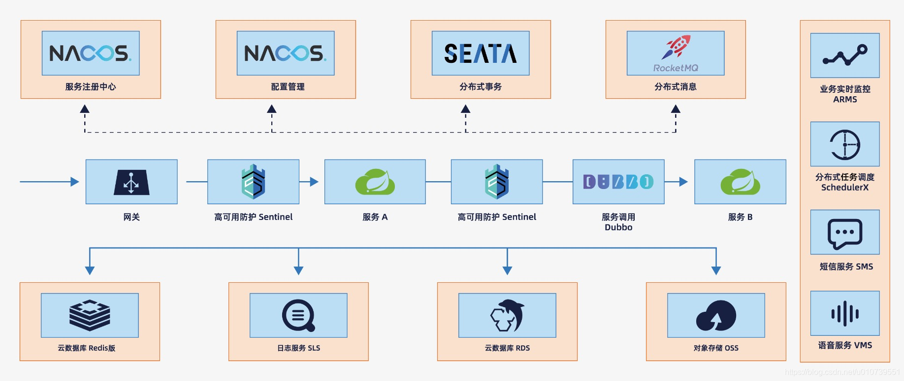

| **功能模块** | **Spring Cloud Alibaba 方案**               | **说明**                                                     |
| ------------ | ------------------------------------------- | ------------------------------------------------------------ |
| **注册中心** | **Nacos**（支持服务发现与配置中心）         | Nacos 同时支持服务注册与配置管理，AP/CP 模式可切换，社区活跃度高。 |
| **服务通信** | **Dubbo**（RPC）或 **OpenFeign**（REST）    | Dubbo 提供高性能 RPC 调用，适合内部服务通信；Feign 适合对外暴露 RESTful 接口。 |
| **API网关**  | **Spring Cloud Gateway**                    | 性能更高，支持异步非阻塞模型，与 Spring 生态深度集成。       |
| **负载均衡** | **Ribbon**（客户端负载均衡，Gateway已集成） | 与 Spring Cloud 原生方案一致，支持与 Nacos 集成，动态获取服务节点列表。 |
| **配置中心** | **Nacos Config**                            | 无需额外部署 Config Server，配置变更实时推送，支持多环境隔离。 |
| **服务保护** | **Sentinel**                                | Sentinel 支持流量控制、熔断降级、系统负载保护，提供可视化控制台，规则配置更灵活。 |
| **消息队列** | **RocketMQ**                                | RocketMQ 支持高吞吐、顺序消息、事务消息，适合金融级场景。    |


**Q：是不是网关也能进行负载均衡？**

A：网关作为微服务架构的入口，通常会将请求路由到后端的多个服务实例，并在路由过程中实现负载均衡。且Spring Cloud Gateway 默认集成了 **Ribbon** 作为客户端负载均衡器，所以支持。

负载均衡有两种实现方式

- **客户端负载均衡**：即网关从注册中心获取服务实例列表，并在本地进行负载均衡（如 Ribbon）。
  - **优点**：减少服务端的压力，负载均衡逻辑在网关本地完成。
  - **缺点**：网关需要维护服务实例列表，可能增加网关的复杂性。
- **服务端负载均衡**：即网关将请求转发到一个负载均衡器（如 Nginx），由负载均衡器负责选择服务实例。
  - **优点**：网关逻辑简单，负载均衡器可以集中管理。
  - **缺点**：需要额外部署负载均衡器，增加了系统的复杂性。


#### 为什么需要服务注册发现?

在微服务架构中，服务注册与发现的核心价值在于解决分布式系统的动态管理难题。当服务数量庞大、部署频繁且规模弹性变化时，依赖人工维护服务关系几乎不可行。注册中心通过统一管理服务节点的注册（如服务名、IP、端口）和状态监控（如心跳检测），实现了服务关系的自动化维护，确保消费者能实时感知可用节点。

注册中心通过事件驱动机制（如服务上线/下线主动通知注册中心）实现动态扩缩容。例如高峰期扩容时，新节点自动注册并通知消费者，无需人工干预；低峰期缩容时，异常节点会被心跳检测剔除并同步给消费者（网关或代理服务器等）。这种机制大幅降低了运维成本，同时支持灵活的资源调度。

除了基础的服务注册与发现，注册中心还提供以下能力：

1. **负载均衡**：消费者可基于注册中心返回的多个节点实现流量分发（如轮询、权重）；
2. **服务治理**：结合熔断、降级策略提升系统容错性；
3. **配置管理**：部分注册中心（如项目用的Nacos）支持动态配置推送；
4. **健康监控**：通过心跳机制保证服务可用性，异常节点自动隔离。


所以说注册中心是微服务架构的"中枢神经系统"，这个问题按"问题→解决方案→价值"的逻辑链记忆。


#### 为什么 Nacos 比 Zookeeper/Eureka 更适合做注册中心？*

##### 1. 与 Zookeeper 对比
ZK 是 CP（强一致性），Leader 挂了要重新选举，选举期间整个集群**不可用**（无法注册/查询服务）。对于服务发现来说，**可用性 (A) > 一致性 (C)**（我宁愿读到旧的服务列表，也不想读不到）。所以 ZK 不适合做注册中心，而 Nacos 默认采用 AP 模式，保证服务发现的高可用。

##### 2. 与 Eureka 对比
Eureka 同样是 AP 模式，设计理念和 Nacos 一致，但存在几个短板：

**服务下线感知慢**：Eureka 只支持客户端心跳检测，默认 30 秒发一次心跳，服务端需要连续 3 次没收到心跳才判定下线，再加上客户端缓存刷新间隔，最坏情况下感知一个服务下线可能要 1-2 分钟。Nacos 除了心跳之外还支持服务端主动探测，下线感知可以做到秒级。

**功能单一**：Eureka 只做服务注册发现，配置管理需要额外搭配 Spring Cloud Config，多一套组件就多一份运维成本。Nacos 天然集成了配置中心，支持配置实时推送、版本回滚、灰度发布等能力。

**项目已停止演进**：Netflix 在 2018 年宣布 Eureka 2.0 闭源停更，1.x 仅做安全维护，社区基本不活跃了。而 Nacos 由阿里持续迭代，社区活跃，文档完善。


##### 3. 一句话总结
ZK 太"强一致"牺牲可用性，Eureka 功能单一且停止维护，Nacos 在 AP/CP 灵活切换、功能完整性、社区活跃度上都更胜一筹。


##### Q：还有一点的话就是ZK有一个架构设计的缺陷，导致现在很多项目都不采用ZK了，知道是什么吗？
A：因为ZK存在惊群效应这是其著名架构缺陷。**这个问题在服务发现场景下尤其严重**
假设 1000 个客户端都 watch 了同一个节点，当这个节点发生变化时，ZK 会同时通知所有 1000 个客户端。这些客户端收到通知后会立刻去 ZK 拉取最新数据，瞬间产生大量请求，可能打爆 ZK 的网卡和 CPU。

服务注册中心的节点变化是很频繁的，服务上下线、健康状态变化都会触发通知。如果有几百个服务、每个服务几十个实例，watch 的客户端数量一上来，ZK 集群压力会非常大。

Nacos和Eureka的解决方式如下
- **Nacos**：虽然也是服务端主动推送，但 Nacos 的推送是增量的，只发变化的部分；而且推送是服务端可控的，可以做流控和分批推送，不像 ZK 那样一次性通知所有 watcher 然后等着被客户端请求打爆。
- **Eureka**：采用客户端定时拉取的方式，默认 30 秒从服务端拉一次全量注册表，不依赖服务端主动推送，所以不存在惊群问题。但代价是服务变更感知慢，而且每次拉全量数据，带宽开销大


#### **Nacos**配置中心中的AP/CP 模式是什么玩意儿？*

**AP**（Availability）模式和 **CP**（Consistency）模式，应对分布式系统中的一致性与可用性之间的权衡问题。这两个模式来自于 **CAP 理论**（Consistency、Availability、Partition Tolerance）。

CAP 理论（也称为 Brewer 定理）意为，**在分布式系统中，不可能同时满足以下三点**：

- **C（Consistency，强一致性）**：所有节点上的数据在同一时刻完全一致，读到的数据是最新的数据。
- **A（Availability，可用性）**：每个请求都能获得响应，不管响应结果是否是最新的。
- **P（Partition Tolerance，分区容忍性）**：系统能够容忍网络分区，即部分节点之间的网络通信故障。

**CAP 理论的结论**：

- 在发生网络分区（P）的情况下，必须在**强一致性（C）** 和 **可用性（A）** 之间做出取舍。

**AP**（Availability）模式，Nacos 主要保证 **高可用性和分区容忍性**，在网络波动或者故障时，系统会尽量保证配置能够继续提供服务节点读取操作。即使无法同步最新的配置数据，客户端也能读取到可用的配置（可能是旧的配置）。但多个节点可能并没有同步最新的配置数据

在 **CP** （Consistency）模式 下，Nacos 主要保证 **一致性和分区容忍性**，即所有nacos服务节点的配置会被严格同步，所有读取到的配置都是一致的。这意味着即使在网络分区时，系统也会暂停对配置的修改和读取，直到一致性恢复。


**Q：那注册中心呢？**

A：不管是注册中心还是配置中心，**CP/AP模式**指的是Nacos集群各个节点内部的服务实例列表和各个配置的**一致性策略**。**CP模式**更加强调集群内部各个节点数据一致性，对外表现为完全统一的整体，没有任何差别，因此需要损失一定的性能，在进行同步期间可能会无法服务。而**AP模式**更多强调尽量为外部提供服务，将一致性作为牺牲，保证系统的高可用性。
1. **配置中心（Config）** ✅ 支持 CP/AP，但默认为CP
2. **注册中心（Naming）** ✅ 支持 CP/AP，但默认为AP


#### 什么是配置中心?有哪些常见的配置中心?*

配置中心是一个用于配置集中化管理且支持动态更新、分发配置文件的工具（服务）。它实现了配置的统一管理和动态刷新，当配置信息发生变更时，配置中心可以自动通知服务实例进行配置更新，这样就可以实现无需重启即可应用最新的配置（即支持热更新），而且可以将分布在各个微服务中的配置集中到一个中心位置，便于管理和维护。


常用的配置中心有：

* Spring Cloud Config 是Spring官方提供的配置中心，特点在于配置文件可以存储在Git仓库，支持配置文件加密解密，但没有原生的推送各服务节点配置的机制，需要借助消息队列等外部系统（一般是Spring Cloud Bus它基于消息实现）实现。

* Nacos 是阿里开源的注册中心和配置中心，提供友好的管理GUI界面，特点在于支持配置版本管理，支持配置变更实时推送，支持多环境、多集群配置管理，基本上快统一江湖。


#### Spring cloud配置中心的动态更新实现方式有哪些?

配置中心通常使用长连接或长轮询的方式来实现配置的动态刷新。

##### 1. 长连接

长连接是一种基于TCP或WebSocket协议的连接方式。在建立连接后，客户端和服务器之间可以持续进行数据的双向传输，而无需每次都重新建立连接。长连接的典型实现是WebSocket或gRPC，能够实现实时的推送。

长连接的工作原理就是

- 客户端与服务器建立一个持久的连接，该连接保持打开状态
- 当服务器检测到配置变化时，立即通过这个连接向客户端推送变更信息，客户端即时接收和处理更新
- 连接一直保持直到手动关闭或由于网络中断等因素断开


长连接的优点在于

* 实时性强，服务器可以即时推送更新

- 无需频繁建立连接，减少了连接开销

但**缺点**也有
- 长连接需要消耗更多的系统资源
- 对网络环境的要求较高
- 断线重连和连接管理需要额外的处理


##### 2. 长轮询

长轮询是一种模拟服务器推送的机制。客户端主动向服务器发起请求，并保持连接（如保持30秒），直到服务器有更新或超时为止。如果有更新，服务器会返回新的数据，客户端在接收到数据后，再次发起新一轮的请求。

长轮询的工作原理是

- 客户端发送HTTP请求给服务器，询问是否有配置更新
- 服务器保持这个请求打开，直到检测到配置发生变更，或者达到超时时间
- 如果配置有更新，服务器返回更新的配置数据，客户端处理并再次发起新请求
- 如果没有更新，连接会超时，客户端也会重新发起请求
- 模拟推送的效果，但本质上是客户端的连续请求


长轮询优点，实现相对简单，兼容性好，而且适用于大多数网络环境。

缺点也很明显，模拟推送的方式极大造成资源浪费，而且响应速度取决于轮询频率，不够实时


**所以Nacos在1.x版本为长轮询，而2.0版本后基于gRPC (HTTP/2)实现的长连接来实现配置更新了。**


#### 你知道Nacos配置中心的实现原理吗?

Nacos配置中心的实现原理可以分为以下几个核心部分：

##### 1. 配置的存储

Nacos默认使用内嵌的Derby数据库存储配置数据，但在生产环境中，通常会使用外部的MySQL等关系型数据库来存储配置数据，以满足高可用和性能需求。

配置数据以键值对（Key-Value）的形式存储，每个配置项有一个唯一的标识符（DataID），例如`com.example.service.config`。配置项通常由以下三部分组成：

- **Namespace（命名空间）：** 用于隔离不同环境（如开发、测试、生产）或不同租户的配置。
- **Group（组）：** 用于对配置进行逻辑分组，例如按业务模块划分。
- **DataID（数据ID）：** 具体的配置项名称。

**命名空间（Namespace）** 在Nacos中是一个可选项，默认情况下是没有命名空间的。命名空间是用来隔离不同租户或环境的配置的，特别是在多租户或多环境部署场景下，这一设计非常重要。

这三个玩意儿其实就是多级隔离，类似于文件夹，Namespace就是某个盘符比如说d盘软件，Group类似的是d盘软件下面的**磁盘里的文件夹**（如Tencent），而DataID可以理解为就是**文件**（如 QQ.exe）。

Nacos集群中的每个节点都可以读写配置数据，数据会通过Raft协议（Nacos 2.0之前也就是HTTP模拟推送）或Distro协议（Nacos 2.0之后，也就是RPC主动推送）在集群内同步，确保数据的一致性和高可用性。


##### 2. 配置的推送机制

Nacos配置中心使用gRPC长连接来实现配置的实时推送：

- 客户端与Nacos服务器通过gRPC建立长连接，当配置发生变更时，Nacos服务器可以通过这个长连接实时向客户端推送配置更新
- 客户端在启动时，会向Nacos注册监听器（Listener）并维持与服务器的长连接
- 当Nacos检测到配置变更时，会通知所有相关客户端，客户端会检查推送过来的内容和md5，有改变的时候，客户端由监听器（Listener）得知并进行配置刷新。


##### 3. 配置的缓存

Nacos客户端（服务节点）维护一个本地缓存，具有以下特点：

- 客户端在启动时会从Nacos服务器拉取配置并缓存到本地，后续读取配置时直接从本地缓存获取，减少对服务器的依赖。
-  当Nacos服务器不可用时，客户端可以从本地缓存中读取配置，确保系统在异常情况下仍能正常运行。
- 当配置发生变化时，Nacos服务器会通知客户端，客户端会检查推送过来的内容和md5，客户端会从服务器拉取最新配置并更新本地缓存。
- 如果客户端与服务器断开连接，客户端会定期尝试重新连接并同步配置，配置中心挂了，客户端还正常运行。


#### Nacos中的Namespace是什么?

Namespace 是 Nacos 提供的一个最大虚拟隔离区域，用于将不同的服务和配置进行逻辑分组。不同的 Namespace 之间是完全隔离的，即一个 Namespace 中的服务或配置不会影响到另一个 Namespace 中的内容。

Namespace隔离在以下主要场景

- 环境隔离：可以**用于将开发、测试、生产等不同环境的服务和配置进行隔离管理**，防止不同环境的服务相互影响。例如，可以为开发环境创建一个 dev 的 Namespace，为生产环境创建一个 prod 的 Namespace。
- 多租户管理：在多租户系统中，可以为不同的租户创建独立的 Namespace，从而确保各个租户的数据和配置相互隔离，提升系统的安全性和可管理性。
- 项目隔离：对于一个 Nacos 实例支持的多个项目，可以通过 Namespace 将不同项目的服务和配置隔离开，避免配置冲突。


**Q: Namespace 与其他 Nacos 组织结构的区别?**

**Namespace vs Group:**

- Namespace 是用于逻辑隔离的最高级别单位，不同的 Namespace 之间是完全隔离的，服务实例、配置等资源都不会在不同的 Namespace 之间共享。
- Group 是用于对同一 Namespace 内的服务进行进一步分组的单位，可以用于将同一 Namespace 中的服务按业务分类或功能模块进行管理，例如，一个 Namespace 可以包含多个 Group，如 payment、order、inventory 等。

**Namespace vs Data ID:**

- Data ID 是 Nacos 配置管理中的概念，表示具体的配置信息项质，每个配置项通过 Data ID 来标识，用于管理具体的配置内容。
- Namespace 则是用来将多个 Data ID 进行隔离管理的，不同的 Namespace 可以有相同的 Data ID，但它们所代表的配置信息是独立的。


#### 什么是Feign?

Feign 是 Spring Cloud 中的一种服务间通信组件，属于声明式 Web 服务客户端。其核心思想是通过 Java 接口和注解，简化 HTTP 请求的构建过程，使开发者无需手动编写复杂的 HTTP 请求代码，只需关注接口定义和注解即可。

在使用 Feign 时，开发者只需要创建一个接口，添加相应的 HTTP 请求方法注解（如 `@GET`, `@POST`），并通过注解指定请求的 URL 和参数。Feign 会根据这些定义，在运行时动态构造和发送 HTTP 请求，同时处理请求的响应。这种方式不仅让开发者避免了低级的 HTTP 编程，也能更高效地利用 Spring Cloud 生态中的其他功能，比如服务注册、负载均衡、服务熔断等。

**Feign 的主要特点：**

- **声明式接口：** 开发者通过 Java 接口和注解定义 HTTP 请求，无需关注底层实现。
- **与 Spring Cloud 深度集成：** 支持负载均衡、服务注册与发现、服务熔断等功能，能够简化微服务间的通信。
- **自动化处理：** Feign 会自动完成 HTTP 请求的构建、发送和结果处理，极大减少了开发者的工作量。


在没有 Feign 的情况下，开发者需要手动编写 HTTP 请求代码。以一个调用 `user-service` 服务的例子为例，开发者需要使用 `RestTemplate` 来实现远程调用。

```java
// 传统 RestTemplate 方式
import org.springframework.stereotype.Service;
import org.springframework.web.client.RestTemplate;

@Service  // 标注这是一个服务类，由Spring容器管理
public class UserService {
    // RestTemplate 用于发送HTTP请求的工具类
    private final RestTemplate restTemplate;

    // 通过构造器注入 RestTemplate 实例
    public UserService(RestTemplate restTemplate) {
        this.restTemplate = restTemplate;
    }

    // 根据用户ID获取用户信息的方法
    public User getUserById(Long id) {
        // 手动构建请求URL，user-service是服务名
        String url = "http://user-service/api/users/" + id;
        // 发送GET请求并将响应转换为User对象
        // getForObject方法会自动将JSON响应转换为User类型
        return restTemplate.getForObject(url, User.class);
    }
}
```

在这个例子中，开发者需要手动处理 HTTP 请求的 URL、请求方法和响应的转换。而且，这种方式没有集成服务注册与发现、负载均衡等功能，需要额外的配置。


使用 Feign 后，开发者只需通过接口和注解定义服务调用，无需关注底层 HTTP 请求的构建。Feign 会根据接口定义自动处理请求和响应，且可以与 Spring Cloud 生态组件（如 Eureka 服务注册、负载均衡）紧密集成。

```java
// Feign 声明式方式
import org.springframework.cloud.openfeign.FeignClient;
import org.springframework.web.bind.annotation.GetMapping;
import org.springframework.web.bind.annotation.PathVariable;

// @FeignClient注解声明这是一个Feign客户端
// 参数指定了要调用的服务名称，会自动从注册中心查找服务
@FeignClient("user-service")
public interface UserServiceFeignClient {
    
    // 声明调用的HTTP接口
    // @GetMapping指定请求方法和路径
    // {id}是路径参数占位符
    @GetMapping("/api/users/{id}")
    // @PathVariable将方法参数绑定到路径参数
    User getUserById(@PathVariable("id") Long id);
}
```

通过 Feign，`UserServiceFeignClient` 就是一个声明式的服务客户端。当调用 `getUserById` 方法时，Feign 会自动发起 HTTP 请求，获取远程服务的响应数据。此时，服务发现、负载均衡等功能由 Spring Cloud 自动处理，无需开发者手动配置。


**Q：这个注解指的是@FeignClient("user-service")将UserServiceFeignClient注册为一个服务？**

A：错，这个方法并没有实现 getUserById（）也不会实现，但如果要调用相关方法还是调用这个接口，只不过背后通过微服务调用实际服务提供者getUserById（）方法完成并返回。


#### Feign和OpenFeign的区别?

**Feign** 是一个声明式的 Web 服务客户端，它简化了 HTTP 请求的构建过程，通过注解定义接口方法，自动发送 HTTP 请求并处理响应。被 Spring Cloud 集成到 Spring Cloud 生态系统中，用于微服务之间的通信。

**OpenFeign** 是 Feign 的一个开源版本，并且是 Spring Cloud 2020 版本及以后的标准实现。Spring Cloud 团队对 Feign 进行了封装和扩展，使其与 Spring Cloud 生态更紧密地结合，同时解决了一些 Feign 在实际使用中的问题，包括如下几个方面:

* 通过注解无缝整合 Spring Cloud 组件（如服务注册中心、负载均衡、熔断器，而Feign需手动整合服务发现、负载均衡）。
* 通过 Spring Boot 的自动配置机制简化使用。
* 持续更新维护，支持更多现代特性（如响应式编程、更灵活的扩展）。


**旧版 Netflix Feign（需手动配置）**

```java
// 1. 显式定义 Feign 客户端
public interface UserServiceClient {
    @RequestLine("GET /api/users/{id}")
    User getUserById(@Param("id") Long id);
}

// 2. 手动配置 Feign 客户端（需整合 Ribbon、Eureka 等）
@Configuration
public class FeignConfig {
    @Bean
    public UserServiceClient userServiceClient() {
        return Feign.builder()
            .decoder(new JacksonDecoder())
            .encoder(new JacksonEncoder())
            .target(UserServiceClient.class, "http://user-service");
    }
}
```

**OpenFeign（自动配置，与 Spring Cloud 集成）**

```java
// 1. 直接通过注解定义客户端（自动集成服务发现、负载均衡）
@FeignClient(name = "user-service")  // 自动从注册中心获取服务实例
public interface UserServiceFeignClient {
    @GetMapping("/api/users/{id}")  // 使用 Spring MVC 注解
    User getUserById(@PathVariable("id") Long id);
}

// 2. 只需在启动类添加 @EnableFeignClients
@SpringBootApplication
@EnableFeignClients
public class Application {
    public static void main(String[] args) {
        SpringApplication.run(Application.class, args);
    }
```


**除此之外，OpenFeign最重要的支持和更新是 OpenFeign还支持 “Spring MVC 注解适配”（比如直接用 @GetMapping/@PostMapping 定义接口，无需额外配置）。**

**旧版 Netflix Feign（复杂注解）**

```
// 需要引入 Feign 的原生注解
import feign.RequestLine;
import feign.Param;

@FeignClient(name = "user-service")
public interface UserClientOld {

    // 使用 @RequestLine 来定义 HTTP 方法和路径
    // 使用 @Param 来绑定参数，参数名需要手动指定
    @RequestLine("GET /users/{id}?name={userName}")
    User getUserById(@Param("id") long id, @Param("userName") String name);
}
```

**痛点分析：**

- **心智负担重**：你需要记住 `@RequestLine` 的语法是 `"GET /path"`，而不是 `@GetMapping("/path")`。
- **注解体系不统一**：服务端用 Spring MVC，客户端用 Feign 原生注解，两套体系。
- **参数绑定繁琐**：`@Param("userName")` 里的 `"userName"` 必须和 URL 里的 `{userName}` 精确对应，容易写错。

**OpenFeign（与spring mvc自动集成）**

```
// 引入 Spring MVC 的注解
import org.springframework.web.bind.annotation.GetMapping;
import org.springframework.web.bind.annotation.PathVariable;
import org.springframework.web.bind.annotation.RequestParam;

@FeignClient(name = "user-service")
public interface UserClientNew {

    // 是不是非常眼熟？这和写 Controller 一模一样！
    @GetMapping("/users/{id}")
    User getUserById(
        @PathVariable("id") long id, 
        @RequestParam("name") String name
    );
}
```


#### Dubbo和Spring Cloud OpenFeign有什么区别?

Dubbo 是一个高性能、轻量级的开源 Java RPC（Remote Procedure Call）框架。它主要用于解决微服务架构中的服务注册、发现和远程调用问题，**一句话就是服务间通信的问题。**

它主要实现的是rpc框架使用的Dubbo协议（基于TCP协议自定义改造而来的应用层协议），一种序列化的二进制通信协议性能更高。所以由于 OpenFeign 基于 HTTP 协议，而不是像 Dubbo 那样使用性能更高的二进制序列化协议，所以在高并发、低延迟的场景下，其性能表现可能不如 Dubbo。

但是由于使用的私有化协议，所以兼容性不是很好，一般用于服务内部进行调用实现高性能通信。而OpenFeign虽然性能较差，但是由于使用的是Http这种全球标准的协议支持良好的跨语言以及通用性，适合暴露给外部进行远程调用，所以两者一般是要根据其具体情况来进行，配合使用。


#### 介绍一下服务限流和服务雪崩？*

##### 1. 服务限流

服务限流是 **控制系统请求量，避免系统过载的一种手段**，类似于水管中的阀门，限制了流量的通过速度，防止因为流量过大而导致系统崩溃。它的核心思想是限制短时间内的请求数，避免服务被过载攻击或过多的请求压力所影响。

服务限流一般适用于以下场景：

- 系统无法承受突发的大量请求（如秒杀、双十一购物节等）。
- 系统需要保证高并发下的稳定性，避免资源被耗尽。
- 防止恶意请求导致系统负载过高。

服务限流的方式有几种，常见的有：

- **基于令牌桶的限流**：请求必须持有令牌才能通过，令牌的生成有速率限制，超出请求只能等待或被拒绝。
- **基于漏桶的限流**：请求以恒定速率被处理，超过限速请求会被丢弃或者排队处理。
- **基于滑动窗口的限流**：利用时间窗口分段统计请求，超过窗口内的请求数限制就会被拒绝。

**代码示例：**

```java
@HystrixCommand(fallbackMethod = "fallbackMethod")
public String getProductInfo(Long productId) {
    // 请求限流的逻辑
    return restTemplate.getForObject("http://product-service/api/product/" + productId, String.class);
}

public String fallbackMethod(Long productId) {
    return "请求过于频繁，请稍后再试";  // 限流后返回的提示信息
}
```

在这个例子中，使用 Hystrix 限流逻辑，当服务请求超过指定限流阈值时，直接返回降级提示，避免进一步的请求消耗系统资源。


##### 2. 服务雪崩

服务雪崩是 **多个服务故障引起的级联效应**，通常发生在分布式系统中，指的是一个或多个服务的故障或响应过慢，导致下游的服务出现大量请求失败或超时，进而引发一系列的故障，最终可能导致整个系统崩溃。

雪崩效应的典型场景是，服务A依赖服务B，服务B又依赖服务C，如果服务C的调用失败或者响应过慢，导致服务B的请求超时，进而服务A的请求也无法得到响应，造成一层层的失败扩散。

雪崩效应一般会在以下几种情况中发生：

- **服务间的链路依赖**：服务间通过远程调用建立了依赖关系，某个服务异常会引发下游服务的级联故障。
- **资源瓶颈**：服务系统的资源（如线程池、数据库连接池、内存等）达到了瓶颈，无法处理更多的请求。
- **系统的集中式设计**：当多个服务依赖于单一服务时，如果该服务失败，可能导致整个系统出现问题。

**如何防止服务雪崩：**

- **服务熔断**：使用熔断器（如 Hystrix）对故障服务进行隔离，避免级联故障。
- **服务降级**：在服务不可用时，返回默认值或者友好提示，避免系统的资源被无效请求消耗。
- **限流和负载均衡**：对流量进行控制，避免请求过多时把系统压垮；同时，通过负载均衡的方式分散请求压力。
- **隔离设计**：通过拆分服务、减少服务间依赖来减少单点故障带来的风险。


总的来说的话

- **服务限流**：通过控制请求流量的速率，避免系统因流量过大而超负荷，保障系统的稳定性。
- **服务雪崩**：由于微服务间的级联故障导致系统全盘崩溃，需要通过熔断、降级等机制进行预防和保护，减少故障扩展的影响。

| **维度**     | **服务限流**                 | **服务雪崩**                 |
| ------------ | ---------------------------- | ---------------------------- |
| **触发原因** | 请求过载，系统无法承受高流量 | 多个服务故障引发的级联问题   |
| **目标**     | 控制流量，保障系统稳定性     | 防止故障扩展，保障系统可用性 |
| **范围**     | 控制单一服务或系统整体的请求 | 整个微服务系统的依赖链路     |
| **恢复时机** | 限流解除后，恢复正常请求     | 通过熔断、降级等措施恢复服务 |


#### 介绍一下服务熔断和服务降级？*

##### 1. 服务熔断

服务熔断是一种 **防止微服务雪崩的链路保护机制**，类似于电路中的保险丝。当某个服务出现高延迟或故障时，熔断器会快速失败，避免级联故障扩散到整个系统。

级联故障原因就是微服务之间的数据交互是通过远程调用来完成的。打个比方服务A调用服务，服务B调用服务C，某一时间链路上对服务C的调用响应时间过长或者服务C不可用，随着时间的增长，对服务C的调用也越来越多，然后服务C崩溃了，但是链路调用还在，对服务B的调用也在持续增多，然后服务B崩溃，随之A也崩溃，导致雪崩效应。

服务熔断一般出现在服务依赖的第三方接口不稳定（如支付服务）或数据库访问超时或连接池耗尽。

在Spring Cloud框架里，熔断机制通过Hystrix实现。Hystrix会监控微服务间调用的状况，当失败的调用到一定阈值，缺省是5秒内20次调用失败，就会启动熔断机制。

Hystrix代码如下

```java
@HystrixCommand(fallbackMethod = "fallbackMethod")
public String callService() {
    // 调用远程服务
}

public String fallbackMethod() {
    return "服务熔断，返回默认值";
}
```


##### 2. 服务降级*

服务降级是 **在系统高负载时，暂时屏蔽非核心功能，优先保障核心业务可用性或提供备用逻辑**（如返回默认值、缓存数据等）的策略，通过牺牲部分功能保证整体系统稳定。

服务降级一般出现在流量激增（如秒杀活动、突发新闻）或者系统资源紧张（CPU、内存、线程池满载）的时候。

一般的有三种降级方式，

- **代码降级**：返回缓存数据、默认值或友好提示。

  ```java
  @HystrixCommand(fallbackMethod = "fallbackMethod")
  public String getDetail() {
      // 调用核心服务
  }
  
  public String fallbackMethod() {
      return "系统繁忙，请稍后再试";  // 非核心功能直接返回提示
  }
  ```

- **自动降级**：通过限流、熔断间接触发降级逻辑。

- **手动降级**：运维通过配置中心动态关闭非核心功能。


结合来说的话，**熔断机制是触发降级处理的一种条件**熔断后触发降级逻辑，但降级不一定依赖熔断（如手动降级）。在实际应用中。

- 熔断 + 降级：服务不可用时快速返回兜底数据。
- 限流 + 降级：超阈值请求直接拒绝，避免系统崩溃。

| **维度**     | **服务熔断**             | **服务降级**                 |
| ------------ | ------------------------ | ---------------------------- |
| **触发原因** | 依赖的下游服务故障或超时 | 系统整体资源过载或业务高峰   |
| **目标**     | 防止级联故障，保护调用方 | 保障核心业务，牺牲非核心功能 |
| **范围**     | 针对单个服务依赖         | 系统级或模块级策略           |
| **恢复时机** | 依赖服务恢复后自动关闭   | 资源充足后手动/自动恢复      |


#### 什么是熔断器?为什么需要熔断器?

上面提到 Spring cloud组件中**容错与保护组件的服务熔断与降级组件**，即由熔断器来确保。

熔断器（Circuit Breaker）是一种用于 **保护分布式系统** 的容错机制，主要用于防止服务调用链路中的故障扩散，避免引发 **服务雪崩**。其核心思想是通过快速失败和错误隔离，确保系统在部分服务不可用时仍能正常运行。

熔断器核心价值第一可以通过快速失败和错误隔离，避免局部故障扩散到整个系统，**来防止服务雪崩**。

第二提供降级处理机制，确保在部分服务不可用时系统仍能正常运行，**实现高可用设计**。

第三实现监控恢复，而且自动检测服务状态，并在服务恢复后尝试恢复正常调用。


##### **1. 熔断器的基本原理**

熔断器的工作机制类似于电路中的保险丝，分为三种状态：

1. **关闭状态（Closed）**
   - 默认状态，服务消费者正常调用服务提供者。
   - 熔断器会监控调用失败率（如失败请求比例或失败次数）。
2. **打开状态（Open）**
   - 当失败率达到阈值（如 70% 失败率或 100 次失败），熔断器打开。
   - 服务消费者不再发起请求，直接返回错误或执行降级逻辑（快速失败）。
3. **半开状态（Half-Open）**
   - 熔断器打开一段时间后，自动进入半开状态。
   - 允许少量请求尝试调用服务提供者：
     - 如果调用成功，熔断器关闭，恢复正常调用。
     - 如果调用失败，熔断器继续保持打开状态。

通过这种机制，熔断器能够 **快速隔离故障**，并在服务恢复后自动尝试恢复正常调用。


##### **2. Hystrix：Spring Cloud 中的熔断器实现**

Hystrix 是 Netflix 开源的熔断器实现，被 Spring Cloud 集成，用于保护分布式系统中的服务调用。其主要特性包括：

**1. 资源保护**

Hystrix 提供了 **资源保护** 的能力，防止某个服务调用占用过多资源而影响系统其他部分。可以限制每个服务的县城池。还可以可以限制并发请求数和服务调用的超时时间。

Hystrix 的线程隔离功能通过为每个服务调用分配独立的线程池来避免一个服务的资源问题影响整个系统的稳定性。例如，假设你有多个微服务，某个服务如果在高负载下响应慢，Hystrix 可以将其请求隔离到独立的线程池中，防止它占用过多的线程资源。

**线程池隔离示例：**

```java
@HystrixCommand(threadPoolKey = "userServiceThreadPool")  // 自定义线程池
public User getUserById(Long id) {
    return restTemplate.getForObject("http://user-service/api/users/" + id, User.class);
}
```

在这个例子中，通过 `@HystrixCommand` 注解的 `threadPoolKey` 属性，指定了 **UserService** 调用使用独立的线程池资源。这意味着，即使该服务出现了问题，也不会影响到系统中其他的服务调用。


**超时时间和并发请求数限制示例：**

```java
@HystrixCommand(commandProperties = {
    @HystrixProperty(name = "execution.isolation.strategy", value = "THREAD"),
    @HystrixProperty(name = "execution.timeout.enabled", value = "true"),
    @HystrixProperty(name = "execution.timeout.inMilliseconds", value = "3000"), // 3秒超时
    @HystrixProperty(name = "metrics.rollingStats.timeInMilliseconds", value = "10000") // 10秒内的统计
})
public String getRemoteData() {
    return restTemplate.getForObject("http://remote-service/api/data", String.class);
}
```

- 这里，`execution.timeout.inMilliseconds` 用于设置 **超时时间**，确保请求不会无限期等待。
- `metrics.rollingStats.timeInMilliseconds` 设置了在 10 秒钟内的调用统计，用于监控调用的成功率与失败率。


**3. 降级处理（Fallback）**

服务调用失败时，Hystrix 会自动调用降级方法。降级方法是一个备用的实现，通常返回默认值或从缓存中获取数据，以保证系统的基本可用性。

说一下更高级的**在高负载时屏蔽非核心功能**，Hystrix 可以通过一定的 **降级逻辑** 来保证系统的可用性，提供默认值或者从缓存中获取数据等。

**示例：** 可以通过将这些服务的调用放入不同的线程池，然后在高负载时通过动态配置`threadPoolProperties` 配置最大线程数，来限制这些非关键服务的请求量。

```java
import com.netflix.hystrix.contrib.javanica.annotation.HystrixCommand;
import org.springframework.beans.factory.annotation.Autowired;
import org.springframework.web.client.RestTemplate;

public class ServiceInvoker {

    @Autowired
    private RestTemplate restTemplate;

    // 核心服务
    @HystrixCommand(
        threadPoolKey = "coreServiceThreadPool",
        fallbackMethod = "coreServiceFallback"
    )
    public String coreService() {
        return restTemplate.getForObject("http://core-service/api", String.class);
    }

    // 核心服务的降级方法
    public String coreServiceFallback() {
        // 返回默认值或者从缓存中获取数据
        return "Fallback response for core service. Normally, you can retrieve data from cache here.";
    }

    // 非核心服务
    @HystrixCommand(
        threadPoolKey = "nonCoreServiceThreadPool",
        fallbackMethod = "nonCoreServiceFallback"
    )
    public String nonCoreService() {
        return restTemplate.getForObject("http://non-core-service/api", String.class);
    }

    // 非核心服务的降级方法
    public String nonCoreServiceFallback() {
        // 返回默认值或者从缓存中获取数据
        return "Fallback response for non-core service. Normally, you can retrieve data from cache here.";
    }
}
```

在这个例子中，`coreServiceThreadPool` 和 `nonCoreServiceThreadPool` 会有不同的线程池配置，你可以通过对线程池的最大线程数进行限制，来控制在高负载时优先保障核心服务的请求。


**4. Hystrix 熔断机制示例**

熔断机制的目的是为了防止服务调用方被故障的服务拖垮。当服务调用的失败率或失败次数超过设定的阈值时，Hystrix 会自动“熔断”（断开电路），阻止后续的请求继续访问故障的服务。

**熔断器触发条件：**

1. **错误率阈值**：当服务调用的失败比例超过指定的阈值（比如 50%）时，Hystrix 会熔断服务。
2. **连续失败的调用次数**：当连续的服务调用失败次数达到某个值时，会触发熔断。

**示例：**

```java
@HystrixCommand(
    fallbackMethod = "fallbackMethod",
    commandProperties = {
        @HystrixProperty(name = "circuitBreaker.enabled", value = "true"),  // 开启熔断器
        @HystrixProperty(name = "circuitBreaker.requestVolumeThreshold", value = "10"),  // 10次请求后检查熔断
        @HystrixProperty(name = "circuitBreaker.sleepWindowInMilliseconds", value = "5000"),  // 熔断器休眠时间为5秒
        @HystrixProperty(name = "circuitBreaker.errorThresholdPercentage", value = "50")  // 错误率达到50%时触发熔断
    }
)
public String getProductInfo(String productId) {
    return restTemplate.getForObject("http://product-service/api/products/" + productId, String.class);
}

public String fallbackMethod(String productId) {
    return "Service unavailable. Please try again later.";
}
```

- 在上面的例子中，当 `getProductInfo()` 方法的失败率超过 **50%**，并且请求数量达到 **10次** 后，Hystrix 会触发熔断器，所有请求都会被直接转发到 `fallbackMethod()`，而不会再执行真正的服务调用。
- 当服务恢复正常时，熔断器会自动关闭，允许请求再次正常进入。


#### 对比一下Hystrix和Sentinel？

Sentinel 的核心优势在于

##### **1. 动态规则配置**

**Hystrix**的规则硬编码在代码中，修改规则需重新部署。

```java
@HystrixCommand(
    fallbackMethod = "fallbackMethod",
    commandProperties = {
        @HystrixProperty(name = "circuitBreaker.errorThresholdPercentage", value = "50"), // 错误率阈值
        @HystrixProperty(name = "circuitBreaker.requestVolumeThreshold", value = "10")   // 请求量阈值
    }
)
public String getServiceResponse() {
    return restTemplate.getForObject("http://service/api", String.class);
}

public String fallbackMethod() {
    return "Fallback response";
}
```

而**Sentinel**支持通过控制台或配置文件动态调整规则，实时生效，非常利于Nacos配置中心实现配置自动更新立即实现。  

定义它的规则配置类

```java
public class DynamicRuleConfig {

    public static void updateCircuitBreakerRule() {
        CircuitBreakerRule rule = new CircuitBreakerRule();
        rule.setResource("productInfo");
        rule.setThreshold(50); // 熔断阈值
        rule.setMinRequestAmount(10); // 最小请求数量
        rule.setStatIntervalMs(1000); // 统计时间窗口

        // 动态加载规则
        CircuitBreakerRuleManager.loadRules(rule);
    }
}

```

注解中应用

```java
@SentinelResource(value = "productInfo", blockHandler = "handleBlock")
public String getProductInfo(String productId) {
    return restTemplate.getForObject("http://product-service/api/products/" + productId, String.class);
}

public String handleBlock(BlockException ex) {
    return "Service is currently unavailable.";
}
```

上面两段代码中，DynamicRuleConfig定义了`productInfo`规则，然后通过注解应用在`getProductInfo`方法上(解决了不用通过硬编码，如果要热更新，还要通过下面)。

如果需要实现动态更新，Nacos需要配置数据源，在指定文件夹存放规则，Sentinel自动处理更新，然后实现热更新。

```yaml
spring:
  cloud:
    sentinel:
      datasource:
        ds1:  # 可以配置多个数据源，ds1 是数据源名称
          nacos:
            server-addr: localhost:8848
            data-id: my-sentinel-rules.json  # 建议添加文件后缀
            group-id: DEFAULT_GROUP
            rule-type: flow  # 规则类型
            data-type: json  # 数据格式
        ds2:  # 可以配置另一个数据源用于其他类型的规则
          nacos:
            server-addr: localhost:8848
            data-id: my-sentinel-degrade-rules.json
            group-id: DEFAULT_GROUP
            rule-type: degrade  # 降级规则
            data-type: json
```

`server-addr` 是 Nacos 的地址，`data-id` 是存储规则的唯一标识，`group-id` 是 Nacos 中的组标识，`rule-type` 是规则类型（例如 `circuit` 表示熔断规则）。


##### **2. 实时监控**

**Hystrix**无内置监控面板，需集成第三方工具（如 Turbine）。  而**Sentinel**提供开箱即用的 Dashboard前端页面，实时监控流量、熔断状态、QPS 等指标。  


##### **3. 功能丰富**

**Hystrix**仅支持熔断和降级。  而**Sentinel**支持熔断、降级、限流、系统保护、热点参数防护等多种功能。  

* **熔断和降级：**

  ```java
  @SentinelResource(value = "productService", 
                    fallback = "fallbackMethod", 
                    blockHandler = "handleBlock")
  public String getProductInfo(String productId) {
      return restTemplate.getForObject("http://product-service/api/products/" + productId, String.class);
  }
  
  // 降级方法
  public String fallbackMethod(String productId) {
      return "Product information is temporarily unavailable.";
  }
  
  // 限流处理方法
  public String handleBlock(BlockException ex) {
      return "Service is currently unavailable due to traffic overload.";
  }
  
  ```

  **fallback**：用于处理请求失败后的降级逻辑（例如服务不可用时返回默认响应）。

  **blockHandler**：用于处理请求被限流、熔断时的逻辑（例如请求被阻止时返回默认响应）。

- **限流**：在 **Sentinel 控制台** 或 **Nacos 配置中心** 中，可以为 `limitResource` 配置

  ```java
  @SentinelResource(value = "limitResource", blockHandler = "handleLimitBlock")
  public String limitMethod() {
      return "This is the response from limitMethod.";
  }
  
  // 当限流触发时调用的处理方法
  public String handleLimitBlock(BlockException ex) {
      return "Too many requests. Please try again later.";
  }
  ```

  ```yaml
  - resource: limitResource
    count: 100
    grade: 1 # 1代表QPS限流，0代表线程数限流
    limitApp: default
    strategy: 0 # 0表示直接限流，1表示排队等待
    controlBehavior: 0 # 0表示直接拒绝，1表示排队等待
  ```

  

- **热点参数防护**：在 **Sentinel 控制台** 或 **Nacos 配置中心** 中配置`"hotParamResource"`，对特定参数（如用户 ID）进行限流。  

  ```java
  @SentinelResource(value = "hotParamResource", blockHandler = "handleHotParamBlock")
  public String hotParamMethod(@RequestParam("userId") String userId) {
      return "User information for user: " + userId;
  }
  
  // 当热点参数限流时调用的处理方法
  public String handleHotParamBlock(String userId, BlockException ex) {
      return "Too many requests for user: " + userId + ". Please try again later.";
  }
  ```

  ```
  - resource: hotParamResource
    count: 50
    grade: 1
    limitApp: default
    strategy: 0
    controlBehavior: 0
    paramIdx: 0 # 针对第一个参数进行限流，这里是 userId
  ```

- 系统过载保护

  ```java
  @SentinelResource(value = "systemProtectionResource", blockHandler = "handleSystemProtectionBlock")
  public String systemProtectionMethod() {
      return "This method is protected by system load conditions.";
  }
  
  // 系统负载保护触发时的处理方法
  public String handleSystemProtectionBlock(BlockException ex) {
      return "Service is currently unavailable due to system overload.";
  }
  ```

  ```java
  - resource: systemProtectionResource
    count: 100
    grade: 1
    limitApp: default
    strategy: 0
    controlBehavior: 0
    systemLoad:
      cpuUsageThreshold: 0.8 //CPU 使用率超过此阈值时进行保护。
      memUsageThreshold: 0.9 //内存使用率超过此阈值时进行保护。
  ```

最后一张表直观对比。

| **特性**   | **Hystrix**   | **Sentinel**         | **Sentinel 优势**                |
| -------- | ------------- | -------------------- | ------------------------------ |
| **功能范围** | 熔断、降级         | 熔断、降级、限流、系统保护、热点参数防护 | Sentinel 功能更全面，覆盖更多微服务容错场景。    |
| **规则配置** | 基于代码硬编码       | 支持动态规则配置（如控制台、配置文件）  | Sentinel 规则可动态调整，无需重启服务，灵活性更高。 |
| **实时监控** | 无内置监控面板       | 提供实时监控 Dashboard     | Sentinel 提供可视化监控，便于快速定位问题。     |
| **扩展性**  | 扩展性较差         | 支持自定义扩展（如 SPI 机制）    | Sentinel 更灵活，适合定制化需求。          |
| **性能开销** | 较高（基于线程池隔离）   | 较低（基于滑动窗口统计）         | Sentinel 性能开销更低，适合高并发场景。       |
| **社区支持** | Netflix 已停止维护 | 阿里开源，社区活跃            | Sentinel 持续更新，社区支持更好。          |


#### 什么是令牌桶算法?工作原理是什么?使用它有哪些优点和注意事项?

令牌桶算法（Token Bucket）是一种用于流量控制的算法，通常用于限制系统的访问频率或请求速率。它的核心思想是通过一个“桶”来管理令牌的生成与消耗。系统定期向桶中添加令牌，令牌的数量不能超过桶的容量。每当一个请求到达时，系统会从桶中取出一个令牌，如果桶中有令牌，则处理请求，否则请求会被拒绝或延迟。


工作原理包括两个主要部分：

- **令牌生成**：令牌以固定速率（例如每秒多少个令牌）向桶中生成，生成的令牌有最大容量的限制，即桶的容量。如果桶满了，新的令牌将不会被生成，直到桶中有空间。
- **请求处理**：每当有请求到达时，系统会尝试从桶中取出一个令牌。如果桶中有令牌，请求就可以被处理；如果没有令牌，系统会拒绝或延迟处理该请求。这样可以有效地限制请求的速率，确保系统不会被过高的请求负载压垮。


**优点：**

- **平滑流量控制**：令牌桶允许突发流量，能够处理一定时间内的请求波动。即使请求量短时间内较大，只要桶中有足够的令牌，流量也能被接受。
- **精确控制速率**：通过设置令牌生成速率，可以精确控制系统的请求处理速率，防止系统因负载过重导致性能下降。

**注意事项：**

- **桶的容量大小和令牌生成速率**需要根据系统的实际负载来调整，过大的容量可能会导致系统过度负荷，而过小的容量则可能会频繁拒绝请求。
- **突发流量的处理**：虽然令牌桶算法能够容忍短期的流量峰值，但如果突发流量过于频繁，桶中的令牌可能会很快用完，这就需要精心设计令牌的生成速率和桶的大小。


#### Sentinel是怎么实现限流的? *

首先，需要在 Sentinel 中定义需要限流的资源（例如某个接口、服务或方法）。然后，针对这些资源指定限流规则，这些规则可以基于不同的维度来设定，如：

- **QPS（每秒查询数）**：限制每秒钟的请求次数。
- **线程数**：限制同时并发的线程数。

其次Sentinel 支持多种限流算法，用于控制资源的访问流量，常见的算法包括：

- **固定窗口**：在固定的时间窗口内统计请求数量，并限制请求数。
- **滑动窗口**：将时间窗口切分成多个小时间段，通过滑动窗口对请求数进行更精细的控制。
- **令牌桶**：使用令牌来控制请求的流量，按照一定的速率向桶中发放令牌，只有拿到令牌的请求才会被处理。
- **漏桶**：请求以固定的速率流出，超出速率的请求将被丢弃或延迟。

如果限流算法判定要限流，相应的拒绝策略，Sentinel 同样支持多种限流算法，用于控制资源的访问流量，常见的算法包括：

- **直接拒绝**：直接拒绝请求，返回错误信息。
- **排队等待**：请求可以排队等待一定时间，直到可以处理。
- **返回降级响应**：对于被限流的请求，可以通过降级策略返回默认值或错误信息，保证系统的可用性。


注：**固定窗口**是对每个独立时间段进行计数，**滑动窗口**则是通过切分更细的时间段，滑动统计每个时间点的请求数并限制，提供更高精度的流量控制。（虽然将固定窗口时间缩小可以在某种程度上减小突发流量的影响，但它依然无法避免突发流量集中在窗口的末尾。滑动窗口则通过不断地切换和更新时间片段来平滑地控制流量，避免了固定窗口的突发流量问题。）

**令牌桶**允许突发流量，并在系统负载低时，可以瞬间处理超出速率的请求（令牌消耗完了，后面并发就很低）。而**漏桶**则保证系统始终按固定速率处理请求，不允许超出速率的突发请求。


#### 什么是微服务网关?为什么需要微服务网关?

网关是**微服务架构中的入口**，用于**统一处理客户端请求**，包括**路由转发、请求过滤、权限校验、负载均衡**等功能。它相当于一个流量管控中心，帮助管理和优化请求流。


网关的核心作用是**解耦客户端和服务端**，提升系统的可维护性和灵活性。**如果没有网关的，** 客户端需要直接调用具体的服务，必须**知道服务的地址和接口**，如果后端服务地址或 API 发生变更，客户端也需要修改，维护成本高。

而有了网关，客户端只需要请求网关，网关**通过注册中心发现具体服务**，动态路由请求，同时**支持鉴权、限流、负载均衡**等功能，使客户端与服务端解耦，降低耦合度，提高扩展性。

**除此之外，还有一个重要功能就是协议转换**，客户端可能用 HTTP 协议，微服务间可能用 Dubbo/RPC 协议，**网关可实现协议转换（如 HTTP → Dubbo），降低客户端与服务端的协议依赖；**

**API网关和微服务网关的核心功能相似，但它们的应用场景和侧重点不同。** API网关更通用，适用于各种架构（如单体应用或微服务架构），主要关注请求路由、安全性和流量管理。而微服务网关是专门为微服务架构设计的，除了具备API网关的根据配置进行转发外，实现了与配置中心协调进行服务发现、协议转换。可以说，微服务网关是API网关在微服务架构中的一种具体实现形式。


#### 什么是Spring Cloud Gateway? 你项目里为什么选择Gateway 作为网关?*

Spring Cloud Gateway就是一个典型的微服务网关，用于**统一处理客户端请求**，包括**路由转发、请求过滤、权限校验、负载均衡**等功能。

它最大的功能就是实现客户端或者前端页面与后端服务处理的解耦，客户端不需要知道每个服务的具体地址，只要统一访问网关，网关会根据配置好的断言自动把请求路由转发到对应的服务上，同时还可以增强请求以及处理响应结果。


选择Spring Cloud Gateway的原因主要有三个：

相比Zuul，Spring Cloud Gateway他的生态更友好集成进了Spring Cloud微服务组件以及Spring Cloud阿里巴巴中，而Zuul早已经进入维护期，而且没有被整合进Spring Cloud方案之中。关于生态方面的优势，最大的典型就是可以通过Nacos动态配置Gateway份上模块的配置项实现动态路由。以及与哨兵Sentinel进行整合，可以在网关层面根据配置实现对应服务限流和全局限流。


除了生态方面的话，Spring Cloud Gateway有很多的特性：

- 可以对路由指定断言(Predicate)和过滤器(Filter)。
- 支持路由和断言的一对多关系，配合nacos可以实现灵活路由。
- 过滤器种类多样，全局过滤器，路由过滤器，处理前过滤器和处理后过滤器。


此外Spring Cloud Gateway 使用 Reactor 库来实现响应式编程模型，底层基于 Netty 实现同步非阻塞的 I/O，性能更高，尤其适合高并发场景。


**Q：为什么spring cloud体系下是个东西就有负载均衡？网关有，通信也有相互之间不会互相冲突吗？**

A：因为在 Spring Cloud 体系下，**负载均衡** 的确不仅仅是一个单一的概念，但核心目的都是是分散请求压力，提升系统的可用性和性能。在针对不同的层次和场景有不同的实现和应用。负载均衡的Spring Cloud 中的负载均衡应用在不同的层次上，具体表现在以下几个方面：

- **服务间通信（Feign/Ribbon）**：微服务之间相互调用的负载均衡，处理的是服务到服务的调用。在这个层面，**Ribbon** 是传统的负载均衡工具，通常和 **Feign** 配合使用，或者直接用 **RestTemplate** 时通过 **Ribbon** 实现客户端负载均衡。这个负载均衡实现的核心是 **服务发现**（例如通过 **Eureka**），当一个服务调用另一个服务时，Ribbon 会根据服务列表（由服务发现组件提供）和负载均衡策略（如轮询、随机等）来选择一个实例进行请求。
- **API 网关（Spring Cloud Gateway）**：这是用户请求 API 层的负载均衡，处理的是用户请求到多个微服务之间的路由转发。**Spring Cloud Gateway** 作为 API 网关，负责将请求路由到不同的微服务实例上。它也可以集成负载均衡（通常是通过 **Ribbon**）来确保在多个实例之间均衡流量。因此，网关本身实现了基于 **Spring Cloud** 的负载均衡策略，能够通过网关控制流量的分发。

所以说针对的是不同层次，不会互相冲突，也就是针对的对象不一样，API 网关针对的是外部请求的负载均衡，服务间通信的负载均衡是内部的负载均衡。


#### Spring Cloud Gateway 的工作流程？

Spring Cloud Gateway 的工作流程如下图所示：

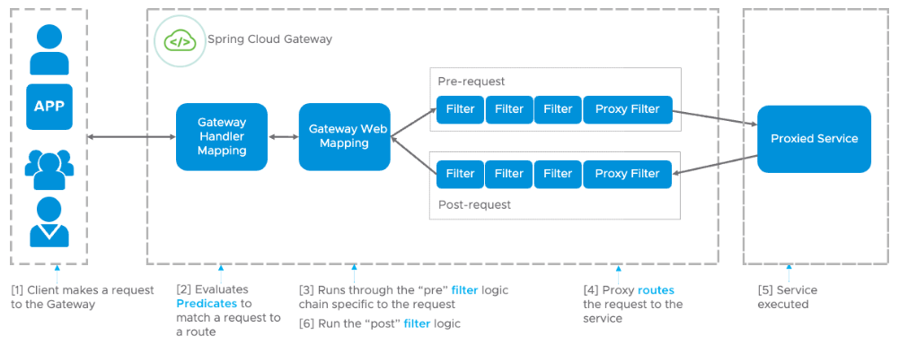

具体的流程分析：

1. **路由判断**：客户端的请求到达网关后，先经过 Gateway Handler Mapping 处理，这里面会做断言（Predicate）判断，看下符合哪个路由规则，这个路由映射后端的某个服务。
2. **请求过滤**：然后请求到达 Gateway Web Handler，这里面有很多过滤器，组成过滤器链（Filter Chain），这些过滤器可以对请求进行拦截和修改，比如添加请求头、参数校验等等，有点像净化污水。然后将请求转发到实际的后端服务。这些过滤器逻辑上可以称作 Pre-Filters，Pre 可以理解为“在...之前”。
3. **服务处理**：后端服务会对请求进行处理。
4. **响应过滤**：后端处理完结果后，返回给 Gateway 的过滤器再次做处理，逻辑上可以称作 Post-Filters，Post 可以理解为“在...之后”。
5. **响应返回**：响应经过过滤处理后，返回给客户端。

总结：客户端的请求先通过匹配规则找到合适的路由，就能映射到具体的服务。然后请求经过过滤器处理后转发给具体的服务，服务处理后，再次经过过滤器处理，最后返回给客户端。


#### Spring Cloud Gateway 的断言是什么？

断言（Predicate）就是对一个表达式进行 if 判断，结果为真或假，如果为真应用规则，否则匹配下一个。

在 Gateway 中，如果客户端发送的请求满足了断言的条件，则映射到指定的路由器，就能转发到指定的服务上进行处理。

断言配置的示例如下，配置了两个路由规则，有一个 predicates 断言配置，当请求 url 中包含 `api/thirdparty`，就匹配到了第一个路由 `route_thirdparty`。

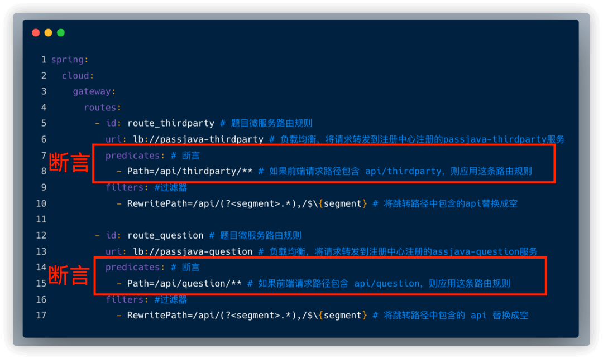

常见的路由断言规则如下图所示：

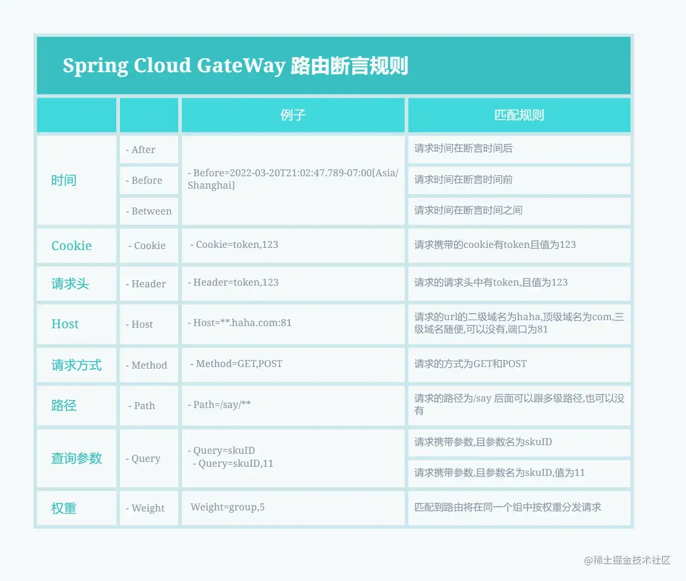


#### Spring Cloud Gateway 的路由和断言是什么关系？

Route 路由和 Predicate 断言的对应关系如下：

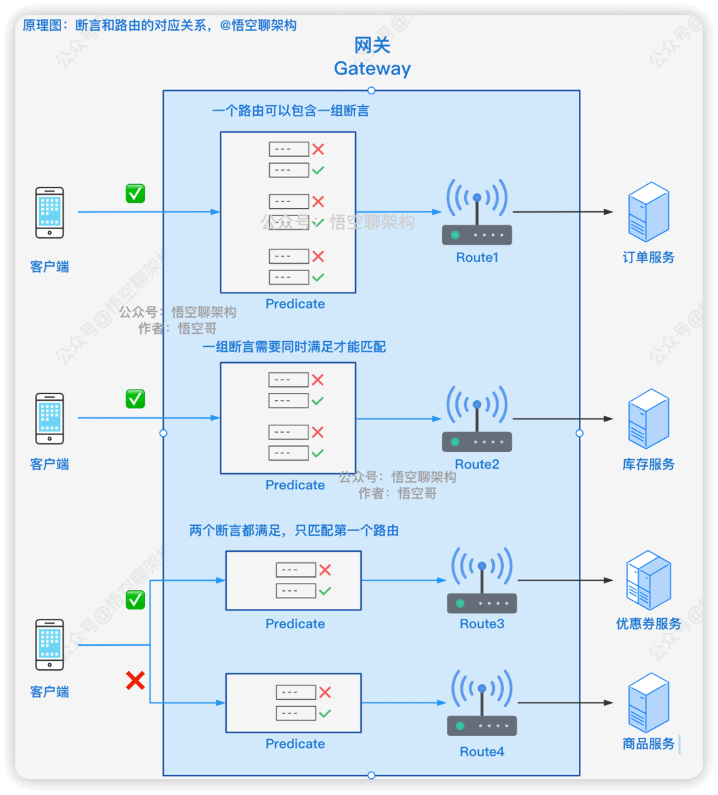

- **一对多**：一个路由规则可以包含多个断言。如上图中路由 Route1 配置了三个断言 Predicate。
- **同时满足**：如果一个路由规则中有多个断言，则需要同时满足才能匹配。如上图中路由 Route2 配置了两个断言，客户端发送的请求必须同时满足这两个断言，才能匹配路由 Route2。
- **第一个匹配成功**：如果一个请求可以匹配多个路由，则映射第一个匹配成功的路由。如上图所示，客户端发送的请求满足 Route3 和 Route4 的断言，但是 Route3 的配置在配置文件中靠前，所以只会匹配 Route3。


#### Spring Cloud Gateway 如何实现动态路由？

Spring Cloud Gateway 作为微服务的入口，需要尽量避免重启，而现在配置更改需要重启服务不能满足实际生产过程中的动态刷新、实时变更的业务需求，所以需要在 Spring Cloud Gateway 运行时动态配置网关。

实现动态路由的方式有很多种，其中一种推荐的方式是基于 Nacos 注册中心来做。 Spring Cloud Gateway 可以从注册中心获取服务的元数据（例如服务名称、路径等），然后根据这些信息自动生成路由规则。这样，当你添加、移除或更新服务实例时，网关会自动感知并相应地调整路由规则，无需手动维护路由配置。


#### Spring Cloud Gateway 的过滤器有哪些？

过滤器 Filter 按照请求和响应可以分为两种：

- **Pre 类型**：在请求被转发到微服务之前，对请求进行拦截和修改，例如参数校验、权限校验、流量监控、日志输出以及协议转换等操作。
- **Post 类型**：微服务处理完请求后，返回响应给网关，网关可以再次进行处理，例如修改响应内容或响应头、日志输出、流量监控等。

另外一种分类是按照过滤器 Filter 作用的范围进行划分：

- **GatewayFilter**：局部过滤器，应用在单个路由或一组路由上的过滤器。标红色表示比较常用的过滤器。
- **GlobalFilter**：全局过滤器，应用在所有路由上的过滤器。


##### 1. 局部过滤器

常见的局部过滤器如下图所示：

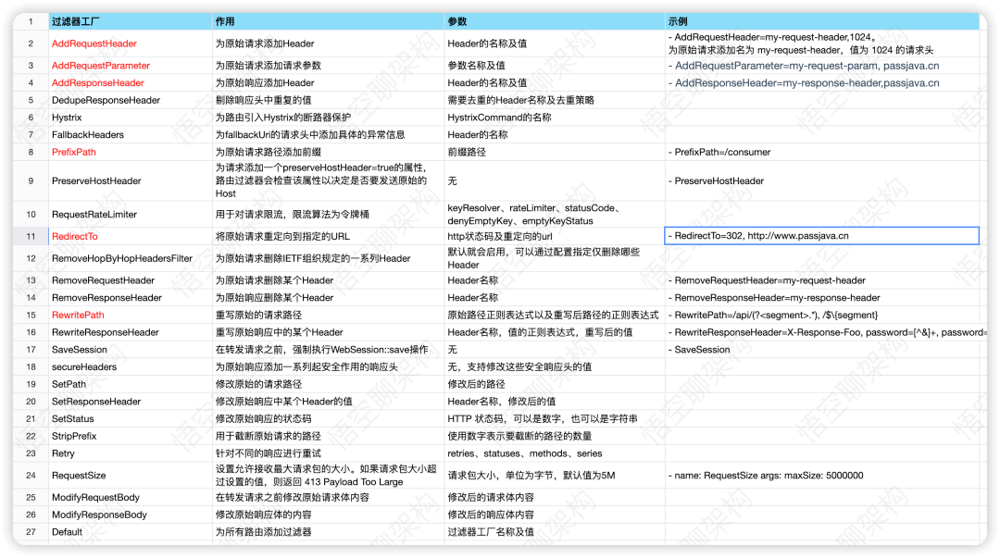

比如说RewritePath，示例，如果 URL 匹配成功，则去掉 URL 中的 “api”。

```yaml
filters: #过滤器
  - RewritePath=/api/(?<segment>.*),/$\{segment} # 将跳转路径中包含的 “api” 替换成空
```

*当然我们也可以通过继承的方式自定义过滤器。


##### 2. 全局过滤器

常见的全局过滤器如下图所示：

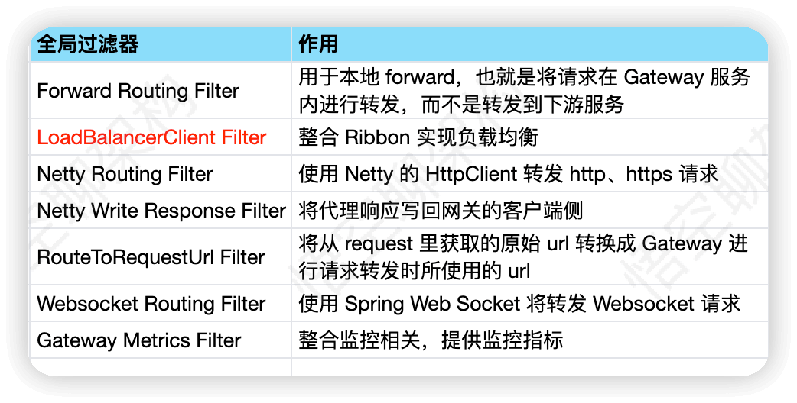

全局过滤器最常见的用法是进行负载均衡。配置如下所示：

```yaml
spring:
  cloud:
    gateway:
      routes:
        - id: route_member # 第三方微服务路由规则
          uri: lb://passjava-member # 负载均衡，将请求转发到注册中心注册的 passjava-member 服务
          predicates: # 断言
            - Path=/api/member/** # 如果前端请求路径包含 api/member，则应用这条路由规则
          filters: #过滤器
            - RewritePath=/api/(?<segment>.*),/$\{segment} # 将跳转路径中包含的api替换成空
```

这里有个关键字 `lb`，就是用到了全局过滤器 `LoadBalancerClientFilter`，当匹配到这个路由后，会将请求转发到 passjava-member 服务，且支持负载均衡转发，也就是先将 passjava-member 解析成实际的微服务的 host 和 port，然后再转发给实际的微服务。


#### Spring Cloud Gateway 支持限流吗？*

Spring Cloud Gateway 可以通过限流过滤器的方式来实现限流，对应的接口是 `RateLimiter`，`RateLimiter` 接口只有一个实现类 `RedisRateLimiter` （基于 Redis + Lua 实现的限流，也就是时间窗口限流），提供的限流功能比较简易且不易使用。

从 Sentinel 1.6.0 版本开始，Sentinel 引入了 Spring Cloud Gateway 的适配模块，可以提供两种资源维度的限流：route 维度（路由也就是服务维度）和自定义 API 维度（接口维度）。也就是说，Spring Cloud Gateway 可以结合 Sentinel 实现更强大的网关流量控制。

在 `application.yml` 中配置sentinel的配置开启网关（前题是网关模块倒入sentinel的starter）

```yml
spring:
  cloud:
    sentinel:
      # 启动就加载规则
      eager: true
      # Sentinel 控制台地址
      transport:
        dashboard: localhost:8080
      # 启用网关限流
      gateway:
        enabled: true

```

然后的话具体的限流配置的话可以，打开sentinel的控制自带页面，然后找到网关来进行定义。

其次的话可以通过，代码进行自定义配置。

```java
@PostConstruct
public void initGatewayRules() {
    // 创建限流规则
    GatewayFlowRule rule = new GatewayFlowRule("shortlink_route")
        // 每秒最多1000个请求
        .setCount(1000)
        // 统计时间窗口为1秒
        .setIntervalSec(1);
    
    // 加载规则
    GatewayRuleManager.loadRules(Collections.singleton(rule));
}
```

话如果超出电流设置值的话，那么就会抛出一个异常，所以我们可以实现一个自定义的过滤器来进行捕捉，这个异常返回友好提示。

```java
@Component
public class SentinelFallbackFilter implements GlobalFilter {
    @Override
    public Mono<Void> filter(ServerWebExchange exchange, GatewayFilterChain chain) {
        return chain.filter(exchange)
            .onErrorResume(e -> {
                // 如果触发限流
                if (e instanceof BlockException) {
                    ServerHttpResponse response = exchange.getResponse();
                    // 返回 429 状态码
                    response.setStatusCode(HttpStatus.TOO_MANY_REQUESTS);
                    return response.writeWith(Mono.just(
                        response.bufferFactory().wrap(
                            "{\"message\": \"请求太频繁，请稍后再试\"}"
                            .getBytes()
                        )
                    ));
                }
                return Mono.error(e);
            });
    }
}
```


#### Spring Cloud Gateway 如何自定义全局异常处理？

在单体的 SpringBoot 项目中，我们捕获全局异常只需要在项目中配置 `@RestControllerAdvice`和 `@ExceptionHandler`就可以了。不过，这种方式在 Spring Cloud Gateway 下不适用。

在微服务中Spring Cloud Gateway 提供了多种全局处理的方式，比较常用的一种是实现`ErrorWebExceptionHandler`并重写其中的`handle`方法。

```java
@Order(-1)
@Component
@RequiredArgsConstructor
public class GlobalErrorWebExceptionHandler implements ErrorWebExceptionHandler {
    private final ObjectMapper objectMapper;

    @Override
    public Mono<Void> handle(ServerWebExchange exchange, Throwable ex) {
    // ...
    }
}
```


#### 负载均衡有哪些算法？

- 简单轮询：将请求按顺序分发给后端服务器上，不关心服务器当前的状态，比如后端服务器的性能、当前的负载。
- 加权轮询：根据服务器自身的性能给服务器设置不同的权重，将请求按顺序和权重分发给后端服务器，可以让性能高的机器处理更多的请求
- 简单随机：将请求随机分发给后端服务器上，请求越多，各个服务器接收到的请求越平均
- 加权随机：根据服务器自身的性能给服务器设置不同的权重，将请求按各个服务器的权重随机分发给后端服务器
- 一致性哈希：根据请求的客户端 ip、或请求参数通过哈希算法得到一个数值，利用该数值取模映射出对应的后端服务器，这样能保证同一个客户端或相同参数的请求每次都使用同一台服务器
- 最小活跃数：统计每台服务器上当前正在处理的请求数，也就是请求活跃数，将请求分发给活跃数最少的后台服务器


#### 如何实现一直均衡给一个用户？

可以通过「一致性哈希算法」来实现，根据请求的客户端 ip、或请求参数通过哈希算法得到一个数值，利用该数值取模映射出对应的后端服务器，这样能保证同一个客户端或相同参数的请求每次都使用同一台服务器。


### 消息队列（RocketMQ和Kafka）

#### 什么是消息队列？为什么需要消息队列？*

消息队列顾名思义就是存放消息的队列（还真是）， 之所以需要消息队列从本质上来说是因为互联网的快速发展，业务不断扩张到了微服务架构成百上千个服务相互调用，需要有一个「东西」来解耦服务之间的关系、控制资源合理合时的使用以及缓冲流量洪峰等等。

**消息队列常用来实现：异步处理、服务解耦、削峰填谷。举三个现实例子来理解。**

##### 1. 异步处理

随着业务的扩展，系统的请求链路可能变得越来越复杂，涉及多个服务的同步调用。

例如，在电商系统中，原本可能只有库存扣减和下单服务，后来可能加入了积分、短信等服务。这些同步调用会导致请求响应时间变长，影响用户体验。

在这种情况下，消息队列可以发挥作用：在某些服务完成后，将相关消息发送到消息队列，立即返回响应。其他服务（如积分、短信等）可以异步地消费队列中的消息，从而减少了请求的等待时间，并实现并行处理。这种方式提高了系统的总体性能。

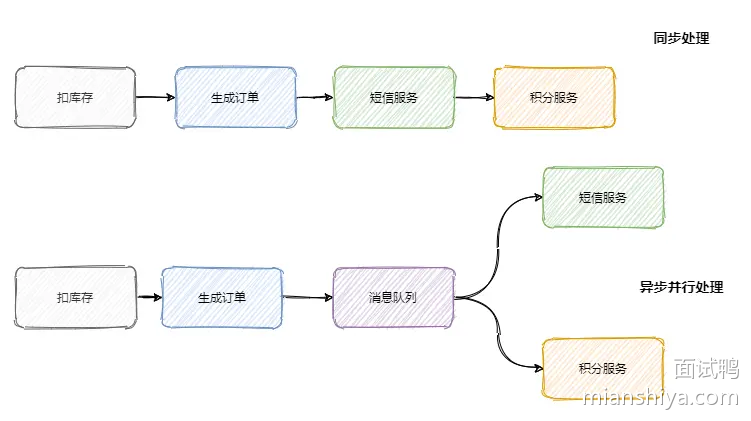

##### 2. 服务解耦

随着业务功能的不断扩展，订单服务需要支持更多的下游系统，例如营销服务、数据分析等。

每次下游系统接口的变更都可能影响到订单服务的稳定性和代码的维护性。为了解决这一问题，可以使用消息队列来解耦系统间的依赖。

订单服务将相关消息发送到消息队列，任何下游系统可以根据需要订阅并消费这些消息。通过这种方式，订单服务不再需要直接依赖每个下游系统，从而减少了系统间的耦合度，提升了灵活性和可维护性。

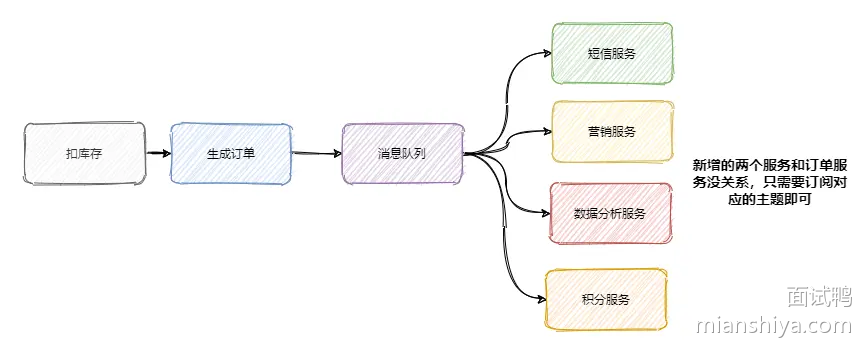

##### 3. 削峰填谷

在高流量的场景下，如秒杀活动，系统可能面临请求过多、处理不及时的问题。为了解决这种生产者过快、消费者处理速度跟不上的问题，可以使用消息队列作为缓冲中间件。

请求首先进入消息队列，然后后端服务根据自身能力从队列中消费请求。如果某些请求的处理不要求立即响应，且处理流程较长，也可以通过消息队列将请求延后处理，避免系统过载。消息队列通过平衡生产者与消费者的处理速度，确保系统的稳定运行。


但是也要注意，使用了消息队列系统可能会降低可用性因为如果消息队列组件挂了那么系统会变得不可用，同时增加了复杂性，同时消息队列自己本身也存在问题

* **重复消费消息的问题**
  在实现异步处理时，如果某些服务（如积分服务）从消息队列中消费消息时出现异常或网络问题，可能会导致该消息被重新消费。比如，如果一个用户的积分增加操作由于消费失败而被重复触发，可能会导致用户的积分被错误地增加多次，带来系统的不一致性和潜在损失。因此，在处理消息时，必须设计机制来避免重复消费，确保数据的准确性。

* **消息的顺序消费问题**
  在某些业务场景下，消息的消费顺序是非常重要的。例如，在订单处理中，如果库存扣减和下单操作的顺序不对，可能导致库存的误差或订单处理失败。在使用消息队列时，确保消息按照正确的顺序被消费是一个挑战。需要对消息队列进行配置，确保相关的服务在正确的时间顺序内消费消息，避免顺序错乱。

* **分布式事务问题**
  当系统采用微服务架构时，不同的服务之间可能涉及多个数据库操作。如果一个服务（例如积分服务）消费了一个消息并进行数据库更新，但在处理过程中出现故障，如何确保数据的正确性和一致性就成了一个问题。分布式事务需要协调多个服务之间的操作，以保证在消息消费过程中，所有的操作要么成功，要么回滚，避免出现部分成功、部分失败的情况。

* **消息堆积的问题**
  在高流量场景下，例如秒杀活动或流量高峰期，如果生产者产生消息的速度超过消费者的处理能力，消息会在消息队列中堆积，可能导致系统的内存溢出（OOM）或其他性能问题。为了避免这种情况，消息队列需要进行合理的流控，确保生产者和消费者之间的平衡。如果消费速度较慢，可能需要通过调整消费者的数量、处理能力或对消息进行分批消费来解决堆积问题。


#### 消息队列是怎么演进的？

##### 1. IBM MQ（早期阶段）

IBM MQ 的关键特点是其可靠的消息传递能力，特别适合企业级应用。它的目标是提供一个稳定、可靠的消息传递中间件，保证消息的顺序和传递的可靠性。


IBM MQ 的架构以队列管理器（Queue Manager）为核心，队列管理器负责管理队列及其消息的传递，并通过消息通道（Channel）将消息从一个队列传递到另一个队列。消息头包含路由信息，队列本身则存储消息，确保消息在传递过程中不丢失。（队列管理器（Queue Manager）是消息队列的逻辑容器。它通过消息通道（channel）向其他队列管理器传输数据。传输的数据抽象为“消息”这个概念。队列用来存储消息。消息头包含路由信息、存储方式和传递目标信息。）


IBM MQ 最初应用于金融、电信等领域，尤其是那些需要强可靠性的传统行业，典型的应用场景包括企业系统集成和跨系统的数据传输。

IBM MQ 解决了企业级系统集成中消息传递的可靠性和事务性问题，确保了不同系统之间的稳定消息传递。

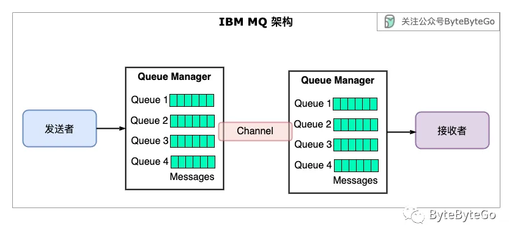

还有其他一些非开源消息队列，如 MSMQ（1997 年）和 SQS（2004 年），它们都在各自的生态系统中发挥了很好的作用。


##### 2. RabbitMQ（**标准化阶段**）

RabbitMQ 实现了 AMQP（Advanced Message Queuing Protocol）协议，这一协议标准化了消息传递的格式和行为。RabbitMQ 具备灵活的路由策略，通过交换机（Exchange）根据不同的路由规则将消息分发到合适的队列。


RabbitMQ 引入了交换机（Exchange）的概念，支持多种消息路由策略，比如直连交换、主题交换和扇出交换等。生产者将消息发送到交换机，由交换机根据规则将消息路由到一个或多个队列。

尽管 RabbitMQ 在实现了 AMQP 协议并引入了更多的灵活性，但其性能在高并发、大数据量的场景下存在一定瓶颈，特别是在需要极高吞吐量的情况下，虽然 RabbitMQ 拥有很多现代消息队列概念，但它是近 20 年前开发的。**当时的分布式系统还不像现在这样成熟**，因此该架构在处理大流量和大量并发请求的场景时受到了限制，总体而言RabbitMQ 的表现不如 Kafka。


RabbitMQ 主要解决了消息协议标准化的问题，使得跨平台、跨语言的消息传递变得更加统一和高效。

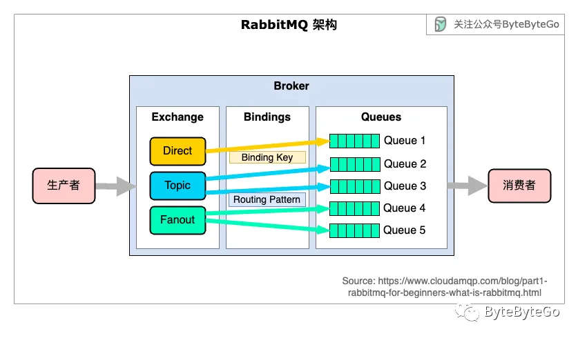


##### 3.Kafka（**分布式阶段**）

Kafka 的核心特点是其高吞吐量、低延迟和分布式架构。Kafka 在设计上为了高性能进行了优化，采用了顺序写磁盘、分区机制以及零拷贝技术来提升数据传输效率。


Kafka 使用分区（Partition）来保证高并发，可以在多个节点上分布式处理消息。它的顺序写磁盘的设计确保了高性能，并且通过零拷贝技术显著减少了内存和 I/O 操作的开销。


Kafka 特别适合大数据实时处理、日志收集、流式处理等场景。它的架构设计使其成为处理海量数据和事件流的理想选择，广泛应用于互联网公司和大数据分析平台中。


Kafka 解决了大数据时代的流处理需求，特别是对高吞吐量、低延迟和容错性强的消息处理平台的需求。

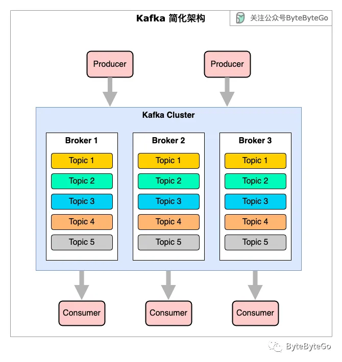

总结一下，消息队列的发展从一开始的消息传递中间件演进为流处理。现代消息队列通常将这两种功能结合在一起，并支持分布式环境中的容错。我们用下图来结束今天的日拱一卒：**每种流行产品的诞生都改变了消息队列的编程范式，并解决了业务痛点**。

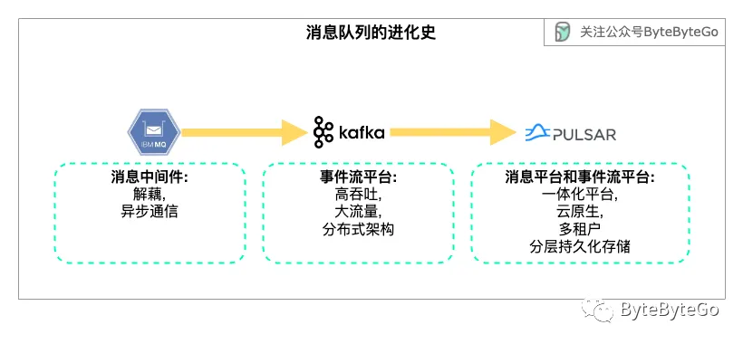


#### 简单介绍一下RocketMQ

`RocketMQ` 是一个 **队列模型** 的消息中间件，具有**高性能、高可靠、高实时、分布式** 的特点。它是一个采用 `Java` 语言开发的分布式的消息系统，由阿里巴巴团队开发，在 2016 年底贡献给 Apache，主要场景有：

1. **异步通信**
   当系统中有大量的请求需要异步处理时，使用RocketMQ可以解耦系统，提升性能。例如，用户注册后发送欢迎邮件等操作可以通过消息队列异步处理，避免阻塞主流程，提升用户体验和系统效率。
2. **服务解耦**
   通过使用消息队列，各个服务之间可以通过消息进行通信，降低系统耦合，提高系统的可扩展性和稳定性。这使得服务的独立性增强，接口变化不再影响其他服务，增强了系统的灵活性和可维护性。
3. **削峰填谷**
   在高并发系统中，短时间内的高并发请求可能导致系统崩溃。通过消息队列，可以进行流量削峰填谷，将请求缓存到队列中，避免瞬间的流量洪峰压垮系统，保证系统平稳运行。
4. **日志传输**
   在分布式系统中，各个节点会产生大量的日志信息。通过消息队列，可以集中采集和传输这些日志，便于统一存储、分析和监控，提高日志管理效率。
5. **分布式事务**
   RocketMQ提供分布式事务的支持。在分布式系统中，确保跨服务的事务一致性至关重要。通过RocketMQ的事务消息机制，可以保证在多个系统或服务之间的操作要么全部成功，要么全部回滚，保证系统数据的一致性。


#### 队列模型和主题模型是什么？*

队列模型和主题模型是消息队列中生产者和消费者两者交互的设计模式。

##### 1. **队列模型（点对点模型）**

在队列模型中，消息从生产者生成并发送到消息队列中，每条消息只能被一个消费者消费。消息一旦被消费者消费后，就从队列中删除。

这种模型适用于需要任务处理的场景，其中每个任务只能由一个消费者处理。例如，在订单处理系统中，一个订单的处理需要由唯一的处理者执行，而其他消费者无法再处理这个订单。

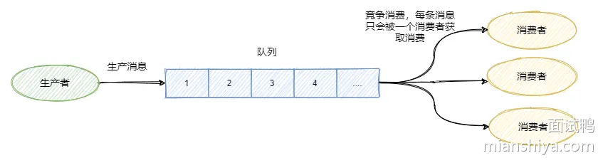

但如果我们此时我们需要将一个消息发送给多个消费者(比如此时需要将信息同时发给短信系统和邮件系统)，这个时候单个队列即不能满足需求了。

当然自然而然可以联想让 `Producer` 生产消息放入多个队列中，然后每个队列去对应每一个消费者可以解决。

但创建多个队列并且复制多份消息存在两个问题，**第一很影响资源和性能。第二导致生产者需要知道具体消费者个数然后去复制对应数量的消息队列，这就违背我们消息中间件的 解耦 这一原则。**

于是就引出了发布/订阅模型，来解决这个问题。


##### 2. **发布/订阅模型（Publish/Subscribe，Pub/Sub）**

在发布/订阅模型中，生产者将消息发布到某个**主题（Topic）**，而所有订阅了该主题的消费者都会接收到相同的消息。每个订阅者都会独立处理消息，且这些消息不会从队列中删除，直到被每个订阅者消费。

这种模型适用于广播通知、实时推送等场景，允许多个消费者并行接收相同的消息。

在主题模型中，消息的生产者称为 **发布者(Publisher)** ，消息的消费者称为 **订阅者(Subscriber)** ，存放消息的容器称为 **主题(Topic)** 。


#### RocketMQ 中的消息模型是什么？

`RocketMQ` 中的消息模型就是按照 **主题模型** 所实现的， 但**主题模型/发布订阅模型** 就是一个标准，`RocketMQ` 有比较特殊的点。

如下图所示，RocketMQ 中的 **主题模型**有 `Producer Group`、`Topic`、`Consumer Group` 三个部分组成。

- `Producer Group` 生产者组：代表某一类的生产者，比如我们有多个秒杀系统作为生产者，这多个合在一起就是一个 `Producer Group` 生产者组，它们一般生产相同的消息。
- `Consumer Group` 消费者组：代表某一类的消费者，比如我们有多个短信系统作为消费者，这多个合在一起就是一个 `Consumer Group` 消费者组，它们一般消费相同的消息。
- `Topic` 主题：代表一个处理流程中一类消息，比如订单消息，物流消息等等。


每个主题中都有多个队列(不同队列分布在不同的 `Broker`中，如果是集群的话，`Broker`又分布在不同的服务器中)。

集群消费模式下，一个消费者集群多台机器共同消费一个 `topic` 的多个队列，**一个队列只会被一个消费者消费**，而且每个消费组的消费者都要在各自的消费队列中维护各自的消费位置。如果某个消费者挂掉，分组内其它消费者会接替挂掉的消费者继续消费（如上图中 `Consumer1` 和 `Consumer2` 分别对应着两个队列，而 `Consumer3` 是没有队列对应的，如果`Consumer2` 挂掉由`Consumer3`代替他消费第二个消费队列）。


**Q：为什么每个消费组在每个队列上维护一个消费位置？**

A：因为在发布订阅模式中一般会涉及到多个消费者组，而每个消费者组在每个队列中的消费位置都是不同的。如果此时有多个消费者组，那么消息被一个消费者组消费完之后是不会删除的(因为其它消费者组也需要呀)，它仅仅是为每个消费者组维护一个 **消费位移(offset)** ，每次消费者组的消费者消费完会返回一个成功的响应，然后队列再把对应消费者成功响应维护消费位移加一，这样就不会出现刚刚消费过的消息再一次被消费了。

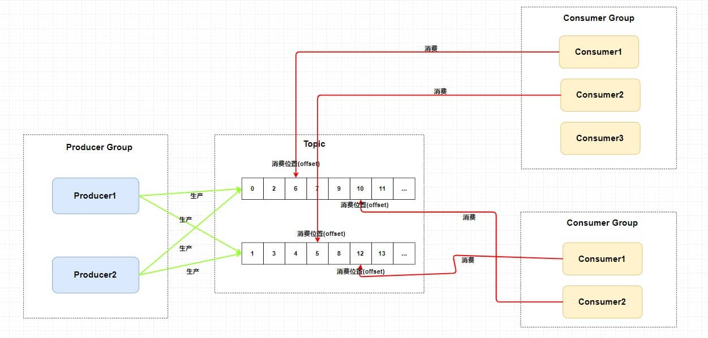


**Q：为什么一个主题中需要维护多个队列 ？**

答案是 **提高并发能力** 。的确，每个主题中只存在一个队列也是可行的。你想一下，如果每个主题中只存在一个队列，这个队列中也维护着每个消费者组的消费位置，这样也可以做到 **发布订阅模式** 。如下图。

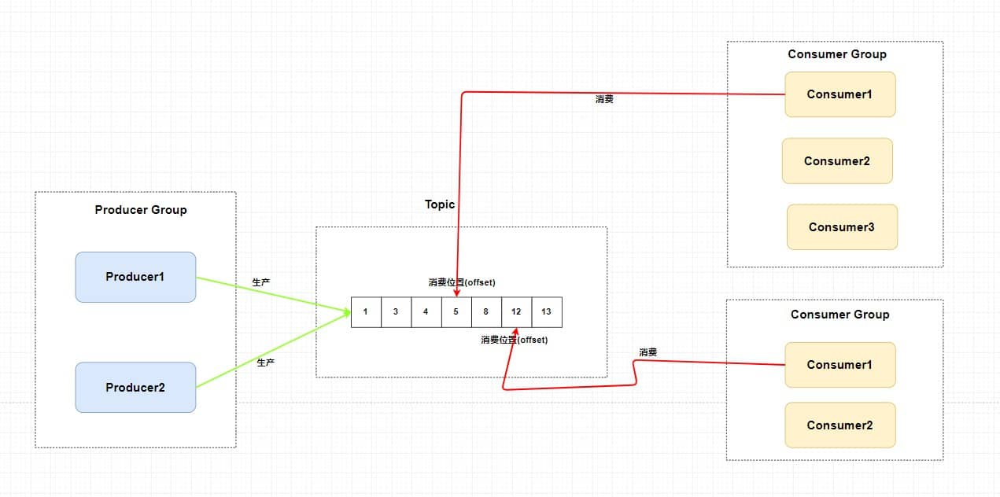

但是，这样我生产者是不是只能向一个队列发送消息？又因为需要维护消费位置所以一个队列只能对应一个消费者组中的消费者，这样是不是其他的 `Consumer` 就没有用武之地了？从这两个角度来讲，并发度一下子就小了很。多。

所以总结来说，`RocketMQ` 通过**使用在一个 Topic 中配置多个队列并且每个队列维护每个消费者组的消费位置** 实现了 **主题模式/发布订阅模式** 。


**Q：所以说所谓消费者组，其实只要有一个消费者消费就行是吗？**

A：并不是“消费者组”中只有一个消费者就可以。**消费者组是一个逻辑上的概念**，它表示一个共同消费某个主题的一个类型中的多个消费者。打个比方来说，有一个订单主题，有两个服务来进行消费，分别是个人会员订单服务和Saas订单服务，那么就是消费同一个topic的两个消费者组，其中微服务架构下，每一个服务有多个实例，比如说订单服务有实例a实例a就是这个消费者组里面的消费者a。

每个消费者组中的消费者可以共同消费队列中的消息，但如果主题下有多个队列，**一个消费者组内部的消费者会平分队列，确保每个队列只能被组内的一个消费者消费**，从而保证消息的消费不重复和并发度的提升。

但如果一个消费者组下的消费者数量大于队列数，或者某些消费者没有被分配到队列上，会产生“空闲”消费者的情况。为了避免这种情况，消息队列通常会采用 **轮询（Round-robin）** 或 **公平分配** 策略来确保消费者能够尽可能均匀地分配到每个队列上。例如，消费者组中的每个消费者会被轮流分配到不同的队列上，这样就可以避免某个消费者被“饿死”而无消息可消费。

同时每个消费者组维护一个 **消费位移(offset)** ，每次消费者组的消费者消费完会返回一个成功的响应，然后队列再把对应消费者成功响应维护消费位移加一，即便消费者饥饿然后被公平分配，策略分配到一个队列消费消息后，其他消费者即便消费过该位置中的消息，也不会干扰它的消费进度。


#### 讲讲RocketMQ 的架构？

`RocketMQ` 技术架构中有四大角色 `NameServer`、`Broker`、`Producer`、`Consumer` 。

- `Broker`：主要负责消息的存储、投递和查询以及服务高可用保证。就是消息队列服务器嘛，生产者生产消息到 `Broker` ，消费者从 `Broker` 拉取消息并消费，为了**高可用设计（HA）**需要配置多个 Broker。

  

  

- `NameServer`：是RocketMQ 内部的 **注册中心** ，主要提供两个功能：**Broker 管理** 和 **路由信息管理** 。 `Broker` 会将自己的信息注册到 `NameServer` 中，此时 `NameServer` 就存放了很多 `Broker` 的信息(Broker 的位置可以说是路由表)，消费者和生产者就从 `NameServer` 中获取路由表然后照着路由表的信息和对应的 `Broker` 进行通信(生产者和消费者定期会向 `NameServer` 去查询相关的 `Broker` 的信息)。

- `Producer`：消息发布的角色，支持分布式集群方式部署。说白了就是生产者。

- `Consumer`：消息消费的角色，支持分布式集群方式部署。支持以 push 推，pull 拉两种模式对消息进行消费。同时也支持集群方式和广播方式的消费，它提供实时消息订阅机制。说白了就是消费者。

总体来说，四大块的组织如下所示。

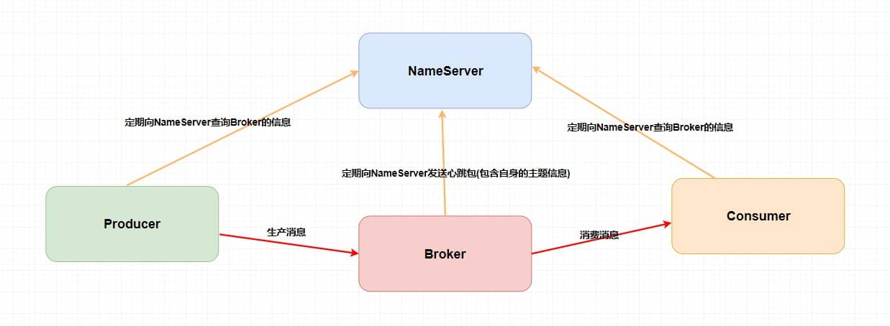


##### Q：`Broker`、`Topic` 和 队列相互之间是什么关系？

A：**一个 Topic 中可以有多个队列**，因此是**一对多的关系**。每个队列存储该 Topic 的消息，并且每个队列都能被不同的消费者组消费。通过这种方式，RocketMQ 实现了对消息的并发消费和负载均衡。

**一个 Topic 分布在多个 Broker上，一个 Broker 可以配置多个 Topic ，它们是多对多的关系**。

而**Broker 主要负责存储队列中的消息**。每个 Broker 都会管理一个或多个队列，并处理与这些队列相关的生产者和消费者的消息传递。

如果某个 `Topic` 消息量很大，应该给它多配置几个队列(上文中提到了提高并发能力)，并且 **尽量多分布在不同 Broker 上，以减轻某个 Broker 的压力** 。

如果某个 Broker 上的队列过多，**该 Broker 的压力会增大**，因为它需要管理更多的队列、存储更多的消息，并且需要处理来自不同消费者和生产者的请求。因此，在负载均衡的情况下，应该合理分配队列到不同的 Broker 上，以保证各个 Broker 的负载均衡。


##### Q：为什么消息队列也需要注册中心？ `Producer`、`Consumer` 和 `Broker` 相互之间直接进行生产消息，消费消息不就好了么？

RocketMQ 内部的 **注册中心**`NameServer`和spring cloud的 **Nacos注册中心**功能很相似进行`Broker`的发现和注册，以及实现多个 `Broker` 来保证 **负载均衡** 。

如果整个系统仅仅靠着一个 `Broker` 来维持的话，那么 `Broker` 的压力会很大；换个方向，若消费者和生产者直接和多个 `Broker` 相连，那么当 `Broker` 修改的时候必定会牵连着每个生产者和消费者，这样就会产生耦合问题，所以我们需要使用**注册中心**`NameServer`来实现对多个 `Broker` 来保证**负载均衡**和**解耦** 。


##### Q：了解`RocketMQ`集群设计吗？*

A：`RocketMQ` 中的技术架构肯定不止前面那么简单，因为上面图中的四个角色都是需要做集群的。

以下是官网的架构图。

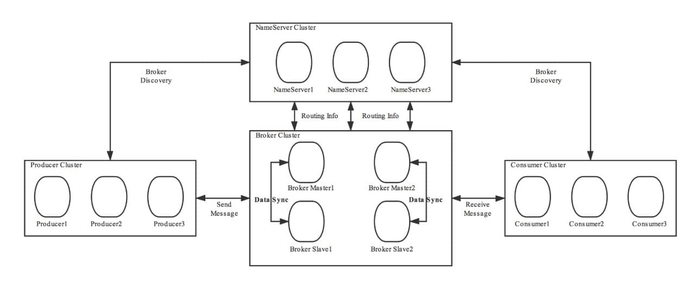

第一、 `Broker` **做了集群并且还进行了主从部署** ，由于消息分布在各个 `Broker` 上，一旦某个 `Broker` 宕机，则该`Broker` 上的消息读写都会受到影响。所以 `Rocketmq` 提供了 `master/slave` 的结构，`salve` 定时从 `master` 同步数据(同步刷盘或者异步刷盘)，如果 `master` 宕机，**则 slave 提供消费服务，但是不能写入消息** （在现在的5.0版本增加了dLeader的模式，支持选主）。

第二、为了保证 `HA` ， `NameServer` 也做了集群部署，但是它是 **去中心化** 的。也就意味着它没有主节点，**每个节点存全量数据，节点之间互不通信**在 `RocketMQ` 中是通过 **单个 Broker 和所有 NameServer 保持长连接** ，并且在每隔 30 秒 `Broker` 会向所有 `Nameserver` 发送心跳，心跳包含了自身的 `Topic` 配置信息，这个步骤就对应这上面的 `Routing Info` ，`NameServer` 的职责很单一，就是提供路由信息。

第三、在生产者需要向 `Broker` 发送消息的时候，**需要先从 NameServer 获取关于 Broker 的路由信息**，然后通过 **轮询** 的方法去向每个队列中生产数据以达到 **负载均衡** 的效果。而且要与 Broker建立长连接，定期发送心跳

第四、消费者通过 `NameServer` 获取所有 `Broker` 的路由信息后，向 `Broker` 发送 `Pull` 请求来获取消息数据。而且要与 Broker建立长连接，定期发送心跳，**消费者的下线和上线都会引起再平衡机制，在再平衡期间不能消费。**


**注：** 其实 `Kafka` 的架构基本和 `RocketMQ` 类似，只是它注册中心使用了 `Zookeeper`、它的 **分区** 就相当于 `RocketMQ` 中的 **队列** 。还有一些小细节不同会在后面提到。


#### 消费者分组和生产者分组详细讲解*

##### 1. 生产者分组

在 RocketMQ 中，生产者分组（ProducerGroup）是一个逻辑概念，用于标识一组生产相同类型消息的生产者。它的主要作用是：

- **事务消息支持**：在 4.x 版本中，生产者分组用于标识事务消息的发起方，确保事务消息的最终一致性。
- **消息轨迹追踪**：通过生产者分组，可以追踪消息的来源。

**5.x 版本的变化**：

- 从 5.x 版本开始，RocketMQ 的生产者变为**匿名**，不再需要显式定义生产者分组。
- 如果你使用的是 3.x 或 4.x 版本，已经定义的生产者分组可以继续使用，但不再推荐新业务使用。


##### 2. 消费者分组

消费者分组（ConsumerGroup）用于管理一组行为一致的消费者。它的核心作用是：

- **负载均衡**：同一消费者分组内的多个消费者共同消费消息，实现水平扩展。
- **高可用**：消费者分组内的消费者可以动态增减，确保消费服务的高可用性。
- **统一管理**：消费者分组内的消费者共享相同的订阅关系、消费顺序性和重试策略。

**消费者分组的关键特性有**

1. **订阅关系**：消费者分组以组为单位管理订阅关系。例如，一个消费者分组可以订阅某个 Topic 下的所有消息。订阅关系是逻辑资源，消费者分组内的所有消费者共享相同的订阅规则。

2. **投递顺序性**：RocketMQ 支持两种消息投递模式，投递模式在消费者分组中统一配置。

   - **顺序投递**：消息按照发送顺序被消费（适用于顺序消息）。
   - **并发投递**：消息可以并行消费（适用于普通消息）。

3. **消费重试策略**：当消息消费失败时，RocketMQ 会根据消费者分组的配置进行重试。

   重试策略包括：重试次数（默认 16 次）和死信队列（超过重试次数后，消息进入死信队列）。

4. **消费模式：** 在消费者组可以设置哪种形式来进行启动—— **广播（Broadcast）和集群（Cluster）**。广播模式下，一条消息会发送给 **同一个消费组中的所有消费者** ，集群模式下消息只会发送给一个消费者。

RocketMQ 服务端 5.x 版本：上述消费者的消费行为从关联的消费者分组中统一获取，因此，同一分组内所有消费者的消费行为必然是一致的，客户端无需关注。

RocketMQ 服务端 3.x/4.x 历史版本：上述消费逻辑由消费者客户端接口定义，因此，您需要自己在消费者客户端设置时保证同一分组下的消费者的消费行为一致。(来自官方网站)


#### 展开说RocketMQ的四种消息？

##### 1. 普通消息：异步解耦，独立消费

普通消息是消息队列的最基础形态，适用于无需严格时序的可靠传输场景。典型如电商订单系统与日志收集：订单支付后，上游系统将事件封装为独立消息投递至Broker，下游系统异步消费处理。其生命周期遵循"初始化→持久化存储→消费者可见→消费中→提交结果→物理删除"的流程，核心特点是消息间无关联、支持重试消费，适用于解耦系统间的数据传递。


**普通消息生命周期**

- 初始化：消息被生产者构建并完成初始化，待发送到服务端的状态。
- 待消费：消息被发送到服务端，对消费者可见，等待消费者消费的状态。
- 消费中：消息被消费者获取，并按照消费者本地的业务逻辑进行处理的过程。 此时服务端会等待消费者完成消费并提交消费结果，如果一定时间后没有收到消费者的响应，RocketMQ 会对消息进行重试处理。
- 消费提交：消费者完成消费处理，并向服务端提交消费结果，服务端标记当前消息已经被处理（包括消费成功和失败）。RocketMQ 默认支持保留所有消息，此时消息数据并不会立即被删除，只是逻辑标记已消费。消息在保存时间到期或存储空间不足被删除前，消费者仍然可以回溯消息重新消费。
- 消息删除：RocketMQ 按照消息保存机制滚动清理最早的消息数据，将消息从物理文件中删除。


##### 2. 定时消息：时间驱动，延迟触发

定时消息是通过延迟投递机制实现的，分为固定延时等级（如1s/5s）和精确时间点（5.x版本API）两种模式。当消息被标记为定时后，Broker会将其存入专用存储系统而非立即投递，待预设时间到达后才转入普通存储队列供消费。典型应用于订单超时关闭：用户下单30分钟未支付则触发延时消息关闭订单。需注意避免海量消息设置相同触发时间，否则可能引发消费延迟。

定时消息仅支持在 `MessageType` 为 `Delay` 的主题内使用，即定时消息只能发送至类型为定时消息的主题中，发送的消息的类型必须和主题的类型一致。

基于定时消息的超时任务处理具备如下优势：

- **精度高、开发门槛低**：基于消息通知方式不存在定时阶梯间隔。可以轻松实现任意精度事件触发，无需业务去重。
- **高性能可扩展**：传统的数据库扫描方式较为复杂，需要频繁调用接口扫描，容易产生性能瓶颈。RocketMQ 的定时消息具有高并发和水平扩展的能力。


**定时消息生命周期**

- 初始化：消息被生产者构建并完成初始化，待发送到服务端的状态。
- 定时中：消息被发送到服务端，和普通消息不同的是，服务端不会直接构建消息索引，而是会将定时消息**单独存储在定时存储系统中**，等待定时时刻到达。
- 待消费：定时时刻到达后，服务端将消息重新写入普通存储引擎，对下游消费者可见，等待消费者消费的状态。
- 消费中：消息被消费者获取，并按照消费者本地的业务逻辑进行处理的过程。 此时服务端会等待消费者完成消费并提交消费结果，如果一定时间后没有收到消费者的响应，RocketMQ 会对消息进行重试处理。
- 消费提交：消费者完成消费处理，并向服务端提交消费结果，服务端标记当前消息已经被处理（包括消费成功和失败）。RocketMQ 默认支持保留所有消息，此时消息数据并不会立即被删除，只是逻辑标记已消费。消息在保存时间到期或存储空间不足被删除前，消费者仍然可以回溯消息重新消费。
- 消息删除：Apache RocketMQ 按照消息保存机制滚动清理最早的消息数据，将消息从物理文件中删除。

**注：如果将大量定时消息的定时时间设置为同一时刻，则到达该时刻后会有大量消息同时需要被处理，会造成系统压力过大，导致消息分发延迟，影响定时精度。**


##### 3. 顺序消息：组内串行，分区有序

顺序消息仅支持使用 MessageType 为 FIFO 的主题，即顺序消息只能发送至类型为顺序消息的主题中，发送的消息的类型必须和主题的类型一致。

和普通消息发送相比，顺序消息发送必须要通过MessageQueueSelector设置消息组。且同一消息组的消息要保证消息的顺序性需要单一生产者串行发送。

消费者在单线程使用 **MessageListenerConcurrently** 可以顺序消费，在多线程环境下使用 MessageListenerOrderly 才能顺序消费。

**Q：消息组是什么？ 是消费者组吗？**

A："消息组" 在 RocketMQ 中并不是指 **消费者组**，而是指用于 **顺序消息** 的一种概念，用于确保同一组消息的顺序性。它的作用是确保同一组内的消息能够按照发送的顺序被消费，而不同组之间的消息则可以并行处理。

**消息组**（Message Group）是一个逻辑分组，通常由业务上的某个唯一标识决定。例如：

- 在订单系统中，**订单ID**可以作为消息组，确保同一个订单的操作（如创建、支付、发货）按顺序处理。
- 在聊天系统中，**会话ID**可以作为消息组，确保同一个会话的消息按顺序投递。

- 消息组通过`MessageQueueSelector`来指定，生产者在发送消息时需要明确当前消息属于哪个组。


##### 4. 事务消息：两阶段提交，最终一致

事务消息是 Apache RocketMQ 提供的一种高级消息类型，支持在分布式场景下保障消息生产和本地事务的最终一致性。

简单来讲，就是将本地事务（数据库的 DML 操作）与发送消息合并在同一个事务中。例如，新增一个订单。在事务未提交之前，不发送订阅的消息。发送消息的动作随着事务的成功提交而发送，随着事务的回滚而取消。当然真正地处理过程不止这么简单，包含了半消息、事务监听和事务回查等概念。

核心流程：

1. 发送半消息（对消费者不可见）
2. 执行本地事务（如扣减余额）
3. 根据事务结果提交/回滚消息（提交后消息可见，回滚则丢弃）
4. Broker定时回查未决事务（防止本地事务状态未知）
   典型应用于跨系统事务：如支付成功后通知发货，若支付系统宕机导致事务未提交，Broker通过回查机制确认最终状态，避免资金损失但未发货的极端情况。

在下面本文会有更详细的解答。


#### 为什么使用RocketMQ时不建议单一进程创建大量生产者？

Apache RocketMQ 的生产者和主题是多对多的关系，支持同一个生产者向多个主题发送消息，生产者复用模式使得系统中的生产者数量保持在一个合理的范围内，避免了因大量生产者创建和销毁导致的资源竞争和系统不稳定因素。

**对于生产者的创建和初始化，建议遵循够用即可、最大化复用原则，如果有需要发送消息到多个主题的场景，无需为每个主题都创建一个生产者。**

所以大量创建生产者是冗余的而且开销会很大，每一个生产者都需要维护自己的配置（如 TCP 长连接、线程池资源等）。在一个进程中创建大量生产者会占用过多的内存和 CPU 资源，导致系统资源紧张，影响整体性能和稳定性。


#### 为什么使用RocketMQ时不建议频繁创建和销毁生产者？

Apache RocketMQ 的生产者是可以重复利用的底层资源，类似数据库的连接池。因此不需要在每次发送消息时动态创建生产者，且在发送结束后销毁生产者。

##### 1. **Broker端开销大**

频繁创建和销毁生产者会导致 RocketMQ 的 Broker 端处理大量短连接请求，服务器需要频繁地进行连接的建立、销毁和资源清理等工作。这会占用 Broker 端大量的 CPU、内存和网络资源，降低 Broker 的整体处理能力和稳定性。例如，每次生产者连接和断开时，Broker 都需要进行网络握手、分配资源等操作，这些操作都会增加服务器的负载。


##### 2. **客户端开销大**

频繁创建生产者对象意味着需要不断地进行资源分配和初始化工作，包括创建线程池、建立网络连接等。同时，销毁生产者也需要进行资源清理和状态同步等操作。这些频繁的资源分配和释放操作会消耗客户端大量的 CPU 和内存资源，降低客户端的性能。


##### 3. **维护成本高**

频繁创建和销毁生产者使得系统的状态难以维护和管理，可能会导致内存泄漏、资源未释放等问题，增加了软件维护的难度和系统的不稳定因素。


正确示例：

```java
Producer p = ProducerBuilder.build();
for (int i =0;i<n;i++){
    Message m= MessageBuilder.build();
    p.send(m);
 }
p.shutdown();
```

##### Q：为什么没有“大量创建消费者”和“频繁创建和销毁消费者”的禁忌？
A：虽然官方文档可能没有像对生产者那样强调，但**在实际工程实践中，频繁创建和销毁消费者实例是比生产者更严重的问题，是绝对要避免的**，因为它直接破坏了消费者组的稳定性和消息的可靠性。
由于队列独占原则，在一个消费者组内，创建过多的消费者**不会带来性能提升**，只会**浪费资源**，因为多余的消费者会空闲。这是由消费模型决定的**自限制**。
而且每次消费者的加入或退出都会触发消费者组的 Rebalance，这会导致整个组暂停消费，进行队列重新分配，严重影响消费服务的可用性。


#### 说一下RocketMQ的三种消费者*

在 RocketMQ 中，共有三种类型的消费者，包括 **PushConsumer**、**SimpleConsumer** 和 **PullConsumer**。

##### 1. PushConsumer **（监听器模式）**

PushConsumer 是一种高度封装的消费者类型，通过消费监听器（Consumer Listener）自动监听并返回结果。而RocketMQ 客户端 SDK 会自动处理消息的获取、消费状态提交以及消费重试等流程，开发者仅需关注监听器中的业务逻辑。这种方式，严格限制了消息的同步处理及每条消息的处理超时时间，确保消息的可靠性。

PushConsumer 适合需要简单且可靠的消费方式场景。例如，在一个订单处理系统中，当新订单发布到 RocketMQ 时，PushConsumer 可以自动监听该消息，并在业务逻辑中处理订单的后续流程（如通知库存系统）。

PushConsumer 的消费监听器执行结果分为以下三种情况：

- 返回消费成功：以 Java SDK 为例，返回`ConsumeResult.SUCCESS`，表示该消息处理成功，服务端按照消费结果更新消费进度。
- 返回消费失败：以 Java SDK 为例，返回`ConsumeResult.FAILURE`，表示该消息处理失败，需要根据消费重试逻辑判断是否进行重试消费。
- 出现非预期失败：例如抛异常等行为，该结果按照消费失败处理，需要根据消费重试逻辑判断是否进行重试消费。


```java
// 使用 PushConsumer 自动监听消息（Java 示例）
DefaultMQPushConsumer pushConsumer = new DefaultMQPushConsumer("YourConsumerGroup");
pushConsumer.setNamesrvAddr("localhost:9876"); // NameServer 地址
pushConsumer.subscribe("OrderTopic", "*");      // 订阅主题和Tag（*表示所有Tag）

// 注册消息监听器
pushConsumer.registerMessageListener(new MessageListenerConcurrently() {
    @Override
    public ConsumeConcurrentlyStatus consumeMessage(
        List<MessageExt> messages, 
        ConsumeConcurrentlyContext context
    ) {
        for (MessageExt message : messages) {
            try {
                // 1. 处理消息（如更新订单状态）
                System.out.println("收到消息: " + new String(message.getBody()));
                // 2. 返回消费成功
                return ConsumeConcurrentlyStatus.CONSUME_SUCCESS;
            } catch (Exception e) {
                // 3. 处理失败，稍后重试
                return ConsumeConcurrentlyStatus.RECONSUME_LATER;
            }
        }
        return ConsumeConcurrentlyStatus.CONSUME_SUCCESS;
    }
});

pushConsumer.start(); // 启动消费者
```


使用 PushConsumer 消费者消费时，不允许使用以下方式处理消息，否则 RocketMQ 无法保证消息的可靠性。

- 错误方式一：在业务逻辑消息还未处理完成，就提前返回消费成功结果。此时如果消息消费失败，RocketMQ 服务端是无法感知的，因此不会进行消费重试。

  如消息处理逻辑中需要调用一个外部服务，而这个外部服务调用非常耗时或异步的。如果开发者在调用外部服务之前就返回了消费成功，RocketMQ 会认为消息已经被成功消费，从而记录消费进度。但外部服务是不稳定的，如果失败，RocketMQ 会认为消息已经被成功消费不会有任何重试操作。

- 错误方式二：在消费监听器内将消息再次分发到自定义的其他线程，消费监听器提前返回消费结果。此时如果消息消费失败，RocketMQ 服务端同样无法感知，因此也不会进行消费重试。

  假设监听器中启动了一个线程池来异步处理消息，而主线程（监听器的逻辑所在的线程）直接返回了消费成功的状态。RocketMQ 会根据监听器的返回值去提交消费进度。然而，实际处理消息的线程可能在后续某个时间点处理失败，RocketMQ 服务端无法感知这部分失败，并且不会进行重试。


此外PushConsumer 严格限制了消息同步处理及每条消息的处理超时时间，适用于以下场景：

- 消息处理时间可预估：如果不确定消息处理耗时，经常有预期之外的长时间耗时的消息，PushConsumer 的可靠性保证会频繁触发消息重试机制造成大量重复消息。
- 无异步化、高级定制场景：PushConsumer 限制了消费逻辑的线程模型，由客户端 SDK 内部按最大吞吐量触发消息处理。该模型开发逻辑简单，但是不允许使用异步化和自定义处理流程。

一句话就是**适合简单、自动化的消费场景**。


##### 2. SimpleConsumer（推荐的手动模式）

与 PushConsumer 不同，SimpleConsumer 不是自动拉取消息，而是需要开发者主动调用接口来获取消息、提交消费状态等。开发者可以自定义消息的预估处理时长，并且能够灵活地调整消费速率以及实现批量消费等高级定制功能。

一个来自官网的例子：

```java
// 使用 SimpleConsumer 消费普通消息，主动获取消息处理并提交。
ClientServiceProvider provider = ClientServiceProvider.loadService(); // 获取 ClientServiceProvider 实例，作为客户端的提供者。
// 创建一个 topic 变量来表示要消费的消息主题。
String topic = "YourTopic";

// 定义消息过滤规则，选择需要消费的消息的标记（Tag）。这里是基于 Tag 进行过滤。
// 如果消息的 Tag 和过滤规则不匹配，那么该消息将不会被消费。
FilterExpression filterExpression = new FilterExpression("YourFilterTag", FilterExpressionType.TAG);

// 创建 SimpleConsumer 消费者，使用 builder 模式进行配置。
// `newSimpleConsumerBuilder` 返回一个构建者对象，用于配置 SimpleConsumer 的各项参数。
SimpleConsumer simpleConsumer = provider.newSimpleConsumerBuilder()
        .setConsumerGroup("YourConsumerGroup")  // 设置消费者组。消费者组标识一个消费组，多个消费者可以共享同一个消费者组，进行负载均衡消费。
        .setClientConfiguration(ClientConfiguration.newBuilder().setEndpoints("YourEndpoint").build())  // 设置 RocketMQ 服务端的接入点（endpoint）。通常是 Broker 地址或者 NameServer 地址。
        .setSubscriptionExpressions(Collections.singletonMap(topic, filterExpression))  // 设置订阅关系，告诉消费者要消费哪个 topic，并使用 filterExpression 进行过滤（例如 Tag 过滤）。
        .setAwaitDuration(Duration.ofSeconds(1))  // 设置从服务端接收消息时的最大等待时间。这里设置为 1 秒，表示如果超过 1 秒没有消息，拉取会超时返回。
        .build(); // 构建并返回一个 SimpleConsumer 实例。

try {
    // 使用 `simpleConsumer.receive()` 来主动拉取消息。接收的参数：
    // 10：每次最多拉取 10 条消息。
    // Duration.ofSeconds(30)：拉取消息的最大等待时间是 30 秒。如果在 30 秒内没有消息，会返回空结果。
    List<MessageView> messageViewList = simpleConsumer.receive(10, Duration.ofSeconds(30));
    
    // 遍历接收到的消息并进行处理。
    messageViewList.forEach(messageView -> {
        System.out.println(messageView); // 打印每条消息的详细信息。

        // 消费处理完成后，需要主动调用 `ack()` 方法来提交消费结果，告诉 RocketMQ 消息已经被消费成功。
        try {
            simpleConsumer.ack(messageView); // 提交消费确认（acknowledgment），这表示消息已成功消费。
        } catch (ClientException e) {
            // 如果提交 ack 时出现异常，记录错误信息。
            logger.error("Failed to ack message, messageId={}", messageView.getMessageId(), e);
        }
    });
} catch (ClientException e) {
    // 如果在拉取消息时发生异常（例如系统流控、网络问题等），可以重新发起拉取请求。
    logger.error("Failed to receive message", e);
}
```

SimpleConsumer 适用于以下场景：

- 消息处理时长不可控：如果消息处理时长无法预估，经常有长时间耗时的消息处理情况。建议使用 SimpleConsumer 消费类型，可以在消费时自定义消息的预估处理时长，若实际业务中预估的消息处理时长不符合预期，也可以通过接口提前修改。
- 需要异步化、批量消费等高级定制场景：SimpleConsumer 在 SDK 内部没有复杂的线程封装，完全由业务逻辑自由定制，可以实现异步分发、批量消费等高级定制场景。
- 需要自定义消费速率：SimpleConsumer 是由业务逻辑主动调用接口获取消息，因此可以自由调整获取消息的频率，自定义控制消费速率。


##### 3. PullConsumer（手动拉取模式）

PullConsumer 是一种基于“拉取”模式实现的消费者，用户需要主动从 RocketMQ 拉取消息并进行处理。

- **手动控制**：PullConsumer 要求开发者手动控制消息的拉取过程，包括决定拉取的时间和数量等。
- **独立性**：PullConsumer 不依赖 RocketMQ 客户端 SDK 的自动消费逻辑，开发者需要自行管理消息的消费进度和状态。

```java
// 使用 PullConsumer 手动拉取消息（Java 示例）
DefaultMQPullConsumer pullConsumer = new DefaultMQPullConsumer("YourConsumerGroup");
pullConsumer.setNamesrvAddr("localhost:9876");
pullConsumer.start();

// 获取主题的消息队列列表
Set<MessageQueue> queues = pullConsumer.fetchSubscribeMessageQueues("OrderTopic");

for (MessageQueue queue : queues) {
    long offset = pullConsumer.fetchConsumeOffset(queue, false); // 获取当前消费偏移量
    while (true) {
        // 手动拉取消息（每次最多32条）
        PullResult result = pullConsumer.pull(queue, "*", offset, 32);
        if (result.getPullStatus() == PullStatus.FOUND) {
            // 处理消息
            for (MessageExt msg : result.getMsgFoundList()) {
                System.out.println("收到消息: " + new String(msg.getBody()));
            }
            // 更新消费偏移量（需自行存储到本地或Broker）
            pullConsumer.updateConsumeOffset(queue, result.getNextBeginOffset());
            offset = result.getNextBeginOffset();
        } else {
            break; // 无更多消息
        }
    }
}
pullConsumer.shutdown();
```


这种消费者适合**需要定制消费逻辑**如当有特殊的消费逻辑需要实现时，例如对消息进行分类处理、重新排序等和**高并发场景**：在高并发情况下，PullConsumer 可以更好地控制消费速率，避免因消息堆积导致性能问题。但代码复杂度高，**官方已不推荐使用**（建议改用 SimpleConsumer）。

| 类型                 | 控制方式 | 偏移量管理    | 适用场景             | 复杂度 |
| ------------------ | ---- | -------- | ---------------- | --- |
| **PushConsumer**   | 自动拉取 | SDK 自动管理 | 常规异步处理（如通知、日志）   | 低   |
| **SimpleConsumer** | 手动拉取 | SDK 自动管理 | 需控制速率/批量处理（如ETL） | 中   |
| **PullConsumer**   | 完全手动 | 需自行维护    | 历史数据回溯/特殊调度      | 高   |


#### 如何解决顺序消费和重复消费？*

##### 1. 顺序消费

RocketMQ 本身在 **主题层面** 并不保证消息顺序，但在 **队列层面** 是有顺序保证的。也就是说，同一个队列中的消息是按顺序消费的，但不同队列的消息顺序无法保证。

现行RocketMQ一般用普通顺序机制是指消费者通过 **同一个消费队列收到的消息是有顺序的**，不同消息队列收到的消息则可能是无顺序的。普通顺序消息在 `Broker` **重启情况下不会保证消息顺序性** (短暂时间) 。

但RocketMQ基于高并发的特点生产消息的时候会进行轮询（取决于负载均衡策略）将消息放入`Broker` 集群里不同的队列之中（如果此时我有几个消息分别是同一个订单的创建、支付、发货，在轮询的策略下这 **三个消息会被发送到不同队列**，但是这些在一个服务处理这些事情的情况下必须是顺序处理）。

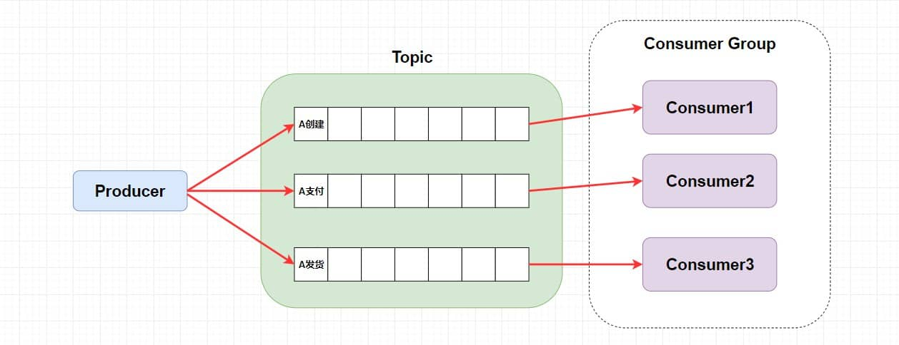

所以发送端要通过实现MessageQueueSelector接口的方式，根据消息的特征自定义队列选择策略（如订单id哈希）。

```java
SendResult sendResult = producer.send(msg, new MessageQueueSelector() {
    @Override
    public MessageQueue select(List<MessageQueue> mqs, Message msg, Object arg) {
        String orderId = (String) arg;  // 业务标识（如订单ID）
        int index = Math.abs(orderId.hashCode()) % mqs.size();
        return mqs.get(index);  // 相同 orderId 的消息固定发到同一队列
    }
}, orderId);  // 传入业务标识
```

而消费端处理也要顺序如通过 **MessageListenerOrderly** 监听器（顺序消息消费者）实现队列内消息的串行消费：

```java
consumer.registerMessageListener(new MessageListenerOrderly() {
    @Override
    public ConsumeOrderlyStatus consumeMessage(List<MessageExt> messages, ConsumeOrderlyContext context) {
        for (MessageExt msg : messages) {
            // 顺序处理消息（单线程）
            processOrderEvent(msg); 
        }
        return ConsumeOrderlyStatus.SUCCESS;
    }
});
```


还有一点就是对于拉模式消费者(PullConsumer/LitePullConsumer)，是的，需要自行实现，

- 队列锁定机制
- 确保同一时刻只有一个线程消费同一队列
- 按顺序处理消息


**Q：为什么固定使用普通顺序？有其他顺序吗？**

A：普通顺序是相对严格顺序来说，严格顺序是指消费者在一个主题收到的**所有消息**均是有顺序的。而且严格顺序消息 **即使在异常情况下也会保证消息的顺序性** 。

但是，严格顺序看起来虽好，实现它可会付出巨大的代价。因为这个Topic只配置一个队列一个消费者进行消费，并发量太低了。

大部分情况下，大部分生产场景并不需要严格的消息顺序，因为严格顺序模式会导致系统的可用性和吞吐量降低。普通顺序模式满足了大多数场景，且能够容忍短暂的乱序。因此，一般推荐使用 **普通顺序模式**。

那么，我们现在使用了 **普通顺序模式** ，我们从上面学习知道了在 `Producer` 生产消息的时候会进行轮询()来向同一主题的不同消息队列发送消息。那么，因为在不同的队列此时就无法使用 `RocketMQ` 带来的队列有序特性来保证消息有序性了。

| **特性**       | **普通顺序**                     | **严格顺序**                               |
| -------------- | -------------------------------- | ------------------------------------------ |
| **顺序范围**   | 同一队列内的消息顺序消费         | 全局所有消息严格有序                       |
| **实现复杂度** | 低（默认支持）                   | 高（需独占队列，限制并行）                 |
| **可用性**     | 高（单队列故障不影响其他队列）   | 低（单点故障导致全局不可用）               |
| **吞吐量**     | 高（多队列并行）                 | 低（单队列串行）                           |
| **适用场景**   | 订单操作、聊天会话等局部有序场景 | 金融交易、计费流水等强一致性场景（极少用） |


**Q：RocketMQ 有什么队列选择方法实现负载均衡？**

A：RocketMQ 实现了两种队列选择算法，也可以自己实现

- 轮询算法

  - 轮询算法就是向消息指定的 topic 所在队列中依次发送消息，保证消息均匀分布
  - 是 RocketMQ 默认队列选择算法

- 最小投递延迟算法

  - 每次消息投递的时候统计消息投递的延迟，选择队列时优先选择消息延时小的队列，导致消息分布不均匀,按照如下设置即可。

```
    producer.setSendLatencyFaultEnable(true);
```

- 继承 MessageQueueSelector 实现

  ```java
  SendResult sendResult = producer.send(msg, new MessageQueueSelector() {
      @Override
      public MessageQueue select(List<MessageQueue> mqs, Message msg, Object arg) {
          //从mqs中选择一个队列,可以根据msg特点选择
          return null;
      }
  }, new Object());
  ```


##### Q：前面说到严格顺序有异常情况也会保持，有哪些异常？*

A：第一是**发送异常，** 选择队列后会与 Broker 建立连接，通过网络请求将消息发送到 Broker 上，如果 Broker 挂了或者网络波动发送消息超时此时 RocketMQ 会进行重试。

重新选择其他 Broker 中的消息队列进行发送，默认重试两次，可以手动设置。

```
producer.setRetryTimesWhenSendFailed(5);
```

第二是**消息过大，** 消息超过 4kb 时 RocketMQ 会将消息压缩后在发送到 Broker 上，减少网络资源的占用。


##### 2. 重复消费的解决

要通过一定策略来实现 **幂等** 。在编程中一个**幂等** 操作的特点是其任意多次执行所产生的影响均与一次执行的影响相同。如果实现幂等，那么即便出现重复消费，也不会影响数据，执行多少次都不变。

这个问题结合具体的项目（ShortLINK）的。可以使用 **写入 Redis** 来保证，因为 `Redis` 的 `key` 和 `value` 就是天然支持幂等的。当然还有使用 **数据库插入法** ，基于数据库的唯一键来保证重复数据不会被插入多条。

而在整个互联网领域，幂等不仅仅适用于消息队列的重复消费问题，这些实现幂等的方法，也同样适用于，**在其他场景中来解决重复请求或者重复调用的问题** 。比如将 HTTP 服务设计成幂等的，**解决前端或者 APP 重复提交表单数据的问题** ，也可以将一个微服务设计成幂等的，解决 `RPC` 框架自动重试导致的 **重复调用问题**。


#### **什么是死信队列？**

死信队列是 RocketMQ 中用于存储**无法被正常消费的消息**的特殊队列。当某条消息在消费者端多次重试（默认 16 次）后仍然无法被成功消费时，RocketMQ 会将该消息转移到死信队列中，避免继续重试浪费资源。

死信队列是 RocketMQ 提供的一种**容错机制**，确保即使某些消息无法被正常处理，也不会丢失或无限重试。

可以通过订阅死信队列来消费其中的消息。

```java
// 订阅死信队列
consumer.subscribe("%DLQ%YourConsumerGroup", "*");

// 注册消息监听器
consumer.registerMessageListener(new MessageListenerConcurrently() {
    @Override
    public ConsumeConcurrentlyStatus consumeMessage(List<MessageExt> messages, ConsumeConcurrentlyContext context) {
        for (MessageExt msg : messages) {
            System.out.println("死信消息: " + new String(msg.getBody()));
            // 处理死信消息（如记录日志或修复数据）
        }
        return ConsumeConcurrentlyStatus.CONSUME_SUCCESS;
    }
});
```

RocketMQ 的死信队列命名规则为：

```
%DLQ%ConsumerGroup
```

- `%DLQ%` 是固定前缀，表示死信队列。
- `ConsumerGroup` 是消费者组的名称，表示该死信队列属于哪个消费者组。

例如，如果消费者组名为 `OrderConsumerGroup`，那么对应的死信队列名称为：

```
%DLQ%OrderConsumerGroup
```


**死信队列中的消息通常是业务逻辑或数据异常导致的，通过监控死信队列，可以快速定位问题。**


#### RocketMQ 如何实现分布式事务？

在分布式系统中，事务的原子性、一致性、隔离性和持久性（ACID）难以保证，因为不同的服务可能部署在不同的节点上，且网络通信可能会出现延迟、丢包等问题。例如，订单系统和积分系统是两个独立的服务，订单系统成功创建订单后，积分系统可能因为网络问题无法增加积分，导致数据不一致。

RocketMQ 的事务消息机制通过**半消息（Half Message）** 和**事务反查（Transaction Check）** 来解决分布式事务问题。具体步骤如下：

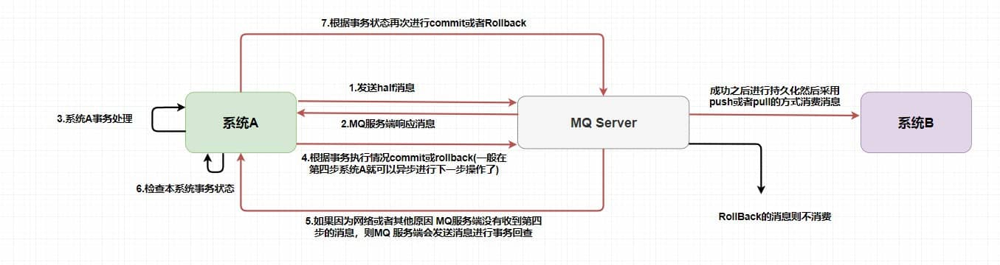

##### 1. 发送半消息（Half Message）
- **半消息**：生产者发送一条消息到 RocketMQ，但这条消息对消费者不可见。RocketMQ 会将消息存储在一个特殊的 Topic（`RMQ_SYS_TRANS_HALF_TOPIC`）中，消费者无法消费这些消息。
- **目的**：确保消息在本地事务执行成功之前，不会被消费者消费（因为对消费者不可见消费者没有订阅这个主题`RMQ_SYS_TRANS_HALF_TOPIC`）。

```java
TransactionSendResult result = rocketMQTemplate.sendMessageInTransaction(destination, message, function);
```


##### 2. 执行本地事务

- 生产者发送半消息成功后，执行本地事务（如订单系统的订单创建操作）。
- 本地事务执行成功后，生产者会向 RocketMQ 发送**提交**或**回滚**指令。

```java
@Transactional
public Boolean addViewHistory(String transactionId, Long userId, Long forecastLogId) {
    // 本地事务操作
    ViewHistory viewHistory = new ViewHistory();
    viewHistory.setUserId(userId);
    viewHistory.setForecastLogId(forecastLogId);
    viewHistory.setCreateTime(LocalDateTime.now());
    boolean save = viewHistoryService.save(viewHistory);

    // 存储事务状态
    MqTransaction mqTransaction = new MqTransaction();
    mqTransaction.setTransactionId(transactionId);
    mqTransaction.setCreateTime(new Date());
    mqTransaction.setStatus(MqTransaction.StatusEnum.VALID.getStatus());
    mqTransactionService.save(mqTransaction);

    return save;
}
```


##### 3. 事务反查机制（Transaction Check）

- 如果生产者发送半消息后，由于网络问题或系统崩溃，没有及时发送提交或回滚指令，RocketMQ 会通过**事务反查机制**来检查本地事务的状态。
- RocketMQ 会定期从 `RMQ_SYS_TRANS_HALF_TOPIC` 中拉取消息，并向生产者发送事务状态查询请求。
- 生产者根据本地事务的执行结果，返回**提交**或**回滚**指令。

```java
@Override
public RocketMQLocalTransactionState checkLocalTransaction(Message message) {
    String transactionId = message.getHeaders().get("rocketmq_TRANSACTION_ID").toString();
    MqTransaction mqTransaction = redisService.getCacheObject("mqTransaction:" + transactionId);
    if (Objects.isNull(mqTransaction)) {
        return RocketMQLocalTransactionState.ROLLBACK;
    }
    return RocketMQLocalTransactionState.COMMIT;
}
```


##### 4. 消息的最终状态

- 如果 RocketMQ 收到**提交**指令，消息会被移动到正常的 Topic 中，消费者可以消费该消息（如积分系统得到订单创建消息之后开始执行积分增加）。
- 如果 RocketMQ 收到**回滚**指令，消息会被丢弃，消费者不会收到该消息（积分系统没有得到订单创建消息不会开始事物）。

```java
@Override
public void onMessage(Message message) {
    String transactionId = message.getTransactionId();
    MqTransaction mqTransaction = redisService.getCacheObject("mqTransaction:" + transactionId);
    if (Objects.isNull(mqTransaction)) {
        return; // 事务不存在，直接返回
    }
    if (Objects.equals(mqTransaction.getStatus(), MqTransaction.StatusEnum.CONSUMED.getStatus())) {
        return; // 已消费，直接返回
    }

    // 处理业务逻辑
    // ...

    // 更新事务状态为已消费
    mqTransaction.setStatus(MqTransaction.StatusEnum.CONSUMED.getStatus());
    redisService.setCacheObject("mqTransaction:" + transactionId, mqTransaction, 4L, TimeUnit.HOURS);
}
```

事务消息的优势是

- **最终一致性**：通过异步的方式，确保消息的最终一致性。即使生产者出现故障，RocketMQ 也能通过事务反查机制确保消息的正确处理。
- **解耦**：生产者只需要关注本地事务的执行，消息的可靠投递由 RocketMQ 负责（多次重试）。


**Q：主要是哪一步保证了分布式事物的一致性？**

A：核心在于事务反查机制，如果出现网路波动生产者MQ提交事物状态没有发送成功，这样就会产生 MQ 不知道是不是需要给消费者消费的问题（然后可能出现A系统成功（订单创建成功）而B系统不成功（积分不增加））。在 `RocketMQ` 中就是使用的上述的事务反查来解决的，而在 `Kafka` 中通常是直接抛出一个异常让用户来自行解决。

所以事务消息**不要求系统A和系统B直接同步它们的事务，而是通过消息队列和事务消息来实现最终一致性**。


**注：事务消息需要一个事务监听器来监听本地事务是否成功，并且事务监听器接口只允许被实现一次。** 那就意味着需要把各种事务消息的本地事务都写在一个接口方法里面，必将会产生大量的耦合和类型判断。采用函数 Function 接口来包装整个业务过程，作为一个参数传递到监听器的接口方法中。再调用 Function 的 apply() 方法来执行业务，事务也会在 apply() 方法中执行。让监听器与业务之间实现解耦，使之具备了真实生产环境中的可行性。以下为示例：


1.模拟一个添加用户浏览记录的需求

```java
@PostMapping("/add")
@ApiOperation("添加用户浏览记录")
public Result<TransactionSendResult> add(Long userId, Long forecastLogId) {

        // 函数式编程:浏览记录入库
        Function<String, Boolean> function = transactionId -> viewHistoryHandler.addViewHistory(transactionId, userId, forecastLogId);

        Map<String, Long> hashMap = new HashMap<>();
        hashMap.put("userId", userId);
        hashMap.put("forecastLogId", forecastLogId);
        String jsonString = JSON.toJSONString(hashMap);

        // 发送事务消息;将本地的事务操作,用函数Function接口接收,作为一个参数传入到方法中
        TransactionSendResult transactionSendResult = mqProducerService.sendTransactionMessage(jsonString, MQDestination.TAG_ADD_VIEW_HISTORY, function);
        return Result.success(transactionSendResult);
}
```

2.发送事务消息的方法

```java
/**
 * 发送事务消息
 *
 * @param msgBody
 * @param tag
 * @param function
 * @return
 */
public TransactionSendResult sendTransactionMessage(String msgBody, String tag, Function<String, Boolean> function) {
    // 构建消息体
    Message<String> message = buildMessage(msgBody);

    // 构建消息投递信息
    String destination = buildDestination(tag);

    TransactionSendResult result = rocketMQTemplate.sendMessageInTransaction(destination, message, function);
    return result;
}
```

3.生产者消息监听器,只允许一个类去实现该监听器

```java
@Slf4j
@RocketMQTransactionListener
public class TransactionMsgListener implements RocketMQLocalTransactionListener {

    @Autowired
    private RedisService redisService;

    /**
     * 执行本地事务（在发送消息成功时执行）
     *
     * @param message
     * @param o
     * @return commit or rollback or unknown
     */
    @Override
    public RocketMQLocalTransactionState executeLocalTransaction(Message message, Object o) {

        // 1、获取事务ID
        String transactionId = null;
        try {
            transactionId = message.getHeaders().get("rocketmq_TRANSACTION_ID").toString();
            // 2、判断传入函数对象是否为空，如果为空代表没有要执行的业务直接抛弃消息
            if (o == null) {
                //返回ROLLBACK状态的消息会被丢弃
                log.info("事务消息回滚，没有需要处理的业务 transactionId={}", transactionId);
                return RocketMQLocalTransactionState.ROLLBACK;
            }
            // 将Object o转换成Function对象
            Function<String, Boolean> function = (Function<String, Boolean>) o;
            // 执行业务 事务也会在function.apply中执行
            Boolean apply = function.apply(transactionId);
            if (apply) {
                log.info("事务提交，消息正常处理 transactionId={}", transactionId);
                //返回COMMIT状态的消息会立即被消费者消费到
                return RocketMQLocalTransactionState.COMMIT;
            }
        } catch (Exception e) {
            log.info("出现异常 返回ROLLBACK transactionId={}", transactionId);
            return RocketMQLocalTransactionState.ROLLBACK;
        }
        return RocketMQLocalTransactionState.ROLLBACK;
    }

    /**
     * 事务回查机制，检查本地事务的状态
     *
     * @param message
     * @return
     */
    @Override
    public RocketMQLocalTransactionState checkLocalTransaction(Message message) {

        String transactionId = message.getHeaders().get("rocketmq_TRANSACTION_ID").toString();

        // 查redis
        MqTransaction mqTransaction = redisService.getCacheObject("mqTransaction:" + transactionId);
        if (Objects.isNull(mqTransaction)) {
            return RocketMQLocalTransactionState.ROLLBACK;
        }
        return RocketMQLocalTransactionState.COMMIT;
    }
}
```

4.模拟的业务场景,这里的方法必须提取出来,放在别的类里面.如果调用方与被调用方在同一个类中,会发生事务失效的问题。

```java
@Component
public class ViewHistoryHandler {

    @Autowired
    private IViewHistoryService viewHistoryService;

    @Autowired
    private IMqTransactionService mqTransactionService;

    @Autowired
    private RedisService redisService;

    /**
     * 浏览记录入库
     *
     * @param transactionId
     * @param userId
     * @param forecastLogId
     * @return
     */
    @Transactional
    public Boolean addViewHistory(String transactionId, Long userId, Long forecastLogId) {
        // 构建浏览记录
        ViewHistory viewHistory = new ViewHistory();
        viewHistory.setUserId(userId);
        viewHistory.setForecastLogId(forecastLogId);
        viewHistory.setCreateTime(LocalDateTime.now());
        boolean save = viewHistoryService.save(viewHistory);

        // 本地事务信息
        MqTransaction mqTransaction = new MqTransaction();
        mqTransaction.setTransactionId(transactionId);
        mqTransaction.setCreateTime(new Date());
        mqTransaction.setStatus(MqTransaction.StatusEnum.VALID.getStatus());

        // 1.可以把事务信息存数据库
        mqTransactionService.save(mqTransaction);

        // 2.也可以选择存redis,4个小时有效期,'4个小时'是RocketMQ内置的最大回查超时时长,过期未确认将强制回滚
        redisService.setCacheObject("mqTransaction:" + transactionId, mqTransaction, 4L, TimeUnit.HOURS);

        // 放开注释,模拟异常,事务回滚
        // int i = 10 / 0;

        return save;
    }
}
```

5.消费消息,以及幂等处理

```java
@Service
@RocketMQMessageListener(topic = MQDestination.TOPIC, selectorExpression = MQDestination.TAG_ADD_VIEW_HISTORY, consumerGroup = MQDestination.TAG_ADD_VIEW_HISTORY)
public class ConsumerAddViewHistory implements RocketMQListener<Message> {
    // 监听到消息就会执行此方法
    @Override
    public void onMessage(Message message) {
        // 幂等校验
        String transactionId = message.getTransactionId();

        // 查redis
        MqTransaction mqTransaction = redisService.getCacheObject("mqTransaction:" + transactionId);

        // 不存在事务记录
        if (Objects.isNull(mqTransaction)) {
            return;
        }

        // 已消费
        if (Objects.equals(mqTransaction.getStatus(), MqTransaction.StatusEnum.CONSUMED.getStatus())) {
            return;
        }

        String msg = new String(message.getBody());
        Map<String, Long> map = JSON.parseObject(msg, new TypeReference<HashMap<String, Long>>() {
        });
        Long userId = map.get("userId");
        Long forecastLogId = map.get("forecastLogId");

        // 下游的业务处理
        // TODO 记录用户喜好,更新用户画像

        // TODO 更新'证券预测文章'的浏览量,重新计算文章的曝光排序

        // 更新状态为已消费
        mqTransaction.setUpdateTime(new Date());
        mqTransaction.setStatus(MqTransaction.StatusEnum.CONSUMED.getStatus());
        redisService.setCacheObject("mqTransaction:" + transactionId, mqTransaction, 4L, TimeUnit.HOURS);
        log.info("监听到消息：msg={}", JSON.toJSONString(map));
    }
}
```


#### 如何解决消息堆积问题？

产生消息堆积的根源其实就只有两个——生产者生产太快或者消费者消费太慢。

如果是当流量到峰值的时候是因为生产者生产太快，可以使用一些 **限流降级** 的方法，反过来也可以增加多个消费者实例去水平扩展增加消费能力来匹配生产的激增。

如果消费者消费过慢的话，可以先检查 **是否是消费者出现了大量的消费错误** ，或者打印一下日志查看是否是哪一个线程卡死，出现了锁资源不释放等等的问题。

> 最快速解决消息堆积问题的方法还是增加消费者实例，不过 **同时还需要增加每个主题的队列数量** 。
>
> 因为在 `RocketMQ` 中，**一个队列只会被一个消费者消费** 。


#### RocketMQ 如何保证高性能读写*

主要通过零拷贝技术实现网络IO的高性能读写。

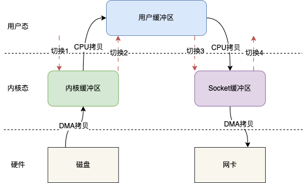

传统的 IO 读写其实就是 read + write 的操作，整个过程会分为如下几步

- 用户调用 read()方法，开始读取数据，此时发生一次上下文从用户态到内核态的切换，也就是图示的切换 1
- 将磁盘数据通过 DMA 拷贝到内核缓存区
- 将内核缓存区的数据拷贝到用户缓冲区，这样用户，也就是我们写的代码就能拿到文件的数据
- read()方法返回，此时就会从内核态切换到用户态，也就是图示的切换 2
- 当我们拿到数据之后，就可以调用 write()方法，此时上下文会从用户态切换到内核态，即图示切换 3
- CPU 将用户缓冲区的数据拷贝到 Socket 缓冲区
- 将 Socket 缓冲区数据拷贝至网卡
- write()方法返回，上下文重新从内核态切换到用户态，即图示切换 4

整个过程发生了 4 次上下文切换和 4 次数据的拷贝，这在高并发场景下肯定会严重影响读写性能故引入了零拷贝技术


mmap（memory map）是一种内存映射文件的方法，即将一个文件或者其它对象映射到进程的地址空间，实现文件磁盘地址和进程虚拟地址空间中一段虚拟地址的一一对映关系。

简单地说就是内核缓冲区和应用缓冲区共享，从而减少了从读缓冲区到用户缓冲区的一次 CPU 拷贝。基于此上述架构图可变为：

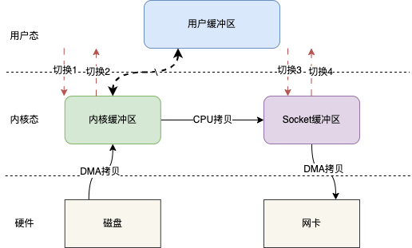

基于 mmap IO 读写其实就变成 mmap + write 的操作，也就是用 mmap 替代传统 IO 中的 read 操作。

当用户发起 mmap 调用的时候会发生上下文切换 1，进行内存映射，然后数据被拷贝到内核缓冲区，mmap 返回，发生上下文切换 2；随后用户调用 write，发生上下文切换 3，将内核缓冲区的数据拷贝到 Socket 缓冲区，write 返回，发生上下文切换 4。

总体而言整个过程发生了 4 次上下文切换和 3 次数据的拷贝，减少了一次数据拷贝。


sendfile()跟 mmap()一样相比传统的 IO 读写也会减少一次 CPU 拷贝，但是它同时也会减少两次上下文切换。

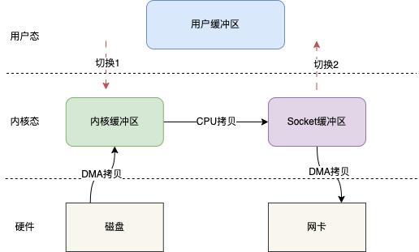

如图，用户在发起 sendfile()调用时会发生切换 1，之后数据通过 DMA 拷贝到内核缓冲区，之后再将内核缓冲区的数据 CPU 拷贝到 Socket 缓冲区，最后拷贝到网卡，sendfile()返回，发生切换 2。

总体而言整个过程发生了发生了 3 次拷贝和两次上下文切换，减少了一次数据拷贝，减少了两次上下文切换。

Java 也提供了相应 api：

```java
FileChannel channel = FileChannel.open(Paths.get("./test.txt"), StandardOpenOption.WRITE, StandardOpenOption.CREATE);
//调用transferTo方法向目标数据传输
channel.transferTo(position, len, target);
```

在如上代码中，并没有文件的读写操作，而是直接将文件的数据传输到 target 目标缓冲区，也就是说，sendfile 是无法知道文件的具体的数据的；但是 mmap 不一样，他是可以修改内核缓冲区的数据的。假设如果需要对文件的内容进行修改之后再传输，只有 mmap 可以满足。

通过上面的一些介绍，结论是基于零拷贝技术，可以减少 CPU 的拷贝次数和上下文切换次数，从而可以实现文件高效的读写操作。

RocketMQ 内部主要是使用基于 mmap 实现的零拷贝(其实就是调用上述提到的 api)，用来读写文件，这也是 RocketMQ 为什么快的一个很重要原因。


#### 在 Topic 中的 队列是以什么样的形式存在的？  

首先前提介绍一下，一个Broker里全局只有一个存储消息的文件**CommitLog**，按照消息到达Broker的时间顺序存储的，不区分Topic和队列。

而每个队列是一个 **存储消息索引的物理文件**，指出自己队列中的消息在**CommitLog**的地址，用来管理管理着消息的存储和消费。队列的数量通常是由消息的分区数决定的，确保消息分布的均衡性和高可用性。


#### 队列中的消息又是如何进行存储持久化的呢？  

队列中的消息会以文件的形式保存在磁盘上。RocketMQ 使用 **CommitLog** 文件来存储消息，消息被追加到文件末尾，采用 **顺序写入** 的方式，这样的方式保证了高效的存储和读取。为了保证数据的持久性，RocketMQ 会在存储消息的同时执行刷盘操作，将数据写入到磁盘，而队列的索引文件在消息刷盘之后，异步的由其他线程进行构建。


#### 同步刷盘 和 异步刷盘 又是什么呢？

- **同步刷盘**：每次写入消息后，RocketMQ 会等待消息被写入到磁盘，并且操作完成后再返回响应。这种方式保证了数据的持久性，但可能会影响性能，因为每次写入都要等待磁盘操作完成。
- **异步刷盘**：消息写入后，RocketMQ 不会立即等待磁盘操作完成，而是直接返回响应，刷盘操作由后台线程异步执行。这种方式提升了性能，因为磁盘操作不需要每次都等待，但可能会导致一定的丢失风险（如果在刷盘之前发生崩溃或断电等故障）。


#### 同步刷盘 和 异步刷盘会给持久化带来什么样的影响呢？

- **同步刷盘**：能够确保数据的高度一致性和持久性，因为每次消息写入都会被确认存储到磁盘，但会牺牲部分性能，增加延迟。
- **异步刷盘**：提高了吞吐量和性能，减少了磁盘IO的等待时间，但在极端情况下，可能会面临数据丢失的风险。如果消息没有被及时刷到磁盘，就可能在系统崩溃时丢失。


#### 主从复制机制的响应ack呢？

- **同步复制（SYNC_MASTER）**：消息写入主节点后，需等待从节点写入成功才返回ACK，保证数据不丢失（主从切换时）。
- **异步复制（ASYNC_MASTER）**：主节点写入成功后立即返回ACK，从节点异步复制，性能高但有主从数据不一致风险。


#### 什么是回溯消费？*

回溯消费是指 `Consumer` 已经消费成功的消息，由于业务上需求需要重新消费，在`RocketMQ` 中， `Broker` 在向`Consumer` 投递成功消息后，**消息仍然需要保留** 。

并且重新消费一般是按照时间维度，例如由于 `Consumer` 系统故障，恢复后需要重新消费 1 小时前的数据，那么 `Broker` 要提供一种机制，可以按照时间维度来回退消费进度。`RocketMQ` 支持按照时间回溯消费，时间维度精确到毫秒。

生产者示例

```java
import org.apache.rocketmq.client.producer.DefaultMQProducer;
import org.apache.rocketmq.common.message.Message;
import org.apache.rocketmq.remoting.common.RemotingHelper;

public class Producer {
    public static void main(String[] args) throws Exception {
        // 初始化生产者，指定生产者组
        DefaultMQProducer producer = new DefaultMQProducer("test_group");
        producer.setNamesrvAddr("localhost:9876");
        producer.start();

        for (int i = 0; i < 10; i++) {
            // 创建消息，指定消息主题和内容
            Message msg = new Message("TopicTest", "TagA", ("Hello RocketMQ " + i).getBytes(RemotingHelper.DEFAULT_CHARSET));
            // 发送消息
            producer.send(msg);
            Thread.sleep(1000); // 模拟间隔发送消息
        }

        producer.shutdown();
    }
}
```

消费者示例

```java
import org.apache.rocketmq.client.consumer.DefaultMQPushConsumer;
import org.apache.rocketmq.client.consumer.listener.MessageListenerConcurrently;
import org.apache.rocketmq.client.consumer.listener.MessageListenerOrderly;
import org.apache.rocketmq.common.message.MessageExt;
import org.apache.rocketmq.common.protocol.heartbeat.MessageModel;

import java.util.List;

public class Consumer {
    public static void main(String[] args) throws Exception {
        // 创建消费者并指定消费者组名
        DefaultMQPushConsumer consumer = new DefaultMQPushConsumer("test_group");
        consumer.setNamesrvAddr("localhost:9876");

        // 设置消息模型为集群模式
        consumer.setMessageModel(MessageModel.CLUSTERING);

        // 订阅某个主题和标签
        consumer.subscribe("TopicTest", "TagA");

        // 设置监听器，处理收到的消息
        consumer.registerMessageListener((MessageListenerConcurrently) (msgs, context) -> {
            for (MessageExt msg : msgs) {
                System.out.println("Received message: " + new String(msg.getBody()));
            }
            return ConsumeConcurrentlyStatus.CONSUME_SUCCESS;
        });

        // 启动消费者
        consumer.start();
        System.out.println("Consumer Started.");

        // 模拟时间回溯：假设我们需要回溯到1分钟之前（可以从当前时间减去1分钟的时间戳）
        long timestamp = System.currentTimeMillis() - 60 * 1000;  // 1分钟之前

        // 让消费者回溯到指定时间
        consumer.seekToTimestamp("TopicTest", timestamp);
    }
}
```

- **seekToTimestamp** 方法：这个方法允许消费者基于时间戳回溯消费消息，消费者从指定的时间戳开始消费消息。
- **timestamp**：我们计算当前时间减去一定时间（比如1分钟）来获取时间戳，表示我们希望回溯消费1分钟前的消息。


#### 你的项目为什么要用消息队列？

还不是说RocketMQ那三个功能，第一是服务解耦，第二是改造异步调用，第三是萧峰填谷。


#### Kafka架构长什么样的？

Kafka 的架构也有几个核心角色，分别是 `Producer`、`Consumer`、`Broker` 和 `Zookeeper`（或者在新版本中替代的 `KRaft`）。这些组件通过紧密的协作，保证了 Kafka 的高吞吐量和高可用性。接下来，我们逐一讲解 Kafka 中的各个组件以及它们之间的关系。

**Broker：**

- **Broker** 是 Kafka 中的核心部分，负责消息的存储、接收和投递。每个 Kafka 集群至少需要一个 Broker，但为了高可用性和负载均衡，通常会部署多个 Broker 构成一个集群。
- 每个 Broker 负责存储不同 **Topic** 的数据，并处理来自 **Producer** 和 **Consumer** 的请求。
- 为了保证高可用性，Kafka 会将每个 **Topic** 分成多个 **分区（Partition）**，每个分区的数据会在不同的 Broker 上复制。这样，当某个 Broker 宕机时，其他 Broker 上的副本仍然能够保证数据的可用性。

**Producer：**

- **Producer** 是消息的生产者，负责将消息发送到 Kafka 的某个 **Topic**。
- 生产者通过 Kafka 的生产者 API 将消息发送到 Kafka 集群中的某个 Broker。它会根据一定的策略将消息写入到不同的分区中，通常是按照某种 **分区策略（Partitioning）**，比如基于消息的 key 或者简单的轮询等方式。

**Consumer：**

- **Consumer** 是消息的消费者，负责从 Kafka 的 **Topic** 中读取消息并进行消费。
- 消费者通过 **Consumer Group** 来进行消费。一个消费者组内的多个消费者共享消费同一个 Topic 的数据，这种方式实现了消息的负载均衡。
- 消费者也有两种消费模式：**拉取模式（Pull）** 和 **推送模式（Push）**。Kafka 默认采用拉取模式，消费者定期从 Kafka 中拉取数据。

**Zookeeper（或 KRaft）：**

- **Zookeeper** 是 Kafka 集群中的协调服务，负责管理集群Broker数据、选举 **Leader Broker** 等任务。Kafka 使用 Zookeeper 来协调集群的状态和元数据。
- **KRaft** 是 Kafka 逐步引入的新架构，旨在替代 Zookeeper，简化 Kafka 的架构，并提高效率。在 KRaft 模式下，Kafka 集群通过内部共识协议来管理元数据，不再依赖 Zookeeper。


**Q：Kafka 中的 Topic、Partition 和 Broker 的关系？**

A：三个的关系很类似于RocketMQ的`Broker`、`Topic` 和 队列的关系。

1. **Topic** 是 Kafka 中的消息分类，每个 Topic 包含一系列的 **Partition**。一个 **Topic** 下可以有多个 **Partition**，每个 **Partition** 是消息的存储单位，消息在 Partition 内是有序的。
2. **Partition** 是 Kafka 中的分区单位。一个 Topic 可以跨多个 Broker 分布，Kafka 会将 Topic 分成多个 Partition，每个 Partition 存储在不同的 Broker 上。每个 Partition 中的消息是有顺序的，Kafka 通过 **偏移量（Offset）** 来标识每条消息的位置。
3. **Broker** 负责管理一个或多个 Partition，它存储消息并接收 Producer 的消息或向 Consumer 提供消息。


**Q：Kafka 集群架构是怎么设计的？**

A：Kafka 通过分布式架构来实现高可用和负载均衡。集群中的多个 **Broker** 分担存储和处理任务，每个 **Topic** 都可以有多个 **Partition**，而每个 Partition 都有多个副本（Replica），保证数据的高可用性。：

1. **Leader** 和 **Follower**：每个 Partition 都有一个 **Leader** 和多个 **Follower**。所有写操作都会首先发送到 Partition 的 Leader 上，Follower 负责从 Leader 同步数据。
2. **数据同步**：Kafka 采用主从复制机制，Leader 会将数据同步到所有 Follower。当 Leader 宕机时，Kafka 会选举新的 Leader，确保消息的可用性。
3. **消息持久化**：Kafka 将所有消息写入磁盘，并使用日志追加方式（Append Only），保证高效的写入性能。每个 Partition 都有独立的日志文件，用于存储消息。


**Q：Kafka 中的生产者和消费者的通信流程？**

A：首先**生产者** 向 Kafka 集群发送消息。生产者通过 **Zookeeper** 或 **KRaft** 获取路由信息（即 Broker 信息），然后将消息发送到对应的 Broker。

其次**消费者** 向 Kafka 集群拉取消息。消费者通过 **Zookeeper** 或 **KRaft** 获取路由信息，并连接到相应的 Broker 拉取消息。

另外的话**消费者组**：多个消费者可以组成一个消费者组（Consumer Group），多个消费者共享消费同一个 Topic 的数据，实现负载均衡。每个消费者组内的每个消费者只会消费属于自己的分区消息，避免重复消费。


**Q：Kafka 的高可用和负载均衡是怎么实现的？**

- **副本机制**：每个 Partition 都会有多个副本，副本分布在不同的 Broker 上，确保数据不会因为单个 Broker 宕机而丢失。Kafka 会在副本之间同步数据。
- **Leader选举**：每个 Partition 会有一个 Leader，所有写操作都通过 Leader 来进行，Follower 负责同步 Leader 的数据。当 Leader 宕机时，Kafka 会自动选举一个新的 Leader，保证数据的可用性。


**注：** 其实 `Kafka` 的架构基本和 `RocketMQ` 类似，只是它注册中心使用了 `Zookeeper`、它的 **分区** 就相当于 `RocketMQ` 中的 **队列** 。还有一些小细节不同会在后面提到。


#### 你说说 Kafka 为什么是高性能的？*

Kafka凭借其高效的设计和技术，能够处理大量的消息，以下是它的几项关键技术：

1. **批量发送（减少交互次数，提高吞吐量）：** Kafka通过批量处理消息来提高吞吐量，生产者将消息缓存，直到达到批量大小才进行发送。这样可以减少客户端与Broker之间的交互次数，从而提高整体性能。

   ```java
   producer.send(record, callback); // 消息会被缓存，达到批量大小才发送
   ```

2. **消息压缩（减轻网络带宽压力，提升吞吐量）：** 为了减轻网络带宽压力，Kafka支持对消息进行压缩。生产者在发送消息前会根据配置（如`gzip`、`snappy`、`lz4`等）进行压缩，从而提高吞吐量。消费者接收到压缩的消息后会进行解压。

   ```java
   props.put("compression.type", "gzip"); // 开启消息压缩
   ```

3. **磁盘顺序读写（提高磁盘的读写性能，特别是在固态硬盘上）：** Kafka的磁盘写入方式是顺序的，即生产者将消息顺序地写入文件，消费者也按顺序读取。这种顺序读写极大地减少了磁盘寻址的时间，尤其是在固态硬盘上表现更为明显。

4. **PageCache优化和零拷贝：** Kafka 充分利用 Linux 操作系统的 PageCache 机制，将活跃的消息数据缓存在内存中，避免了频繁的磁盘 I/O 操作。生产者写入的数据首先进入 PageCache，随后由操作系统的后台进程异步刷盘；消费者读取数据时优先从 PageCache 获取，只有在缓存未命中时才会触发磁盘读取。对于数据传输，Kafka 使用 `sendfile()` 系统调用实现零拷贝，数据从磁盘文件（或 PageCache）直接传输到网络套接字缓冲区，完全在内核空间中完成，无需在用户空间和内核空间之间进行数据拷贝，显著减少了 CPU 开销和上下文切换。

5. **内存映射（mmap）：** Kafka 对索引文件（如 offset 索引、时间戳索引等）采用 `mmap()` 技术，将这些较小的索引文件直接映射到进程的虚拟地址空间。这使 Kafka Broker 可以像访问内存一样访问这些文件内容，无需显式的 read() 系统调用。当需要查找特定消息位置时，这种方式能显著提升索引查询效率。但需要注意，Kafka 的主要数据文件（即日志段文件）在消费时主要依靠 `sendfile()` 而非 `mmap()`，这是因为 `sendfile()` 在大文件顺序读取和网络传输场景中性能更优。


#### RocketMQ 和 Kafka 有什么区别？

RocketMQ 与 Kafka 类似，它也有消息生产者（Producer）、消费者（Consumer）、消息代理（Broker）等基本组件。但因为RocketMQ **在架构上做了简化**，去掉了 Zookeeper，并且优化了存储和备份机制。而**在功能上做了加法**，提供了消息过滤、事务支持、延迟消息和死信队列等更多功能，使其在灵活性和功能上优于 Kafka。

##### 1. **架构上的减法**

Kafka 的架构设计注重高扩展性和高可用性：

1. **Topic 和 Partition**：Kafka 通过将每个 Topic 拆分成多个 Partition 来提高并发性能，每个 Partition 可以分布在不同的 Broker 上。
2. **Zookeeper**：Kafka 使用 Zookeeper 来协调集群，管理 Broker 的信息。
3. **副本机制**：每个 Partition 都有多个副本，以保证高可用性。

而 RocketMQ 在 Kafka 的基础上做了简化，去掉了 Kafka 中的 Zookeeper，改用轻量级的 **NameServer**，用于管理集群的路由信息，避免了 Zookeeper 带来的复杂性和性能负担。NameServer 提供服务发现和负载均衡，生产者和消费者通过它获取 Broker 的路由信息。


##### 2. **功能上的加法**

尽管 RocketMQ 的架构更简洁，但它在功能上比 Kafka 更加强大，尤其在以下几个方面：

1. **消息过滤**：RocketMQ 支持通过 **Tag** 对消息进行更细粒度的分类和过滤，消费者只需要关注特定的 Tag，而 Kafka 只能通过 Topic 来进行分类。
2. **事务支持**：RocketMQ 支持事务消息，保证业务逻辑和消息传递的原子性，而 Kafka 仅支持基础的消息事务。
3. **延迟消息**：RocketMQ 天然支持延时队列，可以很方便地实现消息延迟投递功能，而 Kafka 要实现类似的功能则需要自己实现。
4. **死信队列**：RocketMQ 提供死信队列（DLQ）功能，用于存放消费失败的消息，便于后续处理，Kafka 则需要手动实现这一功能。
5. **消息回溯**：RocketMQ 支持通过时间回溯查询消息，而 Kafka 主要通过 offset 来消费消息。


##### 3. 存储机制和容错机制差异

**Kafka** 使用 Partition 将消息分散到不同的文件中，每个 Partition 作为独立的存储单元。

而**RocketMQ** 将一个broker的数据存储在一个大的 **CommitLog** 文件中，每个broker对应一个 **CommitLog** 文件，避免了多文件存储带来的随机写性能下降问题。这使得 RocketMQ 在多 Topic 场景下**的写性能**比 Kafka 更优。

所有发送到该 Broker 的消息，无论属于哪个 Topic，都按照到达顺序追加写入到 CommitLog 中。


**Kafka** 在每个 Partition 上配置副本，分为 Leader 和 Follower，Leader 负责读写，Follower 用于备份。

而**RocketMQ** 则以 Broker 为单位进行主从部署，同步 **CommitLog**，更简单同时保证高可用性。


**Q：为什么说Zookeeper是负担？**

A：**Zookeeper** 本质上是一个分布式协调服务，在 Kafka 集群规模很大时每当 Kafka 集群发生变动时，比如新增 Broker 或 Leader 选举，Zookeeper 需要对集群状态进行协调并需要不断处理大量的元数据和协调请求，这就导致了系统延迟和性能下降。

还有一点 Zookeeper 本身是一个通用的协调框架，管理和维护相对复杂，提供了包括服务发现、分布式锁等功能。Kafka 只使用了 Zookeeper 的一部分功能，随着集群规模扩大 Zookeeper 提供的那一小方面功能不足以弥补故障排查和维护成本（冗余的功能增加了管理的复杂性）。

还有一点Zookeeper 是一个集中式的服务，其集群拓展性较差。虽然 Zookeeper 支持集群模式，但集群节点数过多时，它的性能会逐渐下降，导致 Kafka 集群的扩展性受限。


#### RocketMQ 为什么性能不如 Kafka？*

虽然 RocketMQ 在架构上做了简化，在功能上做了加法，但它的性能却不如 Kafka。这是因为 RocketMQ 主要使用的是 **mmap** 零拷贝技术，而 Kafka 主要使用的是更高效的 **sendfile** 零拷贝技术。

1. **mmap**：通过将文件的部分或全部映射到进程的内存空间，减少了多次内存拷贝。但仍然需要从内核空间将数据拷贝到用户空间，性能上不如 sendfile 高效。
2. **sendfile**：直接在内核空间中完成数据的传输，避免了不必要的内存拷贝，性能更优。

**这是因为 RocketMQ 的一些功能，比如消息重投递和死信队列处理，依赖于对消息的详细内容的访问，因此它无法像 Kafka 那样完全使用 `sendfile` 来优化性能。** 但从总体来看，RocketMQ 的设计更适合需要复杂消息处理功能的场景，而 Kafka 更适合大数据场景中的高吞吐量需求。


#### kafka对于偏移量默认是怎么进行管理的？（参考自月老师的面试题）

Kafka为了使我们能够专注于自己的业务逻辑，提供了自动提交offset的功能，这也是默认配置项。

当消费者配置 `enable.auto.commit=true` 时，消费者会在后台启动一个**定时任务**，

每隔 `auto.commit.interval.ms`（默认 5 秒）自动提交一次 offset

自动提交的 offset 存储在 Kafka 的内部系统主题`consumer_offsets`中


#### 介绍一下Kafka和RocketMQ的rebelance机制？（参考自月老师的面试题）

Kafka和RocketMQ中的Rebalance称之为再均衡，目的是确保消费者组下所有消费者如何达成一致，分配（订阅的Topic的）分区的机制
**Rebalance触发的时机有**：

- 消费者组中消费者的个数发生变化，例如有新的消费者加入消费者组，或者某个消费者停止了
- 消费者组订阅的 Topic 的 Partition 个数发生变化，Partition的个数增加或减少
- 消费者组订阅的 Topic 个数发生变化，订阅的Topic 个数增加或减少

![[Pasted image 20251106150329.png]]
**Rebalance的效果**
- 以消费者增加和减少举例，这个消费者组的每个消费者会重新进行绑定它对应的分区卡夫卡会尽量的均匀，每一个消费者，有一个对应的分区，与之相匹配消费。
- **如果分区数大于消费者数，那么分区也不会被丢弃或者放弃，而是可能其中有一个幸运的消费者，他会同时得到两个分区，但是一个分区最多只能绑定，也就是只能被一个消费者来进行消费。但消费者如果大于分区数量的话，那么多余的消费者会饿死。**

**Rebalance的不良影响**

- 发生Rebalance的时候， 消费者组下的所有消费者都会协调在一起共同参与，Kafka使用分配策略，尽可能达到最公平的分配。Rebalance的过程中所有的消费者都将停止工作，直到Rebalance完成。


#### Kafka 会丢消息吗？

在一些特定的配置下，Kafka消息的丢失是有可能发生的。为了理解为什么会发生这种情况，我们需要深入了解 Kafka 在不同阶段的工作流程及其配置。

下面分阶段来讲，

##### 1. 生产者（Producer）阶段

**在生产者阶段，消息丢失主要涉及发送机制和配置问题。** 当应用程序调用 `producer.send()` 时，消息首先会被存入生产者的缓冲区。这时消息会经过两个关键的线程处理：应用主线程将消息写入缓冲区，而Sender线程(I/O线程)则负责将缓冲区的消息批量发送到Kafka代理。这种设计提高了性能，但也带来了消息可靠性的挑战。

生产者的消息可靠性主要受三个配置参数影响：

- acks：控制消息发送的可靠性级别

| 值          | 含义                 | 权衡              |
| ---------- | ------------------ | --------------- |
| `acks=0`   | 发出去就算成功，不等任何确认     | 最快，但可能丢消息       |
| `acks=1`   | Leader 写入本地日志就返回成功 | 平衡，Leader 挂了可能丢 |
| `acks=all` | ISR 中所有副本都写入才算成功   | 最安全，但延迟最高       |

- retries：发送失败后的重试次数
- batch.size：攒批发送的大小限制

比如在acks=0的配置下，即使网络出现故障导致消息根本没到达broker，生产者也会认为发送成功。这种情况下消息就会静默丢失。而设置为acks=all则能最大程度保证可靠性，但性能会有所下降。


##### 2. 消息代理（Broker）阶段

当消息被发送到 Kafka 代理时，消息持久化也存在丢失风险。因为Kafka使用PageCache来提升写入性能，消息写入时会先写入PageCache，再由操作系统异步刷盘。如果此时broker发生宕机，PageCache中未刷盘的消息就会丢失。可以通过调整以下参数来增强可靠性：

- log.flush.interval.messages：多少条消息刷一次盘
- log.flush.interval.ms：间隔多久刷一次盘
- min.insync.replicas：最小同步副本数

但要注意，这些配置会影响性能。比如过于频繁的刷盘会显著降低吞吐量。所以需要在可靠性和性能之间做权衡。


##### 3. 消费者（Consumer）阶段

消费端的消息丢失主要与位移提交有关。Kafka默认采用自动提交机制，为了优化性能，在自动提交消息偏移量时确实采用了批量提交的方式。消费者会定期自动提交位移。这种机制存在两个问题：

- 如果在位移提交后，消息处理前消费者崩溃，重启后会从已提交的位移处开始消费，导致部分消息丢失
- 如果消息处理完成后，在提交位移前崩溃，重启后会重复消费消息

为了解决这个问题，可以使用手动提交位移：

```java
while (true) {
    ConsumerRecords<String, String> records = consumer.poll(Duration.ofMillis(100));
    for (ConsumerRecord<String, String> record : records) {
        // 处理消息
        processRecord(record);
        // 同步提交当前位移
        consumer.commitSync();
    }
}
```


#### Kafka的ISR 机制是什么？*

 ISR 是 Leader Partition 维护的一个动态列表，包含 Leader 自身和所有**追上 Leader 进度**的 Follower。
$$\text{ISR} = \text{In-Sync Replicas List} \quad \text{（同步副本列表）}$$
 
 Follower 要留在 ISR 中，必须满足两个条件：
 1. **保持连接：** 与 Leader 保持网络连接。
 2. **日志进度：** 在 `replica.lag.time.max.ms`（默认10秒）内完成日志同步。
 
 如果 Follower 长期落后或断开连接，会被移出 ISR；追上进度后可重新加入。

Kafka 默认所有读写都由 Leader 处理。对于写操作，Producer 可以通过 `acks` 参数控制确认级别：
 - `acks=1`：Leader 写入本地即返回确认，性能最高但可能丢数据
 - `acks=all`：必须等待 ISR 中**所有副本**都写入成功才返回确认，这是 Kafka 实现**强一致性写入**的关键

但仅靠 `acks=all` 还不够。如果 ISR 缩减到只剩 Leader 自己，"全部写入"也只是写了一份，此时 Leader 宕机数据就丢了。所以需要配合 `min.insync.replicas` 参数（如设为N/2+1），表示 ISR 中**至少要有半数以上个副本**才允许写入，否则直接拒绝。

只有写入到 ISR 中所有副本的消息，才被认为**已提交（Committed）** 并对消费者可见。


##### Q：除了维护配合日常的读写，还有什么作用？
A：除此之外还有两个方面：
- ISR 机制与 **High Watermark (HW)** 紧密相关：
	* **HW 定义：** HW 是所有 ISR 成员**都已确认写入**的日志偏移量（Offset）。
	* **耐久性保证：** 只有 **小于或等于 HW** 的消息，才被视为**安全和耐久**的，并允许消费者读取。
	* **CP 思想体现：** 这类似于 CP 协议中的多数派提交。Kafka 要求消息被所有“合格的”副本（即 ISR 成员）确认，才对外提交。

- ISR 列表在**故障转移方面**也有大的作用，其是 Kafka 选举新 Leader 的**唯一依据**：
	* 当 Leader 发生故障时，Kafka 的 Controller（控制器）会从当前的 **ISR 列表中** 选择一个 Follower 作为新的 Leader。
	* **Safety 保证：** 因为 ISR 中的所有副本都包含了所有已提交（HW 之前）的数据，所以无论选择哪个 ISR 成员作为新 Leader，都能保证**数据不会丢失**（这是牺牲了部分可用性来保证一致性）。
	* **如果 ISR 列表只剩 Leader 自己，且 Leader 宕机，** 那么分区将不可用，直到 Leader 恢复或操作员手动选择一个非 ISR 副本作为 Leader（这可能导致数据丢失）。


#### Kafka消息消费怎么保证顺序性？
**消息顺序消费指的是，多个消息需要按照先后顺序依次消费**

多个消息 如果写入同一个 Topic 的不同 partition 分区，由于不同 partition 分区消息被消费的速度是不可预知的，所以此时无法保证消息被顺序消费，

Kafka 仅保证 **同一 partition 内消息有序**。  
要做到这一点，生产者须按业务 key 打分区，且**每个 partition 必须由 consumer 单线程消费**；  
全局顺序需要 topic 只有 1 个 partition，会**牺牲横向扩展能力**，因此 Kafka 官方并不推荐，也不提供专门支持。


#### Kafka 百万消息积压如何处理？（至于消息堆压应该如何解决）

消息积压常见于生产者速度过快、消费者处理能力不足，或者由于代码缺陷导致的消费停滞。面对 Kafka 百万消息积压的场景，处理的步骤通常如下：

##### 1. 排查代码 bug

首先，需要检查是否是消费逻辑的 bug 导致了积压。例如，消费者没有正确提交偏移量或处理逻辑出错导致消息处理停滞。以下是常见的反例代码：

```java
while (true) {
    ConsumerRecords<String, String> records = consumer.poll(Duration.ofMillis(100));
    for (ConsumerRecord<String, String> record : records) {
        process(record);
        // 未提交偏移量
    }
}
```

正确的做法是，消费完每条消息后要正确提交偏移量，避免重复消费或堆积消息：

```java
while (true) {
    ConsumerRecords<String, String> records = consumer.poll(Duration.ofMillis(100));
    for (ConsumerRecord<String, String> record : records) {
        process(record);
    }
    // 提交偏移量
    consumer.commitSync();
}
```


**虽然Kafka 默认是自动批量提交的，但是可能会造成消息丢失，所以一般需要手动提交在现实过程中。**


##### 2. 优化消费者代码逻辑

如果代码逻辑没有问题，那么可能是消费者的处理速度无法跟上消息的生产速度。此时可以通过以下方式提升消费者的处理能力：

- **多线程处理**：通过多线程或异步处理来加速每条消息的消费过程，减少每条消息的处理时间。但这种方式需要注意位移提交的问题，因为消息的处理是异步的，不能直接提交位移。

  ```java
  //单消费者多线程处理
  // 创建线程池
  ExecutorService executorService = Executors.newFixedThreadPool(10);
  
  while (true) {
      ConsumerRecords<String, String> records = consumer.poll(Duration.ofMillis(100));
      for (ConsumerRecord<String, String> record : records) {
          // 提交到线程池异步处理
          executorService.submit(() -> {
              processMessage(record);
          });
      }
  }
  ```

- **优化消息处理逻辑**：减少不必要的计算或网络请求，以提高处理效率。r如将消息攒批处理，减少网络和数据库交互。

  ```java
  List<Message> batch = new ArrayList<>();
  while (true) {
      ConsumerRecords<String, String> records = consumer.poll(Duration.ofMillis(100));
      for (ConsumerRecord<String, String> record : records) {
          batch.add(convertToMessage(record));
          if (batch.size() >= batchSize) {
              processBatch(batch);
              batch.clear();
          }
      }
  }
  ```

例如，如果消费者优化后处理速度提高到每秒处理 500 条消息，那么在一个小时内可以处理 360 万条消息。


##### 3. 临时扩容和新建临时 Topic

如果消息积压严重，且业务需求紧急，可以临时扩容 Kafka 集群，通过新建一个临时的 Topic 来缓解压力。方法如下：

创建新的Topic并增加分区：

```bash
# 创建16个分区的新Topic
bin/kafka-topics.sh --create --bootstrap-server localhost:9092 --topic temp_topic --partitions 16
```

编写临时消费者转发消息：

```java
// 从原Topic消费并写入新Topic
public class MessageTransfer {
    public void transfer() {
        KafkaConsumer<String, String> consumer = createConsumer(originalTopic);
        KafkaProducer<String, String> producer = createProducer();
        
        while (true) {
            ConsumerRecords<String, String> records = consumer.poll(Duration.ofMillis(100));
            for (ConsumerRecord<String, String> record : records) {
                // 转发到新Topic
                ProducerRecord<String, String> newRecord = 
                    new ProducerRecord<>("temp_topic", record.key(), record.value());
                producer.send(newRecord);
            }
        }
    }
}
```

启动更多的消费者线程处理新Topic：

```java
// 创建更多消费者实例处理新Topic
for (int i = 0; i < 16; i++) {  // 与分区数相同
    new ConsumerThread("temp_topic").start();
}
```

待积压消息消费完成后，再恢复原有架构，关闭临时消费者和临时 Topic。


#### 最多一次、至少一次和正好一次有什么区别？

在消息队列的语境中，**最多一次**、**至少一次**和**正好一次**是指消息传递的**语义保证**，即在消息的传输过程中，消息可能会被传递的次数和顺序。

##### 1. **最多一次（At Most Once）**

**最多一次（At Most Once）** 是指每条消息**最多传递一次**，消息要么成功被传递，要么根本不会被传递。如果发生了故障或错误，消息会丢失，但不会重复消费。**这种模式特点在于没有消息重复的风险，但可能会丢失消息。**

设计的关键点在于消息发送之后，生产者会等待确认（如 ACK），但只要发送成功，消息就不再重发，即使消费者没有成功消费该消息。

比较适用于对于那些对消息丢失可以容忍的场景，例如日志系统、某些统计类应用等。


##### 2. **至少一次（At Least Once）**

**至少一次（At Least Once）** 每条消息**至少传递一次**，即消息至少会到达消费者一次，但可能会由于网络或消费者故障等原因，导致消息被重复发送或重复消费。**这种模式的特点在于消息可能会被重复消费，但不会丢失。**

设计的关键点在于生产者会确保消息发送成功后，消费者收到消息后，会向生产者发送确认，如果消息没有被确认（如网络问题），生产者会重新发送。这种情况下，可能会出现消费者重复消费同一条消息。

比较适用于对消息不丢失有较高要求，但允许出现消息重复消费的场景，如订单处理、支付系统等（需要去重处理）。


##### 3. **正好一次（Exactly Once）**

**正好一次（Exactly Once）** 每条消息**正好传递一次**，即消息在消费者端既不会丢失，也不会被重复消费。**这种模式的特点在于保证消息传递的准确性和完整性，但通常需要更复杂的机制来处理。**

设计的关键点在于生产者、消息队列和消费者需要协作保证每条消息被消费一次且仅消费一次。一般通过**幂等性**和**事务**来支持“正好一次”语义，而 RocketMQ 也通过事务消息和消息去重来实现类似的效果。

比较适用于需要对消息传递的准确性要求极高的场景，例如银行转账、账单支付等关键性应用。


### 分布式事务

#### 刚性事务 vs 柔性事务：为什么分布式系统里很少用 ACID？

**刚性事务**指严格遵循 ACID（原子性、一致性、隔离性、持久性）的事务，追求**强一致性**，典型代表是单机数据库事务和 XA 分布式事务。

**柔性事务**则放弃强一致性，转而追求**最终一致性**，允许数据在短时间内不一致，但保证最终达到一致状态。典型代表是 TCC、Saga、消息队列事务等。

分布式系统很少用刚性事务，核心原因是 **CAP 定理的约束**：

- **性能代价高**：刚性事务需要跨节点加锁、同步等待，一个事务可能阻塞多个服务，吞吐量急剧下降。
- **可用性差**：任一参与者故障，整个事务都要回滚或阻塞，在微服务架构下故障概率被放大。
- **资源锁定时间长**：2PC 等协议在 Prepare 阶段就要锁定资源，直到 Commit 才释放，高并发场景下容易造成死锁或超时。

> 在分布式场景下，**可用性和性能往往比强一致性更重要**。所以大厂普遍采用柔性事务：牺牲实时一致性，换取高可用和高吞吐，通过补偿机制保证最终一致。


#### 那些常见的分布式事务实现方式有哪些？（辅助理解问题）

常见的分布式事务解决方案可以分为两大类：

**刚性事务方案**：

- **2PC（两阶段提交）/ XA 协议**：强一致性，但性能差、阻塞严重
- **3PC（三阶段提交）**：改进 2PC，但实际很少用

**柔性事务方案**（主流）：

- **TCC（Try-Confirm-Cancel）**：业务侵入性强，但灵活可控
- **消息队列最终一致性**：异步解耦，适合对实时性要求不高的场景
- **本地消息表**：依赖定时任务扫表，简单但有延迟
- **最大努力通知**：尽最大努力通知下游，失败了就算了
- **Saga 模式**：长事务补偿机制，适合流程复杂的场景
- **Seata AT 模式**：自动补偿，对业务代码无侵入


#### 经典的 2PC（两阶段提交）为什么被大厂弃用？（XA 协议）

2PC（Two-Phase Commit）的核心思想是通过**协调者（Coordinator）** 和**参与者（Participant）** 配合，分两个阶段完成分布式事务：

**第一阶段（准备阶段）**：
1. 协调者向所有参与者发送 `Prepare` 请求
2. 参与者执行本地事务（但不提交），并锁定资源
3. 参与者返回 `Yes` 或 `No`

**第二阶段（提交阶段）**：
- 如果所有参与者都返回 `Yes`，协调者发送 `Commit`，参与者提交事务
- 如果任意参与者返回 `No`，协调者发送 `Rollback`，参与者回滚事务


**被弃用的核心原因：**

- **同步阻塞**：Prepare 阶段所有参与者必须等待，资源被锁定直到 Commit，并发能力极差。
- **单点故障**：协调者宕机后，参与者会一直阻塞等待（处于"不知道该提交还是回滚"的状态）。
- **数据不一致风险**：Commit 阶段如果部分参与者网络故障，可能出现部分提交、部分未提交的脑裂问题。
- **跨服务支持差**：XA 协议要求数据库层面支持，而 Redis、MongoDB、消息队列等中间件大多不支持 XA。

> 2PC 的本质问题是**用阻塞换一致性**，在高并发、高可用的互联网场景下代价过高。所以大厂转向 TCC、Saga、消息队列等柔性事务方案。
> **XA 协议就是 2PC 的一个实现规范**，主要用于数据库层面的分布式事务（如 MySQL 的 XA 事务）。但由于上述问题，大厂基本不用，改用柔性事务方案。


#### 2PC 的阻塞问题，3PC 真的解决了吗？

3PC（三阶段提交）在 2PC 基础上增加了一个 **CanCommit 阶段**，并引入了**超时机制**：

1. **CanCommit**：协调者询问参与者"能否执行？"，参与者只做检查，不锁资源
2. **PreCommit**：参与者执行事务，锁定资源，但不提交
3. **DoCommit**：正式提交

**超时处理机制**：

- **协调者超时**：等待参与者响应超时，直接中断事务
- **参与者超时**：在 PreCommit 后如果等不到 DoCommit 指令，**默认提交**（因为能进入 PreCommit 说明大家大概率都 OK）

**3PC 改进了什么**：

- 参与者有了超时机制，不会无限阻塞等待协调者
- CanCommit 阶段提前暴露问题，减少资源锁定时间

**但工业界仍然不用 3PC**：

- **数据不一致风险更大**：参与者超时后"默认提交"是个危险假设，网络分区时可能部分提交、部分回滚
- **复杂度增加，收益有限**：多了一轮网络交互，延迟更高，但核心的脑裂问题并没有根本解决
- **有更好的替代方案**：TCC、Saga、消息队列等柔性事务在性能和可用性上都更优

> 3PC 是一个学术上的改进尝试，但在实际工程中，与其修补 2PC 的问题，不如直接采用最终一致性方案。


#### TCC（Try-Confirm-Cancel）模式的原理与优缺点？

TCC 本质上是一种补偿机制即**补偿型事务方案**，将一个业务操作拆分为三个阶段：

1. **Try（尝试）**：预留业务资源，做业务检查。例如：冻结库存、预扣余额。
2. **Confirm（确认）**：确认执行业务，使用 Try 阶段预留的资源。例如：真正扣减库存。
3. **Cancel（取消）**：释放 Try 阶段预留的资源。例如：解冻库存。

```
正常流程：Try 成功 → Confirm 成功 → 事务完成
异常流程：Try 成功 → 业务异常 → Cancel 回滚
```

**核心特点：**

- **资源预留而非锁定**：Try 阶段只是"冻结"资源（如 `frozen_stock` 字段），不阻塞其他事务，并发性能好。
- **业务侵入性强**：每个服务都要实现 Try/Confirm/Cancel 三个接口，开发成本高。
- **幂等性要求**：Confirm 和 Cancel 必须支持幂等，因为可能被重复调用。

**优点**：

- 不依赖数据库 XA，适用于任何存储
- 资源锁定粒度由业务控制，性能高
- 最终一致性，可用性好

**缺点**：

- 业务改造成本大（要拆分出三个接口）所以业务侵入性很强
- 需要处理空回滚、悬挂、幂等等异常情况
- 代码复杂度高，容易出错

> TCC 适合对一致性要求高、并发量大的核心链路（如支付、库存），但不适合简单业务，杀鸡用牛刀。


##### Q：TCC 什么时候会出现空回滚、悬挂、幂等问题？如何解决？

这三个问题都源于**分布式环境下的网络不确定性**，导致 Try/Confirm/Cancel 的执行顺序或次数与预期不符。

**空回滚（Empty Rollback）**

当 Try 阶段因网络超时或异常**根本没执行**，但事务协调器误以为失败，直接触发了 Cancel。此时 Cancel 操作面对的是一个"从未存在的事务"，如果直接执行回滚逻辑（如解冻库存），可能操作一个不存在的冻结记录，导致数据错误或异常。

```
时间线：
T1: TM 调用 Try，但网络超时，Try 实际未执行
T2: TM 认为 Try 失败，触发 Cancel
T3: Cancel 执行，但没有东西可回滚 ← 空回滚
```

**悬挂（Suspension）**

空回滚的延伸问题。Cancel 已经执行完成后，**迟到的 Try 请求才到达**并执行成功。此时资源被错误预留，但后续不会再有 Confirm 或 Cancel 来处理它，导致资源被永久"悬挂"锁定。

```
时间线：
T1: TM 调用 Try，网络严重延迟
T2: TM 超时，触发 Cancel 并执行成功
T3: 迟到的 Try 请求到达并执行成功 ← 资源被悬挂
T4: 不会再有 Confirm/Cancel，frozen_stock 永远无法释放
```

**幂等性（Idempotency）**

由于网络重试、协调器故障恢复等原因，Confirm 或 Cancel 可能被**重复调用多次**。如果接口不具备幂等性，就会导致重复扣款、重复释放库存等问题。

```
时间线：
T1: TM 调用 Confirm，执行成功，但响应丢失
T2: TM 未收到响应，重试 Confirm
T3: Confirm 再次执行 ← 如果不幂等，库存被扣两次
```


**解决方案：事务状态记录表**

核心思路是引入一张**分支事务状态表**，记录每个分支事务的执行状态，在执行 Try/Confirm/Cancel 前先查询状态，决定是否真正执行。

```sql
CREATE TABLE tcc_transaction_log (
    xid VARCHAR(128) NOT NULL,        -- 全局事务ID
    branch_id VARCHAR(128) NOT NULL,  -- 分支事务ID
    status VARCHAR(20) NOT NULL,      -- INIT/TRIED/CONFIRMED/CANCELLED
    PRIMARY KEY (xid, branch_id)
);
```

**各阶段的处理逻辑：**

| 阶段 | 执行前检查 | 处理逻辑 |
|:--|:--|:--|
| **Try** | 查询状态是否为 CANCELLED | 若已 CANCELLED，直接返回失败（防悬挂）；否则插入 TRIED 状态并执行业务 |
| **Confirm** | 查询状态是否为 TRIED | 若非 TRIED，直接返回；若已 CONFIRMED，直接返回成功（幂等）；否则执行业务并更新为 CONFIRMED |
| **Cancel** | 查询状态是否存在 | 若不存在，插入 CANCELLED 状态并直接返回（防空回滚）；若已 CANCELLED，直接返回（幂等）；否则执行回滚并更新为 CANCELLED |


#### 如何保证分布式事务操作的幂等性？

幂等性本质是**请求去重**，核心思路是用唯一标识做"占坑"。常用方案：

**1. 唯一 ID + 去重表**

```sql
-- 执行业务前先插入，利用唯一索引防重
INSERT INTO idempotent_record (biz_id, request_id) VALUES (?, ?);
-- 插入成功才执行业务，失败说明已处理过
```


**2. Redis SETNX（分布式锁 + 去重）**
```java
// 前置判断，防止重复处理
String key = "idempotent:" + bizId + ":" + requestId;
Boolean success = redisTemplate.opsForValue().setIfAbsent(key, "1", 24, TimeUnit.HOURS);
if (!success) {
    return "重复请求";  // 已处理过
}
// 执行业务逻辑
```

**适用场景**：高并发场景，作为**前置过滤**，避免请求打到数据库。


**3. 状态机控制**

```sql
-- 只有特定状态才能流转，天然幂等
UPDATE order SET status = 'PAID' WHERE order_id = ? AND status = 'UNPAID';
-- 影响行数为0说明状态已变更，跳过处理
```

**4. 乐观锁 / 版本号**

```sql
UPDATE account SET balance = balance - 100, version = version + 1 
WHERE user_id = ? AND version = ?;
```


**5. 天然幂等操作（设计层面的最优解）**

有些操作本身就是幂等的，无需额外处理：

- **查询操作**：`SELECT * FROM user WHERE id = ?`（查多少次结果一样）
- **DELETE**：`DELETE FROM order WHERE order_id = ?`（删多次结果一样）
- **UPDATE 绝对值**：`UPDATE user SET status = 1`（而非 `SET count = count + 1`）

> **设计建议**：优先设计成天然幂等的操作，避免引入额外复杂度。比如扣库存时，如果改成"设置最终库存值"而非"减少 N 个"，就天然幂等了。


**业务场景举例**：

| 场景 | 幂等策略 | 实现细节 |
|:---|:---|:---|
| **支付** | 支付流水号作为唯一 ID，去重表 + 状态机双重保障 | 1. 去重表存储 `pay_id`，唯一索引防重<br>2. 订单状态 `UNPAID → PAID`，状态机二次保障 |
| **扣库存** | 订单ID + SKU 作为幂等 key，Redis SETNX 前置判断 | 1. `idempotent:order:123:sku:456` 做前置去重<br>2. 乐观锁 `UPDATE inventory SET stock = stock - ? WHERE version = ?` |
| **MQ 消费** | messageId 去重，或业务 ID（如订单号）作为幂等 key | 1. RocketMQ 的 `msgId` 天然唯一，存 Redis 去重<br>2. 如果消息无 ID，用业务 ID（如订单号）代替 |
| **转账** | 流水号 + 去重表 + 乐观锁 | 1. 转账流水号唯一索引<br>2. 账户余额用 `version` 字段乐观锁控制 |


> 选择哪种方案取决于业务特点：有明确状态流转的用状态机，纯计算型的用去重表，高并发场景用 Redis 前置过滤。


#### 基于消息队列（RocketMQ）的最终一致性事务是如何实现的？

RocketMQ 的事务消息通过**半消息 + 本地事务 + 回查机制**实现最终一致性：

**完整流程：**

1. **发送半消息（Half Message）**：生产者先发送一条"半消息"到 MQ，此时消息对消费者**不可见**。
2. **执行本地事务**：生产者执行本地数据库操作（如扣款）。
3. **提交/回滚消息**：
    - 本地事务成功 → 发送 Commit，消息变为可消费
    - 本地事务失败 → 发送 Rollback，消息被删除
4. **回查机制**：如果 MQ 长时间没收到 Commit/Rollback（如生产者宕机），MQ 会主动**回查**生产者的本地事务状态，决定消息命运。

```
Producer                    RocketMQ                    Consumer
    │                           │                           │
    │── 1. 发送半消息 ──────────▶│                           │
    │                           │ (消息不可见)               │
    │── 2. 执行本地事务           │                           │
    │                           │                           │
    │── 3. Commit/Rollback ────▶│                           │
    │                           │── 4. 投递消息 ────────────▶│
    │                           │                           │
    │◀───── 5. 回查（如需要）◀────│                           │
```

**核心优势**：

- 生产者和消费者**解耦**，消费失败可以重试
- 依赖 MQ 的可靠投递，不需要额外的协调者
- 性能好，异步处理

**局限性**：

- 只能保证**生产者本地事务和消息发送**的原子性
- 消费端需要自己保证幂等
- 不适合需要同步结果的场景（如需要立即返回下游处理结果）


#### 最大努力通知（Best Effort Notification）是什么？

最大努力通知是一种 **"尽力而为"** 和 **弱一致性** 的最终一致性方案，适用于**对数据一致性要求不严格**的场景（如支付回调、物流通知），核心思想是：发起方**尽最大努力**通知接收方，但不保证一定成功，接收方需要**主动查询**来兜底。

**典型流程：**

1. 业务系统完成本地事务
2. 调用通知服务，向下游发送通知
3. 如果通知失败，按**阶梯式间隔重试**（如 5s、30s、2min、10min、30min...）或使用**指数退避算法**（每次间隔翻倍）
4. 达到最大重试次数后停止
5. 下游系统可主动调用**查询接口**确认状态


**流程示例**：
```
支付系统                        订单系统
   │                              │
   │── 支付成功，发送通知 ──▶        │
   │                              │ (处理成功，返回 200)
   │                              │
   │── 通知失败（超时/500） ──▶      │
   │                              │
   │── 重试 1 次（5s 后）──▶       │
   │── 重试 2 次（30s 后）──▶      │
   │── 重试 3 次（2min 后）──▶     │
   │                              │
   │── 放弃重试，记录日志          │
   │                              │
   │◀── 订单系统主动查询支付状态 ──│
```


**适用场景**：

- 跨平台、跨企业的对接（如支付宝/微信支付回调）
- 对一致性要求不高，允许人工介入的场景
- 通知失败后业务可以接受延迟处理

**与 MQ 事务消息的区别**：

- MQ 事务消息：强调**生产端事务与消息的原子性**，消费端有 MQ 保证投递（消息队列通过持久化 + 重试保证**一定送达**）
- 最大努力通知：强调**通知的尽力而为**，接收方要有兜底查询能力（最大努力通知仅为**尽力送达**，失败了就算了（业务允许丢失））

> 最大努力通知本质是一种**异步回调 + 重试 + 查询兜底**的模式，实现简单，但一致性保障最弱。


#### 本地消息表方案怎么实现？

本地消息表是一种**可靠消息最终一致性**方案，核心思想是将消息持久化到本地数据库，与业务操作放在**同一个本地事务**中。

**实现流程**：

1. **业务操作 + 写消息表**（同一事务）
```sql
BEGIN;
UPDATE account SET balance = balance - 100 WHERE user_id = 1;  -- 业务
INSERT INTO message_table (msg_id, content, status) VALUES (?, ?, 'PENDING');  -- 消息
COMMIT;
```

2. **定时任务扫表发送**
```java
// 扫描 PENDING 状态的消息，发送到 MQ
List messages = messageDao.selectPending();
for (Message msg : messages) {
    mq.send(msg);
    messageDao.updateStatus(msg.getId(), "SENT");
}
```

3. **消费者处理 + 确认**
```java
// 消费成功后，回调或定时清理已发送消息
```

**与 RocketMQ 事务消息的区别**：

|维度|本地消息表|RocketMQ 事务消息|
|:--|:--|:--|
|**依赖**|只需数据库|依赖 RocketMQ|
|**实现复杂度**|需要自己写定时任务|MQ 内置回查机制|
|**实时性**|依赖扫表频率，有延迟|实时性更好|
|**耦合度**|消息逻辑与业务同库|解耦更彻底|

**定时任务扫表注意事项**：
- **防止重复投递（关键）**：发送成功但更新状态失败会导致重复投递，需要在发送前用 `msg_id` 做幂等判断，或者消费端必须具备幂等能力
- **分页扫描**：避免一次加载过多数据
- **扫描间隔**：根据业务容忍度设置，通常 5s~30s
- **失败重试**：记录重试次数，达到阈值后告警人工处理
- **集群部署时防重**：用分布式锁（如 Redis SETNX）或分片扫描（按 `msg_id % 节点数`），避免多节点重复发送

> 本地消息表相比 RocketMQ 事务消息，**对幂等性要求更严苛**——事务消息的回查机制天然避免了重复投递，而本地消息表的定时扫描天然容易重复投递，必须在生产端或消费端做好幂等控制。


#### Seata 是什么？

Seata（Simple Extensible Autonomous Transaction Architecture）是阿里开源的**分布式事务中间件**，旨在提供高性能和简单易用的分布式事务服务。

**核心组件：**

- **TC（Transaction Coordinator）**：事务协调器，负责维护全局事务状态、驱动全局提交或回滚，是独立部署的服务端。
- **TM（Transaction Manager）**：事务管理器，负责开启/提交/回滚全局事务，嵌入应用中。
- **RM（Resource Manager）**：资源管理器，负责管理分支事务的资源，向 TC 注册分支并汇报状态，嵌入应用中。

**支持的事务模式：**

|模式|原理|侵入性|性能|适用场景|
|:--|:--|:--|:--|:--|
|**AT**|自动生成回滚SQL|无侵入|中|大部分业务|
|**TCC**|业务实现三阶段|高侵入|高|核心资金链路|
|**Saga**|编排正向/补偿操作|中侵入|高|长事务|
|**XA**|标准XA协议|无侵入|低|强一致要求|

**工作流程**：
```
1. TM 向 TC 申请开启全局事务，获得全局事务 ID (XID)
   ↓
2. RM 向 TC 注册分支事务，关联到 XID
   ↓
3. RM 执行本地事务
   ↓
4. RM 向 TC 报告分支事务状态
   ↓
5. TC 汇总所有分支事务状态，决定全局提交或回滚
   ↓
6. TC 通知所有 RM 提交或回滚
```


> Seata 的定位是**一站式分布式事务解决方案**，通过不同模式适配不同场景，其中 AT 模式因"无侵入"特性最为常用。


#### Seata 的 AT 模式（Auto Transaction）是如何做到"无侵入"的？

AT 模式的核心是：**通过代理数据源，自动拦截 SQL，生成 undo_log 用于回滚**。业务代码无需改造，只需加注解。

**执行流程：**

1. **一阶段（本地提交）**：
    
    - TM 开启全局事务，生成全局事务 ID（XID）
    - RM 拦截业务 SQL，**解析 SQL 并记录修改前的数据快照**（beforeImage）
    - 执行业务 SQL
    - **记录修改后的数据快照**（afterImage）
    - 将 beforeImage 和 afterImage 写入 **undo_log 表**
    - **本地事务直接提交**（不阻塞）
2. **二阶段 - 提交**：
    
    - TC 通知各 RM 提交
    - RM **异步删除 undo_log**，无额外操作
3. **二阶段 - 回滚**：
    
    - TC 通知各 RM 回滚
    - RM 根据 undo_log 中的 beforeImage **生成反向 SQL** 并执行
    - 删除 undo_log

```sql
-- undo_log 表结构（简化）
CREATE TABLE undo_log (
    id BIGINT PRIMARY KEY,
    xid VARCHAR(128),           -- 全局事务ID
    branch_id BIGINT,           -- 分支事务ID
    rollback_info LONGBLOB,     -- beforeImage + afterImage
    ...
);
```

**"无侵入"的实现原理**：

- **数据源代理**：Seata 通过 `DataSourceProxy` 代理原生数据源，自动拦截所有 SQL（如果还使用了其他代理如Mycat或ShardingSphere，那Seata的代理要包在最外面）
- **SQL 解析**：解析 SQL 语法，自动生成 undo_log，业务无感知
- **注解驱动**：只需 `@GlobalTransactional` 注解即可开启全局事务

```java
@GlobalTransactional  // 只需这一个注解
public void purchase(String userId, String commodityCode, int count) {
    storageService.deduct(commodityCode, count);  // 扣库存
    orderService.create(userId, commodityCode, count);  // 创建订单
}
```


#### Seata AT 模式的"全局锁"是干什么的？脏写（Dirty Write）问题怎么解决？

**全局锁的作用**：防止**不同全局事务**对**同一行数据**的并发修改，避免脏写。


**脏写问题**：在 AT 模式一阶段，本地事务已经提交。如果此时另一个**事务**修改了同一行数据，那么回滚时用 beforeImage 恢复就会**覆盖掉别人的修改**，造成数据错误。

```
时间线：
T1: Seata事务A 修改 stock=100→90，提交，记录 beforeImage=100
T2: 普通事务B 修改 stock=90→80，提交
T3: Seata事务A 回滚，用 beforeImage 恢复 stock=100 ← 错误！把B的修改覆盖了
```

**全局锁（Global Lock）的解决方案**：

Seata 引入 **TC 端的全局锁**，保证同一行数据在全局事务期间不会被其他 Seata 事务修改：

- **一阶段提交前**：RM 向 TC 申请该行数据的**全局锁**（以 `表名 + 主键` 为粒度）
- **持有期间**：其他 Seata 事务修改同一行时，也要先申请全局锁，申请不到就等待或失败
- **二阶段完成后**：释放全局锁

**流程示例**：
```
事务 A                       TC                      事务 B
  │                          │                          │
  │── 提交本地事务 ──▶         │                          │
  │── 申请全局锁(account_id=1) │                          │
  │                          │◀── 申请全局锁(account_id=1)│
  │                          │     (阻塞，等待 A 释放)     │
  │── 释放全局锁 ──▶           │                          │
  │                          │── 授予全局锁 ──▶           │
```


**但这只能防止 Seata 事务之间的冲突**，无法阻止非 Seata 事务的修改。所以：

**脏写校验机制**：回滚前，Seata 会用 afterImage **校验当前数据是否被篡改**：

- 如果当前数据 = afterImage → 安全回滚
- 如果当前数据 ≠ afterImage → **说明被其他事务改过，抛出异常，需人工介入**

> 这是 AT 模式的局限性：
> 全局锁是**逻辑锁**，存在 TC 中，不是数据库锁。
> 只在**第一阶段提交后、第二阶段提交前**短暂持有，避免长时间阻塞。
> **只能保证 Seata 事务间的隔离，无法保证与非 Seata 事务的隔离**。所以要求系统中涉及同一数据的修改都要纳入 Seata 管理。


#### Seata AT vs TCC，怎么选？

|维度|AT 模式|TCC 模式|
|:--|:--|:--|
|**侵入性**|无侵入，只需注解|高侵入，需实现 Try/Confirm/Cancel|
|**开发成本**|低|高|
|**性能**|中（有全局锁竞争、undo_log 写入）|高（资源预留，无锁竞争）|
|**隔离性**|依赖全局锁，只隔离 Seata 事务|业务自行控制，隔离性更好|
|**适用存储**|仅关系型数据库|任意存储（Redis、ES、外部接口）|
|**回滚复杂度**|自动生成反向 SQL|业务自己实现 Cancel 逻辑|

**选型建议**：

- **选 AT**：
    
    - 中小并发业务，追求**快速接入**
    - 纯数据库操作场景
    - 团队对分布式事务经验不足
- **选 TCC**：
    
    - 高并发核心链路（如支付、库存）
    - 涉及非数据库资源（如调用外部接口、Redis）
    - 对性能和隔离性要求高
    - 业务逻辑本身就有"预留-确认"语义（如冻结余额）

> **务实原则**：AT 模式覆盖 80% 的场景，TCC 用于那 20% 的核心链路。不要为了技术追求过度设计，选择与团队能力和业务复杂度匹配的方案。


#### Seata 的性能瓶颈在哪？生产环境怎么优化？（进阶问题，工作后再补充）
- TC（Transaction Coordinator）单点问题
- 全局锁的粒度控制


#### Saga 模式的原理？和 TCC 有什么区别？（进阶问题，工作后再补充）
   - 适用场景：长事务、跨多个服务的业务流程
   - 补偿逻辑的设计要点


### 全链路监控：ELK+SkyWalking（待补充）


### 序列化
#### 讲讲高性能序列化 `ProtoBuf`？*

Protocol Buffers（简称 ProtoBuf）是 Google 开发的一种轻量级、高效且语言中立的数据序列化协议。它用于将结构化数据转换成紧凑的二进制格式，便于在网络中传输或存储。相比于 XML 或 JSON，ProtoBuf 的二进制格式通常更小、解析速度更快，但缺点是不易于人工阅读和调试。


不利于调试，原因主要在于需要一个 **.proto 文件**：用于定义数据结构和消息格式来进行序列化和反序列化的支持，文件中定义了一个或多个 message，每个 message 包含若干个字段。而每个字段有名称、数据类型和一个唯一的数字标识符（field tag），该标识符在序列化过程中用于标识数据，保证兼容性。

```.proto
message UserSession {
    int32 id = 1;         // `id` 这个字段的 tag 是 1
    string username = 2;  // `username` 这个字段的 tag 是 2
    string email = 3;     // `email` 这个字段的 tag 是 3
}
```


- **序列化（Serialization）**：将内存中的结构化数据（对象）转换成紧凑的二进制格式，这个过程会利用 .proto 文件中定义的字段 tag 和类型信息，确保数据的精简性和正确性。
- **反序列化（Deserialization）**：将二进制数据重新解析为程序中对应的数据结构。由于在序列化过程中包含了 tag 信息，即使消息定义有变化，旧版或新版程序也能正确地解析（忽略未知字段或使用默认值）。


#### `ProtoBuf`的模式演化兼容性如何？以及 `ProtoBuf` 如何实现兼容性？ 

`ProtoBuf`的模式演化兼容性非常良好。相比 XML 和 JSON 这种数据交换格式，其兼容性会更好一些。 

`ProtoBuf` 通过数字标识符（field tag）支持兼容，

在实际开发中，系统可能会经历多个版本的迭代。如果新旧版本的 `.proto` 文件定义不同，如何确保新旧版本的程序能够正确地解析对方的数据？这就需要 **向后兼容** 和 **向前兼容**。

旧版程序是指基于旧版本的 `.proto` 文件定义开发的程序。它可能只支持某些字段，或者某些字段的定义与新版本不同。

新版数据是指用新版本的 `.proto` 文件定义的序列化数据。这种数据可能包含新增的字段，或者对旧字段的定义进行了修改。

- **向后兼容（Backward Compatibility）**：当新版本程序遇到老版本数据时，未定义的字段会被忽略，依然能正常解析已有的字段。
- **向前兼容（Forward Compatibility）**：新增字段时，只要不复用旧字段的 tag，旧版程序会忽略新字段，从而保持兼容。
- **版本控制注意点**：在修改消息结构时，不能随意删除或修改已使用的字段 tag，否则会导致数据解析错误。建议采用添加字段而非删除的策略，并考虑保留弃用的字段标记。


>判别向前和向后的黄金法则是：**以【代码】为参照物，看【数据】来自哪个时间点。** 如果是老数据，那其实就是向后兼容；如果是新数据，那其实是向前兼容。 


##### Q：XML 和 JSON 这种数据交换格式兼容性到底哪一点不如`ProtoBuf` ？

A：JSON/XML 兼容性不如 Protobuf 的期限在以下三点。

1. **无强制契约**：没有像 `.proto` 那样的强制数据模式，兼容性依赖口头约定或文档，容易在团队协作中出错。
2. **向后兼容时缺失字段处理**：这是最大弱点。当新版程序读取缺少字段的旧数据时，**不会自动填充默认值**，而是得到 `undefined` 或 `null`，必须由开发者手动检查，否则极易导致程序崩溃。
3. **重构危险**：修改字段名对 JSON/XML 是破坏性变更，而 Protobuf 只改字段名（不改标签）则完全兼容。


#### 为什么 ProtoBuf 这么小？

ProtoBuf 的小简单归纳为两个方面 的作用。
第一是因为它是**二进制数据**，减少了冗余部分。
- **无字段名传输**：JSON 必须传输 `"username": "Alice"`，而 ProtoBuf 只传输字段的**数字标签(Tag)**和**值(Value)**，比如 `1 Alice`（实际是二进制形式）。
- **无结构符号**：JSON 需要花括号、引号、逗号等结构符号，ProtoBuf 完全不需要。

第二是在第一点的基础上对二进制数据进行了极致的**编码压缩**。主要依赖以下两个核心机制：

1.  **Varint 编码（变长整数）**：
    *   **原理**：对于 `int32` 或 `int64`，它不固定占用 4 或 8 字节，而是**按需占用**。
    *   它使用每个字节的**最高位（MSB）**作为标志位：`1` 表示后面还有数据，`0` 表示结束。
    *   **效果**：对于小整数（如 `id = 5`），JSON 需要 "5"（1字节），Java 内存需要 4 字节，而 ProtoBuf 的 Varint 只需要 **1 个字节**。数字越小，空间越省。

2.  **ZigZag 编码（负数优化）**：
    *   **问题**：计算机中负数的补码非常长（很多 `1`），直接用 Varint 编码会让 `-1` 变成 10 个字节（比不压缩还大）。
    *   **解决**：ProtoBuf 使用 ZigZag 算法，将有符号整数映射为无符号整数（0->0, -1->1, 1->2, -2->3...）。这样绝对值小的负数也能压缩得很短。


#### 既然 ProtoBuf 这么好，为什么 Dubbo 默认用 Hessian2 而不用 ProtoBuf？

因为这是一个经典的架构选型权衡问题，主要考虑的是生态和易用性。

1.  **Java 生态的亲和力（动态 vs 静态）**：
	- **Hessian2**：动态序列化，POJO 直接传，完全兼容 Java 的继承、多态和泛型。改个类就能用，极其顺手。
	- **ProtoBuf**：静态序列化（契约优先）。必须先写 `.proto` + 生成代码，还要和 Java Bean 规范、Spring 的分层架构对接。ProtoBuf 想让你简单，Java 的"最佳实践"非要让你复杂（接口分离、DTO 转换、依赖注入），ProtoBuf 由谷歌开发其主要技术栈还是GO， 更偏向 Go 开发的最佳实践， 对于JAVA的兼容只能说勉强够用， 要在原来的基础上实现一大堆东西，封装起来更加复杂。

2.  **性能 vs 易用性**：
    *   ProtoBuf 在**体积**和**序列化速度**上确实优于 Hessian2（通常快 2-4 倍，体积小 50%）。
    *   但在大多数业务微服务中，序列化并不是瓶颈（瓶颈通常在 DB 或网络 I/O）。Dubbo 选择 Hessian2 是为了在**够用的性能**下，追求**极致的开发体验**。

**总结**：如果追求**跨语言**或**极致性能**（如网关、高频存储），选 ProtoBuf；如果是**纯 Java 内部**的业务调用，追求**开发效率**，选 Hessian2。


#### 介绍一下你是怎么用的 `ProtoBuf`?

##### 1.  序列化工具 

在 Redis 做全局 Session 时，首先使用 ProtoBuf 的 `.proto` 文件定义 `UserSession` 数据结构（包含用户 ID、用户名、真实姓名、手机号等），然后使用 `protoc` 生成对应的 Java 类。

接着，我自定义类实现 `RedisSerializer` 接口对于`UserSession` 自定义序列化（泛型指明），并加上Component的注解使其生效，让 Redis 直接存储 ProtoBuf 序列化的二进制数据，而不是 Spring boot默认的Jackson，以提高存储效率和读取速度。

而且还要创建专用的 `RedisTemplate<String, UserSession>`，配置 Key 使用 String 序列化器，配置 Value 使用自定义的 ProtoBuf 序列化器。

在 `RedisTemplate` 配置中，我将 Key 设为用户 ID，Value 设为 `UserSession`，这样存取时可以直接序列化和反序列化 ProtoBuf 数据，保证高效的 Session 管理，并兼容未来的字段扩展。

同时，Spring MVC 层如果需要返回 ProtoBuf，也可以通过 `produces="application/x-protobuf"` 来优化数据传输效率。

```java
/**
 * Redis配置类，定义RedisTemplate并配置序列化器
 */
@Configuration
public class RedisConfig {

    /**
     * 配置专用于UserSession的RedisTemplate
     * @param connectionFactory Redis连接工厂
     * @param userSessionSerializer 注入自定义的UserSession序列化器
     * @return 配置好的RedisTemplate实例
     */
    @Bean
    public RedisTemplate<String, UserSession> userSessionRedisTemplate(
            RedisConnectionFactory connectionFactory,
            UserSessionRedisSerializer userSessionSerializer) {
        
        // 创建RedisTemplate实例，指定Key为String，Value为UserSession
        RedisTemplate<String, UserSession> template = new RedisTemplate<>();
        
        // 设置Redis连接工厂
        template.setConnectionFactory(connectionFactory);
        
        // 设置Key的序列化器为StringRedisSerializer
        template.setKeySerializer(new StringRedisSerializer());
        template.setHashKeySerializer(new StringRedisSerializer());
        
        // 设置Value的序列化器为我们自定义的UserSessionRedisSerializer
        template.setValueSerializer(userSessionSerializer);
        template.setHashValueSerializer(userSessionSerializer);
        
        // 初始化RedisTemplate
        template.afterPropertiesSet();
        
        return template;
    }
}
```


但如果需要序列化多种不同类型的对象，需要为每种类型创建单独的配置，这是使用 ProtoBuf 进行 Redis 序列化的一个权衡点，对于每种不同的对象类型，你需要：

1. 为每种类型创建单独的 `.proto` 文件定义
2. 为每种类型实现单独的 `RedisSerializer` 实现类
3. 为每种类型配置专用的 `RedisTemplate` Bean

这会比默认的 JSON 序列化方式需要更多配置工作。使用 Jackson 时，几乎任何对象都可以自动序列化，而不需要额外配置。


##### 2.  作为RPC的IDL语言

Protobuf 的核心能力之一是作为**RPC的接口定义语言**，为 RPC 框架提供通信契约。它的角色可以概括为：**一份契约，多种实现**。
在第一个功能作为序列化的方法时，只生成消息类（`GetUserRequest`、`GetUserResponse` 等） 即使定义了 service（服务的声明）也会被忽略。   
所以除了生成基本的代码之外，**Protobuf 实时通过添加RPC插件的方式，利用RPC插件来进行辅助编译生成服务端代码框架和客户端调用代码**。即自动添加支持某个 RPC 框架的构建、调用和触发。  
 


 具体来说， 首先**使用.proto文件定义服务接口和数据结构。** 这包括：
- 定义service，包含可调用的rpc方法，本质上只是定义一个服务声明，类似于接口（函数名、需要什么、返回什么）
- 为每个rpc方法明确指定请求和响应消息类型
- 定义完整的消息结构，包括所有字段及其类型

```protobuf
syntax = "proto3";

// 定义服务 - 相当于一个接口声明
service UserService {
  // 定义远程方法 - 就像定义函数签名
  rpc GetUserInfo (GetUserRequest) returns (GetUserResponse);
  rpc UpdateUser (UpdateUserRequest) returns (UpdateUserResponse);
}

// 定义请求消息
message GetUserRequest {
  string user_id = 1;
}

// 定义响应消息  
message GetUserResponse {
  string user_id = 1;
  string name = 2;
  string email = 3;
  int32 age = 4;
}

message UpdateUserRequest {
  string user_id = 1;
  string email = 2;
}

message UpdateUserResponse {
  bool success = 1;
  string message = 2;
}
```


**通过protoc编译器配合上RPC插件生成目标语言代码（支持多种语言）。** 这个步骤会同时生成：
- **服务端代码框架：** 提供基础的服务端实现结构，开发者只需填充业务逻辑
- **客户端调用代码：** 提供完整的客户端调用封装，隐藏了底层的网络通信细节

```bash
# 生成Go语言的gRPC代码
protoc --go_out=. --go-grpc_out=. user_service.proto
```


>  之所以同时生成两个，是因为在现代微服务系统中，一个微服务既有可能作为调用者，也可能被作为被调用者。因此具体使用哪个代码由开发者来决定。
> 如果开发者要调用某个服务，他就选择**客户端调用代码**中的相应方法。 
> 而如果他目前所处的代码区域是响应，即服务端的代码，那么就应该使用**服务端代码框架**进一步撰写逻辑。 


 同时，插件机制也是完全开放的，支持自定义开发为各个RPC框架来进行适配：
 - **官方/通用框架**：如 gRPC，有官方的 `protoc-gen-grpc` 插件。
- **自研/私有框架**：如腾讯的 tRPC，只需为其开发一个专用的 `protoc-gen-trpc` 插件，即可利用 Protobuf 生成专属代码。**这并非魔改 Protobuf，而是对其生态能力的合法扩展。**
 


#### 使用 Protobuf 做序列化工具时，如果不希望每一个序列化的类都单独编写一个处理其序列化的bean应该怎么实现？

核心问题在于，当直接使用 Protobuf 作为序列化工具时，它是**静态强类型**的。默认情况下，每个需要序列化的类都要定义对应的 `.proto` 消息并生成代码，并为每个类单独配置序列化器（例如在 Redis 中为 `User`、`Order`、`Product` 分别配置 `RedisTemplate` 和 `RedisSerializer`），这非常繁琐。

解决方案的核心思路是：**引入一个通用的包装器，将不同类型的序列化/反序列化逻辑统一到一个 Bean 中**。主要有两种实现路径：

> 两种方案都旨在用一个通用的序列化 Bean 替代 N 个专用的序列化 Bean，从而减少模板代码和配置。


##### 1. 使用 `google.protobuf.Any`（官方推荐）


`Any` 是 Protobuf 官方提供的一个通用容器类型，它可以包装任意的 Protobuf 消息。它在 `.proto` 文件中作为一个**字段类型**使用，类似于 `string` 或 `int32`。

```protobuf
// 1. 引入Any的定义
import "google/protobuf/any.proto";

// 2. 定义一个通用的包装消息
message UniversalWrapper {
    google.protobuf.Any data = 1; // 这个字段可以容纳任何消息
}
```


- 序列化时，将任何具体的消息（如 `User`, `Order`）通过 `Any.pack()` 方法装入 `UniversalWrapper`。
- 反序列化时，先解析出 `UniversalWrapper`，再通过 `Any.unpack()` 方法并指定目标类型，还原出原始消息。

```java
// 序列化：将User装入Any
User user = User.newBuilder().setId("123").build();
UniversalWrapper wrapper = UniversalWrapper.newBuilder()
    .setData(Any.pack(user))
    .build();
byte[] bytes = wrapper.toByteArray();

// 反序列化：从Any中取出User
UniversalWrapper parsedWrapper = UniversalWrapper.parseFrom(bytes);
if (parsedWrapper.getData().is(User.class)) {
    User parsedUser = parsedWrapper.getData().unpack(User.class);
}
```

**优劣分析**
- **优点**：
    - **官方标准**，跨语言兼容性好。
    - 真正实现**一个序列化 Bean 处理所有类型**（只需一个处理 `UniversalWrapper` 的序列化器）。
- **缺点**：
    - 引入了额外的包装层，数据体积略有增加（因为 `Any` 包含了原始数据的类型描述符）。
    - 在反序列化时，**业务代码中必须进行类型判断**（使用 `if` 或 `switch` 来检查 `Any` 中具体是什么类型），无法在编译期确定类型。


##### 2. 自定义通用序列化器（反射方案，Java 专用）

不依赖官方的 `Any`，而是自定一个序列化协议：在序列化后的二进制数据中，**将对象的全限定类名与对象本身的二进制数据拼接在一起**。反序列化时，先读取类名，再通过反射机制动态调用该类的 `parseFrom` 方法。


定义一个泛型序列化器，其 `serialize` 和 `deserialize` 方法大致逻辑如下：
```java
// 序列化：格式为 [4字节的类名长度][类名字节][消息本体字节]
public byte[] serialize(T object) {
    String className = object.getClass().getName();
    byte[] classNameBytes = className.getBytes();
    byte[] messageBytes = ((MessageLite) object).toByteArray();
    // ... 拼接并返回完整字节数组
}

// 反序列化：先解析出类名，再用反射调用 parseFrom
public T deserialize(byte[] bytes) {
    // 1. 从字节数组解析出类名字符串
    String className = ...;
    // 2. 通过反射获取该类的Class对象
    Class<?> clazz = Class.forName(className);
    // 3. 反射获取并调用静态方法 parseFrom(byte[])
    Method method = clazz.getMethod("parseFrom", byte[].class);
    return (T) method.invoke(null, remainingBytes);
}
```

**优劣分析**
- **优点**：
    - **类型极度通用**，任何 Protobuf 消息类型都可直接使用，无需预定义包装器。
    - 实现机制直接，不依赖特定 Protobuf 特性。
- **缺点**：
    - 只能利用java的反射特性， 语言通用性没有官方推荐的那么好。 
    - **使用反射**，有一定性能开销。


> 两种方案都通过引入一个**中间层**（`Any` 或 自定义格式）来统一序列化逻辑，从而避免了为每个类编写专用序列化 Bean。其代价是牺牲了一定的类型安全（编译期无法确定类型，需运行时判断）和增加了少量的空间开销。选择哪种方案取决于对标准化、性能和实现复杂度的权衡。


#### 实现一个序列化协议你需要考虑到什么东西？

> 这里引用一下，实际答案内容参考：[[场景和系统设计面试题#场景#实现一个序列化协议你需要考虑到什么东西？]]


### RPC远程过程调用

#### 什么是RPC？为什么需要RPC来进行直接http发起请求和响应不就行了吗？

**RPC（Remote Procedure Call）** 即远程过程调用，通过名字我们就能看出 RPC 关注的是远程调用而非本地调用。

使用RPC主要是因为相比于通用性的HTTP，RPC有以下优点：

- **高性能：** RPC 框架通常**默认集成了高效序列化**（如 gRPC 使用 Protobuf）传输二进制，相比 HTTP 的使用JSON以及传输文本性能更高且RPC的数据量小，传输效率高，解析快。
- **更贴近函数调用，提供了层类型检查：** RPC 的调用语义接近函数调用，开发者无需关心底层实现细节，调用更自然。而且RPC 通常基于 IDL（如 gRPC 使用 Protobuf）生成代码，提供强类型约束，减少错误。
- **支持流式通信：** gRPC 等现代 RPC 框架支持双向流式通信（Bidirectional Streaming），适用于实时数据传输或长连接场景。
- **内置服务治理**：成熟的 RPC 框架（如 Dubbo、gRPC + Envoy）集成了负载均衡、熔断降级、超时重试、链路追踪等能力，裸用 HTTP 这些都得自己造轮子。（Feign也能实现HTTP做这些，但是同样实现了，当然选择性能更高的RPC）

HTTP 是通用的传输协议，RPC 是面向服务调用的完整解决方案。内部微服务间通信用 RPC，对外暴露 API 用 HTTP RESTful。


#### RPC 的原理是什么?

整个 RPC 的 核心功能看作是下面 5 个部分实现：

1. **客户端（服务消费端）**：调用远程方法的一端。
2. **客户端 Stub（桩）**：这其实就是一代理类。代理类主要做的事情很简单，就是把你调用方法、类、方法参数等信息传递到服务端。
3. **网络传输**：网络传输就是你要把你调用的方法的信息比如说参数啊这些东西传输到服务端，然后服务端执行完之后再把返回结果通过网络传输给你传输回来。网络传输的实现方式有很多种比如最基本的 Socket 或者性能以及封装更加优秀的 Netty（推荐）。
4. **服务端  Skeleton（服务端框架代码）**：这里的**服务端  Framework** 实际指的就是接收到客户端执行方法的请求后，针对他的请求响应的对应方法然后返回结果给客户端的类。
5. **服务端（服务提供端）**：提供远程方法的一端。

具体原理图如下


- 服务消费端（client）以本地调用的方式调用远程服务；
- 客户端 Stub（client stub） 接收到调用后负责将方法、参数等组装成能够进行网络传输的消息体（序列化）：`RpcRequest`；
- 客户端 Stub（client stub） 找到远程服务的地址，并将消息发送到服务提供端；
- 服务端  Skeleton（服务端框架代码）收到消息将消息反序列化为 Java 对象: `RpcRequest`；
- 服务端  Skeleton（服务端框架代码）根据`RpcRequest`中的类、方法、方法参数等信息调用本地的方法；
- 服务端  Skeleton（服务端框架代码）得到方法执行结果并将组装成能够进行网络传输的消息体：`RpcResponse`（序列化）发送至消费方；
- 客户端 Stub（client stub）接收到消息并将消息反序列化为 Java 对象:`RpcResponse` ，这样也就得到了最终结果。over!


#### 常见的RPC中间件有哪些?

##### 1. gRPC

gRPC 是 Google 开源的一个高性能、通用的开源 RPC 框架。其由主要面向移动应用开发并**基于 HTTP/2 协议**标准而设计（支持双向流、消息头压缩、多路复用等功能），默认使用 ProtoBuf（Protocol Buffers）进行序列化，支持众多开发语言。


**核心特点：**
- **IDL 优先 & 强类型**：必须先用 `.proto` 文件定义服务接口和消息结构，通过代码生成工具自动生成 Stub/Skeleton。ProtoBuf 是二进制协议，虽然可读性差（不可直接视读），但**序列化效率极高、体积极小**。
- **支持流式通信 (Streaming)**：得益于 HTTP/2，gRPC 原生支持**客户端流、服务端流和双向流**，非常适合实时数据传输（如语音识别、即时通讯）。
- **跨语言能力强**：Google 官方支持 C++、Java、Go、Python 等 10+ 种语言，是多语言混合架构的首选。

**适用场景**：
- 多语言混合的微服务架构（如 Go 处理高并发，Python 处理 AI）。
- 对传输性能和带宽极其敏感的内部服务（如超大规模高频调用）。
- 移动端与后端通信（节省流量）。


##### 2. Dubbo
Apache Dubbo 是一款高性能的 Java RPC 框架，同时也是一个成熟的**微服务治理框架**。它不仅关注 RPC 调用，更聚焦于为大规模微服务提供流量治理、可观测性等全栈解决方案。


Dubbo 默认使用 **Dubbo 协议**（基于 TCP + Hessian2 序列化，适合小数据量高并发），同时在 Dubbo 3.0 中大力推行 **Triple 协议**（基于 HTTP/2 的协议，完全兼容 gRPC），赋予了 Dubbo 云原生和跨语言的能力。

**核心特点：**
- **服务治理能力强（核心优势）**：内置了负载均衡、熔断降级、集群容错、服务路由、灰度发布等能力，**开箱即用**，无需像 gRPC 那样自己组装或依赖 Service Mesh。
- **与 Spring 生态深度集成**：通过 Starter 组件与 Spring Boot 完美融合，注解驱动（`@DubboService`, `@DubboReference`），对 Java 开发者极度友好。
- **多协议支持**：支持灵活切换协议。既可以用传统的 Dubbo 协议极致压榨性能，也可以用 Triple 协议拥抱云原生和互通性。

**适用场景**：
- 纯 Java 技术栈的中大型微服务架构。
- 需要复杂服务治理能力（如复杂的路由规则、分组调用）的业务系统。

##### 3. 两者对比

| 维度       | gRPC                         | Dubbo                                   |
| :------- | :--------------------------- | :-------------------------------------- |
| **定位**   | **纯 RPC 框架**（侧重通信协议与编解码）     | **微服务治理框架**（RPC + 全套治理能力）               |
| **底层协议** | 强绑定 **HTTP/2**               | 默认 **TCP** (Dubbo协议)，可选 HTTP/2 (Triple) |
| **跨语言**  | **强**（官方支持 10+ 语言，生成代码统一）    | **一般**（主战场是 Java，Go 也有支持但生态稍弱）          |
| **服务治理** | 弱（仅含基础LB，高级功能需配合 Istio/Mesh） | **强**（内置路由、熔断、降级、集群容错等）                 |
| **开发体验** | 略繁琐（需编写 `.proto` 并生成代码）      | **友好**（Java 开发者熟悉的接口+注解方式）              |
| **国内生态** | Go 语言圈主流，云原生基础设施标配           | Java 圈霸主（阿里系及大量传统互联网企业）                 |

#### gRPC的通信模型是什么？

 gRPC 直接构建在 **HTTP/2** 之上，利用 HTTP/2 的原生特性实现高性能通信：

**HTTP/2 带来的优势：**
- **多路复用（Multiplexing）**：一个 TCP 连接上可以并行传输多个请求/响应，互不阻塞。告别 HTTP/1.1 的队头阻塞问题
- **二进制分帧（Binary Framing）**：数据被拆分成更小的帧传输，解析效率比文本协议高
- **头部压缩（HPACK）**：复用连接时，重复的 Header 不再重复传输，节省带宽
- **流式传输（Streaming）**：原生支持客户端流、服务端流、双向流

**通信流程：**
```
Client                                              Server
  │                                                    │
  │── ProtoBuf 序列化 ──▶ HTTP/2 Stream ──▶ 反序列化 ──▶│
  │                       (多路复用)                    │
  │◀── 反序列化 ◀── HTTP/2 Stream ◀── ProtoBuf 序列化 ◀─│
```

**特点**：gRPC 不需要自己实现连接管理和多路复用，直接复用 HTTP/2 协议栈，实现简单但依赖 HTTP/2 环境。


##### Q：既然 Triple 和 gRPC 都是基于 HTTP/2 + ProtoBuf，那它们有什么区别？Dubbo 为什么要造个 Triple 而不直接用 gRPC？
A：Triple 协议的设计初衷是**完全兼容 gRPC** 的。意味着 Dubbo 服务可以直接调用 gRPC 服务，反之亦然。
但是有两个原因，所以不能直接嵌套gRPC而要另外开发Triple 协议
1. **元数据传输**： gRPC 由于跨语言的特性，它有统一的简单错误模型，而 Java 的异常堆栈信息异常庞大且语言相关，所以 gRPC 原生协议不传输，导致调试痛苦。Triple 在 gRPC 的基础上，增强了对 Java 异常堆栈信息等**特定语言元数据**的传输，以提升 Dubbo 生态的调试体验。
2. **泛化调用**：原生 gRPC 协议基于 IDL **强制要求客户端必须依赖生成的强类型代码（结构定义）** 才能发起调用。Dubbo 需要支持 **“泛化调用”** （即不依赖 SDK，通过MAP、SET等通用容器进行调用），Triple 协议为此进行了特殊适配，允许 Dubbo 客户端在不编译服务接口的情况下动态地发起服务调用。


#### Dubbo的通信模型是什么？

Dubbo框架的网络通信层通常基于 **Netty** 实现，其高性能主要来源于两个核心机制：

##### 1. IO 多路复用

传统 BIO（阻塞IO）模型下，每个连接需要一个线程处理，连接数一多线程资源就爆炸。而 Netty 基于 **NIO 的 Selector 机制**，实现了 IO 多路复用：
- **单线程管理多连接**：一个 EventLoop 线程可以同时监听成百上千个连接的读写事件
- **事件驱动**：只有当连接真正有数据可读/可写时才处理，避免空轮询浪费 CPU
- **Reactor 模型**：Netty 采用主从 Reactor 模式，Boss 线程负责接收连接，Worker 线程负责处理 IO，职责分离

##### 2. 零拷贝 (Zero-Copy)

传统数据传输需要经历多次内存拷贝（用户态 ↔ 内核态），Netty 通过以下方式减少拷贝，主要体现在两个层面：

**A. Netty 框架层面的优化（减少用户态拷贝）：**

* **堆外内存（DirectBuffer）**：直接在操作系统内核缓冲区之外分配内存，避免了数据在 **JVM 堆内内存** 与 **内核缓冲区** 之间的一次拷贝。
* **CompositeByteBuf**：将多个 Buffer **逻辑组合**成一个，避免了在用户态手动合并（`copy`）数据时产生的额外内存复制。
* **`slice` 操作**：对现有 `Buffer` 进行切片，新 `Buffer` **共享**原 `Buffer` 的底层数据，避免了实际数据拷贝。

**B. 操作系统层面的优化（减少内核态/用户态切换）：**

* **FileRegion（`sendfile`）**：发送文件时，Netty 调用 `FileRegion`，底层依赖操作系统的 **`sendfile`** 系统调用。这使得数据可以直接从文件系统的内核缓冲区传输到 Socket 缓冲区（再到网卡），**数据流全程在内核态完成**，避免了数据在用户态和内核态之间的多次切换和拷贝。


##### 3. 通信模型总结
```
Client                                          Server
  │                                                │
  │──── 序列化 RpcRequest ────▶ Netty Channel ────▶│
  │                              (IO多路复用)       │
  │◀─── 反序列化 RpcResponse ◀── Netty Channel ◀───│
  │                              (零拷贝传输)       │
```


##### Q：为什么Dubbo不采用原生Java NIO来进行构建，而是在Netty的基础上进行构建？

这是因为Netty 比原生 NIO 更好用，比如 **Netty 修复了原生 NIO 的 Selector 的空轮询 bug。**（epoll空轮询导致CPU 100%，Netty通过检测空轮询次数并重建Selector来规避。）

其次 Netty 封装了粘包拆包、编解码器、心跳检测等，开发者不用重复造轮子。

同时Netty实现也非常高效，不需要完全推倒重来，来针对情况进行特定的通过代码的方式来优化。


#### RPC 怎么让调用远程像调用本地一样？

核心思想是实现 **调用透明性**：在客户端和服务端之间插入一层**代理或封装层**，将网络通信、序列化/反序列化的复杂逻辑隐藏起来。调用方只需面向接口编程，无需感知底层的网络细节。

不同语言实现这种透明性的机制有所不同：

##### 1. Java/Dubbo 体系下的实现：动态代理 (Reflection)

在 Java 生态中（如 Dubbo、Spring Cloud RPC），实现调用透明性的主要工具是 **动态代理**。

- **机制核心：** 客户端拿到的“服务接口”实例，实际上是 JDK 或 CGLIB 生成的一个**代理对象**。
- **调用流程：** 当客户端调用这个代理对象的任何方法时，代理对象会拦截该调用，并执行 `InvocationHandler` 中的自定义逻辑。

**JDK 动态代理**（基于接口）：
```java
public class RpcClientProxy implements InvocationHandler {
    @Override
    public Object invoke(Object proxy, Method method, Object[] args) {
        // 1. 封装 RpcRequest（类名、方法名、参数）
        RpcRequest request = buildRequest(method, args);
        // 2. 通过 Netty 发送请求，等待响应
        RpcResponse response = nettyClient.send(request);
        // 3. 返回结果，调用方无感知
        return response.getResult();
    }
}

// 使用时
UserService userService = (UserService) Proxy.newProxyInstance(
    classLoader, 
    new Class[]{UserService.class}, 
    new RpcClientProxy()
);
userService.getById(1);  // 看起来像本地调用，实际走了网络
```

**CGLIB 动态代理**（基于继承）：
- 当服务接口是类而非 interface 时使用
- 通过生成目标类的子类来实现代理，所以没有用到反射，性能的会比JDK要强一些
- Dubbo 默认使用 Javassist（类似于AspectJ（编译时/加载时字节码增强）不是动态代理，而是运行时/编译时直接在字节码来进行增强，性能比 CGLIB 更好）


##### 2. Go/gRPC 体系下的实现：代码生成 (IDL Driven)

Go 语言生态缺乏像 Java 那样成熟的动态代理/反射机制来实现透明调用，因此 gRPC 采用\*\*代码生成（IDL 优先）\*\*的方式来实现透明性。

  * **机制核心：** 依赖 **IDL（Interface Definition Language，通常是 ProtoBuf）** 预先定义服务接口和消息体。
  * **代码生成：** 使用 `protoc` 等工具，基于 IDL 文件自动生成两类代码：
      * **Client Stub（客户端桩代码）：** 实现了接口定义的 Go 结构体和方法，这些方法内部直接封装了数据的序列化、HTTP/2 连接管理和请求发送。
      * **Server Skeleton（服务端骨架代码）：** 负责接收请求、反序列化，并调用用户实现的本地业务逻辑。

**代码生成（主流方式）**：
```protobuf
// 定义 .proto 文件
service UserService {
    rpc GetById(UserRequest) returns (UserResponse);
}
```

通过 `protoc` 工具生成 Client Stub 代码，调用时：
```go
// 生成的代码已经封装了网络通信
client := pb.NewUserServiceClient(conn)
resp, err := client.GetById(ctx, &pb.UserRequest{Id: 1})
```

**接口 + 结构体封装**：
```go
type UserService interface {
    GetById(id int) (*User, error)
}

type userServiceClient struct {
    conn *grpc.ClientConn
}

func (c *userServiceClient) GetById(id int) (*User, error) {
    // 内部封装了序列化、网络传输、反序列化
    return grpcCall(c.conn, "GetById", id)
}
```

##### 3. 本质总结
无论哪种语言，核心思想一致：**用一层代理/封装把网络通信的复杂性藏起来**。调用方只看到接口，代理层负责：序列化 → 网络传输 → 反序列化 → 返回结果。


#### RPC调用超时了怎么办？如果重试幂等性怎么保证？

RPC超时处理的完整链路：

```
超时发生 → 重试机制 → 熔断保护 → 降级兜底
```

一般RPC框架都**内置了重试机制**作为兜底，重试次数和超时时长都可以通过配置参数调整，通常**采用指数退避算法**来避免网络拥塞和服务端压力过大。

当某个接口的超时次数或失败次数达到一定阈值时，会触发**熔断器打开，后续请求直接快速失败，不再请求下游服务。**

熔断期间返回兜底数据（如缓存、默认值），以保证核心链路可用。

对于幂等性而言，有些操作天然就是幂等的：
- 查询操作
- DELETE（删除同一条数据多次结果一样）
- UPDATE绝对值（如`SET status = 1`，而非`SET count = count + 1`）

因此只需要对非幂等操作进行额外处理。而幂等性本质就是**请求去重**，和MQ消费去重是一个思路。核心是用一个唯一标识做'占坑'操作——RPC场景用requestId，MQ场景用messageId或业务ID，支付场景用流水号。

所以保证幂等性我一般从两个层面考虑：

- **数据库层面**：唯一索引防重、乐观锁控制并发更新
- **应用层面**：用Redis的SETNX做请求去重，key是业务ID+请求ID的组合，设置合理过期时间

比如扣库存场景，我会用`订单ID`作为幂等key，先SETNX判断是否处理过，再结合乐观锁`UPDATE inventory SET stock = stock - 1 WHERE sku_id = ? AND stock >= 1`来保证。


#### 实现一个RPC你需要考虑到什么东西？

> 这里引用一下，实际答案内容参考：[[场景和系统设计面试题#场景#实现一个RPC你需要考虑到什么东西？]]


### 云原生（Docker+k8s）（待修正）
#### 云原生是什么？

云原生是一种基于云计算的应用架构模式，它通过微服务、容器化、持续集成和持续交付等技术，使得应用能够在云环境中高度弹性、自动化地运行。

**容器化是云原生的核心技术之一**，通过将应用和其依赖环境打包到容器中，确保应用在不同环境下的一致性。容器化使得开发、测试和生产环境之间的迁移变得更加简单高效。容器不仅提升了应用的可移植性，还优化了资源利用率，支持更快速的部署和更高效的运行。常见的容器平台如Docker，可以帮助开发团队快速创建、部署和管理应用。

**持续集成（CI）和持续交付（CD）** 是云原生应用的重要组成部分，它们帮助开发团队频繁、自动化地发布代码。持续集成意味着开发人员在每次提交代码时，都要触发自动化构建、测试等流程，确保代码的质量和可用性。而持续交付则是将代码交付到生产环境的过程自动化，让软件更新更加频繁且可靠。

云原生架构通常会通过**Kubernetes**来管理和调度容器化应用。微服务通常被打包到容器里（如Docker），Kubernetes就是用来管理这些容器的工具。Kubernetes会确保每个微服务的容器都被正确地部署和运行，自动启动或停止容器，容器故障还会尝试重启容器。可以实现每个容器流量的负载均衡（内部实现了服务发现），如果某个服务的负载增加，Kubernetes可以自动启动更多的容器实例来应对流量的增加。


#### 微服务之间不是注册中心（nacos）进行服务发现和负载均衡？Kubernetes是什么东西？

微服务之间的通信可能会使用RPC或者Feign等方式，但它们的容器和运行环境通常由Kubernetes进行管理。服务会部署在Kubernetes中，可能有多个实例同时运行。当这些实例启动时，会向注册中心注册自己的地址。其他微服务通过Nacos查询到服务的所有实例地址，并根据负载均衡策略选择一个实例进行调用。

**Nacos**负责服务的注册与发现，提供微服务实例的动态地址，确保服务之间的通信更加灵活。它帮助实现了微服务之间的松耦合和负载均衡。

**Kubernetes**负责容器的管理、调度、自动扩展以及自愈能力，确保微服务能够高效地运行与扩展。虽然Kubernetes也可以提供服务发现的基础设施，但它主要用于容器管理，而服务发现通常是通过Nacos等工具实现的。

此外，基于注册中心返回的负载均衡是通过一定的算法，将流量平均分配到已返回的每个实例中。而Kubernetes通过检测某一服务的过载，来实现负载均衡，它通过增加更多的容器实例来应对。

#### Docker和传统虚拟机有什么区别？

传统虚拟机和Docker本质上都是虚拟化技术，但它们实现虚拟化的方式不同。

##### 1. 虚拟化方式

**传统虚拟机（VM）**是通过Hypervisor（虚拟机监控器）在物理服务器上虚拟化出多个完整的虚拟化操作系统，每个虚拟机都运行自己的操作系统内核、系统库和应用程序。虚拟机的运行环境完全隔离，彼此之间互不干扰。虚拟化的核心思想是硬件虚拟化，它通过模拟一个完整的硬件环境来运行操作系统。

而**Docker**则是基于操作系统级别的虚拟化。Docker容器共享宿主机的操作系统内核，只是将应用程序及其依赖（如库、工具等）打包在一起（包含了运行某个应用所需的代码、库、配置文件和依赖项），通过Namespace和Cgroup等技术实现进程隔离、资源限制和管理。Docker容器比虚拟机更加轻量级，不需要完整的操作系统内核。

##### 2. 架构模式

从架构模式来看，传统虚拟机在每个虚拟机中都包含操作系统内核，而Docker容器共享宿主机内核，减少了操作系统的冗余部分。虚拟机通过Hypervisor虚拟出完整的操作系统，而Docker容器则是运行在宿主机的内核上，直接使用宿主操作系统的内核。

##### 3. 资源消耗

从资源消耗角度分析，Docker容器不需要启动完整的操作系统，因此启动速度快（通常是秒级），且占用资源少。一台物理机上可以运行数十甚至上百个容器。而虚拟机需要启动完整的操作系统，启动时间较长（分钟级），并且占用更多的资源，同样配置下能运行的实例数量有限。

##### 4. 应用场景

从应用场景来看，虚拟机适合需要高度隔离的场景，特别是当不同虚拟机需要不同操作系统内核时。Docker容器更适合微服务架构、持续集成/持续部署（CI/CD）等场景，以及需要快速部署和灵活扩缩容的环境。在现代云架构中，通常使用虚拟机（如ECS）作为基础设施，再在虚拟机上部署Docker容器，形成层级架构，充分发挥各自的优势。

#### Namespace和Cgroup是什么?

**Namespace（命名空间）**：负责资源隔离，让容器内的进程看到的只是被隔离的资源视图。比如PID Namespace使容器内看到的进程ID从1开始编号，与宿主机和其他容器完全隔离。

**Cgroup（控制组）**：负责资源限制，控制容器能使用的CPU、内存、网络带宽等资源量，防止单个容器消耗过多资源。

#### Docker是容器吗？

Docker是一个平台或工具，容器是Docker创建和管理的实体。在宿主机上，容器内运行的实际上就是普通Linux进程，只不过这些进程被Namespace技术隔离，让它们"以为"自己在一个独立的系统中运行。

可以把Docker看作是制造和管理容器的工厂，而容器是其产品。

#### Docker和k8s（Kubernetes）之间是什么关系？

**Docker**是一个容器化平台，专注于将应用程序及其依赖项打包成一个标准化的容器，从而确保应用能够在不同环境中一致运行。其核心功能是容器的创建和管理，容器是运行应用程序的基本单元。通过这种方式，Docker解决了应用在不同环境中运行不一致的问题。

**Kubernetes（k8s）** 是一个容器编排平台，它负责管理和调度多个容器的生命周期。Kubernetes的作用不仅限于单一容器的管理，而是能够协调和调度大规模的容器集群，实现扩展、负载均衡、自愈、服务发现等高级功能。通过Kubernetes，可以在多个节点上高效地管理和运行容器，保证容器之间的健康和稳定。

**Docker和Kubernetes在层次上有明显区别**。Docker主要负责单个容器的创建和管理，而Kubernetes则负责在更高的层次上进行容器的编排和调度。具体来说，Docker创建并运行容器，Kubernetes则确保这些容器能够在集群中有序地调度和运行。

**总结来说**，Docker和Kubernetes的关系是**互为补充的**。Docker专注于容器的构建和管理，而Kubernetes则在大规模的容器化应用中负责协调和管理这些容器的运行。因此，**Docker是容器的基础，而Kubernetes是容器的编排平台**，二者共同构成了现代云原生和微服务架构中的容器化解决方案。


### 分布式

#### 如何设计一个分布式ID？

首先一个好的分布式ID需要满足：

- **唯一性且避免碰撞**：ID必须在所有服务或系统中全局唯一而且根据算法生成的两个ID相同的概率应当极小，否则一直重试影响性能。
- **可扩展性**：系统应能够在高负载下以高吞吐量生成ID。
- **去中心化**：ID的生成应不依赖单一的生成器，避免单点故障。
- **可用性**：即使在网络分区时，ID生成系统也应能正常工作。
- **紧凑性**：ID的格式应在存储时高效，特别是在数据库或日志中。
- **排序性**：在某些用例中，ID需要是有序或大致按时间排序的（例如用于排序）。
- **透明性**：有时ID需要嵌入元数据（如时间戳或机器ID）以便调试或追踪。

一般来说现行的方案有两种，下面依次讲解。

##### 1. UUID方案

UUID是一种简单且广泛应用的方案，特别适用于不需要排序的场景。它有两个版本：版本1基于时间戳，包含节点信息；版本4则完全依赖随机数生成。

虽然UUID简单易用在多种编程语言中都内置，但它的缺点是生成的ID无序，且大小较大（16个字节），无法轻易按生成时间进行排序。

##### 2. 雪花算法（Snowflake）

雪花算法则是一种更加复杂的方案，它生成的ID是64位长，包含：

- 1位保留默认为0，表示生成的都是正数（理解为符号位）
- 41位时间戳（从某个自定义的纪元开始的毫秒数支持70年）
- 10位机器ID（数据中心或节点ID）
- 12位序列号（确保同一毫秒内生成的多个ID是唯一的）

雪花算法具有很好的扩展性，支持每毫秒生成数千个唯一的ID，并且生成的ID是有序的，因此适合需要排序的场景。但雪花算法也有要求对各个分布式节点时间的同步要求强一致性。


#### 你现在用的是自增id?有考虑过分布式id吗?

如果面试的问这个首先说一下分布式id的特点应该具有哪些特性，低碰撞率防止冲突，带有源数据，方便好追踪，然后去中心化支持多个设备进行生成，排序性方便插入数据库，可扩展性也就是在高负载情况下，生成算法也不应该特别复杂，第六的话就是空间大小适当。

然后自然而然说明雪花算法更好一些，然后介绍一下雪花算法。后续考虑雪花算法，但是雪花算法一个问题就是各个生成机器的时钟需要同步，如果某个机器始终回溯那麻烦很大。如果他还要继续往下问那我刚好请君入瓮。


#### 如果雪花算法生成的机器时间回溯了可能会引发冲突极小概率概率应该怎么办？

如果雪花算法生成的机器时间回溯了首先要做的就是为了防止这种情况，应该预先就记录上次生成ID的时间戳。

然后使用多级处理方式。

检测回拨，当检测到时钟回拨时如果回拨时间较短小于10ms，那么就等待时钟就行。

如果较长的话，比如说小于0.1秒了，尝试使用上一次的时间戳+序列号递增的方式继续生成ID

如果甚至大于0.1秒那么应该参考美团的Leaf算法立即拒绝，抛出异常并报警。


#### Zookeeper实现雪花算法机器ID复用

介绍一下美团的美团的Leaf算法。是为了解决workerId， 当服务器宕机重启后，如何确保它使用是否能够使用之前的的workerId。安全地分配和回收workerId。

##### 服务启动流程

1. 服务初始化时，检查本地文件中是否存有以前使用过的workerId记录。
2. 若有记录，尝试在ZooKeeper中检查对应的**持久顺序节点**（路径为：`/leaf_forever/node-{记录的workerId}`）。
    - 节点存在：进一步探测该 workerId 永久节点的IP 和端口号是否相对应？
        - 如果对应，那么相当于复用workerId
        -  如果不对应的话，就找有没有空闲的永久节点来进行复用。如果找不到的话，那么就创建一个新的永久节点。 
    - 节点不存在：进入新服务注册流程。
3. 若无记录或原节点已不存在，创建新的**持久顺序节点**：`/leaf_forever/node-`。
4. ZooKeeper自动为节点分配序号，如`/leaf_forever/node-0001`。
5. 服务从节点路径中提取序号部分（如"0001"）作为workerId。
6. 将workerId和节点路径写入本地文件持久化保存。

##### 运行时管理流程

1. 服务与ZooKeeper维持会话连接，定期发送心跳。
2. 服务会在另一个路径下创建**临时节点**用于心跳，并设置Watcher监听节点变化，处理各种异常情况。
3. 如检测到ZooKeeper连接中断：
    - 尝试重连。
    - 重连成功后检查节点状态。
    - 若心跳的临时节点已丢失，重新创建。
    - 若分配workerId的持久节点丢失，走新节点分配流程。

##### 服务关闭流程

1. 服务正常关闭时，主动关闭与ZooKeeper的会话。
2. 会话关闭导致**临时节点**自动删除。
3. workerId被释放，可供其他服务使用。

##### 异常处理流程

1. 会话超时：ZooKeeper自动删除**临时节点**，workerId被释放。
2. ZooKeeper集群不可用：服务使用本地缓存的workerId继续短期工作。
3. workerId冲突：通过ZooKeeper的原子操作和节点特性避免。

这种流程设计确保了workerId的唯一性分配、自动回收和持久化，大大减少了人工配置错误的可能性。


#### 什么是网络分区？

分布式系统中，多个节点之间的网络本来是连通的，但是因为某些故障（比如部分节点网络出了问题）某些节点之间不连通了，整个网络就分成了几块区域，这就叫 **网络分区**。

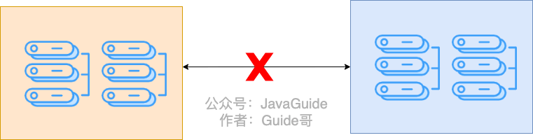


#### CAP定理

CAP 理论（也称为 Brewer 定理）意为，**CAP 指出在发生网络分区（P）的情况下**，必须在**强一致性（C）** 和 **可用性（A）** 之间做出取舍：

- **C（Consistency，强一致性）**：所有节点上的数据在同一时刻完全一致，读到的数据是最新的数据。
- **A（Availability，可用性）**：每个请求都能获得响应，不管响应结果是否是最新的。
- **P（Partition Tolerance，分区容忍性）**：系统能够容忍网络分区，即部分节点之间的网络通信故障。


如果选择CP的话那么可能在协调过程中无法为外部继续提供服务，而是等到一致性恢复再进行服务，如果选择AP的话，即使发生网络分区也会提供服务。

一般的，如果网络分区正常的话（系统在绝大部分时候所处的状态），也就说不需要保证 P 的时候，C 和 A 能够同时保证。所以**如果系统没有发生“分区”的话，我们要思考如何保证 CA 。**


#### 说一下你对于分布式协议中CP协议达成分布式共识的一个理解 ？

分布式系统里说的 CP 协议实现的分布式共识，本质上并不是各个节点相互去同步某个最终值，而是要让所有节点对一串一致的“操作序列”达成共识。换句话说，强一致性并不是通过传播一个“结果”来实现，而是通过传播“对这个数据做了什么操作”来实现的。所有节点只要按**相同的顺序**去执行这些确定性的操作，它们的状态机——比如数据库、KV 存储——就会进入**相同的最终状态**。

这种方式其实就是所谓的**分布式状态机复制**，它的核心思想和单机场景下的逻辑复制很像：不是复制状态，而是复制导致状态变化的指令。这样做的原因很直接，如果采用物理同步，也就是同步内存数据或者整块数据文件，数据量大、成本高，而且遇到写入冲突或者网络分区时根本无法判断哪个状态是正确的，也无法保证顺序一致性。

而只要转成逻辑层面的操作复制，让大家对同一条日志的顺序达成一致，冲突自然被顺序化解决，状态也具备可重放、可恢复的特性。所以我对分布式共识的新理解就是：**共识的对象从来不是数据本身，而是数据的变更过程**。只要操作序列达成一致，最终状态就一定一致，这是 CP 协议实现强一致性的真正原理。


> AP协议相对来说较为灵活，它会灵活地使用分布式状态机复制还是分布式状态复制来达到同步，同样使用解冲突的手段来进行解序列不一致问题。


#### Paxos协议*

Paxos协议这是最早的分布式共识模型，是实现CP模式的重要理论基础，后续的共识模型基本上都是由该算法改进而来。

Basic Paxos 中存在 3 个重要的角色：

1. **提议者（Proposer）**：接受客户端请求并发起提案，提案信息通常包括唯一提案编号 (Proposal ID) 和提议的值 (Value)。
2. **接受者（Acceptor）**：对提议者的提案进行投票，并记录自己的投票历史，确保不会接受冲突的提案。
3. **学习者（Learner）**：一旦超过半数的接受者达成共识，学习者就会获知这一决定，并将结果传达给客户端或用于后续处理。


Basic Paxos 最核心的机制是 **“两阶段提交”**（2-Phase Commit），目的是在可能发生网络分区或节点宕机的情况下，让大家对**同一个值**达成一致。

1. 阶段一：准备阶段 (Prepare Phase) —— 抢占领导权和收集历史
	* **Proposer 行为：** Proposer 生成一个提案编号 $N$（必须严格递增），向所有的 Acceptor 发送 `Prepare(N)` 请求。
	* **Acceptor 行为（回复）：**
	    * 如果 $N$ 小于 Acceptor 已经承诺过的提案编号，则**拒绝**。
	    * 如果 $N$ 是 Acceptor 见过的最大编号，则**承诺 (Promise)**：承诺以后不再接受编号小于 $N$ 的 $\text{Prepare}$ 或 $\text{Accept}$ 请求。
	    * Acceptor 在回复中**必须附带**：它之前接受过的提案中，**编号最大**的那个提案的编号 $N_{acc}$ 和对应的值 $V_{acc}$（如果从未接受过值，则 $V_{acc}$ 为空）。

- 阶段二：接受阶段 (Accept Phase) —— 锁定值或继承值
	* **Proposer 决策：**
	    * 如果 Proposer 收到了**超过半数** Acceptor 的回复（Promise），它将进入第二阶段。
	    * **值选择 (关键一致性规则)：** Proposer 检查所有回复。如果**任何**回复中包含已接受的值 $V_{acc}$，则 Proposer **必须**选用所有回复中**编号最大**的那个 $V_{acc}$ 作为它提议的值。只有当所有回复都没有包含已接受的值时，Proposer 才能使用自己原本想提议的新值 $V_{new}$。
	* **Proposer 行为（发起提案）：** Proposer 向所有 Acceptor 发送真正的提案 `Accept(N, Value)`。
	* **Acceptor 行为（投票）：**
	    * Acceptor 收到后，如果它**没有违背**之前对编号更大提案的承诺（即当前提案 $N$ 仍是它见过的最大或相等的），它就会接受这个值 $V$（持久化），并回复 Proposer。


*   **达成共识**：
    *   当一个值被超过半数（Majority）的 Acceptor 接受，Consensus 就达成了。Learner 感知到后，流程结束。


Paxos 要求提案被超过半数的接受者接受才能达成共识，这保证了系统在少于半数节点故障时仍能正常工作，具备容错性。一个节点可以同时扮演多个角色，比如在实际部署中常见的将 Proposer、Acceptor 和 Learner 集成到同一个节点中，以简化部署和提高效率。

Paxos 可以算得上是分布式协议的鼻祖但是他有三个问题：
- **实现非常困难**， 主要是因为Paxos 原本只是为了针对分布系统对单一值来达的共识，而对于工程学来讲，一个分布式系统达到共识，不单单是单一值，而是一连串操作序列，也就是日式级别来达成共识，所以连谷歌和雅虎的资深工程师表示那利用Basic Paxos 来实现分布系统共识相当困难。
-  **Prepare阶段的活锁问题**， 即两个 Proposer 轮流提高 ID 抢占 Prepare 锁，导致谁也进不了第二阶段。
- **规模越大性能越差**，当使用Paxos来达成分布式共识时节点越多，Paxos 的写性能会下降，延迟会增加。 Proposer 需要和所有的 Acceptor 通信。节点越多，网络中的数据包数量激增，而且还是广播模式，网络拥塞的可能性变大，这是基础原因。而且Basic Paxos 每一条日志（每一个值）的确认都需要走一遍完整的两阶段（Prepare -> Accept），至少需要 2 个 RTT（网络往返），而且延迟更多。而后起之秀的Raft 只需要 1 个 RTT（Leader 直接追加日志），因为 Raft 默认选出了一个稳定的 Leader。


 所以后续Paxos 作者提出了一个更加工程化的版本**Multi-Paxos**， 从本质上来讲是**重复**运行 Basic Paxos 的过程在每一个位置达成对某个值的分布式共识，来进行达到对于日志整体的分布式共识， 解决了实现问题。 同时通过选举一个**稳定 Leader** 并允许 Leader 跳过 $\text{Prepare}$ 阶段（因为它已经抢占了所有槽位的领导权），从而解决了性能和活锁问题。


#### Raft协议

Raft通过将分布式系统中的节点分为Leader、Follower和Candidate三种角色，实现了**分布式共识。** NACOS的CP模式、RocketMQ的Dleader模式和 kafka 的 kraft 都是基于Raft协议。

它使用任期号和心跳机制来选举Leader，并通过Leader将日志复制到所有节点，确保系统中的状态一致。即使部分节点发生故障，系统仍能正常工作，只要大多数节点仍然可用。


在Raft中，每个节点有三种可能的状态：

- **Leader**：负责处理客户端请求、创建日志条目、同步日志到其他节点，**非常重要的一点事实，读写都走 Leader**
- **Follower**：被动接收Leader的消息，投票给Candidate
- **Candidate**：临时角色，在选举过程中出现，尝试成为新Leader

对于日志的同步，以及**Candidate**成功选举成为leader核心就是**任期（Term）** 和**日志索引（index）** 的值。

正常运行流转的话，

1. 每个任期内只有一个Leader，其余节点为Follower
2. Leader定期向所有Follower发送心跳包（AppendEntries RPC），主要两个功能
   - 心跳包可能包含新的日志条目
   - 维持Leader地位，防止新选举触发
3. Follower接收并处理来自Leader的心跳和日志复制请求
4. Leader确保所有Follower最终包含相同的日志序列


**若当 Follower 在一定时间内（选举超时时间，通常是随机的）没有收到 Leader 的心跳，就会启动选举过程，将自己Term +1 并转换为 Candidate。**

- Candidate 会向集群中的其他节点发送 **RequestVote RPC** 请求，要求对方投票。
- 其他所有节点（包括Leader）在收到请求时：
  - 如果请求的 term **比自己当前的 term 旧**，则拒绝投票。
  - 如果请求的 term **比自己当前的 term 新**，则更新自己的 term 并重新刷新自己的等待周期，原来的leader或 Candidate状态也会变为Follower。
  - 至于是否愿意选举主要看**日志完整性**：
    - **如果 Candidate 的日志比自己“新”** 则投票。**如果 Candidate 的日志比自己“旧”**，则拒绝投票。
    - 只能投票给一个Candidate在这个任期中，如果投了别人就无法投其他Candidate。
    - Candidate默认都会投给自己，所以同一个任期的Candidate会拒绝其他的Candidate投票
- 如果 Candidate 获得 **超过半数（Majority）** 的投票，则成为 Leader，并立刻开始发送心跳包。


对于选举超时时间，Follower节点在收到有效的心跳包或为候选人投票后，会重置其选举超时计时器。对于日志同步方面，Raft协议是强Leader一致性，其他节点都会同步Leader的，如果有多余的也会被放弃。

下面几个情况来说明的话，尝试理解一下。


**Q：一共5个节点都上线，原先的Leader下线或者宕机怎么切换新Leader？**

A：至少有一个 Follower 选举超时时间到达，然后将自己Term+1 并转换为 Candidate，要求其他投票给他。

然后其他3个，看到发来的Term更大所以更新自己的Term并且投赞成票，超过半数以上得到了四票，包括自身成为新的Leader。


**Q：一共5个节点都上线，原先的Leader下线，这时候刚好两个 Follower 超时时间相同要求剩余的两个人都向自己投票，但是一个投票了a，一个投票了b两个相互都只得到两票，出现“投票分裂”的时候，如何选出Leader节点？**

A：这两个超时的 Follower **将自己的 Term+1**（假设原先 Leader 处于 Term 3，那么它们都变为 Term 4），然后转换为 Candidate，并分别给自己投票，向集群中的其他 Follower 发送 **RequestVote RPC** 请求，要求对方投票。

剩下的两个 Follower 各自随机投票，一个投给 Candidate A，一个投给 Candidate B，因此：

- Candidate A 获得了 2 票（自己 + 一个 Follower）。
- Candidate B 也获得了 2 票（自己 + 另一个 Follower）。

由于 Raft 需要**超过半数（N/2 + 1）**才能选出 Leader，而 5 个节点的集群需要 **至少 3 票** 才能当选，因此本轮选举失败，产生“投票分裂”。

当选举超时再次到达后，某个Candidate会将Term再次+1（变为Term 5）

- 此时其他节点会看到更高的Term，并且按照Raft协议规则：
  - 如果是Candidate，会立即转为Follower并更新Term
  - 如果是Follower，会更新Term
- 所有节点（除了宕机的）都会考虑给新的Term 5的Candidate投票


**Q：一共5个节点只上线了两个节点，一个 Leader 和一个 Follower，Leader 有三条日志还未提交，Raft 算法的日志复制过程？**

**A：**

1. **日志产生与存储：**
   - Leader 在处理客户端请求时，会将新的日志条目追加到自己的日志中（这三条日志目前处于未提交状态，因为集群中还没有达到过半数节点复制成功）。
2. **日志复制的发起：**
   - Leader 会定期通过 **AppendEntries RPC** 将未提交的日志条目发送给所有的 Follower。
   - 在此场景下，仅有一个 Follower 在线，所以 Leader 仅会向这个 Follower 发送复制请求。
3. **日志一致性检查：**
   - Follower 在收到 AppendEntries 时，会检查其日志与 Leader 提供的上一个日志索引及任期是否匹配。
   - 因为 Follower 当前没有任何日志，所以它会认为 Leader 发送的日志是它日志的延续（上一个日志索引可以看作 0 或初始状态匹配）。
4. **日志追加与响应：**
   - Follower 将 Leader 发来的三条日志追加到自己的空日志中，并回复成功。
   - 但是，由于 Raft 规定日志提交需要获得多数节点（5 个节点中至少 3 个节点）的复制确认，所以即使这两个节点之间复制成功，这三条日志依然处于未提交状态。
5. **日志提交条件：**
   - Leader 只有在确认超过半数（至少 3 个节点）都已经复制了这些日志后，才会将这些日志标记为“提交”状态。
   - 当前仅有 Leader 和一个 Follower在线，因此无法提交日志。日志将一直处于未提交状态，直到有更多节点上线并复制了这些日志。


**Q：只有半数节点同意之后日志才会提交，这时候又启动了一个 Follower，日志同步过程是什么？**

**A：**

1. **新 Follower 加入：**
   - 在原有的日志复制过程中，由于已有多数节点（假设已有 3 个节点在线）同意了日志后，日志被标记为提交。
   - 此时又启动了一个新的 Follower，该节点的日志为空或与 Leader 日志不一致。
2. **Leader 检测到不匹配：**
   - Leader 在后续的定期心跳/AppendEntries 过程中，会检测到新加入 Follower 的 `nextIndex`（下一条待复制的日志索引）与自己日志不一致。
3. **日志回退与重发：**
   - 根据 Raft 算法，Leader 会调整该新 Follower 的 `nextIndex`（通常从最新日志的索引开始向后探测），直到找到一个与新 Follower 日志匹配的共同前缀。
   - 在找到共同前缀后，Leader 将从该位置开始的所有日志条目（包括已经提交的日志）发送给新 Follower。
   -  如果 flow 节点他返回的索引与自己的差距实在过大时，就会触发全量**同步**，把快照发给他，这与 Redis 的全量同步非常相似。 
4. **日志追加与提交：**
   - 新 Follower 接收到这些日志条目后，依次追加到自己的日志中。
   - Leader 在 AppendEntries RPC 中会携带当前的 **commitIndex**（提交日志的索引），新 Follower 在追加日志的同时会更新自己的提交索引，确保所有已提交的日志尽快被同步。
5. **同步完成：**
   - 最终，新 Follower 完全与 Leader 同步，拥有 Leader 上的所有日志（包括已提交日志），从而与集群中其他节点保持一致。


**Q：如何修复不一致的日志？上面说的Leader写入了两条新的日志突然宕机了，随后选出新的Leader，然后旧的恢复了，应该怎么处理那两条没有同步的日志？**

A：Raft协议是强Leader一致性，其他节点都会同步Leader的，如果有多余的也会被放弃。抛弃旧的Leader 的没有同步的日志。**未提交的日志是可以被覆盖的，但已提交的日志绝对不会丢失。**


**Q：最后第5个节点（一条日志都没有）启动了，而且新的Leader宕机了，没有任何日志的节点成为了Candidate要求其他节点给他投票，会投票吗？**

A：不会，因为如果 term **相同**，则比较 **日志完整性**：

- **如果 Candidate 的日志比自己“新”**（即 term 更大，或者 term 相同但 index 更大），则投票。
- **如果 Candidate 的日志比自己“旧”**，则拒绝投票。

所以通过这种，保证了数据的安全性。


#### 什么是脑裂? Paxos和Raft是怎么防止脑裂的？其他的一些AP协议需要防止脑裂吗？

“脑裂”是分布式系统中最严重的问题之一。它发生在**网络分区**时，每个分区都选出了自己的leader或者接收了客户端的请求来进行写入，当网络进行恢复时不同分歧的数据就会发生**冲突和不一致**，系统就进入了一个无法解决的“精神分裂”状态，即“脑裂”。

Paxos和Raft都采用 **“半数以上同意才行动”的机制** 来防止“脑裂”，这也是最根本、最有效的手段。以Raft举例**只有**拥有多数节点（$N/2 + 1$）的那个分区才能成功选出 Leader，并继续提供服务。少数节点的分区（$N/2$ 或更少）因为无法凑齐法定人数，会**主动停止服务**，进入只读状态（牺牲可用性 A）。

> 对Paxos而言即Learner 感知到半数（Majority）的 Acceptor 接受才执行Proposer提议的相应操作。

AP 协议的首要目标是：**在任何情况下，只要客户端能连接到节点，这个节点就必须提供服务。** ** 因此在网络分区（脑裂）发生时，它会接受数据不一致的风险，通过在网络分区恢复之后解决冲突的方式来解决网络分区（脑裂）。常见方式如下：
1.  **时间优先**，记录每一次数据最后写入的时间戳。对于冲突问题，以最后写入为优先。
2. **版本向量 (Vector Clocks)**：用来跟踪数据被修改的历史和版本，帮助系统在网络恢复后智能地合并不同分支的修改。
3. **CRDTs (Conflict-free Replicated Data Types，无冲突复制数据类型)**：这是一种高级数据结构。它的数学特性保证了对数据的修改操作在任何节点上执行，无论它们的**顺序如何颠倒**，最终的结果都是一样的。CRDTs 将冲突解决的逻辑内置到了数据结构本身的设计中，使数据在网络恢复后能够**自动、无冲突地合并**。


#### BASE定理

**BASE** 是 **Basically Available（基本可用）** 、**Soft-state（软状态）** 和 **Eventually Consistent（最终一致性）** 三个短语的缩写 ，**是对 CAP 中 AP 方案的一个补充，对C的妥协和争取**，目前流行的AP协议都遵从BASE定理。


基本可用是指分布式系统在出现不可预知故障的时候，允许损失部分可用性，可用性是指两方面的损失。

- **响应时间上的损失**: 正常情况下，处理用户请求需要 0.5s 返回结果，但是由于系统出现故障，处理用户请求的时间变为 3 s。
- **系统功能上的损失**：正常情况下，用户可以使用系统的全部功能，但是由于系统访问量突然剧增，系统的部分非核心功能无法使用。


软状态指允许系统中的数据存在中间状态（**CAP 理论中的数据不一致**），并认为该中间状态的存在不会影响系统的整体可用性，即允许系统在不同节点的数据副本之间进行数据同步的过程存在延时。


最终一致性强调的是系统中所有的数据副本，在经过一段时间的同步后，最终能够达到一个一致的状态。因此，最终一致性的本质是需要系统保证最终数据能够达到一致，而不需要实时保证系统数据的强一致性。


#### 一致性的级别有哪些？*

1. **强一致性（Linearizability/Strict Consistency）** 数据更新后实时全局一致，客户端任何时间查询任意节点，均获最新数据（对外等价于单机数据访问），CP 协议核心目标（如 Raft、ZooKeeper），需牺牲部分可用性（网络分区时无法写）。

2. **顺序一致性（Sequential Consistency）** 所有节点按「全局统一顺序」执行操作，虽不要求实时一致，但操作顺序对所有客户端可见相同（如 A 写→B 写，所有节点均按 A→B 顺序执行），一致性弱于强一致，可用性高于强一致（部分分布式数据库支持）。

3. **因果一致性（Causal Consistency）** 仅保证「有因果关系的操作」顺序一致（如 A 写后通知 B，B 的读需看到 A 的写结果），无因果关系的操作可乱序（如 A、B 无关联写，节点可按任意顺序同步），一致性弱于顺序一致，可用性进一步提升（如分布式存储 MongoDB）。**AP 协议如果要提高一致性，推荐到这就为止了。**

4. **最终一致性（Eventually Consistency）** 数据更新后，无新写操作时，可在「预期有限时间内」所有节点达成一致，BASE 定理核心，AP 协议主流选择（如 Redis Cluster、Nacos），平衡可用性与一致性。

5. **弱一致性（Weak Consistency）** 仅保证数据最终会一致，无任何时间承诺（可能几小时甚至更久），可用性最高，一致性最弱，适用于非核心数据（如社交动态点赞数、统计数据同步）。 **理论上的AP就是弱一致性。** 


#### Gossip 协议

Gossip协议是一种**去中心化、最终一致性**的分布式通信协议，基于AP模式，其核心思想是模仿流行病传播（随机选择节点扩散信息），通过节点间**周期性随机通信**逐步同步数据。它适用于大规模、动态变化的分布式系统（如Redis Cluster等）。


Gossip协议的**信息传播方式**为，每个节点周期性地（如每秒）从已知节点列表中**随机选择若干节点**（通常为3-5个），将本地存储的元数据（如节点状态、数据版本）发送给对方，一般有三种模式

- **Push模式**：发送方主动推送全部数据给接收方。
- **Pull模式**：节点向选中的其他节点请求并拉取它们的数据。
- **Push-Pull混合模式**（常用）：发送方仅发送元数据摘要，接收方对比后拉取差异数据

接收方在收到数据后以推模式为例的**数据合并规则**，接收方将收到的数据与本地数据对比，保留**版本号更高或时间戳更新**的数据（通过向量时钟或版本号解决冲突）。


**最终**，信息通过多轮随机传播覆盖整个集群，即使部分节点宕机或网络分区，只要存在连通路径，数据最终会同步到所有存活节点。

![[Pasted image 20251128120901.png]]


#### Redis Cluster中的Gossip协议实现

Redis Cluster实现了基于Gossip协议的集群通信机制，每个节点维护集群中其他节点的状态（在线、疑似下线、已下线），通过PING/PONG消息实现Gossip通信。

- PING包含发送方哈希槽分配位图以及自身的元数据（比如说纪元这种类似于“任期”的东西IP和端口号） 以及它所知道的其他节点（随机几个）的哈希草分配位图以及这些节点自身的元数据，同时也请求被ping的 Redis Cluster 主节点发送PONG消息，回应给他。 
- PONG包含接收方的这哈希槽分配以及其视角的集群状态（也就是包括他 接收的相关的哈希草相关信息）。

**PING/PONG 消息互为表里，同时也承担了心跳功能，这就是Redis中的Gossip协议和标准的Gossip协议最大的区别。**

节点定期随机选择集群中的其他节点发送PING消息，实现集群状态的逐步同步。此外Redis Cluster将数据划分为16384个槽，Gossip消息中携带槽分配信息，确保客户端能正确路由请求。


当新切片主节点加入时，通过Gossip消息广播自身信息，如果预设的是平均分配，触发集群重新分配槽和数据迁移，迁移过程中的槽状态变更通过Gossip协议同步到所有节点。


若某个主节点，未及时响应PING，其他节点会将其标记为PFAIL（疑似下线）。当超过半数主节点都标记某节点为PFAIL时，状态升级为FAIL（确认下线），然后的话就可以开启故障转移。

Redis切片集群的故障转移使用半数投票机制，来进行选主。

- **选举触发**：从节点感知到其主节点FAIL状态后开始选举过程
- **选举延迟**：从节点基于复制偏移量计算延迟时间，复制进度越新的节点等待时间越短
- **选举请求**：从节点向集群中的切片主节点发送投票消息，要求把票投给他。
- **投票机制**：主节点对每个配置纪元(epoch，类似于任期)只投一票，通过FAILOVER_AUTH_ACK响应
- **多数原则**：从节点需获得大多数(N/2+1)主节点投票才能当选
- **状态提升**：当选从节点提升为主节点，并通过PONG消息更新集群状态

所以Redis切片集群可以不需要配置哨兵节点就可以自动完成，故障转移。


#### NWR 模型 (Quorum 机制)  有什么可以讲一下吗？* 

NWR 模型是 Amazon Dynamo 论文提出的一种去中心化、**可调节一致性**的数据复制策略。它不依赖单一协议，而是通过调整参数配置，让系统在 **AP（高可用）** 和 **CP（强一致）** 之间灵活切换。它是 Cassandra 等主流 AP 数据库的核心机制。

核心设计思想是通过调节读写副本数，来权衡可用性与一致性。

**三个核心参数：**

1.  **$N$ (Replicas)**：数据的**总副本数**。
2.  **$W$ (Write Quorum)**：写入操作需要获得的**最小确认数**。
3.  **$R$ (Read Quorum)**：读取操作需要咨询的**最小节点数**。

##### 1. 一致性公式

系统的一致性保证取决于 $W$ 和 $R$ 的关系。

* **强一致性 (Strict Consistency)：** 当 $W + R > N$ 时。
    * **保证：** 读写副本集**必然存在交集**（即 $\text{Intersection}(\text{Write Quorum}, \text{Read Quorum}) \neq \emptyset$）。这保证了读到的 $R$ 个副本中**至少有一个**包含最新的 $W$ 写入的数据（基于**鸽巢原理**），从而实现线性一致性（Linearizability）。
* **最终一致性/AP 模式 (Eventual Consistency)：** 当 $W + R \leq N$ 时。
    * **权衡：** 读写副本集可能无交集，可能读到旧数据，但以此换取极高的写入和读取**可用性**及低延迟。

##### 2. 具体执行机制（AP 模式为例）

在 AP 模式下（通常配置 $W=1$ 或 $R=1$ 以追求极致性能）：

**对写操作来说：**

* **协调节点转发：** 客户端请求发送到任意节点（协调者），协调者根据哈希算法将请求转发给 $N$ 个拥有该数据副本的节点。
* **快速响应：** 只要收到 $W$ 个节点的成功响应，协调者立即向客户端返回成功。
* **异步写入（高可用保证）：** 剩余的 $(N-W)$ 个节点可能因为网络延迟或宕机未写入，系统会通过 **Hinted Handoff（提示移交）** 机制，将数据暂时写入临时节点，待目标节点恢复后回传，保证高可用。

>标准的 NWR 保证强一致性是指 Strict Quorum， 不会有任何的临时节点。但在实际工程（如 Cassandra）中，为了高可用，通常会开启 **Hinted Handoff**。当首选节点不可用时，写入临时节点。这虽然保证了写入成功（可用性），但在临时数据回传之前，可能会出现数据不一致，这是一种从 CP 向 AP 的妥协。”

**对读操作来说：**

* **并行读取：** 协调者向 $N$ 个副本节点发起读取请求，等待收到 $R$ 个响应。
* **读修复 (Read Repair)：** 协调者对比这 $R$ 个响应的数据版本（通过向量时钟或时间戳）：
    * 返回**最新版本**给客户端（后者胜出 LWW）。
    * 后台**异步修复**那些返回了旧数据的节点，使其达到一致。

##### 3. 冲突解决

由于 AP 模式下允许多点并发写入，可能会产生版本冲突。NWR 模型通常采用 **Vector Clock（向量时钟）** 来保留因果关系，或者简单粗暴地使用 **Last Write Wins（最后写入者胜出，LWW）** 策略来自动合并数据。


#### Distro协议（不是很重要）

Distro协议是Nacos为实现AP模式（高可用性+分区容忍性）设计的私有协议，其核心设计思想是**去中心化、最终一致性**，通过节点间的数据分片和异步扩散机制保证系统的高可用性。以下是其工作原理的关键点：


在Distro协议下，所有节点是平等的（无Leader/Follower角色），每个节点独立承担**部分数据**的写责任，同时会通过心跳包同步双方的数据，所有节点会返回他自己的读视图（软状态，可能是不一致的）。


具体而言，对写操作来说，

1. **本地写入**：客户端向任意节点发起写请求：
   - 若该节点是数据责任节点，直接写入本地存储。
   - 若非责任节点，返回重定向到责任节点地址。
2. **异步扩散**：责任节点写入成功后，**异步**将数据变更广播给其他所有节点（不等待确认，中间状态为软状态）。
3. **最终一致性**：其他节点收到扩散数据后更新本地存储，因异步可能存在短暂不一致，但最终会同步。


对读操作来说，

- **本地读取**：客户端向任意节点发起读请求，节点直接返回本地存储的数据（不保证强一致）。
- **快速响应**：牺牲强一致性换取高可用，即使部分节点宕机，其他节点仍可响应请求。


Distro协议属于AP模式一般数据同步模式为合并模式，基于时间戳/版本号的"后者胜出"。

此外，Distro协议也有健康检查与数据恢复，检查指的是节点间定期互发心跳检测存活状态。

**故障检测**：若节点A检测到节点B宕机：

- 若某节点（如节点 A）检测到另一节点（如节点 B）宕机，则节点 A 会接管原本由节点 B 负责的数据分片，承担相应的写责任。
- 当故障节点 B 恢复后，会从其他节点拉取缺失数据，重新同步并恢复原有的数据责任。


#### Zookeeper实现分布式锁

ZooKeeper 分布式锁是基于 **临时顺序节点** 和 **Watcher（事件监听器）** 实现的。

获取锁：

1. 首先我们要有一个持久节点`/locks`，客户端获取锁就是在`locks`下创建临时顺序节点。
2. 假设客户端 1 创建了`/locks/lock1`节点，创建成功之后，会判断 `lock1`是否是 `/locks` 下最小的子节点。
3. 如果 `lock1`是最小的子节点，则获取锁成功。否则，获取锁失败。
4. 如果获取锁失败，则说明有其他的客户端已经成功获取锁。客户端 1 并不会不停地循环去尝试加锁，而是在前一个节点比如`/locks/lock0`上注册一个事件监听器。这个监听器的作用是当前一个节点释放锁之后通知客户端 1（避免无效自旋检查是否是最小的），这样客户端 1 就加锁成功了。

释放锁：

1. 成功获取锁的客户端在执行完业务流程之后，会将对应的子节点删除。
2. 成功获取锁的客户端在出现故障之后，对应的子节点由于是临时顺序节点，也会被自动删除，避免了锁无法被释放。
3. 所以 **Watcher（事件监听器）** 其实监听的就是这个子节点删除事件，子节点删除就意味着锁被释放。


#### ZK 实现分布式锁和 Redis 实现分布式锁有什么区别？

**Redis 分布式锁**

优点是性能高，适合高并发场景。但有几个可靠性问题：

- 主从异步复制可能丢锁：客户端在 master 上加锁成功，master 还没来得及同步给 slave 就挂了，slave 升为新 master 后锁就丢了
- 需要处理锁续期：业务执行时间超过锁过期时间会导致锁失效，所以 Redisson 搞了个"看门狗"机制自动续期，增加了复杂度
- RedLock 方案争议大：Redis 作者提出的 RedLock 想解决可靠性问题，但被分布式系统专家 Martin Kleppmann 质疑，业界对其正确性仍有争论

**ZK 分布式锁**

基于临时顺序节点实现，可靠性更高：

- 天然避免死锁：客户端断开连接后，临时节点自动删除，锁自动释放，不需要设置过期时间，也不需要所谓的看门狗续期机制
- 强一致性保证：ZK 的 ZAB 协议保证了写操作过半节点确认才返回成功，不存在 Redis 那种主从同步丢数据的问题
- 公平锁实现简单：顺序节点天然有序，每个客户端只 watch 前一个节点，避免惊群效应

缺点是性能相对较差，每次加锁释放锁都要走 ZK 集群的共识协议，QPS 上不去。


##### Q：ZK 集群的共识协议ZAB协议了解吗？说一下它和 Paxos 协议、Raft 协议的区别？

ZAB（Zookeeper Atomic Broadcast）是专门为 ZK 设计的原子广播协议，核心流程分两个阶段：

- **崩溃恢复**：Leader 挂了之后，集群进入选举阶段，选出新 Leader，新 Leader 会和 Follower 同步数据，确保所有节点状态一致后才对外提供服务
- **消息广播**：正常工作时，所有写请求都由 Leader 处理，Leader 将写操作封装成 Proposal 广播给 Follower，超过半数 ACK 后 Leader 发送 Commit，事务才算提交成功

**和 Paxos 的区别**

- Paxos 是通用的共识算法，理论性强但工程实现复杂，每个提案都要经过 Prepare 和 Accept 两阶段。ZAB 简化了这个过程，正常情况下 Leader 稳定时只需要一阶段广播，不用每次都跑完整 Paxos 流程（即减少了一阶段的预提议Prepare）
- ZAB 强调全局有序，所有事务按 ZXID 严格有序执行；Paxos 本身不保证多个提案之间的顺序

**和 Raft 的区别**

两者其实很像，都是 Leader-Based，都是日志复制模型，都要求过半节点确认。
- 主要区别在于设计出发点：Raft 是为了"易于理解"而设计的，论文把选举、日志复制、安全性拆得很清楚；ZAB 是专门为 ZK 这种状态机场景设计的，和 ZK 的数据模型耦合更紧
- 选举机制略有不同：Raft 用随机超时来错开选举；ZAB 选举时会比较 ZXID 和 myid，优先选数据最新的节点