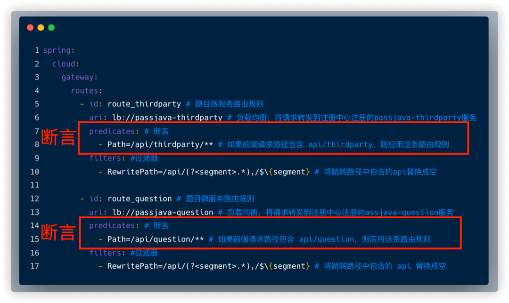
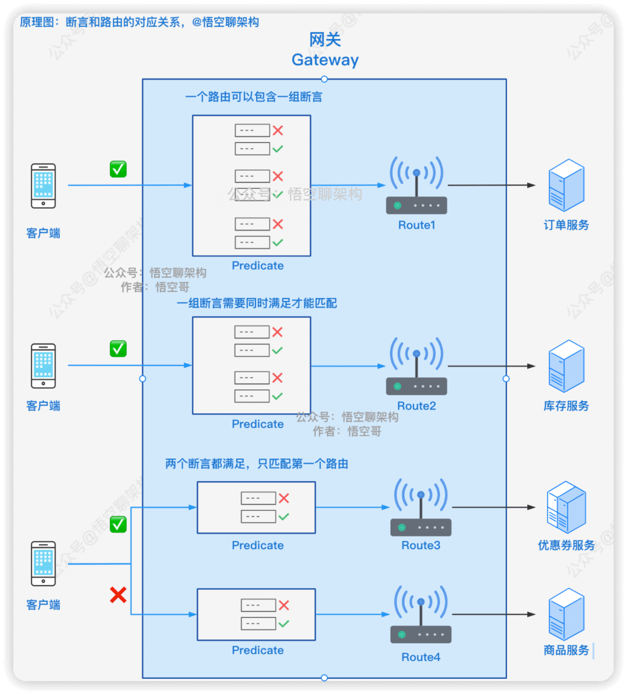
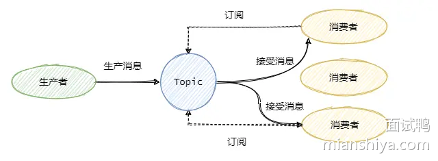
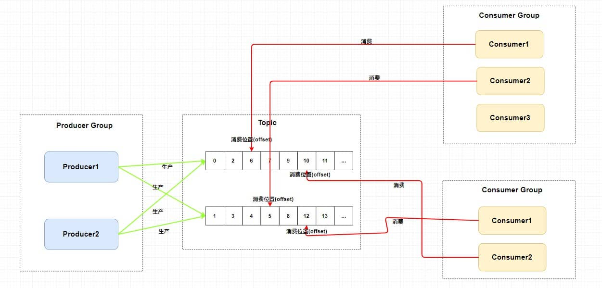
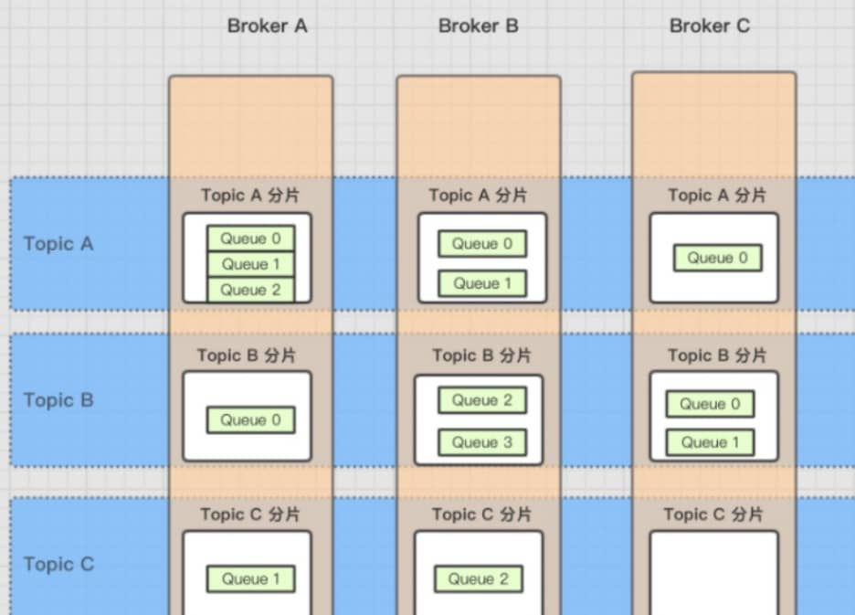
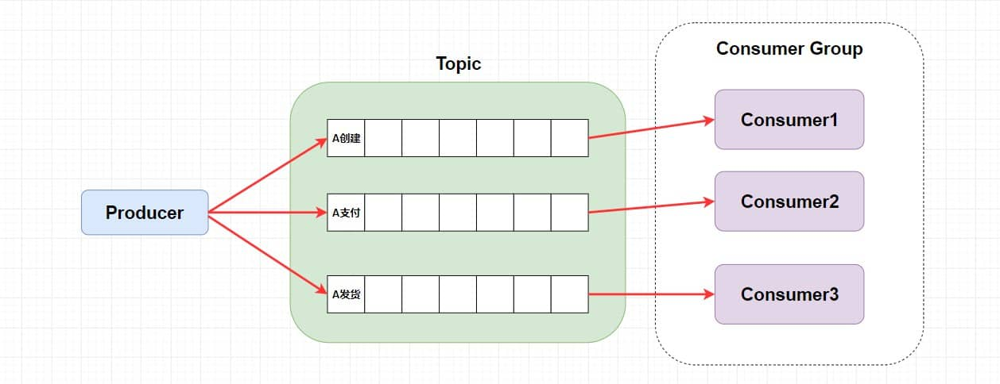
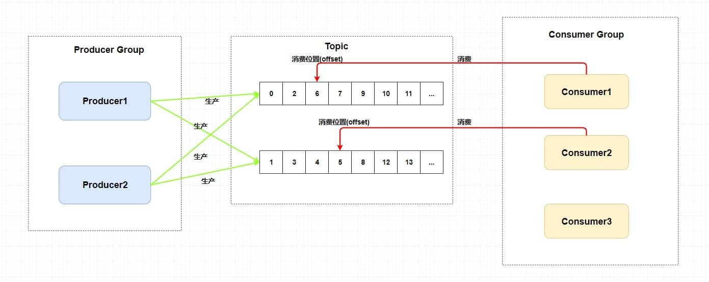
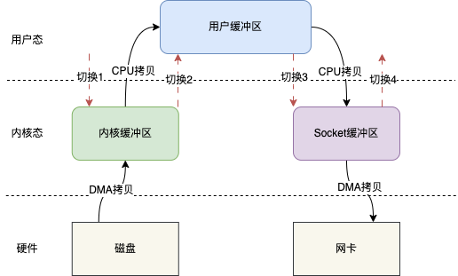
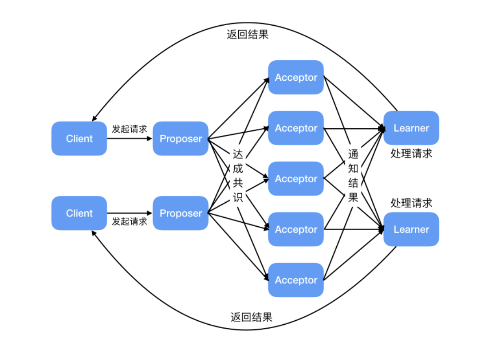

# 微服务和场景和系统设计面试题

### SpringCloud

#### 分布式和微服务有什么区别?

分布式系统和微服务架构是两个相关但不同的概念，它们的注重点其实不太一样。

**分布式系统：**主要解决系统的可用性、可扩展性问题

一般分布式系统是由多台计算机或多节点组成的系统，各节点之间通过网络进行通信和协作，共同完成一个或多个共享的任务。也就是说分布式的各个节点其实目标是一致的，之所以要分布式只是为了有更好的能力，能更快、更高效地承接任务。比如常见的分布式文件系统、分布式数据库。

**微服务架构：**是一种开发思路，目的是解耦合。

微服务，其实是一种软件系统的架构风格，它主要是为了把一个大而全的服务，拆分成多个可以独立、松耦合的服务单元，同时可以使的让这些服务单元可以独立部署、运行、管理。比如电商服务拆分成微服务，可以分为商品服务、用户服务、订单服务、库存服务等等。


**微服务通常都是分布式的，因为服务需要部署在不同节点上，但分布式系统不一定是微服务，它可能是一个大型单体应用的分布式部署。**


#### 你是怎么理解微服务的?

微服务是一种软件系统的架构风格，是一种开发思路。主要是为了把一个整体的“大”服务，拆分成多个可以独立、松耦合的“小”服务单元。每个服务负责自己单一的职责，解耦代码，使得开发部署维护更加灵活。但是使用微服务会造成服务间调用的网络开销，增加系统维护成本。


#### 了解SpringCloud吗，说一下他和SpringBoot的区别

Spring Boot是一个简化Spring应用程序的开发框架，主要用来减少程序的配置和开发复杂性。而Spring Cloud则是用于构建分布式系统中的微服务架构的工具，Spring Cloud提供了服务注册与发现、负载均衡、断路器、网关等功能。

两者可以结合使用，通过Spring Boot构建单个微服务应用（“小”服务单元），然后用Spring Cloud来实现微服务架构将spring boot构建的若干单体微服务应用通过一系列机制结合起来，对外呈现出一个整体应用。

所以Spring Cloud是基于Spring Boot的，因此在使用Spring Cloud 构建微服务时必须先使用Spring Boot来开发基础的应用。


#### 用过哪些微服务组件？

微服务架构是一种软件设计模式，它将一个大型应用程序拆分成多个**独立、松耦合**的小型服务。每个服务都专注于特定的业务功能，可以独立开发、部署和扩展。

与传统单体架构的所有功能集中在一个应用中对比微服务架构将将应用拆分为多个小服务其中，每个小服务（微服务）都是自治的，具备独立的数据库和独立的业务逻辑，它们通过 API 或消息队列进行通信和协作。


##### **1. 服务治理组件**

这一部分主要包括

- **注册中心**：注册中心是微服务架构最核心的组件。它起到的作用是对新节点的注册与状态维护，**解决了「如何发现新节点以及检查各节点的运行状态的问题」**。微服务节点在启动时会将自己的服务名称、IP、端口等信息在注册中心登记，注册中心会定时检查该节点的运行状态。注册中心通常会采用心跳机制最大程度保证已登记过的服务节点都是可用的。
- **负载均衡**：负载均衡**解决了「如何发现服务及负载均衡如何实现的问题」**，通常微服务在互相调用时，并不是直接通过IP、端口进行访问调用。而是先通过服务名在注册中心查询该服务拥有哪些节点，注册中心将该服务可用节点列表返回给服务调用者，这个过程叫服务发现，因服务高可用的要求，服务调用者会接收到多个节点，必须要从中进行选择。因此服务调用者一端必须内置负载均衡器，通过负载均衡策略选择合适的节点发起实质性的通信请求。
- **服务通信**：服务通信组件解决了「**服务间如何进行消息通信的问题**」，服务间通信采用轻量级协议，通常是HTTP RESTful风格。但因为RESTful风格过于灵活，必须加以约束，通常应用时对其封装。例如在SpringCloud中就提供了Feign和RestTemplate两种技术屏蔽底层的实现细节，所有开发者都是基于封装后统一的SDK进行开发，有利于团队间的相互合作。
- **API网关**：网关解决了「**如何统一处理客户端请求、进行路由转发、鉴权、限流、请求过滤等公共逻辑**」它充当客户端与后端服务之间的中介，所有的客户端请求都会首先通过网关进行转发。通过API网关，系统能够集中管理所有外部请求，简化服务端逻辑，并提高系统的安全性和可扩展性。

| **组件**     | **核心作用**                                                 | **常见实现**                       |
| ------------ | ------------------------------------------------------------ | ---------------------------------- |
| **注册中心** | 服务节点的动态注册与状态维护，解决服务发现与健康检查问题。   | Nacos、Eureka、Consul、Zookeeper   |
| **负载均衡** | 在服务调用时，从多个可用节点中选择合适的节点，保障请求的均衡分配。 | Ribbon（客户端）、Nginx（服务端）  |
| **服务通信** | 定义服务间通信协议与接口规范，屏蔽底层实现细节。             | OpenFeign（RESTful）、Dubbo（RPC） |
| **API网关**  | 统一入口，处理路由转发、鉴权、限流、请求过滤等公共逻辑。     | Spring Cloud Gateway、Zuul         |


##### **2. 配置与监控组件**

- **配置中心**：配置中心主要解决了「**如何集中管理各节点配置文件的问题**」，在微服务架构下，所有的微服务节点都包含自己的各种配置文件，如jdbc配置、自定义配置、环境配置、运行参数配置等。要知道有的微服务可能可能有几十个节点，如果将这些配置文件分散存储在节点上，发生配置更改就需要逐个节点调整，将给运维人员带来巨大的压力。配置中心便由此而生，通过部署配置中心服务器，将各节点配置文件从服务中剥离，集中转存到配置中心。一般配置中心都有UI界面，方便实现大规模集群配置调整。
- **集中式日志管理**：集中式日志主要是解决了「**如何收集各节点日志并统一管理的问题**」。微服务架构默认将应用日志分别保存在部署节点上，当需要对日志数据和操作数据进行数据分析和数据统计时，必须收集所有节点的日志数据。那么怎么高效收集所有节点的日志数据呢？业内常见的方案有ELK、EFK。通过搭建独立的日志收集系统，定时抓取各节点增量日志形成有效的统计报表，为统计和分析提供数据支撑。
- **分布式链路追踪：**分布式链路追踪解决了「**如何直观的了解各节点间的调用链路的问题**」。系统中一个复杂的业务流程，可能会出现连续调用多个微服务，我们需要了解完整的业务逻辑涉及的每个微服务的运行状态，通过可视化链路图展现，可以帮助开发人员快速分析系统瓶颈及出错的服务。


| **组件**           | **核心作用**                                           | **常见实现**                                         |
| ------------------ | ------------------------------------------------------ | ---------------------------------------------------- |
| **配置中心**       | 集中管理所有微服务的配置文件，支持动态更新与版本控制。 | Nacos Config、Spring Cloud Config                    |
| **集中式日志管理** | 收集各节点日志，提供统一的存储、查询与分析能力。       | ELK（Elasticsearch+Logstash+Kibana）、阿里云日志服务 |
| **分布式链路追踪** | 追踪跨服务的调用链路，定位性能瓶颈与故障点。           | Sleuth + Zipkin、SkyWalking                          |


##### **3. 容错与保护组件**

这一部分主要包括服务保护组件。

- **服务保护**：服务保护主要是解决了「**如何对系统进行链路保护，避免服务雪崩的问题**」。在业务运行时，微服务间互相调用支撑，如果某个微服务出现高延迟导致线程池满载，或是业务处理失败。这里就需要引入服务保护组件来实现高延迟服务的快速降级，避免系统崩溃。

| **组件**           | **核心作用**                         | **常见实现**           |
| ------------------ | ------------------------------------ | ---------------------- |
| **服务熔断与降级** | 在服务异常时快速失败，防止雪崩效应。 | Sentinel、Hystrix      |
| **限流与流量控制** | 控制请求流量，避免系统过载。         | Sentinel、Resilience4j |


##### **4. 其他关键组件**

- **消息队列**是微服务架构中的一个重要组件，主要用于**异步解耦服务间依赖**，支持**削峰填谷**和**事件驱动**的消息传递。通过消息队列，微服务之间可以实现非阻塞的异步通信，从而提高系统的并发性能和解耦性。消息队列能够缓解系统高并发请求时的压力，实现请求的平滑处理，并且通过消息的持久化，保障数据的可靠传递。
- 分布式事务是微服务架构中解决**跨服务的业务操作一致性**问题的关键组件。由于微服务之间通常会存在跨数据库和跨应用的操作，传统的单体事务无法保证分布式环境中的一致性，因此需要通过分布式事务来保障多个服务或数据库之间的一致性、原子性和可靠性。

| **组件**       | **核心作用**                                 | **常见实现**              |
| -------------- | -------------------------------------------- | ------------------------- |
| **消息队列**   | 异步解耦服务间依赖，支持削峰填谷、事件驱动。 | RabbitMQ、Kafka、RocketMQ |
| **分布式事务** | 保障跨服务的业务操作一致性。                 | Seata、RocketMQ事务消息   |


#### **现有的Spring Cloud Alibaba 微服务一体式方案请讲一讲**

Spring Cloud Alibaba 是阿里开源的微服务全家桶，与 Spring Cloud 生态深度集成，提供 **企业级微服务解决方案**，这里只挑项目中用到的讲。


| **功能模块** | **Spring Cloud Alibaba 方案**               | **说明**                                                     |
| ------------ | ------------------------------------------- | ------------------------------------------------------------ |
| **注册中心** | **Nacos**（支持服务发现与配置中心）         | Nacos 同时支持服务注册与配置管理，AP/CP 模式可切换，社区活跃度高。 |
| **服务通信** | **Dubbo**（RPC）或 **OpenFeign**（REST）    | Dubbo 提供高性能 RPC 调用，适合内部服务通信；Feign 适合对外暴露 RESTful 接口。 |
| **API网关**  | **Spring Cloud Gateway**                    | 性能更高，支持异步非阻塞模型，与 Spring 生态深度集成。       |
| **负载均衡** | **Ribbon**（客户端负载均衡，Gateway已集成） | 与 Spring Cloud 原生方案一致，支持与 Nacos 集成，动态获取服务节点列表。 |
| **配置中心** | **Nacos Config**                            | 无需额外部署 Config Server，配置变更实时推送，支持多环境隔离。 |
| **服务保护** | **Sentinel**                                | Sentinel 支持流量控制、熔断降级、系统负载保护，提供可视化控制台，规则配置更灵活。 |
| **消息队列** | **RocketMQ**                                | RocketMQ 支持高吞吐、顺序消息、事务消息，适合金融级场景。    |


**Q：是不是网关也能进行负载均衡？**

A：网关作为微服务架构的入口，通常会将请求路由到后端的多个服务实例，并在路由过程中实现负载均衡。且Spring Cloud Gateway 默认集成了 **Ribbon** 作为客户端负载均衡器，所以支持。

负载均衡有两种实现方式

- **客户端负载均衡**：即网关从注册中心获取服务实例列表，并在本地进行负载均衡（如 Ribbon）。
  - **优点**：减少服务端的压力，负载均衡逻辑在网关本地完成。
  - **缺点**：网关需要维护服务实例列表，可能增加网关的复杂性。
- **服务端负载均衡**：即网关将请求转发到一个负载均衡器（如 Nginx），由负载均衡器负责选择服务实例。
  - **优点**：网关逻辑简单，负载均衡器可以集中管理。
  - **缺点**：需要额外部署负载均衡器，增加了系统的复杂性。


#### 为什么需要服务注册发现?

在微服务架构中，服务注册与发现的核心价值在于解决分布式系统的动态管理难题。当服务数量庞大、部署频繁且规模弹性变化时，依赖人工维护服务关系几乎不可行。注册中心通过统一管理服务节点的注册（如服务名、IP、端口）和状态监控（如心跳检测），实现了服务关系的自动化维护，确保消费者能实时感知可用节点。

注册中心通过事件驱动机制（如服务上线/下线主动通知注册中心）实现动态扩缩容。例如高峰期扩容时，新节点自动注册并通知消费者，无需人工干预；低峰期缩容时，异常节点会被心跳检测剔除并同步给消费者（网关或代理服务器等）。这种机制大幅降低了运维成本，同时支持灵活的资源调度。

除了基础的服务注册与发现，注册中心还提供以下能力：

1. **负载均衡**：消费者可基于注册中心返回的多个节点实现流量分发（如轮询、权重）；
2. **服务治理**：结合熔断、降级策略提升系统容错性；
3. **配置管理**：部分注册中心（如项目用的Nacos）支持动态配置推送；
4. **健康监控**：通过心跳机制保证服务可用性，异常节点自动隔离。


所以说注册中心是微服务架构的"中枢神经系统"，这个问题按"问题→解决方案→价值"的逻辑链记忆。


#### **Nacos**配置中心中的AP/CP 模式是什么玩意儿？

**AP**（Availability）模式和 **CP**（Consistency）模式，应对分布式系统中的一致性与可用性之间的权衡问题。这两个模式来自于 **CAP 理论**（Consistency、Availability、Partition Tolerance）。

CAP 理论（也称为 Brewer 定理）意为，**在分布式系统中，不可能同时满足以下三点**：

- **C（Consistency，强一致性）**：所有节点上的数据在同一时刻完全一致，读到的数据是最新的数据。
- **A（Availability，可用性）**：每个请求都能获得响应，不管响应结果是否是最新的。
- **P（Partition Tolerance，分区容忍性）**：系统能够容忍网络分区，即部分节点之间的网络通信故障。

**CAP 理论的结论**：

- 在发生网络分区（P）的情况下，必须在**强一致性（C）** 和 **可用性（A）** 之间做出取舍。

**AP**（Availability）模式，Nacos 主要保证 **高可用性和分区容忍性**，在网络波动或者故障时，系统会尽量保证配置能够继续提供服务节点读取操作。即使无法同步最新的配置数据，客户端也能读取到可用的配置（可能是旧的配置）。但多个节点可能并没有同步最新的配置数据

在 **CP **（Consistency）模式 下，Nacos 主要保证 **一致性和分区容忍性**，即所有nacos服务节点的配置会被严格同步，所有读取到的配置都是一致的。这意味着即使在网络分区时，系统也会暂停对配置的修改和读取，直到一致性恢复。


**Q：那注册中心呢？**

A：不管是注册中心还是配置中心，**CP/AP模式**指的是Nacos集群各个节点内部的服务实例列表和各个配置的**一致性策略**。**CP模式**更加强调集群内部各个节点数据一致性，对外表现为完全统一的整体，没有任何差别，因此需要损失一定的性能，在进行同步期间可能会无法服务。而**AP模式**更多强调尽量为外部提供服务，将一致性作为牺牲，保证系统的高可用性。


#### 什么是配置中心?有哪些常见的配置中心?

配置中心是一个用于配置集中化管理且支持动态更新、分发配置文件的工具（服务）。它实现了配置的统一管理和动态刷新，当配置信息发生变更时，配置中心可以自动通知服务实例进行配置更新，这样就可以实现无需重启即可应用最新的配置（即支持热更新），而且可以将分布在各个微服务中的配置集中到一个中心位置，便于管理和维护。


常用的配置中心有：

* Spring Cloud Config 是Spring官方提供的配置中心，特点在于配置文件可以存储在Git仓库，支持配置文件加密解密，但没有原生的推送各服务节点配置的机制，需要借助消息队列等外部系统（一般是Spring Cloud Bus它基于消息实现）实现。

* Nacos 是阿里开源的注册中心和配置中心，提供友好的管理GUI界面，特点在于支持配置版本管理，支持配置变更实时推送，支持多环境、多集群配置管理，基本上快统一江湖。


#### Spring cloud配置中心的动态更新实现方式有哪些?

配置中心通常使用长连接或长轮询的方式来实现配置的动态刷新。

##### 1. 长连接

长连接是一种基于TCP或WebSocket协议的连接方式。在建立连接后，客户端和服务器之间可以持续进行数据的双向传输，而无需每次都重新建立连接。长连接的典型实现是WebSocket或gRPC，能够实现实时的推送。

长连接的工作原理就是

- 客户端与服务器建立一个持久的连接，该连接保持打开状态
- 当服务器检测到配置变化时，立即通过这个连接向客户端推送变更信息，客户端即时接收和处理更新
- 连接一直保持直到手动关闭或由于网络中断等因素断开


长连接的优点在于

* 实时性强，服务器可以即时推送更新

- 无需频繁建立连接，减少了连接开销

但**缺点**也有
- 长连接需要消耗更多的系统资源
- 对网络环境的要求较高
- 断线重连和连接管理需要额外的处理


##### 2. 长轮询

长轮询是一种模拟服务器推送的机制。客户端主动向服务器发起请求，并保持连接（如保持30秒），直到服务器有更新或超时为止。如果有更新，服务器会返回新的数据，客户端在接收到数据后，再次发起新一轮的请求。

长轮询的工作原理是

- 客户端发送HTTP请求给服务器，询问是否有配置更新
- 服务器保持这个请求打开，直到检测到配置发生变更，或者达到超时时间
- 如果配置有更新，服务器返回更新的配置数据，客户端处理并再次发起新请求
- 如果没有更新，连接会超时，客户端也会重新发起请求
- 模拟推送的效果，但本质上是客户端的连续请求


长轮询优点，实现相对简单，兼容性好，而且适用于大多数网络环境。

缺点也很明显，模拟推送的方式极大造成资源浪费，而且响应速度取决于轮询频率，不够实时


**所以Nacos在1.x版本为长轮询，而2.0版本后基于gRPC (HTTP/2)实现的长连接来实现配置更新了。**


#### 你知道Nacos配置中心的实现原理吗?

Nacos配置中心的实现原理可以分为以下几个核心部分：

##### 1. 配置的存储

Nacos默认使用内嵌的Derby数据库存储配置数据，但在生产环境中，通常会使用外部的MySQL等关系型数据库来存储配置数据，以满足高可用和性能需求。

配置数据以键值对（Key-Value）的形式存储，每个配置项有一个唯一的标识符（DataID），例如`com.example.service.config`。配置项通常由以下三部分组成：

- **Namespace（命名空间）：** 用于隔离不同环境（如开发、测试、生产）或不同租户的配置。
- **Group（组）：** 用于对配置进行逻辑分组，例如按业务模块划分。
- **DataID（数据ID）：** 具体的配置项名称。

**命名空间（Namespace）**在Nacos中是一个可选项，默认情况下是没有命名空间的。命名空间是用来隔离不同租户或环境的配置的，特别是在多租户或多环境部署场景下，这一设计非常重要。

这三个玩意儿其实就是多级隔离，类似于文件夹，Namespace就是某个盘符比如说d盘软件，Group类似的是d盘软件下面的**磁盘里的文件夹**（如Tencent），而DataID可以理解为就是**文件**（如 QQ.exe）。

Nacos集群中的每个节点都可以读写配置数据，数据会通过Raft协议（Nacos 2.0之前也就是HTTP模拟推送）或Distro协议（Nacos 2.0之后，也就是RPC主动推送）在集群内同步，确保数据的一致性和高可用性。


##### 2. 配置的推送机制

Nacos配置中心使用gRPC长连接来实现配置的实时推送：

- 客户端与Nacos服务器通过gRPC建立长连接，当配置发生变更时，Nacos服务器可以通过这个长连接实时向客户端推送配置更新
- 客户端在启动时，会向Nacos注册监听器（Listener）并维持与服务器的长连接
- 当Nacos检测到配置变更时，会通知所有相关客户端，客户端由监听器（Listener）得知并进行配置刷新。


##### 3. 配置的缓存

Nacos客户端（服务节点）维护一个本地缓存，具有以下特点：

- 客户端在启动时会从Nacos服务器拉取配置并缓存到本地，后续读取配置时直接从本地缓存获取，减少对服务器的依赖。
-  当Nacos服务器不可用时，客户端可以从本地缓存中读取配置，确保系统在异常情况下仍能正常运行。
- 当配置发生变化时，Nacos服务器会通知客户端，客户端会从服务器拉取最新配置并更新本地缓存。
- 如果客户端与服务器断开连接，客户端会定期尝试重新连接并同步配置，配置中心挂了，客户端还正常运行。


#### Nacos中的Namespace是什么?

Namespace 是 Nacos 提供的一个最大虚拟隔离区域，用于将不同的服务和配置进行逻辑分组。不同的 Namespace 之间是完全隔离的，即一个 Namespace 中的服务或配置不会影响到另一个 Namespace 中的内容。

Namespace隔离在以下主要场景

- 环境隔离：可以**用于将开发、测试、生产等不同环境的服务和配置进行隔离管理**，防止不同环境的服务相互影响。例如，可以为开发环境创建一个 dev 的 Namespace，为生产环境创建一个 prod 的 Namespace。
- 多租户管理：在多租户系统中，可以为不同的租户创建独立的 Namespace，从而确保各个租户的数据和配置相互隔离，提升系统的安全性和可管理性。
- 项目隔离：对于一个 Nacos 实例支持的多个项目，可以通过 Namespace 将不同项目的服务和配置隔离开，避免配置冲突。


**Q: Namespace 与其他 Nacos 组织结构的区别?**

**Namespace vs Group:**

- Namespace 是用于逻辑隔离的最高级别单位，不同的 Namespace 之间是完全隔离的，服务实例、配置等资源都不会在不同的 Namespace 之间共享。
- Group 是用于对同一 Namespace 内的服务进行进一步分组的单位，可以用于将同一 Namespace 中的服务按业务分类或功能模块进行管理，例如，一个 Namespace 可以包含多个 Group，如 payment、order、inventory 等。

**Namespace vs Data ID:**

- Data ID 是 Nacos 配置管理中的概念，表示具体的配置信息项质，每个配置项通过 Data ID 来标识，用于管理具体的配置内容。
- Namespace 则是用来将多个 Data ID 进行隔离管理的，不同的 Namespace 可以有相同的 Data ID，但它们所代表的配置信息是独立的。


#### 什么是Feign?

Feign 是 Spring Cloud 中的一种服务间通信组件，属于声明式 Web 服务客户端。其核心思想是通过 Java 接口和注解，简化 HTTP 请求的构建过程，使开发者无需手动编写复杂的 HTTP 请求代码，只需关注接口定义和注解即可。

在使用 Feign 时，开发者只需要创建一个接口，添加相应的 HTTP 请求方法注解（如 `@GET`, `@POST`），并通过注解指定请求的 URL 和参数。Feign 会根据这些定义，在运行时动态构造和发送 HTTP 请求，同时处理请求的响应。这种方式不仅让开发者避免了低级的 HTTP 编程，也能更高效地利用 Spring Cloud 生态中的其他功能，比如服务注册、负载均衡、服务熔断等。

**Feign 的主要特点：**

- **声明式接口：** 开发者通过 Java 接口和注解定义 HTTP 请求，无需关注底层实现。
- **与 Spring Cloud 深度集成：** 支持负载均衡、服务注册与发现、服务熔断等功能，能够简化微服务间的通信。
- **自动化处理：** Feign 会自动完成 HTTP 请求的构建、发送和结果处理，极大减少了开发者的工作量。


在没有 Feign 的情况下，开发者需要手动编写 HTTP 请求代码。以一个调用 `user-service` 服务的例子为例，开发者需要使用 `RestTemplate` 来实现远程调用。

```java
// 传统 RestTemplate 方式
import org.springframework.stereotype.Service;
import org.springframework.web.client.RestTemplate;

@Service  // 标注这是一个服务类，由Spring容器管理
public class UserService {
    // RestTemplate 用于发送HTTP请求的工具类
    private final RestTemplate restTemplate;

    // 通过构造器注入 RestTemplate 实例
    public UserService(RestTemplate restTemplate) {
        this.restTemplate = restTemplate;
    }

    // 根据用户ID获取用户信息的方法
    public User getUserById(Long id) {
        // 手动构建请求URL，user-service是服务名
        String url = "http://user-service/api/users/" + id;
        // 发送GET请求并将响应转换为User对象
        // getForObject方法会自动将JSON响应转换为User类型
        return restTemplate.getForObject(url, User.class);
    }
}
```

在这个例子中，开发者需要手动处理 HTTP 请求的 URL、请求方法和响应的转换。而且，这种方式没有集成服务注册与发现、负载均衡等功能，需要额外的配置。


使用 Feign 后，开发者只需通过接口和注解定义服务调用，无需关注底层 HTTP 请求的构建。Feign 会根据接口定义自动处理请求和响应，且可以与 Spring Cloud 生态组件（如 Eureka 服务注册、负载均衡）紧密集成。

```java
// Feign 声明式方式
import org.springframework.cloud.openfeign.FeignClient;
import org.springframework.web.bind.annotation.GetMapping;
import org.springframework.web.bind.annotation.PathVariable;

// @FeignClient注解声明这是一个Feign客户端
// 参数指定了要调用的服务名称，会自动从注册中心查找服务
@FeignClient("user-service")
public interface UserServiceFeignClient {
    
    // 声明调用的HTTP接口
    // @GetMapping指定请求方法和路径
    // {id}是路径参数占位符
    @GetMapping("/api/users/{id}")
    // @PathVariable将方法参数绑定到路径参数
    User getUserById(@PathVariable("id") Long id);
}
```

通过 Feign，`UserServiceFeignClient` 就是一个声明式的服务客户端。当调用 `getUserById` 方法时，Feign 会自动发起 HTTP 请求，获取远程服务的响应数据。此时，服务发现、负载均衡等功能由 Spring Cloud 自动处理，无需开发者手动配置。


**Q：这个注解指的是@FeignClient("user-service")将UserServiceFeignClient注册为一个服务？**

A：错，这个方法并没有实现 getUserById（）也不会实现，但如果要调用相关方法还是调用这个接口，只不过背后通过微服务调用实际服务提供者getUserById（）方法完成并返回。


#### Feign和OpenFeign的区别?

**Feign** 是一个声明式的 Web 服务客户端，它简化了 HTTP 请求的构建过程，通过注解定义接口方法，自动发送 HTTP 请求并处理响应。被 Spring Cloud 集成到 Spring Cloud 生态系统中，用于微服务之间的通信。

**OpenFeign** 是 Feign 的一个开源版本，并且是 Spring Cloud 2020 版本及以后的标准实现。Spring Cloud 团队对 Feign 进行了封装和扩展，使其与 Spring Cloud 生态更紧密地结合，同时解决了一些 Feign 在实际使用中的问题，包括如下几个方面:

* 通过注解无缝整合 Spring Cloud 组件（如服务注册中心、负载均衡、熔断器，而Feign需手动整合服务发现、负载均衡）。
* 通过 Spring Boot 的自动配置机制简化使用。
* 持续更新维护，支持更多现代特性（如响应式编程、更灵活的扩展）。


**旧版 Netflix Feign（需手动配置）**

```java
// 1. 显式定义 Feign 客户端
public interface UserServiceClient {
    @RequestLine("GET /api/users/{id}")
    User getUserById(@Param("id") Long id);
}

// 2. 手动配置 Feign 客户端（需整合 Ribbon、Eureka 等）
@Configuration
public class FeignConfig {
    @Bean
    public UserServiceClient userServiceClient() {
        return Feign.builder()
            .decoder(new JacksonDecoder())
            .encoder(new JacksonEncoder())
            .target(UserServiceClient.class, "http://user-service");
    }
}
```

**OpenFeign（自动配置，与 Spring Cloud 集成）**

```java
// 1. 直接通过注解定义客户端（自动集成服务发现、负载均衡）
@FeignClient(name = "user-service")  // 自动从注册中心获取服务实例
public interface UserServiceFeignClient {
    @GetMapping("/api/users/{id}")  // 使用 Spring MVC 注解
    User getUserById(@PathVariable("id") Long id);
}

// 2. 只需在启动类添加 @EnableFeignClients
@SpringBootApplication
@EnableFeignClients
public class Application {
    public static void main(String[] args) {
        SpringApplication.run(Application.class, args);
    }
```


#### Dubbo和Spring Cloud OpenFeign有什么区别?

Dubbo 是一个高性能、轻量级的开源 Java RPC（Remote Procedure Call）框架。它主要用于解决微服务架构中的服务注册、发现和远程调用问题，**一句话就是服务间通信的问题。**

它主要实现的是rpc框架使用的Dubbo协议（基于TCP协议自定义改造而来的应用层协议），一种序列化的二进制通信协议性能更高。所以由于 OpenFeign 基于 HTTP 协议，而不是像 Dubbo 那样使用性能更高的二进制序列化协议，所以在高并发、低延迟的场景下，其性能表现可能不如 Dubbo。

但是由于使用的私有化协议，所以兼容性不是很好，一般用于服务内部进行调用实现高性能通信。而OpenFeign虽然性能较差，但是由于使用的是Http这种全球标准的协议支持良好的跨语言以及通用性，适合暴露给外部进行远程调用，所以两者一般是要根据其具体情况来进行，配合使用。


#### 介绍一下服务限流和服务雪崩？

#### **服务限流和服务雪崩**

##### 1. 服务限流

服务限流是 **控制系统请求量，避免系统过载的一种手段**，类似于水管中的阀门，限制了流量的通过速度，防止因为流量过大而导致系统崩溃。它的核心思想是限制短时间内的请求数，避免服务被过载攻击或过多的请求压力所影响。

服务限流一般适用于以下场景：

- 系统无法承受突发的大量请求（如秒杀、双十一购物节等）。
- 系统需要保证高并发下的稳定性，避免资源被耗尽。
- 防止恶意请求导致系统负载过高。

服务限流的方式有几种，常见的有：

- **基于令牌桶的限流**：请求必须持有令牌才能通过，令牌的生成有速率限制，超出请求只能等待或被拒绝。
- **基于漏桶的限流**：请求以恒定速率被处理，超过限速请求会被丢弃或者排队处理。
- **基于滑动窗口的限流**：利用时间窗口分段统计请求，超过窗口内的请求数限制就会被拒绝。

**代码示例：**

```java
@HystrixCommand(fallbackMethod = "fallbackMethod")
public String getProductInfo(Long productId) {
    // 请求限流的逻辑
    return restTemplate.getForObject("http://product-service/api/product/" + productId, String.class);
}

public String fallbackMethod(Long productId) {
    return "请求过于频繁，请稍后再试";  // 限流后返回的提示信息
}
```

在这个例子中，使用 Hystrix 限流逻辑，当服务请求超过指定限流阈值时，直接返回降级提示，避免进一步的请求消耗系统资源。


##### 2. 服务雪崩

服务雪崩是 **多个服务故障引起的级联效应**，通常发生在分布式系统中，指的是一个或多个服务的故障或响应过慢，导致下游的服务出现大量请求失败或超时，进而引发一系列的故障，最终可能导致整个系统崩溃。

雪崩效应的典型场景是，服务A依赖服务B，服务B又依赖服务C，如果服务C的调用失败或者响应过慢，导致服务B的请求超时，进而服务A的请求也无法得到响应，造成一层层的失败扩散。

雪崩效应一般会在以下几种情况中发生：

- **服务间的链路依赖**：服务间通过远程调用建立了依赖关系，某个服务异常会引发下游服务的级联故障。
- **资源瓶颈**：服务系统的资源（如线程池、数据库连接池、内存等）达到了瓶颈，无法处理更多的请求。
- **系统的集中式设计**：当多个服务依赖于单一服务时，如果该服务失败，可能导致整个系统出现问题。

**如何防止服务雪崩：**

- **服务熔断**：使用熔断器（如 Hystrix）对故障服务进行隔离，避免级联故障。
- **服务降级**：在服务不可用时，返回默认值或者友好提示，避免系统的资源被无效请求消耗。
- **限流和负载均衡**：对流量进行控制，避免请求过多时把系统压垮；同时，通过负载均衡的方式分散请求压力。
- **隔离设计**：通过拆分服务、减少服务间依赖来减少单点故障带来的风险。


总的来说的话

- **服务限流**：通过控制请求流量的速率，避免系统因流量过大而超负荷，保障系统的稳定性。
- **服务雪崩**：由于微服务间的级联故障导致系统全盘崩溃，需要通过熔断、降级等机制进行预防和保护，减少故障扩展的影响。

| **维度**     | **服务限流**                 | **服务雪崩**                 |
| ------------ | ---------------------------- | ---------------------------- |
| **触发原因** | 请求过载，系统无法承受高流量 | 多个服务故障引发的级联问题   |
| **目标**     | 控制流量，保障系统稳定性     | 防止故障扩展，保障系统可用性 |
| **范围**     | 控制单一服务或系统整体的请求 | 整个微服务系统的依赖链路     |
| **恢复时机** | 限流解除后，恢复正常请求     | 通过熔断、降级等措施恢复服务 |


#### 介绍一下服务熔断和服务降级？

##### 1. 服务熔断

服务熔断是一种 **防止微服务雪崩的链路保护机制**，类似于电路中的保险丝。当某个服务出现高延迟或故障时，熔断器会快速失败，避免级联故障扩散到整个系统。

级联故障原因就是微服务之间的数据交互是通过远程调用来完成的。打个比方服务A调用服务，服务B调用服务C，某一时间链路上对服务C的调用响应时间过长或者服务C不可用，随着时间的增长，对服务C的调用也越来越多，然后服务C崩溃了，但是链路调用还在，对服务B的调用也在持续增多，然后服务B崩溃，随之A也崩溃，导致雪崩效应。

服务熔断一般出现在服务依赖的第三方接口不稳定（如支付服务）或数据库访问超时或连接池耗尽。

在Spring Cloud框架里，熔断机制通过Hystrix实现。Hystrix会监控微服务间调用的状况，当失败的调用到一定阈值，缺省是5秒内20次调用失败，就会启动熔断机制。

Hystrix代码如下

```java
@HystrixCommand(fallbackMethod = "fallbackMethod")
public String callService() {
    // 调用远程服务
}

public String fallbackMethod() {
    return "服务熔断，返回默认值";
}
```


##### 2. 服务降级

服务降级是 **在系统高负载时，暂时屏蔽非核心功能，优先保障核心业务可用性或提供备用逻辑**（如返回默认值、缓存数据等）的策略，通过牺牲部分功能保证整体系统稳定。

服务降级一般出现在流量激增（如秒杀活动、突发新闻）或者系统资源紧张（CPU、内存、线程池满载）的时候。

一般的有三种降级方式，

- **代码降级**：返回缓存数据、默认值或友好提示。

  ```java
  @HystrixCommand(fallbackMethod = "fallbackMethod")
  public String getDetail() {
      // 调用核心服务
  }
  
  public String fallbackMethod() {
      return "系统繁忙，请稍后再试";  // 非核心功能直接返回提示
  }
  ```

- **自动降级**：通过限流、熔断间接触发降级逻辑。

- **手动降级**：运维通过配置中心动态关闭非核心功能。


结合来说的话，**熔断机制是触发降级处理的一种条件**熔断后触发降级逻辑，但降级不一定依赖熔断（如手动降级）。在实际应用中。

- 熔断 + 降级：服务不可用时快速返回兜底数据。
- 限流 + 降级：超阈值请求直接拒绝，避免系统崩溃。

| **维度**     | **服务熔断**             | **服务降级**                 |
| ------------ | ------------------------ | ---------------------------- |
| **触发原因** | 依赖的下游服务故障或超时 | 系统整体资源过载或业务高峰   |
| **目标**     | 防止级联故障，保护调用方 | 保障核心业务，牺牲非核心功能 |
| **范围**     | 针对单个服务依赖         | 系统级或模块级策略           |
| **恢复时机** | 依赖服务恢复后自动关闭   | 资源充足后手动/自动恢复      |


#### 什么是熔断器?为什么需要熔断器?

上面提到 Spring cloud组件中**容错与保护组件的服务熔断与降级组件**，即由熔断器来确保。

熔断器（Circuit Breaker）是一种用于 **保护分布式系统** 的容错机制，主要用于防止服务调用链路中的故障扩散，避免引发 **服务雪崩**。其核心思想是通过快速失败和错误隔离，确保系统在部分服务不可用时仍能正常运行。

熔断器核心价值第一可以通过快速失败和错误隔离，避免局部故障扩散到整个系统，**来防止服务雪崩**。

第二提供降级处理机制，确保在部分服务不可用时系统仍能正常运行，**实现高可用设计**。

第三实现监控恢复，而且自动检测服务状态，并在服务恢复后尝试恢复正常调用。


##### **1. 熔断器的基本原理**

熔断器的工作机制类似于电路中的保险丝，分为三种状态：

1. **关闭状态（Closed）**
   - 默认状态，服务消费者正常调用服务提供者。
   - 熔断器会监控调用失败率（如失败请求比例或失败次数）。
2. **打开状态（Open）**
   - 当失败率达到阈值（如 70% 失败率或 100 次失败），熔断器打开。
   - 服务消费者不再发起请求，直接返回错误或执行降级逻辑（快速失败）。
3. **半开状态（Half-Open）**
   - 熔断器打开一段时间后，自动进入半开状态。
   - 允许少量请求尝试调用服务提供者：
     - 如果调用成功，熔断器关闭，恢复正常调用。
     - 如果调用失败，熔断器继续保持打开状态。

通过这种机制，熔断器能够 **快速隔离故障**，并在服务恢复后自动尝试恢复正常调用。


##### **2. Hystrix：Spring Cloud 中的熔断器实现**

Hystrix 是 Netflix 开源的熔断器实现，被 Spring Cloud 集成，用于保护分布式系统中的服务调用。其主要特性包括：

**1. 资源保护**

Hystrix 提供了 **资源保护** 的能力，防止某个服务调用占用过多资源而影响系统其他部分。可以限制每个服务的县城池。还可以可以限制并发请求数和服务调用的超时时间。

Hystrix 的线程隔离功能通过为每个服务调用分配独立的线程池来避免一个服务的资源问题影响整个系统的稳定性。例如，假设你有多个微服务，某个服务如果在高负载下响应慢，Hystrix 可以将其请求隔离到独立的线程池中，防止它占用过多的线程资源。

**线程池隔离示例：**

```java
@HystrixCommand(threadPoolKey = "userServiceThreadPool")  // 自定义线程池
public User getUserById(Long id) {
    return restTemplate.getForObject("http://user-service/api/users/" + id, User.class);
}
```

在这个例子中，通过 `@HystrixCommand` 注解的 `threadPoolKey` 属性，指定了 **UserService** 调用使用独立的线程池资源。这意味着，即使该服务出现了问题，也不会影响到系统中其他的服务调用。


**超时时间和并发请求数限制示例：**

```java
@HystrixCommand(commandProperties = {
    @HystrixProperty(name = "execution.isolation.strategy", value = "THREAD"),
    @HystrixProperty(name = "execution.timeout.enabled", value = "true"),
    @HystrixProperty(name = "execution.timeout.inMilliseconds", value = "3000"), // 3秒超时
    @HystrixProperty(name = "metrics.rollingStats.timeInMilliseconds", value = "10000") // 10秒内的统计
})
public String getRemoteData() {
    return restTemplate.getForObject("http://remote-service/api/data", String.class);
}
```

- 这里，`execution.timeout.inMilliseconds` 用于设置 **超时时间**，确保请求不会无限期等待。
- `metrics.rollingStats.timeInMilliseconds` 设置了在 10 秒钟内的调用统计，用于监控调用的成功率与失败率。


**3. 降级处理（Fallback）**

服务调用失败时，Hystrix 会自动调用降级方法。降级方法是一个备用的实现，通常返回默认值或从缓存中获取数据，以保证系统的基本可用性。

说一下更高级的**在高负载时屏蔽非核心功能**，Hystrix 可以通过一定的 **降级逻辑** 来保证系统的可用性，提供默认值或者从缓存中获取数据等。

**示例：**可以通过将这些服务的调用放入不同的线程池，然后在高负载时通过动态配置`threadPoolProperties` 配置最大线程数，来限制这些非关键服务的请求量。

```java
import com.netflix.hystrix.contrib.javanica.annotation.HystrixCommand;
import org.springframework.beans.factory.annotation.Autowired;
import org.springframework.web.client.RestTemplate;

public class ServiceInvoker {

    @Autowired
    private RestTemplate restTemplate;

    // 核心服务
    @HystrixCommand(
        threadPoolKey = "coreServiceThreadPool",
        fallbackMethod = "coreServiceFallback"
    )
    public String coreService() {
        return restTemplate.getForObject("http://core-service/api", String.class);
    }

    // 核心服务的降级方法
    public String coreServiceFallback() {
        // 返回默认值或者从缓存中获取数据
        return "Fallback response for core service. Normally, you can retrieve data from cache here.";
    }

    // 非核心服务
    @HystrixCommand(
        threadPoolKey = "nonCoreServiceThreadPool",
        fallbackMethod = "nonCoreServiceFallback"
    )
    public String nonCoreService() {
        return restTemplate.getForObject("http://non-core-service/api", String.class);
    }

    // 非核心服务的降级方法
    public String nonCoreServiceFallback() {
        // 返回默认值或者从缓存中获取数据
        return "Fallback response for non-core service. Normally, you can retrieve data from cache here.";
    }
}
```

在这个例子中，`coreServiceThreadPool` 和 `nonCoreServiceThreadPool` 会有不同的线程池配置，你可以通过对线程池的最大线程数进行限制，来控制在高负载时优先保障核心服务的请求。


**4. Hystrix 熔断机制示例**

熔断机制的目的是为了防止服务调用方被故障的服务拖垮。当服务调用的失败率或失败次数超过设定的阈值时，Hystrix 会自动“熔断”（断开电路），阻止后续的请求继续访问故障的服务。

**熔断器触发条件：**

1. **错误率阈值**：当服务调用的失败比例超过指定的阈值（比如 50%）时，Hystrix 会熔断服务。
2. **连续失败的调用次数**：当连续的服务调用失败次数达到某个值时，会触发熔断。

**示例：**

```java
@HystrixCommand(
    fallbackMethod = "fallbackMethod",
    commandProperties = {
        @HystrixProperty(name = "circuitBreaker.enabled", value = "true"),  // 开启熔断器
        @HystrixProperty(name = "circuitBreaker.requestVolumeThreshold", value = "10"),  // 10次请求后检查熔断
        @HystrixProperty(name = "circuitBreaker.sleepWindowInMilliseconds", value = "5000"),  // 熔断器休眠时间为5秒
        @HystrixProperty(name = "circuitBreaker.errorThresholdPercentage", value = "50")  // 错误率达到50%时触发熔断
    }
)
public String getProductInfo(String productId) {
    return restTemplate.getForObject("http://product-service/api/products/" + productId, String.class);
}

public String fallbackMethod(String productId) {
    return "Service unavailable. Please try again later.";
}
```

- 在上面的例子中，当 `getProductInfo()` 方法的失败率超过 **50%**，并且请求数量达到 **10次** 后，Hystrix 会触发熔断器，所有请求都会被直接转发到 `fallbackMethod()`，而不会再执行真正的服务调用。
- 当服务恢复正常时，熔断器会自动关闭，允许请求再次正常进入。


#### 对比一下Hystrix和Sentinel？

Sentinel 的核心优势在于

##### **1. 动态规则配置**

**Hystrix**的规则硬编码在代码中，修改规则需重新部署。

```java
@HystrixCommand(
    fallbackMethod = "fallbackMethod",
    commandProperties = {
        @HystrixProperty(name = "circuitBreaker.errorThresholdPercentage", value = "50"), // 错误率阈值
        @HystrixProperty(name = "circuitBreaker.requestVolumeThreshold", value = "10")   // 请求量阈值
    }
)
public String getServiceResponse() {
    return restTemplate.getForObject("http://service/api", String.class);
}

public String fallbackMethod() {
    return "Fallback response";
}
```

而**Sentinel**支持通过控制台或配置文件动态调整规则，实时生效，非常利于Nacos配置中心实现配置自动更新立即实现。  

定义它的规则配置类

```java
public class DynamicRuleConfig {

    public static void updateCircuitBreakerRule() {
        CircuitBreakerRule rule = new CircuitBreakerRule();
        rule.setResource("productInfo");
        rule.setThreshold(50); // 熔断阈值
        rule.setMinRequestAmount(10); // 最小请求数量
        rule.setStatIntervalMs(1000); // 统计时间窗口

        // 动态加载规则
        CircuitBreakerRuleManager.loadRules(rule);
    }
}

```

注解中应用

```java
@SentinelResource(value = "productInfo", blockHandler = "handleBlock")
public String getProductInfo(String productId) {
    return restTemplate.getForObject("http://product-service/api/products/" + productId, String.class);
}

public String handleBlock(BlockException ex) {
    return "Service is currently unavailable.";
}
```

上面两段代码中，DynamicRuleConfig定义了`productInfo`规则，然后通过注解应用在`getProductInfo`方法上(解决了不用通过硬编码，如果要热更新，还要通过下面)。

如果需要实现动态更新，Nacos需要配置数据源，在指定文件夹存放规则，Sentinel自动处理更新，然后实现热更新。

```yaml
spring:
  cloud:
    sentinel:
      datasource:
        ds1:  # 可以配置多个数据源，ds1 是数据源名称
          nacos:
            server-addr: localhost:8848
            data-id: my-sentinel-rules.json  # 建议添加文件后缀
            group-id: DEFAULT_GROUP
            rule-type: flow  # 规则类型
            data-type: json  # 数据格式
        ds2:  # 可以配置另一个数据源用于其他类型的规则
          nacos:
            server-addr: localhost:8848
            data-id: my-sentinel-degrade-rules.json
            group-id: DEFAULT_GROUP
            rule-type: degrade  # 降级规则
            data-type: json
```

`server-addr` 是 Nacos 的地址，`data-id` 是存储规则的唯一标识，`group-id` 是 Nacos 中的组标识，`rule-type` 是规则类型（例如 `circuit` 表示熔断规则）。


##### **2. 实时监控**

**Hystrix**无内置监控面板，需集成第三方工具（如 Turbine）。  而**Sentinel**提供开箱即用的 Dashboard前端页面，实时监控流量、熔断状态、QPS 等指标。  


##### **3. 功能丰富**

**Hystrix**仅支持熔断和降级。  而**Sentinel**支持熔断、降级、限流、系统保护、热点参数防护等多种功能。  

* **熔断和降级：**

  ```java
  @SentinelResource(value = "productService", 
                    fallback = "fallbackMethod", 
                    blockHandler = "handleBlock")
  public String getProductInfo(String productId) {
      return restTemplate.getForObject("http://product-service/api/products/" + productId, String.class);
  }
  
  // 降级方法
  public String fallbackMethod(String productId) {
      return "Product information is temporarily unavailable.";
  }
  
  // 限流处理方法
  public String handleBlock(BlockException ex) {
      return "Service is currently unavailable due to traffic overload.";
  }
  
  ```

  **fallback**：用于处理请求失败后的降级逻辑（例如服务不可用时返回默认响应）。

  **blockHandler**：用于处理请求被限流、熔断时的逻辑（例如请求被阻止时返回默认响应）。

- **限流**：在 **Sentinel 控制台** 或 **Nacos 配置中心** 中，可以为 `limitResource` 配置

  ```java
  @SentinelResource(value = "limitResource", blockHandler = "handleLimitBlock")
  public String limitMethod() {
      return "This is the response from limitMethod.";
  }
  
  // 当限流触发时调用的处理方法
  public String handleLimitBlock(BlockException ex) {
      return "Too many requests. Please try again later.";
  }
  ```

  ```yaml
  - resource: limitResource
    count: 100
    grade: 1 # 1代表QPS限流，0代表线程数限流
    limitApp: default
    strategy: 0 # 0表示直接限流，1表示排队等待
    controlBehavior: 0 # 0表示直接拒绝，1表示排队等待
  ```

  

- **热点参数防护**：在 **Sentinel 控制台** 或 **Nacos 配置中心** 中配置`"hotParamResource"`，对特定参数（如用户 ID）进行限流。  

  ```java
  @SentinelResource(value = "hotParamResource", blockHandler = "handleHotParamBlock")
  public String hotParamMethod(@RequestParam("userId") String userId) {
      return "User information for user: " + userId;
  }
  
  // 当热点参数限流时调用的处理方法
  public String handleHotParamBlock(String userId, BlockException ex) {
      return "Too many requests for user: " + userId + ". Please try again later.";
  }
  ```

  ```
  - resource: hotParamResource
    count: 50
    grade: 1
    limitApp: default
    strategy: 0
    controlBehavior: 0
    paramIdx: 0 # 针对第一个参数进行限流，这里是 userId
  ```

- 系统过载保护

  ```java
  @SentinelResource(value = "systemProtectionResource", blockHandler = "handleSystemProtectionBlock")
  public String systemProtectionMethod() {
      return "This method is protected by system load conditions.";
  }
  
  // 系统负载保护触发时的处理方法
  public String handleSystemProtectionBlock(BlockException ex) {
      return "Service is currently unavailable due to system overload.";
  }
  
  ```

  ```java
  - resource: systemProtectionResource
    count: 100
    grade: 1
    limitApp: default
    strategy: 0
    controlBehavior: 0
    systemLoad:
      cpuUsageThreshold: 0.8 //CPU 使用率超过此阈值时进行保护。
      memUsageThreshold: 0.9 //内存使用率超过此阈值时进行保护。
  ```

最后一张表直观对比。

| **特性**     | **Hystrix**            | **Sentinel**                             | **Sentinel 优势**                                   |
| ------------ | ---------------------- | ---------------------------------------- | --------------------------------------------------- |
| **功能范围** | 熔断、降级             | 熔断、降级、限流、系统保护、热点参数防护 | Sentinel 功能更全面，覆盖更多微服务容错场景。       |
| **规则配置** | 基于代码硬编码         | 支持动态规则配置（如控制台、配置文件）   | Sentinel 规则可动态调整，无需重启服务，灵活性更高。 |
| **实时监控** | 无内置监控面板         | 提供实时监控 Dashboard                   | Sentinel 提供可视化监控，便于快速定位问题。         |
| **扩展性**   | 扩展性较差             | 支持自定义扩展（如 SPI 机制）            | Sentinel 更灵活，适合定制化需求。                   |
| **性能开销** | 较高（基于线程池隔离） | 较低（基于滑动窗口统计）                 | Sentinel 性能开销更低，适合高并发场景。             |
| **社区支持** | Netflix 已停止维护     | 阿里开源，社区活跃                       | Sentinel 持续更新，社区支持更好。                   |


#### 什么是令牌桶算法?工作原理是什么?使用它有哪些优点和注意事项?

令牌桶算法（Token Bucket）是一种用于流量控制的算法，通常用于限制系统的访问频率或请求速率。它的核心思想是通过一个“桶”来管理令牌的生成与消耗。系统定期向桶中添加令牌，令牌的数量不能超过桶的容量。每当一个请求到达时，系统会从桶中取出一个令牌，如果桶中有令牌，则处理请求，否则请求会被拒绝或延迟。


工作原理包括两个主要部分：

- **令牌生成**：令牌以固定速率（例如每秒多少个令牌）向桶中生成，生成的令牌有最大容量的限制，即桶的容量。如果桶满了，新的令牌将不会被生成，直到桶中有空间。
- **请求处理**：每当有请求到达时，系统会尝试从桶中取出一个令牌。如果桶中有令牌，请求就可以被处理；如果没有令牌，系统会拒绝或延迟处理该请求。这样可以有效地限制请求的速率，确保系统不会被过高的请求负载压垮。


**优点：**

- **平滑流量控制**：令牌桶允许突发流量，能够处理一定时间内的请求波动。即使请求量短时间内较大，只要桶中有足够的令牌，流量也能被接受。
- **精确控制速率**：通过设置令牌生成速率，可以精确控制系统的请求处理速率，防止系统因负载过重导致性能下降。

**注意事项：**

- **桶的容量大小和令牌生成速率**需要根据系统的实际负载来调整，过大的容量可能会导致系统过度负荷，而过小的容量则可能会频繁拒绝请求。
- **突发流量的处理**：虽然令牌桶算法能够容忍短期的流量峰值，但如果突发流量过于频繁，桶中的令牌可能会很快用完，这就需要精心设计令牌的生成速率和桶的大小。


#### Sentinel是怎么实现限流的?

首先，需要在 Sentinel 中定义需要限流的资源（例如某个接口、服务或方法）。然后，针对这些资源指定限流规则，这些规则可以基于不同的维度来设定，如：

- **QPS（每秒查询数）**：限制每秒钟的请求次数。
- **线程数**：限制同时并发的线程数。

其次Sentinel 支持多种限流算法，用于控制资源的访问流量，常见的算法包括：

- **固定窗口**：在固定的时间窗口内统计请求数量，并限制请求数。
- **滑动窗口**：将时间窗口切分成多个小时间段，通过滑动窗口对请求数进行更精细的控制。
- **令牌桶**：使用令牌来控制请求的流量，按照一定的速率向桶中发放令牌，只有拿到令牌的请求才会被处理。
- **漏桶**：请求以固定的速率流出，超出速率的请求将被丢弃或延迟。

如果限流算法判定要限流，相应的拒绝策略，Sentinel 同样支持多种限流算法，用于控制资源的访问流量，常见的算法包括：

- **直接拒绝**：直接拒绝请求，返回错误信息。
- **排队等待**：请求可以排队等待一定时间，直到可以处理。
- **返回降级响应**：对于被限流的请求，可以通过降级策略返回默认值或错误信息，保证系统的可用性。


注：**固定窗口**是对每个独立时间段进行计数，**滑动窗口**则是通过切分更细的时间段，滑动统计每个时间点的请求数并限制，提供更高精度的流量控制。（虽然将固定窗口时间缩小可以在某种程度上减小突发流量的影响，但它依然无法避免突发流量集中在窗口的末尾。滑动窗口则通过不断地切换和更新时间片段来平滑地控制流量，避免了固定窗口的突发流量问题。）

**令牌桶**允许突发流量，并在系统负载低时，可以瞬间处理超出速率的请求（令牌消耗完了，后面并发就很低）。而**漏桶**则保证系统始终按固定速率处理请求，不允许超出速率的突发请求。


#### 什么是微服务网关?为什么需要微服务网关?

网关是**微服务架构中的入口**，用于**统一处理客户端请求**，包括**路由转发、请求过滤、权限校验、负载均衡**等功能。它相当于一个流量管控中心，帮助管理和优化请求流。


网关的核心作用是**解耦客户端和服务端**，提升系统的可维护性和灵活性。**如果没有网关的，** 客户端需要直接调用具体的服务，必须**知道服务的地址和接口**，如果后端服务地址或 API 发生变更，客户端也需要修改，维护成本高。

而有了网关，客户端只需要请求网关，网关**通过注册中心发现具体服务**，动态路由请求，同时**支持鉴权、限流、负载均衡**等功能，使客户端与服务端解耦，降低耦合度，提高扩展性。


**API网关和微服务网关的核心功能相似，但它们的应用场景和侧重点不同。**API网关更通用，适用于各种架构（如单体应用或微服务架构），主要关注请求路由、安全性和流量管理。而微服务网关是专门为微服务架构设计的，除了具备API网关的根据配置进行转发外，实现了与配置中心协调进行服务发现、协议转换。可以说，微服务网关是API网关在微服务架构中的一种具体实现形式。


#### 什么是Spring Cloud Gateway? 你项目里为什么选择Gateway 作为网关?

Spring Cloud Gateway就是一个典型的微服务网关，用于**统一处理客户端请求**，包括**路由转发、请求过滤、权限校验、负载均衡**等功能。

它最大的功能就是实现客户端或者前端页面与后端服务处理的解耦，客户端不需要知道每个服务的具体地址，只要统一访问网关，网关会根据配置好的断言自动把请求路由转发到对应的服务上，同时还可以增强请求以及处理响应结果。


选择Spring Cloud Gateway的原因主要有三个：

相比Zuul，Spring Cloud Gateway他的生态更友好集成进了Spring Cloud微服务组件以及Spring Cloud阿里巴巴中，而Zuul早已经进入维护期，而且没有被整合进Spring Cloud方案之中。关于生态方面的优势，最大的典型就是可以通过Nacos动态配置Gateway份上模块的配置项实现动态路由。以及与哨兵Sentinel进行整合，可以在网关层面根据配置实现对应服务限流和全局限流。


除了生态方面的话，Spring Cloud Gateway有很多的特性：

- 可以对路由指定断言(Predicate)和过滤器(Filter)。
- 支持路由和断言的一对多关系，配合nacos可以实现灵活路由。
- 过滤器种类多样，全局过滤器，路由过滤器，处理前过滤器和处理后过滤器。


此外Spring Cloud Gateway 使用 Reactor 库来实现响应式编程模型，底层基于 Netty 实现同步非阻塞的 I/O，性能更高，尤其适合高并发场景。


**Q：为什么spring cloud体系下是个东西就有负载均衡？网关有，通信也有相互之间不会互相冲突吗？**

A：因为在 Spring Cloud 体系下，**负载均衡** 的确不仅仅是一个单一的概念，但核心目的都是是分散请求压力，提升系统的可用性和性能。在针对不同的层次和场景有不同的实现和应用。负载均衡的Spring Cloud 中的负载均衡应用在不同的层次上，具体表现在以下几个方面：

- **服务间通信（Feign/Ribbon）**：微服务之间相互调用的负载均衡，处理的是服务到服务的调用。在这个层面，**Ribbon** 是传统的负载均衡工具，通常和 **Feign** 配合使用，或者直接用 **RestTemplate** 时通过 **Ribbon** 实现客户端负载均衡。这个负载均衡实现的核心是 **服务发现**（例如通过 **Eureka**），当一个服务调用另一个服务时，Ribbon 会根据服务列表（由服务发现组件提供）和负载均衡策略（如轮询、随机等）来选择一个实例进行请求。
- **API 网关（Spring Cloud Gateway）**：这是用户请求 API 层的负载均衡，处理的是用户请求到多个微服务之间的路由转发。**Spring Cloud Gateway** 作为 API 网关，负责将请求路由到不同的微服务实例上。它也可以集成负载均衡（通常是通过 **Ribbon**）来确保在多个实例之间均衡流量。因此，网关本身实现了基于 **Spring Cloud** 的负载均衡策略，能够通过网关控制流量的分发。

所以说针对的是不同层次，不会互相冲突，也就是针对的对象不一样，API 网关针对的是外部请求的负载均衡，服务间通信的负载均衡是内部的负载均衡。


#### Spring Cloud Gateway 的工作流程？

Spring Cloud Gateway 的工作流程如下图所示：


具体的流程分析：

1. **路由判断**：客户端的请求到达网关后，先经过 Gateway Handler Mapping 处理，这里面会做断言（Predicate）判断，看下符合哪个路由规则，这个路由映射后端的某个服务。
2. **请求过滤**：然后请求到达 Gateway Web Handler，这里面有很多过滤器，组成过滤器链（Filter Chain），这些过滤器可以对请求进行拦截和修改，比如添加请求头、参数校验等等，有点像净化污水。然后将请求转发到实际的后端服务。这些过滤器逻辑上可以称作 Pre-Filters，Pre 可以理解为“在...之前”。
3. **服务处理**：后端服务会对请求进行处理。
4. **响应过滤**：后端处理完结果后，返回给 Gateway 的过滤器再次做处理，逻辑上可以称作 Post-Filters，Post 可以理解为“在...之后”。
5. **响应返回**：响应经过过滤处理后，返回给客户端。

总结：客户端的请求先通过匹配规则找到合适的路由，就能映射到具体的服务。然后请求经过过滤器处理后转发给具体的服务，服务处理后，再次经过过滤器处理，最后返回给客户端。


#### Spring Cloud Gateway 的断言是什么？

断言（Predicate）就是对一个表达式进行 if 判断，结果为真或假，如果为真应用规则，否则匹配下一个。

在 Gateway 中，如果客户端发送的请求满足了断言的条件，则映射到指定的路由器，就能转发到指定的服务上进行处理。

断言配置的示例如下，配置了两个路由规则，有一个 predicates 断言配置，当请求 url 中包含 `api/thirdparty`，就匹配到了第一个路由 `route_thirdparty`。



常见的路由断言规则如下图所示：


#### Spring Cloud Gateway 的路由和断言是什么关系？

Route 路由和 Predicate 断言的对应关系如下：



- **一对多**：一个路由规则可以包含多个断言。如上图中路由 Route1 配置了三个断言 Predicate。
- **同时满足**：如果一个路由规则中有多个断言，则需要同时满足才能匹配。如上图中路由 Route2 配置了两个断言，客户端发送的请求必须同时满足这两个断言，才能匹配路由 Route2。
- **第一个匹配成功**：如果一个请求可以匹配多个路由，则映射第一个匹配成功的路由。如上图所示，客户端发送的请求满足 Route3 和 Route4 的断言，但是 Route3 的配置在配置文件中靠前，所以只会匹配 Route3。


#### Spring Cloud Gateway 如何实现动态路由？

Spring Cloud Gateway 作为微服务的入口，需要尽量避免重启，而现在配置更改需要重启服务不能满足实际生产过程中的动态刷新、实时变更的业务需求，所以需要在 Spring Cloud Gateway 运行时动态配置网关。

实现动态路由的方式有很多种，其中一种推荐的方式是基于 Nacos 注册中心来做。 Spring Cloud Gateway 可以从注册中心获取服务的元数据（例如服务名称、路径等），然后根据这些信息自动生成路由规则。这样，当你添加、移除或更新服务实例时，网关会自动感知并相应地调整路由规则，无需手动维护路由配置。


#### Spring Cloud Gateway 的过滤器有哪些？

过滤器 Filter 按照请求和响应可以分为两种：

- **Pre 类型**：在请求被转发到微服务之前，对请求进行拦截和修改，例如参数校验、权限校验、流量监控、日志输出以及协议转换等操作。
- **Post 类型**：微服务处理完请求后，返回响应给网关，网关可以再次进行处理，例如修改响应内容或响应头、日志输出、流量监控等。

另外一种分类是按照过滤器 Filter 作用的范围进行划分：

- **GatewayFilter**：局部过滤器，应用在单个路由或一组路由上的过滤器。标红色表示比较常用的过滤器。
- **GlobalFilter**：全局过滤器，应用在所有路由上的过滤器。


##### 1. 局部过滤器

常见的局部过滤器如下图所示：


比如说RewritePath，示例，如果 URL 匹配成功，则去掉 URL 中的 “api”。

```yaml
filters: #过滤器
  - RewritePath=/api/(?<segment>.*),/$\{segment} # 将跳转路径中包含的 “api” 替换成空
```

*当然我们也可以通过继承的方式自定义过滤器。


##### 2. 全局过滤器

常见的全局过滤器如下图所示：


全局过滤器最常见的用法是进行负载均衡。配置如下所示：

```yaml
spring:
  cloud:
    gateway:
      routes:
        - id: route_member # 第三方微服务路由规则
          uri: lb://passjava-member # 负载均衡，将请求转发到注册中心注册的 passjava-member 服务
          predicates: # 断言
            - Path=/api/member/** # 如果前端请求路径包含 api/member，则应用这条路由规则
          filters: #过滤器
            - RewritePath=/api/(?<segment>.*),/$\{segment} # 将跳转路径中包含的api替换成空
```

这里有个关键字 `lb`，就是用到了全局过滤器 `LoadBalancerClientFilter`，当匹配到这个路由后，会将请求转发到 passjava-member 服务，且支持负载均衡转发，也就是先将 passjava-member 解析成实际的微服务的 host 和 port，然后再转发给实际的微服务。


#### Spring Cloud Gateway 支持限流吗？*

Spring Cloud Gateway 可以通过限流过滤器的方式来实现限流，对应的接口是 `RateLimiter`，`RateLimiter` 接口只有一个实现类 `RedisRateLimiter` （基于 Redis + Lua 实现的限流，也就是时间窗口限流），提供的限流功能比较简易且不易使用。

从 Sentinel 1.6.0 版本开始，Sentinel 引入了 Spring Cloud Gateway 的适配模块，可以提供两种资源维度的限流：route 维度（路由也就是服务维度）和自定义 API 维度（接口维度）。也就是说，Spring Cloud Gateway 可以结合 Sentinel 实现更强大的网关流量控制。

在 `application.yml` 中配置sentinel的配置开启网关（前题是网关模块倒入sentinel的starter）

```yml
spring:
  cloud:
    sentinel:
      # 启动就加载规则
      eager: true
      # Sentinel 控制台地址
      transport:
        dashboard: localhost:8080
      # 启用网关限流
      gateway:
        enabled: true

```

然后的话具体的限流配置的话可以，打开sentinel的控制自带页面，然后找到网关来进行定义。

其次的话可以通过，代码进行自定义配置。

```java
@PostConstruct
public void initGatewayRules() {
    // 创建限流规则
    GatewayFlowRule rule = new GatewayFlowRule("shortlink_route")
        // 每秒最多1000个请求
        .setCount(1000)
        // 统计时间窗口为1秒
        .setIntervalSec(1);
    
    // 加载规则
    GatewayRuleManager.loadRules(Collections.singleton(rule));
}
```

话如果超出电流设置值的话，那么就会抛出一个异常，所以我们可以实现一个自定义的过滤器来进行捕捉，这个异常返回友好提示。

```java
@Component
public class SentinelFallbackFilter implements GlobalFilter {
    @Override
    public Mono<Void> filter(ServerWebExchange exchange, GatewayFilterChain chain) {
        return chain.filter(exchange)
            .onErrorResume(e -> {
                // 如果触发限流
                if (e instanceof BlockException) {
                    ServerHttpResponse response = exchange.getResponse();
                    // 返回 429 状态码
                    response.setStatusCode(HttpStatus.TOO_MANY_REQUESTS);
                    return response.writeWith(Mono.just(
                        response.bufferFactory().wrap(
                            "{\"message\": \"请求太频繁，请稍后再试\"}"
                            .getBytes()
                        )
                    ));
                }
                return Mono.error(e);
            });
    }
}
```


#### Spring Cloud Gateway 如何自定义全局异常处理？

在单体的 SpringBoot 项目中，我们捕获全局异常只需要在项目中配置 `@RestControllerAdvice`和 `@ExceptionHandler`就可以了。不过，这种方式在 Spring Cloud Gateway 下不适用。

在微服务中Spring Cloud Gateway 提供了多种全局处理的方式，比较常用的一种是实现`ErrorWebExceptionHandler`并重写其中的`handle`方法。

```java
@Order(-1)
@Component
@RequiredArgsConstructor
public class GlobalErrorWebExceptionHandler implements ErrorWebExceptionHandler {
    private final ObjectMapper objectMapper;

    @Override
    public Mono<Void> handle(ServerWebExchange exchange, Throwable ex) {
    // ...
    }
}
```


#### 负载均衡有哪些算法？

- 简单轮询：将请求按顺序分发给后端服务器上，不关心服务器当前的状态，比如后端服务器的性能、当前的负载。
- 加权轮询：根据服务器自身的性能给服务器设置不同的权重，将请求按顺序和权重分发给后端服务器，可以让性能高的机器处理更多的请求
- 简单随机：将请求随机分发给后端服务器上，请求越多，各个服务器接收到的请求越平均
- 加权随机：根据服务器自身的性能给服务器设置不同的权重，将请求按各个服务器的权重随机分发给后端服务器
- 一致性哈希：根据请求的客户端 ip、或请求参数通过哈希算法得到一个数值，利用该数值取模映射出对应的后端服务器，这样能保证同一个客户端或相同参数的请求每次都使用同一台服务器
- 最小活跃数：统计每台服务器上当前正在处理的请求数，也就是请求活跃数，将请求分发给活跃数最少的后台服务器


#### 如何实现一直均衡给一个用户？

可以通过「一致性哈希算法」来实现，根据请求的客户端 ip、或请求参数通过哈希算法得到一个数值，利用该数值取模映射出对应的后端服务器，这样能保证同一个客户端或相同参数的请求每次都使用同一台服务器。


### 消息队列（RocketMQ）

#### 什么是消息队列？为什么需要消息队列？

消息队列顾名思义就是存放消息的队列（还真是）， 之所以需要消息队列从本质上来说是因为互联网的快速发展，业务不断扩张到了微服务架构成百上千个服务相互调用，需要有一个「东西」来解耦服务之间的关系、控制资源合理合时的使用以及缓冲流量洪峰等等。

**消息队列常用来实现：异步处理、服务解耦、削峰填谷。举三个现实例子来理解。**

##### 1. 异步处理

随着业务的扩展，系统的请求链路可能变得越来越复杂，涉及多个服务的同步调用。

例如，在电商系统中，原本可能只有库存扣减和下单服务，后来可能加入了积分、短信等服务。这些同步调用会导致请求响应时间变长，影响用户体验。

在这种情况下，消息队列可以发挥作用：在某些服务完成后，将相关消息发送到消息队列，立即返回响应。其他服务（如积分、短信等）可以异步地消费队列中的消息，从而减少了请求的等待时间，并实现并行处理。这种方式提高了系统的总体性能。


##### 2. 服务解耦

随着业务功能的不断扩展，订单服务需要支持更多的下游系统，例如营销服务、数据分析等。

每次下游系统接口的变更都可能影响到订单服务的稳定性和代码的维护性。为了解决这一问题，可以使用消息队列来解耦系统间的依赖。

订单服务将相关消息发送到消息队列，任何下游系统可以根据需要订阅并消费这些消息。通过这种方式，订单服务不再需要直接依赖每个下游系统，从而减少了系统间的耦合度，提升了灵活性和可维护性。


##### 3. 削峰填谷

在高流量的场景下，如秒杀活动，系统可能面临请求过多、处理不及时的问题。为了解决这种生产者过快、消费者处理速度跟不上的问题，可以使用消息队列作为缓冲中间件。

请求首先进入消息队列，然后后端服务根据自身能力从队列中消费请求。如果某些请求的处理不要求立即响应，且处理流程较长，也可以通过消息队列将请求延后处理，避免系统过载。消息队列通过平衡生产者与消费者的处理速度，确保系统的稳定运行。


但是也要注意，使用了消息队列系统可能会降低可用性因为如果消息队列组件挂了那么系统会变得不可用，同时增加了复杂性，同时消息队列自己本身也存在问题

* **重复消费消息的问题**
  在实现异步处理时，如果某些服务（如积分服务）从消息队列中消费消息时出现异常或网络问题，可能会导致该消息被重新消费。比如，如果一个用户的积分增加操作由于消费失败而被重复触发，可能会导致用户的积分被错误地增加多次，带来系统的不一致性和潜在损失。因此，在处理消息时，必须设计机制来避免重复消费，确保数据的准确性。

* **消息的顺序消费问题**
  在某些业务场景下，消息的消费顺序是非常重要的。例如，在订单处理中，如果库存扣减和下单操作的顺序不对，可能导致库存的误差或订单处理失败。在使用消息队列时，确保消息按照正确的顺序被消费是一个挑战。需要对消息队列进行配置，确保相关的服务在正确的时间顺序内消费消息，避免顺序错乱。

* **分布式事务问题**
  当系统采用微服务架构时，不同的服务之间可能涉及多个数据库操作。如果一个服务（例如积分服务）消费了一个消息并进行数据库更新，但在处理过程中出现故障，如何确保数据的正确性和一致性就成了一个问题。分布式事务需要协调多个服务之间的操作，以保证在消息消费过程中，所有的操作要么成功，要么回滚，避免出现部分成功、部分失败的情况。

* **消息堆积的问题**
  在高流量场景下，例如秒杀活动或流量高峰期，如果生产者产生消息的速度超过消费者的处理能力，消息会在消息队列中堆积，可能导致系统的内存溢出（OOM）或其他性能问题。为了避免这种情况，消息队列需要进行合理的流控，确保生产者和消费者之间的平衡。如果消费速度较慢，可能需要通过调整消费者的数量、处理能力或对消息进行分批消费来解决堆积问题。


#### 简单介绍一下RocketMQ

`RocketMQ` 是一个 **队列模型** 的消息中间件，具有**高性能、高可靠、高实时、分布式** 的特点。它是一个采用 `Java` 语言开发的分布式的消息系统，由阿里巴巴团队开发，在 2016 年底贡献给 Apache，主要场景有：

1. **异步通信**
   当系统中有大量的请求需要异步处理时，使用RocketMQ可以解耦系统，提升性能。例如，用户注册后发送欢迎邮件等操作可以通过消息队列异步处理，避免阻塞主流程，提升用户体验和系统效率。
2. **服务解耦**
   通过使用消息队列，各个服务之间可以通过消息进行通信，降低系统耦合，提高系统的可扩展性和稳定性。这使得服务的独立性增强，接口变化不再影响其他服务，增强了系统的灵活性和可维护性。
3. **削峰填谷**
   在高并发系统中，短时间内的高并发请求可能导致系统崩溃。通过消息队列，可以进行流量削峰填谷，将请求缓存到队列中，避免瞬间的流量洪峰压垮系统，保证系统平稳运行。
4. **日志传输**
   在分布式系统中，各个节点会产生大量的日志信息。通过消息队列，可以集中采集和传输这些日志，便于统一存储、分析和监控，提高日志管理效率。
5. **分布式事务**
   RocketMQ提供分布式事务的支持。在分布式系统中，确保跨服务的事务一致性至关重要。通过RocketMQ的事务消息机制，可以保证在多个系统或服务之间的操作要么全部成功，要么全部回滚，保证系统数据的一致性。


#### 队列模型和主题模型是什么？

队列模型和主题模型是消息队列中生产者和消费者两者交互的设计模式。

##### 1. **队列模型（点对点模型）**

在队列模型中，消息从生产者生成并发送到消息队列中，每条消息只能被一个消费者消费。消息一旦被消费者消费后，就从队列中删除。

这种模型适用于需要任务处理的场景，其中每个任务只能由一个消费者处理。例如，在订单处理系统中，一个订单的处理需要由唯一的处理者执行，而其他消费者无法再处理这个订单。


但如果我们此时我们需要将一个消息发送给多个消费者(比如此时需要将信息同时发给短信系统和邮件系统)，这个时候单个队列即不能满足需求了。

当然自然而然可以联想让 `Producer` 生产消息放入多个队列中，然后每个队列去对应每一个消费者可以解决。

但创建多个队列并且复制多份消息存在两个问题，**第一很影响资源和性能。第二导致生产者需要知道具体消费者个数然后去复制对应数量的消息队列，这就违背我们消息中间件的 解耦 这一原则。**

于是就引出了发布/订阅模型，来解决这个问题。


##### 2. **发布/订阅模型（Publish/Subscribe，Pub/Sub）**

在发布/订阅模型中，生产者将消息发布到某个**主题（Topic）**，而所有订阅了该主题的消费者都会接收到相同的消息。每个订阅者都会独立处理消息，且这些消息不会从队列中删除，直到被每个订阅者消费。

这种模型适用于广播通知、实时推送等场景，允许多个消费者并行接收相同的消息。

在主题模型中，消息的生产者称为 **发布者(Publisher)** ，消息的消费者称为 **订阅者(Subscriber)** ，存放消息的容器称为 **主题(Topic)** 。




#### RocketMQ 中的消息模型是什么？

`RocketMQ` 中的消息模型就是按照 **主题模型** 所实现的， 但**主题模型/发布订阅模型** 就是一个标准，`RocketMQ` 有比较特殊的点。

如下图所示，RocketMQ 中的 **主题模型**有 `Producer Group`、`Topic`、`Consumer Group` 三个部分组成。

- `Producer Group` 生产者组：代表某一类的生产者，比如我们有多个秒杀系统作为生产者，这多个合在一起就是一个 `Producer Group` 生产者组，它们一般生产相同的消息。
- `Consumer Group` 消费者组：代表某一类的消费者，比如我们有多个短信系统作为消费者，这多个合在一起就是一个 `Consumer Group` 消费者组，它们一般消费相同的消息。
- `Topic` 主题：代表一个处理流程中一类消息，比如订单消息，物流消息等等。


每个主题中都有多个队列(不同队列分布在不同的 `Broker`中，如果是集群的话，`Broker`又分布在不同的服务器中)。

集群消费模式下，一个消费者集群多台机器共同消费一个 `topic` 的多个队列，**一个队列只会被一个消费者消费**，而且每个消费组的消费者都要在各自的消费队列中维护各自的消费位置。如果某个消费者挂掉，分组内其它消费者会接替挂掉的消费者继续消费（如上图中 `Consumer1` 和 `Consumer2` 分别对应着两个队列，而 `Consumer3` 是没有队列对应的，如果`Consumer2` 挂掉由`Consumer3`代替他消费第二个消费队列）。


**Q：为什么每个消费组在每个队列上维护一个消费位置？**

A：因为在发布订阅模式中一般会涉及到多个消费者组，而每个消费者组在每个队列中的消费位置都是不同的。如果此时有多个消费者组，那么消息被一个消费者组消费完之后是不会删除的(因为其它消费者组也需要呀)，它仅仅是为每个消费者组维护一个 **消费位移(offset)** ，每次消费者组的消费者消费完会返回一个成功的响应，然后队列再把对应消费者成功响应维护消费位移加一，这样就不会出现刚刚消费过的消息再一次被消费了。




**Q：为什么一个主题中需要维护多个队列 ？**

答案是 **提高并发能力** 。的确，每个主题中只存在一个队列也是可行的。你想一下，如果每个主题中只存在一个队列，这个队列中也维护着每个消费者组的消费位置，这样也可以做到 **发布订阅模式** 。如下图。


但是，这样我生产者是不是只能向一个队列发送消息？又因为需要维护消费位置所以一个队列只能对应一个消费者组中的消费者，这样是不是其他的 `Consumer` 就没有用武之地了？从这两个角度来讲，并发度一下子就小了很。多。

所以总结来说，`RocketMQ` 通过**使用在一个 Topic 中配置多个队列并且每个队列维护每个消费者组的消费位置** 实现了 **主题模式/发布订阅模式** 。


**Q：所以说所谓消费者组，其实只要有一个消费者消费就行是吗？**

A：并不是“消费者组”中只有一个消费者就可以。**消费者组是一个逻辑上的概念**，它表示一个共同消费某个主题的多个消费者。每个消费者组中的消费者可以共同消费队列中的消息，但如果主题下有多个队列，**一个消费者组内部的消费者会平分队列，确保每个队列只能被组内的一个消费者消费**，从而保证消息的消费不重复和并发度的提升。

但如果一个消费者组下的消费者数量大于队列数，或者某些消费者没有被分配到队列上，会产生“空闲”消费者的情况。为了避免这种情况，消息队列通常会采用 **轮询（Round-robin）** 或 **公平分配** 策略来确保消费者能够尽可能均匀地分配到每个队列上。例如，消费者组中的每个消费者会被轮流分配到不同的队列上，这样就可以避免某个消费者被“饿死”而无消息可消费。

同时每个消费者组维护一个 **消费位移(offset)** ，每次消费者组的消费者消费完会返回一个成功的响应，然后队列再把对应消费者成功响应维护消费位移加一，即便消费者饥饿然后被公平分配，策略分配到一个队列消费消息后，其他消费者即便消费过该位置中的消息，也不会干扰它的消费进度。


#### 讲讲RocketMQ 的架构？

`RocketMQ` 技术架构中有四大角色 `NameServer`、`Broker`、`Producer`、`Consumer` 。

- `Broker`：主要负责消息的存储、投递和查询以及服务高可用保证。就是消息队列服务器嘛，生产者生产消息到 `Broker` ，消费者从 `Broker` 拉取消息并消费，为了**高可用设计（HA）**需要配置多个 Broker。

  

  

- `NameServer`：是RocketMQ 内部的 **注册中心** ，主要提供两个功能：**Broker 管理** 和 **路由信息管理** 。 `Broker` 会将自己的信息注册到 `NameServer` 中，此时 `NameServer` 就存放了很多 `Broker` 的信息(Broker 的位置可以说是路由表)，消费者和生产者就从 `NameServer` 中获取路由表然后照着路由表的信息和对应的 `Broker` 进行通信(生产者和消费者定期会向 `NameServer` 去查询相关的 `Broker` 的信息)。

- `Producer`：消息发布的角色，支持分布式集群方式部署。说白了就是生产者。

- `Consumer`：消息消费的角色，支持分布式集群方式部署。支持以 push 推，pull 拉两种模式对消息进行消费。同时也支持集群方式和广播方式的消费，它提供实时消息订阅机制。说白了就是消费者。

总体来说，四大块的组织如下所示。


**Q：`Broker`、`Topic` 和 队列相互之间是什么关系？**

A：**一个 Topic 中可以有多个队列**，因此是**一对多的关系**。每个队列存储该 Topic 的消息，并且每个队列都能被不同的消费者组消费。通过这种方式，RocketMQ 实现了对消息的并发消费和负载均衡。

**一个 Topic 分布在多个 Broker上，一个 Broker 可以配置多个 Topic ，它们是多对多的关系**。

而**Broker 主要负责存储队列中的消息**。每个 Broker 都会管理一个或多个队列，并处理与这些队列相关的生产者和消费者的消息传递。

如果某个 `Topic` 消息量很大，应该给它多配置几个队列(上文中提到了提高并发能力)，并且 **尽量多分布在不同 Broker 上，以减轻某个 Broker 的压力** 。

如果某个 Broker 上的队列过多，**该 Broker 的压力会增大**，因为它需要管理更多的队列、存储更多的消息，并且需要处理来自不同消费者和生产者的请求。因此，在负载均衡的情况下，应该合理分配队列到不同的 Broker 上，以保证各个 Broker 的负载均衡。


**Q：为什么消息队列也需要注册中心？ `Producer`、`Consumer` 和 `Broker` 相互之间直接进行生产消息，消费消息不就好了么？**

RocketMQ 内部的 **注册中心**`NameServer`和spring cloud的 **Nacos注册中心**功能很相似进行`Broker`的发现和注册，以及实现多个 `Broker` 来保证 **负载均衡** 。

如果整个系统仅仅靠着一个 `Broker` 来维持的话，那么 `Broker` 的压力会很大；换个方向，若消费者和生产者直接和多个 `Broker` 相连，那么当 `Broker` 修改的时候必定会牵连着每个生产者和消费者，这样就会产生耦合问题，所以我们需要使用**注册中心**`NameServer`来实现对多个 `Broker` 来保证**负载均衡**和**解耦** 。


**Q：了解`RocketMQ`集群设计吗？**

A：`RocketMQ` 中的技术架构肯定不止前面那么简单，因为上面图中的四个角色都是需要做集群的。

以下是官网的架构图。


第一、 `Broker` **做了集群并且还进行了主从部署** ，由于消息分布在各个 `Broker` 上，一旦某个 `Broker` 宕机，则该`Broker` 上的消息读写都会受到影响。所以 `Rocketmq` 提供了 `master/slave` 的结构，`salve` 定时从 `master` 同步数据(同步刷盘或者异步刷盘)，如果 `master` 宕机，**则 slave 提供消费服务，但是不能写入消息** （在现在的5.0版本增加了dLeader的模式，支持选主）。

第二、为了保证 `HA` ， `NameServer` 也做了集群部署，但是请注意它是 **去中心化** 的。也就意味着它没有主节点，你可以很明显地看出 `NameServer` 的所有节点是没有进行 `Info Replicate` 的，在 `RocketMQ` 中是通过 **单个 Broker 和所有 NameServer 保持长连接** ，并且在每隔 30 秒 `Broker` 会向所有 `Nameserver` 发送心跳，心跳包含了自身的 `Topic` 配置信息，这个步骤就对应这上面的 `Routing Info` 。

第三、在生产者需要向 `Broker` 发送消息的时候，**需要先从 NameServer 获取关于 Broker 的路由信息**，然后通过 **轮询** 的方法去向每个队列中生产数据以达到 **负载均衡** 的效果。

第四、消费者通过 `NameServer` 获取所有 `Broker` 的路由信息后，向 `Broker` 发送 `Pull` 请求来获取消息数据。`Consumer` 可以以两种模式启动—— **广播（Broadcast）和集群（Cluster）**。广播模式下，一条消息会发送给 **同一个消费组中的所有消费者** ，集群模式下消息只会发送给一个消费者。


**注：**其实 `Kafka` 的架构基本和 `RocketMQ` 类似，只是它注册中心使用了 `Zookeeper`、它的 **分区** 就相当于 `RocketMQ` 中的 **队列** 。还有一些小细节不同会在后面提到。


#### 消费者分组和生产者分组详细讲解

##### 1. 生产者分组

在 RocketMQ 中，生产者分组（ProducerGroup）是一个逻辑概念，用于标识一组生产相同类型消息的生产者。它的主要作用是：

- **事务消息支持**：在 4.x 版本中，生产者分组用于标识事务消息的发起方，确保事务消息的最终一致性。
- **消息轨迹追踪**：通过生产者分组，可以追踪消息的来源。

**5.x 版本的变化**：

- 从 5.x 版本开始，RocketMQ 的生产者变为**匿名**，不再需要显式定义生产者分组。
- 如果你使用的是 3.x 或 4.x 版本，已经定义的生产者分组可以继续使用，但不再推荐新业务使用。


##### 2. 消费者分组

消费者分组（ConsumerGroup）用于管理一组行为一致的消费者。它的核心作用是：

- **负载均衡**：同一消费者分组内的多个消费者共同消费消息，实现水平扩展。
- **高可用**：消费者分组内的消费者可以动态增减，确保消费服务的高可用性。
- **统一管理**：消费者分组内的消费者共享相同的订阅关系、消费顺序性和重试策略。

**消费者分组的关键特性有**

1. **订阅关系**：消费者分组以组为单位管理订阅关系。例如，一个消费者分组可以订阅某个 Topic 下的所有消息。订阅关系是逻辑资源，消费者分组内的所有消费者共享相同的订阅规则。

2. **投递顺序性**：RocketMQ 支持两种消息投递模式，投递模式在消费者分组中统一配置。

   - **顺序投递**：消息按照发送顺序被消费（适用于顺序消息）。
   - **并发投递**：消息可以并行消费（适用于普通消息）。

3. **消费重试策略**：当消息消费失败时，RocketMQ 会根据消费者分组的配置进行重试。

   重试策略包括：重试次数（默认 16 次）和死信队列（超过重试次数后，消息进入死信队列）。

RocketMQ 服务端 5.x 版本：上述消费者的消费行为从关联的消费者分组中统一获取，因此，同一分组内所有消费者的消费行为必然是一致的，客户端无需关注。

RocketMQ 服务端 3.x/4.x 历史版本：上述消费逻辑由消费者客户端接口定义，因此，您需要自己在消费者客户端设置时保证同一分组下的消费者的消费行为一致。(来自官方网站)


#### 展开说RocketMQ的四种消息？

##### 1. 普通消息：异步解耦，独立消费

普通消息是消息队列的最基础形态，适用于无需严格时序的可靠传输场景。典型如电商订单系统与日志收集：订单支付后，上游系统将事件封装为独立消息投递至Broker，下游系统异步消费处理。其生命周期遵循"初始化→持久化存储→消费者可见→消费中→提交结果→物理删除"的流程，核心特点是消息间无关联、支持重试消费，适用于解耦系统间的数据传递。


**普通消息生命周期**

- 初始化：消息被生产者构建并完成初始化，待发送到服务端的状态。
- 待消费：消息被发送到服务端，对消费者可见，等待消费者消费的状态。
- 消费中：消息被消费者获取，并按照消费者本地的业务逻辑进行处理的过程。 此时服务端会等待消费者完成消费并提交消费结果，如果一定时间后没有收到消费者的响应，RocketMQ 会对消息进行重试处理。
- 消费提交：消费者完成消费处理，并向服务端提交消费结果，服务端标记当前消息已经被处理（包括消费成功和失败）。RocketMQ 默认支持保留所有消息，此时消息数据并不会立即被删除，只是逻辑标记已消费。消息在保存时间到期或存储空间不足被删除前，消费者仍然可以回溯消息重新消费。
- 消息删除：RocketMQ 按照消息保存机制滚动清理最早的消息数据，将消息从物理文件中删除。


##### 2. 定时消息：时间驱动，延迟触发

定时消息是通过延迟投递机制实现的，分为固定延时等级（如1s/5s）和精确时间点（5.x版本API）两种模式。当消息被标记为定时后，Broker会将其存入专用存储系统而非立即投递，待预设时间到达后才转入普通存储队列供消费。典型应用于订单超时关闭：用户下单30分钟未支付则触发延时消息关闭订单。需注意避免海量消息设置相同触发时间，否则可能引发消费延迟。

定时消息仅支持在 `MessageType` 为 `Delay` 的主题内使用，即定时消息只能发送至类型为定时消息的主题中，发送的消息的类型必须和主题的类型一致。

基于定时消息的超时任务处理具备如下优势：

- **精度高、开发门槛低**：基于消息通知方式不存在定时阶梯间隔。可以轻松实现任意精度事件触发，无需业务去重。
- **高性能可扩展**：传统的数据库扫描方式较为复杂，需要频繁调用接口扫描，容易产生性能瓶颈。RocketMQ 的定时消息具有高并发和水平扩展的能力。


**定时消息生命周期**

- 初始化：消息被生产者构建并完成初始化，待发送到服务端的状态。
- 定时中：消息被发送到服务端，和普通消息不同的是，服务端不会直接构建消息索引，而是会将定时消息**单独存储在定时存储系统中**，等待定时时刻到达。
- 待消费：定时时刻到达后，服务端将消息重新写入普通存储引擎，对下游消费者可见，等待消费者消费的状态。
- 消费中：消息被消费者获取，并按照消费者本地的业务逻辑进行处理的过程。 此时服务端会等待消费者完成消费并提交消费结果，如果一定时间后没有收到消费者的响应，RocketMQ 会对消息进行重试处理。
- 消费提交：消费者完成消费处理，并向服务端提交消费结果，服务端标记当前消息已经被处理（包括消费成功和失败）。RocketMQ 默认支持保留所有消息，此时消息数据并不会立即被删除，只是逻辑标记已消费。消息在保存时间到期或存储空间不足被删除前，消费者仍然可以回溯消息重新消费。
- 消息删除：Apache RocketMQ 按照消息保存机制滚动清理最早的消息数据，将消息从物理文件中删除。

**注：如果将大量定时消息的定时时间设置为同一时刻，则到达该时刻后会有大量消息同时需要被处理，会造成系统压力过大，导致消息分发延迟，影响定时精度。**


##### 3. 顺序消息：组内串行，分区有序

顺序消息仅支持使用 MessageType 为 FIFO 的主题，即顺序消息只能发送至类型为顺序消息的主题中，发送的消息的类型必须和主题的类型一致。

和普通消息发送相比，顺序消息发送必须要通过MessageQueueSelector设置消息组。且同一消息组的消息要保证消息的顺序性需要单一生产者串行发送。

消费者在单线程使用 **MessageListenerConcurrently** 可以顺序消费，在多线程环境下使用 MessageListenerOrderly 才能顺序消费。

**Q：消息组是什么？**是消费者组吗？

A："消息组" 在 RocketMQ 中并不是指 **消费者组**，而是指用于 **顺序消息** 的一种概念，用于确保同一组消息的顺序性。它的作用是确保同一组内的消息能够按照发送的顺序被消费，而不同组之间的消息则可以并行处理。

**消息组**（Message Group）是一个逻辑分组，通常由业务上的某个唯一标识决定。例如：

- 在订单系统中，**订单ID**可以作为消息组，确保同一个订单的操作（如创建、支付、发货）按顺序处理。
- 在聊天系统中，**会话ID**可以作为消息组，确保同一个会话的消息按顺序投递。

- 消息组通过`MessageQueueSelector`来指定，生产者在发送消息时需要明确当前消息属于哪个组。


##### 4. 事务消息：两阶段提交，最终一致

事务消息是 Apache RocketMQ 提供的一种高级消息类型，支持在分布式场景下保障消息生产和本地事务的最终一致性。

简单来讲，就是将本地事务（数据库的 DML 操作）与发送消息合并在同一个事务中。例如，新增一个订单。在事务未提交之前，不发送订阅的消息。发送消息的动作随着事务的成功提交而发送，随着事务的回滚而取消。当然真正地处理过程不止这么简单，包含了半消息、事务监听和事务回查等概念。

核心流程：

1. 发送半消息（对消费者不可见）
2. 执行本地事务（如扣减余额）
3. 根据事务结果提交/回滚消息（提交后消息可见，回滚则丢弃）
4. Broker定时回查未决事务（防止本地事务状态未知）
   典型应用于跨系统事务：如支付成功后通知发货，若支付系统宕机导致事务未提交，Broker通过回查机制确认最终状态，避免资金损失但未发货的极端情况。

在下面本文会有更详细的解答。


#### 为什么使用RocketMQ时不建议单一进程创建大量生产者？

Apache RocketMQ 的生产者和主题是多对多的关系，支持同一个生产者向多个主题发送消息，生产者复用模式使得系统中的生产者数量保持在一个合理的范围内，避免了因大量生产者创建和销毁导致的资源竞争和系统不稳定因素。

**对于生产者的创建和初始化，建议遵循够用即可、最大化复用原则，如果有需要发送消息到多个主题的场景，无需为每个主题都创建一个生产者。**

所以大量创建生产者是冗余的而且开销会很大，每一个生产者都需要维护自己的配置（如 TCP 长连接、线程池资源等）。在一个进程中创建大量生产者会占用过多的内存和 CPU 资源，导致系统资源紧张，影响整体性能和稳定性。


#### 为什么使用RocketMQ时不建议频繁创建和销毁生产者？

Apache RocketMQ 的生产者是可以重复利用的底层资源，类似数据库的连接池。因此不需要在每次发送消息时动态创建生产者，且在发送结束后销毁生产者。

##### 1. **Broker端开销大**

频繁创建和销毁生产者会导致 RocketMQ 的 Broker 端处理大量短连接请求，服务器需要频繁地进行连接的建立、销毁和资源清理等工作。这会占用 Broker 端大量的 CPU、内存和网络资源，降低 Broker 的整体处理能力和稳定性。例如，每次生产者连接和断开时，Broker 都需要进行网络握手、分配资源等操作，这些操作都会增加服务器的负载。


##### 2. **客户端开销大**

频繁创建生产者对象意味着需要不断地进行资源分配和初始化工作，包括创建线程池、建立网络连接等。同时，销毁生产者也需要进行资源清理和状态同步等操作。这些频繁的资源分配和释放操作会消耗客户端大量的 CPU 和内存资源，降低客户端的性能。


##### 3. **维护成本高**

频繁创建和销毁生产者使得系统的状态难以维护和管理，可能会导致内存泄漏、资源未释放等问题，增加了软件维护的难度和系统的不稳定因素。


正确示例：

```java
Producer p = ProducerBuilder.build();
for (int i =0;i<n;i++){
    Message m= MessageBuilder.build();
    p.send(m);
 }
p.shutdown();
```


#### 说一下RocketMQ的三种消费者

在 RocketMQ 中，共有三种类型的消费者，包括 **PushConsumer**、**SimpleConsumer** 和 **PullConsumer**。

##### 1. PushConsumer**（监听器模式）**

PushConsumer 是一种高度封装的消费者类型，通过消费监听器（Consumer Listener）自动监听并返回结果。而RocketMQ 客户端 SDK 会自动处理消息的获取、消费状态提交以及消费重试等流程，开发者仅需关注监听器中的业务逻辑。这种方式，严格限制了消息的同步处理及每条消息的处理超时时间，确保消息的可靠性。

PushConsumer 适合需要简单且可靠的消费方式场景。例如，在一个订单处理系统中，当新订单发布到 RocketMQ 时，PushConsumer 可以自动监听该消息，并在业务逻辑中处理订单的后续流程（如通知库存系统）。

PushConsumer 的消费监听器执行结果分为以下三种情况：

- 返回消费成功：以 Java SDK 为例，返回`ConsumeResult.SUCCESS`，表示该消息处理成功，服务端按照消费结果更新消费进度。
- 返回消费失败：以 Java SDK 为例，返回`ConsumeResult.FAILURE`，表示该消息处理失败，需要根据消费重试逻辑判断是否进行重试消费。
- 出现非预期失败：例如抛异常等行为，该结果按照消费失败处理，需要根据消费重试逻辑判断是否进行重试消费。


```java
// 使用 PushConsumer 自动监听消息（Java 示例）
DefaultMQPushConsumer pushConsumer = new DefaultMQPushConsumer("YourConsumerGroup");
pushConsumer.setNamesrvAddr("localhost:9876"); // NameServer 地址
pushConsumer.subscribe("OrderTopic", "*");      // 订阅主题和Tag（*表示所有Tag）

// 注册消息监听器
pushConsumer.registerMessageListener(new MessageListenerConcurrently() {
    @Override
    public ConsumeConcurrentlyStatus consumeMessage(
        List<MessageExt> messages, 
        ConsumeConcurrentlyContext context
    ) {
        for (MessageExt message : messages) {
            try {
                // 1. 处理消息（如更新订单状态）
                System.out.println("收到消息: " + new String(message.getBody()));
                // 2. 返回消费成功
                return ConsumeConcurrentlyStatus.CONSUME_SUCCESS;
            } catch (Exception e) {
                // 3. 处理失败，稍后重试
                return ConsumeConcurrentlyStatus.RECONSUME_LATER;
            }
        }
        return ConsumeConcurrentlyStatus.CONSUME_SUCCESS;
    }
});

pushConsumer.start(); // 启动消费者
```


使用 PushConsumer 消费者消费时，不允许使用以下方式处理消息，否则 RocketMQ 无法保证消息的可靠性。

- 错误方式一：在业务逻辑消息还未处理完成，就提前返回消费成功结果。此时如果消息消费失败，RocketMQ 服务端是无法感知的，因此不会进行消费重试。

  如消息处理逻辑中需要调用一个外部服务，而这个外部服务调用非常耗时或异步的。如果开发者在调用外部服务之前就返回了消费成功，RocketMQ 会认为消息已经被成功消费，从而记录消费进度。但外部服务是不稳定的，如果失败，RocketMQ 会认为消息已经被成功消费不会有任何重试操作。

- 错误方式二：在消费监听器内将消息再次分发到自定义的其他线程，消费监听器提前返回消费结果。此时如果消息消费失败，RocketMQ 服务端同样无法感知，因此也不会进行消费重试。

  假设监听器中启动了一个线程池来异步处理消息，而主线程（监听器的逻辑所在的线程）直接返回了消费成功的状态。RocketMQ 会根据监听器的返回值去提交消费进度。然而，实际处理消息的线程可能在后续某个时间点处理失败，RocketMQ 服务端无法感知这部分失败，并且不会进行重试。


此外PushConsumer 严格限制了消息同步处理及每条消息的处理超时时间，适用于以下场景：

- 消息处理时间可预估：如果不确定消息处理耗时，经常有预期之外的长时间耗时的消息，PushConsumer 的可靠性保证会频繁触发消息重试机制造成大量重复消息。
- 无异步化、高级定制场景：PushConsumer 限制了消费逻辑的线程模型，由客户端 SDK 内部按最大吞吐量触发消息处理。该模型开发逻辑简单，但是不允许使用异步化和自定义处理流程。

一句话就是**适合简单、自动化的消费场景**。


##### 2. SimpleConsumer（推荐的手动模式）

与 PushConsumer 不同，SimpleConsumer 不是自动拉取消息，而是需要开发者主动调用接口来获取消息、提交消费状态等。开发者可以自定义消息的预估处理时长，并且能够灵活地调整消费速率以及实现批量消费等高级定制功能。

一个来自官网的例子：

```java
// 使用 SimpleConsumer 消费普通消息，主动获取消息处理并提交。
ClientServiceProvider provider = ClientServiceProvider.loadService(); // 获取 ClientServiceProvider 实例，作为客户端的提供者。
// 创建一个 topic 变量来表示要消费的消息主题。
String topic = "YourTopic";

// 定义消息过滤规则，选择需要消费的消息的标记（Tag）。这里是基于 Tag 进行过滤。
// 如果消息的 Tag 和过滤规则不匹配，那么该消息将不会被消费。
FilterExpression filterExpression = new FilterExpression("YourFilterTag", FilterExpressionType.TAG);

// 创建 SimpleConsumer 消费者，使用 builder 模式进行配置。
// `newSimpleConsumerBuilder` 返回一个构建者对象，用于配置 SimpleConsumer 的各项参数。
SimpleConsumer simpleConsumer = provider.newSimpleConsumerBuilder()
        .setConsumerGroup("YourConsumerGroup")  // 设置消费者组。消费者组标识一个消费组，多个消费者可以共享同一个消费者组，进行负载均衡消费。
        .setClientConfiguration(ClientConfiguration.newBuilder().setEndpoints("YourEndpoint").build())  // 设置 RocketMQ 服务端的接入点（endpoint）。通常是 Broker 地址或者 NameServer 地址。
        .setSubscriptionExpressions(Collections.singletonMap(topic, filterExpression))  // 设置订阅关系，告诉消费者要消费哪个 topic，并使用 filterExpression 进行过滤（例如 Tag 过滤）。
        .setAwaitDuration(Duration.ofSeconds(1))  // 设置从服务端接收消息时的最大等待时间。这里设置为 1 秒，表示如果超过 1 秒没有消息，拉取会超时返回。
        .build(); // 构建并返回一个 SimpleConsumer 实例。

try {
    // 使用 `simpleConsumer.receive()` 来主动拉取消息。接收的参数：
    // 10：每次最多拉取 10 条消息。
    // Duration.ofSeconds(30)：拉取消息的最大等待时间是 30 秒。如果在 30 秒内没有消息，会返回空结果。
    List<MessageView> messageViewList = simpleConsumer.receive(10, Duration.ofSeconds(30));
    
    // 遍历接收到的消息并进行处理。
    messageViewList.forEach(messageView -> {
        System.out.println(messageView); // 打印每条消息的详细信息。

        // 消费处理完成后，需要主动调用 `ack()` 方法来提交消费结果，告诉 RocketMQ 消息已经被消费成功。
        try {
            simpleConsumer.ack(messageView); // 提交消费确认（acknowledgment），这表示消息已成功消费。
        } catch (ClientException e) {
            // 如果提交 ack 时出现异常，记录错误信息。
            logger.error("Failed to ack message, messageId={}", messageView.getMessageId(), e);
        }
    });
} catch (ClientException e) {
    // 如果在拉取消息时发生异常（例如系统流控、网络问题等），可以重新发起拉取请求。
    logger.error("Failed to receive message", e);
}
```

SimpleConsumer 适用于以下场景：

- 消息处理时长不可控：如果消息处理时长无法预估，经常有长时间耗时的消息处理情况。建议使用 SimpleConsumer 消费类型，可以在消费时自定义消息的预估处理时长，若实际业务中预估的消息处理时长不符合预期，也可以通过接口提前修改。
- 需要异步化、批量消费等高级定制场景：SimpleConsumer 在 SDK 内部没有复杂的线程封装，完全由业务逻辑自由定制，可以实现异步分发、批量消费等高级定制场景。
- 需要自定义消费速率：SimpleConsumer 是由业务逻辑主动调用接口获取消息，因此可以自由调整获取消息的频率，自定义控制消费速率。


##### 3. PullConsumer（手动拉取模式）

PullConsumer 是一种基于“拉取”模式实现的消费者，用户需要主动从 RocketMQ 拉取消息并进行处理。

- **手动控制**：PullConsumer 要求开发者手动控制消息的拉取过程，包括决定拉取的时间和数量等。
- **独立性**：PullConsumer 不依赖 RocketMQ 客户端 SDK 的自动消费逻辑，开发者需要自行管理消息的消费进度和状态。

```java
// 使用 PullConsumer 手动拉取消息（Java 示例）
DefaultMQPullConsumer pullConsumer = new DefaultMQPullConsumer("YourConsumerGroup");
pullConsumer.setNamesrvAddr("localhost:9876");
pullConsumer.start();

// 获取主题的消息队列列表
Set<MessageQueue> queues = pullConsumer.fetchSubscribeMessageQueues("OrderTopic");

for (MessageQueue queue : queues) {
    long offset = pullConsumer.fetchConsumeOffset(queue, false); // 获取当前消费偏移量
    while (true) {
        // 手动拉取消息（每次最多32条）
        PullResult result = pullConsumer.pull(queue, "*", offset, 32);
        if (result.getPullStatus() == PullStatus.FOUND) {
            // 处理消息
            for (MessageExt msg : result.getMsgFoundList()) {
                System.out.println("收到消息: " + new String(msg.getBody()));
            }
            // 更新消费偏移量（需自行存储到本地或Broker）
            pullConsumer.updateConsumeOffset(queue, result.getNextBeginOffset());
            offset = result.getNextBeginOffset();
        } else {
            break; // 无更多消息
        }
    }
}
pullConsumer.shutdown();
```


这种消费者适合**需要定制消费逻辑**如当有特殊的消费逻辑需要实现时，例如对消息进行分类处理、重新排序等和**高并发场景**：在高并发情况下，PullConsumer 可以更好地控制消费速率，避免因消息堆积导致性能问题。但代码复杂度高，**官方已不推荐使用**（建议改用 SimpleConsumer）。

| 类型               | 控制方式 | 偏移量管理   | 适用场景                     | 复杂度 |
| ------------------ | -------- | ------------ | ---------------------------- | ------ |
| **PushConsumer**   | 自动拉取 | SDK 自动管理 | 常规异步处理（如通知、日志） | 低     |
| **SimpleConsumer** | 手动拉取 | SDK 自动管理 | 需控制速率/批量处理（如ETL） | 中     |
| **PullConsumer**   | 完全手动 | 需自行维护   | 历史数据回溯/特殊调度        | 高     |


#### 如何解决顺序消费和重复消费？

##### 1. 顺序消费

RocketMQ 本身在 **主题层面** 并不保证消息顺序，但在 **队列层面** 是有顺序保证的。也就是说，同一个队列中的消息是按顺序消费的，但不同队列的消息顺序无法保证。

现行RocketMQ一般用普通顺序机制是指消费者通过 **同一个消费队列收到的消息是有顺序的**，不同消息队列收到的消息则可能是无顺序的。普通顺序消息在 `Broker` **重启情况下不会保证消息顺序性** (短暂时间) 。

但RocketMQ基于高并发的特点生产消息的时候会进行轮询（取决于负载均衡策略）将消息放入`Broker` 集群里不同的队列之中（如果此时我有几个消息分别是同一个订单的创建、支付、发货，在轮询的策略下这 **三个消息会被发送到不同队列**，但是这些在一个服务处理这些事情的情况下必须是顺序处理）。



所以发送端要通过实现MessageQueueSelector接口的方式，根据消息的特征自定义队列选择策略（如订单id哈希）。

```java
SendResult sendResult = producer.send(msg, new MessageQueueSelector() {
    @Override
    public MessageQueue select(List<MessageQueue> mqs, Message msg, Object arg) {
        String orderId = (String) arg;  // 业务标识（如订单ID）
        int index = Math.abs(orderId.hashCode()) % mqs.size();
        return mqs.get(index);  // 相同 orderId 的消息固定发到同一队列
    }
}, orderId);  // 传入业务标识
```

而消费端处理也要顺序如通过 **MessageListenerOrderly** 监听器（顺序消息消费者）实现队列内消息的串行消费：

```java
consumer.registerMessageListener(new MessageListenerOrderly() {
    @Override
    public ConsumeOrderlyStatus consumeMessage(List<MessageExt> messages, ConsumeOrderlyContext context) {
        for (MessageExt msg : messages) {
            // 顺序处理消息（单线程）
            processOrderEvent(msg); 
        }
        return ConsumeOrderlyStatus.SUCCESS;
    }
});
```


还有一点就是对于拉模式消费者(PullConsumer/LitePullConsumer)，是的，需要自行实现，

- 队列锁定机制
- 确保同一时刻只有一个线程消费同一队列
- 按顺序处理消息


**Q：为什么固定使用普通顺序？有其他顺序吗？**

A：普通顺序是相对严格顺序来说，严格顺序是指消费者在一个主题收到的**所有消息**均是有顺序的。而且严格顺序消息 **即使在异常情况下也会保证消息的顺序性** 。

但是，严格顺序看起来虽好，实现它可会付出巨大的代价。因为这个Topic只配置一个队列一个消费者进行消费，并发量太低了。

大部分情况下，大部分生产场景并不需要严格的消息顺序，因为严格顺序模式会导致系统的可用性和吞吐量降低。普通顺序模式满足了大多数场景，且能够容忍短暂的乱序。因此，一般推荐使用 **普通顺序模式**。

那么，我们现在使用了 **普通顺序模式** ，我们从上面学习知道了在 `Producer` 生产消息的时候会进行轮询()来向同一主题的不同消息队列发送消息。那么，因为在不同的队列此时就无法使用 `RocketMQ` 带来的队列有序特性来保证消息有序性了。

| **特性**       | **普通顺序**                     | **严格顺序**                               |
| -------------- | -------------------------------- | ------------------------------------------ |
| **顺序范围**   | 同一队列内的消息顺序消费         | 全局所有消息严格有序                       |
| **实现复杂度** | 低（默认支持）                   | 高（需独占队列，限制并行）                 |
| **可用性**     | 高（单队列故障不影响其他队列）   | 低（单点故障导致全局不可用）               |
| **吞吐量**     | 高（多队列并行）                 | 低（单队列串行）                           |
| **适用场景**   | 订单操作、聊天会话等局部有序场景 | 金融交易、计费流水等强一致性场景（极少用） |


**Q：RocketMQ 有什么队列选择方法实现负载均衡？**

A：RocketMQ 实现了两种队列选择算法，也可以自己实现

- 轮询算法

  - 轮询算法就是向消息指定的 topic 所在队列中依次发送消息，保证消息均匀分布
  - 是 RocketMQ 默认队列选择算法

- 最小投递延迟算法

  - 每次消息投递的时候统计消息投递的延迟，选择队列时优先选择消息延时小的队列，导致消息分布不均匀,按照如下设置即可。

  - ```
    producer.setSendLatencyFaultEnable(true);
    ```

- 继承 MessageQueueSelector 实现

  ```java
  SendResult sendResult = producer.send(msg, new MessageQueueSelector() {
      @Override
      public MessageQueue select(List<MessageQueue> mqs, Message msg, Object arg) {
          //从mqs中选择一个队列,可以根据msg特点选择
          return null;
      }
  }, new Object());
  ```


**Q：前面说到严格顺序有异常情况也会保持，有哪些异常？**

A：第一是**发送异常，**选择队列后会与 Broker 建立连接，通过网络请求将消息发送到 Broker 上，如果 Broker 挂了或者网络波动发送消息超时此时 RocketMQ 会进行重试。

重新选择其他 Broker 中的消息队列进行发送，默认重试两次，可以手动设置。

```
producer.setRetryTimesWhenSendFailed(5);
```

第二是**消息过大，**消息超过 4kb 时 RocketMQ 会将消息压缩后在发送到 Broker 上，减少网络资源的占用。


##### 2. 重复消费的解决

要通过一定策略来实现 **幂等** 。在编程中一个**幂等** 操作的特点是其任意多次执行所产生的影响均与一次执行的影响相同。如果实现幂等，那么即便出现重复消费，也不会影响数据，执行多少次都不变。

这个问题结合具体的项目（ShortLINK）的。可以使用 **写入 Redis** 来保证，因为 `Redis` 的 `key` 和 `value` 就是天然支持幂等的。当然还有使用 **数据库插入法** ，基于数据库的唯一键来保证重复数据不会被插入多条。

而在整个互联网领域，幂等不仅仅适用于消息队列的重复消费问题，这些实现幂等的方法，也同样适用于，**在其他场景中来解决重复请求或者重复调用的问题** 。比如将 HTTP 服务设计成幂等的，**解决前端或者 APP 重复提交表单数据的问题** ，也可以将一个微服务设计成幂等的，解决 `RPC` 框架自动重试导致的 **重复调用问题**。


#### **什么是死信队列？**

死信队列是 RocketMQ 中用于存储**无法被正常消费的消息**的特殊队列。当某条消息在消费者端多次重试（默认 16 次）后仍然无法被成功消费时，RocketMQ 会将该消息转移到死信队列中，避免继续重试浪费资源。

死信队列是 RocketMQ 提供的一种**容错机制**，确保即使某些消息无法被正常处理，也不会丢失或无限重试。

可以通过订阅死信队列来消费其中的消息。

```java
// 订阅死信队列
consumer.subscribe("%DLQ%YourConsumerGroup", "*");

// 注册消息监听器
consumer.registerMessageListener(new MessageListenerConcurrently() {
    @Override
    public ConsumeConcurrentlyStatus consumeMessage(List<MessageExt> messages, ConsumeConcurrentlyContext context) {
        for (MessageExt msg : messages) {
            System.out.println("死信消息: " + new String(msg.getBody()));
            // 处理死信消息（如记录日志或修复数据）
        }
        return ConsumeConcurrentlyStatus.CONSUME_SUCCESS;
    }
});
```

RocketMQ 的死信队列命名规则为：

```
%DLQ%ConsumerGroup
```

- `%DLQ%` 是固定前缀，表示死信队列。
- `ConsumerGroup` 是消费者组的名称，表示该死信队列属于哪个消费者组。

例如，如果消费者组名为 `OrderConsumerGroup`，那么对应的死信队列名称为：

```
%DLQ%OrderConsumerGroup
```


**死信队列中的消息通常是业务逻辑或数据异常导致的，通过监控死信队列，可以快速定位问题。**


#### RocketMQ 如何实现分布式事务？

在分布式系统中，事务的原子性、一致性、隔离性和持久性（ACID）难以保证，因为不同的服务可能部署在不同的节点上，且网络通信可能会出现延迟、丢包等问题。例如，订单系统和积分系统是两个独立的服务，订单系统成功创建订单后，积分系统可能因为网络问题无法增加积分，导致数据不一致。

RocketMQ 的事务消息机制通过**半消息（Half Message）**和**事务反查（Transaction Check）**来解决分布式事务问题。具体步骤如下：


##### 1. 发送半消息（Half Message）
- **半消息**：生产者发送一条消息到 RocketMQ，但这条消息对消费者不可见。RocketMQ 会将消息存储在一个特殊的 Topic（`RMQ_SYS_TRANS_HALF_TOPIC`）中，消费者无法消费这些消息。
- **目的**：确保消息在本地事务执行成功之前，不会被消费者消费（因为对消费者不可见消费者没有订阅这个主题`RMQ_SYS_TRANS_HALF_TOPIC`）。

```java
TransactionSendResult result = rocketMQTemplate.sendMessageInTransaction(destination, message, function);
```


##### 2. 执行本地事务

- 生产者发送半消息成功后，执行本地事务（如订单系统的订单创建操作）。
- 本地事务执行成功后，生产者会向 RocketMQ 发送**提交**或**回滚**指令。

```java
@Transactional
public Boolean addViewHistory(String transactionId, Long userId, Long forecastLogId) {
    // 本地事务操作
    ViewHistory viewHistory = new ViewHistory();
    viewHistory.setUserId(userId);
    viewHistory.setForecastLogId(forecastLogId);
    viewHistory.setCreateTime(LocalDateTime.now());
    boolean save = viewHistoryService.save(viewHistory);

    // 存储事务状态
    MqTransaction mqTransaction = new MqTransaction();
    mqTransaction.setTransactionId(transactionId);
    mqTransaction.setCreateTime(new Date());
    mqTransaction.setStatus(MqTransaction.StatusEnum.VALID.getStatus());
    mqTransactionService.save(mqTransaction);

    return save;
}
```


##### 3. 事务反查机制（Transaction Check）

- 如果生产者发送半消息后，由于网络问题或系统崩溃，没有及时发送提交或回滚指令，RocketMQ 会通过**事务反查机制**来检查本地事务的状态。
- RocketMQ 会定期从 `RMQ_SYS_TRANS_HALF_TOPIC` 中拉取消息，并向生产者发送事务状态查询请求。
- 生产者根据本地事务的执行结果，返回**提交**或**回滚**指令。

```java
@Override
public RocketMQLocalTransactionState checkLocalTransaction(Message message) {
    String transactionId = message.getHeaders().get("rocketmq_TRANSACTION_ID").toString();
    MqTransaction mqTransaction = redisService.getCacheObject("mqTransaction:" + transactionId);
    if (Objects.isNull(mqTransaction)) {
        return RocketMQLocalTransactionState.ROLLBACK;
    }
    return RocketMQLocalTransactionState.COMMIT;
}
```


##### 4. 消息的最终状态

- 如果 RocketMQ 收到**提交**指令，消息会被移动到正常的 Topic 中，消费者可以消费该消息（如积分系统得到订单创建消息之后开始执行积分增加）。
- 如果 RocketMQ 收到**回滚**指令，消息会被丢弃，消费者不会收到该消息（积分系统没有得到订单创建消息不会开始事物）。

```java
@Override
public void onMessage(Message message) {
    String transactionId = message.getTransactionId();
    MqTransaction mqTransaction = redisService.getCacheObject("mqTransaction:" + transactionId);
    if (Objects.isNull(mqTransaction)) {
        return; // 事务不存在，直接返回
    }
    if (Objects.equals(mqTransaction.getStatus(), MqTransaction.StatusEnum.CONSUMED.getStatus())) {
        return; // 已消费，直接返回
    }

    // 处理业务逻辑
    // ...

    // 更新事务状态为已消费
    mqTransaction.setStatus(MqTransaction.StatusEnum.CONSUMED.getStatus());
    redisService.setCacheObject("mqTransaction:" + transactionId, mqTransaction, 4L, TimeUnit.HOURS);
}
```

事务消息的优势是

- **最终一致性**：通过异步的方式，确保消息的最终一致性。即使生产者出现故障，RocketMQ 也能通过事务反查机制确保消息的正确处理。
- **解耦**：生产者只需要关注本地事务的执行，消息的可靠投递由 RocketMQ 负责（多次重试）。


**Q：主要是哪一步保证了分布式事物的一致性？**

A：核心在于事务反查机制，如果出现网路波动生产者MQ提交事物状态没有发送成功，这样就会产生 MQ 不知道是不是需要给消费者消费的问题（然后可能出现A系统成功（订单创建成功）而B系统不成功（积分不增加））。在 `RocketMQ` 中就是使用的上述的事务反查来解决的，而在 `Kafka` 中通常是直接抛出一个异常让用户来自行解决。

所以事务消息**不要求系统A和系统B直接同步它们的事务，而是通过消息队列和事务消息来实现最终一致性**。


**注：事务消息需要一个事务监听器来监听本地事务是否成功，并且事务监听器接口只允许被实现一次。**那就意味着需要把各种事务消息的本地事务都写在一个接口方法里面，必将会产生大量的耦合和类型判断。采用函数 Function 接口来包装整个业务过程，作为一个参数传递到监听器的接口方法中。再调用 Function 的 apply() 方法来执行业务，事务也会在 apply() 方法中执行。让监听器与业务之间实现解耦，使之具备了真实生产环境中的可行性。以下为示例：


1.模拟一个添加用户浏览记录的需求

```java
@PostMapping("/add")
@ApiOperation("添加用户浏览记录")
public Result<TransactionSendResult> add(Long userId, Long forecastLogId) {

        // 函数式编程:浏览记录入库
        Function<String, Boolean> function = transactionId -> viewHistoryHandler.addViewHistory(transactionId, userId, forecastLogId);

        Map<String, Long> hashMap = new HashMap<>();
        hashMap.put("userId", userId);
        hashMap.put("forecastLogId", forecastLogId);
        String jsonString = JSON.toJSONString(hashMap);

        // 发送事务消息;将本地的事务操作,用函数Function接口接收,作为一个参数传入到方法中
        TransactionSendResult transactionSendResult = mqProducerService.sendTransactionMessage(jsonString, MQDestination.TAG_ADD_VIEW_HISTORY, function);
        return Result.success(transactionSendResult);
}
```

2.发送事务消息的方法

```java
/**
 * 发送事务消息
 *
 * @param msgBody
 * @param tag
 * @param function
 * @return
 */
public TransactionSendResult sendTransactionMessage(String msgBody, String tag, Function<String, Boolean> function) {
    // 构建消息体
    Message<String> message = buildMessage(msgBody);

    // 构建消息投递信息
    String destination = buildDestination(tag);

    TransactionSendResult result = rocketMQTemplate.sendMessageInTransaction(destination, message, function);
    return result;
}
```

3.生产者消息监听器,只允许一个类去实现该监听器

```java
@Slf4j
@RocketMQTransactionListener
public class TransactionMsgListener implements RocketMQLocalTransactionListener {

    @Autowired
    private RedisService redisService;

    /**
     * 执行本地事务（在发送消息成功时执行）
     *
     * @param message
     * @param o
     * @return commit or rollback or unknown
     */
    @Override
    public RocketMQLocalTransactionState executeLocalTransaction(Message message, Object o) {

        // 1、获取事务ID
        String transactionId = null;
        try {
            transactionId = message.getHeaders().get("rocketmq_TRANSACTION_ID").toString();
            // 2、判断传入函数对象是否为空，如果为空代表没有要执行的业务直接抛弃消息
            if (o == null) {
                //返回ROLLBACK状态的消息会被丢弃
                log.info("事务消息回滚，没有需要处理的业务 transactionId={}", transactionId);
                return RocketMQLocalTransactionState.ROLLBACK;
            }
            // 将Object o转换成Function对象
            Function<String, Boolean> function = (Function<String, Boolean>) o;
            // 执行业务 事务也会在function.apply中执行
            Boolean apply = function.apply(transactionId);
            if (apply) {
                log.info("事务提交，消息正常处理 transactionId={}", transactionId);
                //返回COMMIT状态的消息会立即被消费者消费到
                return RocketMQLocalTransactionState.COMMIT;
            }
        } catch (Exception e) {
            log.info("出现异常 返回ROLLBACK transactionId={}", transactionId);
            return RocketMQLocalTransactionState.ROLLBACK;
        }
        return RocketMQLocalTransactionState.ROLLBACK;
    }

    /**
     * 事务回查机制，检查本地事务的状态
     *
     * @param message
     * @return
     */
    @Override
    public RocketMQLocalTransactionState checkLocalTransaction(Message message) {

        String transactionId = message.getHeaders().get("rocketmq_TRANSACTION_ID").toString();

        // 查redis
        MqTransaction mqTransaction = redisService.getCacheObject("mqTransaction:" + transactionId);
        if (Objects.isNull(mqTransaction)) {
            return RocketMQLocalTransactionState.ROLLBACK;
        }
        return RocketMQLocalTransactionState.COMMIT;
    }
}
```

4.模拟的业务场景,这里的方法必须提取出来,放在别的类里面.如果调用方与被调用方在同一个类中,会发生事务失效的问题。

```java
@Component
public class ViewHistoryHandler {

    @Autowired
    private IViewHistoryService viewHistoryService;

    @Autowired
    private IMqTransactionService mqTransactionService;

    @Autowired
    private RedisService redisService;

    /**
     * 浏览记录入库
     *
     * @param transactionId
     * @param userId
     * @param forecastLogId
     * @return
     */
    @Transactional
    public Boolean addViewHistory(String transactionId, Long userId, Long forecastLogId) {
        // 构建浏览记录
        ViewHistory viewHistory = new ViewHistory();
        viewHistory.setUserId(userId);
        viewHistory.setForecastLogId(forecastLogId);
        viewHistory.setCreateTime(LocalDateTime.now());
        boolean save = viewHistoryService.save(viewHistory);

        // 本地事务信息
        MqTransaction mqTransaction = new MqTransaction();
        mqTransaction.setTransactionId(transactionId);
        mqTransaction.setCreateTime(new Date());
        mqTransaction.setStatus(MqTransaction.StatusEnum.VALID.getStatus());

        // 1.可以把事务信息存数据库
        mqTransactionService.save(mqTransaction);

        // 2.也可以选择存redis,4个小时有效期,'4个小时'是RocketMQ内置的最大回查超时时长,过期未确认将强制回滚
        redisService.setCacheObject("mqTransaction:" + transactionId, mqTransaction, 4L, TimeUnit.HOURS);

        // 放开注释,模拟异常,事务回滚
        // int i = 10 / 0;

        return save;
    }
}
```

5.消费消息,以及幂等处理

```java
@Service
@RocketMQMessageListener(topic = MQDestination.TOPIC, selectorExpression = MQDestination.TAG_ADD_VIEW_HISTORY, consumerGroup = MQDestination.TAG_ADD_VIEW_HISTORY)
public class ConsumerAddViewHistory implements RocketMQListener<Message> {
    // 监听到消息就会执行此方法
    @Override
    public void onMessage(Message message) {
        // 幂等校验
        String transactionId = message.getTransactionId();

        // 查redis
        MqTransaction mqTransaction = redisService.getCacheObject("mqTransaction:" + transactionId);

        // 不存在事务记录
        if (Objects.isNull(mqTransaction)) {
            return;
        }

        // 已消费
        if (Objects.equals(mqTransaction.getStatus(), MqTransaction.StatusEnum.CONSUMED.getStatus())) {
            return;
        }

        String msg = new String(message.getBody());
        Map<String, Long> map = JSON.parseObject(msg, new TypeReference<HashMap<String, Long>>() {
        });
        Long userId = map.get("userId");
        Long forecastLogId = map.get("forecastLogId");

        // 下游的业务处理
        // TODO 记录用户喜好,更新用户画像

        // TODO 更新'证券预测文章'的浏览量,重新计算文章的曝光排序

        // 更新状态为已消费
        mqTransaction.setUpdateTime(new Date());
        mqTransaction.setStatus(MqTransaction.StatusEnum.CONSUMED.getStatus());
        redisService.setCacheObject("mqTransaction:" + transactionId, mqTransaction, 4L, TimeUnit.HOURS);
        log.info("监听到消息：msg={}", JSON.toJSONString(map));
    }
}
```


#### 如何解决消息堆积问题？

产生消息堆积的根源其实就只有两个——生产者生产太快或者消费者消费太慢。

如果是当流量到峰值的时候是因为生产者生产太快，可以使用一些 **限流降级** 的方法，反过来也可以增加多个消费者实例去水平扩展增加消费能力来匹配生产的激增。

如果消费者消费过慢的话，可以先检查 **是否是消费者出现了大量的消费错误** ，或者打印一下日志查看是否是哪一个线程卡死，出现了锁资源不释放等等的问题。

> 最快速解决消息堆积问题的方法还是增加消费者实例，不过 **同时还需要增加每个主题的队列数量** 。
>
> 因为在 `RocketMQ` 中，**一个队列只会被一个消费者消费** 。




#### RocketMQ 如何保证高性能读写

主要通过零拷贝技术实现网络IO的高性能读写。



传统的 IO 读写其实就是 read + write 的操作，整个过程会分为如下几步

- 用户调用 read()方法，开始读取数据，此时发生一次上下文从用户态到内核态的切换，也就是图示的切换 1
- 将磁盘数据通过 DMA 拷贝到内核缓存区
- 将内核缓存区的数据拷贝到用户缓冲区，这样用户，也就是我们写的代码就能拿到文件的数据
- read()方法返回，此时就会从内核态切换到用户态，也就是图示的切换 2
- 当我们拿到数据之后，就可以调用 write()方法，此时上下文会从用户态切换到内核态，即图示切换 3
- CPU 将用户缓冲区的数据拷贝到 Socket 缓冲区
- 将 Socket 缓冲区数据拷贝至网卡
- write()方法返回，上下文重新从内核态切换到用户态，即图示切换 4

整个过程发生了 4 次上下文切换和 4 次数据的拷贝，这在高并发场景下肯定会严重影响读写性能故引入了零拷贝技术


mmap（memory map）是一种内存映射文件的方法，即将一个文件或者其它对象映射到进程的地址空间，实现文件磁盘地址和进程虚拟地址空间中一段虚拟地址的一一对映关系。

简单地说就是内核缓冲区和应用缓冲区共享，从而减少了从读缓冲区到用户缓冲区的一次 CPU 拷贝。基于此上述架构图可变为：


基于 mmap IO 读写其实就变成 mmap + write 的操作，也就是用 mmap 替代传统 IO 中的 read 操作。

当用户发起 mmap 调用的时候会发生上下文切换 1，进行内存映射，然后数据被拷贝到内核缓冲区，mmap 返回，发生上下文切换 2；随后用户调用 write，发生上下文切换 3，将内核缓冲区的数据拷贝到 Socket 缓冲区，write 返回，发生上下文切换 4。

总体而言整个过程发生了 4 次上下文切换和 3 次数据的拷贝，减少了一次数据拷贝。


sendfile()跟 mmap()一样相比传统的 IO 读写也会减少一次 CPU 拷贝，但是它同时也会减少两次上下文切换。


如图，用户在发起 sendfile()调用时会发生切换 1，之后数据通过 DMA 拷贝到内核缓冲区，之后再将内核缓冲区的数据 CPU 拷贝到 Socket 缓冲区，最后拷贝到网卡，sendfile()返回，发生切换 2。

总体而言整个过程发生了发生了 3 次拷贝和两次上下文切换，减少了一次数据拷贝，减少了两次上下文切换。

Java 也提供了相应 api：

```java
FileChannel channel = FileChannel.open(Paths.get("./test.txt"), StandardOpenOption.WRITE, StandardOpenOption.CREATE);
//调用transferTo方法向目标数据传输
channel.transferTo(position, len, target);
```

在如上代码中，并没有文件的读写操作，而是直接将文件的数据传输到 target 目标缓冲区，也就是说，sendfile 是无法知道文件的具体的数据的；但是 mmap 不一样，他是可以修改内核缓冲区的数据的。假设如果需要对文件的内容进行修改之后再传输，只有 mmap 可以满足。

通过上面的一些介绍，结论是基于零拷贝技术，可以减少 CPU 的拷贝次数和上下文切换次数，从而可以实现文件高效的读写操作。

RocketMQ 内部主要是使用基于 mmap 实现的零拷贝(其实就是调用上述提到的 api)，用来读写文件，这也是 RocketMQ 为什么快的一个很重要原因。


#### 在 Topic 中的 队列是以什么样的形式存在的？  

首先前提介绍一下，一个Broker里全局只有一个存储消息的文件**CommitLog**，按照消息到达Broker的时间顺序存储的，不区分Topic和队列。

而每个队列是一个 **存储消息索引的物理文件**，指出自己队列中的消息在**CommitLog**的地址，用来管理管理着消息的存储和消费。队列的数量通常是由消息的分区数决定的，确保消息分布的均衡性和高可用性。


#### 队列中的消息又是如何进行存储持久化的呢？  

队列中的消息会以文件的形式保存在磁盘上。RocketMQ 使用 **CommitLog** 文件来存储消息，消息被追加到文件末尾，采用 **顺序写入** 的方式，这样的方式保证了高效的存储和读取。为了保证数据的持久性，RocketMQ 会在存储消息的同时执行刷盘操作，将数据写入到磁盘，而队列的索引文件在消息刷盘之后，异步的由其他线程进行构建。


#### 同步刷盘 和 异步刷盘 又是什么呢？

- **同步刷盘**：每次写入消息后，RocketMQ 会等待消息被写入到磁盘，并且操作完成后再返回响应。这种方式保证了数据的持久性，但可能会影响性能，因为每次写入都要等待磁盘操作完成。
- **异步刷盘**：消息写入后，RocketMQ 不会立即等待磁盘操作完成，而是直接返回响应，刷盘操作由后台线程异步执行。这种方式提升了性能，因为磁盘操作不需要每次都等待，但可能会导致一定的丢失风险（如果在刷盘之前发生崩溃或断电等故障）。


#### 同步刷盘 和 异步刷盘会给持久化带来什么样的影响呢？

- **同步刷盘**：能够确保数据的高度一致性和持久性，因为每次消息写入都会被确认存储到磁盘，但会牺牲部分性能，增加延迟。
- **异步刷盘**：提高了吞吐量和性能，减少了磁盘IO的等待时间，但在极端情况下，可能会面临数据丢失的风险。如果消息没有被及时刷到磁盘，就可能在系统崩溃时丢失。


#### 主从复制机制的响应ack呢？

- **同步复制（SYNC_MASTER）**：消息写入主节点后，需等待从节点写入成功才返回ACK，保证数据不丢失（主从切换时）。
- **异步复制（ASYNC_MASTER）**：主节点写入成功后立即返回ACK，从节点异步复制，性能高但有主从数据不一致风险。


#### 什么是回溯消费？

回溯消费是指 `Consumer` 已经消费成功的消息，由于业务上需求需要重新消费，在`RocketMQ` 中， `Broker` 在向`Consumer` 投递成功消息后，**消息仍然需要保留** 。

并且重新消费一般是按照时间维度，例如由于 `Consumer` 系统故障，恢复后需要重新消费 1 小时前的数据，那么 `Broker` 要提供一种机制，可以按照时间维度来回退消费进度。`RocketMQ` 支持按照时间回溯消费，时间维度精确到毫秒。

生产者示例

```java
import org.apache.rocketmq.client.producer.DefaultMQProducer;
import org.apache.rocketmq.common.message.Message;
import org.apache.rocketmq.remoting.common.RemotingHelper;

public class Producer {
    public static void main(String[] args) throws Exception {
        // 初始化生产者，指定生产者组
        DefaultMQProducer producer = new DefaultMQProducer("test_group");
        producer.setNamesrvAddr("localhost:9876");
        producer.start();

        for (int i = 0; i < 10; i++) {
            // 创建消息，指定消息主题和内容
            Message msg = new Message("TopicTest", "TagA", ("Hello RocketMQ " + i).getBytes(RemotingHelper.DEFAULT_CHARSET));
            // 发送消息
            producer.send(msg);
            Thread.sleep(1000); // 模拟间隔发送消息
        }

        producer.shutdown();
    }
}
```

消费者示例

```java
import org.apache.rocketmq.client.consumer.DefaultMQPushConsumer;
import org.apache.rocketmq.client.consumer.listener.MessageListenerConcurrently;
import org.apache.rocketmq.client.consumer.listener.MessageListenerOrderly;
import org.apache.rocketmq.common.message.MessageExt;
import org.apache.rocketmq.common.protocol.heartbeat.MessageModel;

import java.util.List;

public class Consumer {
    public static void main(String[] args) throws Exception {
        // 创建消费者并指定消费者组名
        DefaultMQPushConsumer consumer = new DefaultMQPushConsumer("test_group");
        consumer.setNamesrvAddr("localhost:9876");

        // 设置消息模型为集群模式
        consumer.setMessageModel(MessageModel.CLUSTERING);

        // 订阅某个主题和标签
        consumer.subscribe("TopicTest", "TagA");

        // 设置监听器，处理收到的消息
        consumer.registerMessageListener((MessageListenerConcurrently) (msgs, context) -> {
            for (MessageExt msg : msgs) {
                System.out.println("Received message: " + new String(msg.getBody()));
            }
            return ConsumeConcurrentlyStatus.CONSUME_SUCCESS;
        });

        // 启动消费者
        consumer.start();
        System.out.println("Consumer Started.");

        // 模拟时间回溯：假设我们需要回溯到1分钟之前（可以从当前时间减去1分钟的时间戳）
        long timestamp = System.currentTimeMillis() - 60 * 1000;  // 1分钟之前

        // 让消费者回溯到指定时间
        consumer.seekToTimestamp("TopicTest", timestamp);
    }
}
```

- **seekToTimestamp** 方法：这个方法允许消费者基于时间戳回溯消费消息，消费者从指定的时间戳开始消费消息。
- **timestamp**：我们计算当前时间减去一定时间（比如1分钟）来获取时间戳，表示我们希望回溯消费1分钟前的消息。


#### 你的项目为什么要用消息队列？

还不是说RocketMQ那三个功能，第一是服务解耦，第二是改造异步调用，第三是萧峰填谷。


#### 消息队列是怎么演进的？

##### 1. IBM MQ（早期阶段）

IBM MQ 的关键特点是其可靠的消息传递能力，特别适合企业级应用。它的目标是提供一个稳定、可靠的消息传递中间件，保证消息的顺序和传递的可靠性。


IBM MQ 的架构以队列管理器（Queue Manager）为核心，队列管理器负责管理队列及其消息的传递，并通过消息通道（Channel）将消息从一个队列传递到另一个队列。消息头包含路由信息，队列本身则存储消息，确保消息在传递过程中不丢失。（队列管理器（Queue Manager）是消息队列的逻辑容器。它通过消息通道（channel）向其他队列管理器传输数据。传输的数据抽象为“消息”这个概念。队列用来存储消息。消息头包含路由信息、存储方式和传递目标信息。）


IBM MQ 最初应用于金融、电信等领域，尤其是那些需要强可靠性的传统行业，典型的应用场景包括企业系统集成和跨系统的数据传输。

IBM MQ 解决了企业级系统集成中消息传递的可靠性和事务性问题，确保了不同系统之间的稳定消息传递。


还有其他一些非开源消息队列，如 MSMQ（1997 年）和 SQS（2004 年），它们都在各自的生态系统中发挥了很好的作用。


##### 2. RabbitMQ（**标准化阶段**）

RabbitMQ 实现了 AMQP（Advanced Message Queuing Protocol）协议，这一协议标准化了消息传递的格式和行为。RabbitMQ 具备灵活的路由策略，通过交换机（Exchange）根据不同的路由规则将消息分发到合适的队列。


RabbitMQ 引入了交换机（Exchange）的概念，支持多种消息路由策略，比如直连交换、主题交换和扇出交换等。生产者将消息发送到交换机，由交换机根据规则将消息路由到一个或多个队列。

尽管 RabbitMQ 在实现了 AMQP 协议并引入了更多的灵活性，但其性能在高并发、大数据量的场景下存在一定瓶颈，特别是在需要极高吞吐量的情况下，虽然 RabbitMQ 拥有很多现代消息队列概念，但它是近 20 年前开发的。**当时的分布式系统还不像现在这样成熟**，因此该架构在处理大流量和大量并发请求的场景时受到了限制，总体而言RabbitMQ 的表现不如 Kafka。


RabbitMQ 主要解决了消息协议标准化的问题，使得跨平台、跨语言的消息传递变得更加统一和高效。


##### 3.Kafka（**分布式阶段**）

Kafka 的核心特点是其高吞吐量、低延迟和分布式架构。Kafka 在设计上为了高性能进行了优化，采用了顺序写磁盘、分区机制以及零拷贝技术来提升数据传输效率。


Kafka 使用分区（Partition）来保证高并发，可以在多个节点上分布式处理消息。它的顺序写磁盘的设计确保了高性能，并且通过零拷贝技术显著减少了内存和 I/O 操作的开销。


Kafka 特别适合大数据实时处理、日志收集、流式处理等场景。它的架构设计使其成为处理海量数据和事件流的理想选择，广泛应用于互联网公司和大数据分析平台中。


Kafka 解决了大数据时代的流处理需求，特别是对高吞吐量、低延迟和容错性强的消息处理平台的需求。


总结一下，消息队列的发展从一开始的消息传递中间件演进为流处理。现代消息队列通常将这两种功能结合在一起，并支持分布式环境中的容错。我们用下图来结束今天的日拱一卒：**每种流行产品的诞生都改变了消息队列的编程范式，并解决了业务痛点**。


#### Kafka架构长什么样的？

Kafka 的架构也有几个核心角色，分别是 `Producer`、`Consumer`、`Broker` 和 `Zookeeper`（或者在新版本中替代的 `KRaft`）。这些组件通过紧密的协作，保证了 Kafka 的高吞吐量和高可用性。接下来，我们逐一讲解 Kafka 中的各个组件以及它们之间的关系。

**Broker：**

- **Broker** 是 Kafka 中的核心部分，负责消息的存储、接收和投递。每个 Kafka 集群至少需要一个 Broker，但为了高可用性和负载均衡，通常会部署多个 Broker 构成一个集群。
- 每个 Broker 负责存储不同 **Topic** 的数据，并处理来自 **Producer** 和 **Consumer** 的请求。
- 为了保证高可用性，Kafka 会将每个 **Topic** 分成多个 **分区（Partition）**，每个分区的数据会在不同的 Broker 上复制。这样，当某个 Broker 宕机时，其他 Broker 上的副本仍然能够保证数据的可用性。

**Producer：**

- **Producer** 是消息的生产者，负责将消息发送到 Kafka 的某个 **Topic**。
- 生产者通过 Kafka 的生产者 API 将消息发送到 Kafka 集群中的某个 Broker。它会根据一定的策略将消息写入到不同的分区中，通常是按照某种 **分区策略（Partitioning）**，比如基于消息的 key 或者简单的轮询等方式。

**Consumer：**

- **Consumer** 是消息的消费者，负责从 Kafka 的 **Topic** 中读取消息并进行消费。
- 消费者通过 **Consumer Group** 来进行消费。一个消费者组内的多个消费者共享消费同一个 Topic 的数据，这种方式实现了消息的负载均衡。
- 消费者也有两种消费模式：**拉取模式（Pull）** 和 **推送模式（Push）**。Kafka 默认采用拉取模式，消费者定期从 Kafka 中拉取数据。

**Zookeeper（或 KRaft）：**

- **Zookeeper** 是 Kafka 集群中的协调服务，负责管理集群元数据、选举 **Leader Broker** 等任务。Kafka 使用 Zookeeper 来协调集群的状态和元数据。
- **KRaft** 是 Kafka 逐步引入的新架构，旨在替代 Zookeeper，简化 Kafka 的架构，并提高效率。在 KRaft 模式下，Kafka 集群通过内部共识协议来管理元数据，不再依赖 Zookeeper。


**Q：Kafka 中的 Topic、Partition 和 Broker 的关系？**

A：三个的关系很类似于RocketMQ的`Broker`、`Topic` 和 队列的关系。

1. **Topic** 是 Kafka 中的消息分类，每个 Topic 包含一系列的 **Partition**。一个 **Topic** 下可以有多个 **Partition**，每个 **Partition** 是消息的存储单位，消息在 Partition 内是有序的。
2. **Partition** 是 Kafka 中的分区单位。一个 Topic 可以跨多个 Broker 分布，Kafka 会将 Topic 分成多个 Partition，每个 Partition 存储在不同的 Broker 上。每个 Partition 中的消息是有顺序的，Kafka 通过 **偏移量（Offset）** 来标识每条消息的位置。
3. **Broker** 负责管理一个或多个 Partition，它存储消息并接收 Producer 的消息或向 Consumer 提供消息。


**Q：Kafka 集群架构是怎么设计的？**

A：Kafka 通过分布式架构来实现高可用和负载均衡。集群中的多个 **Broker** 分担存储和处理任务，每个 **Topic** 都可以有多个 **Partition**，而每个 Partition 都有多个副本（Replica），保证数据的高可用性。：

1. **Leader** 和 **Follower**：每个 Partition 都有一个 **Leader** 和多个 **Follower**。所有写操作都会首先发送到 Partition 的 Leader 上，Follower 负责从 Leader 同步数据。
2. **数据同步**：Kafka 采用主从复制机制，Leader 会将数据同步到所有 Follower。当 Leader 宕机时，Kafka 会选举新的 Leader，确保消息的可用性。
3. **消息持久化**：Kafka 将所有消息写入磁盘，并使用日志追加方式（Append Only），保证高效的写入性能。每个 Partition 都有独立的日志文件，用于存储消息。


**Q：Kafka 中的生产者和消费者的通信流程？**

A：首先**生产者** 向 Kafka 集群发送消息。生产者通过 **Zookeeper** 或 **KRaft** 获取路由信息（即 Broker 信息），然后将消息发送到对应的 Broker。

其次**消费者** 向 Kafka 集群拉取消息。消费者通过 **Zookeeper** 或 **KRaft** 获取路由信息，并连接到相应的 Broker 拉取消息。

另外的话**消费者组**：多个消费者可以组成一个消费者组（Consumer Group），多个消费者共享消费同一个 Topic 的数据，实现负载均衡。每个消费者组内的每个消费者只会消费属于自己的分区消息，避免重复消费。


**Q：Kafka 的高可用和负载均衡是怎么实现的？**

- **副本机制**：每个 Partition 都会有多个副本，副本分布在不同的 Broker 上，确保数据不会因为单个 Broker 宕机而丢失。Kafka 会在副本之间同步数据。
- **Leader选举**：每个 Partition 会有一个 Leader，所有写操作都通过 Leader 来进行，Follower 负责同步 Leader 的数据。当 Leader 宕机时，Kafka 会自动选举一个新的 Leader，保证数据的可用性。


**注：**其实 `Kafka` 的架构基本和 `RocketMQ` 类似，只是它注册中心使用了 `Zookeeper`、它的 **分区** 就相当于 `RocketMQ` 中的 **队列** 。还有一些小细节不同会在后面提到。


#### 你说说 Kafka 为什么是高性能的？

Kafka凭借其高效的设计和技术，能够处理大量的消息，以下是它的几项关键技术：

1. **批量发送（减少交互次数，提高吞吐量）：** Kafka通过批量处理消息来提高吞吐量，生产者将消息缓存，直到达到批量大小才进行发送。这样可以减少客户端与Broker之间的交互次数，从而提高整体性能。

   ```java
   producer.send(record, callback); // 消息会被缓存，达到批量大小才发送
   ```

2. **消息压缩（减轻网络带宽压力，提升吞吐量）：** 为了减轻网络带宽压力，Kafka支持对消息进行压缩。生产者在发送消息前会根据配置（如`gzip`、`snappy`、`lz4`等）进行压缩，从而提高吞吐量。消费者接收到压缩的消息后会进行解压。

   ```java
   props.put("compression.type", "gzip"); // 开启消息压缩
   ```

3. **磁盘顺序读写（提高磁盘的读写性能，特别是在固态硬盘上）：** Kafka的磁盘写入方式是顺序的，即生产者将消息顺序地写入文件，消费者也按顺序读取。这种顺序读写极大地减少了磁盘寻址的时间，尤其是在固态硬盘上表现更为明显。

4. **PageCache优化和零拷贝：** Kafka 充分利用 Linux 操作系统的 PageCache 机制，将活跃的消息数据缓存在内存中，避免了频繁的磁盘 I/O 操作。生产者写入的数据首先进入 PageCache，随后由操作系统的后台进程异步刷盘；消费者读取数据时优先从 PageCache 获取，只有在缓存未命中时才会触发磁盘读取。对于数据传输，Kafka 使用 `sendfile()` 系统调用实现零拷贝，数据从磁盘文件（或 PageCache）直接传输到网络套接字缓冲区，完全在内核空间中完成，无需在用户空间和内核空间之间进行数据拷贝，显著减少了 CPU 开销和上下文切换。

5. **内存映射（mmap）：** Kafka 对索引文件（如 offset 索引、时间戳索引等）采用 `mmap()` 技术，将这些较小的索引文件直接映射到进程的虚拟地址空间。这使 Kafka Broker 可以像访问内存一样访问这些文件内容，无需显式的 read() 系统调用。当需要查找特定消息位置时，这种方式能显著提升索引查询效率。但需要注意，Kafka 的主要数据文件（即日志段文件）在消费时主要依靠 `sendfile()` 而非 `mmap()`，这是因为 `sendfile()` 在大文件顺序读取和网络传输场景中性能更优。


#### RocketMQ 和 Kafka 有什么区别？

RocketMQ 与 Kafka 类似，它也有消息生产者（Producer）、消费者（Consumer）、消息代理（Broker）等基本组件。但因为RocketMQ **在架构上做了简化**，去掉了 Zookeeper，并且优化了存储和备份机制。而**在功能上做了加法**，提供了消息过滤、事务支持、延迟消息和死信队列等更多功能，使其在灵活性和功能上优于 Kafka。


##### 1. **架构上的减法**

Kafka 的架构设计注重高扩展性和高可用性：

1. **Topic 和 Partition**：Kafka 通过将每个 Topic 拆分成多个 Partition 来提高并发性能，每个 Partition 可以分布在不同的 Broker 上。
2. **Zookeeper**：Kafka 使用 Zookeeper 来协调集群，管理 Broker 的信息。
3. **副本机制**：每个 Partition 都有多个副本，以保证高可用性。

而 RocketMQ 在 Kafka 的基础上做了简化，去掉了 Kafka 中的 Zookeeper，改用轻量级的 **NameServer**，用于管理集群的路由信息，避免了 Zookeeper 带来的复杂性和性能负担。NameServer 提供服务发现和负载均衡，生产者和消费者通过它获取 Broker 的路由信息。


##### 2. **功能上的加法**

尽管 RocketMQ 的架构更简洁，但它在功能上比 Kafka 更加强大，尤其在以下几个方面：

1. **消息过滤**：RocketMQ 支持通过 **Tag** 对消息进行更细粒度的分类和过滤，消费者只需要关注特定的 Tag，而 Kafka 只能通过 Topic 来进行分类。
2. **事务支持**：RocketMQ 支持事务消息，保证业务逻辑和消息传递的原子性，而 Kafka 仅支持基础的消息事务。
3. **延迟消息**：RocketMQ 天然支持延时队列，可以很方便地实现消息延迟投递功能，而 Kafka 要实现类似的功能则需要自己实现。
4. **死信队列**：RocketMQ 提供死信队列（DLQ）功能，用于存放消费失败的消息，便于后续处理，Kafka 则需要手动实现这一功能。
5. **消息回溯**：RocketMQ 支持通过时间回溯查询消息，而 Kafka 主要通过 offset 来消费消息。


##### 3. 存储机制和容错机制差异

**Kafka** 使用 Partition 将消息分散到不同的文件中，每个 Partition 作为独立的存储单元。

而**RocketMQ** 将一个broker的数据存储在一个大的 **CommitLog** 文件中，每个broker对应一个 **CommitLog** 文件，避免了多文件存储带来的随机写性能下降问题。这使得 RocketMQ 在多 Topic 场景下**的写性能**比 Kafka 更优。

所有发送到该 Broker 的消息，无论属于哪个 Topic，都按照到达顺序追加写入到 CommitLog 中。


**Kafka** 在每个 Partition 上配置副本，分为 Leader 和 Follower，Leader 负责读写，Follower 用于备份。

而**RocketMQ** 则以 Broker 为单位进行主从部署，同步 **CommitLog**，更简单同时保证高可用性。


**Q：为什么说Zookeeper是负担？**

A：**Zookeeper** 本质上是一个分布式协调服务，在 Kafka 集群规模很大时每当 Kafka 集群发生变动时，比如新增 Broker 或 Leader 选举，Zookeeper 需要对集群状态进行协调并需要不断处理大量的元数据和协调请求，这就导致了系统延迟和性能下降。

还有一点 Zookeeper 本身是一个通用的协调框架，管理和维护相对复杂，提供了包括服务发现、分布式锁等功能。Kafka 只使用了 Zookeeper 的一部分功能，随着集群规模扩大 Zookeeper 提供的那一小方面功能不足以弥补故障排查和维护成本（冗余的功能增加了管理的复杂性）。

还有一点Zookeeper 是一个集中式的服务，其集群拓展性较差。虽然 Zookeeper 支持集群模式，但集群节点数过多时，它的性能会逐渐下降，导致 Kafka 集群的扩展性受限。


#### RocketMQ 为什么性能不如 Kafka？*

虽然 RocketMQ 在架构上做了简化，在功能上做了加法，但它的性能却不如 Kafka。这是因为 RocketMQ 主要使用的是 **mmap** 零拷贝技术，而 Kafka 主要使用的是更高效的 **sendfile** 零拷贝技术。

1. **mmap**：通过将文件的部分或全部映射到进程的内存空间，减少了多次内存拷贝。但仍然需要从内核空间将数据拷贝到用户空间，性能上不如 sendfile 高效。
2. **sendfile**：直接在内核空间中完成数据的传输，避免了不必要的内存拷贝，性能更优。

**这是因为 RocketMQ 的一些功能，比如消息重投递和死信队列处理，依赖于对消息的详细内容的访问，因此它无法像 Kafka 那样完全使用 `sendfile` 来优化性能。**但从总体来看，RocketMQ 的设计更适合需要复杂消息处理功能的场景，而 Kafka 更适合大数据场景中的高吞吐量需求。


#### Kafka 会丢消息吗？

在一些特定的配置下，Kafka消息的丢失是有可能发生的。为了理解为什么会发生这种情况，我们需要深入了解 Kafka 在不同阶段的工作流程及其配置。

下面分阶段来讲，

##### 1. 生产者（Producer）阶段

**在生产者阶段，消息丢失主要涉及发送机制和配置问题。**当应用程序调用 `producer.send()` 时，消息首先会被存入生产者的缓冲区。这时消息会经过两个关键的线程处理：应用主线程将消息写入缓冲区，而Sender线程(I/O线程)则负责将缓冲区的消息批量发送到Kafka代理。这种设计提高了性能，但也带来了消息可靠性的挑战。

生产者的消息可靠性主要受三个配置参数影响：

- acks：控制消息发送的可靠性级别
  - acks=0：生产者发完就认为成功，不等待任何确认
  - acks=1：等待leader分区确认写入
  - acks=all：等待所有同步副本确认写入
- retries：发送失败后的重试次数
- batch.size：攒批发送的大小限制

比如在acks=0的配置下，即使网络出现故障导致消息根本没到达broker，生产者也会认为发送成功。这种情况下消息就会静默丢失。而设置为acks=all则能最大程度保证可靠性，但性能会有所下降。


##### 2. 消息代理（Broker）阶段

当消息被发送到 Kafka 代理时，消息持久化也存在丢失风险。因为Kafka使用PageCache来提升写入性能，消息写入时会先写入PageCache，再由操作系统异步刷盘。如果此时broker发生宕机，PageCache中未刷盘的消息就会丢失。可以通过调整以下参数来增强可靠性：

- log.flush.interval.messages：多少条消息刷一次盘
- log.flush.interval.ms：间隔多久刷一次盘
- min.insync.replicas：最小同步副本数

但要注意，这些配置会影响性能。比如过于频繁的刷盘会显著降低吞吐量。所以需要在可靠性和性能之间做权衡。


##### 3. 消费者（Consumer）阶段

消费端的消息丢失主要与位移提交有关。Kafka默认采用自动提交机制，为了优化性能，在自动提交消息偏移量时确实采用了批量提交的方式。消费者会定期自动提交位移。这种机制存在两个问题：

- 如果在位移提交后，消息处理前消费者崩溃，重启后会从已提交的位移处开始消费，导致部分消息丢失
- 如果消息处理完成后，在提交位移前崩溃，重启后会重复消费消息

为了解决这个问题，可以使用手动提交位移：

```java
while (true) {
    ConsumerRecords<String, String> records = consumer.poll(Duration.ofMillis(100));
    for (ConsumerRecord<String, String> record : records) {
        // 处理消息
        processRecord(record);
        // 同步提交当前位移
        consumer.commitSync();
    }
}
```


#### Kafka 百万消息积压如何处理？（至于消息堆压应该如何解决）

消息积压常见于生产者速度过快、消费者处理能力不足，或者由于代码缺陷导致的消费停滞。面对 Kafka 百万消息积压的场景，处理的步骤通常如下：

##### 1. 排查代码 bug

首先，需要检查是否是消费逻辑的 bug 导致了积压。例如，消费者没有正确提交偏移量或处理逻辑出错导致消息处理停滞。以下是常见的反例代码：

```java
while (true) {
    ConsumerRecords<String, String> records = consumer.poll(Duration.ofMillis(100));
    for (ConsumerRecord<String, String> record : records) {
        process(record);
        // 未提交偏移量
    }
}
```

正确的做法是，消费完每条消息后要正确提交偏移量，避免重复消费或堆积消息：

```java
while (true) {
    ConsumerRecords<String, String> records = consumer.poll(Duration.ofMillis(100));
    for (ConsumerRecord<String, String> record : records) {
        process(record);
    }
    // 提交偏移量
    consumer.commitSync();
}
```


**虽然Kafka 默认是自动批量提交的，但是可能会造成消息丢失，所以一般需要手动提交在现实过程中。**


##### 2. 优化消费者代码逻辑

如果代码逻辑没有问题，那么可能是消费者的处理速度无法跟上消息的生产速度。此时可以通过以下方式提升消费者的处理能力：

- **多线程处理**：通过多线程或异步处理来加速每条消息的消费过程，减少每条消息的处理时间。但这种方式需要注意位移提交的问题，因为消息的处理是异步的，不能直接提交位移。

  ```java
  //单消费者多线程处理
  // 创建线程池
  ExecutorService executorService = Executors.newFixedThreadPool(10);
  
  while (true) {
      ConsumerRecords<String, String> records = consumer.poll(Duration.ofMillis(100));
      for (ConsumerRecord<String, String> record : records) {
          // 提交到线程池异步处理
          executorService.submit(() -> {
              processMessage(record);
          });
      }
  }
  ```

- **优化消息处理逻辑**：减少不必要的计算或网络请求，以提高处理效率。r如将消息攒批处理，减少网络和数据库交互。

  ```java
  List<Message> batch = new ArrayList<>();
  while (true) {
      ConsumerRecords<String, String> records = consumer.poll(Duration.ofMillis(100));
      for (ConsumerRecord<String, String> record : records) {
          batch.add(convertToMessage(record));
          if (batch.size() >= batchSize) {
              processBatch(batch);
              batch.clear();
          }
      }
  }
  ```

例如，如果消费者优化后处理速度提高到每秒处理 500 条消息，那么在一个小时内可以处理 360 万条消息。


##### 3. 临时扩容和新建临时 Topic

如果消息积压严重，且业务需求紧急，可以临时扩容 Kafka 集群，通过新建一个临时的 Topic 来缓解压力。方法如下：

创建新的Topic并增加分区：

```bash
# 创建16个分区的新Topic
bin/kafka-topics.sh --create --bootstrap-server localhost:9092 --topic temp_topic --partitions 16
```

编写临时消费者转发消息：

```java
// 从原Topic消费并写入新Topic
public class MessageTransfer {
    public void transfer() {
        KafkaConsumer<String, String> consumer = createConsumer(originalTopic);
        KafkaProducer<String, String> producer = createProducer();
        
        while (true) {
            ConsumerRecords<String, String> records = consumer.poll(Duration.ofMillis(100));
            for (ConsumerRecord<String, String> record : records) {
                // 转发到新Topic
                ProducerRecord<String, String> newRecord = 
                    new ProducerRecord<>("temp_topic", record.key(), record.value());
                producer.send(newRecord);
            }
        }
    }
}
```

启动更多的消费者线程处理新Topic：

```java
// 创建更多消费者实例处理新Topic
for (int i = 0; i < 16; i++) {  // 与分区数相同
    new ConsumerThread("temp_topic").start();
}
```

待积压消息消费完成后，再恢复原有架构，关闭临时消费者和临时 Topic。


#### 最多一次、至少一次和正好一次有什么区别？

在消息队列的语境中，**最多一次**、**至少一次**和**正好一次**是指消息传递的**语义保证**，即在消息的传输过程中，消息可能会被传递的次数和顺序。

##### 1. **最多一次（At Most Once）**

**最多一次（At Most Once）**是指每条消息**最多传递一次**，消息要么成功被传递，要么根本不会被传递。如果发生了故障或错误，消息会丢失，但不会重复消费。**这种模式特点在于没有消息重复的风险，但可能会丢失消息。**

设计的关键点在于消息发送之后，生产者会等待确认（如 ACK），但只要发送成功，消息就不再重发，即使消费者没有成功消费该消息。

比较适用于对于那些对消息丢失可以容忍的场景，例如日志系统、某些统计类应用等。


##### 2. **至少一次（At Least Once）**

**至少一次（At Least Once）**每条消息**至少传递一次**，即消息至少会到达消费者一次，但可能会由于网络或消费者故障等原因，导致消息被重复发送或重复消费。**这种模式的特点在于消息可能会被重复消费，但不会丢失。**

设计的关键点在于生产者会确保消息发送成功后，消费者收到消息后，会向生产者发送确认，如果消息没有被确认（如网络问题），生产者会重新发送。这种情况下，可能会出现消费者重复消费同一条消息。

比较适用于对消息不丢失有较高要求，但允许出现消息重复消费的场景，如订单处理、支付系统等（需要去重处理）。


##### 3. **正好一次（Exactly Once）**

**正好一次（Exactly Once）**每条消息**正好传递一次**，即消息在消费者端既不会丢失，也不会被重复消费。**这种模式的特点在于保证消息传递的准确性和完整性，但通常需要更复杂的机制来处理。**

设计的关键点在于生产者、消息队列和消费者需要协作保证每条消息被消费一次且仅消费一次。一般通过**幂等性**和**事务**来支持“正好一次”语义，而 RocketMQ 也通过事务消息和消息去重来实现类似的效果。

比较适用于需要对消息传递的准确性要求极高的场景，例如银行转账、账单支付等关键性应用。


### 设计模式

#### 设计模式怎么分类？

设计模式（Design Pattern）是一种在面向对象编程软件开发中成人总结反复出现的解决方案，主要是为了解决特定类型的问题的经验。设计模式旨在提高代码的可复用性和可维护性。

一共可以分为三大类，

**创建型设计模式**， 这些模式涉及如何创建对象。它们强调对象创建的方式，可以通过控制对象的实例化过程来减少系统中对象的复杂性和耦合性。

**结构型设计模式**（Structural Patterns）： 这些模式关注如何通过组合类或对象来形成更大的结构。它们强调类和对象的组成，以确保系统结构清晰、灵活。

**行为型设计模式**（Behavioral Patterns）： 这些模式关注对象之间的交互以及如何分配职责。


#### 介绍一下单例模式？

单例模式属于 **创建型设计模式**。单例模式是一种确保某个类只有一个实例，并且提供全局访问点的设计模式。它通过私有化构造方法，并在类内部创建一个静态的实例来保证对象唯一性。为了防止多线程环境下创建多个实例，通常会在获取实例的方法上加锁，确保线程安全。

单例模式通常用于那些需要全局访问的共享资源，例如数据库连接、日志对象、线程池等。它能够有效避免多次实例化，节省资源并保持对象状态的一致性。

```java
class Singleton {
    private static Singleton instance;

    private Singleton() {

    }

    public static synchronized Singleton getInstance() {
        if (instance == null) {
            instance = new Singleton();
        }
        return instance;
    }
}


class Singleton_DCL {
    private volatile static Singleton_DCL instance;

    private Singleton_DCL() {

    }

    public static Singleton_DCL getInstance() {
        if (instance != null) {
            return instance;
        }

        synchronized (Singleton_DCL.class) {
            if (instance != null) {
                return instance;
            }
            instance = new Singleton_DCL();
        }

        return instance;
    }
}
```

这段代码演示了如何保证一个类只有一个实例，并提供一个全局访问点。`getInstance()`方法是单例模式的关键，它在第一次调用时创建实例并返回，而之后的调用直接返回已创建的实例。`synchronized`关键字确保了多线程环境下的线程安全，避免多个线程同时创建不同的实例。


#### 为什么双重检查锁（DCL）需要 volatile？

因为在在原始的单例模式之前进入方法之前，`synchronized` 已经保证了线程安全、可见性、顺序性，不会发生指令重排问题。

而在双重检查锁（DCL）中 `synchronized` 之外有 `if (instance == null)`，可能会发生指令重排，导致未初始化的对象被其他线程访问。 `volatile` 防止这种情况。


####  **“饿汉式”和“懒汉式”** 又是什么？推荐用哪个？

饿汉式指的是加载的时候，对象实例就已经创建了，而且利用final只能设置一次。

```java
class SingletonEager {
    private static final SingletonEager instance = new SingletonEager();

    private SingletonEager() {} // 私有构造方法

    public static SingletonEager getInstance() {
        return instance;
    }
}
```

而懒汉式是指第1次调用方法的时候，才会进行创建对象实例，上面两种都是实现了线程安全的懒汉式推荐使用懒汉式，节省堆内存。


#### 介绍一下工厂模式？

工厂模式属于 **创建型设计模式**。**工厂模式就是用一个“工厂”类来创建对象，而不是让你直接 new 对象**。通过工厂方法，客户端不再直接依赖具体的类，增强了系统的灵活性和可扩展性。

工厂模式通常用于对象创建过程复杂、类的实现经常变化或者需要更灵活的对象生成方式时。它使得代码的解耦性增强，客户端无需知道对象的具体实现，只需要知道如何通过工厂获取所需对象。

```java
// 产品的接口，定义了产品的行为。
public interface Product {
    void create();
}

// 具体产品
public class ConcreteProductA implements Product {
    public void create() {
        System.out.println("Creating ConcreteProductA");
    }
}

// 工厂方法
public abstract class Creator {
    public abstract Product factoryMethod();
}

// 具体工厂
public class ConcreteCreatorA extends Creator {
    public Product factoryMethod() {
        return new ConcreteProductA();
    }
}
```

在这个示例中，`Creator`是工厂类，定义了一个抽象的`factoryMethod()`方法，来创建具体的`Product`对象。`ConcreteCreatorA`是具体的工厂类，负责实例化具体的产品（`ConcreteProductA`）。通过使用工厂方法，客户端无需直接接触产品的创建过程，只需调用工厂方法获取对象，从而解耦了对象的创建和使用。


**Q：为啥这个工厂又有接口又有抽象的绕的我绕不开了，这是抽象工厂吗？**

A：接口是产品的接口，上面代码只涉及了一个产品的创建（`ConcreteProductA`），所以这属于 **工厂方法模式**。工厂和抽象工厂的核心区别是，**抽象工厂模式**涉及多个相关产品的创建。


#### 介绍一下策略模式？

**行为型设计模式。**策略模式就是把一组**“可以替换的算法”**封装成独立的类，然后共同实现同一个接口，利用面向对象编程中多态让它们可以互相替换，调用方不用关心算法的细节，只需选择合适的策略。

策略模式通常用于允许客户端根据不同的情况选择合适的解决方法的情况，避免了大量的条件语句和代码重复。

```java
// 策略接口
public interface Strategy {
    void execute();
}

// 具体策略A
public class ConcreteStrategyA implements Strategy {
    public void execute() {
        System.out.println("Executing Strategy A");
    }
}

// 具体策略B
public class ConcreteStrategyB implements Strategy {
    public void execute() {
        System.out.println("Executing Strategy B");
    }
}

// 上下文
public class Context {
    private Strategy strategy;
    
    public Context(Strategy strategy) {
        this.strategy = strategy;
    }
    
    public void executeStrategy() {
        strategy.execute();
    }
}
```

策略模式通过`Strategy`接口定义一个共同的算法结构，具体的算法（如`ConcreteStrategyA`和`ConcreteStrategyB`）则在不同的类中实现。`Context`类用来持有一个`Strategy`对象，并通过`executeStrategy()`方法来调用算法。客户端可以在运行时选择不同的具体策略类，使得算法可以在不修改客户端代码的情况下变化（实现同一个接口的实现类，根据具体情况使用）。


#### 工厂模式和策略模式都是为了解除耦合，这两个模式有什么区别?

这主要是目的不同，工厂模式主要是为了封装对象创建逻辑，把对象的实例化过程从客户端代码中处理出来。而策略模式是封装算法的可变部分将算法通过类来进行封装，实现同一接口，利用多态在运行时选择不同的策略而不用修改自身的逻辑。

所以一个是创建型设计模式，另一个是行为型设计模式行为型设计模式更强调于对象之间的职责分配。

最后两者虽然都体现了解耦的思想，但工厂模式是解耦**创建逻辑**，策略模式是解耦**执行逻辑**。有时候两者还可以结合使用，比如先用工厂模式创建具体的策略对象，再交给上下文执行策略。


#### 介绍一下模板方法？

行为型设计模式。模板方法模式定义一个操作中的算法框架，将具体的步骤延迟到子类中实现。父类定义了算法的骨架，而将某些步骤的实现交给子类。这样，子类可以在不改变算法结构的情况下，重新定义某些步骤。

模板方法模式通常用于需要有统一的流程或框架，但其中某些步骤可以由不同子类提供不同实现的场景。它简化了代码的重复，实现了代码复用并减少了子类的工作量。

```java
// 抽象类
public abstract class AbstractClass {
    public void templateMethod() {
        stepOne();
        stepTwo();
        stepThree();
    }
    
    protected abstract void stepOne();
    protected abstract void stepTwo();
    protected void stepThree() {
        System.out.println("Step Three in AbstractClass");
    }
}

// 具体类
public class ConcreteClass extends AbstractClass {
    protected void stepOne() {
        System.out.println("Step One in ConcreteClass");
    }
    
    protected void stepTwo() {
        System.out.println("Step Two in ConcreteClass");
    }
}
```

在这个例子中，`AbstractClass`定义了一个`templateMethod()`方法，它包含了算法的骨架，调用了`stepOne()`、`stepTwo()`、`stepThree()`等步骤。而`ConcreteClass`负责实现`stepOne()`和`stepTwo()`的具体步骤，`stepThree()`则由父类提供默认实现。通过这种方式，算法的结构在父类中定义，具体的实现由子类提供，使得代码复用和扩展变得更简单。


#### 介绍一下适配器模式？

适配器模式结构性设计模式。适配器模式就是**“转换接口”**，把一个**已有的、不兼容的接口**，转换成**客户端需要的接口**，让它们可以一起工作。适配器模式的核心思想确实是**屏蔽不兼容接口的差异**，对外提供一个**统一的接口**，让客户端能够像使用本地接口一样调用那些原本不兼容的类或方法。

适配器模式通常用于需要兼容不同接口的类之间进行交互时，尤其是在系统之间进行集成时，适配器模式能将已有类的接口转化为符合目标接口的形式，避免修改现有代码。

**数据库驱动（JDBC 适配器）**，不同数据库有不同的连接方式，JDBC 适配器屏蔽了差异。以及Spring mvc中的处理器适配器适配不同的 `Controller` 处理方式。

```java
// 目标接口
public interface Target {
    void request();
}

// 源接口
public class Adaptee {
    public void specificRequest() {
        System.out.println("Specific request in Adaptee");
    }
}

// 适配器类
public class Adapter implements Target {
    private Adaptee adaptee;
    
    public Adapter(Adaptee adaptee) {
        this.adaptee = adaptee;
    }
    
    public void request() {
        adaptee.specificRequest();
    }
}
```

适配器模式通过创建一个`Adapter`类来实现对接口的转换。`Target`是客户端期望的接口，而`Adaptee`是现有的类，它的接口与目标接口不兼容。`Adapter`通过实现`Target`接口，并将`request()`方法委托给`Adaptee`的`specificRequest()`方法，实现了接口之间的适配。这使得不兼容的接口可以互操作，而无需修改原有的类。


#### 介绍一下代理模式？

结构型设计模式。代理模式通过为其他对象提供代理来控制对该对象的访问，与原先直接访问对象相比，通过代理对象在调用前后添加一些额外的处理逻辑。代理模式可以分为静态代理和动态代理两种。

代理模式通常用于需要控制对象访问权限、延迟加载、或在访问目标对象时进行额外的操作（如日志、安全检查等）的场景。它提供了透明的访问控制机制，客户端不需要知道是否存在代理对象。

```java
// 目标接口
public interface Subject {
    void request();
}

// 真实主题
public class RealSubject implements Subject {
    public void request() {
        System.out.println("Request in RealSubject");
    }
}

// 代理类
public class Proxy implements Subject {
    private RealSubject realSubject;
    
    public Proxy() {
        realSubject = new RealSubject();
    }
    
    public void request() {
        System.out.println("Proxy: Before request");
        realSubject.request();
        System.out.println("Proxy: After request");
    }
}
```

`Proxy`类充当了目标对象`RealSubject`的代理，它实现了`Subject`接口，拦截了`request()`方法。在调用`realSubject.request()`之前，代理可以执行额外的操作（如日志记录）。这使得代理对象在不改变目标对象的情况下，可以在访问过程中添加额外的逻辑，从而实现访问控制、延迟加载等功能。


### 场景

#### CPU 100% 问题怎么排查？

解决 CPU 100% 问题的关键是通过工具分析和系统排查，找出是系统级、应用级还是代码层面的瓶颈，并根据具体情况进行优化。

##### **1. 从系统层面排查**

首先，需要确定CPU 100% 问题是不是系统资源层面的瓶颈，通常从以下两个步骤入手：

第一是检查 CPU 使用情况：使用 `top` 或 `htop` 命令来查看整个系统的资源使用情况。`top` 默认会展示Pid、CPU、内存等资源的消耗情况。通过 `top -o %CPU` 排序，可以快速定位哪些进程占用了大量 CPU 资源。 

若存在大量的外部进程（非 Java 应用）占用资源。此时，你需要检查系统中是否有其他进程异常消耗资源。

如果只是某个进程（Java 应用）占用高，使用 `jps` 命令获取 Java 进程的 PID，然后通过 `top -p <pid>` 查看该进程的 CPU 占用情况。若发现java占用了大量的 CPU，那就说明问题可能集中在这个java进程上，第2步应用层排查会详细分析这个进程的表现。

 此外**内存和磁盘也很相关**，因为如果 CPU 占用高的同时系统内存或者磁盘使用率也异常高，可能是内存交换、磁盘 I/O 导致了系统负荷过重，这会间接影响到 CPU 使用情况。可以使用 `free` 和 `df` 来查看内存和磁盘的占用情况。高内存占用可能意味着系统正在频繁做垃圾回收（GC），而磁盘瓶颈则可能意味着大量的 I/O 操作。

这些系统级的检查能够帮你确认是硬件层面的问题，还是某个特定的进程在占用过多资源。如果是系统资源本身的瓶颈，可能需要调整系统配置或者增加硬件资源。


##### **2. 应用层排查**

在排查到是某个服务（例如 Java 应用）占用了大量 CPU 后，可以对该服务进行更深一步的分析。

最简单的方式就是分析堆栈信息，一般使用 `jstack` 获取 Java 进程的线程堆栈信息。查看是否有线程长时间占用 CPU，或者是否存在阻塞的线程。特别要注意 **死锁** 或 **无限循环** 等问题，导致线程长时间消耗 CPU。通过分析线程堆栈，找出那些长时间执行的线程，并分析它们的执行栈来定位具体的代码问题。


如果线程堆栈信息无法完全解决问题，可以使用 **VisualVM**、**YourKit** 等工具做深入分析。这些工具通过采样分析，可以告知用户哪些方法或者类导致了高 CPU 占用。例如，如果是某个特定的计算操作导致的高 CPU 占用，你可以尝试优化算法，或者将计算任务移至异步线程池中。


##### **3. 代码层分析**

如果问题在应用层得到了确认，接下来就需要深入到具体的代码层面，分析哪些代码可能导致了 CPU 占用高。

首先第1步是查找代码中是否有 **CPU 密集型操作**，比如死循环、复杂的算法计算、大量的内存操作等。比如，某些计算复杂度较高的算法，或者需要进行大量的数字计算，都会导致 CPU 使用率飙升。可以通过代码审查来发现这些问题，并考虑通过优化算法，降低计算复杂度（例如 O(n²) 改成 O(n log n)）。

第2个方向是检查应用中是否有不合理的 **线程池配置**，例如线程池的线程数设置过多，导致线程竞争过度，消耗过多 CPU。检查线程池的 **核心线程数**、**最大线程数**、**队列长度**等配置，确保线程池的容量合理。如果线程池配置不当，线程过多的调度会导致大量的上下文切换，增加 CPU 负担。

第3个方向是关注**JVM GC 的影响**。频繁的 Full GC 或 Stop-the-World GC 会导致 CPU 突然升高。如果发现 GC 频繁，可能是因为内存泄漏或者不合理的内存分配策略。可以使用 `jstat` 或分析 **GC 日志** 来检查 GC 活动，并尝试通过优化内存管理、调整堆内存大小，减少 Full GC 的发生。


**Q：`jstack`是什么东西？`jstat` 是什么？**

A：`jstack` 是 JDK 自带的命令行工具，主要用途是生成指定 Java 进程的所有线程的快照（thread dump），包括：所有 Java 线程的栈跟踪信息、线程的状态（如运行中、等待、阻塞等）、线程持有的锁的信息和是否存在死锁。

```bash
jstack <pid>  # 显示线程堆栈信息
jstack -l <pid>  # 显示详细的锁信息
jstack -F <pid>  # 当正常输出无响应时，强制输出线程堆栈
```

`jstat` 是 Java 提供的一个命令行工具，用于监控 Java 虚拟机（JVM）的垃圾回收（Garbage Collection，GC）性能和内存使用情况。


#### 导致 CPU 飙升到 100% 有什么原因？

##### **1. 从程序本身分析**
导致 CPU 100% 最直接的原因是程序本身的问题。首先要看是否存在**无限循环**的情况，这种问题最常见也最容易发现，通常是因为循环的退出条件设置不当，导致程序一直在执行某个循环而无法退出。

其次要关注**繁忙等待**的问题，比如程序中使用了自旋锁，进程不断地检查某个条件是否满足，这样会持续占用 CPU 资源。

此外，还要注意**正则表达式**的使用是否合理，因为复杂的正则表达式在处理大量文本时可能会导致大量的回溯操作，消耗大量 CPU 资源。


##### **2. 从系统资源角度分析**
系统资源的问题往往会间接导致 CPU 使用率飙升。第一个要检查的是**内存资源**是否充足，因为当系统内存不足时，会频繁使用磁盘交换空间，这个过程会占用大量 CPU 资源。

第二个要关注的是**并发处理**的情况，多个资源密集型进程同时运行时，会相互争抢 CPU 资源，导致 CPU 使用率居高不下。通过 `free` 命令和 `top` 命令可以帮助我们快速定位这类问题。


##### **3. 从外部环境分析**
外部因素也可能引起 CPU 使用率异常。首先要考虑是否存在**高并发访问**的情况，特别是对于 Web 服务器来说，突发的大量请求可能会让系统不堪重负。

其次要检查**后台进程**的影响，比如**守护进程自动更新、维护脚本等累积起来也会造成显著的 CPU 负担。**

最后不要忽视**恶意程序**的可能性，比如病毒、挖矿程序等都可能在后台持续消耗 CPU 资源。


##### **4. 从应用特征分析（非常重要）**
先问清楚面试官，线上CPU高是什么服务的CPU高。

回答中说的是业务pod的CPU高，那Java有自己的排查方式，Go也可以看看pprof之类的。

但也可能是数据库CPU高，通常是慢查询，或者考虑读写分离，读库扩容。

也可能说的是Redis的CPU高，这时候就要看看是不是有big key，或者有什么东西在拉全key，或者哈希表出现扩容还伴随着RDB需要一次性迁移所有的键值对也是非常密集型的工作，或者做BGSAVE、BGREWRITE之类的。

不同的场景有不同的处理方式，线上CPU高可没说一定就是业务代码的CPU高，切忌一上来就理所当然的答。


**Q：如何快速判断具体是哪种问题？**

A：实际排查时，我们可以先使用 `top` 命令查看是哪个进程占用了大量 CPU，然后根据进程的特征进一步分析。

如果是JAVA应用进程，可以通过 `jstack` 查看线程堆栈，包括每个线程的当前执行状态、持有的锁、等待的锁以及正在执行的方法等。

这样做有三个好处，

**可以分析性能瓶颈**，知道了线程的状态和执行路径，我们就可以进一步分析是否存在性能瓶颈。例如，如果线程在执行某个复杂计算或大量I/O操作，那么这可能就是导致CPU使用率高的原因。

**可以指导代码优化**，根据线程堆栈信息，我们可以发现代码中可能存在的性能问题，并据此指导代码优化。例如，优化算法、减少不必要的计算、使用更高效的数据结构等。

**可以排除应用程序本身的问题，**进入下一步，看一下系统进程有没有问题。


如果是系统进程，则需要通过 `free` 和 `iostat` 等命令进一步分析系统资源使用情况。通过这种系统性的分析方法，我们通常能够快速定位到具体的问题所在。


**Q：那代码问题呢？有什么常见的吗？**

A：频繁实例化重对象（实例化过程很重，例如发号器实例、缓存实例等）、一些算法复杂度过高的操作（例如套用了3层以上的for循环）、死循环或错误的递归调用、频繁的new对象导致频繁垃圾回收等等。


#### 线上发现 Redis机器爆了，如何优化?

通过监控工具（如`prometheus + Grafana`等或云上自带的一些监控查看）查看Redis 的CPU、内存、命令执行时间或带宽等指标，确定瓶颈所在。

其实基本上就是三个方向来进行排查，

最常见的就是内存问题，首先采取临时措施如垂直扩展（增加 Redis 宿主机或容器内存）或水平扩展（使用切片机群或者增加集群节点），其次检查键的内存分布情况，利用Redis自带的指令来寻找大 key ，并评估设置的过期时间设置和内存淘汰策略是否合理。

第二就是带宽问题处理，如果传输数据量过大导致网络带宽成为瓶颈，可以考虑升级网络带宽，同时大 key 和热key 也会影响网络带宽的传输（详见redis场景），需要优化他们。此外，合理设置数据压缩选项，以及使用批量操作代替多次单个操作，都可以有效减轻带宽压力。

最后就是 CPU 角度分析，问题可能源于大量读写请求或复杂操作命令（如ZSet的聚合、排序）导致 CPU 使用率过高，解决方案是将复杂操作迁移到后端处理，减轻 Redis 服务器的计算压力；同时可以优化查询模式，避免使用计算密集型命令。


#### 如果发现Redis内存溢出了？你会怎么做？请给出排查思路和解决方案*

遇到任何线上问题，第一反应是止损，Redis止损就是立即增加Redis所在的虚拟机或者容器内存。

检查键的内存分布情况，利用Redis自带的指令来寻找大 key ，并评估设置的过期时间设置和内存淘汰策略（现在默认情况下是不淘汰数据直接拒绝）是否合理。还有以及持久化机制的影响，主要是RDB极端情况下会占用正常两倍的内存。

```bash
# 查看Redis总体内存使用情况
INFO memory

# 查看哪些键占用了大量内存
MEMORY USAGE <key>

# 找出内存占用最大的前10个键
SCAN 0 COUNT 1000 MATCH * | xargs -I {} MEMORY USAGE {} | sort -nr | head -10
```

首先如果发现大key，将大key进行分片，避免单个Key过大，而且合理设计过期时间防止一个大key有太多没用但是没过期的值以至于过期删除策略无法删除。

其次业务来调整内存淘汰策略不一定默认情况下的内存淘汰策略不进行淘汰就是最好的，需要根据业务动态调整。

优化持久化策略，在业务低峰期触发快照持久化，避免高峰期内存占用暴增。而且设置合理的AOF重写阈值，防止AOF日志无限增长。

如果要解决这种根源性内存溢出的问题，要么是水平扩展，要么是垂直扩展，要么两个同时进行。


#### 线上数据库连接池爆满了怎么排查？

线上的数据库一般是云上的服务，会有监控，对应监控能查到历史数据库的情况，包括连接池的占用情况。

**重启后需要迅速分析定位事故发生之前一段时间SQL的执行情况，连接池的占用情况。**

**主要三个方面，**

看当时是否有大量的突发请求，例如做了运营活动，那么很可能请求数上来会导致数据库压力过大，处理缓慢使得连接池占用久导致连接数满了。这种情况应该之前预先压测，并且通过限流等手段控制服务的整体压力。

查看是否有慢SQL导致长时间连接的占用，需要特别注意近期上线的功能，快速定位查找可能影响的功能点进行代码修复。

查看连接池配置是否合理，大部分默认的连接池的最大连接数可能就只有8或者10，这种情况下需要适当提高最大连接数，具体连接数需要根据具体业务压测后配置。

还要判断一个原因，是不是出现了死锁。可以利用语句来查询 INNODB 存储引擎状态，判断是否出现死锁。

```sql
SHOW ENGINE INNODB STATUS\G
```

还有一些语句可以检查，正在等待锁的事物。


**常见数据库查询性能优化**

- 查看慢查询日志：分析数据库慢查询日志，查看是否有查询性能较差的SQL语句，导致连接长期占用。
- 优化查询：对于慢查询，可以优化SQL、增加索引、减少全表扫描等，提升查询效率，减少数据库连接的占用时间。
- 数据库锁竞争：确认是否有长时间持有锁的SQL查询，避免长时间的锁竞争导致连接池中的连接无法释放。


**面对突发流量应对措施**

- 限流：限制每秒请求的数量，避免瞬时流量过大导致连接池耗尽。
- 请求异步排队：通过消息队列等将请求异步化，减轻数据库直接访问的压力。可以将需要访问数据库的操作转到后台处理，而不是即时返回。(业务上需要做开关，开关打开后就异步处理，正常情况下同步处理)
- 服务降级：对于某些非核心功能，考虑返回默认值或缓存数据，避免直接查询数据库，减轻高峰期的压力。


**后续应该进行分库分表，避免一个数据库有太多的表，然后所有的连接在一个数据库上，通过垂直分库能平摊不同服务的库，减少单一库承受太多的连接。**

**以及引入主从架构，读写分离，减少又可以减少一个数据库的连接。**

**还有对于可能即便垂直分库的热点数据库即便做了读写分离，极端情况下可能还是要打满，对于热点数据，必须要做Redis缓存处理防止数据库被打满。**

**再进一步就是分布式锁，使用缓存和空值缓存的双重判定锁以及布隆过滤器以及控制缓存来防止缓存雪崩、缓存击穿和缓存穿透，这种集群架构基本上就避免了高并发情况下数据库连接爆满，不仅实现了高性能，也实现了高可用。**


#### 接口变慢怎么排查？*

首先，利用服务的监控工具（如 Prometheus + Grafana、Zabbix 等）检查系统的硬件资源使用情况，如 CPU、内存、磁盘，看看是否有资源瓶颈。典型问题包括 CPU 占用率高，且本身主频较低导致性能下降；或者由于服务存在内存泄漏，可用内存逐渐减少，导致操作系统频繁在内存和磁盘之间进行交换（Swap），最终影响性能。此外，还要检查是否有恶意进程占用资源。这不仅适用于应用服务本身，对于存储集群（如 Redis、MySQL）也需要进行同样的监控分析。

排除了本机资源问题后，下一步检查网络情况，利用工具分析网络延迟、带宽瓶颈和丢包率，特别是在跨服务或跨地域调用时，网络抖动可能导致延时增加。同理，排查时不仅要关注客户端到服务端的调用，还要检查服务与存储之间的通信链路，甚至存储集群内部的通信情况。

接下来，如果接口的响应时间是随着运行时间的增加而逐渐变慢，可以分析是否存在资源泄漏，比如线程池管理不当、未释放的数据库连接、或者对象长期存活导致 GC 频繁发生等。

然后，从具体的业务逻辑入手，查看是否存在不必要的同步操作或使用了时间复杂度较高的算法。同时，检查线程池的配置是否合理，避免频繁创建和销毁线程，或者线程间竞争过度导致的性能下降。使用 `jstat` 工具观察 JVM 各堆内存的使用情况，以及 GC 发生的频率，特别是 Full GC 是否过于频繁，从而造成 Stop-The-World（STW）暂停。如果 GC 是瓶颈，可以使用 `jmap` 生成堆转储文件，并借助 Eclipse MAT 工具分析是否存在内存泄漏。

在业务逻辑方面，还需要关注第三方服务的稳定性。例如，若接口依赖于外部 API（如高德地图 IP 解析服务），可能在压测过程中，该服务因负载过高或内部问题导致响应变慢或短暂宕机。

然后排查中间件，先观察数据库的慢查询日志，分析 SQL 执行计划，检查是否出现了索引未命中、表扫描行数过多等问题。如果单表数据量过大，索引性能下降，可能需要考虑水平分表。此外，还要检查数据库连接池的设置（不过一般来说，如果是变慢而非连接失败，问题通常不在这）。

事务管理也是一个关键点，如果单个事务包含过多 SQL 操作，随着时间推移，执行时间可能会增加。此外，在主从架构中，如果使用的是全同步模式，事务提交时需要等待所有从库完成同步，这可能导致额外的时延。随着数据量增加，binlog 的体积也可能增大，从而影响数据库的同步速度。

除了同步之外，事故并发处理造成死锁然后还要等待INNODB存储引擎检测到，然后再进行解除也是一个消耗比较大的操作需要合理的设计事物的逻辑。

Redis 也需要重点检查，首先确认是否存在大 Key 问题，随着数据增长，某些 Key 可能存储了过大的数据，导致内存碎片化，进而增加交换内存的开销。同时，对大 Key 进行读写操作也会消耗更多时间，影响整体性能。此外，AOF 重写、集群同步、全量同步等操作的执行时间也会随数据增长而增加。如果刚好在压测时发生这些操作，可能会影响接口响应时间。缓存命中率也是一个需要关注的指标，可能在压测时，缓存数据刚好过期，导致大量请求直接访问数据库。为此，可以进行多轮压测（如三轮），并取平均值进行分析。

最后，还需要关注客户端侧的问题，例如网卡是否出现丢包或带宽瓶颈，导致接收数据过慢，从而影响整体响应时间。


#### 使用Spring框架与Redis进行数据交互时，JDK序列化出现问题应该怎么排查？

当遇到JDK序列化相关的问题时，首先需要查看异常信息，通常会显示SerializationException或SerializationFailedException等错误。

排查时应该先检查序列化对象的类定义，确保实现了Serializable接口并且所有字段都是可序列化的。然后检查测试代码中如何存取对象，看是否正确地使用了Redis模板。

特别注意观察异常堆栈中显示的serialVersionUID不匹配问题，这通常是由于类结构发生变化但serialVersionUID未更新导致的。可以通过比对本地类的serialVersionUID与Redis存储中的serialVersionUID值来确认问题。若发现不匹配，可以选择修改类定义使serialVersionUID保持一致，或清除Redis中的旧数据。


对于生产环境，推荐使用更稳定的序列化方式如JSON、Protobuf等替代JDK原生序列化，这样可以避免类结构变化带来的兼容性问题。总体而言，JDK序列化问题排查需要关注类结构、序列化接口实现及版本标识，并采取适当的解决策略。


**Q：serialVersionUID是什么？**

A：这个UID是Java序列化机制中的一个重要标识符，用来在对象序列化和反序列化时确定是哪个对象。

当Java对象被序列化时，JVM会自动将该类的serialVersionUID写入序列化数据流中。当这个数据流被反序列化时，JVM会比较数据流中的serialVersionUID与当前类的serialVersionUID。如果两者不匹配，JVM会抛出InvalidClassException，表示类定义已经发生变化，可能导致数据不兼容。

如果你没有显式定义serialVersionUID，Java会根据类的各个方面（字段、方法、接口等）计算一个默认值。这意味着如果你修改了类定义（例如添加或删除字段），默认的serialVersionUID也会改变，导致与之前序列化的对象不兼容。

**所以要是指定了serialversionid 如果修改了类结构，可以反序列化成功。**


#### Spring Cloud Gateway 500怎么排查？

首先一定要及时止损，立即重启，然后备份日志同步开始日志排查。

排查首先看报错和日志，

分析报错信息，比如说核心错误是"java.nio.file.FileSystemException: /tmp/synchronoss-file-upload-...: 没有那个文件或目录"。

针对这个问题，排查思路应该是：

1. 检查服务器/tmp目录是否存在，以及应用是否有写入权限，如果是在Kubernetes或Docker环境，检查容器的文件系统挂载情况
2. 确认服务是以什么用户身份运行的，该用户是否有临时目录的访问权限
3. 检查磁盘空间是否充足

最后实在不行升级中间件版本，或者上gitHub提问原作者Issue。


还有一些其他复杂情况比如反向代理沿着代理链一路向前追踪，看是否是Nginx、Kubernetes的Ingress Controller等组件对请求的处理出现问题。

过滤器链异常，得特别注意日志中是否有自定义过滤器的堆栈信息。如果怀疑是过滤器问题，可以临时禁用相关过滤器测试。

调整好后都要进行压测，才能代替原来的进行线上部署。


#### 项目上有个导出excel场景发现很慢，怎么优化?

有很多方向可以优化，分步骤来说

**如果查询操作在接口层面非常慢**，可以考虑将循环查询（例如循环执行多个 `SELECT` 语句）改为分批批量查询（范围查询），从而减少每次查询的网络开销。单次查询大量数据比多次查询单条数据效率更高，能够显著降低网络请求的次数和延迟。

在数据库操作中，确保使用了数据库连接池，这样可以有效减少连接的创建和销毁，提高性能。同时，要检查SQL查询条件是否添加了合适的索引，避免全表扫描。可以使用 `EXPLAIN` 来分析SQL查询的执行计划，确认查询是否命中了索引。避免在查询中进行不必要的计算或排序操作，这些操作会显著增加查询时间。对于大数据量查询，建议使用分页策略，使用 `last_id` 分页（通过 `WHERE id > last_id`）来替代深度分页（如 `LIMIT n, m`，这种方式一共要查n+m条，然后丢弃前n条非常浪费），从而提高查询效率。

**如果是Excel生成非常慢，单线程处理可能是瓶颈。**可以考虑将单线程处理改为使用线程池进行多线程并行处理。通过拆分Excel文件为多个文件或多个sheet，由多个线程同时生成，可以大幅度提高生成效率。生成完成后，将多个文件打包成ZIP格式供用户下载，这不仅减少了单个文件的传输量，还提升了用户的下载体验。

**选择合适的Excel生成库对于优化性能至关重要。**某些Excel生成库（如 Apache POI）虽然功能丰富，但在处理大数据时内存消耗较大且速度较慢。推荐使用高效且内存占用小的Excel生成库，例如 **EasyExcel**，它在处理大量数据时表现更为出色。此外，避免一次性将所有数据加载到内存中，采用流式写入方式逐行写入Excel文件，减少内存占用。

**此外业务逻辑方面也可以优化，实现异步导出机制。**将Excel生成过程放在后台进行，用户不需要等待，后台完成后可以通过通知用户下载链接。这不仅提升了用户体验，还减少了前端等待时间。为了进一步优化，限制每次导出的数据量（例如每次最多处理1万条记录），避免一次性处理过多数据而导致性能问题。此外，提供导出预览和配置选项，让用户只导出必要的数据，减少不必要的数据处理，进一步提升性能。


#### 项目上需要导入一个几百万数据excel文件到数据库中，有哪些注意点?*

对于百万数据的导入，一般需要关注三类因素，即内存，时间，异常。


##### 1. 内存问题，如果一次性在堆内加载过多的数据，可能会导致内存溢出。

因为内存是有限的，不能一次性将所有Excel数据加载到内存中，需要分批加载，像传统的Excel库Apache POI会将整个文件加载到内存中，占用较高。

推荐使用阿里巴巴的EasyExcel框架可以逐行读取数据，避免内存溢出。

而且同时注意，Excel单sheet存储有上限(约100万条以内)，因此几百万数据通常分布在多个sheet中，不能单单只读取一个sheet。


##### 2. 性能优化，百万数据插入数据库需要一定的时间，同步调用可能会使得方法超时。

对于时间方面，可以针对多sheet创建多线程并行读取，加快处理速度。

**然后如果真要根据外部文件一次性导入大量数据，比如说表的重建的时候，对于这种场景，可以适当的暂时删除索引和外健约束。**

而且避免读取一条数据就调用一次数据库保存操作，采用批量保存策略，例如每加载500条数据到先存入内存中的List，然后调用数据库批量保存接口一次性插入，大幅提升性能。


还有一点可以考虑的就是把excel转化成csv文件，然后mysql有特殊的指令可以支持快速的导入csv批量导入文件速度是insert的10~20倍


#### 假设有一个1G大的HashMap，此时用户请求过来刚好触发它的扩容，会怎样?让你改造下HashMap的实现该怎样优化?

如果一个1GB大的 `HashMap` 触发了扩容，当前用户的请求会被阻塞。

原因在于 `HashMap` 的底层实现是基于数组+链表（或红黑树）的。当发生扩容时，`HashMap` 会新建一个比原来大两倍的数组，并将原数组中的所有元素迁移到新的数组中。由于 `HashMap` 的容量非常大，扩容需要一定的时间，而这个过程是由当前线程完成的，因此用户请求需要等待扩容操作完成，造成阻塞。


为了避免阻塞，可以采用渐进式哈希的方式。具体来说，扩容时并不是一次性地将所有元素搬到新数组，而是分批进行。

每次对哈希表的增、删、改、查操作都会处理一部分元素的迁移，通过某种标识（如标记哈希表的槽是否已经被迁移的标志位）来记录两个哈希表的同步状态。这样，当查询时，首先访问当前的哈希表，如果未能找到目标元素，则查询扩容后的哈希表。这种方式可以在不阻塞用户请求的情况下，逐步完成哈希表的迁移过程。


**Q：这样的话还是有点慢了，能不能多线程在实现线程安全的同时，还能快速完成整个扩容操作？**

A：可以，这就是`ConcurrentHashMap`的扩容过程。

1. ConcurrentHashMap在扩容过程中，会创建一个新数组(nextTable)，容量是原数组的两倍。但它不会一次性迁移整个哈希表，而是将扩容任务分成多个小段，每次迁移一部分桶(bucket)。通过这种方式，将扩容的负担分散在多个线程、多个操作中。
2. 多个线程可以同时参与扩容操作。每个线程负责一段桶的迁移，迁移完成后更新迁移进度，其他线程可以继续处理剩余未迁移的部分。
3. ConcurrentHashMap通过使用一个transferIndex变量来记录当前迁移的进度。**transferIndex从旧表的高位索引开始，逐步向低位递减（volatile 类型的整数，初始为数组长度n）。**每个线程在扩容时会尝试抢占transferIndex中的一段桶范围，执行数据迁移并更新transferIndex。
4. 在扩容过程中，如果某个桶中的数据已迁移至新表中，旧表中该桶的引用会被替换为ForwardingNode。ForwardingNode节点会指向nextTable，表示该位置的数据已经迁移到新表中。
5. 当所有桶都被迁移至新表时，ConcurrentHashMap会将nextTable替换为table，并将nextTable置为null，标识扩容完成。


**Q：请详细解释一下transferIndex的机制是什么？**

A：transferIndex工作机制如下

1. **初始化，**扩容开始时，transferIndex 被初始化为旧数组长度 n。
2. **步长计算，**通常每次分配 stride 个桶的迁移任务（stride 根据 CPU 核心数动态计算）
3. **任务分配，**每个线程通过 CAS 操作减少 transferIndex 的值（减去stride），获取一个扩容任务批次即左闭右开区间 [transferIndex-stride, transferIndex) 
4. **任务边界，**线程通过synchronized的关键字对上一部的桶进行迁移


**CAS都是 `UNSAFE.compareAndSwapInt()` 提供的，transferIndex又被 volatile 关键字修饰所以就确保了对这个变量修改的原子性，可见性和有序性。**


#### 如果没有内存限制，如何快速、安全地将1000亿条数据插入到 HashMap中?

##### 1. 针对现象的数据结构分析

首先分析1000亿条数据和 `HashMap` 的插入过程：

**扩容问题**，`HashMap` 默认的初始容量为8，如果要插入1000亿条数据，扩容会频繁发生，影响性能。在扩容过程中，如果使用多线程插入，可能会导致数据结构失效或数据丢失，因此需要参考 `ConcurrentHashMap` 的设计来保证安全性。

**哈希冲突问题**，尽管现代的 `HashMap` 已经使用红黑树来解决长链表的问题，但对于1000亿条数据来说，哈希槽的数量可能不足。因此，可以通过增加哈希槽数来减少哈希冲突，尤其在没有内存限制的情况下，将哈希槽的数量设置为至少1000亿条，负载因子设置为1，可以减少冲突和扩容的次数。


##### 2. 设计方案，参考`ConcurrentHashMap`的数据结构

首先要将将1000亿条数据分成多个批次，由多个线程并发插入。每个线程处理一部分数据，充分利用多核 CPU，提升插入效率。

然后创建一个与哈希槽数目一致或者更大的数组（大小为1000亿）负载因子设置为1，存放每个哈希槽对应的锁对象。这样每个槽都有自己的锁对象，可以在并发插入时确保线程安全。


在插入过程中，每个线程根据 `HashMap` 的哈希算法计算哈希槽的下标，然后从锁对象数组中获取对应的锁对象。如果该位置还没有锁对象，线程通过 CAS 操作创建一个锁对象并插入。

如果该位置有对象，线程首先需要通过 `synchronized` 获取对应的锁对象，确保在插入过程中不会发生并发冲突。只有抢到锁的线程才能进行数据插入，从而避免数据覆盖等问题。


#### MySQL中如果我select * from 一个有1000万行的表，内存会飙升么?

内存不会飙升。

这是因为 MySQL 在执行简单的 `SELECT * FROM` 查询时，并不会一次性将 1000 万行数据全部加载到内存中，而是采用**边查边取、分批次处理**的机制来控制内存使用。MySQL 会逐行读取数据并通过网络发送给客户端，避免了全量数据直接塞入内存的情况。

MySQL 通过 `net_buffer_length` 参数控制每次读取数据后写入缓冲区的大小，默认值是 16KB（16384 字节）。执行流程如下：

1. MySQL 读取一行数据，将其写入 `net_buffer`。
2. 重复读取行数据，直到 `net_buffer` 被写满。
3. 缓冲区满后，MySQL 调用网络接口把数据发送给客户端。
4. 发送成功后，清空 `net_buffer`，继续读取下一批数据并写入缓冲区。
5. 如此循环，直到所有数据发送完毕。

而且再多的数据也不能超过InnoDB buffer pool的上限。


**但是，涉及到 ORDER BY 和 GROUP BY 时会不一样，**`ORDER BY`没有合适的索引时，MySQL 只能把结果集取出来后再排序，就会出现 `Using filesort`，会占用一定的内存空间。而GROUP BY的逻辑类似如果没有索引，MySQL 需要把结果集加载到临时表中，再执行分组计算，这时候就会显示 `Using temporary`。

两个有索引就不会出现这种情况，但是**即使对 ORDER BY 和 GROUP BY 各自的字段都有单独的索引，如果这两个字段不一致，MySQL 也无法用一个索引同时满足排序和分组的需求，因此往往需要创建临时表来处理分组后的排序，从而在 EXPLAIN 中显示 Using temporary 和可能的 Using filesort。只有在这两个字段能被联合索引覆盖时，才可能避免创建临时表。**


#### 针对支付宝最近出现的八折优惠事故，说说如何才能避免类似事件的发生?

##### 1. **要进行配置变更时**进行配置管控

首先，**加强配置管理**。要有专门的配置管理系统，这些系统会对每一项后台配置的修改进行详细记录，任何改动都需要经过严格的审批流程。

使用类似 Git 的配置仓库管理规则，每次变更生成 Diff 记录。还需要有专业的内部审批系统拦截高风险操作。

技术方面使用 **Nacos** 配置中心，支持灰度发布和回滚。

灰度发布(也叫金丝雀发布)指的是先将新版本部署到少量服务器/用户群体然后观察新版本的运行情况，如果运行正常，逐步扩大发布范围，否则发现问题，可以快速回滚到旧版本。


##### 2. 部署之前进行自动化测试

其次，**进行自动化测试和回归验证**。以某些电商平台为例，他们会在每次配置更改后，通过自动化测试脚本来验证系统行为，确保新配置不会产生预期之外的效果。这是为了避免像支付宝这次一样，由于配置错误让整个系统都受到了影响。如果在修改优惠规则时，系统自动运行的回归测试能够快速发现这些问题，事件就能在发生前被阻止。


##### 3. **部署之后要有监控和告警**

最后应该完善监控和告警系统，需要在交易系统中都配备精细的实时监控工具。**比如在支付链路中监控统计优惠使用频率、订单金额分布，当检测到异常时，自动关闭优惠入口。**如果出现异常的流量波动或者异常的交易行为，系统会立刻发出警报，技术人员可以在第一时间介入，避免问题扩展。比如，当优惠活动异常大规模触发时，监控系统就可以立刻捕捉到这种不正常的交易行为，及时阻断。


#### 前面你说了在架构上设计一个秒杀系统应该怎么做还行，但是用户手速快要是重复下单但不支付占用库存怎么办？

前提肯定是设计一个订单未支付超时自动释放机制，系统将用户下单信息记录至Redis并设置相应过期时间，同时通过延迟队列（Redission实现的延迟队列、RocketMQ定时消息）触发超时检查。一旦检测到订单超时未支付，系统会自动执行Redis库存回增（INCR操作）、数据库库存回滚和订单状态更新，并向用户推送取消通知，确保库存能被其他用户利用。


再说重复下单的问题，后端应该都要来进行相应处理防止这个问题，前端层面，用户提交订单后，按钮会立即置灰并显示倒计时，物理阻断连续点击行为。

后端则可基于用户ID和商品ID，在Redis结合lua脚本中设置分布式秒杀锁（如`user:123: item_456`，TTL与订单超时时间一致）逻辑是同一个键只能设置一次，客户如果绕过前端，再次发出下单请求，检测设置锁失败直接返回提示消息，有效减轻系统负载并保障秒杀公平性。


最后还要有补偿机制由后台线程执行定期（如每5分钟）比对Redis缓存中的库存数据与数据库中的实际库存，两者不一致，更新Redis中的数据（以数据库为准）。


#### 在这个秒杀系统中用户纠结到订单取消失误的时候付款该怎么办？

##### 1. 基于状态机的处理

首先分析订单状态流转有两种路径，

第1种待支付 `->` 支付中 `->` 支付成功

第2种待支付 `->` 支付中 `->` 已取消

用户矛盾无非是在于，在已取消的情况下又支付成功了（钱没了，物品也没了），所以要创造出两种情况的竞态条件。

所以在修改支付单状态的时候，基于原始状态（支付状态）的判断，就可以做正常的处理，SQL如下所示：

```sql
//更新支付成功状态：
update pay_info set status = 'success' where order_id = '1' and status = 'paying';
```

```sql
//取消订单状态：
update pay_info set status = 'cancel' where order_id = '1' and status = 'paying';
```

两个都是update语句在数据库层面会争抢行锁，同时只有一个会执行。

第1种情况支付回调成功时，订单状态从“支付中”变为“支付成功”，如果支付回调成功，更新订单状态为“支付成功”，取消事物实际执行行数为0，执行返回操作。


第2种情况订单已被取消时，更新订单状态为“已取消”。如果订单已被取消，更新支付成功事物实际执行行数为0，判断逻辑后续应该执行退款操作，并将用户通知订单已取消。


##### 2. 使用Redis分布式锁*

主要就是为这个订单设置一个分布式锁，订单取消执行逻辑和订单付款执行逻辑都要获取这个锁

订单取消流程从超时触发开始，系统首先尝试获取该订单的分布式锁，以防止并发操作冲突。若锁被其他操作（如付款流程）持有，系统会等待。

成功获取锁后，系统会检查订单的实际支付状态：如果订单仍处于未付款状态，则将订单状态更新为"已取消"；如果订单已完成付款，则跳过该订单的取消处理。

最后，系统释放分布式锁，完成整个订单取消流程，确保订单状态的一致性和系统处理的原子性。


订单付款流程始于第三方支付平台的成功回调通知。后端系统接收到回调后，立即尝试获取该订单的分布式锁，如果锁被其他操作（如取消流程）持有，系统会等待。

成功获取锁后，系统会检查订单当前状态，若订单状态为"待支付"，则继续执行扣款操作并将订单状态更新为"已付款"；若订单状态已变为"已取消"，则系统逻辑为发起退款流程，并向用户发送提示信息说明订单已取消无法支付。最后，系统释放分布式锁，完成整个付款处理流程。


#### 如果一笔订单，用户在微信和支付宝同时支付，会怎么样?

**这种情况下微信和支付宝都会支付成功，**因为支付渠道是第三方系统，它们之间的数据是不相通的，因此无法阻止用户付款。


但是我们可以从业务逻辑层上改变，这上面第1种方法依赖数据库事物的方法很相似，支付单都会有状态机，从支付中到支付成功，于是可以通过以下sql语句，

```java
update pay_info set status = "sucess" where payNo = '123' and status = "paying"
```

通过数据库对单一记录的更新加锁来保证先到的回调支付状态就能修改成功，后到的回调修改状态失败(因为wehre条件不匹配，影响行数为0 )。

同时在业务逻辑中判断一个影响行数为0的那次回调，后续调用退款流程把用户多付的钱给退了。假设微信支付回调执行成功，支付宝回调执行失败：


**Q：你说在数据库层面查询条件中加入状态查询解决，现在假设如你上面所说，微信更新成功，支付宝退款，但是发给微信的执行成功，因为网络波动弄丢失了，微信又回调通知又触发相关业务逻辑，发现执行的行数为0，按照你的逻辑又处理退款了怎么办？如图所示**


根源还是幂等性设计的问题，就是避免多次回调影响最终结果（防止支付平台回调消息重复处理）。

数据库层面解决很简单，在上一步如果支付平台因为网络波动再次回调

```sql
update pay_info set status = "sucess" where payNo = '123' and status = "paying"
```

以题目假设情况影响行数是0，原有的逻辑是直接返回退款，要进行一定的变动

若影响行数是0 再次查询当前状态，

```
select status, pay_channel WHERE payNo = '123';
```

若状态为 `success`，且渠道不是回调平台渠道则进行退款

若状态为 `success`，且渠道**是回调平台渠道**则直接返回响应成功。

若状态仍为 `paying`：可能是并发问题，需记录日志并告警。


同样退款也要处理幂等的问题，防止重复退款。在退款之前查看数据库是否已经退款成功，如果成功直接返回。

```java
SELECT refund_status FROM refund_info WHERE payNo = '123'
```


如果详细的处理重复处理而要实现幂等的问题，可以使用事务日志或消息队列来确保支付回调和退款操作的顺序性和幂等性。

对日志来说，在接收到支付回调时，先将回调消息持久化到事务日志表中，表示该支付回调已经被接收。在处理时，检查该事务日志，确认该回调是否已经处理过。如果已经处理过，跳过本次处理。

对于消息队列，通过消息队列（如RocketMQ、Kafka等）将支付回调和退款请求异步处理，确保每个消息只被处理一次。如果回调请求已处理成功，系统可以返回确认信息，后续的重复请求会被消息队列（唯一消息标识如（如支付单号 `payNo` + 回调渠道 `channel` + 下单时间戳 `timestamp`）或消费端（消费端幂等性设计不会重复消费消费）识别并丢弃。


#### 等等，这个秒杀系统用户支付以后，后端突然挂了，那么支付宝支付成功返回的回调结果，怎么保存到数据库？

这主要取决于时机，

如果成功接收回调结果，然后在执行逻辑过程中挂了，那只能通过消息链接和日志解决。

如果用户在执行第三方服务的时候，后端突然因为某种原因挂了，连回调结果都没收到，能靠支付平台本身的重复回调以及业务逻辑主动扫描弥补。


##### **1. 已接收回调但处理过程中崩溃**

收到支付宝回调后，**立即将回调数据写入高可用的消息队列**（如 Kafka、RocketMQ）。消息队列会将数据持久化到磁盘，即使后端服务崩溃，消息也不会丢失。

后端服务重启后，消费者从消息队列中拉取回调消息，执行订单状态更新、库存扣减等操作。

还有死信队列的兜底，若消费失败多次（如数据库暂时不可用），消息进入死信队列，触发告警并人工介入处理。


如果消息队列也没有集群部署，跟着同一台机器一起挂。那应该收到回调后，除了写入消息队列还应该将将数据写入本地日志文件（如 `/var/log/payment_callback.log`）。后端重启时，启动日志扫描任务，读取日志文件并处理未完成的回调数据。

属于第2种保险，是消息队列不可用时的临时兜底方案。需配合定时任务主动查询，避免日志处理遗漏。


##### **2. 后端完全崩溃未接收回调**

这个解决场景的前提是第三方支付平台，没有收到本地业务逻辑响应处理事务之前会一直重试推送回调消息，现在一般微信和支付宝都支持，否则做个屁第三方平台。

首先前提是用户下单时，将订单信息保存到数据库，状态为 `pending`。

所以可以部署定时任务，每隔一定时间（如 5 分钟）扫描数据库中状态为 `pending` 的订单。对每个 `pending` 订单，调用支付宝的 `alipay.trade.query` 接口查询实际支付状态。

**若支付成功，更新订单为 `paid` 并扣减库存；若支付失败或超时，释放库存并取消订单。**

```java
@Scheduled(fixedDelay = 300000) // 每5分钟执行一次
public void checkPendingOrders() {
    List<Order> pendingOrders = orderDao.getPendingOrders();
    for (Order order : pendingOrders) {
        AlipayTradeQueryResponse response = alipayClient.queryTradeStatus(order.getId());
        if ("TRADE_SUCCESS".equals(response.getTradeStatus())) {
            orderDao.updateStatus(order.getId(), "paid");
            inventoryService.decreaseStock(order.getItemId());
        } else {
            orderDao.updateStatus(order.getId(), "cancelled");
            inventoryService.increaseStock(order.getItemId());
        }
    }
}
```


**此外消息队列和日志方式在处理接收回调结果的时候一定要保持幂等性防止重复消费（上一个问题说了），而且尽量实现高可用集群的系统多点备份，一台节点挂了不会整体的逻辑还有备份。**


#### 线上消息队列故障，兜底改造方案是什么？

本地消息表的方案，

首先，在业务操作和MQ消息发送之间引入一张task表，将进行业务操作同时，**往task表插入一条状态为0的待发送消息，业务操作和消息记录被放在同一个数据库事务中，确保业务逻辑和消息记录要么同时成功，要么同时失败，**避免数据不一致。

事务提交后，执行消息发送操作。如果MQ消息发送成功，则将task表中对应的消息状态置为1表示已发送；如果发送失败，不直接重试，而是保留task表中的状态为0，以便后续补偿机制介入。这一步保证了消息的可靠落地，即使发送失败，消息也不会丢失。

补偿机制通过定时任务实现，定期扫描task表，查询状态为0的待发送消息，并重新尝试发送MQ消息。每次重试后都会更新重试次数，并在达到最大重试次数时，将状态置为2标识为死信消息，以便触发告警或人工介入。执行过程中要避免重复发送，可以通过分布式锁或者状态标识保证补偿任务的幂等性。


此外，为确保方案稳健，我们可以引入额外的优化措施，比如使用MQ自身的去重机制降低重复消费风险，设置监控告警及时发现重试失败的异常情况，同时清理过期任务防止task表无限膨胀。这样一套兜底方案不仅保障了业务和消息的一致性，也提升了系统在面对MQ故障时的容错能力。


#### 系统监控数据该用推还是拉？

对于这个场景问题监控数据是采用推还是拉的模式，需要从三个维度来思考分别是数据采集模式的工作原理、各自的应用场景，以及它们的优劣势对比。


##### **1. 工作原理分析**

我们先从两种模式的基本工作方式说起。拉动式（Pull）是由**数据收集系统主动发请求**来获取数据，就像定时去仓库盘点货物一样。而推动式（Push）则是由**数据源主动推送数据**到接收端，类似于快递员主动送货上门。

在拉动模式中，指标收集器需要知道从哪些端点获取数据。最简单的方式是维护一个服务端点列表，但在大规模环境下这种方式难以维护。更好的做法是通过 **Kubernetes** 或 **Zookeeper** 这样的服务发现机制（注册中心），让服务自己注册可用性，收集器通过服务发现来确定采集目标。


##### **2. 场景适用性和优劣性**

从应用场景来看，拉动式特别适合**需要严格控制采集频率**的场景。比如系统资源监控，我们希望每隔固定时间（如1分钟）采集一次数据，这时拉动式就很合适。

而推动式则更适合**实时性要求高**的场景，比如业务异常告警，当出现异常时需要立即推送数据。


两种模式各有特点。拉动式的优势在于**控制灵活**，开发者可以随时调整采集频率，而且不会有数据堆积的问题。但它的延迟较高，因为数据要等到下一次拉取才能获得。

推动式的最大优势是**实时性强**，数据产生后立即推送，延迟极低。但要注意控制推送频率，否则容易造成接收端负载过高。此外，推动式还需要考虑数据丢失的问题，比如网络断开时的数据补偿机制。

在实际应用中，往往会**结合两种模式**。例如，对于基础监控指标（CPU、内存等）使用拉动式，而对于业务异常这类需要实时处理的数据使用推动式。这样既保证了实时性，又避免了资源浪费。


**Q：怎么判断该用推还是拉？**

A：可以从这三个方面来判断：

一看数据的**实时性要求**，如果要求高就用推。

二看**数据生成频率**，频率高且不规律的用推，规律的用拉。

三看**系统规模**，规模大时推送方式更容易造成接收端瓶颈，此时拉更合适。


#### 微服务中远程调用的超时时间应该设置为多少合适?

一般来说，远程调用的默认超时时间为2-5秒。但在实际工作中，超时时间的设置需要根据具体的业务场景来决定，因为不同的业务场景对超时时间的要求各不相同。

第一是对于一些简单的操作，如查询、验证等，超时时间可以适当缩短。

第二而对于一些需要较长时间处理的业务，如大数据处理、复杂查询等，则应该配置较长的超时时间，以避免超时过早导致的失败。

此外，超时时间还应该根据服务端的响应能力进行设置。也就是说，需要考虑服务端的处理时间。如果服务端有历史响应时间数据或监控信息，可以参考这些数据来合理设置超时时间，尤其是参考TP99的数据来设置。

总的来说，超时时间的配置应该根据当前的上下游服务情况来敲定一个合理的值。
通常建议服务端（服务提供方）提供配置超时和重试次数等参数，因为作为服务提供方，它对当前服务和方法的性能更为清楚。而消费者可以直接采用生产者提供的配置。


这里介绍一下Dubbo 框架它可以灵活的控制 RPC 调用的超时时间，确保在不同的场景下能够满足不同的需求。

1. **全局默认超时时间配置**：在 YAML 配置文件中，可以设置所有服务的默认超时时间为 5 秒（如果不配置，默认超时时间为 1 秒）。

   ```yaml
   dubbo:
     provider:
       timeout: 5000
   ```

2. **消费端指定服务调用超时时间**：在消费端（服务调用方），可以指定特定服务（如 `DemoService`）调用的超时时间为 5 秒。

   ```java
   @DubboReference(timeout=5000)
   private DemoService demoService;
   ```

3. **消费端指定方法调用超时时间**：在消费端（服务调用方），可以指定特定方法（如 `sayHello`）调用的超时时间为 5 秒。

   ```java
   @DubboReference(methods = {@Method(name = "sayHello", timeout = 5000)})
   private DemoService demoService;
   ```

4. **提供端指定方法调用超时时间**：在提供端（服务调用方），可以指定特定方法（如 `sayHello`）调用的超时时间为 5 秒（可作为所有消费端的默认值，如果消费端有指定则优先级更高）。

   ```java
   @DubboService(methods = {@Method(name = "sayHello", timeout = 5000)})
   public class DemoServiceImpl implements DemoService{}
   ```

配置优先级的顺序从高到低依次为：**方法级别配置** `->` **服务级别配置** `->` **全局配置**  `->` **默认值**


**Q：远程调用的超时时间设置是长还是短有什么区别？**

A：如果超时时间设置过短，正常的业务流程可能还未完成，消费者就会检测到接口超时并中断调用，从而影响正常业务的执行。
如果超时时间设置过长，当请求量较大时，可能会出现大量长时间无响应的请求占用线程池等资源，导致资源无法释放，严重时甚至会导致服务崩溃。因此，超时时间的设置需要适当，比正常业务的耗时稍长，但又不能过长。建议根据压测情况进行合理设置。

通常可以参考TP99的耗时来设置超时时间。

TP99指的是满足99%请求的网络请求所需要的最长时间。例如，如果在1小时内调用某个方法10万次，监控数据显示TP99为3100ms，意味着在这个请求强度下，99%的调用都能在3000ms内返回结果。因此，此时可以将超时时间设置为1秒，给出一定冗余，但不宜设置过长，像10秒就是过长的配置。


#### 从网关再到各个后端服务，如何设置RPC的超时时间，要考虑哪些问题?

**首先，需要考虑客户端到网关的超时时间，**客户端（用户端）的请求首先到达网关，然后由网关请求各个后端服务。而客户端是感知不到网关以及后续庞大的系统的，所以客户端到网关的超时时间，其实就是一次服务调用的超时时间。因此，需要确保客户端到网关的连接超时时间（通常是HTTP请求）大于网关调用后端服务（通常是RPC请求）的综合时间。这意味着，如果网关需要调用多个后端服务来完成一个请求，客户端的超时时间必须足够长，以覆盖这些调用的总时间。


**其次，考虑网关调用后端服务的方式，**网关调用后端服务可以是串行或并行。在串行调用中，网关需要等待前一个服务响应后，才能调用下一个服务，总时间是各服务响应时间之和。例如，如果请求服务A需要1秒，服务B需要2秒，服务C需要3秒，那么串行调用的总时间是6秒。而在并行调用中，网关可以同时请求多个服务，最终的响应时间以最慢的那个服务为准，即3秒。


**再次，考虑每个服务的TP99（或TP95）耗时，**除了串行和并行之外，每个后端服务对请求的响应时间也需要有一个大致的估算。估算的值应基于每个服务的TP99（或TP95）耗时，即百分之九十九的调用所需的最高耗时。这种方法可以提供更精准和专业的调用耗时估算，从而帮助设置更合理的超时时间。


**最后，考虑超时重试次数，**为了避免网络抖动等影响，请求通常需要有重试机制。例如，如果设置重试2次，那么实际上最多会有3次调用（正常1次+重试2次）。最长的耗时是超时时间乘以重试次数，因此重试的时间也需要计算在总的超时时间之内。这意味着，如果超时时间设置为3秒，并且有2次重试，那么总的超时时间应该是9秒。


#### 两百万个生产者发送消息，仅一个消费者，如何高效设计锁？*

**有一些比较模糊的场景问题，一定要问清楚。因为只有一个消费者，所以顺序是保证的，所以我想问的就是就是如何高效地处理两百万个生产者的并发写入？**

当面对两百万个生产者并发发送消息、且只有一个消费者的场景时，首先要明确核心问题在于如何高效地处理生产者的高并发写入，同时确保消费者能够有序或高效地消费这些消息。针对这个问题，可以从减少锁竞争、提升吞吐量两个方向入手。

一种方案是**批量处理结合CAS机制**（借鉴了ConcurrentLinkedQueue）。生产者不再单条发送消息，而是批量提交，将多条消息合并成一个批次，然后通过CAS操作尝试获取锁写入队列。CAS的好处在于避免了传统锁的线程状态切换问题，用无锁机制提升并发度。如果获取锁失败，可以自旋或退避再重试，从而减少锁竞争导致的阻塞。批量处理减少了频繁的IO写入，同时搭配CAS操作能够更高效地解决生产者写入瓶颈。

另一种方案是**队列分片机制**（借鉴了jdk1.8之前的 ConcurrentHashMap分段锁机制）。将一个大队列拆分成多个小队列，每个小队列维护独立的锁，生产者根据某种规则（比如哈希取模）写入对应的小队列，从而分散锁的争用，降低锁冲突。如果消费者需要保证顺序消费，可以引入全局序列号机制，每次从所有小队列中取出一批消息，然后消费其中序列号最小的那条，确保整体的消费顺序不乱。队列分片既提升了生产者写入的并发度，也确保了消费者能够有序处理数据。

这两种方案各有侧重，批量处理+CAS更适合轻量级的无锁优化，而队列分片更适合进一步提升并发吞吐量。如果业务还需要严格的顺序性保障，可以在分片方案上叠加全局序列号，最终根据场景灵活组合使用。这样就能在高并发生产的情况下，尽可能减少锁竞争、提高吞吐，同时保持消费者的高效消费能力。


#### 如何在附近100w的商户中，快速找到离你最近的5家商户？

最简单就是用 Redis 的Geo数据类型，Redis 内部使用Geohash算法将地理坐标编码为ZSet类型的分数，根据Zset类型以及内部实现的方法并且能够根据前缀进行范围搜索实现快速的区域范围搜索。具体的距离计算是通过 Haversine 公式（就讲一下，用了什么公式计算出真实的球面距离，而且并不准确是用粗略的滤出就行）。


使用 `GEOADD` 命令，将商户的经纬度及名称加入 Redis 的 Geo 数据结构。

通过 `GEORADIUS` 或者 `GEOSEARCH` 命令，按当前位置经纬度和指定半径进行范围查询。

```
GEORADIUS merchants 121.4737 31.2304 5 km WITHDIST COUNT 5 ASC
```

`COUNT 5` 参数限制结果数量，只返回最近的5家商户。

`ASC` 选项可以让 Redis 按距离从近到远排序返回结果。


#### 1000个任务，每个任务0.1s，最大响应时间1s，线程池参数怎么设置?

题目信息不足，那我直接回答不足的信息，不要强加CPU核数、I/O密集，CPU密集等概念限制自己的思考，在直接回答答案后再提出这些概念即可。（还有一种方式就是继续和面试官沟通追问具象化题目再回答）。


首先分析，每个任务需要花费的时间是0.1s，线程池要在1s内处理完这1000个任务，问线程池的参数该如何设置。

一个任务需要花费0.1s，即一个线程在1s能处理10个任务（1s / 0.1s = 10）。

所以需要1000（个任务）/10（单线程每秒处理任务数）= 100个线程来处理。因此线程池的核心线程数可以设置为100。接着要设置线程池队列数，根据题干，在队列中排队的任务需要在1s内响应。

队列数=核心线程数*（响应时间/单任务耗时）= 100*（1/0.1）= 1000，即队列中最多可以有1000个任务等待，这些任务将在1秒内被处理。如果有再多的任务，那么就需要新建线程（不超过最大线程数）来处理了。

当然，这个值是不考虑实际硬件限制（如CPU核数）、其他影响因素（线程上下文切换、IO耗时等）的纯理论配置。在实际生产中，需要考虑机器的硬件配置，设置预期的CPU利用率、CPU负载等因素，再通过实际的测试不断调整得到合理的线程池配置参数。

注意：这里仅回答核心线程数、队列数就差不多了，不要涉及什么拒绝策略、超时时间、最大线程数等，这是一个偏开放（约束条件很少）的面试题，不要深究那些细节，直接回答面试官想听到的计算，再补充提到这是一个纯理论配置即可。


#### 有一张表里面有三个字段，分别是(id，开始时间，结束时间)，表中数据量为5000W，如何统计流量最大的时候有多少条数据?*

题干没有告知峰值的统计单位本答案以秒作为单位，统计每秒的最大值。

这个问题可以使用**扫描线算法**，即在时间线上记录事件的开始和结束，并计算每秒钟的并发变化情况。

**构造时间变化点**，每个事件的 `start_time` 记为 `+1`（增加并发），`end_time +1` 记为 `-1`（减少并发）。

**排序时间变化点**，对所有时间变化点按时间升序排序（若时间相同，`+1` 先于 `-1` 处理）。

**扫描计算并发数**，遍历排序后的时间变化点，使用一个计数器追踪当前并发数，并记录出现的最大值。

主要优化的从“遍历所有时间范围”降低为“遍历所有时间变化点”。

假设有两条数据：

```
1 start_time=10:00:00，end_time=10:00:30

2 start_time=10:00:01，end_time=10:00:50
```

构造的时间变化点如下：

| 时间点   | 变化量 | 并发数 |
| -------- | ------ | ------ |
| 10:00:00 | +1     | 1      |
| 10:00:01 | +1     | 2      |
| 10:00:30 | -1     | 1      |
| 10:00:50 | -1     | 0      |

如表所示最高并发数出现在 `10:00:01`，并发数为 **2**。

但是处理5,000万条数据也需要一定的优化，具体还还需优化，具体来讲可以通过分批加载数据、多线程并行处理时间点、有序集合存储变化点来进行优化。

首先，通过**分批加载数据**的方式避免一次性拉取5000万条数据，可以按ID或时间范围分页查询数据库，从而减少内存压力。这保证我们不会因为数据量过大导致内存溢出。


接下来，**构造时间变化点**，从每批数据中提取每个事件的 `start_time` 作为并发增加点（+1），`end_time +1` 作为并发减少点（-1），将这些时间变化点保存到一个有序集合中。

**使用`ConcurrentSkipListMap`来存储时间变化点**，因为它不仅可以保证时间点有序，还支持线程安全的合并操作，方便后续计算。对每批数据的时间变化点可以使用`parallelStream()` 多线程并行处理数据，将计算任务分散到多个CPU核心上，提高处理速度。

多线程插入时`ConcurrentSkipListMap`自动实现对所有变化点进行时间升序排序（时间戳越小的优先处理，若时间戳相同，`+1` 在 `-1` 之前进行，从而保证统计时的正确性）


最后一步是**扫描计算并发数**，遍历排序后的时间变化点，用一个计数器追踪当前并发数，每次遇到`+1`就增加并发，遇到`-1`就减少并发，并在遍历过程中记录出现的最大值。由于时间点已经排序并且处理是增量式的，这一步的时间复杂度是线性的。


#### Java, Go, Python的垃圾回收是怎么工作的？

##### **1. Java 的垃圾回收机制**

Java 的垃圾回收是最为复杂和完善的。

Java 提供了多种垃圾回收器供选择，每个都有其特定的应用场景。其中最基础的是**串行回收器**，它使用单线程进行垃圾回收，但容易阻塞应用限制，适合小型应用。

如果需要更好的性能，可以使用**并行回收器**，它利用多线程并行工作来提高效率。

对于要求低延迟的应用，**CMS 回收器**是个不错的选择，因为它能够和应用线程并发执行。

而现代 Java 默认使用的 **G1 回收器**则试图在吞吐量和延迟之间取得平衡，它把堆内存分成多个区域，优先回收垃圾最多的区域。


##### **2. Python 的垃圾回收机制**

Python 采用了一种相对简单但有效的垃圾回收策略。它主要依赖于**引用计数**机制，就像计数器一样，每个对象都维护着一个被引用次数的计数器。当一个对象的引用计数降为 0 时，Python 就知道这个对象可以被回收了。**但是引用计数有一个致命的问题，无法处理循环引用。**

为了解决循环引用的问题，Python 还实现了一个**循环垃圾回收器**，专门用来处理循环引用的情况。这个回收器会定期扫描内存中的对象，查找并清理循环引用的垃圾。


##### **3. Go 的垃圾回收机制**

Go 语言的垃圾回收设计非常特别像Java垃圾回收器中的CMS 回收器，采用了**并发标记清扫**的方式。这种方式最大的特点是 GC 操作可以和程序同时运行，这就大大减少了程序暂停的时间。

Go 的垃圾回收器会先标记出哪些内存还在使用，然后清理掉没有被标记的内存。整个过程都尽量与程序并发执行，这样就能获得比较低的延迟。

Go 语言处理内存碎片的方式是在内存分配时进行的，而不是在垃圾回收阶段。


**Q：为什么不同语言的垃圾回收机制差异这么大？**

A：这主要是由于每种语言的设计理念和应用场景不同。Java 被广泛应用在企业级系统中，需要能够针对不同场景优化性能，所以提供了多种回收器。

Python 主要用于脚本和小型应用，因此选择了简单易实现的引用计数方案。

而 Go 主要用于构建高并发的网络服务，所以特别注重降低 GC 延迟。

故每种语言的垃圾回收机制都是围绕其主要应用场景来设计的。


#### Java写入文件到磁盘会经历哪些过程?*

##### **第一步：写入文件缓冲区**

在 Java 中，为了提高写入效率，数据不会直接写入磁盘，而是先存储到缓冲区（jvm直接内存）。这通常通过 `BufferedOutputStream` 或 `BufferedWriter` 等类实现。缓冲区的作用是减少频繁的磁盘 I/O 操作，从而提升性能。当缓冲区未满时，数据仅停留在用户态内存中，并不会触及磁盘。


##### **第二步：write 系统调用（不是 Java 的 write 方法）**

当缓冲区写满，或者程序调用了 `flush()` 或 `close()` 时，Java 会触发系统调用 `write()`，将数据从用户态传递到内核态。进入内核后，数据会被写入到操作系统的 **Page Cache**（内核缓冲区）。此时，数据仍然在内存里，并未真正落盘。


##### **第三步：DMA 拷贝**

接下来，I/O 调度器决定数据的实际写入顺序。一旦调度完成，数据会通过 **DMA（Direct Memory Access，直接内存访问）** 或中断机制，从内核缓冲区拷贝到磁盘控制器的硬件缓冲区。这一步是数据从操作系统交给硬件的过程。


##### **第四步：写入磁盘**

最后，磁盘控制器负责把数据写入磁盘的物理扇区。这涉及物理磁盘的旋转延迟、寻道时间等机械动作。至此，数据才算真正完成了持久化写入。

另外，如果想跳过 Page Cache（内核缓冲区），直接将数据从用户态刷入磁盘，可以使用 Java 提供的原子文件操作 —— **FileChannel 的 force() 方法**。这会强制触发 `fsync` 系统调用，强制将Page Cache中的数据刷新到物理磁盘，而不是滞留在操作系统缓存中，从而实现真正的数据持久化，避免因系统崩溃而造成的数据丢失。


#### 如何提高程序的性能（从最开始的一个静态web服务器，把磁盘文件（网页、图片）通过网络发出去，到分布式高性能讲解）？

##### 1. 零拷贝技术

在传统的IO操作中，当需要将文件数据从磁盘发送到网络时，数据传输路径是这样的：首先通过DMA将数据从磁盘拷贝到内核缓冲区，然后从内核缓冲区拷贝到用户缓冲区，接着从用户缓冲区拷贝到socket缓冲区，最后再通过DMA从socket缓冲区拷贝到网卡。这个过程要经过4次上下文切换和4次数据拷贝，其中两次数据拷贝需要CPU参与。

使用sendfile系统调用可以绕过用户空间，直接在内核空间完成文件数据到socket缓冲区的传输。这样就节省了内核空间到用户空间的往返拷贝，将上下文切换次数从4次减少到2次，数据拷贝次数从4次减少到2次。在处理大文件传输时，零拷贝技术可以显著提升性能。

然而，随着并发连接数的增加，每个连接都需要一个独立的线程来处理，大量线程的创建和切换开销成为新的性能瓶颈。这就需要引入多路复用技术来提升并发处理能力。


##### 2. 多路复用技术

多路复用技术可以让单个线程同时监听多个文件描述符的IO事件。最初的select模型使用数组来管理文件描述符，通过轮询的方式来检查是否有IO事件发生。但select模型存在三个主要问题：一是最大能监听的文件描述符数量有限，二是需要遍历整个文件描述符集合来找到就绪的描述符，三是在进行系统调用时需要在用户空间和内核空间来回拷贝文件描述符集合。

epoll模型通过使用红黑树来管理文件描述符，同时采用事件驱动的方式来通知IO事件。相比select，epoll可以支持更大规模的并发连接，只返回有事件发生的文件描述符，并且避免了描述符集合的拷贝。这使得在高并发场景下，epoll的性能远超select。

虽然多路复用解决了并发连接的问题，但对于每个请求的处理仍然需要创建新的线程。频繁的线程创建和销毁会带来较大的系统开销，这就需要引入线程池来优化。


##### 3. 线程池技术

线程池预先创建一组工作线程，这些线程循环利用，不会频繁创建和销毁。当新的任务到来时，将其放入任务队列，空闲的工作线程会主动获取任务来执行。这种方式既控制了系统中并发线程的数量，又避免了线程创建和销毁的开销。

但线程池中的任务队列是共享资源，多个线程同时访问时需要加锁来保证同步。传统的互斥锁、信号量等同步机制会导致线程在获取不到锁时进入休眠状态，涉及用户态和内核态的切换。为了进一步提升性能，我们需要引入无锁编程技术。


##### 4. 无锁编程技术

无锁编程通过CPU提供的原子操作指令（如CAS）来实现线程同步。CAS（Compare-And-Swap）包含三个参数：内存位置、预期值和新值。它以原子方式判断内存位置的值是否等于预期值，如果相等则更新为新值。通过CAS操作可以实现无锁队列、链表等数据结构，避免了传统锁机制带来的线程阻塞和唤醒开销。

随着服务规模扩大，将所有功能模块放在同一个进程中会降低系统的可靠性。一个模块的崩溃可能导致整个服务不可用。这就需要引入进程间通信技术来支持模块的解耦。


##### 5. 进程间通信技术

为了提高系统可靠性，将不同功能模块拆分到独立进程中是必要的。但进程间的强隔离带来了通信问题。虽然管道、消息队列等机制都可以实现进程间通信，但对于需要频繁交换大量数据的场景，共享内存是最高效的方案。

共享内存的核心是让不同进程共享同一块物理内存。现代操作系统采用虚拟内存管理，每个进程都有独立的虚拟地址空间。通过页表，这些虚拟地址被映射到实际的物理内存。共享内存机制通过让不同进程的虚拟地址映射到相同的物理内存页面，实现了直接的数据共享，避免了数据在进程间的拷贝开销。

但当服务需要跨机器部署时，共享内存就无法满足需求了。这时需要引入RPC技术来实现跨网络的高效通信。


##### 6. RPC和序列化技术

RPC（远程过程调用）的目标是让远程调用在使用方式上尽可能接近本地调用。一个典型的RPC调用包括：参数序列化、网络传输、参数反序列化、执行调用、结果序列化、网络传输、结果反序列化等步骤。其中序列化环节的性能直接影响RPC的整体性能。

主流的序列化框架如Protocol Buffers采用了紧凑的二进制格式，通过预编译生成序列化代码来提升性能。相比JSON这样的文本格式，Protocol Buffers序列化后的数据更小，序列化和反序列化速度更快。此外，Protocol Buffers还提供了良好的版本兼容性，允许协议随业务演进而扩展。

随着服务规模扩大，数据库的查询性能成为新的瓶颈。这时需要合理使用数据库索引来提升查询效率。


##### 7. 数据库索引技术

数据库索引本质上是一种空间换时间的优化机制。最常用的是B+树索引，它的特点是：

1. 树的每个节点可以存储多个关键字，这样可以减少树的高度
2. 所有数据都存储在叶子节点，非叶子节点只存储索引值
3. 叶子节点通过链表连接，方便范围查询

B+树相比二叉树的优势在于：降低了树的高度，减少磁盘IO次数。因为在机械硬盘上，随机读取的开销很大，而顺序读取的性能要好得多。B+树通过将相邻的数据块存储在一起，提升了范围查询的性能。

但是过多的索引会影响写入性能，因为每次写入都需要更新相关的索引。这就需要在读写之间做权衡，对于读多写少的场景，可以考虑引入缓存来进一步提升性能。


##### 8. 缓存技术和布隆过滤器

缓存系统将频繁访问的数据放在内存中，避免每次都查询数据库。但缓存使用不当会带来新的问题：

1. 缓存穿透：查询一个不存在的数据，导致每次都访问数据库
2. 缓存击穿：热点数据的缓存恰好失效，导致大量请求直接访问数据库
3. 缓存雪崩：大量缓存同时失效，使数据库压力骤增

布隆过滤器通过多个哈希函数将数据映射到一个位图中，可以快速判断一个元素是否可能存在。它的特点是判定"不存在"时一定准确，判定"存在"时有一定误判率。将布隆过滤器与缓存配合使用，可以有效解决缓存穿透问题。

随着数据量增长，特别是非结构化数据的增加，普通的数据库查询已经无法满足复杂的搜索需求，这就需要引入专门的搜索引擎。


##### 9. 全文搜索技术

搜索引擎通过倒排索引来实现全文搜索。以Elasticsearch为例，它会对文档内容进行分词，为每个词建立倒排索引，记录该词出现在哪些文档中。这样当用户搜索某个词时，可以直接通过倒排索引找到相关文档。

Elasticsearch的分布式设计允许它轻松扩展到多台服务器。数据被分成多个分片，每个分片可以有多个副本，这样既提高了数据的可靠性，又实现了查询的负载均衡。

然而，当系统中的服务越来越多时，如何有效地管理这些服务成为新的挑战。


##### 10. 负载均衡技术

负载均衡的核心是将用户请求均匀地分配到多个服务节点上。常见的负载均衡策略包括：

1. 轮询：请求依次分配给后端服务器
2. 加权轮询：根据服务器的处理能力分配权重
3. 最少连接：将请求分配给当前连接数最少的服务器
4. IP哈希：根据客户端IP地址映射到固定的服务器

在实现上，可以选择硬件负载均衡器（如F5）或软件负载均衡器（如Nginx）。相比硬件方案，软件负载均衡具有成本低、灵活性高的优势。特别是Nginx，它不仅可以实现L4层的负载均衡，还支持基于URL、Cookie等应用层信息的L7层负载均衡。

通过这一系列的技术演进，我们将一个简单的静态Web服务器优化成了一个高性能的分布式系统。每一步优化都是为了解决当前面临的具体问题，而每个解决方案的引入又会带来新的挑战，推动系统进一步演进。


#### 讲讲高性能序列化 `ProtoBuf`？*

Protocol Buffers（简称 ProtoBuf）是 Google 开发的一种轻量级、高效且语言中立的数据序列化协议。它用于将结构化数据转换成紧凑的二进制格式，便于在网络中传输或存储。相比于 XML 或 JSON，ProtoBuf 的二进制格式通常更小、解析速度更快，但缺点是不易于人工阅读和调试。


不利于调试，原因主要在于需要一个**.proto 文件**：用于定义数据结构和消息格式来进行序列化和反序列化的支持，文件中定义了一个或多个 message，每个 message 包含若干个字段。而每个字段有名称、数据类型和一个唯一的数字标识符（field tag），该标识符在序列化过程中用于标识数据，保证兼容性。

```.proto
message UserSession {
    int32 id = 1;         // `id` 这个字段的 tag 是 1
    string username = 2;  // `username` 这个字段的 tag 是 2
    string email = 3;     // `email` 这个字段的 tag 是 3
}
```


- **序列化（Serialization）**：将内存中的结构化数据（对象）转换成紧凑的二进制格式，这个过程会利用 .proto 文件中定义的字段 tag 和类型信息，确保数据的精简性和正确性。
- **反序列化（Deserialization）**：将二进制数据重新解析为程序中对应的数据结构。由于在序列化过程中包含了 tag 信息，即使消息定义有变化，旧版或新版程序也能正确地解析（忽略未知字段或使用默认值）。


`ProtoBuf` 通过数字标识符（field tag）支持兼容，

在实际开发中，系统可能会经历多个版本的迭代。如果新旧版本的 `.proto` 文件定义不同，如何确保新旧版本的程序能够正确地解析对方的数据？这就需要 **向后兼容** 和 **向前兼容**。

旧版程序是指基于旧版本的 `.proto` 文件定义开发的程序。它可能只支持某些字段，或者某些字段的定义与新版本不同。

新版数据是指用新版本的 `.proto` 文件定义的序列化数据。这种数据可能包含新增的字段，或者对旧字段的定义进行了修改。

- **向后兼容（Backward Compatibility）**：新增字段时，只要不复用旧字段的 tag，旧版程序会忽略新字段，从而保持兼容。
- **向前兼容（Forward Compatibility）**：当新版本程序遇到老版本数据时，未定义的字段会被忽略，依然能正常解析已有的字段。
- **版本控制注意点**：在修改消息结构时，不能随意删除或修改已使用的字段 tag，否则会导致数据解析错误。建议采用添加字段而非删除的策略，并考虑保留弃用的字段标记。


**Q：介绍一下你是怎么用的?**

A：在 Redis 做全局 Session 时，首先使用 ProtoBuf 的 `.proto` 文件定义 `UserSession` 数据结构（包含用户 ID、用户名、真实姓名、手机号等），然后使用 `protoc` 生成对应的 Java 类。

接着，我自定义类实现 `RedisSerializer` 接口对于`UserSession` 自定义序列化（泛型指明），并加上Component的注解使其生效，让 Redis 直接存储 ProtoBuf 序列化的二进制数据，而不是 Spring boot默认的Jackson，以提高存储效率和读取速度。

而且还要创建专用的 `RedisTemplate<String, UserSession>`，配置 Key 使用 String 序列化器，配置 Value 使用自定义的 ProtoBuf 序列化器。

在 `RedisTemplate` 配置中，我将 Key 设为用户 ID，Value 设为 `UserSession`，这样存取时可以直接序列化和反序列化 ProtoBuf 数据，保证高效的 Session 管理，并兼容未来的字段扩展。

同时，Spring MVC 层如果需要返回 ProtoBuf，也可以通过 `produces="application/x-protobuf"` 来优化数据传输效率。

```java
/**
 * Redis配置类，定义RedisTemplate并配置序列化器
 */
@Configuration
public class RedisConfig {

    /**
     * 配置专用于UserSession的RedisTemplate
     * @param connectionFactory Redis连接工厂
     * @param userSessionSerializer 注入自定义的UserSession序列化器
     * @return 配置好的RedisTemplate实例
     */
    @Bean
    public RedisTemplate<String, UserSession> userSessionRedisTemplate(
            RedisConnectionFactory connectionFactory,
            UserSessionRedisSerializer userSessionSerializer) {
        
        // 创建RedisTemplate实例，指定Key为String，Value为UserSession
        RedisTemplate<String, UserSession> template = new RedisTemplate<>();
        
        // 设置Redis连接工厂
        template.setConnectionFactory(connectionFactory);
        
        // 设置Key的序列化器为StringRedisSerializer
        template.setKeySerializer(new StringRedisSerializer());
        template.setHashKeySerializer(new StringRedisSerializer());
        
        // 设置Value的序列化器为我们自定义的UserSessionRedisSerializer
        template.setValueSerializer(userSessionSerializer);
        template.setHashValueSerializer(userSessionSerializer);
        
        // 初始化RedisTemplate
        template.afterPropertiesSet();
        
        return template;
    }
}
```


但如果需要序列化多种不同类型的对象，需要为每种类型创建单独的配置，这是使用 ProtoBuf 进行 Redis 序列化的一个权衡点，对于每种不同的对象类型，你需要：

1. 为每种类型创建单独的 `.proto` 文件定义
2. 为每种类型实现单独的 `RedisSerializer` 实现类
3. 为每种类型配置专用的 `RedisTemplate` Bean

这会比默认的 JSON 序列化方式需要更多配置工作。使用 Jackson 时，几乎任何对象都可以自动序列化，而不需要额外配置。


#### GeoDNS讲一讲和普通什么区别？

**普通DNS**过程为，用户请求 → 本地域名服务器迭代DNS查询 → 直到权威DNS返回配置的IP（如轮询、随机或固定优先级）。无论用户在北京还是纽约，`example.com` 都可能返回同一个IP（如 `1.1.1.1`）。


**GeoDNS**过程为，用户请求 → 本地域名服务器迭代DNS查询 → 权威DNS **根据用户IP的地理位置** 返回最近的IP。

- 北京用户请求 `example.com` → 返回北京机房的IP（如 `1.1.1.1`）。
- 纽约用户请求 `example.com` → 返回纽约机房的IP（如 `2.2.2.2`）。

而且**GeoDNS**还可以可自动为故障区域启用备用IP（如“默认路由”）。用户使用VPN时GeoDNS就会失效，HTTP请求头如果有`X-Forwarded-For`，可以在应用层修正。


#### 你懂CDN吗？

**CDN**（内容分发网络）是一种基于反向代理的分布式网络架构，请求到达原站时将会被转发给最近的缓存节点服务器，这样的目的是让用户就近访问资源，从而加快访问速度，减少源站压力。


#### CDN是怎么工作的？*

**CDN的工作原理**是通过全球范围内部署大量节点服务器，将网站的静态资源（如图片、JS、CSS等）缓存到各个节点。当用户访问网站时，请求会被DNS解析到离用户最近的CDN节点，而不是直接访问源站。

**CDN缓存更新策略是**节点如果有缓存，则直接返回资源；如果没有缓存，会向源站拉取资源并缓存下来然后再返回，同时供后续请求使用。

**CDN缓存淘汰策略是**采用回源机制、缓存淘汰策略等来保证资源的时效性，具体而言，当缓存资源达到预设的过期时间时，CDN节点会自动向源站发起请求，检查资源是否有更新。如果源站的资源有变化，CDN会获取最新版本并更新本地缓存；如果资源未发生变化，则重新设置缓存过期时间。同时，CDN还会根据资源的访问频率和使用情况，采用如LRU（最近最少使用）等缓存淘汰算法，及时清理不常用或过期的资源，确保缓存中始终保存最新、最热门的内容。

此外CDN还能通过智能调度系统选择最优路径，实现负载均衡、流量调度、以及在源站发生故障时的故障转移。


#### 讲讲边缘云计算？*

边缘云计算（Edge Computing）是一种将计算、存储、网络资源部署在靠近用户或数据源的物理位置（即“边缘”）的架构模式。其核心思想是**将计算能力下沉到离用户更近的边缘节点**，而非依赖中心化的云端或数据中心。

- **与CDN的关联**：CDN是边缘计算的雏形，但传统CDN仅缓存静态内容，而边缘计算允许在边缘节点执行动态计算（如数据处理、业务逻辑）。
- **与GeoDNS的互补**：GeoDNS负责将用户路由到最近的边缘节点，而边缘计算赋予这些节点本地处理请求的能力。


对于IEG面试官询问，应用服务器部署在河南，一个在北京，一个在海南用户请求同时对一个短链接进行跳转，他们之间有时间有时延吗？

**传统CDN方案**，仅缓存302响应，仍需定期回源获取最新配置。

而对于**边缘计算方案**，将短链接映射关系的查询逻辑部署到边缘节点，边缘节点同步存储短链接映射表（如通过Redis主从复制的从节点）。

```plaintext
用户请求短链 → 边缘节点直接查询本地缓存/数据库 → 返回302响应
（无需回源，延迟降低至毫秒级）

                               +---------------------+
                               |   中心云（河南）      |
                               |  - 全局数据库        |
                               |  - 全功能服务平台     |
                               +----------+----------+
                                          |
                                          | 数据同步（消息队列/数据库复制）
                                          |
+------------------+     +-----------------v------------------+
| 北京用户请求     +-----> 北京边缘节点                         |
|                  |     | - 本地Redis缓存短链接映射           |
| 短链跳转请求      |     | - 本地轻量API服务处理302逻辑        |
+------------------+     +------------------------------------+
                                          |
+------------------+     +-----------------+------------------+
| 海南用户请求     +-----> 海南边缘节点                         |
|                  |     | - 本地Redis缓存短链接映射           |
| 短链跳转请求      |     | - 本地轻量API服务处理302逻辑        |
+------------------+     +------------------------------------+
```

结合GeoDNS路由和边缘计算，用户请求会被定向到最近的边缘节点，节点内轻量API服务直接响应，延迟可降至1ms级。此外，边缘计算还能分担源站压力，提升整体系统的抗并发能力。


### 分布式

#### 什么是网络分区？

分布式系统中，多个节点之间的网络本来是连通的，但是因为某些故障（比如部分节点网络出了问题）某些节点之间不连通了，整个网络就分成了几块区域，这就叫 **网络分区**。


#### CAP定理

CAP 理论（也称为 Brewer 定理）意为，**CAP 指出在发生网络分区（P）的情况下**，必须在**强一致性（C）** 和 **可用性（A）** 之间做出取舍：

- **C（Consistency，强一致性）**：所有节点上的数据在同一时刻完全一致，读到的数据是最新的数据。
- **A（Availability，可用性）**：每个请求都能获得响应，不管响应结果是否是最新的。
- **P（Partition Tolerance，分区容忍性）**：系统能够容忍网络分区，即部分节点之间的网络通信故障。


如果选择CP的话那么可能在协调过程中无法为外部继续提供服务，而是等到一致性恢复再进行服务，如果选择AP的话，即使发生网络分区也会提供服务。

一般的，如果网络分区正常的话（系统在绝大部分时候所处的状态），也就说不需要保证 P 的时候，C 和 A 能够同时保证。所以**如果系统没有发生“分区”的话，我们要思考如何保证 CA 。**


#### BASE定理

**BASE** 是 **Basically Available（基本可用）**、**Soft-state（软状态）** 和 **Eventually Consistent（最终一致性）** 三个短语的缩写**，是对 CAP 中 AP 方案的一个补充，对C的妥协和争取。**


基本可用是指分布式系统在出现不可预知故障的时候，允许损失部分可用性，可用性是指两方面的损失。

- **响应时间上的损失**: 正常情况下，处理用户请求需要 0.5s 返回结果，但是由于系统出现故障，处理用户请求的时间变为 3 s。
- **系统功能上的损失**：正常情况下，用户可以使用系统的全部功能，但是由于系统访问量突然剧增，系统的部分非核心功能无法使用。


软状态指允许系统中的数据存在中间状态（**CAP 理论中的数据不一致**），并认为该中间状态的存在不会影响系统的整体可用性，即允许系统在不同节点的数据副本之间进行数据同步的过程存在延时。


最终一致性强调的是系统中所有的数据副本，在经过一段时间的同步后，最终能够达到一个一致的状态。因此，最终一致性的本质是需要系统保证最终数据能够达到一致，而不需要实时保证系统数据的强一致性。


**Q：一致性的级别有哪些？**

A：**强一致性**：系统写入了什么，读出来的就是什么。

**弱一致性**：不一定可以读取到最新写入的值，也不保证多少时间之后读取到的数据是最新的，只是会尽量保证某个时刻达到数据一致的状态。

**最终一致性**：弱一致性的升级版，系统会保证在一定时间内达到数据一致的状态。


#### Paxos协议*

Paxos协议这是最早的分布式共识模型，是实现CP模式的重要理论基础，后续的共识模型基本上都是由该算法改进而来。

Basic Paxos 中存在 3 个重要的角色：

1. **提议者（Proposer）**：接受客户端请求并发起提案，提案信息通常包括唯一提案编号 (Proposal ID) 和提议的值 (Value)。
2. **接受者（Acceptor）**：对提议者的提案进行投票，并记录自己的投票历史，确保不会接受冲突的提案。
3. **学习者（Learner）**：一旦超过半数的接受者达成共识，学习者就会获知这一决定，并将结果传达给客户端或用于后续处理。



Paxos 要求提案被超过半数的接受者接受才能达成共识，这保证了系统在少于半数节点故障时仍能正常工作，具备容错性。

一个节点可以同时扮演多个角色，比如在实际部署中常见的将 Proposer、Acceptor 和 Learner 集成到同一个节点中，以简化部署和提高效率。


#### Raft协议

Raft通过将分布式系统中的节点分为Leader、Follower和Candidate三种角色，实现了**分布式共识。**NACOS的CP模式、RocketMQ的Dleader模式和 kafka 的 kraft 都是基于Raft协议。

它使用任期号和心跳机制来选举Leader，并通过Leader将日志复制到所有节点，确保系统中的状态一致。即使部分节点发生故障，系统仍能正常工作，只要大多数节点仍然可用。


在Raft中，每个节点有三种可能的状态：

- **Leader**：负责处理客户端请求、创建日志条目、同步日志到其他节点
- **Follower**：被动接收Leader的消息，投票给Candidate
- **Candidate**：临时角色，在选举过程中出现，尝试成为新Leader

对于日志的同步，以及**Candidate**成功选举成为leader核心就是**任期（Term）**和**日志索引（index）**的值。

正常运行流转的话，

1. 每个任期内只有一个Leader，其余节点为Follower
2. Leader定期向所有Follower发送心跳包（AppendEntries RPC），主要两个功能
   - 心跳包可能包含新的日志条目
   - 维持Leader地位，防止新选举触发
3. Follower接收并处理来自Leader的心跳和日志复制请求
4. Leader确保所有Follower最终包含相同的日志序列


**若当 Follower 在一定时间内（选举超时时间，通常是随机的）没有收到 Leader 的心跳，就会启动选举过程，将自己Term +1 并转换为 Candidate。**

- Candidate 会向集群中的其他节点发送 **RequestVote RPC** 请求，要求对方投票。
- 其他所有节点（包括Leader）在收到请求时：
  - 如果请求的 term **比自己当前的 term 旧**，则拒绝投票。
  - 如果请求的 term **比自己当前的 term 新**，则更新自己的 term 并重新刷新自己的等待周期，原来的leader或 Candidate状态也会变为Follower。
  - 至于是否愿意选举主要看**日志完整性**：
    - **如果 Candidate 的日志比自己“新”**则投票。**如果 Candidate 的日志比自己“旧”**，则拒绝投票。
    - 只能投票给一个Candidate在这个任期中，如果投了别人就无法投其他Candidate。
    - Candidate默认都会投给自己，所以同一个任期的Candidate会拒绝其他的Candidate投票
- 如果 Candidate 获得 **超过半数（Majority）** 的投票，则成为 Leader，并立刻开始发送心跳包。


对于选举超时时间，Follower节点在收到有效的心跳包或为候选人投票后，会重置其选举超时计时器。对于日志同步方面，Raft协议是强Leader一致性，其他节点都会同步Leader的，如果有多余的也会被放弃。

下面几个情况来说明的话，尝试理解一下。


**Q：一共5个节点都上线，原先的Leader下线或者宕机怎么切换新Leader？**

A：至少有一个 Follower 选举超时时间到达，然后将自己Term+1 并转换为 Candidate，要求其他投票给他。

然后其他3个，看到发来的Term更大所以更新自己的Term并且投赞成票，超过半数以上得到了四票，包括自身成为新的Leader。


**Q：一共5个节点都上线，原先的Leader下线，这时候刚好两个 Follower 超时时间相同要求剩余的两个人都向自己投票，但是一个投票了a，一个投票了b两个相互都只得到两票，出现“投票分裂”的时候，如何选出Leader节点？**

A：这两个超时的 Follower **将自己的 Term+1**（假设原先 Leader 处于 Term 3，那么它们都变为 Term 4），然后转换为 Candidate，并分别给自己投票，向集群中的其他 Follower 发送 **RequestVote RPC** 请求，要求对方投票。

剩下的两个 Follower 各自随机投票，一个投给 Candidate A，一个投给 Candidate B，因此：

- Candidate A 获得了 2 票（自己 + 一个 Follower）。
- Candidate B 也获得了 2 票（自己 + 另一个 Follower）。

由于 Raft 需要**超过半数（N/2 + 1）**才能选出 Leader，而 5 个节点的集群需要 **至少 3 票** 才能当选，因此本轮选举失败，产生“投票分裂”。

当选举超时再次到达后，某个Candidate会将Term再次+1（变为Term 5）

- 此时其他节点会看到更高的Term，并且按照Raft协议规则：
  - 如果是Candidate，会立即转为Follower并更新Term
  - 如果是Follower，会更新Term
- 所有节点（除了宕机的）都会考虑给新的Term 5的Candidate投票


**Q：一共5个节点只上线了两个节点，一个 Leader 和一个 Follower，Leader 有三条日志还未提交，Raft 算法的日志复制过程？**

**A：**

1. **日志产生与存储：**
   - Leader 在处理客户端请求时，会将新的日志条目追加到自己的日志中（这三条日志目前处于未提交状态，因为集群中还没有达到过半数节点复制成功）。
2. **日志复制的发起：**
   - Leader 会定期通过 **AppendEntries RPC** 将未提交的日志条目发送给所有的 Follower。
   - 在此场景下，仅有一个 Follower 在线，所以 Leader 仅会向这个 Follower 发送复制请求。
3. **日志一致性检查：**
   - Follower 在收到 AppendEntries 时，会检查其日志与 Leader 提供的上一个日志索引及任期是否匹配。
   - 因为 Follower 当前没有任何日志，所以它会认为 Leader 发送的日志是它日志的延续（上一个日志索引可以看作 0 或初始状态匹配）。
4. **日志追加与响应：**
   - Follower 将 Leader 发来的三条日志追加到自己的空日志中，并回复成功。
   - 但是，由于 Raft 规定日志提交需要获得多数节点（5 个节点中至少 3 个节点）的复制确认，所以即使这两个节点之间复制成功，这三条日志依然处于未提交状态。
5. **日志提交条件：**
   - Leader 只有在确认超过半数（至少 3 个节点）都已经复制了这些日志后，才会将这些日志标记为“提交”状态。
   - 当前仅有 Leader 和一个 Follower在线，因此无法提交日志。日志将一直处于未提交状态，直到有更多节点上线并复制了这些日志。


**Q：只有半数节点同意之后日志才会提交，这时候又启动了一个 Follower，日志同步过程是什么？**

**A：**

1. **新 Follower 加入：**
   - 在原有的日志复制过程中，由于已有多数节点（假设已有 3 个节点在线）同意了日志后，日志被标记为提交。
   - 此时又启动了一个新的 Follower，该节点的日志为空或与 Leader 日志不一致。
2. **Leader 检测到不匹配：**
   - Leader 在后续的定期心跳/AppendEntries 过程中，会检测到新加入 Follower 的 `nextIndex`（下一条待复制的日志索引）与自己日志不一致。
3. **日志回退与重发：**
   - 根据 Raft 算法，Leader 会调整该新 Follower 的 `nextIndex`（通常从最新日志的索引开始向后探测），直到找到一个与新 Follower 日志匹配的共同前缀。
   - 在找到共同前缀后，Leader 将从该位置开始的所有日志条目（包括已经提交的日志）发送给新 Follower。
4. **日志追加与提交：**
   - 新 Follower 接收到这些日志条目后，依次追加到自己的日志中。
   - Leader 在 AppendEntries RPC 中会携带当前的 **commitIndex**（提交日志的索引），新 Follower 在追加日志的同时会更新自己的提交索引，确保所有已提交的日志尽快被同步。
5. **同步完成：**
   - 最终，新 Follower 完全与 Leader 同步，拥有 Leader 上的所有日志（包括已提交日志），从而与集群中其他节点保持一致。


**Q：如何修复不一致的日志？上面说的Leader写入了两条新的日志突然宕机了，随后选出新的Leader，然后旧的恢复了，应该怎么处理那两条没有同步的日志？**

A：Raft协议是强Leader一致性，其他节点都会同步Leader的，如果有多余的也会被放弃。抛弃旧的Leader 的没有同步的日志。


**Q：最后第5个节点（一条日志都没有）启动了，而且新的Leader宕机了，没有任何日志的节点成为了Candidate要求其他节点给他投票，会投票吗？**

A：不会，因为如果 term **相同**，则比较 **日志完整性**：

- **如果 Candidate 的日志比自己“新”**（即 term 更大，或者 term 相同但 index 更大），则投票。
- **如果 Candidate 的日志比自己“旧”**，则拒绝投票。

所以通过这种，保证了数据的安全性。


#### Distro协议*

Distro协议是Nacos为实现AP模式（高可用性+分区容忍性）设计的私有协议，其核心设计思想是**去中心化、最终一致性**，通过节点间的数据分片和异步扩散机制保证系统的高可用性。以下是其工作原理的关键点：


在Distro协议下，所有节点是平等的（无Leader/Follower角色），每个节点独立承担**部分数据**的写责任，同时会通过心跳包同步双方的数据，所有节点会返回他自己的读视图（软状态，可能是不一致的）。


具体而言，对写操作来说，

1. **本地写入**：客户端向任意节点发起写请求：
   - 若该节点是数据责任节点，直接写入本地存储。
   - 若非责任节点，返回重定向到责任节点地址。
2. **异步扩散**：责任节点写入成功后，**异步**将数据变更广播给其他所有节点（不等待确认，中间状态为软状态）。
3. **最终一致性**：其他节点收到扩散数据后更新本地存储，因异步可能存在短暂不一致，但最终会同步。


对读操作来说，

- **本地读取**：客户端向任意节点发起读请求，节点直接返回本地存储的数据（不保证强一致）。
- **快速响应**：牺牲强一致性换取高可用，即使部分节点宕机，其他节点仍可响应请求。


Distro协议属于AP模式一般数据同步模式为合并模式，基于时间戳/版本号的"后者胜出"。

此外，Distro协议也有健康检查与数据恢复，检查指的是节点间定期互发心跳检测存活状态。

**故障检测**：若节点A检测到节点B宕机：

- 若某节点（如节点 A）检测到另一节点（如节点 B）宕机，则节点 A 会接管原本由节点 B 负责的数据分片，承担相应的写责任。
- 当故障节点 B 恢复后，会从其他节点拉取缺失数据，重新同步并恢复原有的数据责任。


#### Gossip 协议

Gossip协议是一种**去中心化、最终一致性**的分布式通信协议，基于AP模式，其核心思想是模仿流行病传播（随机选择节点扩散信息），通过节点间**周期性随机通信**逐步同步数据。它适用于大规模、动态变化的分布式系统（如Redis Cluster等）。


Gossip协议的**信息传播方式**为，每个节点周期性地（如每秒）从已知节点列表中**随机选择若干节点**（通常为3-5个），将本地存储的元数据（如节点状态、数据版本）发送给对方，一般有三种模式

- **Push模式**：发送方主动推送全部数据给接收方。
- **Pull模式**：节点向选中的其他节点请求并拉取它们的数据。
- **Push-Pull混合模式**（常用）：发送方仅发送元数据摘要，接收方对比后拉取差异数据

接收方在收到数据后以推模式为例的**数据合并规则**，接收方将收到的数据与本地数据对比，保留**版本号更高或时间戳更新**的数据（通过向量时钟或版本号解决冲突）。


**最终**，信息通过多轮随机传播覆盖整个集群，即使部分节点宕机或网络分区，只要存在连通路径，数据最终会同步到所有存活节点。


#### Redis Cluster中的Gossip协议实现

Redis Cluster实现了基于Gossip协议的集群通信机制，每个节点维护集群中其他节点的状态（在线、疑似下线、已下线），通过PING/PONG消息实现Gossip通信。

PING包含发送方视角的集群状态，PONG包含接收方的响应，节点定期随机选择集群中的其他节点发送PING消息，实现集群状态的逐步同步。此外Redis Cluster将数据划分为16384个槽，Gossip消息中携带槽分配信息，确保客户端能正确路由请求。


当新切片主节点加入时，通过Gossip消息广播自身信息，如果预设的是平均分配，触发集群重新分配槽和数据迁移，迁移过程中的槽状态变更通过Gossip协议同步到所有节点。


若某个主节点，未及时响应PING，其他节点会将其标记为PFAIL（疑似下线）。当超过半数主节点都标记某节点为PFAIL时，状态升级为FAIL（确认下线），然后的话就可以开启故障转移。

Redis切片集群的故障转移使用Raft变种协议来进行选主。

- **选举触发**：从节点感知到其主节点FAIL状态后开始选举过程
- **选举延迟**：从节点基于复制偏移量计算延迟时间，复制进度越新的节点等待时间越短
- **选举请求**：从节点向集群中的切片主节点发送投票消息，要求把票投给他。
- **投票机制**：主节点对每个配置纪元(epoch，类似于任期)只投一票，通过FAILOVER_AUTH_ACK响应
- **多数原则**：从节点需获得大多数(N/2+1)主节点投票才能当选
- **状态提升**：当选从节点提升为主节点，并通过PONG消息更新集群状态

所以Redis切片集群可以不需要配置哨兵节点就可以自动完成，故障转移。


#### Zookeeper实现分布式锁

ZooKeeper 分布式锁是基于 **临时顺序节点** 和 **Watcher（事件监听器）** 实现的。

获取锁：

1. 首先我们要有一个持久节点`/locks`，客户端获取锁就是在`locks`下创建临时顺序节点。
2. 假设客户端 1 创建了`/locks/lock1`节点，创建成功之后，会判断 `lock1`是否是 `/locks` 下最小的子节点。
3. 如果 `lock1`是最小的子节点，则获取锁成功。否则，获取锁失败。
4. 如果获取锁失败，则说明有其他的客户端已经成功获取锁。客户端 1 并不会不停地循环去尝试加锁，而是在前一个节点比如`/locks/lock0`上注册一个事件监听器。这个监听器的作用是当前一个节点释放锁之后通知客户端 1（避免无效自旋检查是否是最小的），这样客户端 1 就加锁成功了。

释放锁：

1. 成功获取锁的客户端在执行完业务流程之后，会将对应的子节点删除。
2. 成功获取锁的客户端在出现故障之后，对应的子节点由于是临时顺序节点，也会被自动删除，避免了锁无法被释放。
3. 所以 **Watcher（事件监听器）** 其实监听的就是这个子节点删除事件，子节点删除就意味着锁被释放。


#### 你现在用的是自增id?有考虑过分布式id吗?

如果面试的问这个首先说一下分布式id的特点应该具有哪些特性，低碰撞率防止冲突，带有源数据，方便好追踪，然后去中心化支持多个设备进行生成，排序性方便插入数据库，可扩展性也就是在高负载情况下，生成算法也不应该特别复杂，第六的话就是空间大小适当。

然后自然而然说明雪花算法更好一些，然后介绍一下雪花算法。后续考虑雪花算法，但是雪花算法一个问题就是各个生成机器的时钟需要同步，如果某个机器始终回溯那麻烦很大。如果他还要继续往下问那我刚好请君入瓮。


#### 如果雪花算法生成的机器时间回溯了可能会引发冲突极小概率概率应该怎么办？

如果雪花算法生成的机器时间回溯了首先要做的就是为了防止这种情况，应该预先就记录上次生成ID的时间戳。

然后使用多级处理方式。

检测回拨，当检测到时钟回拨时如果回拨时间较短小于10ms，那么就等待时钟就行。

如果较长的话，比如说小于0.1秒了，尝试使用上一次的时间戳+序列号递增的方式继续生成ID

如果甚至大于0.1秒那么应该参考美团的Leaf算法立即拒绝，抛出异常并报警。


#### Zookeeper实现雪花算法机器ID复用

介绍一下美团的美团的Leaf算法。是为了解决workerId， 当服务器宕机重启后，如何确保它使用是否能够使用之前的的workerId。安全地分配和回收workerId。

##### 服务启动流程

1. 服务初始化时，检查本地文件中是否存有以前使用过的workerId记录
2. 若有记录，尝试在ZooKeeper中创建同名临时节点（路径为：`/leaf/workerId/node-{记录的workerId}`）
   - 成功创建：继续使用该workerId
   - 创建失败（节点已存在）：进入新服务注册流程
3. 若无记录或节点已被占用，创建新的临时顺序节点：`/leaf/workerId/node-`
4. ZooKeeper自动为节点分配序号，如`/leaf/workerId/node-0001`
5. 服务从节点路径中提取序号部分（如"0001"）作为workerId
6. 将workerId和节点路径写入本地文件持久化保存

##### 运行时管理流程

1. 服务与ZooKeeper维持会话连接，定期发送心跳
2. 设置Watcher监听节点变化，处理各种异常情况
3. 如检测到ZooKeeper连接中断：
   - 尝试重连
   - 重连成功后检查节点状态
   - 若节点已丢失，重新创建相同路径的节点
   - 若创建失败，走新节点分配流程

##### 服务关闭流程

1. 服务正常关闭时，主动关闭与ZooKeeper的会话
2. 会话关闭导致临时节点自动删除
3. workerId被释放，可供其他服务使用

##### 异常处理流程

1. 会话超时：ZooKeeper自动删除临时节点，workerId被释放
2. ZooKeeper集群不可用：服务使用本地缓存的workerId继续短期工作
3. workerId冲突：通过ZooKeeper的原子操作和分布式锁机制避免

这种流程设计确保了workerId的唯一性分配、自动回收和持久化，大大减少了人工配置错误的可能性。


