# 操作系统面试题

### 用户态和内核态

#### 用户态和内核态的区别？

内核态和用户态是操作系统中的两种运行模式。它们的主要区别在于权限和可执行的操作：

- **内核态（Kernel Mode）**：在内核态下，CPU可以执行所有的指令和访问所有的硬件资源。这种模式下的操作具有更高的权限，主要用于操作系统内核的运行。
- **用户态（User Mode）**：在用户态下，CPU只能执行部分指令集，无法直接访问硬件资源。这种模式下的操作权限较低，主要用于运行用户程序。

内核态的底层操作主要包括：内存管理、进程管理、设备驱动程序控制（IO管理）、文件管理和系统调用等。这些操作涉及到操作系统的核心功能，需要较高的权限来执行。


**Q：OS为什么要划分内核态和用户态？**

A：内核态和用户态的划分有助于保证操作系统的安全性、稳定性和易维护性。

- **安全性**：通过对权限的划分，用户程序无法直接访问硬件资源，从而避免了恶意程序对系统资源的破坏。
- **稳定性**：用户态程序出现问题时，不会影响到整个系统，避免了程序故障导致系统崩溃的风险。
- **隔离性**：内核态和用户态的划分使得操作系统内核与用户程序之间有了明确的边界，有利于系统的模块化和维护。


#### Shell 是什么？*

**Shell** 是操作系统的**用户接口**，充当用户与内核（Kernel）之间的“翻译官”。它的核心功能是：

**解释并执行用户命令**，将人类可读的命令（如 `ls`、`cd`）转换为系统调用（如 `readdir()`、`chdir()`）。

**提供编程能力**，支持脚本（Shell Script）实现自动化任务。

**进程控制**，Shell 允许用户启动、管理和终止进程（如 `ps`、`kill`、`jobs`、`nohup` 等命令），支持前后台任务调度（如 `&`、`fg`、`bg`）。

Linux/macOS 默认的Shell就是**Bash**，也就是linux的命令行界面。


### 进程管理

#### 线程和进程的区别是什么？


**线程和进程本质区别是**进程是操作系统资源分配的基本单位，而线程是任务调度和执行的基本单位。

其次，在一些细微方面也有差别：

- **在开销方面**：每个进程都有独立的执行代码和数据空间（程序上下文），程序之间的切换会有较大的开销；线程可以看做轻量级的进程，**但同一进程下的线程共享代码和数据空间**，每个线程私有资源仅仅只有运行栈和程序计数器（PC），所以线程之间切换的开销小。
- **稳定性方面**：进程中某个线程如果崩溃了，可能会导致整个进程都崩溃。而进程中的子进程崩溃，并不会影响其他进程。
- **内存分配方面**：系统在运行的时候会为每个进程分配不同的内存空间；而对线程而言，除了CPU寄存器外运行栈和程序计数器（PC）外，系统不会为线程分配内存，每一个进程内的线程间共享其所属进程的资源。
- **包含关系**：没有线程的进程可以看做是单线程的，如果一个进程内有多个线程，则执行过程不是一条线的，而是多条线。此外线程是进程的一部分，不能独立存在，必须依附于进程。

| **类别**     | **进程**                                                     | **线程**                                                     |
| ------------ | ------------------------------------------------------------ | ------------------------------------------------------------ |
| **本质**     | 操作系统资源分配的基本单位。                                 | 任务调度和执行的基本单位。                                   |
| **开销**     | 每个进程有独立的内存空间，切换时需要保存和恢复进程上下文，开销较大。 | 同一进程的线程共享代码和数据空间，切换仅需保存和恢复少量上下文，开销较小。 |
| **稳定性**   | 一个进程的崩溃不会影响其他进程。                             | 线程的崩溃可能导致整个进程崩溃。                             |
| **内存分配** | 系统为每个进程分配独立的内存空间，包括代码段、数据段和堆等。 | 线程共享所属进程的资源，仅有独立的运行栈和程序计数器（PC）。 |
| **包含关系** | 一个进程可以没有线程（单线程），也可以包含多个线程。         | 线程是进程的一部分，不能独立存在，必须依附于进程。           |


#### 进程，线程，协程的区别是什么？*

- **进程**：进程是操作系统资源分配基本单位（也是**操作系统级别**上调度的基本单位）。
  * 每个进程都有独立的内存空间，包括堆、栈和全局变量。
  * 由于进程间是完全隔离的，因此需要通过特定的机制（如管道、消息队列、共享内存、信号量等）来进行通信。
  * 进程的稳定性和安全性较高，因为一个进程的崩溃不会直接影响其他进程。
  * 但上下文切换的开销较大，因为需要在内核态切换整个进程的状态，包括内存映射等。

- **线程**：线程是进程内的执行单元，负责实际的任务调度和执行（**CPU级别**上调度的基本单位）。

  * 线程共享进程的内存空间（包括堆和全局变量），通信效率较高，但也因此引入了线程安全和数据竞争的问题。

  * 线程切换的开销小于进程，因为只需保存和恢复线程上下文，无需切换内存映射。

- **协程**：协程是用户态的轻量级线程，它的调度由用户程序控制，而不需要操作系统内核参与。
  * 切换只需保存和恢复寄存器上下文和栈指针，效率非常高。
  * 协程之间共享堆内存，可以更高效地处理大量并发任务，如 I/O 密集型操作。
  * 协程的缺点是需要显式管理和调度，编程模型相对复杂，且依赖于语言或框架的实现，不过现在Java和go都有自己的协程。

直观对比如下图表格所示

| **类别**           | **进程**                                                   | **线程**                                                     | **协程**                                                     |
| ------------------ | ---------------------------------------------------------- | ------------------------------------------------------------ | ------------------------------------------------------------ |
| **本质**           | 操作系统资源分配基本单位。                                 | 进程内的执行单元，CPU调度的基本单位。                        | 用户态的轻量级线程，调度由用户程序控制。                     |
| **内存空间**       | 独立的内存空间，包括代码段、数据段、堆和栈。               | 共享进程的内存空间（堆、全局变量），每个线程有独立的栈和寄存器。 | 共享进程的内存空间（堆、全局变量），每个协程有独立的栈和寄存器。 |
| **通信方式**       | 通过管道、消息队列、共享内存、信号量等机制，效率较低。     | 通过共享内存直接通信，效率较高，但需注意线程安全问题。       | 通过共享内存直接通信，效率高，不涉及线程安全问题。           |
| **调度**           | 由操作系统内核负责调度，切换开销大（需要切换内存映射等）。 | 由操作系统内核负责调度，切换开销较小（仅切换线程上下文）。   | 由用户程序负责调度，切换开销极小（仅切换寄存器和栈指针）。   |
| **上下文切换开销** | 高（涉及内核态和用户态切换、切换内存映射等）。             | 中（只需切换线程上下文）。                                   | 低（无需进入内核态，仅切换用户态上下文）。                   |
| **稳定性**         | 一个进程的崩溃不会影响其他进程。                           | 一个线程的崩溃可能导致整个进程崩溃。                         | 一个协程的异常仅会影响当前协程，不影响其他协程（用户态错误）。 |
| **并发能力**       | 支持多进程并发，但进程间通信开销较大。                     | 支持多线程并发，通信效率高，但需要考虑线程安全和数据竞争。   | 支持大量并发，效率高，非常适合 I/O 密集型任务。              |
| **适用场景**       | 适合需要高稳定性和独立资源的场景，例如多进程服务器。       | 适合需要并发但对稳定性要求较低的场景，例如多线程计算任务。   | 适合高并发场景，例如异步 I/O、网络请求处理等。               |

另外可以再说一下协程的特点，多个协程对应一个内核级线程，即少量平台线程可以创建并调度百万虚拟协程。协程的调度一般是非抢占式调度，因为协程一般用于IO密集型任务，如果阻塞自然会让出内核级线程。所以单个内核线程内部执行时的协程就不会出现并发执行的情况，从而减少线程安全问题。但需要注意的是，如果协程跨越多个内核线程或者与其他线程共享可变状态时，仍然可能会涉及到线程安全的问题，需要额外的同步措施。


**Q：线程崩溃会导致进程崩溃，而协程运行在线程上。协程崩溃是否也会级联导致线程和进程崩溃？**

**A：分两种情况：**

1. **大多数情况下用户态逻辑异常（如空指针、越界）**：协程崩溃仅影响自身及关联协程，不会导致线程或进程崩溃。这类异常可通过`try/catch`捕获，属于代码层错误，由语言运行时处理。
2. **协程运行在线程上执行内核态/硬件错误（如段错误、除零）**：协程崩溃会连带所在线程崩溃，并触发进程终止。这类错误由操作系统直接处理，无法通过语言机制拦截，如JNI调用导致的非法内存访问。
3. **关键区别**：协程的隔离性仅针对用户态异常，若涉及底层系统级错误，其崩溃影响与线程一致，均会导致进程退出。编程时应区分异常类型，对高危操作（如本地代码调用）做隔离防护。


**Q：线程上下文切换需要内核态和用户态转化开销吗？**

A：线程上下文切换需要内核态和用户态，具体来说要根据线程模型来确定（即考研时学过的一对一、一对多和多对多线程模型）。

**1. 一对一线程模型**

这种情况下，每一个用户线程对应一个内核线程，而内核线程的调度由操作系统内核负责，当发生线程上下文切换时，需要切换到内核态来保存当前线程的上下文（如寄存器、程序计数器、栈指针等），然后再恢复新线程的上下文。

所以在开销方面由于涉及用户态与内核态的切换，开销会稍高，但**仍然低于进程上下文切换，因为线程共享进程的内存空间，不需要切换内存映射等。**


**2. 一对多线程模型**

这种情况下，一个进程内部的多个用户线程对应一个内核线程，而用户线程的调度完全由用户空间的线程库（如 POSIX 线程库或语言运行时库）负责，线程切换在用户态完成，不涉及进入内核，因此切换开销非常小。

所以用户线程的上下文切换只需保存和恢复用户空间的上下文（如寄存器和程序计数器等），无需切换到内核态，效率极高。


**3. 混合线程模型**

某些操作系统（如 Solaris）支持混合模型，使用映射关系用户线程映射到内核线程，调度同时涉及用户态和内核态。

在这种情况下，是否需要进行用户态和内核态转换，取决于具体的调度方式一个内核线程映射了多少个用户线程。

- 如果线程调度在同一个内核线程映射的另外一个用户线程上，切换无需进入内核。
- 如果是线程调度映射了不同的内核线程的用户线程需要切换为内核态。

这种情况下，性能很均衡，但实现起来较为复杂。

现在主流的操作系统都是采用**主流操作系统（Windows、Linux、macOS）基本都采用 1:1 线程模型**，因为多核CPU和英特尔和AMD的超线程技术在硬件上减少了1:1降低了线程切换的代价。

尽管Linux/Windows默认使用1:1模型，但通过**用户态协作调度（如协程）**弥补内核线程开销。例如：

- Go语言的Goroutine：M:N 模型，用户态调度器（GMP）映射到多个内核线程
- Java Project Loom：虚拟线程（用户级）绑定到内核线程池，实现类似M:N 模型


#### 为什么进程崩溃不会对其他进程产生很大影响？（似乎很重要）

因为进程有**进程间隔离性**和**进程的独立性**两大特性。

- **进程隔离性**：每个进程都有自己独立的内存空间，当一个进程崩溃时，其内存空间会被操作系统回收，不会影响其他进程的内存空间。这种进程间的隔离性保证了一个进程崩溃不会直接影响其他进程的执行。
- **进程独立性**：每个进程都是独立运行的，它们之间不会共享资源，如网络连接等。因此，一个进程的崩溃通常不会对其他进程的资源产生影响。


#### 进程是分配资源的基本单位，那么这个资源指的是什么？*

进程是操作系统运行中的程序实例，同时也是资源分配的基本单位。这些资源包括虚拟内存、文件句柄、信号量、CPU 时间片等。不同进程之间的资源是相互隔离的，这种隔离性保障了系统的安全性和稳定性。

1. **虚拟内存**：每个进程拥有独立的虚拟地址空间，包括代码段、数据段、堆和栈。虚拟内存为进程提供了隔离性和统一的内存访问视图。
2. **文件句柄**：进程通过文件句柄访问文件、设备或管道等资源。文件句柄是操作系统分配的标识符，支持多进程并发使用。
3. **信号量与锁**：信号量和锁用于多进程间的同步与互斥，确保资源的安全访问。
4. **CPU 时间片**：操作系统通过时间片分配机制调度进程在 CPU 上的运行，从而实现多任务并发。
5. **I/O 资源**：包括硬盘、网络端口、显示器等外设，操作系统提供统一接口供进程使用。
6. **信号**：信号是进程间或系统内的异步通知机制，传递控制信息，如中断或异常。

| **资源类型**     | **说明**                                   | **作用**                               |
| ---------------- | ------------------------------------------ | -------------------------------------- |
| 虚拟内存         | 独立的地址空间，包括代码段、数据段、堆和栈 | 提供进程隔离性，支持统一的内存访问视图 |
| 文件句柄         | 标识文件、设备、管道等资源的唯一标识符     | 支持文件读写、设备通信等操作           |
| 信号量与锁       | 进程间同步与互斥的机制                     | 确保多进程访问共享资源的安全性         |
| CPU 时间片       | 操作系统分配的 CPU 执行时间                | 实现多任务并发运行                     |
| I/O 资源         | 外设资源（如硬盘、网络端口、显示器等）     | 为进程提供统一的外设接口               |
| 信号             | 异步通信机制，用于通知中断、异常、终止等   | 实现系统与进程或进程间的控制信息传递   |
| 网络端口与套接字 | 网络通信中使用的端口号与套接字             | 提供进程的网络通信能力                 |
| 管道与共享内存   | 进程间通信机制                             | 高效的数据传递，支持进程之间的协作     |


#### 为什么进程之下还要设计线程？

主要是**资源利用效率问题**以及**进程之间通信复杂问题**。

举一个视频播放器的例子，该软件功能的核心模块有三个：

- 从视频文件当中读取数据；
- 对读取的数据进行解压缩；
- 把解压缩后的视频数据播放出来；

对于单进程的实现方式如下图：

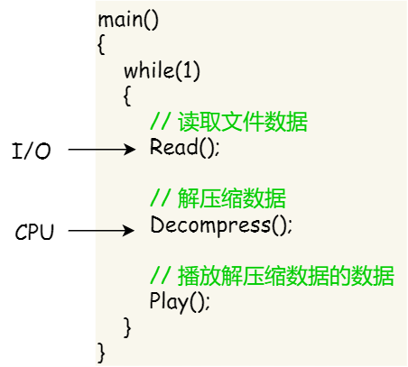

但对于单进程的这种方式，各个函数之间不是并发执行，首先得读完文件数据，然后压缩完，然后才能播放，影响资源的使用效率；


若进一步改进成多进程的方式：

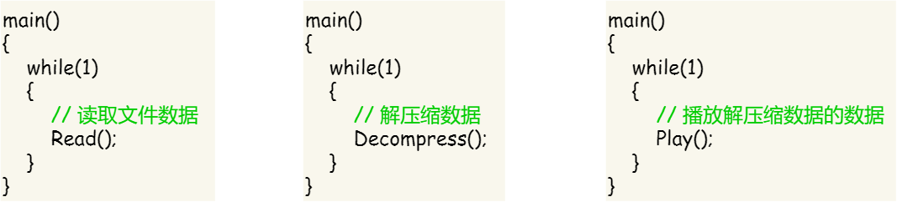

对于多进程的这种方式，问题就变化为了进程之间通信问题，读取文件数据的进程要把读取文件的数据传递给解压缩数据的进程，最后再把解压缩的数据通过进程通信的方式给播放解压缩数据的进程，开销很大。

而且维护进程的系统开销较大，如创建进程时，分配资源、建立 PCB；终止进程时，回收资源、撤销 PCB；进程切换时，保存当前进程的状态信息；


当把上面**多个进程改变为多个线程**时，线程之间可以并发运行且共享相同的地址空间。就解决了实体之间可以并发运行提高资源利用效率，实体之间共享相同的地址空间解决通信开销。


#### 多线程比单线程的优势，劣势？

多线程比单线程的**优势**：提高程序的运行效率，可以充分利用多核处理器的资源，同时处理多个任务，加快程序的执行速度。


多线程比单线程的**劣势**：存在多线程数据竞争访问的问题，需要通过锁机制来保证线程安全，因此增加了加锁的开销。如果线程安全问题处理不慎，并且还会有死锁的风险。多线程会消耗更多系统资源，因为线程间切换都需要一定的开销。


#### 多线程是不是越多越好，太多会有什么问题？*

多线程不一定越多越好，过多的线程可能会导致**占用系统资源**和**死锁**的问题。

- 切换开销：线程的创建和切换会消耗系统资源，包括内存和CPU。如果创建太多线程，会占用大量的系统资源，导致系统负载过高。而且由于线程共享整个进程的资源，所以当某个线程崩溃可能会导致进程崩溃。
- 死锁的问题：线程争夺共享资源可能引发竞争条件，要引入锁机制来解决数据不一致的问题。但如果锁处理不好，线程间相互等待资源释放，则可能发生死锁，阻塞程序执行。


#### 进程切换和线程切换的区别？*

进程切换涉及到更多的内容，包括保存和恢复整个进程的上下文（地址空间、全局变量、文件描述符等），同时可能触发内核态切换和内存管理（如刷新TLB（快表）），因此开销较大。因此，进程切换的开销通常比线程切换大。

线程切换仅需保存和恢复线程的运行上下文（如寄存器、程序计数器、线程栈等），且在同一进程内无需切换地址空间，开销较小。


#### 线程切换为什么比进程切换快，节省了什么资源？*

线程切换比进程切换快，主要原因是：

1. **地址空间共享**：线程共享进程的地址空间，因此切换时不需要切换页表或刷新TLB（快表），节省了内存管理的开销。
2. **资源上下文**：线程共享文件描述符、全局变量等资源，因此**只需切换寄存器、程序计数器和线程栈等线程级**上下文（只需操作**线程控制块（TCB）**），而无需保存和恢复整个进程的资源（涉及**进程控制块（PCB）**的切换，包括内存映射表和内核态数据）。

   

#### 进程上下文有哪些？*

**进程上下文切换是指操作系统将 CPU 从一个进程的执行状态切换到另一个进程的执行状态。**操作系统需要保存当前进程的状态信息，并加载下一个进程的状态信息，使得每个进程在 CPU 上的运行是断续的，在用户看来就像是多个进程并行运行，实际上是并发执行。


进程上下文切换的核心在于保存和恢复进程的执行环境。通常，进程上下文包括以下内容：

- **CPU 寄存器**：包括程序计数器（PC）、栈指针（SP）、基址寄存器（BP）等，这些寄存器保存了进程在 CPU 执行时的关键信息，切换时需要保存当前进程的寄存器状态，然后加载新进程的寄存器状态。
- **虚拟内存映射信息**：操作系统需要保存进程的虚拟地址空间信息，包括页表等。由于现代操作系统通常使用虚拟内存机制，进程的地址空间是隔离的，进程切换时需要加载新的页表。
- **内核堆栈和用户堆栈**：进程的内核堆栈和用户堆栈信息也是上下文的一部分。内核堆栈用于保存系统调用或者中断的上下文，而用户堆栈则用于保存程序的局部变量和函数调用信息。
- **进程控制块（PCB）**：每个进程都有一个进程控制块，它存储了进程的状态信息（如进程状态、程序计数器、CPU 寄存器等）。进程切换时，操作系统通过保存和恢复 PCB 中的内容来实现进程的切换。
- **调度信息**：操作系统还需要记录进程的调度信息，如优先级、调度策略等。

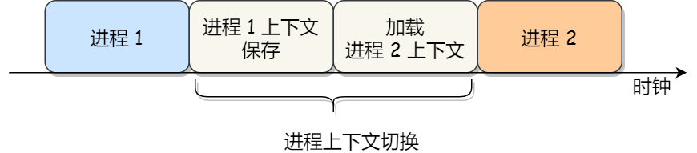

进程上下文切换的开销比较大，主要体现在以下几个方面：

- **保存和恢复寄存器的内容**：保存当前进程的 CPU 寄存器状态并恢复新的进程的寄存器状态，需要访问内存并执行一定的操作。
- **切换虚拟内存和页表**：操作系统需要切换进程的虚拟地址空间，加载新的页表，这涉及到内存管理的操作。
- **更新 PCB 信息**：操作系统需要更新当前进程的 PCB 状态信息，以及加载新进程的 PCB。

进程的上下文开销是很关键的，在设计过程中应该使得进程可以把更多时间花费在执行程序上，而不是耗费在上下文切换。为了降低上下文切换的开销，操作系统通常会采取一些优化手段，比如：采用高效的调度算法、减少不必要的进程切换、优化缓存使用等。


**Q：CPU 上下文切换与进程上下文切换的关系什么关系？**

A：进程上下文切换是 CPU 上下文切换的一种应用形式。**CPU 上下文切换**指的是操作系统在 CPU 执行不同任务时，保存当前任务的执行状态并加载新任务的执行状态。

所谓的「任务」，主要包含进程、线程和中断，根据任务的不同把 CPU 上下文切换分成：**进程上下文切换、线程上下文切换和中断上下文切换**。

对于进程来说，它的上下文切换不仅涉及 CPU 寄存器和程序计数器，还包括虚拟内存、运行栈、系统资源等更复杂的信息。

**进程上下文切换的开销相对较高**，因为它涉及保存和恢复大量的资源信息。

**线程上下文切换的开销较小**，因为线程之间共享进程的虚拟内存和许多资源，只需切换程序计数器，CPU寄存器，运行栈指针等信息。

中断上下文切换开销最小，仅涉及 CPU 寄存器和程序计数器。


#### 进程的状态（五种状态），如何切换？

一个完整的进程状态的变迁如下图：

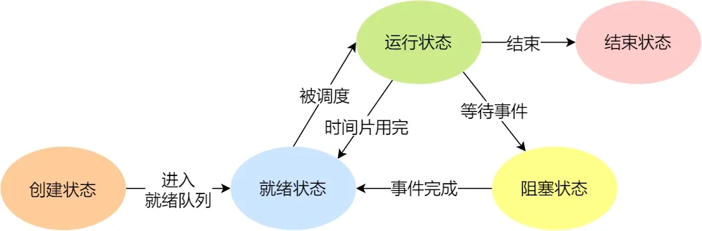

进程五种状态的变迁

再来详细说明一下进程的状态变迁：

- **NULL -> 创建状态**：一个新进程被创建时的第一个状态；
- **创建状态 -> 就绪状态**：当进程被创建完成并初始化后，一切就绪准备运行时，变为就绪状态，这个过程是很快的；
- **就绪态 -> 运行状态**：处于就绪状态的进程被操作系统的进程调度器选中后，就分配给 CPU 正式运行该进程；
- **运行状态 -> 结束状态**：当进程已经运行完成或出错时，会被操作系统作结束状态处理；
- **运行状态 -> 就绪状态**：处于运行状态的进程在运行过程中，由于分配给它的运行时间片用完，操作系统会把该进程变为就绪态，接着从就绪态选中另外一个进程运行；
- **运行状态 -> 阻塞状态**：当进程请求某个事件且必须等待时，例如请求 I/O 事件；
- **阻塞状态 -> 就绪状态**：当进程要等待的事件完成时，它从阻塞状态变到就绪状态；


#### 进程切换的本质是什么？*

进程切换的本质，简而言之，就是 **保存当前进程的状态（上下文），然后加载另一个进程的状态**，使得CPU能够“暂停”一个进程的执行，并“恢复”另一个进程的执行。简单说，就是操作系统在多个进程之间切换控制权。


**Q：请对比一下进程切换和函数调用？**

A：进程切换和函数调用在某种程度上是类似的。就像函数调用时需要保存当前函数的执行状态（返回地址、寄存器状态等），并跳转到另一个函数执行一样，进程切换时也需要保存当前进程的状态并切换到另一个进程的执行状态。

**函数调用**的核心是栈操作（保存调用方法的运行环境（寄存器、返回地址）和调用方法的运行环境（参数））和控制流的跳转（例如`ret`指令返回调用方法），而**进程切换**的核心是保存和恢复进程的执行状态，包括栈信息、寄存器状态、内存映射等。

但进程切换比函数调用要复杂得多，因为它涉及的内容包括：

- **不同的虚拟地址空间**：不同进程有不同的地址空间（栈、堆、代码段等），切换时必须将这些内存的状态保存并恢复。
- **更复杂的上下文**：进程的上下文不仅仅是栈帧和寄存器，还包括进程的内存空间、I/O状态、文件描述符等。


#### **缓冲区溢出攻击是什么？**

缓冲区溢出攻击（Buffer Overflow）是**一种常见的安全攻击方式**，其基本原理是**通过超出缓冲区的边界写入数据，修改栈中的返回地址或其他敏感数据，从而控制程序的执行流**。

**缓冲区溢出攻击的工作原理：**

在C语言等低级编程语言中，数组（特别是字符数组）常常被用作缓冲区来接收输入数据。当输入数据超过了数组的边界时，程序没有检查这一点，就会**覆盖栈上的其他数据**（比如返回地址、函数参数等），这时攻击者就可以利用这个漏洞，**覆盖返回地址**，使程序跳转到攻击者提供的恶意代码。

举个例子：

```C
#include <stdio.h>
#include <string.h>

void vulnerableFunction(char *input) {
    char buffer[64];  // 定义了一个大小为64的缓冲区
    strcpy(buffer, input);  // 复制输入到buffer，容易发生缓冲区溢出
}

int main(int argc, char *argv[]) {
    if (argc > 1) {
        vulnerableFunction(argv[1]);  // 将命令行参数传给vulnerableFunction
    }
    return 0;
}
```

如果攻击者在命令行输入的参数`argv[1]`超过64个字符（即超出`buffer`的大小），就会发生缓冲区溢出，覆盖栈中的其他数据。假如栈中正好有**返回地址**（即`vulnerableFunction()`的返回地址），攻击者可以通过巧妙的设计，将返回地址覆盖成恶意代码的地址。这样，**当vulnerableFunction执行完毕后，程序会跳到攻击者指定的位置**，执行恶意代码。


#### 线程切换详细过程是怎么样的？上下文保存在哪里？*

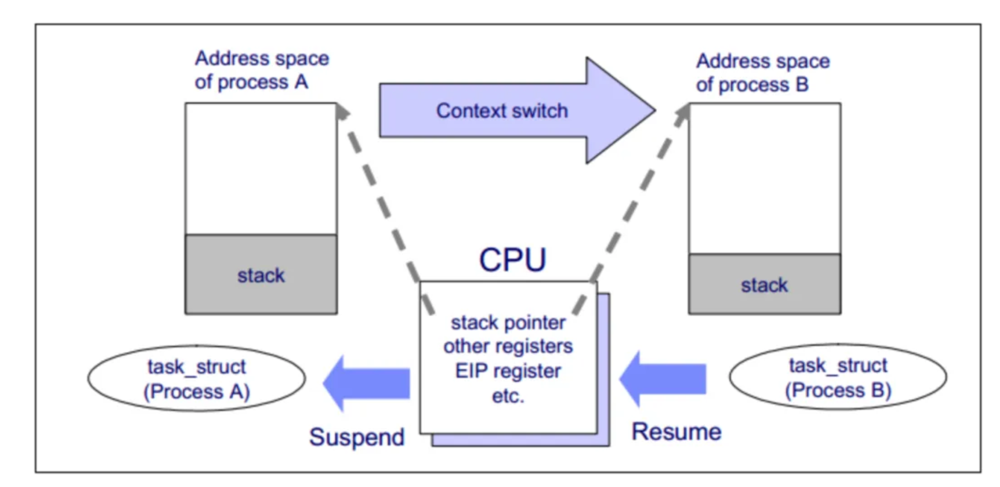

线程切换的详细过程可以分为以下几个步骤：

- 上下文保存：当操作系统决定切换到另一个线程时，它首先会保存当前线程的上下文信息。上下文信息包括寄存器状态、程序计数器、堆栈指针等，用于保存线程的执行状态。
- 切换到调度器：操作系统将执行权切换到调度器（Scheduler）。调度器负责选择下一个要执行的线程，并根据调度算法做出决策。
- 上下文恢复：调度器选择了下一个要执行的线程后，它会从该线程保存的上下文信息中恢复线程的执行状态。
- 切换到新线程：调度器将执行权切换到新线程，使其开始执行。

一般情况下，上下文信息操作系统负责管理保存在线程的控制块（Thread Control Block，TCB）中。

TCB是操作系统用于管理线程的数据结构，包含了线程的状态、寄存器的值、运行栈信息等。当发生线程切换时，操作系统会通过切换TCB来保存和恢复线程的上下文信息。


####  进程间通讯有哪些方式？*

Linux 内核提供了多种进程间通信（IPC）机制，常见的包括管道、消息队列、共享内存、信号、信号量和socket。


##### 1. **管道（Pipe）**

管道是一种简单的进程间通信方式。管道有两种类型：

- **匿名管道**：**没有文件名标识，仅存在于内存中**，通常用于具有父子关系的进程间通信。数据流单向，不支持文件定位操作。管道的生命周期随进程的创建和终止而自动管理。
- **命名管道（FIFO）**：通过**在文件系统中创建一个名为管道的特殊文件，允许任何进程（即使没有亲缘关系）通过该文件进行通信。**命名管道的数据流同样是单向的，但其存在于文件系统中，便于不相关进程间的通信。


##### 2. 消息队列（Message Queue）

消息队列提供了一种在内核中保存消息的机制（依靠内核的「消息链表」），允许进程以消息的形式交换数据，而且全双工。每个消息可以包含不同类型的数据。

虽然消息队列相较于管道支持格式化数据，但其通信的速度受限于用户态和内核态之间的数据拷贝过程。


##### 3. **共享内存（Shared Memory）**

共享内存提供了进程间直接访问内存的方式，消除了用户态与内核态之间的数据拷贝开销，因此具有最快的通信速度。

但共享内存带来了竞争条件的问题，因此需要其他机制（如信号量）来确保数据一致性。


##### 4. **信号量（Semaphore）**

信号量用于进程间同步和互斥，确保在同一时刻只有一个进程能够访问共享资源。

它通过两种原子操作：P（等待）和 V（信号）来控制资源的访问，防止数据竞争和死锁。


##### 5. **信号（Signal）**

信号是一种异步的通信机制，通常用于通知进程发生了某些事件。

信号可以由内核或其他进程发送，进程可以选择捕捉信号并处理，或者忽略信号。**某些信号（如 SIGKILL 和 SIGSTOP）不能被捕捉或忽略。**


##### 6. **Socket**

Socket 是一种基于网络的通信机制，通常用于不同主机之间的通信，也可以用于同一主机的进程间通信。常见的通信协议包括：

- **TCP**：面向连接、可靠的数据传输。
- **UDP**：无连接、不可靠的消息传输。
- **UNIX 域套接字**：用于同一主机的进程间通信，速度较快且不需要网络协议栈。


每种 IPC 机制都有其适用场景和优缺点。**管道**和**消息队列**适用于同一主机上的通信，而**共享内存**和**信号量**适用于需要高效数据交换和资源同步的场景。**信号**适合用于事件通知，**Socket**则是跨主机通信的主要选择。

| IPC 方式           | 类型               | 数据传输方式     | 是否支持双向通信 | 适用场景                                       | 优点                                         | 缺点                                         |
| ------------------ | ------------------ | ---------------- | ---------------- | ---------------------------------------------- | -------------------------------------------- | -------------------------------------------- |
| **管道（Pipe）**   | 匿名管道、命名管道 | 字节流           | 单向             | 父子进程间（匿名）或同一主机进程间通信（命名） | 实现简单、效率高                             | 仅支持单向通信，无法跨主机通信，数据无格式   |
| **消息队列**       | 内核支持           | 格式化消息       | 单向             | 同一主机进程间的异步通信                       | 支持消息格式，消息独立性高，支持异步通信     | 数据写入和读取需要拷贝，通信速度较慢         |
| **共享内存**       | 内存映射           | 内存共享         | 双向             | 高效的进程间数据共享                           | 无数据拷贝，速度最快，适用于大数据量的通信   | 需要额外的同步机制（如信号量）以避免数据竞争 |
| **信号量**         | 内核支持           | 原子操作         | —                | 进程间同步、互斥                               | 实现进程间同步和互斥，控制共享资源的访问顺序 | 使用不当可能导致死锁或资源浪费               |
| **信号（Signal）** | 异步信号机制       | 信号（简单通知） | —                | 系统事件通知、进程管理                         | 轻量级、简单、异步通知                       | 只能传递简单的通知，无法携带复杂数据         |
| **Socket**         | 网络/本地通信      | 数据包           | 双向             | 不同主机间通信或本地主机进程间通信             | 支持跨主机通信、支持多种协议（TCP/UDP）      | 设置复杂，性能相对较低，需操作网络栈         |


#### 管道有几种方式？

管道是一种简单的进程间通信方式。管道有两种类型：

- **匿名管道**：**没有文件名标识，仅存在于内存中**，通常用于具有父子关系的进程间通信。数据流单向，不支持文件定位操作。管道的生命周期随进程的创建和终止而自动管理。
- **命名管道（FIFO）**：通过**在文件系统中创建一个名为管道的特殊文件，允许任何进程（即使没有亲缘关系）通过该文件进行通信。**命名管道的数据流同样是单向的，但其存在于文件系统中，便于不相关进程间的通信。


#### 信号和信号量有什么区别？*

**两个机制的本质区别是信号是通知机制，信号量是同步机制。**

信号是一种异步的通信机制，通常用于通知进程发生了某些事件。

信号可以由内核或其他进程发送，进程可以选择捕捉信号并处理，或者忽略信号。**某些信号（如 SIGKILL 和 SIGSTOP）不能被捕捉或忽略。**


信号量用于进程间同步和互斥，确保在同一时刻只有一个进程能够访问共享资源。

它通过两种原子操作：P（等待）和 V（信号）来控制资源的访问，防止数据竞争和死锁。

- P操作(wait) 是原子性的减操作，当信号量值为0时会阻塞
- V操作(signal) 是原子性的加操作，可能会唤醒等待的进程


| **特性**     | **信号**                                                     | **信号量**                                     |
| ------------ | ------------------------------------------------------------ | ---------------------------------------------- |
| **目的**     | 通知进程发生事件（如中断、终止请求等）                       | 控制进程对共享资源的访问，防止竞争和死锁       |
| **同步方式** | 异步通信，进程可选择处理或忽略信号                           | 同步和互斥，使用原子操作（P/V）来协调进程      |
| **操作方式** | 信号由内核或其他进程发送，进程响应信号                       | 通过原子操作控制资源访问，防止多个进程同时访问 |
| **影响范围** | 通常用于控制进程行为（如终止、暂停等）主要用于异步事件通知。 | 用于控制多个进程之间的共享资源访问             |
| **可捕捉性** | 大多数信号可以被捕捉或忽略，但某些信号（如 `SIGKILL`）不能被捕捉 | 不涉及捕捉，信号量机制基于操作系统内核调度     |


**Q：V操作唤醒等待的进程是通过信号实现的吗？**

A：**V 操作**唤醒等待进程的机制通常 **不是通过信号**来实现的，而是通过信号量机制本身的原子操作来实现的。

- **信号量**的 **P 操作**（等待）会使一个进程进入等待队列，直到信号量的值大于 0 时才会继续执行。如果信号量的值为 0，进程就会被阻塞，直到有其他进程释放资源。
- **V 操作**（释放）会增加信号量的值，并唤醒等待队列中的进程。它通过原子操作保证在某一时刻只有一个进程能访问共享资源。具体来说，**V 操作**会将信号量的值加 1，如果有进程在等待该信号量，它会唤醒一个进程。

进程被唤醒的过程并不涉及 **信号**，而是通过信号量内部的机制（例如内核将等待的进程从阻塞队列中移除）来实现。**信号**主要用于异步事件通知。


#### 共享内存怎么实现的？

**共享内存**的机制是通过通过 **内存映射（memory mapping）** 技术，将一块物理内存映射到多个进程的虚拟地址空间中。

当一个进程写入共享内存时，另一个进程能够直接读取到这些数据，无需通过内核或拷贝数据，从而大大提高了进程间通信的效率。

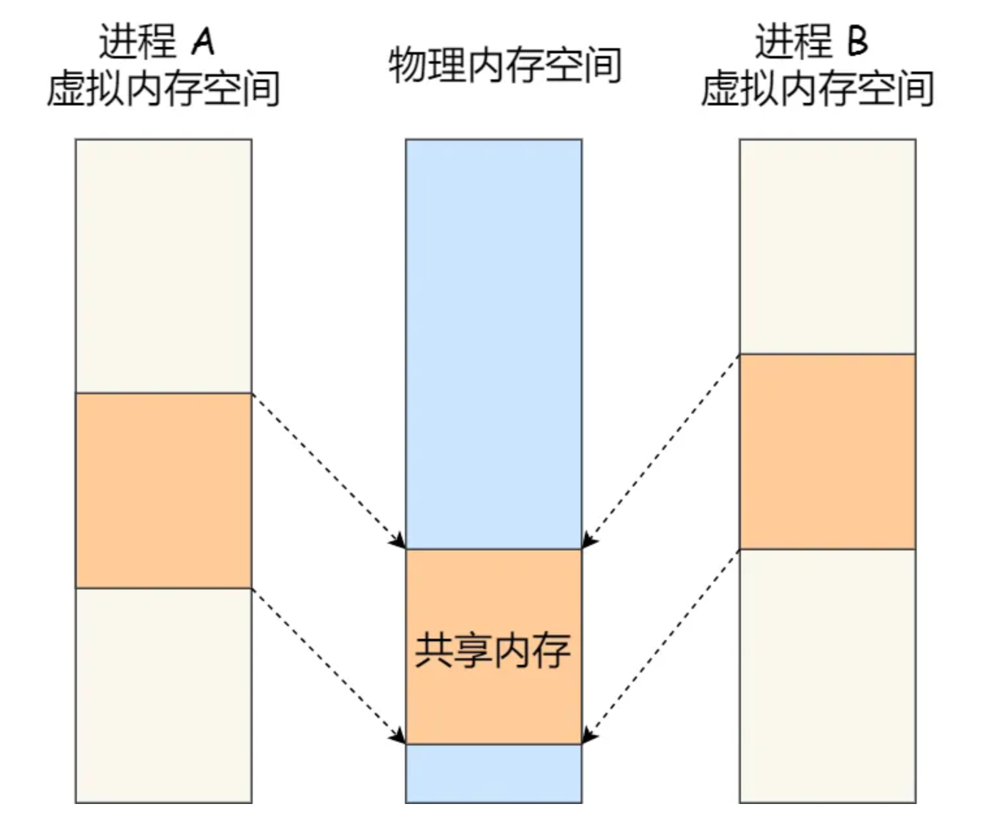


#### 线程间通讯有什么方式？*

线程间通讯一般都是锁的方式。

以Linux系统为例提供了五种用于线程通信的方式：**互斥锁、读写锁、条件变量、自旋锁和信号量**。


##### 1. **互斥锁（Mutex）**

- **本质**：互斥锁（Mutex）是最常用的同步机制，用于确保同一时刻只有一个线程能够访问某个共享资源。
- **操作**：线程在访问共享资源之前对互斥锁进行加锁，访问完成后释放锁。若其他线程尝试加锁，将会被阻塞，直到锁被释放。
- **特性**：互斥锁具有排他性，确保同一时刻只有一个线程可以进入临界区，避免数据竞争。


##### 2. **条件变量（Condition Variables）**

- **本质**：条件变量是一种用于线程间的「等待-通知」机制，**利用线程间共享的全局变量进行同步，通常与互斥锁一起使用。**
- **操作**：线程通过条件变量等待某个条件的成立（通过 `pthread_cond_wait` 等）而挂起，并在条件成立后被其他线程通过 `pthread_cond_signal` 或 `pthread_cond_broadcast` 唤醒。
- **特性**：条件变量的使用通常涉及线程的挂起与唤醒，适用于需要线程在满足特定条件时继续执行的场景。使用条件变量时，必须先获得互斥锁，否则可能会导致竞态条件。


##### 3. **自旋锁（Spinlock）**

- **本质**：自旋锁是一种轻量级的锁，自旋锁通过 CPU 提供的 CAS 函数（*Compare And Swap*）以忙等待的方式来实现线程同步。
- **操作**：线程尝试获取锁时，如果锁已被其他线程持有，它会不断地循环检查锁的状态，而不是进入休眠。这称为“忙等待”（spin）。
- **特性**：相比互斥锁，自旋锁避免了线程上下文切换的开销，适用于锁持有时间非常短的情况。但如果锁被长时间占用，忙等待可能会浪费大量 CPU 时间，因此一般仅适用于低延迟、高频率锁请求的场景。


##### 4. **信号量（Semaphores）**

- **本质**：信号量是用于控制对共享资源的访问数量的同步机制。它有一个计数器，表示资源的可用数量。
- 操作： 
  - **P 操作（等待）**：将信号量的值减 1，若信号量小于 0，线程进入阻塞等待状态。
  - **V 操作（释放）**：将信号量的值加 1，若有线程在等待，唤醒一个线程。
- **特性**：信号量适用于控制多个线程对资源的访问，尤其在有多个共享资源的情况下非常有效。可以用于控制并发量，避免资源过载。


##### 5. **读写锁（Read-Write Locks）**

- **本质**：读写锁允许多个线程同时读共享资源，但在写共享资源时，必须独占访问权。
- 操作： 
  - **读锁**：多个线程可以同时获取读锁（共享锁），并发读取数据，但不允许获取写锁。
  - **写锁**：写锁是独占的，任何线程获取写锁时，其他所有的读锁和写锁都被阻塞。
- **特性**：读写锁特别适用于读多写少的场景，能够提高读操作的并发性。在需要写操作时，会阻塞所有读写操作，确保数据一致性。


| **同步机制** | **作用**                                       | **适用场景**                                   |
| ------------ | ---------------------------------------------- | ---------------------------------------------- |
| **互斥锁**   | 保护共享资源，确保同一时刻只有一个线程访问资源 | 适用于临界区保护，简单有效的同步机制           |
| **条件变量** | 实现“等待-通知”机制，控制线程的挂起和唤醒      | 需要线程在特定条件下等待或被唤醒时             |
| **自旋锁**   | 轻量级锁，忙等待方式避免线程上下文切换         | **锁的持有时间很短的场景，避免上下文切换开销** |
| **信号量**   | 控制资源访问次数或并发数，适用于有限资源管理   | 多线程共享资源控制，并发限制                   |
| **读写锁**   | 允许多个线程同时读取资源，但写操作时独占访问   | 读多写少的场景，提高并发性                     |


#### 除了互斥锁你还知道什么锁？分别应用于什么场景？

还有读写锁、自旋锁、条件变量、信号量。

1. 读写锁：读写锁允许多个线程同时读取共享资源，但只允许一个线程进行写操作。适用于读操作频繁、写操作较少的场景，可以提高并发性能。
2. 自旋锁：自旋锁是一种忙等待锁，线程在获取锁时不会进入阻塞状态，而是循环忙等待直到获取到锁。适用于临界区很小且锁的持有时间很短的场景，避免线程频繁切换带来的开销。
3. 条件变量：条件变量用于线程间的同步和通信。它通常与互斥锁一起使用，线程可以通过条件变量等待某个条件满足，当条件满足时，其他线程可以通过条件变量发送信号通知等待线程。
4. 信号量：信号量是一种计数器，用于控制对共享资源的访问。它可以用来限制同时访问资源的线程数量，或者用于线程间的同步。

| **同步机制** | **作用**                                       | **适用场景**                               |
| ------------ | ---------------------------------------------- | ------------------------------------------ |
| **互斥锁**   | 保护共享资源，确保同一时刻只有一个线程访问资源 | 适用于临界区保护，简单有效的同步机制       |
| **条件变量** | 实现“等待-通知”机制，控制线程的挂起和唤醒      | 需要线程在特定条件下等待或被唤醒时         |
| **自旋锁**   | 轻量级锁，忙等待方式避免线程上下文切换         | 锁的持有时间很短的场景，避免上下文切换开销 |
| **信号量**   | 控制资源访问次数或并发数，适用于有限资源管理   | 多线程共享资源控制，并发限制               |
| **读写锁**   | 允许多个线程同时读取资源，但写操作时独占访问   | 读多写少的场景，提高并发性                 |


#### 进程调度算法有哪些？*

##### 1. 先来先服务调度算法（FCFS）

顾名思义该算法，**每次从就绪队列选择最先进入队列的进程，然后一直运行，直到进程退出或被阻塞，才会继续从队列中选择第一个进程接着运行。**

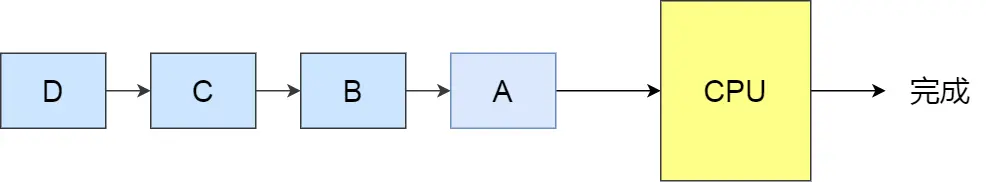

这似乎很公平，但是当一个长作业先运行了，那么后面的短作业等待的时间就会很长，不利于短作业。

所以FCFS 对长作业有利，适用于 CPU 繁忙型作业的系统，而不适用于 I/O 繁忙型作业的系统。


##### 2. 最短作业优先调度算法（SJF）

**最短作业优先（Shortest Job First, SJF）调度算法**同样也是顾名思义，它会**优先选择运行时间最短的进程来运行**，这有助于提高系统的吞吐量。

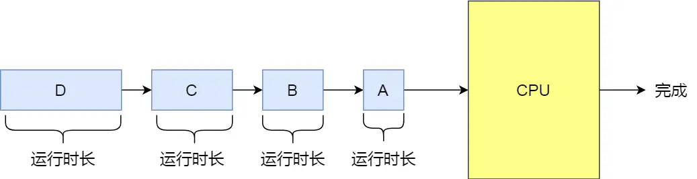

但对长作业不利，很容易造成一种极端现象，致使长作业长期不会被运行。


##### 3. 高响应比优先调度算法（HRRN）

**高响应比优先 （Highest Response Ratio Next, HRRN）调度算法**相较于上面两个算法基础上权衡了短作业和长作业。

**每次进行进程调度时，先计算「响应比优先级」，然后把「响应比优先级」最高的进程投入运行**，「响应比优先级」的计算公式：


从上面的公式，可以发现：

- 如果两个进程的「等待时间」相同时，「要求的服务时间」越短，「响应比」就越高，这样短作业的进程容易被选中运行；
- 如果两个进程「要求的服务时间」相同时，「等待时间」越长，「响应比」就越高。

响应比优先兼顾到了长作业进程，因为进程的响应比可以随时间等待的增加而提高，当其等待时间足够长时，其响应比便可以升到很高，从而获得运行的机会；


##### 4. 时间片轮转调度算法（RR）

最简单、最公平且使用最广的算法就是**时间片轮转（Round Robin, RR）调度算法**。

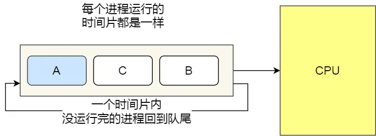 **每个进程被分配一个时间段，称为时间片（Quantum)，即允许该进程在该时间段中运行。**

- 如果时间片用完，进程还在运行，那么将会把此进程从 CPU 释放出来，并把 CPU 分配另外一个进程；
- 如果该进程在时间片结束前阻塞或结束，则 CPU 立即进行切换；

但是注意时间片的设置，如果时间片设得太短会导致过多的进程上下文切换，降低了 CPU 效率；如果设得太长又可能引起对短作业进程的响应时间变长。

**通常时间片设为 `20ms~50ms` 通常是一个比较合理的折中值。**


##### 5. 最高优先级调度算法（HPF）

RR让所有的进程同等重要，大家的运行时间都一样。

但是，针对于某种情况下的系统应用的场景希望调度程序能**从就绪队列中选择最高优先级的进程进行运行，这称为最高优先级（Highest Priority First，HPF）调度算法**。 进程的优先级可以分为，静态优先级或动态优先级：

- 静态优先级：创建进程时候，就已经确定了优先级了，然后整个运行时间优先级都不会变化；
- 动态优先级：根据进程的动态变化调整优先级，比如如果进程运行时间增加，则降低其优先级，如果进程等待时间（就绪队列的等待时间）增加，则升高其优先级，也就是**随着时间的推移增加等待进程的优先级**。

该算法也有两种处理优先级高的方法，非抢占式和抢占式：

- 非抢占式：当就绪队列中出现优先级高的进程，运行完当前进程，再选择优先级高的进程。
- 抢占式：当就绪队列中出现优先级高的进程，当前进程挂起，调度优先级高的进程运行。

但是依然有缺点，可能会导致低优先级的进程永远不会运行。


##### 6. 多级反馈队列调度算法

**多级反馈队列（Multilevel Feedback Queue）调度算法**是「时间片轮转算法」和「最高优先级算法」的综合和发展。

- 「多级」表示有多个队列，每个队列优先级从高到低，同时优先级越高时间片越短。
- 「反馈」表示如果有新的进程加入优先级高的队列时，立刻停止当前正在运行的进程，转而去运行优先级高的队列；

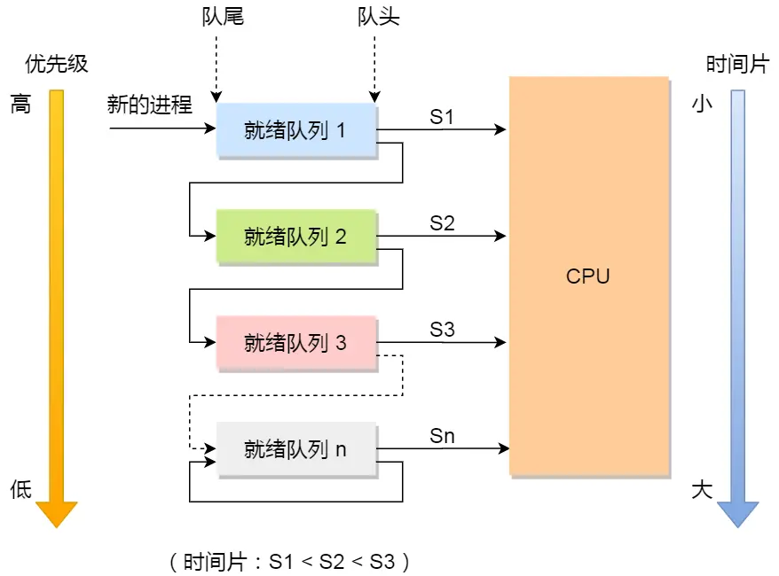 工作过程如下，

- 设置了多个队列，赋予每个队列不同的优先级，每个**队列优先级从高到低**，同时**优先级越高时间片越短**；
- 新的进程会被放入到第一级队列的末尾，按先来先服务的原则排队等待被调度，如果在第一级队列规定的时间片没运行完成，则将其转入到第二级队列的末尾，以此类推，直至完成；
- 当较高优先级的队列为空，才调度较低优先级的队列中的进程运行。如果进程运行时，有新进程进入较高优先级的队列，则停止当前运行的进程并将其移入到原队列末尾，接着让较高优先级的进程运行；

可以发现，对于短作业可能可以在第一级队列很快被处理完。对于长作业，如果在第一级队列处理不完，可以移入下次队列等待被执行，虽然等待的时间变长了，但是运行时间也会更长了，所以该算法很好的**兼顾了长短作业，同时有较好的响应时间。**


| **调度算法**             | **描述**                                                     | **抢占式**               | **优缺点**                                                   | **特点**                                                     | **适用操作系统**                   |
| ------------------------ | ------------------------------------------------------------ | ------------------------ | ------------------------------------------------------------ | ------------------------------------------------------------ | ---------------------------------- |
| **先来先服务（FCFS）**   | 按照进程进入队列的顺序来调度，先到先服务。                   | 否                       | **优点**：实现简单，公平；**缺点**：容易导致长作业阻塞短作业（“饥饿”现象）。 | **特点**：作业一次性提交，自动批量处理，系统利用率高，但缺乏交互性，平均周转时间长。 | **批处理操作系统**                 |
| **最短作业优先（SJF）**  | 优先调度预计运行时间最短的进程。                             | 否（但可以设置为抢占）   | **优点**：提高系统吞吐量；**缺点**：可能导致长作业得不到运行（“饥饿”现象），需要预估作业时间。 | **特点**：适用于处理有预期运行时间的作业，能提高吞吐量，但长作业可能被饥饿。 | **批处理操作系统**                 |
| **高响应比优先（HRRN）** | 计算进程的响应比，优先调度响应比高的进程。响应比 = (等待时间 + 服务时间) / 服务时间。 | 否                       | **优点**：兼顾短作业和长作业，减少饥饿现象；**缺点**：计算响应比增加了调度复杂性。 | **特点**：长短作业均衡调度，适合负载均衡的环境，能减少长作业的饥饿现象。 | **批处理操作系统**                 |
| **时间片轮转（RR）**     | 每个进程分配一个固定的时间片，时间片用完后，CPU 会切换到下一个进程。 | 是                       | **优点**：公平，每个进程得到相同的 CPU 时间；**缺点**：时间片过短可能导致频繁上下文切换，时间片过长可能导致响应时间变慢。 | **特点**：多个用户并发，系统快速响应，支持交互性，保证了公平性，适合时间共享。 | **分时操作系统**                   |
| **最高优先级（HPF）**    | 每次选择最高优先级的进程执行，优先级可以是静态或动态调整。   | 是（但可以设置为非抢占） | **优点**：根据进程的重要性优先调度；**缺点**：低优先级进程可能永远得不到执行（“饥饿”现象）。 | **特点**：支持进程优先级动态调整，适合实时需求高的系统，可能导致优先级低的任务饥饿。 | **分时操作系统**、**实时操作系统** |
| **多级反馈队列（MLFQ）** | 多个队列，每个队列有不同的优先级和时间片，进程根据运行情况在队列间移动。 | 是                       | **优点**：兼顾短作业和长作业，响应时间好，灵活性高；**缺点**：实现复杂，可能导致调度开销较大。 | **特点**：灵活调度，支持动态调整，兼顾长短作业，适合负载不均、任务混合的系统。 | **分时操作系统**、**实时操作系统** |


### 锁

#### 为什么并发执行线程要加锁？

并发执行线程需要加锁主要是为了保护共享数据，防止出现「竞态条件」。

「竞态条件」是指当**多个线程同时访问和操作同一块数据**时，结果依赖于线程的执行顺序但并发过程是不确定的，所以可能导致数据的不一致性。

通过加锁，可以确保在任何时刻只有一个线程能够访问共享数据，从而避免「竞态条件」，确保数据的一致性和完整性。


#### 自旋锁是什么？应用在哪些场景？*

自旋锁是一种轻量级的锁，本质上是通过操作系统提供的 CAS 函数（*Compare And Swap*）以忙等待的方式来实现线程同步。

##### 1. 自旋锁加锁过程

一般自旋锁加锁的过程，包含两个步骤：

- 第一步，查看锁的状态，如果锁是空闲的，则执行第二步；
- 第二步，将锁设置为当前线程持有；

CAS 操作是硬件级别的原子指令，能够保证在单次操作中完成“比较和交换”的过程，避免了线程在获取锁的过程中被中断，从而确保了加锁操作的原子性。

比如，设锁为变量 lock，整数 0 表示锁是空闲状态，整数 `pid` 表示线程 ID，那么 `CAS(lock, 0, pid)` 就表示自旋锁的加锁操作，`CAS(lock, pid, 0)` 则表示解锁操作。


##### 2. 自旋锁的特性

使用自旋锁的时候，当发生多线程竞争锁的情况，加锁失败的线程会「忙等待」，直到它拿到锁。「忙等待」可以用 `while` 循环等待实现，不过使用 CPU 提供的 `PAUSE` 指令来实现「忙等待」，因为可以减少循环等待时的性能消耗。

自旋锁会利用 CPU 周期一直自旋，直到锁可用。**需要注意，在单核 CPU 上，需要抢占式的调度器及时终止。否则，一个自旋的线程永远不会放弃 CPU。**

自旋锁在多核系统下一般不会主动产生线程切换，适合异步、协程等在用户态切换请求的编程方式开销少。但如果被锁住的代码执行时间过长，自旋会长时间占用 CPU 资源，反而比互斥锁产生更多的性能消耗。


自旋锁与互斥锁使用层面比较相似，但实现层面上完全不同：**当加锁失败时，互斥锁用「线程切换」来应对，自旋锁则用「忙等待」来应对**。


##### 3. 使用场景

**如果被锁住的代码执行时间很短，就不应该用互斥锁，而应该选用自旋锁，否则使用互斥锁。**因此自旋锁一般仅适用于低延迟、高频率锁请求的场景。


#### 什么是线程死锁?（JavaGuide）

线程死锁描述的是这样一种情况：多个线程同时被阻塞，它们中的一个或者全部都在等待某个资源被释放。由于线程被无限期地阻塞，因此程序不可能正常终止。

如下图所示，线程 A 持有资源 2，线程 B 持有资源 1，他们同时都想申请对方的资源，所以这两个线程就会互相等待而进入死锁状态。


#### 死锁发生条件是什么？

死锁有**4个必要条件**，**只有4个必要条件同时满足时才会发生**，

1. **互斥条件**：至少有一个资源必须处于互斥模式，即资源在某一时刻只能被一个线程占有。如果其他线程请求该资源，它们必须等待。
2. **请求并保持条件**：线程已经持有一个资源，**并且在等待获取其他资源时不会释放当前持有的资源。**
3. **不可剥夺条件**：线程持有的资源在使用完之前不能被强制剥夺，只有线程自己释放资源才能让其他线程获取。
4. **循环等待条件**：一组线程之间形成了一个循环等待的关系，其中每个线程都在等待其他线程持有的资源。


#### 如何解决死锁？

死锁有三个方面可以来考虑。分别是**破坏死锁必要条件**、**死锁避免**和**死锁检测与解除**。


##### 1. **破坏死锁的必要条件**

破坏死锁的必要条件通过有针对性地破坏死锁发生的四个必要条件之一来避免死锁的发生。条件都有不同的应对方法：这说法

- **破坏互斥条件**：将某些互斥资源改造成共享访问，典型就是打印机的**spooling技术**，但不是资源都是可以改造成共享的。
- **破坏请求并保持条件**：使用一次性分配策略破坏请求并保持条件条件。线程必须在一次请求时就申请到所有它需要的资源，如果不能全部申请到，就不会占有任何资源。
- **破坏不可剥夺条件**：即通过允许其他线程抢占正在使用中的资源来解决。通常需要采取某种策略来中断线程或通过抢占让线程释放资源。但在很多情况下资源的抢占可能会引入额外的上下文切换和资源管理开销。
- **破坏循环等待条件**：通过确保资源请求和释放的顺序是有序的，防止形成环路。具体设定所有资源按某种顺序编号，要求所有线程按资源编号顺序申请资源。如果线程持有的资源编号较小，它只能请求编号较大的资源，从而避免了环路。

**破坏死锁条件**的方法通常比较简单，但有时会导致系统效率的下降，尤其是当不能满足某些条件时。


##### 2. **死锁避免**

死锁避免策略在每次资源请求时通过动态地分析资源的申请情况，判断是否会导致死锁，从而避免死锁的发生。

最常见的死锁避免算法是 **银行家算法**，它是基于 **安全性检查** 来决定是否安全地分配资源。

**银行家算法**假设系统有多个资源类型，且每个线程对每种资源有最大需求和当前需求。银行家算法根据每次资源请求检查系统是否处于安全状态，若进入安全状态则允许资源分配，否则拒绝该请求。安全状态是指存在一种资源分配顺序，保证每个线程最终都能获取到所需资源而不会进入死锁。


**死锁避免**算法通常在实际开发中使用较少，因为它需要了解每个线程对资源的最大需求，并进行复杂的计算，可能带来较大的开销。


##### 3. **死锁检测与解除**

死锁检测与解除方法基于假设系统可能会发生死锁，因此采取周期性的死锁检测，及时发现并处理死锁情况。包含**死锁检测和死锁解除**两个部分。

**死锁检测算法**：这种方法通常使用资源分配图来检测系统中是否存在死锁。**资源分配图**将系统中的资源和线程看作图中的节点。资源分配图中的边表示线程对资源的请求和持有。系统通过判断图中是否存在环路来避免死锁。如果存在环路，说明发生了死锁，需要使用的**死锁解除**算法。


**死锁解除**算法一般有三种，

- **资源抢占**：强制中断一个或多个死锁线程，回收它们持有的资源并重新分配。
- **线程回滚**：将某些线程回滚到一个安全的状态，释放已占有的资源，然后重新尝试执行。
- **优先终止**：选择优先级最低的线程进行终止，从而解除死锁。


**死锁检测与解除**通常用于那些无法避免死锁的系统，这种方法能够在发生死锁后进行恢复，但需要定期进行死锁检测，且恢复过程中可能会丢失部分工作进度或引入性能损耗。


| 特点          | 破坏死锁必要条件                                     | 死锁避免                                               | 死锁检测与解除                                         |
| ------------- | ---------------------------------------------------- | ------------------------------------------------------ | ------------------------------------------------------ |
| 处理时机      | 预防式，系统设计阶段                                 | 运行时预防                                             | 运行时检测和恢复                                       |
| 实现复杂度    | 较简单                                               | 复杂                                                   | 中等                                                   |
| 系统开销      | 一般，主要在设计时付出代价                           | 较大，需要持续监控和计算                               | 周期性开销，检测和恢复时开销较大                       |
| 资源利用率    | 较低，可能造成资源浪费                               | 中等                                                   | 较高                                                   |
| 适用场景      | 小型系统或对性能要求不高的场景                       | 系统规模适中且资源使用模式可预测                       | 大型系统或对资源利用率要求较高，无法完全避免死锁       |
| 主要优点      | • 实现简单<br>• 彻底避免死锁<br>• 无运行时开销       | • 资源利用率比预防法高<br>• 不会发生死锁               | • 资源利用率最高<br>• 最灵活<br>• 不影响正常运行       |
| 主要缺点      | • 限制严格<br>• 资源利用率低<br>• 可能导致性能下降   | • 需要提前知道资源需求<br>• 运行时开销大<br>• 实现复杂 | • 检测开销<br>• 恢复可能丢失进度<br>• 无法完全避免死锁 |
| 代表算法/方法 | • Spooling技术<br>• 资源有序分配<br>• 一次性分配策略 | • 银行家算法                                           | • 资源分配图<br>• 资源抢占<br>• 进程回滚或终止         |


#### 讲一下银行家算法

**银行家算法**假设系统有多个资源类型，且每个线程对每种资源有最大需求和当前需求。

银行家算法主要是防止系统进入不安全状态来进行死锁避免，防止系统进入不安全状态最核心的要点就是系统当前所剩下的资源能够满足任意一个并发执行的线程所需要的当前需求。

**银行家算法**根据每次资源请求检查系统是否处于安全状态，若进入安全状态则允许资源分配，否则拒绝该请求。安全状态是指存在一种资源分配顺序，保证每个线程最终都能获取到所需资源而不会进入死锁。


#### 现代操作系统和应用程序中处理死锁的主流方法？*

**预防死锁**：在实际系统设计中，最常用的方法是破坏循环等待条件，通过资源有序分配来避免死锁。例如，多线程编程中常用的"按固定顺序获取锁"的编程实践，就是这种方法的体现。

**超时机制**：这是实际应用中最常见的实用方法。设置资源获取的超时时间，如果在指定时间内无法获取所需资源，则放弃本次操作并释放已持有的资源，之后可能会重试。Java中的`Lock.tryLock(timeout)`和数据库事务超时就是这种机制的例子。

**死锁检测与恢复**：在数据库管理系统中广泛应用，数据库系统会定期检查事务之间是否存在死锁，一旦检测到死锁，通常会选择"牺牲"某个事务（通常是代价最小的）来解除死锁。


#### 乐观锁和悲观锁有什么区别？

悲观锁如其名字所言，认为并发进程运行总是会存在竞争问题。于是对共享资源加上独占独占锁，互斥锁是典型的悲观锁

而乐观锁相反，认为当前并发进程运行环境不总会发生竞争问题，通过更新数据时检查数据的版本（如使用版本号或时间戳），如果失败则表示冲突，自选锁是一种典型的乐观锁。

乐观锁适用于读多写少的场景，通过版本控制来处理冲突；而悲观锁适用于写多的场景，通过加锁来避免冲突。

| **特性**     | **悲观锁**                   | **乐观锁**                       |
| ------------ | ---------------------------- | -------------------------------- |
| **假设**     | 总会发生竞争冲突             | 假设不会发生竞争冲突             |
| **锁机制**   | 对共享资源加锁，互斥访问     | 不加锁，更新时检查数据是否冲突   |
| **适用场景** | 写多的场景（并发冲突较多）   | 读多写少的场景（并发冲突较少）   |
| **性能**     | 锁开销较大，可能导致性能下降 | 锁开销小，但需要处理冲突时的回退 |
| **实现方式** | 互斥锁、数据库锁等           | 版本号、时间戳、CAS 等原子操作   |


### 内存管理

#### 介绍一下操作系统内存管理

如今操作系统在虚拟内存基础上设计的请求分页式内存管理，在这种模式下每个进程认为都有自己的独立且连续内存（虚拟内存），背后由操作系统OS虚拟地址和物理地址的转换。


##### 1. 虚拟内存


虚拟内存是操作系统提供给每个运行中程序的一种地址空间，每个程序在运行时认为自己拥有的内存空间就是虚拟内存，其大小可以远远大于物理内存的大小。有了虚拟内存之后，它带来了这些好处：

- 第一，虚拟内存可以使得进程对运行内存超过物理内存大小。根据符合局部性原理，CPU 访问内存会有很明显的重复访问的倾向性，对于那些没有被经常使用到的内存，可以把它换出硬盘上的 swap 区域，等到需要的时候操作系统再将其交换回物理内存，对用户程序透明。
- 第二，解决了多进程之间地址冲突的问题。在虚拟内存设计中每个进程都有自己的页表，所以每个进程的虚拟内存空间就是相互独立的，进程也没有办法访问其他进程的页表。
- 第三，在内存访问方面，操作系统提供了更好的安全性。页表里的页表项中除了物理地址之外，还有一些标记属性的比特，比如控制一个页的读写权限，标记该页是否存在等。


##### 2. 分页管理

**分页是把整个虚拟和物理内存空间切成一段段固定尺寸的大小**。每一个连续并且尺寸固定的内存空间叫**页**（*Page*）。**在 Linux 下，每一页的大小为 4KB。**

而在请求分页式内存管理下虚拟地址与物理地址之间通过**页表**来映射，如下图：

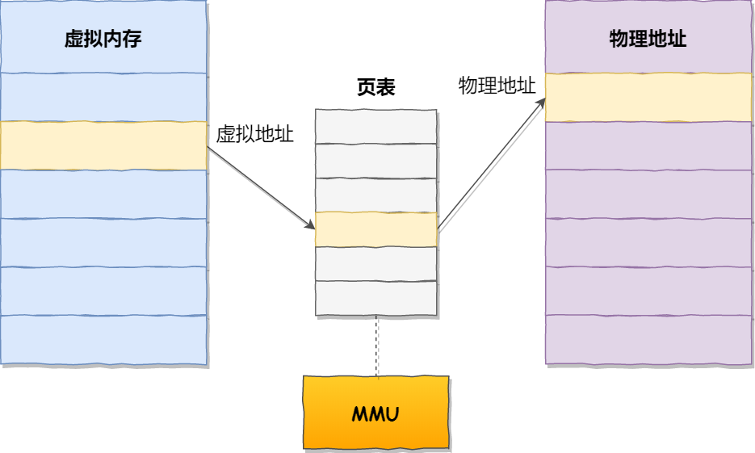

页表是存储在内存里的，**OS内核中的内存管理单元** （*MMU*）就做将虚拟内存地址转换成物理地址的工作。

当进程访问的虚拟地址在页表中查不到时，系统会产生一个**缺页异常**，进入系统内核空间分配物理内存、更新进程页表，最后再返回用户空间，恢复进程的运行。


#### 什么是虚拟内存和物理内存？

物理内存是计算机实际存在的内存，是计算机中的实际硬件部件。

而虚拟内存是是操作系统为每个进程提供的一种抽象，使得每个进程都有独立的地址空间。进程只能看到自己的虚拟内存地址空间，并通过操作系统的内存管理机制访问物理内存。有了虚拟内存之后，它带来了这些好处：

- 第一，虚拟内存可以使得进程对运行内存超过物理内存大小。根据符合局部性原理，CPU 访问内存会有很明显的重复访问的倾向性，对于那些没有被经常使用到的内存，可以把它换出硬盘上的 swap 区域，等到需要的时候操作系统再将其交换回物理内存，对用户程序透明。
- 第二，解决了多进程之间地址冲突的问题。在虚拟内存设计中每个进程都有自己的页表，所以每个进程的虚拟内存空间就是相互独立的，进程也没有办法访问其他进程的页表。
- 第三，在内存访问方面，操作系统提供了更好的安全性。页表里的页表项中除了物理地址之外，还有一些标记属性的比特，比如控制一个页的读写权限，标记该页是否存在等。


#### 讲一下页表和分页存储管理？

##### 1. 分页存储管理

分页存储管理是操作系统用来管理虚拟内存和物理内存的一种机制，主要通过将内存空间划分为固定大小的块来实现高效管理。在 Linux 下，每一页的大小为 4KB。

分页存储管理由页、页框、页表三个基本概念组成。

- **页 (Page)**：虚拟内存被划分为固定大小的块，每个块称为“页”。通常一个页的大小是 4KB，但也有 8KB、16KB 或更大的页。
- **页框 (Page Frame)**：物理内存同样被划分为与虚拟内存页大小相同的块，称为“页框”。
- **页表 (Page Table)**：用于维护虚拟页与物理页框之间映射关系的数据结构。

**分页的基本原理为**操作系统会将虚拟内存空间划分成若干个大小相等的单元，称为"页"。

同时，物理内存也被划分成大小相同的"页框"，其大小与虚拟内存中的页完全一致。

为了建立虚拟内存和物理内存之间的对应关系，操作系统会维护一个页表，用于记录每个虚拟页与物理页框之间的映射关系。

**分页相比分段由于内存空间都是预先划分好的不会产生外部碎片**，但因为内存分页机制分配内存的最小单位是一页，所以针对**内存分页机制会有内部碎片**。


##### 2. 页表

页表是存储在内存里的一种数据结构，用来映射每一个进程的虚拟地址与物理地址。每一个进程有自己独立的页表，**操作系统内核的内存管理单元** （*MMU*）就负责根据页表将虚拟内存地址转换成物理地址的工作，如下图：


而当进程访问的虚拟地址在页表中查不到时，系统会产生一个**缺页异常**，进入系统内核空间分配物理内存、更新进程页表中的页表项，最后再返回用户空间，恢复进程的运行。

**页表由页表项（Page Table Entry, PTE）组成**，每个页表项存储了虚拟页与物理页框之间的映射关系。通常，一个页表项包括以下信息：

- **物理页框号**：该虚拟页映射到的物理页框的地址。
- **有效位 (Valid Bit)**：表示该页是否存在于物理内存中。如果为无效，操作系统会触发缺页异常。
- **访问权限位**：控制对该页的访问权限，如只读、可写等。
- **修改位 (Dirty Bit)**：表示该页是否已经被修改，操作系统根据此信息判断是否需要将其写回磁盘。

而页号是隐藏的，相当于数组中的索引。在大规模系统中，单级页表可能会非常庞大，占用大量内存，操作系统采用多级页表来提高内存管理的效率。


Q：在这个基础上讲一下分页内存管理下的地址变换过程？

A：在分页机制下，虚拟地址分为两部分，**页号**和**页内偏移**。页号作为页表的索引，**页表**包含物理页每页所在**物理内存的基地址**，这个基地址与页内偏移的组合就形成了物理内存地址。

**对于一个内存地址转换，简单来说有三个步骤：**

- 把虚拟内存地址，切分成页号和偏移量；
- 根据页号，从页表里面，查询对应的物理页号；
- 直接拿物理页号，加上前面的偏移量，就得到了物理内存地址。

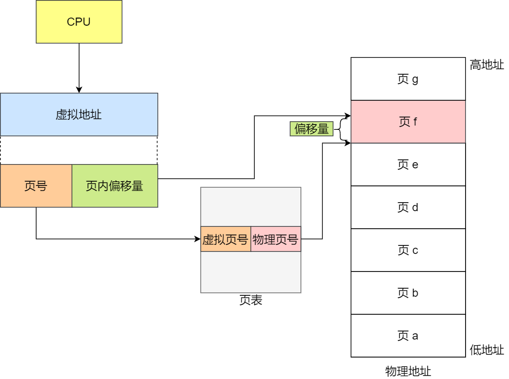


#### 讲一下段式存储管理和段表？*

##### **1. 段式存储管理**

段式存储管理是操作系统管理内存的一种方式，它通过将程序的地址空间划分为不同的段来管理内存。

每个段代表一个逻辑单元，如代码段、数据段、堆栈段等。段式管理提供了对程序逻辑结构的更高层次的支持，适用于需要根据逻辑功能进行划分的场景。

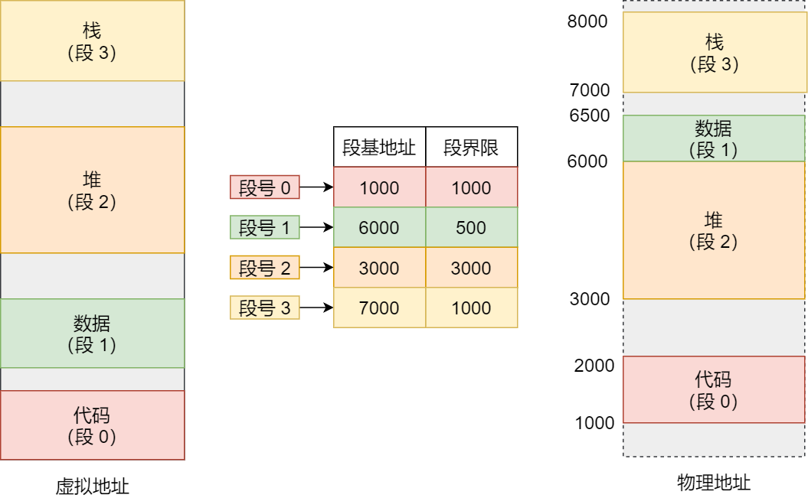

段式存储管理由段和段表这两个基本概念组成。

- **段 (Segment)**：段是程序的逻辑单位，可以是代码、数据、堆栈等，每个段包含了具有相同功能或用途的内存区域。每个段有自己的起始地址和长度。
- **段表 (Segment Table)**：段表用于记录每个段的基址和长度。每个进程都有自己的段表，它通过映射虚拟段地址到物理内存地址来管理内存。

段式存储管理的基本原理为，程序的虚拟地址空间被划分为多个段，每个段都具有明确的起始地址和长度，这些信息都被记录在操作系统维护的段表中。当程序需要访问某个虚拟地址时，操作系统会解析这个地址中包含的段号和偏移量信息，然后查询段表找到对应段的物理内存起始位置和长度信息，最终通过计算得出实际的物理地址。


**段式管理的优点在于更加符合程序的逻辑结构，能够将不同功能的内存区分开**，而且由于是逻辑划分不存在内部碎片。但可能导致外部碎片问题，因为每个段的大小不一定是固定的。


##### **2. 段表**

段表是操作系统在段式存储管理用来存储虚拟地址和物理地址之间映射关系的数据结构。它记录了每个段的起始物理地址和长度信息，用于帮助操作系统将虚拟地址转换为物理地址。

段表由段表项 (Segment Table Entry, STE)组成每个段表项包含以下信息： 

- **段基址 (Base Address)**：段在物理内存中的起始地址。
- **段长度 (Limit)**：段的长度，表示该段在内存中的有效范围。
- **有效位 (Valid Bit)**：指示该段是否存在于物理内存中。如果为无效，操作系统会触发缺页异常或错误。
- **访问权限位**：表示对该段的访问权限（如只读、只写等）。


同样在大规模系统中，单级段表可能会占用大量内存。为了提高内存管理的效率，操作系统可以采用多级段表结构。


**Q：对比一下分段式存储管理和分页式存储管理？**

A：分页管理更适合现代操作系统的通用内存管理需求，段式管理则更适合特定的、需要按照逻辑关系组织程序的场景。**而Linux 使用分页式内存管理。**

| 比较维度 | 分页存储管理                                                 | 段式存储管理                                           |
| -------- | ------------------------------------------------------------ | ------------------------------------------------------ |
| 划分方式 | 将内存划分为固定大小的页                                     | 将程序划分为不同功能的逻辑段                           |
| 分配单位 | 大小固定（通常是4KB）                                        | 大小可变（根据程序逻辑）                               |
| 地址结构 | 页号 + 页内偏移                                              | 段号 + 段内偏移                                        |
| 映射表   | 页表（Page Table）                                           | 段表（Segment Table）                                  |
| 表项内容 | • 物理页框号<br>• 有效位<br>• 访问权限位<br>• 修改位         | • 段基址<br>• 段长度<br>• 有效位<br>• 访问权限位       |
| 内存碎片 | 只有内部碎片，没有外部碎片                                   | 只有外部碎片，没有内部碎片                             |
| 优点     | • 管理简单<br>• 无外部碎片<br>• 内存利用率相对稳定           | • 符合程序逻辑结构<br>• 便于共享和保护<br>• 无内部碎片 |
| 缺点     | • 页表可能占用大量内存<br>• 存在内部碎片<br>• 不反映程序逻辑 | • 管理较复杂<br>• 存在外部碎片<br>• 分配和回收较复杂   |
| 适用场景 | 通用内存管理，现代操作系统普遍采用                           | 需要逻辑划分的特定场景                                 |
| 地址转换 | 通过页表将虚拟页号映射到物理页框号                           | 通过段表将虚拟段号映射到物理段基址                     |
| 空间开销 | 页表占用空间大，但管理规整                                   | 段表占用空间小，但管理复杂                             |


#### 虚拟地址是怎么转化到物理地址的？

在分页机制下，虚拟地址分为两部分，**页号**和**页内偏移**。页号作为页表的索引，**页表**包含物理页每页所在**物理内存的基地址**，这个基地址与页内偏移的组合就形成了物理内存地址。

**对于一个内存地址转换，简单来说有三个步骤：**

- 把虚拟内存地址，切分成页号和偏移量；
- 根据页号，从页表里面，查询对应的物理页号；
- 直接拿物理页号，加上前面的偏移量，就得到了物理内存地址。


现代系统中，页表查找的过程会使用**快表**（Translation Lookaside Buffer, TLB）来加速虚拟地址到物理地址的转换。TLB是一个小而快速的缓存，用于存储最近使用的虚拟页号到物理页号的映射保存所有进程中页表的一部分。

* 如果在TLB中找到了映射关系（称为TLB命中），则可以避免访问较慢的页表，提升性能。

- 如果TLB中没有找到对应的映射（TLB未命中），则需要访问页表，并且可能会引起页表的访问延迟。


此外另一方面，在现代操作系统中，尤其是对于大规模虚拟内存，通常会使用**多级页表**（如二级、三级或四级页表）来减少内存开销。

在这种情况下，虚拟地址的页号会被进一步分解为多个部分，每一部分用于查找不同级别的页表，直到最终找到物理页号。每一级页表通常是一个指向下一级页表的指针，直到最终得到物理页号。


#### 程序的内存布局是怎么样的？（程序所见的内存布局，也就是虚拟内存）*

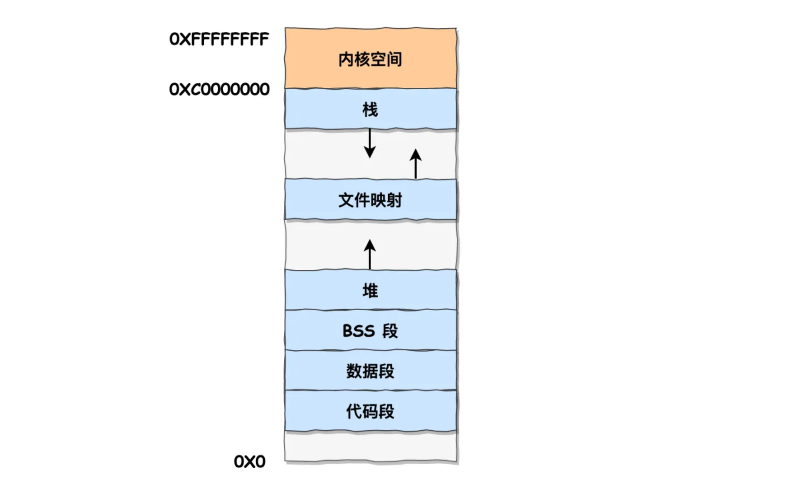

如上图所示，用户空间内存，从**低到高**分别是 6 种不同的内存段：

- **代码段**，包括二进制可执行代码。一般OS设置为是只读的，防止程序意外修改代码内容。通常由编译器生成，并由OS在程序加载时映射到内存中。
- 数据段，存储**已初始化**的全局变量和静态变量，这些变量在程序编译时就有确定的初始值，需要保存在可执行文件中
- BSS 段，存储未初始化的全局变量和静态变量（或初始化为零的变量），这些变量只需在程序运行时分配内存并设为零，不需要存储其初始值。这个段存在的优势是它不会占用可执行文件的磁盘空间，未初始化的数据只需要在程序加载时进行分配为0，而不需要存储到可执行化磁盘文件中。
- 堆段，包括动态分配的内存，从**低地址开始向上增长**。堆内存的分配和释放由程序员或运行时库（如 C 的 `malloc()` 和 `free()`）负责。
- 文件映射段，用于映射文件或共享内存的内存区域。例如，操作系统通过 `mmap()` 等系统调用将磁盘文件或共享内存区域映射到虚拟内存空间。
- 栈段，**包括局部变量和函数调用的上下文等**。栈的大小是固定的，一般是 `8 MB`。当然系统也提供了参数，以便我们自定义大小；

但其实代码段下面还有一段内存空间的（灰色部分），**这一块区域是「保留区」**，因为在大多数的系统里，用来避免访问非法地址。在 C/C++ 程序中，`NULL` 被定义为 0，指向保留区地址的指针通常被解释为 NULL。此外还有一个方面就是保留低地址是历史惯例（早期系统用低地址存放关键代码）。


在上面7个部分之中**堆和文件映射段**提供了动态内存分配功能：

- **堆**通过 `malloc()`、`free()` 等函数进行内存的动态分配与释放。
- **文件映射段**通过 `mmap()` 等系统调用进行内存映射，特别是当涉及到共享内存或大文件时，操作系统将磁盘文件映射到虚拟内存中，这样程序可以直接操作这些文件，而不需要显式的文件读写操作。


对于一个代码段和BSS段来说，

- 程序加载时，数据段需要从磁盘读取到内存。
- 而BSS段只需要在内存中分配空间并清零，不需要额外的磁盘I/O操作。

```c
// 存储在数据段中
int initialized_var = 42;
static char message[] = "Hello";

// 存储在BSS段中
int uninitialized_var;
static int zero_var = 0;
static char large_buffer[1000000];
```


#### 堆和栈的区别？*

- **分配方式**：堆是动态分配内存，由程序员手动申请和释放内存，通常用于存储动态数据结构和对象。栈是静态分配内存，由编译器自动分配和释放内存，用于存储函数的局部变量和函数调用信息。
- **内存管理**：堆需要程序员手动管理内存的分配和释放，如果管理不当可能会导致内存泄漏或内存溢出。栈由编译器自动管理内存，遵循后进先出的原则，变量的生命周期由其作用域决定，函数调用时分配内存，函数返回时释放内存。
- **大小和速度**：堆通常比栈大，内存空间较大，动态分配和释放内存需要时间开销。栈大小有限，通常比较小，内存分配和释放速度较快，因为是编译器自动管理。

| **特性**     | **堆**                                           | **栈**                                           |
| ------------ | ------------------------------------------------ | ------------------------------------------------ |
| **分配方式** | 动态分配内存，由程序员手动申请和释放。           | 静态分配内存，由编译器自动分配和释放。           |
| **内存管理** | 需要程序员手动管理内存，容易出现内存泄漏或溢出。 | 编译器自动管理，内存分配和释放遵循后进先出原则。 |
| **用途**     | 用于存储动态数据结构、对象等。                   | 用于存储局部变量、函数调用信息等。               |
| **内存大小** | 通常较大，可以根据需要动态增长。                 | 较小，通常受限于操作系统或编译器设置。           |
| **分配速度** | 内存分配和释放有较高的时间开销。                 | 内存分配和释放速度较快，通常是O(1)操作。         |
| **生命周期** | 程序员控制，需要手动释放。                       | 由函数作用域控制，自动释放。                     |
| **访问方式** | 随机访问，指针操作。                             | 按栈顶操作，后进先出。                           |


**Q：栈访问一定比堆快吗？**

A：一般情况下是更快的，而且他追寻的是LIFO方式而且内存一般是连续的空间占用也比较小，所以比较符合程序的局部性原理，在操作系统层次的话Cathe这个东西存在，一直在访问对内存可能使我的Cathe也就是最小级别的一级缓存，全部填充的都是堆内存的信息，那显然这时候访问堆在一级Cathe会更快了。


#### 操作系统里面的fork()是什么？来干什么*

`fork()` 是 UNIX 和 Linux 操作系统中的一个系统调用，用于创建一个与当前进程几乎完全相同的新进程。

新进程被称为 **子进程**，调用 `fork()` 的进程是父进程。`fork()` 的行为涉及到进程的内存、文件描述符等内容的复制。


通常 `fork()` 在以下场景中调用：

1. **创建新进程并行处理**：在需要并行执行多个任务时，程序会使用 `fork()` 来创建一个新进程。例如，在服务器程序中，`fork()` 可以用于处理多个客户端连接（典型如ngnix创建多个进程来复用监听端口，处理连接），并通过进程间通信（IPC）来协调这些子进程的工作。
2. **进程的工作分配**：在一些多进程程序中，父进程可以通过 `fork()` 创建子进程，然后让子进程去执行不同的任务或计算。
3. **载入新的应用程序**：在命令行界面（如 Linux shell）中，`fork()` 经常与 `exec()` 系列函数一起使用，`fork()` 创建子进程，子进程再使用 `exec()` 执行新命令。


#### 介绍copy on write(写时复制)

主进程在执行 fork 的时候，操作系统会把主进程的「**页表**」复制一份给子进程也就是虚拟地址空间，这个页表记录着虚拟地址和物理地址映射关系，而不会复制物理内存，也就是说，两者的虚拟空间不同，但其对应的物理空间是同一个。


这样一来，子进程就共享了父进程的物理内存数据了，这样能够**节约物理内存资源**，页表对应的页表项的属性会标记该物理内存的权限为**只读**（为了方便后续写时触发中断进行物理内存的复制）。

但当父进程或者子进程在向这个内存发起写操作时，CPU 就会触发**写保护中断**，这个写保护中断处理程序会进行**物理内存的复制**，并重新设置其内存映射关系，将父子进程的内存读写权限设置为**可读写**，最后才会对内存进行写操作，这个过程被称为「**写时复制(Copy On Write)**」。

写时复制顾名思义，**在发生写操作的时候，操作系统才会去复制物理内存**，这样是为了防止 fork 创建子进程时，由于物理内存数据的复制时间过长而导致父进程长时间阻塞的问题。


#### copy on write节省了什么资源？*

COW主要有两个方面，提高内存使用效率和减少父进程阻塞时间。

**提高内存使用效率是因为在`fork()` 时子进程只需要复制父进程的页表**，只有在进程实际需要修改数据时，才会消耗额外的内存，从而大大节省了内存资源，尤其是在父子进程大部分时间内只读共享数据时。

**减少父进程阻塞时间是因为写时复制技术使得父子进程在 `fork()` 后初始时并不需要立即进行内存复制**，操作系统只需更新虚拟内存的映射关系，而不需要实际拷贝内存数据。这减少了 `fork()` 操作的开销，使得父进程可以更快速地继续执行，而不会因内存复制操作而被阻塞或延迟。


结合实际情况下，很多场景下 fork() 后立即执行 exec()，此时完全复制内存是不必要的，COW 策略避免了这种无用的复制开销。


**Q：exec()是什么调用？**

A：exec() 是一个系统调用，它的主要功能是用新的程序替换当前进程的内容。

具体来说exec()，会停止当前进程的运行并加载一个新程序到当前进程的内存空间，进程从新程序的入口点开始执行。

调用exec()的进程特征有。

- 进程 ID(PID) 保持不变
- 但进程的代码段、数据段、堆栈等都会被新程序的内容替换
- 打开的文件描述符默认会保持打开状态（除非特别指定了 close-on-exec 标志）

**Linux一般都是用fork() 结合 exec()的方式创建应用程序的进程，后续创建的进程都是操作系统内核中一个进程（在目前的版本中是 `systemd`进程）的"后代"进程，所以很多情况下并没有必要去复制物理内存。**


**Q：所有进程是是 systemd 的子进程吗？**

A：不是所有进程都是 systemd 的直接子进程。systemd 是 PID 1，是第一个用户空间进程，它会启动很多系统服务和守护进程，这些进程可能再派生出其他进程，形成一个多层级的进程树结构如下：

```bash
systemd(PID 1)
  ├── sshd
  │     └── sshd(用户会话)
  │           └── bash
  │                └── vim
  └── gnome-session
        ├── gnome-terminal
        │     └── bash
        │          └── firefox
        └── nautilus
```

- vim 是 bash 的子进程
- bash 是 sshd 的子进程
- firefox 是另一个 bash 的子进程
- 它们都不是 systemd 的直接子进程，而是其"后代"进程

准确地说，systemd 是所有用户进程的"祖先"进程，而不是直接父进程。用户进程可能在进程树的任何层级上。


#### fork()会复制哪些东西？*

简而言之，fork() 调用的基本行为有复制父进程的页表（虚拟内存），但如果子进程或父进程出现了写操作。那么就会触发写时复制即会复制物理内存。具体操作如下：


##### 1. **复制进程的虚拟内存空间**：

`fork()` 会复制父进程的虚拟内存（包括代码段、数据段、堆、栈等），使得父子进程的内存空间完全相同。但是，`fork()` 并不会立即复制物理内存。这是因为 `fork()` 会使用一种称为 **写时复制（Copy-on-Write，COW）** 的技术来优化这一过程。


##### 2. **写时复制（COW，Copy-on-Write）**：

写时复制是`fork()` 实现的优化手段，它避免了父子进程立即都分配一份物理内存。

具体来说，**在 `fork()` 调用之后，父子进程的虚拟内存地址空间一开始是共享的，只有在其中一个进程尝试修改内存时，操作系统才会为该进程分配新的物理页面。**

Copy-on-Write策略主要为了防止 fork 创建子进程时，由于物理内存数据的复制时间过长而导致父进程长时间阻塞的问题。


##### 3. **文件描述符、文件指针等的复制**：

`fork()` 也会复制父进程的所有 **文件描述符**，即父进程打开的文件在子进程中也是可访问的。

注：文件描述符指向的底层文件、管道等资源仍然是共享的，只有在其中一个进程关闭文件描述符时，底层的文件描述符才会被释放。

其中一些内核态的资源，比如信号量都不会被复制。


##### 4. **进程 ID 和父进程 ID**：

`fork()` 返回值会帮助区分父进程和子进程： 

- 父进程中 `fork()` 返回的是 **子进程的 PID**。
- 子进程中 `fork()` 返回的是 **0**。

这样的话，因为的`fork()`子进程之后仍然子进程进行运行，如果在后续的话加上判断语句，那么就可以让子进程去代替父进程去执行任务，典型就是redis使用`fork()`是一个子进程来进行AOF重写和RDB快照。


#### 父进程对子进程有控制能力吗？*

- **等待终止**：通过 `wait()`, `waitpid()` 等系统调用监控子进程状态
- **发送信号**：可以通过 `kill()` 向子进程发送信号
- **获取/设置资源限制**：可以通过 `setrlimit()` 设置子进程资源限制
- **优先级控制**：可以影响子进程的调度优先级


#### 什么是守护进程和僵尸进程？*

守护进程是一种不属于内核，但也在后台运行、通常不直接与用户交互的进程。它们常用于提供系统服务，如日志记录、网络服务、定时任务等，一般权限属于root用户。

守护进程会脱离原来的shell和会话，这样它就不受用户终端关闭的影响。而且一些守护进程也会有一定的自动更新策略，如果设计频繁的自动更新策略的话，可能会占用一定的CPU资源。


僵尸进程是指那些已经结束执行（即调用了 `exit()`）但其父进程还未读取其退出状态信息的进程。它们仍然在进程表中占有一项记录。

虽然僵尸进程不再占用 CPU 或内存资源，但它仍占用系统进程表中的一个条目。如果大量僵尸进程存在，可能会耗尽进程表条目。

父进程应该及时调用等待函数（如 `wait()` 系列）来回收子进程的退出状态，避免产生僵尸进程。若父进程未能及时处理，其僵尸进程会被系统的 `init` 进程接管并清理。


#### 如何自己写一个简易的内存分配器malloc()？*

内存分配器解决了程序无法预知运行时需要多少内存的问题。比如要创建一个数组，但是数组的容量由用户在控制台中输入指定。

因为虚拟内存，程序视角下的内存地址空间完全只有单独的自己以及内核，从低地址到高地址依次为null指针映射区，代码段，数据段，BSS段，堆段，文件映射区，栈段，内核空间部分。

简易的内存分配就是从堆段分配内存，

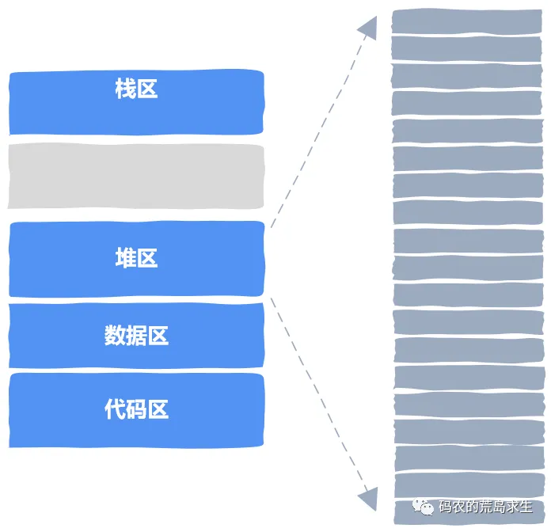

所以主要就是分配内存（malloc）以及释放内存（free）的问题。

而**分配内存首先得找到空闲的内存块**，一般使用一个地址（32位操作系统）来进行作为一个规定的结构header来进行说明，header包含内存块大小信息和分配状态标记(已分配/空闲)，header一般用32位，31位记录块大小，1位标记分配状态。


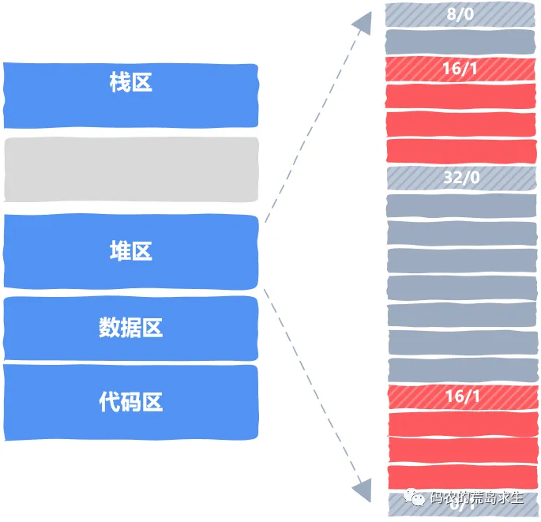

通过header知道有哪些空闲内存块之后，选择哪些空闲内存块就是个难题了，408之中有4种内存分配方法，

第1种首次适应，每次从头开始寻找合适的内存块，如果合适就分配，实践证明有很少的内存碎片，这种是最好的。

第2个邻近适应，是第1种的改良版，从上一次分配的内存快开始寻找合适的而不用每次从头开始遍历，所以分配内存快速度比较快，但是好像内存碎片一般要多一些，重点还是使用效率，所以不如上面。

第3最佳适应算法，遍历所有空闲块，将满足条件的最小块用来创建，看似最好其实一般般，因为实践表明有较多的内存碎片。

第4种就是最坏适应算法，这上面是一种极端了，每次将最大的内存进行创建，这种还真人如其名因为导致没有足够的空间分配给量连续的结构（比如大数组）。

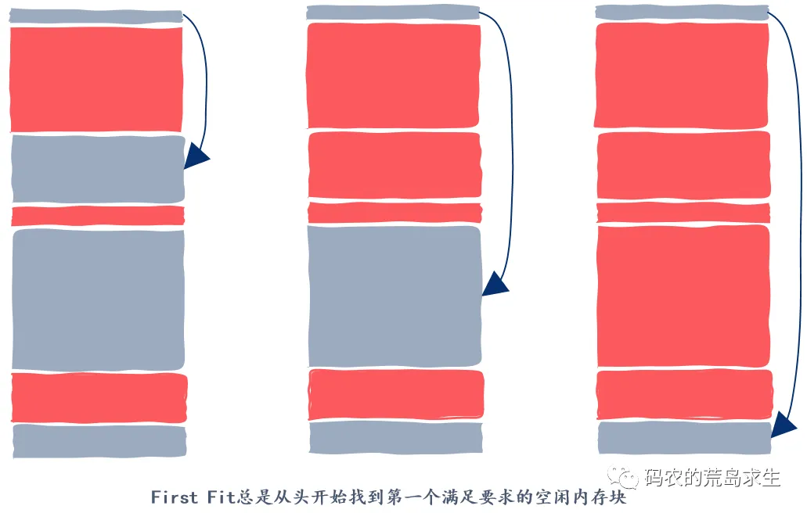


找到满足的内存块之后，就要进行分配，对于剩余的空间也要充分利用，即**剩余的部分同样要标记剩余所拥有的空闲块大小，以便于下次再分配。**如下图，至此malloc函数就完成了。

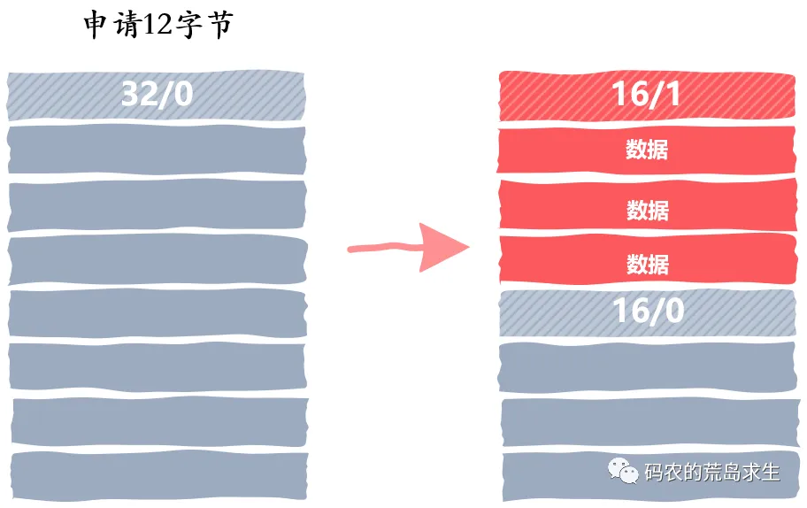


但是free()不能仅仅的将header的末尾标记为0，那样的话内存空间得不到充分利用，因为如果我再申请一个20字节的空间大小，这两个都不能满足。这同样也是典型的内部碎片问题，所以要进行合并。

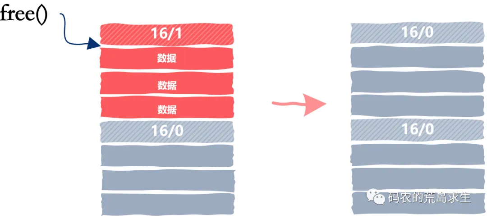

对于合并的话有两种想法，第一等到空间不满足的时候再进行合并，这种思路的话，显然释放内存的速度会更快，但代价是随着可能程序运行时间的增加可能后续大多数分配内存也会会因为内存过多，然后又要需要额外的合并操作。

第二就是只要释放内存就向前和向后进行寻求合并，向后寻求合并很简单header标记了当前块的占用大小，按照指示马上能找到下一个块儿的header，但是前一个块不知道该怎么寻找，解决方法很简单再加上一个footer。和header内容相同。

```java
[A的header][A的数据...][A的footer] [B的header][B的数据...][B的footer] [C的header][C的数据...][C的footer]
```

B的header上面就是A的footer如果a是空闲的，那么很快就能找到a的header然后一起合并，完美解决，这就实现了一个简单的malloc()。

当然现实中，C语言的malloc()在此基础上增加了非常多的操作，但是基本原理如上相同。


**Q：等等，为什么第2部的寻找空闲内存快，不用一个空闲链表来进行？**

A：因为创建链表不可避免的要申请内存，申请内存就需要通过内存分配器，可是你要实现的就是一个内存分配器，你没有办法向一个还没有实现的内存分配器申请内存。


#### malloc 1KB和1MB 有什么区别？

malloc() 源码里默认定义了一个阈值：

- 如果用户分配的内存小于 128 KB，则通过 `brk() 系统调用` 申请内存；
- 如果用户分配的内存大于 128 KB，则通过 `mmap() 系统调用` 申请内存；

注意，不同的 `glibc` （Linux 系统中最基础和最重要的系统库）版本定义的阈值也是不同的。


#### 介绍一下brk，mmap

实际上，malloc() 并不是系统调用，而是 C 库里的库函数，本质上还是根据策略来选择`brk() `和`mmap()`系统调用用于动态分配内存。


##### 1. 通过 brk() 系统调用从堆分配内存

brk() 系统调用实现的方式很简单，就是通过将「堆顶」指针向高地址移动，获得新的内存空间。如下图：

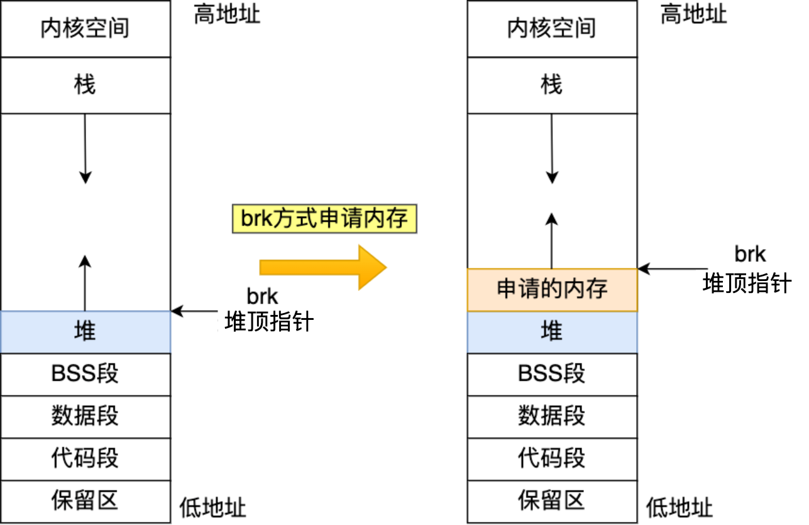


##### 2. 通过 mmap() 系统调用在文件映射区域分配内存；

通过 mmap() 系统调用中「私有匿名映射」的方式，在文件映射区分配一块内存，也就是从文件映射区“偷”了一块内存。如下图：

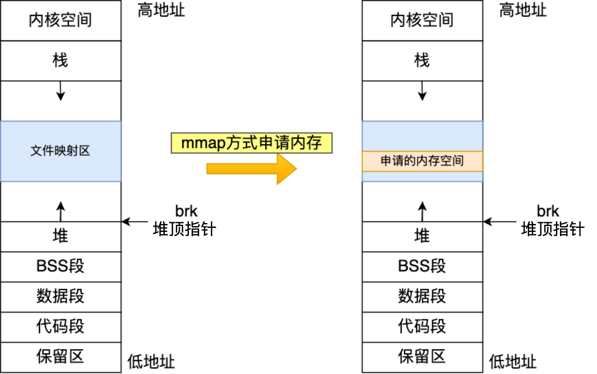


#### 操作系统内存不足的时候会发生什么？*

应用程序通过 malloc 函数申请内存的时候，实际上申请的是虚拟内存，此时并不会分配物理内存。

只有当应用程序读写了这块虚拟内存，CPU 就会去访问这个虚拟内存， 这时会发现这个虚拟内存没有映射到物理内存， CPU 就会产生**缺页中断**，进程会从用户态切换到内核态，并将缺页中断交给内核的缺页中断处理程序处理。

**内核的缺页中断处理程序首先会看是否有空闲的物理内存，如果有，就直接分配物理内存，并建立虚拟内存与物理内存之间的映射关系。但如果还不能满足就会进行第2步杀死进程。**

缺页中断处理程序申请物理内存的过程如下图：


##### **1. 回收内存**

如果没有空闲的物理内存，那么内核就会开始进行**回收内存**的工作，回收的方式主要是两种：直接内存回收和后台内存回收。

- **后台内存回收**（kswapd）：在物理内存紧张的时候，会唤醒 `kswapd` 内核线程来回收内存，这个回收内存的过程**异步**的，不会阻塞进程的执行。
- **直接内存回收**（direct reclaim）：如果后台异步回收跟不上进程内存申请的速度，就会开始直接回收，这个回收内存的过程是**同步**的，会阻塞进程的执行。


##### 2. OOM Killer 机制

如果直接内存回收后，空闲的物理内存仍然无法满足此次物理内存的申请，那么内核**触发 OOM （Out of Memory）机制**。

OOM Killer 机制会根据算法选择一个占用物理内存较高的进程，然后将其杀死，以便释放内存资源，如果物理内存依然不足，OOM Killer 会继续杀死占用物理内存较高的进程，直到释放足够的内存位置。


**Q：第1步回收内存时，具体哪些内存是被回收？**

A：主要有两类内存可以被回收，而且它们的回收方式也不同。

- **文件页**（File-backed Page）：内核缓存的磁盘数据（Buffer）和内核缓存的文件数据（Cache）都叫作文件页。大部分文件页，都可以直接释放内存，以后有需要时，再从磁盘重新读取就可以了。而那些被应用程序修改过，并且暂时还没写入磁盘的数据（也就是脏页），就得先写入磁盘，然后才能进行内存释放。所以，**回收干净页的方式是直接释放内存，回收脏页的方式是先写回磁盘后再释放内存**。
- **匿名页**（Anonymous Page）：这部分内存没有实际载体，不像文件缓存有硬盘文件这样一个载体，比如堆、栈数据等。这部分内存很可能还要再次被访问，所以不能直接释放内存，它们**回收的方式是通过 Linux 的 Swap 机制**，Swap 会把不常访问的内存先写到磁盘中，然后释放这些内存，给其他更需要的进程使用。再次访问这些内存时，重新从磁盘读入内存就可以了。

文件页和匿名页的回收都是**基于 LRU 算法**，也就是优先回收不常访问的内存。LRU 回收算法，实际上维护着 active 和 inactive 两个双向链表，其中：

- **active_list** 活跃内存页链表，这里存放的是最近被访问过（活跃）的内存页；
- **inactive_list** 不活跃内存页链表，这里存放的是很少被访问（非活跃）的内存页；

越是常访问的页面会被保留在 **active_list** 中，越不常访问的页面会被移到 **inactive_list** 中。LRU 算法的目的是在回收内存时优先淘汰不活跃的内存页面，即从 **inactive_list** 中选择页面进行回收。


**Q：为什么不直接使用一个双端队列，每次淘汰队尾的元素（即最不常访问的内存），而每次访问就插入队头？（了解即可）**

A：**总结一句话就是严格的 LRU 算法（一个双端队列）在实现上需要维护一个完整的链表，每次访问内存时都需要移动链表中的节点，这样会引起很大的性能开销。**

1. **优化回收逻辑**：
   - 在实际的内存管理中，系统不仅需要区分“活跃”和“不活跃”的内存，还需要处理脏页（即已经被修改过但还没有写回磁盘的页面）。因此，**active_list** 和 **inactive_list** 的双链表设计可以清晰地分离这些内存区域，避免混乱。
   - 如果只用一个双端队列，系统在访问页面时需要在队列中查找并移动数据，这会使得活跃页面和不活跃页面之间的区分变得模糊，导致回收时无法优先回收不常用的页面，从而影响内存回收的效率。
2. **性能优化：减少移动和查找的开销**：
   - 如果每次访问都将页面插入队头，假设页面已经存在队尾，那么如果这个页面在以后被访问，就需要从队尾移动到队头，这就带来了额外的成本。而在 **active_list** 和 **inactive_list** 中，页面一旦被判定为不活跃，就直接被转移到 **inactive_list**，避免了频繁的移动。
   - 另外，如果我们用一个双端队列，管理上会变得复杂：一方面需要确保每次访问时插入队头，另一方面需要维护一个额外的机制来区分哪些是活跃的、哪些是非活跃的。这就增加了代码复杂度和维护的成本。
3. **更精细的内存回收管理**：
   - 使用两个链表后，可以精确地对活跃和不活跃内存做更加细致的控制。例如，当内存压力较大时，可以优先回收 **inactive_list** 中的页面，而 **active_list** 中的页面不太容易被回收，确保系统的性能不会因为频繁回收活跃页面而受到影响。
4. **脏页的处理**：
   - **inactive_list** 中的内存页除了可以被回收外，还可能包含“脏页”，即已经被修改但尚未写回磁盘的页。在回收之前，需要先将这些脏页写回磁盘，避免数据丢失。如果全部放在一个双端队列中，处理脏页和清理页面的逻辑会变得更复杂和低效。


#### 页面置换有哪些算法？

页面置换算法的功能是，**当出现缺页异常，需调入新页面而内存已满时，选择被置换的物理页面**，也就是说选择一个物理页面换出到磁盘，然后把需要访问的页面换入到物理页。

那其算法目标则是，尽可能减少页面的换入换出的次数，常见的页面置换算法有如下几种：

- 最佳页面置换算法（*OPT*）
- 先进先出置换算法（*FIFO*）
- 最近最久未使用的置换算法（*LRU*）
- 时钟页面置换算法（*Lock*）
- 最不常用置换算法（*LFU*）


##### 1. 最佳页面置换算法

最佳页面置换算法基本思路是，**置换在「未来」最长时间不访问的页面**。

所以，该算法实现需要计算内存中每个逻辑页面的「下一次」访问时间，然后比较，选择未来最长时间不访问的页面。

我们举个例子，假设一开始有 3 个空闲的物理页，然后有请求的页面序列，那它的置换过程如下图：

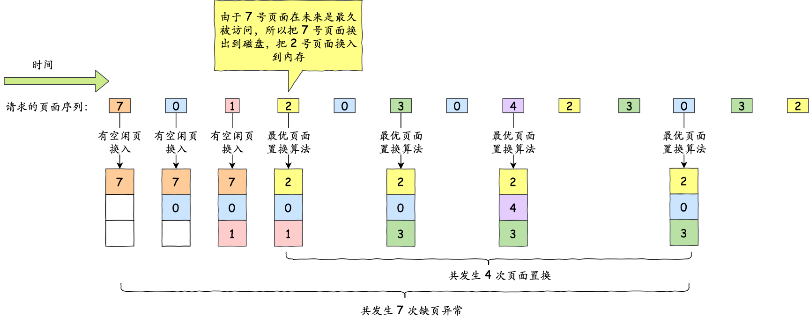

在这个请求的页面序列中，缺页共发生了 `7` 次（空闲页换入 3 次 + 最优页面置换 4 次），页面置换共发生了 `4` 次。

这很理想，但是实际系统中无法实现，因为程序访问页面时是动态的，我们是无法预知每个页面在「下一次」访问前的等待时间。

所以，最佳页面置换算法作用是为了衡量你的算法的效率，你的算法效率越接近该算法的效率，那么说明你的算法是高效的。


##### 2. 先进先出置换算法

既然我们无法预知页面在下一次访问前所需的等待时间，那我们可以**选择在内存驻留时间很长的页面进行中置换**，这个就是「先进先出置换」算法的思想。

还是以前面的请求的页面序列作为例子，假设使用先进先出置换算法，则过程如下图：

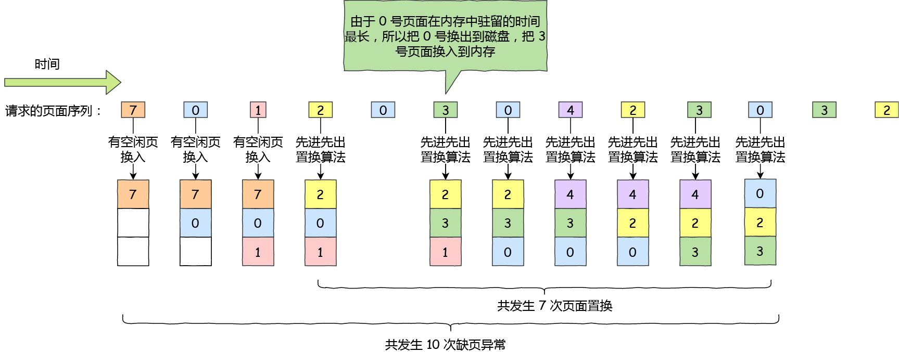

在这个请求的页面序列中，缺页共发生了 `10` 次，页面置换共发生了 `7` 次，跟最佳页面置换算法比较起来，性能明显差了很多。


##### 3. 最近最久未使用的置换算法

最近最久未使用（*LRU*）的置换算法的基本思路是，发生缺页时，**选择最长时间没有被访问的页面进行置换**，也就是说，该算法假设已经很久没有使用的页面很有可能在未来较长的一段时间内仍然不会被使用。

这种算法近似最优置换算法，最优置换算法是通过「未来」的使用情况来推测要淘汰的页面，而 LRU 则是通过「历史」的使用情况来推测要淘汰的页面。

还是以前面的请求的页面序列作为例子，假设使用最近最久未使用的置换算法，则过程如下图：

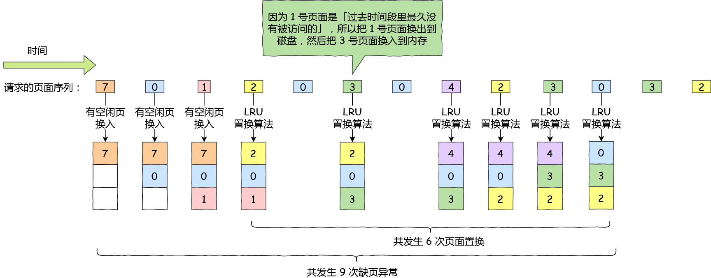

在这个请求的页面序列中，缺页共发生了 `9` 次，页面置换共发生了 `6` 次，跟先进先出置换算法比较起来，性能提高了一些。

**虽然 LRU 在理论上是可以实现的，但代价很高。为了完全实现 LRU，需要在内存中维护一个所有页面的链表，最近最多使用的页面在表头，最近最少使用的页面在表尾。**

**困难的是，在每次访问内存时都必须要更新「整个链表」。在链表中找到一个页面，删除它，然后把它移动到表头是一个非常费时的操作。**

Linux 内核中对 LRU 算法进行了一系列优化，是Linux 进行内存页面置换的算法。


##### 4. 时钟页面置换算法

那有没有一种即能优化置换的次数，也能方便实现的算法呢？

时钟页面置换算法就可以两者兼得，它跟 LRU 近似，又是对 FIFO 的一种改进。

该算法的思路是，把所有的页面都保存在一个类似钟面的「环形链表」中，一个表针指向最老的页面。

当发生缺页中断时，算法首先检查表针指向的页面：

- 如果它的访问位位是 0 就淘汰该页面，并把新的页面插入这个位置，然后把表针前移一个位置；
- 如果访问位是 1 就清除访问位，并把表针前移一个位置，重复这个过程直到找到了一个访问位为 0 的页面为止；

我画了一副时钟页面置换算法的工作流程图，你可以在下方看到：

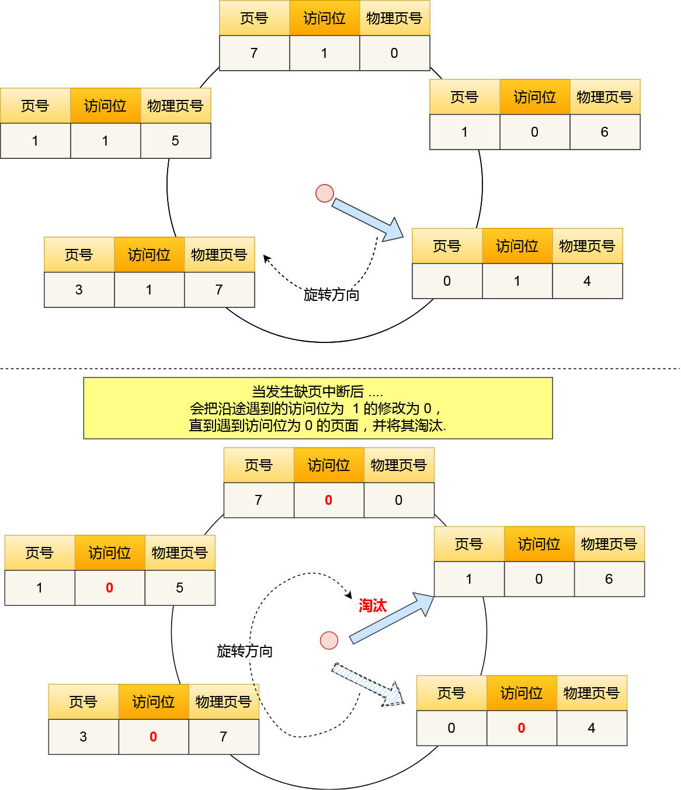

所以这个算法的工作方式很像时钟被称为时钟（*Clock*）算法。


##### 5. 最不常用算法

最不常用（*LFU*）算法，这名字听起来很调皮，但是它的意思不是指这个算法不常用，而是**当发生缺页中断时，选择「访问次数」最少的那个页面，并将其淘汰**。

它的实现方式是，对每个页面设置一个「访问计数器」，每当一个页面被访问时，该页面的访问计数器就累加 1。在发生缺页中断时，淘汰计数器值最小的那个页面。

看起来很简单，每个页面加一个计数器就可以实现了，但是在操作系统中实现的时候，我们需要考虑效率和硬件成本的。

要增加一个计数器来实现，这个硬件成本是比较高的，另外如果要对这个计数器查找哪个页面访问次数最小，查找链表本身，如果链表长度很大，是非常耗时的，效率不高。

而且，LFU 算法只考虑了频率问题，没考虑时间的问题，比如有些页面在过去时间里访问的频率很高，但是现在已经没有访问了，而当前频繁访问的页面由于没有这些页面访问的次数高，在发生缺页中断时，就会可能会误伤当前刚开始频繁访问，但访问次数还不高的页面。（但这个问题的解决的办法还是有的，可以定期减少访问的次数，比如当发生时间中断时，把过去时间访问的页面的访问次数除以 2，也就说，随着时间的流失，以前的高访问次数的页面会慢慢减少，相当于加大了被置换的概率）


**Q：Linux 是怎么优化 LRU 策略的？**

A：Linux 内核使用了两条双向链表来实现 LRU ，拥有相比一条双向链表更高的性能。

- **active_list**：存储最近被访问过的活跃内存页。
- **inactive_list**：存储很少被访问的、不活跃的内存页。

Linux 内核并不会维护一个严格的、单一的链表来记录每个页面的访问顺序，因为这样会带来较大的性能开销。相反，Linux 使用 **软 LRU**（Soft LRU）机制，通过以下方式降低性能损耗：

- **活跃标记**：每个页面有一个活跃标记，用来指示该页面是否被频繁访问。如果页面被访问过，它会被标记为活跃，并移动到 `active_list` 中；如果页面长时间未被访问，它会被移到 `inactive_list` 中。
- **软 LRU 链表管理**：内核只在 **active_list** 和 **inactive_list** 之间进行页面的移动。页面的“活跃程度”由这些链表的头尾位置来决定，而不需要每次都重新排序整个链表。
- **页面回收**：在内存回收时，内核优先从 `inactive_list` 中回收不活跃的页面，而 `active_list` 中的页面则保留较长时间，以免频繁回收活跃页面。

**两个链表的软LRU实现帮助内核更高效地管理内存页面**，并实现内存回收。内核通过检查页面的活跃度，将活跃的页面保留在 `active_list` 中，将不活跃的页面移动到 `inactive_list` 中。


### 中断

#### 什么是中断？*

中断可以理解为**CPU停下当前的工作任务，去处理其他事情，处理完后回来继续执行刚才的任务**。中断分为外部中断和内部中断。


##### 1. 外部中断

外部中断分为可屏蔽中断和不可屏蔽中断：

- **可屏蔽中断**：**通过INTR线向CPU请求的中断**，主要来自外部设备如硬盘，打印机，网卡等。此类中断并不会影响系统运行，可随时处理，甚至不处理，所以名为可屏蔽。
- **不可屏蔽中断**：**通过NMI线向CPU请求的中断**，如电源掉电，硬件线路故障等。这里不可屏蔽的意思不是不可以屏蔽，不建议屏蔽，而是问题太大，屏蔽不了，不能屏蔽的意思。

**注：INTR和NMI都是CPU的引脚**


##### 2. 内部中断

内部中断分为陷阱、故障、终止：

- **陷阱：是一种有意的，预先安排的异常事件**，一般是在编写程序时故意设下的陷阱指令，而后执行到陷阱指令后，CPU将会调用特定程序进行相应的处理，**处理结束后返回到陷阱指令的下一条指令**。**如系统调用**，程序调试功能等。如**printf函数，最底层的实现中会有一条int 0x80指令**，这就是一条陷阱指令，使用0x80号中断进行系统调用。
- **故障：故障是在引起故障的指令被执行，但还没有执行结束时，CPU检测到的一类的意外事件。**出错时交由故障处理程序处理，**如果能处理修正这个错误，就将控制返回到引起故障的指令即CPU重新执这条指令。如果不能处理就报错**。**常见的故障为缺页**，当CPU引用的虚拟地址对应的物理页不存在时就会发生故障。缺页异常是能够修正的，有着专门的缺页处理程序，它会将缺失的物理页从磁盘中重新调进主存。而后再次执行引起故障的指令时便能够顺利执行了。
- **终止：执行指令的过程中发生了致命错误，不可修复，程序无法继续运行，只能终止，比如整除0。**终止处理程序不会将控制返回给原程序，而是直接终止原程序。


#### 讲讲中断的流程

以下是中断的基本流程：

- **发生中断**：当外部设备或者软件程序需要处理器的注意或者响应时，会发出中断信号。处理器在接收到中断信号后，在每一条指令周期的中断周期执行关中断，保存断点（寄存器）并中断响应。
- **中断响应**：处理器接收到中断信号后，会根据中断向量表找到对应的中断处理程序的入口地址。 中断服务程序的任务根据具体中断类型不同而不同，但会保存当前执行现场（栈、堆等），处理中断，完成后恢复现场。
- **返回中断前的状态**：处理器从中断处理程序返回后，会恢复执行中断前的程序。此时，处理器会从栈中弹出保存的现场，恢复程序计数器和寄存器等状态，确保中断前的程序状态不变，并开启中断。


注：**在一些高级处理器中，中断可能会发生嵌套**，尤其是在中断有优先级的情况下。例如，低优先级的中断可能会被更高优先级的中断打断并处理。中断嵌套通常通过 **中断优先级管理** 来控制，以确保高优先级中断的处理不被低优先级中断阻塞。


#### 中断的类型有哪些？

中断分为外部中断和内部中断。

##### 1. 外部中断

外部中断分为可屏蔽中断和不可屏蔽中断：

- **可屏蔽中断**：**通过INTR线向CPU请求的中断**，主要来自外部设备如硬盘，打印机，网卡等。此类中断并不会影响系统运行，可随时处理，甚至不处理，所以名为可屏蔽。
- **不可屏蔽中断**：**通过NMI线向CPU请求的中断**，如电源掉电，硬件线路故障等。这里不可屏蔽的意思不是不可以屏蔽，不建议屏蔽，而是问题太大，屏蔽不了，不能屏蔽的意思。

**注：INTR和NMI都是CPU的引脚**


##### 2. 内部中断

内部中断分为陷阱、故障、终止：

- **陷阱：是预先安排的异常事件**，在编写程序时故意设下的陷阱指令，而后执行到陷阱指令后，CPU将会调用特定程序进行相应的处理，**处理结束后返回到陷阱指令的下一条指令**。**如系统调用**，程序调试功能等。如**printf函数，最底层的实现中会有一条int 0x80指令**，这就是一条陷阱指令，使用0x80号中断进行系统调用。
- **故障：故障是在引起故障的指令被执行，但还没有执行结束时，CPU检测到的一类的意外事件。**出错时交由故障处理程序处理，**如果能处理修正这个错误，就将控制返回到引起故障的指令即CPU重新执这条指令。如果不能处理就报错**。**常见的故障为缺页**，当CPU引用的虚拟地址对应的物理页不存在时就会发生故障。缺页异常是能够修正的，有着专门的缺页处理程序，它会将缺失的物理页从磁盘中重新调进主存。而后再次执行引起故障的指令时便能够顺利执行了。
- **终止：执行指令的过程中发生了致命错误，不可修复，程序无法继续运行，只能终止，比如整除0。**终止处理程序不会将控制返回给原程序，而是直接终止原程序。


#### 中断的作用是什么？

中断使得计算机系统具备应对对处理突发事件的能力。

中断是操作系统实现并发的基础，而且引入中断之后CPU和l/O设备就可并行了，提高了CPU的工作效率。

总之中断的优点如下，

- **提高 CPU 的利用率**：CPU 可以在不需要等待设备完成任务的情况下继续执行其他工作，避免了闲置时间。
- **响应性强**：中断机制使得操作系统能够在硬件设备或外部事件发生时及时响应，提高了系统的实时性和交互性。
- **简化编程模型**：使用中断可以让开发者不需要手动轮询硬件设备或事件状态，程序可以通过中断来自动响应外部或内部的事件。


### 网络 i/o

#### 你了解过哪些io模型？*

**网络IO模型** 是用于描述网络应用程序中 **数据通信流程** 和 **事件处理机制** 的设计方式。

| **模型**           | **工作机制**                                                 | **缺点**                           | **优势与适用场景**                                           |
| ------------------ | ------------------------------------------------------------ | ---------------------------------- | ------------------------------------------------------------ |
| **阻塞 I/O**       | 调用 `read/write` 时线程阻塞，直到数据就绪并完成拷贝。       | 并发能力差，线程资源浪费。         | **简单直接**，适合低并发场景或快速原型开发（如教学示例）。   |
| **非阻塞 I/O**     | 调用 `read/write` 立即返回，需轮询检查状态（返回 `EAGAIN` 时重试）。 | 轮询消耗 CPU，延迟高。             | **线程可处理其他任务**，但实际很少单独使用，通常配合 I/O 多路复用（如 `epoll`）。 |
| **I/O 多路复用**   | 通过 `select/poll/epoll` 监听多个 fd，就绪后通知应用程序调用 `read/write`。 | 数据拷贝仍需同步操作。             | **高并发核心方案**，单线程可管理数万连接（如 Nginx、Redis），平衡性能与复杂度。 |
| **信号驱动 I/O**   | 内核通过信号（如 `SIGIO`）通知数据就绪，再调用 `read/write`。 | 信号处理复杂，可靠性低。           | **避免轮询**，但适用性窄，现代高并发程序更倾向用 `epoll`。   |
| **异步 I/O (AIO)** | 调用 `aio_read/aio_write` 提交请求后立即返回，内核完成所有操作后回调通知。 | 实现复杂，Linux 对网络支持不完善。 | **真正的零阻塞**，适合高频磁盘 I/O（如数据库），Windows 的 `IOCP` 是成熟实现。但 Linux 更推荐 `epoll`+线程池。 |

网络I/O本质上就是对socket连接进行读写操作（在Linux中遵循"一切皆文件"的理念，每个socket都有对应的文件描述符），以及处理socket连接事件的等待机制。

从本质上理解：

**阻塞I/O**在等待数据就绪阶段会导致性能显著下降，因为线程被完全阻塞无法做其他工作。

**非阻塞I/O**虽然在等待上不会阻塞线程，但由于需要持续主动轮询检查状态，导致CPU消耗很高。

这两种模式确实类似于互斥锁（通过阻塞等待）和自旋锁（通过忙等待）的区别。

**I/O多路复用**巧妙地将等待任务委托给操作系统内核，应用程序把需要监听的事件及对应的连接注册到内核中，内核在检测到相应事件后通过回调机制将就绪的事件放入队列，然后由应用程序主动获取。这种方式克服了前两种模型在等待阶段的缺点，但数据仍然需要从内核缓冲区拷贝到用户缓冲区。

**异步I/O**是完全异步的模型，应用程序将等待和数据拷贝两个任务都交给内核处理。当网络数据准备就绪并已拷贝到用户缓冲区后，内核才通过回调机制通知应用程序。应用程序可以直接使用数据而无需进行额外的拷贝操作，因此特别适合高并发场景。


#### 服务器处理并发请求有哪几种方式？*

**多进程 / 多线程 Web 服务器**  

服务器通过创建多个进程或线程来处理并发请求。每个进程或线程负责一个连接，适合中等并发负载。这是**阻塞 I/O 模型**的典型使用方式。多进程适用于高隔离场景，多线程则在资源共享上更高效，但在大规模并发时会显著消耗系统资源。


**I/O 多路复用 Web 服务器（事件驱动）**  

使用非阻塞 I/O 或多路复用技术（如 `select` / `poll` / `epoll`），在单线程中同时处理多个连接。性能高、资源消耗低，适合处理大量并发连接。缺点是代码复杂度较高，需细致管理 I/O 状态。**典型代表：Redis、Node.js。**

**多路复用 + 多线程 / 多进程 Web 服务器（混合模型）**  

结合多路复用与多线程或多进程，每个工作线程或子进程内部使用 I/O 多路复用技术，兼顾高并发与多核 CPU 的利用率。这种模型广泛用于现代高性能服务器架构中。  

- **多线程代表：Netty（epoll + 线程池）**  
- **多进程代表：Nginx（主进程 + 多个 worker 进程监听同一端口）**

| **方式**                       | **特点**                                                     | **优点**                                         | **缺点**                                         | **适用场景**                                      |
| ------------------------------ | ------------------------------------------------------------ | ------------------------------------------------ | ------------------------------------------------ | ------------------------------------------------- |
| **多进程 / 多线程**            | 每个连接由一个独立的进程或线程处理，基于阻塞 I/O。           | 编程简单，可并行处理多个请求，充分利用多核 CPU。 | 系统资源开销大，线程/进程调度成本高。            | 中等并发，负载不极高的应用。                      |
| **I/O 多路复用（事件驱动）**   | 单线程通过 epoll 等机制监听多个连接并且处理他们的情绪，使用非阻塞 I/O。 | 高效、资源占用低，适合大量连接的场景。           | 开发复杂，需管理 I/O 状态机。                    | 高并发、I/O 密集型服务（如 Redis）。              |
| **多路复用 + 多线程 / 多进程** | 多核并发，线程 / 进程内再使用 I/O 多路复用，兼具并行性与高并发。 | 性能最优，适应各种复杂业务场景。                 | 架构复杂，需要良好设计线程池、连接池等资源管理。 | 高吞吐、低延迟、超高并发场景（如 Netty、Nginx）。 |


#### 讲一下io多路复用

**多路**指的是多个网络连接客户端，**复用**指的是复用同一个线程(也就是单进程处理）。

I/O 多路复用其实是使用一个线程来检查多个 Socket 的就绪状态，在单个线程中通过记录跟踪每一个 socket（I/O流）的状态来管理处理多个 I/O 流。如下图是的 I/O 多路复用模型：


- 每个客户端和服务端之间的 Socket 连接会生成一个套接字描述符（Socket FD）。Linux万物都是文件，因为Socket也可以理解为读和写和文件非常类似，所以Socket 描述符也是文件描述符的一种。
- **监听列表**：I/O 多路复用模块将多个文件描述符（即 Socket FD）注册到一个监听列表中。这个监听列表可以是一个队列，也可以是一个数组或其他数据结构，具体由操作系统和实现决定。
- **事件驱动**：I/O 多路复用模块会在后台循环地检查这些文件描述符的状态（如是否可读、可写、异常）。如果有文件描述符的状态发生变化（如某个客户端发送了数据），则将对应的事件通知给上层应用。
- 收到I/O 多路复用模块通知后文件事件处理器就会回调 FD 绑定的事件处理器进行处理相关命令操作。


#### 什么是操作系统的回调？回调的底层机制是什么东西？*

**回调（Callback）** 是一种编程模式，其中某个函数（回调函数）被传递给其他代码，以便在特定事件或条件发生时被调用。

在操作系统中，回调通常用于处理异步事件，如，

**硬件中断，**当设备（如键盘、网卡）完成操作时，触发硬件中断，内核会使得CPU暂停当前任务，调用对应的回调函数处理数据。

**I/O完成通知，**应用程序发起异步I/O请求（如`aio_read`），内核完成后通过回调函数通知用户态。


底层其实是操作系统的中断处理逻辑，驱动程序或用户程序需提前向内核注册回调函数（如通过绑定中断向量的方式，所以内核也有部分函数是回调函数），根据某种事件发生触发中断逻辑，就会由内核执行相应逻辑。


比如**回调在 epoll 中的作用**，当某个 fd 上的 I/O 事件（如可读、可写）发生时，前提肯定是网卡接收到数据后，触发中断，然后数据从网卡缓冲区拷贝到内核的 socket 接收缓冲区，接着内核调用 epoll 注册的 **回调函数（内部实现）**，将该 fd 对应的 epoll 项（红黑树中的节点）移动到就绪链表，完成操作。


**Q：操作系统的回调和Java Future的回调机制有什么区别？**

A：Java Future 回调则通过线程池、事件循环在用户态执行，属于高级异步编程模型。任务完成后，线程池中的线程会执行回调，而用户可以主动调用 `get()` 方法等待结果（包括也是submit的方法，说明这个方法内部创建了一个对象来储存结果，然后赋值，然后把这个对象返回就是了，然后通过这个对象get获得结果）。由 JVM 和操作系统调度管理。

而操作系统回调直接由硬件中断和内核调度触发，低延迟、实时性高；


#### select、poll、epoll 的区别是什么？

**select/poll/epoll OS内核提供给用户态的I/O 多路复用系统调用**，进程可以通过一个系统调用函数从内核中获取多个事件。

select/poll/epoll 在获取事件时，先把所有连接（文件描述符）传给内核，再由内核监测这些连接的状态是否变化，然后会通知用户态的进程中再处理这些连接对应的请求。


##### 1. select/poll

select 实现多路复用的方式有三步，

1. 将已连接的 Socket 都放到一个**文件描述符集合**，然后调用 select 函数将文件描述符集合**拷贝**到内核里。

2. 随后让内核来检查是否有网络事件产生，检查的方式很粗暴，就是通过**遍历**文件描述符集合的方式，当检查到有事件产生后，将此 Socket 标记为可读或可写。

3. 接着再把整个文件描述符集合**拷贝**回用户态里，然后用户态还需要再通过**遍历**的方法找到可读或可写的 Socket，然后再对其处理。

**poll 和 select 实现多路复用过程中并没有太大的本质区别**,仅仅在文件描述符集合两者有细微的差别。

select 使用固定长度的 BitsMap，表示文件描述符集合，而且所支持的文件描述符的个数是有限制的，在 Linux 系统中，由内核中的 FD_SETSIZE 限制， 默认最大值为 1024，只能监听 0~1023 的文件描述符。

poll 不再用 BitsMap 来存储所关注的文件描述符，取而代之用动态数组，以链表形式来组织，突破了 select 的文件描述符个数限制，当然还会受到系统文件描述符限制。


对于 select/poll 这种方式，需要进行 **2 次「遍历」文件描述符集合**，一次是在内核态里，一个次是在用户态里 ，而且还会发生 **2 次「拷贝」文件描述符集合**，先从用户空间传入内核空间，由内核修改后，再传出到用户空间中， 时间复杂度为 O(n)，所以他们的性能并不高，这种方式随着并发数上来，性能的损耗会呈指数级增长。


##### 2. epoll

epoll 的用法在源码层次下，先用`epoll_create` 创建一个 `epoll`对象 `epfd`，应用程序通过 `epoll_ctl` 将需要监视的文件描述符和对应的事件（如可读、可写、错误等）添加到 `epfd`中，最后应用程序调用 `epoll_wait` 获得数据。

```c
int s = socket(AF_INET, SOCK_STREAM, 0);
bind(s, ...);
listen(s, ...)

int epfd = epoll_create(...);
epoll_ctl(epfd, ...); //将所有需要监听的socket添加到epfd中

while(1) {
    int n = epoll_wait(...);
    for(接收到数据的socket){
        //处理
    }
}
```

epoll 通过两个方面，很好解决了 select/poll 的问题。

- *第一点*，epoll 在内核里使用**红黑树来跟踪进程所有待检测的文件描述字**，把需要监控的 socket 通过 `epoll_ctl()` 函数加入内核中的红黑树（增删改一般时间复杂度是 O(logn) ）。因为在内核维护了红黑树，可以保存所有待检测的 socket ，所以只需要传入一个待检测的 socket，减少了内核和用户空间大量的数据拷贝和内存分配。
- *第二点*， epoll 使用**事件驱动**的机制，内核里**维护了一个链表来记录就绪事件**。当某个 socket 有事件发生时，通过**回调函数**内核会将其加入到这个就绪事件列表中，当用户调用 `epoll_wait()` 函数时，只会返回有事件发生的文件描述符的个数，不需要像 select/poll 那样轮询扫描整个 socket 集合，大大提高了检测的效率。

从下图你可以看到 epoll 相关的接口作用：

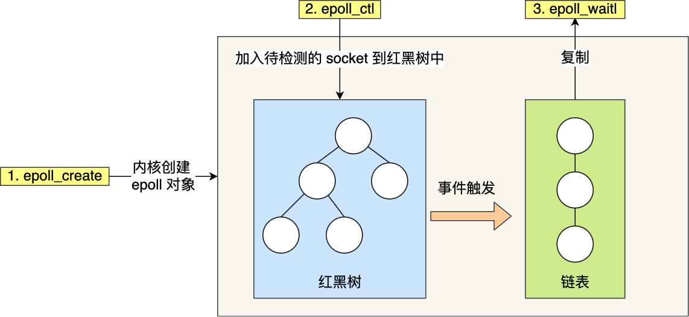

epoll 的方式即使监听的 Socket 数量越多的时候，效率不会大幅度降低，能够同时监听的 Socket 的数目也非常的多了，上限就为系统定义的进程打开的最大文件描述符个数。因而，**epoll 被称为解决 C10K 问题的利器**。


**Q：什么是C10K 问题？**

A：**C10K 问题**（"C" 表示 "Connection"，10K 表示 10,000）是指在 Web 服务器中，如何高效地处理 10,000 个并发连接的问题。这一问题最早出现在 1990 年代末，是由 **Daniel J. Bernstein** 提出的。

在早期的 Web 服务器架构中，由于每个客户端请求通常都被分配给一个独立的线程或进程（如线程 per 连接模型），当并发连接数达到数千时，操作系统的资源（如内存、CPU）和管理开销（如线程切换、进程创建与销毁）就会成为瓶颈，导致服务器性能下降，甚至崩溃。

基于 epoll 的I/O多路复用，就很好解决了C10K 问题。


#### epoll 的 边缘触发和水平触发有什么区别？

前面提到epoll 使用**事件驱动**的机制，当文件描述符状态改变时`epoll`的文件事件处理器会通知应用程序来处理，具体怎么通知就是触发模式的问题。

`epoll` 提供了两种触发模式：**水平触发（Level Triggered，LT）** 和 **边缘触发（Edge Triggered，ET）**。这两种模式的区别主要在于事件通知的方式和处理方式，决定了程序如何响应 I/O 事件。

##### 1. 水平触发（Level Triggered, LT）

**水平触发**是 `epoll` 的默认模式，它基于“事件处于激活状态时，继续通知”的原则。具体来说，当某个文件描述符（如 socket）有数据可读或可写时，`epoll` 会持续地将该文件描述符的事件通知到应用程序，直到应用程序读取或写入数据为止。

- **行为**：如果某个文件描述符的事件已被触发（例如，数据可读），即使程序没有立即处理这个事件，`epoll` 仍然会再次通知你，直到你处理了这个事件。
- **适用场景**：适用于大多数应用场景，尤其是当处理每个事件时需要确保读取或写入足够的数据时。
- 优点： 
  - 简单易懂，容易实现。
  - 更容易进行流量控制，应用程序能获得更多通知。
- 缺点： 
  - 如果应用程序没有及时处理数据，`epoll` 会一直通知它，导致重复的事件通知，这可能会产生不必要的性能开销。


##### 2. 边缘触发（Edge Triggered, ET）

**边缘触发**是 `epoll` 的一种高级模式，它基于“只有事件发生时才通知一次”的原则。具体来说，当某个文件描述符的事件第一次发生时，`epoll` 会通知应用程序，之后只有在事件状态发生变化时才会再次通知，直到事件处理完成。

- **行为**：一旦某个文件描述符的事件被触发（例如，有数据可读），`epoll` 只会在事件状态发生变化时才再次通知，且每个事件只能通知一次，直到应用程序彻底处理完该事件。
- **适用场景**：适用于需要高性能、低开销的场景，特别是对事件的重复通知不需要的情况下，能够减少不必要的操作。
- 优点： 
  - 通知次数少，减少了不必要的开销，适用于高并发场景。
  - 一旦事件被触发，应用程序只会收到一次通知，从而减少了系统调用的次数。
- 缺点： 
  - 程序需要对每个事件做“非阻塞”处理，并确保完全处理事件，否则可能错过后续的事件通知。
  - 编程模型较为复杂，要求开发者能够正确管理和处理事件的状态，防止漏掉事件。


| 特性         | 水平触发（LT）                                   | 边缘触发（ET）                               |
| ------------ | ------------------------------------------------ | -------------------------------------------- |
| **通知频率** | 一旦事件发生，持续通知直到事件被处理             | 事件发生时只通知一次，除非事件状态变化       |
| **适用性**   | 更简单，适用于大多数应用场景                     | 高性能场景，适用于需要减少系统调用的情况     |
| **事件处理** | 程序可以多次接收到事件通知，不需要每次都完全处理 | 需要确保每次都完全处理事件，否则可能错过通知 |
| **编程难度** | 相对简单，不需要特别注意事件的完整处理           | 需要精确处理事件，避免漏掉和重复处理事件     |
| **性能**     | 相对较低，因为可能会有大量的重复通知             | 较高，减少了不必要的通知，减少了系统调用次数 |


实际使用中，如果应用程序对每个事件的处理并不复杂，或者是需要做频繁的 I/O 操作的应用（如 Web 服务器），通常选择水平触发模式，因为它更简单且容易处理。

如果能够确保每次事件处理都不会漏掉时（例如，一次性读取所有数据）或者需要高性能，就采用边缘触发模式。这种模式通常适用于需要高吞吐量、减少不必要系统调用的场景，边缘触发是一个更高效的选择。


假设一个socket有100字节数据到达:

**水平触发(LT):**

1. 第一次`epoll_wait()`返回，通知有数据可读
2. 你读取了50字节
3. 再次调用`epoll_wait()`，它会再次返回这个socket，因为还有50字节未读
4. 直到你读完所有数据，每次`epoll_wait()`都会通知你

**边缘触发(ET):**

1. 第一次`epoll_wait()`返回，通知有数据可读
2. 你读取了50字节
3. 再次调用`epoll_wait()`，它不会返回这个socket的事件，即使还有50字节未读
4. 只有当新数据到达时，`epoll_wait()`才会再次通知你

因此，使用ET模式时，你通常需要在一个循环中使用非阻塞I/O，一次性读取或写入所有可用数据，直到返回EAGAIN或EWOULDBLOCK错误，表示暂时没有更多数据可处理。

这是为什么ET模式通常与非阻塞I/O一起使用，而LT模式则更简单，适合阻塞I/O操作（这里指的是文件描述符数据读取可以被设置为阻塞或非阻塞模式）。


#### redis，nginx，netty 是依赖什么做的这么高性能？

主要是依赖**Reactor 模式**实现了高性能网络模式，这个是在i/o多路复用接口基础上实现的了网络模型。Reactor 模式是**事件驱动** 的方式，将 I/O 的监听与处理分离，事件触发时调用回调处理程序（handler）。**Reactor 本身不处理事件**，它只负责将事件分发给合适的处理器。

其工作流程为

1. 一个线程运行 **Reactor**，监听所有的 I/O 事件（如 socket 连接、读写事件）。
2. 当事件到来时，Reactor 将事件分发给对应的事件处理器（Handler）。
3. 事件处理器（Handler）执行具体的业务逻辑。


Reactor 模式是灵活多变的，可以应对不同的业务场景，灵活在于：

- Reactor 的数量可以只有一个，也可以有多个；
- 处理资源池可以是单个进程 / 线程，也可以是多个进程 /线程；


##### 1. Redis

Redis 6.0 之前使用的 Reactor 模型就是单 Reactor 单进程模式。单 Reactor 单进程的方案因为全部工作都在同一个进程内完成，所以实现起来比较简单，不需要考虑进程间通信，也不用担心多进程竞争。

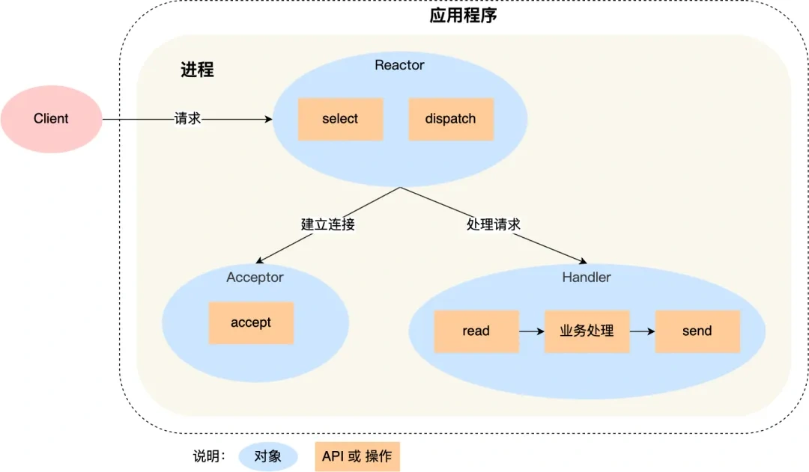

但是，这种方案存在 2 个缺点：

- 第一个缺点，因为只有一个进程，**无法充分利用 多核 CPU 的性能**；
- 第二个缺点，Handler 对象在业务处理时， Redis进程是无法处理其他连接的事件的，**如果业务处理耗时比较长，那么就造成响应的延迟**；

所以，单 Reactor 单进程的方案**不适用计算机密集型的场景，只适用于业务处理非常快速的场景**。

Redis 是由 C 语言实现的，在 Redis 6.0 版本之前采用的正是「单 Reactor 单进程」的方案，因为 **Redis 业务处理主要是在内存中完成，操作的速度是很快的，性能瓶颈不在 CPU 上，所以 Redis 对于命令的处理是单进程的方案。**

随着网络硬件设备的提升，逐渐的Redis性能瓶颈出现在网络IO上，Redis 6.0 版本之后采用了 Reactor 多线程方案，Redis6.0及之后的版本，在启动的时候，默认情况下会**创建 7 个线程**

1. 主线程，**接收客户端请求`->` 解析客户端请求`->` 执行命令进行读写操作`->` 将响应返回给客户端**这一最核心的任务
2. 文件关闭线程，接收主线程请求，异步关闭文件
3. 持久化线程，接收主线程请求，异步AOF刷盘持久化
4. 释放内存线程，接收主线程请求，释放Redis数据内存
5. 网络io线程1，默认情况下辅助主线程接收客户端请求
6. 网络io线程2，默认情况下辅助主线程接收客户端请求
7. 网络io线程3，默认情况下辅助主线程接收客户端请求


##### 2. Netty

Netty 是采用了多 Reactor 多线程方案，如下图：

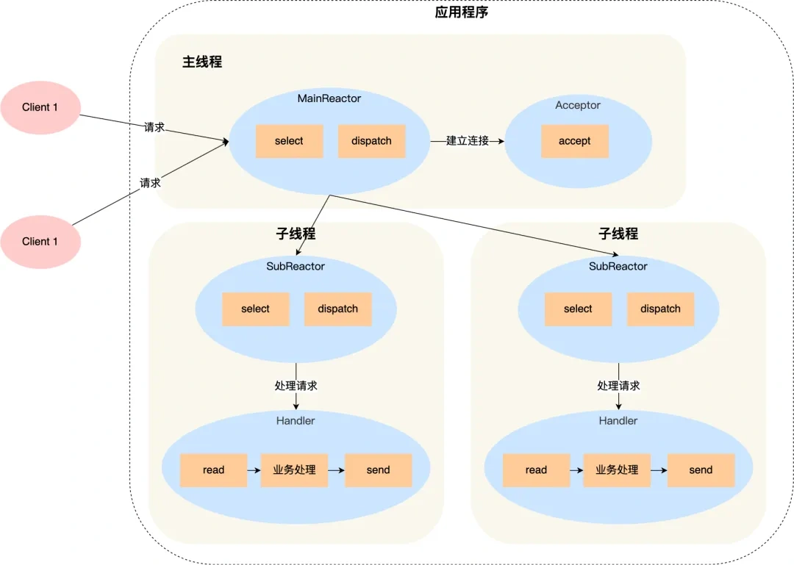

1. **主 Reactor（Acceptor）线程**：
   - 主要负责 **接收客户端连接**，它通过 `ServerSocketChannel` 来监听传入的连接请求。
   - 一旦有新的连接到达，主 Reactor 会将该连接转交给 **子 Reactor** 线程进行进一步处理。
   - 主 Reactor 线程的任务就是尽量减少自己的负担，把更多的工作交给子线程来处理，从而提高系统的性能和响应能力。
2. **子 Reactor（Handler）线程**：
   - 子 Reactor 线程负责接收主 Reactor 分配给它的连接，并开始进行 **数据处理**，如数据读取、业务逻辑处理、响应写回等。
   - 每个子线程通常绑定一个独立的 `Channel`，并使用非阻塞方式来处理数据。
   - 子线程之间通过事件驱动的方式高效地处理任务，不需要频繁的线程切换，减少了性能损耗。


多 Reactor 多线程的方案优势：

- 主线程和子线程分工明确，主线程只负责接收新连接，子线程负责完成后续的业务处理。
- 主线程和子线程的交互很简单，主线程只需要把新连接传给子线程，子线程无须返回数据，直接就可以在子线程将处理结果发送给客户端。


##### 3. Nginx

**Nginx** 是一个高性能的 Web 服务器，它采用了“多 Reactor 多进程”方案来处理请求，尽管它和传统的多 Reactor 多进程模式有所不同。

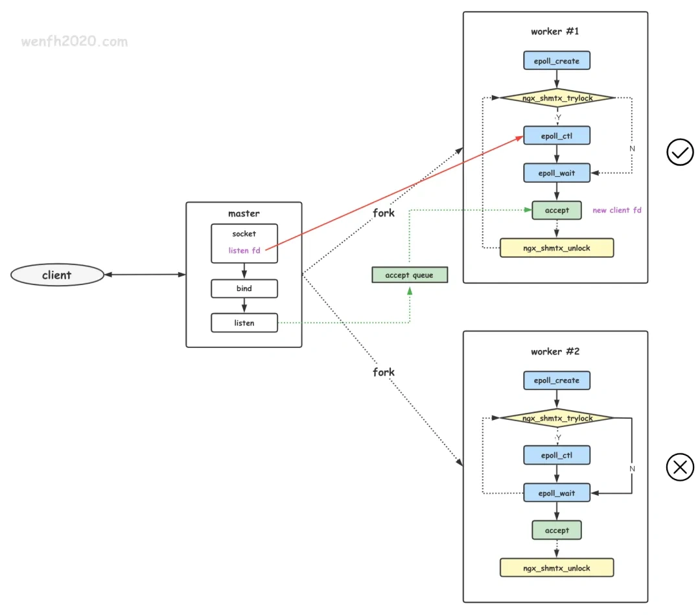

Nginx 的工作进程模式可以分为以下几个层次：

1. **主进程**：
   - Nginx 的主进程负责 **初始化** 系统资源，启动工作进程，并对其进行管理。它不会处理网络请求的具体细节，也不会处理实际的客户端连接。
   - 主进程主要负责接收和管理子进程之间的通信，并保持进程的生命周期。
2. **工作进程**：
   - Nginx 中的每个工作进程都包含一个独立的 Reactor 来处理网络请求。
   - 工作进程会 **接受连接**，并通过自己的 Reactor 来处理连接。每个工作进程都有自己的事件循环，监听和响应客户端的请求。
   - 每个工作进程负责自己分配的请求，而 **不共享连接状态**。如果一个工作进程忙碌，它不会去竞争其它进程的连接。
3. **进程间锁机制**：
   - 主进程只负责初始化并启动子进程，子进程之间通过锁机制来避免出现 **惊群现象**（即多个进程同时去 `accept` 新连接的问题）。
   - 通常只有一个子进程会处理 `accept` 新连接请求，其他子进程则通过系统的负载均衡机制来处理已经被分配的请求。


Nginx 与传统多 Reactor 多进程的差异，主要体现在在传统的多 Reactor 多进程模型中，通常是每个进程都有一个独立的 Reactor 用来接收和处理请求。而 Nginx 的主进程 **不直接处理连接**，而是由工作进程中的 Reactor 来接受连接，并且通过锁机制确保在同一时间只有一个进程去处理新连接，从而避免了进程间的竞争。

Nginx 的多 Reactor 多进程有如下优势。

- **高并发处理能力**：多个工作进程可以并行处理客户端请求，提高了处理能力和吞吐量。
- **稳定性与容错性**：由于使用多个独立的工作进程，如果一个进程崩溃，其他进程不会受到影响，可以继续提供服务。
- **灵活的负载均衡**：通过进程间的锁机制，Nginx 可以有效地分配请求，并避免多个进程争抢同一资源。
- **资源隔离**：每个进程都是独立的，它们之间的内存空间和资源隔离，可以有效地避免进程间的干扰，提高了系统的稳定性。


**Q：简要介绍Netty和Nginx是干啥的？**

A：Netty 是一个 **网络通信框架**，主要用于帮助开发者构建高性能、低延迟的网络应用。它的主要任务是简化复杂的网络编程，提供 **客户端和服务器之间的网络通信**。
简单来说，**Netty** 让你能够快速地构建服务器端程序，处理客户端的请求，它可以直接与客户端建立连接，接受数据，处理业务逻辑，最终把响应数据发送回客户端。
例如，使用 Netty，你可以搭建一个高性能的 **即时通讯系统、游戏服务器或分布式应用**，它能够同时处理大量并发连接，保证通信高效稳定。


Nginx 是一个 **反向代理服务器**，它的工作是在客户端和后端服务器之间作为中间层，接收来自客户端的请求，并将请求转发到合适的后端服务器（如 Web 服务器、应用服务器）。
Nginx 还可以用作 **负载均衡器**，根据一定的规则将请求分发到多台服务器，从而避免单一服务器的负担过重，提升系统的可靠性和吞吐量。
总的来说，Nginx 的作用是帮助 **分配流量、提高系统稳定性**，通过将请求转发给后端服务器来分担压力。


#### 零拷贝是什么？

先讲一下传统 IO 的工作方式，从硬盘读取数据，然后再通过网卡向外发送。

**这种方式下需要进行 4 上下文切换，和 4 次数据拷贝**，其中 2 次数据拷贝发生在内存里的缓冲区和对应的硬件设备之间，这个是由 DMA 完成，另外 2 次则发生在内核态和用户态之间，这个数据搬移工作是由 CPU 完成的。

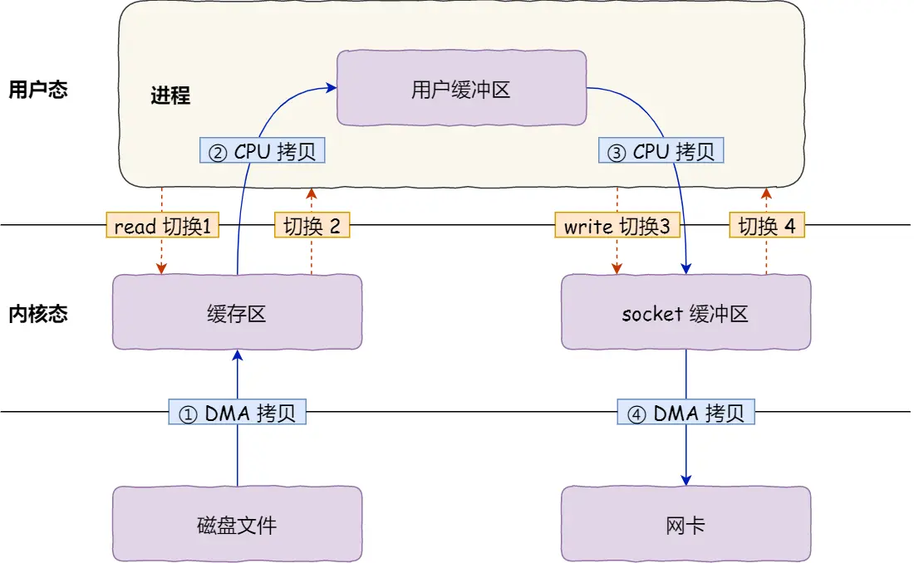


而为了提高文件传输的性能，于是就出现了零拷贝技术，它通过一次系统调用（sendfile 方法）合并了磁盘读取与网络发送两个操作，降低了上下文切换次数。另外，拷贝数据都是发生在内核中的，天然就降低了数据拷贝的次数。

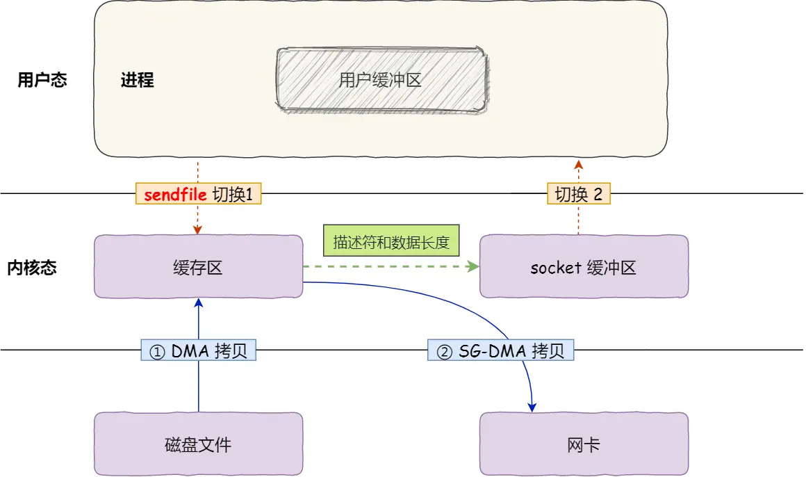

零拷贝技术的文件传输方式相比传统文件传输的方式，减少了 2 次上下文切换和数据拷贝次数，**只需要 2 次上下文切换和数据拷贝次数，就可以完成文件的传输，而且 2 次的数据拷贝过程，都不需要通过 CPU，2 次都是由 DMA 来搬运。**

总体来看，**零拷贝技术可以把文件传输的性能提高至少一倍以上**。
