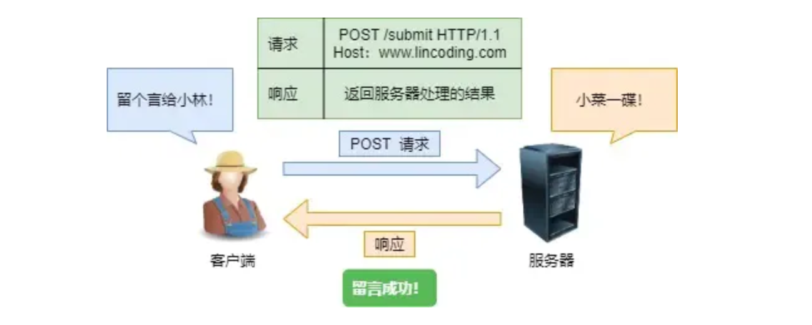
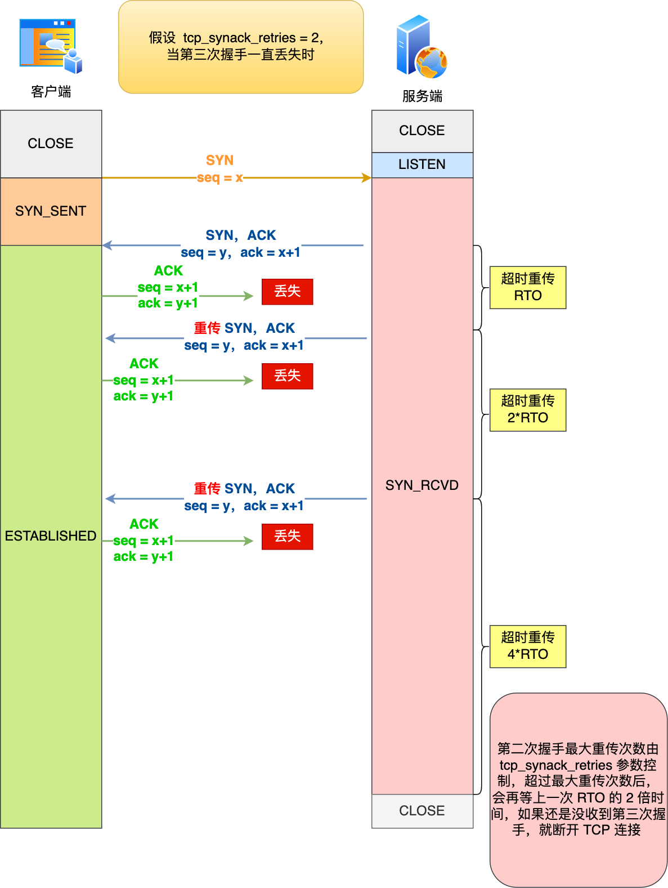
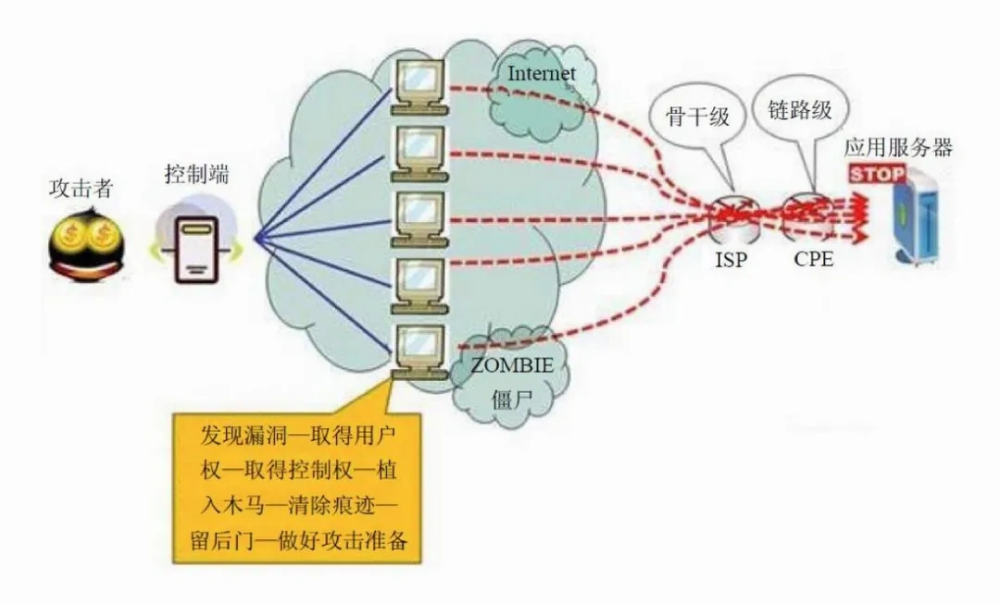

# 计算机网络面试题

### 网络模型

#### 请把网络OSI模型和TCP/IP模型分别介绍一下

##### 1. OSI七层模型

国际标准化组织制定了开放式系统互联通信参考模型（*Open System Interconnection Reference Model*），也就是 OSI 网络模型，该模型主要有 7 层，分别是**应用层、表示层、会话层、传输层、网络层、数据链路层以及物理层。**

每一层负责的职能都不同，自顶向下分层设计如下：

- 应用层，负责给应用程序提供统一的接口；
- 表示层，负责把数据转换成兼容另一个系统能识别的格式，数据的加密解密和压缩解压缩；
- 会话层，负责表示层实体之间的会话建立、管理和终止，和数据同步和检查点机制；
- 传输层，负责端到端的数据传输，流量控制，拥塞控制；
- 网络层，负责数据的路由、转发、分片；
- 数据链路层，负责数据封装成帧和差错检测，以及 MAC 寻址以及介质访问控制；
- 物理层，负责在物理网络中透明传输数据帧；

在这种分层设计的结构下，每一层调用下一层所提供的服务且为上一层提供服务，但由于 OSI 模型实在太复杂，提出的也只是概念理论上的分层，并没有提供具体的实现方案。


##### 2. TCP/IP模型

所以事实上使用的是四层模型，即 TCP/IP 网络模型，Linux 系统正是按照 TCP/IP 来实现网络协议栈的。

TCP/IP模型仅仅划分了四个概念层，分别是**应用层，传输层，网络层和网络接口层**。可以看出其中有三层对应于ISO参考模型中的相应层。


- 应用层， 支持 HTTP、SMTP 等最终用户进程
- 传输层， 处理主机到主机的通信（TCP、UDP）
- 网络层， 寻址和路由数据包（IP 协议）
- 网络接口层， 通过网络的物理电线、电缆或无线信道移动比特

TCP/IP模型也提出了TCP/IP协议族，但TCP/IP协议族并不涉及物理层和数据链路层，因此TCP/IP协议族不能独立完成整个计算机网络系统的功能，必须与许多其他的协议协同工作。


##### 3. 两个模型的对应关系

- OSI的应用层、表示层、会话层在TCP/IP模型中都被合并到了应用层
- OSI的网络层对应TCP/IP的网络层
- OSI的数据链路层和物理层对应TCP/IP的网络接口层

如图所示。


**Q：为什么有实际上运行的4层模型还需要7层OSI网络模型？**

首先原理是 **OSI模型** 并不规定具体使用哪个协议（比如 TCP 或 IP），而是提供了一个**通用的分层框架**，帮助不同的协议和设备进行互相兼容（TCP/IP模型是先有协议再有模型）。

A：第一方面是便于学习，OSI模型是一个**理论框架**，用于标准化网络通信的分层设计，帮助开发者理解网络协议的工作原理。

第二方面OSI模型定义了一个通用的标准框架，为各种不同厂商的设备和协议提供了**统一的参考标准**。即使不同厂商生产的设备使用了不同的具体协议或技术，只要它们遵循OSI模型的标准，它们就可以**互相兼容、互相协作**。（一些专用的工业控制网络、嵌入式系统、专用网络（如某些企业局域网）可能使用不同于 **TCP/IP** 的协议（如 **AppleTalk**、**IPX/SPX** 等）。）


**Q：讲讲TCP/IP协议族有哪些？在哪一层？**

A：用图片来说即为，此外的话TCP/IP协议族并不具体规定数据链路层和物理层的实现，而是将这些功能抽象为"网络接口层"，并假定这些功能由其他协议来实现，具体的话底层有以太网（局域网），有ppp（广域网）有这种协议具体来实现。


用表格即为

| 层级       | 协议                                                         |
| ---------- | ------------------------------------------------------------ |
| 应用层     | HTTP, HTTPS, FTP, SMTP, POP3, IMAP, DNS, SSH, Telnet, SNMP, RIP |
| 传输层     | TCP, UDP, SCTP                                               |
| 网络层     | IPv4, IPv6, ICMP, ICMPv6, ARP, RARP, IGMP                    |
| 网络接口层 | Ethernet, WiFi(802.11), PPP, SLIP                            |

1. 应用层协议的依赖关系：
   - HTTP/HTTPS：通常依赖于TCP（端口80/443）
   - FTP：依赖于TCP（控制端口21，数据端口20）
   - SMTP：依赖于TCP（端口25）
   - **DNS：主要使用UDP（端口53），但在数据较大时会使用TCP**
   - SSH：依赖于TCP（端口22）
   - SNMP：通常使用UDP（端口161/162）

2. 传输层协议的依赖关系：
   - TCP：依赖于IP协议，提供可靠的面向连接的传输
   - UDP：依赖于IP协议，提供不可靠的无连接传输
   - SCTP：依赖于IP协议，提供可靠的多流传输

3. 网络层协议的依赖关系：
   - ICMP：依赖于IP协议，用于传输控制消息
   - ARP：直接在网络接口层之上工作，用于IP地址和MAC地址的转换
   - IGMP：依赖于IP协议，用于管理多播组成员

4. 特殊说明：
   - 所有高层协议最终都依赖于IP协议进行网络层的寻址和路由
   - IP协议依赖于网络接口层的协议（如以太网协议）来实现物理传输
   - ARP虽然概念上属于网络层，但实际工作时直接在网络接口层之上运行，不依赖于IP协议


### tcp、ip分别位于哪一层？

- tcp 在传输层
- ip 在网络层


### 应用层

#### 应用层有哪些协议？

HTTP、HTTPS、CDN、DNS、FTP 都是应用层协议。

| 协议名称 | 端口号  | 主要功能               | 特点                               |
| -------- | ------- | ---------------------- | ---------------------------------- |
| HTTP     | 80      | 网页内容传输           | 无状态协议，请求-响应模式          |
| HTTPS    | 443     | 安全的网页内容传输     | 使用 SSL/TLS 加密，提供数据安全性  |
| FTP      | 20/21   | 文件传输               | 双通道（控制和数据），支持断点续传 |
| SMTP     | 25      | 发送电子邮件           | 推送协议，只负责发送邮件           |
| POP3     | 110     | 接收电子邮件           | 下载后通常删除服务器副本           |
| IMAP     | 143     | 接收电子邮件           | 邮件保存在服务器，支持多设备同步   |
| DNS      | 53      | 域名解析               | 分布式层次数据库，支持缓存         |
| SSH      | 22      | 安全远程登录和文件传输 | 加密传输，安全性高                 |
| Telnet   | 23      | 远程登录               | 明文传输，安全性低                 |
| SNMP     | 161/162 | 网络设备监控和管理     | 管理者-代理者模式，基于 UDP        |
| RIP      | 520     | 路由信息交换           | 距离矢量算法，适用于小型网络       |

##### **1. HTTP (Hypertext Transfer Protocol)**

- **功能**：用于在浏览器和服务器之间传输超文本内容（如网页）。
- **用途**：加载网页、传输图片、视频等多媒体内容。
- **端口**：默认使用端口 **80**。
- **特点**：无状态、明文传输（不加密）。


##### **2. HTTPS (HTTP Secure)**

- **功能**：在 HTTP 的基础上通过 TLS/SSL 提供安全的通信。
- **用途**：保护数据隐私，防止中间人攻击，常用于在线支付和登录页面。
- **端口**：默认使用端口 **443**。
- **特点**：加密数据传输，保证通信安全。


##### **3. FTP (File Transfer Protocol)**

- **功能**：用于在客户端和服务器之间传输文件。
- **用途**：上传、下载、共享文件。
- **端口**：默认使用端口 **21**。
- **特点**：支持明文传输（FTP），也支持加密（FTPS）。


##### **4. SMTP (Simple Mail Transfer Protocol)**

- **功能**：负责发送和转发电子邮件。
- **用途**：用于邮件客户端向邮件服务器发送邮件。
- **端口**：默认使用端口 **25**（传统）或 **587**（加密）。
- **特点**：只负责邮件发送，不负责接收。


##### **5. POP3 (Post Office Protocol v3)**

- **功能**：从邮件服务器下载电子邮件到本地。
- **用途**：常用于只需本地存储邮件的情况。
- **端口**：默认使用端口 **110**（非加密）或 **995**（加密）。
- **特点**：下载后，邮件通常会从服务器中删除。


##### **6. IMAP (Internet Message Access Protocol)**

- **功能**：允许客户端远程访问邮件服务器上的电子邮件。
- **用途**：适用于需要在多台设备上同步邮件的情况。
- **端口**：默认使用端口 **143**（非加密）或 **993**（加密）。
- **特点**：支持服务器上邮件的同步和管理。


##### **7. DNS (Domain Name System)**

- **功能**：将域名（如 `www.example.com`）解析为 IP 地址。
- **用途**：使用户可以通过域名访问网站，而无需记住复杂的 IP 地址。
- **端口**：默认使用端口 **53**，通常使用UDP,但在数据较大时会使用TCP。
- **特点**：核心互联网服务，支持缓存和递归查询。


##### **8. SSH (Secure Shell)**

- **功能**：提供远程登录功能，并加密通信。
- **用途**：远程管理服务器、执行命令、传输文件。
- **端口**：默认使用端口 **22**。
- **特点**：加密安全性高，常用替代 Telnet。


##### **9. Telnet**

- **功能**：提供远程登录功能，但不加密。
- **用途**：远程访问设备或服务器（现已较少使用）。
- **端口**：默认使用端口 **23**。
- **特点**：明文传输，安全性差，易被替代。


##### **10. SNMP (Simple Network Management Protocol)**

- **功能**：用于监控和管理网络设备（如路由器、交换机）。
- **用途**：查看网络设备状态、远程配置设备。
- **端口**：默认使用端口 **161**（UDP）。
- **特点**：适用于大型网络管理系统。


##### **11. RIP (Routing Information Protocol)**

- **功能**：动态路由协议，用于交换路由信息。
- **用途**：为网络中的路由器建立和更新路由表。
- **端口**：默认使用端口 **520**（UDP）。
- **特点**：适用于小型网络，使用跳数作为度量标准。


#### HTTP报文有哪些部分？


如上图所示，**请求报文包含：**

1. **请求行：**包含请求方法（如 GET、POST、PUT、DELETE 等）、请求目标（URL或URI）和HTTP协议版本。

2. **请求头部：**包含关于请求的附加信息，如Host、User-Agent、Content-Type等。

   **Host**表示请求的目标主机（特别是针对虚拟主机），如 `Host: www.example.com`

   **User-Agent**表示客户端软件的信息，如 `User-Agent: Mozilla/5.0 (Windows NT 10.0; Win64; x64) AppleWebKit/537.36 (KHTML, like Gecko) Chrome/9-01.0.4472.124 Safari/537.36`
   **Content-Type**请求体的内容类型（如果有的话），如 `Content-Type: application/json`

3. **空行CRLF：**请求头部和请求体之间用空行分隔。

4. **请求体：**可选，包含请求的数据，通常用于POST请求等需要传输数据的情况。


**而响应报文包含：**

1. **状态行：**包含HTTP协议版本、状态码（如 200、404、500 等）和状态信息（对应状态码的简短描述，如“OK”、“Not Found”、“Internal Server Error”等）。

2. **响应头部：**包含关于响应的附加信息，如Content-Type、Content-Length等。

   **Content-Type**即响应体的内容类型，如`Content-Type: text/html; charset=UTF-8`
   **Content-Length**为响应体的大小，字节数，例如`Content-Length: 1234`
   Server表示服务器的类型或版本，如`Server: Apache/2.4.41 (Ubuntu)`

3. **空行CRLF：**响应头部与响应体之间也有一个空行来表示响应头的结束。

4. **响应体：**包含响应的数据，通常是服务器返回的HTML、JSON等内容。


#### HTTP常用的状态码？

HTTP 状态码通常用于 **响应报文的状态行** 中，标识请求的处理结果。常见的 HTTP 状态码有如下图有5大类，


##### 1xx：信息性状态码（Informational）

1xx属于**提示信息**，表示请求已被接收，**还需继续处理。**

如状态行返回 `100 Continue`：表示客户端可以继续发送请求的剩余部分。一般为客户端发送了一个包含大数据的请求（如 POST），服务器会在接收到请求头部后返回这个状态码，告知客户端可以继续发送请求体。

以及`101 Switching Protocols`：表示服务器根据客户端的请求切换协议，例如升级 HTTP 版本或切换到 WebSocket 协议。


##### 2xx：成功状态码（Success）

2xx表示**请求已成功处理。**如状态行返回：

`200 OK`：最常见的状态码，表示请求已成功处理并返回响应数据。它是大多数成功请求的标准响应码。

`201 Created`：表示请求成功并创建了新的资源。通常在使用 POST 请求创建资源时返回此状态码。例如，提交表单成功并创建了新的记录。


##### 3xx：重定向状态码（Redirection）

3xx表示客户端需要采取跳转操作用新的 URL 重新发送请求获取资源。如状态行返回：

`301 Moved Permanently`：即永久重定向，表示请求的资源已经永久移动到新位置，浏览器通常会自动处理重定向使用新 URL 继续请求，并记录新URL，当用户再次输入旧URL时浏览器会自动转为新URL请求。

`302 Found`：即临时重定向，表示请求的资源暂时移动到另一个 URL，浏览器通常会自动处理重定向使用新 URL 继续请求，但不会记录新URL，当用户再次输入旧URL时浏览器仍然会向旧的 URL 请求资源，然后等旧的 URL 返回新 URL 后才会使用 新 URL 继续请求。


##### 4xx：客户端错误状态码（Client Error）

4xx表示请求报文中有错误或无效，属于客户端的错误码。

`400 Bad Request`：表示请求可能存在语法错误、无效的参数或不合法的请求格式。

`401 Unauthorized`：表示客户端在身份验证场景时，没有提供有效的身份验证凭据，或者提供的凭据不正确。

`403 Forbidden`：服务器理解请求，但是拒绝执行，一般表示客户端因为权限不足或访问限制，所以服务器拒绝处理该请求。

`404 Not Found`：表示请求的资源无法找到，通常是因为 URL 错误或该资源不存在。

`405 Method Not Allowed`：表示客户端请求的方法（如 POST、GET）在指定的资源上不被允许，通常是请求的 HTTP 方法不支持该 URL。


#####  5xx：服务器错误状态码（Server Error）

5xx表示客户端请求报文正确，但是**服务器处理时内部发生了错误**，属于服务器端的错误码。

`500 Internal Server Error`：表示服务器遇到未知的情况，无法完成请求。通常是服务器程序出现异常或配置错误。

`502 Bad Gateway`：表示服务器作为网关或代理时，收到了无效的响应。通常是上游服务器出问题，导致代理服务器无法正确响应。

`503 Service Unavailable`：表示服务器当前无法处理请求，通常是由于服务器过载或正在维护中，稍后再试。

`504 Gateway Timeout`：表示服务器作为网关或代理服务器在等待上游服务器响应时出现超时。


#### HTTP返回状态301 302分别是什么？

3xx 类状态码表示客户端请求的资源发生了变动，需要客户端用新的 URL 重新发送请求获取资源，也就是**重定向**。

`301 Moved Permanently`：即永久重定向，表示请求的资源已经永久移动到新位置，浏览器通常会自动处理重定向使用新 URL 继续请求，并记录新URL，当用户再次输入旧URL时浏览器会自动转为新URL请求。

`302 Found`：即临时重定向，表示请求的资源暂时移动到另一个 URL，浏览器通常会自动处理重定向使用新 URL 继续请求，但不会记录新URL，当用户再次输入旧URL时浏览器仍然会向旧的 URL 请求资源，然后等旧的 URL 返回新 URL 后才会使用 新 URL 继续请求。


#### http 502和 504 的区别？

5xx表示客户端请求报文正确，但是**服务器处理时内部发生了错误**，属于服务器端的错误码。

`502 Bad Gateway`：表示服务器作为网关或代理时，收到了无效的响应。通常是上游服务器出问题（返回了不符合预期的内容或错误响应），导致代理服务器无法正确响应。

`504 Gateway Timeout`：表示服务器作为网关或代理服务器在等待上游服务器响应时出现超时。导致代理服务器无法及时接收到响应并返回结果。

**所以502是收到了无效的响应，504是在指定时间内没有收到任何响应。**


Q：500系列错误代码使用场景是？

A：

**500 Internal Server Error** 是一个通用错误码，通常表示服务器发生了某种未知错误，无法处理请求。

**502 Bad Gateway** 出现在反向代理服务器（如 Nginx）请求具体的后端服务器时，后端服务器无法返回有效的响应。

**503 Service Unavailable** 经常发生在服务器负载过重或正在进行维护时，客户端可以稍后再试。

**504 Gateway Timeout** 经常发生在服务器负载过重时，后端服务器无法在指定时间内返回有效的响应。

| 错误码  | 含义                                                         | 使用场景                                                   |
| ------- | ------------------------------------------------------------ | ---------------------------------------------------------- |
| **500** | Internal Server Error：通用错误，服务器无法处理请求。        | 服务器崩溃、代码异常或配置错误，导致无法处理请求。         |
| **502** | Bad Gateway：服务器作为网关或代理时，收到无效响应。          | 反向代理（如 Nginx）请求后端服务时，后端服务返回无效响应。 |
| **503** | Service Unavailable：服务器无法处理请求，通常是因为负载过重或正在维护。 | 服务器过载或正在进行维护，无法处理请求。                   |
| **504** | Gateway Timeout：网关或代理在等待上游服务器响应时超时。      | 代理服务器等待后端服务超时，无法在指定时间内收到响应。     |


#### HTTP层请求的类型有哪些？

HTTP层请求的类型一共有9种，回答最常用的5种即可

- **GET**: 用于获取资源，不改变服务器上的数据，适合查询操作。
- **POST**: 用于向服务器发送数据，常用于提交表单、上传文件、创建新资源等。
- **PUT**: 用于更新资源，通常替换目标资源的所有内容，适用于完整替换操作。
- **DELETE**: 用于删除指定资源，删除后资源不可恢复。
- **HEAD**: 用于获取资源的元数据（如头部信息），通常用于检查资源存在性而不获取其内容。

| **HTTP 方法** | **用途**                                                | **特点**                                                     | **示例**                                                     |
| ------------- | ------------------------------------------------------- | ------------------------------------------------------------ | ------------------------------------------------------------ |
| **GET**       | 获取指定资源，通常用于 **读取数据**                     | - 无副作用（幂等）。- 数据通过 URL 附加（查询字符串）。- 支持缓存、书签等。 | `GET /index.html HTTP/1.1``Host: www.example.com`            |
| **POST**      | 提交数据到服务器，通常用于 **创建资源或提交表单数据**   | - 数据通过请求体传送。- 对服务器有副作用（会改变数据）。     | `POST /submit_form HTTP/1.1``Host: www.example.com``name=JohnDoe&email=john@example.com` |
| **PUT**       | 更新指定资源，通常用于 **更新已存在的资源**             | - 完全替代目标资源内容（幂等）。- 请求体包含更新内容。       | `PUT /users/123 HTTP/1.1``Host: www.example.com``{"name": "JohnDoe", "email": "john@example.com"}` |
| **DELETE**    | 删除指定资源                                            | - 无请求体，资源通过 URL 指定。- 幂等，删除多次相同资源效果相同。 | `DELETE /users/123 HTTP/1.1``Host: www.example.com`          |
| **HEAD**      | 获取资源的头部信息，不返回内容，通常用于 **获取元数据** | - 不返回响应体，只返回头部信息。- 无副作用。                 | `HEAD /index.html HTTP/1.1``Host: www.example.com`           |


#### GET和POST的使用场景，有哪些区别？

##### 1. GET

根据 RFC 规范，**GET 的语义是从服务器获取指定的资源**，这个资源可以是静态的文本、页面、图片视频等。

GET 请求的参数位置一般是写在 URL 中，GET 请求的参数只允许 ASCII 字符 ，而且浏览器会对 URL 的长度有限制。

比如，当打开小林或JAVAGUIDE的文章，浏览器就会发送 GET 请求给服务器，服务器就会返回文章的所有文字及资源。

```http
GET /articles?id=12345 HTTP/1.1
Host: www.example.com
```


##### 2. POST

根据 RFC 规范，**POST 的语义是根据请求负荷（报文body）对指定的资源做出处理**，具体的处理方式视资源类型而不同。

POST 请求携带数据的位置在报文 body 中，body 中的数据可以是任意格式的数据，只要客户端与服务端协商好即可，而且浏览器不会对 body 大小做限制。

如在小林或JAVAGUIDE文章底部，敲入了留言后点击「提交」，浏览器就会执行一次 POST 请求，将留言文字放进了报文 body 里，然后拼接好 POST 请求头，通过 TCP 协议发送给服务器。

```http
POST /submit_form HTTP/1.1
Host: www.example.com
Content-Type: application/x-www-form-urlencoded
Content-Length: 27

name=JohnDoe&email=john@example.com
```



##### 3. 总结

如果从 RFC 规范定义的语义来看：

- **GET 方法就是安全且幂等的**，因为它被规定为「只读」操作，无论操作多少次，服务器上的数据都是安全的，且每次的结果都是相同的。所以，**可以对 GET 请求的数据做缓存，这个缓存可以做到浏览器本身上（彻底避免浏览器发请求），也可以做到代理服务器上（如nginx），而且在浏览器中 GET 请求可以保存为书签**。
- **POST** 因为是「新增或提交数据」的操作，会修改服务器上的资源，所以是**不安全**的，且多次提交数据就会创建多个资源，所以**不是幂等**的。所以，**浏览器一般不会缓存 POST 请求，也不能把 POST 请求保存为书签**。

| 特性             | **GET**                                  | **POST**                               |
| ---------------- | ---------------------------------------- | -------------------------------------- |
| **目的**         | 获取数据，不修改资源                     | 向服务器提交数据，通常会修改资源       |
| **副作用**       | 无副作用，通常为只读操作                 | 可能有副作用，通常会修改或创建资源     |
| **幂等性**       | 幂等（多次相同请求结果相同）             | 非幂等（多次相同请求可能导致不同结果） |
| **安全性**       | 安全（不修改数据）                       | 不安全（可能会修改或创建数据）         |
| **请求体**       | 无请求体，数据通过 URL（查询字符串）传递 | 有请求体，数据通过 body 传递           |
| **数据大小限制** | 有 URL 长度限制（通常几千字符）          | 无明确的限制，传输大数据没有问题       |
| **缓存**         | 可缓存（浏览器、代理服务器等）           | 不缓存                                 |
| **书签**         | 可保存为书签                             | 不能保存为书签                         |
| **适用场景**     | 查询数据、获取静态资源                   | 提交表单、创建资源、处理大数据等       |


但是 RFC 只是规范，在实际过程中，开发者可以自由的实现 GET 和 POST 方法。比如：

- 可以用 GET 方法实现新增或删除数据的请求，这样实现的 GET 方法自然就不是安全和幂等。
- 可以用 POST 方法实现查询数据的请求，这样实现的 POST 方法自然就是安全和幂等。

但是根据 **RESTful 原则** 和 **HTTP 规范**，通常建议遵循上述约定，使用 GET 来获取数据，使用 POST 来提交数据。


#### HTTP的采用什么模式来完成浏览器和服务器之间的交互？短连接和长连接又是什么？*

HTTP 协议采用的是「请求-应答」的模式，也就是客户端发起了请求，服务端才会返回响应，一来一回这样子。


由于 HTTP 是基于 TCP 传输协议实现的，客户端与服务端要进行 HTTP 通信前，需要先建立 TCP 连接，然后客户端发送 HTTP 请求，服务端收到后就返回响应，至此「请求-应答」的模式就完成了，随后就会释放 TCP 连接。

**HTTP 短连接**每次请求都要经历：建立 TCP -> 请求资源 -> 响应资源 -> 释放TCP连接。

即一次连接只能请求一次资源。如下图：


HTTP的长连接是HTTP1.1引入的特性。

**HTTP 长连接** 使用同一个 TCP 连接来发送和接收多个 HTTP 请求/应答，避免了连接建立和释放的开销。由HTTP1.1中的Keep-Alive 字段是否决定开启长连接，默认情况下会开启。


HTTP 长连接的特点是，只要任意一端没有明确提出断开连接，则保持 TCP 连接状态。

Http长连接的优点有，减少TCP连接建立和断开的开销，避免TCP慢启动的影响且降低服务器负载。

但也需要服务器维护空闲连接，消耗服务器资源，可能造成连接数过多消耗服务器资源。

在 HTTP/1.1实际应用中，浏览器对同一个域名的并发 TCP 连接数有严格限制。通常，浏览器会限制每个域名最多只能同时建立 **6 个 TCP 连接**（不同浏览器可能略有差异，但一般在 4 - 8 个之间）。这意味着如果一个网页需要加载超过 6 个资源（如图片、CSS 文件、JavaScript 文件等），浏览器必须等待前一个连接释放后，才能继续建立新的连接。


**Q：一个超文本难道不是包含所有的吗为什么要建立另外的TCP连接来接收其他文件？**

A：主要是由于现代网站为了优化响应速度，因为TCP和HTTP协议是顺序的，必须顺序接收，如果前面有个图片很大那么后续的文本也必须要等到这个图片接收完才行，所以一些其他的资源和HTML超文本分开TCP连接并行传输提高响应速度。

而浏览器会限制同一个域名下的TCP连接数量，所以HTTP1.1有个连接限制的问题。


#### HTTP1.1和HTTP1.0的区别？*

主要改进了三个方面，最大的改进就是默认在请求头开启`Connection：Keep-Alive` ，第二 HTTP1.1请求投添加了更加丰富的字段（如没有 Host 字段），第三 HTTP1.1支持了更多方法（HEAD、PUT等）。


**Q：Host 字段有什么用？**

A：Host 字段使得一个服务器可以托管多个域名，通过 Host 字段来区分不同的网站。例如，一个服务器的 IP 地址可以同时托管 [www.example.com](http://www.example.com/) 和 [www.anotherexample.com](http://www.anotherexample.xn--com,-y29f53r2q0a2tghxc/) ，服务器根据Host 字段来确定请求是针对哪个网站的资源。


#### HTTP默认的端口是什么？

http 是 80，https 默认是 443。


#### HTTP1.1怎么对请求和响应做拆包，具体来说怎么拆的？

在HTTP/1.1中，请求的拆包是**通过请求头和响应头的"Content-Length"头字段**来进行的。该字段指示了请求请求体和响应体的长度，服务器可以根据该长度来正确接收和解析请求。


具体来说，当客户端发送一个HTTP请求时，会在请求头中添加"Content-Length"字段，该字段的值表示请求正文的字节数。

服务器在接收到请求后，会根据"Content-Length"字段的值来确定请求的长度，并从请求中读取相应数量的字节，直到读取完整个请求内容。拆包机制可以确保服务器正确接收到完整的请求，避免了请求的丢失或截断问题。


#### HTTP为什么不安全？

HTTP被规定为明文传输，所以安全上存在以下三个风险：

- **窃听风险**，比如通信链路上可以被获取通信内容。
- **篡改风险**，比如强制在响应中植入垃圾广告，视觉污染。
- **冒充风险**，比如冒充官方网站，进行诈骗。


而HTTP**S** 针对这三个风险，在 HTTP 与 TCP 层之间通过加入 SSL/TLS 协议来解决以上的风险。

- **信息加密**：交互信息经过加密无法被窃取。
- **校验机制**：经过校验无法篡改通信内容，篡改了就不能正常显示。
- **身份证书**：证明网站的真实性防止欺诈行为。


#### HTTP和HTTPS 的区别？

第一，HTTP 是超文本传输协议是明文传输，存在安全风险的问题。HTTPS 则解决 HTTP 不安全的缺陷，在 TCP 和 HTTP 网络层之间加入了 SSL/TLS 安全协议，使得报文能够加密传输。

第二，HTTPS 在 TCP 三次握手之后，还需进行 SSL/TLS 的四次握手过程。

第三，两者的默认端口不一样，HTTP 默认端口号是 80，HTTPS 默认端口号是 443。

第四，HTTPS 协议服务端需要向 CA（证书权威机构）申请数字证书，在四次握手的过程中将证书发送给客户端，客户端通过 CA 校验证书来保证服务器的身份是可信的。


#### HTTPS握手过程说一下

整体流程如图所示：


##### 1. TLS 第一次握手

首先，由客户端向服务器发起加密通信请求，也就是 ClientHello 请求。在这一步，客户端主要向服务器发送以下信息：

- （1）客户端支持的 TLS 协议版本，如 TLS 1.2 版本。
- （2）客户端生产的随机数（Client Random），后面用于生成「会话秘钥」条件之一。
- （3）客户端支持的密码套件列表，如 RSA 加密算法。


##### 2. TLS 第二次握手

服务器收到客户端请求后，向客户端发出响应，也就是 SeverHello。服务器回应的内容有如下内容：

- （1）确认 TLS 协议版本，如果浏览器不支持，则关闭加密通信。
- （2）服务器生产的随机数（Server Random），也是后面用于生产「会话秘钥」条件之一。
- （3）确认的密码套件列表，如 RSA 加密算法。
- （4）服务器的数字证书。


##### 3. TLS 第三次握手

客户端收到服务器的回应之后，首先通过浏览器或者操作系统中的 CA 公钥，确认服务器的数字证书的真实性。

如果证书没有问题，客户端会**从数字证书中取出服务器的公钥**，然后使用它加密报文，向服务器发送如下信息：

- （1）一个随机数（pre-master key）。该随机数会被服务器公钥加密。
- （2）加密通信算法改变通知，表示随后的信息都将用「会话秘钥」加密通信。
- （3）客户端握手结束通知，表示客户端的握手阶段已经结束。这一项同时把之前所有内容的发生的数据做个摘要，用来供服务端校验。

上面第一项的随机数是整个握手阶段的第三个随机数，会发给服务端，所以这个随机数客户端和服务端都是一样的。

**服务器和客户端有了这三个随机数（Client Random、Server Random、pre-master key），接着就用双方协商的加密算法，各自生成本次通信的「会话秘钥」**。


##### 4. TLS 第四次握手

服务器收到客户端的第三个随机数（pre-master key）之后，通过协商的加密算法，计算出本次通信的「会话秘钥」。

然后，向客户端发送最后的信息：

- （1）加密通信算法改变通知，表示随后的信息都将用「会话秘钥」加密通信。
- （2）服务器握手结束通知，表示服务器的握手阶段已经结束。这一项同时把之前所有内容的发生的数据做个摘要，用来供客户端校验。

至此，整个 TLS 的握手阶段全部结束。接下来，客户端与服务器进入加密通信，就完全是使用普通的 HTTP 协议，只不过用「会话秘钥」加密内容。


TLS 握手基本都是使用 RSA 算法来实现密钥交换的，在将 TLS 证书部署服务端时，证书文件其实就是服务端的公钥，会在 TLS 握手阶段传递给客户端，而服务端的私钥则一直留在服务端，一定要确保私钥不能被窃取。

在 RSA 密钥协商算法中，客户端会生成随机密钥，并使用服务端的公钥加密后再传给服务端。根据非对称加密算法，公钥加密的消息仅能通过私钥解密，这样服务端解密后，双方就得到了相同的密钥，再用这种对称密钥来加密较长的应用消息。


**Q：会话密钥是如何通过三个随机数生成的？**

A：在TLS握手中，会话密钥的生成依赖于三个随机数：

- **Client Random**：客户端生成并在第一次握手时发送。
- **Server Random**：服务器生成并在第二次握手时发送。
- **pre-master key**：客户端生成，并在第三次握手时用服务器的公钥加密后发送给服务器。

在TLS 1.2中，会话密钥是通过一个叫做**PRF（伪随机函数）**的函数生成的，其核心计算过程是：
$$
\text{对称加密密钥} = PRF(\text{pre-master key}, "key expansion", \text{Client Random} + \text{Server Random})
$$
其中，**pre-master key** 是得出加密密钥的核心。**"key expansion"** 是一个固定的字符串（就用这个字符串加入生成），防止彩虹表攻击。**Client Random + Server Random** 作为额外的熵源，确保每次握手生成的密钥都是独一无二的。

PRF函数在TLS 1.2是默认的，在第2次握手确定的版本就敲定了用这个来生成密钥。


**Q：SSL和TLS在这4次握手中的作用是什么？**

**SSL（Secure Sockets Layer）** 是早期的加密协议，现已淘汰，SSL 3.0后被TLS取代。**TLS（Transport Layer Security）** 是SSL的继任者，现在广泛使用的是TLS 1.2和TLS 1.3。


另外这两种协议的关系是，**SSL 3.0 和早期TLS版本（如TLS 1.0）** 的流程非常相似，采用的是基于RSA的密钥交换，流程和你列出来的内容大致一致。**TLS 1.2** 保留了RSA密钥交换方式，但增加了更强的加密套件（如AES-GCM等）。


**TLS 1.3** 则简化了握手流程，从4次握手变成了3次，并弃用了RSA密钥交换，全面使用更安全的ECDHE算法，同时减少了明文传输的信息。


**Q：给我展开讲讲TLS 1.3握手过程？他好像只需要一个RTT？**

首先，客户端发送 ClientHello，里面包括支持的加密套件、TLS 版本、客户端随机数（Client Random）、以及密钥交换所需的 Key Share。


然后服务器收到后，直接回 ServerHello，里面包括很多东西，确认加密算法、服务器随机数（Server Random）和自己的 Key Share（密钥交换参数）。

紧接着接着服务器通过这一个来回协商出的初步密钥在紧接着马上发送加密后的扩展信息、数字证书、验证签名和 Finished 消息，一次性传递完毕。


最后客户端验证服务器证书和签名的真实性，然后计算共享密钥，完成自己那边的握手，并发送加密后的 Finished 消息，以及摘要做个校验。


加密密钥是通过更安全的椭圆曲线 Diffie-Hellman（ECDHE）算法得到的（一般对称加密2048 位的密钥才被认为安全，而椭圆加密算法则只需要 256 位的密钥）而且仅支持这种椭圆曲线算法，不仅不需要原来的第3个随机数省略了一步握手过程还减少了加密的计算量，降低了延迟。


**Q：为什么说HTTPS比HTTP更耗性能？涉及内核态和用户态转换？**

HTTPS比HTTP更耗性能，主要是因为TLS握手涉及到加密操作。

在第3次握手，使用RSA等非对称加密算法加解密pre-master key，这个计算比HTTP的明文请求要复杂得多。

同时双方4次握手之后，需要额外的伪随机函数计算，以及后续的密钥协商。


而且HTTPS的TLS握手过程涉及到**加密操作**，这些操作往往依赖系统调用（如访问加密算法库、读取证书等），这就引发了**内核态和用户态之间的切换**。当HTTPS请求触发TLS加解密时，需要调用操作系统的SSL库（如OpenSSL），这会触发系统调用，将控制权交给内核态进行计算，然后再切回用户态，而HTTP并不需要。


#### HTTPS是如何防范中间人的攻击？

中间人攻击的关键在于攻击者冒充服务器与客户端建立连接，并同时与服务器建立连接。

HTTPS主要通过加密和身份校验机制来防范中间人攻击。

https 握手期间会通过非对称加密的方式来协商出对称加密密钥，之后的信息传输全部使用对称加密密钥来加密信息。由于攻击者无法获得服务器的私钥，因此无法正确解密客户端发送的加密数据。


服务器会向 **CA 证书颁发机构** 申请数字证书，证书中包含了服务器的公钥和其他相关信息。当客户端与服务器建立连接时，服务器会将证书发送给客户端。客户端会验证证书的合法性，包括检查证书的有效期、颁发机构的信任等。如果验证通过，客户端才会进一步进行信息传输，如果证书验证失败或存在问题，客户端会发出警告或中止连接。


#### Http1.1和2.0的区别是什么？

HTTP/2 相比 HTTP/1.1 在性能上有四方面的改进，

**第一进行了头部压缩**， 若同时发出多个请求，且这些请求头是一样的或是相似的，那么，HTTP/2协议会自动**消除重复的部分**。

具体通过 **HPACK 算法**实现，这个算法的核心思想是，在客户端和服务器同时维护一张头信息表，所有字段都会存入这个表，生成一个索引号，以后就不发送同样字段了，只发送索引号，来提高速度。

**第二是支持二进制格式**，HTTP/2 不再像 HTTP/1.1 里的纯文本形式的报文，而是全面采用了**二进制格式**。

请求头和请求体都是二进制，并且统称为帧（frame），即**头信息帧（Headers Frame）和数据帧（Data Frame）**。二进制的设计对计算机非常友好且提高了性能，服务端或者客户端收到报文后，无需再将明文的报文转成二进制，而是直接解析为二进制报文，这**增加了数据传输的效率**。

**第三是并发传输**，引出了 Stream 概念，多个 Stream 复用在一条 TCP 连接。这解决了HTTP/1.1 队头阻塞的问题。

**第四服务器主动推送资源**，HTTP/2 还在一定程度上改善了传统的「请求 - 应答」工作模式，服务端不再是被动地响应，可以**主动**向客户端发送消息。


**Q：讲讲HTTP/1.1 队头阻塞的问题？**

A：在 HTTP/1.1 中，队头阻塞主要体现在请求**队头阻塞**和**连接限制**。

**队头阻塞**指虽然 HTTP/1.1 允许在一个 TCP 连接上发送多个请求，但是这些请求必须严格按照顺序返回。

假设发送了请求 A、B、C，如果请求 A 处理很慢，即使请求 B、C 已经处理完成，它们也必须等待请求 A 的响应发送完才能发送，这就导致后面的请求被阻塞，造成响应延迟。

**连接限制**是指浏览器对同一域名的并发 TCP 连接数有限制（通常是 6），但为了突破这个限制，网站常常会使用多个域名来分发资源（域名分片），于是增加 DNS 解析和建立 TCP 连接的开销。


HTTP/2 通过**多路复用**和**Stream 优先级**解决了这个问题。

**多路复用**在一个 TCP 连接中可以并发处理多个 HTTP 请求和响应，且每个请求/响应都在独立的 Stream 中传输各个 Stream 之间互不影响实现乱序发送和接收。

另一方面**Stream 优先级**，可以为不同的 Stream 设置优先级，重要的资源可以优先传输解决了连接限制问题（比如说大图片就放在低优先级的Stream不会阻塞它后面文本内容的传输）。

但即使使用 HTTP/2也仅仅是解决了HTTP层面的，TCP 层面的队头阻塞仍然存在。即使使用多个 Stream 传输但这些流仍被被组合在一个 TCP 流中传输。

但TCP 是面向字节流的可靠传输协议，如果某个 TCP 包丢失，TCP 必须等待这个包重传成功后才能向应用层交付后续数据，所以TCP的包也会阻塞。所以某个 TCP 包丢失，即使这个包只包含一个 Stream 的数据，所有 Stream 都会受到影响。


#### HTTP进行TCP连接之后，在什么情况下会中断？

- **正常关闭**，即当服务端或者客户端执行 close 系统调用的时候，会发送FIN报文，就会进行四次挥手的过程
- **异常关闭**的超时重传异常关闭，当发送方发送了数据之后，接收方超过一段时间没有响应ACK报文，发送方重传数据达到最大次数的时候，就会断开TCP连接
- **异常关闭**的keepalive 检测异常关闭，当HTTP长时间没有进行请求和响应的时候，超过 keepalive_time（默认通常是2小时），发送探测包，若探测失败则关闭连接。

* **HTTP 层面的连接控制关闭**，HTTP/1.1 默认是 keep-alive，但可以通过设置 Connection: close 主动关闭长链接，或者HTTP/1.0就是默认的短链接。


#### HTTP、SOCKET和TCP的区别？*

HTTP是应用层协议，定义了客户端和服务器之间交换的数据格式和规则，用于在客户端和服务器之间传输和显示Web页面。

Socket是通信的一端是计算机网络中的一种抽象，提供了网络通信的接口，是 **编程接口**，是开发网络通信程序的工具（套接字通过 **IP 地址和端口号** 来标识通信的两端，通过 `socket()` 函数创建一个套接字，然后其他的一些方法，比如说`bind（）`可以绑定IP地址加端口号，`connect()`连接和发送和接收`send()` 和 `recv()`等）。

TCP是一种面向连接的、可靠的传输层协议，负责在网络中建立可靠的数据传输连接。

| **比较点**   | **HTTP**                                           | **Socket**                                       | **TCP**                                        |
| ------------ | -------------------------------------------------- | ------------------------------------------------ | ---------------------------------------------- |
| **定义**     | 应用层协议，定义客户端和服务器间的数据格式和规则。 | 抽象的通信接口，用于描述通信链路的一端。         | 传输层协议，提供可靠的点对点数据传输服务。     |
| **层次**     | 应用层协议                                         | 位于传输层之上，应用层与传输层之间的桥梁         | 传输层协议                                     |
| **功能**     | 用于Web页面的传输、资源请求和响应。                | 提供编程接口以实现通信功能，支持传输层协议操作。 | 提供可靠的数据传输，处理分组、错误检测等。     |
| **通信模式** | 基于请求-响应的通信模式（Client-Server）。         | 双向通信，支持任意数据格式和复杂协议实现。       | 双向通信，面向连接，数据流可靠且有序传输。     |
| **状态**     | 无状态协议（需借助Cookie、Session等保持状态）。    | 可实现有状态的通信（取决于开发者实现）。         | 有状态协议，连接建立后通信双方保持状态。       |
| **使用场景** | 用于浏览器与服务器间的数据交互。                   | 用于构建任意网络通信（如聊天、游戏等）。         | 用于建立可靠的网络连接（如HTTP、FTP）。        |
| **协议关系** | 基于TCP或TLS/SSL运行                               | 可基于TCP、UDP等协议实现通信。                   | 提供HTTP和其他协议的底层传输服务。             |
| **可靠性**   | 依赖TCP提供的可靠性                                | 取决于使用的传输协议（如TCP可靠，UDP不可靠）。   | 提供可靠的数据传输，数据无丢失、无乱序。       |
| **易用性**   | 高级协议，封装复杂逻辑，易于使用。                 | 低级接口，需要开发者手动实现协议逻辑。           | 中级协议，直接提供可靠传输，但不包含应用逻辑。 |


#### 介绍下DNS？

DNS的全称是Domain Name System（域名系统），用于将用户方面记忆的域名转换为对应IP地址的分布式数据库系统。

DNS 中的域名都是用**句点**来分隔的，比如 www.server.com，这里的句点代表了不同层次之间的**界限**。而且在域名中，**越靠右**的位置表示其层级**越高**。

实际上域名最后还有一个点，比如 www.server.com.，这个最后的一个点代表根域名。

所以 . 根域是在最顶层，它的下一层就是 .com 顶级域，再下面是 server.com。

所以域名的层级关系类似一个树状结构：

- 根 DNS 服务器（.）
- 顶级域 DNS 服务器（.com）
- 权威 DNS 服务器（server.com）


**根域的 DNS 服务器信息保存在互联网中所有的 DNS 服务器中。**因此，客户端只要能够找到任意一台 DNS 服务器，就可以通过它获取到根域 DNS 服务器上，然后再一路顺藤摸瓜找到位于下层的某台目标 DNS 服务器。


#### DNS 域名解析的工作流程？

现在默认都是迭代查询了。具体步骤如下。

1. **客户端查本地缓存**，集检查本地缓存（Hosts文件、浏览器DNS缓存）→ 若命中则直接使用。
2. **客户端查询本地 DNS 服务器**
   客户端（如浏览器）发起一个 DNS 请求（递归查询）给 **本地 DNS 服务器**（别问为什么知道这个本地服务器的地址，因为客户端的 TCP/IP 设置会填写这个本地 DNS 服务器地址，由ISP运营商提供如电信、联通）。请求的目标是解析一个域名（如 `www.server.com`）的 IP 地址。
3. **本地 DNS 查询缓存**
   本地 DNS 服务器收到请求后，首先检查自己的 **缓存**，这下会出现分支判断。
   - 如果缓存中有对应域名的解析记录（未过期），直接返回 IP 地址给客户端。
   - 如果缓存中没有，或记录已过期，则继续向上发起迭代查询。
4. **本地 DNS 向根域名服务器查询**
   本地 DNS 服务器向 **根域名服务器** 发起迭代查询，询问 `www.server.com` 的 IP 地址。
   - 根域名服务器不存储具体的域名记录，但会返回指向 `.com` 顶级域名服务器的地址。
5. **本地 DNS 查询顶级域名服务器 (.com)**
   本地 DNS 服务器收到 `.com` 顶级域名服务器的地址后，向其发起请求，询问 `www.server.com` 的 IP 地址。
   - `.com` 顶级域名服务器不会返回具体 IP 地址，但会返回 `server.com` 的 **权威域名服务器** 地址。
6. **本地 DNS 查询权威域名服务器**
   本地 DNS 服务器继续向 `server.com` 的 **权威域名服务器** （对应项目中的就是百度智能云提供的域名）发送请求，询问 `www.server.com` 的 IP 地址。
   - 这时，权威域名服务器会返回域名 `www.server.com` 的具体 IP 地址（例如 `192.0.2.1`）。
7. **本地 DNS 返回结果给客户端**
   本地 DNS 服务器将最终解析得到的 IP 地址返回给客户端。
   - 同时，本地 DNS 服务器会将该解析结果缓存一定时间（根据域名的 TTL 值），以供未来查询时直接使用。
8. **客户端建立连接**
   客户端收到解析的 IP 地址后，使用该地址与目标服务器建立连接（如发起 HTTP 请求）。


#### DNS的端口是多少？

默认端口号是53。


#### DNS的底层使用TCP还是UDP？*

DNS 一般基于UDP协议实现域名解析和数据传输。

因为基于UDP实现DNS能够提供低延迟、简单快速、轻量级的特性，更适合DNS这种需要快速响应的域名解析服务。

- **低延迟：** 无连接方式，无需建立和释放连接。因此可以减少传输时延，适合DNS这种需要快速响应的应用场景。
- **简单快速：**没有复杂的握手以及流量管理和拥塞控制等等复杂机制。传输效率更高，适合DNS这种需要快速传输数据的场景。
- **轻量级**：UDP头部开销小，适合DNS这种频繁且短小的数据交换。

大部分情况下，单次请求/响应报文大小不会超过 512 字节（基于传统 DNS），因此无需 TCP 的分片和重传机制。

虽然尽管 UDP 存在丢包和数据包损坏的风险，但在 DNS 的设计中使用了一些机制来提高可靠性，例如查询超时重传、请求重试、缓存等，可以容忍一些损失一些损失。


**Q：DNS协议只用UDP实现？**

A：DNS协议在有些情况时会会使用TCP来实现域名解析。

1. **报文较大时**，DNS 响应的内容较多，导致单个数据报大小超过 **512 字节**（传统 DNS）或 **1232 字节**（EDNS 扩展），则会使用 TCP 协议。
2. **重传机制**，如果 UDP 查询失败（如丢包或响应丢失），客户端**可能**会改用 TCP 重新发送请求。
3. **安全性增强的需求**，某些安全协议（如 DoT，DNS over TLS，或 DoH，DNS over HTTPS）会将 DNS 查询嵌套到 TCP 或 HTTPS 协议中，以提高安全性和隐私保护。

| **协议** | **用途**                                                     | **优点**                       | **缺点**           |
| -------- | ------------------------------------------------------------ | ------------------------------ | ------------------ |
| **UDP**  | 默认用于大部分 DNS 查询和响应。适合快速、短小的请求/响应。   | 快速、轻量级、低延迟           | 不可靠（可能丢包） |
| **TCP**  | 较大报文、区域传输、DNSSEC，或 UDP 失败时的查询，以及**安全性增强**的加密需求（如 DoT 和 DoH）。 | 可靠（有连接、数据完整性保障） | 复杂，性能稍低     |


#### HTTP到底是不是无状态的？

HTTP是无状态协议，这意味着每个请求都是独立的，服务器不会在多个请求之间**自动**保留客户端的状态信息。
不过，Web应用中可以通过状态保持机制（例如Cookie、Session或Token）来弥补这一点，从而实现跨请求的用户状态跟踪。
这些机制是应用层的补充，并没有改变HTTP协议本身无状态的性质。


#### 携带Cookie的HTTP请求是有状态还是无状态的？Cookie是HTTP协议簇的一部分，那为什么还说HTTP是无状态的？

虽然HTTP协议本身是无状态的，但是web应用需要状态来维持会话信息，所以但通过一些技术手段可以实现状态保持，这些技术是对HTTP协议的补充来更好的用于web应用，而不是改变了HTTP本身无状态的性质。常见的状态保持机制包括。

##### 1. Cookie

**Cookie**是由服务器生成的小数据片段，**但存储在客户端（浏览器）中。**客户端会在后续请求中根据域名**自动携带Cookie**，服务器可以通过Cookie识别客户端。

**Cookie的典型用途有**：实现登录状态保持、偏好设置、广告跟踪等。


##### 2. Session

**Session**将会话信息**存储在服务器**上，每个Session有唯一的标识符（Session ID）。**Session ID通常通过Cookie**传递给客户端，也可以通过URL参数传递。

**Session典型用途**：用来保存用户的临时数据（如购物车、登录状态等）。


##### 3. Token（令牌）

令牌通常是JWT（JSON Web Token）或其他形式的加密字符串，**存储在客户端**（例如LocalStorage或Cookie中）。和Cookie类似**客户端将令牌附加到请求头**（通常是`Authorization: Bearer <token>`）中，用于身份验证或授权。

相比Session，**Token机制通常是无状态**的（即服务器不存储Token的状态），适用于分布式系统。


所以**无状态的定义是针对HTTP协议本身**，不是说整个Web应用没有状态。Web应用通常是Cookie、Session或Token在HTTP协议之上实现“模拟”状态。所以**状态保持的实现是应用层的行为**，和HTTP协议无关。

即使使用了状态保持机制，也不能说HTTP变成了“有状态协议”，因为这些机制都是借助HTTP之外的工具（比如应用层的设计）实现的，而不是HTTP协议本身改变了。


#### cookie和session有什么区别？

Cookie和Session都是Web开发中应用层用于跟踪用户状态的技术，但它们在存储位置、数据容量、安全性以及生命周期等方面存在显著差异。

| **特性**     | **Cookie**                                                   | **Session**                                                  |
| ------------ | ------------------------------------------------------------ | ------------------------------------------------------------ |
| **存储位置** | 存储在客户端（浏览器），每次请求时自动携带。                 | 存储在服务器端，客户端只保存一个唯一的Session ID，通过Cookie或URL参数传递给服务器。 |
| **数据容量** | 单个Cookie大小限制为约4KB，大多数浏览器对每个域名的总Cookie数量有限制（通常20个左右）。 | 理论上不受限制，但受服务器内存限制，适合存储较大数据。       |
| **安全性**   | 容易被XSS（跨站脚本攻击）利用。可以通过设置HttpOnly属性增强安全性，但仍可能受CSRF攻击影响。 | 比Cookie更安全，因为数据存储在服务器端。但需防范Session劫持和会话固定攻击。 |
| **生命周期** | 可以设置过期时间或为会话Cookie（浏览器关闭时删除）。         | 默认在会话结束时失效，也可以设置超时时间，超过一定时间未活动会失效。 |
| **性能**     | 数据随每次请求发送到服务器，较大数据会影响网络传输效率。     | 数据存储在服务器端，每次请求需要访问服务器，可能在高并发时增加服务器负载。 |


#### token，session，cookie的区别？

##### 1. Cookie

**Cookie**是由服务器生成的小数据片段，**但存储在客户端（浏览器）中。**客户端会在后续请求中**根据域名自动携带Cookie**，服务器可以通过Cookie识别客户端。

**Cookie的典型用途有**：实现登录状态保持、偏好设置、广告跟踪等。

- **优点**：轻量级，易于实现，支持客户端与服务器之间的自动数据交互。
- **缺点**：安全性较低（容易受到XSS和CSRF攻击），不适合存储敏感数据。


##### 2. Session

**Session**将会话信息**存储在服务器**上，每个Session有唯一的标识符（Session ID）。**Session ID通常通过Cookie传递给客户端**，也可以通过URL参数和隐藏表单域传递。服务器收到请求之后根据ID查找与之对应的会话数据。

**Session典型用途**：用于存储临时的会话信息，如用户登录状态、购物车信息等。

- **优点**：敏感数据存储在服务器，安全性高于Cookie。
- **缺点**：需要服务器端存储会话数据，高并发情况下会增加服务器负载。


##### 3. Token（令牌）

Token是客户端存储的加密字符串（**LocalStorage、SessionStorage或Cookie中**），常见形式是JWT（JSON Web Token），用于表示用户身份或访问权限。

和Cookie类似**客户端将令牌附加到请求头**（通常是`Authorization: Bearer <token>`）中，用于身份验证或授权。


Token的特点在于Token本质是自包含的，即包含足够的信息供服务器验证（如用户信息、签名等）。**且通常是无状态的**，服务器不存储Token相关信息，因此适合分布式系统。


Token的典型应用有**身份验证**（登录后颁发Token，客户端使用Token访问受保护资源）和**授权**（不同权限用户可获得不同Token）。

- **优点**：分布式系统适用，无需在服务器端维护会话数据，支持跨域。
- **缺点**：由于Token长期存储在客户端，容易受到XSS和Token窃取的攻击。需要短生命周期和更新机制来提高安全性。


| **特性**         | **Cookie**                                                   | **Session**                                                  | **Token**                                                    |
| ---------------- | ------------------------------------------------------------ | ------------------------------------------------------------ | ------------------------------------------------------------ |
| **存储位置**     | 客户端（浏览器），由浏览器根据域名自动携带发送。             | 服务器端存储，客户端只保存Session ID（通常通过Cookie传递，也可通过URL或HTTP头传递）。 | 客户端（可存储在LocalStorage、SessionStorage或Cookie中）。   |
| **状态保持方式** | 基于客户端，客户端存储所有数据，服务器通过Cookie识别客户端。 | 基于服务器，服务器存储会话数据并通过Session ID与客户端绑定。 | 无状态，Token本身携带用户信息，服务器不存储会话状态（但可以通过签名验证Token的有效性）。 |
| **数据容量**     | 每个Cookie限制在约4KB，大多数浏览器对每个域名的Cookie总数有限制（通常20个左右）。 | 理论上无大小限制，主要受服务器内存限制。                     | 受Token格式限制（如JWT约为几KB），但不受浏览器或服务器硬性限制。 |
| **安全性**       | 数据存储在客户端，容易受到XSS和CSRF攻击（可以通过HttpOnly和SameSite属性部分缓解）。 | 数据存储在服务器端，安全性高，但需要防范Session劫持和固定攻击。 | Token本身加密签名（如JWT）提高安全性，但长期存储在客户端，易受XSS攻击，需定期刷新Token。 |
| **传输方式**     | 自动通过HTTP头（`Cookie`字段）随请求发送给服务器。           | Session ID通过Cookie、URL参数或HTTP头传递给服务器。          | 通常通过HTTP头（`Authorization: Bearer <token>`）或请求体传递给服务器。 |
| **生命周期**     | 可设置过期时间，也可以是会话Cookie（浏览器关闭时删除）。     | 默认在会话结束时失效，也可以设置超时时间，超过一定时间未活动会失效。 | 通常短生命周期（如几小时），支持刷新机制以延长有效期。       |
| **适用场景**     | 登录状态保持、存储偏好设置、广告跟踪等轻量级任务。           | 单体或小型应用系统，用于存储临时数据（如登录状态、购物车等）。 | 分布式系统、微服务架构、跨域认证，适合无状态和分布式应用场景。 |
| **性能**         | 数据随每次请求发送到服务器，数据较大会影响网络传输效率。     | 会话数据存储在服务器，每次请求需访问服务器，可能在高并发时增加服务器负载。 | 服务器无需存储Token相关信息，无需访问会话数据，适合高并发场景，但Token验证和解析略增加开销。以及Token随每次请求发送到服务器也有开销。 |


#### 如果客户端禁用了cookie，session还能用吗？

可以，虽然Session ID通常通过Cookie传递给客户端，**也可以通过URL参数或隐藏表单域传递Session ID。**

##### 1. **URL重写(URL Rewriting)**

```java
// 例如将sessionid附加到URL
http://example.com/page?jsessionid=ABC123XYZ
```

但URL重写需要服务器端对所有URL进行处理,增加了开发负担，而且URL参数容易泄露Session ID，存在安全风险


##### 2. 隐藏表单域(Hidden Form Fields)

```html
<input type="hidden" name="sessionid" value="ABC123XYZ">
```

在每个需要Session信息的HTML表单中包含一个隐藏字段，用来存储Session ID。当表单提交时，Session ID随表单数据一起发送回服务器，服务器通过解析表单数据中的 Session ID 来获取用户的会话状态。

不过该替代方案也有一些局限性，隐藏表单只适用于POST请求，某些框架可能不完全支持无Cookie的Session处理。

所以虽然技术上可行,但在实际应用中还是推荐启用Cookie来处理Session,这样更安全也更方便。如果必须处理禁用Cookie的场景，建议：优先使用URL重写的方案，在服务端增加Session ID的有效性验证，且缩短Session超时时间防止泄露。

尽量考虑采用其他状态维持方案（如JWT）。


#### 如果我把数据存储到 localStorage，和Cookie有什么区别？

Cookie 的**存储容量通常较小**，每个 Cookie 的大小限制在几 KB 左右。Cookie 在每次 HTTP 请求中都会**自动发送到服务器**，所以 Cookie 适合用于在客户端和服务器之间传递数据。

在数据生命周期方面，Cookie 可以设置一个过期时间来使数据在指定时间后自动过期。而安全性方面，由于 Cookie 可以设置`HTTP ONLY`来防止XSS脚本攻击但是仍然会受到CSRF攻击，且一般用于存取用户凭证，会发送到服务器，所以更倾向于被攻击。


而 LocalStorage 的**存储容量通常较大**，一般通常每个域名可以存储约 5MB 的数据。所以需要存储大量数据，LocalStorage 通常更适合。 localStorage 的数据是**仅在浏览器端存储数据**，而且 localStorage 数据受到同源策略的限制，即只有同一域名下的页面才能访问和修改数据。因此 LocalStorage 适合用于在同一域名下的不同页面之间共享数据。

在数据生命周期方面，LocalStorage 的数据将永久存储在浏览器中，除非通过 JavaScript 代码手动删除。而安全性方面，LocalStorage 的数据仅在浏览器端存储，不会自动发送到服务器。但是无法阻止XSS脚本攻击和CSRF攻击，但由于 LocalStorage 一般存储用户偏好设置和**缓存的 API 数据**（如本地存储一些 JSON 数据，减少重复请求）所以被攻击性不大。


#### 什么数据应该存在到cookie，什么数据存放到 Localstorage?

Cookie 适合用于在客户端和服务器之间传递数据、跨域访问和设置过期时间，而 LocalStorage 适合用于在同一域名下的不同页面之间共享数据、存储大量数据和永久存储数据。


#### JWT 令牌和传统方式有什么区别？*

JWT 令牌（token）和传统方式（Session结合Cookie）的区别主要有无状态性和安全性以及跨域支持三点。

##### 1. 无状态性

JWT是无状态的令牌，故不需要在服务器端存储会话信息。

因为JWT令牌中包含了所有必要的信息，如用户身份、权限等，客户端只需要在每次请求的头部加入JWT令牌，而服务端通过解析JWT令牌就可以获得所有必要的信息。

因此**JWT优点就在于非常适合分布式架构和微服务**，减少了服务器的状态管理负担。

但**令牌一旦签发，直到过期为止都是有效的，除非额外实现如黑名单等机制来撤销令牌。**


##### 2. 签名

JWT使用密钥对令牌进行签名，**防止令牌被篡改，确保令牌的完整性和真实性。**只有持有正确密钥的服务器才能对令牌进行验证和解析。

但JWT一旦泄露（如通过网络监听等方式），令牌不能被主动撤销，攻击者可以伪装为合法用户，除非令牌已过期。

所以安全性方面JWT容易受到CSRF攻击。


##### 3. 跨域支持

因为JWT不依赖浏览器根据域名自动发送对应的Cookie机制，可以通过自定义HTTP头（如Authorization）或其他方式传递，所以JWT令牌适用于跨域访问场景。


Session结合Cookie受到同源策略的限制，跨域时需要额外配置（如`Access-Control-Allow-Credentials`和`Access-Control-Allow-Origin`）才能实现跨域访问。


**Q：什么叫跨域访问？**

A：跨域访问是指，网页（前端）试图向与当前页面不同"源"（协议、域名、端口不同）的服务器发起请求（如图床中的图片），而浏览器出于安全考虑可能会拦截这个请求。网页只能访问和自己"同源"（协议、域名、端口相同）的资源，不能随便请求别的源的数据，除非服务器的响应网页在返回时就声明允许访问不同的源来获取资源。


这里的"源"由三个部分组成：

- **协议(Protocol)**

* **域名(Domain)**
* **端口号(Port)**

```
当前网页: https://example.com
以下请求都属于跨域:
- http://example.com         // 协议不同 (https vs http)
- https://api.example.com    // 子域名不同
- https://example.com:8080   // 端口不同
- https://another.com        // 域名完全不同
```

浏览器出于安全考虑，默认会阻止跨域请求。这种安全策略叫做"同源策略"(Same-Origin Policy)。

一般的，要实现跨域访问，服务器需要特别配置 CORS 响应头，比如：

```http
Access-Control-Allow-Origin: https://example.com
Access-Control-Allow-Methods: GET, POST
Access-Control-Allow-Headers: Content-Type
```

有几种常见的跨域场景：

1. 前端页面调用不同域名的API接口
2. 前端页面加载不同域名的图片、字体等资源
3. 多个子域名之间的数据交互


#### JWT 令牌都有哪些字段？

JWT令牌由三个部分组成：**头部（Header存签名算法和token类型）、载荷（Payload 需要传递的数据）和签名（Signature 生成的签名）**。其中，头部和载荷均为JSON格式，使用Base64编码进行序列化，而签名部分是对头部、载荷和密钥进行签名后的结果。


#### JWT 令牌为什么能解决集群部署，什么是集群部署？

集群部署指的是多台服务器同时对外提供服务，通过负载均衡将用户请求分发到不同的服务器上。这种部署方式可以提高系统的并发处理能力和可用性，但同时也带来了会话管理的挑战。


**如上图所示，在传统的Session + Cookie方案中，当用户登录后，服务器A会在内存中存储用户的会话信息**。但是如果用户的下一个请求被转发到服务器B，由于服务器B无法访问服务器A的内存，就无法验证用户的登录状态。为了解决这个问题，我们通常需要引入Redis等共享存储来集中管理会话信息，这增加了系统复杂度和维护成本。


而JWT采用了完全不同的思路：它将用户信息直接编码在令牌中，并通过签名确保数据不被篡改。当用户携带JWT令牌访问任何一台服务器时，服务器都可以独立完成令牌验证，无需查询共享存储支持。这种无状态的特性使得JWT特别适合集群的分布式环境，既简化了系统架构，又提高了性能。


#### jwt的缺点是什么？

JWT的缺点在于两方面**无法主动过期失效与令牌大小影响性能。**

JWT最大的问题在于一旦JWT令牌被签发出去，服务器就无法直接控制它的生命周期。在令牌过期之前，任何持有该令牌的人都可以通过原令牌持有者的身份访问系统。如果令牌不慎泄露，攻击者就能够冒用用户身份进行操作，而服务器无法像传统Session那样直接使令牌失效。

可以使用Redis这类内存数据库来维护一个失效令牌的列表即黑名单机制。当需要让某个JWT提前失效时，只需将其加入黑名单。服务器在验证JWT时，除了要检查签名和过期时间，还需要查询该令牌是否在黑名单中。这种方案虽然能够解决问题，但实际上部分违背了JWT无状态的设计初衷，因为服务器又需要维护额外的状态信息。


第二方面，JWT令牌本身的大小也是一个值得关注的问题。由于JWT需要包含所有必要的用户信息，再加上签名，令牌体积往往比传统的会话标识符要大得多，这会增加每次HTTP请求的开销。在高并发场景下，这些额外的数据传输可能会对系统性能造成影响。


#### JWT 令牌如果泄露了，怎么解决，JWT是怎么做的？*

可以使用Redis这类内存数据库来维护一个失效令牌的列表即黑名单机制。当需要让某个JWT提前失效时，只需将其加入黑名单。服务器在验证JWT时，除了要检查签名和过期时间，还需要查询该令牌是否在黑名单中。这种方案虽然能够解决问题，但实际上部分违背了JWT无状态的设计初衷，因为服务器又需要维护额外的状态信息。


**Q：一个完整的JWT安全防护体系，应该怎么办？**

A：从预防、检测和应对三个方面来进行。

- 建立完善的预防措施
  - 应该通过**设置合理的过期时间（通常30分钟）并配合refresh token机制（及时刷新令牌）**来降低令牌被滥用的风险。
  - **传输都需要通过HTTPS进行加密**，并且**在前端存储时应避免使用容易被XSS攻击的localStorage，而是选择更安全的httpOnly cookie**。
  - 此外，在设计JWT的payload（载荷字段）时，应当只包含必要的信息，避免存放任何敏感数据。

- 第二需要检测机制。
  - **需记录令牌使用情况**，及时发现异常的访问模式。
  - **可通过将令牌与用户的IP地址绑定**，快速识别是否有来自异常IP的访问。
  - 记录和验证用户的设备信息，当发现未知设备使用令牌时，系统可以及时发出警报。

* 应对措施来控制损失。
  - 首要措施是实现基于Redis的黑名单机制，将已泄露的令牌立即加入黑名单以使其失效。
  - 提供功能让用户能够主动注销所有设备的登录状态，这在用户发现账号异常时特别有用。
  - 在检测到严重的安全异常时，**系统还应该强制用户重新登录并更换密钥**，以确保账号安全。


#### Session + Cookie的方案用户认证如何进行？

流程如下：

1. 用户向服务器发送用户名和密码。
2. 服务器验证通过后，在当前对话（session）里面保存相关数据，比如用户角色、登录时间等等。
3. 服务器向用户返回一个 session_id，写入用户的 Cookie。
4. 用户随后的每一次请求，都会通过 Cookie，将 session_id 传回服务器。
5. 服务器收到 session_id，找到前期保存的数据，由此得知用户的身份。

这种模式的问题说了很多遍，也就是扩展性（scaling）不好。对于服务器集群，或者是跨域的服务导向架构，就要求 session 数据共享，每台服务器都能够读取 session。


为了克服这个问题有两种解决方案：一种是引入Redis等中央存储来共享session信息，所有服务器都从同一个存储中读写session数据。但该方法增加了系统复杂度，而且Redis故障会影响整个认证系统。所以另一方面就是干脆将用户信息放在客户端本地存储即JWT。


#### 前端是如何存储JWT的？

客户端收到服务器返回的 JWT，**可以储存在 Local Storage 里面，也可以储存在Cookie里面，还可以存储在Session Storage里面。下面将说明存在上述各个地方的优劣势：**

##### 1. Local Storage（本地存储）

Local Storage提供了最简单的存储方式，

- **优点**：Local Storage 提供了较大的存储空间（一般为5MB），使用也很方便。
- **缺点**：存在XSS（跨站脚本攻击）的风险，恶意脚本可以通过JavaScript访问到存储在Local Storage中的JWT，从而盗取用户凭证。因此，Local Storage并不适合存储敏感的身份认证信息。

所以不建议将敏感数据（如 JWT）存储在 Local Storage 中。如果必须使用，确保前端代码无 XSS 漏洞（这是一个高要求）。


##### 2. Session Storage（会话存储）

Session Storage和Local Storage有着类似的API，

- **优点**：仅限于当前浏览器窗口或标签页，当窗口关闭后数据会被清除，这在一定程度上减少了XSS（跨站脚本攻击）的风险。
- **缺点**：用户体验可能受影响，因为刷新页面或在新标签页打开相同应用时需要重新认证。

用于存储一些短期存在且不敏感的会话数据，但不建议存储 JWT。


##### 3. Cookie

相比之下，Cookie是存储JWT最安全的选择，所以一般默认用这种方式作为JWT的载体。

- **优点**：可以设置HttpOnly标志来防止通过JavaScript访问，减少XSS攻击的风险；也可以利用Secure标志确保仅通过HTTPS发送，防止在传输过程中被窃取。
- **缺点**：大小限制较小（通常4KB），并且每次HTTP请求都会携带Cookie，可能影响传输性能；设置不当可能会受到CSRF（跨站请求伪造）攻击。

存储 JWT 的首选方式，尤其需要存敏感信息时。应搭配防范 CSRF 的机制（如 SameSite=Strict 或使用 CSRF Token）。


#### 集中式Session管理(Redis)vs. JWT：为什么企业更偏爱前者*

从你的详细描述中，我可以总结出关于企业微服务架构中为什么通常更偏好集中式session存储(SessionID+Redis)而非JWT的几个关键原因：

#### 集中式Session存储的优势

1. **服务端控制权**：SessionID+Redis方案让服务端保持对会话的完全控制，而不是将控制权交给前端
   - 可以随时修改、撤销会话
   - 服务端决定会话过期时间，更安全可靠
2. **防重放攻击**：Redis存储方案可以有效防止重放攻击
   - JWT一旦签发，在过期前都有效，容易被复制利用
   - 集中式存储可以随时让特定token失效
3. **动态会话展期**：无感刷新会话时间
   - 每次验证后自动刷新Redis的TTL
   - JWT需要通过复杂的refresh token机制才能展期
4. **风控与安全**：可以集成风控系统
   - 可以基于风险分析随时踢掉可疑用户
   - 为安全分析提供集中式数据来源
5. **跨集群同步**
   - 可以通过共享Redis或API转发实现多集群共享登录态
   - 支持跨云、跨区域部署场景

#### JWT的局限性

1. **前端说了算**：会话数据和验证逻辑部分交给前端，降低安全性
2. **难以撤销**：除非实现黑名单，否则JWT在过期前无法撤销
3. **信息解码麻烦**：需要专门解码才能查看内容
4. **展期困难**：需要通过refresh token机制进行展期，增加复杂性
5. **不易管理**：缺乏集中管理能力，难以与风控系统等集成

#### 微服务架构中的实际应用流程

1. **登录流程**：
   - 用户登录User服务(无需鉴权)
   - 生成随机SessionID，将user_info存入Redis并设置TTL
   - 返回SessionID给前端(cookie或header)
2. **鉴权流程**：
   - API网关从请求中提取SessionID
   - 调用User服务验证SessionID并获取UserInfo
   - 将UserInfo注入请求JSON中转发给各微服务
   - 微服务只需验证UserInfo存在，无需重复鉴权
3. **微服务通信**：
   - 统一使用POST方法传递带公共参数的JSON
   - 微服务间调用透传UserInfo，无需重复鉴权
   - 简化开发，天然防止窜查问题

这种集中式Session管理的方案在大规模微服务架构中具有明显的优势，特别是在需要细粒度会话控制、集成风控系统及跨集群部署的场景下。虽然JWT实现更简单，但在企业级应用中，集中式管理的安全性和灵活性优势显著。


#### 为什么有HTTP协议了还要用RPC?*

##### 1. HTTP 的特点和适用场景

HTTP 是一种通用的应用层协议，常被用来实现基于请求-响应模式的通信，比如 Web 服务和 REST API。

HTTP的**优点**在于：

- **通用性强**：HTTP 是全球标准协议，使用 JSON 或 XML 等数据格式传输，可以轻松实现跨语言通信。
- **生态成熟**：基于 HTTP 的框架（如 RESTful API、GraphQL 等）已经非常成熟，适合公开 API 或面向外部的服务。

但**缺点**有

- **性能开销高**：HTTP 是一种文本协议（通常是 JSON/XML），数据解析和传输成本较高。
- **缺乏强类型约束**：HTTP 协议不自带强类型检查，可能导致开发和调试困难。
- **不支持双向通信**：HTTP 是单向的请求-响应模型，不适合高频率的实时通信场景。

**HTTP（REST/GraphQL）适用场景**，一般为**对外公开的服务接口。**需要跨语言通信，或者第三方系统集成。或需要清晰的资源操作语义（如 CRUD 操作）。


##### 2. RPC 的特点及优势

RPC（Remote Procedure Call，远程过程调用）是一种直接调用远程服务的方法，像调用本地函数一样调用远程服务，其实并不能称之为一种协议，起具体实现 gRPC 才能叫协议。

RPC的**优点**在于：

- **高性能：** RPC 通常使用二进制协议（如 gRPC 使用 Protobuf），相比 HTTP 的文本协议性能更高。且RPC的数据量小，传输效率高，解析快。
- **更贴近函数调用，提供了层类型检查：** RPC 的调用语义接近函数调用，开发者无需关心底层实现细节，调用更自然。而且RPC 通常基于 IDL（Interface Definition Language）生成代码，提供强类型约束，减少错误。
- **支持流式通信：** gRPC 等现代 RPC 框架支持双向流式通信（Bidirectional Streaming），适用于实时数据传输或长连接场景。


但**缺点**在于**扩展性不足，** 相比 REST，RPC 不适合暴露给外部使用，因为不同语言间可能需要额外的适配支持。


**RPC（如 gRPC）适用场景**有微服务之间的内部通信，尤其在分布式架构中。以及各种高性能、低延迟的场景，比如实时音视频、流处理等。或需要流式通信的场景，比如实时数据推送、长连接等。


##### 3. 一个例子两者的组合使用

在一个微服务的Web系统中：

对外开放的接口，可能采用 HTTP/REST 的方式，方便第三方开发者调用和集成。

内部微服务之间，例如订单服务和库存服务的通信，可以采用 RPC（如 gRPC），因为内部服务之间对性能要求高，且可以借助强类型约束避免错误。

实时数据推送（如订单状态更新通知），可以通过 gRPC 的双向流式通信实现。


总结来讲，虽然 HTTP 协议简单且通用，但它并不能满足所有场景的需求，尤其在分布式系统和高性能场景下。RPC 在性能、强类型支持以及流式通信等方面有明显优势，因此两者各有适用场景。对于面向外部的接口更适合用 HTTP，而服务间通信或实时数据传输更适合 RPC。


#### HTTP长连接与WebSocket有什么区别？*

两个最主要的区别第一方面是**通信链路全双工还是半双工**的区别以及和**应用场景**的区别。

##### 1. **全双工和半双工**

虽然TCP 协议本身是**全双工**的，但 HTTP/1.1的请求-响应模式决定了通信必须一问一答，服务器无法主动推送数据，所以是**半双工**的。

而WebSocket 协议支持全双工，建立连接后，客户端和服务器都可以随时主动发送数据。


##### 2. 协议头开销

HTTP每次通信都需要完整的HTTP头一般几百字节。WebSocket建立后，后续通信针头的大小一般为几十字节减低了传输的损耗。

主要用位数组来进行标记，

```bash
[ 1 bit ][ 1 bit ][ 1 bit ][ 1 bit ][ 4 bit ][ 1 bit ][ 7 bit/7+16 bit/7+64 bit ]
 FIN    RSV1    RSV2    RSV3    Opcode   Mask    Payload Length
```

**FIN：**标记是否为消息最后一帧

**Opcode：**标记帧类型（文本/二进制/控制帧）

**Payload Length：**消息长度


**3. 应用场景区别**

HTTP/1.1 基于传统的请求-响应模式，更适合对实时性要求不高的场景如普通的网页浏览、表单提交、API调用等。

此外也可以让**客户端后台通过定时轮询或长轮询的方式来模拟服务器推送**，但这种方式会造成额外的服务器负载和网络开销，并且实时性不够好。


WebSocket **适合需要持续性双向通信的场景或需要服务器主动推送数据的场景**，如在线游戏、协同编辑、聊天室和实时通知。

或需要低延迟通信的场景，如实时数据展示（股票行情、体育赛事比分）

最后可能也需要维持大量客户端长连接的场景，因为相比HTTP轮询，WebSocket的开销更小。


#### **WebSocket建立的过程？**

WebSocket连接建立握手过程基于HTTP协议，也就是一开始同样会在应用层发出HTTP报文，进行TCP三次握手连接。

在后续第3次握手收到服务器响应之后，会再发送一个GET类型的HTTP报文，但是这个报文的请求头字段增加了有关升级协议的东西。

```http
GET /chat HTTP/1.1
Host: example.com
Connection: Upgrade
Upgrade: websocket
Sec-WebSocket-Key: dGhlIHNhbXBsZSBub25jZQ==
Sec-WebSocket-Version: 13
```

如果服务器支持，会再发一个状态行响应代码为101的响应报文，确认协议升级成功。

```http
HTTP/1.1 101 Switching Protocols
Upgrade: websocket
Connection: Upgrade
Sec-WebSocket-Accept: s3pPLMBiTxaQ9kYGzzhZRbK+xOo=
```

可以称之为WebSocket协议升级的两次握手，随后后续通信就**不再遵循 HTTP 规则**，而是使用 WebSocket 的**全双工通信**模式。

WebSocket 传输报文单位被称之为**帧**，每一帧可以是**文本、二进制、ping/pong 心跳包等**。
结构类似如下：

```
  0                   1                   2                   3  
  0 1 2 3 4 5 6 7 8 9 0 1 2 3 4 5 6 7 8 9 0 1 2 3 4 5 6 7 8 9 0 1  
 +-+-+-+-+-------+-+-------------+-------------------------------+  
 |F|R|R|R| OpCode|M| Payload Len |    Extended Payload Length    |  
 |I|S|S|S|  (4)  |A|     (7)     |      (16/64 bits, optional)   |  
 |N|V|V|V|       |S|             |                               |  
 +-+-+-+-+-------+-+-------------+-------------------------------+  
 |  Masking Key  (32 bits, optional) |    Payload Data (可变)    |  
 +-----------------------------------+---------------------------+
```


#### Nginx有哪些负载均衡算法？*

Nginx支持的负载均衡算法包括：

- **轮询**：按照顺序依次将请求分配给后端服务器。这种算法最简单也**是默认方式**，**但是也无法处理某个节点变慢或者客户端操作有连续性的情况。**
- **IP哈希**：根据客户端IP地址的哈希值来确定分配请求的后端服务器。适用于需要保持同一客户端的请求始终发送到同一台后端服务器的场景，如会话保持。
- **URL哈希**：按访问的URL的哈希结果来分配请求，使每个URL定向到一台后端服务器，可以进一步提高后端缓存服务器的效率。
- **最少连接**：按将请求优先分配给连接数最少的服务器。适用于请求处理时间差异较大的场景，能够将请求发送到处理时间快的服务器，实现负载均衡。
- **加权轮询**：按照权重分配请求给后端服务器，权重越高的服务器获得更多的请求。适用于后端服务器性能不同的场景，可以根据服务器权重分配请求，提高高性能服务器的利用率。


| 算法名称                                     | 工作原理                                       | 适用场景                                 |
| -------------------------------------------- | ---------------------------------------------- | ---------------------------------------- |
| 轮询（Round Robin）                          | 按顺序逐个分配请求到每个后端服务器             | 适用于后端服务器性能相近的场景           |
| IP哈希（IP Hash）                            | 根据客户端IP的哈希值分配请求到固定的后端服务器 | 需要会话保持的场景                       |
| URL哈希（URL Hash）                          | 根据请求URL的哈希值分配请求                    | 后端是缓存服务器，提高缓存命中率的场景   |
| 加权轮询（Weighted Round Robin）             | 根据权重比例分配请求，权重越高获得的请求越多   | 后端服务器性能不均衡时                   |
| 最少连接（Least Connections）                | 将请求优先分配给连接数最少的服务器             | 请求处理时间差异较大的场景               |
| 带权重最少连接（Weighted Least Connections） | 综合考虑服务器权重和当前连接数                 | 服务器性能差异大且请求处理时间不均的场景 |


#### Nginx位于OSI七层网络结构中的哪一层？*

Nginx可以同时工作在第4层传输层和第7层应用层。所以Nginx既可以实现四层负载均衡，也可以实现七层负载均衡。

##### 1. 应用层（第7层）

当Nginx作为反向代理时，可以处理HTTP/HTTPS等应用层协议。在应用层工作时Nginx可以理解和处理HTTP请求头、Cookie、URL等应用层信息来进行负载均衡。

由此Nginx可以实现基于URL、Cookie等的七层负载均衡。


##### 2. 传输层（第4层）

Nginx也可以作为TCP/UDP代理，在传输层工作可以实现基于IP和端口的负载均衡，若Nginx在第4层不会解析具体的应用层协议内容，而只转发TCP/UDP数据包。

在这一层负载均衡算法一般只能，最少连接或者轮询方式进行负载均衡。


**Q：Nginx是什么介绍一下？**

A：Nginx 是一种高性能的开源 Web 服务器和反向代理服务器，同时也可以用作负载均衡器和 HTTP 缓存。它由 **Igor Sysoev** 开发，最初于 2004 年发布，因其高效的事件驱动架构而闻名。

Nginx 的主要功能包括：

1. **Web 服务器**：作为静态文件服务器，Nginx 擅长快速处理静态资源（如 HTML、CSS、JS、图片等）的请求。
2. **反向代理**：Nginx 可以作为中间层，将客户端的请求转发给后端服务器（如应用服务器或 API 服务器）。提供负载均衡功能，根据不同策略（如轮询、IP 哈希）将流量分发到多台后端服务器。
3. **HTTP 缓存**：Nginx 支持缓存功能，可以缓存后端服务器的响应，减少请求的响应时间和后端压力。
4. **多种协议支持**：除 HTTP/HTTPS 外，Nginx 还支持并支持 HTTP/2和HTTP/3等现代协议。

Nginx 的优点在于**高性能和高并发**，采用异步非阻塞的事件驱动架构，使其能够高效处理数以万计的请求，特别适合高流量场景。此外，它轻量级、资源占用少，支持反向代理、负载均衡、动静分离、HTTP 缓存等功能，灵活性和扩展性强。支持 HTTPS、HTTP/2 和多种协议（如 TCP/UDP），可以满足多种应用需求。

但Nginx **对动态内容的支持较弱**，无法像 Apache（类似的一种web服务器） 那样直接运行动态语言程序（如 PHP），需要依赖外部组件处理。


#### 正向代理和反向代理是什么？

**正向代理**是一种位于客户端和目标服务器之间的代理服务器。客户端想访问目标服务器，但不能直接访问，于是请求会先发送给正向代理服务器，由正向代理服务器代替客户端去访问目标服务器，然后将结果返回给客户端。因此，正向代理的核心在于“代理客户端”。

常见的应用场景包括科学上网、访问内网资源等。客户端对目标服务器是不可见的，因为目标服务器只知道有个代理在访问自己，并不知道真正的客户端是谁。


**反向代理**同样位于客户端和目标服务器之间，但它代理的不是客户端，而是目标服务器。客户端直接访问反向代理，反向代理决定将请求转发给哪台真实的服务器来处理，并将结果返回给客户端。因此，反向代理的核心在于“代理服务器端”。

反向代理常用于负载均衡、缓存等功能。客户端不知道真实的目标服务器是谁，只知道自己访问的是反向代理。


#### 你懂CDN吗？*

**CDN**（内容分发网络）是一种基于反向代理的分布式网络架构，请求到达原站时将会被转发给最近的缓存节点服务器，这样的目的是让用户就近访问资源，从而加快访问速度，减少源站压力。


#### CDN是怎么工作的？*

**CDN的工作原理**是通过全球范围内部署大量节点服务器，将网站的静态资源（如图片、JS、CSS等）缓存到各个节点。当用户访问网站时，请求会被DNS解析到离用户最近的CDN节点，而不是直接访问源站。

**CDN缓存更新策略是**节点如果有缓存，则直接返回资源；如果没有缓存，会向源站拉取资源并缓存下来然后再返回，同时供后续请求使用。

**CDN缓存淘汰策略是**采用回源机制、缓存淘汰策略等来保证资源的时效性，具体而言，当缓存资源达到预设的过期时间时，CDN节点会自动向源站发起请求，检查资源是否有更新。如果源站的资源有变化，CDN会获取最新版本并更新本地缓存；如果资源未发生变化，则重新设置缓存过期时间，如果资源被删除返回404，那么就缓存404或者删除资源。同时，CDN还会根据资源的访问频率和使用情况，采用如LRU（最近最少使用）等缓存淘汰算法，及时清理不常用或过期的资源，确保缓存中始终保存最新、最热门的内容。

此外CDN还能通过智能调度系统选择最优路径，实现负载均衡、流量调度、以及在源站发生故障时的故障转移。


### 传输层

#### 说一下tcp的头部

TCP头部字段非常之多，下面只讲**序列号**、**确认应答号**和比较重要的**控制位字段**，其他字段不做详细阐述。


**序列号**：在建立连接时由计算机生成的**随机数作为初始值**，通过 SYN 包（即控制位SYN = 1的TCP包）传给接收端主机，每发送一次数据，就「累加」一次该「数据字节数」的大小。**主要用来解决网络包乱序问题。**

**确认应答号**：指服务器或者客户端下一次「期望」收到的数据的序列号（一般大小为该端口接收到的上一个数据包的序列号+该数据包的数据字节数 + 1），发送端收到这个确认应答以后可以认为在这个序号以前的数据都已经被正常接收。**用来解决丢包的问题。**

**控制位：**

- *ACK*：该位为 1 时，「确认应答」的字段变为有效，**TCP 规定除了最初建立连接时的 SYN 包之外该位必须设置为 1 。**
- *RST*：该位为 1 时，表示 TCP 连接中出现异常必须强制断开连接。
- *SYN*：该位为 1 时，表示希望建立连接，并在其「序列号」的字段进行序列号随机生成。
- *FIN*：该位为 1 时，表示今后不会再有数据发送，希望断开连接。当通信结束希望断开连接时，通信双方的主机之间就可以相互交换 FIN 位为 1 的 TCP 段。


#### TCP三次握手过程说一下？

TCP 是面向连接的协议，所以使用 TCP 前必须先建立连接，而**建立连接是通过三次握手来进行的**。

三次握手的过程如下图所示：


##### 1. TCP建立连接第1次握手：客户端发送SYN报文

首先服务端必须主动监听某个端口，处于 LISTEN 状态，否则后面的一切行动都无法进行。

此后客户端会随机初始化序号生成随机值`client_isn`，将此序号置于 TCP 首部的「序号」字段中，同时把 SYN 标志位置为 1 建立SYN 报文。接着把第一个 SYN 报文发送给服务端，表示向服务端发起连接，**该报文不包含应用层数据**，之后**客户端由 `close` 状态变为 `SYN-SENT` 状态**。


##### 2. TCP建立连接第2次握手：服务器回应SYN + ACK报文

服务端收到客户端的 SYN 报文后，首先服务端也随机初始化自己的序号也是随机生成 `server_isn` ，将`server_isn`填入 TCP 首部的「序号」字段中，其次把 TCP 首部的「确认应答号」字段填入 `client_isn + 1`。

同时把控制位中的 *SYN* 和 *ACK* 标志位置为 1。

最后把该报文发给客户端，该报文也不包含应用层数据，之后服务端**由 `LISTEN` 状态变为 `SYN-RCVD` 状态。**


##### 3. TCP建立连接第3次握手：客户端回应ACK报文

客户端收到服务端第2次握手报文后，还要向服务端回应最后一个应答报文，首先「确认应答号」字段填入 `server_isn + 1` ，其次该应答报文 TCP 首部 *ACK* 标志位置为 1 。

最后把报文发送给服务端，注意**报文可以携带客户到服务端的数据**，发送完成后**客户端从 `SYN-SENT` 状态变为  `ESTABLISHED` 状态。**


服务端收到客户端的第3次握手应答报文后，也**由 `SYN-RCVD` 状态 变为 `ESTABLISHED` 状态。**


**第三次握手是可以携带数据的，前两次握手是不可以携带数据的**，这是面试的月经问题。

一旦完成三次握手，双方都处于 `ESTABLISHED` 状态，此时连接就已建立完成，客户端和服务端就可以相互发送数据了。


#### tcp为什么需要三次握手建立连接？*

三次握手最主要的原因是三次握手可以阻止重复历史连接的初始化。

其次，三次握手具有可以同步双方的初始序列号和避免资源浪费两个优点。


##### 1. 首要原因是避免历史连接

**三次握手的主要目的之一是防止历史连接（过时的 SYN 报文）。**

在实际应用中，客户端可能因为网络拥堵或丢包等原因多次重发 SYN 报文，导致服务端收到已经延迟到达的旧 SYN 报文。为了避免服务端误认为这些旧 SYN 报文是新的连接请求，三次握手采用了一个机制来确认双方是否处于正确的连接状态。
在三次握手过程中，服务端仅会将未完成握手的连接请求（即处于 `SYN_RCVD` 状态的请求）放入半连接队列，这样即使客户端重发旧的 SYN 报文，服务端也不会重新初始化连接，而是通过再次发送 SYN-ACK 确认连接请求，直到收到客户端的 ACK 才正式建立连接。这个机制可以有效避免历史连接带来的混乱，确保连接的可靠性。


举例场景理解，假设客户端向服务器建立连接，发送了 SYN（seq = 90）报文，然后客户端宕机，且 SYN 报文还被网络阻塞，服务并没有收到。

但接着客户端重启后，又重新向服务端建立连接，这时重新生成序列号（seq）为100的序列号放入一个新的SYN（seq = 100）报文并发送。

随后一个「旧 SYN 报文」比「最新的 SYN」 报文早到达了服务端，那么此时服务端就会回一个 SYN + ACK 报文给客户端，此报文中的 ack 确认号是 91（90+1）。

客户端收到后，发现自己期望收到的确认号应该是 100 + 1，而不是 90 + 1，于是就会回 RST 报文，尝试请求终止半连接。

服务端收到 RST 报文后，就会释放半连接。

后续最新的 SYN 抵达了服务端后，客户端与服务端就可以正常的完成三次握手了。


##### 2. 同步双方初始序列号

TCP 协议的通信双方， 都必须维护一个「序列号」， 其为可靠传输的一个关键因素，「序列号」的作用：

- 接收方可以去除重复的数据；
- 接收方可以根据数据包的序列号按序接收；
- 可以标识发送出去的数据包中， 哪些是已经被对方收到的（通过 ACK 报文中的序列号知道）；

当客户端发送携带「初始序列号」的 SYN 报文的时候，需要服务端回一个 ACK 应答报文，表示客户端的 SYN 报文已被服务端成功接收

同理当服务端发送「初始序列号」给客户端的时候，依然也要得到客户端的应答回应，**一来一回，才能确保双方的初始序列号能被可靠的同步。**


如上图所示四次握手其实也能够可靠的同步双方的初始化序号，但由于**第二步和第三步可以优化成一步**，所以就成了「三次握手」，所以三次握手的第2次握手既包含SYN也包含了ACK，**如果第2次握手因为网络原因阻塞，会导致户端和服务端，两边都会超时重传。**

而两次握手**只保证了客户端的初始序列号能被对方成功接收，没办法保证双方的初始序列号都能被确认接收。**


##### 3. 避免资源浪费

完整的三次握手可以避免由于网络问题导致的半连接状态，减少服务器资源的不必要占用。比如给了中间状态来处理SYN洪泛攻击。

如果客户端发送了连接请求但实际上无法接收数据（网络问题或客户端崩溃），在两次握手的情况下，服务器会认为连接已建立并分配资源，而三次握手可以确认客户端确实能够接收数据，避免了服务器资源被白白占用。

三次握手确保了客户端和服务器都具备发送和接收数据的能力。

- 第一次握手：客户端向服务器发送SYN包，证明客户端有发送能力
- 第二次握手：服务器回复SYN+ACK包，证明服务器有接收和发送能力
- 第三次握手：客户端发送ACK包，证明客户端有接收能力


Q：为什么 TCP 两次握手为什么无法阻止历史连接呢？

A：因为**在两次握手的情况下，服务端没有中间状态（SYN-RCVD）给客户端来阻止历史连接，导致服务端可能建立一个历史连接，甚至造成资源浪费**。

在两次握手的情况下，服务端在收到 SYN 报文后，**服务器无法确认这个 SYN 是新发送的还是历史重复的。**就进入 ESTABLISHED 状态，建立了无效连接。

但是客户端此时还没有进入 ESTABLISHED 状态，在客户端收到服务端的第2次握手后，客户端判断到此次连接为历史连接，那么就会回 RST 报文来断开连接，服务端收到RST报文之后，才会中断历史连接。

并且服务端在第一次握手的时候就进入 ESTABLISHED 状态，所以它可以发送数据的，但是它并不知道这个是历史连接，它只有在收到 RST 报文后，才会断开连接。


可以看到，如果采用两次握手建立 TCP 连接的场景下，服务端在向客户端发送数据前，并没有阻止掉历史连接，导致服务端建立了一个历史连接，又白白发送了数据，妥妥地浪费了服务端的资源。

所以，**TCP 使用三次握手建立连接的最主要原因是防止「历史连接」初始化了连接。**


#### TCP 三次握手，客户端第三次发送的确认包丢失了会发生什么？*

TCP协议传输过程中机制特性就是**ACK 报文是不会有重传的，当 ACK 丢失了，就由对方重传对应的报文**。

因为这个第三次握手的 ACK 是对第二次握手的 SYN 的确认报文，所以当第三次握手丢失，服务端不到这个确认报文，就会触发超时重传机制，重传 SYN-ACK 报文（第2次握手），直到收到第三次握手，或者达到最大重传次数。

Linux中参数 `tcp_synack_retries` 控制最大服务端超时重传次数。

假设 tcp_synack_retries 参数值为 2，且当第三次握手一直丢失，当服务端超时重传 2 次 SYN-ACK 报文后，达到最大重传次数，于是再等待一段时间（时间为上一次超时时间的 2 倍），如果还是没能收到客户端的第三次握手（ACK 报文），那么服务端就会断开连接，变为 `ClOSE` 状态。

发生的过程如下图：



#### 服务端发送第二个报文后连接的状态进入什么状态？

服务端收到客户端的 SYN 报文后，首先服务端也随机初始化自己的序号也是随机生成 `server_isn` ，将`server_isn`填入 TCP 首部的「序号」字段中，其次把 TCP 首部的「确认应答号」字段填入 `client_isn + 1`。

同时把控制位中的 *SYN* 和 *ACK* 标志位置为 1。

最后把该报文发给客户端，该报文也不包含应用层数据，之后服务端**由 `LISTEN` 状态变为 `SYN-RCVD` 状态。**


#### 三次握手和 accept 是什么关系？ accept 做了哪些事情？

accept是系统调用，服务端会在TCP三次连接中维护半连接队列（SYN 队列）和全连接队列（ACCEPT 队列）。

其中半连接队列存放端第2次握手之后的半连接，该连接会被保存到内核的全连接队列， accpet 系统调用就是从**把连接从全连接队列取出来给用户程序使用。**


此外三次握手的完成不需要 accept() 调用，是在内核完成的，而且accept() 是阻塞调用，如果队列为空会等待。


#### 客户端发送的第一个 SYN 报文，服务器没有收到怎么办？

客户端想和服务端建立 TCP 连接的时候，首先发送 SYN 报文，然后进入到 SYN_SENT 状态。

如果客户端迟迟收不到服务端的 SYN-ACK 报文（第二次握手），就会触发「超时重传」机制，重传 SYN 报文**重传的 SYN 报文的序列号都是一样的，不会重新生成**。

在 Linux 里，客户端的 SYN 报文最大重传次数由 `tcp_syn_retries`内核参数控制，而且**初次超时重传时间**也被写死在内核里。**但每次超时的时间是上一次的 2 倍，指数级变化**。


举个例子，假设 tcp_syn_retries 参数值为 3，那么当客户端的 SYN 报文一直在网络中丢失时，以至于客户端超时重传 3 次 SYN 报文达到最大重传次数，于是再等待一段时间（时间为上一次超时时间的 2 倍），如果还是没能收到服务端的第二次握手（SYN-ACK 报文），那么客户端就会断开连接，变为 `ClOSE` 状态。如下图所示：


#### 服务器收到第一个 SYN 报文，回复的 SYN + ACK 报文丢失了怎么办？

需要注意，第二次握手的 SYN-ACK 报文其实有两个目的 ：

1. 第二次握手里的 ACK， 是对第一次握手的确认报文，如果客户端没有收到第二次握手，那么**客户端就会触发超时重传机制，重传 第1次握手的SYN 报文**。

2. 第二次握手里的 SYN，是服务端发起建立 TCP 连接的报文，如果客户端没有收到第二次握手，就不会发出第三次握手，于是**服务端这边会触发超时重传机制，重传 SYN-ACK 报文**；

因此，当第二次握手丢失了，

- 客户端会重传 SYN 报文，也就是第一次握手，最大重传次数由 `tcp_syn_retries`内核参数决定；
- 服务端会重传 SYN-ACK 报文，也就是第二次握手，最大重传次数由 `tcp_synack_retries` 内核参数决定。

而且**初次超时重传时间**也被写死在内核里。**但每次超时的时间是上一次的 2 倍，指数级变化**。如果服务端和客户端各自超时重传次数达到最大限值，各自都会等待最后一次重传时间的两倍，如果还没有接收到ACK报文，各自会断开连接，变为 `ClOSE` 状态。

举个例子，假设 tcp_syn_retries 参数值为 1，tcp_synack_retries 参数值为 2，那么当第二次握手一直丢失时，发生的过程如下图：


#### 假设客户端重传了 SYN 报文，服务端这边又收到重复的 SYN 报文怎么办？*

根据 TCP 协议的设计，服务器会根据 TCP 的序列号和状态来判断重复的 SYN 报文是否属于同一个连接请求。

- 如果服务器处于 `LISTEN` 状态且收到一个 SYN 报文，它会进入 `SYN_RCVD` 状态并发送一个 SYN-ACK 响应。
- 如果服务器已经处于 `SYN_RCVD` 状态，并且再次收到同样的 SYN 报文，因为重传机制它会再次发送 SYN-ACK 响应，继续等待客户端的 ACK。
- 如果服务器已经完全建立连接（`ESTABLISHED` 状态），再次收到这个SYN报文，
  * 若 SYN 报文的序列号 **在接收窗口范围内**（即满足 `旧SYN.seq <= 新SYN.seq <= 旧SYN.seq + 窗口大小`），则视为**合法重传**，回复 **ACK**（携带期望的下一个序列号）。
  * 若序列号 **不在窗口范围内**，则视为**无效报文**，回复 **RST** 关闭连接。


#### 第一次握手，客户端发送SYN报后，服务端回复ACK报，那这个过程中服务端内部做了哪些工作？

服务端收到客户端发起的 SYN 请求后，**内核会把该连接存储到半连接队列（SYN队列）**，并向客户端响应 SYN+ACK。

接着客户端会返回 ACK进行第3次握手，服务端收到第三次握手的 ACK 后，**内核会把连接从半连接队列移除，然后创建新的完全的连接，并将其添加到 accept 队列。**

**随后用户进程调用 accept 系统调用时把连接取出来。**


但注意，为了节省系统的有限资源，不管是半连接队列还是全连接队列都有最大长度限制，超过限制时时内核会直接丢弃，或返回 RST 包。


#### 大量SYN包发送给服务端服务端会发生什么事情？*

直接导致TCP 半连接队列（SYN队列）打满，若**当 TCP 半连接队列满了，后续再在收到 SYN 报文就会丢弃**，导致客户端无法和服务端建立连接。

这是很常见的网络攻击手段称为SYN 攻击，为避免 SYN 攻击方式，可以有以下四种方法：

##### 1. 调大 netdev_max_backlog

当网卡接收数据包的速度大于内核处理的速度时，会有一个中转队列（netdev_backlog 队列）保存所有的网络数数据包，经过完整的协议栈处理流程，符合条件的 SYN 包等待合适的时间才会由内核放入SYN队列。

控制该队列的最大值如下参数，默认值是 1000，可以要适当调大该参数的值，比如设置为 10000：

```text
net.core.netdev_max_backlog = 10000
```


##### 2. 增大 TCP 半连接队列

增大 TCP 半连接队列，要同时增大下面这三个参数：

- 增大 net.ipv4.tcp_max_syn_backlog：控制 TCP SYN 队列（半连接队列）大小。
- 增大 listen() 函数中的 backlog：在应用层增大TCP 全连接队列最大长度，不能超过第3个值。
- 增大 net.core.somaxconn：在系统级别的全连接队列最大值上限，第2个值不能超过这个值

防御 SYN 攻击时，这三个值需要协同调整，但 tcp_max_syn_backlog 最为关键。


##### 3. syncookies 功能

开启 syncookies 功能要通过设置`net.ipv4.tcp_syncookies`，就可以在不使用 SYN 半连接队列的情况下成功建立连接，相当于绕过了 SYN 半连接来建立连接。

syncookies 功能开启后，「 SYN 队列」满之后，后续服务端收到 SYN 包，不会丢弃，而是根据算法，计算出一个 `cookie` 值；

将 cookie 值放到第二次握手报文的「序列号」里，然后服务端回第二次握手给客户端；

在服务端接收到客户端的第3次握手应答报文，服务端会检查这个 ACK 包的`cookie`合法性。如果合法，将该连接对象放入到「 Accept 队列」，建立连接。


net.ipv4.tcp_syncookies 参数主要有以下三个值：

- 0 值，表示关闭该功能；
- 1 值，表示仅当 SYN 半连接队列放不下时，再启用它；
- 2 值，表示无条件开启功能；

如下所示，在应对 SYN 攻击时，只需要设置为 1 即可。

```bash
$ echo 1 > /proc/sys/net/ipv4/tcp_syncookies
```


##### 4. 减少 SYN+ACK 重传次数

这个方法原理是，当服务端受到 SYN 攻击时，就会有大量处于 SYN_REVC 状态的 TCP 连接，处于这个状态的 TCP 会重传 SYN+ACK ，当重传超过次数达到上限后，就会断开连接。

所以设置内核参数 `tcp_synack_retries`，比如将 tcp_synack_retries 减少到 2 次：

```bash
$ echo 2 > /proc/sys/net/ipv4/tcp_synack_retries
```

即可让服务器快速断开连接


#### TCP 四次挥手过程说一下？*

TCP 四次挥手，具体过程如下图所示：


##### 1. TCP第1次挥手，客户端发送FIN报文

客户端主动调用关闭连接的系统调用，就会发送 FIN 报文代表客户端不会再发送数据了，客户端从`ESTABLISHED`状态进入 `FIN_WAIT_1` 状态；


##### 2. TCP第2次挥手，服务端发送ACK报文

服务端收到了 FIN 报文，然后马上回复一个 ACK 确认报文，此时服务端从`ESTABLISHED`状态进入 `CLOSE_WAIT` 状态。

客户端收到服务端发送的第2次挥手的ack报文，由 `FIN_WAIT_1` 状态变为 `FIN_WAIT_2` 状态；


##### 3. TCP第3次挥手，服务端发送FIN报文

在第2次挥手之后服务端的TCP 协议栈会为客户端传来的 FIN 包插入一个文件结束符 EOF 到接收缓冲区中，服务端应用程序可以通过 read 调用来感知这个 FIN 包，这个 EOF 会被**放在已排队等候的其他已接收的数据之后**，所以必须要得继续 read 接收缓冲区已接收的数据；

接着，当服务端在 read 数据的时候，最后自然就会读到 EOF，接着 read() 就会返回 0，这时服务端应用程序如果有数据要发送的话，就发完数据后才调用关闭连接的函数，**如果服务端应用程序没有数据要发送的话，可以直接调用关闭连接的函数**，这时服务端就会发一个 FIN 包代表服务端不会再发送数据了，之后服务端由 `CLOSE_WAIT` 状态变为 `LAST_ACK` 状态；


##### 4. TCP第4次挥手，客户端发送ACK报文

客户端接收到服务端第3次握手的 FIN 包后，发送 ACK 确认包给服务端，此时客户端将从`FIN_WAIT_2` 状态变为 `TIME_WAIT 状态`（一般为2MSL），经过 2MSL 时间之后，进入 `CLOSE` 状态；

服务端收到 ACK 确认包后，就由 `LAST_ACK` 状态进入了最后的 `CLOSE` 状态；


#### 为什么4次握手中间两次不能变成一次？

服务器收到客户端的 FIN 报文时，内核会马上回一个 ACK 应答报文。

**但是服务端应用程序可能还有数据要发送，所以OS内核并不能马上发送 FIN 报文，而是将发送 FIN 报文的控制权交给服务端应用程序**：

- 如果服务端应用程序有数据要发送的话，**就发完数据后，才调用关闭连接的函数后才会发送 FIN 报文；**
- **如果服务端应用程序没有数据要发送的话，可以直接调用关闭连接的函数，立即发送 FIN 报文，**

从上面过程可知，是否要发送第三次挥手的控制权不在内核，而是在应用程序什么时候调用了关闭连接的系统调用，内核就会发送 FIN 报文了，所以服务端的 ACK 和 FIN 一般都会分开发送。


#### 第二次和第三次挥手能合并吗？

当被动关闭方在 TCP 挥手过程中，**「没有数据要发送」并且「开启了 TCP 延迟确认机制」，那么第二和第三次挥手就会合并传输，这样就出现了三次挥手。**


Q：什么是TCP 延迟确认机制？

A：「TCP 延迟确认机制」指的是接收方收到数据后不立即发送 ACK，而是会等待一段时间（典型值是 40ms）。

「TCP 延迟确认机制」**可以减少报文数量**（如果有数据发送，ACK 可以直接跟在数据报文中），节省网络带宽和处理开销。

还**可以避免糊涂窗口综合征**（接收窗口小的同时，发送方还发小数据包，但每个包都有 40 字节的头部开销），即等待一段时间可能会收到更多数据，可以一次性确认多个数据包

**但如果接收方收到的是乱序数据包，会立即发送 ACK，不会延迟。**


#### 第三次挥手一直没发，会发生什么？

当主动方收到 ACK 报文后，会处于 `FIN_WAIT2` 状态，这个状态表示主动方的发送通道已经关闭，接下来将等待对方发送 FIN 报文，关闭对方的发送通道。

如果对方迟迟不发送第3次恢复的 FIN 报文，根据主动方使用的关闭系统调用有不同的情况。

* **如果连接是用 shutdown 函数关闭的，连接可以一直处于 FIN_WAIT2 状态，因为它可能还可以发送或接收数据。**

* **但对于 close 函数关闭的孤儿连接，由于无法再发送和接收数据，所以这个状态不可以持续太久，超过了内核参数 tcp_fin_timeout 直接关闭链接变为 `CLOSE` 状态**，默认值是 60 秒。


#### 第二次和第三次挥手之间，主动断开的那端能干什么？

如果 **主动断开的那方使用 shutdown() 函数关闭了发送能力**（`SHUT_WR`），则它仍然可以在第二次和第三次挥手之间 **接收数据**，但不能再发送数据。


如果 **主动断开的那方使用 close() 函数关闭了连接**，则连接完全关闭，主动关闭方不能再接收或发送数据。

只有当对方发送 **FIN** 报文时，主动断开的一方才能进入最后的 **ACK 握手**（第四次挥手），完成连接的完全断开。


Q：介绍一下 shutdown() 函数和 close() 函数？

A：`shutdown()` 函数允许关闭连接的 **发送方向** 或 **接收方向**。具体来说，可以选择只关闭发送能力（`SHUT_WR`），或者关闭接收能力（`SHUT_RD`）。

- 如果只关闭发送能力（`SHUT_WR`），客户端或服务器仍然可以接收数据，但不能再发送数据。这时，发送方向已经关闭，接收方向仍然保持开放。
- 如果关闭了接收能力（`SHUT_RD`），则不能接收数据，但仍然可以向远端发送数据。


`close()` 函数不仅关闭文件描述符，还会关闭连接的 **发送和接收能力**。调用 `close()` 后，连接将被完全关闭，不能再接收或发送数据，直到连接完全关闭。此时，主动关闭连接的一方不再接收数据，也不再发送数据。


#### 断开连接时客户端 FIN 包丢失，服务端的状态是什么？

当客户端（主动关闭方）调用 close 函数或 shutdown 函数后，就会向服务端发送 FIN 报文此时客户端的连接进入到 FIN_WAIT_1 状态。

如果第一次挥手的 FIN 包丢失会触发超时重传机制，重传第1次挥手的 FIN 报文，重发次数由内核参数 `tcp_orphan_retries` 控制。与握手时相同，挥手**初次超时重传的时间**被写死在内核里，**每次超时时间是上一次的2倍，指数级变化。**

最终当客户端重传 FIN 报文的次数超过 `tcp_orphan_retries` 后，则会在最后一次超时重传前等待时间的 2 倍，如果还是没能收到第二次挥手，**那么客户端直接进入到 close 状态，而服务端还是ESTABLISHED状态**。


举个例子，假设 tcp_orphan_retries 参数值为 3，当第一次挥手一直丢失时，发生的过程如下图：


#### 为什么四次挥手之后要等2MSL?

MSL 是 Maximum Segment Lifetime 的简写**即是任何报文在网络上存在的最长时间**，超过这个时间报文将被丢弃。

网络中可能存在来自发送方的数据包，当这些发送方的数据包被接收方处理后又会向对方发送响应，**一来一回理论上最大需要等待的时间是2MSL**。

如果被动关闭方（一般为服务端）没有收到最后的第4次挥手 ACK 报文，被动关闭方（一般为服务端）就会触发超时重发 FIN 报文，主动关闭方接收到 FIN 后会重发 ACK 给被动关闭方。

所以`TIME_WAIT `的 **2MSL时长** 这其实是相当于**至少允许第4次挥手的 ACK 报文丢失一次**。比如，若 ACK 在一个 MSL 内丢失，这样被动方重发的 FIN 会在第 2 个 MSL 内到达，TIME_WAIT 状态的连接可以应对。


**Q：MSL和 IP 报文中的 TTL有什么相关？**

A：因为 TCP 报文基于是 IP 协议的，而 IP 头中有一个 TTL 字段，是 IP 数据报可以经过的最大路由数，每经过一个处理他的路由器此值就减 1，当此值为 0 则数据报将被丢弃，同时发送 ICMP 报文通知源主机。

MSL 与 TTL 的区别： MSL 的单位是时间，而 TTL 是经过路由跳数。所以 **MSL 应该要大于等于 TTL 消耗为 0 的时间**，以确保报文已被自然消亡。

**TTL 的值一般是 64，Linux 将 MSL 设置为 30 秒，意味着 Linux 认为数据报文经过 64 个路由器的时间不会超过 30 秒，如果超过了，就认为报文已经消失在网络中了**。


#### 服务端出现大量的timewait有哪些原因？*

服务端出现大量的timewait，即服务端出现主动断开连接的情况。

- 第一个场景：HTTP 没有使用长连接。
- 第二个场景：HTTP 长连接超时。
- 第三个场景：HTTP 长连接的请求数量达到上限。

##### 1. 第一个场景：HTTP 没有使用长连接

**从 HTTP/1.1 开始， 就默认是开启了 Keep-Alive** 表示开启长连接。

但可以关闭 HTTP Keep-Alive，需要在 HTTP 请求或者响应的 header 里添加 Connection:close 信息，而且，**只要客户端和服务端任意一方的 HTTP header 中有** **Connection:close** **信息，那么就无法使用 HTTP 长连接的机制**。

关闭 HTTP 长连接机制后，每次请求都要经历转连接的过程：建立 TCP `->` 请求资源 `->` 响应资源 `->` 释放连接，如下图：


**在实际中，不管哪一方禁用了 HTTP Keep-Alive，都是由服务端主动关闭连接**，那么此时服务端上就会出现 TIME_WAIT 状态的连接。


##### 2. 第二个场景：HTTP 长连接超时

HTTP 长连接的特点是，只要任意一端没有明确提出断开连接，则保持 TCP 连接状态。

但为了避免资源浪费的情况，**web 服务软件**一般都会提供一个参数，如 nginx 提供的 `keepalive_timeout` 参数，用来指定 HTTP 长连接的超时时间。

假设nginx 的`keepalive_timeout`是 60 秒，nginx 就会启动一个「定时器」，**如果客户端在完后一个 HTTP 请求后，在 60 秒内都没有再发起新的请求，定时器的时间一到，nginx 就会触发回调函数来关闭该连接，那么此时服务端上就会出现 TIME_WAIT 状态的连接**。


**当服务端出现大量 TIME_WAIT 状态的连接时，如果现象是有大量的客户端建立完 TCP 连接后，很长一段时间没有发送数据，那么大概率就是因为 HTTP 长连接超时，导致服务端主动关闭连接，产生大量处于 TIME_WAIT 状态的连接。**

**可以往网络问题的方向排查，比如是否是因为网络问题，导致客户端发送的数据一直没有被服务端接收到，以至于 HTTP 长连接超时。**


##### 3. 第三个场景：HTTP 长连接的请求数量达到上限

Web 服务端通常会有参数来定义一条 HTTP 长连接上最大能处理的请求数量，比如 nginx 的 `keepalive_requests`，当超过最大限制时，就会主动关闭连接。

当一个 HTTP 长连接建立之后，nginx 就会为这个连接设置一个计数器，记录这个 HTTP 长连接上已经接收并处理的客户端请求的数量。**如果达到`keepalive_requests`的值时，则 nginx 会主动关闭这个长连接**，那么此时服务端上就会出现 TIME_WAIT 状态的连接。


同时需要注意，**对于一些 QPS 比较高的场景，比如超过 10000 QPS，甚至达到 30000 , 50000 甚至更高，如果 keepalive_requests 参数值是 100，这时候就 nginx 就会很频繁地关闭连接，那么此时服务端上就会出大量的 TIME_WAIT 状态**。

针对这个场景下，解决的方式也很简单，调大 nginx 的 `keepalive_requests` 参数就行。


**Q：HTTP1.0可以开启长链接吗？**

A：**可以，但这是 HTTP/1.0 的一个扩展特性，不是所有服务器都支持。**

先来看看 HTTP 长连接（Keep-Alive）机制是怎么开启的。

在 HTTP/1.0 中默认是关闭的，如果浏览器要开启 Keep-Alive，它必须在请求的 header 中添加：

```plain
Connection: Keep-Alive
```

然后当服务器收到请求，作出回应的时候，它也被添加到响应中 header 里：

```plain
Connection: Keep-Alive
```

**如果目标服务器支持HTTP/1.0的长连接**，TCP 连接就不会中断，而是保持连接。当客户端发送另一个请求时，它会使用同一个 TCP 连接。这一直继续到客户端或服务器端提出断开连接。


#### TCP和UDP区别是什么？

TCP 是面向连接的传输层协议，传输数据前先要建立连接。在服务对象方面TCP 是一对一的对点服务，即一条连接只有两个端点。TCP 是可靠交付数据的，数据可以无差错、不丢失、不重复、按序到达。TCP 有拥塞控制和流量控制机制，保证数据传输的安全性。TCP 存在一定的首部开销首部在没有使用「选项」字段时是 20 个字节，如果使用了「选项」字段则会变长的。TCP 是流式传输，没有边界，但保证顺序和可靠。

UDP 是不需要连接，即刻传输数据。相较于TCP一对一的对点服务，UDP 支持一对一、一对多、多对多的交互通信。UDP 是尽最大努力交付，不可靠的传输层协议。但是我们可以基于 UDP 传输协议实现一个可靠的传输协议，比如 QUIC 协议。UDP 则没有流量控制，拥塞控制，即使网络非常拥堵了，也不会影响 UDP 的发送速率。UDP 首部只有 8 个字节且固定不变开销较小。UDP 是一个包一个包的发送，是有边界的，但可能会丢包和乱序。


#### TCP为什么可靠传输？

##### 1. 连接方式*

- **TCP**：面向连接的协议，在传输数据前需要建立连接（三次握手），关闭连接时需要四次挥手。
- **UDP**：无连接协议，不需要建立连接即可传输数据，发送数据后也不会确认是否成功到达。


TCP 的连接使用 4 元组（源 IP、源端口、目标 IP、目标端口）来唯一标识一个连接。

**TCP 的连接是一个逻辑上的“通道”，它记录了通信的状态信息，比如：**

- 发送和接收的序列号。
- 窗口大小（用于流量控制）。
- 超时时间（用于重传机制）。

这些状态信息是 TCP 实现可靠性的基础。如果没有连接，TCP 无法维护这些状态，也就无法保证数据的可靠传输。

**连接是实现可靠性的基础**：TCP 的连接机制为可靠性提供了必要的上下文（比如序列号、ACK、窗口大小等），使得 TCP 可以实现可靠传输。


##### **2. 服务模式**

- **TCP**：提供点对点通信（即一对一连接）。
- **UDP**：支持点对点、一对多、多对多等通信模式。


##### **3. 可靠性**

- **TCP**：可靠的传输协议，提供数据校验、重传机制、流量控制、拥塞控制，确保数据无差错、不丢失、不重复、按序到达。
- **UDP**：不可靠的传输协议，不保证数据的正确性、顺序性或交付成功，但可以通过应用层实现可靠传输（如 QUIC 协议）。


##### **4. 数据传输方式***

- **TCP**：面向流的协议，无边界，数据以字节流形式连续传输。
- **UDP**：面向报文的协议，有边界，一个报文一个报文地发送。


##### **5. 性能**

- **TCP**：首部固定长度为 20 字节（选项字段未使用时），并且需要额外的资源用于连接管理（握手、挥手等），首部开销较大，传输速度较慢。
- **UDP**：首部固定为 8 字节，开销小，传输速度快，更适合实时性要求高的场景（如视频会议、直播）。


##### **6. 流量控制与拥塞控制**

- **TCP**：具有流量控制（防止发送方发送过快导致接收方处理不过来）和拥塞控制（避免网络因过多数据包而过载）。
- **UDP**：无流量控制和拥塞控制，即使网络拥塞也会继续发送数据。


##### **7. 应用场景**

- **TCP**：适用于对数据可靠性要求高的场景，如文件传输（FTP）、邮件（SMTP）、网页浏览（HTTP/HTTPS）。
- **UDP**：适用于对速度和实时性要求高的场景，如视频流（如 RTP）、在线游戏、DNS 查询、直播等。


| **区别点**         | **TCP**                                        | **UDP**                                        |
| ------------------ | ---------------------------------------------- | ---------------------------------------------- |
| **连接方式**       | 面向连接（三次握手，四次挥手）                 | 无连接，直接发送数据                           |
| **服务模式**       | 一对一                                         | 一对一、一对多、多对多                         |
| **可靠性**         | 提供可靠传输（数据无差错、不丢失、按序到达）   | 不可靠传输（可能丢包、乱序、不确认到达）       |
| **传输方式**       | 面向流，无边界                                 | 面向报文，有边界                               |
| **首部开销**       | 固定 20 字节（无选项），较大                   | 固定 8 字节，较小                              |
| **流量与拥塞控制** | 有流量控制和拥塞控制                           | 无流量控制和拥塞控制                           |
| **速度**           | 较慢                                           | 快                                             |
| **应用场景**       | 文件传输、邮件、网页浏览等对可靠性要求高的场景 | 视频会议、直播、在线游戏等对实时性要求高的场景 |

1. **TCP 的可靠性**得益于其错误检测、确认机制（ACK）、重传机制、流量控制和拥塞控制。
2. **UDP 的高效性**来自于其简单的设计，适合需要快速传输而不关心数据可靠性的应用场景。
3. **UDP 的改进**：如 QUIC 协议基于 UDP 但实现了可靠性，适合现代互联网应用。


#### 怎么用udp实现http？*

UDP 是一个不可靠传输协议，但基于它的 **QUIC 协议** 为 HTTP 提供了可靠的传输能力。QUIC 是谷歌开发的一个基于 UDP 的传输层协议，旨在提高网络性能和可靠性，已成为 HTTP/3 的基础协议。

**QUIC 协议的有以下关键特点，**

1. **连接迁移：**QUIC 支持连接在网络变化时快速迁移，例如从 WiFi 切换到移动数据网络。通过使用唯一的连接标识符（Connection ID），即使底层 IP 地址或端口变化，也能保持连接不中断。
2. **可靠传输：**QUIC 提供类似 TCP 的重传机制，确保丢失的数据包能够被重新发送，保证数据可靠性。通过流量分片和多路复用，QUIC 避免了 TCP 的“队头阻塞”，大幅提高了传输效率。
3. **前向纠错（FEC，Forward Error Correction）：**支持使用前向纠错技术，接收端可以修复部分丢失的数据包，减少重传次数，提升传输效率（通过纠错码如海明码进行实现）。
4. **内置拥塞控制：**QUIC 内置了拥塞控制算法（类似于 TCP 的拥塞控制机制）和流量控制，根据网络状况动态调整数据传输速率，避免网络过载和丢包。
5. **低延迟握手以及TLS 加密：**QUIC 将 TLS 1.3集成到协议中，提供更快的握手速度和更安全的传输（仅需一次往返时间完成握手）。如果复用已有密钥甚至为 0 RTT，显著降低了延迟，尤其适用于高时延网络。


**Q：极简的介绍一下HTTP3相比HTTP/1.1 和 HTTP/2 的优势？**

A：HTTP/3 是基于 QUIC 的 HTTP 协议版本，与传统基于 TCP 的 HTTP/1.1 和 HTTP/2 相比，具备以下优势：

- 消除了 TCP 的“队头阻塞”问题。
- 提高了建立连接的速度，尤其在高延迟或不稳定网络环境下。
- 提供了更高的安全性和灵活性。


**Q：复用已有密钥甚至为 0 RTT？这也是通过连接标识符来实现的吗？**

A：不是，主要是通过 TLS 协议中的**会话票据**来实现的。

会话票据是 TLS 1.2 和 TLS 1.3 中用于 **会话恢复** 的机制。它是一个由服务器生成并加密的数据块，包含会话密钥和会话参数等信息。客户端保存这个票据，重新连接时发送给服务器，服务器解密后即可恢复会话状态，跳过完整的握手过程。会话票据是无状态的，服务器无需维护全局会话表。

连接标识符是 TLS 1.3 中引入的机制，主要用于 **连接迁移**（如客户端 IP 地址变化时保持连接）。它是一个唯一的标识符，允许服务器在客户端网络环境变化时仍能识别并恢复连接。连接标识符与会话恢复无关，主要用于移动网络或多路径传输场景。

会话 ID 是早期 TLS 版本（如 TLS 1.2）中用于 **会话恢复** 的机制。服务器为每个会话分配一个唯一 ID，并维护一个全局会话状态表。客户端重新连接时发送会话 ID，服务器根据 ID 查找对应的会话状态。与会话票据不同，会话 ID 需要服务器存储会话状态，扩展性较差。


**Q：QUIC协议的连接是什么？就是TLS1.3的那三次握手吗？**

A：不完全是，在TLS1.3的三次握手基础上客户端还会发送包含 QUIC 的传输参数（如连接 ID、支持的版本等）。

服务端在第2次握手也会传输，包含QUIC协议的传输参数和服务器配置，其他就没什么区别了。

包括 **0-RTT 连接建立**，客户端不协商直接加密加密票据发送给服务器，也要发送包含 QUIC 的传输参数（如连接 ID、支持的版本等）


所以说会话票据用于快速恢复之前的 **会话状态**（如会话密钥、加密参数等），从而跳过完整的 TLS 握手过程，是TLS层面的也就是会话层。连接恢复是指在网络中断或客户端 IP 地址变化后，恢复之前的 **网络连接**，是QUIC层面的是属于传输层。**这两个玩意儿不是同一个层级的东西。**

QUIC通过复用TLS1.3在一个RTT（三次握手），完成了传输层连接建立和加密层握手建立，相较于HTTP传输层三次握手建立连接，会话层4次握手建立加密分隔开，大大降低了时延。


#### TCP粘包怎么解决？

由于TCP 是基于字节流的协议，不存在消息边界，所以当多个消息连续发送时可能会被合并成一个数据包发送（粘包），或者一个大的消息可能会被分散到多个数据包中发送（拆包）。

而粘包的问题出现是因为接收方不知道一个用户消息的边界在哪，如果知道了边界在哪，接收方就可以通过边界来划分出有效的用户消息。

一般有三种方式分包的方式：

- 固定长度的消息；
- 特殊字符作为边界；
- 自定义消息结构。


##### 1. 固定长度的消息

这种是最简单方法，即每个用户消息都是固定长度的，比如规定一个消息的长度是 64 个字节，当接收方接满 64 个字节，就认为这个内容是一个完整且有效的消息。

但是这种方式灵活性不高，实际中很少用。


##### 2. 特殊字符作为边界

也就是在两个用户消息之间插入一个特殊的字符串，这样接收方在接收数据时，读到了这个特殊字符，就把认为已经读完一个完整的消息。

HTTP 是一个非常好的例子。


HTTP 通过设置回车符、换行符作为 HTTP 报文协议的边界。

**但这个作为边界点的特殊字符，如果刚好消息内容里有这个特殊字符，我们要对这个字符转义，避免被接收方当作消息的边界点而解析到无效的数据。**


##### 3. 自定义消息结构

我们可以自定义一个消息结构，由包头和数据组成，其中包头包是固定大小的，而且包头里有一个字段来说明紧随其后的数据有多大。

比如这个消息结构体，首先 4 个字节大小的变量来表示数据长度，真正的数据则在后面。

```c++
struct { 
    u_int32_t message_length; 
    char message_data[]; 
} message;
```

当接收方接收到包头的大小（比如 4 个字节）后，就解析包头的内容，于是就可以知道数据的长度，然后接下来就继续读取数据，直到读满数据的长度，就可以组装成一个完整到用户消息来处理了。


#### TCP为什么要进行拥塞控制？

一般来说，计算机网络都处在一个共享的环境。因此也有可能会因为其他主机之间的通信使得网络拥堵。

在网络出现拥堵时，如果继续发送大量数据包，可能会导致数据包时延、丢失等，这时 TCP 就会重传数据，但是一重传就会导致网络的负担更重，于是会导致更大的延迟以及更多的丢包，这个情况就会进入恶性循环被不断地放大。

所以TCP根据网络拥堵情况会进行拥塞控制。


#### TCP的拥塞控制介绍一下？

当通信网络全局发送拥塞时，TCP 会自我牺牲，降低发送的数据量。于是，就有了**拥塞控制**，控制的目的就是**避免「发送方」的数据填满整个网络。**

为了在「发送方」调节所要发送数据的量，定义了一个叫做「**拥塞窗口**」的概念。**拥塞窗口 cwnd**是发送方维护的一个的状态变量，它会根据**网络的拥塞程度动态变化的**。

发送窗口 swnd 和接收窗口 rwnd 是约等于的关系，那么由于加入了拥塞窗口的概念后，此时发送窗口的值就是拥塞窗口和接收窗口中的最小值。

TCP只要「发送方」没有在规定时间内接收到 ACK 应答报文，也就是**发生了超时重传，就会认为网络出现了拥塞。**所以拥塞窗口 cwnd 变化的规则为：

- 只要网络中没有出现拥塞，cwnd 就会增大；
- 但网络中出现了拥塞，cwnd 就减少；

拥塞控制主要是四个算法：

- 慢启动
- 拥塞避免
- 拥塞发生
- 快速恢复


##### 1. 慢启动

TCP 在刚建立连接完成后，首先是有个慢启动的过程，即一点一点的提高发送数据包的数量。

慢启动的算法规则：**当发送方每收到一个 ACK，拥塞窗口 cwnd 的大小就会加 1。**所以慢启动算法宏观呈现指数级增加。

假定拥塞窗口 cwnd 和发送窗口 swnd 相等，下面举个栗子：

- 连接建立完成后，一开始初始化 cwnd = 1，表示可以传一个 MSS 大小的数据。
- 当收到一个 ACK 确认应答后，cwnd 增加 1，于是一次能够发送 2 个
- 当收到 2 个的 ACK 确认应答后， cwnd 增加 2，于是就可以比之前多发2 个，所以这一次能够发送 4 个
- 当这 4 个的 ACK 确认到来的时候，每个确认 cwnd 增加 1， 4 个确认 cwnd 增加 4，于是就可以比之前多发 4 个，所以这一次能够发送 8 个。

慢启动算法的变化过程如下图，可以看出慢启动算法，发包的个数是**指数性的增长**。

同时在拥塞控制中还有门限值 ssthresh 这个概念，当拥塞窗口 cwnd >= ssthresh 时，就会使用「拥塞避免算法」。


##### 2. 拥塞避免算法

一般地， ssthresh 的大小是 65535 字节。

那么进入拥塞避免算法后，它的规则是：**每当收到一个 ACK 时，cwnd 增加 1/cwnd。所以拥塞避免算法宏观呈现线性增加。**

接上前面的慢启动的栗子，现假定 ssthresh 为 8：

- 当 8 个 ACK 应答确认到来时，每个确认增加 1/8，8 个 ACK 确认 cwnd 一共增加 1，于是这一次能够发送 9 个 MSS 大小的数据，变成了**线性增长。**

拥塞避免算法的变化过程如下图：


此外随着拥塞窗口的一直增长，网络就会慢慢进入了拥塞的状况了，于是就会出现丢包现象，这时就需要对丢失的数据包进行重传。当触发了重传机制，也就进入了「拥塞发生算法」。

当网络出现拥塞，也就是会发生数据包重传，重传机制主要有两种：**超时重传和快速重传**。两者有显著差别，接下来会展开说。


##### 3. 发生超时重传的拥塞发生算法

当发生了「超时重传」，则就会使用拥塞发生算法。

这个时候，主要ssthresh 和 cwnd 的值会发生变化：

- ssthresh 设为 cwnd/2，
- cwnd 重置为 1 （是恢复为 cwnd 初始化值，我这里假定 cwnd 初始化值 1）

拥塞发生算法的变化如下图：


接着，就重新开始慢启动，也就是通过迅速调整发送窗口来拥塞控制。但是这种方式太激进了，反应也很强烈，会造成网络卡顿。  


##### 4. **发生快速重传的拥塞发生算法**

还有更好的方式，前面我们讲过「快速重传算法」。当接收方发现丢了一个中间包的时候，发送三次前一个包的 ACK。如果接收端收到三个ACK，发送端就会快速地重传，不必等待超时再重传。

TCP 认为还能三个ACK的这种情况不严重，因为大部分没丢，只丢了一小部分，则 ssthresh 和 cwnd 变化如下：

- cwnd = cwnd/2 ，也就是设置为原来的一半;
- ssthresh = cwnd;
- 进入快速恢复算法


##### 5. 快速恢复

正如前面所说，进入快速恢复之前，cwnd 和 ssthresh 已被更新了：

- 拥塞窗口 cwnd = ssthresh + 3 （ 3 的意思是收到了三个ACK）。
- 重传丢失的数据包。
- 如果再收到重复的 ACK，那么 cwnd 增加 1。
- 如果收到新数据的 ACK 后，把 cwnd 设置为第一步中的 ssthresh 的值，原因是该 ACK 确认了新的数据，说明从 duplicated ACK 时的数据都已收到，该恢复过程已经结束，可以回到恢复之前的状态了，也即再次进入拥塞避免算法状态。

快速恢复算法的变化过程如下图，可以看出也就是没有像「超时重传」回到最初始的1，而是还在比较高的值，后续呈线性增长。


**注：只要发送方持续收到重复ACK，说明网络仍有数据流动（接收方在持续反馈），不会触发超时定时器。**发送方会持续重传可能的丢失包，并通过递增`cwnd`维持流量，直到：

- **新ACK到达**：退出快速恢复，进入拥塞避免。
- **超时发生**：完全无ACK到达，触发超时重传。`cwnd`重置为1，`ssthresh`减半，重新进入**慢启动**阶段。


### 网络场景题

#### 请描述一下打开百度首页后发生的网络过程。


##### 1. 解析URL

第1步首先是分析 URL 所需要使用的传输协议和请求的资源路径。

如果输入的 URL 中的协议或者主机名不合法，将会把地址栏中输入的内容传递给搜索引擎搜索。

如果没有问题，浏览器会检查 URL 中是否出现了非法字符，则对非法字符进行转义后在进行下一过程。


##### 2. 缓存判断

浏览器会判断所请求的资源是否在缓存里，如果请求的资源在缓存里且没有失效，那么就直接使用，否则向服务器发起新的请求。


##### 3. DNS解析

如果资源不在本地缓存，首先需要进行DNS解析。

浏览器会向本地DNS服务器发送域名解析请求，如果本地DNS服务器有缓存，本地DNS服务器会直接返回目标主机IP地址

否则，本地DNS服务器会逐级查询，最终找到对应的IP地址。


##### 4. 获取MAC地址

当浏览器得到 IP 地址后，数据传输还需要知道目的主机 MAC 地址，因为应用层下发数据给传输层，TCP 协议会指定源端口号和目的端口号。

然后下发给网络层。网络层会将本机地址作为源地址，获取的 IP 地址作为目的地址。

然后将下发给数据链路层，数据链路层的发送需要加入通信双方的 MAC 地址，本机的 MAC 地址作为源 MAC 地址，目的 MAC 地址需要分情况处理。

通过将 IP 地址与本机的子网掩码相结合，可以判断是否与请求主机在同一个子网里，如果在同一个子网里，可以使用 APR 协议获取到目的主机的 MAC 地址。

如果不在一个子网里，那么请求应该转发给网关，由它代为转发，此时同样可以通过 ARP 协议来获取网关的 MAC 地址，此时目的主机的 MAC 地址应该为网关的地址。


##### 5. 建立TCP连接

这一部就是熟悉的 Tcp三次握手过程，主机将使用目标 IP地址和目标MAC地址发送一个TCP SYN包，请求建立一个TCP连接，然后交给路由器转发，等路由器转到目标服务器后，服务器回复一个SYN-ACK包，确认连接请求。然后，主机发送一个ACK包，确认已收到服务器的确认，然后 TCP 连接建立完成。


##### 6. HTTPS 的 TLS 四次握手

如果使用的是 HTTPS 协议，在通信前还存在 TLS 的四次握手。上面详细讲过，这里就不赘述。


##### 7. 发送HTTP请求

连接建立后，浏览器会向服务器发送HTTP请求。请求中包含了用户需要获取的资源的信息，例如网页的URL、请求方法（GET、POST等）等。


##### 8. 服务器处理请求并返回响应

服务器收到请求后，会根据请求的内容进行相应的处理。例如，如果是请求网页，服务器会读取相应的网页文件，并生成HTTP响应。


#### 网页非常慢转圈圈的时候，要定位问题需要从哪些角度？*

先确定是服务端的问题，还是客户端的问题。先确认浏览器是否可以访问其他网站，如果不可以，说明客户端网络自身的问题，然后检查客户端网络配置（连接wifi正不正常，有没有插网线）。如果可以正常其他网页，说明服务端是不正常的。

这时就抓包确认 DNS 是否解析出了 IP 地址，如果没有解析出来，说明域名写错了。

如果解析出了 IP 地址，抓包确认有没有和服务端建立三次握手。

如果能成功建立三次握手，并且发出了 HTTP 请求，但是就是没有显示页面，可以查看服务端返回的响应码：

- 如果是404错误码，检查输入的url是否正确；
- 如果是500，说明服务器此时有问题；
- 如果是200，F12看看前端代码有问题导致浏览器没有渲染出页面。

如果客户端网络是正常的，但是访问速度很慢，导致很久才显示出来。这时候要看客户端的网口流量是否太大的了，导致tcp发生丢包之类的问题。

总之就是一层一层有没有插网线，网络配置是否正确、DNS有没有解析出 IP地址、TCP有没有三次握手、HTTP返回的响应码是什么。


#### server a和server b，如何判断两个服务器正常连接？出错怎么办？*

由于HTTP设计中请求-响应模式，服务端是无法感知到客户端宕机这个事件的，那有可能服务端的 TCP 连接将一直处于 ESTABLISH 状态，占用着系统资源。

为了避免这种情况，TCP 搞了个**保活机制**。即定义一个时间段，在这个时间段内，如果没有任何连接相关的活动，每隔一个时间间隔发送一个探测报文（探测报文包含的数据非常少），**如果连续几个探测报文都没有得到响应，则认为当前的 TCP 连接已经死亡，系统内核将错误信息通知给上层应用程序。**

在 Linux 内核可以有对应的参数可以设置保活时间、保活探测的次数、保活探测的时间间隔，以下都为默认值：

```shell
net.ipv4.tcp_keepalive_time=7200
net.ipv4.tcp_keepalive_intvl=75  
net.ipv4.tcp_keepalive_probes=9
```

- `tcp_keepalive_time ` = 7200：表示保活时间是 7200 秒（2小时），也就 2 小时内如果没有任何连接相关的活动，则会启动保活机制
- `tcp_keepalive_intvl` = 75：表示每次检测间隔 75 秒；
- `tcp_keepalive_probes` = 9：表示检测 9 次无响应，认为对方是不可达的，从而中断本次的连接。

在 Linux 系统中，最少需要经过 2 小时 11 分 15 秒才可以发现一个「死亡」连接，于是服务端主机开始发送探测报文，会有以下3种情况发生：

- 第一种，对端程序是正常工作的。当探测报文发送给对端，对端会正常响应，这种情况下 **TCP 保活时间会被重置**，等待下一个 TCP 保活时间的到来。
- 第二种，对端主机宕机并重启。当 TCP 保活的探测报文发送给对端后，对端是可以响应的，但由于没有该连接的有效信息，**会产生一个 RST 报文**，这样很快就会发现 TCP 连接已经被重置
- 第三种，是对端主机宕机（*注意不是进程崩溃，进程崩溃后操作系统在回收进程资源的时候，会发送 FIN 报文，而主机宕机则是无法感知的，所以需要 TCP 保活机制来探测对方是不是发生了主机宕机*），或对端由于其他原因导致报文不可达。当 TCP 保活的探测报文发送给对端后，石沉大海，没有响应，连续几次，达到保活探测次数后，**TCP 会报告该 TCP 连接已经死亡**。


**但 TCP 保活机制不是默认启用的，应用程序若想使用 TCP 保活机制需要通过 socket 接口设置 SO_KEEPALIVE 选项才能够生效。**

TCP 保活机制(TCP keepalive)使用的是包含序列号的特殊 TCP 报文，不是 ICMP 报文。


**Q：TCP 自带的保活机制时间太长了，还有什么其他方法解决无效连接占用服务端资源吗？**

可以自己在应用层实现一个心跳机制。

web 服务软件（如 Nginx）一般都会提供 `keepalive_timeout` 参数，用来指定 HTTP 长连接的超时时间。如果设置了 HTTP 长连接的超时时间是 60 秒，web 服务器会追踪连接的最后活动时间，当发现某个连接在 60 秒内都没有新的请求时，**就会触发回调函数来释放该连接。**

Nginx使用事件驱动模型，会记录每个连接的最后活动时间，然后定期检查所有连接，判断是否超时。


#### 服务端正常启动了，但是客户端请求不到有哪些原因？如何排查？

如果客户端请求的接口没有响应，排查的方式：

- 检查接口 IP 地址是否正确，使用 `ping` 测试目标地址是否可达。
- 检查接口端口号是否正确，使用 `telnet [IP] [port]` 测试端口是否连通。
- 检查服务器的防火墙是否开放对应的 IP 和端口，如果无法关闭防火墙，需要联系运维配置策略。
- 检查客户端（浏览器、测试工具）是否设置了网络代理，代理配置错误可能导致请求失败。


如果客户端的请求有响应，但返回错误状态码，根据错误码进行排查：

- **400**：客户端请求错误，如请求参数格式错误。
- **401**：未授权，常见原因是缺少必要的认证信息（如 `token`、`Authorization`）。
- **403**：禁止访问，可能是账号权限不足或中间件（如 Tomcat）限制远程连接。
- **404**：资源未找到，检查 URL 地址是否正确。
- **500**：服务器内部错误，需查看服务器日志，分析具体报错信息。
- 502/503/504（错误的网关、服务器无法获得、网关超时）： 
  - 单次调用报错：后端服务异常或挂掉。
  - 并发压测报错：后端压力过大，资源耗尽或响应超时。


#### 服务器ping不通但是http能请求成功，会出现这种情况吗?什么原因造成的?

ping 走的是 icmp 协议，http 走的是 tcp 协议。

有可能服务器的防火墙禁止 icmp 协议，但是 tcp 协议没有禁止，就会出现服务器 ping 不通，但是 http 能请求成果。


### 网络攻击

#### 什么是ddos攻击？怎么防范？*

DDoS（分布式拒绝服务）攻击是通过大量分布式设备向目标服务器发送海量请求，耗尽其资源（如带宽、CPU 或内存），使其无法正常提供服务。

网络中的计算机和其他设备（例如 IoT 设备）感染了恶意软件，从而被攻击者远程控制。这些个体设备称为机器人（或僵尸），一组机器人则称为僵尸网络。



一旦建立了僵尸网络，攻击者就可通过向每个机器人发送远程指令来发动攻击。由于每个机器人都是合法的互联网设备，因而可能很难区分攻击流量与正常流量。常见的DDoS攻击包括以下几类：

- **网络层攻击**：比较典型的攻击类型是UDP反射攻击，例如：NTP Flood攻击，这类攻击主要利用大流量拥塞被攻击者的网络带宽，导致被攻击者的业务无法正常响应客户访问。
- **传输层攻击**：比较典型的攻击类型包括SYN Flood攻击、连接数攻击等，这类攻击通过占用服务器的连接池资源从而达到拒绝服务的目的。
- **会话层攻击**：比较典型的攻击类型是SSL连接攻击，这类攻击占用服务器的SSL会话资源从而达到拒绝服务的目的。
- **应用层攻击**：比较典型的攻击类型包括DNS flood攻击、HTTP flood攻击、游戏假人攻击等，这类攻击占用服务器的应用处理资源极大的消耗服务器处理性能从而达到拒绝服务的目的。


对于 **网络层的DDoS攻击**，**单依靠本地服务器是没用的**，因为它的原理是通过使 **通信电路变得拥塞**，所以应该使用 **第3方的流量清洗服务（如 Cloudflare，判断是正常流量之后再进行放行）** 过滤异常流量。

对于 **传输层的SYN Flood**，**最常用的就是使用 SYN-Cookie**。对于 **全连接攻击**，其原理是 **占用全连接队列**，可以解决的方法是 **限制 IP 创建连接数**，例如 **专有的 Web 应用（如 Nginx）可以设置短的连接超时时间**，如果一段时间内没有主动请求，则**主动断开**，防止连接资源被占用。

对于 **会话层的攻击**，可以使用 **专用硬件处理 SSL/TLS 协商**，**防止 SSL 连接资源耗尽**，比如 **负载均衡设备或 TLS 终端代理**（如 F5, Citrix ADC）。

**应用层攻击** 一般非常复杂，通常要从 **多方面进行防护**。

- **一种方法是对发出请求的设备实施质询**，以测试它是否是机器人，如通过 **JavaScript 计算挑战** 之类的要求，可以缓解许多攻击。
- **另一方面，本地服务专用也要进行监控异常行为**，**配合风控系统** 及时**踢出异常用户或冻结可疑用户**。

对于 **普通服务器** 来说，**购买专业的 DDoS 防护服务是非常好的选择**，尽量不要搞一些 **花里胡哨** 的方法，**一劳永逸地解决所有问题**。

**DNS 洪泛攻击** 也是非常复杂的攻击手段，最佳防护策略是使用 **超大型、高度分布式的 DNS 系统**，以便 **实时监测、吸收和阻止攻击流量**，确保 DNS 服务的可用性。


#### SQL注入问题是什么？*

SQL 注入是一种通过在输入字段中插入恶意 SQL 语句，操控数据库执行未经授权操作的攻击方式。例如，攻击者可能绕过验证、窃取或篡改数据。

例如，如果一个用户输入了一个字符串来查找特定用户的信息，但应用程序后端处理逻辑将此用户输入直接用作SQL查询的一部分，而不考虑可能的安全问题，那么攻击者会利用这一点来执行他们自己的恶意SQL查询。


**SQL注入的防范措施有：**

1. **参数化查询**：使用预编译的参数化查询（如 Prepared Statements），避免直接拼接用户输入到 SQL 语句中。如mybaits的`#{}`来进行参数化输入。
2. **最小权限原则**：数据库账号应仅授予必要权限，防止高权限操作。


#### CSRF攻击是什么？*

CSRF（跨站请求伪造）攻击是利用用户已经登录的身份，通过恶意网站发送伪造请求，诱导用户执行未授权操作（如转账、修改密码）。具体例子如下图所示。

**CSRF攻击防范措施有：**

1. **两步验证**：对于一些敏感操作执行两步验证的方式，除了用户凭据之外，还要有其他比如手机号邮箱或者其他的密钥生成验证。
2. **设置Cookie 属性**：设置 Cookie 的 SameSite 属性为 `Strict` （完全禁止跨站请求携带 Cookie）或 `Lax`（允许部分安全的跨站请求（如 GET 请求）），限制跨站访问。


#### XSS攻击是什么？

XSS（跨站脚本攻击）通过注入恶意脚本，诱导用户的浏览器执行非法操作（如窃取 Cookie、重定向、伪造页面）。

**XSS攻击有两类：**

1. **存储型 XSS**：恶意脚本存储在服务器，所有访问者的浏览器都执行了对应脚本都会触发。典型就是攻击者通过论帖子和评论系统插入恶意代码。
2. **反射型 XSS**：恶意脚本通过 URL 等途径发送，用户点击 URL 直接触发。

   


**XSS攻击的防范措施有：**

1. **转义**：对用户输入进行严格前端语言转义HTML、CSS和 JS 都要进行转移（如 `<` 转为 `&lt;`），避免执行脚本。
2. **验证：**浏览器对所有URL参数进行严格验证和过滤。
3. **设置 HttpOnly Cookie**：避免脚本访问敏感 Cookie。


#### 了解过DNS劫持吗？

DNS 劫持是一种攻击行为，攻击者通过篡改 DNS 解析过程，将用户请求的域名解析到错误的 IP 地址，导致流量劫持、钓鱼攻击或恶意网站传播。


**DNS劫持的类型有：**

1. **本地劫持**： 恶意软件或病毒感染用户设备后，直接修改系统的hosts文件或DNS设置，将域名指向攻击者控制的IP地址。用户访问正常网站时会被无感知地重定向到仿冒网站，常用于窃取用户凭证和个人信息。
2. **运营商劫持**：ISP(网络服务提供商)出于商业利益，在其DNS服务器上篡改特定域名的解析记录，使用户访问正常网站时被强制跳转到带有广告的页面或仿冒站点。这种劫持范围广、影响大，用户往往无法察觉是运营商而非网站本身的问题。还有一种情况就是网络服务提供商被攻击了，这种情况比较少见。
3. **中间人攻击**：攻击者在通信中拦截和篡改 DNS 响应。


解决方案常有，

对于，本地劫持的话可以利用一些本地安全软件修复HOST文件，以及使用比较公用信赖的DNS如谷歌的8.8.8.8或Cloudflare 1.1.1.1是好方法，如果还被篡改的话，那得检查最近是谁修改的记录的方式来进行排除恶意软件。

第2种的话，国内运营商提供的本地域名服务器经常会从定向到特定带有广告的域名主机，返回带有广告的页面，方法的话有两种，第1种就是使用比较公用信赖的DNS如谷歌的8.8.8.8。

使用安全的DNS协议比如说DoH或者DoS，DNS查询直接发送到你指定的DoH服务器(如Google或Cloudflare)，完全绕过了运营商的DNS基础设施。

还有一种情况就是运营网络服务提供商被攻击了，直接在本机设置改变本地域名服务器就行。

第3种的话也是DoH或者DoS，防止中间攻击者进行篡改。


